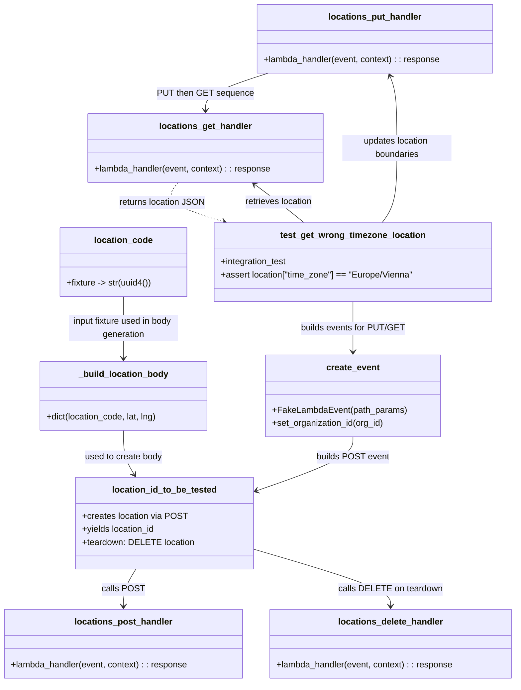

# Diagram: common/location_service/location_service_tests/integration/test_location_via_lambda_time_zone.py

> Auto-generated by Obscura crawlers

## Mermaid

### SVG

<svg id="container" width="947.546875" xmlns="http://www.w3.org/2000/svg" class="classDiagram" height="1250" viewBox="0 0 947.546875 1250" role="graphics-document document" aria-roledescription="class"><g><defs><marker id="container_class-aggregationStart" class="marker aggregation class" refX="18" refY="7" markerWidth="190" markerHeight="240" orient="auto"><path d="M 18,7 L9,13 L1,7 L9,1 Z"></path></marker></defs><defs><marker id="container_class-aggregationEnd" class="marker aggregation class" refX="1" refY="7" markerWidth="20" markerHeight="28" orient="auto"><path d="M 18,7 L9,13 L1,7 L9,1 Z"></path></marker></defs><defs><marker id="container_class-extensionStart" class="marker extension class" refX="18" refY="7" markerWidth="190" markerHeight="240" orient="auto"><path d="M 1,7 L18,13 V 1 Z"></path></marker></defs><defs><marker id="container_class-extensionEnd" class="marker extension class" refX="1" refY="7" markerWidth="20" markerHeight="28" orient="auto"><path d="M 1,1 V 13 L18,7 Z"></path></marker></defs><defs><marker id="container_class-compositionStart" class="marker composition class" refX="18" refY="7" markerWidth="190" markerHeight="240" orient="auto"><path d="M 18,7 L9,13 L1,7 L9,1 Z"></path></marker></defs><defs><marker id="container_class-compositionEnd" class="marker composition class" refX="1" refY="7" markerWidth="20" markerHeight="28" orient="auto"><path d="M 18,7 L9,13 L1,7 L9,1 Z"></path></marker></defs><defs><marker id="container_class-dependencyStart" class="marker dependency class" refX="6" refY="7" markerWidth="190" markerHeight="240" orient="auto"><path d="M 5,7 L9,13 L1,7 L9,1 Z"></path></marker></defs><defs><marker id="container_class-dependencyEnd" class="marker dependency class" refX="13" refY="7" markerWidth="20" markerHeight="28" orient="auto"><path d="M 18,7 L9,13 L14,7 L9,1 Z"></path></marker></defs><defs><marker id="container_class-lollipopStart" class="marker lollipop class" refX="13" refY="7" markerWidth="190" markerHeight="240" orient="auto"><circle stroke="black" fill="transparent" cx="7" cy="7" r="6"></circle></marker></defs><defs><marker id="container_class-lollipopEnd" class="marker lollipop class" refX="1" refY="7" markerWidth="190" markerHeight="240" orient="auto"><circle stroke="black" fill="transparent" cx="7" cy="7" r="6"></circle></marker></defs><g class="root"><g class="clusters"></g><g class="edgePaths"><path d="M226.734,788L226.734,796.167C226.734,804.333,226.734,820.667,230.143,834.158C233.551,847.649,240.368,858.298,243.777,863.622L247.185,868.947" id="id__build_location_body_location_id_to_be_tested_1" class="edge-thickness-normal edge-pattern-solid relation" style=";;;" data-edge="true" data-et="edge" data-id="id__build_location_body_location_id_to_be_tested_1" data-points="W3sieCI6MjI2LjczNDM3NSwieSI6Nzg4fSx7IngiOjIyNi43MzQzNzUsInkiOjgzN30seyJ4IjoyNTAuNDIwMTgwMTM5NDYyODEsInkiOjg3NH1d" marker-end="url(#container_class-dependencyEnd)"></path><path d="M649.652,800L649.652,806.167C649.652,812.333,649.652,824.667,619.427,841.42C589.202,858.173,528.752,879.347,498.527,889.933L468.301,900.52" id="id_create_event_location_id_to_be_tested_2" class="edge-thickness-normal edge-pattern-solid relation" style=";;;" data-edge="true" data-et="edge" data-id="id_create_event_location_id_to_be_tested_2" data-points="W3sieCI6NjQ5LjY1MjM0Mzc1LCJ5Ijo4MDB9LHsieCI6NjQ5LjY1MjM0Mzc1LCJ5Ijo4Mzd9LHsieCI6NDYyLjYzODY3MTg3NSwieSI6OTAyLjUwMzE1NzU5NzE3MzJ9XQ==" marker-end="url(#container_class-dependencyEnd)"></path><path d="M250.42,1042L246.473,1048.167C242.525,1054.333,234.63,1066.667,230.682,1078C226.734,1089.333,226.734,1099.667,226.734,1104.833L226.734,1110" id="id_location_id_to_be_tested_locations_post_handler_3" class="edge-thickness-normal edge-pattern-solid relation" style=";;;" data-edge="true" data-et="edge" data-id="id_location_id_to_be_tested_locations_post_handler_3" data-points="W3sieCI6MjUwLjQyMDE4MDEzOTQ2MjgxLCJ5IjoxMDQyfSx7IngiOjIyNi43MzQzNzUsInkiOjEwNzl9LHsieCI6MjI2LjczNDM3NSwieSI6MTExNn1d" marker-end="url(#container_class-dependencyEnd)"></path><path d="M462.639,1004.386L505.117,1016.821C547.595,1029.257,632.551,1054.129,675.03,1071.731C717.508,1089.333,717.508,1099.667,717.508,1104.833L717.508,1110" id="id_location_id_to_be_tested_locations_delete_handler_4" class="edge-thickness-normal edge-pattern-solid relation" style=";;;" data-edge="true" data-et="edge" data-id="id_location_id_to_be_tested_locations_delete_handler_4" data-points="W3sieCI6NDYyLjYzODY3MTg3NSwieSI6MTAwNC4zODU3MDYyNTIzMzMyfSx7IngiOjcxNy41MDc4MTI1LCJ5IjoxMDc5fSx7IngiOjcxNy41MDc4MTI1LCJ5IjoxMTE2fV0=" marker-end="url(#container_class-dependencyEnd)"></path><path d="M649.652,552L649.652,560.167C649.652,568.333,649.652,584.667,649.652,600C649.652,615.333,649.652,629.667,649.652,636.833L649.652,644" id="id_test_get_wrong_timezone_location_create_event_5" class="edge-thickness-normal edge-pattern-solid relation" style=";;;" data-edge="true" data-et="edge" data-id="id_test_get_wrong_timezone_location_create_event_5" data-points="W3sieCI6NjQ5LjY1MjM0Mzc1LCJ5Ijo1NTJ9LHsieCI6NjQ5LjY1MjM0Mzc1LCJ5Ijo2MDF9LHsieCI6NjQ5LjY1MjM0Mzc1LCJ5Ijo2NTB9XQ==" marker-end="url(#container_class-dependencyEnd)"></path><path d="M704.788,408L709.51,401.833C714.232,395.667,723.677,383.333,728.399,360.5C733.121,337.667,733.121,304.333,733.121,271C733.121,237.667,733.121,204.333,730.933,182.423C728.744,160.512,724.367,150.025,722.179,144.781L719.99,139.537" id="id_test_get_wrong_timezone_location_locations_put_handler_6" class="edge-thickness-normal edge-pattern-solid relation" style=";;;" data-edge="true" data-et="edge" data-id="id_test_get_wrong_timezone_location_locations_put_handler_6" data-points="W3sieCI6NzA0Ljc4NzY2NDg1MDkxNzQsInkiOjQwOH0seyJ4Ijo3MzMuMTIxMDkzNzUsInkiOjM3MX0seyJ4Ijo3MzMuMTIxMDkzNzUsInkiOjI3MX0seyJ4Ijo3MzMuMTIxMDkzNzUsInkiOjE3MX0seyJ4Ijo3MTcuNjc5Mzc1LCJ5IjoxMzR9XQ==" marker-end="url(#container_class-dependencyEnd)"></path><path d="M561.139,408L553.558,401.833C545.977,395.667,530.814,383.333,515.771,371.598C500.729,359.863,485.805,348.726,478.343,343.157L470.881,337.589" id="id_test_get_wrong_timezone_location_locations_get_handler_7" class="edge-thickness-normal edge-pattern-solid relation" style=";;;" data-edge="true" data-et="edge" data-id="id_test_get_wrong_timezone_location_locations_get_handler_7" data-points="W3sieCI6NTYxLjEzODU4MjI4MjExMDEsInkiOjQwOH0seyJ4Ijo1MTUuNjUyMzQzNzUsInkiOjM3MX0seyJ4Ijo0NjYuMDcyMzQzNzUsInkiOjMzNH1d" marker-end="url(#container_class-dependencyEnd)"></path><path d="M496.254,134L477.154,140.167C458.053,146.333,419.853,158.667,400.753,170C381.652,181.333,381.652,191.667,381.652,196.833L381.652,202" id="id_locations_put_handler_locations_get_handler_8" class="edge-thickness-normal edge-pattern-solid relation" style=";;;" data-edge="true" data-et="edge" data-id="id_locations_put_handler_locations_get_handler_8" data-points="W3sieCI6NDk2LjI1NDA2MjUwMDAwMDAzLCJ5IjoxMzR9LHsieCI6MzgxLjY1MjM0Mzc1LCJ5IjoxNzF9LHsieCI6MzgxLjY1MjM0Mzc1LCJ5IjoyMDh9XQ==" marker-end="url(#container_class-dependencyEnd)"></path><path d="M330.827,334L325.852,340.167C320.877,346.333,310.927,358.667,324.723,370.702C338.52,382.737,376.064,394.473,394.836,400.341L413.608,406.21" id="id_locations_get_handler_test_get_wrong_timezone_location_9" class="edge-thickness-normal edge-pattern-dashed relation" style=";;;" data-edge="true" data-et="edge" data-id="id_locations_get_handler_test_get_wrong_timezone_location_9" data-points="W3sieCI6MzMwLjgyNjYwMTU2MjUsInkiOjMzNH0seyJ4IjozMDAuOTc2NTYyNSwieSI6MzcxfSx7IngiOjQxOS4zMzQzOTY1MDIyOTM1NCwieSI6NDA4fV0=" marker-end="url(#container_class-dependencyEnd)"></path><path d="M226.734,543L226.734,552.667C226.734,562.333,226.734,581.667,226.734,600.5C226.734,619.333,226.734,637.667,226.734,646.833L226.734,656" id="id_location_code__build_location_body_10" class="edge-thickness-normal edge-pattern-solid relation" style=";;;" data-edge="true" data-et="edge" data-id="id_location_code__build_location_body_10" data-points="W3sieCI6MjI2LjczNDM3NSwieSI6NTQzfSx7IngiOjIyNi43MzQzNzUsInkiOjYwMX0seyJ4IjoyMjYuNzM0Mzc1LCJ5Ijo2NjJ9XQ==" marker-end="url(#container_class-dependencyEnd)"></path></g><g class="edgeLabels"><g class="edgeLabel" transform="translate(226.734375, 837)"><g class="label" data-id="id__build_location_body_location_id_to_be_tested_1" transform="translate(-71.9140625, -12)"><foreignObject width="143.828125" height="24">

used to create body

</foreignObject></g></g><g class="edgeLabel" transform="translate(649.65234375, 837)"><g class="label" data-id="id_create_event_location_id_to_be_tested_2" transform="translate(-65.40625, -12)"><foreignObject width="130.8125" height="24">

builds POST event

</foreignObject></g></g><g class="edgeLabel" transform="translate(226.734375, 1079)"><g class="label" data-id="id_location_id_to_be_tested_locations_post_handler_3" transform="translate(-37.0703125, -12)"><foreignObject width="74.140625" height="24">

calls POST

</foreignObject></g></g><g class="edgeLabel" transform="translate(717.5078125, 1079)"><g class="label" data-id="id_location_id_to_be_tested_locations_delete_handler_4" transform="translate(-92.40625, -12)"><foreignObject width="184.8125" height="24">

calls DELETE on teardown

</foreignObject></g></g><g class="edgeLabel" transform="translate(649.65234375, 601)"><g class="label" data-id="id_test_get_wrong_timezone_location_create_event_5" transform="translate(-94.2578125, -12)"><foreignObject width="188.515625" height="24">

builds events for PUT/GET

</foreignObject></g></g><g class="edgeLabel" transform="translate(733.12109375, 271)"><g class="label" data-id="id_test_get_wrong_timezone_location_locations_put_handler_6" transform="translate(-100, -24)"><foreignObject width="200" height="48">

updates location boundaries

</foreignObject></g></g><g class="edgeLabel" transform="translate(515.65234375, 371)"><g class="label" data-id="id_test_get_wrong_timezone_location_locations_get_handler_7" transform="translate(-63.46875, -12)"><foreignObject width="126.9375" height="24">

retrieves location

</foreignObject></g></g><g class="edgeLabel" transform="translate(381.65234375, 171)"><g class="label" data-id="id_locations_put_handler_locations_get_handler_8" transform="translate(-85.140625, -12)"><foreignObject width="170.28125" height="24">

PUT then GET sequence

</foreignObject></g></g><g class="edgeLabel" transform="translate(300.9765625, 371)"><g class="label" data-id="id_locations_get_handler_test_get_wrong_timezone_location_9" transform="translate(-77.8828125, -12)"><foreignObject width="155.765625" height="24">

returns location JSON

</foreignObject></g></g><g class="edgeLabel" transform="translate(226.734375, 601)"><g class="label" data-id="id_location_code__build_location_body_10" transform="translate(-100, -24)"><foreignObject width="200" height="48">

input fixture used in body generation

</foreignObject></g></g></g><g class="nodes"><g class="node default" id="classId-_build_location_body-0" transform="translate(226.734375, 725)"><g class="basic label-container"><path d="M-154.4140625 -63 L154.4140625 -63 L154.4140625 63 L-154.4140625 63" stroke="none" stroke-width="0" fill="#ECECFF" style=""></path><path d="M-154.4140625 -63 C-50.720666993127224 -63, 52.97272851374555 -63, 154.4140625 -63 M-154.4140625 -63 C-33.10762197794148 -63, 88.19881854411705 -63, 154.4140625 -63 M154.4140625 -63 C154.4140625 -35.53261373003072, 154.4140625 -8.065227460061429, 154.4140625 63 M154.4140625 -63 C154.4140625 -23.76566605310603, 154.4140625 15.468667893787938, 154.4140625 63 M154.4140625 63 C84.05537455431914 63, 13.696686608638288 63, -154.4140625 63 M154.4140625 63 C66.84914287102517 63, -20.71577675794967 63, -154.4140625 63 M-154.4140625 63 C-154.4140625 14.374725207613636, -154.4140625 -34.25054958477273, -154.4140625 -63 M-154.4140625 63 C-154.4140625 30.886358631713797, -154.4140625 -1.2272827365724055, -154.4140625 -63" stroke="#9370DB" stroke-width="1.3" fill="none" stroke-dasharray="0 0" style=""></path></g><g class="annotation-group text" transform="translate(0, -39)"></g><g class="label-group text" transform="translate(-79.3125, -39)"><g class="label" style="font-weight: bolder" transform="translate(0,-12)"><foreignObject width="158.625" height="24">

_build_location_body

</foreignObject></g></g><g class="members-group text" transform="translate(-142.4140625, 9)"></g><g class="methods-group text" transform="translate(-142.4140625, 39)"><g class="label" style="" transform="translate(0,-12)"><foreignObject width="205.515625" height="24">

+dict(location_code, lat, lng)

</foreignObject></g></g><g class="divider" style=""><path d="M-154.4140625 -15 C-83.90107697709954 -15, -13.38809145419907 -15, 154.4140625 -15 M-154.4140625 -15 C-59.295687100846095 -15, 35.82268829830781 -15, 154.4140625 -15" stroke="#9370DB" stroke-width="1.3" fill="none" stroke-dasharray="0 0" style=""></path></g><g class="divider" style=""><path d="M-154.4140625 9 C-50.48037766731079 9, 53.45330716537842 9, 154.4140625 9 M-154.4140625 9 C-65.78863566445406 9, 22.836791171091875 9, 154.4140625 9" stroke="#9370DB" stroke-width="1.3" fill="none" stroke-dasharray="0 0" style=""></path></g></g><g class="node default" id="classId-create_event-1" transform="translate(649.65234375, 725)"><g class="basic label-container"><path d="M-157.4765625 -75 L157.4765625 -75 L157.4765625 75 L-157.4765625 75" stroke="none" stroke-width="0" fill="#ECECFF" style=""></path><path d="M-157.4765625 -75 C-31.683213958753996 -75, 94.11013458249201 -75, 157.4765625 -75 M-157.4765625 -75 C-79.53805536521097 -75, -1.5995482304219308 -75, 157.4765625 -75 M157.4765625 -75 C157.4765625 -36.609622687695804, 157.4765625 1.7807546246083916, 157.4765625 75 M157.4765625 -75 C157.4765625 -24.36338869685264, 157.4765625 26.273222606294723, 157.4765625 75 M157.4765625 75 C39.54033352446888 75, -78.39589545106224 75, -157.4765625 75 M157.4765625 75 C54.83568571028731 75, -47.805191079425384 75, -157.4765625 75 M-157.4765625 75 C-157.4765625 43.152872869262836, -157.4765625 11.30574573852568, -157.4765625 -75 M-157.4765625 75 C-157.4765625 17.908543603840535, -157.4765625 -39.18291279231893, -157.4765625 -75" stroke="#9370DB" stroke-width="1.3" fill="none" stroke-dasharray="0 0" style=""></path></g><g class="annotation-group text" transform="translate(0, -51)"></g><g class="label-group text" transform="translate(-47.234375, -51)"><g class="label" style="font-weight: bolder" transform="translate(0,-12)"><foreignObject width="94.46875" height="24">

create_event

</foreignObject></g></g><g class="members-group text" transform="translate(-145.4765625, -3)"></g><g class="methods-group text" transform="translate(-145.4765625, 27)"><g class="label" style="" transform="translate(0,-12)"><foreignObject width="243.71875" height="24">

+FakeLambdaEvent(path_params)

</foreignObject></g><g class="label" style="" transform="translate(0,12)"><foreignObject width="207.140625" height="24">

+set_organization_id(org_id)

</foreignObject></g></g><g class="divider" style=""><path d="M-157.4765625 -27 C-61.79419902609037 -27, 33.888164447819264 -27, 157.4765625 -27 M-157.4765625 -27 C-58.294248962047305 -27, 40.88806457590539 -27, 157.4765625 -27" stroke="#9370DB" stroke-width="1.3" fill="none" stroke-dasharray="0 0" style=""></path></g><g class="divider" style=""><path d="M-157.4765625 -3 C-46.53427146771219 -3, 64.40801956457562 -3, 157.4765625 -3 M-157.4765625 -3 C-51.53800302083367 -3, 54.40055645833266 -3, 157.4765625 -3" stroke="#9370DB" stroke-width="1.3" fill="none" stroke-dasharray="0 0" style=""></path></g></g><g class="node default" id="classId-location_code-2" transform="translate(226.734375, 480)"><g class="basic label-container"><path d="M-116.9296875 -63 L116.9296875 -63 L116.9296875 63 L-116.9296875 63" stroke="none" stroke-width="0" fill="#ECECFF" style=""></path><path d="M-116.9296875 -63 C-43.248837945584086 -63, 30.43201160883183 -63, 116.9296875 -63 M-116.9296875 -63 C-48.12753686689737 -63, 20.674613766205255 -63, 116.9296875 -63 M116.9296875 -63 C116.9296875 -32.4539308875065, 116.9296875 -1.9078617750130036, 116.9296875 63 M116.9296875 -63 C116.9296875 -13.291355125715121, 116.9296875 36.41728974856976, 116.9296875 63 M116.9296875 63 C48.29669840039264 63, -20.336290699214715 63, -116.9296875 63 M116.9296875 63 C29.51772415227603 63, -57.89423919544794 63, -116.9296875 63 M-116.9296875 63 C-116.9296875 30.497052421638138, -116.9296875 -2.0058951567237244, -116.9296875 -63 M-116.9296875 63 C-116.9296875 13.023835798760125, -116.9296875 -36.95232840247975, -116.9296875 -63" stroke="#9370DB" stroke-width="1.3" fill="none" stroke-dasharray="0 0" style=""></path></g><g class="annotation-group text" transform="translate(0, -39)"></g><g class="label-group text" transform="translate(-51.34375, -39)"><g class="label" style="font-weight: bolder" transform="translate(0,-12)"><foreignObject width="102.6875" height="24">

location_code

</foreignObject></g></g><g class="members-group text" transform="translate(-104.9296875, 9)"></g><g class="methods-group text" transform="translate(-104.9296875, 39)"><g class="label" style="" transform="translate(0,-12)"><foreignObject width="158.515625" height="24">

+fixture -&gt; str(uuid4())

</foreignObject></g></g><g class="divider" style=""><path d="M-116.9296875 -15 C-26.749341826879785 -15, 63.43100384624043 -15, 116.9296875 -15 M-116.9296875 -15 C-42.408713951545806 -15, 32.11225959690839 -15, 116.9296875 -15" stroke="#9370DB" stroke-width="1.3" fill="none" stroke-dasharray="0 0" style=""></path></g><g class="divider" style=""><path d="M-116.9296875 9 C-49.7524067918914 9, 17.424873916217194 9, 116.9296875 9 M-116.9296875 9 C-53.640123684667024 9, 9.649440130665951 9, 116.9296875 9" stroke="#9370DB" stroke-width="1.3" fill="none" stroke-dasharray="0 0" style=""></path></g></g><g class="node default" id="classId-location_id_to_be_tested-3" transform="translate(304.193359375, 958)"><g class="basic label-container"><path d="M-158.4453125 -84 L158.4453125 -84 L158.4453125 84 L-158.4453125 84" stroke="none" stroke-width="0" fill="#ECECFF" style=""></path><path d="M-158.4453125 -84 C-57.995852918780116 -84, 42.45360666243977 -84, 158.4453125 -84 M-158.4453125 -84 C-80.01800626915575 -84, -1.5907000383114962 -84, 158.4453125 -84 M158.4453125 -84 C158.4453125 -24.320104470790326, 158.4453125 35.35979105841935, 158.4453125 84 M158.4453125 -84 C158.4453125 -24.648750431688285, 158.4453125 34.70249913662343, 158.4453125 84 M158.4453125 84 C64.986237165617 84, -28.472838168766003 84, -158.4453125 84 M158.4453125 84 C69.97063435360812 84, -18.50404379278376 84, -158.4453125 84 M-158.4453125 84 C-158.4453125 20.24427022912767, -158.4453125 -43.51145954174466, -158.4453125 -84 M-158.4453125 84 C-158.4453125 31.3396819548132, -158.4453125 -21.320636090373597, -158.4453125 -84" stroke="#9370DB" stroke-width="1.3" fill="none" stroke-dasharray="0 0" style=""></path></g><g class="annotation-group text" transform="translate(0, -60)"></g><g class="label-group text" transform="translate(-93.03125, -60)"><g class="label" style="font-weight: bolder" transform="translate(0,-12)"><foreignObject width="186.0625" height="24">

location_id_to_be_tested

</foreignObject></g></g><g class="members-group text" transform="translate(-146.4453125, -12)"><g class="label" style="" transform="translate(0,-12)"><foreignObject width="190.296875" height="24">

+creates location via POST

</foreignObject></g><g class="label" style="" transform="translate(0,12)"><foreignObject width="136.375" height="24">

+yields location_id

</foreignObject></g><g class="label" style="" transform="translate(0,36)"><foreignObject width="199.859375" height="24">

+teardown: DELETE location

</foreignObject></g></g><g class="methods-group text" transform="translate(-146.4453125, 84)"></g><g class="divider" style=""><path d="M-158.4453125 -36 C-89.96039994537695 -36, -21.475487390753898 -36, 158.4453125 -36 M-158.4453125 -36 C-38.64469475278929 -36, 81.15592299442142 -36, 158.4453125 -36" stroke="#9370DB" stroke-width="1.3" fill="none" stroke-dasharray="0 0" style=""></path></g><g class="divider" style=""><path d="M-158.4453125 60 C-55.68922970441106 60, 47.066853091177876 60, 158.4453125 60 M-158.4453125 60 C-37.11624138646319 60, 84.21282972707363 60, 158.4453125 60" stroke="#9370DB" stroke-width="1.3" fill="none" stroke-dasharray="0 0" style=""></path></g></g><g class="node default" id="classId-locations_post_handler-4" transform="translate(226.734375, 1179)"><g class="basic label-container"><path d="M-218.734375 -63 L218.734375 -63 L218.734375 63 L-218.734375 63" stroke="none" stroke-width="0" fill="#ECECFF" style=""></path><path d="M-218.734375 -63 C-110.44344379381202 -63, -2.152512587624045 -63, 218.734375 -63 M-218.734375 -63 C-60.80370955680843 -63, 97.12695588638314 -63, 218.734375 -63 M218.734375 -63 C218.734375 -30.24368050311933, 218.734375 2.5126389937613425, 218.734375 63 M218.734375 -63 C218.734375 -14.533553113353108, 218.734375 33.932893773293785, 218.734375 63 M218.734375 63 C116.89289383067683 63, 15.051412661353652 63, -218.734375 63 M218.734375 63 C85.4894437290557 63, -47.75548754188861 63, -218.734375 63 M-218.734375 63 C-218.734375 21.00302041263079, -218.734375 -20.99395917473842, -218.734375 -63 M-218.734375 63 C-218.734375 14.21613573499971, -218.734375 -34.56772853000058, -218.734375 -63" stroke="#9370DB" stroke-width="1.3" fill="none" stroke-dasharray="0 0" style=""></path></g><g class="annotation-group text" transform="translate(0, -39)"></g><g class="label-group text" transform="translate(-86.578125, -39)"><g class="label" style="font-weight: bolder" transform="translate(0,-12)"><foreignObject width="173.15625" height="24">

locations_post_handler

</foreignObject></g></g><g class="members-group text" transform="translate(-206.734375, 9)"></g><g class="methods-group text" transform="translate(-206.734375, 39)"><g class="label" style="" transform="translate(0,-12)"><foreignObject width="326.890625" height="24">

+lambda_handler(event, context) : : response

</foreignObject></g></g><g class="divider" style=""><path d="M-218.734375 -15 C-61.23248623158693 -15, 96.26940253682614 -15, 218.734375 -15 M-218.734375 -15 C-46.75701123317509 -15, 125.22035253364982 -15, 218.734375 -15" stroke="#9370DB" stroke-width="1.3" fill="none" stroke-dasharray="0 0" style=""></path></g><g class="divider" style=""><path d="M-218.734375 9 C-48.13255520769033 9, 122.46926458461934 9, 218.734375 9 M-218.734375 9 C-72.81829939309893 9, 73.09777621380215 9, 218.734375 9" stroke="#9370DB" stroke-width="1.3" fill="none" stroke-dasharray="0 0" style=""></path></g></g><g class="node default" id="classId-locations_put_handler-5" transform="translate(691.38671875, 71)"><g class="basic label-container"><path d="M-216.75390625 -63 L216.75390625 -63 L216.75390625 63 L-216.75390625 63" stroke="none" stroke-width="0" fill="#ECECFF" style=""></path><path d="M-216.75390625 -63 C-59.32657474422314 -63, 98.10075676155373 -63, 216.75390625 -63 M-216.75390625 -63 C-58.10704084083875 -63, 100.5398245683225 -63, 216.75390625 -63 M216.75390625 -63 C216.75390625 -30.69209519345064, 216.75390625 1.615809613098719, 216.75390625 63 M216.75390625 -63 C216.75390625 -18.68885374345257, 216.75390625 25.622292513094862, 216.75390625 63 M216.75390625 63 C92.72698097511672 63, -31.299944299766565 63, -216.75390625 63 M216.75390625 63 C71.37608557245468 63, -74.00173510509063 63, -216.75390625 63 M-216.75390625 63 C-216.75390625 33.400506635615656, -216.75390625 3.8010132712313123, -216.75390625 -63 M-216.75390625 63 C-216.75390625 30.83535902247096, -216.75390625 -1.3292819550580788, -216.75390625 -63" stroke="#9370DB" stroke-width="1.3" fill="none" stroke-dasharray="0 0" style=""></path></g><g class="annotation-group text" transform="translate(0, -39)"></g><g class="label-group text" transform="translate(-82.6171875, -39)"><g class="label" style="font-weight: bolder" transform="translate(0,-12)"><foreignObject width="165.234375" height="24">

locations_put_handler

</foreignObject></g></g><g class="members-group text" transform="translate(-204.75390625, 9)"></g><g class="methods-group text" transform="translate(-204.75390625, 39)"><g class="label" style="" transform="translate(0,-12)"><foreignObject width="326.890625" height="24">

+lambda_handler(event, context) : : response

</foreignObject></g></g><g class="divider" style=""><path d="M-216.75390625 -15 C-63.03172943248302 -15, 90.69044738503396 -15, 216.75390625 -15 M-216.75390625 -15 C-56.29608379638441 -15, 104.16173865723118 -15, 216.75390625 -15" stroke="#9370DB" stroke-width="1.3" fill="none" stroke-dasharray="0 0" style=""></path></g><g class="divider" style=""><path d="M-216.75390625 9 C-104.78529359477143 9, 7.183319060457137 9, 216.75390625 9 M-216.75390625 9 C-76.18168878080198 9, 64.39052868839605 9, 216.75390625 9" stroke="#9370DB" stroke-width="1.3" fill="none" stroke-dasharray="0 0" style=""></path></g></g><g class="node default" id="classId-locations_get_handler-6" transform="translate(381.65234375, 271)"><g class="basic label-container"><path d="M-216.46875 -63 L216.46875 -63 L216.46875 63 L-216.46875 63" stroke="none" stroke-width="0" fill="#ECECFF" style=""></path><path d="M-216.46875 -63 C-67.40270275167123 -63, 81.66334449665754 -63, 216.46875 -63 M-216.46875 -63 C-99.90421827922545 -63, 16.660313441549107 -63, 216.46875 -63 M216.46875 -63 C216.46875 -35.16787101592219, 216.46875 -7.335742031844383, 216.46875 63 M216.46875 -63 C216.46875 -22.155812274262594, 216.46875 18.688375451474812, 216.46875 63 M216.46875 63 C61.65682447167816 63, -93.15510105664367 63, -216.46875 63 M216.46875 63 C89.75245750335772 63, -36.963834993284564 63, -216.46875 63 M-216.46875 63 C-216.46875 36.38517886354164, -216.46875 9.770357727083287, -216.46875 -63 M-216.46875 63 C-216.46875 36.008780828344975, -216.46875 9.01756165668995, -216.46875 -63" stroke="#9370DB" stroke-width="1.3" fill="none" stroke-dasharray="0 0" style=""></path></g><g class="annotation-group text" transform="translate(0, -39)"></g><g class="label-group text" transform="translate(-82.046875, -39)"><g class="label" style="font-weight: bolder" transform="translate(0,-12)"><foreignObject width="164.09375" height="24">

locations_get_handler

</foreignObject></g></g><g class="members-group text" transform="translate(-204.46875, 9)"></g><g class="methods-group text" transform="translate(-204.46875, 39)"><g class="label" style="" transform="translate(0,-12)"><foreignObject width="326.890625" height="24">

+lambda_handler(event, context) : : response

</foreignObject></g></g><g class="divider" style=""><path d="M-216.46875 -15 C-62.802808412695384 -15, 90.86313317460923 -15, 216.46875 -15 M-216.46875 -15 C-95.81499826278971 -15, 24.83875347442057 -15, 216.46875 -15" stroke="#9370DB" stroke-width="1.3" fill="none" stroke-dasharray="0 0" style=""></path></g><g class="divider" style=""><path d="M-216.46875 9 C-119.99071857994105 9, -23.51268715988209 9, 216.46875 9 M-216.46875 9 C-66.93217655101412 9, 82.60439689797175 9, 216.46875 9" stroke="#9370DB" stroke-width="1.3" fill="none" stroke-dasharray="0 0" style=""></path></g></g><g class="node default" id="classId-locations_delete_handler-7" transform="translate(717.5078125, 1179)"><g class="basic label-container"><path d="M-222.0390625 -63 L222.0390625 -63 L222.0390625 63 L-222.0390625 63" stroke="none" stroke-width="0" fill="#ECECFF" style=""></path><path d="M-222.0390625 -63 C-71.03507904630575 -63, 79.9689044073885 -63, 222.0390625 -63 M-222.0390625 -63 C-88.58941549597898 -63, 44.860231508042034 -63, 222.0390625 -63 M222.0390625 -63 C222.0390625 -36.748210817686264, 222.0390625 -10.496421635372528, 222.0390625 63 M222.0390625 -63 C222.0390625 -28.325492338693955, 222.0390625 6.34901532261209, 222.0390625 63 M222.0390625 63 C103.61813407625648 63, -14.802794347487037 63, -222.0390625 63 M222.0390625 63 C129.3222037328907 63, 36.6053449657814 63, -222.0390625 63 M-222.0390625 63 C-222.0390625 17.02027629080343, -222.0390625 -28.95944741839314, -222.0390625 -63 M-222.0390625 63 C-222.0390625 18.23167353818942, -222.0390625 -26.536652923621162, -222.0390625 -63" stroke="#9370DB" stroke-width="1.3" fill="none" stroke-dasharray="0 0" style=""></path></g><g class="annotation-group text" transform="translate(0, -39)"></g><g class="label-group text" transform="translate(-93.1875, -39)"><g class="label" style="font-weight: bolder" transform="translate(0,-12)"><foreignObject width="186.375" height="24">

locations_delete_handler

</foreignObject></g></g><g class="members-group text" transform="translate(-210.0390625, 9)"></g><g class="methods-group text" transform="translate(-210.0390625, 39)"><g class="label" style="" transform="translate(0,-12)"><foreignObject width="326.890625" height="24">

+lambda_handler(event, context) : : response

</foreignObject></g></g><g class="divider" style=""><path d="M-222.0390625 -15 C-83.98335753163997 -15, 54.072347436720065 -15, 222.0390625 -15 M-222.0390625 -15 C-93.8972892694627 -15, 34.24448396107459 -15, 222.0390625 -15" stroke="#9370DB" stroke-width="1.3" fill="none" stroke-dasharray="0 0" style=""></path></g><g class="divider" style=""><path d="M-222.0390625 9 C-90.77184423616399 9, 40.49537402767203 9, 222.0390625 9 M-222.0390625 9 C-124.9603245224558 9, -27.881586544911613 9, 222.0390625 9" stroke="#9370DB" stroke-width="1.3" fill="none" stroke-dasharray="0 0" style=""></path></g></g><g class="node default" id="classId-test_get_wrong_timezone_location-8" transform="translate(649.65234375, 480)"><g class="basic label-container"><path d="M-255.98828125 -72 L255.98828125 -72 L255.98828125 72 L-255.98828125 72" stroke="none" stroke-width="0" fill="#ECECFF" style=""></path><path d="M-255.98828125 -72 C-86.1266491958828 -72, 83.73498285823439 -72, 255.98828125 -72 M-255.98828125 -72 C-132.42811025872206 -72, -8.867939267444115 -72, 255.98828125 -72 M255.98828125 -72 C255.98828125 -20.00222310529177, 255.98828125 31.995553789416462, 255.98828125 72 M255.98828125 -72 C255.98828125 -22.244301309273503, 255.98828125 27.511397381452994, 255.98828125 72 M255.98828125 72 C121.93646719321328 72, -12.11534686357345 72, -255.98828125 72 M255.98828125 72 C143.59963347289005 72, 31.210985695780124 72, -255.98828125 72 M-255.98828125 72 C-255.98828125 18.118905429357014, -255.98828125 -35.76218914128597, -255.98828125 -72 M-255.98828125 72 C-255.98828125 34.38112472533865, -255.98828125 -3.2377505493226977, -255.98828125 -72" stroke="#9370DB" stroke-width="1.3" fill="none" stroke-dasharray="0 0" style=""></path></g><g class="annotation-group text" transform="translate(0, -48)"></g><g class="label-group text" transform="translate(-128.5078125, -48)"><g class="label" style="font-weight: bolder" transform="translate(0,-12)"><foreignObject width="257.015625" height="24">

test_get_wrong_timezone_location

</foreignObject></g></g><g class="members-group text" transform="translate(-243.98828125, 0)"><g class="label" style="" transform="translate(0,-12)"><foreignObject width="123.28125" height="24">

+integration_test

</foreignObject></g><g class="label" style="" transform="translate(0,12)"><foreignObject width="359.46875" height="24">

+assert location["time_zone"] == "Europe/Vienna"

</foreignObject></g></g><g class="methods-group text" transform="translate(-243.98828125, 72)"></g><g class="divider" style=""><path d="M-255.98828125 -24 C-77.65172897009973 -24, 100.68482330980055 -24, 255.98828125 -24 M-255.98828125 -24 C-70.03893659422329 -24, 115.91040806155343 -24, 255.98828125 -24" stroke="#9370DB" stroke-width="1.3" fill="none" stroke-dasharray="0 0" style=""></path></g><g class="divider" style=""><path d="M-255.98828125 48 C-146.92356094778484 48, -37.8588406455697 48, 255.98828125 48 M-255.98828125 48 C-108.08520036397374 48, 39.81788052205252 48, 255.98828125 48" stroke="#9370DB" stroke-width="1.3" fill="none" stroke-dasharray="0 0" style=""></path></g></g></g></g></g></svg>
