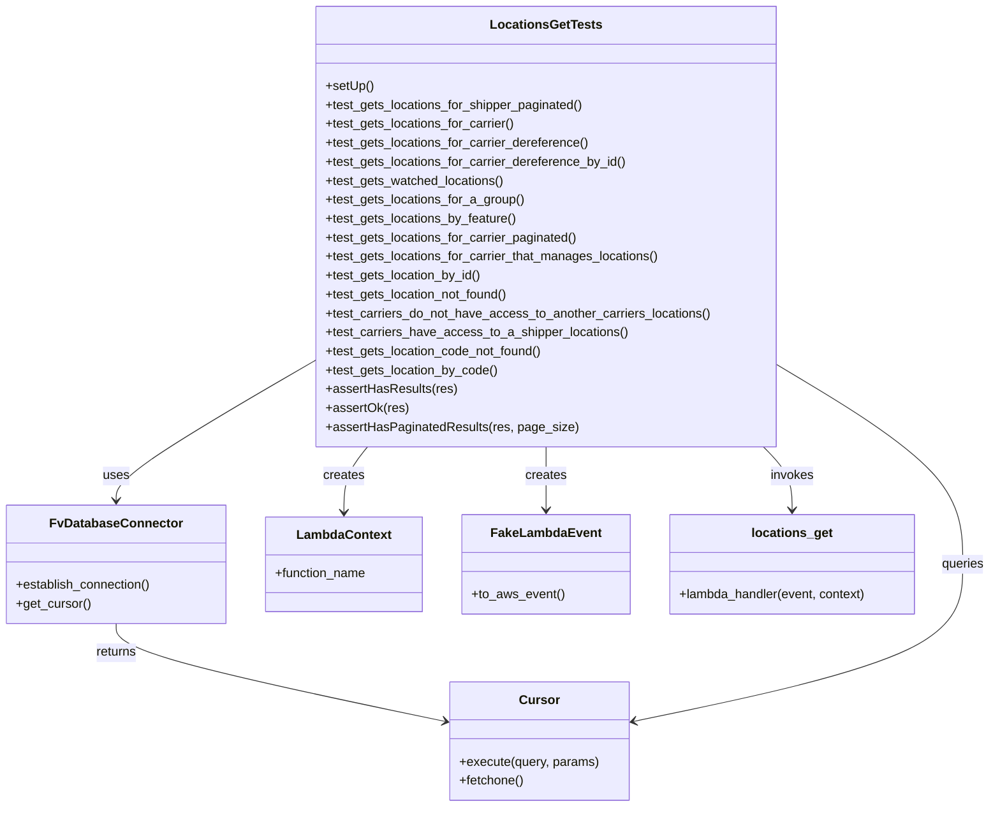
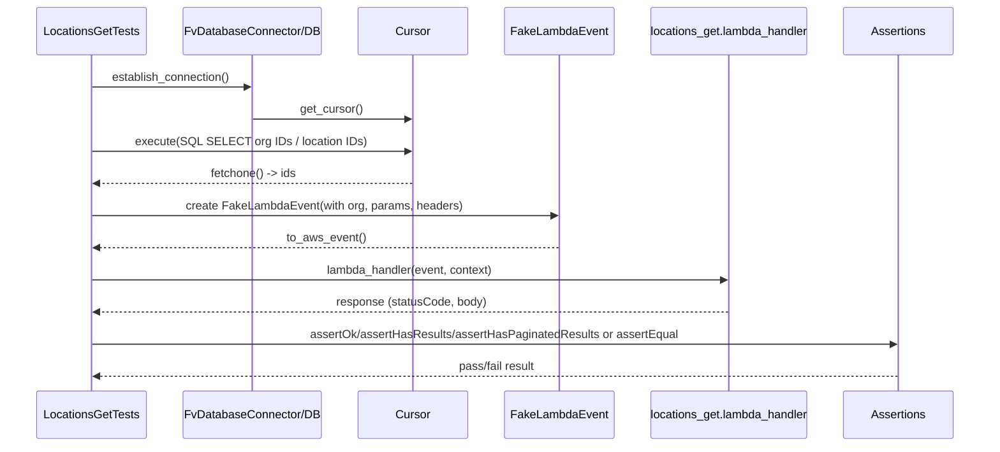

# Diagram: common/location_service/location_service_tests/integration/test_locations_get.py

> Auto-generated by Obscura crawlers

## Diagram 1

### SVG

<svg id="container" width="1250.6171875" xmlns="http://www.w3.org/2000/svg" class="classDiagram" height="1022" viewBox="0 0 1250.6171875 1022" role="graphics-document document" aria-roledescription="class"><g><defs><marker id="container_class-aggregationStart" class="marker aggregation class" refX="18" refY="7" markerWidth="190" markerHeight="240" orient="auto"><path d="M 18,7 L9,13 L1,7 L9,1 Z"></path></marker></defs><defs><marker id="container_class-aggregationEnd" class="marker aggregation class" refX="1" refY="7" markerWidth="20" markerHeight="28" orient="auto"><path d="M 18,7 L9,13 L1,7 L9,1 Z"></path></marker></defs><defs><marker id="container_class-extensionStart" class="marker extension class" refX="18" refY="7" markerWidth="190" markerHeight="240" orient="auto"><path d="M 1,7 L18,13 V 1 Z"></path></marker></defs><defs><marker id="container_class-extensionEnd" class="marker extension class" refX="1" refY="7" markerWidth="20" markerHeight="28" orient="auto"><path d="M 1,1 V 13 L18,7 Z"></path></marker></defs><defs><marker id="container_class-compositionStart" class="marker composition class" refX="18" refY="7" markerWidth="190" markerHeight="240" orient="auto"><path d="M 18,7 L9,13 L1,7 L9,1 Z"></path></marker></defs><defs><marker id="container_class-compositionEnd" class="marker composition class" refX="1" refY="7" markerWidth="20" markerHeight="28" orient="auto"><path d="M 18,7 L9,13 L1,7 L9,1 Z"></path></marker></defs><defs><marker id="container_class-dependencyStart" class="marker dependency class" refX="6" refY="7" markerWidth="190" markerHeight="240" orient="auto"><path d="M 5,7 L9,13 L1,7 L9,1 Z"></path></marker></defs><defs><marker id="container_class-dependencyEnd" class="marker dependency class" refX="13" refY="7" markerWidth="20" markerHeight="28" orient="auto"><path d="M 18,7 L9,13 L14,7 L9,1 Z"></path></marker></defs><defs><marker id="container_class-lollipopStart" class="marker lollipop class" refX="13" refY="7" markerWidth="190" markerHeight="240" orient="auto"><circle stroke="black" fill="transparent" cx="7" cy="7" r="6"></circle></marker></defs><defs><marker id="container_class-lollipopEnd" class="marker lollipop class" refX="1" refY="7" markerWidth="190" markerHeight="240" orient="auto"><circle stroke="black" fill="transparent" cx="7" cy="7" r="6"></circle></marker></defs><g class="root"><g class="clusters"></g><g class="edgePaths"><path d="M396.113,456.806L354.475,481.172C312.837,505.538,229.561,554.269,187.923,583.801C146.285,613.333,146.285,623.667,146.285,628.833L146.285,634" id="id_LocationsGetTests_FvDatabaseConnector_1" class="edge-thickness-normal edge-pattern-solid relation" style=";;;" data-edge="true" data-et="edge" data-id="id_LocationsGetTests_FvDatabaseConnector_1" data-points="W3sieCI6Mzk2LjExMzI4MTI1LCJ5Ijo0NTYuODA2Mzk3NDc2ODg4NH0seyJ4IjoxNDYuMjg1MTU2MjUsInkiOjYwM30seyJ4IjoxNDYuMjg1MTU2MjUsInkiOjY0MH1d" marker-end="url(#container_class-dependencyEnd)"></path><path d="M463.416,566L458.49,572.167C453.564,578.333,443.712,590.667,438.786,604.5C433.859,618.333,433.859,633.667,433.859,641.333L433.859,649" id="id_LocationsGetTests_LambdaContext_2" class="edge-thickness-normal edge-pattern-solid relation" style=";;;" data-edge="true" data-et="edge" data-id="id_LocationsGetTests_LambdaContext_2" data-points="W3sieCI6NDYzLjQxNjQ3MzAwMjM3MzQ0LCJ5Ijo1NjZ9LHsieCI6NDMzLjg1OTM3NSwieSI6NjAzfSx7IngiOjQzMy44NTkzNzUsInkiOjY1NX1d" marker-end="url(#container_class-dependencyEnd)"></path><path d="M686.293,566L686.293,572.167C686.293,578.333,686.293,590.667,686.293,604C686.293,617.333,686.293,631.667,686.293,638.833L686.293,646" id="id_LocationsGetTests_FakeLambdaEvent_3" class="edge-thickness-normal edge-pattern-solid relation" style=";;;" data-edge="true" data-et="edge" data-id="id_LocationsGetTests_FakeLambdaEvent_3" data-points="W3sieCI6Njg2LjI5Mjk2ODc1LCJ5Ijo1NjZ9LHsieCI6Njg2LjI5Mjk2ODc1LCJ5Ijo2MDN9LHsieCI6Njg2LjI5Mjk2ODc1LCJ5Ijo2NTJ9XQ==" marker-end="url(#container_class-dependencyEnd)"></path><path d="M959.989,566L966.038,572.167C972.087,578.333,984.186,590.667,990.236,604C996.285,617.333,996.285,631.667,996.285,638.833L996.285,646" id="id_LocationsGetTests_locations_get_4" class="edge-thickness-normal edge-pattern-solid relation" style=";;;" data-edge="true" data-et="edge" data-id="id_LocationsGetTests_locations_get_4" data-points="W3sieCI6OTU5Ljk4ODYwMjY1MDMxNjUsInkiOjU2Nn0seyJ4Ijo5OTYuMjg1MTU2MjUsInkiOjYwM30seyJ4Ijo5OTYuMjg1MTU2MjUsInkiOjY1Mn1d" marker-end="url(#container_class-dependencyEnd)"></path><path d="M146.285,790L146.285,796.167C146.285,802.333,146.285,814.667,215.658,835.369C285.03,856.07,423.775,885.141,493.148,899.676L562.52,914.211" id="id_FvDatabaseConnector_Cursor_5" class="edge-thickness-normal edge-pattern-solid relation" style=";;;" data-edge="true" data-et="edge" data-id="id_FvDatabaseConnector_Cursor_5" data-points="W3sieCI6MTQ2LjI4NTE1NjI1LCJ5Ijo3OTB9LHsieCI6MTQ2LjI4NTE1NjI1LCJ5Ijo4Mjd9LHsieCI6NTY4LjM5MjU3ODEyNSwieSI6OTE1LjQ0MTY0MzE5MDk0NDR9XQ==" marker-end="url(#container_class-dependencyEnd)"></path><path d="M976.473,460.313L1016.29,484.094C1056.107,507.875,1135.741,555.438,1175.558,597.885C1215.375,640.333,1215.375,677.667,1215.375,715C1215.375,752.333,1215.375,789.667,1146.003,822.869C1076.63,856.07,937.885,885.141,868.513,899.676L799.14,914.211" id="id_LocationsGetTests_Cursor_6" class="edge-thickness-normal edge-pattern-solid relation" style=";;;" data-edge="true" data-et="edge" data-id="id_LocationsGetTests_Cursor_6" data-points="W3sieCI6OTc2LjQ3MjY1NjI1LCJ5Ijo0NjAuMzEyOTc1NzQ2NjEzfSx7IngiOjEyMTUuMzc1LCJ5Ijo2MDN9LHsieCI6MTIxNS4zNzUsInkiOjcxNX0seyJ4IjoxMjE1LjM3NSwieSI6ODI3fSx7IngiOjc5My4yNjc1NzgxMjUsInkiOjkxNS40NDE2NDMxOTA5NDQ0fV0=" marker-end="url(#container_class-dependencyEnd)"></path></g><g class="edgeLabels"><g class="edgeLabel" transform="translate(146.28515625, 603)"><g class="label" data-id="id_LocationsGetTests_FvDatabaseConnector_1" transform="translate(-16.4921875, -12)"><foreignObject width="32.984375" height="24">

uses

</foreignObject></g></g><g class="edgeLabel" transform="translate(433.859375, 603)"><g class="label" data-id="id_LocationsGetTests_LambdaContext_2" transform="translate(-26.171875, -12)"><foreignObject width="52.34375" height="24">

creates

</foreignObject></g></g><g class="edgeLabel" transform="translate(686.29296875, 603)"><g class="label" data-id="id_LocationsGetTests_FakeLambdaEvent_3" transform="translate(-26.171875, -12)"><foreignObject width="52.34375" height="24">

creates

</foreignObject></g></g><g class="edgeLabel" transform="translate(996.28515625, 603)"><g class="label" data-id="id_LocationsGetTests_locations_get_4" transform="translate(-27.5859375, -12)"><foreignObject width="55.171875" height="24">

invokes

</foreignObject></g></g><g class="edgeLabel" transform="translate(146.28515625, 827)"><g class="label" data-id="id_FvDatabaseConnector_Cursor_5" transform="translate(-26.265625, -12)"><foreignObject width="52.53125" height="24">

returns

</foreignObject></g></g><g class="edgeLabel" transform="translate(1215.375, 715)"><g class="label" data-id="id_LocationsGetTests_Cursor_6" transform="translate(-27.2421875, -12)"><foreignObject width="54.484375" height="24">

queries

</foreignObject></g></g></g><g class="nodes"><g class="node default" id="classId-LocationsGetTests-0" transform="translate(686.29296875, 287)"><g class="basic label-container"><path d="M-290.1796875 -279 L290.1796875 -279 L290.1796875 279 L-290.1796875 279" stroke="none" stroke-width="0" fill="#ECECFF" style=""></path><path d="M-290.1796875 -279 C-101.50038526733161 -279, 87.17891696533678 -279, 290.1796875 -279 M-290.1796875 -279 C-145.68855809678678 -279, -1.1974286935735563 -279, 290.1796875 -279 M290.1796875 -279 C290.1796875 -99.72509184371734, 290.1796875 79.54981631256533, 290.1796875 279 M290.1796875 -279 C290.1796875 -121.12270222491892, 290.1796875 36.75459555016215, 290.1796875 279 M290.1796875 279 C81.30848460944233 279, -127.56271828111534 279, -290.1796875 279 M290.1796875 279 C76.12388309777532 279, -137.93192130444936 279, -290.1796875 279 M-290.1796875 279 C-290.1796875 102.70882774517287, -290.1796875 -73.58234450965426, -290.1796875 -279 M-290.1796875 279 C-290.1796875 146.88539904085803, -290.1796875 14.770798081716066, -290.1796875 -279" stroke="#9370DB" stroke-width="1.3" fill="none" stroke-dasharray="0 0" style=""></path></g><g class="annotation-group text" transform="translate(0, -255)"></g><g class="label-group text" transform="translate(-66.984375, -255)"><g class="label" style="font-weight: bolder" transform="translate(0,-12)"><foreignObject width="133.96875" height="24">

LocationsGetTests

</foreignObject></g></g><g class="members-group text" transform="translate(-278.1796875, -207)"></g><g class="methods-group text" transform="translate(-278.1796875, -177)"><g class="label" style="" transform="translate(0,-12)"><foreignObject width="60.421875" height="24">

+setUp()

</foreignObject></g><g class="label" style="" transform="translate(0,12)"><foreignObject width="329.109375" height="24">

+test_gets_locations_for_shipper_paginated()

</foreignObject></g><g class="label" style="" transform="translate(0,36)"><foreignObject width="241.8125" height="24">

+test_gets_locations_for_carrier()

</foreignObject></g><g class="label" style="" transform="translate(0,60)"><foreignObject width="335" height="24">

+test_gets_locations_for_carrier_dereference()

</foreignObject></g><g class="label" style="" transform="translate(0,84)"><foreignObject width="382.234375" height="24">

+test_gets_locations_for_carrier_dereference_by_id()

</foreignObject></g><g class="label" style="" transform="translate(0,108)"><foreignObject width="227.578125" height="24">

+test_gets_watched_locations()

</foreignObject></g><g class="label" style="" transform="translate(0,132)"><foreignObject width="253.203125" height="24">

+test_gets_locations_for_a_group()

</foreignObject></g><g class="label" style="" transform="translate(0,156)"><foreignObject width="243.546875" height="24">

+test_gets_locations_by_feature()

</foreignObject></g><g class="label" style="" transform="translate(0,180)"><foreignObject width="321.484375" height="24">

+test_gets_locations_for_carrier_paginated()

</foreignObject></g><g class="label" style="" transform="translate(0,204)"><foreignObject width="425.546875" height="24">

+test_gets_locations_for_carrier_that_manages_locations()

</foreignObject></g><g class="label" style="" transform="translate(0,228)"><foreignObject width="198.828125" height="24">

+test_gets_location_by_id()

</foreignObject></g><g class="label" style="" transform="translate(0,252)"><foreignObject width="234.890625" height="24">

+test_gets_location_not_found()

</foreignObject></g><g class="label" style="" transform="translate(0,276)"><foreignObject width="489.375" height="24">

+test_carriers_do_not_have_access_to_another_carriers_locations()

</foreignObject></g><g class="label" style="" transform="translate(0,300)"><foreignObject width="381.90625" height="24">

+test_carriers_have_access_to_a_shipper_locations()

</foreignObject></g><g class="label" style="" transform="translate(0,324)"><foreignObject width="277.53125" height="24">

+test_gets_location_code_not_found()

</foreignObject></g><g class="label" style="" transform="translate(0,348)"><foreignObject width="219.390625" height="24">

+test_gets_location_by_code()

</foreignObject></g><g class="label" style="" transform="translate(0,372)"><foreignObject width="163.78125" height="24">

+assertHasResults(res)

</foreignObject></g><g class="label" style="" transform="translate(0,396)"><foreignObject width="103.265625" height="24">

+assertOk(res)

</foreignObject></g><g class="label" style="" transform="translate(0,420)"><foreignObject width="313.8125" height="24">

+assertHasPaginatedResults(res, page_size)

</foreignObject></g></g><g class="divider" style=""><path d="M-290.1796875 -231 C-110.43659217397789 -231, 69.30650315204423 -231, 290.1796875 -231 M-290.1796875 -231 C-157.4020736391248 -231, -24.624459778249616 -231, 290.1796875 -231" stroke="#9370DB" stroke-width="1.3" fill="none" stroke-dasharray="0 0" style=""></path></g><g class="divider" style=""><path d="M-290.1796875 -207 C-121.53929075737736 -207, 47.10110598524528 -207, 290.1796875 -207 M-290.1796875 -207 C-118.94434094758574 -207, 52.29100560482851 -207, 290.1796875 -207" stroke="#9370DB" stroke-width="1.3" fill="none" stroke-dasharray="0 0" style=""></path></g></g><g class="node default" id="classId-FvDatabaseConnector-1" transform="translate(146.28515625, 715)"><g class="basic label-container"><path d="M-138.28515625 -75 L138.28515625 -75 L138.28515625 75 L-138.28515625 75" stroke="none" stroke-width="0" fill="#ECECFF" style=""></path><path d="M-138.28515625 -75 C-45.57088196854798 -75, 47.14339231290404 -75, 138.28515625 -75 M-138.28515625 -75 C-61.488978709975314 -75, 15.307198830049373 -75, 138.28515625 -75 M138.28515625 -75 C138.28515625 -15.80947664490158, 138.28515625 43.38104671019684, 138.28515625 75 M138.28515625 -75 C138.28515625 -30.659544916184927, 138.28515625 13.680910167630145, 138.28515625 75 M138.28515625 75 C56.10002984956971 75, -26.085096550860584 75, -138.28515625 75 M138.28515625 75 C41.93398819766476 75, -54.41717985467048 75, -138.28515625 75 M-138.28515625 75 C-138.28515625 15.284142501051285, -138.28515625 -44.43171499789743, -138.28515625 -75 M-138.28515625 75 C-138.28515625 40.61118477520302, -138.28515625 6.222369550406043, -138.28515625 -75" stroke="#9370DB" stroke-width="1.3" fill="none" stroke-dasharray="0 0" style=""></path></g><g class="annotation-group text" transform="translate(0, -51)"></g><g class="label-group text" transform="translate(-79.3046875, -51)"><g class="label" style="font-weight: bolder" transform="translate(0,-12)"><foreignObject width="158.609375" height="24">

FvDatabaseConnector

</foreignObject></g></g><g class="members-group text" transform="translate(-126.28515625, -3)"></g><g class="methods-group text" transform="translate(-126.28515625, 27)"><g class="label" style="" transform="translate(0,-12)"><foreignObject width="173.265625" height="24">

+establish_connection()

</foreignObject></g><g class="label" style="" transform="translate(0,12)"><foreignObject width="94.640625" height="24">

+get_cursor()

</foreignObject></g></g><g class="divider" style=""><path d="M-138.28515625 -27 C-53.30175641112778 -27, 31.681643427744433 -27, 138.28515625 -27 M-138.28515625 -27 C-37.56144309778712 -27, 63.16227005442576 -27, 138.28515625 -27" stroke="#9370DB" stroke-width="1.3" fill="none" stroke-dasharray="0 0" style=""></path></g><g class="divider" style=""><path d="M-138.28515625 -3 C-72.80046591285107 -3, -7.315775575702133 -3, 138.28515625 -3 M-138.28515625 -3 C-30.582778244395044 -3, 77.11959976120991 -3, 138.28515625 -3" stroke="#9370DB" stroke-width="1.3" fill="none" stroke-dasharray="0 0" style=""></path></g></g><g class="node default" id="classId-Cursor-2" transform="translate(680.830078125, 939)"><g class="basic label-container"><path d="M-112.4375 -75 L112.4375 -75 L112.4375 75 L-112.4375 75" stroke="none" stroke-width="0" fill="#ECECFF" style=""></path><path d="M-112.4375 -75 C-45.17399792337656 -75, 22.089504153246878 -75, 112.4375 -75 M-112.4375 -75 C-42.74171076522477 -75, 26.954078469550467 -75, 112.4375 -75 M112.4375 -75 C112.4375 -22.36590822416585, 112.4375 30.2681835516683, 112.4375 75 M112.4375 -75 C112.4375 -32.084809471625306, 112.4375 10.830381056749388, 112.4375 75 M112.4375 75 C55.09786397935853 75, -2.2417720412829425 75, -112.4375 75 M112.4375 75 C66.80780571331987 75, 21.17811142663973 75, -112.4375 75 M-112.4375 75 C-112.4375 34.26848922840746, -112.4375 -6.463021543185079, -112.4375 -75 M-112.4375 75 C-112.4375 36.63251561227345, -112.4375 -1.7349687754530976, -112.4375 -75" stroke="#9370DB" stroke-width="1.3" fill="none" stroke-dasharray="0 0" style=""></path></g><g class="annotation-group text" transform="translate(0, -51)"></g><g class="label-group text" transform="translate(-23.90625, -51)"><g class="label" style="font-weight: bolder" transform="translate(0,-12)"><foreignObject width="47.8125" height="24">

Cursor

</foreignObject></g></g><g class="members-group text" transform="translate(-100.4375, -3)"></g><g class="methods-group text" transform="translate(-100.4375, 27)"><g class="label" style="" transform="translate(0,-12)"><foreignObject width="176.96875" height="24">

+execute(query, params)

</foreignObject></g><g class="label" style="" transform="translate(0,12)"><foreignObject width="82.046875" height="24">

+fetchone()

</foreignObject></g></g><g class="divider" style=""><path d="M-112.4375 -27 C-65.62190842239852 -27, -18.806316844797024 -27, 112.4375 -27 M-112.4375 -27 C-31.491994285651202 -27, 49.453511428697595 -27, 112.4375 -27" stroke="#9370DB" stroke-width="1.3" fill="none" stroke-dasharray="0 0" style=""></path></g><g class="divider" style=""><path d="M-112.4375 -3 C-28.16031915230387 -3, 56.11686169539226 -3, 112.4375 -3 M-112.4375 -3 C-35.17546557357127 -3, 42.086568852857454 -3, 112.4375 -3" stroke="#9370DB" stroke-width="1.3" fill="none" stroke-dasharray="0 0" style=""></path></g></g><g class="node default" id="classId-LambdaContext-3" transform="translate(433.859375, 715)"><g class="basic label-container"><path d="M-99.2890625 -60 L99.2890625 -60 L99.2890625 60 L-99.2890625 60" stroke="none" stroke-width="0" fill="#ECECFF" style=""></path><path d="M-99.2890625 -60 C-43.027615453100644 -60, 13.233831593798712 -60, 99.2890625 -60 M-99.2890625 -60 C-53.22256818623444 -60, -7.15607387246888 -60, 99.2890625 -60 M99.2890625 -60 C99.2890625 -26.874392840881363, 99.2890625 6.251214318237274, 99.2890625 60 M99.2890625 -60 C99.2890625 -19.25497347370196, 99.2890625 21.490053052596082, 99.2890625 60 M99.2890625 60 C20.68421922871802 60, -57.92062404256396 60, -99.2890625 60 M99.2890625 60 C58.91888135003145 60, 18.548700200062896 60, -99.2890625 60 M-99.2890625 60 C-99.2890625 30.03536383784457, -99.2890625 0.07072767568914173, -99.2890625 -60 M-99.2890625 60 C-99.2890625 12.79411122411748, -99.2890625 -34.41177755176504, -99.2890625 -60" stroke="#9370DB" stroke-width="1.3" fill="none" stroke-dasharray="0 0" style=""></path></g><g class="annotation-group text" transform="translate(0, -36)"></g><g class="label-group text" transform="translate(-57.296875, -36)"><g class="label" style="font-weight: bolder" transform="translate(0,-12)"><foreignObject width="114.59375" height="24">

LambdaContext

</foreignObject></g></g><g class="members-group text" transform="translate(-87.2890625, 12)"><g class="label" style="" transform="translate(0,-12)"><foreignObject width="117.28125" height="24">

+function_name

</foreignObject></g></g><g class="methods-group text" transform="translate(-87.2890625, 60)"></g><g class="divider" style=""><path d="M-99.2890625 -12 C-38.48846306230331 -12, 22.31213637539338 -12, 99.2890625 -12 M-99.2890625 -12 C-28.736641534215863 -12, 41.815779431568274 -12, 99.2890625 -12" stroke="#9370DB" stroke-width="1.3" fill="none" stroke-dasharray="0 0" style=""></path></g><g class="divider" style=""><path d="M-99.2890625 36 C-53.933100360625915 36, -8.577138221251829 36, 99.2890625 36 M-99.2890625 36 C-40.9647038926667 36, 17.359654714666604 36, 99.2890625 36" stroke="#9370DB" stroke-width="1.3" fill="none" stroke-dasharray="0 0" style=""></path></g></g><g class="node default" id="classId-FakeLambdaEvent-4" transform="translate(686.29296875, 715)"><g class="basic label-container"><path d="M-103.14453125 -63 L103.14453125 -63 L103.14453125 63 L-103.14453125 63" stroke="none" stroke-width="0" fill="#ECECFF" style=""></path><path d="M-103.14453125 -63 C-31.880224214084066 -63, 39.38408282183187 -63, 103.14453125 -63 M-103.14453125 -63 C-60.163160414898066 -63, -17.18178957979613 -63, 103.14453125 -63 M103.14453125 -63 C103.14453125 -29.143377564511333, 103.14453125 4.713244870977334, 103.14453125 63 M103.14453125 -63 C103.14453125 -26.175893995348005, 103.14453125 10.64821200930399, 103.14453125 63 M103.14453125 63 C52.41738429082838 63, 1.6902373316567605 63, -103.14453125 63 M103.14453125 63 C54.3921267970696 63, 5.6397223441392015 63, -103.14453125 63 M-103.14453125 63 C-103.14453125 18.71772828573124, -103.14453125 -25.56454342853752, -103.14453125 -63 M-103.14453125 63 C-103.14453125 17.193829177798072, -103.14453125 -28.612341644403855, -103.14453125 -63" stroke="#9370DB" stroke-width="1.3" fill="none" stroke-dasharray="0 0" style=""></path></g><g class="annotation-group text" transform="translate(0, -39)"></g><g class="label-group text" transform="translate(-65.8671875, -39)"><g class="label" style="font-weight: bolder" transform="translate(0,-12)"><foreignObject width="131.734375" height="24">

FakeLambdaEvent

</foreignObject></g></g><g class="members-group text" transform="translate(-91.14453125, 9)"></g><g class="methods-group text" transform="translate(-91.14453125, 39)"><g class="label" style="" transform="translate(0,-12)"><foreignObject width="116.421875" height="24">

+to_aws_event()

</foreignObject></g></g><g class="divider" style=""><path d="M-103.14453125 -15 C-49.39061672626859 -15, 4.36329779746282 -15, 103.14453125 -15 M-103.14453125 -15 C-47.34459329100499 -15, 8.455344667990019 -15, 103.14453125 -15" stroke="#9370DB" stroke-width="1.3" fill="none" stroke-dasharray="0 0" style=""></path></g><g class="divider" style=""><path d="M-103.14453125 9 C-25.96267610092383 9, 51.21917904815234 9, 103.14453125 9 M-103.14453125 9 C-27.6093223148291 9, 47.9258866203418 9, 103.14453125 9" stroke="#9370DB" stroke-width="1.3" fill="none" stroke-dasharray="0 0" style=""></path></g></g><g class="node default" id="classId-locations_get-5" transform="translate(996.28515625, 715)"><g class="basic label-container"><path d="M-156.84765625 -63 L156.84765625 -63 L156.84765625 63 L-156.84765625 63" stroke="none" stroke-width="0" fill="#ECECFF" style=""></path><path d="M-156.84765625 -63 C-65.74686791459534 -63, 25.353920420809317 -63, 156.84765625 -63 M-156.84765625 -63 C-70.20579821682475 -63, 16.436059816350507 -63, 156.84765625 -63 M156.84765625 -63 C156.84765625 -30.752775971595952, 156.84765625 1.4944480568080962, 156.84765625 63 M156.84765625 -63 C156.84765625 -30.02438845313001, 156.84765625 2.9512230937399835, 156.84765625 63 M156.84765625 63 C70.2700502579913 63, -16.3075557340174 63, -156.84765625 63 M156.84765625 63 C70.77896178135525 63, -15.2897326872895 63, -156.84765625 63 M-156.84765625 63 C-156.84765625 35.29262418361564, -156.84765625 7.585248367231273, -156.84765625 -63 M-156.84765625 63 C-156.84765625 32.579785491574796, -156.84765625 2.1595709831495995, -156.84765625 -63" stroke="#9370DB" stroke-width="1.3" fill="none" stroke-dasharray="0 0" style=""></path></g><g class="annotation-group text" transform="translate(0, -39)"></g><g class="label-group text" transform="translate(-49.5078125, -39)"><g class="label" style="font-weight: bolder" transform="translate(0,-12)"><foreignObject width="99.015625" height="24">

locations_get

</foreignObject></g></g><g class="members-group text" transform="translate(-144.84765625, 9)"></g><g class="methods-group text" transform="translate(-144.84765625, 39)"><g class="label" style="" transform="translate(0,-12)"><foreignObject width="240.1875" height="24">

+lambda_handler(event, context)

</foreignObject></g></g><g class="divider" style=""><path d="M-156.84765625 -15 C-35.645846345059695 -15, 85.55596355988061 -15, 156.84765625 -15 M-156.84765625 -15 C-61.65163542163256 -15, 33.544385406734875 -15, 156.84765625 -15" stroke="#9370DB" stroke-width="1.3" fill="none" stroke-dasharray="0 0" style=""></path></g><g class="divider" style=""><path d="M-156.84765625 9 C-36.22221274552143 9, 84.40323075895714 9, 156.84765625 9 M-156.84765625 9 C-51.22349506911958 9, 54.40066611176084 9, 156.84765625 9" stroke="#9370DB" stroke-width="1.3" fill="none" stroke-dasharray="0 0" style=""></path></g></g></g></g></g></svg>

## Diagram 2

### SVG

<svg id="container" width="1405.5" xmlns="http://www.w3.org/2000/svg" height="651" viewBox="-50 -10 1405.5 651" role="graphics-document document" aria-roledescription="sequence"><g><rect x="1155.5" y="565" fill="#eaeaea" stroke="#666" width="150" height="65" name="Assert" rx="3" ry="3" class="actor actor-bottom"></rect><text x="1230.5" y="597.5" dominant-baseline="central" alignment-baseline="central" class="actor actor-box" style="text-anchor: middle; font-size: 16px; font-weight: 400;"><tspan x="1230.5" dy="0">Assertions</tspan></text></g><g><rect x="863.5" y="565" fill="#eaeaea" stroke="#666" width="242" height="65" name="Lambda" rx="3" ry="3" class="actor actor-bottom"></rect><text x="984.5" y="597.5" dominant-baseline="central" alignment-baseline="central" class="actor actor-box" style="text-anchor: middle; font-size: 16px; font-weight: 400;"><tspan x="984.5" dy="0">locations_get.lambda_handler</tspan></text></g><g><rect x="662.5" y="565" fill="#eaeaea" stroke="#666" width="151" height="65" name="Event" rx="3" ry="3" class="actor actor-bottom"></rect><text x="738" y="597.5" dominant-baseline="central" alignment-baseline="central" class="actor actor-box" style="text-anchor: middle; font-size: 16px; font-weight: 400;"><tspan x="738" dy="0">FakeLambdaEvent</tspan></text></g><g><rect x="462.5" y="565" fill="#eaeaea" stroke="#666" width="150" height="65" name="Cursor" rx="3" ry="3" class="actor actor-bottom"></rect><text x="537.5" y="597.5" dominant-baseline="central" alignment-baseline="central" class="actor actor-box" style="text-anchor: middle; font-size: 16px; font-weight: 400;"><tspan x="537.5" dy="0">Cursor</tspan></text></g><g><rect x="208.5" y="565" fill="#eaeaea" stroke="#666" width="204" height="65" name="DB" rx="3" ry="3" class="actor actor-bottom"></rect><text x="310.5" y="597.5" dominant-baseline="central" alignment-baseline="central" class="actor actor-box" style="text-anchor: middle; font-size: 16px; font-weight: 400;"><tspan x="310.5" dy="0">FvDatabaseConnector/DB</tspan></text></g><g><rect x="0" y="565" fill="#eaeaea" stroke="#666" width="151" height="65" name="Test" rx="3" ry="3" class="actor actor-bottom"></rect><text x="75.5" y="597.5" dominant-baseline="central" alignment-baseline="central" class="actor actor-box" style="text-anchor: middle; font-size: 16px; font-weight: 400;"><tspan x="75.5" dy="0">LocationsGetTests</tspan></text></g><g><line id="actor5" x1="1230.5" y1="65" x2="1230.5" y2="565" class="actor-line 200" stroke-width="0.5px" stroke="#999" name="Assert"></line><g id="root-5"><rect x="1155.5" y="0" fill="#eaeaea" stroke="#666" width="150" height="65" name="Assert" rx="3" ry="3" class="actor actor-top"></rect><text x="1230.5" y="32.5" dominant-baseline="central" alignment-baseline="central" class="actor actor-box" style="text-anchor: middle; font-size: 16px; font-weight: 400;"><tspan x="1230.5" dy="0">Assertions</tspan></text></g></g><g><line id="actor4" x1="984.5" y1="65" x2="984.5" y2="565" class="actor-line 200" stroke-width="0.5px" stroke="#999" name="Lambda"></line><g id="root-4"><rect x="863.5" y="0" fill="#eaeaea" stroke="#666" width="242" height="65" name="Lambda" rx="3" ry="3" class="actor actor-top"></rect><text x="984.5" y="32.5" dominant-baseline="central" alignment-baseline="central" class="actor actor-box" style="text-anchor: middle; font-size: 16px; font-weight: 400;"><tspan x="984.5" dy="0">locations_get.lambda_handler</tspan></text></g></g><g><line id="actor3" x1="738" y1="65" x2="738" y2="565" class="actor-line 200" stroke-width="0.5px" stroke="#999" name="Event"></line><g id="root-3"><rect x="662.5" y="0" fill="#eaeaea" stroke="#666" width="151" height="65" name="Event" rx="3" ry="3" class="actor actor-top"></rect><text x="738" y="32.5" dominant-baseline="central" alignment-baseline="central" class="actor actor-box" style="text-anchor: middle; font-size: 16px; font-weight: 400;"><tspan x="738" dy="0">FakeLambdaEvent</tspan></text></g></g><g><line id="actor2" x1="537.5" y1="65" x2="537.5" y2="565" class="actor-line 200" stroke-width="0.5px" stroke="#999" name="Cursor"></line><g id="root-2"><rect x="462.5" y="0" fill="#eaeaea" stroke="#666" width="150" height="65" name="Cursor" rx="3" ry="3" class="actor actor-top"></rect><text x="537.5" y="32.5" dominant-baseline="central" alignment-baseline="central" class="actor actor-box" style="text-anchor: middle; font-size: 16px; font-weight: 400;"><tspan x="537.5" dy="0">Cursor</tspan></text></g></g><g><line id="actor1" x1="310.5" y1="65" x2="310.5" y2="565" class="actor-line 200" stroke-width="0.5px" stroke="#999" name="DB"></line><g id="root-1"><rect x="208.5" y="0" fill="#eaeaea" stroke="#666" width="204" height="65" name="DB" rx="3" ry="3" class="actor actor-top"></rect><text x="310.5" y="32.5" dominant-baseline="central" alignment-baseline="central" class="actor actor-box" style="text-anchor: middle; font-size: 16px; font-weight: 400;"><tspan x="310.5" dy="0">FvDatabaseConnector/DB</tspan></text></g></g><g><line id="actor0" x1="75.5" y1="65" x2="75.5" y2="565" class="actor-line 200" stroke-width="0.5px" stroke="#999" name="Test"></line><g id="root-0"><rect x="0" y="0" fill="#eaeaea" stroke="#666" width="151" height="65" name="Test" rx="3" ry="3" class="actor actor-top"></rect><text x="75.5" y="32.5" dominant-baseline="central" alignment-baseline="central" class="actor actor-box" style="text-anchor: middle; font-size: 16px; font-weight: 400;"><tspan x="75.5" dy="0">LocationsGetTests</tspan></text></g></g><g></g><defs><symbol id="computer" width="24" height="24"><path transform="scale(.5)" d="M2 2v13h20v-13h-20zm18 11h-16v-9h16v9zm-10.228 6l.466-1h3.524l.467 1h-4.457zm14.228 3h-24l2-6h2.104l-1.33 4h18.45l-1.297-4h2.073l2 6zm-5-10h-14v-7h14v7z"></path></symbol></defs><defs><symbol id="database" fill-rule="evenodd" clip-rule="evenodd"><path transform="scale(.5)" d="M12.258.001l.256.004.255.005.253.008.251.01.249.012.247.015.246.016.242.019.241.02.239.023.236.024.233.027.231.028.229.031.225.032.223.034.22.036.217.038.214.04.211.041.208.043.205.045.201.046.198.048.194.05.191.051.187.053.183.054.18.056.175.057.172.059.168.06.163.061.16.063.155.064.15.066.074.033.073.033.071.034.07.034.069.035.068.035.067.035.066.035.064.036.064.036.062.036.06.036.06.037.058.037.058.037.055.038.055.038.053.038.052.038.051.039.05.039.048.039.047.039.045.04.044.04.043.04.041.04.04.041.039.041.037.041.036.041.034.041.033.042.032.042.03.042.029.042.027.042.026.043.024.043.023.043.021.043.02.043.018.044.017.043.015.044.013.044.012.044.011.045.009.044.007.045.006.045.004.045.002.045.001.045v17l-.001.045-.002.045-.004.045-.006.045-.007.045-.009.044-.011.045-.012.044-.013.044-.015.044-.017.043-.018.044-.02.043-.021.043-.023.043-.024.043-.026.043-.027.042-.029.042-.03.042-.032.042-.033.042-.034.041-.036.041-.037.041-.039.041-.04.041-.041.04-.043.04-.044.04-.045.04-.047.039-.048.039-.05.039-.051.039-.052.038-.053.038-.055.038-.055.038-.058.037-.058.037-.06.037-.06.036-.062.036-.064.036-.064.036-.066.035-.067.035-.068.035-.069.035-.07.034-.071.034-.073.033-.074.033-.15.066-.155.064-.16.063-.163.061-.168.06-.172.059-.175.057-.18.056-.183.054-.187.053-.191.051-.194.05-.198.048-.201.046-.205.045-.208.043-.211.041-.214.04-.217.038-.22.036-.223.034-.225.032-.229.031-.231.028-.233.027-.236.024-.239.023-.241.02-.242.019-.246.016-.247.015-.249.012-.251.01-.253.008-.255.005-.256.004-.258.001-.258-.001-.256-.004-.255-.005-.253-.008-.251-.01-.249-.012-.247-.015-.245-.016-.243-.019-.241-.02-.238-.023-.236-.024-.234-.027-.231-.028-.228-.031-.226-.032-.223-.034-.22-.036-.217-.038-.214-.04-.211-.041-.208-.043-.204-.045-.201-.046-.198-.048-.195-.05-.19-.051-.187-.053-.184-.054-.179-.056-.176-.057-.172-.059-.167-.06-.164-.061-.159-.063-.155-.064-.151-.066-.074-.033-.072-.033-.072-.034-.07-.034-.069-.035-.068-.035-.067-.035-.066-.035-.064-.036-.063-.036-.062-.036-.061-.036-.06-.037-.058-.037-.057-.037-.056-.038-.055-.038-.053-.038-.052-.038-.051-.039-.049-.039-.049-.039-.046-.039-.046-.04-.044-.04-.043-.04-.041-.04-.04-.041-.039-.041-.037-.041-.036-.041-.034-.041-.033-.042-.032-.042-.03-.042-.029-.042-.027-.042-.026-.043-.024-.043-.023-.043-.021-.043-.02-.043-.018-.044-.017-.043-.015-.044-.013-.044-.012-.044-.011-.045-.009-.044-.007-.045-.006-.045-.004-.045-.002-.045-.001-.045v-17l.001-.045.002-.045.004-.045.006-.045.007-.045.009-.044.011-.045.012-.044.013-.044.015-.044.017-.043.018-.044.02-.043.021-.043.023-.043.024-.043.026-.043.027-.042.029-.042.03-.042.032-.042.033-.042.034-.041.036-.041.037-.041.039-.041.04-.041.041-.04.043-.04.044-.04.046-.04.046-.039.049-.039.049-.039.051-.039.052-.038.053-.038.055-.038.056-.038.057-.037.058-.037.06-.037.061-.036.062-.036.063-.036.064-.036.066-.035.067-.035.068-.035.069-.035.07-.034.072-.034.072-.033.074-.033.151-.066.155-.064.159-.063.164-.061.167-.06.172-.059.176-.057.179-.056.184-.054.187-.053.19-.051.195-.05.198-.048.201-.046.204-.045.208-.043.211-.041.214-.04.217-.038.22-.036.223-.034.226-.032.228-.031.231-.028.234-.027.236-.024.238-.023.241-.02.243-.019.245-.016.247-.015.249-.012.251-.01.253-.008.255-.005.256-.004.258-.001.258.001zm-9.258 20.499v.01l.001.021.003.021.004.022.005.021.006.022.007.022.009.023.01.022.011.023.012.023.013.023.015.023.016.024.017.023.018.024.019.024.021.024.022.025.023.024.024.025.052.049.056.05.061.051.066.051.07.051.075.051.079.052.084.052.088.052.092.052.097.052.102.051.105.052.11.052.114.051.119.051.123.051.127.05.131.05.135.05.139.048.144.049.147.047.152.047.155.047.16.045.163.045.167.043.171.043.176.041.178.041.183.039.187.039.19.037.194.035.197.035.202.033.204.031.209.03.212.029.216.027.219.025.222.024.226.021.23.02.233.018.236.016.24.015.243.012.246.01.249.008.253.005.256.004.259.001.26-.001.257-.004.254-.005.25-.008.247-.011.244-.012.241-.014.237-.016.233-.018.231-.021.226-.021.224-.024.22-.026.216-.027.212-.028.21-.031.205-.031.202-.034.198-.034.194-.036.191-.037.187-.039.183-.04.179-.04.175-.042.172-.043.168-.044.163-.045.16-.046.155-.046.152-.047.148-.048.143-.049.139-.049.136-.05.131-.05.126-.05.123-.051.118-.052.114-.051.11-.052.106-.052.101-.052.096-.052.092-.052.088-.053.083-.051.079-.052.074-.052.07-.051.065-.051.06-.051.056-.05.051-.05.023-.024.023-.025.021-.024.02-.024.019-.024.018-.024.017-.024.015-.023.014-.024.013-.023.012-.023.01-.023.01-.022.008-.022.006-.022.006-.022.004-.022.004-.021.001-.021.001-.021v-4.127l-.077.055-.08.053-.083.054-.085.053-.087.052-.09.052-.093.051-.095.05-.097.05-.1.049-.102.049-.105.048-.106.047-.109.047-.111.046-.114.045-.115.045-.118.044-.12.043-.122.042-.124.042-.126.041-.128.04-.13.04-.132.038-.134.038-.135.037-.138.037-.139.035-.142.035-.143.034-.144.033-.147.032-.148.031-.15.03-.151.03-.153.029-.154.027-.156.027-.158.026-.159.025-.161.024-.162.023-.163.022-.165.021-.166.02-.167.019-.169.018-.169.017-.171.016-.173.015-.173.014-.175.013-.175.012-.177.011-.178.01-.179.008-.179.008-.181.006-.182.005-.182.004-.184.003-.184.002h-.37l-.184-.002-.184-.003-.182-.004-.182-.005-.181-.006-.179-.008-.179-.008-.178-.01-.176-.011-.176-.012-.175-.013-.173-.014-.172-.015-.171-.016-.17-.017-.169-.018-.167-.019-.166-.02-.165-.021-.163-.022-.162-.023-.161-.024-.159-.025-.157-.026-.156-.027-.155-.027-.153-.029-.151-.03-.15-.03-.148-.031-.146-.032-.145-.033-.143-.034-.141-.035-.14-.035-.137-.037-.136-.037-.134-.038-.132-.038-.13-.04-.128-.04-.126-.041-.124-.042-.122-.042-.12-.044-.117-.043-.116-.045-.113-.045-.112-.046-.109-.047-.106-.047-.105-.048-.102-.049-.1-.049-.097-.05-.095-.05-.093-.052-.09-.051-.087-.052-.085-.053-.083-.054-.08-.054-.077-.054v4.127zm0-5.654v.011l.001.021.003.021.004.021.005.022.006.022.007.022.009.022.01.022.011.023.012.023.013.023.015.024.016.023.017.024.018.024.019.024.021.024.022.024.023.025.024.024.052.05.056.05.061.05.066.051.07.051.075.052.079.051.084.052.088.052.092.052.097.052.102.052.105.052.11.051.114.051.119.052.123.05.127.051.131.05.135.049.139.049.144.048.147.048.152.047.155.046.16.045.163.045.167.044.171.042.176.042.178.04.183.04.187.038.19.037.194.036.197.034.202.033.204.032.209.03.212.028.216.027.219.025.222.024.226.022.23.02.233.018.236.016.24.014.243.012.246.01.249.008.253.006.256.003.259.001.26-.001.257-.003.254-.006.25-.008.247-.01.244-.012.241-.015.237-.016.233-.018.231-.02.226-.022.224-.024.22-.025.216-.027.212-.029.21-.03.205-.032.202-.033.198-.035.194-.036.191-.037.187-.039.183-.039.179-.041.175-.042.172-.043.168-.044.163-.045.16-.045.155-.047.152-.047.148-.048.143-.048.139-.05.136-.049.131-.05.126-.051.123-.051.118-.051.114-.052.11-.052.106-.052.101-.052.096-.052.092-.052.088-.052.083-.052.079-.052.074-.051.07-.052.065-.051.06-.05.056-.051.051-.049.023-.025.023-.024.021-.025.02-.024.019-.024.018-.024.017-.024.015-.023.014-.023.013-.024.012-.022.01-.023.01-.023.008-.022.006-.022.006-.022.004-.021.004-.022.001-.021.001-.021v-4.139l-.077.054-.08.054-.083.054-.085.052-.087.053-.09.051-.093.051-.095.051-.097.05-.1.049-.102.049-.105.048-.106.047-.109.047-.111.046-.114.045-.115.044-.118.044-.12.044-.122.042-.124.042-.126.041-.128.04-.13.039-.132.039-.134.038-.135.037-.138.036-.139.036-.142.035-.143.033-.144.033-.147.033-.148.031-.15.03-.151.03-.153.028-.154.028-.156.027-.158.026-.159.025-.161.024-.162.023-.163.022-.165.021-.166.02-.167.019-.169.018-.169.017-.171.016-.173.015-.173.014-.175.013-.175.012-.177.011-.178.009-.179.009-.179.007-.181.007-.182.005-.182.004-.184.003-.184.002h-.37l-.184-.002-.184-.003-.182-.004-.182-.005-.181-.007-.179-.007-.179-.009-.178-.009-.176-.011-.176-.012-.175-.013-.173-.014-.172-.015-.171-.016-.17-.017-.169-.018-.167-.019-.166-.02-.165-.021-.163-.022-.162-.023-.161-.024-.159-.025-.157-.026-.156-.027-.155-.028-.153-.028-.151-.03-.15-.03-.148-.031-.146-.033-.145-.033-.143-.033-.141-.035-.14-.036-.137-.036-.136-.037-.134-.038-.132-.039-.13-.039-.128-.04-.126-.041-.124-.042-.122-.043-.12-.043-.117-.044-.116-.044-.113-.046-.112-.046-.109-.046-.106-.047-.105-.048-.102-.049-.1-.049-.097-.05-.095-.051-.093-.051-.09-.051-.087-.053-.085-.052-.083-.054-.08-.054-.077-.054v4.139zm0-5.666v.011l.001.02.003.022.004.021.005.022.006.021.007.022.009.023.01.022.011.023.012.023.013.023.015.023.016.024.017.024.018.023.019.024.021.025.022.024.023.024.024.025.052.05.056.05.061.05.066.051.07.051.075.052.079.051.084.052.088.052.092.052.097.052.102.052.105.051.11.052.114.051.119.051.123.051.127.05.131.05.135.05.139.049.144.048.147.048.152.047.155.046.16.045.163.045.167.043.171.043.176.042.178.04.183.04.187.038.19.037.194.036.197.034.202.033.204.032.209.03.212.028.216.027.219.025.222.024.226.021.23.02.233.018.236.017.24.014.243.012.246.01.249.008.253.006.256.003.259.001.26-.001.257-.003.254-.006.25-.008.247-.01.244-.013.241-.014.237-.016.233-.018.231-.02.226-.022.224-.024.22-.025.216-.027.212-.029.21-.03.205-.032.202-.033.198-.035.194-.036.191-.037.187-.039.183-.039.179-.041.175-.042.172-.043.168-.044.163-.045.16-.045.155-.047.152-.047.148-.048.143-.049.139-.049.136-.049.131-.051.126-.05.123-.051.118-.052.114-.051.11-.052.106-.052.101-.052.096-.052.092-.052.088-.052.083-.052.079-.052.074-.052.07-.051.065-.051.06-.051.056-.05.051-.049.023-.025.023-.025.021-.024.02-.024.019-.024.018-.024.017-.024.015-.023.014-.024.013-.023.012-.023.01-.022.01-.023.008-.022.006-.022.006-.022.004-.022.004-.021.001-.021.001-.021v-4.153l-.077.054-.08.054-.083.053-.085.053-.087.053-.09.051-.093.051-.095.051-.097.05-.1.049-.102.048-.105.048-.106.048-.109.046-.111.046-.114.046-.115.044-.118.044-.12.043-.122.043-.124.042-.126.041-.128.04-.13.039-.132.039-.134.038-.135.037-.138.036-.139.036-.142.034-.143.034-.144.033-.147.032-.148.032-.15.03-.151.03-.153.028-.154.028-.156.027-.158.026-.159.024-.161.024-.162.023-.163.023-.165.021-.166.02-.167.019-.169.018-.169.017-.171.016-.173.015-.173.014-.175.013-.175.012-.177.01-.178.01-.179.009-.179.007-.181.006-.182.006-.182.004-.184.003-.184.001-.185.001-.185-.001-.184-.001-.184-.003-.182-.004-.182-.006-.181-.006-.179-.007-.179-.009-.178-.01-.176-.01-.176-.012-.175-.013-.173-.014-.172-.015-.171-.016-.17-.017-.169-.018-.167-.019-.166-.02-.165-.021-.163-.023-.162-.023-.161-.024-.159-.024-.157-.026-.156-.027-.155-.028-.153-.028-.151-.03-.15-.03-.148-.032-.146-.032-.145-.033-.143-.034-.141-.034-.14-.036-.137-.036-.136-.037-.134-.038-.132-.039-.13-.039-.128-.041-.126-.041-.124-.041-.122-.043-.12-.043-.117-.044-.116-.044-.113-.046-.112-.046-.109-.046-.106-.048-.105-.048-.102-.048-.1-.05-.097-.049-.095-.051-.093-.051-.09-.052-.087-.052-.085-.053-.083-.053-.08-.054-.077-.054v4.153zm8.74-8.179l-.257.004-.254.005-.25.008-.247.011-.244.012-.241.014-.237.016-.233.018-.231.021-.226.022-.224.023-.22.026-.216.027-.212.028-.21.031-.205.032-.202.033-.198.034-.194.036-.191.038-.187.038-.183.04-.179.041-.175.042-.172.043-.168.043-.163.045-.16.046-.155.046-.152.048-.148.048-.143.048-.139.049-.136.05-.131.05-.126.051-.123.051-.118.051-.114.052-.11.052-.106.052-.101.052-.096.052-.092.052-.088.052-.083.052-.079.052-.074.051-.07.052-.065.051-.06.05-.056.05-.051.05-.023.025-.023.024-.021.024-.02.025-.019.024-.018.024-.017.023-.015.024-.014.023-.013.023-.012.023-.01.023-.01.022-.008.022-.006.023-.006.021-.004.022-.004.021-.001.021-.001.021.001.021.001.021.004.021.004.022.006.021.006.023.008.022.01.022.01.023.012.023.013.023.014.023.015.024.017.023.018.024.019.024.02.025.021.024.023.024.023.025.051.05.056.05.06.05.065.051.07.052.074.051.079.052.083.052.088.052.092.052.096.052.101.052.106.052.11.052.114.052.118.051.123.051.126.051.131.05.136.05.139.049.143.048.148.048.152.048.155.046.16.046.163.045.168.043.172.043.175.042.179.041.183.04.187.038.191.038.194.036.198.034.202.033.205.032.21.031.212.028.216.027.22.026.224.023.226.022.231.021.233.018.237.016.241.014.244.012.247.011.25.008.254.005.257.004.26.001.26-.001.257-.004.254-.005.25-.008.247-.011.244-.012.241-.014.237-.016.233-.018.231-.021.226-.022.224-.023.22-.026.216-.027.212-.028.21-.031.205-.032.202-.033.198-.034.194-.036.191-.038.187-.038.183-.04.179-.041.175-.042.172-.043.168-.043.163-.045.16-.046.155-.046.152-.048.148-.048.143-.048.139-.049.136-.05.131-.05.126-.051.123-.051.118-.051.114-.052.11-.052.106-.052.101-.052.096-.052.092-.052.088-.052.083-.052.079-.052.074-.051.07-.052.065-.051.06-.05.056-.05.051-.05.023-.025.023-.024.021-.024.02-.025.019-.024.018-.024.017-.023.015-.024.014-.023.013-.023.012-.023.01-.023.01-.022.008-.022.006-.023.006-.021.004-.022.004-.021.001-.021.001-.021-.001-.021-.001-.021-.004-.021-.004-.022-.006-.021-.006-.023-.008-.022-.01-.022-.01-.023-.012-.023-.013-.023-.014-.023-.015-.024-.017-.023-.018-.024-.019-.024-.02-.025-.021-.024-.023-.024-.023-.025-.051-.05-.056-.05-.06-.05-.065-.051-.07-.052-.074-.051-.079-.052-.083-.052-.088-.052-.092-.052-.096-.052-.101-.052-.106-.052-.11-.052-.114-.052-.118-.051-.123-.051-.126-.051-.131-.05-.136-.05-.139-.049-.143-.048-.148-.048-.152-.048-.155-.046-.16-.046-.163-.045-.168-.043-.172-.043-.175-.042-.179-.041-.183-.04-.187-.038-.191-.038-.194-.036-.198-.034-.202-.033-.205-.032-.21-.031-.212-.028-.216-.027-.22-.026-.224-.023-.226-.022-.231-.021-.233-.018-.237-.016-.241-.014-.244-.012-.247-.011-.25-.008-.254-.005-.257-.004-.26-.001-.26.001z"></path></symbol></defs><defs><symbol id="clock" width="24" height="24"><path transform="scale(.5)" d="M12 2c5.514 0 10 4.486 10 10s-4.486 10-10 10-10-4.486-10-10 4.486-10 10-10zm0-2c-6.627 0-12 5.373-12 12s5.373 12 12 12 12-5.373 12-12-5.373-12-12-12zm5.848 12.459c.202.038.202.333.001.372-1.907.361-6.045 1.111-6.547 1.111-.719 0-1.301-.582-1.301-1.301 0-.512.77-5.447 1.125-7.445.034-.192.312-.181.343.014l.985 6.238 5.394 1.011z"></path></symbol></defs><defs><marker id="arrowhead" refX="7.9" refY="5" markerUnits="userSpaceOnUse" markerWidth="12" markerHeight="12" orient="auto-start-reverse"><path d="M -1 0 L 10 5 L 0 10 z"></path></marker></defs><defs><marker id="crosshead" markerWidth="15" markerHeight="8" orient="auto" refX="4" refY="4.5"><path fill="none" stroke="#000000" stroke-width="1pt" d="M 1,2 L 6,7 M 6,2 L 1,7" style="stroke-dasharray: 0, 0;"></path></marker></defs><defs><marker id="filled-head" refX="15.5" refY="7" markerWidth="20" markerHeight="28" orient="auto"><path d="M 18,7 L9,13 L14,7 L9,1 Z"></path></marker></defs><defs><marker id="sequencenumber" refX="15" refY="15" markerWidth="60" markerHeight="40" orient="auto"><circle cx="15" cy="15" r="6"></circle></marker></defs><text x="192" y="80" text-anchor="middle" dominant-baseline="middle" alignment-baseline="middle" class="messageText" dy="1em" style="font-size: 16px; font-weight: 400;">establish_connection()</text><line x1="76.5" y1="113" x2="306.5" y2="113" class="messageLine0" stroke-width="2" stroke="none" marker-end="url(#arrowhead)" style="fill: none;"></line><text x="423" y="128" text-anchor="middle" dominant-baseline="middle" alignment-baseline="middle" class="messageText" dy="1em" style="font-size: 16px; font-weight: 400;">get_cursor()</text><line x1="311.5" y1="161" x2="533.5" y2="161" class="messageLine0" stroke-width="2" stroke="none" marker-end="url(#arrowhead)" style="fill: none;"></line><text x="305" y="176" text-anchor="middle" dominant-baseline="middle" alignment-baseline="middle" class="messageText" dy="1em" style="font-size: 16px; font-weight: 400;">execute(SQL SELECT org IDs / location IDs)</text><line x1="76.5" y1="209" x2="533.5" y2="209" class="messageLine0" stroke-width="2" stroke="none" marker-end="url(#arrowhead)" style="fill: none;"></line><text x="308" y="224" text-anchor="middle" dominant-baseline="middle" alignment-baseline="middle" class="messageText" dy="1em" style="font-size: 16px; font-weight: 400;">fetchone() -&gt; ids</text><line x1="536.5" y1="257" x2="79.5" y2="257" class="messageLine1" stroke-width="2" stroke="none" marker-end="url(#arrowhead)" style="stroke-dasharray: 3, 3; fill: none;"></line><text x="405" y="272" text-anchor="middle" dominant-baseline="middle" alignment-baseline="middle" class="messageText" dy="1em" style="font-size: 16px; font-weight: 400;">create FakeLambdaEvent(with org, params, headers)</text><line x1="76.5" y1="305" x2="734" y2="305" class="messageLine0" stroke-width="2" stroke="none" marker-end="url(#arrowhead)" style="fill: none;"></line><text x="408" y="320" text-anchor="middle" dominant-baseline="middle" alignment-baseline="middle" class="messageText" dy="1em" style="font-size: 16px; font-weight: 400;">to_aws_event()</text><line x1="737" y1="353" x2="79.5" y2="353" class="messageLine1" stroke-width="2" stroke="none" marker-end="url(#arrowhead)" style="stroke-dasharray: 3, 3; fill: none;"></line><text x="529" y="368" text-anchor="middle" dominant-baseline="middle" alignment-baseline="middle" class="messageText" dy="1em" style="font-size: 16px; font-weight: 400;">lambda_handler(event, context)</text><line x1="76.5" y1="401" x2="980.5" y2="401" class="messageLine0" stroke-width="2" stroke="none" marker-end="url(#arrowhead)" style="fill: none;"></line><text x="532" y="416" text-anchor="middle" dominant-baseline="middle" alignment-baseline="middle" class="messageText" dy="1em" style="font-size: 16px; font-weight: 400;">response (statusCode, body)</text><line x1="983.5" y1="449" x2="79.5" y2="449" class="messageLine1" stroke-width="2" stroke="none" marker-end="url(#arrowhead)" style="stroke-dasharray: 3, 3; fill: none;"></line><text x="652" y="464" text-anchor="middle" dominant-baseline="middle" alignment-baseline="middle" class="messageText" dy="1em" style="font-size: 16px; font-weight: 400;">assertOk/assertHasResults/assertHasPaginatedResults or assertEqual</text><line x1="76.5" y1="497" x2="1226.5" y2="497" class="messageLine0" stroke-width="2" stroke="none" marker-end="url(#arrowhead)" style="fill: none;"></line><text x="655" y="512" text-anchor="middle" dominant-baseline="middle" alignment-baseline="middle" class="messageText" dy="1em" style="font-size: 16px; font-weight: 400;">pass/fail result</text><line x1="1229.5" y1="545" x2="79.5" y2="545" class="messageLine1" stroke-width="2" stroke="none" marker-end="url(#arrowhead)" style="stroke-dasharray: 3, 3; fill: none;"></line></svg>
