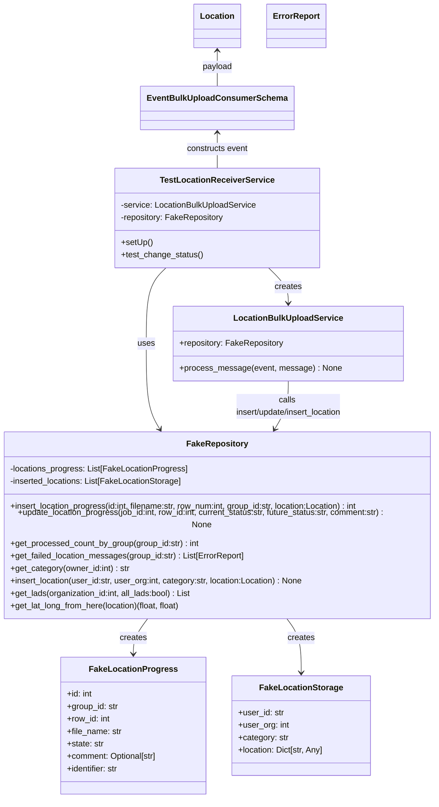
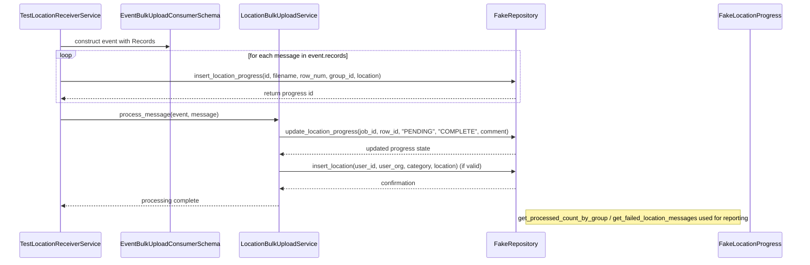

# Diagram: common/location_service/location_service_tests/unit/lambdas/bulk_upload/test_service.py

> Auto-generated by Obscura crawlers

## Diagram 1

### SVG

<svg id="container" width="865.6875" xmlns="http://www.w3.org/2000/svg" class="classDiagram" height="1514" viewBox="0 0 865.6875 1514" role="graphics-document document" aria-roledescription="class"><g><defs><marker id="container_class-aggregationStart" class="marker aggregation class" refX="18" refY="7" markerWidth="190" markerHeight="240" orient="auto"><path d="M 18,7 L9,13 L1,7 L9,1 Z"></path></marker></defs><defs><marker id="container_class-aggregationEnd" class="marker aggregation class" refX="1" refY="7" markerWidth="20" markerHeight="28" orient="auto"><path d="M 18,7 L9,13 L1,7 L9,1 Z"></path></marker></defs><defs><marker id="container_class-extensionStart" class="marker extension class" refX="18" refY="7" markerWidth="190" markerHeight="240" orient="auto"><path d="M 1,7 L18,13 V 1 Z"></path></marker></defs><defs><marker id="container_class-extensionEnd" class="marker extension class" refX="1" refY="7" markerWidth="20" markerHeight="28" orient="auto"><path d="M 1,1 V 13 L18,7 Z"></path></marker></defs><defs><marker id="container_class-compositionStart" class="marker composition class" refX="18" refY="7" markerWidth="190" markerHeight="240" orient="auto"><path d="M 18,7 L9,13 L1,7 L9,1 Z"></path></marker></defs><defs><marker id="container_class-compositionEnd" class="marker composition class" refX="1" refY="7" markerWidth="20" markerHeight="28" orient="auto"><path d="M 18,7 L9,13 L1,7 L9,1 Z"></path></marker></defs><defs><marker id="container_class-dependencyStart" class="marker dependency class" refX="6" refY="7" markerWidth="190" markerHeight="240" orient="auto"><path d="M 5,7 L9,13 L1,7 L9,1 Z"></path></marker></defs><defs><marker id="container_class-dependencyEnd" class="marker dependency class" refX="13" refY="7" markerWidth="20" markerHeight="28" orient="auto"><path d="M 18,7 L9,13 L14,7 L9,1 Z"></path></marker></defs><defs><marker id="container_class-lollipopStart" class="marker lollipop class" refX="13" refY="7" markerWidth="190" markerHeight="240" orient="auto"><circle stroke="black" fill="transparent" cx="7" cy="7" r="6"></circle></marker></defs><defs><marker id="container_class-lollipopEnd" class="marker lollipop class" refX="1" refY="7" markerWidth="190" markerHeight="240" orient="auto"><circle stroke="black" fill="transparent" cx="7" cy="7" r="6"></circle></marker></defs><g class="root"><g class="clusters"></g><g class="edgePaths"><path d="M529.034,516L535.213,522.167C541.392,528.333,553.75,540.667,559.929,552C566.107,563.333,566.107,573.667,566.107,578.833L566.107,584" id="id_TestLocationReceiverService_LocationBulkUploadService_1" class="edge-thickness-normal edge-pattern-solid relation" style=";;;" data-edge="true" data-et="edge" data-id="id_TestLocationReceiverService_LocationBulkUploadService_1" data-points="W3sieCI6NTI5LjAzNDA2OTU0ODg3MjEsInkiOjUxNn0seyJ4Ijo1NjYuMTA3NDIxODc1LCJ5Ijo1NTN9LHsieCI6NTY2LjEwNzQyMTg3NSwieSI6NTkwfV0=" marker-end="url(#container_class-dependencyEnd)"></path><path d="M336.653,516L330.475,522.167C324.296,528.333,311.938,540.667,305.759,565C299.58,589.333,299.58,625.667,299.58,664C299.58,702.333,299.58,742.667,304.072,770.148C308.564,797.629,317.548,812.258,322.04,819.573L326.532,826.887" id="id_TestLocationReceiverService_FakeRepository_2" class="edge-thickness-normal edge-pattern-solid relation" style=";;;" data-edge="true" data-et="edge" data-id="id_TestLocationReceiverService_FakeRepository_2" data-points="W3sieCI6MzM2LjY1MzQzMDQ1MTEyNzgsInkiOjUxNn0seyJ4IjoyOTkuNTgwMDc4MTI1LCJ5Ijo1NTN9LHsieCI6Mjk5LjU4MDA3ODEyNSwieSI6NjYyfSx7IngiOjI5OS41ODAwNzgxMjUsInkiOjc4M30seyJ4IjozMjkuNjcxODc1LCJ5Ijo4MzJ9XQ==" marker-end="url(#container_class-dependencyEnd)"></path><path d="M300.39,1168L295.528,1174.167C290.666,1180.333,280.943,1192.667,276.081,1204C271.219,1215.333,271.219,1225.667,271.219,1230.833L271.219,1236" id="id_FakeRepository_FakeLocationProgress_3" class="edge-thickness-normal edge-pattern-solid relation" style=";;;" data-edge="true" data-et="edge" data-id="id_FakeRepository_FakeLocationProgress_3" data-points="W3sieCI6MzAwLjM5MDA5MTQ2MzQxNDYsInkiOjExNjh9LHsieCI6MjcxLjIxODc1LCJ5IjoxMjA1fSx7IngiOjI3MS4yMTg3NSwieSI6MTI0Mn1d" marker-end="url(#container_class-dependencyEnd)"></path><path d="M565.297,1168L570.159,1174.167C575.021,1180.333,584.745,1192.667,589.607,1210C594.469,1227.333,594.469,1249.667,594.469,1260.833L594.469,1272" id="id_FakeRepository_FakeLocationStorage_4" class="edge-thickness-normal edge-pattern-solid relation" style=";;;" data-edge="true" data-et="edge" data-id="id_FakeRepository_FakeLocationStorage_4" data-points="W3sieCI6NTY1LjI5NzQwODUzNjU4NTQsInkiOjExNjh9LHsieCI6NTk0LjQ2ODc1LCJ5IjoxMjA1fSx7IngiOjU5NC40Njg3NSwieSI6MTI3OH1d" marker-end="url(#container_class-dependencyEnd)"></path><path d="M566.107,734L566.107,742.167C566.107,750.333,566.107,766.667,561.615,782.148C557.123,797.629,548.139,812.258,543.647,819.573L539.156,826.887" id="id_LocationBulkUploadService_FakeRepository_5" class="edge-thickness-normal edge-pattern-solid relation" style=";;;" data-edge="true" data-et="edge" data-id="id_LocationBulkUploadService_FakeRepository_5" data-points="W3sieCI6NTY2LjEwNzQyMTg3NSwieSI6NzM0fSx7IngiOjU2Ni4xMDc0MjE4NzUsInkiOjc4M30seyJ4Ijo1MzYuMDE1NjI1LCJ5Ijo4MzJ9XQ==" marker-end="url(#container_class-dependencyEnd)"></path><path d="M432.844,256L432.844,261.167C432.844,266.333,432.844,276.667,432.844,288C432.844,299.333,432.844,311.667,432.844,317.833L432.844,324" id="id_EventBulkUploadConsumerSchema_TestLocationReceiverService_6" class="edge-thickness-normal edge-pattern-solid relation" style=";;;" data-edge="true" data-et="edge" data-id="id_EventBulkUploadConsumerSchema_TestLocationReceiverService_6" data-points="W3sieCI6NDMyLjg0Mzc1LCJ5IjoyNTB9LHsieCI6NDMyLjg0Mzc1LCJ5IjoyODd9LHsieCI6NDMyLjg0Mzc1LCJ5IjozMjR9XQ==" marker-start="url(#container_class-dependencyStart)"></path><path d="M432.844,98L432.844,103.167C432.844,108.333,432.844,118.667,432.844,130C432.844,141.333,432.844,153.667,432.844,159.833L432.844,166" id="id_Location_EventBulkUploadConsumerSchema_7" class="edge-thickness-normal edge-pattern-solid relation" style=";;;" data-edge="true" data-et="edge" data-id="id_Location_EventBulkUploadConsumerSchema_7" data-points="W3sieCI6NDMyLjg0Mzc1LCJ5Ijo5Mn0seyJ4Ijo0MzIuODQzNzUsInkiOjEyOX0seyJ4Ijo0MzIuODQzNzUsInkiOjE2Nn1d" marker-start="url(#container_class-dependencyStart)"></path></g><g class="edgeLabels"><g class="edgeLabel" transform="translate(566.107421875, 553)"><g class="label" data-id="id_TestLocationReceiverService_LocationBulkUploadService_1" transform="translate(-26.171875, -12)"><foreignObject width="52.34375" height="24">

creates

</foreignObject></g></g><g class="edgeLabel" transform="translate(299.580078125, 662)"><g class="label" data-id="id_TestLocationReceiverService_FakeRepository_2" transform="translate(-16.4921875, -12)"><foreignObject width="32.984375" height="24">

uses

</foreignObject></g></g><g class="edgeLabel" transform="translate(271.21875, 1205)"><g class="label" data-id="id_FakeRepository_FakeLocationProgress_3" transform="translate(-26.171875, -12)"><foreignObject width="52.34375" height="24">

creates

</foreignObject></g></g><g class="edgeLabel" transform="translate(594.46875, 1205)"><g class="label" data-id="id_FakeRepository_FakeLocationStorage_4" transform="translate(-26.171875, -12)"><foreignObject width="52.34375" height="24">

creates

</foreignObject></g></g><g class="edgeLabel" transform="translate(566.107421875, 783)"><g class="label" data-id="id_LocationBulkUploadService_FakeRepository_5" transform="translate(-109.4453125, -24)"><foreignObject width="218.890625" height="48">

calls insert/update/insert_location

</foreignObject></g></g><g class="edgeLabel" transform="translate(432.84375, 287)"><g class="label" data-id="id_EventBulkUploadConsumerSchema_TestLocationReceiverService_6" transform="translate(-60.1328125, -12)"><foreignObject width="120.265625" height="24">

constructs event

</foreignObject></g></g><g class="edgeLabel" transform="translate(432.84375, 129)"><g class="label" data-id="id_Location_EventBulkUploadConsumerSchema_7" transform="translate(-28.875, -12)"><foreignObject width="57.75" height="24">

payload

</foreignObject></g></g></g><g class="nodes"><g class="node default" id="classId-TestLocationReceiverService-0" transform="translate(432.84375, 420)"><g class="basic label-container"><path d="M-196.03125 -96 L196.03125 -96 L196.03125 96 L-196.03125 96" stroke="none" stroke-width="0" fill="#ECECFF" style=""></path><path d="M-196.03125 -96 C-106.4633691822798 -96, -16.89548836455961 -96, 196.03125 -96 M-196.03125 -96 C-84.46116125371877 -96, 27.108927492562458 -96, 196.03125 -96 M196.03125 -96 C196.03125 -49.392574107703894, 196.03125 -2.785148215407787, 196.03125 96 M196.03125 -96 C196.03125 -28.872475737330987, 196.03125 38.255048525338026, 196.03125 96 M196.03125 96 C52.413555739865984 96, -91.20413852026803 96, -196.03125 96 M196.03125 96 C97.13448067569527 96, -1.7622886486094558 96, -196.03125 96 M-196.03125 96 C-196.03125 35.131865052026804, -196.03125 -25.736269895946393, -196.03125 -96 M-196.03125 96 C-196.03125 19.558826902553008, -196.03125 -56.882346194893984, -196.03125 -96" stroke="#9370DB" stroke-width="1.3" fill="none" stroke-dasharray="0 0" style=""></path></g><g class="annotation-group text" transform="translate(0, -72)"></g><g class="label-group text" transform="translate(-104.484375, -72)"><g class="label" style="font-weight: bolder" transform="translate(0,-12)"><foreignObject width="208.96875" height="24">

TestLocationReceiverService

</foreignObject></g></g><g class="members-group text" transform="translate(-184.03125, -24)"><g class="label" style="" transform="translate(0,-12)"><foreignObject width="263.578125" height="24">

-service: LocationBulkUploadService

</foreignObject></g><g class="label" style="" transform="translate(0,12)"><foreignObject width="199.0625" height="24">

-repository: FakeRepository

</foreignObject></g></g><g class="methods-group text" transform="translate(-184.03125, 48)"><g class="label" style="" transform="translate(0,-12)"><foreignObject width="60.421875" height="24">

+setUp()

</foreignObject></g><g class="label" style="" transform="translate(0,12)"><foreignObject width="158.078125" height="24">

+test_change_status()

</foreignObject></g></g><g class="divider" style=""><path d="M-196.03125 -48 C-63.07594005355489 -48, 69.87936989289022 -48, 196.03125 -48 M-196.03125 -48 C-93.26788011028763 -48, 9.49548977942473 -48, 196.03125 -48" stroke="#9370DB" stroke-width="1.3" fill="none" stroke-dasharray="0 0" style=""></path></g><g class="divider" style=""><path d="M-196.03125 24 C-64.7495972495185 24, 66.532055500963 24, 196.03125 24 M-196.03125 24 C-87.7750410203541 24, 20.48116795929181 24, 196.03125 24" stroke="#9370DB" stroke-width="1.3" fill="none" stroke-dasharray="0 0" style=""></path></g></g><g class="node default" id="classId-FakeLocationProgress-1" transform="translate(271.21875, 1374)"><g class="basic label-container"><path d="M-140.12890625 -132 L140.12890625 -132 L140.12890625 132 L-140.12890625 132" stroke="none" stroke-width="0" fill="#ECECFF" style=""></path><path d="M-140.12890625 -132 C-53.045457435243605 -132, 34.03799137951279 -132, 140.12890625 -132 M-140.12890625 -132 C-50.8945985076285 -132, 38.339709234743 -132, 140.12890625 -132 M140.12890625 -132 C140.12890625 -46.9813828374388, 140.12890625 38.0372343251224, 140.12890625 132 M140.12890625 -132 C140.12890625 -58.01259543014068, 140.12890625 15.974809139718644, 140.12890625 132 M140.12890625 132 C76.59631965955265 132, 13.063733069105297 132, -140.12890625 132 M140.12890625 132 C43.80049556342614 132, -52.52791512314772 132, -140.12890625 132 M-140.12890625 132 C-140.12890625 78.33169285756648, -140.12890625 24.663385715132947, -140.12890625 -132 M-140.12890625 132 C-140.12890625 43.917009592749395, -140.12890625 -44.16598081450121, -140.12890625 -132" stroke="#9370DB" stroke-width="1.3" fill="none" stroke-dasharray="0 0" style=""></path></g><g class="annotation-group text" transform="translate(0, -108)"></g><g class="label-group text" transform="translate(-79.6171875, -108)"><g class="label" style="font-weight: bolder" transform="translate(0,-12)"><foreignObject width="159.234375" height="24">

FakeLocationProgress

</foreignObject></g></g><g class="members-group text" transform="translate(-128.12890625, -60)"><g class="label" style="" transform="translate(0,-12)"><foreignObject width="49.8125" height="24">

+id: int

</foreignObject></g><g class="label" style="" transform="translate(0,12)"><foreignObject width="99.75" height="24">

+group_id: str

</foreignObject></g><g class="label" style="" transform="translate(0,36)"><foreignObject width="84.328125" height="24">

+row_id: int

</foreignObject></g><g class="label" style="" transform="translate(0,60)"><foreignObject width="106.296875" height="24">

+file_name: str

</foreignObject></g><g class="label" style="" transform="translate(0,84)"><foreignObject width="71.59375" height="24">

+state: str

</foreignObject></g><g class="label" style="" transform="translate(0,108)"><foreignObject width="176.640625" height="24">

+comment: Optional[str]

</foreignObject></g><g class="label" style="" transform="translate(0,132)"><foreignObject width="102.21875" height="24">

+identifier: str

</foreignObject></g></g><g class="methods-group text" transform="translate(-128.12890625, 132)"></g><g class="divider" style=""><path d="M-140.12890625 -84 C-68.1981410397165 -84, 3.732624170566993 -84, 140.12890625 -84 M-140.12890625 -84 C-40.12991819299599 -84, 59.869069864008026 -84, 140.12890625 -84" stroke="#9370DB" stroke-width="1.3" fill="none" stroke-dasharray="0 0" style=""></path></g><g class="divider" style=""><path d="M-140.12890625 108 C-71.17498934816585 108, -2.2210724463317035 108, 140.12890625 108 M-140.12890625 108 C-39.95182329377464 108, 60.225259662450725 108, 140.12890625 108" stroke="#9370DB" stroke-width="1.3" fill="none" stroke-dasharray="0 0" style=""></path></g></g><g class="node default" id="classId-FakeLocationStorage-2" transform="translate(594.46875, 1374)"><g class="basic label-container"><path d="M-133.12109375 -96 L133.12109375 -96 L133.12109375 96 L-133.12109375 96" stroke="none" stroke-width="0" fill="#ECECFF" style=""></path><path d="M-133.12109375 -96 C-42.79668323747116 -96, 47.527727275057686 -96, 133.12109375 -96 M-133.12109375 -96 C-59.188960733335975 -96, 14.74317228332805 -96, 133.12109375 -96 M133.12109375 -96 C133.12109375 -24.941562955064796, 133.12109375 46.11687408987041, 133.12109375 96 M133.12109375 -96 C133.12109375 -39.5771852143263, 133.12109375 16.845629571347402, 133.12109375 96 M133.12109375 96 C57.79033690962231 96, -17.540419930755377 96, -133.12109375 96 M133.12109375 96 C40.363001671728 96, -52.395090406544 96, -133.12109375 96 M-133.12109375 96 C-133.12109375 43.299439326074676, -133.12109375 -9.401121347850648, -133.12109375 -96 M-133.12109375 96 C-133.12109375 36.38867149801579, -133.12109375 -23.222657003968422, -133.12109375 -96" stroke="#9370DB" stroke-width="1.3" fill="none" stroke-dasharray="0 0" style=""></path></g><g class="annotation-group text" transform="translate(0, -72)"></g><g class="label-group text" transform="translate(-75.9453125, -72)"><g class="label" style="font-weight: bolder" transform="translate(0,-12)"><foreignObject width="151.890625" height="24">

FakeLocationStorage

</foreignObject></g></g><g class="members-group text" transform="translate(-121.12109375, -24)"><g class="label" style="" transform="translate(0,-12)"><foreignObject width="88.296875" height="24">

+user_id: str

</foreignObject></g><g class="label" style="" transform="translate(0,12)"><foreignObject width="97.734375" height="24">

+user_org: int

</foreignObject></g><g class="label" style="" transform="translate(0,36)"><foreignObject width="97.46875" height="24">

+category: str

</foreignObject></g><g class="label" style="" transform="translate(0,60)"><foreignObject width="166.296875" height="24">

+location: Dict[str, Any]

</foreignObject></g></g><g class="methods-group text" transform="translate(-121.12109375, 96)"></g><g class="divider" style=""><path d="M-133.12109375 -48 C-36.20452267978989 -48, 60.71204839042022 -48, 133.12109375 -48 M-133.12109375 -48 C-61.024406102997446 -48, 11.072281544005108 -48, 133.12109375 -48" stroke="#9370DB" stroke-width="1.3" fill="none" stroke-dasharray="0 0" style=""></path></g><g class="divider" style=""><path d="M-133.12109375 72 C-29.766710875620646 72, 73.58767199875871 72, 133.12109375 72 M-133.12109375 72 C-49.97946372512567 72, 33.16216629974866 72, 133.12109375 72" stroke="#9370DB" stroke-width="1.3" fill="none" stroke-dasharray="0 0" style=""></path></g></g><g class="node default" id="classId-FakeRepository-3" transform="translate(432.84375, 1000)"><g class="basic label-container"><path d="M-424.84375 -168 L424.84375 -168 L424.84375 168 L-424.84375 168" stroke="none" stroke-width="0" fill="#ECECFF" style=""></path><path d="M-424.84375 -168 C-229.4462439305956 -168, -34.04873786119123 -168, 424.84375 -168 M-424.84375 -168 C-98.25459644840089 -168, 228.33455710319822 -168, 424.84375 -168 M424.84375 -168 C424.84375 -48.269762016731406, 424.84375 71.46047596653719, 424.84375 168 M424.84375 -168 C424.84375 -47.10935351240839, 424.84375 73.78129297518322, 424.84375 168 M424.84375 168 C234.7785702304494 168, 44.71339046089878 168, -424.84375 168 M424.84375 168 C169.31471138081181 168, -86.21432723837637 168, -424.84375 168 M-424.84375 168 C-424.84375 71.9735309817738, -424.84375 -24.05293803645239, -424.84375 -168 M-424.84375 168 C-424.84375 87.4808807843471, -424.84375 6.961761568694186, -424.84375 -168" stroke="#9370DB" stroke-width="1.3" fill="none" stroke-dasharray="0 0" style=""></path></g><g class="annotation-group text" transform="translate(0, -144)"></g><g class="label-group text" transform="translate(-56.296875, -144)"><g class="label" style="font-weight: bolder" transform="translate(0,-12)"><foreignObject width="112.59375" height="24">

FakeRepository

</foreignObject></g></g><g class="members-group text" transform="translate(-412.84375, -96)"><g class="label" style="" transform="translate(0,-12)"><foreignObject width="343.265625" height="24">

-locations_progress: List[FakeLocationProgress]

</foreignObject></g><g class="label" style="" transform="translate(0,12)"><foreignObject width="334.453125" height="24">

-inserted_locations: List[FakeLocationStorage]

</foreignObject></g></g><g class="methods-group text" transform="translate(-412.84375, -24)"><g class="label" style="" transform="translate(0,-12)"><foreignObject width="687.203125" height="24">

+insert_location_progress(id:int, filename:str, row_num:int, group_id:str, location:Location) : int

</foreignObject></g><g class="label" style="" transform="translate(0,12)"><foreignObject width="769.390625" height="24">

+update_location_progress(job_id:int, row_id:int, current_status:str, future_status:str, comment:str) : None

</foreignObject></g><g class="label" style="" transform="translate(0,36)"><foreignObject width="367.5" height="24">

+get_processed_count_by_group(group_id:str) : int

</foreignObject></g><g class="label" style="" transform="translate(0,60)"><foreignObject width="456.46875" height="24">

+get_failed_location_messages(group_id:str) : List[ErrorReport]

</foreignObject></g><g class="label" style="" transform="translate(0,84)"><foreignObject width="232.28125" height="24">

+get_category(owner_id:int) : str

</foreignObject></g><g class="label" style="" transform="translate(0,108)"><foreignObject width="572.359375" height="24">

+insert_location(user_id:str, user_org:int, category:str, location:Location) : None

</foreignObject></g><g class="label" style="" transform="translate(0,132)"><foreignObject width="355.03125" height="24">

+get_lads(organization_id:int, all_lads:bool) : List

</foreignObject></g><g class="label" style="" transform="translate(0,156)"><foreignObject width="334.765625" height="24">

+get_lat_long_from_here(location)(float, float)

</foreignObject></g></g><g class="divider" style=""><path d="M-424.84375 -120 C-209.228509522086 -120, 6.386730955828 -120, 424.84375 -120 M-424.84375 -120 C-132.5967428117209 -120, 159.6502643765582 -120, 424.84375 -120" stroke="#9370DB" stroke-width="1.3" fill="none" stroke-dasharray="0 0" style=""></path></g><g class="divider" style=""><path d="M-424.84375 -48 C-191.06466811128658 -48, 42.71441377742684 -48, 424.84375 -48 M-424.84375 -48 C-177.28336584993022 -48, 70.27701830013956 -48, 424.84375 -48" stroke="#9370DB" stroke-width="1.3" fill="none" stroke-dasharray="0 0" style=""></path></g></g><g class="node default" id="classId-LocationBulkUploadService-4" transform="translate(566.107421875, 662)"><g class="basic label-container"><path d="M-215.03515625 -72 L215.03515625 -72 L215.03515625 72 L-215.03515625 72" stroke="none" stroke-width="0" fill="#ECECFF" style=""></path><path d="M-215.03515625 -72 C-105.98416441180073 -72, 3.0668274263985325 -72, 215.03515625 -72 M-215.03515625 -72 C-127.89464318966185 -72, -40.7541301293237 -72, 215.03515625 -72 M215.03515625 -72 C215.03515625 -34.25597010262175, 215.03515625 3.488059794756495, 215.03515625 72 M215.03515625 -72 C215.03515625 -22.225658437928246, 215.03515625 27.54868312414351, 215.03515625 72 M215.03515625 72 C96.50677949496288 72, -22.02159726007423 72, -215.03515625 72 M215.03515625 72 C99.6367836927044 72, -15.761588864591204 72, -215.03515625 72 M-215.03515625 72 C-215.03515625 30.399036635831862, -215.03515625 -11.201926728336275, -215.03515625 -72 M-215.03515625 72 C-215.03515625 41.37832489115159, -215.03515625 10.756649782303185, -215.03515625 -72" stroke="#9370DB" stroke-width="1.3" fill="none" stroke-dasharray="0 0" style=""></path></g><g class="annotation-group text" transform="translate(0, -48)"></g><g class="label-group text" transform="translate(-100.3984375, -48)"><g class="label" style="font-weight: bolder" transform="translate(0,-12)"><foreignObject width="200.796875" height="24">

LocationBulkUploadService

</foreignObject></g></g><g class="members-group text" transform="translate(-203.03515625, 0)"><g class="label" style="" transform="translate(0,-12)"><foreignObject width="200.59375" height="24">

+repository: FakeRepository

</foreignObject></g></g><g class="methods-group text" transform="translate(-203.03515625, 48)"><g class="label" style="" transform="translate(0,-12)"><foreignObject width="305.671875" height="24">

+process_message(event, message) : None

</foreignObject></g></g><g class="divider" style=""><path d="M-215.03515625 -24 C-124.46738962080016 -24, -33.899622991600324 -24, 215.03515625 -24 M-215.03515625 -24 C-125.09422112924763 -24, -35.15328600849526 -24, 215.03515625 -24" stroke="#9370DB" stroke-width="1.3" fill="none" stroke-dasharray="0 0" style=""></path></g><g class="divider" style=""><path d="M-215.03515625 24 C-116.10156115046357 24, -17.167966050927134 24, 215.03515625 24 M-215.03515625 24 C-89.76663573331375 24, 35.5018847833725 24, 215.03515625 24" stroke="#9370DB" stroke-width="1.3" fill="none" stroke-dasharray="0 0" style=""></path></g></g><g class="node default" id="classId-EventBulkUploadConsumerSchema-5" transform="translate(432.84375, 208)"><g class="basic label-container"><path d="M-139.75 -42 L139.75 -42 L139.75 42 L-139.75 42" stroke="none" stroke-width="0" fill="#ECECFF" style=""></path><path d="M-139.75 -42 C-30.438087159984534 -42, 78.87382568003093 -42, 139.75 -42 M-139.75 -42 C-30.743404041084858 -42, 78.26319191783028 -42, 139.75 -42 M139.75 -42 C139.75 -13.16116542784749, 139.75 15.677669144305021, 139.75 42 M139.75 -42 C139.75 -13.851380350346506, 139.75 14.297239299306987, 139.75 42 M139.75 42 C32.46059705092749 42, -74.82880589814502 42, -139.75 42 M139.75 42 C72.5246763316976 42, 5.2993526633952115 42, -139.75 42 M-139.75 42 C-139.75 20.8745190352014, -139.75 -0.250961929597203, -139.75 -42 M-139.75 42 C-139.75 20.242711772683197, -139.75 -1.5145764546336054, -139.75 -42" stroke="#9370DB" stroke-width="1.3" fill="none" stroke-dasharray="0 0" style=""></path></g><g class="annotation-group text" transform="translate(0, -18)"></g><g class="label-group text" transform="translate(-127.75, -18)"><g class="label" style="font-weight: bolder" transform="translate(0,-12)"><foreignObject width="255.5" height="24">

EventBulkUploadConsumerSchema

</foreignObject></g></g><g class="members-group text" transform="translate(-127.75, 30)"></g><g class="methods-group text" transform="translate(-127.75, 60)"></g><g class="divider" style=""><path d="M-139.75 6 C-28.19685401278673 6, 83.35629197442654 6, 139.75 6 M-139.75 6 C-77.22018574022053 6, -14.690371480441073 6, 139.75 6" stroke="#9370DB" stroke-width="1.3" fill="none" stroke-dasharray="0 0" style=""></path></g><g class="divider" style=""><path d="M-139.75 24 C-45.572477196441994 24, 48.60504560711601 24, 139.75 24 M-139.75 24 C-82.39689808564171 24, -25.043796171283432 24, 139.75 24" stroke="#9370DB" stroke-width="1.3" fill="none" stroke-dasharray="0 0" style=""></path></g></g><g class="node default" id="classId-Location-6" transform="translate(432.84375, 50)"><g class="basic label-container"><path d="M-43.3515625 -42 L43.3515625 -42 L43.3515625 42 L-43.3515625 42" stroke="none" stroke-width="0" fill="#ECECFF" style=""></path><path d="M-43.3515625 -42 C-25.22919851762015 -42, -7.106834535240303 -42, 43.3515625 -42 M-43.3515625 -42 C-10.795349980352206 -42, 21.760862539295587 -42, 43.3515625 -42 M43.3515625 -42 C43.3515625 -9.749501294596108, 43.3515625 22.500997410807784, 43.3515625 42 M43.3515625 -42 C43.3515625 -10.644711214564001, 43.3515625 20.710577570871997, 43.3515625 42 M43.3515625 42 C15.143664012435085 42, -13.06423447512983 42, -43.3515625 42 M43.3515625 42 C22.55424505802472 42, 1.7569276160494383 42, -43.3515625 42 M-43.3515625 42 C-43.3515625 17.800287658297247, -43.3515625 -6.399424683405506, -43.3515625 -42 M-43.3515625 42 C-43.3515625 9.976039531074704, -43.3515625 -22.04792093785059, -43.3515625 -42" stroke="#9370DB" stroke-width="1.3" fill="none" stroke-dasharray="0 0" style=""></path></g><g class="annotation-group text" transform="translate(0, -18)"></g><g class="label-group text" transform="translate(-31.3515625, -18)"><g class="label" style="font-weight: bolder" transform="translate(0,-12)"><foreignObject width="62.703125" height="24">

Location

</foreignObject></g></g><g class="members-group text" transform="translate(-31.3515625, 30)"></g><g class="methods-group text" transform="translate(-31.3515625, 60)"></g><g class="divider" style=""><path d="M-43.3515625 6 C-14.150256377421389 6, 15.051049745157222 6, 43.3515625 6 M-43.3515625 6 C-16.73253450827186 6, 9.886493483456277 6, 43.3515625 6" stroke="#9370DB" stroke-width="1.3" fill="none" stroke-dasharray="0 0" style=""></path></g><g class="divider" style=""><path d="M-43.3515625 24 C-24.336316389543747 24, -5.321070279087493 24, 43.3515625 24 M-43.3515625 24 C-16.413654221035653 24, 10.524254057928694 24, 43.3515625 24" stroke="#9370DB" stroke-width="1.3" fill="none" stroke-dasharray="0 0" style=""></path></g></g><g class="node default" id="classId-ErrorReport-7" transform="translate(581.359375, 50)"><g class="basic label-container"><path d="M-55.1640625 -42 L55.1640625 -42 L55.1640625 42 L-55.1640625 42" stroke="none" stroke-width="0" fill="#ECECFF" style=""></path><path d="M-55.1640625 -42 C-25.32623738719381 -42, 4.5115877256123795 -42, 55.1640625 -42 M-55.1640625 -42 C-32.77387677338203 -42, -10.383691046764064 -42, 55.1640625 -42 M55.1640625 -42 C55.1640625 -22.107808047103042, 55.1640625 -2.2156160942060836, 55.1640625 42 M55.1640625 -42 C55.1640625 -20.650931159908776, 55.1640625 0.6981376801824482, 55.1640625 42 M55.1640625 42 C28.749772493909514 42, 2.3354824878190286 42, -55.1640625 42 M55.1640625 42 C30.21401410275848 42, 5.263965705516959 42, -55.1640625 42 M-55.1640625 42 C-55.1640625 10.375288650279565, -55.1640625 -21.24942269944087, -55.1640625 -42 M-55.1640625 42 C-55.1640625 20.193037406278442, -55.1640625 -1.6139251874431153, -55.1640625 -42" stroke="#9370DB" stroke-width="1.3" fill="none" stroke-dasharray="0 0" style=""></path></g><g class="annotation-group text" transform="translate(0, -18)"></g><g class="label-group text" transform="translate(-43.1640625, -18)"><g class="label" style="font-weight: bolder" transform="translate(0,-12)"><foreignObject width="86.328125" height="24">

ErrorReport

</foreignObject></g></g><g class="members-group text" transform="translate(-43.1640625, 30)"></g><g class="methods-group text" transform="translate(-43.1640625, 60)"></g><g class="divider" style=""><path d="M-55.1640625 6 C-16.591260564706616 6, 21.98154137058677 6, 55.1640625 6 M-55.1640625 6 C-22.007520749530507 6, 11.149021000938987 6, 55.1640625 6" stroke="#9370DB" stroke-width="1.3" fill="none" stroke-dasharray="0 0" style=""></path></g><g class="divider" style=""><path d="M-55.1640625 24 C-27.853355013952193 24, -0.5426475279043856 24, 55.1640625 24 M-55.1640625 24 C-16.31746905656407 24, 22.529124386871857 24, 55.1640625 24" stroke="#9370DB" stroke-width="1.3" fill="none" stroke-dasharray="0 0" style=""></path></g></g></g></g></g></svg>

## Diagram 2

### SVG

<svg id="container" width="2192" xmlns="http://www.w3.org/2000/svg" height="707" viewBox="-50 -10 2192 707" role="graphics-document document" aria-roledescription="sequence"><g><rect x="1916" y="621" fill="#eaeaea" stroke="#666" width="176" height="65" name="Progress" rx="3" ry="3" class="actor actor-bottom"></rect><text x="2004" y="653.5" dominant-baseline="central" alignment-baseline="central" class="actor actor-box" style="text-anchor: middle; font-size: 16px; font-weight: 400;"><tspan x="2004" dy="0">FakeLocationProgress</tspan></text></g><g><rect x="1259" y="621" fill="#eaeaea" stroke="#666" width="150" height="65" name="Repo" rx="3" ry="3" class="actor actor-bottom"></rect><text x="1334" y="653.5" dominant-baseline="central" alignment-baseline="central" class="actor actor-box" style="text-anchor: middle; font-size: 16px; font-weight: 400;"><tspan x="1334" dy="0">FakeRepository</tspan></text></g><g><rect x="599" y="621" fill="#eaeaea" stroke="#666" width="218" height="65" name="Service" rx="3" ry="3" class="actor actor-bottom"></rect><text x="708" y="653.5" dominant-baseline="central" alignment-baseline="central" class="actor actor-box" style="text-anchor: middle; font-size: 16px; font-weight: 400;"><tspan x="708" dy="0">LocationBulkUploadService</tspan></text></g><g><rect x="275" y="621" fill="#eaeaea" stroke="#666" width="274" height="65" name="Event" rx="3" ry="3" class="actor actor-bottom"></rect><text x="412" y="653.5" dominant-baseline="central" alignment-baseline="central" class="actor actor-box" style="text-anchor: middle; font-size: 16px; font-weight: 400;"><tspan x="412" dy="0">EventBulkUploadConsumerSchema</tspan></text></g><g><rect x="0" y="621" fill="#eaeaea" stroke="#666" width="225" height="65" name="Test" rx="3" ry="3" class="actor actor-bottom"></rect><text x="112.5" y="653.5" dominant-baseline="central" alignment-baseline="central" class="actor actor-box" style="text-anchor: middle; font-size: 16px; font-weight: 400;"><tspan x="112.5" dy="0">TestLocationReceiverService</tspan></text></g><g><line id="actor4" x1="2004" y1="65" x2="2004" y2="621" class="actor-line 200" stroke-width="0.5px" stroke="#999" name="Progress"></line><g id="root-4"><rect x="1916" y="0" fill="#eaeaea" stroke="#666" width="176" height="65" name="Progress" rx="3" ry="3" class="actor actor-top"></rect><text x="2004" y="32.5" dominant-baseline="central" alignment-baseline="central" class="actor actor-box" style="text-anchor: middle; font-size: 16px; font-weight: 400;"><tspan x="2004" dy="0">FakeLocationProgress</tspan></text></g></g><g><line id="actor3" x1="1334" y1="65" x2="1334" y2="621" class="actor-line 200" stroke-width="0.5px" stroke="#999" name="Repo"></line><g id="root-3"><rect x="1259" y="0" fill="#eaeaea" stroke="#666" width="150" height="65" name="Repo" rx="3" ry="3" class="actor actor-top"></rect><text x="1334" y="32.5" dominant-baseline="central" alignment-baseline="central" class="actor actor-box" style="text-anchor: middle; font-size: 16px; font-weight: 400;"><tspan x="1334" dy="0">FakeRepository</tspan></text></g></g><g><line id="actor2" x1="708" y1="65" x2="708" y2="621" class="actor-line 200" stroke-width="0.5px" stroke="#999" name="Service"></line><g id="root-2"><rect x="599" y="0" fill="#eaeaea" stroke="#666" width="218" height="65" name="Service" rx="3" ry="3" class="actor actor-top"></rect><text x="708" y="32.5" dominant-baseline="central" alignment-baseline="central" class="actor actor-box" style="text-anchor: middle; font-size: 16px; font-weight: 400;"><tspan x="708" dy="0">LocationBulkUploadService</tspan></text></g></g><g><line id="actor1" x1="412" y1="65" x2="412" y2="621" class="actor-line 200" stroke-width="0.5px" stroke="#999" name="Event"></line><g id="root-1"><rect x="275" y="0" fill="#eaeaea" stroke="#666" width="274" height="65" name="Event" rx="3" ry="3" class="actor actor-top"></rect><text x="412" y="32.5" dominant-baseline="central" alignment-baseline="central" class="actor actor-box" style="text-anchor: middle; font-size: 16px; font-weight: 400;"><tspan x="412" dy="0">EventBulkUploadConsumerSchema</tspan></text></g></g><g><line id="actor0" x1="112.5" y1="65" x2="112.5" y2="621" class="actor-line 200" stroke-width="0.5px" stroke="#999" name="Test"></line><g id="root-0"><rect x="0" y="0" fill="#eaeaea" stroke="#666" width="225" height="65" name="Test" rx="3" ry="3" class="actor actor-top"></rect><text x="112.5" y="32.5" dominant-baseline="central" alignment-baseline="central" class="actor actor-box" style="text-anchor: middle; font-size: 16px; font-weight: 400;"><tspan x="112.5" dy="0">TestLocationReceiverService</tspan></text></g></g><g></g><defs><symbol id="computer" width="24" height="24"><path transform="scale(.5)" d="M2 2v13h20v-13h-20zm18 11h-16v-9h16v9zm-10.228 6l.466-1h3.524l.467 1h-4.457zm14.228 3h-24l2-6h2.104l-1.33 4h18.45l-1.297-4h2.073l2 6zm-5-10h-14v-7h14v7z"></path></symbol></defs><defs><symbol id="database" fill-rule="evenodd" clip-rule="evenodd"><path transform="scale(.5)" d="M12.258.001l.256.004.255.005.253.008.251.01.249.012.247.015.246.016.242.019.241.02.239.023.236.024.233.027.231.028.229.031.225.032.223.034.22.036.217.038.214.04.211.041.208.043.205.045.201.046.198.048.194.05.191.051.187.053.183.054.18.056.175.057.172.059.168.06.163.061.16.063.155.064.15.066.074.033.073.033.071.034.07.034.069.035.068.035.067.035.066.035.064.036.064.036.062.036.06.036.06.037.058.037.058.037.055.038.055.038.053.038.052.038.051.039.05.039.048.039.047.039.045.04.044.04.043.04.041.04.04.041.039.041.037.041.036.041.034.041.033.042.032.042.03.042.029.042.027.042.026.043.024.043.023.043.021.043.02.043.018.044.017.043.015.044.013.044.012.044.011.045.009.044.007.045.006.045.004.045.002.045.001.045v17l-.001.045-.002.045-.004.045-.006.045-.007.045-.009.044-.011.045-.012.044-.013.044-.015.044-.017.043-.018.044-.02.043-.021.043-.023.043-.024.043-.026.043-.027.042-.029.042-.03.042-.032.042-.033.042-.034.041-.036.041-.037.041-.039.041-.04.041-.041.04-.043.04-.044.04-.045.04-.047.039-.048.039-.05.039-.051.039-.052.038-.053.038-.055.038-.055.038-.058.037-.058.037-.06.037-.06.036-.062.036-.064.036-.064.036-.066.035-.067.035-.068.035-.069.035-.07.034-.071.034-.073.033-.074.033-.15.066-.155.064-.16.063-.163.061-.168.06-.172.059-.175.057-.18.056-.183.054-.187.053-.191.051-.194.05-.198.048-.201.046-.205.045-.208.043-.211.041-.214.04-.217.038-.22.036-.223.034-.225.032-.229.031-.231.028-.233.027-.236.024-.239.023-.241.02-.242.019-.246.016-.247.015-.249.012-.251.01-.253.008-.255.005-.256.004-.258.001-.258-.001-.256-.004-.255-.005-.253-.008-.251-.01-.249-.012-.247-.015-.245-.016-.243-.019-.241-.02-.238-.023-.236-.024-.234-.027-.231-.028-.228-.031-.226-.032-.223-.034-.22-.036-.217-.038-.214-.04-.211-.041-.208-.043-.204-.045-.201-.046-.198-.048-.195-.05-.19-.051-.187-.053-.184-.054-.179-.056-.176-.057-.172-.059-.167-.06-.164-.061-.159-.063-.155-.064-.151-.066-.074-.033-.072-.033-.072-.034-.07-.034-.069-.035-.068-.035-.067-.035-.066-.035-.064-.036-.063-.036-.062-.036-.061-.036-.06-.037-.058-.037-.057-.037-.056-.038-.055-.038-.053-.038-.052-.038-.051-.039-.049-.039-.049-.039-.046-.039-.046-.04-.044-.04-.043-.04-.041-.04-.04-.041-.039-.041-.037-.041-.036-.041-.034-.041-.033-.042-.032-.042-.03-.042-.029-.042-.027-.042-.026-.043-.024-.043-.023-.043-.021-.043-.02-.043-.018-.044-.017-.043-.015-.044-.013-.044-.012-.044-.011-.045-.009-.044-.007-.045-.006-.045-.004-.045-.002-.045-.001-.045v-17l.001-.045.002-.045.004-.045.006-.045.007-.045.009-.044.011-.045.012-.044.013-.044.015-.044.017-.043.018-.044.02-.043.021-.043.023-.043.024-.043.026-.043.027-.042.029-.042.03-.042.032-.042.033-.042.034-.041.036-.041.037-.041.039-.041.04-.041.041-.04.043-.04.044-.04.046-.04.046-.039.049-.039.049-.039.051-.039.052-.038.053-.038.055-.038.056-.038.057-.037.058-.037.06-.037.061-.036.062-.036.063-.036.064-.036.066-.035.067-.035.068-.035.069-.035.07-.034.072-.034.072-.033.074-.033.151-.066.155-.064.159-.063.164-.061.167-.06.172-.059.176-.057.179-.056.184-.054.187-.053.19-.051.195-.05.198-.048.201-.046.204-.045.208-.043.211-.041.214-.04.217-.038.22-.036.223-.034.226-.032.228-.031.231-.028.234-.027.236-.024.238-.023.241-.02.243-.019.245-.016.247-.015.249-.012.251-.01.253-.008.255-.005.256-.004.258-.001.258.001zm-9.258 20.499v.01l.001.021.003.021.004.022.005.021.006.022.007.022.009.023.01.022.011.023.012.023.013.023.015.023.016.024.017.023.018.024.019.024.021.024.022.025.023.024.024.025.052.049.056.05.061.051.066.051.07.051.075.051.079.052.084.052.088.052.092.052.097.052.102.051.105.052.11.052.114.051.119.051.123.051.127.05.131.05.135.05.139.048.144.049.147.047.152.047.155.047.16.045.163.045.167.043.171.043.176.041.178.041.183.039.187.039.19.037.194.035.197.035.202.033.204.031.209.03.212.029.216.027.219.025.222.024.226.021.23.02.233.018.236.016.24.015.243.012.246.01.249.008.253.005.256.004.259.001.26-.001.257-.004.254-.005.25-.008.247-.011.244-.012.241-.014.237-.016.233-.018.231-.021.226-.021.224-.024.22-.026.216-.027.212-.028.21-.031.205-.031.202-.034.198-.034.194-.036.191-.037.187-.039.183-.04.179-.04.175-.042.172-.043.168-.044.163-.045.16-.046.155-.046.152-.047.148-.048.143-.049.139-.049.136-.05.131-.05.126-.05.123-.051.118-.052.114-.051.11-.052.106-.052.101-.052.096-.052.092-.052.088-.053.083-.051.079-.052.074-.052.07-.051.065-.051.06-.051.056-.05.051-.05.023-.024.023-.025.021-.024.02-.024.019-.024.018-.024.017-.024.015-.023.014-.024.013-.023.012-.023.01-.023.01-.022.008-.022.006-.022.006-.022.004-.022.004-.021.001-.021.001-.021v-4.127l-.077.055-.08.053-.083.054-.085.053-.087.052-.09.052-.093.051-.095.05-.097.05-.1.049-.102.049-.105.048-.106.047-.109.047-.111.046-.114.045-.115.045-.118.044-.12.043-.122.042-.124.042-.126.041-.128.04-.13.04-.132.038-.134.038-.135.037-.138.037-.139.035-.142.035-.143.034-.144.033-.147.032-.148.031-.15.03-.151.03-.153.029-.154.027-.156.027-.158.026-.159.025-.161.024-.162.023-.163.022-.165.021-.166.02-.167.019-.169.018-.169.017-.171.016-.173.015-.173.014-.175.013-.175.012-.177.011-.178.01-.179.008-.179.008-.181.006-.182.005-.182.004-.184.003-.184.002h-.37l-.184-.002-.184-.003-.182-.004-.182-.005-.181-.006-.179-.008-.179-.008-.178-.01-.176-.011-.176-.012-.175-.013-.173-.014-.172-.015-.171-.016-.17-.017-.169-.018-.167-.019-.166-.02-.165-.021-.163-.022-.162-.023-.161-.024-.159-.025-.157-.026-.156-.027-.155-.027-.153-.029-.151-.03-.15-.03-.148-.031-.146-.032-.145-.033-.143-.034-.141-.035-.14-.035-.137-.037-.136-.037-.134-.038-.132-.038-.13-.04-.128-.04-.126-.041-.124-.042-.122-.042-.12-.044-.117-.043-.116-.045-.113-.045-.112-.046-.109-.047-.106-.047-.105-.048-.102-.049-.1-.049-.097-.05-.095-.05-.093-.052-.09-.051-.087-.052-.085-.053-.083-.054-.08-.054-.077-.054v4.127zm0-5.654v.011l.001.021.003.021.004.021.005.022.006.022.007.022.009.022.01.022.011.023.012.023.013.023.015.024.016.023.017.024.018.024.019.024.021.024.022.024.023.025.024.024.052.05.056.05.061.05.066.051.07.051.075.052.079.051.084.052.088.052.092.052.097.052.102.052.105.052.11.051.114.051.119.052.123.05.127.051.131.05.135.049.139.049.144.048.147.048.152.047.155.046.16.045.163.045.167.044.171.042.176.042.178.04.183.04.187.038.19.037.194.036.197.034.202.033.204.032.209.03.212.028.216.027.219.025.222.024.226.022.23.02.233.018.236.016.24.014.243.012.246.01.249.008.253.006.256.003.259.001.26-.001.257-.003.254-.006.25-.008.247-.01.244-.012.241-.015.237-.016.233-.018.231-.02.226-.022.224-.024.22-.025.216-.027.212-.029.21-.03.205-.032.202-.033.198-.035.194-.036.191-.037.187-.039.183-.039.179-.041.175-.042.172-.043.168-.044.163-.045.16-.045.155-.047.152-.047.148-.048.143-.048.139-.05.136-.049.131-.05.126-.051.123-.051.118-.051.114-.052.11-.052.106-.052.101-.052.096-.052.092-.052.088-.052.083-.052.079-.052.074-.051.07-.052.065-.051.06-.05.056-.051.051-.049.023-.025.023-.024.021-.025.02-.024.019-.024.018-.024.017-.024.015-.023.014-.023.013-.024.012-.022.01-.023.01-.023.008-.022.006-.022.006-.022.004-.021.004-.022.001-.021.001-.021v-4.139l-.077.054-.08.054-.083.054-.085.052-.087.053-.09.051-.093.051-.095.051-.097.05-.1.049-.102.049-.105.048-.106.047-.109.047-.111.046-.114.045-.115.044-.118.044-.12.044-.122.042-.124.042-.126.041-.128.04-.13.039-.132.039-.134.038-.135.037-.138.036-.139.036-.142.035-.143.033-.144.033-.147.033-.148.031-.15.03-.151.03-.153.028-.154.028-.156.027-.158.026-.159.025-.161.024-.162.023-.163.022-.165.021-.166.02-.167.019-.169.018-.169.017-.171.016-.173.015-.173.014-.175.013-.175.012-.177.011-.178.009-.179.009-.179.007-.181.007-.182.005-.182.004-.184.003-.184.002h-.37l-.184-.002-.184-.003-.182-.004-.182-.005-.181-.007-.179-.007-.179-.009-.178-.009-.176-.011-.176-.012-.175-.013-.173-.014-.172-.015-.171-.016-.17-.017-.169-.018-.167-.019-.166-.02-.165-.021-.163-.022-.162-.023-.161-.024-.159-.025-.157-.026-.156-.027-.155-.028-.153-.028-.151-.03-.15-.03-.148-.031-.146-.033-.145-.033-.143-.033-.141-.035-.14-.036-.137-.036-.136-.037-.134-.038-.132-.039-.13-.039-.128-.04-.126-.041-.124-.042-.122-.043-.12-.043-.117-.044-.116-.044-.113-.046-.112-.046-.109-.046-.106-.047-.105-.048-.102-.049-.1-.049-.097-.05-.095-.051-.093-.051-.09-.051-.087-.053-.085-.052-.083-.054-.08-.054-.077-.054v4.139zm0-5.666v.011l.001.02.003.022.004.021.005.022.006.021.007.022.009.023.01.022.011.023.012.023.013.023.015.023.016.024.017.024.018.023.019.024.021.025.022.024.023.024.024.025.052.05.056.05.061.05.066.051.07.051.075.052.079.051.084.052.088.052.092.052.097.052.102.052.105.051.11.052.114.051.119.051.123.051.127.05.131.05.135.05.139.049.144.048.147.048.152.047.155.046.16.045.163.045.167.043.171.043.176.042.178.04.183.04.187.038.19.037.194.036.197.034.202.033.204.032.209.03.212.028.216.027.219.025.222.024.226.021.23.02.233.018.236.017.24.014.243.012.246.01.249.008.253.006.256.003.259.001.26-.001.257-.003.254-.006.25-.008.247-.01.244-.013.241-.014.237-.016.233-.018.231-.02.226-.022.224-.024.22-.025.216-.027.212-.029.21-.03.205-.032.202-.033.198-.035.194-.036.191-.037.187-.039.183-.039.179-.041.175-.042.172-.043.168-.044.163-.045.16-.045.155-.047.152-.047.148-.048.143-.049.139-.049.136-.049.131-.051.126-.05.123-.051.118-.052.114-.051.11-.052.106-.052.101-.052.096-.052.092-.052.088-.052.083-.052.079-.052.074-.052.07-.051.065-.051.06-.051.056-.05.051-.049.023-.025.023-.025.021-.024.02-.024.019-.024.018-.024.017-.024.015-.023.014-.024.013-.023.012-.023.01-.022.01-.023.008-.022.006-.022.006-.022.004-.022.004-.021.001-.021.001-.021v-4.153l-.077.054-.08.054-.083.053-.085.053-.087.053-.09.051-.093.051-.095.051-.097.05-.1.049-.102.048-.105.048-.106.048-.109.046-.111.046-.114.046-.115.044-.118.044-.12.043-.122.043-.124.042-.126.041-.128.04-.13.039-.132.039-.134.038-.135.037-.138.036-.139.036-.142.034-.143.034-.144.033-.147.032-.148.032-.15.03-.151.03-.153.028-.154.028-.156.027-.158.026-.159.024-.161.024-.162.023-.163.023-.165.021-.166.02-.167.019-.169.018-.169.017-.171.016-.173.015-.173.014-.175.013-.175.012-.177.01-.178.01-.179.009-.179.007-.181.006-.182.006-.182.004-.184.003-.184.001-.185.001-.185-.001-.184-.001-.184-.003-.182-.004-.182-.006-.181-.006-.179-.007-.179-.009-.178-.01-.176-.01-.176-.012-.175-.013-.173-.014-.172-.015-.171-.016-.17-.017-.169-.018-.167-.019-.166-.02-.165-.021-.163-.023-.162-.023-.161-.024-.159-.024-.157-.026-.156-.027-.155-.028-.153-.028-.151-.03-.15-.03-.148-.032-.146-.032-.145-.033-.143-.034-.141-.034-.14-.036-.137-.036-.136-.037-.134-.038-.132-.039-.13-.039-.128-.041-.126-.041-.124-.041-.122-.043-.12-.043-.117-.044-.116-.044-.113-.046-.112-.046-.109-.046-.106-.048-.105-.048-.102-.048-.1-.05-.097-.049-.095-.051-.093-.051-.09-.052-.087-.052-.085-.053-.083-.053-.08-.054-.077-.054v4.153zm8.74-8.179l-.257.004-.254.005-.25.008-.247.011-.244.012-.241.014-.237.016-.233.018-.231.021-.226.022-.224.023-.22.026-.216.027-.212.028-.21.031-.205.032-.202.033-.198.034-.194.036-.191.038-.187.038-.183.04-.179.041-.175.042-.172.043-.168.043-.163.045-.16.046-.155.046-.152.048-.148.048-.143.048-.139.049-.136.05-.131.05-.126.051-.123.051-.118.051-.114.052-.11.052-.106.052-.101.052-.096.052-.092.052-.088.052-.083.052-.079.052-.074.051-.07.052-.065.051-.06.05-.056.05-.051.05-.023.025-.023.024-.021.024-.02.025-.019.024-.018.024-.017.023-.015.024-.014.023-.013.023-.012.023-.01.023-.01.022-.008.022-.006.023-.006.021-.004.022-.004.021-.001.021-.001.021.001.021.001.021.004.021.004.022.006.021.006.023.008.022.01.022.01.023.012.023.013.023.014.023.015.024.017.023.018.024.019.024.02.025.021.024.023.024.023.025.051.05.056.05.06.05.065.051.07.052.074.051.079.052.083.052.088.052.092.052.096.052.101.052.106.052.11.052.114.052.118.051.123.051.126.051.131.05.136.05.139.049.143.048.148.048.152.048.155.046.16.046.163.045.168.043.172.043.175.042.179.041.183.04.187.038.191.038.194.036.198.034.202.033.205.032.21.031.212.028.216.027.22.026.224.023.226.022.231.021.233.018.237.016.241.014.244.012.247.011.25.008.254.005.257.004.26.001.26-.001.257-.004.254-.005.25-.008.247-.011.244-.012.241-.014.237-.016.233-.018.231-.021.226-.022.224-.023.22-.026.216-.027.212-.028.21-.031.205-.032.202-.033.198-.034.194-.036.191-.038.187-.038.183-.04.179-.041.175-.042.172-.043.168-.043.163-.045.16-.046.155-.046.152-.048.148-.048.143-.048.139-.049.136-.05.131-.05.126-.051.123-.051.118-.051.114-.052.11-.052.106-.052.101-.052.096-.052.092-.052.088-.052.083-.052.079-.052.074-.051.07-.052.065-.051.06-.05.056-.05.051-.05.023-.025.023-.024.021-.024.02-.025.019-.024.018-.024.017-.023.015-.024.014-.023.013-.023.012-.023.01-.023.01-.022.008-.022.006-.023.006-.021.004-.022.004-.021.001-.021.001-.021-.001-.021-.001-.021-.004-.021-.004-.022-.006-.021-.006-.023-.008-.022-.01-.022-.01-.023-.012-.023-.013-.023-.014-.023-.015-.024-.017-.023-.018-.024-.019-.024-.02-.025-.021-.024-.023-.024-.023-.025-.051-.05-.056-.05-.06-.05-.065-.051-.07-.052-.074-.051-.079-.052-.083-.052-.088-.052-.092-.052-.096-.052-.101-.052-.106-.052-.11-.052-.114-.052-.118-.051-.123-.051-.126-.051-.131-.05-.136-.05-.139-.049-.143-.048-.148-.048-.152-.048-.155-.046-.16-.046-.163-.045-.168-.043-.172-.043-.175-.042-.179-.041-.183-.04-.187-.038-.191-.038-.194-.036-.198-.034-.202-.033-.205-.032-.21-.031-.212-.028-.216-.027-.22-.026-.224-.023-.226-.022-.231-.021-.233-.018-.237-.016-.241-.014-.244-.012-.247-.011-.25-.008-.254-.005-.257-.004-.26-.001-.26.001z"></path></symbol></defs><defs><symbol id="clock" width="24" height="24"><path transform="scale(.5)" d="M12 2c5.514 0 10 4.486 10 10s-4.486 10-10 10-10-4.486-10-10 4.486-10 10-10zm0-2c-6.627 0-12 5.373-12 12s5.373 12 12 12 12-5.373 12-12-5.373-12-12-12zm5.848 12.459c.202.038.202.333.001.372-1.907.361-6.045 1.111-6.547 1.111-.719 0-1.301-.582-1.301-1.301 0-.512.77-5.447 1.125-7.445.034-.192.312-.181.343.014l.985 6.238 5.394 1.011z"></path></symbol></defs><defs><marker id="arrowhead" refX="7.9" refY="5" markerUnits="userSpaceOnUse" markerWidth="12" markerHeight="12" orient="auto-start-reverse"><path d="M -1 0 L 10 5 L 0 10 z"></path></marker></defs><defs><marker id="crosshead" markerWidth="15" markerHeight="8" orient="auto" refX="4" refY="4.5"><path fill="none" stroke="#000000" stroke-width="1pt" d="M 1,2 L 6,7 M 6,2 L 1,7" style="stroke-dasharray: 0, 0;"></path></marker></defs><defs><marker id="filled-head" refX="15.5" refY="7" markerWidth="20" markerHeight="28" orient="auto"><path d="M 18,7 L9,13 L14,7 L9,1 Z"></path></marker></defs><defs><marker id="sequencenumber" refX="15" refY="15" markerWidth="60" markerHeight="40" orient="auto"><circle cx="15" cy="15" r="6"></circle></marker></defs><g><line x1="101.5" y1="123" x2="1345" y2="123" class="loopLine"></line><line x1="1345" y1="123" x2="1345" y2="264" class="loopLine"></line><line x1="101.5" y1="264" x2="1345" y2="264" class="loopLine"></line><line x1="101.5" y1="123" x2="101.5" y2="264" class="loopLine"></line><polygon points="101.5,123 151.5,123 151.5,136 143.1,143 101.5,143" class="labelBox"></polygon><text x="127" y="136" text-anchor="middle" dominant-baseline="middle" alignment-baseline="middle" class="labelText" style="font-size: 16px; font-weight: 400;">loop</text><text x="748.25" y="141" text-anchor="middle" class="loopText" style="font-size: 16px; font-weight: 400;"><tspan x="748.25">[for each message in event.records]</tspan></text></g><g><rect x="1359" y="562" fill="#EDF2AE" stroke="#666" width="620" height="39" class="note"></rect><text x="1669" y="567" text-anchor="middle" dominant-baseline="middle" alignment-baseline="middle" class="noteText" dy="1em" style="font-size: 16px; font-weight: 400;"><tspan x="1669">get_processed_count_by_group / get_failed_location_messages used for reporting</tspan></text></g><text x="261" y="80" text-anchor="middle" dominant-baseline="middle" alignment-baseline="middle" class="messageText" dy="1em" style="font-size: 16px; font-weight: 400;">construct event with Records</text><line x1="113.5" y1="113" x2="408" y2="113" class="messageLine0" stroke-width="2" stroke="none" marker-end="url(#arrowhead)" style="fill: none;"></line><text x="722" y="173" text-anchor="middle" dominant-baseline="middle" alignment-baseline="middle" class="messageText" dy="1em" style="font-size: 16px; font-weight: 400;">insert_location_progress(id, filename, row_num, group_id, location)</text><line x1="113.5" y1="206" x2="1330" y2="206" class="messageLine0" stroke-width="2" stroke="none" marker-end="url(#arrowhead)" style="fill: none;"></line><text x="725" y="221" text-anchor="middle" dominant-baseline="middle" alignment-baseline="middle" class="messageText" dy="1em" style="font-size: 16px; font-weight: 400;">return progress id</text><line x1="1333" y1="254" x2="116.5" y2="254" class="messageLine1" stroke-width="2" stroke="none" marker-end="url(#arrowhead)" style="stroke-dasharray: 3, 3; fill: none;"></line><text x="409" y="279" text-anchor="middle" dominant-baseline="middle" alignment-baseline="middle" class="messageText" dy="1em" style="font-size: 16px; font-weight: 400;">process_message(event, message)</text><line x1="113.5" y1="312" x2="704" y2="312" class="messageLine0" stroke-width="2" stroke="none" marker-end="url(#arrowhead)" style="fill: none;"></line><text x="1020" y="327" text-anchor="middle" dominant-baseline="middle" alignment-baseline="middle" class="messageText" dy="1em" style="font-size: 16px; font-weight: 400;">update_location_progress(job_id, row_id, "PENDING", "COMPLETE", comment)</text><line x1="709" y1="360" x2="1330" y2="360" class="messageLine0" stroke-width="2" stroke="none" marker-end="url(#arrowhead)" style="fill: none;"></line><text x="1023" y="375" text-anchor="middle" dominant-baseline="middle" alignment-baseline="middle" class="messageText" dy="1em" style="font-size: 16px; font-weight: 400;">updated progress state</text><line x1="1333" y1="408" x2="712" y2="408" class="messageLine1" stroke-width="2" stroke="none" marker-end="url(#arrowhead)" style="stroke-dasharray: 3, 3; fill: none;"></line><text x="1020" y="423" text-anchor="middle" dominant-baseline="middle" alignment-baseline="middle" class="messageText" dy="1em" style="font-size: 16px; font-weight: 400;">insert_location(user_id, user_org, category, location) (if valid)</text><line x1="709" y1="456" x2="1330" y2="456" class="messageLine0" stroke-width="2" stroke="none" marker-end="url(#arrowhead)" style="fill: none;"></line><text x="1023" y="471" text-anchor="middle" dominant-baseline="middle" alignment-baseline="middle" class="messageText" dy="1em" style="font-size: 16px; font-weight: 400;">confirmation</text><line x1="1333" y1="504" x2="712" y2="504" class="messageLine1" stroke-width="2" stroke="none" marker-end="url(#arrowhead)" style="stroke-dasharray: 3, 3; fill: none;"></line><text x="412" y="519" text-anchor="middle" dominant-baseline="middle" alignment-baseline="middle" class="messageText" dy="1em" style="font-size: 16px; font-weight: 400;">processing complete</text><line x1="707" y1="552" x2="116.5" y2="552" class="messageLine1" stroke-width="2" stroke="none" marker-end="url(#arrowhead)" style="stroke-dasharray: 3, 3; fill: none;"></line></svg>
