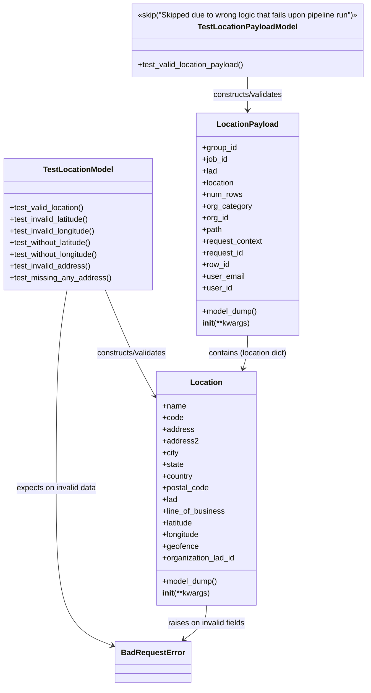

# Diagram: common/location_service/location_service_tests/unit/models/test_location_bulk_upload.py

> Auto-generated by Obscura crawlers

## Mermaid

### SVG

<svg id="container" width="766.86328125" xmlns="http://www.w3.org/2000/svg" class="classDiagram" height="1408" viewBox="0 0 766.86328125 1408" role="graphics-document document" aria-roledescription="class"><g><defs><marker id="container_class-aggregationStart" class="marker aggregation class" refX="18" refY="7" markerWidth="190" markerHeight="240" orient="auto"><path d="M 18,7 L9,13 L1,7 L9,1 Z"></path></marker></defs><defs><marker id="container_class-aggregationEnd" class="marker aggregation class" refX="1" refY="7" markerWidth="20" markerHeight="28" orient="auto"><path d="M 18,7 L9,13 L1,7 L9,1 Z"></path></marker></defs><defs><marker id="container_class-extensionStart" class="marker extension class" refX="18" refY="7" markerWidth="190" markerHeight="240" orient="auto"><path d="M 1,7 L18,13 V 1 Z"></path></marker></defs><defs><marker id="container_class-extensionEnd" class="marker extension class" refX="1" refY="7" markerWidth="20" markerHeight="28" orient="auto"><path d="M 1,1 V 13 L18,7 Z"></path></marker></defs><defs><marker id="container_class-compositionStart" class="marker composition class" refX="18" refY="7" markerWidth="190" markerHeight="240" orient="auto"><path d="M 18,7 L9,13 L1,7 L9,1 Z"></path></marker></defs><defs><marker id="container_class-compositionEnd" class="marker composition class" refX="1" refY="7" markerWidth="20" markerHeight="28" orient="auto"><path d="M 18,7 L9,13 L1,7 L9,1 Z"></path></marker></defs><defs><marker id="container_class-dependencyStart" class="marker dependency class" refX="6" refY="7" markerWidth="190" markerHeight="240" orient="auto"><path d="M 5,7 L9,13 L1,7 L9,1 Z"></path></marker></defs><defs><marker id="container_class-dependencyEnd" class="marker dependency class" refX="13" refY="7" markerWidth="20" markerHeight="28" orient="auto"><path d="M 18,7 L9,13 L14,7 L9,1 Z"></path></marker></defs><defs><marker id="container_class-lollipopStart" class="marker lollipop class" refX="13" refY="7" markerWidth="190" markerHeight="240" orient="auto"><circle stroke="black" fill="transparent" cx="7" cy="7" r="6"></circle></marker></defs><defs><marker id="container_class-lollipopEnd" class="marker lollipop class" refX="1" refY="7" markerWidth="190" markerHeight="240" orient="auto"><circle stroke="black" fill="transparent" cx="7" cy="7" r="6"></circle></marker></defs><g class="root"><g class="clusters"></g><g class="edgePaths"><path d="M215.188,595L224.292,616.667C233.396,638.333,251.603,681.667,268.386,717.278C285.168,752.889,300.526,780.779,308.204,794.723L315.883,808.668" id="id_TestLocationModel_Location_1" class="edge-thickness-normal edge-pattern-solid relation" style=";;;" data-edge="true" data-et="edge" data-id="id_TestLocationModel_Location_1" data-points="W3sieCI6MjE1LjE4ODEyNjQ3NDA1NjYyLCJ5Ijo1OTV9LHsieCI6MjY5LjgxMDU0Njg3NSwieSI6NzI1fSx7IngiOjMxOC43NzczNDM3NSwieSI6ODEzLjkyMzYwNzgyMTA0MzF9XQ==" marker-end="url(#container_class-dependencyEnd)"></path><path d="M134.388,595L130.524,616.667C126.66,638.333,118.931,681.667,115.067,749.5C111.203,817.333,111.203,909.667,111.203,1002C111.203,1094.333,111.203,1186.667,131.192,1240.737C151.181,1294.808,191.159,1310.615,211.148,1318.519L231.137,1326.423" id="id_TestLocationModel_BadRequestError_2" class="edge-thickness-normal edge-pattern-solid relation" style=";;;" data-edge="true" data-et="edge" data-id="id_TestLocationModel_BadRequestError_2" data-points="W3sieCI6MTM0LjM4ODExOTEwMzc3MzYsInkiOjU5NX0seyJ4IjoxMTEuMjAzMTI1LCJ5Ijo3MjV9LHsieCI6MTExLjIwMzEyNSwieSI6MTAwMn0seyJ4IjoxMTEuMjAzMTI1LCJ5IjoxMjc5fSx7IngiOjIzNi43MTY3OTY4NzUsInkiOjEzMjguNjI4Nzg5Mjg1ODg4OH1d" marker-end="url(#container_class-dependencyEnd)"></path><path d="M511.426,158L511.426,164.167C511.426,170.333,511.426,182.667,511.426,194C511.426,205.333,511.426,215.667,511.426,220.833L511.426,226" id="id_TestLocationPayloadModel_LocationPayload_3" class="edge-thickness-normal edge-pattern-solid relation" style=";;;" data-edge="true" data-et="edge" data-id="id_TestLocationPayloadModel_LocationPayload_3" data-points="W3sieCI6NTExLjQyNTc4MTI1LCJ5IjoxNTh9LHsieCI6NTExLjQyNTc4MTI1LCJ5IjoxOTV9LHsieCI6NTExLjQyNTc4MTI1LCJ5IjoyMzJ9XQ==" marker-end="url(#container_class-dependencyEnd)"></path><path d="M511.426,688L511.426,694.167C511.426,700.333,511.426,712.667,509.749,724.048C508.072,735.429,504.718,745.859,503.041,751.073L501.364,756.288" id="id_LocationPayload_Location_4" class="edge-thickness-normal edge-pattern-solid relation" style=";;;" data-edge="true" data-et="edge" data-id="id_LocationPayload_Location_4" data-points="W3sieCI6NTExLjQyNTc4MTI1LCJ5Ijo2ODh9LHsieCI6NTExLjQyNTc4MTI1LCJ5Ijo3MjV9LHsieCI6NDk5LjUyNjczNzM2NDYyMDk0LCJ5Ijo3NjJ9XQ==" marker-end="url(#container_class-dependencyEnd)"></path><path d="M422.344,1242L422.344,1248.167C422.344,1254.333,422.344,1266.667,414.468,1278.421C406.592,1290.176,390.84,1301.352,382.964,1306.94L375.088,1312.528" id="id_Location_BadRequestError_5" class="edge-thickness-normal edge-pattern-solid relation" style=";;;" data-edge="true" data-et="edge" data-id="id_Location_BadRequestError_5" data-points="W3sieCI6NDIyLjM0Mzc1LCJ5IjoxMjQyfSx7IngiOjQyMi4zNDM3NSwieSI6MTI3OX0seyJ4IjozNzAuMTk0NDk2NjM3NjU4MjMsInkiOjEzMTZ9XQ==" marker-end="url(#container_class-dependencyEnd)"></path></g><g class="edgeLabels"><g class="edgeLabel" transform="translate(262.16102, 706.79431)"><g class="label" data-id="id_TestLocationModel_Location_1" transform="translate(-74.5234375, -12)"><foreignObject width="149.046875" height="24">

constructs/validates

</foreignObject></g></g><g class="edgeLabel" transform="translate(111.203125, 1002)"><g class="label" data-id="id_TestLocationModel_BadRequestError_2" transform="translate(-84.125, -12)"><foreignObject width="168.25" height="24">

expects on invalid data

</foreignObject></g></g><g class="edgeLabel" transform="translate(511.42578125, 195)"><g class="label" data-id="id_TestLocationPayloadModel_LocationPayload_3" transform="translate(-74.5234375, -12)"><foreignObject width="149.046875" height="24">

constructs/validates

</foreignObject></g></g><g class="edgeLabel" transform="translate(511.42578125, 725)"><g class="label" data-id="id_LocationPayload_Location_4" transform="translate(-83.640625, -12)"><foreignObject width="167.28125" height="24">

contains (location dict)

</foreignObject></g></g><g class="edgeLabel" transform="translate(422.34375, 1279)"><g class="label" data-id="id_Location_BadRequestError_5" transform="translate(-81.109375, -12)"><foreignObject width="162.21875" height="24">

raises on invalid fields

</foreignObject></g></g></g><g class="nodes"><g class="node default" id="classId-Location-0" transform="translate(422.34375, 1002)"><g class="basic label-container"><path d="M-103.56640625 -240 L103.56640625 -240 L103.56640625 240 L-103.56640625 240" stroke="none" stroke-width="0" fill="#ECECFF" style=""></path><path d="M-103.56640625 -240 C-54.75521682301349 -240, -5.944027396026982 -240, 103.56640625 -240 M-103.56640625 -240 C-42.111394247602966 -240, 19.343617754794067 -240, 103.56640625 -240 M103.56640625 -240 C103.56640625 -87.49178395310264, 103.56640625 65.01643209379472, 103.56640625 240 M103.56640625 -240 C103.56640625 -135.10945815653145, 103.56640625 -30.218916313062863, 103.56640625 240 M103.56640625 240 C46.81562829392972 240, -9.93514966214056 240, -103.56640625 240 M103.56640625 240 C35.08709924130649 240, -33.39220776738702 240, -103.56640625 240 M-103.56640625 240 C-103.56640625 97.6439745561828, -103.56640625 -44.712050887634405, -103.56640625 -240 M-103.56640625 240 C-103.56640625 96.24748033547311, -103.56640625 -47.50503932905377, -103.56640625 -240" stroke="#9370DB" stroke-width="1.3" fill="none" stroke-dasharray="0 0" style=""></path></g><g class="annotation-group text" transform="translate(0, -216)"></g><g class="label-group text" transform="translate(-31.3515625, -216)"><g class="label" style="font-weight: bolder" transform="translate(0,-12)"><foreignObject width="62.703125" height="24">

Location

</foreignObject></g></g><g class="members-group text" transform="translate(-91.56640625, -168)"><g class="label" style="" transform="translate(0,-12)"><foreignObject width="48.5" height="24">

+name

</foreignObject></g><g class="label" style="" transform="translate(0,12)"><foreignObject width="42.953125" height="24">

+code

</foreignObject></g><g class="label" style="" transform="translate(0,36)"><foreignObject width="64.796875" height="24">

+address

</foreignObject></g><g class="label" style="" transform="translate(0,60)"><foreignObject width="72.546875" height="24">

+address2

</foreignObject></g><g class="label" style="" transform="translate(0,84)"><foreignObject width="33.71875" height="24">

+city

</foreignObject></g><g class="label" style="" transform="translate(0,108)"><foreignObject width="44.09375" height="24">

+state

</foreignObject></g><g class="label" style="" transform="translate(0,132)"><foreignObject width="63.171875" height="24">

+country

</foreignObject></g><g class="label" style="" transform="translate(0,156)"><foreignObject width="96.171875" height="24">

+postal_code

</foreignObject></g><g class="label" style="" transform="translate(0,180)"><foreignObject width="30.875" height="24">

+lad

</foreignObject></g><g class="label" style="" transform="translate(0,204)"><foreignObject width="129.1875" height="24">

+line_of_business

</foreignObject></g><g class="label" style="" transform="translate(0,228)"><foreignObject width="64.96875" height="24">

+latitude

</foreignObject></g><g class="label" style="" transform="translate(0,252)"><foreignObject width="77.53125" height="24">

+longitude

</foreignObject></g><g class="label" style="" transform="translate(0,276)"><foreignObject width="73.46875" height="24">

+geofence

</foreignObject></g><g class="label" style="" transform="translate(0,300)"><foreignObject width="151.78125" height="24">

+organization_lad_id

</foreignObject></g></g><g class="methods-group text" transform="translate(-91.56640625, 192)"><g class="label" style="" transform="translate(0,-12)"><foreignObject width="114.484375" height="24">

+model_dump()

</foreignObject></g><g class="label" style="" transform="translate(0,12)"><foreignObject width="98.71875" height="24">

<strong>init</strong>(**kwargs)

</foreignObject></g></g><g class="divider" style=""><path d="M-103.56640625 -192 C-30.473910652831435 -192, 42.61858494433713 -192, 103.56640625 -192 M-103.56640625 -192 C-52.290132769627704 -192, -1.0138592892554072 -192, 103.56640625 -192" stroke="#9370DB" stroke-width="1.3" fill="none" stroke-dasharray="0 0" style=""></path></g><g class="divider" style=""><path d="M-103.56640625 168 C-32.93134502490538 168, 37.703716200189234 168, 103.56640625 168 M-103.56640625 168 C-61.63214875602612 168, -19.697891262052238 168, 103.56640625 168" stroke="#9370DB" stroke-width="1.3" fill="none" stroke-dasharray="0 0" style=""></path></g></g><g class="node default" id="classId-LocationPayload-1" transform="translate(511.42578125, 460)"><g class="basic label-container"><path d="M-104.6015625 -228 L104.6015625 -228 L104.6015625 228 L-104.6015625 228" stroke="none" stroke-width="0" fill="#ECECFF" style=""></path><path d="M-104.6015625 -228 C-54.367594334649475 -228, -4.1336261692989495 -228, 104.6015625 -228 M-104.6015625 -228 C-60.39220838995688 -228, -16.182854279913755 -228, 104.6015625 -228 M104.6015625 -228 C104.6015625 -116.75533634426566, 104.6015625 -5.510672688531315, 104.6015625 228 M104.6015625 -228 C104.6015625 -59.13355046212129, 104.6015625 109.73289907575742, 104.6015625 228 M104.6015625 228 C57.44247492838243 228, 10.283387356764862 228, -104.6015625 228 M104.6015625 228 C29.613021249322813 228, -45.375520001354374 228, -104.6015625 228 M-104.6015625 228 C-104.6015625 123.2612026961498, -104.6015625 18.52240539229959, -104.6015625 -228 M-104.6015625 228 C-104.6015625 106.40986309692676, -104.6015625 -15.180273806146488, -104.6015625 -228" stroke="#9370DB" stroke-width="1.3" fill="none" stroke-dasharray="0 0" style=""></path></g><g class="annotation-group text" transform="translate(0, -204)"></g><g class="label-group text" transform="translate(-60.25, -204)"><g class="label" style="font-weight: bolder" transform="translate(0,-12)"><foreignObject width="120.5" height="24">

LocationPayload

</foreignObject></g></g><g class="members-group text" transform="translate(-92.6015625, -156)"><g class="label" style="" transform="translate(0,-12)"><foreignObject width="72.25" height="24">

+group_id

</foreignObject></g><g class="label" style="" transform="translate(0,12)"><foreignObject width="53.234375" height="24">

+job_id

</foreignObject></g><g class="label" style="" transform="translate(0,36)"><foreignObject width="30.875" height="24">

+lad

</foreignObject></g><g class="label" style="" transform="translate(0,60)"><foreignObject width="67.140625" height="24">

+location

</foreignObject></g><g class="label" style="" transform="translate(0,84)"><foreignObject width="82.703125" height="24">

+num_rows

</foreignObject></g><g class="label" style="" transform="translate(0,108)"><foreignObject width="101.5625" height="24">

+org_category

</foreignObject></g><g class="label" style="" transform="translate(0,132)"><foreignObject width="54.0625" height="24">

+org_id

</foreignObject></g><g class="label" style="" transform="translate(0,156)"><foreignObject width="41.1875" height="24">

+path

</foreignObject></g><g class="label" style="" transform="translate(0,180)"><foreignObject width="124.953125" height="24">

+request_context

</foreignObject></g><g class="label" style="" transform="translate(0,204)"><foreignObject width="85.65625" height="24">

+request_id

</foreignObject></g><g class="label" style="" transform="translate(0,228)"><foreignObject width="56.578125" height="24">

+row_id

</foreignObject></g><g class="label" style="" transform="translate(0,252)"><foreignObject width="86.734375" height="24">

+user_email

</foreignObject></g><g class="label" style="" transform="translate(0,276)"><foreignObject width="60.796875" height="24">

+user_id

</foreignObject></g></g><g class="methods-group text" transform="translate(-92.6015625, 180)"><g class="label" style="" transform="translate(0,-12)"><foreignObject width="114.484375" height="24">

+model_dump()

</foreignObject></g><g class="label" style="" transform="translate(0,12)"><foreignObject width="98.71875" height="24">

<strong>init</strong>(**kwargs)

</foreignObject></g></g><g class="divider" style=""><path d="M-104.6015625 -180 C-50.76768434330499 -180, 3.066193813390015 -180, 104.6015625 -180 M-104.6015625 -180 C-40.0345321249206 -180, 24.532498250158795 -180, 104.6015625 -180" stroke="#9370DB" stroke-width="1.3" fill="none" stroke-dasharray="0 0" style=""></path></g><g class="divider" style=""><path d="M-104.6015625 156 C-61.562611899669484 156, -18.52366129933897 156, 104.6015625 156 M-104.6015625 156 C-44.178739740509926 156, 16.24408301898015 156, 104.6015625 156" stroke="#9370DB" stroke-width="1.3" fill="none" stroke-dasharray="0 0" style=""></path></g></g><g class="node default" id="classId-TestLocationModel-2" transform="translate(158.46484375, 460)"><g class="basic label-container"><path d="M-150.46484375 -135 L150.46484375 -135 L150.46484375 135 L-150.46484375 135" stroke="none" stroke-width="0" fill="#ECECFF" style=""></path><path d="M-150.46484375 -135 C-52.95568327628693 -135, 44.55347719742613 -135, 150.46484375 -135 M-150.46484375 -135 C-75.49321992676353 -135, -0.5215961035270595 -135, 150.46484375 -135 M150.46484375 -135 C150.46484375 -76.20598402535691, 150.46484375 -17.41196805071381, 150.46484375 135 M150.46484375 -135 C150.46484375 -72.26493228601876, 150.46484375 -9.529864572037539, 150.46484375 135 M150.46484375 135 C90.01710778729273 135, 29.569371824585474 135, -150.46484375 135 M150.46484375 135 C87.59907247054028 135, 24.733301191080557 135, -150.46484375 135 M-150.46484375 135 C-150.46484375 68.99098138763375, -150.46484375 2.9819627752675046, -150.46484375 -135 M-150.46484375 135 C-150.46484375 78.51760338085697, -150.46484375 22.035206761713937, -150.46484375 -135" stroke="#9370DB" stroke-width="1.3" fill="none" stroke-dasharray="0 0" style=""></path></g><g class="annotation-group text" transform="translate(0, -111)"></g><g class="label-group text" transform="translate(-69.1484375, -111)"><g class="label" style="font-weight: bolder" transform="translate(0,-12)"><foreignObject width="138.296875" height="24">

TestLocationModel

</foreignObject></g></g><g class="members-group text" transform="translate(-138.46484375, -63)"></g><g class="methods-group text" transform="translate(-138.46484375, -33)"><g class="label" style="" transform="translate(0,-12)"><foreignObject width="155.859375" height="24">

+test_valid_location()

</foreignObject></g><g class="label" style="" transform="translate(0,12)"><foreignObject width="167.9375" height="24">

+test_invalid_latitude()

</foreignObject></g><g class="label" style="" transform="translate(0,36)"><foreignObject width="180.5" height="24">

+test_invalid_longitude()

</foreignObject></g><g class="label" style="" transform="translate(0,60)"><foreignObject width="174.484375" height="24">

+test_without_latitude()

</foreignObject></g><g class="label" style="" transform="translate(0,84)"><foreignObject width="187.046875" height="24">

+test_without_longitude()

</foreignObject></g><g class="label" style="" transform="translate(0,108)"><foreignObject width="167.84375" height="24">

+test_invalid_address()

</foreignObject></g><g class="label" style="" transform="translate(0,132)"><foreignObject width="207.78125" height="24">

+test_missing_any_address()

</foreignObject></g></g><g class="divider" style=""><path d="M-150.46484375 -87 C-43.53268659121004 -87, 63.399470567579925 -87, 150.46484375 -87 M-150.46484375 -87 C-38.480194522150526 -87, 73.50445470569895 -87, 150.46484375 -87" stroke="#9370DB" stroke-width="1.3" fill="none" stroke-dasharray="0 0" style=""></path></g><g class="divider" style=""><path d="M-150.46484375 -63 C-78.29536187915087 -63, -6.125880008301749 -63, 150.46484375 -63 M-150.46484375 -63 C-70.00566904672912 -63, 10.45350565654175 -63, 150.46484375 -63" stroke="#9370DB" stroke-width="1.3" fill="none" stroke-dasharray="0 0" style=""></path></g></g><g class="node default" id="classId-TestLocationPayloadModel-3" transform="translate(511.42578125, 83)"><g class="basic label-container"><path d="M-247.4375 -75 L247.4375 -75 L247.4375 75 L-247.4375 75" stroke="none" stroke-width="0" fill="#ECECFF" style=""></path><path d="M-247.4375 -75 C-58.63458068220015 -75, 130.1683386355997 -75, 247.4375 -75 M-247.4375 -75 C-59.910157737964454 -75, 127.61718452407109 -75, 247.4375 -75 M247.4375 -75 C247.4375 -29.357065767968415, 247.4375 16.28586846406317, 247.4375 75 M247.4375 -75 C247.4375 -44.69013782025513, 247.4375 -14.38027564051027, 247.4375 75 M247.4375 75 C80.51284891206029 75, -86.41180217587942 75, -247.4375 75 M247.4375 75 C54.060801684010585 75, -139.31589663197883 75, -247.4375 75 M-247.4375 75 C-247.4375 17.524950075558912, -247.4375 -39.950099848882175, -247.4375 -75 M-247.4375 75 C-247.4375 29.28474803584278, -247.4375 -16.430503928314437, -247.4375 -75" stroke="#9370DB" stroke-width="1.3" fill="none" stroke-dasharray="0 0" style=""></path></g><g class="annotation-group text" transform="translate(-235.4375, -51)"><g class="label" style="" transform="translate(0,-12)"><foreignObject width="470.875" height="24">

«skip("Skipped due to wrong logic that fails upon pipeline run")»

</foreignObject></g></g><g class="label-group text" transform="translate(-98.0546875, -27)"><g class="label" style="font-weight: bolder" transform="translate(0,-12)"><foreignObject width="196.109375" height="24">

TestLocationPayloadModel

</foreignObject></g></g><g class="members-group text" transform="translate(-235.4375, 21)"></g><g class="methods-group text" transform="translate(-235.4375, 51)"><g class="label" style="" transform="translate(0,-12)"><foreignObject width="221.921875" height="24">

+test_valid_location_payload()

</foreignObject></g></g><g class="divider" style=""><path d="M-247.4375 -3 C-133.38860772370256 -3, -19.339715447405126 -3, 247.4375 -3 M-247.4375 -3 C-70.76626591105506 -3, 105.90496817788988 -3, 247.4375 -3" stroke="#9370DB" stroke-width="1.3" fill="none" stroke-dasharray="0 0" style=""></path></g><g class="divider" style=""><path d="M-247.4375 21 C-86.03050085851723 21, 75.37649828296554 21, 247.4375 21 M-247.4375 21 C-49.596842856025006 21, 148.24381428795 21, 247.4375 21" stroke="#9370DB" stroke-width="1.3" fill="none" stroke-dasharray="0 0" style=""></path></g></g><g class="node default" id="classId-BadRequestError-4" transform="translate(310.998046875, 1358)"><g class="basic label-container"><path d="M-74.28125 -42 L74.28125 -42 L74.28125 42 L-74.28125 42" stroke="none" stroke-width="0" fill="#ECECFF" style=""></path><path d="M-74.28125 -42 C-28.131969146735337 -42, 18.017311706529327 -42, 74.28125 -42 M-74.28125 -42 C-34.07307090503984 -42, 6.135108189920317 -42, 74.28125 -42 M74.28125 -42 C74.28125 -13.294692530980516, 74.28125 15.410614938038968, 74.28125 42 M74.28125 -42 C74.28125 -17.55047956655768, 74.28125 6.89904086688464, 74.28125 42 M74.28125 42 C41.06516378122786 42, 7.849077562455719 42, -74.28125 42 M74.28125 42 C25.1132820043019 42, -24.054685991396198 42, -74.28125 42 M-74.28125 42 C-74.28125 13.764622423969644, -74.28125 -14.470755152060711, -74.28125 -42 M-74.28125 42 C-74.28125 9.350736439925399, -74.28125 -23.298527120149203, -74.28125 -42" stroke="#9370DB" stroke-width="1.3" fill="none" stroke-dasharray="0 0" style=""></path></g><g class="annotation-group text" transform="translate(0, -18)"></g><g class="label-group text" transform="translate(-62.28125, -18)"><g class="label" style="font-weight: bolder" transform="translate(0,-12)"><foreignObject width="124.5625" height="24">

BadRequestError

</foreignObject></g></g><g class="members-group text" transform="translate(-62.28125, 30)"></g><g class="methods-group text" transform="translate(-62.28125, 60)"></g><g class="divider" style=""><path d="M-74.28125 6 C-30.607468176596534 6, 13.066313646806933 6, 74.28125 6 M-74.28125 6 C-37.03939925115551 6, 0.2024514976889833 6, 74.28125 6" stroke="#9370DB" stroke-width="1.3" fill="none" stroke-dasharray="0 0" style=""></path></g><g class="divider" style=""><path d="M-74.28125 24 C-34.495464749258325 24, 5.29032050148335 24, 74.28125 24 M-74.28125 24 C-24.53864230066437 24, 25.203965398671258 24, 74.28125 24" stroke="#9370DB" stroke-width="1.3" fill="none" stroke-dasharray="0 0" style=""></path></g></g></g></g></g></svg>
