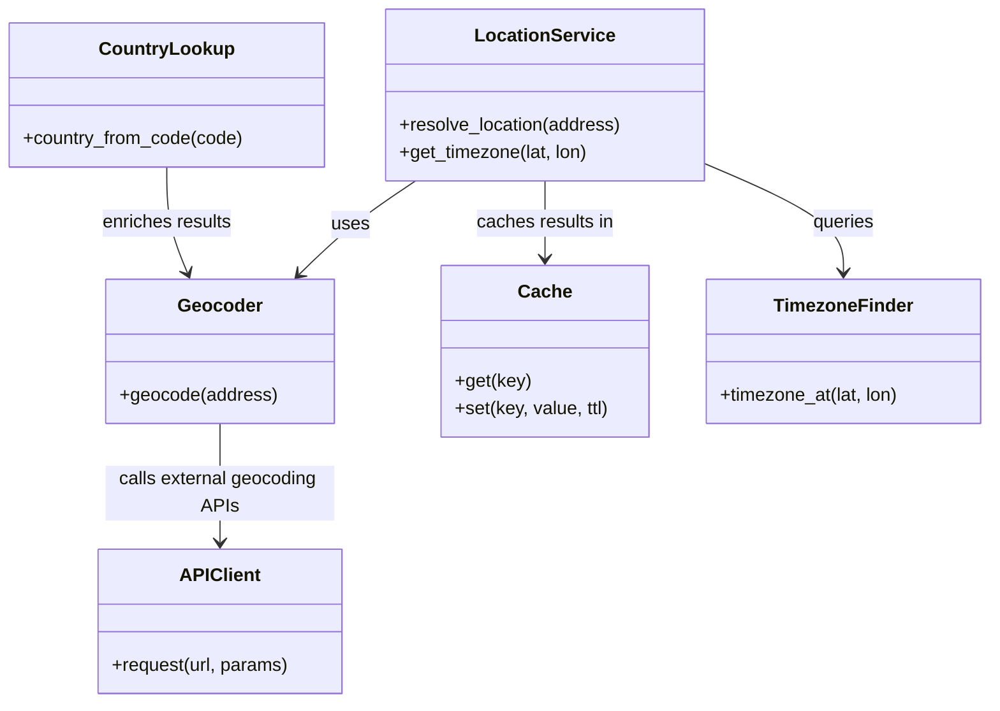

# Diagram: common/location_service/pyproject.toml


> Auto-generated by Obscura crawlers

## Diagram 1



### SVG

<svg id="container" width="861.34375" xmlns="http://www.w3.org/2000/svg" class="classDiagram" height="614" viewBox="0 0 861.34375 614" role="graphics-document document" aria-roledescription="class"><style>#container{font-family:"trebuchet ms",verdana,arial,sans-serif;font-size:16px;fill:#333;}@keyframes edge-animation-frame{from{stroke-dashoffset:0;}}@keyframes dash{to{stroke-dashoffset:0;}}#container .edge-animation-slow{stroke-dasharray:9,5!important;stroke-dashoffset:900;animation:dash 50s linear infinite;stroke-linecap:round;}#container .edge-animation-fast{stroke-dasharray:9,5!important;stroke-dashoffset:900;animation:dash 20s linear infinite;stroke-linecap:round;}#container .error-icon{fill:#552222;}#container .error-text{fill:#552222;stroke:#552222;}#container .edge-thickness-normal{stroke-width:1px;}#container .edge-thickness-thick{stroke-width:3.5px;}#container .edge-pattern-solid{stroke-dasharray:0;}#container .edge-thickness-invisible{stroke-width:0;fill:none;}#container .edge-pattern-dashed{stroke-dasharray:3;}#container .edge-pattern-dotted{stroke-dasharray:2;}#container .marker{fill:#333333;stroke:#333333;}#container .marker.cross{stroke:#333333;}#container svg{font-family:"trebuchet ms",verdana,arial,sans-serif;font-size:16px;}#container p{margin:0;}#container g.classGroup text{fill:#9370DB;stroke:none;font-family:"trebuchet ms",verdana,arial,sans-serif;font-size:10px;}#container g.classGroup text .title{font-weight:bolder;}#container .nodeLabel,#container .edgeLabel{color:#131300;}#container .edgeLabel .label rect{fill:#ECECFF;}#container .label text{fill:#131300;}#container .labelBkg{background:#ECECFF;}#container .edgeLabel .label span{background:#ECECFF;}#container .classTitle{font-weight:bolder;}#container .node rect,#container .node circle,#container .node ellipse,#container .node polygon,#container .node path{fill:#ECECFF;stroke:#9370DB;stroke-width:1px;}#container .divider{stroke:#9370DB;stroke-width:1;}#container g.clickable{cursor:pointer;}#container g.classGroup rect{fill:#ECECFF;stroke:#9370DB;}#container g.classGroup line{stroke:#9370DB;stroke-width:1;}#container .classLabel .box{stroke:none;stroke-width:0;fill:#ECECFF;opacity:0.5;}#container .classLabel .label{fill:#9370DB;font-size:10px;}#container .relation{stroke:#333333;stroke-width:1;fill:none;}#container .dashed-line{stroke-dasharray:3;}#container .dotted-line{stroke-dasharray:1 2;}#container #compositionStart,#container .composition{fill:#333333!important;stroke:#333333!important;stroke-width:1;}#container #compositionEnd,#container .composition{fill:#333333!important;stroke:#333333!important;stroke-width:1;}#container #dependencyStart,#container .dependency{fill:#333333!important;stroke:#333333!important;stroke-width:1;}#container #dependencyStart,#container .dependency{fill:#333333!important;stroke:#333333!important;stroke-width:1;}#container #extensionStart,#container .extension{fill:transparent!important;stroke:#333333!important;stroke-width:1;}#container #extensionEnd,#container .extension{fill:transparent!important;stroke:#333333!important;stroke-width:1;}#container #aggregationStart,#container .aggregation{fill:transparent!important;stroke:#333333!important;stroke-width:1;}#container #aggregationEnd,#container .aggregation{fill:transparent!important;stroke:#333333!important;stroke-width:1;}#container #lollipopStart,#container .lollipop{fill:#ECECFF!important;stroke:#333333!important;stroke-width:1;}#container #lollipopEnd,#container .lollipop{fill:#ECECFF!important;stroke:#333333!important;stroke-width:1;}#container .edgeTerminals{font-size:11px;line-height:initial;}#container .classTitleText{text-anchor:middle;font-size:18px;fill:#333;}#container .label-icon{display:inline-block;height:1em;overflow:visible;vertical-align:-0.125em;}#container .node .label-icon path{fill:currentColor;stroke:revert;stroke-width:revert;}#container :root{--mermaid-font-family:"trebuchet ms",verdana,arial,sans-serif;}</style><g><defs><marker id="container_class-aggregationStart" class="marker aggregation class" refX="18" refY="7" markerWidth="190" markerHeight="240" orient="auto"><path d="M 18,7 L9,13 L1,7 L9,1 Z"></path></marker></defs><defs><marker id="container_class-aggregationEnd" class="marker aggregation class" refX="1" refY="7" markerWidth="20" markerHeight="28" orient="auto"><path d="M 18,7 L9,13 L1,7 L9,1 Z"></path></marker></defs><defs><marker id="container_class-extensionStart" class="marker extension class" refX="18" refY="7" markerWidth="190" markerHeight="240" orient="auto"><path d="M 1,7 L18,13 V 1 Z"></path></marker></defs><defs><marker id="container_class-extensionEnd" class="marker extension class" refX="1" refY="7" markerWidth="20" markerHeight="28" orient="auto"><path d="M 1,1 V 13 L18,7 Z"></path></marker></defs><defs><marker id="container_class-compositionStart" class="marker composition class" refX="18" refY="7" markerWidth="190" markerHeight="240" orient="auto"><path d="M 18,7 L9,13 L1,7 L9,1 Z"></path></marker></defs><defs><marker id="container_class-compositionEnd" class="marker composition class" refX="1" refY="7" markerWidth="20" markerHeight="28" orient="auto"><path d="M 18,7 L9,13 L1,7 L9,1 Z"></path></marker></defs><defs><marker id="container_class-dependencyStart" class="marker dependency class" refX="6" refY="7" markerWidth="190" markerHeight="240" orient="auto"><path d="M 5,7 L9,13 L1,7 L9,1 Z"></path></marker></defs><defs><marker id="container_class-dependencyEnd" class="marker dependency class" refX="13" refY="7" markerWidth="20" markerHeight="28" orient="auto"><path d="M 18,7 L9,13 L14,7 L9,1 Z"></path></marker></defs><defs><marker id="container_class-lollipopStart" class="marker lollipop class" refX="13" refY="7" markerWidth="190" markerHeight="240" orient="auto"><circle stroke="black" fill="transparent" cx="7" cy="7" r="6"></circle></marker></defs><defs><marker id="container_class-lollipopEnd" class="marker lollipop class" refX="1" refY="7" markerWidth="190" markerHeight="240" orient="auto"><circle stroke="black" fill="transparent" cx="7" cy="7" r="6"></circle></marker></defs><g class="root"><g class="clusters"></g><g class="edgePaths"><path d="M360.747,158L351.519,164.167C342.291,170.333,323.835,182.667,307.015,196.299C290.196,209.931,275.013,224.862,267.421,232.328L259.83,239.793" id="id_LocationService_Geocoder_1" class="edge-thickness-normal edge-pattern-solid relation" style=";;;" data-edge="true" data-et="edge" data-id="id_LocationService_Geocoder_1" data-points="W3sieCI6MzYwLjc0NzI3OTU3NTg5MjksInkiOjE1OH0seyJ4IjozMDUuMzc4OTA2MjUsInkiOjE5NX0seyJ4IjoyNTUuNTUxNzU3ODEyNSwieSI6MjQ0fV0=" marker-end="url(#container_class-dependencyEnd)"></path><path d="M472.98,158L472.98,164.167C472.98,170.333,472.98,182.667,472.98,194C472.98,205.333,472.98,215.667,472.98,220.833L472.98,226" id="id_LocationService_Cache_2" class="edge-thickness-normal edge-pattern-solid relation" style=";;;" data-edge="true" data-et="edge" data-id="id_LocationService_Cache_2" data-points="W3sieCI6NDcyLjk4MDQ2ODc1LCJ5IjoxNTh9LHsieCI6NDcyLjk4MDQ2ODc1LCJ5IjoxOTV9LHsieCI6NDcyLjk4MDQ2ODc1LCJ5IjoyMzJ9XQ==" marker-end="url(#container_class-dependencyEnd)"></path><path d="M611.32,142.494L631.669,151.245C652.017,159.996,692.714,177.498,713.062,193.416C733.41,209.333,733.41,223.667,733.41,230.833L733.41,238" id="id_LocationService_TimezoneFinder_3" class="edge-thickness-normal edge-pattern-solid relation" style=";;;" data-edge="true" data-et="edge" data-id="id_LocationService_TimezoneFinder_3" data-points="W3sieCI6NjExLjMyMDMxMjUsInkiOjE0Mi40OTQyMjUyODg3MzU1NX0seyJ4Ijo3MzMuNDEwMTU2MjUsInkiOjE5NX0seyJ4Ijo3MzMuNDEwMTU2MjUsInkiOjI0NH1d" marker-end="url(#container_class-dependencyEnd)"></path><path d="M191.488,370L191.488,380.167C191.488,390.333,191.488,410.667,191.488,428C191.488,445.333,191.488,459.667,191.488,466.833L191.488,474" id="id_Geocoder_APIClient_4" class="edge-thickness-normal edge-pattern-solid relation" style=";;;" data-edge="true" data-et="edge" data-id="id_Geocoder_APIClient_4" data-points="W3sieCI6MTkxLjQ4ODI4MTI1LCJ5IjozNzB9LHsieCI6MTkxLjQ4ODI4MTI1LCJ5Ijo0MzF9LHsieCI6MTkxLjQ4ODI4MTI1LCJ5Ijo0ODB9XQ==" marker-end="url(#container_class-dependencyEnd)"></path><path d="M144.395,146L144.395,154.167C144.395,162.333,144.395,178.667,147.441,194.078C150.487,209.49,156.58,223.979,159.626,231.224L162.672,238.469" id="id_CountryLookup_Geocoder_5" class="edge-thickness-normal edge-pattern-solid relation" style=";;;" data-edge="true" data-et="edge" data-id="id_CountryLookup_Geocoder_5" data-points="W3sieCI6MTQ0LjM5NDUzMTI1LCJ5IjoxNDZ9LHsieCI6MTQ0LjM5NDUzMTI1LCJ5IjoxOTV9LHsieCI6MTY0Ljk5ODA0Njg3NSwieSI6MjQ0fV0=" marker-end="url(#container_class-dependencyEnd)"></path></g><g class="edgeLabels"><g class="edgeLabel" transform="translate(304.20582, 196.15362)"><g class="label" data-id="id_LocationService_Geocoder_1" transform="translate(-16.4921875, -12)"><foreignObject width="32.984375" height="24"><div xmlns="http://www.w3.org/1999/xhtml" class="labelBkg" style="display: table-cell; white-space: nowrap; line-height: 1.5; max-width: 200px; text-align: center;"><span class="edgeLabel"><p>uses</p></span></div></foreignObject></g></g><g class="edgeLabel" transform="translate(472.98046875, 195)"><g class="label" data-id="id_LocationService_Cache_2" transform="translate(-60.4609375, -12)"><foreignObject width="120.921875" height="24"><div xmlns="http://www.w3.org/1999/xhtml" class="labelBkg" style="display: table-cell; white-space: nowrap; line-height: 1.5; max-width: 200px; text-align: center;"><span class="edgeLabel"><p>caches results in</p></span></div></foreignObject></g></g><g class="edgeLabel" transform="translate(733.41015625, 195)"><g class="label" data-id="id_LocationService_TimezoneFinder_3" transform="translate(-27.2421875, -12)"><foreignObject width="54.484375" height="24"><div xmlns="http://www.w3.org/1999/xhtml" class="labelBkg" style="display: table-cell; white-space: nowrap; line-height: 1.5; max-width: 200px; text-align: center;"><span class="edgeLabel"><p>queries</p></span></div></foreignObject></g></g><g class="edgeLabel" transform="translate(191.48828125, 431)"><g class="label" data-id="id_Geocoder_APIClient_4" transform="translate(-100, -24)"><foreignObject width="200" height="48"><div xmlns="http://www.w3.org/1999/xhtml" class="labelBkg" style="display: table; white-space: break-spaces; line-height: 1.5; max-width: 200px; text-align: center; width: 200px;"><span class="edgeLabel"><p>calls external geocoding APIs</p></span></div></foreignObject></g></g><g class="edgeLabel" transform="translate(144.39453125, 195)"><g class="label" data-id="id_CountryLookup_Geocoder_5" transform="translate(-57.6953125, -12)"><foreignObject width="115.390625" height="24"><div xmlns="http://www.w3.org/1999/xhtml" class="labelBkg" style="display: table-cell; white-space: nowrap; line-height: 1.5; max-width: 200px; text-align: center;"><span class="edgeLabel"><p>enriches results</p></span></div></foreignObject></g></g></g><g class="nodes"><g class="node default" id="classId-LocationService-0" transform="translate(472.98046875, 83)"><g class="basic label-container"><path d="M-138.33984375 -75 L138.33984375 -75 L138.33984375 75 L-138.33984375 75" stroke="none" stroke-width="0" fill="#ECECFF" style=""></path><path d="M-138.33984375 -75 C-77.93945867769337 -75, -17.539073605386733 -75, 138.33984375 -75 M-138.33984375 -75 C-41.92759762057774 -75, 54.484648508844515 -75, 138.33984375 -75 M138.33984375 -75 C138.33984375 -19.08775539195299, 138.33984375 36.82448921609402, 138.33984375 75 M138.33984375 -75 C138.33984375 -31.045978239860375, 138.33984375 12.90804352027925, 138.33984375 75 M138.33984375 75 C65.39787344960519 75, -7.544096850789629 75, -138.33984375 75 M138.33984375 75 C72.49070229504177 75, 6.641560840083542 75, -138.33984375 75 M-138.33984375 75 C-138.33984375 28.896348539707404, -138.33984375 -17.207302920585192, -138.33984375 -75 M-138.33984375 75 C-138.33984375 20.136639905908183, -138.33984375 -34.726720188183634, -138.33984375 -75" stroke="#9370DB" stroke-width="1.3" fill="none" stroke-dasharray="0 0" style=""></path></g><g class="annotation-group text" transform="translate(0, -51)"></g><g class="label-group text" transform="translate(-57.9921875, -51)"><g class="label" style="font-weight: bolder" transform="translate(0,-12)"><foreignObject width="115.984375" height="24"><div xmlns="http://www.w3.org/1999/xhtml" style="display: table-cell; white-space: nowrap; line-height: 1.5; max-width: 164px; text-align: center;"><span class="nodeLabel markdown-node-label" style=""><p>LocationService</p></span></div></foreignObject></g></g><g class="members-group text" transform="translate(-126.33984375, -3)"></g><g class="methods-group text" transform="translate(-126.33984375, 27)"><g class="label" style="" transform="translate(0,-12)"><foreignObject width="194.6875" height="24"><div xmlns="http://www.w3.org/1999/xhtml" style="display: table-cell; white-space: nowrap; line-height: 1.5; max-width: 252px; text-align: center;"><span class="nodeLabel markdown-node-label" style=""><p>+resolve_location(address)</p></span></div></foreignObject></g><g class="label" style="" transform="translate(0,12)"><foreignObject width="166.40625" height="24"><div xmlns="http://www.w3.org/1999/xhtml" style="display: table-cell; white-space: nowrap; line-height: 1.5; max-width: 224px; text-align: center;"><span class="nodeLabel markdown-node-label" style=""><p>+get_timezone(lat, lon)</p></span></div></foreignObject></g></g><g class="divider" style=""><path d="M-138.33984375 -27 C-36.8858956342205 -27, 64.568052481559 -27, 138.33984375 -27 M-138.33984375 -27 C-68.045904204324 -27, 2.2480353413519936 -27, 138.33984375 -27" stroke="#9370DB" stroke-width="1.3" fill="none" stroke-dasharray="0 0" style=""></path></g><g class="divider" style=""><path d="M-138.33984375 -3 C-51.009941409923314 -3, 36.31996093015337 -3, 138.33984375 -3 M-138.33984375 -3 C-46.23210612837799 -3, 45.875631493244015 -3, 138.33984375 -3" stroke="#9370DB" stroke-width="1.3" fill="none" stroke-dasharray="0 0" style=""></path></g></g><g class="node default" id="classId-Geocoder-1" transform="translate(191.48828125, 307)"><g class="basic label-container"><path d="M-97.75390625 -63 L97.75390625 -63 L97.75390625 63 L-97.75390625 63" stroke="none" stroke-width="0" fill="#ECECFF" style=""></path><path d="M-97.75390625 -63 C-26.944670661093554 -63, 43.86456492781289 -63, 97.75390625 -63 M-97.75390625 -63 C-37.329534541185296 -63, 23.094837167629407 -63, 97.75390625 -63 M97.75390625 -63 C97.75390625 -27.627842410810544, 97.75390625 7.744315178378912, 97.75390625 63 M97.75390625 -63 C97.75390625 -35.326733316598656, 97.75390625 -7.653466633197311, 97.75390625 63 M97.75390625 63 C28.25891561551886 63, -41.23607501896228 63, -97.75390625 63 M97.75390625 63 C38.98532407654676 63, -19.78325809690648 63, -97.75390625 63 M-97.75390625 63 C-97.75390625 35.528500095253165, -97.75390625 8.057000190506322, -97.75390625 -63 M-97.75390625 63 C-97.75390625 32.66318252003809, -97.75390625 2.3263650400761904, -97.75390625 -63" stroke="#9370DB" stroke-width="1.3" fill="none" stroke-dasharray="0 0" style=""></path></g><g class="annotation-group text" transform="translate(0, -39)"></g><g class="label-group text" transform="translate(-35.0234375, -39)"><g class="label" style="font-weight: bolder" transform="translate(0,-12)"><foreignObject width="70.046875" height="24"><div xmlns="http://www.w3.org/1999/xhtml" style="display: table-cell; white-space: nowrap; line-height: 1.5; max-width: 120px; text-align: center;"><span class="nodeLabel markdown-node-label" style=""><p>Geocoder</p></span></div></foreignObject></g></g><g class="members-group text" transform="translate(-85.75390625, 9)"></g><g class="methods-group text" transform="translate(-85.75390625, 39)"><g class="label" style="" transform="translate(0,-12)"><foreignObject width="136.484375" height="24"><div xmlns="http://www.w3.org/1999/xhtml" style="display: table-cell; white-space: nowrap; line-height: 1.5; max-width: 194px; text-align: center;"><span class="nodeLabel markdown-node-label" style=""><p>+geocode(address)</p></span></div></foreignObject></g></g><g class="divider" style=""><path d="M-97.75390625 -15 C-24.01756386625506 -15, 49.71877851748988 -15, 97.75390625 -15 M-97.75390625 -15 C-23.58770146229145 -15, 50.5785033254171 -15, 97.75390625 -15" stroke="#9370DB" stroke-width="1.3" fill="none" stroke-dasharray="0 0" style=""></path></g><g class="divider" style=""><path d="M-97.75390625 9 C-52.34672961327263 9, -6.939552976545258 9, 97.75390625 9 M-97.75390625 9 C-49.765418607779836 9, -1.7769309655596714 9, 97.75390625 9" stroke="#9370DB" stroke-width="1.3" fill="none" stroke-dasharray="0 0" style=""></path></g></g><g class="node default" id="classId-Cache-2" transform="translate(472.98046875, 307)"><g class="basic label-container"><path d="M-90.49609375 -75 L90.49609375 -75 L90.49609375 75 L-90.49609375 75" stroke="none" stroke-width="0" fill="#ECECFF" style=""></path><path d="M-90.49609375 -75 C-35.46959213635438 -75, 19.556909477291242 -75, 90.49609375 -75 M-90.49609375 -75 C-25.410196868114014 -75, 39.67570001377197 -75, 90.49609375 -75 M90.49609375 -75 C90.49609375 -33.91894320415439, 90.49609375 7.162113591691224, 90.49609375 75 M90.49609375 -75 C90.49609375 -30.66626694231703, 90.49609375 13.66746611536594, 90.49609375 75 M90.49609375 75 C34.9324605891223 75, -20.6311725717554 75, -90.49609375 75 M90.49609375 75 C19.657790816740018 75, -51.180512116519964 75, -90.49609375 75 M-90.49609375 75 C-90.49609375 43.21446453476939, -90.49609375 11.428929069538789, -90.49609375 -75 M-90.49609375 75 C-90.49609375 24.147352746138587, -90.49609375 -26.705294507722826, -90.49609375 -75" stroke="#9370DB" stroke-width="1.3" fill="none" stroke-dasharray="0 0" style=""></path></g><g class="annotation-group text" transform="translate(0, -51)"></g><g class="label-group text" transform="translate(-21.7734375, -51)"><g class="label" style="font-weight: bolder" transform="translate(0,-12)"><foreignObject width="43.546875" height="24"><div xmlns="http://www.w3.org/1999/xhtml" style="display: table-cell; white-space: nowrap; line-height: 1.5; max-width: 93px; text-align: center;"><span class="nodeLabel markdown-node-label" style=""><p>Cache</p></span></div></foreignObject></g></g><g class="members-group text" transform="translate(-78.49609375, -3)"></g><g class="methods-group text" transform="translate(-78.49609375, 27)"><g class="label" style="" transform="translate(0,-12)"><foreignObject width="65.5" height="24"><div xmlns="http://www.w3.org/1999/xhtml" style="display: table-cell; white-space: nowrap; line-height: 1.5; max-width: 123px; text-align: center;"><span class="nodeLabel markdown-node-label" style=""><p>+get(key)</p></span></div></foreignObject></g><g class="label" style="" transform="translate(0,12)"><foreignObject width="135.21875" height="24"><div xmlns="http://www.w3.org/1999/xhtml" style="display: table-cell; white-space: nowrap; line-height: 1.5; max-width: 193px; text-align: center;"><span class="nodeLabel markdown-node-label" style=""><p>+set(key, value, ttl)</p></span></div></foreignObject></g></g><g class="divider" style=""><path d="M-90.49609375 -27 C-42.69972821606823 -27, 5.096637317863539 -27, 90.49609375 -27 M-90.49609375 -27 C-35.83440888433785 -27, 18.827275981324306 -27, 90.49609375 -27" stroke="#9370DB" stroke-width="1.3" fill="none" stroke-dasharray="0 0" style=""></path></g><g class="divider" style=""><path d="M-90.49609375 -3 C-18.932872284295 -3, 52.63034918141 -3, 90.49609375 -3 M-90.49609375 -3 C-27.96896386928033 -3, 34.55816601143934 -3, 90.49609375 -3" stroke="#9370DB" stroke-width="1.3" fill="none" stroke-dasharray="0 0" style=""></path></g></g><g class="node default" id="classId-APIClient-3" transform="translate(191.48828125, 543)"><g class="basic label-container"><path d="M-106.3203125 -63 L106.3203125 -63 L106.3203125 63 L-106.3203125 63" stroke="none" stroke-width="0" fill="#ECECFF" style=""></path><path d="M-106.3203125 -63 C-35.59329016117695 -63, 35.133732177646095 -63, 106.3203125 -63 M-106.3203125 -63 C-39.01653881235438 -63, 28.287234875291233 -63, 106.3203125 -63 M106.3203125 -63 C106.3203125 -34.7258004103038, 106.3203125 -6.451600820607595, 106.3203125 63 M106.3203125 -63 C106.3203125 -36.01692154601992, 106.3203125 -9.033843092039845, 106.3203125 63 M106.3203125 63 C23.884467605174095 63, -58.55137728965181 63, -106.3203125 63 M106.3203125 63 C59.00005505782989 63, 11.67979761565978 63, -106.3203125 63 M-106.3203125 63 C-106.3203125 14.988574805255666, -106.3203125 -33.02285038948867, -106.3203125 -63 M-106.3203125 63 C-106.3203125 30.912029424111346, -106.3203125 -1.1759411517773088, -106.3203125 -63" stroke="#9370DB" stroke-width="1.3" fill="none" stroke-dasharray="0 0" style=""></path></g><g class="annotation-group text" transform="translate(0, -39)"></g><g class="label-group text" transform="translate(-33.140625, -39)"><g class="label" style="font-weight: bolder" transform="translate(0,-12)"><foreignObject width="66.28125" height="24"><div xmlns="http://www.w3.org/1999/xhtml" style="display: table-cell; white-space: nowrap; line-height: 1.5; max-width: 115px; text-align: center;"><span class="nodeLabel markdown-node-label" style=""><p>APIClient</p></span></div></foreignObject></g></g><g class="members-group text" transform="translate(-94.3203125, 9)"></g><g class="methods-group text" transform="translate(-94.3203125, 39)"><g class="label" style="" transform="translate(0,-12)"><foreignObject width="155.5" height="24"><div xmlns="http://www.w3.org/1999/xhtml" style="display: table-cell; white-space: nowrap; line-height: 1.5; max-width: 213px; text-align: center;"><span class="nodeLabel markdown-node-label" style=""><p>+request(url, params)</p></span></div></foreignObject></g></g><g class="divider" style=""><path d="M-106.3203125 -15 C-42.18255340575155 -15, 21.955205688496903 -15, 106.3203125 -15 M-106.3203125 -15 C-56.37607646096111 -15, -6.431840421922217 -15, 106.3203125 -15" stroke="#9370DB" stroke-width="1.3" fill="none" stroke-dasharray="0 0" style=""></path></g><g class="divider" style=""><path d="M-106.3203125 9 C-26.89042153432571 9, 52.53946943134858 9, 106.3203125 9 M-106.3203125 9 C-36.80171543813637 9, 32.71688162372726 9, 106.3203125 9" stroke="#9370DB" stroke-width="1.3" fill="none" stroke-dasharray="0 0" style=""></path></g></g><g class="node default" id="classId-TimezoneFinder-4" transform="translate(733.41015625, 307)"><g class="basic label-container"><path d="M-119.93359375 -63 L119.93359375 -63 L119.93359375 63 L-119.93359375 63" stroke="none" stroke-width="0" fill="#ECECFF" style=""></path><path d="M-119.93359375 -63 C-49.44880908478055 -63, 21.0359755804389 -63, 119.93359375 -63 M-119.93359375 -63 C-51.160138170356404 -63, 17.61331740928719 -63, 119.93359375 -63 M119.93359375 -63 C119.93359375 -36.950572947949254, 119.93359375 -10.901145895898502, 119.93359375 63 M119.93359375 -63 C119.93359375 -33.52570250916183, 119.93359375 -4.051405018323656, 119.93359375 63 M119.93359375 63 C40.11649452257576 63, -39.70060470484847 63, -119.93359375 63 M119.93359375 63 C29.944727070198823 63, -60.044139609602354 63, -119.93359375 63 M-119.93359375 63 C-119.93359375 25.693591698860935, -119.93359375 -11.61281660227813, -119.93359375 -63 M-119.93359375 63 C-119.93359375 37.12708255353158, -119.93359375 11.254165107063166, -119.93359375 -63" stroke="#9370DB" stroke-width="1.3" fill="none" stroke-dasharray="0 0" style=""></path></g><g class="annotation-group text" transform="translate(0, -39)"></g><g class="label-group text" transform="translate(-57.9453125, -39)"><g class="label" style="font-weight: bolder" transform="translate(0,-12)"><foreignObject width="115.890625" height="24"><div xmlns="http://www.w3.org/1999/xhtml" style="display: table-cell; white-space: nowrap; line-height: 1.5; max-width: 166px; text-align: center;"><span class="nodeLabel markdown-node-label" style=""><p>TimezoneFinder</p></span></div></foreignObject></g></g><g class="members-group text" transform="translate(-107.93359375, 9)"></g><g class="methods-group text" transform="translate(-107.93359375, 39)"><g class="label" style="" transform="translate(0,-12)"><foreignObject width="157.921875" height="24"><div xmlns="http://www.w3.org/1999/xhtml" style="display: table-cell; white-space: nowrap; line-height: 1.5; max-width: 215px; text-align: center;"><span class="nodeLabel markdown-node-label" style=""><p>+timezone_at(lat, lon)</p></span></div></foreignObject></g></g><g class="divider" style=""><path d="M-119.93359375 -15 C-53.559789123028395 -15, 12.81401550394321 -15, 119.93359375 -15 M-119.93359375 -15 C-58.139302567265254 -15, 3.6549886154694917 -15, 119.93359375 -15" stroke="#9370DB" stroke-width="1.3" fill="none" stroke-dasharray="0 0" style=""></path></g><g class="divider" style=""><path d="M-119.93359375 9 C-58.32930981867666 9, 3.2749741126466745 9, 119.93359375 9 M-119.93359375 9 C-31.465658974985317 9, 57.002275800029366 9, 119.93359375 9" stroke="#9370DB" stroke-width="1.3" fill="none" stroke-dasharray="0 0" style=""></path></g></g><g class="node default" id="classId-CountryLookup-5" transform="translate(144.39453125, 83)"><g class="basic label-container"><path d="M-136.39453125 -63 L136.39453125 -63 L136.39453125 63 L-136.39453125 63" stroke="none" stroke-width="0" fill="#ECECFF" style=""></path><path d="M-136.39453125 -63 C-29.652069190346268 -63, 77.09039286930746 -63, 136.39453125 -63 M-136.39453125 -63 C-32.093300260482266 -63, 72.20793072903547 -63, 136.39453125 -63 M136.39453125 -63 C136.39453125 -29.89374882978391, 136.39453125 3.212502340432181, 136.39453125 63 M136.39453125 -63 C136.39453125 -22.078660030185347, 136.39453125 18.842679939629306, 136.39453125 63 M136.39453125 63 C79.43644922213178 63, 22.478367194263583 63, -136.39453125 63 M136.39453125 63 C29.811204148312996 63, -76.77212295337401 63, -136.39453125 63 M-136.39453125 63 C-136.39453125 35.063056535675706, -136.39453125 7.126113071351412, -136.39453125 -63 M-136.39453125 63 C-136.39453125 21.623305138079076, -136.39453125 -19.75338972384185, -136.39453125 -63" stroke="#9370DB" stroke-width="1.3" fill="none" stroke-dasharray="0 0" style=""></path></g><g class="annotation-group text" transform="translate(0, -39)"></g><g class="label-group text" transform="translate(-55.6953125, -39)"><g class="label" style="font-weight: bolder" transform="translate(0,-12)"><foreignObject width="111.390625" height="24"><div xmlns="http://www.w3.org/1999/xhtml" style="display: table-cell; white-space: nowrap; line-height: 1.5; max-width: 160px; text-align: center;"><span class="nodeLabel markdown-node-label" style=""><p>CountryLookup</p></span></div></foreignObject></g></g><g class="members-group text" transform="translate(-124.39453125, 9)"></g><g class="methods-group text" transform="translate(-124.39453125, 39)"><g class="label" style="" transform="translate(0,-12)"><foreignObject width="193.09375" height="24"><div xmlns="http://www.w3.org/1999/xhtml" style="display: table-cell; white-space: nowrap; line-height: 1.5; max-width: 250px; text-align: center;"><span class="nodeLabel markdown-node-label" style=""><p>+country_from_code(code)</p></span></div></foreignObject></g></g><g class="divider" style=""><path d="M-136.39453125 -15 C-35.29359027795424 -15, 65.80735069409153 -15, 136.39453125 -15 M-136.39453125 -15 C-28.51999567014728 -15, 79.35453990970544 -15, 136.39453125 -15" stroke="#9370DB" stroke-width="1.3" fill="none" stroke-dasharray="0 0" style=""></path></g><g class="divider" style=""><path d="M-136.39453125 9 C-77.3476725194743 9, -18.300813788948602 9, 136.39453125 9 M-136.39453125 9 C-39.09365141001594 9, 58.207228429968126 9, 136.39453125 9" stroke="#9370DB" stroke-width="1.3" fill="none" stroke-dasharray="0 0" style=""></path></g></g></g></g></g></svg>

## Diagram 2

```mermaid
flowchart TD
    A[Incoming request: resolve_location(address)] --> B{Cache lookup}
    B -- hit --> C[Return cached location + timezone]
    B -- miss --> D[Call Geocoder.geocode(address)]
    D --> E{Geocoder API response}
    E -->|success| F[Parse lat/lon, country code]
    F --> G[Lookup timezone via TimezoneFinder]
    G --> H[Enrich with CountryLookup]
    H --> I[Store result in Cache]
    I --> J[Return location + timezone]
    E -->|failure| K[Return error]
```

> SVG rendering failed for this diagram.
