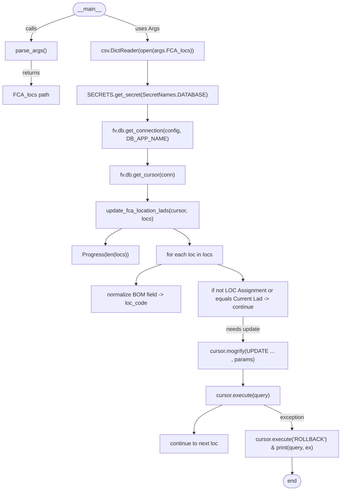

# Diagram: common/location_service/scripts/FCA/FCA_change_lads.py


> Auto-generated by Obscura crawlers

## Diagram 1



### SVG

<svg id="container" width="965.0625" xmlns="http://www.w3.org/2000/svg" class="flowchart" height="1424" viewBox="0 0 965.0625 1424" role="graphics-document document" aria-roledescription="flowchart-v2"><style>#container{font-family:"trebuchet ms",verdana,arial,sans-serif;font-size:16px;fill:#333;}@keyframes edge-animation-frame{from{stroke-dashoffset:0;}}@keyframes dash{to{stroke-dashoffset:0;}}#container .edge-animation-slow{stroke-dasharray:9,5!important;stroke-dashoffset:900;animation:dash 50s linear infinite;stroke-linecap:round;}#container .edge-animation-fast{stroke-dasharray:9,5!important;stroke-dashoffset:900;animation:dash 20s linear infinite;stroke-linecap:round;}#container .error-icon{fill:#552222;}#container .error-text{fill:#552222;stroke:#552222;}#container .edge-thickness-normal{stroke-width:1px;}#container .edge-thickness-thick{stroke-width:3.5px;}#container .edge-pattern-solid{stroke-dasharray:0;}#container .edge-thickness-invisible{stroke-width:0;fill:none;}#container .edge-pattern-dashed{stroke-dasharray:3;}#container .edge-pattern-dotted{stroke-dasharray:2;}#container .marker{fill:#333333;stroke:#333333;}#container .marker.cross{stroke:#333333;}#container svg{font-family:"trebuchet ms",verdana,arial,sans-serif;font-size:16px;}#container p{margin:0;}#container .label{font-family:"trebuchet ms",verdana,arial,sans-serif;color:#333;}#container .cluster-label text{fill:#333;}#container .cluster-label span{color:#333;}#container .cluster-label span p{background-color:transparent;}#container .label text,#container span{fill:#333;color:#333;}#container .node rect,#container .node circle,#container .node ellipse,#container .node polygon,#container .node path{fill:#ECECFF;stroke:#9370DB;stroke-width:1px;}#container .rough-node .label text,#container .node .label text,#container .image-shape .label,#container .icon-shape .label{text-anchor:middle;}#container .node .katex path{fill:#000;stroke:#000;stroke-width:1px;}#container .rough-node .label,#container .node .label,#container .image-shape .label,#container .icon-shape .label{text-align:center;}#container .node.clickable{cursor:pointer;}#container .root .anchor path{fill:#333333!important;stroke-width:0;stroke:#333333;}#container .arrowheadPath{fill:#333333;}#container .edgePath .path{stroke:#333333;stroke-width:2.0px;}#container .flowchart-link{stroke:#333333;fill:none;}#container .edgeLabel{background-color:rgba(232,232,232, 0.8);text-align:center;}#container .edgeLabel p{background-color:rgba(232,232,232, 0.8);}#container .edgeLabel rect{opacity:0.5;background-color:rgba(232,232,232, 0.8);fill:rgba(232,232,232, 0.8);}#container .labelBkg{background-color:rgba(232, 232, 232, 0.5);}#container .cluster rect{fill:#ffffde;stroke:#aaaa33;stroke-width:1px;}#container .cluster text{fill:#333;}#container .cluster span{color:#333;}#container div.mermaidTooltip{position:absolute;text-align:center;max-width:200px;padding:2px;font-family:"trebuchet ms",verdana,arial,sans-serif;font-size:12px;background:hsl(80, 100%, 96.2745098039%);border:1px solid #aaaa33;border-radius:2px;pointer-events:none;z-index:100;}#container .flowchartTitleText{text-anchor:middle;font-size:18px;fill:#333;}#container rect.text{fill:none;stroke-width:0;}#container .icon-shape,#container .image-shape{background-color:rgba(232,232,232, 0.8);text-align:center;}#container .icon-shape p,#container .image-shape p{background-color:rgba(232,232,232, 0.8);padding:2px;}#container .icon-shape rect,#container .image-shape rect{opacity:0.5;background-color:rgba(232,232,232, 0.8);fill:rgba(232,232,232, 0.8);}#container .label-icon{display:inline-block;height:1em;overflow:visible;vertical-align:-0.125em;}#container .node .label-icon path{fill:currentColor;stroke:revert;stroke-width:revert;}#container :root{--mermaid-font-family:"trebuchet ms",verdana,arial,sans-serif;}</style><g><marker id="container_flowchart-v2-pointEnd" class="marker flowchart-v2" viewBox="0 0 10 10" refX="5" refY="5" markerUnits="userSpaceOnUse" markerWidth="8" markerHeight="8" orient="auto"><path d="M 0 0 L 10 5 L 0 10 z" class="arrowMarkerPath" style="stroke-width: 1; stroke-dasharray: 1, 0;"></path></marker><marker id="container_flowchart-v2-pointStart" class="marker flowchart-v2" viewBox="0 0 10 10" refX="4.5" refY="5" markerUnits="userSpaceOnUse" markerWidth="8" markerHeight="8" orient="auto"><path d="M 0 5 L 10 10 L 10 0 z" class="arrowMarkerPath" style="stroke-width: 1; stroke-dasharray: 1, 0;"></path></marker><marker id="container_flowchart-v2-circleEnd" class="marker flowchart-v2" viewBox="0 0 10 10" refX="11" refY="5" markerUnits="userSpaceOnUse" markerWidth="11" markerHeight="11" orient="auto"><circle cx="5" cy="5" r="5" class="arrowMarkerPath" style="stroke-width: 1; stroke-dasharray: 1, 0;"></circle></marker><marker id="container_flowchart-v2-circleStart" class="marker flowchart-v2" viewBox="0 0 10 10" refX="-1" refY="5" markerUnits="userSpaceOnUse" markerWidth="11" markerHeight="11" orient="auto"><circle cx="5" cy="5" r="5" class="arrowMarkerPath" style="stroke-width: 1; stroke-dasharray: 1, 0;"></circle></marker><marker id="container_flowchart-v2-crossEnd" class="marker cross flowchart-v2" viewBox="0 0 11 11" refX="12" refY="5.2" markerUnits="userSpaceOnUse" markerWidth="11" markerHeight="11" orient="auto"><path d="M 1,1 l 9,9 M 10,1 l -9,9" class="arrowMarkerPath" style="stroke-width: 2; stroke-dasharray: 1, 0;"></path></marker><marker id="container_flowchart-v2-crossStart" class="marker cross flowchart-v2" viewBox="0 0 11 11" refX="-1" refY="5.2" markerUnits="userSpaceOnUse" markerWidth="11" markerHeight="11" orient="auto"><path d="M 1,1 l 9,9 M 10,1 l -9,9" class="arrowMarkerPath" style="stroke-width: 2; stroke-dasharray: 1, 0;"></path></marker><g class="root"><g class="clusters"></g><g class="edgePaths"><path d="M221,37.796L198.866,45.497C176.732,53.197,132.464,68.599,110.329,81.799C88.195,95,88.195,106,88.195,111.5L88.195,117" id="L_Start_ParseArgs_0" class="edge-thickness-normal edge-pattern-solid edge-thickness-normal edge-pattern-solid flowchart-link" style=";" data-edge="true" data-et="edge" data-id="L_Start_ParseArgs_0" data-points="W3sieCI6MjIxLjAwMDEwMTkxMzA1NDUyLCJ5IjozNy43OTU4MzQ1NzYzMDY0NTR9LHsieCI6ODguMTk1MzEyNSwieSI6ODR9LHsieCI6ODguMTk1MzEyNSwieSI6MTIxfV0=" marker-end="url(#container_flowchart-v2-pointEnd)"></path><path d="M88.195,175L88.195,181.167C88.195,187.333,88.195,199.667,88.195,211.333C88.195,223,88.195,234,88.195,239.5L88.195,245" id="L_ParseArgs_Args_0" class="edge-thickness-normal edge-pattern-solid edge-thickness-normal edge-pattern-solid flowchart-link" style=";" data-edge="true" data-et="edge" data-id="L_ParseArgs_Args_0" data-points="W3sieCI6ODguMTk1MzEyNSwieSI6MTc1fSx7IngiOjg4LjE5NTMxMjUsInkiOjIxMn0seyJ4Ijo4OC4xOTUzMTI1LCJ5IjoyNDl9XQ==" marker-end="url(#container_flowchart-v2-pointEnd)"></path><path d="M276.5,37.796L298.467,45.497C320.435,53.197,364.37,68.599,386.337,81.799C408.305,95,408.305,106,408.305,111.5L408.305,117" id="L_Start_ReadCSV_0" class="edge-thickness-normal edge-pattern-solid edge-thickness-normal edge-pattern-solid flowchart-link" style=";" data-edge="true" data-et="edge" data-id="L_Start_ReadCSV_0" data-points="W3sieCI6Mjc2LjQ5OTg5ODk1MTYwODAzLCJ5IjozNy43OTU4MzQ4ODE1MzYwNzR9LHsieCI6NDA4LjMwNDY4NzUsInkiOjg0fSx7IngiOjQwOC4zMDQ2ODc1LCJ5IjoxMjF9XQ==" marker-end="url(#container_flowchart-v2-pointEnd)"></path><path d="M408.305,175L408.305,181.167C408.305,187.333,408.305,199.667,408.305,211.333C408.305,223,408.305,234,408.305,239.5L408.305,245" id="L_ReadCSV_SecretsCall_0" class="edge-thickness-normal edge-pattern-solid edge-thickness-normal edge-pattern-solid flowchart-link" style=";" data-edge="true" data-et="edge" data-id="L_ReadCSV_SecretsCall_0" data-points="W3sieCI6NDA4LjMwNDY4NzUsInkiOjE3NX0seyJ4Ijo0MDguMzA0Njg3NSwieSI6MjEyfSx7IngiOjQwOC4zMDQ2ODc1LCJ5IjoyNDl9XQ==" marker-end="url(#container_flowchart-v2-pointEnd)"></path><path d="M408.305,303L408.305,307.167C408.305,311.333,408.305,319.667,408.305,327.333C408.305,335,408.305,342,408.305,345.5L408.305,349" id="L_SecretsCall_DBConn_0" class="edge-thickness-normal edge-pattern-solid edge-thickness-normal edge-pattern-solid flowchart-link" style=";" data-edge="true" data-et="edge" data-id="L_SecretsCall_DBConn_0" data-points="W3sieCI6NDA4LjMwNDY4NzUsInkiOjMwM30seyJ4Ijo0MDguMzA0Njg3NSwieSI6MzI4fSx7IngiOjQwOC4zMDQ2ODc1LCJ5IjozNTN9XQ==" marker-end="url(#container_flowchart-v2-pointEnd)"></path><path d="M408.305,431L408.305,435.167C408.305,439.333,408.305,447.667,408.305,455.333C408.305,463,408.305,470,408.305,473.5L408.305,477" id="L_DBConn_DBCursor_0" class="edge-thickness-normal edge-pattern-solid edge-thickness-normal edge-pattern-solid flowchart-link" style=";" data-edge="true" data-et="edge" data-id="L_DBConn_DBCursor_0" data-points="W3sieCI6NDA4LjMwNDY4NzUsInkiOjQzMX0seyJ4Ijo0MDguMzA0Njg3NSwieSI6NDU2fSx7IngiOjQwOC4zMDQ2ODc1LCJ5Ijo0ODF9XQ==" marker-end="url(#container_flowchart-v2-pointEnd)"></path><path d="M408.305,535L408.305,539.167C408.305,543.333,408.305,551.667,408.305,559.333C408.305,567,408.305,574,408.305,577.5L408.305,581" id="L_DBCursor_UpdateFunc_0" class="edge-thickness-normal edge-pattern-solid edge-thickness-normal edge-pattern-solid flowchart-link" style=";" data-edge="true" data-et="edge" data-id="L_DBCursor_UpdateFunc_0" data-points="W3sieCI6NDA4LjMwNDY4NzUsInkiOjUzNX0seyJ4Ijo0MDguMzA0Njg3NSwieSI6NTYwfSx7IngiOjQwOC4zMDQ2ODc1LCJ5Ijo1ODV9XQ==" marker-end="url(#container_flowchart-v2-pointEnd)"></path><path d="M333.566,663L325.581,667.167C317.596,671.333,301.626,679.667,293.641,687.333C285.656,695,285.656,702,285.656,705.5L285.656,709" id="L_UpdateFunc_ProgressInit_0" class="edge-thickness-normal edge-pattern-solid edge-thickness-normal edge-pattern-solid flowchart-link" style=";" data-edge="true" data-et="edge" data-id="L_UpdateFunc_ProgressInit_0" data-points="W3sieCI6MzMzLjU2NTc5NTg5ODQzNzUsInkiOjY2M30seyJ4IjoyODUuNjU2MjUsInkiOjY4OH0seyJ4IjoyODUuNjU2MjUsInkiOjcxM31d" marker-end="url(#container_flowchart-v2-pointEnd)"></path><path d="M483.044,663L491.029,667.167C499.013,671.333,514.983,679.667,522.968,687.333C530.953,695,530.953,702,530.953,705.5L530.953,709" id="L_UpdateFunc_Loop_0" class="edge-thickness-normal edge-pattern-solid edge-thickness-normal edge-pattern-solid flowchart-link" style=";" data-edge="true" data-et="edge" data-id="L_UpdateFunc_Loop_0" data-points="W3sieCI6NDgzLjA0MzU3OTEwMTU2MjUsInkiOjY2M30seyJ4Ijo1MzAuOTUzMTI1LCJ5Ijo2ODh9LHsieCI6NTMwLjk1MzEyNSwieSI6NzEzfV0=" marker-end="url(#container_flowchart-v2-pointEnd)"></path><path d="M450.472,767L438.052,771.167C425.633,775.333,400.793,783.667,388.373,793.333C375.953,803,375.953,814,375.953,819.5L375.953,825" id="L_Loop_Normalize_0" class="edge-thickness-normal edge-pattern-solid edge-thickness-normal edge-pattern-solid flowchart-link" style=";" data-edge="true" data-et="edge" data-id="L_Loop_Normalize_0" data-points="W3sieCI6NDUwLjQ3MjM1NTc2OTIzMDgsInkiOjc2N30seyJ4IjozNzUuOTUzMTI1LCJ5Ijo3OTJ9LHsieCI6Mzc1Ljk1MzEyNSwieSI6ODI5fV0=" marker-end="url(#container_flowchart-v2-pointEnd)"></path><path d="M611.434,767L623.854,771.167C636.274,775.333,661.113,783.667,673.533,791.333C685.953,799,685.953,806,685.953,809.5L685.953,813" id="L_Loop_CheckSkip_0" class="edge-thickness-normal edge-pattern-solid edge-thickness-normal edge-pattern-solid flowchart-link" style=";" data-edge="true" data-et="edge" data-id="L_Loop_CheckSkip_0" data-points="W3sieCI6NjExLjQzMzg5NDIzMDc2OTMsInkiOjc2N30seyJ4Ijo2ODUuOTUzMTI1LCJ5Ijo3OTJ9LHsieCI6Njg1Ljk1MzEyNSwieSI6ODE3fV0=" marker-end="url(#container_flowchart-v2-pointEnd)"></path><path d="M685.953,919L685.953,925.167C685.953,931.333,685.953,943.667,685.953,955.333C685.953,967,685.953,978,685.953,983.5L685.953,989" id="L_CheckSkip_Mogrify_0" class="edge-thickness-normal edge-pattern-solid edge-thickness-normal edge-pattern-solid flowchart-link" style=";" data-edge="true" data-et="edge" data-id="L_CheckSkip_Mogrify_0" data-points="W3sieCI6Njg1Ljk1MzEyNSwieSI6OTE5fSx7IngiOjY4NS45NTMxMjUsInkiOjk1Nn0seyJ4Ijo2ODUuOTUzMTI1LCJ5Ijo5OTN9XQ==" marker-end="url(#container_flowchart-v2-pointEnd)"></path><path d="M685.953,1071L685.953,1075.167C685.953,1079.333,685.953,1087.667,685.953,1095.333C685.953,1103,685.953,1110,685.953,1113.5L685.953,1117" id="L_Mogrify_Execute_0" class="edge-thickness-normal edge-pattern-solid edge-thickness-normal edge-pattern-solid flowchart-link" style=";" data-edge="true" data-et="edge" data-id="L_Mogrify_Execute_0" data-points="W3sieCI6Njg1Ljk1MzEyNSwieSI6MTA3MX0seyJ4Ijo2ODUuOTUzMTI1LCJ5IjoxMDk2fSx7IngiOjY4NS45NTMxMjUsInkiOjExMjF9XQ==" marker-end="url(#container_flowchart-v2-pointEnd)"></path><path d="M626.423,1175L612.826,1181.167C599.23,1187.333,572.037,1199.667,558.44,1213.333C544.844,1227,544.844,1242,544.844,1249.5L544.844,1257" id="L_Execute_CommitOrContinue_0" class="edge-thickness-normal edge-pattern-solid edge-thickness-normal edge-pattern-solid flowchart-link" style=";" data-edge="true" data-et="edge" data-id="L_Execute_CommitOrContinue_0" data-points="W3sieCI6NjI2LjQyMjYwNzQyMTg3NSwieSI6MTE3NX0seyJ4Ijo1NDQuODQzNzUsInkiOjEyMTJ9LHsieCI6NTQ0Ljg0Mzc1LCJ5IjoxMjYxfV0=" marker-end="url(#container_flowchart-v2-pointEnd)"></path><path d="M745.484,1175L759.08,1181.167C772.677,1187.333,799.87,1199.667,813.466,1211.333C827.063,1223,827.063,1234,827.063,1239.5L827.063,1245" id="L_Execute_Rollback_0" class="edge-thickness-normal edge-pattern-solid edge-thickness-normal edge-pattern-solid flowchart-link" style=";" data-edge="true" data-et="edge" data-id="L_Execute_Rollback_0" data-points="W3sieCI6NzQ1LjQ4MzY0MjU3ODEyNSwieSI6MTE3NX0seyJ4Ijo4MjcuMDYyNSwieSI6MTIxMn0seyJ4Ijo4MjcuMDYyNSwieSI6MTI0OX1d" marker-end="url(#container_flowchart-v2-pointEnd)"></path><path d="M827.063,1327L827.063,1331.167C827.063,1335.333,827.063,1343.667,827.133,1351.417C827.203,1359.167,827.344,1366.334,827.414,1369.917L827.484,1373.501" id="L_Rollback_End_0" class="edge-thickness-normal edge-pattern-solid edge-thickness-normal edge-pattern-solid flowchart-link" style=";" data-edge="true" data-et="edge" data-id="L_Rollback_End_0" data-points="W3sieCI6ODI3LjA2MjUsInkiOjEzMjd9LHsieCI6ODI3LjA2MjUsInkiOjEzNTJ9LHsieCI6ODI3LjU2MjUsInkiOjEzNzcuNX1d" marker-end="url(#container_flowchart-v2-pointEnd)"></path></g><g class="edgeLabels"><g class="edgeLabel" transform="translate(88.1953125, 84)"><g class="label" data-id="L_Start_ParseArgs_0" transform="translate(-16.4453125, -12)"><foreignObject width="32.890625" height="24"><div xmlns="http://www.w3.org/1999/xhtml" class="labelBkg" style="display: table-cell; white-space: nowrap; line-height: 1.5; max-width: 200px; text-align: center;"><span class="edgeLabel"><p>calls</p></span></div></foreignObject></g></g><g class="edgeLabel" transform="translate(88.1953125, 212)"><g class="label" data-id="L_ParseArgs_Args_0" transform="translate(-26.265625, -12)"><foreignObject width="52.53125" height="24"><div xmlns="http://www.w3.org/1999/xhtml" class="labelBkg" style="display: table-cell; white-space: nowrap; line-height: 1.5; max-width: 200px; text-align: center;"><span class="edgeLabel"><p>returns</p></span></div></foreignObject></g></g><g class="edgeLabel" transform="translate(408.3046875, 84)"><g class="label" data-id="L_Start_ReadCSV_0" transform="translate(-34.0078125, -12)"><foreignObject width="68.015625" height="24"><div xmlns="http://www.w3.org/1999/xhtml" class="labelBkg" style="display: table-cell; white-space: nowrap; line-height: 1.5; max-width: 200px; text-align: center;"><span class="edgeLabel"><p>uses Args</p></span></div></foreignObject></g></g><g class="edgeLabel"><g class="label" data-id="L_ReadCSV_SecretsCall_0" transform="translate(0, 0)"><foreignObject width="0" height="0"><div xmlns="http://www.w3.org/1999/xhtml" class="labelBkg" style="display: table-cell; white-space: nowrap; line-height: 1.5; max-width: 200px; text-align: center;"><span class="edgeLabel"></span></div></foreignObject></g></g><g class="edgeLabel"><g class="label" data-id="L_SecretsCall_DBConn_0" transform="translate(0, 0)"><foreignObject width="0" height="0"><div xmlns="http://www.w3.org/1999/xhtml" class="labelBkg" style="display: table-cell; white-space: nowrap; line-height: 1.5; max-width: 200px; text-align: center;"><span class="edgeLabel"></span></div></foreignObject></g></g><g class="edgeLabel"><g class="label" data-id="L_DBConn_DBCursor_0" transform="translate(0, 0)"><foreignObject width="0" height="0"><div xmlns="http://www.w3.org/1999/xhtml" class="labelBkg" style="display: table-cell; white-space: nowrap; line-height: 1.5; max-width: 200px; text-align: center;"><span class="edgeLabel"></span></div></foreignObject></g></g><g class="edgeLabel"><g class="label" data-id="L_DBCursor_UpdateFunc_0" transform="translate(0, 0)"><foreignObject width="0" height="0"><div xmlns="http://www.w3.org/1999/xhtml" class="labelBkg" style="display: table-cell; white-space: nowrap; line-height: 1.5; max-width: 200px; text-align: center;"><span class="edgeLabel"></span></div></foreignObject></g></g><g class="edgeLabel"><g class="label" data-id="L_UpdateFunc_ProgressInit_0" transform="translate(0, 0)"><foreignObject width="0" height="0"><div xmlns="http://www.w3.org/1999/xhtml" class="labelBkg" style="display: table-cell; white-space: nowrap; line-height: 1.5; max-width: 200px; text-align: center;"><span class="edgeLabel"></span></div></foreignObject></g></g><g class="edgeLabel"><g class="label" data-id="L_UpdateFunc_Loop_0" transform="translate(0, 0)"><foreignObject width="0" height="0"><div xmlns="http://www.w3.org/1999/xhtml" class="labelBkg" style="display: table-cell; white-space: nowrap; line-height: 1.5; max-width: 200px; text-align: center;"><span class="edgeLabel"></span></div></foreignObject></g></g><g class="edgeLabel"><g class="label" data-id="L_Loop_Normalize_0" transform="translate(0, 0)"><foreignObject width="0" height="0"><div xmlns="http://www.w3.org/1999/xhtml" class="labelBkg" style="display: table-cell; white-space: nowrap; line-height: 1.5; max-width: 200px; text-align: center;"><span class="edgeLabel"></span></div></foreignObject></g></g><g class="edgeLabel"><g class="label" data-id="L_Loop_CheckSkip_0" transform="translate(0, 0)"><foreignObject width="0" height="0"><div xmlns="http://www.w3.org/1999/xhtml" class="labelBkg" style="display: table-cell; white-space: nowrap; line-height: 1.5; max-width: 200px; text-align: center;"><span class="edgeLabel"></span></div></foreignObject></g></g><g class="edgeLabel" transform="translate(685.953125, 956)"><g class="label" data-id="L_CheckSkip_Mogrify_0" transform="translate(-49.7265625, -12)"><foreignObject width="99.453125" height="24"><div xmlns="http://www.w3.org/1999/xhtml" class="labelBkg" style="display: table-cell; white-space: nowrap; line-height: 1.5; max-width: 200px; text-align: center;"><span class="edgeLabel"><p>needs update</p></span></div></foreignObject></g></g><g class="edgeLabel"><g class="label" data-id="L_Mogrify_Execute_0" transform="translate(0, 0)"><foreignObject width="0" height="0"><div xmlns="http://www.w3.org/1999/xhtml" class="labelBkg" style="display: table-cell; white-space: nowrap; line-height: 1.5; max-width: 200px; text-align: center;"><span class="edgeLabel"></span></div></foreignObject></g></g><g class="edgeLabel"><g class="label" data-id="L_Execute_CommitOrContinue_0" transform="translate(0, 0)"><foreignObject width="0" height="0"><div xmlns="http://www.w3.org/1999/xhtml" class="labelBkg" style="display: table-cell; white-space: nowrap; line-height: 1.5; max-width: 200px; text-align: center;"><span class="edgeLabel"></span></div></foreignObject></g></g><g class="edgeLabel" transform="translate(827.0625, 1212)"><g class="label" data-id="L_Execute_Rollback_0" transform="translate(-35.3828125, -12)"><foreignObject width="70.765625" height="24"><div xmlns="http://www.w3.org/1999/xhtml" class="labelBkg" style="display: table-cell; white-space: nowrap; line-height: 1.5; max-width: 200px; text-align: center;"><span class="edgeLabel"><p>exception</p></span></div></foreignObject></g></g><g class="edgeLabel"><g class="label" data-id="L_Rollback_End_0" transform="translate(0, 0)"><foreignObject width="0" height="0"><div xmlns="http://www.w3.org/1999/xhtml" class="labelBkg" style="display: table-cell; white-space: nowrap; line-height: 1.5; max-width: 200px; text-align: center;"><span class="edgeLabel"></span></div></foreignObject></g></g></g><g class="nodes"><g class="node default" id="flowchart-Start-0" transform="translate(248.25, 27.5)"><g class="basic label-container outer-path"><path d="M-10.8984375 -19.5 C-3.5945550886818465 -19.5, 3.709327322636307 -19.5, 10.8984375 -19.5 C10.8984375 -19.5, 10.898437499999998 -19.5, 10.898437499999998 -19.5 C11.188469256349359 -19.490699246086443, 11.478501012698718 -19.481398492172886, 12.1478067896239 -19.45993515863156 C12.60473012684359 -19.415856313820687, 13.061653464063278 -19.371777469009814, 13.392042152847864 -19.3399052695533 C13.707554365764068 -19.288895701802762, 14.023066578680272 -19.237886134052225, 14.626030759676757 -19.140403561325776 C14.937141560113565 -19.069394551313778, 15.24825236055037 -18.99838554130178, 15.84470188623539 -18.862249829261074 C16.120105155506316 -18.780511584562724, 16.39550842477724 -18.698773339864374, 17.043047751460602 -18.50658706670804 C17.396530154166275 -18.37650227495684, 17.750012556871944 -18.246417483205644, 18.216144095147794 -18.074876768247425 C18.572277619596687 -17.91722702129955, 18.928411144045583 -17.759577274351678, 19.35917041279238 -17.568892924097174 C19.640317333910016 -17.422218755433303, 19.92146425502765 -17.27554458676943, 20.467429764076783 -16.990714730406097 C20.785784489947154 -16.797726224723444, 21.104139215817526 -16.604737719040795, 21.536368073605697 -16.342718045390892 C21.795036085797726 -16.16228243764351, 22.053704097989755 -15.981846829896122, 22.561592844578712 -15.627565626425154 C22.91712326097332 -15.344039580412174, 23.272653677367924 -15.060513534399195, 23.53889120850187 -14.848196188198123 C23.772127094721064 -14.636377527417237, 24.005362980940255 -14.424558866636351, 24.464247236767985 -14.007812326905688 C24.719418337123752 -13.744327215851403, 24.97458943747952 -13.480842104797116, 25.333858442968648 -13.10986736009568 C25.54793956974802 -12.858395487019429, 25.76202069652739 -12.606923613943179, 26.144151408126582 -12.158051136245305 C26.298379060671206 -11.951400132263698, 26.452606713215832 -11.744749128282093, 26.891796464640635 -11.156274872382312 C27.04402797311823 -10.922406395476978, 27.196259481595824 -10.688537918571644, 27.573721378604247 -10.108655082055241 C27.765722234664107 -9.767738119926044, 27.957723090723967 -9.426821157796848, 28.1871239742735 -9.019496659696287 C28.320525009892837 -8.742486554907828, 28.453926045512173 -8.465476450119366, 28.72948364880834 -7.893275190886684 C28.888271979530728 -7.501064944038865, 29.047060310253112 -7.108854697191046, 29.198571729970325 -6.734618561215508 C29.30170103911728 -6.4240095134888655, 29.40483034826423 -6.113400465762223, 29.59246063421488 -5.548287939305138 C29.673062213566322 -5.240919184292631, 29.753663792917763 -4.933550429280123, 29.90953178754556 -4.339158212148133 C29.9594630695733 -4.082771631915883, 30.009394351601042 -3.826385051683633, 30.148482276581777 -3.1121979531509023 C30.182732143181806 -2.846562751202237, 30.216982009781834 -2.580927549253572, 30.308330202509367 -1.872449005199798 C30.33208915949297 -1.50238407229528, 30.355848116476572 -1.132319139390762, 30.388418715913414 -0.6250057626472757 C30.388418715913414 -0.35481306935973667, 30.388418715913414 -0.08462037607219763, 30.388418715913414 0.625005762647271 C30.360131256202965 1.0656057808640111, 30.331843796492517 1.5062057990807514, 30.308330202509367 1.8724490051997846 C30.253879460806214 2.2947582053343054, 30.19942871910306 2.717067405468826, 30.148482276581777 3.1121979531508885 C30.072007487704063 3.504879831085604, 29.99553269882635 3.89756170902032, 29.90953178754556 4.339158212148129 C29.815192195545865 4.6989159634807836, 29.720852603546167 5.058673714813439, 29.592460634214884 5.548287939305125 C29.459188324959175 5.949682900724487, 29.325916015703463 6.35107786214385, 29.19857172997033 6.734618561215495 C29.06813739233507 7.056793896950946, 28.937703054699814 7.378969232686398, 28.729483648808344 7.893275190886679 C28.544256554154853 8.277903216159586, 28.35902945950136 8.662531241432493, 28.187123974273504 9.019496659696284 C27.996387874794582 9.358167918445531, 27.80565177531566 9.69683917719478, 27.57372137860425 10.108655082055236 C27.30327568499097 10.5241322922824, 27.032829991377696 10.939609502509565, 26.89179646464064 11.156274872382301 C26.61847303933299 11.522503362018265, 26.34514961402534 11.888731851654226, 26.144151408126582 12.158051136245302 C25.830133278075373 12.526914699941234, 25.516115148024163 12.895778263637167, 25.33385844296866 13.10986736009567 C25.151627432233603 13.298035840123841, 24.969396421498548 13.48620432015201, 24.46424723676799 14.007812326905684 C24.189571800907135 14.257265290240728, 23.91489636504628 14.506718253575771, 23.538891208501887 14.848196188198111 C23.24452514293498 15.082945292077733, 22.95015907736807 15.317694395957357, 22.561592844578715 15.627565626425152 C22.208381336676 15.873950684058347, 21.85516982877328 16.12033574169154, 21.536368073605708 16.34271804539089 C21.205048905213676 16.54356567231769, 20.87372973682164 16.744413299244496, 20.467429764076787 16.990714730406093 C20.082234996964647 17.191670593679472, 19.697040229852504 17.392626456952854, 19.359170412792388 17.56889292409717 C19.02072472643967 17.71871278981094, 18.682279040086954 17.86853265552471, 18.216144095147804 18.07487676824742 C17.78114888484348 18.234959026691058, 17.346153674539156 18.395041285134692, 17.043047751460616 18.506587066708033 C16.767768940702528 18.58828837277307, 16.49249012994444 18.669989678838107, 15.844701886235413 18.86224982926107 C15.445968816237293 18.953258050511693, 15.047235746239174 19.044266271762314, 14.626030759676766 19.140403561325773 C14.312546207236327 19.191085312655332, 13.999061654795886 19.241767063984888, 13.392042152847878 19.3399052695533 C12.945340599329647 19.382998031183984, 12.498639045811416 19.42609079281467, 12.1478067896239 19.45993515863156 C11.89447692463975 19.46805895432493, 11.641147059655603 19.476182750018303, 10.898437500000004 19.5 C10.898437500000002 19.5, 10.898437500000002 19.5, 10.8984375 19.5 C2.397308211713529 19.5, -6.103821076572942 19.5, -10.898437499999996 19.5 C-11.196361514283401 19.490446156735846, -11.494285528566808 19.480892313471692, -12.147806789623893 19.45993515863156 C-12.403712114804355 19.435248279682583, -12.659617439984817 19.410561400733606, -13.392042152847871 19.3399052695533 C-13.884330056726705 19.26031597900388, -14.37661796060554 19.180726688454463, -14.626030759676759 19.140403561325773 C-14.966096884701019 19.06278568742784, -15.306163009725276 18.98516781352991, -15.844701886235388 18.862249829261074 C-16.160865458991886 18.768414140443404, -16.477029031748387 18.674578451625734, -17.04304775146059 18.506587066708043 C-17.379124066656125 18.382907876060685, -17.715200381851655 18.259228685413326, -18.216144095147797 18.074876768247425 C-18.604573556822245 17.902930567914737, -18.993003018496694 17.73098436758205, -19.35917041279238 17.568892924097174 C-19.619198916668886 17.43323622018101, -19.87922742054539 17.29757951626484, -20.46742976407678 16.990714730406097 C-20.864559512374193 16.749972343194756, -21.26168926067161 16.509229955983415, -21.536368073605686 16.3427180453909 C-21.873324820312067 16.107671605510998, -22.21028156701845 15.872625165631097, -22.561592844578712 15.627565626425156 C-22.824418974097025 15.417968782231341, -23.087245103615334 15.208371938037528, -23.53889120850187 14.848196188198125 C-23.882269837076965 14.536348803026877, -24.22564846565206 14.224501417855627, -24.464247236767974 14.007812326905697 C-24.65838147713813 13.807352785005959, -24.852515717508286 13.60689324310622, -25.333858442968655 13.109867360095677 C-25.64481074925034 12.744605087449743, -25.95576305553202 12.37934281480381, -26.14415140812658 12.158051136245307 C-26.4076886481994 11.804935243284202, -26.671225888272225 11.451819350323097, -26.891796464640635 11.156274872382316 C-27.041440835789267 10.926380933157914, -27.1910852069379 10.696486993933512, -27.573721378604244 10.108655082055249 C-27.70106454900612 9.882544388112441, -27.828407719407995 9.656433694169634, -28.1871239742735 9.019496659696289 C-28.403142225973944 8.57093013799017, -28.619160477674388 8.122363616284048, -28.72948364880834 7.893275190886686 C-28.84944958636795 7.596957005730836, -28.96941552392756 7.300638820574986, -29.198571729970325 6.73461856121551 C-29.298643148395477 6.433219393134209, -29.39871456682063 6.131820225052909, -29.59246063421488 5.5482879393051325 C-29.712390418118716 5.0909436953826654, -29.832320202022554 4.633599451460198, -29.909531787545557 4.339158212148136 C-30.001090248151385 3.869024867824717, -30.092648708757213 3.398891523501298, -30.148482276581777 3.112197953150904 C-30.187256708428414 2.8114711166260085, -30.22603114027505 2.5107442801011124, -30.308330202509364 1.872449005199809 C-30.32614442824604 1.5949780599669081, -30.34395865398271 1.3175071147340072, -30.388418715913414 0.6250057626472781 C-30.388418715913414 0.162185178531093, -30.388418715913414 -0.30063540558509216, -30.388418715913414 -0.6250057626472687 C-30.367629419252776 -0.9488158389549581, -30.346840122592134 -1.2726259152626476, -30.308330202509367 -1.8724490051997822 C-30.270359303540236 -2.166943799402254, -30.232388404571108 -2.4614385936047256, -30.148482276581777 -3.112197953150895 C-30.061943891773854 -3.556554269245474, -29.97540550696593 -4.000910585340053, -29.90953178754556 -4.339158212148126 C-29.783070776228804 -4.821408856847919, -29.65660976491205 -5.303659501547712, -29.592460634214884 -5.548287939305123 C-29.506361656814665 -5.8076043412254785, -29.420262679414446 -6.066920743145834, -29.198571729970332 -6.734618561215485 C-29.097872364734517 -6.983347940237734, -28.997172999498698 -7.232077319259984, -28.729483648808344 -7.893275190886676 C-28.58270417673893 -8.198065905216406, -28.435924704669517 -8.502856619546137, -28.187123974273504 -9.019496659696282 C-27.98891154280991 -9.371442902945024, -27.790699111346317 -9.723389146193766, -27.573721378604247 -10.108655082055243 C-27.30299172847108 -10.524568525749958, -27.03226207833792 -10.940481969444674, -26.89179646464064 -11.156274872382308 C-26.638473383349922 -11.495704723104405, -26.385150302059202 -11.835134573826501, -26.144151408126586 -12.158051136245302 C-25.83196858167789 -12.524758847897987, -25.519785755229197 -12.891466559550672, -25.333858442968662 -13.10986736009567 C-25.073944545080916 -13.378249798992641, -24.81403064719317 -13.64663223788961, -24.464247236767996 -14.007812326905677 C-24.128853623654695 -14.312407932306455, -23.793460010541395 -14.617003537707232, -23.538891208501887 -14.848196188198107 C-23.30836191815602 -15.032037162606882, -23.077832627810157 -15.215878137015656, -22.56159284457872 -15.627565626425149 C-22.245381070130428 -15.848141271693182, -21.92916929568214 -16.068716916961215, -21.53636807360571 -16.342718045390885 C-21.138273159341303 -16.58404552188336, -20.740178245076898 -16.825372998375837, -20.46742976407679 -16.99071473040609 C-20.223766284306464 -17.11783381172836, -19.98010280453614 -17.244952893050634, -19.359170412792388 -17.56889292409717 C-19.12447066740471 -17.672787539259712, -18.889770922017032 -17.776682154422254, -18.216144095147804 -18.07487676824742 C-17.904241884928936 -18.18965966480039, -17.592339674710065 -18.30444256135336, -17.04304775146062 -18.506587066708033 C-16.59622688027359 -18.639201155865727, -16.14940600908656 -18.771815245023426, -15.844701886235413 -18.862249829261067 C-15.469973091763109 -18.94777923126546, -15.095244297290803 -19.03330863326985, -14.626030759676768 -19.140403561325773 C-14.17561110963972 -19.21322391728721, -13.725191459602671 -19.286044273248645, -13.39204215284788 -19.3399052695533 C-13.076838899082796 -19.37031254835664, -12.761635645317712 -19.400719827159985, -12.147806789623903 -19.45993515863156 C-11.681408972400714 -19.47489162884163, -11.215011155177526 -19.489848099051695, -10.898437500000005 -19.5 C-10.898437500000004 -19.5, -10.898437500000002 -19.5, -10.8984375 -19.5" stroke="none" stroke-width="0" fill="#ECECFF" style=""></path><path d="M-10.8984375 -19.5 C-3.8263417933203536 -19.5, 3.2457539133592928 -19.5, 10.8984375 -19.5 M-10.8984375 -19.5 C-6.224481748280956 -19.5, -1.5505259965619125 -19.5, 10.8984375 -19.5 M10.8984375 -19.5 C10.8984375 -19.5, 10.898437499999998 -19.5, 10.898437499999998 -19.5 M10.8984375 -19.5 C10.8984375 -19.5, 10.898437499999998 -19.5, 10.898437499999998 -19.5 M10.898437499999998 -19.5 C11.259650905802353 -19.488416589135163, 11.620864311604707 -19.476833178270322, 12.1478067896239 -19.45993515863156 M10.898437499999998 -19.5 C11.34179463234178 -19.485782399708107, 11.785151764683564 -19.47156479941621, 12.1478067896239 -19.45993515863156 M12.1478067896239 -19.45993515863156 C12.466088336084342 -19.429230920634083, 12.784369882544782 -19.398526682636607, 13.392042152847864 -19.3399052695533 M12.1478067896239 -19.45993515863156 C12.418024858157839 -19.433867546544864, 12.688242926691778 -19.40779993445817, 13.392042152847864 -19.3399052695533 M13.392042152847864 -19.3399052695533 C13.651607874035154 -19.29794069671397, 13.911173595222442 -19.255976123874643, 14.626030759676757 -19.140403561325776 M13.392042152847864 -19.3399052695533 C13.654604329795884 -19.297456252984436, 13.917166506743902 -19.255007236415576, 14.626030759676757 -19.140403561325776 M14.626030759676757 -19.140403561325776 C14.982510411973951 -19.059039406936073, 15.338990064271144 -18.977675252546366, 15.84470188623539 -18.862249829261074 M14.626030759676757 -19.140403561325776 C14.947345388211055 -19.06706559413673, 15.268660016745354 -18.993727626947678, 15.84470188623539 -18.862249829261074 M15.84470188623539 -18.862249829261074 C16.28543160422525 -18.731443562399182, 16.726161322215106 -18.600637295537293, 17.043047751460602 -18.50658706670804 M15.84470188623539 -18.862249829261074 C16.094547283194878 -18.78809702690875, 16.344392680154364 -18.713944224556425, 17.043047751460602 -18.50658706670804 M17.043047751460602 -18.50658706670804 C17.345525215328706 -18.395272563933553, 17.648002679196814 -18.283958061159062, 18.216144095147794 -18.074876768247425 M17.043047751460602 -18.50658706670804 C17.345123057447648 -18.395420561751287, 17.647198363434697 -18.284254056794534, 18.216144095147794 -18.074876768247425 M18.216144095147794 -18.074876768247425 C18.57676783609044 -17.915239335655308, 18.937391577033086 -17.75560190306319, 19.35917041279238 -17.568892924097174 M18.216144095147794 -18.074876768247425 C18.67166221450761 -17.873232409271747, 19.127180333867422 -17.67158805029607, 19.35917041279238 -17.568892924097174 M19.35917041279238 -17.568892924097174 C19.679706253672432 -17.401669581223057, 20.00024209455248 -17.23444623834894, 20.467429764076783 -16.990714730406097 M19.35917041279238 -17.568892924097174 C19.746859272712168 -17.366635894203586, 20.134548132631956 -17.164378864310002, 20.467429764076783 -16.990714730406097 M20.467429764076783 -16.990714730406097 C20.848747751781904 -16.759557525386022, 21.230065739487024 -16.52840032036595, 21.536368073605697 -16.342718045390892 M20.467429764076783 -16.990714730406097 C20.817600405480473 -16.778439229756074, 21.167771046884162 -16.56616372910605, 21.536368073605697 -16.342718045390892 M21.536368073605697 -16.342718045390892 C21.898448625520953 -16.09014632658928, 22.260529177436204 -15.837574607787667, 22.561592844578712 -15.627565626425154 M21.536368073605697 -16.342718045390892 C21.930455909969734 -16.06781943053082, 22.324543746333774 -15.79292081567075, 22.561592844578712 -15.627565626425154 M22.561592844578712 -15.627565626425154 C22.874991664269515 -15.377638407614585, 23.188390483960315 -15.127711188804014, 23.53889120850187 -14.848196188198123 M22.561592844578712 -15.627565626425154 C22.86809086483154 -15.383141611528382, 23.174588885084372 -15.13871759663161, 23.53889120850187 -14.848196188198123 M23.53889120850187 -14.848196188198123 C23.830098050371323 -14.583729839323105, 24.12130489224078 -14.319263490448087, 24.464247236767985 -14.007812326905688 M23.53889120850187 -14.848196188198123 C23.73948882072941 -14.666018744295048, 23.94008643295695 -14.483841300391973, 24.464247236767985 -14.007812326905688 M24.464247236767985 -14.007812326905688 C24.656618258663503 -13.80917345284394, 24.848989280559024 -13.61053457878219, 25.333858442968648 -13.10986736009568 M24.464247236767985 -14.007812326905688 C24.642484198170475 -13.823768030730939, 24.820721159572965 -13.639723734556192, 25.333858442968648 -13.10986736009568 M25.333858442968648 -13.10986736009568 C25.572329808699834 -12.829745324502717, 25.81080117443102 -12.549623288909752, 26.144151408126582 -12.158051136245305 M25.333858442968648 -13.10986736009568 C25.588410558994518 -12.81085596018597, 25.842962675020384 -12.511844560276257, 26.144151408126582 -12.158051136245305 M26.144151408126582 -12.158051136245305 C26.37266529548478 -11.851863345228727, 26.601179182842973 -11.54567555421215, 26.891796464640635 -11.156274872382312 M26.144151408126582 -12.158051136245305 C26.342834328303518 -11.8918341235946, 26.54151724848045 -11.625617110943896, 26.891796464640635 -11.156274872382312 M26.891796464640635 -11.156274872382312 C27.090041093083347 -10.851717886957811, 27.288285721526055 -10.547160901533308, 27.573721378604247 -10.108655082055241 M26.891796464640635 -11.156274872382312 C27.146341994160487 -10.765224583994534, 27.40088752368034 -10.374174295606757, 27.573721378604247 -10.108655082055241 M27.573721378604247 -10.108655082055241 C27.77579717871457 -9.749849036565738, 27.97787297882489 -9.391042991076235, 28.1871239742735 -9.019496659696287 M27.573721378604247 -10.108655082055241 C27.77094295195114 -9.758468207727965, 27.968164525298036 -9.408281333400689, 28.1871239742735 -9.019496659696287 M28.1871239742735 -9.019496659696287 C28.3428091352903 -8.696213091716096, 28.498494296307097 -8.372929523735905, 28.72948364880834 -7.893275190886684 M28.1871239742735 -9.019496659696287 C28.299821675763475 -8.785477471207834, 28.41251937725345 -8.55145828271938, 28.72948364880834 -7.893275190886684 M28.72948364880834 -7.893275190886684 C28.87603603152516 -7.531287972178579, 29.022588414241977 -7.169300753470474, 29.198571729970325 -6.734618561215508 M28.72948364880834 -7.893275190886684 C28.826382923059988 -7.653932110065092, 28.92328219731164 -7.4145890292434995, 29.198571729970325 -6.734618561215508 M29.198571729970325 -6.734618561215508 C29.327922120638004 -6.345035793710432, 29.457272511305682 -5.9554530262053555, 29.59246063421488 -5.548287939305138 M29.198571729970325 -6.734618561215508 C29.291904023300752 -6.453516564185754, 29.38523631663118 -6.1724145671559985, 29.59246063421488 -5.548287939305138 M29.59246063421488 -5.548287939305138 C29.67719621898847 -5.225154429928685, 29.761931803762064 -4.902020920552233, 29.90953178754556 -4.339158212148133 M29.59246063421488 -5.548287939305138 C29.685789455863546 -5.192384693391612, 29.77911827751221 -4.836481447478087, 29.90953178754556 -4.339158212148133 M29.90953178754556 -4.339158212148133 C29.961404313930213 -4.07280375242528, 30.013276840314866 -3.8064492927024265, 30.148482276581777 -3.1121979531509023 M29.90953178754556 -4.339158212148133 C29.964464228178784 -4.057091739471976, 30.019396668812007 -3.7750252667958177, 30.148482276581777 -3.1121979531509023 M30.148482276581777 -3.1121979531509023 C30.19236721746925 -2.771835017689425, 30.236252158356727 -2.4314720822279474, 30.308330202509367 -1.872449005199798 M30.148482276581777 -3.1121979531509023 C30.210930933681638 -2.627858500566566, 30.2733795907815 -2.1435190479822293, 30.308330202509367 -1.872449005199798 M30.308330202509367 -1.872449005199798 C30.34011548689791 -1.3773675442284181, 30.37190077128646 -0.8822860832570382, 30.388418715913414 -0.6250057626472757 M30.308330202509367 -1.872449005199798 C30.337494911313243 -1.418185124250197, 30.36665962011712 -0.9639212433005964, 30.388418715913414 -0.6250057626472757 M30.388418715913414 -0.6250057626472757 C30.388418715913414 -0.28328348723530855, 30.388418715913414 0.058438788176658596, 30.388418715913414 0.625005762647271 M30.388418715913414 -0.6250057626472757 C30.388418715913414 -0.14278181513709987, 30.388418715913414 0.33944213237307597, 30.388418715913414 0.625005762647271 M30.388418715913414 0.625005762647271 C30.361065181635716 1.0510591383978805, 30.33371164735802 1.47711251414849, 30.308330202509367 1.8724490051997846 M30.388418715913414 0.625005762647271 C30.36479750762987 0.9929251483596221, 30.341176299346326 1.360844534071973, 30.308330202509367 1.8724490051997846 M30.308330202509367 1.8724490051997846 C30.26000973545109 2.247213005748308, 30.21168926839281 2.621977006296831, 30.148482276581777 3.1121979531508885 M30.308330202509367 1.8724490051997846 C30.25106094564133 2.316618052374354, 30.193791688773295 2.760787099548923, 30.148482276581777 3.1121979531508885 M30.148482276581777 3.1121979531508885 C30.074537233590938 3.491890120618474, 30.000592190600102 3.871582288086059, 29.90953178754556 4.339158212148129 M30.148482276581777 3.1121979531508885 C30.058596221519785 3.5737438484697597, 29.968710166457793 4.035289743788631, 29.90953178754556 4.339158212148129 M29.90953178754556 4.339158212148129 C29.786524640559577 4.808237775240418, 29.663517493573593 5.277317338332708, 29.592460634214884 5.548287939305125 M29.90953178754556 4.339158212148129 C29.814819897466606 4.700335697412, 29.72010800738765 5.061513182675872, 29.592460634214884 5.548287939305125 M29.592460634214884 5.548287939305125 C29.48000534445279 5.886985354751352, 29.367550054690692 6.2256827701975785, 29.19857172997033 6.734618561215495 M29.592460634214884 5.548287939305125 C29.481434554594177 5.882680801519202, 29.37040847497347 6.217073663733278, 29.19857172997033 6.734618561215495 M29.19857172997033 6.734618561215495 C29.096018287742925 6.987927546253099, 28.993464845515525 7.241236531290704, 28.729483648808344 7.893275190886679 M29.19857172997033 6.734618561215495 C29.054047860170755 7.091595313799377, 28.909523990371184 7.448572066383259, 28.729483648808344 7.893275190886679 M28.729483648808344 7.893275190886679 C28.614812598104773 8.131392081240072, 28.500141547401203 8.369508971593467, 28.187123974273504 9.019496659696284 M28.729483648808344 7.893275190886679 C28.566226772376293 8.232281587935397, 28.402969895944246 8.571287984984115, 28.187123974273504 9.019496659696284 M28.187123974273504 9.019496659696284 C28.02544405932991 9.306575720545329, 27.863764144386312 9.593654781394374, 27.57372137860425 10.108655082055236 M28.187123974273504 9.019496659696284 C28.04896662754152 9.264809018767293, 27.910809280809538 9.510121377838301, 27.57372137860425 10.108655082055236 M27.57372137860425 10.108655082055236 C27.32864846565658 10.485152887634431, 27.08357555270891 10.861650693213626, 26.89179646464064 11.156274872382301 M27.57372137860425 10.108655082055236 C27.349402814830714 10.453268633979873, 27.125084251057174 10.79788218590451, 26.89179646464064 11.156274872382301 M26.89179646464064 11.156274872382301 C26.638972808248337 11.495035539239064, 26.386149151856035 11.833796206095826, 26.144151408126582 12.158051136245302 M26.89179646464064 11.156274872382301 C26.713831249988754 11.394732047051244, 26.535866035336866 11.633189221720187, 26.144151408126582 12.158051136245302 M26.144151408126582 12.158051136245302 C25.85109502434908 12.50229184001099, 25.55803864057157 12.846532543776677, 25.33385844296866 13.10986736009567 M26.144151408126582 12.158051136245302 C25.906938055875365 12.436695437621701, 25.669724703624148 12.7153397389981, 25.33385844296866 13.10986736009567 M25.33385844296866 13.10986736009567 C25.077050071793266 13.375043087693651, 24.820241700617878 13.640218815291632, 24.46424723676799 14.007812326905684 M25.33385844296866 13.10986736009567 C24.993052956784194 13.461777005231914, 24.65224747059973 13.813686650368158, 24.46424723676799 14.007812326905684 M24.46424723676799 14.007812326905684 C24.108138027433917 14.331221288689527, 23.752028818099845 14.654630250473371, 23.538891208501887 14.848196188198111 M24.46424723676799 14.007812326905684 C24.198606664226446 14.249060066423512, 23.932966091684904 14.49030780594134, 23.538891208501887 14.848196188198111 M23.538891208501887 14.848196188198111 C23.170256236022205 15.142172768962055, 22.801621263542522 15.436149349726, 22.561592844578715 15.627565626425152 M23.538891208501887 14.848196188198111 C23.312982459217263 15.028352404068306, 23.08707370993264 15.2085086199385, 22.561592844578715 15.627565626425152 M22.561592844578715 15.627565626425152 C22.199586438844815 15.88008562406039, 21.837580033110914 16.132605621695628, 21.536368073605708 16.34271804539089 M22.561592844578715 15.627565626425152 C22.20764160304538 15.874466690216511, 21.85369036151205 16.12136775400787, 21.536368073605708 16.34271804539089 M21.536368073605708 16.34271804539089 C21.27173123284004 16.503142453441736, 21.007094392074368 16.663566861492583, 20.467429764076787 16.990714730406093 M21.536368073605708 16.34271804539089 C21.32101122915417 16.473268630074706, 21.105654384702632 16.603819214758524, 20.467429764076787 16.990714730406093 M20.467429764076787 16.990714730406093 C20.15583225964458 17.15327494888065, 19.84423475521237 17.315835167355207, 19.359170412792388 17.56889292409717 M20.467429764076787 16.990714730406093 C20.192629495990204 17.13407785424889, 19.91782922790362 17.27744097809169, 19.359170412792388 17.56889292409717 M19.359170412792388 17.56889292409717 C18.933752160109595 17.75721296497575, 18.508333907426803 17.945533005854333, 18.216144095147804 18.07487676824742 M19.359170412792388 17.56889292409717 C19.11288865944079 17.67791455061728, 18.866606906089192 17.78693617713739, 18.216144095147804 18.07487676824742 M18.216144095147804 18.07487676824742 C17.856493896312024 18.20723136598898, 17.496843697476244 18.339585963730542, 17.043047751460616 18.506587066708033 M18.216144095147804 18.07487676824742 C17.843434534989118 18.212037331675223, 17.470724974830436 18.349197895103025, 17.043047751460616 18.506587066708033 M17.043047751460616 18.506587066708033 C16.781357607154877 18.58425532789838, 16.519667462849142 18.661923589088723, 15.844701886235413 18.86224982926107 M17.043047751460616 18.506587066708033 C16.700198033569624 18.608343063323186, 16.35734831567863 18.71009905993834, 15.844701886235413 18.86224982926107 M15.844701886235413 18.86224982926107 C15.550249578108582 18.929456647110136, 15.255797269981752 18.996663464959205, 14.626030759676766 19.140403561325773 M15.844701886235413 18.86224982926107 C15.480524423476577 18.945370958655737, 15.116346960717742 19.028492088050402, 14.626030759676766 19.140403561325773 M14.626030759676766 19.140403561325773 C14.1361021860053 19.219611413664143, 13.646173612333834 19.29881926600251, 13.392042152847878 19.3399052695533 M14.626030759676766 19.140403561325773 C14.294971331236761 19.19392668231174, 13.963911902796754 19.24744980329771, 13.392042152847878 19.3399052695533 M13.392042152847878 19.3399052695533 C13.141172342707852 19.364106378422417, 12.890302532567825 19.388307487291538, 12.1478067896239 19.45993515863156 M13.392042152847878 19.3399052695533 C13.063730083516583 19.371577140028656, 12.735418014185289 19.403249010504013, 12.1478067896239 19.45993515863156 M12.1478067896239 19.45993515863156 C11.693726274937985 19.474496636923433, 11.23964576025207 19.489058115215304, 10.898437500000004 19.5 M12.1478067896239 19.45993515863156 C11.793696281535105 19.471290793391677, 11.439585773446312 19.482646428151792, 10.898437500000004 19.5 M10.898437500000004 19.5 C10.898437500000004 19.5, 10.898437500000002 19.5, 10.8984375 19.5 M10.898437500000004 19.5 C10.898437500000004 19.5, 10.898437500000002 19.5, 10.8984375 19.5 M10.8984375 19.5 C5.046805279146179 19.5, -0.8048269417076419 19.5, -10.898437499999996 19.5 M10.8984375 19.5 C3.4263036079503815 19.5, -4.045830284099237 19.5, -10.898437499999996 19.5 M-10.898437499999996 19.5 C-11.239441235723856 19.489064673918843, -11.580444971447715 19.478129347837683, -12.147806789623893 19.45993515863156 M-10.898437499999996 19.5 C-11.349786984989874 19.485526100514853, -11.801136469979753 19.471052201029703, -12.147806789623893 19.45993515863156 M-12.147806789623893 19.45993515863156 C-12.438517132567197 19.43189068147816, -12.729227475510502 19.403846204324758, -13.392042152847871 19.3399052695533 M-12.147806789623893 19.45993515863156 C-12.605227233004051 19.415808358587245, -13.062647676384211 19.37168155854293, -13.392042152847871 19.3399052695533 M-13.392042152847871 19.3399052695533 C-13.680210192915759 19.29331649561165, -13.968378232983648 19.24672772167, -14.626030759676759 19.140403561325773 M-13.392042152847871 19.3399052695533 C-13.834908212363354 19.26830611952842, -14.277774271878839 19.19670696950354, -14.626030759676759 19.140403561325773 M-14.626030759676759 19.140403561325773 C-14.985211600660941 19.058422878245167, -15.344392441645123 18.976442195164562, -15.844701886235388 18.862249829261074 M-14.626030759676759 19.140403561325773 C-15.079152263974205 19.036981534864033, -15.53227376827165 18.933559508402293, -15.844701886235388 18.862249829261074 M-15.844701886235388 18.862249829261074 C-16.237302713436492 18.745727964551584, -16.6299035406376 18.62920609984209, -17.04304775146059 18.506587066708043 M-15.844701886235388 18.862249829261074 C-16.094844126865535 18.788008925265462, -16.344986367495682 18.71376802126985, -17.04304775146059 18.506587066708043 M-17.04304775146059 18.506587066708043 C-17.387848759070124 18.379697108602162, -17.732649766679653 18.25280715049628, -18.216144095147797 18.074876768247425 M-17.04304775146059 18.506587066708043 C-17.50996091808423 18.334758705292547, -17.976874084707866 18.16293034387705, -18.216144095147797 18.074876768247425 M-18.216144095147797 18.074876768247425 C-18.465856111800797 17.96433666591893, -18.715568128453796 17.853796563590432, -19.35917041279238 17.568892924097174 M-18.216144095147797 18.074876768247425 C-18.65377988358668 17.881148386709942, -19.091415672025565 17.687420005172463, -19.35917041279238 17.568892924097174 M-19.35917041279238 17.568892924097174 C-19.585793571776367 17.450663767214287, -19.812416730760358 17.332434610331404, -20.46742976407678 16.990714730406097 M-19.35917041279238 17.568892924097174 C-19.662698688289986 17.410542417189212, -19.96622696378759 17.25219191028125, -20.46742976407678 16.990714730406097 M-20.46742976407678 16.990714730406097 C-20.814659461109095 16.78022204751691, -21.16188915814141 16.569729364627722, -21.536368073605686 16.3427180453909 M-20.46742976407678 16.990714730406097 C-20.878783654735617 16.741349584504924, -21.29013754539445 16.491984438603748, -21.536368073605686 16.3427180453909 M-21.536368073605686 16.3427180453909 C-21.888042500684207 16.09740518880151, -22.239716927762725 15.85209233221212, -22.561592844578712 15.627565626425156 M-21.536368073605686 16.3427180453909 C-21.760911005048744 16.186086616723063, -21.9854539364918 16.029455188055223, -22.561592844578712 15.627565626425156 M-22.561592844578712 15.627565626425156 C-22.9235203107688 15.338938103432923, -23.28544777695889 15.050310580440692, -23.53889120850187 14.848196188198125 M-22.561592844578712 15.627565626425156 C-22.776320832972907 15.456325769832535, -22.9910488213671 15.285085913239916, -23.53889120850187 14.848196188198125 M-23.53889120850187 14.848196188198125 C-23.868326419417816 14.549011846022301, -24.197761630333762 14.249827503846475, -24.464247236767974 14.007812326905697 M-23.53889120850187 14.848196188198125 C-23.747698450014994 14.65856297619277, -23.95650569152812 14.468929764187415, -24.464247236767974 14.007812326905697 M-24.464247236767974 14.007812326905697 C-24.73636187773257 13.726831619082246, -25.00847651869716 13.445850911258793, -25.333858442968655 13.109867360095677 M-24.464247236767974 14.007812326905697 C-24.722655865475666 13.74098420202203, -24.981064494183357 13.474156077138364, -25.333858442968655 13.109867360095677 M-25.333858442968655 13.109867360095677 C-25.64065985385167 12.749480965377659, -25.947461264734685 12.389094570659639, -26.14415140812658 12.158051136245307 M-25.333858442968655 13.109867360095677 C-25.582723905700213 12.8175358267252, -25.83158936843177 12.525204293354722, -26.14415140812658 12.158051136245307 M-26.14415140812658 12.158051136245307 C-26.376080425145055 11.847287382608668, -26.60800944216353 11.536523628972029, -26.891796464640635 11.156274872382316 M-26.14415140812658 12.158051136245307 C-26.402484919930988 11.811907765094478, -26.660818431735397 11.465764393943651, -26.891796464640635 11.156274872382316 M-26.891796464640635 11.156274872382316 C-27.11228781564272 10.817540947025156, -27.332779166644805 10.478807021667995, -27.573721378604244 10.108655082055249 M-26.891796464640635 11.156274872382316 C-27.151067964133272 10.75796422501571, -27.41033946362591 10.359653577649105, -27.573721378604244 10.108655082055249 M-27.573721378604244 10.108655082055249 C-27.807753373264983 9.693107577225891, -28.041785367925723 9.277560072396533, -28.1871239742735 9.019496659696289 M-27.573721378604244 10.108655082055249 C-27.79623296935057 9.713563220943328, -28.01874456009689 9.318471359831408, -28.1871239742735 9.019496659696289 M-28.1871239742735 9.019496659696289 C-28.369330154472305 8.641141627925755, -28.551536334671113 8.262786596155221, -28.72948364880834 7.893275190886686 M-28.1871239742735 9.019496659696289 C-28.388136151477074 8.60209057276148, -28.589148328680647 8.184684485826669, -28.72948364880834 7.893275190886686 M-28.72948364880834 7.893275190886686 C-28.862126010955357 7.565645991917941, -28.994768373102374 7.238016792949195, -29.198571729970325 6.73461856121551 M-28.72948364880834 7.893275190886686 C-28.845457157461464 7.6068183823182185, -28.961430666114587 7.320361573749751, -29.198571729970325 6.73461856121551 M-29.198571729970325 6.73461856121551 C-29.314333541591868 6.38596242875134, -29.43009535321341 6.037306296287171, -29.59246063421488 5.5482879393051325 M-29.198571729970325 6.73461856121551 C-29.3120115872796 6.3929557851867145, -29.425451444588873 6.05129300915792, -29.59246063421488 5.5482879393051325 M-29.59246063421488 5.5482879393051325 C-29.66166577530709 5.284378742622656, -29.7308709163993 5.020469545940179, -29.909531787545557 4.339158212148136 M-29.59246063421488 5.5482879393051325 C-29.707089803534547 5.111157236092991, -29.821718972854217 4.674026532880849, -29.909531787545557 4.339158212148136 M-29.909531787545557 4.339158212148136 C-29.993093111940222 3.910088472073702, -30.076654436334888 3.481018731999268, -30.148482276581777 3.112197953150904 M-29.909531787545557 4.339158212148136 C-29.965743878797547 4.050521003998866, -30.021955970049536 3.761883795849596, -30.148482276581777 3.112197953150904 M-30.148482276581777 3.112197953150904 C-30.20100297418261 2.7048577939436487, -30.253523671783448 2.2975176347363937, -30.308330202509364 1.872449005199809 M-30.148482276581777 3.112197953150904 C-30.200458725918974 2.7090788760024513, -30.25243517525617 2.3059597988539986, -30.308330202509364 1.872449005199809 M-30.308330202509364 1.872449005199809 C-30.328050065872795 1.5652962157271553, -30.347769929236225 1.2581434262545015, -30.388418715913414 0.6250057626472781 M-30.308330202509364 1.872449005199809 C-30.339219919618316 1.3913167274970129, -30.370109636727268 0.9101844497942168, -30.388418715913414 0.6250057626472781 M-30.388418715913414 0.6250057626472781 C-30.388418715913414 0.2073551472128874, -30.388418715913414 -0.21029546822150336, -30.388418715913414 -0.6250057626472687 M-30.388418715913414 0.6250057626472781 C-30.388418715913414 0.188482019461582, -30.388418715913414 -0.24804172372411415, -30.388418715913414 -0.6250057626472687 M-30.388418715913414 -0.6250057626472687 C-30.369147625628944 -0.9251685491719867, -30.349876535344475 -1.2253313356967046, -30.308330202509367 -1.8724490051997822 M-30.388418715913414 -0.6250057626472687 C-30.369461206410264 -0.920284275385052, -30.35050369690712 -1.2155627881228352, -30.308330202509367 -1.8724490051997822 M-30.308330202509367 -1.8724490051997822 C-30.255317846483642 -2.283602370061545, -30.202305490457917 -2.6947557349233078, -30.148482276581777 -3.112197953150895 M-30.308330202509367 -1.8724490051997822 C-30.27178707566829 -2.1558702807225814, -30.23524394882721 -2.4392915562453803, -30.148482276581777 -3.112197953150895 M-30.148482276581777 -3.112197953150895 C-30.054246171713036 -3.596080434844066, -29.960010066844294 -4.079962916537236, -29.90953178754556 -4.339158212148126 M-30.148482276581777 -3.112197953150895 C-30.071497158903266 -3.5075002616196733, -29.994512041224752 -3.9028025700884514, -29.90953178754556 -4.339158212148126 M-29.90953178754556 -4.339158212148126 C-29.826883269362085 -4.654332832076082, -29.744234751178613 -4.969507452004038, -29.592460634214884 -5.548287939305123 M-29.90953178754556 -4.339158212148126 C-29.83617252210491 -4.618908885380085, -29.762813256664263 -4.898659558612044, -29.592460634214884 -5.548287939305123 M-29.592460634214884 -5.548287939305123 C-29.470655865364716 -5.915144496127433, -29.348851096514547 -6.282001052949743, -29.198571729970332 -6.734618561215485 M-29.592460634214884 -5.548287939305123 C-29.47556669394546 -5.9003538628765115, -29.358672753676032 -6.2524197864479, -29.198571729970332 -6.734618561215485 M-29.198571729970332 -6.734618561215485 C-29.0245516823193 -7.164451443362283, -28.85053163466826 -7.59428432550908, -28.729483648808344 -7.893275190886676 M-29.198571729970332 -6.734618561215485 C-29.050756687991896 -7.099724572711642, -28.902941646013463 -7.4648305842077995, -28.729483648808344 -7.893275190886676 M-28.729483648808344 -7.893275190886676 C-28.55128053056955 -8.263317778845444, -28.373077412330755 -8.633360366804212, -28.187123974273504 -9.019496659696282 M-28.729483648808344 -7.893275190886676 C-28.515399243123703 -8.337826039963305, -28.30131483743906 -8.782376889039934, -28.187123974273504 -9.019496659696282 M-28.187123974273504 -9.019496659696282 C-27.98595544913245 -9.376691746606294, -27.7847869239914 -9.733886833516307, -27.573721378604247 -10.108655082055243 M-28.187123974273504 -9.019496659696282 C-28.00163083757533 -9.348858507120763, -27.816137700877157 -9.678220354545246, -27.573721378604247 -10.108655082055243 M-27.573721378604247 -10.108655082055243 C-27.37153525285881 -10.41926726577696, -27.169349127113367 -10.729879449498677, -26.89179646464064 -11.156274872382308 M-27.573721378604247 -10.108655082055243 C-27.32276746501502 -10.494187683889669, -27.071813551425787 -10.879720285724092, -26.89179646464064 -11.156274872382308 M-26.89179646464064 -11.156274872382308 C-26.69608149929506 -11.418515095945247, -26.500366533949478 -11.680755319508185, -26.144151408126586 -12.158051136245302 M-26.89179646464064 -11.156274872382308 C-26.725897439005564 -11.378564453021161, -26.559998413370483 -11.600854033660013, -26.144151408126586 -12.158051136245302 M-26.144151408126586 -12.158051136245302 C-25.893796300478968 -12.45213249129738, -25.64344119283135 -12.746213846349457, -25.333858442968662 -13.10986736009567 M-26.144151408126586 -12.158051136245302 C-25.880213604855168 -12.46808749845437, -25.61627580158375 -12.77812386066344, -25.333858442968662 -13.10986736009567 M-25.333858442968662 -13.10986736009567 C-25.050899439187997 -13.402045762865459, -24.767940435407333 -13.69422416563525, -24.464247236767996 -14.007812326905677 M-25.333858442968662 -13.10986736009567 C-25.032464857123397 -13.421080982354493, -24.731071271278136 -13.732294604613317, -24.464247236767996 -14.007812326905677 M-24.464247236767996 -14.007812326905677 C-24.22047233059317 -14.22920224676308, -23.97669742441835 -14.450592166620481, -23.538891208501887 -14.848196188198107 M-24.464247236767996 -14.007812326905677 C-24.103858830976524 -14.335107541690798, -23.74347042518505 -14.662402756475917, -23.538891208501887 -14.848196188198107 M-23.538891208501887 -14.848196188198107 C-23.18006106528469 -15.134353678542684, -22.821230922067496 -15.420511168887261, -22.56159284457872 -15.627565626425149 M-23.538891208501887 -14.848196188198107 C-23.25072885746772 -15.077997994825648, -22.96256650643355 -15.307799801453188, -22.56159284457872 -15.627565626425149 M-22.56159284457872 -15.627565626425149 C-22.22934732693677 -15.85932571685552, -21.897101809294824 -16.091085807285893, -21.53636807360571 -16.342718045390885 M-22.56159284457872 -15.627565626425149 C-22.238799675590315 -15.852732167620387, -21.916006506601914 -16.077898708815624, -21.53636807360571 -16.342718045390885 M-21.53636807360571 -16.342718045390885 C-21.19103909941686 -16.552058498922477, -20.845710125228006 -16.76139895245407, -20.46742976407679 -16.99071473040609 M-21.53636807360571 -16.342718045390885 C-21.195781416784914 -16.54918367826501, -20.85519475996412 -16.755649311139138, -20.46742976407679 -16.99071473040609 M-20.46742976407679 -16.99071473040609 C-20.123407122381455 -17.170191122221528, -19.779384480686115 -17.349667514036966, -19.359170412792388 -17.56889292409717 M-20.46742976407679 -16.99071473040609 C-20.13655971738446 -17.163329421833097, -19.805689670692136 -17.33594411326011, -19.359170412792388 -17.56889292409717 M-19.359170412792388 -17.56889292409717 C-19.052564404107276 -17.704618308997972, -18.74595839542216 -17.840343693898777, -18.216144095147804 -18.07487676824742 M-19.359170412792388 -17.56889292409717 C-18.957567034333593 -17.74667082659993, -18.5559636558748 -17.924448729102693, -18.216144095147804 -18.07487676824742 M-18.216144095147804 -18.07487676824742 C-17.964529268189878 -18.1674733504699, -17.712914441231952 -18.26006993269238, -17.04304775146062 -18.506587066708033 M-18.216144095147804 -18.07487676824742 C-17.951797820646583 -18.172158640854047, -17.68745154614536 -18.26944051346067, -17.04304775146062 -18.506587066708033 M-17.04304775146062 -18.506587066708033 C-16.7361004901244 -18.597687402673568, -16.42915322878818 -18.688787738639107, -15.844701886235413 -18.862249829261067 M-17.04304775146062 -18.506587066708033 C-16.773977847484975 -18.586445601831254, -16.504907943509334 -18.66630413695448, -15.844701886235413 -18.862249829261067 M-15.844701886235413 -18.862249829261067 C-15.595386913214579 -18.91915434492083, -15.346071940193745 -18.97605886058059, -14.626030759676768 -19.140403561325773 M-15.844701886235413 -18.862249829261067 C-15.42949998486441 -18.957016953803382, -15.014298083493408 -19.051784078345698, -14.626030759676768 -19.140403561325773 M-14.626030759676768 -19.140403561325773 C-14.350602882263129 -19.18493260457092, -14.075175004849491 -19.229461647816066, -13.39204215284788 -19.3399052695533 M-14.626030759676768 -19.140403561325773 C-14.13678501480816 -19.219501019198713, -13.647539269939553 -19.298598477071653, -13.39204215284788 -19.3399052695533 M-13.39204215284788 -19.3399052695533 C-13.033025519360748 -19.37453917240513, -12.674008885873619 -19.40917307525696, -12.147806789623903 -19.45993515863156 M-13.39204215284788 -19.3399052695533 C-13.089085437104616 -19.369131139562292, -12.786128721361353 -19.39835700957129, -12.147806789623903 -19.45993515863156 M-12.147806789623903 -19.45993515863156 C-11.765963242535484 -19.472180137973307, -11.384119695447065 -19.48442511731506, -10.898437500000005 -19.5 M-12.147806789623903 -19.45993515863156 C-11.673772749194901 -19.47513650765683, -11.199738708765897 -19.490337856682103, -10.898437500000005 -19.5 M-10.898437500000005 -19.5 C-10.898437500000004 -19.5, -10.898437500000002 -19.5, -10.8984375 -19.5 M-10.898437500000005 -19.5 C-10.898437500000004 -19.5, -10.898437500000002 -19.5, -10.8984375 -19.5" stroke="#9370DB" stroke-width="1.3" fill="none" stroke-dasharray="0 0" style=""></path></g><g class="label" style="" transform="translate(-18.0234375, -12)"><rect></rect><foreignObject width="36.046875" height="24"><div xmlns="http://www.w3.org/1999/xhtml" style="display: table-cell; white-space: nowrap; line-height: 1.5; max-width: 200px; text-align: center;"><span class="nodeLabel"><p><strong>main</strong></p></span></div></foreignObject></g></g><g class="node default" id="flowchart-ParseArgs-1" transform="translate(88.1953125, 148)"><rect class="basic label-container" style="" x="-74.2734375" y="-27" width="148.546875" height="54"></rect><g class="label" style="" transform="translate(-44.2734375, -12)"><rect></rect><foreignObject width="88.546875" height="24"><div xmlns="http://www.w3.org/1999/xhtml" style="display: table-cell; white-space: nowrap; line-height: 1.5; max-width: 200px; text-align: center;"><span class="nodeLabel"><p>parse_args()</p></span></div></foreignObject></g></g><g class="node default" id="flowchart-Args-3" transform="translate(88.1953125, 276)"><rect class="basic label-container" style="" x="-80.1953125" y="-27" width="160.390625" height="54"></rect><g class="label" style="" transform="translate(-50.1953125, -12)"><rect></rect><foreignObject width="100.390625" height="24"><div xmlns="http://www.w3.org/1999/xhtml" style="display: table-cell; white-space: nowrap; line-height: 1.5; max-width: 200px; text-align: center;"><span class="nodeLabel"><p>FCA_locs path</p></span></div></foreignObject></g></g><g class="node default" id="flowchart-ReadCSV-5" transform="translate(408.3046875, 148)"><rect class="basic label-container" style="" x="-160.0625" y="-27" width="320.125" height="54"></rect><g class="label" style="" transform="translate(-130.0625, -12)"><rect></rect><foreignObject width="260.125" height="24"><div xmlns="http://www.w3.org/1999/xhtml" style="display: table; white-space: break-spaces; line-height: 1.5; max-width: 200px; text-align: center; width: 200px;"><span class="nodeLabel"><p>csv.DictReader(open(args.FCA_locs))</p></span></div></foreignObject></g></g><g class="node default" id="flowchart-SecretsCall-7" transform="translate(408.3046875, 276)"><rect class="basic label-container" style="" x="-189.9140625" y="-27" width="379.828125" height="54"></rect><g class="label" style="" transform="translate(-159.9140625, -12)"><rect></rect><foreignObject width="319.828125" height="24"><div xmlns="http://www.w3.org/1999/xhtml" style="display: table; white-space: break-spaces; line-height: 1.5; max-width: 200px; text-align: center; width: 200px;"><span class="nodeLabel"><p>SECRETS.get_secret(SecretNames.DATABASE)</p></span></div></foreignObject></g></g><g class="node default" id="flowchart-DBConn-9" transform="translate(408.3046875, 392)"><rect class="basic label-container" style="" x="-133.53125" y="-39" width="267.0625" height="78"></rect><g class="label" style="" transform="translate(-103.53125, -24)"><rect></rect><foreignObject width="207.0625" height="48"><div xmlns="http://www.w3.org/1999/xhtml" style="display: table; white-space: break-spaces; line-height: 1.5; max-width: 200px; text-align: center; width: 200px;"><span class="nodeLabel"><p>fv.db.get_connection(config, DB_APP_NAME)</p></span></div></foreignObject></g></g><g class="node default" id="flowchart-DBCursor-11" transform="translate(408.3046875, 508)"><rect class="basic label-container" style="" x="-110.4765625" y="-27" width="220.953125" height="54"></rect><g class="label" style="" transform="translate(-80.4765625, -12)"><rect></rect><foreignObject width="160.953125" height="24"><div xmlns="http://www.w3.org/1999/xhtml" style="display: table-cell; white-space: nowrap; line-height: 1.5; max-width: 200px; text-align: center;"><span class="nodeLabel"><p>fv.db.get_cursor(conn)</p></span></div></foreignObject></g></g><g class="node default" id="flowchart-UpdateFunc-13" transform="translate(408.3046875, 624)"><rect class="basic label-container" style="" x="-151.9765625" y="-39" width="303.953125" height="78"></rect><g class="label" style="" transform="translate(-121.9765625, -24)"><rect></rect><foreignObject width="243.953125" height="48"><div xmlns="http://www.w3.org/1999/xhtml" style="display: table; white-space: break-spaces; line-height: 1.5; max-width: 200px; text-align: center; width: 200px;"><span class="nodeLabel"><p>update_fca_location_lads(cursor, locs)</p></span></div></foreignObject></g></g><g class="node default" id="flowchart-ProgressInit-15" transform="translate(285.65625, 740)"><rect class="basic label-container" style="" x="-97.03125" y="-27" width="194.0625" height="54"></rect><g class="label" style="" transform="translate(-67.03125, -12)"><rect></rect><foreignObject width="134.0625" height="24"><div xmlns="http://www.w3.org/1999/xhtml" style="display: table-cell; white-space: nowrap; line-height: 1.5; max-width: 200px; text-align: center;"><span class="nodeLabel"><p>Progress(len(locs))</p></span></div></foreignObject></g></g><g class="node default" id="flowchart-Loop-17" transform="translate(530.953125, 740)"><rect class="basic label-container" style="" x="-98.265625" y="-27" width="196.53125" height="54"></rect><g class="label" style="" transform="translate(-68.265625, -12)"><rect></rect><foreignObject width="136.53125" height="24"><div xmlns="http://www.w3.org/1999/xhtml" style="display: table-cell; white-space: nowrap; line-height: 1.5; max-width: 200px; text-align: center;"><span class="nodeLabel"><p>for each loc in locs</p></span></div></foreignObject></g></g><g class="node default" id="flowchart-Normalize-19" transform="translate(375.953125, 868)"><rect class="basic label-container" style="" x="-130" y="-39" width="260" height="78"></rect><g class="label" style="" transform="translate(-100, -24)"><rect></rect><foreignObject width="200" height="48"><div xmlns="http://www.w3.org/1999/xhtml" style="display: table; white-space: break-spaces; line-height: 1.5; max-width: 200px; text-align: center; width: 200px;"><span class="nodeLabel"><p>normalize BOM field -&gt; loc_code</p></span></div></foreignObject></g></g><g class="node default" id="flowchart-CheckSkip-21" transform="translate(685.953125, 868)"><rect class="basic label-container" style="" x="-130" y="-51" width="260" height="102"></rect><g class="label" style="" transform="translate(-100, -36)"><rect></rect><foreignObject width="200" height="72"><div xmlns="http://www.w3.org/1999/xhtml" style="display: table; white-space: break-spaces; line-height: 1.5; max-width: 200px; text-align: center; width: 200px;"><span class="nodeLabel"><p>if not LOC Assignment or equals Current Lad -&gt; continue</p></span></div></foreignObject></g></g><g class="node default" id="flowchart-Mogrify-23" transform="translate(685.953125, 1032)"><rect class="basic label-container" style="" x="-130" y="-39" width="260" height="78"></rect><g class="label" style="" transform="translate(-100, -24)"><rect></rect><foreignObject width="200" height="48"><div xmlns="http://www.w3.org/1999/xhtml" style="display: table; white-space: break-spaces; line-height: 1.5; max-width: 200px; text-align: center; width: 200px;"><span class="nodeLabel"><p>cursor.mogrify(UPDATE ... , params)</p></span></div></foreignObject></g></g><g class="node default" id="flowchart-Execute-25" transform="translate(685.953125, 1148)"><rect class="basic label-container" style="" x="-108.0625" y="-27" width="216.125" height="54"></rect><g class="label" style="" transform="translate(-78.0625, -12)"><rect></rect><foreignObject width="156.125" height="24"><div xmlns="http://www.w3.org/1999/xhtml" style="display: table-cell; white-space: nowrap; line-height: 1.5; max-width: 200px; text-align: center;"><span class="nodeLabel"><p>cursor.execute(query)</p></span></div></foreignObject></g></g><g class="node default" id="flowchart-CommitOrContinue-27" transform="translate(544.84375, 1288)"><rect class="basic label-container" style="" x="-102.21875" y="-27" width="204.4375" height="54"></rect><g class="label" style="" transform="translate(-72.21875, -12)"><rect></rect><foreignObject width="144.4375" height="24"><div xmlns="http://www.w3.org/1999/xhtml" style="display: table-cell; white-space: nowrap; line-height: 1.5; max-width: 200px; text-align: center;"><span class="nodeLabel"><p>continue to next loc</p></span></div></foreignObject></g></g><g class="node default" id="flowchart-Rollback-29" transform="translate(827.0625, 1288)"><rect class="basic label-container" style="" x="-130" y="-39" width="260" height="78"></rect><g class="label" style="" transform="translate(-100, -24)"><rect></rect><foreignObject width="200" height="48"><div xmlns="http://www.w3.org/1999/xhtml" style="display: table; white-space: break-spaces; line-height: 1.5; max-width: 200px; text-align: center; width: 200px;"><span class="nodeLabel"><p>cursor.execute('ROLLBACK') &amp; print(query, ex)</p></span></div></foreignObject></g></g><g class="node default" id="flowchart-End-31" transform="translate(827.0625, 1396.5)"><g class="basic label-container outer-path"><path d="M-6.7109375 -19.5 C-2.1042365931876343 -19.5, 2.5024643136247313 -19.5, 6.7109375 -19.5 C6.7109375 -19.5, 6.710937499999999 -19.5, 6.710937499999999 -19.5 C7.14382678426779 -19.48611808322141, 7.576716068535581 -19.472236166442816, 7.9603067896239 -19.45993515863156 C8.267263217439224 -19.43032344120933, 8.574219645254546 -19.4007117237871, 9.204542152847864 -19.3399052695533 C9.546791760533287 -19.284573007168067, 9.889041368218711 -19.22924074478284, 10.438530759676757 -19.140403561325776 C10.815027604159061 -19.054470613444206, 11.191524448641363 -18.96853766556264, 11.65720188623539 -18.862249829261074 C12.05198444086427 -18.745080439303138, 12.446766995493151 -18.627911049345204, 12.855547751460602 -18.50658706670804 C13.120360724963678 -18.409133444554616, 13.385173698466756 -18.31167982240119, 14.028644095147794 -18.074876768247425 C14.392784253976329 -17.913682721768055, 14.756924412804864 -17.752488675288685, 15.171670412792382 -17.568892924097174 C15.469320277217633 -17.413609180480357, 15.766970141642886 -17.25832543686354, 16.279929764076783 -16.990714730406097 C16.50060852252221 -16.856937970184145, 16.72128728096764 -16.723161209962193, 17.348868073605697 -16.342718045390892 C17.55618175881302 -16.198104993055054, 17.76349544402034 -16.05349194071922, 18.374092844578712 -15.627565626425154 C18.65437642948079 -15.404046926125183, 18.934660014382874 -15.180528225825212, 19.35139120850187 -14.848196188198123 C19.654487459920986 -14.572932192146641, 19.957583711340103 -14.297668196095158, 20.276747236767985 -14.007812326905688 C20.494861435581598 -13.782591509121875, 20.71297563439521 -13.557370691338061, 21.146358442968648 -13.10986736009568 C21.45794591787998 -12.743858982235245, 21.76953339279131 -12.377850604374812, 21.956651408126582 -12.158051136245305 C22.122494520004462 -11.935836474947251, 22.28833763188234 -11.7136218136492, 22.704296464640635 -11.156274872382312 C22.892303752265523 -10.867445191564908, 23.08031103989041 -10.578615510747504, 23.386221378604247 -10.108655082055241 C23.52092288642682 -9.869478914909523, 23.655624394249397 -9.630302747763803, 23.9996239742735 -9.019496659696287 C24.16793710215208 -8.669990848332397, 24.336250230030664 -8.320485036968506, 24.54198364880834 -7.893275190886684 C24.710347652381152 -7.477412846965276, 24.878711655953964 -7.0615505030438666, 25.011071729970325 -6.734618561215508 C25.126548819676827 -6.386819965795166, 25.24202590938333 -6.039021370374824, 25.40496063421488 -5.548287939305138 C25.50226055374365 -5.177241176090061, 25.59956047327242 -4.8061944128749845, 25.72203178754556 -4.339158212148133 C25.794770764230986 -3.965658940256645, 25.86750974091641 -3.592159668365157, 25.960982276581777 -3.1121979531509023 C26.001034350783208 -2.8015619748212455, 26.041086424984638 -2.490925996491588, 26.120830202509367 -1.872449005199798 C26.148181033203798 -1.446437739940872, 26.175531863898225 -1.020426474681946, 26.200918715913414 -0.6250057626472757 C26.200918715913414 -0.2002866187289971, 26.200918715913414 0.22443252518928147, 26.200918715913414 0.625005762647271 C26.18109280060403 0.9338103967817151, 26.161266885294648 1.242615030916159, 26.120830202509367 1.8724490051997846 C26.08812303009045 2.126119375719174, 26.055415857671534 2.379789746238564, 25.960982276581777 3.1121979531508885 C25.8942342146182 3.4549351441259555, 25.82748615265463 3.797672335101022, 25.72203178754556 4.339158212148129 C25.653789338472556 4.599396246928015, 25.585546889399552 4.859634281707902, 25.404960634214884 5.548287939305125 C25.26299750713174 5.975858259326944, 25.121034380048595 6.403428579348762, 25.01107172997033 6.734618561215495 C24.834470518866645 7.170826966993736, 24.65786930776296 7.6070353727719775, 24.541983648808344 7.893275190886679 C24.349905298517996 8.292129995082902, 24.15782694822765 8.690984799279125, 23.999623974273504 9.019496659696284 C23.864472305524995 9.259472133149739, 23.72932063677648 9.499447606603196, 23.38622137860425 10.108655082055236 C23.214428314667845 10.372575361158438, 23.042635250731436 10.63649564026164, 22.70429646464064 11.156274872382301 C22.4373893554065 11.51390608301818, 22.17048224617236 11.871537293654056, 21.956651408126582 12.158051136245302 C21.675575267944915 12.488219164188147, 21.394499127763247 12.818387192130993, 21.14635844296866 13.10986736009567 C20.91499230505532 13.348771893004383, 20.683626167141984 13.587676425913095, 20.27674723676799 14.007812326905684 C20.08177183925798 14.18488382415795, 19.88679644174797 14.361955321410216, 19.351391208501887 14.848196188198111 C19.007380077849128 15.122535910373037, 18.663368947196364 15.396875632547962, 18.374092844578715 15.627565626425152 C18.114798820582728 15.808437912907364, 17.855504796586743 15.989310199389575, 17.348868073605708 16.34271804539089 C16.928277498723524 16.597682523549036, 16.50768692384134 16.852647001707183, 16.279929764076787 16.990714730406093 C16.01106213489389 17.130982800332873, 15.742194505710996 17.271250870259653, 15.171670412792386 17.56889292409717 C14.80865825631583 17.72958763739632, 14.445646099839273 17.890282350695472, 14.028644095147804 18.07487676824742 C13.571693712818194 18.24303873294775, 13.114743330488581 18.411200697648074, 12.855547751460616 18.506587066708033 C12.465563190183738 18.622332437424276, 12.07557862890686 18.73807780814052, 11.657201886235413 18.86224982926107 C11.20560961779012 18.965322817618752, 10.754017349344826 19.068395805976436, 10.438530759676766 19.140403561325773 C9.983276823160898 19.21400548723465, 9.528022886645031 19.287607413143533, 9.204542152847878 19.3399052695533 C8.933768468345413 19.36602648124425, 8.662994783842947 19.392147692935204, 7.960306789623901 19.45993515863156 C7.573117245697305 19.472351573686556, 7.185927701770709 19.484767988741556, 6.7109375000000036 19.5 C6.710937500000003 19.5, 6.710937500000001 19.5, 6.7109375 19.5 C2.2229592434849845 19.5, -2.265019013030031 19.5, -6.7109374999999964 19.5 C-7.179502600734485 19.484974029226084, -7.648067701468973 19.46994805845217, -7.9603067896238935 19.45993515863156 C-8.295858315729948 19.42756490646786, -8.631409841836003 19.395194654304163, -9.204542152847871 19.3399052695533 C-9.59974676765251 19.276011652289245, -9.994951382457149 19.212118035025192, -10.438530759676759 19.140403561325773 C-10.921088279716873 19.030262956358722, -11.403645799756987 18.920122351391672, -11.657201886235388 18.862249829261074 C-12.03151245700278 18.751156416653593, -12.405823027770172 18.640063004046112, -12.855547751460593 18.506587066708043 C-13.123464155267358 18.407991353515065, -13.391380559074122 18.309395640322087, -14.028644095147797 18.074876768247425 C-14.332697976963807 17.94028113420542, -14.636751858779819 17.805685500163413, -15.17167041279238 17.568892924097174 C-15.612184244638712 17.33907714018552, -16.052698076485044 17.109261356273866, -16.27992976407678 16.990714730406097 C-16.555552540761365 16.82363058344068, -16.83117531744595 16.656546436475256, -17.348868073605686 16.3427180453909 C-17.59412691272353 16.17163609630632, -17.83938575184138 16.000554147221738, -18.374092844578712 15.627565626425156 C-18.699982680730784 15.367677154386632, -19.025872516882856 15.107788682348106, -19.35139120850187 14.848196188198125 C-19.69314315358278 14.537826113936607, -20.034895098663696 14.227456039675086, -20.276747236767974 14.007812326905697 C-20.545813020964115 13.729979814011468, -20.81487880516026 13.45214730111724, -21.146358442968655 13.109867360095677 C-21.421074144185255 12.787170665680431, -21.695789845401855 12.464473971265184, -21.95665140812658 12.158051136245307 C-22.200823321547848 11.830883016779733, -22.444995234969117 11.503714897314158, -22.704296464640635 11.156274872382316 C-22.896373384339125 10.861193143850631, -23.088450304037618 10.566111415318947, -23.386221378604244 10.108655082055249 C-23.528830701307406 9.855437788835957, -23.671440024010572 9.602220495616665, -23.9996239742735 9.019496659696289 C-24.111903088092387 8.786346677463191, -24.224182201911272 8.553196695230092, -24.54198364880834 7.893275190886686 C-24.670266647814348 7.576413703158793, -24.79854964682035 7.259552215430899, -25.011071729970325 6.73461856121551 C-25.109503266175178 6.438158457102001, -25.20793480238003 6.1416983529884925, -25.40496063421488 5.5482879393051325 C-25.510321534108936 5.146501164306231, -25.61568243400299 4.74471438930733, -25.722031787545557 4.339158212148136 C-25.781728020186588 4.032630674339683, -25.84142425282762 3.72610313653123, -25.960982276581777 3.112197953150904 C-26.01645365743364 2.68197287732699, -26.071925038285503 2.2517478015030763, -26.120830202509364 1.872449005199809 C-26.14187013735794 1.5447350368034884, -26.162910072206518 1.2170210684071676, -26.200918715913414 0.6250057626472781 C-26.200918715913414 0.16263767192892664, -26.200918715913414 -0.29973041878942486, -26.200918715913414 -0.6250057626472687 C-26.169729304753336 -1.1108060171050718, -26.138539893593254 -1.596606271562875, -26.120830202509367 -1.8724490051997822 C-26.080900213246796 -2.182138116852035, -26.04097022398423 -2.4918272285042873, -25.960982276581777 -3.112197953150895 C-25.903013315104925 -3.409856318590192, -25.84504435362807 -3.7075146840294884, -25.72203178754556 -4.339158212148126 C-25.636656231676902 -4.664732208675292, -25.551280675808247 -4.990306205202459, -25.404960634214884 -5.548287939305123 C-25.298267735403908 -5.8696299513189, -25.19157483659293 -6.190971963332676, -25.011071729970332 -6.734618561215485 C-24.90659812180847 -6.992670393235082, -24.802124513646614 -7.2507222252546795, -24.541983648808344 -7.893275190886676 C-24.402164880013817 -8.183611855930913, -24.26234611121929 -8.473948520975151, -23.999623974273504 -9.019496659696282 C-23.819624840329904 -9.339103348901908, -23.63962570638631 -9.658710038107536, -23.386221378604247 -10.108655082055243 C-23.158936920028623 -10.457825044850157, -22.931652461452995 -10.806995007645073, -22.70429646464064 -11.156274872382308 C-22.46278719330994 -11.479875294018207, -22.22127792197924 -11.803475715654105, -21.956651408126586 -12.158051136245302 C-21.75649927929059 -12.393161215754828, -21.556347150454595 -12.628271295264355, -21.146358442968662 -13.10986736009567 C-20.904805416442397 -13.359290691856339, -20.66325238991613 -13.608714023617006, -20.276747236767996 -14.007812326905677 C-19.91084691400669 -14.340113318845468, -19.544946591245385 -14.672414310785259, -19.351391208501887 -14.848196188198107 C-18.985289773416305 -15.140152340310522, -18.61918833833072 -15.432108492422934, -18.37409284457872 -15.627565626425149 C-18.063352412753876 -15.844324699929672, -17.75261198092903 -16.061083773434195, -17.34886807360571 -16.342718045390885 C-17.040402241716972 -16.529711845428277, -16.731936409828233 -16.716705645465673, -16.27992976407679 -16.99071473040609 C-15.849114433361743 -17.21547081248974, -15.418299102646694 -17.440226894573392, -15.17167041279239 -17.56889292409717 C-14.88346396879086 -17.696473367516244, -14.595257524789332 -17.824053810935318, -14.028644095147806 -18.07487676824742 C-13.761451910690516 -18.173205962025182, -13.494259726233228 -18.27153515580294, -12.855547751460618 -18.506587066708033 C-12.50022801798366 -18.612044098492653, -12.144908284506702 -18.717501130277274, -11.657201886235413 -18.862249829261067 C-11.23909086412045 -18.957680941629405, -10.820979842005489 -19.05311205399774, -10.438530759676768 -19.140403561325773 C-10.064916670068026 -19.200806589913178, -9.691302580459286 -19.26120961850058, -9.20454215284788 -19.3399052695533 C-8.898658141676034 -19.3694135322317, -8.592774130504187 -19.398921794910102, -7.960306789623903 -19.45993515863156 C-7.63892209184816 -19.470241340351862, -7.317537394072418 -19.480547522072165, -6.710937500000006 -19.5 C-6.710937500000004 -19.5, -6.710937500000003 -19.5, -6.7109375 -19.5" stroke="none" stroke-width="0" fill="#ECECFF" style=""></path><path d="M-6.7109375 -19.5 C-3.0782260381443924 -19.5, 0.5544854237112151 -19.5, 6.7109375 -19.5 M-6.7109375 -19.5 C-3.5265910111211554 -19.5, -0.3422445222423107 -19.5, 6.7109375 -19.5 M6.7109375 -19.5 C6.7109375 -19.5, 6.710937499999999 -19.5, 6.710937499999999 -19.5 M6.7109375 -19.5 C6.7109375 -19.5, 6.710937499999999 -19.5, 6.710937499999999 -19.5 M6.710937499999999 -19.5 C7.076605628235964 -19.488273734857305, 7.44227375647193 -19.476547469714614, 7.9603067896239 -19.45993515863156 M6.710937499999999 -19.5 C7.073876013838282 -19.48836126827817, 7.436814527676565 -19.476722536556338, 7.9603067896239 -19.45993515863156 M7.9603067896239 -19.45993515863156 C8.409294720687052 -19.416621832908888, 8.858282651750203 -19.373308507186213, 9.204542152847864 -19.3399052695533 M7.9603067896239 -19.45993515863156 C8.234293824742997 -19.43350395887124, 8.508280859862092 -19.40707275911092, 9.204542152847864 -19.3399052695533 M9.204542152847864 -19.3399052695533 C9.615208048569906 -19.273511992294544, 10.025873944291948 -19.207118715035794, 10.438530759676757 -19.140403561325776 M9.204542152847864 -19.3399052695533 C9.634569417874303 -19.270381796255073, 10.064596682900744 -19.200858322956847, 10.438530759676757 -19.140403561325776 M10.438530759676757 -19.140403561325776 C10.919231544274602 -19.030686744107093, 11.399932328872449 -18.920969926888407, 11.65720188623539 -18.862249829261074 M10.438530759676757 -19.140403561325776 C10.763641824561308 -19.066199082313844, 11.088752889445859 -18.99199460330191, 11.65720188623539 -18.862249829261074 M11.65720188623539 -18.862249829261074 C12.06735842570224 -18.740517521302923, 12.47751496516909 -18.618785213344772, 12.855547751460602 -18.50658706670804 M11.65720188623539 -18.862249829261074 C11.910255623690531 -18.787144808290563, 12.163309361145675 -18.712039787320048, 12.855547751460602 -18.50658706670804 M12.855547751460602 -18.50658706670804 C13.122247311380011 -18.40843916331399, 13.388946871299419 -18.310291259919943, 14.028644095147794 -18.074876768247425 M12.855547751460602 -18.50658706670804 C13.100225661686778 -18.416543333967, 13.344903571912955 -18.326499601225958, 14.028644095147794 -18.074876768247425 M14.028644095147794 -18.074876768247425 C14.35467573807125 -17.930552231310273, 14.680707380994706 -17.78622769437312, 15.171670412792382 -17.568892924097174 M14.028644095147794 -18.074876768247425 C14.335218902218637 -17.939165195375697, 14.641793709289479 -17.80345362250397, 15.171670412792382 -17.568892924097174 M15.171670412792382 -17.568892924097174 C15.420861196293345 -17.438890251959037, 15.670051979794307 -17.308887579820897, 16.279929764076783 -16.990714730406097 M15.171670412792382 -17.568892924097174 C15.502652964561012 -17.396219538843923, 15.833635516329641 -17.22354615359067, 16.279929764076783 -16.990714730406097 M16.279929764076783 -16.990714730406097 C16.535772805717624 -16.83562117506282, 16.79161584735846 -16.680527619719545, 17.348868073605697 -16.342718045390892 M16.279929764076783 -16.990714730406097 C16.60936385184492 -16.791009850431465, 16.938797939613053 -16.59130497045683, 17.348868073605697 -16.342718045390892 M17.348868073605697 -16.342718045390892 C17.58868411039811 -16.17543275959342, 17.82850014719052 -16.008147473795947, 18.374092844578712 -15.627565626425154 M17.348868073605697 -16.342718045390892 C17.556037983393857 -16.198205284563524, 17.763207893182013 -16.053692523736157, 18.374092844578712 -15.627565626425154 M18.374092844578712 -15.627565626425154 C18.69699011212286 -15.370063648215853, 19.01988737966701 -15.11256167000655, 19.35139120850187 -14.848196188198123 M18.374092844578712 -15.627565626425154 C18.703227771770653 -15.365089280637834, 19.032362698962594 -15.102612934850514, 19.35139120850187 -14.848196188198123 M19.35139120850187 -14.848196188198123 C19.56179064742359 -14.657116984633518, 19.772190086345304 -14.466037781068914, 20.276747236767985 -14.007812326905688 M19.35139120850187 -14.848196188198123 C19.58578333275971 -14.63532746262292, 19.82017545701755 -14.422458737047716, 20.276747236767985 -14.007812326905688 M20.276747236767985 -14.007812326905688 C20.53840163112089 -13.737632682511022, 20.800056025473793 -13.467453038116357, 21.146358442968648 -13.10986736009568 M20.276747236767985 -14.007812326905688 C20.503314233300614 -13.773863301489392, 20.729881229833243 -13.539914276073098, 21.146358442968648 -13.10986736009568 M21.146358442968648 -13.10986736009568 C21.42474130313898 -12.782863012106127, 21.70312416330931 -12.455858664116574, 21.956651408126582 -12.158051136245305 M21.146358442968648 -13.10986736009568 C21.320474332576204 -12.90534092868786, 21.494590222183763 -12.70081449728004, 21.956651408126582 -12.158051136245305 M21.956651408126582 -12.158051136245305 C22.219631261486875 -11.805682090700014, 22.482611114847167 -11.453313045154722, 22.704296464640635 -11.156274872382312 M21.956651408126582 -12.158051136245305 C22.125826624064977 -11.931371759067085, 22.295001840003373 -11.704692381888865, 22.704296464640635 -11.156274872382312 M22.704296464640635 -11.156274872382312 C22.870200075181483 -10.901402375234362, 23.03610368572233 -10.646529878086412, 23.386221378604247 -10.108655082055241 M22.704296464640635 -11.156274872382312 C22.855062046217366 -10.924658452853194, 23.005827627794098 -10.693042033324074, 23.386221378604247 -10.108655082055241 M23.386221378604247 -10.108655082055241 C23.583153685836656 -9.758981829005606, 23.780085993069065 -9.409308575955968, 23.9996239742735 -9.019496659696287 M23.386221378604247 -10.108655082055241 C23.59231297668436 -9.742718580626732, 23.798404574764476 -9.376782079198222, 23.9996239742735 -9.019496659696287 M23.9996239742735 -9.019496659696287 C24.178465689075857 -8.64812801230951, 24.35730740387821 -8.276759364922732, 24.54198364880834 -7.893275190886684 M23.9996239742735 -9.019496659696287 C24.202090385898018 -8.599070823870754, 24.404556797522535 -8.178644988045223, 24.54198364880834 -7.893275190886684 M24.54198364880834 -7.893275190886684 C24.682432282991456 -7.546364349064771, 24.822880917174572 -7.1994535072428585, 25.011071729970325 -6.734618561215508 M24.54198364880834 -7.893275190886684 C24.65105635027285 -7.623863509492127, 24.760129051737355 -7.354451828097568, 25.011071729970325 -6.734618561215508 M25.011071729970325 -6.734618561215508 C25.146694806267046 -6.326143464012489, 25.282317882563767 -5.917668366809469, 25.40496063421488 -5.548287939305138 M25.011071729970325 -6.734618561215508 C25.145798563594965 -6.328842804143915, 25.280525397219606 -5.923067047072323, 25.40496063421488 -5.548287939305138 M25.40496063421488 -5.548287939305138 C25.491143301081273 -5.219636078739493, 25.577325967947665 -4.890984218173847, 25.72203178754556 -4.339158212148133 M25.40496063421488 -5.548287939305138 C25.475356319248533 -5.27983868258893, 25.54575200428219 -5.011389425872722, 25.72203178754556 -4.339158212148133 M25.72203178754556 -4.339158212148133 C25.80134130335776 -3.9319206105246027, 25.880650819169954 -3.524683008901073, 25.960982276581777 -3.1121979531509023 M25.72203178754556 -4.339158212148133 C25.815265962378373 -3.8604204294314806, 25.90850013721118 -3.381682646714828, 25.960982276581777 -3.1121979531509023 M25.960982276581777 -3.1121979531509023 C26.00188151750346 -2.794991517030972, 26.042780758425142 -2.4777850809110413, 26.120830202509367 -1.872449005199798 M25.960982276581777 -3.1121979531509023 C26.014056993875602 -2.700560926608377, 26.06713171116943 -2.2889239000658517, 26.120830202509367 -1.872449005199798 M26.120830202509367 -1.872449005199798 C26.14558080211459 -1.4869384380240216, 26.170331401719814 -1.1014278708482452, 26.200918715913414 -0.6250057626472757 M26.120830202509367 -1.872449005199798 C26.152425325914795 -1.3803294550356646, 26.184020449320222 -0.8882099048715312, 26.200918715913414 -0.6250057626472757 M26.200918715913414 -0.6250057626472757 C26.200918715913414 -0.30956407243431494, 26.200918715913414 0.005877617778645816, 26.200918715913414 0.625005762647271 M26.200918715913414 -0.6250057626472757 C26.200918715913414 -0.24871776205597435, 26.200918715913414 0.127570238535327, 26.200918715913414 0.625005762647271 M26.200918715913414 0.625005762647271 C26.172648296747877 1.06534036062215, 26.14437787758234 1.505674958597029, 26.120830202509367 1.8724490051997846 M26.200918715913414 0.625005762647271 C26.171102230703234 1.0894215872295263, 26.14128574549305 1.5538374118117817, 26.120830202509367 1.8724490051997846 M26.120830202509367 1.8724490051997846 C26.067483734667093 2.286193675332861, 26.014137266824818 2.699938345465937, 25.960982276581777 3.1121979531508885 M26.120830202509367 1.8724490051997846 C26.059569508789764 2.347574848396748, 25.998308815070164 2.8227006915937105, 25.960982276581777 3.1121979531508885 M25.960982276581777 3.1121979531508885 C25.886695829783374 3.4936431570145983, 25.81240938298497 3.8750883608783075, 25.72203178754556 4.339158212148129 M25.960982276581777 3.1121979531508885 C25.875549572829737 3.5508768307092873, 25.790116869077696 3.989555708267686, 25.72203178754556 4.339158212148129 M25.72203178754556 4.339158212148129 C25.600009737039745 4.80448117541802, 25.477987686533933 5.26980413868791, 25.404960634214884 5.548287939305125 M25.72203178754556 4.339158212148129 C25.654692805293173 4.59595093637601, 25.587353823040782 4.852743660603892, 25.404960634214884 5.548287939305125 M25.404960634214884 5.548287939305125 C25.29594927109707 5.876612796413977, 25.186937907979253 6.204937653522829, 25.01107172997033 6.734618561215495 M25.404960634214884 5.548287939305125 C25.247546340604273 6.022394711098601, 25.090132046993666 6.496501482892076, 25.01107172997033 6.734618561215495 M25.01107172997033 6.734618561215495 C24.86173426727815 7.103484981308607, 24.712396804585968 7.472351401401719, 24.541983648808344 7.893275190886679 M25.01107172997033 6.734618561215495 C24.878591158426957 7.061848134265226, 24.74611058688359 7.389077707314958, 24.541983648808344 7.893275190886679 M24.541983648808344 7.893275190886679 C24.35016095882183 8.291599110991736, 24.158338268835315 8.689923031096795, 23.999623974273504 9.019496659696284 M24.541983648808344 7.893275190886679 C24.342867419256265 8.30674430195638, 24.143751189704187 8.720213413026082, 23.999623974273504 9.019496659696284 M23.999623974273504 9.019496659696284 C23.80935818083468 9.35733284244769, 23.619092387395856 9.695169025199096, 23.38622137860425 10.108655082055236 M23.999623974273504 9.019496659696284 C23.854229818203137 9.277658706554, 23.708835662132774 9.535820753411716, 23.38622137860425 10.108655082055236 M23.38622137860425 10.108655082055236 C23.153731346155034 10.465822204212296, 22.921241313705814 10.822989326369356, 22.70429646464064 11.156274872382301 M23.38622137860425 10.108655082055236 C23.238928655338725 10.334936258625309, 23.091635932073203 10.561217435195381, 22.70429646464064 11.156274872382301 M22.70429646464064 11.156274872382301 C22.486084836568835 11.448658574510246, 22.26787320849703 11.741042276638192, 21.956651408126582 12.158051136245302 M22.70429646464064 11.156274872382301 C22.433184985363187 11.519539555850228, 22.162073506085733 11.882804239318155, 21.956651408126582 12.158051136245302 M21.956651408126582 12.158051136245302 C21.653174875830274 12.51453193938442, 21.349698343533966 12.871012742523542, 21.14635844296866 13.10986736009567 M21.956651408126582 12.158051136245302 C21.684892084723963 12.47727510105758, 21.413132761321346 12.796499065869861, 21.14635844296866 13.10986736009567 M21.14635844296866 13.10986736009567 C20.839899907100563 13.4263109590932, 20.533441371232463 13.74275455809073, 20.27674723676799 14.007812326905684 M21.14635844296866 13.10986736009567 C20.959829759362524 13.302473540208734, 20.773301075756393 13.495079720321797, 20.27674723676799 14.007812326905684 M20.27674723676799 14.007812326905684 C20.01393681232367 14.24648980080323, 19.75112638787935 14.485167274700775, 19.351391208501887 14.848196188198111 M20.27674723676799 14.007812326905684 C19.929219959599287 14.323427404962422, 19.581692682430585 14.639042483019157, 19.351391208501887 14.848196188198111 M19.351391208501887 14.848196188198111 C19.09043607056863 15.056300966392023, 18.829480932635366 15.264405744585934, 18.374092844578715 15.627565626425152 M19.351391208501887 14.848196188198111 C19.093051804456948 15.05421498822369, 18.83471240041201 15.260233788249268, 18.374092844578715 15.627565626425152 M18.374092844578715 15.627565626425152 C18.071099108852316 15.83892094008047, 17.768105373125913 16.050276253735788, 17.348868073605708 16.34271804539089 M18.374092844578715 15.627565626425152 C18.09332096334517 15.823419936354828, 17.81254908211163 16.019274246284503, 17.348868073605708 16.34271804539089 M17.348868073605708 16.34271804539089 C17.08040087021571 16.505464441774315, 16.811933666825713 16.668210838157737, 16.279929764076787 16.990714730406093 M17.348868073605708 16.34271804539089 C17.068406597745334 16.512735440232024, 16.78794512188496 16.68275283507316, 16.279929764076787 16.990714730406093 M16.279929764076787 16.990714730406093 C15.870101781186856 17.20452172657242, 15.460273798296924 17.418328722738742, 15.171670412792386 17.56889292409717 M16.279929764076787 16.990714730406093 C16.0568748193688 17.10708235218674, 15.833819874660811 17.223449973967387, 15.171670412792386 17.56889292409717 M15.171670412792386 17.56889292409717 C14.869903511368095 17.702476179760623, 14.568136609943805 17.83605943542408, 14.028644095147804 18.07487676824742 M15.171670412792386 17.56889292409717 C14.881396154700573 17.69738872747449, 14.591121896608758 17.825884530851805, 14.028644095147804 18.07487676824742 M14.028644095147804 18.07487676824742 C13.665031809778087 18.208689450458596, 13.301419524408368 18.34250213266977, 12.855547751460616 18.506587066708033 M14.028644095147804 18.07487676824742 C13.731259098509373 18.184317196007136, 13.433874101870941 18.293757623766854, 12.855547751460616 18.506587066708033 M12.855547751460616 18.506587066708033 C12.550695245067427 18.597065690402072, 12.245842738674238 18.68754431409611, 11.657201886235413 18.86224982926107 M12.855547751460616 18.506587066708033 C12.529933224344852 18.60322774917046, 12.204318697229088 18.69986843163289, 11.657201886235413 18.86224982926107 M11.657201886235413 18.86224982926107 C11.292778203568385 18.945427156743047, 10.928354520901358 19.02860448422502, 10.438530759676766 19.140403561325773 M11.657201886235413 18.86224982926107 C11.347200560222719 18.933005608975762, 11.037199234210025 19.003761388690453, 10.438530759676766 19.140403561325773 M10.438530759676766 19.140403561325773 C10.041140518597041 19.204650533696196, 9.643750277517317 19.268897506066622, 9.204542152847878 19.3399052695533 M10.438530759676766 19.140403561325773 C9.970728066771882 19.216034272850568, 9.502925373866999 19.291664984375366, 9.204542152847878 19.3399052695533 M9.204542152847878 19.3399052695533 C8.93276696962752 19.366123094621088, 8.660991786407164 19.392340919688877, 7.960306789623901 19.45993515863156 M9.204542152847878 19.3399052695533 C8.718081549954425 19.38683353885996, 8.23162094706097 19.43376180816662, 7.960306789623901 19.45993515863156 M7.960306789623901 19.45993515863156 C7.542309023951346 19.473339533393386, 7.124311258278793 19.48674390815521, 6.7109375000000036 19.5 M7.960306789623901 19.45993515863156 C7.531488136054574 19.473686538206653, 7.102669482485247 19.487437917781747, 6.7109375000000036 19.5 M6.7109375000000036 19.5 C6.710937500000003 19.5, 6.710937500000002 19.5, 6.7109375 19.5 M6.7109375000000036 19.5 C6.710937500000003 19.5, 6.710937500000002 19.5, 6.7109375 19.5 M6.7109375 19.5 C3.9658026144943412 19.5, 1.2206677289886825 19.5, -6.7109374999999964 19.5 M6.7109375 19.5 C3.1439265790445234 19.5, -0.4230843419109531 19.5, -6.7109374999999964 19.5 M-6.7109374999999964 19.5 C-7.060164056422 19.4888009840638, -7.409390612844002 19.477601968127605, -7.9603067896238935 19.45993515863156 M-6.7109374999999964 19.5 C-7.038056556792871 19.48950992854727, -7.365175613585745 19.479019857094542, -7.9603067896238935 19.45993515863156 M-7.9603067896238935 19.45993515863156 C-8.418845069832418 19.41570052221281, -8.877383350040942 19.371465885794056, -9.204542152847871 19.3399052695533 M-7.9603067896238935 19.45993515863156 C-8.328265900053013 19.42443858578404, -8.696225010482133 19.388942012936514, -9.204542152847871 19.3399052695533 M-9.204542152847871 19.3399052695533 C-9.553988258642221 19.283409533163493, -9.90343436443657 19.226913796773687, -10.438530759676759 19.140403561325773 M-9.204542152847871 19.3399052695533 C-9.517158136270695 19.289363941726656, -9.829774119693516 19.238822613900012, -10.438530759676759 19.140403561325773 M-10.438530759676759 19.140403561325773 C-10.726299383208122 19.074722250870504, -11.014068006739485 19.009040940415236, -11.657201886235388 18.862249829261074 M-10.438530759676759 19.140403561325773 C-10.687630704726413 19.083548124397243, -10.936730649776067 19.026692687468717, -11.657201886235388 18.862249829261074 M-11.657201886235388 18.862249829261074 C-12.02080854206383 18.754333282421477, -12.384415197892272 18.64641673558188, -12.855547751460593 18.506587066708043 M-11.657201886235388 18.862249829261074 C-11.928759127176082 18.781653065582923, -12.200316368116777 18.70105630190477, -12.855547751460593 18.506587066708043 M-12.855547751460593 18.506587066708043 C-13.289446086288486 18.34690846857914, -13.72334442111638 18.187229870450235, -14.028644095147797 18.074876768247425 M-12.855547751460593 18.506587066708043 C-13.280740678960559 18.35011213894772, -13.705933606460526 18.193637211187397, -14.028644095147797 18.074876768247425 M-14.028644095147797 18.074876768247425 C-14.262391272905107 17.971403826517932, -14.496138450662418 17.867930884788436, -15.17167041279238 17.568892924097174 M-14.028644095147797 18.074876768247425 C-14.435968950526636 17.894566137633742, -14.843293805905475 17.71425550702006, -15.17167041279238 17.568892924097174 M-15.17167041279238 17.568892924097174 C-15.51381167041502 17.39039804914738, -15.85595292803766 17.21190317419758, -16.27992976407678 16.990714730406097 M-15.17167041279238 17.568892924097174 C-15.576563099546428 17.35766066876373, -15.981455786300476 17.14642841343029, -16.27992976407678 16.990714730406097 M-16.27992976407678 16.990714730406097 C-16.693451857448313 16.740035207278712, -17.106973950819842 16.48935568415133, -17.348868073605686 16.3427180453909 M-16.27992976407678 16.990714730406097 C-16.660663099642264 16.75991194494887, -17.04139643520775 16.52910915949164, -17.348868073605686 16.3427180453909 M-17.348868073605686 16.3427180453909 C-17.663847563202243 16.123001988690685, -17.978827052798795 15.903285931990474, -18.374092844578712 15.627565626425156 M-17.348868073605686 16.3427180453909 C-17.61813405769879 16.154889751224136, -17.887400041791896 15.96706145705737, -18.374092844578712 15.627565626425156 M-18.374092844578712 15.627565626425156 C-18.616195472747066 15.434495223082402, -18.85829810091542 15.241424819739649, -19.35139120850187 14.848196188198125 M-18.374092844578712 15.627565626425156 C-18.583195246838354 15.460812025071707, -18.792297649097996 15.294058423718257, -19.35139120850187 14.848196188198125 M-19.35139120850187 14.848196188198125 C-19.550348835982344 14.667508135050715, -19.74930646346282 14.486820081903305, -20.276747236767974 14.007812326905697 M-19.35139120850187 14.848196188198125 C-19.622294761138722 14.60216874940856, -19.89319831377557 14.356141310618996, -20.276747236767974 14.007812326905697 M-20.276747236767974 14.007812326905697 C-20.619649429449375 13.653737660168563, -20.962551622130775 13.299662993431431, -21.146358442968655 13.109867360095677 M-20.276747236767974 14.007812326905697 C-20.549560280300117 13.726110461091334, -20.82237332383226 13.444408595276972, -21.146358442968655 13.109867360095677 M-21.146358442968655 13.109867360095677 C-21.410042178680737 12.800129440098656, -21.673725914392822 12.490391520101635, -21.95665140812658 12.158051136245307 M-21.146358442968655 13.109867360095677 C-21.45431358871129 12.748125722762177, -21.762268734453922 12.386384085428675, -21.95665140812658 12.158051136245307 M-21.95665140812658 12.158051136245307 C-22.148335266505434 11.901212228776384, -22.340019124884286 11.644373321307462, -22.704296464640635 11.156274872382316 M-21.95665140812658 12.158051136245307 C-22.132461045799648 11.922482238350879, -22.308270683472717 11.686913340456451, -22.704296464640635 11.156274872382316 M-22.704296464640635 11.156274872382316 C-22.922223238995066 10.821480825441208, -23.140150013349498 10.486686778500099, -23.386221378604244 10.108655082055249 M-22.704296464640635 11.156274872382316 C-22.949350120639206 10.779806650648151, -23.194403776637774 10.403338428913985, -23.386221378604244 10.108655082055249 M-23.386221378604244 10.108655082055249 C-23.62891596015965 9.677726277012368, -23.871610541715057 9.246797471969488, -23.9996239742735 9.019496659696289 M-23.386221378604244 10.108655082055249 C-23.57595902833486 9.771756671938114, -23.765696678065478 9.43485826182098, -23.9996239742735 9.019496659696289 M-23.9996239742735 9.019496659696289 C-24.18731199897528 8.629758460522647, -24.37500002367706 8.240020261349004, -24.54198364880834 7.893275190886686 M-23.9996239742735 9.019496659696289 C-24.17715756477116 8.650844360417585, -24.354691155268824 8.282192061138879, -24.54198364880834 7.893275190886686 M-24.54198364880834 7.893275190886686 C-24.712229778482833 7.472763959105692, -24.882475908157325 7.0522527273246975, -25.011071729970325 6.73461856121551 M-24.54198364880834 7.893275190886686 C-24.71912264206195 7.4557384528008175, -24.89626163531556 7.018201714714948, -25.011071729970325 6.73461856121551 M-25.011071729970325 6.73461856121551 C-25.13177926731558 6.371066690865902, -25.252486804660833 6.007514820516295, -25.40496063421488 5.5482879393051325 M-25.011071729970325 6.73461856121551 C-25.094273421283273 6.4840283233701665, -25.17747511259622 6.233438085524822, -25.40496063421488 5.5482879393051325 M-25.40496063421488 5.5482879393051325 C-25.472452042463296 5.2909139486925625, -25.539943450711707 5.033539958079993, -25.722031787545557 4.339158212148136 M-25.40496063421488 5.5482879393051325 C-25.523786931103775 5.09515176962494, -25.642613227992666 4.642015599944748, -25.722031787545557 4.339158212148136 M-25.722031787545557 4.339158212148136 C-25.777411608416077 4.054794536507299, -25.8327914292866 3.770430860866463, -25.960982276581777 3.112197953150904 M-25.722031787545557 4.339158212148136 C-25.78589581950914 4.011229905683087, -25.84975985147272 3.683301599218038, -25.960982276581777 3.112197953150904 M-25.960982276581777 3.112197953150904 C-26.00216567435343 2.79278765261571, -26.043349072125082 2.4733773520805165, -26.120830202509364 1.872449005199809 M-25.960982276581777 3.112197953150904 C-25.997921929107683 2.8257013027194406, -26.03486158163359 2.539204652287977, -26.120830202509364 1.872449005199809 M-26.120830202509364 1.872449005199809 C-26.14897500447194 1.4340709965574365, -26.17711980643452 0.995692987915064, -26.200918715913414 0.6250057626472781 M-26.120830202509364 1.872449005199809 C-26.145207687236258 1.4927500034269265, -26.169585171963153 1.113051001654044, -26.200918715913414 0.6250057626472781 M-26.200918715913414 0.6250057626472781 C-26.200918715913414 0.1695525358278946, -26.200918715913414 -0.28590069099148896, -26.200918715913414 -0.6250057626472687 M-26.200918715913414 0.6250057626472781 C-26.200918715913414 0.2088718984933688, -26.200918715913414 -0.20726196566054056, -26.200918715913414 -0.6250057626472687 M-26.200918715913414 -0.6250057626472687 C-26.177383361650914 -0.9915879026817103, -26.15384800738842 -1.3581700427161518, -26.120830202509367 -1.8724490051997822 M-26.200918715913414 -0.6250057626472687 C-26.173471854687005 -1.0525127809561923, -26.1460249934606 -1.4800197992651158, -26.120830202509367 -1.8724490051997822 M-26.120830202509367 -1.8724490051997822 C-26.074981548051905 -2.228042115330984, -26.02913289359444 -2.583635225462186, -25.960982276581777 -3.112197953150895 M-26.120830202509367 -1.8724490051997822 C-26.071926501128676 -2.2517364559802844, -26.023022799747988 -2.631023906760787, -25.960982276581777 -3.112197953150895 M-25.960982276581777 -3.112197953150895 C-25.88475273413779 -3.503620542481263, -25.808523191693805 -3.895043131811631, -25.72203178754556 -4.339158212148126 M-25.960982276581777 -3.112197953150895 C-25.902397346878505 -3.4130191852479292, -25.84381241717523 -3.7138404173449633, -25.72203178754556 -4.339158212148126 M-25.72203178754556 -4.339158212148126 C-25.645552189928942 -4.630808064327571, -25.569072592312324 -4.922457916507016, -25.404960634214884 -5.548287939305123 M-25.72203178754556 -4.339158212148126 C-25.61429353032147 -4.750010880999641, -25.506555273097376 -5.160863549851155, -25.404960634214884 -5.548287939305123 M-25.404960634214884 -5.548287939305123 C-25.288362060241493 -5.899464266653081, -25.171763486268105 -6.250640594001039, -25.011071729970332 -6.734618561215485 M-25.404960634214884 -5.548287939305123 C-25.254165208542343 -6.002459735442531, -25.1033697828698 -6.456631531579939, -25.011071729970332 -6.734618561215485 M-25.011071729970332 -6.734618561215485 C-24.857154392353436 -7.114797360918501, -24.70323705473654 -7.4949761606215155, -24.541983648808344 -7.893275190886676 M-25.011071729970332 -6.734618561215485 C-24.888451574475013 -7.037492715988354, -24.765831418979694 -7.340366870761223, -24.541983648808344 -7.893275190886676 M-24.541983648808344 -7.893275190886676 C-24.413643238154698 -8.159776799653853, -24.285302827501052 -8.426278408421032, -23.999623974273504 -9.019496659696282 M-24.541983648808344 -7.893275190886676 C-24.413799159988105 -8.15945302463059, -24.285614671167867 -8.425630858374504, -23.999623974273504 -9.019496659696282 M-23.999623974273504 -9.019496659696282 C-23.81881856319409 -9.340534975600965, -23.638013152114674 -9.661573291505647, -23.386221378604247 -10.108655082055243 M-23.999623974273504 -9.019496659696282 C-23.82425009360817 -9.330890743348665, -23.64887621294284 -9.642284827001047, -23.386221378604247 -10.108655082055243 M-23.386221378604247 -10.108655082055243 C-23.15215013901505 -10.46825136299288, -22.918078899425854 -10.827847643930518, -22.70429646464064 -11.156274872382308 M-23.386221378604247 -10.108655082055243 C-23.196755953790326 -10.399724853159665, -23.007290528976405 -10.690794624264086, -22.70429646464064 -11.156274872382308 M-22.70429646464064 -11.156274872382308 C-22.412140333254712 -11.547737472468341, -22.119984201868785 -11.939200072554375, -21.956651408126586 -12.158051136245302 M-22.70429646464064 -11.156274872382308 C-22.4359223775327 -11.515871699724642, -22.16754829042476 -11.875468527066975, -21.956651408126586 -12.158051136245302 M-21.956651408126586 -12.158051136245302 C-21.739636009773303 -12.412969771677052, -21.52262061142002 -12.667888407108801, -21.146358442968662 -13.10986736009567 M-21.956651408126586 -12.158051136245302 C-21.790093238214254 -12.353699840052677, -21.623535068301926 -12.54934854386005, -21.146358442968662 -13.10986736009567 M-21.146358442968662 -13.10986736009567 C-20.878916437225044 -13.386023188422978, -20.611474431481426 -13.662179016750287, -20.276747236767996 -14.007812326905677 M-21.146358442968662 -13.10986736009567 C-20.898176716701997 -13.366135368564672, -20.64999499043533 -13.622403377033672, -20.276747236767996 -14.007812326905677 M-20.276747236767996 -14.007812326905677 C-20.079611861092687 -14.186845459177775, -19.882476485417378 -14.365878591449873, -19.351391208501887 -14.848196188198107 M-20.276747236767996 -14.007812326905677 C-20.08442597307876 -14.182473410046448, -19.89210470938952 -14.357134493187221, -19.351391208501887 -14.848196188198107 M-19.351391208501887 -14.848196188198107 C-19.131536071063536 -15.023524809714276, -18.911680933625185 -15.198853431230447, -18.37409284457872 -15.627565626425149 M-19.351391208501887 -14.848196188198107 C-18.969634136522778 -15.152637294119113, -18.587877064543665 -15.45707840004012, -18.37409284457872 -15.627565626425149 M-18.37409284457872 -15.627565626425149 C-18.074845005792866 -15.836307964532006, -17.77559716700701 -16.045050302638863, -17.34886807360571 -16.342718045390885 M-18.37409284457872 -15.627565626425149 C-18.091709593740667 -15.824543958035864, -17.80932634290262 -16.02152228964658, -17.34886807360571 -16.342718045390885 M-17.34886807360571 -16.342718045390885 C-17.034247332379007 -16.533442987639216, -16.7196265911523 -16.724167929887546, -16.27992976407679 -16.99071473040609 M-17.34886807360571 -16.342718045390885 C-17.107392234934732 -16.489102117862775, -16.86591639626375 -16.635486190334667, -16.27992976407679 -16.99071473040609 M-16.27992976407679 -16.99071473040609 C-15.86074782359984 -17.209401680254068, -15.441565883122893 -17.428088630102046, -15.17167041279239 -17.56889292409717 M-16.27992976407679 -16.99071473040609 C-15.942913633837732 -17.166535829682672, -15.605897503598673 -17.34235692895926, -15.17167041279239 -17.56889292409717 M-15.17167041279239 -17.56889292409717 C-14.816507718303596 -17.726112913420355, -14.4613450238148 -17.88333290274354, -14.028644095147806 -18.07487676824742 M-15.17167041279239 -17.56889292409717 C-14.833793092636723 -17.71846119095549, -14.495915772481057 -17.86802945781381, -14.028644095147806 -18.07487676824742 M-14.028644095147806 -18.07487676824742 C-13.5746128932085 -18.24196444757951, -13.120581691269194 -18.409052126911593, -12.855547751460618 -18.506587066708033 M-14.028644095147806 -18.07487676824742 C-13.75777868837931 -18.1745577417906, -13.486913281610812 -18.27423871533378, -12.855547751460618 -18.506587066708033 M-12.855547751460618 -18.506587066708033 C-12.468470274063694 -18.621469630188297, -12.081392796666773 -18.736352193668566, -11.657201886235413 -18.862249829261067 M-12.855547751460618 -18.506587066708033 C-12.545583650141726 -18.59858278494471, -12.235619548822836 -18.69057850318139, -11.657201886235413 -18.862249829261067 M-11.657201886235413 -18.862249829261067 C-11.22193264416239 -18.96159719336698, -10.786663402089365 -19.060944557472897, -10.438530759676768 -19.140403561325773 M-11.657201886235413 -18.862249829261067 C-11.298171879404231 -18.944196085430537, -10.93914187257305 -19.026142341600004, -10.438530759676768 -19.140403561325773 M-10.438530759676768 -19.140403561325773 C-10.115672892578408 -19.192600717478083, -9.792815025480046 -19.244797873630393, -9.20454215284788 -19.3399052695533 M-10.438530759676768 -19.140403561325773 C-10.155223835554306 -19.186206427739883, -9.871916911431843 -19.232009294153993, -9.20454215284788 -19.3399052695533 M-9.20454215284788 -19.3399052695533 C-8.906590094397668 -19.368648346292215, -8.608638035947454 -19.397391423031127, -7.960306789623903 -19.45993515863156 M-9.20454215284788 -19.3399052695533 C-8.794727025830667 -19.37943964198185, -8.384911898813455 -19.4189740144104, -7.960306789623903 -19.45993515863156 M-7.960306789623903 -19.45993515863156 C-7.540104147165632 -19.47341023950037, -7.11990150470736 -19.48688532036918, -6.710937500000006 -19.5 M-7.960306789623903 -19.45993515863156 C-7.658208169568615 -19.46962287337744, -7.356109549513328 -19.479310588123322, -6.710937500000006 -19.5 M-6.710937500000006 -19.5 C-6.710937500000004 -19.5, -6.710937500000003 -19.5, -6.7109375 -19.5 M-6.710937500000006 -19.5 C-6.7109375000000036 -19.5, -6.710937500000002 -19.5, -6.7109375 -19.5" stroke="#9370DB" stroke-width="1.3" fill="none" stroke-dasharray="0 0" style=""></path></g><g class="label" style="" transform="translate(-13.8359375, -12)"><rect></rect><foreignObject width="27.671875" height="24"><div xmlns="http://www.w3.org/1999/xhtml" style="display: table-cell; white-space: nowrap; line-height: 1.5; max-width: 200px; text-align: center;"><span class="nodeLabel"><p>end</p></span></div></foreignObject></g></g></g></g></g></svg>

## Diagram 2

```mermaid
sequenceDiagram
    participant User
    participant Script as script.py
    participant Secrets as Secrets
    participant DB as fv.db
    participant Conn as Connection
    participant Cursor as Cursor
    participant Progress as Progress
    User->>Script: run script with FCA_locs path
    Script->>Script: parse_args()
    Script->>Script: open CSV -> csv.DictReader
    Script->>Secrets: get_secret(DATABASE)
    Secrets-->>Script: return config
    Script->>DB: get_connection(config, DB_APP_NAME)
    DB-->>Conn: connection
    Script->>Conn: get_cursor(conn)
    Conn-->>Cursor: cursor
    Script->>Cursor: call update_fca_location_lads(cursor, locs)
    updateLoop Note over Script,Cursor: inside update_fca_location_lads
    Script->>Progress: Progress(len(locs))
    loop for each loc
        Script->>Script: normalize BOM field if present
        Script->>Progress: output_progress(i)
        alt no change needed
            Script-->>Script: continue
        else needs update
            Script->>Cursor: cursor.mogrify(UPDATE ..., params)
            Cursor-->>Script: query
            Script->>Cursor: cursor.execute(query)
        end
    end
    Script->>Cursor: on exception -> execute("ROLLBACK")
    Cursor-->>Script: rollback acknowledged
    Script-->>User: exit
```

> SVG rendering failed for this diagram.
