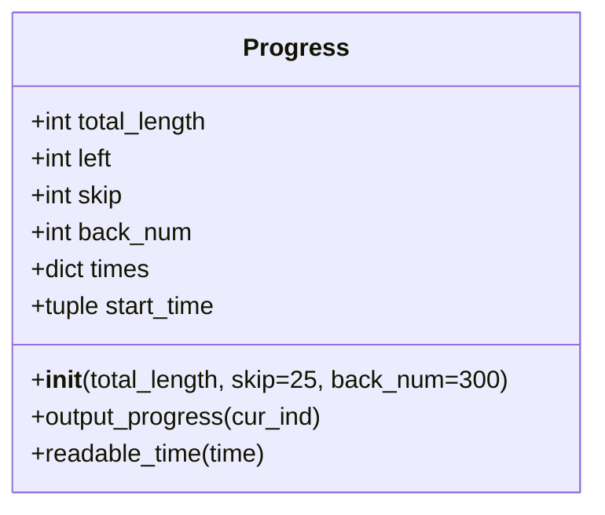

# Diagram: common/location_service/scripts/Progress.py

> Auto-generated by Obscura crawlers

## Mermaid

### SVG

<svg id="container" width="380.328125" xmlns="http://www.w3.org/2000/svg" class="classDiagram" height="328" viewBox="0 0 380.328125 328" role="graphics-document document" aria-roledescription="class"><g><defs><marker id="container_class-aggregationStart" class="marker aggregation class" refX="18" refY="7" markerWidth="190" markerHeight="240" orient="auto"><path d="M 18,7 L9,13 L1,7 L9,1 Z"></path></marker></defs><defs><marker id="container_class-aggregationEnd" class="marker aggregation class" refX="1" refY="7" markerWidth="20" markerHeight="28" orient="auto"><path d="M 18,7 L9,13 L1,7 L9,1 Z"></path></marker></defs><defs><marker id="container_class-extensionStart" class="marker extension class" refX="18" refY="7" markerWidth="190" markerHeight="240" orient="auto"><path d="M 1,7 L18,13 V 1 Z"></path></marker></defs><defs><marker id="container_class-extensionEnd" class="marker extension class" refX="1" refY="7" markerWidth="20" markerHeight="28" orient="auto"><path d="M 1,1 V 13 L18,7 Z"></path></marker></defs><defs><marker id="container_class-compositionStart" class="marker composition class" refX="18" refY="7" markerWidth="190" markerHeight="240" orient="auto"><path d="M 18,7 L9,13 L1,7 L9,1 Z"></path></marker></defs><defs><marker id="container_class-compositionEnd" class="marker composition class" refX="1" refY="7" markerWidth="20" markerHeight="28" orient="auto"><path d="M 18,7 L9,13 L1,7 L9,1 Z"></path></marker></defs><defs><marker id="container_class-dependencyStart" class="marker dependency class" refX="6" refY="7" markerWidth="190" markerHeight="240" orient="auto"><path d="M 5,7 L9,13 L1,7 L9,1 Z"></path></marker></defs><defs><marker id="container_class-dependencyEnd" class="marker dependency class" refX="13" refY="7" markerWidth="20" markerHeight="28" orient="auto"><path d="M 18,7 L9,13 L14,7 L9,1 Z"></path></marker></defs><defs><marker id="container_class-lollipopStart" class="marker lollipop class" refX="13" refY="7" markerWidth="190" markerHeight="240" orient="auto"><circle stroke="black" fill="transparent" cx="7" cy="7" r="6"></circle></marker></defs><defs><marker id="container_class-lollipopEnd" class="marker lollipop class" refX="1" refY="7" markerWidth="190" markerHeight="240" orient="auto"><circle stroke="black" fill="transparent" cx="7" cy="7" r="6"></circle></marker></defs><g class="root"><g class="clusters"></g><g class="edgePaths"></g><g class="edgeLabels"></g><g class="nodes"><g class="node default" id="classId-Progress-0" transform="translate(190.1640625, 164)"><g class="basic label-container"><path d="M-182.1640625 -156 L182.1640625 -156 L182.1640625 156 L-182.1640625 156" stroke="none" stroke-width="0" fill="#ECECFF" style=""></path><path d="M-182.1640625 -156 C-57.78066828641836 -156, 66.60272592716328 -156, 182.1640625 -156 M-182.1640625 -156 C-72.20948264432151 -156, 37.74509721135698 -156, 182.1640625 -156 M182.1640625 -156 C182.1640625 -65.77004971364703, 182.1640625 24.459900572705948, 182.1640625 156 M182.1640625 -156 C182.1640625 -76.23361320778997, 182.1640625 3.532773584420056, 182.1640625 156 M182.1640625 156 C92.46770098305441 156, 2.7713394661088273 156, -182.1640625 156 M182.1640625 156 C90.62463730930254 156, -0.9147878813949148 156, -182.1640625 156 M-182.1640625 156 C-182.1640625 70.14254463622012, -182.1640625 -15.714910727559754, -182.1640625 -156 M-182.1640625 156 C-182.1640625 43.73811555022695, -182.1640625 -68.5237688995461, -182.1640625 -156" stroke="#9370DB" stroke-width="1.3" fill="none" stroke-dasharray="0 0" style=""></path></g><g class="annotation-group text" transform="translate(0, -132)"></g><g class="label-group text" transform="translate(-31.75, -132)"><g class="label" style="font-weight: bolder" transform="translate(0,-12)"><foreignObject width="63.5" height="24">

Progress

</foreignObject></g></g><g class="members-group text" transform="translate(-170.1640625, -84)"><g class="label" style="" transform="translate(0,-12)"><foreignObject width="120.015625" height="24">

+int total_length

</foreignObject></g><g class="label" style="" transform="translate(0,12)"><foreignObject width="56.359375" height="24">

+int left

</foreignObject></g><g class="label" style="" transform="translate(0,36)"><foreignObject width="61.578125" height="24">

+int skip

</foreignObject></g><g class="label" style="" transform="translate(0,60)"><foreignObject width="106.5" height="24">

+int back_num

</foreignObject></g><g class="label" style="" transform="translate(0,84)"><foreignObject width="79.921875" height="24">

+dict times

</foreignObject></g><g class="label" style="" transform="translate(0,108)"><foreignObject width="124.578125" height="24">

+tuple start_time

</foreignObject></g></g><g class="methods-group text" transform="translate(-170.1640625, 84)"><g class="label" style="" transform="translate(0,-12)"><foreignObject width="308.578125" height="24">

+<strong>init</strong>(total_length, skip=25, back_num=300)

</foreignObject></g><g class="label" style="" transform="translate(0,12)"><foreignObject width="191.234375" height="24">

+output_progress(cur_ind)

</foreignObject></g><g class="label" style="" transform="translate(0,36)"><foreignObject width="155.546875" height="24">

+readable_time(time)

</foreignObject></g></g><g class="divider" style=""><path d="M-182.1640625 -108 C-58.872865011145194 -108, 64.41833247770961 -108, 182.1640625 -108 M-182.1640625 -108 C-65.98143756303162 -108, 50.20118737393676 -108, 182.1640625 -108" stroke="#9370DB" stroke-width="1.3" fill="none" stroke-dasharray="0 0" style=""></path></g><g class="divider" style=""><path d="M-182.1640625 60 C-72.13971004606867 60, 37.88464240786266 60, 182.1640625 60 M-182.1640625 60 C-84.6885356287438 60, 12.786991242512414 60, 182.1640625 60" stroke="#9370DB" stroke-width="1.3" fill="none" stroke-dasharray="0 0" style=""></path></g></g></g></g></g></svg>
