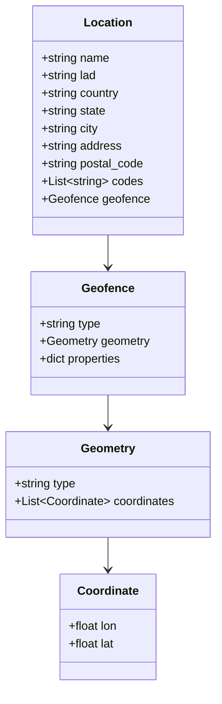

# Diagram: common/location_service/scripts/add_location.py


> Auto-generated by Obscura crawlers

## Diagram 1

```mermaid
flowchart LR
    A[Start] --> B[get_connection(loc.config.config)]
    B --> C[get_cursor(conn)]
    C --> D[loc.db.location.insert_location(cursor, "gmdavid@freightverify.com", 18, n)]
    D --> E[print(result)]
    E --> F[End]
```

> SVG rendering failed for this diagram.

## Diagram 2



### SVG

<svg id="container" width="294.8671875" xmlns="http://www.w3.org/2000/svg" class="classDiagram" height="934" viewBox="0 0 294.8671875 934" role="graphics-document document" aria-roledescription="class"><style>#container{font-family:"trebuchet ms",verdana,arial,sans-serif;font-size:16px;fill:#333;}@keyframes edge-animation-frame{from{stroke-dashoffset:0;}}@keyframes dash{to{stroke-dashoffset:0;}}#container .edge-animation-slow{stroke-dasharray:9,5!important;stroke-dashoffset:900;animation:dash 50s linear infinite;stroke-linecap:round;}#container .edge-animation-fast{stroke-dasharray:9,5!important;stroke-dashoffset:900;animation:dash 20s linear infinite;stroke-linecap:round;}#container .error-icon{fill:#552222;}#container .error-text{fill:#552222;stroke:#552222;}#container .edge-thickness-normal{stroke-width:1px;}#container .edge-thickness-thick{stroke-width:3.5px;}#container .edge-pattern-solid{stroke-dasharray:0;}#container .edge-thickness-invisible{stroke-width:0;fill:none;}#container .edge-pattern-dashed{stroke-dasharray:3;}#container .edge-pattern-dotted{stroke-dasharray:2;}#container .marker{fill:#333333;stroke:#333333;}#container .marker.cross{stroke:#333333;}#container svg{font-family:"trebuchet ms",verdana,arial,sans-serif;font-size:16px;}#container p{margin:0;}#container g.classGroup text{fill:#9370DB;stroke:none;font-family:"trebuchet ms",verdana,arial,sans-serif;font-size:10px;}#container g.classGroup text .title{font-weight:bolder;}#container .nodeLabel,#container .edgeLabel{color:#131300;}#container .edgeLabel .label rect{fill:#ECECFF;}#container .label text{fill:#131300;}#container .labelBkg{background:#ECECFF;}#container .edgeLabel .label span{background:#ECECFF;}#container .classTitle{font-weight:bolder;}#container .node rect,#container .node circle,#container .node ellipse,#container .node polygon,#container .node path{fill:#ECECFF;stroke:#9370DB;stroke-width:1px;}#container .divider{stroke:#9370DB;stroke-width:1;}#container g.clickable{cursor:pointer;}#container g.classGroup rect{fill:#ECECFF;stroke:#9370DB;}#container g.classGroup line{stroke:#9370DB;stroke-width:1;}#container .classLabel .box{stroke:none;stroke-width:0;fill:#ECECFF;opacity:0.5;}#container .classLabel .label{fill:#9370DB;font-size:10px;}#container .relation{stroke:#333333;stroke-width:1;fill:none;}#container .dashed-line{stroke-dasharray:3;}#container .dotted-line{stroke-dasharray:1 2;}#container #compositionStart,#container .composition{fill:#333333!important;stroke:#333333!important;stroke-width:1;}#container #compositionEnd,#container .composition{fill:#333333!important;stroke:#333333!important;stroke-width:1;}#container #dependencyStart,#container .dependency{fill:#333333!important;stroke:#333333!important;stroke-width:1;}#container #dependencyStart,#container .dependency{fill:#333333!important;stroke:#333333!important;stroke-width:1;}#container #extensionStart,#container .extension{fill:transparent!important;stroke:#333333!important;stroke-width:1;}#container #extensionEnd,#container .extension{fill:transparent!important;stroke:#333333!important;stroke-width:1;}#container #aggregationStart,#container .aggregation{fill:transparent!important;stroke:#333333!important;stroke-width:1;}#container #aggregationEnd,#container .aggregation{fill:transparent!important;stroke:#333333!important;stroke-width:1;}#container #lollipopStart,#container .lollipop{fill:#ECECFF!important;stroke:#333333!important;stroke-width:1;}#container #lollipopEnd,#container .lollipop{fill:#ECECFF!important;stroke:#333333!important;stroke-width:1;}#container .edgeTerminals{font-size:11px;line-height:initial;}#container .classTitleText{text-anchor:middle;font-size:18px;fill:#333;}#container .label-icon{display:inline-block;height:1em;overflow:visible;vertical-align:-0.125em;}#container .node .label-icon path{fill:currentColor;stroke:revert;stroke-width:revert;}#container :root{--mermaid-font-family:"trebuchet ms",verdana,arial,sans-serif;}</style><g><defs><marker id="container_class-aggregationStart" class="marker aggregation class" refX="18" refY="7" markerWidth="190" markerHeight="240" orient="auto"><path d="M 18,7 L9,13 L1,7 L9,1 Z"></path></marker></defs><defs><marker id="container_class-aggregationEnd" class="marker aggregation class" refX="1" refY="7" markerWidth="20" markerHeight="28" orient="auto"><path d="M 18,7 L9,13 L1,7 L9,1 Z"></path></marker></defs><defs><marker id="container_class-extensionStart" class="marker extension class" refX="18" refY="7" markerWidth="190" markerHeight="240" orient="auto"><path d="M 1,7 L18,13 V 1 Z"></path></marker></defs><defs><marker id="container_class-extensionEnd" class="marker extension class" refX="1" refY="7" markerWidth="20" markerHeight="28" orient="auto"><path d="M 1,1 V 13 L18,7 Z"></path></marker></defs><defs><marker id="container_class-compositionStart" class="marker composition class" refX="18" refY="7" markerWidth="190" markerHeight="240" orient="auto"><path d="M 18,7 L9,13 L1,7 L9,1 Z"></path></marker></defs><defs><marker id="container_class-compositionEnd" class="marker composition class" refX="1" refY="7" markerWidth="20" markerHeight="28" orient="auto"><path d="M 18,7 L9,13 L1,7 L9,1 Z"></path></marker></defs><defs><marker id="container_class-dependencyStart" class="marker dependency class" refX="6" refY="7" markerWidth="190" markerHeight="240" orient="auto"><path d="M 5,7 L9,13 L1,7 L9,1 Z"></path></marker></defs><defs><marker id="container_class-dependencyEnd" class="marker dependency class" refX="13" refY="7" markerWidth="20" markerHeight="28" orient="auto"><path d="M 18,7 L9,13 L14,7 L9,1 Z"></path></marker></defs><defs><marker id="container_class-lollipopStart" class="marker lollipop class" refX="13" refY="7" markerWidth="190" markerHeight="240" orient="auto"><circle stroke="black" fill="transparent" cx="7" cy="7" r="6"></circle></marker></defs><defs><marker id="container_class-lollipopEnd" class="marker lollipop class" refX="1" refY="7" markerWidth="190" markerHeight="240" orient="auto"><circle stroke="black" fill="transparent" cx="7" cy="7" r="6"></circle></marker></defs><g class="root"><g class="clusters"></g><g class="edgePaths"><path d="M147.434,320L147.434,324.167C147.434,328.333,147.434,336.667,147.434,344C147.434,351.333,147.434,357.667,147.434,360.833L147.434,364" id="id_Location_Geofence_1" class="edge-thickness-normal edge-pattern-solid relation" style=";;;" data-edge="true" data-et="edge" data-id="id_Location_Geofence_1" data-points="W3sieCI6MTQ3LjQzMzU5Mzc1LCJ5IjozMjB9LHsieCI6MTQ3LjQzMzU5Mzc1LCJ5IjozNDV9LHsieCI6MTQ3LjQzMzU5Mzc1LCJ5IjozNzB9XQ==" marker-end="url(#container_class-dependencyEnd)"></path><path d="M147.434,538L147.434,542.167C147.434,546.333,147.434,554.667,147.434,562C147.434,569.333,147.434,575.667,147.434,578.833L147.434,582" id="id_Geofence_Geometry_2" class="edge-thickness-normal edge-pattern-solid relation" style=";;;" data-edge="true" data-et="edge" data-id="id_Geofence_Geometry_2" data-points="W3sieCI6MTQ3LjQzMzU5Mzc1LCJ5Ijo1Mzh9LHsieCI6MTQ3LjQzMzU5Mzc1LCJ5Ijo1NjN9LHsieCI6MTQ3LjQzMzU5Mzc1LCJ5Ijo1ODh9XQ==" marker-end="url(#container_class-dependencyEnd)"></path><path d="M147.434,732L147.434,736.167C147.434,740.333,147.434,748.667,147.434,756C147.434,763.333,147.434,769.667,147.434,772.833L147.434,776" id="id_Geometry_Coordinate_3" class="edge-thickness-normal edge-pattern-solid relation" style=";;;" data-edge="true" data-et="edge" data-id="id_Geometry_Coordinate_3" data-points="W3sieCI6MTQ3LjQzMzU5Mzc1LCJ5Ijo3MzJ9LHsieCI6MTQ3LjQzMzU5Mzc1LCJ5Ijo3NTd9LHsieCI6MTQ3LjQzMzU5Mzc1LCJ5Ijo3ODJ9XQ==" marker-end="url(#container_class-dependencyEnd)"></path></g><g class="edgeLabels"><g class="edgeLabel"><g class="label" data-id="id_Location_Geofence_1" transform="translate(0, 0)"><foreignObject width="0" height="0"><div xmlns="http://www.w3.org/1999/xhtml" class="labelBkg" style="display: table-cell; white-space: nowrap; line-height: 1.5; max-width: 200px; text-align: center;"><span class="edgeLabel"></span></div></foreignObject></g></g><g class="edgeLabel"><g class="label" data-id="id_Geofence_Geometry_2" transform="translate(0, 0)"><foreignObject width="0" height="0"><div xmlns="http://www.w3.org/1999/xhtml" class="labelBkg" style="display: table-cell; white-space: nowrap; line-height: 1.5; max-width: 200px; text-align: center;"><span class="edgeLabel"></span></div></foreignObject></g></g><g class="edgeLabel"><g class="label" data-id="id_Geometry_Coordinate_3" transform="translate(0, 0)"><foreignObject width="0" height="0"><div xmlns="http://www.w3.org/1999/xhtml" class="labelBkg" style="display: table-cell; white-space: nowrap; line-height: 1.5; max-width: 200px; text-align: center;"><span class="edgeLabel"></span></div></foreignObject></g></g></g><g class="nodes"><g class="node default" id="classId-Location-0" transform="translate(147.43359375, 164)"><g class="basic label-container"><path d="M-100.27734375 -156 L100.27734375 -156 L100.27734375 156 L-100.27734375 156" stroke="none" stroke-width="0" fill="#ECECFF" style=""></path><path d="M-100.27734375 -156 C-55.58750518465741 -156, -10.897666619314819 -156, 100.27734375 -156 M-100.27734375 -156 C-44.7855666025382 -156, 10.706210544923593 -156, 100.27734375 -156 M100.27734375 -156 C100.27734375 -41.61437585707806, 100.27734375 72.77124828584388, 100.27734375 156 M100.27734375 -156 C100.27734375 -37.732997698963416, 100.27734375 80.53400460207317, 100.27734375 156 M100.27734375 156 C33.91594663841083 156, -32.44545047317834 156, -100.27734375 156 M100.27734375 156 C41.61763040176402 156, -17.042082946471965 156, -100.27734375 156 M-100.27734375 156 C-100.27734375 49.70710094271989, -100.27734375 -56.58579811456022, -100.27734375 -156 M-100.27734375 156 C-100.27734375 83.28952761198546, -100.27734375 10.579055223970926, -100.27734375 -156" stroke="#9370DB" stroke-width="1.3" fill="none" stroke-dasharray="0 0" style=""></path></g><g class="annotation-group text" transform="translate(0, -132)"></g><g class="label-group text" transform="translate(-31.3515625, -132)"><g class="label" style="font-weight: bolder" transform="translate(0,-12)"><foreignObject width="62.703125" height="24"><div xmlns="http://www.w3.org/1999/xhtml" style="display: table-cell; white-space: nowrap; line-height: 1.5; max-width: 112px; text-align: center;"><span class="nodeLabel markdown-node-label" style=""><p>Location</p></span></div></foreignObject></g></g><g class="members-group text" transform="translate(-88.27734375, -84)"><g class="label" style="" transform="translate(0,-12)"><foreignObject width="94.375" height="24"><div xmlns="http://www.w3.org/1999/xhtml" style="display: table-cell; white-space: nowrap; line-height: 1.5; max-width: 152px; text-align: center;"><span class="nodeLabel markdown-node-label" style=""><p>+string name</p></span></div></foreignObject></g><g class="label" style="" transform="translate(0,12)"><foreignObject width="76.75" height="24"><div xmlns="http://www.w3.org/1999/xhtml" style="display: table-cell; white-space: nowrap; line-height: 1.5; max-width: 134px; text-align: center;"><span class="nodeLabel markdown-node-label" style=""><p>+string lad</p></span></div></foreignObject></g><g class="label" style="" transform="translate(0,36)"><foreignObject width="109.046875" height="24"><div xmlns="http://www.w3.org/1999/xhtml" style="display: table-cell; white-space: nowrap; line-height: 1.5; max-width: 167px; text-align: center;"><span class="nodeLabel markdown-node-label" style=""><p>+string country</p></span></div></foreignObject></g><g class="label" style="" transform="translate(0,60)"><foreignObject width="89.953125" height="24"><div xmlns="http://www.w3.org/1999/xhtml" style="display: table-cell; white-space: nowrap; line-height: 1.5; max-width: 147px; text-align: center;"><span class="nodeLabel markdown-node-label" style=""><p>+string state</p></span></div></foreignObject></g><g class="label" style="" transform="translate(0,84)"><foreignObject width="79.59375" height="24"><div xmlns="http://www.w3.org/1999/xhtml" style="display: table-cell; white-space: nowrap; line-height: 1.5; max-width: 137px; text-align: center;"><span class="nodeLabel markdown-node-label" style=""><p>+string city</p></span></div></foreignObject></g><g class="label" style="" transform="translate(0,108)"><foreignObject width="110.90625" height="24"><div xmlns="http://www.w3.org/1999/xhtml" style="display: table-cell; white-space: nowrap; line-height: 1.5; max-width: 168px; text-align: center;"><span class="nodeLabel markdown-node-label" style=""><p>+string address</p></span></div></foreignObject></g><g class="label" style="" transform="translate(0,132)"><foreignObject width="142.046875" height="24"><div xmlns="http://www.w3.org/1999/xhtml" style="display: table-cell; white-space: nowrap; line-height: 1.5; max-width: 199px; text-align: center;"><span class="nodeLabel markdown-node-label" style=""><p>+string postal_code</p></span></div></foreignObject></g><g class="label" style="" transform="translate(0,156)"><foreignObject width="138.03125" height="24"><div xmlns="http://www.w3.org/1999/xhtml" style="display: table-cell; white-space: nowrap; line-height: 1.5; max-width: 235px; text-align: center;"><span class="nodeLabel markdown-node-label" style=""><p>+List&lt;string&gt; codes</p></span></div></foreignObject></g><g class="label" style="" transform="translate(0,180)"><foreignObject width="145.203125" height="24"><div xmlns="http://www.w3.org/1999/xhtml" style="display: table-cell; white-space: nowrap; line-height: 1.5; max-width: 203px; text-align: center;"><span class="nodeLabel markdown-node-label" style=""><p>+Geofence geofence</p></span></div></foreignObject></g></g><g class="methods-group text" transform="translate(-88.27734375, 156)"></g><g class="divider" style=""><path d="M-100.27734375 -108 C-36.31095872318668 -108, 27.65542630362664 -108, 100.27734375 -108 M-100.27734375 -108 C-31.03729558657571 -108, 38.20275257684858 -108, 100.27734375 -108" stroke="#9370DB" stroke-width="1.3" fill="none" stroke-dasharray="0 0" style=""></path></g><g class="divider" style=""><path d="M-100.27734375 132 C-34.867469941472166 132, 30.54240386705567 132, 100.27734375 132 M-100.27734375 132 C-57.849176386489766 132, -15.421009022979533 132, 100.27734375 132" stroke="#9370DB" stroke-width="1.3" fill="none" stroke-dasharray="0 0" style=""></path></g></g><g class="node default" id="classId-Geofence-1" transform="translate(147.43359375, 454)"><g class="basic label-container"><path d="M-104.5859375 -84 L104.5859375 -84 L104.5859375 84 L-104.5859375 84" stroke="none" stroke-width="0" fill="#ECECFF" style=""></path><path d="M-104.5859375 -84 C-52.34128296966944 -84, -0.0966284393388861 -84, 104.5859375 -84 M-104.5859375 -84 C-37.987638036309676 -84, 28.61066142738065 -84, 104.5859375 -84 M104.5859375 -84 C104.5859375 -45.736912448719465, 104.5859375 -7.473824897438931, 104.5859375 84 M104.5859375 -84 C104.5859375 -41.18856139717277, 104.5859375 1.6228772056544614, 104.5859375 84 M104.5859375 84 C30.884418222975896 84, -42.81710105404821 84, -104.5859375 84 M104.5859375 84 C40.84723196734797 84, -22.891473565304054 84, -104.5859375 84 M-104.5859375 84 C-104.5859375 50.37756877178459, -104.5859375 16.755137543569177, -104.5859375 -84 M-104.5859375 84 C-104.5859375 37.48976663167185, -104.5859375 -9.020466736656303, -104.5859375 -84" stroke="#9370DB" stroke-width="1.3" fill="none" stroke-dasharray="0 0" style=""></path></g><g class="annotation-group text" transform="translate(0, -60)"></g><g class="label-group text" transform="translate(-34.140625, -60)"><g class="label" style="font-weight: bolder" transform="translate(0,-12)"><foreignObject width="68.28125" height="24"><div xmlns="http://www.w3.org/1999/xhtml" style="display: table-cell; white-space: nowrap; line-height: 1.5; max-width: 118px; text-align: center;"><span class="nodeLabel markdown-node-label" style=""><p>Geofence</p></span></div></foreignObject></g></g><g class="members-group text" transform="translate(-92.5859375, -12)"><g class="label" style="" transform="translate(0,-12)"><foreignObject width="85.65625" height="24"><div xmlns="http://www.w3.org/1999/xhtml" style="display: table-cell; white-space: nowrap; line-height: 1.5; max-width: 143px; text-align: center;"><span class="nodeLabel markdown-node-label" style=""><p>+string type</p></span></div></foreignObject></g><g class="label" style="" transform="translate(0,12)"><foreignObject width="151.03125" height="24"><div xmlns="http://www.w3.org/1999/xhtml" style="display: table-cell; white-space: nowrap; line-height: 1.5; max-width: 209px; text-align: center;"><span class="nodeLabel markdown-node-label" style=""><p>+Geometry geometry</p></span></div></foreignObject></g><g class="label" style="" transform="translate(0,36)"><foreignObject width="115.15625" height="24"><div xmlns="http://www.w3.org/1999/xhtml" style="display: table-cell; white-space: nowrap; line-height: 1.5; max-width: 173px; text-align: center;"><span class="nodeLabel markdown-node-label" style=""><p>+dict properties</p></span></div></foreignObject></g></g><g class="methods-group text" transform="translate(-92.5859375, 84)"></g><g class="divider" style=""><path d="M-104.5859375 -36 C-40.64100270678213 -36, 23.303932086435736 -36, 104.5859375 -36 M-104.5859375 -36 C-34.64417667588269 -36, 35.29758414823462 -36, 104.5859375 -36" stroke="#9370DB" stroke-width="1.3" fill="none" stroke-dasharray="0 0" style=""></path></g><g class="divider" style=""><path d="M-104.5859375 60 C-54.97520212275074 60, -5.364466745501474 60, 104.5859375 60 M-104.5859375 60 C-41.10491822999005 60, 22.376101040019904 60, 104.5859375 60" stroke="#9370DB" stroke-width="1.3" fill="none" stroke-dasharray="0 0" style=""></path></g></g><g class="node default" id="classId-Geometry-2" transform="translate(147.43359375, 660)"><g class="basic label-container"><path d="M-139.43359375 -72 L139.43359375 -72 L139.43359375 72 L-139.43359375 72" stroke="none" stroke-width="0" fill="#ECECFF" style=""></path><path d="M-139.43359375 -72 C-65.12951525457434 -72, 9.174563240851313 -72, 139.43359375 -72 M-139.43359375 -72 C-49.59290006451579 -72, 40.24779362096842 -72, 139.43359375 -72 M139.43359375 -72 C139.43359375 -29.732071673406608, 139.43359375 12.535856653186784, 139.43359375 72 M139.43359375 -72 C139.43359375 -38.54177716845508, 139.43359375 -5.083554336910154, 139.43359375 72 M139.43359375 72 C79.62547546262076 72, 19.817357175241526 72, -139.43359375 72 M139.43359375 72 C40.8967077376264 72, -57.6401782747472 72, -139.43359375 72 M-139.43359375 72 C-139.43359375 16.209631373820237, -139.43359375 -39.580737252359526, -139.43359375 -72 M-139.43359375 72 C-139.43359375 20.272861705832554, -139.43359375 -31.454276588334892, -139.43359375 -72" stroke="#9370DB" stroke-width="1.3" fill="none" stroke-dasharray="0 0" style=""></path></g><g class="annotation-group text" transform="translate(0, -48)"></g><g class="label-group text" transform="translate(-35.8671875, -48)"><g class="label" style="font-weight: bolder" transform="translate(0,-12)"><foreignObject width="71.734375" height="24"><div xmlns="http://www.w3.org/1999/xhtml" style="display: table-cell; white-space: nowrap; line-height: 1.5; max-width: 121px; text-align: center;"><span class="nodeLabel markdown-node-label" style=""><p>Geometry</p></span></div></foreignObject></g></g><g class="members-group text" transform="translate(-127.43359375, 0)"><g class="label" style="" transform="translate(0,-12)"><foreignObject width="85.65625" height="24"><div xmlns="http://www.w3.org/1999/xhtml" style="display: table-cell; white-space: nowrap; line-height: 1.5; max-width: 143px; text-align: center;"><span class="nodeLabel markdown-node-label" style=""><p>+string type</p></span></div></foreignObject></g><g class="label" style="" transform="translate(0,12)"><foreignObject width="219" height="24"><div xmlns="http://www.w3.org/1999/xhtml" style="display: table-cell; white-space: nowrap; line-height: 1.5; max-width: 316px; text-align: center;"><span class="nodeLabel markdown-node-label" style=""><p>+List&lt;Coordinate&gt; coordinates</p></span></div></foreignObject></g></g><g class="methods-group text" transform="translate(-127.43359375, 72)"></g><g class="divider" style=""><path d="M-139.43359375 -24 C-60.4434278452098 -24, 18.546738059580406 -24, 139.43359375 -24 M-139.43359375 -24 C-47.28725906519274 -24, 44.859075619614515 -24, 139.43359375 -24" stroke="#9370DB" stroke-width="1.3" fill="none" stroke-dasharray="0 0" style=""></path></g><g class="divider" style=""><path d="M-139.43359375 48 C-79.27382766500043 48, -19.114061580000836 48, 139.43359375 48 M-139.43359375 48 C-54.278946367110976 48, 30.87570101577805 48, 139.43359375 48" stroke="#9370DB" stroke-width="1.3" fill="none" stroke-dasharray="0 0" style=""></path></g></g><g class="node default" id="classId-Coordinate-3" transform="translate(147.43359375, 854)"><g class="basic label-container"><path d="M-66.2734375 -72 L66.2734375 -72 L66.2734375 72 L-66.2734375 72" stroke="none" stroke-width="0" fill="#ECECFF" style=""></path><path d="M-66.2734375 -72 C-16.739759505612646 -72, 32.79391848877471 -72, 66.2734375 -72 M-66.2734375 -72 C-33.49211370432696 -72, -0.710789908653922 -72, 66.2734375 -72 M66.2734375 -72 C66.2734375 -30.330527027101432, 66.2734375 11.338945945797136, 66.2734375 72 M66.2734375 -72 C66.2734375 -26.314939752149634, 66.2734375 19.370120495700732, 66.2734375 72 M66.2734375 72 C21.323780272091255 72, -23.62587695581749 72, -66.2734375 72 M66.2734375 72 C18.007449560084623 72, -30.258538379830753 72, -66.2734375 72 M-66.2734375 72 C-66.2734375 18.478295273778187, -66.2734375 -35.043409452443626, -66.2734375 -72 M-66.2734375 72 C-66.2734375 38.12939706009161, -66.2734375 4.258794120183225, -66.2734375 -72" stroke="#9370DB" stroke-width="1.3" fill="none" stroke-dasharray="0 0" style=""></path></g><g class="annotation-group text" transform="translate(0, -48)"></g><g class="label-group text" transform="translate(-40.171875, -48)"><g class="label" style="font-weight: bolder" transform="translate(0,-12)"><foreignObject width="80.34375" height="24"><div xmlns="http://www.w3.org/1999/xhtml" style="display: table-cell; white-space: nowrap; line-height: 1.5; max-width: 129px; text-align: center;"><span class="nodeLabel markdown-node-label" style=""><p>Coordinate</p></span></div></foreignObject></g></g><g class="members-group text" transform="translate(-54.2734375, 0)"><g class="label" style="" transform="translate(0,-12)"><foreignObject width="68.375" height="24"><div xmlns="http://www.w3.org/1999/xhtml" style="display: table-cell; white-space: nowrap; line-height: 1.5; max-width: 126px; text-align: center;"><span class="nodeLabel markdown-node-label" style=""><p>+float lon</p></span></div></foreignObject></g><g class="label" style="" transform="translate(0,12)"><foreignObject width="64.140625" height="24"><div xmlns="http://www.w3.org/1999/xhtml" style="display: table-cell; white-space: nowrap; line-height: 1.5; max-width: 122px; text-align: center;"><span class="nodeLabel markdown-node-label" style=""><p>+float lat</p></span></div></foreignObject></g></g><g class="methods-group text" transform="translate(-54.2734375, 72)"></g><g class="divider" style=""><path d="M-66.2734375 -24 C-33.12999365748852 -24, 0.013450185022961136 -24, 66.2734375 -24 M-66.2734375 -24 C-19.030654338040684 -24, 28.212128823918633 -24, 66.2734375 -24" stroke="#9370DB" stroke-width="1.3" fill="none" stroke-dasharray="0 0" style=""></path></g><g class="divider" style=""><path d="M-66.2734375 48 C-28.67831781633661 48, 8.916801867326782 48, 66.2734375 48 M-66.2734375 48 C-28.05870885593106 48, 10.156019788137883 48, 66.2734375 48" stroke="#9370DB" stroke-width="1.3" fill="none" stroke-dasharray="0 0" style=""></path></g></g></g></g></g></svg>
