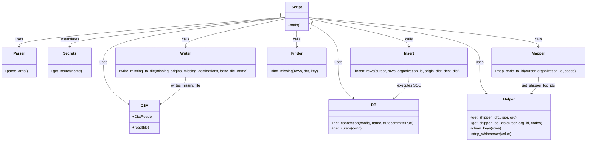

# Diagram: common/location_service/scripts/code_linking/origin_destination_code_linking.py


> Auto-generated by Obscura crawlers

## Diagram 1

```mermaid
flowchart TD
    A[Start: __main__] --> B[parse_args()]
    B --> C[Open CSV file]
    C --> D[clean_keys & strip_whitespace]
    D --> E[get_shipper_id]
    E --> F[map_code_to_id<br/>origin_dict]
    E --> G[map_code_to_id<br/>dest_dict]
    F --> H[insert_rows(cursor, rows, org_id, origin_dict, dest_dict)]
    G --> H
    H --> I[Commit & Close DB]
    I --> J{Missing origins or destinations?}
    J -- Yes --> K[write_missing_to_file(missing_origins, missing_destinations, base_file_name)]
    J -- No --> L[End]
```

> SVG rendering failed for this diagram.

## Diagram 2



### SVG

<svg id="container" width="2543.8984375" xmlns="http://www.w3.org/2000/svg" class="classDiagram" height="614" viewBox="0 0 2543.8984375 614" role="graphics-document document" aria-roledescription="class"><style>#container{font-family:"trebuchet ms",verdana,arial,sans-serif;font-size:16px;fill:#333;}@keyframes edge-animation-frame{from{stroke-dashoffset:0;}}@keyframes dash{to{stroke-dashoffset:0;}}#container .edge-animation-slow{stroke-dasharray:9,5!important;stroke-dashoffset:900;animation:dash 50s linear infinite;stroke-linecap:round;}#container .edge-animation-fast{stroke-dasharray:9,5!important;stroke-dashoffset:900;animation:dash 20s linear infinite;stroke-linecap:round;}#container .error-icon{fill:#552222;}#container .error-text{fill:#552222;stroke:#552222;}#container .edge-thickness-normal{stroke-width:1px;}#container .edge-thickness-thick{stroke-width:3.5px;}#container .edge-pattern-solid{stroke-dasharray:0;}#container .edge-thickness-invisible{stroke-width:0;fill:none;}#container .edge-pattern-dashed{stroke-dasharray:3;}#container .edge-pattern-dotted{stroke-dasharray:2;}#container .marker{fill:#333333;stroke:#333333;}#container .marker.cross{stroke:#333333;}#container svg{font-family:"trebuchet ms",verdana,arial,sans-serif;font-size:16px;}#container p{margin:0;}#container g.classGroup text{fill:#9370DB;stroke:none;font-family:"trebuchet ms",verdana,arial,sans-serif;font-size:10px;}#container g.classGroup text .title{font-weight:bolder;}#container .nodeLabel,#container .edgeLabel{color:#131300;}#container .edgeLabel .label rect{fill:#ECECFF;}#container .label text{fill:#131300;}#container .labelBkg{background:#ECECFF;}#container .edgeLabel .label span{background:#ECECFF;}#container .classTitle{font-weight:bolder;}#container .node rect,#container .node circle,#container .node ellipse,#container .node polygon,#container .node path{fill:#ECECFF;stroke:#9370DB;stroke-width:1px;}#container .divider{stroke:#9370DB;stroke-width:1;}#container g.clickable{cursor:pointer;}#container g.classGroup rect{fill:#ECECFF;stroke:#9370DB;}#container g.classGroup line{stroke:#9370DB;stroke-width:1;}#container .classLabel .box{stroke:none;stroke-width:0;fill:#ECECFF;opacity:0.5;}#container .classLabel .label{fill:#9370DB;font-size:10px;}#container .relation{stroke:#333333;stroke-width:1;fill:none;}#container .dashed-line{stroke-dasharray:3;}#container .dotted-line{stroke-dasharray:1 2;}#container #compositionStart,#container .composition{fill:#333333!important;stroke:#333333!important;stroke-width:1;}#container #compositionEnd,#container .composition{fill:#333333!important;stroke:#333333!important;stroke-width:1;}#container #dependencyStart,#container .dependency{fill:#333333!important;stroke:#333333!important;stroke-width:1;}#container #dependencyStart,#container .dependency{fill:#333333!important;stroke:#333333!important;stroke-width:1;}#container #extensionStart,#container .extension{fill:transparent!important;stroke:#333333!important;stroke-width:1;}#container #extensionEnd,#container .extension{fill:transparent!important;stroke:#333333!important;stroke-width:1;}#container #aggregationStart,#container .aggregation{fill:transparent!important;stroke:#333333!important;stroke-width:1;}#container #aggregationEnd,#container .aggregation{fill:transparent!important;stroke:#333333!important;stroke-width:1;}#container #lollipopStart,#container .lollipop{fill:#ECECFF!important;stroke:#333333!important;stroke-width:1;}#container #lollipopEnd,#container .lollipop{fill:#ECECFF!important;stroke:#333333!important;stroke-width:1;}#container .edgeTerminals{font-size:11px;line-height:initial;}#container .classTitleText{text-anchor:middle;font-size:18px;fill:#333;}#container .label-icon{display:inline-block;height:1em;overflow:visible;vertical-align:-0.125em;}#container .node .label-icon path{fill:currentColor;stroke:revert;stroke-width:revert;}#container :root{--mermaid-font-family:"trebuchet ms",verdana,arial,sans-serif;}</style><g><defs><marker id="container_class-aggregationStart" class="marker aggregation class" refX="18" refY="7" markerWidth="190" markerHeight="240" orient="auto"><path d="M 18,7 L9,13 L1,7 L9,1 Z"></path></marker></defs><defs><marker id="container_class-aggregationEnd" class="marker aggregation class" refX="1" refY="7" markerWidth="20" markerHeight="28" orient="auto"><path d="M 18,7 L9,13 L1,7 L9,1 Z"></path></marker></defs><defs><marker id="container_class-extensionStart" class="marker extension class" refX="18" refY="7" markerWidth="190" markerHeight="240" orient="auto"><path d="M 1,7 L18,13 V 1 Z"></path></marker></defs><defs><marker id="container_class-extensionEnd" class="marker extension class" refX="1" refY="7" markerWidth="20" markerHeight="28" orient="auto"><path d="M 1,1 V 13 L18,7 Z"></path></marker></defs><defs><marker id="container_class-compositionStart" class="marker composition class" refX="18" refY="7" markerWidth="190" markerHeight="240" orient="auto"><path d="M 18,7 L9,13 L1,7 L9,1 Z"></path></marker></defs><defs><marker id="container_class-compositionEnd" class="marker composition class" refX="1" refY="7" markerWidth="20" markerHeight="28" orient="auto"><path d="M 18,7 L9,13 L1,7 L9,1 Z"></path></marker></defs><defs><marker id="container_class-dependencyStart" class="marker dependency class" refX="6" refY="7" markerWidth="190" markerHeight="240" orient="auto"><path d="M 5,7 L9,13 L1,7 L9,1 Z"></path></marker></defs><defs><marker id="container_class-dependencyEnd" class="marker dependency class" refX="13" refY="7" markerWidth="20" markerHeight="28" orient="auto"><path d="M 18,7 L9,13 L14,7 L9,1 Z"></path></marker></defs><defs><marker id="container_class-lollipopStart" class="marker lollipop class" refX="13" refY="7" markerWidth="190" markerHeight="240" orient="auto"><circle stroke="black" fill="transparent" cx="7" cy="7" r="6"></circle></marker></defs><defs><marker id="container_class-lollipopEnd" class="marker lollipop class" refX="1" refY="7" markerWidth="190" markerHeight="240" orient="auto"><circle stroke="black" fill="transparent" cx="7" cy="7" r="6"></circle></marker></defs><g class="root"><g class="clusters"></g><g class="edgePaths"><path d="M1230.664,75.18L1038.879,91.15C847.094,107.12,463.523,139.06,271.738,160.197C79.953,181.333,79.953,191.667,79.953,196.833L79.953,202" id="id_Script_Parser_1" class="edge-thickness-normal edge-pattern-solid relation" style=";;;" data-edge="true" data-et="edge" data-id="id_Script_Parser_1" data-points="W3sieCI6MTIzMC42NjQwNjI1LCJ5Ijo3NS4xODAwOTc3Nzc0MDE5MX0seyJ4Ijo3OS45NTMxMjUsInkiOjE3MX0seyJ4Ijo3OS45NTMxMjUsInkiOjIwOH1d" marker-end="url(#container_class-dependencyEnd)"></path><path d="M1230.664,76.958L1098.611,92.632C966.557,108.305,702.451,139.653,570.397,171.993C438.344,204.333,438.344,237.667,438.344,271C438.344,304.333,438.344,337.667,457.003,368.495C475.661,399.324,512.979,427.648,531.638,441.809L550.297,455.971" id="id_Script_CSV_2" class="edge-thickness-normal edge-pattern-solid relation" style=";;;" data-edge="true" data-et="edge" data-id="id_Script_CSV_2" data-points="W3sieCI6MTIzMC42NjQwNjI1LCJ5Ijo3Ni45NTgyMjYxMTY3OTA2OH0seyJ4Ijo0MzguMzQzNzUsInkiOjE3MX0seyJ4Ijo0MzguMzQzNzUsInkiOjI3MX0seyJ4Ijo0MzguMzQzNzUsInkiOjM3MX0seyJ4Ijo1NTUuMDc2MTcxODc1LCJ5Ijo0NTkuNTk4NzE1OTc4MzMwOH1d" marker-end="url(#container_class-dependencyEnd)"></path><path d="M1230.664,76.089L1074.617,91.907C918.569,107.726,606.474,139.363,450.426,160.348C294.379,181.333,294.379,191.667,294.379,196.833L294.379,202" id="id_Script_Secrets_3" class="edge-thickness-normal edge-pattern-solid relation" style=";;;" data-edge="true" data-et="edge" data-id="id_Script_Secrets_3" data-points="W3sieCI6MTIzMC42NjQwNjI1LCJ5Ijo3Ni4wODg2OTg4MTk5ODg5fSx7IngiOjI5NC4zNzg5MDYyNSwieSI6MTcxfSx7IngiOjI5NC4zNzg5MDYyNSwieSI6MjA4fV0=" marker-end="url(#container_class-dependencyEnd)"></path><path d="M1331.063,99.082L1352.49,111.068C1373.917,123.054,1416.771,147.027,1438.198,175.68C1459.625,204.333,1459.625,237.667,1459.625,271C1459.625,304.333,1459.625,337.667,1470.453,363.84C1481.28,390.014,1502.935,409.027,1513.763,418.534L1524.59,428.041" id="id_Script_DB_4" class="edge-thickness-normal edge-pattern-solid relation" style=";;;" data-edge="true" data-et="edge" data-id="id_Script_DB_4" data-points="W3sieCI6MTMzMS4wNjI1LCJ5Ijo5OS4wODE2MzgwMDQ1MDE0Nn0seyJ4IjoxNDU5LjYyNSwieSI6MTcxfSx7IngiOjE0NTkuNjI1LCJ5IjoyNzF9LHsieCI6MTQ1OS42MjUsInkiOjM3MX0seyJ4IjoxNTI5LjA5ODg3Njk1MzEyNSwieSI6NDMyfV0=" marker-end="url(#container_class-dependencyEnd)"></path><path d="M1331.063,77.288L1455.751,92.907C1580.44,108.525,1829.818,139.763,1954.507,172.048C2079.195,204.333,2079.195,237.667,2079.195,271C2079.195,304.333,2079.195,337.667,2084.273,359.769C2089.352,381.872,2099.508,392.744,2104.586,398.18L2109.664,403.616" id="id_Script_Helper_5" class="edge-thickness-normal edge-pattern-solid relation" style=";;;" data-edge="true" data-et="edge" data-id="id_Script_Helper_5" data-points="W3sieCI6MTMzMS4wNjI1LCJ5Ijo3Ny4yODgwMTI2MDQ0MDQ2OH0seyJ4IjoyMDc5LjE5NTMxMjUsInkiOjE3MX0seyJ4IjoyMDc5LjE5NTMxMjUsInkiOjI3MX0seyJ4IjoyMDc5LjE5NTMxMjUsInkiOjM3MX0seyJ4IjoyMTEzLjc2MDA2NzIxMDQ3OCwieSI6NDA4fV0=" marker-end="url(#container_class-dependencyEnd)"></path><path d="M1331.063,75.77L1498.101,91.642C1665.139,107.513,1999.216,139.257,2166.255,160.295C2333.293,181.333,2333.293,191.667,2333.293,196.833L2333.293,202" id="id_Script_Mapper_6" class="edge-thickness-normal edge-pattern-solid relation" style=";;;" data-edge="true" data-et="edge" data-id="id_Script_Mapper_6" data-points="W3sieCI6MTMzMS4wNjI1LCJ5Ijo3NS43Njk4NDA2MjE3NzU1fSx7IngiOjIzMzMuMjkyOTY4NzUsInkiOjE3MX0seyJ4IjoyMzMzLjI5Mjk2ODc1LCJ5IjoyMDh9XQ==" marker-end="url(#container_class-dependencyEnd)"></path><path d="M1331.063,81.275L1404.12,96.229C1477.178,111.183,1623.294,141.092,1696.352,161.213C1769.41,181.333,1769.41,191.667,1769.41,196.833L1769.41,202" id="id_Script_Insert_7" class="edge-thickness-normal edge-pattern-solid relation" style=";;;" data-edge="true" data-et="edge" data-id="id_Script_Insert_7" data-points="W3sieCI6MTMzMS4wNjI1LCJ5Ijo4MS4yNzUyMTAyODU2MDQ2M30seyJ4IjoxNzY5LjQxMDE1NjI1LCJ5IjoxNzF9LHsieCI6MTc2OS40MTAxNTYyNSwieSI6MjA4fV0=" marker-end="url(#container_class-dependencyEnd)"></path><path d="M1280.863,134L1280.863,140.167C1280.863,146.333,1280.863,158.667,1280.863,170C1280.863,181.333,1280.863,191.667,1280.863,196.833L1280.863,202" id="id_Script_Finder_8" class="edge-thickness-normal edge-pattern-solid relation" style=";;;" data-edge="true" data-et="edge" data-id="id_Script_Finder_8" data-points="W3sieCI6MTI4MC44NjMyODEyNSwieSI6MTM0fSx7IngiOjEyODAuODYzMjgxMjUsInkiOjE3MX0seyJ4IjoxMjgwLjg2MzI4MTI1LCJ5IjoyMDh9XQ==" marker-end="url(#container_class-dependencyEnd)"></path><path d="M1230.664,81.369L1158.339,96.307C1086.014,111.246,941.365,141.123,869.04,161.228C796.715,181.333,796.715,191.667,796.715,196.833L796.715,202" id="id_Script_Writer_9" class="edge-thickness-normal edge-pattern-solid relation" style=";;;" data-edge="true" data-et="edge" data-id="id_Script_Writer_9" data-points="W3sieCI6MTIzMC42NjQwNjI1LCJ5Ijo4MS4zNjg1NTk0ODc1MDIyMn0seyJ4Ijo3OTYuNzE0ODQzNzUsInkiOjE3MX0seyJ4Ijo3OTYuNzE0ODQzNzUsInkiOjIwOH1d" marker-end="url(#container_class-dependencyEnd)"></path><path d="M2333.293,334L2333.293,340.167C2333.293,346.333,2333.293,358.667,2328.215,370.269C2323.137,381.872,2312.98,392.744,2307.902,398.18L2302.824,403.616" id="id_Mapper_Helper_10" class="edge-thickness-normal edge-pattern-solid relation" style=";;;" data-edge="true" data-et="edge" data-id="id_Mapper_Helper_10" data-points="W3sieCI6MjMzMy4yOTI5Njg3NSwieSI6MzM0fSx7IngiOjIzMzMuMjkyOTY4NzUsInkiOjM3MX0seyJ4IjoyMjk4LjcyODIxNDAzOTUyMiwieSI6NDA4fV0=" marker-end="url(#container_class-dependencyEnd)"></path><path d="M1769.41,334L1769.41,340.167C1769.41,346.333,1769.41,358.667,1758.583,374.34C1747.755,390.014,1726.1,409.027,1715.272,418.534L1704.445,428.041" id="id_Insert_DB_11" class="edge-thickness-normal edge-pattern-solid relation" style=";;;" data-edge="true" data-et="edge" data-id="id_Insert_DB_11" data-points="W3sieCI6MTc2OS40MTAxNTYyNSwieSI6MzM0fSx7IngiOjE3NjkuNDEwMTU2MjUsInkiOjM3MX0seyJ4IjoxNjk5LjkzNjI3OTI5Njg3NSwieSI6NDMyfV0=" marker-end="url(#container_class-dependencyEnd)"></path><path d="M796.715,334L796.715,340.167C796.715,346.333,796.715,358.667,778.056,378.995C759.397,399.324,722.079,427.648,703.421,441.809L684.762,455.971" id="id_Writer_CSV_12" class="edge-thickness-normal edge-pattern-solid relation" style=";;;" data-edge="true" data-et="edge" data-id="id_Writer_CSV_12" data-points="W3sieCI6Nzk2LjcxNDg0Mzc1LCJ5IjozMzR9LHsieCI6Nzk2LjcxNDg0Mzc1LCJ5IjozNzF9LHsieCI6Njc5Ljk4MjQyMTg3NSwieSI6NDU5LjU5ODcxNTk3ODMzMDh9XQ==" marker-end="url(#container_class-dependencyEnd)"></path></g><g class="edgeLabels"><g class="edgeLabel" transform="translate(79.953125, 171)"><g class="label" data-id="id_Script_Parser_1" transform="translate(-16.4921875, -12)"><foreignObject width="32.984375" height="24"><div xmlns="http://www.w3.org/1999/xhtml" class="labelBkg" style="display: table-cell; white-space: nowrap; line-height: 1.5; max-width: 200px; text-align: center;"><span class="edgeLabel"><p>uses</p></span></div></foreignObject></g></g><g class="edgeLabel" transform="translate(438.34375, 271)"><g class="label" data-id="id_Script_CSV_2" transform="translate(-16.4921875, -12)"><foreignObject width="32.984375" height="24"><div xmlns="http://www.w3.org/1999/xhtml" class="labelBkg" style="display: table-cell; white-space: nowrap; line-height: 1.5; max-width: 200px; text-align: center;"><span class="edgeLabel"><p>uses</p></span></div></foreignObject></g></g><g class="edgeLabel" transform="translate(294.37890625, 171)"><g class="label" data-id="id_Script_Secrets_3" transform="translate(-42.9140625, -12)"><foreignObject width="85.828125" height="24"><div xmlns="http://www.w3.org/1999/xhtml" class="labelBkg" style="display: table-cell; white-space: nowrap; line-height: 1.5; max-width: 200px; text-align: center;"><span class="edgeLabel"><p>instantiates</p></span></div></foreignObject></g></g><g class="edgeLabel" transform="translate(1459.625, 271)"><g class="label" data-id="id_Script_DB_4" transform="translate(-16.4921875, -12)"><foreignObject width="32.984375" height="24"><div xmlns="http://www.w3.org/1999/xhtml" class="labelBkg" style="display: table-cell; white-space: nowrap; line-height: 1.5; max-width: 200px; text-align: center;"><span class="edgeLabel"><p>uses</p></span></div></foreignObject></g></g><g class="edgeLabel" transform="translate(2079.1953125, 271)"><g class="label" data-id="id_Script_Helper_5" transform="translate(-16.4921875, -12)"><foreignObject width="32.984375" height="24"><div xmlns="http://www.w3.org/1999/xhtml" class="labelBkg" style="display: table-cell; white-space: nowrap; line-height: 1.5; max-width: 200px; text-align: center;"><span class="edgeLabel"><p>uses</p></span></div></foreignObject></g></g><g class="edgeLabel" transform="translate(2333.29296875, 171)"><g class="label" data-id="id_Script_Mapper_6" transform="translate(-16.4453125, -12)"><foreignObject width="32.890625" height="24"><div xmlns="http://www.w3.org/1999/xhtml" class="labelBkg" style="display: table-cell; white-space: nowrap; line-height: 1.5; max-width: 200px; text-align: center;"><span class="edgeLabel"><p>calls</p></span></div></foreignObject></g></g><g class="edgeLabel" transform="translate(1769.41015625, 171)"><g class="label" data-id="id_Script_Insert_7" transform="translate(-16.4453125, -12)"><foreignObject width="32.890625" height="24"><div xmlns="http://www.w3.org/1999/xhtml" class="labelBkg" style="display: table-cell; white-space: nowrap; line-height: 1.5; max-width: 200px; text-align: center;"><span class="edgeLabel"><p>calls</p></span></div></foreignObject></g></g><g class="edgeLabel" transform="translate(1280.86328125, 171)"><g class="label" data-id="id_Script_Finder_8" transform="translate(-16.4453125, -12)"><foreignObject width="32.890625" height="24"><div xmlns="http://www.w3.org/1999/xhtml" class="labelBkg" style="display: table-cell; white-space: nowrap; line-height: 1.5; max-width: 200px; text-align: center;"><span class="edgeLabel"><p>calls</p></span></div></foreignObject></g></g><g class="edgeLabel" transform="translate(796.71484375, 171)"><g class="label" data-id="id_Script_Writer_9" transform="translate(-16.4453125, -12)"><foreignObject width="32.890625" height="24"><div xmlns="http://www.w3.org/1999/xhtml" class="labelBkg" style="display: table-cell; white-space: nowrap; line-height: 1.5; max-width: 200px; text-align: center;"><span class="edgeLabel"><p>calls</p></span></div></foreignObject></g></g><g class="edgeLabel" transform="translate(2333.29296875, 371)"><g class="label" data-id="id_Mapper_Helper_10" transform="translate(-72.25, -12)"><foreignObject width="144.5" height="24"><div xmlns="http://www.w3.org/1999/xhtml" class="labelBkg" style="display: table-cell; white-space: nowrap; line-height: 1.5; max-width: 200px; text-align: center;"><span class="edgeLabel"><p>get_shipper_loc_ids</p></span></div></foreignObject></g></g><g class="edgeLabel" transform="translate(1769.41015625, 371)"><g class="label" data-id="id_Insert_DB_11" transform="translate(-47.71875, -12)"><foreignObject width="95.4375" height="24"><div xmlns="http://www.w3.org/1999/xhtml" class="labelBkg" style="display: table-cell; white-space: nowrap; line-height: 1.5; max-width: 200px; text-align: center;"><span class="edgeLabel"><p>executes SQL</p></span></div></foreignObject></g></g><g class="edgeLabel" transform="translate(796.71484375, 371)"><g class="label" data-id="id_Writer_CSV_12" transform="translate(-65.0625, -12)"><foreignObject width="130.125" height="24"><div xmlns="http://www.w3.org/1999/xhtml" class="labelBkg" style="display: table-cell; white-space: nowrap; line-height: 1.5; max-width: 200px; text-align: center;"><span class="edgeLabel"><p>writes missing file</p></span></div></foreignObject></g></g><g class="edgeTerminals" transform="translate(1211.9796773895018, 61.68403434990743)"><g class="inner" transform="translate(0, 0)"><foreignObject style="width: 9px; height: 12px;"><div xmlns="http://www.w3.org/1999/xhtml" style="display: inline-block; padding-right: 1px; white-space: nowrap;"><span class="edgeLabel">1</span></div></foreignObject></g></g><g class="edgeTerminals" transform="translate(1211.518075451494, 64.12540754859897)"><g class="inner" transform="translate(0, 0)"><foreignObject style="width: 9px; height: 12px;"><div xmlns="http://www.w3.org/1999/xhtml" style="display: inline-block; padding-right: 1px; white-space: nowrap;"><span class="edgeLabel">1</span></div></foreignObject></g></g><g class="edgeTerminals" transform="translate(1211.7404934421352, 62.930109624350074)"><g class="inner" transform="translate(0, 0)"><foreignObject style="width: 9px; height: 12px;"><div xmlns="http://www.w3.org/1999/xhtml" style="display: inline-block; padding-right: 1px; white-space: nowrap;"><span class="edgeLabel">1</span></div></foreignObject></g></g><g class="edgeTerminals" transform="translate(1339.012126757662, 120.71618015319294)"><g class="inner" transform="translate(0, 0)"><foreignObject style="width: 9px; height: 12px;"><div xmlns="http://www.w3.org/1999/xhtml" style="display: inline-block; padding-right: 1px; white-space: nowrap;"><span class="edgeLabel">1</span></div></foreignObject></g></g><g class="edgeTerminals" transform="translate(1346.5624562188234, 94.34677548271551)"><g class="inner" transform="translate(0, 0)"><foreignObject style="width: 9px; height: 12px;"><div xmlns="http://www.w3.org/1999/xhtml" style="display: inline-block; padding-right: 1px; white-space: nowrap;"><span class="edgeLabel">1</span></div></foreignObject></g></g><g class="edgeTerminals" transform="translate(1347.065145841293, 92.3579467786883)"><g class="inner" transform="translate(0, 0)"><foreignObject style="width: 9px; height: 12px;"><div xmlns="http://www.w3.org/1999/xhtml" style="display: inline-block; padding-right: 1px; white-space: nowrap;"><span class="edgeLabel">1</span></div></foreignObject></g></g><g class="edgeTerminals" transform="translate(1345.199067384216, 99.47981099021366)"><g class="inner" transform="translate(0, 0)"><foreignObject style="width: 9px; height: 12px;"><div xmlns="http://www.w3.org/1999/xhtml" style="display: inline-block; padding-right: 1px; white-space: nowrap;"><span class="edgeLabel">1</span></div></foreignObject></g></g><g class="edgeTerminals" transform="translate(1265.863280625, 151.49999946428574)"><g class="inner" transform="translate(0, 0)"><foreignObject style="width: 9px; height: 12px;"><div xmlns="http://www.w3.org/1999/xhtml" style="display: inline-block; padding-right: 1px; white-space: nowrap;"><span class="edgeLabel">1</span></div></foreignObject></g></g><g class="edgeTerminals" transform="translate(1210.4916426074087, 70.21851439118139)"><g class="inner" transform="translate(0, 0)"><foreignObject style="width: 9px; height: 12px;"><div xmlns="http://www.w3.org/1999/xhtml" style="display: inline-block; padding-right: 1px; white-space: nowrap;"><span class="edgeLabel">1</span></div></foreignObject></g></g></g><g class="nodes"><g class="node default" id="classId-Script-0" transform="translate(1280.86328125, 71)"><g class="basic label-container"><path d="M-50.19921875 -63 L50.19921875 -63 L50.19921875 63 L-50.19921875 63" stroke="none" stroke-width="0" fill="#ECECFF" style=""></path><path d="M-50.19921875 -63 C-12.498915717692803 -63, 25.201387314614394 -63, 50.19921875 -63 M-50.19921875 -63 C-12.30173894699999 -63, 25.59574085600002 -63, 50.19921875 -63 M50.19921875 -63 C50.19921875 -20.712856596258156, 50.19921875 21.574286807483688, 50.19921875 63 M50.19921875 -63 C50.19921875 -33.91919329461751, 50.19921875 -4.838386589235014, 50.19921875 63 M50.19921875 63 C27.95326550679229 63, 5.707312263584583 63, -50.19921875 63 M50.19921875 63 C17.147748572540557 63, -15.903721604918886 63, -50.19921875 63 M-50.19921875 63 C-50.19921875 26.825468043399646, -50.19921875 -9.349063913200709, -50.19921875 -63 M-50.19921875 63 C-50.19921875 16.944585425249812, -50.19921875 -29.110829149500375, -50.19921875 -63" stroke="#9370DB" stroke-width="1.3" fill="none" stroke-dasharray="0 0" style=""></path></g><g class="annotation-group text" transform="translate(0, -39)"></g><g class="label-group text" transform="translate(-21.7421875, -39)"><g class="label" style="font-weight: bolder" transform="translate(0,-12)"><foreignObject width="43.484375" height="24"><div xmlns="http://www.w3.org/1999/xhtml" style="display: table-cell; white-space: nowrap; line-height: 1.5; max-width: 93px; text-align: center;"><span class="nodeLabel markdown-node-label" style=""><p>Script</p></span></div></foreignObject></g></g><g class="members-group text" transform="translate(-38.19921875, 9)"></g><g class="methods-group text" transform="translate(-38.19921875, 39)"><g class="label" style="" transform="translate(0,-12)"><foreignObject width="54.65625" height="24"><div xmlns="http://www.w3.org/1999/xhtml" style="display: table-cell; white-space: nowrap; line-height: 1.5; max-width: 112px; text-align: center;"><span class="nodeLabel markdown-node-label" style=""><p>+main()</p></span></div></foreignObject></g></g><g class="divider" style=""><path d="M-50.19921875 -15 C-25.573384313577805 -15, -0.947549877155609 -15, 50.19921875 -15 M-50.19921875 -15 C-16.77100646620672 -15, 16.657205817586558 -15, 50.19921875 -15" stroke="#9370DB" stroke-width="1.3" fill="none" stroke-dasharray="0 0" style=""></path></g><g class="divider" style=""><path d="M-50.19921875 9 C-11.960662396407486 9, 26.27789395718503 9, 50.19921875 9 M-50.19921875 9 C-24.145105633674717 9, 1.9090074826505656 9, 50.19921875 9" stroke="#9370DB" stroke-width="1.3" fill="none" stroke-dasharray="0 0" style=""></path></g></g><g class="node default" id="classId-Parser-1" transform="translate(79.953125, 271)"><g class="basic label-container"><path d="M-71.953125 -63 L71.953125 -63 L71.953125 63 L-71.953125 63" stroke="none" stroke-width="0" fill="#ECECFF" style=""></path><path d="M-71.953125 -63 C-31.848435315605848 -63, 8.256254368788305 -63, 71.953125 -63 M-71.953125 -63 C-41.12400933089294 -63, -10.294893661785878 -63, 71.953125 -63 M71.953125 -63 C71.953125 -37.60388555287699, 71.953125 -12.207771105753977, 71.953125 63 M71.953125 -63 C71.953125 -22.937098840381395, 71.953125 17.12580231923721, 71.953125 63 M71.953125 63 C36.340785278654664 63, 0.7284455573093283 63, -71.953125 63 M71.953125 63 C24.888766802648064 63, -22.175591394703872 63, -71.953125 63 M-71.953125 63 C-71.953125 24.083019950535366, -71.953125 -14.833960098929268, -71.953125 -63 M-71.953125 63 C-71.953125 27.535380527536915, -71.953125 -7.929238944926169, -71.953125 -63" stroke="#9370DB" stroke-width="1.3" fill="none" stroke-dasharray="0 0" style=""></path></g><g class="annotation-group text" transform="translate(0, -39)"></g><g class="label-group text" transform="translate(-23.375, -39)"><g class="label" style="font-weight: bolder" transform="translate(0,-12)"><foreignObject width="46.75" height="24"><div xmlns="http://www.w3.org/1999/xhtml" style="display: table-cell; white-space: nowrap; line-height: 1.5; max-width: 96px; text-align: center;"><span class="nodeLabel markdown-node-label" style=""><p>Parser</p></span></div></foreignObject></g></g><g class="members-group text" transform="translate(-59.953125, 9)"></g><g class="methods-group text" transform="translate(-59.953125, 39)"><g class="label" style="" transform="translate(0,-12)"><foreignObject width="96.53125" height="24"><div xmlns="http://www.w3.org/1999/xhtml" style="display: table-cell; white-space: nowrap; line-height: 1.5; max-width: 154px; text-align: center;"><span class="nodeLabel markdown-node-label" style=""><p>+parse_args()</p></span></div></foreignObject></g></g><g class="divider" style=""><path d="M-71.953125 -15 C-17.551153419164628 -15, 36.850818161670745 -15, 71.953125 -15 M-71.953125 -15 C-18.84429196227409 -15, 34.26454107545182 -15, 71.953125 -15" stroke="#9370DB" stroke-width="1.3" fill="none" stroke-dasharray="0 0" style=""></path></g><g class="divider" style=""><path d="M-71.953125 9 C-42.09734668082292 9, -12.24156836164584 9, 71.953125 9 M-71.953125 9 C-42.82694261698275 9, -13.700760233965504 9, 71.953125 9" stroke="#9370DB" stroke-width="1.3" fill="none" stroke-dasharray="0 0" style=""></path></g></g><g class="node default" id="classId-CSV-2" transform="translate(617.529296875, 507)"><g class="basic label-container"><path d="M-62.453125 -72 L62.453125 -72 L62.453125 72 L-62.453125 72" stroke="none" stroke-width="0" fill="#ECECFF" style=""></path><path d="M-62.453125 -72 C-13.733647785127609 -72, 34.98582942974478 -72, 62.453125 -72 M-62.453125 -72 C-14.299988234078803 -72, 33.85314853184239 -72, 62.453125 -72 M62.453125 -72 C62.453125 -26.728713970258262, 62.453125 18.542572059483476, 62.453125 72 M62.453125 -72 C62.453125 -22.855525512534392, 62.453125 26.288948974931216, 62.453125 72 M62.453125 72 C35.32079567730236 72, 8.188466354604714 72, -62.453125 72 M62.453125 72 C31.12727575520679 72, -0.19857348958642262 72, -62.453125 72 M-62.453125 72 C-62.453125 16.648084066481857, -62.453125 -38.703831867036286, -62.453125 -72 M-62.453125 72 C-62.453125 39.590594286475934, -62.453125 7.181188572951868, -62.453125 -72" stroke="#9370DB" stroke-width="1.3" fill="none" stroke-dasharray="0 0" style=""></path></g><g class="annotation-group text" transform="translate(0, -48)"></g><g class="label-group text" transform="translate(-13.5, -48)"><g class="label" style="font-weight: bolder" transform="translate(0,-12)"><foreignObject width="27" height="24"><div xmlns="http://www.w3.org/1999/xhtml" style="display: table-cell; white-space: nowrap; line-height: 1.5; max-width: 76px; text-align: center;"><span class="nodeLabel markdown-node-label" style=""><p>CSV</p></span></div></foreignObject></g></g><g class="members-group text" transform="translate(-50.453125, 0)"><g class="label" style="" transform="translate(0,-12)"><foreignObject width="87.40625" height="24"><div xmlns="http://www.w3.org/1999/xhtml" style="display: table-cell; white-space: nowrap; line-height: 1.5; max-width: 146px; text-align: center;"><span class="nodeLabel markdown-node-label" style=""><p>+DictReader</p></span></div></foreignObject></g></g><g class="methods-group text" transform="translate(-50.453125, 48)"><g class="label" style="" transform="translate(0,-12)"><foreignObject width="73.421875" height="24"><div xmlns="http://www.w3.org/1999/xhtml" style="display: table-cell; white-space: nowrap; line-height: 1.5; max-width: 131px; text-align: center;"><span class="nodeLabel markdown-node-label" style=""><p>+read(file)</p></span></div></foreignObject></g></g><g class="divider" style=""><path d="M-62.453125 -24 C-29.03377069928672 -24, 4.385583601426561 -24, 62.453125 -24 M-62.453125 -24 C-19.0581923480662 -24, 24.3367403038676 -24, 62.453125 -24" stroke="#9370DB" stroke-width="1.3" fill="none" stroke-dasharray="0 0" style=""></path></g><g class="divider" style=""><path d="M-62.453125 24 C-15.047304355903286 24, 32.35851628819343 24, 62.453125 24 M-62.453125 24 C-12.56933354020623 24, 37.31445791958754 24, 62.453125 24" stroke="#9370DB" stroke-width="1.3" fill="none" stroke-dasharray="0 0" style=""></path></g></g><g class="node default" id="classId-DB-3" transform="translate(1614.517578125, 507)"><g class="basic label-container"><path d="M-195.61328125 -75 L195.61328125 -75 L195.61328125 75 L-195.61328125 75" stroke="none" stroke-width="0" fill="#ECECFF" style=""></path><path d="M-195.61328125 -75 C-47.58549507190372 -75, 100.44229110619256 -75, 195.61328125 -75 M-195.61328125 -75 C-70.8578457678102 -75, 53.89758971437959 -75, 195.61328125 -75 M195.61328125 -75 C195.61328125 -44.07238866710392, 195.61328125 -13.144777334207845, 195.61328125 75 M195.61328125 -75 C195.61328125 -22.850060033063784, 195.61328125 29.299879933872433, 195.61328125 75 M195.61328125 75 C82.34150407513997 75, -30.93027309972007 75, -195.61328125 75 M195.61328125 75 C82.37823492002123 75, -30.856811409957544 75, -195.61328125 75 M-195.61328125 75 C-195.61328125 33.967413876531815, -195.61328125 -7.0651722469363705, -195.61328125 -75 M-195.61328125 75 C-195.61328125 30.346969826445324, -195.61328125 -14.306060347109351, -195.61328125 -75" stroke="#9370DB" stroke-width="1.3" fill="none" stroke-dasharray="0 0" style=""></path></g><g class="annotation-group text" transform="translate(0, -51)"></g><g class="label-group text" transform="translate(-10.1484375, -51)"><g class="label" style="font-weight: bolder" transform="translate(0,-12)"><foreignObject width="20.296875" height="24"><div xmlns="http://www.w3.org/1999/xhtml" style="display: table-cell; white-space: nowrap; line-height: 1.5; max-width: 70px; text-align: center;"><span class="nodeLabel markdown-node-label" style=""><p>DB</p></span></div></foreignObject></g></g><g class="members-group text" transform="translate(-183.61328125, -3)"></g><g class="methods-group text" transform="translate(-183.61328125, 27)"><g class="label" style="" transform="translate(0,-12)"><foreignObject width="357.078125" height="24"><div xmlns="http://www.w3.org/1999/xhtml" style="display: table-cell; white-space: nowrap; line-height: 1.5; max-width: 414px; text-align: center;"><span class="nodeLabel markdown-node-label" style=""><p>+get_connection(config, name, autocommit=True)</p></span></div></foreignObject></g><g class="label" style="" transform="translate(0,12)"><foreignObject width="130.078125" height="24"><div xmlns="http://www.w3.org/1999/xhtml" style="display: table-cell; white-space: nowrap; line-height: 1.5; max-width: 187px; text-align: center;"><span class="nodeLabel markdown-node-label" style=""><p>+get_cursor(conn)</p></span></div></foreignObject></g></g><g class="divider" style=""><path d="M-195.61328125 -27 C-53.65487500115347 -27, 88.30353124769306 -27, 195.61328125 -27 M-195.61328125 -27 C-63.565616807654266 -27, 68.48204763469147 -27, 195.61328125 -27" stroke="#9370DB" stroke-width="1.3" fill="none" stroke-dasharray="0 0" style=""></path></g><g class="divider" style=""><path d="M-195.61328125 -3 C-39.88433905084733 -3, 115.84460314830534 -3, 195.61328125 -3 M-195.61328125 -3 C-67.07861857924482 -3, 61.456044091510364 -3, 195.61328125 -3" stroke="#9370DB" stroke-width="1.3" fill="none" stroke-dasharray="0 0" style=""></path></g></g><g class="node default" id="classId-Helper-4" transform="translate(2206.244140625, 507)"><g class="basic label-container"><path d="M-180.23828125 -99 L180.23828125 -99 L180.23828125 99 L-180.23828125 99" stroke="none" stroke-width="0" fill="#ECECFF" style=""></path><path d="M-180.23828125 -99 C-103.00807593491821 -99, -25.77787061983642 -99, 180.23828125 -99 M-180.23828125 -99 C-103.02935938914764 -99, -25.820437528295287 -99, 180.23828125 -99 M180.23828125 -99 C180.23828125 -28.159428772859428, 180.23828125 42.681142454281144, 180.23828125 99 M180.23828125 -99 C180.23828125 -44.42629496059424, 180.23828125 10.147410078811518, 180.23828125 99 M180.23828125 99 C77.14101164413435 99, -25.956257961731296 99, -180.23828125 99 M180.23828125 99 C58.898314516715246 99, -62.44165221656951 99, -180.23828125 99 M-180.23828125 99 C-180.23828125 47.042615933829374, -180.23828125 -4.914768132341251, -180.23828125 -99 M-180.23828125 99 C-180.23828125 39.0549011002458, -180.23828125 -20.8901977995084, -180.23828125 -99" stroke="#9370DB" stroke-width="1.3" fill="none" stroke-dasharray="0 0" style=""></path></g><g class="annotation-group text" transform="translate(0, -75)"></g><g class="label-group text" transform="translate(-24.5234375, -75)"><g class="label" style="font-weight: bolder" transform="translate(0,-12)"><foreignObject width="49.046875" height="24"><div xmlns="http://www.w3.org/1999/xhtml" style="display: table-cell; white-space: nowrap; line-height: 1.5; max-width: 100px; text-align: center;"><span class="nodeLabel markdown-node-label" style=""><p>Helper</p></span></div></foreignObject></g></g><g class="members-group text" transform="translate(-168.23828125, -27)"></g><g class="methods-group text" transform="translate(-168.23828125, 3)"><g class="label" style="" transform="translate(0,-12)"><foreignObject width="201.75" height="24"><div xmlns="http://www.w3.org/1999/xhtml" style="display: table-cell; white-space: nowrap; line-height: 1.5; max-width: 259px; text-align: center;"><span class="nodeLabel markdown-node-label" style=""><p>+get_shipper_id(cursor, org)</p></span></div></foreignObject></g><g class="label" style="" transform="translate(0,12)"><foreignObject width="311.953125" height="24"><div xmlns="http://www.w3.org/1999/xhtml" style="display: table-cell; white-space: nowrap; line-height: 1.5; max-width: 369px; text-align: center;"><span class="nodeLabel markdown-node-label" style=""><p>+get_shipper_loc_ids(cursor, org_id, codes)</p></span></div></foreignObject></g><g class="label" style="" transform="translate(0,36)"><foreignObject width="131.5" height="24"><div xmlns="http://www.w3.org/1999/xhtml" style="display: table-cell; white-space: nowrap; line-height: 1.5; max-width: 189px; text-align: center;"><span class="nodeLabel markdown-node-label" style=""><p>+clean_keys(rows)</p></span></div></foreignObject></g><g class="label" style="" transform="translate(0,60)"><foreignObject width="179.546875" height="24"><div xmlns="http://www.w3.org/1999/xhtml" style="display: table-cell; white-space: nowrap; line-height: 1.5; max-width: 237px; text-align: center;"><span class="nodeLabel markdown-node-label" style=""><p>+strip_whitespace(value)</p></span></div></foreignObject></g></g><g class="divider" style=""><path d="M-180.23828125 -51 C-96.3036189704809 -51, -12.368956690961795 -51, 180.23828125 -51 M-180.23828125 -51 C-50.69669944105098 -51, 78.84488236789804 -51, 180.23828125 -51" stroke="#9370DB" stroke-width="1.3" fill="none" stroke-dasharray="0 0" style=""></path></g><g class="divider" style=""><path d="M-180.23828125 -27 C-96.42376874760107 -27, -12.609256245202147 -27, 180.23828125 -27 M-180.23828125 -27 C-45.453257452128895 -27, 89.33176634574221 -27, 180.23828125 -27" stroke="#9370DB" stroke-width="1.3" fill="none" stroke-dasharray="0 0" style=""></path></g></g><g class="node default" id="classId-Secrets-5" transform="translate(294.37890625, 271)"><g class="basic label-container"><path d="M-92.47265625 -63 L92.47265625 -63 L92.47265625 63 L-92.47265625 63" stroke="none" stroke-width="0" fill="#ECECFF" style=""></path><path d="M-92.47265625 -63 C-44.32866422938876 -63, 3.8153277912224866 -63, 92.47265625 -63 M-92.47265625 -63 C-34.4500469884125 -63, 23.572562273174995 -63, 92.47265625 -63 M92.47265625 -63 C92.47265625 -14.557376547204782, 92.47265625 33.885246905590435, 92.47265625 63 M92.47265625 -63 C92.47265625 -21.979347248369656, 92.47265625 19.041305503260688, 92.47265625 63 M92.47265625 63 C20.648263479998562 63, -51.176129290002876 63, -92.47265625 63 M92.47265625 63 C27.461707132368616 63, -37.54924198526277 63, -92.47265625 63 M-92.47265625 63 C-92.47265625 14.494097906546465, -92.47265625 -34.01180418690707, -92.47265625 -63 M-92.47265625 63 C-92.47265625 28.915963435920332, -92.47265625 -5.168073128159335, -92.47265625 -63" stroke="#9370DB" stroke-width="1.3" fill="none" stroke-dasharray="0 0" style=""></path></g><g class="annotation-group text" transform="translate(0, -39)"></g><g class="label-group text" transform="translate(-27.1640625, -39)"><g class="label" style="font-weight: bolder" transform="translate(0,-12)"><foreignObject width="54.328125" height="24"><div xmlns="http://www.w3.org/1999/xhtml" style="display: table-cell; white-space: nowrap; line-height: 1.5; max-width: 103px; text-align: center;"><span class="nodeLabel markdown-node-label" style=""><p>Secrets</p></span></div></foreignObject></g></g><g class="members-group text" transform="translate(-80.47265625, 9)"></g><g class="methods-group text" transform="translate(-80.47265625, 39)"><g class="label" style="" transform="translate(0,-12)"><foreignObject width="133.78125" height="24"><div xmlns="http://www.w3.org/1999/xhtml" style="display: table-cell; white-space: nowrap; line-height: 1.5; max-width: 191px; text-align: center;"><span class="nodeLabel markdown-node-label" style=""><p>+get_secret(name)</p></span></div></foreignObject></g></g><g class="divider" style=""><path d="M-92.47265625 -15 C-39.947149387738094 -15, 12.578357474523813 -15, 92.47265625 -15 M-92.47265625 -15 C-48.12751159002837 -15, -3.782366930056739 -15, 92.47265625 -15" stroke="#9370DB" stroke-width="1.3" fill="none" stroke-dasharray="0 0" style=""></path></g><g class="divider" style=""><path d="M-92.47265625 9 C-52.86530758352352 9, -13.257958917047034 9, 92.47265625 9 M-92.47265625 9 C-43.57964253876403 9, 5.313371172471946 9, 92.47265625 9" stroke="#9370DB" stroke-width="1.3" fill="none" stroke-dasharray="0 0" style=""></path></g></g><g class="node default" id="classId-Insert-6" transform="translate(1769.41015625, 271)"><g class="basic label-container"><path d="M-258.29296875 -63 L258.29296875 -63 L258.29296875 63 L-258.29296875 63" stroke="none" stroke-width="0" fill="#ECECFF" style=""></path><path d="M-258.29296875 -63 C-98.52550815236555 -63, 61.24195244526891 -63, 258.29296875 -63 M-258.29296875 -63 C-147.07525884299014 -63, -35.857548935980276 -63, 258.29296875 -63 M258.29296875 -63 C258.29296875 -31.113675536028286, 258.29296875 0.772648927943429, 258.29296875 63 M258.29296875 -63 C258.29296875 -18.64008057723025, 258.29296875 25.7198388455395, 258.29296875 63 M258.29296875 63 C88.76726354710325 63, -80.75844165579349 63, -258.29296875 63 M258.29296875 63 C58.46726909215337 63, -141.35843056569325 63, -258.29296875 63 M-258.29296875 63 C-258.29296875 14.76104267901377, -258.29296875 -33.47791464197246, -258.29296875 -63 M-258.29296875 63 C-258.29296875 21.583314108649724, -258.29296875 -19.833371782700553, -258.29296875 -63" stroke="#9370DB" stroke-width="1.3" fill="none" stroke-dasharray="0 0" style=""></path></g><g class="annotation-group text" transform="translate(0, -39)"></g><g class="label-group text" transform="translate(-21.5390625, -39)"><g class="label" style="font-weight: bolder" transform="translate(0,-12)"><foreignObject width="43.078125" height="24"><div xmlns="http://www.w3.org/1999/xhtml" style="display: table-cell; white-space: nowrap; line-height: 1.5; max-width: 92px; text-align: center;"><span class="nodeLabel markdown-node-label" style=""><p>Insert</p></span></div></foreignObject></g></g><g class="members-group text" transform="translate(-246.29296875, 9)"></g><g class="methods-group text" transform="translate(-246.29296875, 39)"><g class="label" style="" transform="translate(0,-12)"><foreignObject width="471.046875" height="24"><div xmlns="http://www.w3.org/1999/xhtml" style="display: table-cell; white-space: nowrap; line-height: 1.5; max-width: 528px; text-align: center;"><span class="nodeLabel markdown-node-label" style=""><p>+insert_rows(cursor, rows, organization_id, origin_dict, dest_dict)</p></span></div></foreignObject></g></g><g class="divider" style=""><path d="M-258.29296875 -15 C-140.4132497239749 -15, -22.53353069794983 -15, 258.29296875 -15 M-258.29296875 -15 C-102.34330439111457 -15, 53.60635996777086 -15, 258.29296875 -15" stroke="#9370DB" stroke-width="1.3" fill="none" stroke-dasharray="0 0" style=""></path></g><g class="divider" style=""><path d="M-258.29296875 9 C-97.26589264294779 9, 63.76118346410442 9, 258.29296875 9 M-258.29296875 9 C-148.36382327422103 9, -38.43467779844204 9, 258.29296875 9" stroke="#9370DB" stroke-width="1.3" fill="none" stroke-dasharray="0 0" style=""></path></g></g><g class="node default" id="classId-Mapper-7" transform="translate(2333.29296875, 271)"><g class="basic label-container"><path d="M-202.60546875 -63 L202.60546875 -63 L202.60546875 63 L-202.60546875 63" stroke="none" stroke-width="0" fill="#ECECFF" style=""></path><path d="M-202.60546875 -63 C-59.82373462258951 -63, 82.95799950482098 -63, 202.60546875 -63 M-202.60546875 -63 C-43.95699872256537 -63, 114.69147130486925 -63, 202.60546875 -63 M202.60546875 -63 C202.60546875 -17.22758930946906, 202.60546875 28.54482138106188, 202.60546875 63 M202.60546875 -63 C202.60546875 -24.37031461773281, 202.60546875 14.259370764534381, 202.60546875 63 M202.60546875 63 C82.68631415472427 63, -37.232840440551456 63, -202.60546875 63 M202.60546875 63 C83.44976163601925 63, -35.70594547796151 63, -202.60546875 63 M-202.60546875 63 C-202.60546875 31.675241476677343, -202.60546875 0.3504829533546854, -202.60546875 -63 M-202.60546875 63 C-202.60546875 21.33493262659291, -202.60546875 -20.33013474681418, -202.60546875 -63" stroke="#9370DB" stroke-width="1.3" fill="none" stroke-dasharray="0 0" style=""></path></g><g class="annotation-group text" transform="translate(0, -39)"></g><g class="label-group text" transform="translate(-27.8515625, -39)"><g class="label" style="font-weight: bolder" transform="translate(0,-12)"><foreignObject width="55.703125" height="24"><div xmlns="http://www.w3.org/1999/xhtml" style="display: table-cell; white-space: nowrap; line-height: 1.5; max-width: 106px; text-align: center;"><span class="nodeLabel markdown-node-label" style=""><p>Mapper</p></span></div></foreignObject></g></g><g class="members-group text" transform="translate(-190.60546875, 9)"></g><g class="methods-group text" transform="translate(-190.60546875, 39)"><g class="label" style="" transform="translate(0,-12)"><foreignObject width="353.359375" height="24"><div xmlns="http://www.w3.org/1999/xhtml" style="display: table-cell; white-space: nowrap; line-height: 1.5; max-width: 411px; text-align: center;"><span class="nodeLabel markdown-node-label" style=""><p>+map_code_to_id(cursor, organization_id, codes)</p></span></div></foreignObject></g></g><g class="divider" style=""><path d="M-202.60546875 -15 C-50.69621750638868 -15, 101.21303373722264 -15, 202.60546875 -15 M-202.60546875 -15 C-64.47248774579595 -15, 73.66049325840811 -15, 202.60546875 -15" stroke="#9370DB" stroke-width="1.3" fill="none" stroke-dasharray="0 0" style=""></path></g><g class="divider" style=""><path d="M-202.60546875 9 C-84.85051591584138 9, 32.90443691831723 9, 202.60546875 9 M-202.60546875 9 C-83.42525291567003 9, 35.75496291865994 9, 202.60546875 9" stroke="#9370DB" stroke-width="1.3" fill="none" stroke-dasharray="0 0" style=""></path></g></g><g class="node default" id="classId-Finder-8" transform="translate(1280.86328125, 271)"><g class="basic label-container"><path d="M-127.26953125 -63 L127.26953125 -63 L127.26953125 63 L-127.26953125 63" stroke="none" stroke-width="0" fill="#ECECFF" style=""></path><path d="M-127.26953125 -63 C-47.13459907617869 -63, 33.000333097642624 -63, 127.26953125 -63 M-127.26953125 -63 C-50.76795888883463 -63, 25.733613472330745 -63, 127.26953125 -63 M127.26953125 -63 C127.26953125 -27.510573491028346, 127.26953125 7.978853017943308, 127.26953125 63 M127.26953125 -63 C127.26953125 -28.335021652018526, 127.26953125 6.329956695962949, 127.26953125 63 M127.26953125 63 C64.22584477213672 63, 1.1821582942734494 63, -127.26953125 63 M127.26953125 63 C34.099204118706496 63, -59.07112301258701 63, -127.26953125 63 M-127.26953125 63 C-127.26953125 36.03462910409917, -127.26953125 9.069258208198342, -127.26953125 -63 M-127.26953125 63 C-127.26953125 26.17620277095569, -127.26953125 -10.64759445808862, -127.26953125 -63" stroke="#9370DB" stroke-width="1.3" fill="none" stroke-dasharray="0 0" style=""></path></g><g class="annotation-group text" transform="translate(0, -39)"></g><g class="label-group text" transform="translate(-22.9609375, -39)"><g class="label" style="font-weight: bolder" transform="translate(0,-12)"><foreignObject width="45.921875" height="24"><div xmlns="http://www.w3.org/1999/xhtml" style="display: table-cell; white-space: nowrap; line-height: 1.5; max-width: 96px; text-align: center;"><span class="nodeLabel markdown-node-label" style=""><p>Finder</p></span></div></foreignObject></g></g><g class="members-group text" transform="translate(-115.26953125, 9)"></g><g class="methods-group text" transform="translate(-115.26953125, 39)"><g class="label" style="" transform="translate(0,-12)"><foreignObject width="207.578125" height="24"><div xmlns="http://www.w3.org/1999/xhtml" style="display: table-cell; white-space: nowrap; line-height: 1.5; max-width: 265px; text-align: center;"><span class="nodeLabel markdown-node-label" style=""><p>+find_missing(rows, dct, key)</p></span></div></foreignObject></g></g><g class="divider" style=""><path d="M-127.26953125 -15 C-26.258313463868234 -15, 74.75290432226353 -15, 127.26953125 -15 M-127.26953125 -15 C-74.09441241457499 -15, -20.91929357914998 -15, 127.26953125 -15" stroke="#9370DB" stroke-width="1.3" fill="none" stroke-dasharray="0 0" style=""></path></g><g class="divider" style=""><path d="M-127.26953125 9 C-37.41420888443193 9, 52.44111348113614 9, 127.26953125 9 M-127.26953125 9 C-25.509440050098632 9, 76.25065114980274 9, 127.26953125 9" stroke="#9370DB" stroke-width="1.3" fill="none" stroke-dasharray="0 0" style=""></path></g></g><g class="node default" id="classId-Writer-9" transform="translate(796.71484375, 271)"><g class="basic label-container"><path d="M-306.87890625 -63 L306.87890625 -63 L306.87890625 63 L-306.87890625 63" stroke="none" stroke-width="0" fill="#ECECFF" style=""></path><path d="M-306.87890625 -63 C-80.29146151835039 -63, 146.29598321329922 -63, 306.87890625 -63 M-306.87890625 -63 C-70.82439661708719 -63, 165.23011301582562 -63, 306.87890625 -63 M306.87890625 -63 C306.87890625 -24.689990522774913, 306.87890625 13.620018954450174, 306.87890625 63 M306.87890625 -63 C306.87890625 -22.44678436489933, 306.87890625 18.10643127020134, 306.87890625 63 M306.87890625 63 C128.63301832506755 63, -49.612869599864894 63, -306.87890625 63 M306.87890625 63 C113.34533098419212 63, -80.18824428161577 63, -306.87890625 63 M-306.87890625 63 C-306.87890625 25.413928699467135, -306.87890625 -12.17214260106573, -306.87890625 -63 M-306.87890625 63 C-306.87890625 15.059850222991813, -306.87890625 -32.880299554016375, -306.87890625 -63" stroke="#9370DB" stroke-width="1.3" fill="none" stroke-dasharray="0 0" style=""></path></g><g class="annotation-group text" transform="translate(0, -39)"></g><g class="label-group text" transform="translate(-22.7734375, -39)"><g class="label" style="font-weight: bolder" transform="translate(0,-12)"><foreignObject width="45.546875" height="24"><div xmlns="http://www.w3.org/1999/xhtml" style="display: table-cell; white-space: nowrap; line-height: 1.5; max-width: 95px; text-align: center;"><span class="nodeLabel markdown-node-label" style=""><p>Writer</p></span></div></foreignObject></g></g><g class="members-group text" transform="translate(-294.87890625, 9)"></g><g class="methods-group text" transform="translate(-294.87890625, 39)"><g class="label" style="" transform="translate(0,-12)"><foreignObject width="566.984375" height="24"><div xmlns="http://www.w3.org/1999/xhtml" style="display: table-cell; white-space: nowrap; line-height: 1.5; max-width: 624px; text-align: center;"><span class="nodeLabel markdown-node-label" style=""><p>+write_missing_to_file(missing_origins, missing_destinations, base_file_name)</p></span></div></foreignObject></g></g><g class="divider" style=""><path d="M-306.87890625 -15 C-85.06776069936947 -15, 136.74338485126106 -15, 306.87890625 -15 M-306.87890625 -15 C-126.88280820842738 -15, 53.113289833145245 -15, 306.87890625 -15" stroke="#9370DB" stroke-width="1.3" fill="none" stroke-dasharray="0 0" style=""></path></g><g class="divider" style=""><path d="M-306.87890625 9 C-119.77231846722987 9, 67.33426931554027 9, 306.87890625 9 M-306.87890625 9 C-115.7574666868955 9, 75.363972876209 9, 306.87890625 9" stroke="#9370DB" stroke-width="1.3" fill="none" stroke-dasharray="0 0" style=""></path></g></g></g></g></g></svg>
