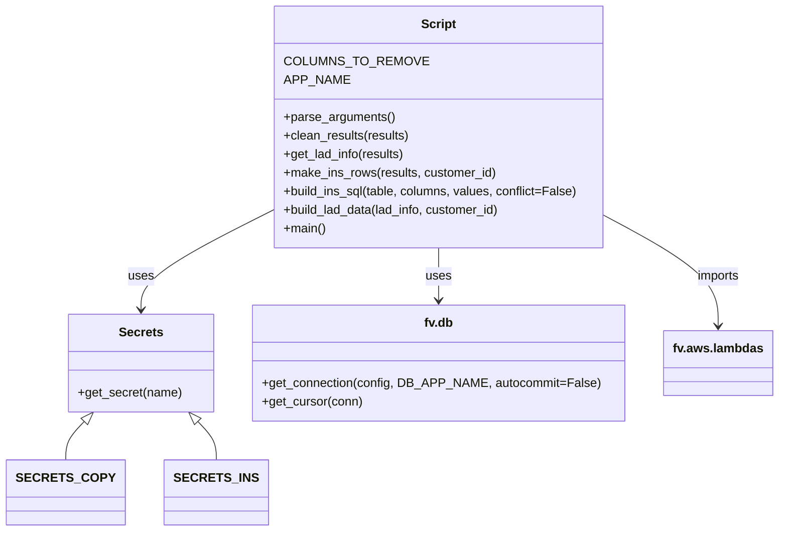

# Diagram: common/location_service/scripts/copy_locations_env/copy_locations.py


> Auto-generated by Obscura crawlers

## Diagram 1



### SVG

<svg id="container" width="964.5859375" xmlns="http://www.w3.org/2000/svg" class="classDiagram" height="686" viewBox="0 0 964.5859375 686" role="graphics-document document" aria-roledescription="class"><style>#container{font-family:"trebuchet ms",verdana,arial,sans-serif;font-size:16px;fill:#333;}@keyframes edge-animation-frame{from{stroke-dashoffset:0;}}@keyframes dash{to{stroke-dashoffset:0;}}#container .edge-animation-slow{stroke-dasharray:9,5!important;stroke-dashoffset:900;animation:dash 50s linear infinite;stroke-linecap:round;}#container .edge-animation-fast{stroke-dasharray:9,5!important;stroke-dashoffset:900;animation:dash 20s linear infinite;stroke-linecap:round;}#container .error-icon{fill:#552222;}#container .error-text{fill:#552222;stroke:#552222;}#container .edge-thickness-normal{stroke-width:1px;}#container .edge-thickness-thick{stroke-width:3.5px;}#container .edge-pattern-solid{stroke-dasharray:0;}#container .edge-thickness-invisible{stroke-width:0;fill:none;}#container .edge-pattern-dashed{stroke-dasharray:3;}#container .edge-pattern-dotted{stroke-dasharray:2;}#container .marker{fill:#333333;stroke:#333333;}#container .marker.cross{stroke:#333333;}#container svg{font-family:"trebuchet ms",verdana,arial,sans-serif;font-size:16px;}#container p{margin:0;}#container g.classGroup text{fill:#9370DB;stroke:none;font-family:"trebuchet ms",verdana,arial,sans-serif;font-size:10px;}#container g.classGroup text .title{font-weight:bolder;}#container .nodeLabel,#container .edgeLabel{color:#131300;}#container .edgeLabel .label rect{fill:#ECECFF;}#container .label text{fill:#131300;}#container .labelBkg{background:#ECECFF;}#container .edgeLabel .label span{background:#ECECFF;}#container .classTitle{font-weight:bolder;}#container .node rect,#container .node circle,#container .node ellipse,#container .node polygon,#container .node path{fill:#ECECFF;stroke:#9370DB;stroke-width:1px;}#container .divider{stroke:#9370DB;stroke-width:1;}#container g.clickable{cursor:pointer;}#container g.classGroup rect{fill:#ECECFF;stroke:#9370DB;}#container g.classGroup line{stroke:#9370DB;stroke-width:1;}#container .classLabel .box{stroke:none;stroke-width:0;fill:#ECECFF;opacity:0.5;}#container .classLabel .label{fill:#9370DB;font-size:10px;}#container .relation{stroke:#333333;stroke-width:1;fill:none;}#container .dashed-line{stroke-dasharray:3;}#container .dotted-line{stroke-dasharray:1 2;}#container #compositionStart,#container .composition{fill:#333333!important;stroke:#333333!important;stroke-width:1;}#container #compositionEnd,#container .composition{fill:#333333!important;stroke:#333333!important;stroke-width:1;}#container #dependencyStart,#container .dependency{fill:#333333!important;stroke:#333333!important;stroke-width:1;}#container #dependencyStart,#container .dependency{fill:#333333!important;stroke:#333333!important;stroke-width:1;}#container #extensionStart,#container .extension{fill:transparent!important;stroke:#333333!important;stroke-width:1;}#container #extensionEnd,#container .extension{fill:transparent!important;stroke:#333333!important;stroke-width:1;}#container #aggregationStart,#container .aggregation{fill:transparent!important;stroke:#333333!important;stroke-width:1;}#container #aggregationEnd,#container .aggregation{fill:transparent!important;stroke:#333333!important;stroke-width:1;}#container #lollipopStart,#container .lollipop{fill:#ECECFF!important;stroke:#333333!important;stroke-width:1;}#container #lollipopEnd,#container .lollipop{fill:#ECECFF!important;stroke:#333333!important;stroke-width:1;}#container .edgeTerminals{font-size:11px;line-height:initial;}#container .classTitleText{text-anchor:middle;font-size:18px;fill:#333;}#container .label-icon{display:inline-block;height:1em;overflow:visible;vertical-align:-0.125em;}#container .node .label-icon path{fill:currentColor;stroke:revert;stroke-width:revert;}#container :root{--mermaid-font-family:"trebuchet ms",verdana,arial,sans-serif;}</style><g><defs><marker id="container_class-aggregationStart" class="marker aggregation class" refX="18" refY="7" markerWidth="190" markerHeight="240" orient="auto"><path d="M 18,7 L9,13 L1,7 L9,1 Z"></path></marker></defs><defs><marker id="container_class-aggregationEnd" class="marker aggregation class" refX="1" refY="7" markerWidth="20" markerHeight="28" orient="auto"><path d="M 18,7 L9,13 L1,7 L9,1 Z"></path></marker></defs><defs><marker id="container_class-extensionStart" class="marker extension class" refX="18" refY="7" markerWidth="190" markerHeight="240" orient="auto"><path d="M 1,7 L18,13 V 1 Z"></path></marker></defs><defs><marker id="container_class-extensionEnd" class="marker extension class" refX="1" refY="7" markerWidth="20" markerHeight="28" orient="auto"><path d="M 1,1 V 13 L18,7 Z"></path></marker></defs><defs><marker id="container_class-compositionStart" class="marker composition class" refX="18" refY="7" markerWidth="190" markerHeight="240" orient="auto"><path d="M 18,7 L9,13 L1,7 L9,1 Z"></path></marker></defs><defs><marker id="container_class-compositionEnd" class="marker composition class" refX="1" refY="7" markerWidth="20" markerHeight="28" orient="auto"><path d="M 18,7 L9,13 L1,7 L9,1 Z"></path></marker></defs><defs><marker id="container_class-dependencyStart" class="marker dependency class" refX="6" refY="7" markerWidth="190" markerHeight="240" orient="auto"><path d="M 5,7 L9,13 L1,7 L9,1 Z"></path></marker></defs><defs><marker id="container_class-dependencyEnd" class="marker dependency class" refX="13" refY="7" markerWidth="20" markerHeight="28" orient="auto"><path d="M 18,7 L9,13 L14,7 L9,1 Z"></path></marker></defs><defs><marker id="container_class-lollipopStart" class="marker lollipop class" refX="13" refY="7" markerWidth="190" markerHeight="240" orient="auto"><circle stroke="black" fill="transparent" cx="7" cy="7" r="6"></circle></marker></defs><defs><marker id="container_class-lollipopEnd" class="marker lollipop class" refX="1" refY="7" markerWidth="190" markerHeight="240" orient="auto"><circle stroke="black" fill="transparent" cx="7" cy="7" r="6"></circle></marker></defs><g class="root"><g class="clusters"></g><g class="edgePaths"><path d="M323.602,273.803L296.6,287.67C269.598,301.536,215.594,329.268,188.592,350.301C161.59,371.333,161.59,385.667,161.59,392.833L161.59,400" id="id_Script_Secrets_1" class="edge-thickness-normal edge-pattern-solid relation" style=";;;" data-edge="true" data-et="edge" data-id="id_Script_Secrets_1" data-points="W3sieCI6MzIzLjYwMTU2MjUsInkiOjI3My44MDM0Mjc3NzU1ODM2fSx7IngiOjE2MS41ODk4NDM3NSwieSI6MzU3fSx7IngiOjE2MS41ODk4NDM3NSwieSI6NDA2fV0=" marker-end="url(#container_class-dependencyEnd)"></path><path d="M537.426,320L537.426,326.167C537.426,332.333,537.426,344.667,537.426,356C537.426,367.333,537.426,377.667,537.426,382.833L537.426,388" id="id_Script_fv.db_2" class="edge-thickness-normal edge-pattern-solid relation" style=";;;" data-edge="true" data-et="edge" data-id="id_Script_fv.db_2" data-points="W3sieCI6NTM3LjQyNTc4MTI1LCJ5IjozMjB9LHsieCI6NTM3LjQyNTc4MTI1LCJ5IjozNTd9LHsieCI6NTM3LjQyNTc4MTI1LCJ5IjozOTR9XQ==" marker-end="url(#container_class-dependencyEnd)"></path><path d="M751.25,281.485L774.156,294.071C797.063,306.657,842.875,331.828,865.781,355.081C888.688,378.333,888.688,399.667,888.688,410.333L888.688,421" id="id_Script_fv.aws.lambdas_3" class="edge-thickness-normal edge-pattern-solid relation" style=";;;" data-edge="true" data-et="edge" data-id="id_Script_fv.aws.lambdas_3" data-points="W3sieCI6NzUxLjI1LCJ5IjoyODEuNDg1MjU5NjExMDAwNX0seyJ4Ijo4ODguNjg3NSwieSI6MzU3fSx7IngiOjg4OC42ODc1LCJ5Ijo0Mjd9XQ==" marker-end="url(#container_class-dependencyEnd)"></path><path d="M95.015,544.974L91.506,548.978C87.997,552.982,80.979,560.991,77.47,569.162C73.961,577.333,73.961,585.667,73.961,589.833L73.961,594" id="id_Secrets_SECRETS_COPY_4" class="edge-thickness-normal edge-pattern-solid relation" style=";;;" data-edge="true" data-et="edge" data-id="id_Secrets_SECRETS_COPY_4" data-points="W3sieCI6MTA2LjM4MzYzMjgxMjUsInkiOjUzMn0seyJ4Ijo3My45NjA5Mzc1LCJ5Ijo1Njl9LHsieCI6NzMuOTYwOTM3NSwieSI6NTk0fV0=" marker-start="url(#container_class-extensionStart)"></path><path d="M228.165,544.974L231.674,548.978C235.183,552.982,242.201,560.991,245.71,569.162C249.219,577.333,249.219,585.667,249.219,589.833L249.219,594" id="id_Secrets_SECRETS_INS_5" class="edge-thickness-normal edge-pattern-solid relation" style=";;;" data-edge="true" data-et="edge" data-id="id_Secrets_SECRETS_INS_5" data-points="W3sieCI6MjE2Ljc5NjA1NDY4NzUsInkiOjUzMn0seyJ4IjoyNDkuMjE4NzUsInkiOjU2OX0seyJ4IjoyNDkuMjE4NzUsInkiOjU5NH1d" marker-start="url(#container_class-extensionStart)"></path></g><g class="edgeLabels"><g class="edgeLabel" transform="translate(161.58984375, 357)"><g class="label" data-id="id_Script_Secrets_1" transform="translate(-16.4921875, -12)"><foreignObject width="32.984375" height="24"><div xmlns="http://www.w3.org/1999/xhtml" class="labelBkg" style="display: table-cell; white-space: nowrap; line-height: 1.5; max-width: 200px; text-align: center;"><span class="edgeLabel"><p>uses</p></span></div></foreignObject></g></g><g class="edgeLabel" transform="translate(537.42578125, 357)"><g class="label" data-id="id_Script_fv.db_2" transform="translate(-16.4921875, -12)"><foreignObject width="32.984375" height="24"><div xmlns="http://www.w3.org/1999/xhtml" class="labelBkg" style="display: table-cell; white-space: nowrap; line-height: 1.5; max-width: 200px; text-align: center;"><span class="edgeLabel"><p>uses</p></span></div></foreignObject></g></g><g class="edgeLabel" transform="translate(888.6875, 357)"><g class="label" data-id="id_Script_fv.aws.lambdas_3" transform="translate(-28.25, -12)"><foreignObject width="56.5" height="24"><div xmlns="http://www.w3.org/1999/xhtml" class="labelBkg" style="display: table-cell; white-space: nowrap; line-height: 1.5; max-width: 200px; text-align: center;"><span class="edgeLabel"><p>imports</p></span></div></foreignObject></g></g><g class="edgeLabel"><g class="label" data-id="id_Secrets_SECRETS_COPY_4" transform="translate(0, 0)"><foreignObject width="0" height="0"><div xmlns="http://www.w3.org/1999/xhtml" class="labelBkg" style="display: table-cell; white-space: nowrap; line-height: 1.5; max-width: 200px; text-align: center;"><span class="edgeLabel"></span></div></foreignObject></g></g><g class="edgeLabel"><g class="label" data-id="id_Secrets_SECRETS_INS_5" transform="translate(0, 0)"><foreignObject width="0" height="0"><div xmlns="http://www.w3.org/1999/xhtml" class="labelBkg" style="display: table-cell; white-space: nowrap; line-height: 1.5; max-width: 200px; text-align: center;"><span class="edgeLabel"></span></div></foreignObject></g></g></g><g class="nodes"><g class="node default" id="classId-Script-0" transform="translate(537.42578125, 164)"><g class="basic label-container"><path d="M-213.82421875 -156 L213.82421875 -156 L213.82421875 156 L-213.82421875 156" stroke="none" stroke-width="0" fill="#ECECFF" style=""></path><path d="M-213.82421875 -156 C-50.41164422745095 -156, 113.0009302950981 -156, 213.82421875 -156 M-213.82421875 -156 C-107.99779620548799 -156, -2.1713736609759735 -156, 213.82421875 -156 M213.82421875 -156 C213.82421875 -74.07347419288587, 213.82421875 7.853051614228264, 213.82421875 156 M213.82421875 -156 C213.82421875 -54.94892020710759, 213.82421875 46.10215958578482, 213.82421875 156 M213.82421875 156 C108.38814707716226 156, 2.9520754043245176 156, -213.82421875 156 M213.82421875 156 C72.65122355918237 156, -68.52177163163526 156, -213.82421875 156 M-213.82421875 156 C-213.82421875 59.3623186651224, -213.82421875 -37.2753626697552, -213.82421875 -156 M-213.82421875 156 C-213.82421875 58.69690572236537, -213.82421875 -38.606188555269256, -213.82421875 -156" stroke="#9370DB" stroke-width="1.3" fill="none" stroke-dasharray="0 0" style=""></path></g><g class="annotation-group text" transform="translate(0, -132)"></g><g class="label-group text" transform="translate(-21.7421875, -132)"><g class="label" style="font-weight: bolder" transform="translate(0,-12)"><foreignObject width="43.484375" height="24"><div xmlns="http://www.w3.org/1999/xhtml" style="display: table-cell; white-space: nowrap; line-height: 1.5; max-width: 93px; text-align: center;"><span class="nodeLabel markdown-node-label" style=""><p>Script</p></span></div></foreignObject></g></g><g class="members-group text" transform="translate(-201.82421875, -84)"><g class="label" style="" transform="translate(0,-12)"><foreignObject width="162.453125" height="24"><div xmlns="http://www.w3.org/1999/xhtml" style="display: table-cell; white-space: nowrap; line-height: 1.5; max-width: 212px; text-align: center;"><span class="nodeLabel markdown-node-label" style=""><p>COLUMNS_TO_REMOVE</p></span></div></foreignObject></g><g class="label" style="" transform="translate(0,12)"><foreignObject width="75.59375" height="24"><div xmlns="http://www.w3.org/1999/xhtml" style="display: table-cell; white-space: nowrap; line-height: 1.5; max-width: 126px; text-align: center;"><span class="nodeLabel markdown-node-label" style=""><p>APP_NAME</p></span></div></foreignObject></g></g><g class="methods-group text" transform="translate(-201.82421875, -12)"><g class="label" style="" transform="translate(0,-12)"><foreignObject width="143.390625" height="24"><div xmlns="http://www.w3.org/1999/xhtml" style="display: table-cell; white-space: nowrap; line-height: 1.5; max-width: 201px; text-align: center;"><span class="nodeLabel markdown-node-label" style=""><p>+parse_arguments()</p></span></div></foreignObject></g><g class="label" style="" transform="translate(0,12)"><foreignObject width="163.84375" height="24"><div xmlns="http://www.w3.org/1999/xhtml" style="display: table-cell; white-space: nowrap; line-height: 1.5; max-width: 221px; text-align: center;"><span class="nodeLabel markdown-node-label" style=""><p>+clean_results(results)</p></span></div></foreignObject></g><g class="label" style="" transform="translate(0,36)"><foreignObject width="157.84375" height="24"><div xmlns="http://www.w3.org/1999/xhtml" style="display: table-cell; white-space: nowrap; line-height: 1.5; max-width: 215px; text-align: center;"><span class="nodeLabel markdown-node-label" style=""><p>+get_lad_info(results)</p></span></div></foreignObject></g><g class="label" style="" transform="translate(0,60)"><foreignObject width="274.984375" height="24"><div xmlns="http://www.w3.org/1999/xhtml" style="display: table-cell; white-space: nowrap; line-height: 1.5; max-width: 332px; text-align: center;"><span class="nodeLabel markdown-node-label" style=""><p>+make_ins_rows(results, customer_id)</p></span></div></foreignObject></g><g class="label" style="" transform="translate(0,84)"><foreignObject width="381.90625" height="24"><div xmlns="http://www.w3.org/1999/xhtml" style="display: table-cell; white-space: nowrap; line-height: 1.5; max-width: 439px; text-align: center;"><span class="nodeLabel markdown-node-label" style=""><p>+build_ins_sql(table, columns, values, conflict=False)</p></span></div></foreignObject></g><g class="label" style="" transform="translate(0,108)"><foreignObject width="283.96875" height="24"><div xmlns="http://www.w3.org/1999/xhtml" style="display: table-cell; white-space: nowrap; line-height: 1.5; max-width: 341px; text-align: center;"><span class="nodeLabel markdown-node-label" style=""><p>+build_lad_data(lad_info, customer_id)</p></span></div></foreignObject></g><g class="label" style="" transform="translate(0,132)"><foreignObject width="54.65625" height="24"><div xmlns="http://www.w3.org/1999/xhtml" style="display: table-cell; white-space: nowrap; line-height: 1.5; max-width: 112px; text-align: center;"><span class="nodeLabel markdown-node-label" style=""><p>+main()</p></span></div></foreignObject></g></g><g class="divider" style=""><path d="M-213.82421875 -108 C-113.0664934535963 -108, -12.308768157192588 -108, 213.82421875 -108 M-213.82421875 -108 C-122.54864892688224 -108, -31.273079103764474 -108, 213.82421875 -108" stroke="#9370DB" stroke-width="1.3" fill="none" stroke-dasharray="0 0" style=""></path></g><g class="divider" style=""><path d="M-213.82421875 -36 C-81.34027110832758 -36, 51.14367653334483 -36, 213.82421875 -36 M-213.82421875 -36 C-103.2168512069773 -36, 7.390516336045408 -36, 213.82421875 -36" stroke="#9370DB" stroke-width="1.3" fill="none" stroke-dasharray="0 0" style=""></path></g></g><g class="node default" id="classId-Secrets-1" transform="translate(161.58984375, 469)"><g class="basic label-container"><path d="M-92.47265625 -63 L92.47265625 -63 L92.47265625 63 L-92.47265625 63" stroke="none" stroke-width="0" fill="#ECECFF" style=""></path><path d="M-92.47265625 -63 C-24.077689653432714 -63, 44.31727694313457 -63, 92.47265625 -63 M-92.47265625 -63 C-25.0987068279361 -63, 42.2752425941278 -63, 92.47265625 -63 M92.47265625 -63 C92.47265625 -28.714558029501717, 92.47265625 5.570883940996566, 92.47265625 63 M92.47265625 -63 C92.47265625 -31.96389174325639, 92.47265625 -0.9277834865127801, 92.47265625 63 M92.47265625 63 C31.149373218889274 63, -30.173909812221453 63, -92.47265625 63 M92.47265625 63 C26.76827663043342 63, -38.93610298913316 63, -92.47265625 63 M-92.47265625 63 C-92.47265625 29.376443050413464, -92.47265625 -4.247113899173073, -92.47265625 -63 M-92.47265625 63 C-92.47265625 28.10985055359926, -92.47265625 -6.780298892801483, -92.47265625 -63" stroke="#9370DB" stroke-width="1.3" fill="none" stroke-dasharray="0 0" style=""></path></g><g class="annotation-group text" transform="translate(0, -39)"></g><g class="label-group text" transform="translate(-27.1640625, -39)"><g class="label" style="font-weight: bolder" transform="translate(0,-12)"><foreignObject width="54.328125" height="24"><div xmlns="http://www.w3.org/1999/xhtml" style="display: table-cell; white-space: nowrap; line-height: 1.5; max-width: 103px; text-align: center;"><span class="nodeLabel markdown-node-label" style=""><p>Secrets</p></span></div></foreignObject></g></g><g class="members-group text" transform="translate(-80.47265625, 9)"></g><g class="methods-group text" transform="translate(-80.47265625, 39)"><g class="label" style="" transform="translate(0,-12)"><foreignObject width="133.78125" height="24"><div xmlns="http://www.w3.org/1999/xhtml" style="display: table-cell; white-space: nowrap; line-height: 1.5; max-width: 191px; text-align: center;"><span class="nodeLabel markdown-node-label" style=""><p>+get_secret(name)</p></span></div></foreignObject></g></g><g class="divider" style=""><path d="M-92.47265625 -15 C-54.57010080440914 -15, -16.667545358818273 -15, 92.47265625 -15 M-92.47265625 -15 C-44.943684998540164 -15, 2.5852862529196727 -15, 92.47265625 -15" stroke="#9370DB" stroke-width="1.3" fill="none" stroke-dasharray="0 0" style=""></path></g><g class="divider" style=""><path d="M-92.47265625 9 C-18.715594313238 9, 55.041467623524 9, 92.47265625 9 M-92.47265625 9 C-22.846847906569366 9, 46.77896043686127 9, 92.47265625 9" stroke="#9370DB" stroke-width="1.3" fill="none" stroke-dasharray="0 0" style=""></path></g></g><g class="node default" id="classId-fv.db-2" transform="translate(537.42578125, 469)"><g class="basic label-container"><path d="M-233.36328125 -75 L233.36328125 -75 L233.36328125 75 L-233.36328125 75" stroke="none" stroke-width="0" fill="#ECECFF" style=""></path><path d="M-233.36328125 -75 C-86.81041578763441 -75, 59.742449674731176 -75, 233.36328125 -75 M-233.36328125 -75 C-95.72843685466466 -75, 41.90640754067067 -75, 233.36328125 -75 M233.36328125 -75 C233.36328125 -19.492777967432154, 233.36328125 36.01444406513569, 233.36328125 75 M233.36328125 -75 C233.36328125 -15.03299860446446, 233.36328125 44.93400279107108, 233.36328125 75 M233.36328125 75 C103.65174591498902 75, -26.059789420021957 75, -233.36328125 75 M233.36328125 75 C59.60579613402777 75, -114.15168898194446 75, -233.36328125 75 M-233.36328125 75 C-233.36328125 28.765488932555016, -233.36328125 -17.46902213488997, -233.36328125 -75 M-233.36328125 75 C-233.36328125 18.472706858147106, -233.36328125 -38.05458628370579, -233.36328125 -75" stroke="#9370DB" stroke-width="1.3" fill="none" stroke-dasharray="0 0" style=""></path></g><g class="annotation-group text" transform="translate(0, -51)"></g><g class="label-group text" transform="translate(-18.0546875, -51)"><g class="label" style="font-weight: bolder" transform="translate(0,-12)"><foreignObject width="36.109375" height="24"><div xmlns="http://www.w3.org/1999/xhtml" style="display: table-cell; white-space: nowrap; line-height: 1.5; max-width: 85px; text-align: center;"><span class="nodeLabel markdown-node-label" style=""><p>fv.db</p></span></div></foreignObject></g></g><g class="members-group text" transform="translate(-221.36328125, -3)"></g><g class="methods-group text" transform="translate(-221.36328125, 27)"><g class="label" style="" transform="translate(0,-12)"><foreignObject width="424.671875" height="24"><div xmlns="http://www.w3.org/1999/xhtml" style="display: table-cell; white-space: nowrap; line-height: 1.5; max-width: 482px; text-align: center;"><span class="nodeLabel markdown-node-label" style=""><p>+get_connection(config, DB_APP_NAME, autocommit=False)</p></span></div></foreignObject></g><g class="label" style="" transform="translate(0,12)"><foreignObject width="130.078125" height="24"><div xmlns="http://www.w3.org/1999/xhtml" style="display: table-cell; white-space: nowrap; line-height: 1.5; max-width: 187px; text-align: center;"><span class="nodeLabel markdown-node-label" style=""><p>+get_cursor(conn)</p></span></div></foreignObject></g></g><g class="divider" style=""><path d="M-233.36328125 -27 C-134.11884533344679 -27, -34.87440941689357 -27, 233.36328125 -27 M-233.36328125 -27 C-109.66131941152388 -27, 14.040642426952246 -27, 233.36328125 -27" stroke="#9370DB" stroke-width="1.3" fill="none" stroke-dasharray="0 0" style=""></path></g><g class="divider" style=""><path d="M-233.36328125 -3 C-48.01470892480256 -3, 137.33386340039488 -3, 233.36328125 -3 M-233.36328125 -3 C-61.92962084769283 -3, 109.50403955461434 -3, 233.36328125 -3" stroke="#9370DB" stroke-width="1.3" fill="none" stroke-dasharray="0 0" style=""></path></g></g><g class="node default" id="classId-fv.aws.lambdas-3" transform="translate(888.6875, 469)"><g class="basic label-container"><path d="M-67.8984375 -42 L67.8984375 -42 L67.8984375 42 L-67.8984375 42" stroke="none" stroke-width="0" fill="#ECECFF" style=""></path><path d="M-67.8984375 -42 C-23.668450521811124 -42, 20.561536456377752 -42, 67.8984375 -42 M-67.8984375 -42 C-38.57889321858413 -42, -9.259348937168262 -42, 67.8984375 -42 M67.8984375 -42 C67.8984375 -8.66651403455242, 67.8984375 24.66697193089516, 67.8984375 42 M67.8984375 -42 C67.8984375 -23.468103089168228, 67.8984375 -4.936206178336455, 67.8984375 42 M67.8984375 42 C21.57994889162687 42, -24.73853971674626 42, -67.8984375 42 M67.8984375 42 C26.485502596433477 42, -14.927432307133046 42, -67.8984375 42 M-67.8984375 42 C-67.8984375 16.684446891834284, -67.8984375 -8.631106216331432, -67.8984375 -42 M-67.8984375 42 C-67.8984375 15.829961183039327, -67.8984375 -10.340077633921346, -67.8984375 -42" stroke="#9370DB" stroke-width="1.3" fill="none" stroke-dasharray="0 0" style=""></path></g><g class="annotation-group text" transform="translate(0, -18)"></g><g class="label-group text" transform="translate(-55.8984375, -18)"><g class="label" style="font-weight: bolder" transform="translate(0,-12)"><foreignObject width="111.796875" height="24"><div xmlns="http://www.w3.org/1999/xhtml" style="display: table-cell; white-space: nowrap; line-height: 1.5; max-width: 160px; text-align: center;"><span class="nodeLabel markdown-node-label" style=""><p>fv.aws.lambdas</p></span></div></foreignObject></g></g><g class="members-group text" transform="translate(-55.8984375, 30)"></g><g class="methods-group text" transform="translate(-55.8984375, 60)"></g><g class="divider" style=""><path d="M-67.8984375 6 C-23.334446956629648 6, 21.229543586740704 6, 67.8984375 6 M-67.8984375 6 C-21.742319318753204 6, 24.413798862493593 6, 67.8984375 6" stroke="#9370DB" stroke-width="1.3" fill="none" stroke-dasharray="0 0" style=""></path></g><g class="divider" style=""><path d="M-67.8984375 24 C-30.951720826898757 24, 5.994995846202485 24, 67.8984375 24 M-67.8984375 24 C-16.717057465109875 24, 34.46432256978025 24, 67.8984375 24" stroke="#9370DB" stroke-width="1.3" fill="none" stroke-dasharray="0 0" style=""></path></g></g><g class="node default" id="classId-SECRETS_COPY-4" transform="translate(73.9609375, 636)"><g class="basic label-container"><path d="M-65.9609375 -42 L65.9609375 -42 L65.9609375 42 L-65.9609375 42" stroke="none" stroke-width="0" fill="#ECECFF" style=""></path><path d="M-65.9609375 -42 C-16.624793370302584 -42, 32.71135075939483 -42, 65.9609375 -42 M-65.9609375 -42 C-36.47642076756152 -42, -6.991904035123035 -42, 65.9609375 -42 M65.9609375 -42 C65.9609375 -22.690605413021736, 65.9609375 -3.3812108260434712, 65.9609375 42 M65.9609375 -42 C65.9609375 -11.858512695458227, 65.9609375 18.282974609083546, 65.9609375 42 M65.9609375 42 C29.591829300467417 42, -6.777278899065166 42, -65.9609375 42 M65.9609375 42 C36.05871993961088 42, 6.156502379221763 42, -65.9609375 42 M-65.9609375 42 C-65.9609375 16.15815703194771, -65.9609375 -9.683685936104581, -65.9609375 -42 M-65.9609375 42 C-65.9609375 14.130040512974933, -65.9609375 -13.739918974050134, -65.9609375 -42" stroke="#9370DB" stroke-width="1.3" fill="none" stroke-dasharray="0 0" style=""></path></g><g class="annotation-group text" transform="translate(0, -18)"></g><g class="label-group text" transform="translate(-53.9609375, -18)"><g class="label" style="font-weight: bolder" transform="translate(0,-12)"><foreignObject width="107.921875" height="24"><div xmlns="http://www.w3.org/1999/xhtml" style="display: table-cell; white-space: nowrap; line-height: 1.5; max-width: 156px; text-align: center;"><span class="nodeLabel markdown-node-label" style=""><p>SECRETS_COPY</p></span></div></foreignObject></g></g><g class="members-group text" transform="translate(-53.9609375, 30)"></g><g class="methods-group text" transform="translate(-53.9609375, 60)"></g><g class="divider" style=""><path d="M-65.9609375 6 C-19.662253911644598 6, 26.636429676710804 6, 65.9609375 6 M-65.9609375 6 C-27.46679165956833 6, 11.027354180863341 6, 65.9609375 6" stroke="#9370DB" stroke-width="1.3" fill="none" stroke-dasharray="0 0" style=""></path></g><g class="divider" style=""><path d="M-65.9609375 24 C-13.492602046061783 24, 38.97573340787643 24, 65.9609375 24 M-65.9609375 24 C-14.620507375402006 24, 36.71992274919599 24, 65.9609375 24" stroke="#9370DB" stroke-width="1.3" fill="none" stroke-dasharray="0 0" style=""></path></g></g><g class="node default" id="classId-SECRETS_INS-5" transform="translate(249.21875, 636)"><g class="basic label-container"><path d="M-59.296875 -42 L59.296875 -42 L59.296875 42 L-59.296875 42" stroke="none" stroke-width="0" fill="#ECECFF" style=""></path><path d="M-59.296875 -42 C-16.75056958057249 -42, 25.795735838855023 -42, 59.296875 -42 M-59.296875 -42 C-32.69015804568883 -42, -6.083441091377665 -42, 59.296875 -42 M59.296875 -42 C59.296875 -17.837164678753, 59.296875 6.3256706424940035, 59.296875 42 M59.296875 -42 C59.296875 -14.234202854441364, 59.296875 13.531594291117273, 59.296875 42 M59.296875 42 C28.617393769320074 42, -2.0620874613598517 42, -59.296875 42 M59.296875 42 C23.292654337608134 42, -12.711566324783732 42, -59.296875 42 M-59.296875 42 C-59.296875 10.903714547499565, -59.296875 -20.19257090500087, -59.296875 -42 M-59.296875 42 C-59.296875 14.585058990716057, -59.296875 -12.829882018567886, -59.296875 -42" stroke="#9370DB" stroke-width="1.3" fill="none" stroke-dasharray="0 0" style=""></path></g><g class="annotation-group text" transform="translate(0, -18)"></g><g class="label-group text" transform="translate(-47.296875, -18)"><g class="label" style="font-weight: bolder" transform="translate(0,-12)"><foreignObject width="94.59375" height="24"><div xmlns="http://www.w3.org/1999/xhtml" style="display: table-cell; white-space: nowrap; line-height: 1.5; max-width: 143px; text-align: center;"><span class="nodeLabel markdown-node-label" style=""><p>SECRETS_INS</p></span></div></foreignObject></g></g><g class="members-group text" transform="translate(-47.296875, 30)"></g><g class="methods-group text" transform="translate(-47.296875, 60)"></g><g class="divider" style=""><path d="M-59.296875 6 C-22.325485856357055 6, 14.64590328728589 6, 59.296875 6 M-59.296875 6 C-33.435593748749085 6, -7.57431249749817 6, 59.296875 6" stroke="#9370DB" stroke-width="1.3" fill="none" stroke-dasharray="0 0" style=""></path></g><g class="divider" style=""><path d="M-59.296875 24 C-24.71453142540353 24, 9.867812149192943 24, 59.296875 24 M-59.296875 24 C-34.56838850798612 24, -9.839902015972243 24, 59.296875 24" stroke="#9370DB" stroke-width="1.3" fill="none" stroke-dasharray="0 0" style=""></path></g></g></g></g></g></svg>

## Diagram 2

```mermaid
flowchart TD
    A[Start] --> B[parse_arguments()]
    B --> C[set AWS_STAGE = copy_env]
    C --> D[SECRETS_COPY.get_secret(DB)]
    D --> E[connect to copy DB]
    E --> F[execute SELECT query for locations]
    F --> G[fetch results]
    G --> H[get_lad_info(results)]
    H --> I[clean_results(results)]
    I --> J[make_ins_rows(results, customer_id)]
    J --> K[build_ins_sql("location", ...)]
    H --> L[build_lad_data(lad_info, customer_id)]
    L --> M[build_ins_sql("location_lad", ...)]
    K --> N[set AWS_STAGE = ins_env]
    N --> O[SECRETS_INS.get_secret(DB)]
    O --> P[connect to insert DB (autocommit)]
    P --> Q[execute location INSERT]
    Q --> R[execute location_lad INSERT]
    R --> S[End]
```

> SVG rendering failed for this diagram.
