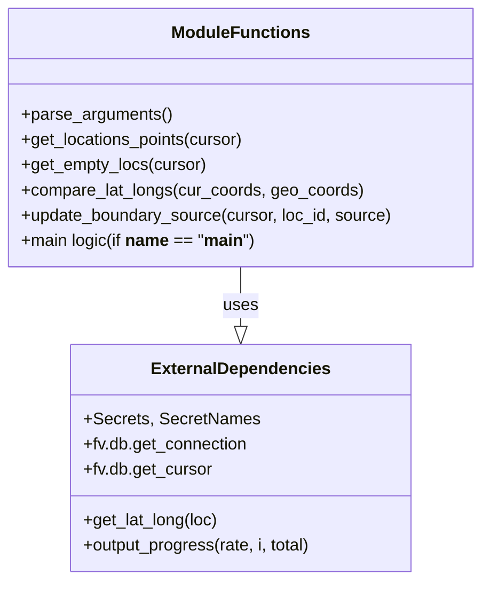

# Diagram: common/location_service/scripts/fix_boundary_source.py


> Auto-generated by Obscura crawlers

## Diagram 1

```mermaid
flowchart TD
    Start([start]) --> ParseArgs[/"parse_arguments()"/]
    ParseArgs --> GetSecrets[/"SECRETS.get_secret(DB)"/]
    GetSecrets --> DBConnect["fv.db.get_connection(config)"]
    DBConnect --> Cursor["fv.db.get_cursor(conn)"]
    Cursor --> DetermineType{args.type}
    DetermineType -->|all| GetPoints["get_locations_points(cursor)"]
    DetermineType -->|all| GetEmpty["get_empty_locs(cursor)"]
    DetermineType -->|empty| GetEmptyOnly["get_empty_locs(cursor)"]
    DetermineType -->|here| GetPointsOnly["get_locations_points(cursor)"]
    GetPoints --> CombineLocations["locations = points + empty"]
    GetEmpty --> CombineLocations
    GetEmptyOnly --> CombineLocationsOnly["locations = empty"]
    GetPointsOnly --> CombineLocationsOnly
    CombineLocations --> InitLoop[/"for i, loc in enumerate(locations)"/]
    CombineLocationsOnly --> InitLoop
    InitLoop --> ToDict["loc = loc._asdict()"]
    ToDict --> HasBoundText{ "bound_text in loc?" }
    HasBoundText -->|yes| NoBound["source = No_Bound"]
    HasBoundText -->|no| CallHERE["lat,lng = get_lat_long(loc)"] --> HereSource["source = HERE"]
    NoBound --> DecideUpdate
    HereSource --> DecideUpdate
    DecideUpdate{ "source == No_Bound OR compare_lat_longs(...)?" }
    DecideUpdate -->|true| UpdateDB["update_boundary_source(cursor, loc['id'], source)"]
    DecideUpdate -->|false| SkipUpdate([skip])
    UpdateDB --> Commit["cursor.execute('COMMIT')"]
    Commit --> ProgressCheck{"i % 5 == 0 and i != 0?"}
    ProgressCheck -->|yes| OutputProgress["output_progress(rate, i, len(locations))"]
    ProgressCheck -->|no| ContinueLoop([continue])
    ContinueLoop --> NextIter([next iteration])
    OutputProgress --> NextIter
    SkipUpdate --> NextIter
    NextIter --> InitLoop
    InitLoop --> End([end])
```

> SVG rendering failed for this diagram.

## Diagram 2



### SVG

<svg id="container" width="457.96875" xmlns="http://www.w3.org/2000/svg" class="classDiagram" height="552" viewBox="0 0 457.96875 552" role="graphics-document document" aria-roledescription="class"><style>#container{font-family:"trebuchet ms",verdana,arial,sans-serif;font-size:16px;fill:#333;}@keyframes edge-animation-frame{from{stroke-dashoffset:0;}}@keyframes dash{to{stroke-dashoffset:0;}}#container .edge-animation-slow{stroke-dasharray:9,5!important;stroke-dashoffset:900;animation:dash 50s linear infinite;stroke-linecap:round;}#container .edge-animation-fast{stroke-dasharray:9,5!important;stroke-dashoffset:900;animation:dash 20s linear infinite;stroke-linecap:round;}#container .error-icon{fill:#552222;}#container .error-text{fill:#552222;stroke:#552222;}#container .edge-thickness-normal{stroke-width:1px;}#container .edge-thickness-thick{stroke-width:3.5px;}#container .edge-pattern-solid{stroke-dasharray:0;}#container .edge-thickness-invisible{stroke-width:0;fill:none;}#container .edge-pattern-dashed{stroke-dasharray:3;}#container .edge-pattern-dotted{stroke-dasharray:2;}#container .marker{fill:#333333;stroke:#333333;}#container .marker.cross{stroke:#333333;}#container svg{font-family:"trebuchet ms",verdana,arial,sans-serif;font-size:16px;}#container p{margin:0;}#container g.classGroup text{fill:#9370DB;stroke:none;font-family:"trebuchet ms",verdana,arial,sans-serif;font-size:10px;}#container g.classGroup text .title{font-weight:bolder;}#container .nodeLabel,#container .edgeLabel{color:#131300;}#container .edgeLabel .label rect{fill:#ECECFF;}#container .label text{fill:#131300;}#container .labelBkg{background:#ECECFF;}#container .edgeLabel .label span{background:#ECECFF;}#container .classTitle{font-weight:bolder;}#container .node rect,#container .node circle,#container .node ellipse,#container .node polygon,#container .node path{fill:#ECECFF;stroke:#9370DB;stroke-width:1px;}#container .divider{stroke:#9370DB;stroke-width:1;}#container g.clickable{cursor:pointer;}#container g.classGroup rect{fill:#ECECFF;stroke:#9370DB;}#container g.classGroup line{stroke:#9370DB;stroke-width:1;}#container .classLabel .box{stroke:none;stroke-width:0;fill:#ECECFF;opacity:0.5;}#container .classLabel .label{fill:#9370DB;font-size:10px;}#container .relation{stroke:#333333;stroke-width:1;fill:none;}#container .dashed-line{stroke-dasharray:3;}#container .dotted-line{stroke-dasharray:1 2;}#container #compositionStart,#container .composition{fill:#333333!important;stroke:#333333!important;stroke-width:1;}#container #compositionEnd,#container .composition{fill:#333333!important;stroke:#333333!important;stroke-width:1;}#container #dependencyStart,#container .dependency{fill:#333333!important;stroke:#333333!important;stroke-width:1;}#container #dependencyStart,#container .dependency{fill:#333333!important;stroke:#333333!important;stroke-width:1;}#container #extensionStart,#container .extension{fill:transparent!important;stroke:#333333!important;stroke-width:1;}#container #extensionEnd,#container .extension{fill:transparent!important;stroke:#333333!important;stroke-width:1;}#container #aggregationStart,#container .aggregation{fill:transparent!important;stroke:#333333!important;stroke-width:1;}#container #aggregationEnd,#container .aggregation{fill:transparent!important;stroke:#333333!important;stroke-width:1;}#container #lollipopStart,#container .lollipop{fill:#ECECFF!important;stroke:#333333!important;stroke-width:1;}#container #lollipopEnd,#container .lollipop{fill:#ECECFF!important;stroke:#333333!important;stroke-width:1;}#container .edgeTerminals{font-size:11px;line-height:initial;}#container .classTitleText{text-anchor:middle;font-size:18px;fill:#333;}#container .label-icon{display:inline-block;height:1em;overflow:visible;vertical-align:-0.125em;}#container .node .label-icon path{fill:currentColor;stroke:revert;stroke-width:revert;}#container :root{--mermaid-font-family:"trebuchet ms",verdana,arial,sans-serif;}</style><g><defs><marker id="container_class-aggregationStart" class="marker aggregation class" refX="18" refY="7" markerWidth="190" markerHeight="240" orient="auto"><path d="M 18,7 L9,13 L1,7 L9,1 Z"></path></marker></defs><defs><marker id="container_class-aggregationEnd" class="marker aggregation class" refX="1" refY="7" markerWidth="20" markerHeight="28" orient="auto"><path d="M 18,7 L9,13 L1,7 L9,1 Z"></path></marker></defs><defs><marker id="container_class-extensionStart" class="marker extension class" refX="18" refY="7" markerWidth="190" markerHeight="240" orient="auto"><path d="M 1,7 L18,13 V 1 Z"></path></marker></defs><defs><marker id="container_class-extensionEnd" class="marker extension class" refX="1" refY="7" markerWidth="20" markerHeight="28" orient="auto"><path d="M 1,1 V 13 L18,7 Z"></path></marker></defs><defs><marker id="container_class-compositionStart" class="marker composition class" refX="18" refY="7" markerWidth="190" markerHeight="240" orient="auto"><path d="M 18,7 L9,13 L1,7 L9,1 Z"></path></marker></defs><defs><marker id="container_class-compositionEnd" class="marker composition class" refX="1" refY="7" markerWidth="20" markerHeight="28" orient="auto"><path d="M 18,7 L9,13 L1,7 L9,1 Z"></path></marker></defs><defs><marker id="container_class-dependencyStart" class="marker dependency class" refX="6" refY="7" markerWidth="190" markerHeight="240" orient="auto"><path d="M 5,7 L9,13 L1,7 L9,1 Z"></path></marker></defs><defs><marker id="container_class-dependencyEnd" class="marker dependency class" refX="13" refY="7" markerWidth="20" markerHeight="28" orient="auto"><path d="M 18,7 L9,13 L14,7 L9,1 Z"></path></marker></defs><defs><marker id="container_class-lollipopStart" class="marker lollipop class" refX="13" refY="7" markerWidth="190" markerHeight="240" orient="auto"><circle stroke="black" fill="transparent" cx="7" cy="7" r="6"></circle></marker></defs><defs><marker id="container_class-lollipopEnd" class="marker lollipop class" refX="1" refY="7" markerWidth="190" markerHeight="240" orient="auto"><circle stroke="black" fill="transparent" cx="7" cy="7" r="6"></circle></marker></defs><g class="root"><g class="clusters"></g><g class="edgePaths"><path d="M228.984,254L228.984,260.167C228.984,266.333,228.984,278.667,228.984,288.125C228.984,297.583,228.984,304.167,228.984,307.458L228.984,310.75" id="id_ModuleFunctions_ExternalDependencies_1" class="edge-thickness-normal edge-pattern-solid relation" style=";;;" data-edge="true" data-et="edge" data-id="id_ModuleFunctions_ExternalDependencies_1" data-points="W3sieCI6MjI4Ljk4NDM3NSwieSI6MjU0fSx7IngiOjIyOC45ODQzNzUsInkiOjI5MX0seyJ4IjoyMjguOTg0Mzc1LCJ5IjozMjh9XQ==" marker-end="url(#container_class-extensionEnd)"></path></g><g class="edgeLabels"><g class="edgeLabel" transform="translate(228.984375, 291)"><g class="label" data-id="id_ModuleFunctions_ExternalDependencies_1" transform="translate(-16.4921875, -12)"><foreignObject width="32.984375" height="24"><div xmlns="http://www.w3.org/1999/xhtml" class="labelBkg" style="display: table-cell; white-space: nowrap; line-height: 1.5; max-width: 200px; text-align: center;"><span class="edgeLabel"><p>uses</p></span></div></foreignObject></g></g></g><g class="nodes"><g class="node default" id="classId-ModuleFunctions-0" transform="translate(228.984375, 131)"><g class="basic label-container"><path d="M-220.984375 -123 L220.984375 -123 L220.984375 123 L-220.984375 123" stroke="none" stroke-width="0" fill="#ECECFF" style=""></path><path d="M-220.984375 -123 C-48.35807411980076 -123, 124.26822676039848 -123, 220.984375 -123 M-220.984375 -123 C-107.99986127179757 -123, 4.984652456404859 -123, 220.984375 -123 M220.984375 -123 C220.984375 -48.67688075712579, 220.984375 25.646238485748427, 220.984375 123 M220.984375 -123 C220.984375 -56.48122412458427, 220.984375 10.037551750831454, 220.984375 123 M220.984375 123 C49.23292239100431 123, -122.51853021799138 123, -220.984375 123 M220.984375 123 C65.73372488258781 123, -89.51692523482438 123, -220.984375 123 M-220.984375 123 C-220.984375 60.240084412238595, -220.984375 -2.5198311755228104, -220.984375 -123 M-220.984375 123 C-220.984375 72.64815339675492, -220.984375 22.296306793509842, -220.984375 -123" stroke="#9370DB" stroke-width="1.3" fill="none" stroke-dasharray="0 0" style=""></path></g><g class="annotation-group text" transform="translate(0, -99)"></g><g class="label-group text" transform="translate(-62.21875, -99)"><g class="label" style="font-weight: bolder" transform="translate(0,-12)"><foreignObject width="124.4375" height="24"><div xmlns="http://www.w3.org/1999/xhtml" style="display: table-cell; white-space: nowrap; line-height: 1.5; max-width: 174px; text-align: center;"><span class="nodeLabel markdown-node-label" style=""><p>ModuleFunctions</p></span></div></foreignObject></g></g><g class="members-group text" transform="translate(-208.984375, -51)"></g><g class="methods-group text" transform="translate(-208.984375, -21)"><g class="label" style="" transform="translate(0,-12)"><foreignObject width="143.390625" height="24"><div xmlns="http://www.w3.org/1999/xhtml" style="display: table-cell; white-space: nowrap; line-height: 1.5; max-width: 201px; text-align: center;"><span class="nodeLabel markdown-node-label" style=""><p>+parse_arguments()</p></span></div></foreignObject></g><g class="label" style="" transform="translate(0,12)"><foreignObject width="215.421875" height="24"><div xmlns="http://www.w3.org/1999/xhtml" style="display: table-cell; white-space: nowrap; line-height: 1.5; max-width: 273px; text-align: center;"><span class="nodeLabel markdown-node-label" style=""><p>+get_locations_points(cursor)</p></span></div></foreignObject></g><g class="label" style="" transform="translate(0,36)"><foreignObject width="176.90625" height="24"><div xmlns="http://www.w3.org/1999/xhtml" style="display: table-cell; white-space: nowrap; line-height: 1.5; max-width: 234px; text-align: center;"><span class="nodeLabel markdown-node-label" style=""><p>+get_empty_locs(cursor)</p></span></div></foreignObject></g><g class="label" style="" transform="translate(0,60)"><foreignObject width="324.390625" height="24"><div xmlns="http://www.w3.org/1999/xhtml" style="display: table-cell; white-space: nowrap; line-height: 1.5; max-width: 382px; text-align: center;"><span class="nodeLabel markdown-node-label" style=""><p>+compare_lat_longs(cur_coords, geo_coords)</p></span></div></foreignObject></g><g class="label" style="" transform="translate(0,84)"><foreignObject width="355.75" height="24"><div xmlns="http://www.w3.org/1999/xhtml" style="display: table-cell; white-space: nowrap; line-height: 1.5; max-width: 413px; text-align: center;"><span class="nodeLabel markdown-node-label" style=""><p>+update_boundary_source(cursor, loc_id, source)</p></span></div></foreignObject></g><g class="label" style="" transform="translate(0,108)"><foreignObject width="221.125" height="24"><div xmlns="http://www.w3.org/1999/xhtml" style="display: table-cell; white-space: nowrap; line-height: 1.5; max-width: 341px; text-align: center;"><span class="nodeLabel markdown-node-label" style=""><p>+main logic(if <strong>name</strong> == "<strong>main</strong>")</p></span></div></foreignObject></g></g><g class="divider" style=""><path d="M-220.984375 -75 C-65.35271865073892 -75, 90.27893769852216 -75, 220.984375 -75 M-220.984375 -75 C-47.818024017001534 -75, 125.34832696599693 -75, 220.984375 -75" stroke="#9370DB" stroke-width="1.3" fill="none" stroke-dasharray="0 0" style=""></path></g><g class="divider" style=""><path d="M-220.984375 -51 C-69.73096647528644 -51, 81.52244204942713 -51, 220.984375 -51 M-220.984375 -51 C-92.70779088364594 -51, 35.56879323270812 -51, 220.984375 -51" stroke="#9370DB" stroke-width="1.3" fill="none" stroke-dasharray="0 0" style=""></path></g></g><g class="node default" id="classId-ExternalDependencies-1" transform="translate(228.984375, 436)"><g class="basic label-container"><path d="M-163.21484375 -108 L163.21484375 -108 L163.21484375 108 L-163.21484375 108" stroke="none" stroke-width="0" fill="#ECECFF" style=""></path><path d="M-163.21484375 -108 C-83.65307444865797 -108, -4.09130514731595 -108, 163.21484375 -108 M-163.21484375 -108 C-69.27727123192165 -108, 24.66030128615671 -108, 163.21484375 -108 M163.21484375 -108 C163.21484375 -28.98915834360966, 163.21484375 50.02168331278068, 163.21484375 108 M163.21484375 -108 C163.21484375 -29.212492505057327, 163.21484375 49.57501498988535, 163.21484375 108 M163.21484375 108 C57.647224896951315 108, -47.92039395609737 108, -163.21484375 108 M163.21484375 108 C79.95720801874813 108, -3.3004277125037333 108, -163.21484375 108 M-163.21484375 108 C-163.21484375 49.652644813948406, -163.21484375 -8.694710372103188, -163.21484375 -108 M-163.21484375 108 C-163.21484375 33.322297132159775, -163.21484375 -41.35540573568045, -163.21484375 -108" stroke="#9370DB" stroke-width="1.3" fill="none" stroke-dasharray="0 0" style=""></path></g><g class="annotation-group text" transform="translate(0, -84)"></g><g class="label-group text" transform="translate(-81.8046875, -84)"><g class="label" style="font-weight: bolder" transform="translate(0,-12)"><foreignObject width="163.609375" height="24"><div xmlns="http://www.w3.org/1999/xhtml" style="display: table-cell; white-space: nowrap; line-height: 1.5; max-width: 212px; text-align: center;"><span class="nodeLabel markdown-node-label" style=""><p>ExternalDependencies</p></span></div></foreignObject></g></g><g class="members-group text" transform="translate(-151.21484375, -36)"><g class="label" style="" transform="translate(0,-12)"><foreignObject width="163" height="24"><div xmlns="http://www.w3.org/1999/xhtml" style="display: table-cell; white-space: nowrap; line-height: 1.5; max-width: 220px; text-align: center;"><span class="nodeLabel markdown-node-label" style=""><p>+Secrets, SecretNames</p></span></div></foreignObject></g><g class="label" style="" transform="translate(0,12)"><foreignObject width="157.96875" height="24"><div xmlns="http://www.w3.org/1999/xhtml" style="display: table-cell; white-space: nowrap; line-height: 1.5; max-width: 215px; text-align: center;"><span class="nodeLabel markdown-node-label" style=""><p>+fv.db.get_connection</p></span></div></foreignObject></g><g class="label" style="" transform="translate(0,36)"><foreignObject width="122.90625" height="24"><div xmlns="http://www.w3.org/1999/xhtml" style="display: table-cell; white-space: nowrap; line-height: 1.5; max-width: 181px; text-align: center;"><span class="nodeLabel markdown-node-label" style=""><p>+fv.db.get_cursor</p></span></div></foreignObject></g></g><g class="methods-group text" transform="translate(-151.21484375, 60)"><g class="label" style="" transform="translate(0,-12)"><foreignObject width="129.578125" height="24"><div xmlns="http://www.w3.org/1999/xhtml" style="display: table-cell; white-space: nowrap; line-height: 1.5; max-width: 187px; text-align: center;"><span class="nodeLabel markdown-node-label" style=""><p>+get_lat_long(loc)</p></span></div></foreignObject></g><g class="label" style="" transform="translate(0,12)"><foreignObject width="220.625" height="24"><div xmlns="http://www.w3.org/1999/xhtml" style="display: table-cell; white-space: nowrap; line-height: 1.5; max-width: 278px; text-align: center;"><span class="nodeLabel markdown-node-label" style=""><p>+output_progress(rate, i, total)</p></span></div></foreignObject></g></g><g class="divider" style=""><path d="M-163.21484375 -60 C-57.08436070936317 -60, 49.046122331273665 -60, 163.21484375 -60 M-163.21484375 -60 C-83.75076259612254 -60, -4.286681442245083 -60, 163.21484375 -60" stroke="#9370DB" stroke-width="1.3" fill="none" stroke-dasharray="0 0" style=""></path></g><g class="divider" style=""><path d="M-163.21484375 36 C-44.96573335049635 36, 73.2833770490073 36, 163.21484375 36 M-163.21484375 36 C-49.78001383096243 36, 63.65481608807514 36, 163.21484375 36" stroke="#9370DB" stroke-width="1.3" fill="none" stroke-dasharray="0 0" style=""></path></g></g></g></g></g></svg>
