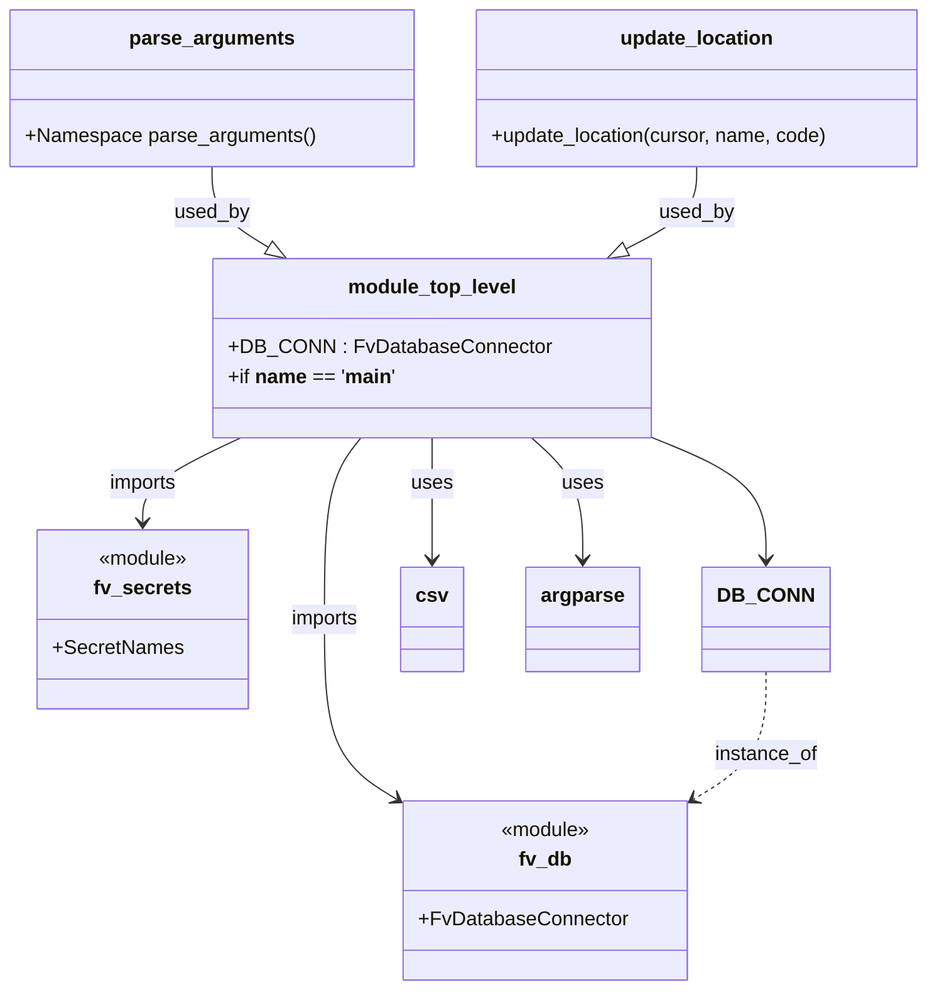

# Diagram: common/location_service/scripts/ford_location_scripts/update_location_name_from_code_ISS-10797.py


> Auto-generated by Obscura crawlers

## Diagram 1

```mermaid
flowchart TD
    Start([Start]) --> ParseArgs[/"parse_arguments()"/]
    ParseArgs --> ArgsObj["args.file_name"]
    ArgsObj --> OpenFile["open(args.file_name, encoding='utf-8-sig')"]
    OpenFile --> CSVReader["csv.DictReader(file)"]
    CSVReader --> ForEach{for i, row in enumerate(...)}
    ForEach --> PrintIndex["print(i)"]
    ForEach --> UpdateCall["update_location(DB_CONN.cursor, row['Trade Name'], row['SalesCode'])"]
    UpdateCall --> Mogrify["cursor.mogrify(UPDATE query with %(name)s and %(code)s)"]
    Mogrify --> CursorExecute["cursor.execute(query)"]
    CursorExecute --> ForEach
    ForEach --> End([End])
    subgraph DB
      DB_CONN["DB_CONN: FvDatabaseConnector"]
      SecretNames["SecretNames"]
    end
    UpdateCall --- DB_CONN
    DB_CONN --- SecretNames
```

> SVG rendering failed for this diagram.

## Diagram 2



### SVG

<svg id="container" width="740.9140625" xmlns="http://www.w3.org/2000/svg" class="classDiagram" height="796" viewBox="0 0 740.9140625 796" role="graphics-document document" aria-roledescription="class"><style>#container{font-family:"trebuchet ms",verdana,arial,sans-serif;font-size:16px;fill:#333;}@keyframes edge-animation-frame{from{stroke-dashoffset:0;}}@keyframes dash{to{stroke-dashoffset:0;}}#container .edge-animation-slow{stroke-dasharray:9,5!important;stroke-dashoffset:900;animation:dash 50s linear infinite;stroke-linecap:round;}#container .edge-animation-fast{stroke-dasharray:9,5!important;stroke-dashoffset:900;animation:dash 20s linear infinite;stroke-linecap:round;}#container .error-icon{fill:#552222;}#container .error-text{fill:#552222;stroke:#552222;}#container .edge-thickness-normal{stroke-width:1px;}#container .edge-thickness-thick{stroke-width:3.5px;}#container .edge-pattern-solid{stroke-dasharray:0;}#container .edge-thickness-invisible{stroke-width:0;fill:none;}#container .edge-pattern-dashed{stroke-dasharray:3;}#container .edge-pattern-dotted{stroke-dasharray:2;}#container .marker{fill:#333333;stroke:#333333;}#container .marker.cross{stroke:#333333;}#container svg{font-family:"trebuchet ms",verdana,arial,sans-serif;font-size:16px;}#container p{margin:0;}#container g.classGroup text{fill:#9370DB;stroke:none;font-family:"trebuchet ms",verdana,arial,sans-serif;font-size:10px;}#container g.classGroup text .title{font-weight:bolder;}#container .nodeLabel,#container .edgeLabel{color:#131300;}#container .edgeLabel .label rect{fill:#ECECFF;}#container .label text{fill:#131300;}#container .labelBkg{background:#ECECFF;}#container .edgeLabel .label span{background:#ECECFF;}#container .classTitle{font-weight:bolder;}#container .node rect,#container .node circle,#container .node ellipse,#container .node polygon,#container .node path{fill:#ECECFF;stroke:#9370DB;stroke-width:1px;}#container .divider{stroke:#9370DB;stroke-width:1;}#container g.clickable{cursor:pointer;}#container g.classGroup rect{fill:#ECECFF;stroke:#9370DB;}#container g.classGroup line{stroke:#9370DB;stroke-width:1;}#container .classLabel .box{stroke:none;stroke-width:0;fill:#ECECFF;opacity:0.5;}#container .classLabel .label{fill:#9370DB;font-size:10px;}#container .relation{stroke:#333333;stroke-width:1;fill:none;}#container .dashed-line{stroke-dasharray:3;}#container .dotted-line{stroke-dasharray:1 2;}#container #compositionStart,#container .composition{fill:#333333!important;stroke:#333333!important;stroke-width:1;}#container #compositionEnd,#container .composition{fill:#333333!important;stroke:#333333!important;stroke-width:1;}#container #dependencyStart,#container .dependency{fill:#333333!important;stroke:#333333!important;stroke-width:1;}#container #dependencyStart,#container .dependency{fill:#333333!important;stroke:#333333!important;stroke-width:1;}#container #extensionStart,#container .extension{fill:transparent!important;stroke:#333333!important;stroke-width:1;}#container #extensionEnd,#container .extension{fill:transparent!important;stroke:#333333!important;stroke-width:1;}#container #aggregationStart,#container .aggregation{fill:transparent!important;stroke:#333333!important;stroke-width:1;}#container #aggregationEnd,#container .aggregation{fill:transparent!important;stroke:#333333!important;stroke-width:1;}#container #lollipopStart,#container .lollipop{fill:#ECECFF!important;stroke:#333333!important;stroke-width:1;}#container #lollipopEnd,#container .lollipop{fill:#ECECFF!important;stroke:#333333!important;stroke-width:1;}#container .edgeTerminals{font-size:11px;line-height:initial;}#container .classTitleText{text-anchor:middle;font-size:18px;fill:#333;}#container .label-icon{display:inline-block;height:1em;overflow:visible;vertical-align:-0.125em;}#container .node .label-icon path{fill:currentColor;stroke:revert;stroke-width:revert;}#container :root{--mermaid-font-family:"trebuchet ms",verdana,arial,sans-serif;}</style><g><defs><marker id="container_class-aggregationStart" class="marker aggregation class" refX="18" refY="7" markerWidth="190" markerHeight="240" orient="auto"><path d="M 18,7 L9,13 L1,7 L9,1 Z"></path></marker></defs><defs><marker id="container_class-aggregationEnd" class="marker aggregation class" refX="1" refY="7" markerWidth="20" markerHeight="28" orient="auto"><path d="M 18,7 L9,13 L1,7 L9,1 Z"></path></marker></defs><defs><marker id="container_class-extensionStart" class="marker extension class" refX="18" refY="7" markerWidth="190" markerHeight="240" orient="auto"><path d="M 1,7 L18,13 V 1 Z"></path></marker></defs><defs><marker id="container_class-extensionEnd" class="marker extension class" refX="1" refY="7" markerWidth="20" markerHeight="28" orient="auto"><path d="M 1,1 V 13 L18,7 Z"></path></marker></defs><defs><marker id="container_class-compositionStart" class="marker composition class" refX="18" refY="7" markerWidth="190" markerHeight="240" orient="auto"><path d="M 18,7 L9,13 L1,7 L9,1 Z"></path></marker></defs><defs><marker id="container_class-compositionEnd" class="marker composition class" refX="1" refY="7" markerWidth="20" markerHeight="28" orient="auto"><path d="M 18,7 L9,13 L1,7 L9,1 Z"></path></marker></defs><defs><marker id="container_class-dependencyStart" class="marker dependency class" refX="6" refY="7" markerWidth="190" markerHeight="240" orient="auto"><path d="M 5,7 L9,13 L1,7 L9,1 Z"></path></marker></defs><defs><marker id="container_class-dependencyEnd" class="marker dependency class" refX="13" refY="7" markerWidth="20" markerHeight="28" orient="auto"><path d="M 18,7 L9,13 L14,7 L9,1 Z"></path></marker></defs><defs><marker id="container_class-lollipopStart" class="marker lollipop class" refX="13" refY="7" markerWidth="190" markerHeight="240" orient="auto"><circle stroke="black" fill="transparent" cx="7" cy="7" r="6"></circle></marker></defs><defs><marker id="container_class-lollipopEnd" class="marker lollipop class" refX="1" refY="7" markerWidth="190" markerHeight="240" orient="auto"><circle stroke="black" fill="transparent" cx="7" cy="7" r="6"></circle></marker></defs><g class="root"><g class="clusters"></g><g class="edgePaths"><path d="M167.355,134L167.355,140.167C167.355,146.333,167.355,158.667,175.094,169.512C182.832,180.358,198.309,189.716,206.047,194.395L213.785,199.074" id="id_parse_arguments_module_top_level_1" class="edge-thickness-normal edge-pattern-solid relation" style=";;;" data-edge="true" data-et="edge" data-id="id_parse_arguments_module_top_level_1" data-points="W3sieCI6MTY3LjM1NTQ2ODc1LCJ5IjoxMzR9LHsieCI6MTY3LjM1NTQ2ODc1LCJ5IjoxNzF9LHsieCI6MjI4LjU0NjU1MjQ2NTU5NjMzLCJ5IjoyMDh9XQ==" marker-end="url(#container_class-extensionEnd)"></path><path d="M554.813,134L554.813,140.167C554.813,146.333,554.813,158.667,545.635,169.661C536.458,180.656,518.103,190.312,508.925,195.141L499.748,199.969" id="id_update_location_module_top_level_2" class="edge-thickness-normal edge-pattern-solid relation" style=";;;" data-edge="true" data-et="edge" data-id="id_update_location_module_top_level_2" data-points="W3sieCI6NTU0LjgxMjUsInkiOjEzNH0seyJ4Ijo1NTQuODEyNSwieSI6MTcxfSx7IngiOjQ4NC40ODE0NzIxOTAzNjY5NiwieSI6MjA4fV0=" marker-end="url(#container_class-extensionEnd)"></path><path d="M290.22,352L285.304,358.167C280.388,364.333,270.555,376.667,265.639,401C260.723,425.333,260.723,461.667,260.723,498C260.723,534.333,260.723,570.667,269.919,594.632C279.116,618.598,297.508,630.196,306.705,635.995L315.901,641.794" id="id_module_top_level_fv_db_3" class="edge-thickness-normal edge-pattern-solid relation" style=";;;" data-edge="true" data-et="edge" data-id="id_module_top_level_fv_db_3" data-points="W3sieCI6MjkwLjIyMDI5MDk5NzcwNjQsInkiOjM1Mn0seyJ4IjoyNjAuNzIyNjU2MjUsInkiOjM4OX0seyJ4IjoyNjAuNzIyNjU2MjUsInkiOjQ5OH0seyJ4IjoyNjAuNzIyNjU2MjUsInkiOjYwN30seyJ4IjozMjAuOTc2NTYyNSwieSI6NjQ0Ljk5NDMyNzkzOTk4MDJ9XQ==" marker-end="url(#container_class-dependencyEnd)"></path><path d="M194.443,352L181.324,358.167C168.204,364.333,141.965,376.667,128.846,388C115.727,399.333,115.727,409.667,115.727,414.833L115.727,420" id="id_module_top_level_fv_secrets_4" class="edge-thickness-normal edge-pattern-solid relation" style=";;;" data-edge="true" data-et="edge" data-id="id_module_top_level_fv_secrets_4" data-points="W3sieCI6MTk0LjQ0MzA1NDc1OTE3NDMyLCJ5IjozNTJ9LHsieCI6MTE1LjcyNjU2MjUsInkiOjM4OX0seyJ4IjoxMTUuNzI2NTYyNSwieSI6NDI2fV0=" marker-end="url(#container_class-dependencyEnd)"></path><path d="M515.184,350.568L530.393,356.973C545.603,363.378,576.022,376.189,591.232,392.761C606.441,409.333,606.441,429.667,606.441,439.833L606.441,450" id="id_module_top_level_DB_CONN_5" class="edge-thickness-normal edge-pattern-solid relation" style=";;;" data-edge="true" data-et="edge" data-id="id_module_top_level_DB_CONN_5" data-points="W3sieCI6NTE1LjE4MzU5Mzc1LCJ5IjozNTAuNTY3NTM5MDE0MTU2NzV9LHsieCI6NjA2LjQ0MTQwNjI1LCJ5IjozODl9LHsieCI6NjA2LjQ0MTQwNjI1LCJ5Ijo0NTZ9XQ==" marker-end="url(#container_class-dependencyEnd)"></path><path d="M606.441,540L606.441,551.167C606.441,562.333,606.441,584.667,597.245,601.632C588.049,618.598,569.656,630.196,560.459,635.995L551.263,641.794" id="id_DB_CONN_fv_db_6" class="edge-thickness-normal edge-pattern-dashed relation" style=";;;" data-edge="true" data-et="edge" data-id="id_DB_CONN_fv_db_6" data-points="W3sieCI6NjA2LjQ0MTQwNjI1LCJ5Ijo1NDB9LHsieCI6NjA2LjQ0MTQwNjI1LCJ5Ijo2MDd9LHsieCI6NTQ2LjE4NzUsInkiOjY0NC45OTQzMjc5Mzk5ODAyfV0=" marker-end="url(#container_class-dependencyEnd)"></path><path d="M347.621,352L347.621,358.167C347.621,364.333,347.621,376.667,347.621,393C347.621,409.333,347.621,429.667,347.621,439.833L347.621,450" id="id_module_top_level_csv_7" class="edge-thickness-normal edge-pattern-solid relation" style=";;;" data-edge="true" data-et="edge" data-id="id_module_top_level_csv_7" data-points="W3sieCI6MzQ3LjYyMTA5Mzc1LCJ5IjozNTJ9LHsieCI6MzQ3LjYyMTA5Mzc1LCJ5IjozODl9LHsieCI6MzQ3LjYyMTA5Mzc1LCJ5Ijo0NTZ9XQ==" marker-end="url(#container_class-dependencyEnd)"></path><path d="M425.587,352L432.264,358.167C438.942,364.333,452.297,376.667,458.975,393C465.652,409.333,465.652,429.667,465.652,439.833L465.652,450" id="id_module_top_level_argparse_8" class="edge-thickness-normal edge-pattern-solid relation" style=";;;" data-edge="true" data-et="edge" data-id="id_module_top_level_argparse_8" data-points="W3sieCI6NDI1LjU4NjY5MDA4MDI3NTIsInkiOjM1Mn0seyJ4Ijo0NjUuNjUyMzQzNzUsInkiOjM4OX0seyJ4Ijo0NjUuNjUyMzQzNzUsInkiOjQ1Nn1d" marker-end="url(#container_class-dependencyEnd)"></path></g><g class="edgeLabels"><g class="edgeLabel" transform="translate(167.35546875, 171)"><g class="label" data-id="id_parse_arguments_module_top_level_1" transform="translate(-30.359375, -12)"><foreignObject width="60.71875" height="24"><div xmlns="http://www.w3.org/1999/xhtml" class="labelBkg" style="display: table-cell; white-space: nowrap; line-height: 1.5; max-width: 200px; text-align: center;"><span class="edgeLabel"><p>used_by</p></span></div></foreignObject></g></g><g class="edgeLabel" transform="translate(554.8125, 171)"><g class="label" data-id="id_update_location_module_top_level_2" transform="translate(-30.359375, -12)"><foreignObject width="60.71875" height="24"><div xmlns="http://www.w3.org/1999/xhtml" class="labelBkg" style="display: table-cell; white-space: nowrap; line-height: 1.5; max-width: 200px; text-align: center;"><span class="edgeLabel"><p>used_by</p></span></div></foreignObject></g></g><g class="edgeLabel" transform="translate(260.72265625, 498)"><g class="label" data-id="id_module_top_level_fv_db_3" transform="translate(-28.25, -12)"><foreignObject width="56.5" height="24"><div xmlns="http://www.w3.org/1999/xhtml" class="labelBkg" style="display: table-cell; white-space: nowrap; line-height: 1.5; max-width: 200px; text-align: center;"><span class="edgeLabel"><p>imports</p></span></div></foreignObject></g></g><g class="edgeLabel" transform="translate(115.7265625, 389)"><g class="label" data-id="id_module_top_level_fv_secrets_4" transform="translate(-28.25, -12)"><foreignObject width="56.5" height="24"><div xmlns="http://www.w3.org/1999/xhtml" class="labelBkg" style="display: table-cell; white-space: nowrap; line-height: 1.5; max-width: 200px; text-align: center;"><span class="edgeLabel"><p>imports</p></span></div></foreignObject></g></g><g class="edgeLabel"><g class="label" data-id="id_module_top_level_DB_CONN_5" transform="translate(0, 0)"><foreignObject width="0" height="0"><div xmlns="http://www.w3.org/1999/xhtml" class="labelBkg" style="display: table-cell; white-space: nowrap; line-height: 1.5; max-width: 200px; text-align: center;"><span class="edgeLabel"></span></div></foreignObject></g></g><g class="edgeLabel" transform="translate(606.44140625, 607)"><g class="label" data-id="id_DB_CONN_fv_db_6" transform="translate(-41.7734375, -12)"><foreignObject width="83.546875" height="24"><div xmlns="http://www.w3.org/1999/xhtml" class="labelBkg" style="display: table-cell; white-space: nowrap; line-height: 1.5; max-width: 200px; text-align: center;"><span class="edgeLabel"><p>instance_of</p></span></div></foreignObject></g></g><g class="edgeLabel" transform="translate(347.62109375, 389)"><g class="label" data-id="id_module_top_level_csv_7" transform="translate(-16.4921875, -12)"><foreignObject width="32.984375" height="24"><div xmlns="http://www.w3.org/1999/xhtml" class="labelBkg" style="display: table-cell; white-space: nowrap; line-height: 1.5; max-width: 200px; text-align: center;"><span class="edgeLabel"><p>uses</p></span></div></foreignObject></g></g><g class="edgeLabel" transform="translate(465.65234375, 389)"><g class="label" data-id="id_module_top_level_argparse_8" transform="translate(-16.4921875, -12)"><foreignObject width="32.984375" height="24"><div xmlns="http://www.w3.org/1999/xhtml" class="labelBkg" style="display: table-cell; white-space: nowrap; line-height: 1.5; max-width: 200px; text-align: center;"><span class="edgeLabel"><p>uses</p></span></div></foreignObject></g></g></g><g class="nodes"><g class="node default" id="classId-parse_arguments-0" transform="translate(167.35546875, 71)"><g class="basic label-container"><path d="M-159.35546875 -63 L159.35546875 -63 L159.35546875 63 L-159.35546875 63" stroke="none" stroke-width="0" fill="#ECECFF" style=""></path><path d="M-159.35546875 -63 C-50.68256253943808 -63, 57.99034367112384 -63, 159.35546875 -63 M-159.35546875 -63 C-62.74987678444063 -63, 33.85571518111874 -63, 159.35546875 -63 M159.35546875 -63 C159.35546875 -26.925851200106074, 159.35546875 9.148297599787853, 159.35546875 63 M159.35546875 -63 C159.35546875 -21.321301264897805, 159.35546875 20.35739747020439, 159.35546875 63 M159.35546875 63 C35.692867304915126 63, -87.96973414016975 63, -159.35546875 63 M159.35546875 63 C79.46273933140469 63, -0.4299900871906175 63, -159.35546875 63 M-159.35546875 63 C-159.35546875 21.708114516146367, -159.35546875 -19.583770967707267, -159.35546875 -63 M-159.35546875 63 C-159.35546875 23.84988985288569, -159.35546875 -15.300220294228623, -159.35546875 -63" stroke="#9370DB" stroke-width="1.3" fill="none" stroke-dasharray="0 0" style=""></path></g><g class="annotation-group text" transform="translate(0, -39)"></g><g class="label-group text" transform="translate(-63.4609375, -39)"><g class="label" style="font-weight: bolder" transform="translate(0,-12)"><foreignObject width="126.921875" height="24"><div xmlns="http://www.w3.org/1999/xhtml" style="display: table-cell; white-space: nowrap; line-height: 1.5; max-width: 175px; text-align: center;"><span class="nodeLabel markdown-node-label" style=""><p>parse_arguments</p></span></div></foreignObject></g></g><g class="members-group text" transform="translate(-147.35546875, 9)"></g><g class="methods-group text" transform="translate(-147.35546875, 39)"><g class="label" style="" transform="translate(0,-12)"><foreignObject width="231.25" height="24"><div xmlns="http://www.w3.org/1999/xhtml" style="display: table-cell; white-space: nowrap; line-height: 1.5; max-width: 289px; text-align: center;"><span class="nodeLabel markdown-node-label" style=""><p>+Namespace parse_arguments()</p></span></div></foreignObject></g></g><g class="divider" style=""><path d="M-159.35546875 -15 C-72.8693493966358 -15, 13.616769956728405 -15, 159.35546875 -15 M-159.35546875 -15 C-79.00141132235534 -15, 1.352646105289324 -15, 159.35546875 -15" stroke="#9370DB" stroke-width="1.3" fill="none" stroke-dasharray="0 0" style=""></path></g><g class="divider" style=""><path d="M-159.35546875 9 C-80.18490007390764 9, -1.0143313978152833 9, 159.35546875 9 M-159.35546875 9 C-47.02929373064103 9, 65.29688128871794 9, 159.35546875 9" stroke="#9370DB" stroke-width="1.3" fill="none" stroke-dasharray="0 0" style=""></path></g></g><g class="node default" id="classId-update_location-1" transform="translate(554.8125, 71)"><g class="basic label-container"><path d="M-178.1015625 -63 L178.1015625 -63 L178.1015625 63 L-178.1015625 63" stroke="none" stroke-width="0" fill="#ECECFF" style=""></path><path d="M-178.1015625 -63 C-36.01603171107527 -63, 106.06949907784946 -63, 178.1015625 -63 M-178.1015625 -63 C-43.65277834871969 -63, 90.79600580256061 -63, 178.1015625 -63 M178.1015625 -63 C178.1015625 -30.394697131217434, 178.1015625 2.210605737565132, 178.1015625 63 M178.1015625 -63 C178.1015625 -16.639898836018595, 178.1015625 29.72020232796281, 178.1015625 63 M178.1015625 63 C50.16169527580908 63, -77.77817194838184 63, -178.1015625 63 M178.1015625 63 C52.662407806693054 63, -72.77674688661389 63, -178.1015625 63 M-178.1015625 63 C-178.1015625 29.631047187233747, -178.1015625 -3.7379056255325054, -178.1015625 -63 M-178.1015625 63 C-178.1015625 35.61846065318993, -178.1015625 8.236921306379863, -178.1015625 -63" stroke="#9370DB" stroke-width="1.3" fill="none" stroke-dasharray="0 0" style=""></path></g><g class="annotation-group text" transform="translate(0, -39)"></g><g class="label-group text" transform="translate(-59.59375, -39)"><g class="label" style="font-weight: bolder" transform="translate(0,-12)"><foreignObject width="119.1875" height="24"><div xmlns="http://www.w3.org/1999/xhtml" style="display: table-cell; white-space: nowrap; line-height: 1.5; max-width: 168px; text-align: center;"><span class="nodeLabel markdown-node-label" style=""><p>update_location</p></span></div></foreignObject></g></g><g class="members-group text" transform="translate(-166.1015625, 9)"></g><g class="methods-group text" transform="translate(-166.1015625, 39)"><g class="label" style="" transform="translate(0,-12)"><foreignObject width="272.609375" height="24"><div xmlns="http://www.w3.org/1999/xhtml" style="display: table-cell; white-space: nowrap; line-height: 1.5; max-width: 330px; text-align: center;"><span class="nodeLabel markdown-node-label" style=""><p>+update_location(cursor, name, code)</p></span></div></foreignObject></g></g><g class="divider" style=""><path d="M-178.1015625 -15 C-71.17911325183776 -15, 35.743335996324475 -15, 178.1015625 -15 M-178.1015625 -15 C-81.74047206225447 -15, 14.620618375491063 -15, 178.1015625 -15" stroke="#9370DB" stroke-width="1.3" fill="none" stroke-dasharray="0 0" style=""></path></g><g class="divider" style=""><path d="M-178.1015625 9 C-77.03671865938807 9, 24.028125181223857 9, 178.1015625 9 M-178.1015625 9 C-92.03225383193225 9, -5.962945163864504 9, 178.1015625 9" stroke="#9370DB" stroke-width="1.3" fill="none" stroke-dasharray="0 0" style=""></path></g></g><g class="node default" id="classId-module_top_level-2" transform="translate(347.62109375, 280)"><g class="basic label-container"><path d="M-167.5625 -72 L167.5625 -72 L167.5625 72 L-167.5625 72" stroke="none" stroke-width="0" fill="#ECECFF" style=""></path><path d="M-167.5625 -72 C-82.43507552027022 -72, 2.692348959459565 -72, 167.5625 -72 M-167.5625 -72 C-47.84960146733245 -72, 71.8632970653351 -72, 167.5625 -72 M167.5625 -72 C167.5625 -22.92205248353507, 167.5625 26.155895032929863, 167.5625 72 M167.5625 -72 C167.5625 -37.35271152368655, 167.5625 -2.7054230473731025, 167.5625 72 M167.5625 72 C94.78279733121818 72, 22.003094662436354 72, -167.5625 72 M167.5625 72 C82.80625703226632 72, -1.9499859354673674 72, -167.5625 72 M-167.5625 72 C-167.5625 24.657150046375435, -167.5625 -22.68569990724913, -167.5625 -72 M-167.5625 72 C-167.5625 21.138240029176302, -167.5625 -29.723519941647396, -167.5625 -72" stroke="#9370DB" stroke-width="1.3" fill="none" stroke-dasharray="0 0" style=""></path></g><g class="annotation-group text" transform="translate(0, -48)"></g><g class="label-group text" transform="translate(-65.234375, -48)"><g class="label" style="font-weight: bolder" transform="translate(0,-12)"><foreignObject width="130.46875" height="24"><div xmlns="http://www.w3.org/1999/xhtml" style="display: table-cell; white-space: nowrap; line-height: 1.5; max-width: 180px; text-align: center;"><span class="nodeLabel markdown-node-label" style=""><p>module_top_level</p></span></div></foreignObject></g></g><g class="members-group text" transform="translate(-155.5625, 0)"><g class="label" style="" transform="translate(0,-12)"><foreignObject width="245.890625" height="24"><div xmlns="http://www.w3.org/1999/xhtml" style="display: table-cell; white-space: nowrap; line-height: 1.5; max-width: 304px; text-align: center;"><span class="nodeLabel markdown-node-label" style=""><p>+DB_CONN : FvDatabaseConnector</p></span></div></foreignObject></g><g class="label" style="" transform="translate(0,12)"><foreignObject width="130.015625" height="24"><div xmlns="http://www.w3.org/1999/xhtml" style="display: table-cell; white-space: nowrap; line-height: 1.5; max-width: 250px; text-align: center;"><span class="nodeLabel markdown-node-label" style=""><p>+if <strong>name</strong> == '<strong>main</strong>'</p></span></div></foreignObject></g></g><g class="methods-group text" transform="translate(-155.5625, 72)"></g><g class="divider" style=""><path d="M-167.5625 -24 C-86.75357280050561 -24, -5.944645601011217 -24, 167.5625 -24 M-167.5625 -24 C-73.29101420671239 -24, 20.98047158657522 -24, 167.5625 -24" stroke="#9370DB" stroke-width="1.3" fill="none" stroke-dasharray="0 0" style=""></path></g><g class="divider" style=""><path d="M-167.5625 48 C-48.97981618868083 48, 69.60286762263834 48, 167.5625 48 M-167.5625 48 C-81.86508916841724 48, 3.8323216631655157 48, 167.5625 48" stroke="#9370DB" stroke-width="1.3" fill="none" stroke-dasharray="0 0" style=""></path></g></g><g class="node default" id="classId-fv_db-3" transform="translate(433.58203125, 716)"><g class="basic label-container"><path d="M-112.60546875 -72 L112.60546875 -72 L112.60546875 72 L-112.60546875 72" stroke="none" stroke-width="0" fill="#ECECFF" style=""></path><path d="M-112.60546875 -72 C-43.868201310415316 -72, 24.86906612916937 -72, 112.60546875 -72 M-112.60546875 -72 C-60.89591351401593 -72, -9.186358278031861 -72, 112.60546875 -72 M112.60546875 -72 C112.60546875 -17.36265514947157, 112.60546875 37.27468970105686, 112.60546875 72 M112.60546875 -72 C112.60546875 -21.690611548626435, 112.60546875 28.61877690274713, 112.60546875 72 M112.60546875 72 C59.84458940493028 72, 7.0837100598605645 72, -112.60546875 72 M112.60546875 72 C30.622137532304976 72, -51.36119368539005 72, -112.60546875 72 M-112.60546875 72 C-112.60546875 27.164747341674726, -112.60546875 -17.670505316650548, -112.60546875 -72 M-112.60546875 72 C-112.60546875 39.45343138731783, -112.60546875 6.9068627746356555, -112.60546875 -72" stroke="#9370DB" stroke-width="1.3" fill="none" stroke-dasharray="0 0" style=""></path></g><g class="annotation-group text" transform="translate(-36.6015625, -48)"><g class="label" style="" transform="translate(0,-12)"><foreignObject width="73.203125" height="24"><div xmlns="http://www.w3.org/1999/xhtml" style="display: table-cell; white-space: nowrap; line-height: 1.5; max-width: 123px; text-align: center;"><span class="nodeLabel markdown-node-label" style=""><p>«module»</p></span></div></foreignObject></g></g><g class="label-group text" transform="translate(-20.2890625, -24)"><g class="label" style="font-weight: bolder" transform="translate(0,-12)"><foreignObject width="40.578125" height="24"><div xmlns="http://www.w3.org/1999/xhtml" style="display: table-cell; white-space: nowrap; line-height: 1.5; max-width: 90px; text-align: center;"><span class="nodeLabel markdown-node-label" style=""><p>fv_db</p></span></div></foreignObject></g></g><g class="members-group text" transform="translate(-100.60546875, 24)"><g class="label" style="" transform="translate(0,-12)"><foreignObject width="164.609375" height="24"><div xmlns="http://www.w3.org/1999/xhtml" style="display: table-cell; white-space: nowrap; line-height: 1.5; max-width: 223px; text-align: center;"><span class="nodeLabel markdown-node-label" style=""><p>+FvDatabaseConnector</p></span></div></foreignObject></g></g><g class="methods-group text" transform="translate(-100.60546875, 72)"></g><g class="divider" style=""><path d="M-112.60546875 0 C-66.71088081395251 0, -20.816292877905013 0, 112.60546875 0 M-112.60546875 0 C-25.475793485040995 0, 61.65388177991801 0, 112.60546875 0" stroke="#9370DB" stroke-width="1.3" fill="none" stroke-dasharray="0 0" style=""></path></g><g class="divider" style=""><path d="M-112.60546875 48 C-47.22370481052863 48, 18.15805912894274 48, 112.60546875 48 M-112.60546875 48 C-59.28057124826892 48, -5.95567374653784 48, 112.60546875 48" stroke="#9370DB" stroke-width="1.3" fill="none" stroke-dasharray="0 0" style=""></path></g></g><g class="node default" id="classId-fv_secrets-4" transform="translate(115.7265625, 498)"><g class="basic label-container"><path d="M-81.74609375 -72 L81.74609375 -72 L81.74609375 72 L-81.74609375 72" stroke="none" stroke-width="0" fill="#ECECFF" style=""></path><path d="M-81.74609375 -72 C-42.7666689501967 -72, -3.7872441503934056 -72, 81.74609375 -72 M-81.74609375 -72 C-27.668489041042363 -72, 26.409115667915273 -72, 81.74609375 -72 M81.74609375 -72 C81.74609375 -28.1400786655974, 81.74609375 15.7198426688052, 81.74609375 72 M81.74609375 -72 C81.74609375 -27.59952511907089, 81.74609375 16.80094976185822, 81.74609375 72 M81.74609375 72 C35.54588326587406 72, -10.65432721825188 72, -81.74609375 72 M81.74609375 72 C32.14451843240892 72, -17.457056885182155 72, -81.74609375 72 M-81.74609375 72 C-81.74609375 25.96809952381617, -81.74609375 -20.063800952367657, -81.74609375 -72 M-81.74609375 72 C-81.74609375 24.350631767963137, -81.74609375 -23.298736464073727, -81.74609375 -72" stroke="#9370DB" stroke-width="1.3" fill="none" stroke-dasharray="0 0" style=""></path></g><g class="annotation-group text" transform="translate(-36.6015625, -48)"><g class="label" style="" transform="translate(0,-12)"><foreignObject width="73.203125" height="24"><div xmlns="http://www.w3.org/1999/xhtml" style="display: table-cell; white-space: nowrap; line-height: 1.5; max-width: 123px; text-align: center;"><span class="nodeLabel markdown-node-label" style=""><p>«module»</p></span></div></foreignObject></g></g><g class="label-group text" transform="translate(-37.3203125, -24)"><g class="label" style="font-weight: bolder" transform="translate(0,-12)"><foreignObject width="74.640625" height="24"><div xmlns="http://www.w3.org/1999/xhtml" style="display: table-cell; white-space: nowrap; line-height: 1.5; max-width: 123px; text-align: center;"><span class="nodeLabel markdown-node-label" style=""><p>fv_secrets</p></span></div></foreignObject></g></g><g class="members-group text" transform="translate(-69.74609375, 24)"><g class="label" style="" transform="translate(0,-12)"><foreignObject width="102.171875" height="24"><div xmlns="http://www.w3.org/1999/xhtml" style="display: table-cell; white-space: nowrap; line-height: 1.5; max-width: 160px; text-align: center;"><span class="nodeLabel markdown-node-label" style=""><p>+SecretNames</p></span></div></foreignObject></g></g><g class="methods-group text" transform="translate(-69.74609375, 72)"></g><g class="divider" style=""><path d="M-81.74609375 0 C-19.501156527797335 0, 42.74378069440533 0, 81.74609375 0 M-81.74609375 0 C-43.08488884077934 0, -4.423683931558685 0, 81.74609375 0" stroke="#9370DB" stroke-width="1.3" fill="none" stroke-dasharray="0 0" style=""></path></g><g class="divider" style=""><path d="M-81.74609375 48 C-18.852966068038917 48, 44.040161613922166 48, 81.74609375 48 M-81.74609375 48 C-20.61973227875545 48, 40.5066291924891 48, 81.74609375 48" stroke="#9370DB" stroke-width="1.3" fill="none" stroke-dasharray="0 0" style=""></path></g></g><g class="node default" id="classId-DB_CONN-5" transform="translate(606.44140625, 498)"><g class="basic label-container"><path d="M-46.40625 -42 L46.40625 -42 L46.40625 42 L-46.40625 42" stroke="none" stroke-width="0" fill="#ECECFF" style=""></path><path d="M-46.40625 -42 C-25.661156706410853 -42, -4.916063412821707 -42, 46.40625 -42 M-46.40625 -42 C-27.246457358603042 -42, -8.086664717206084 -42, 46.40625 -42 M46.40625 -42 C46.40625 -11.017181706269461, 46.40625 19.965636587461077, 46.40625 42 M46.40625 -42 C46.40625 -20.79604897441587, 46.40625 0.4079020511682572, 46.40625 42 M46.40625 42 C13.983798325115025 42, -18.43865334976995 42, -46.40625 42 M46.40625 42 C15.600312517233132 42, -15.205624965533737 42, -46.40625 42 M-46.40625 42 C-46.40625 11.161244828441813, -46.40625 -19.677510343116374, -46.40625 -42 M-46.40625 42 C-46.40625 11.061524296586256, -46.40625 -19.876951406827487, -46.40625 -42" stroke="#9370DB" stroke-width="1.3" fill="none" stroke-dasharray="0 0" style=""></path></g><g class="annotation-group text" transform="translate(0, -18)"></g><g class="label-group text" transform="translate(-34.40625, -18)"><g class="label" style="font-weight: bolder" transform="translate(0,-12)"><foreignObject width="68.8125" height="24"><div xmlns="http://www.w3.org/1999/xhtml" style="display: table-cell; white-space: nowrap; line-height: 1.5; max-width: 119px; text-align: center;"><span class="nodeLabel markdown-node-label" style=""><p>DB_CONN</p></span></div></foreignObject></g></g><g class="members-group text" transform="translate(-34.40625, 30)"></g><g class="methods-group text" transform="translate(-34.40625, 60)"></g><g class="divider" style=""><path d="M-46.40625 6 C-13.646819534886383 6, 19.112610930227234 6, 46.40625 6 M-46.40625 6 C-20.55602269618597 6, 5.29420460762806 6, 46.40625 6" stroke="#9370DB" stroke-width="1.3" fill="none" stroke-dasharray="0 0" style=""></path></g><g class="divider" style=""><path d="M-46.40625 24 C-12.92632119190727 24, 20.55360761618546 24, 46.40625 24 M-46.40625 24 C-12.091228358375318 24, 22.223793283249364 24, 46.40625 24" stroke="#9370DB" stroke-width="1.3" fill="none" stroke-dasharray="0 0" style=""></path></g></g><g class="node default" id="classId-csv-6" transform="translate(347.62109375, 498)"><g class="basic label-container"><path d="M-23.6484375 -42 L23.6484375 -42 L23.6484375 42 L-23.6484375 42" stroke="none" stroke-width="0" fill="#ECECFF" style=""></path><path d="M-23.6484375 -42 C-11.937072245044892 -42, -0.22570699008978323 -42, 23.6484375 -42 M-23.6484375 -42 C-13.479751922882405 -42, -3.311066345764811 -42, 23.6484375 -42 M23.6484375 -42 C23.6484375 -17.921695053971696, 23.6484375 6.156609892056608, 23.6484375 42 M23.6484375 -42 C23.6484375 -17.822034250138504, 23.6484375 6.355931499722992, 23.6484375 42 M23.6484375 42 C11.159162482074498 42, -1.3301125358510042 42, -23.6484375 42 M23.6484375 42 C7.2979755283505305 42, -9.052486443298939 42, -23.6484375 42 M-23.6484375 42 C-23.6484375 20.608575080071358, -23.6484375 -0.7828498398572847, -23.6484375 -42 M-23.6484375 42 C-23.6484375 21.95789029069364, -23.6484375 1.9157805813872812, -23.6484375 -42" stroke="#9370DB" stroke-width="1.3" fill="none" stroke-dasharray="0 0" style=""></path></g><g class="annotation-group text" transform="translate(0, -18)"></g><g class="label-group text" transform="translate(-11.6484375, -18)"><g class="label" style="font-weight: bolder" transform="translate(0,-12)"><foreignObject width="23.296875" height="24"><div xmlns="http://www.w3.org/1999/xhtml" style="display: table-cell; white-space: nowrap; line-height: 1.5; max-width: 73px; text-align: center;"><span class="nodeLabel markdown-node-label" style=""><p>csv</p></span></div></foreignObject></g></g><g class="members-group text" transform="translate(-11.6484375, 30)"></g><g class="methods-group text" transform="translate(-11.6484375, 60)"></g><g class="divider" style=""><path d="M-23.6484375 6 C-12.986722122117767 6, -2.3250067442355338 6, 23.6484375 6 M-23.6484375 6 C-6.4241178098666545 6, 10.800201880266691 6, 23.6484375 6" stroke="#9370DB" stroke-width="1.3" fill="none" stroke-dasharray="0 0" style=""></path></g><g class="divider" style=""><path d="M-23.6484375 24 C-9.764512135192602 24, 4.119413229614796 24, 23.6484375 24 M-23.6484375 24 C-10.423050441175057 24, 2.8023366176498854 24, 23.6484375 24" stroke="#9370DB" stroke-width="1.3" fill="none" stroke-dasharray="0 0" style=""></path></g></g><g class="node default" id="classId-argparse-7" transform="translate(465.65234375, 498)"><g class="basic label-container"><path d="M-44.3828125 -42 L44.3828125 -42 L44.3828125 42 L-44.3828125 42" stroke="none" stroke-width="0" fill="#ECECFF" style=""></path><path d="M-44.3828125 -42 C-21.31845170483053 -42, 1.745909090338941 -42, 44.3828125 -42 M-44.3828125 -42 C-22.059829691437958 -42, 0.26315311712408374 -42, 44.3828125 -42 M44.3828125 -42 C44.3828125 -8.852220266003236, 44.3828125 24.295559467993527, 44.3828125 42 M44.3828125 -42 C44.3828125 -15.447979524866955, 44.3828125 11.10404095026609, 44.3828125 42 M44.3828125 42 C15.240553784838134 42, -13.901704930323731 42, -44.3828125 42 M44.3828125 42 C14.181518941007461 42, -16.019774617985078 42, -44.3828125 42 M-44.3828125 42 C-44.3828125 18.992050125654053, -44.3828125 -4.0158997486918935, -44.3828125 -42 M-44.3828125 42 C-44.3828125 12.16405085431445, -44.3828125 -17.6718982913711, -44.3828125 -42" stroke="#9370DB" stroke-width="1.3" fill="none" stroke-dasharray="0 0" style=""></path></g><g class="annotation-group text" transform="translate(0, -18)"></g><g class="label-group text" transform="translate(-32.3828125, -18)"><g class="label" style="font-weight: bolder" transform="translate(0,-12)"><foreignObject width="64.765625" height="24"><div xmlns="http://www.w3.org/1999/xhtml" style="display: table-cell; white-space: nowrap; line-height: 1.5; max-width: 113px; text-align: center;"><span class="nodeLabel markdown-node-label" style=""><p>argparse</p></span></div></foreignObject></g></g><g class="members-group text" transform="translate(-32.3828125, 30)"></g><g class="methods-group text" transform="translate(-32.3828125, 60)"></g><g class="divider" style=""><path d="M-44.3828125 6 C-12.080000740714702 6, 20.222811018570596 6, 44.3828125 6 M-44.3828125 6 C-20.333339907396752 6, 3.716132685206496 6, 44.3828125 6" stroke="#9370DB" stroke-width="1.3" fill="none" stroke-dasharray="0 0" style=""></path></g><g class="divider" style=""><path d="M-44.3828125 24 C-24.74924203673269 24, -5.115671573465377 24, 44.3828125 24 M-44.3828125 24 C-24.158001701688153 24, -3.933190903376307 24, 44.3828125 24" stroke="#9370DB" stroke-width="1.3" fill="none" stroke-dasharray="0 0" style=""></path></g></g></g></g></g></svg>
