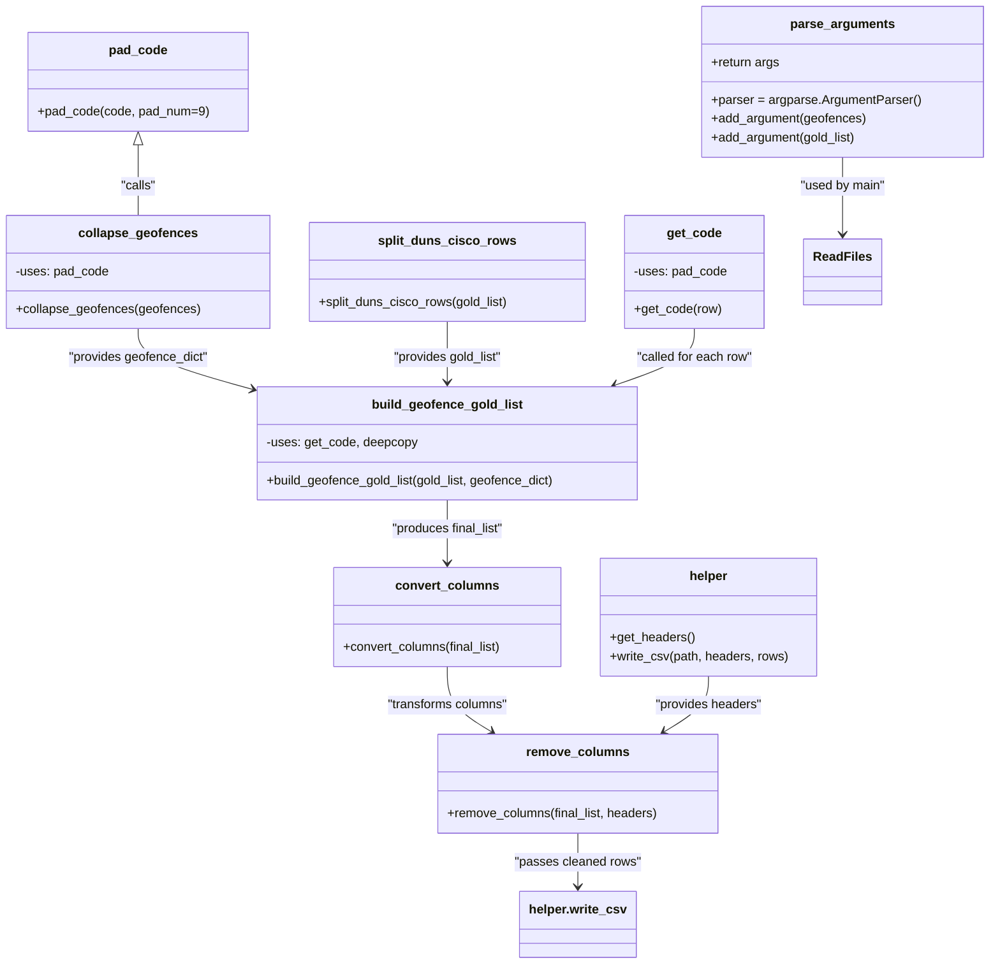

# Diagram: common/location_service/scripts/gm_location_scripts/add_geo_to_gold.py


> Auto-generated by Obscura crawlers

## Diagram 1

```mermaid
flowchart TD
    Start[Start: main] --> Parse[parse_arguments()]
    Parse --> ReadFiles[Read CSV files]
    ReadFiles --> Split[split_duns_cisco_rows()]
    ReadFiles --> Collapse[collapse_geofences()]
    Collapse --> GeofenceDict[geofence_dict]
    Split --> Build[build_geofence_gold_list()]
    GeofenceDict --> Build
    Build --> Convert[convert_columns()]
    Convert --> Remove[remove_columns()]
    Remove --> Write[helper.write_csv("GM Gold with Geofences.csv")]
    Write --> End[End]
```

> SVG rendering failed for this diagram.

## Diagram 2



### SVG

<svg id="container" width="1240.34765625" xmlns="http://www.w3.org/2000/svg" class="classDiagram" height="1226" viewBox="0 0 1240.34765625 1226" role="graphics-document document" aria-roledescription="class"><style>#container{font-family:"trebuchet ms",verdana,arial,sans-serif;font-size:16px;fill:#333;}@keyframes edge-animation-frame{from{stroke-dashoffset:0;}}@keyframes dash{to{stroke-dashoffset:0;}}#container .edge-animation-slow{stroke-dasharray:9,5!important;stroke-dashoffset:900;animation:dash 50s linear infinite;stroke-linecap:round;}#container .edge-animation-fast{stroke-dasharray:9,5!important;stroke-dashoffset:900;animation:dash 20s linear infinite;stroke-linecap:round;}#container .error-icon{fill:#552222;}#container .error-text{fill:#552222;stroke:#552222;}#container .edge-thickness-normal{stroke-width:1px;}#container .edge-thickness-thick{stroke-width:3.5px;}#container .edge-pattern-solid{stroke-dasharray:0;}#container .edge-thickness-invisible{stroke-width:0;fill:none;}#container .edge-pattern-dashed{stroke-dasharray:3;}#container .edge-pattern-dotted{stroke-dasharray:2;}#container .marker{fill:#333333;stroke:#333333;}#container .marker.cross{stroke:#333333;}#container svg{font-family:"trebuchet ms",verdana,arial,sans-serif;font-size:16px;}#container p{margin:0;}#container g.classGroup text{fill:#9370DB;stroke:none;font-family:"trebuchet ms",verdana,arial,sans-serif;font-size:10px;}#container g.classGroup text .title{font-weight:bolder;}#container .nodeLabel,#container .edgeLabel{color:#131300;}#container .edgeLabel .label rect{fill:#ECECFF;}#container .label text{fill:#131300;}#container .labelBkg{background:#ECECFF;}#container .edgeLabel .label span{background:#ECECFF;}#container .classTitle{font-weight:bolder;}#container .node rect,#container .node circle,#container .node ellipse,#container .node polygon,#container .node path{fill:#ECECFF;stroke:#9370DB;stroke-width:1px;}#container .divider{stroke:#9370DB;stroke-width:1;}#container g.clickable{cursor:pointer;}#container g.classGroup rect{fill:#ECECFF;stroke:#9370DB;}#container g.classGroup line{stroke:#9370DB;stroke-width:1;}#container .classLabel .box{stroke:none;stroke-width:0;fill:#ECECFF;opacity:0.5;}#container .classLabel .label{fill:#9370DB;font-size:10px;}#container .relation{stroke:#333333;stroke-width:1;fill:none;}#container .dashed-line{stroke-dasharray:3;}#container .dotted-line{stroke-dasharray:1 2;}#container #compositionStart,#container .composition{fill:#333333!important;stroke:#333333!important;stroke-width:1;}#container #compositionEnd,#container .composition{fill:#333333!important;stroke:#333333!important;stroke-width:1;}#container #dependencyStart,#container .dependency{fill:#333333!important;stroke:#333333!important;stroke-width:1;}#container #dependencyStart,#container .dependency{fill:#333333!important;stroke:#333333!important;stroke-width:1;}#container #extensionStart,#container .extension{fill:transparent!important;stroke:#333333!important;stroke-width:1;}#container #extensionEnd,#container .extension{fill:transparent!important;stroke:#333333!important;stroke-width:1;}#container #aggregationStart,#container .aggregation{fill:transparent!important;stroke:#333333!important;stroke-width:1;}#container #aggregationEnd,#container .aggregation{fill:transparent!important;stroke:#333333!important;stroke-width:1;}#container #lollipopStart,#container .lollipop{fill:#ECECFF!important;stroke:#333333!important;stroke-width:1;}#container #lollipopEnd,#container .lollipop{fill:#ECECFF!important;stroke:#333333!important;stroke-width:1;}#container .edgeTerminals{font-size:11px;line-height:initial;}#container .classTitleText{text-anchor:middle;font-size:18px;fill:#333;}#container .label-icon{display:inline-block;height:1em;overflow:visible;vertical-align:-0.125em;}#container .node .label-icon path{fill:currentColor;stroke:revert;stroke-width:revert;}#container :root{--mermaid-font-family:"trebuchet ms",verdana,arial,sans-serif;}</style><g><defs><marker id="container_class-aggregationStart" class="marker aggregation class" refX="18" refY="7" markerWidth="190" markerHeight="240" orient="auto"><path d="M 18,7 L9,13 L1,7 L9,1 Z"></path></marker></defs><defs><marker id="container_class-aggregationEnd" class="marker aggregation class" refX="1" refY="7" markerWidth="20" markerHeight="28" orient="auto"><path d="M 18,7 L9,13 L1,7 L9,1 Z"></path></marker></defs><defs><marker id="container_class-extensionStart" class="marker extension class" refX="18" refY="7" markerWidth="190" markerHeight="240" orient="auto"><path d="M 1,7 L18,13 V 1 Z"></path></marker></defs><defs><marker id="container_class-extensionEnd" class="marker extension class" refX="1" refY="7" markerWidth="20" markerHeight="28" orient="auto"><path d="M 1,1 V 13 L18,7 Z"></path></marker></defs><defs><marker id="container_class-compositionStart" class="marker composition class" refX="18" refY="7" markerWidth="190" markerHeight="240" orient="auto"><path d="M 18,7 L9,13 L1,7 L9,1 Z"></path></marker></defs><defs><marker id="container_class-compositionEnd" class="marker composition class" refX="1" refY="7" markerWidth="20" markerHeight="28" orient="auto"><path d="M 18,7 L9,13 L1,7 L9,1 Z"></path></marker></defs><defs><marker id="container_class-dependencyStart" class="marker dependency class" refX="6" refY="7" markerWidth="190" markerHeight="240" orient="auto"><path d="M 5,7 L9,13 L1,7 L9,1 Z"></path></marker></defs><defs><marker id="container_class-dependencyEnd" class="marker dependency class" refX="13" refY="7" markerWidth="20" markerHeight="28" orient="auto"><path d="M 18,7 L9,13 L14,7 L9,1 Z"></path></marker></defs><defs><marker id="container_class-lollipopStart" class="marker lollipop class" refX="13" refY="7" markerWidth="190" markerHeight="240" orient="auto"><circle stroke="black" fill="transparent" cx="7" cy="7" r="6"></circle></marker></defs><defs><marker id="container_class-lollipopEnd" class="marker lollipop class" refX="1" refY="7" markerWidth="190" markerHeight="240" orient="auto"><circle stroke="black" fill="transparent" cx="7" cy="7" r="6"></circle></marker></defs><g class="root"><g class="clusters"></g><g class="edgePaths"><path d="M1056.789,200L1056.789,206.167C1056.789,212.333,1056.789,224.667,1056.789,241C1056.789,257.333,1056.789,277.667,1056.789,287.833L1056.789,298" id="id_parse_arguments_ReadFiles_1" class="edge-thickness-normal edge-pattern-solid relation" style=";;;" data-edge="true" data-et="edge" data-id="id_parse_arguments_ReadFiles_1" data-points="W3sieCI6MTA1Ni43ODkwNjI1LCJ5IjoyMDB9LHsieCI6MTA1Ni43ODkwNjI1LCJ5IjoyMzd9LHsieCI6MTA1Ni43ODkwNjI1LCJ5IjozMDR9XQ==" marker-end="url(#container_class-dependencyEnd)"></path><path d="M172.234,184.25L172.234,193.042C172.234,201.833,172.234,219.417,172.234,234.375C172.234,249.333,172.234,261.667,172.234,267.833L172.234,274" id="id_pad_code_collapse_geofences_2" class="edge-thickness-normal edge-pattern-solid relation" style=";;;" data-edge="true" data-et="edge" data-id="id_pad_code_collapse_geofences_2" data-points="W3sieCI6MTcyLjIzNDM3NSwieSI6MTY3fSx7IngiOjE3Mi4yMzQzNzUsInkiOjIzN30seyJ4IjoxNzIuMjM0Mzc1LCJ5IjoyNzR9XQ==" marker-start="url(#container_class-extensionStart)"></path><path d="M172.234,418L172.234,424.167C172.234,430.333,172.234,442.667,195.382,455.332C218.529,467.997,264.823,480.993,287.971,487.492L311.118,493.99" id="id_collapse_geofences_build_geofence_gold_list_3" class="edge-thickness-normal edge-pattern-solid relation" style=";;;" data-edge="true" data-et="edge" data-id="id_collapse_geofences_build_geofence_gold_list_3" data-points="W3sieCI6MTcyLjIzNDM3NSwieSI6NDE4fSx7IngiOjE3Mi4yMzQzNzUsInkiOjQ1NX0seyJ4IjozMTYuODk0NTMxMjUsInkiOjQ5NS42MTE2NzA2MDcxNzM0fV0=" marker-end="url(#container_class-dependencyEnd)"></path><path d="M560.496,409L560.496,416.667C560.496,424.333,560.496,439.667,560.496,452.5C560.496,465.333,560.496,475.667,560.496,480.833L560.496,486" id="id_split_duns_cisco_rows_build_geofence_gold_list_4" class="edge-thickness-normal edge-pattern-solid relation" style=";;;" data-edge="true" data-et="edge" data-id="id_split_duns_cisco_rows_build_geofence_gold_list_4" data-points="W3sieCI6NTYwLjQ5NjA5Mzc1LCJ5Ijo0MDl9LHsieCI6NTYwLjQ5NjA5Mzc1LCJ5Ijo0NTV9LHsieCI6NTYwLjQ5NjA5Mzc1LCJ5Ijo0OTJ9XQ==" marker-end="url(#container_class-dependencyEnd)"></path><path d="M872.219,418L872.219,424.167C872.219,430.333,872.219,442.667,855.527,454.67C838.835,466.673,805.452,478.346,788.76,484.183L772.068,490.02" id="id_get_code_build_geofence_gold_list_5" class="edge-thickness-normal edge-pattern-solid relation" style=";;;" data-edge="true" data-et="edge" data-id="id_get_code_build_geofence_gold_list_5" data-points="W3sieCI6ODcyLjIxODc1LCJ5Ijo0MTh9LHsieCI6ODcyLjIxODc1LCJ5Ijo0NTV9LHsieCI6NzY2LjQwNDYzNzMyNzk4MTYsInkiOjQ5Mn1d" marker-end="url(#container_class-dependencyEnd)"></path><path d="M560.496,636L560.496,642.167C560.496,648.333,560.496,660.667,560.496,674C560.496,687.333,560.496,701.667,560.496,708.833L560.496,716" id="id_build_geofence_gold_list_convert_columns_6" class="edge-thickness-normal edge-pattern-solid relation" style=";;;" data-edge="true" data-et="edge" data-id="id_build_geofence_gold_list_convert_columns_6" data-points="W3sieCI6NTYwLjQ5NjA5Mzc1LCJ5Ijo2MzZ9LHsieCI6NTYwLjQ5NjA5Mzc1LCJ5Ijo2NzN9LHsieCI6NTYwLjQ5NjA5Mzc1LCJ5Ijo3MjJ9XQ==" marker-end="url(#container_class-dependencyEnd)"></path><path d="M560.496,848L560.496,856.167C560.496,864.333,560.496,880.667,569.896,894.485C579.295,908.303,598.095,919.606,607.494,925.257L616.894,930.908" id="id_convert_columns_remove_columns_7" class="edge-thickness-normal edge-pattern-solid relation" style=";;;" data-edge="true" data-et="edge" data-id="id_convert_columns_remove_columns_7" data-points="W3sieCI6NTYwLjQ5NjA5Mzc1LCJ5Ijo4NDh9LHsieCI6NTYwLjQ5NjA5Mzc1LCJ5Ijo4OTd9LHsieCI6NjIyLjAzNjA1NDY4NzUsInkiOjkzNH1d" marker-end="url(#container_class-dependencyEnd)"></path><path d="M726.82,1060L726.82,1066.167C726.82,1072.333,726.82,1084.667,726.82,1096C726.82,1107.333,726.82,1117.667,726.82,1122.833L726.82,1128" id="id_remove_columns_helper.write_csv_8" class="edge-thickness-normal edge-pattern-solid relation" style=";;;" data-edge="true" data-et="edge" data-id="id_remove_columns_helper.write_csv_8" data-points="W3sieCI6NzI2LjgyMDMxMjUsInkiOjEwNjB9LHsieCI6NzI2LjgyMDMxMjUsInkiOjEwOTd9LHsieCI6NzI2LjgyMDMxMjUsInkiOjExMzR9XQ==" marker-end="url(#container_class-dependencyEnd)"></path><path d="M893.145,860L893.145,866.167C893.145,872.333,893.145,884.667,883.745,896.485C874.345,908.303,855.546,919.606,846.146,925.257L836.747,930.908" id="id_helper_remove_columns_9" class="edge-thickness-normal edge-pattern-solid relation" style=";;;" data-edge="true" data-et="edge" data-id="id_helper_remove_columns_9" data-points="W3sieCI6ODkzLjE0NDUzMTI1LCJ5Ijo4NjB9LHsieCI6ODkzLjE0NDUzMTI1LCJ5Ijo4OTd9LHsieCI6ODMxLjYwNDU3MDMxMjUsInkiOjkzNH1d" marker-end="url(#container_class-dependencyEnd)"></path></g><g class="edgeLabels"><g class="edgeLabel" transform="translate(1056.7890625, 237)"><g class="label" data-id="id_parse_arguments_ReadFiles_1" transform="translate(-54.890625, -12)"><foreignObject width="109.78125" height="24"><div xmlns="http://www.w3.org/1999/xhtml" class="labelBkg" style="display: table-cell; white-space: nowrap; line-height: 1.5; max-width: 200px; text-align: center;"><span class="edgeLabel"><p>"used by main"</p></span></div></foreignObject></g></g><g class="edgeLabel" transform="translate(172.234375, 237)"><g class="label" data-id="id_pad_code_collapse_geofences_2" transform="translate(-22.625, -12)"><foreignObject width="45.25" height="24"><div xmlns="http://www.w3.org/1999/xhtml" class="labelBkg" style="display: table-cell; white-space: nowrap; line-height: 1.5; max-width: 200px; text-align: center;"><span class="edgeLabel"><p>"calls"</p></span></div></foreignObject></g></g><g class="edgeLabel" transform="translate(172.234375, 455)"><g class="label" data-id="id_collapse_geofences_build_geofence_gold_list_3" transform="translate(-90.03125, -12)"><foreignObject width="180.0625" height="24"><div xmlns="http://www.w3.org/1999/xhtml" class="labelBkg" style="display: table-cell; white-space: nowrap; line-height: 1.5; max-width: 200px; text-align: center;"><span class="edgeLabel"><p>"provides geofence_dict"</p></span></div></foreignObject></g></g><g class="edgeLabel" transform="translate(560.49609375, 455)"><g class="label" data-id="id_split_duns_cisco_rows_build_geofence_gold_list_4" transform="translate(-70.796875, -12)"><foreignObject width="141.59375" height="24"><div xmlns="http://www.w3.org/1999/xhtml" class="labelBkg" style="display: table-cell; white-space: nowrap; line-height: 1.5; max-width: 200px; text-align: center;"><span class="edgeLabel"><p>"provides gold_list"</p></span></div></foreignObject></g></g><g class="edgeLabel" transform="translate(872.21875, 455)"><g class="label" data-id="id_get_code_build_geofence_gold_list_5" transform="translate(-75.234375, -12)"><foreignObject width="150.46875" height="24"><div xmlns="http://www.w3.org/1999/xhtml" class="labelBkg" style="display: table-cell; white-space: nowrap; line-height: 1.5; max-width: 200px; text-align: center;"><span class="edgeLabel"><p>"called for each row"</p></span></div></foreignObject></g></g><g class="edgeLabel" transform="translate(560.49609375, 673)"><g class="label" data-id="id_build_geofence_gold_list_convert_columns_6" transform="translate(-73.0703125, -12)"><foreignObject width="146.140625" height="24"><div xmlns="http://www.w3.org/1999/xhtml" class="labelBkg" style="display: table-cell; white-space: nowrap; line-height: 1.5; max-width: 200px; text-align: center;"><span class="edgeLabel"><p>"produces final_list"</p></span></div></foreignObject></g></g><g class="edgeLabel" transform="translate(560.49609375, 897)"><g class="label" data-id="id_convert_columns_remove_columns_7" transform="translate(-78.5078125, -12)"><foreignObject width="157.015625" height="24"><div xmlns="http://www.w3.org/1999/xhtml" class="labelBkg" style="display: table-cell; white-space: nowrap; line-height: 1.5; max-width: 200px; text-align: center;"><span class="edgeLabel"><p>"transforms columns"</p></span></div></foreignObject></g></g><g class="edgeLabel" transform="translate(726.8203125, 1097)"><g class="label" data-id="id_remove_columns_helper.write_csv_8" transform="translate(-80.5234375, -12)"><foreignObject width="161.046875" height="24"><div xmlns="http://www.w3.org/1999/xhtml" class="labelBkg" style="display: table-cell; white-space: nowrap; line-height: 1.5; max-width: 200px; text-align: center;"><span class="edgeLabel"><p>"passes cleaned rows"</p></span></div></foreignObject></g></g><g class="edgeLabel" transform="translate(893.14453125, 897)"><g class="label" data-id="id_helper_remove_columns_9" transform="translate(-68.8671875, -12)"><foreignObject width="137.734375" height="24"><div xmlns="http://www.w3.org/1999/xhtml" class="labelBkg" style="display: table-cell; white-space: nowrap; line-height: 1.5; max-width: 200px; text-align: center;"><span class="edgeLabel"><p>"provides headers"</p></span></div></foreignObject></g></g></g><g class="nodes"><g class="node default" id="classId-parse_arguments-0" transform="translate(1056.7890625, 104)"><g class="basic label-container"><path d="M-175.55859375 -96 L175.55859375 -96 L175.55859375 96 L-175.55859375 96" stroke="none" stroke-width="0" fill="#ECECFF" style=""></path><path d="M-175.55859375 -96 C-67.90040732250503 -96, 39.757779104989936 -96, 175.55859375 -96 M-175.55859375 -96 C-91.0655551497908 -96, -6.572516549581593 -96, 175.55859375 -96 M175.55859375 -96 C175.55859375 -56.46784145451835, 175.55859375 -16.9356829090367, 175.55859375 96 M175.55859375 -96 C175.55859375 -29.820284344573054, 175.55859375 36.35943131085389, 175.55859375 96 M175.55859375 96 C47.979694133493695 96, -79.59920548301261 96, -175.55859375 96 M175.55859375 96 C73.13969151105712 96, -29.279210727885754 96, -175.55859375 96 M-175.55859375 96 C-175.55859375 29.534241418614286, -175.55859375 -36.93151716277143, -175.55859375 -96 M-175.55859375 96 C-175.55859375 39.85570620764621, -175.55859375 -16.288587584707585, -175.55859375 -96" stroke="#9370DB" stroke-width="1.3" fill="none" stroke-dasharray="0 0" style=""></path></g><g class="annotation-group text" transform="translate(0, -72)"></g><g class="label-group text" transform="translate(-63.4609375, -72)"><g class="label" style="font-weight: bolder" transform="translate(0,-12)"><foreignObject width="126.921875" height="24"><div xmlns="http://www.w3.org/1999/xhtml" style="display: table-cell; white-space: nowrap; line-height: 1.5; max-width: 175px; text-align: center;"><span class="nodeLabel markdown-node-label" style=""><p>parse_arguments</p></span></div></foreignObject></g></g><g class="members-group text" transform="translate(-163.55859375, -24)"><g class="label" style="" transform="translate(0,-12)"><foreignObject width="87.609375" height="24"><div xmlns="http://www.w3.org/1999/xhtml" style="display: table-cell; white-space: nowrap; line-height: 1.5; max-width: 145px; text-align: center;"><span class="nodeLabel markdown-node-label" style=""><p>+return args</p></span></div></foreignObject></g></g><g class="methods-group text" transform="translate(-163.55859375, 24)"><g class="label" style="" transform="translate(0,-12)"><foreignObject width="263.65625" height="24"><div xmlns="http://www.w3.org/1999/xhtml" style="display: table-cell; white-space: nowrap; line-height: 1.5; max-width: 321px; text-align: center;"><span class="nodeLabel markdown-node-label" style=""><p>+parser = argparse.ArgumentParser()</p></span></div></foreignObject></g><g class="label" style="" transform="translate(0,12)"><foreignObject width="196.59375" height="24"><div xmlns="http://www.w3.org/1999/xhtml" style="display: table-cell; white-space: nowrap; line-height: 1.5; max-width: 254px; text-align: center;"><span class="nodeLabel markdown-node-label" style=""><p>+add_argument(geofences)</p></span></div></foreignObject></g><g class="label" style="" transform="translate(0,36)"><foreignObject width="185.84375" height="24"><div xmlns="http://www.w3.org/1999/xhtml" style="display: table-cell; white-space: nowrap; line-height: 1.5; max-width: 243px; text-align: center;"><span class="nodeLabel markdown-node-label" style=""><p>+add_argument(gold_list)</p></span></div></foreignObject></g></g><g class="divider" style=""><path d="M-175.55859375 -48 C-64.5362029400347 -48, 46.4861878699306 -48, 175.55859375 -48 M-175.55859375 -48 C-40.9443797924458 -48, 93.6698341651084 -48, 175.55859375 -48" stroke="#9370DB" stroke-width="1.3" fill="none" stroke-dasharray="0 0" style=""></path></g><g class="divider" style=""><path d="M-175.55859375 0 C-86.57195623898431 0, 2.4146812720313733 0, 175.55859375 0 M-175.55859375 0 C-37.35246717952606 0, 100.85365939094788 0, 175.55859375 0" stroke="#9370DB" stroke-width="1.3" fill="none" stroke-dasharray="0 0" style=""></path></g></g><g class="node default" id="classId-pad_code-1" transform="translate(172.234375, 104)"><g class="basic label-container"><path d="M-137.91796875 -63 L137.91796875 -63 L137.91796875 63 L-137.91796875 63" stroke="none" stroke-width="0" fill="#ECECFF" style=""></path><path d="M-137.91796875 -63 C-71.79096727516841 -63, -5.663965800336825 -63, 137.91796875 -63 M-137.91796875 -63 C-33.697171155537504 -63, 70.52362643892499 -63, 137.91796875 -63 M137.91796875 -63 C137.91796875 -21.73577329716165, 137.91796875 19.5284534056767, 137.91796875 63 M137.91796875 -63 C137.91796875 -37.61117210351054, 137.91796875 -12.222344207021074, 137.91796875 63 M137.91796875 63 C44.75115179918376 63, -48.41566515163248 63, -137.91796875 63 M137.91796875 63 C47.91569061690241 63, -42.08658751619518 63, -137.91796875 63 M-137.91796875 63 C-137.91796875 36.22875507041897, -137.91796875 9.457510140837947, -137.91796875 -63 M-137.91796875 63 C-137.91796875 30.944683583381547, -137.91796875 -1.110632833236906, -137.91796875 -63" stroke="#9370DB" stroke-width="1.3" fill="none" stroke-dasharray="0 0" style=""></path></g><g class="annotation-group text" transform="translate(0, -39)"></g><g class="label-group text" transform="translate(-35.4453125, -39)"><g class="label" style="font-weight: bolder" transform="translate(0,-12)"><foreignObject width="70.890625" height="24"><div xmlns="http://www.w3.org/1999/xhtml" style="display: table-cell; white-space: nowrap; line-height: 1.5; max-width: 121px; text-align: center;"><span class="nodeLabel markdown-node-label" style=""><p>pad_code</p></span></div></foreignObject></g></g><g class="members-group text" transform="translate(-125.91796875, 9)"></g><g class="methods-group text" transform="translate(-125.91796875, 39)"><g class="label" style="" transform="translate(0,-12)"><foreignObject width="216.390625" height="24"><div xmlns="http://www.w3.org/1999/xhtml" style="display: table-cell; white-space: nowrap; line-height: 1.5; max-width: 274px; text-align: center;"><span class="nodeLabel markdown-node-label" style=""><p>+pad_code(code, pad_num=9)</p></span></div></foreignObject></g></g><g class="divider" style=""><path d="M-137.91796875 -15 C-35.311479151824756 -15, 67.29501044635049 -15, 137.91796875 -15 M-137.91796875 -15 C-58.53676066262821 -15, 20.844447424743578 -15, 137.91796875 -15" stroke="#9370DB" stroke-width="1.3" fill="none" stroke-dasharray="0 0" style=""></path></g><g class="divider" style=""><path d="M-137.91796875 9 C-49.58634037384718 9, 38.74528800230564 9, 137.91796875 9 M-137.91796875 9 C-48.24953348535793 9, 41.41890177928414 9, 137.91796875 9" stroke="#9370DB" stroke-width="1.3" fill="none" stroke-dasharray="0 0" style=""></path></g></g><g class="node default" id="classId-collapse_geofences-2" transform="translate(172.234375, 346)"><g class="basic label-container"><path d="M-164.234375 -72 L164.234375 -72 L164.234375 72 L-164.234375 72" stroke="none" stroke-width="0" fill="#ECECFF" style=""></path><path d="M-164.234375 -72 C-65.06180445207198 -72, 34.110766095856036 -72, 164.234375 -72 M-164.234375 -72 C-83.70074688536465 -72, -3.167118770729303 -72, 164.234375 -72 M164.234375 -72 C164.234375 -41.214760547689295, 164.234375 -10.429521095378583, 164.234375 72 M164.234375 -72 C164.234375 -37.6866353051036, 164.234375 -3.3732706102072, 164.234375 72 M164.234375 72 C97.09302796497623 72, 29.95168092995246 72, -164.234375 72 M164.234375 72 C49.58140935090775 72, -65.0715562981845 72, -164.234375 72 M-164.234375 72 C-164.234375 21.161407673488526, -164.234375 -29.677184653022948, -164.234375 -72 M-164.234375 72 C-164.234375 14.745766406173828, -164.234375 -42.50846718765234, -164.234375 -72" stroke="#9370DB" stroke-width="1.3" fill="none" stroke-dasharray="0 0" style=""></path></g><g class="annotation-group text" transform="translate(0, -48)"></g><g class="label-group text" transform="translate(-71.703125, -48)"><g class="label" style="font-weight: bolder" transform="translate(0,-12)"><foreignObject width="143.40625" height="24"><div xmlns="http://www.w3.org/1999/xhtml" style="display: table-cell; white-space: nowrap; line-height: 1.5; max-width: 191px; text-align: center;"><span class="nodeLabel markdown-node-label" style=""><p>collapse_geofences</p></span></div></foreignObject></g></g><g class="members-group text" transform="translate(-152.234375, 0)"><g class="label" style="" transform="translate(0,-12)"><foreignObject width="118.09375" height="24"><div xmlns="http://www.w3.org/1999/xhtml" style="display: table-cell; white-space: nowrap; line-height: 1.5; max-width: 175px; text-align: center;"><span class="nodeLabel markdown-node-label" style=""><p>-uses: pad_code</p></span></div></foreignObject></g></g><g class="methods-group text" transform="translate(-152.234375, 48)"><g class="label" style="" transform="translate(0,-12)"><foreignObject width="232.765625" height="24"><div xmlns="http://www.w3.org/1999/xhtml" style="display: table-cell; white-space: nowrap; line-height: 1.5; max-width: 290px; text-align: center;"><span class="nodeLabel markdown-node-label" style=""><p>+collapse_geofences(geofences)</p></span></div></foreignObject></g></g><g class="divider" style=""><path d="M-164.234375 -24 C-77.99165196854015 -24, 8.251071062919692 -24, 164.234375 -24 M-164.234375 -24 C-36.0454835938782 -24, 92.1434078122436 -24, 164.234375 -24" stroke="#9370DB" stroke-width="1.3" fill="none" stroke-dasharray="0 0" style=""></path></g><g class="divider" style=""><path d="M-164.234375 24 C-74.61916834437898 24, 14.996038311242046 24, 164.234375 24 M-164.234375 24 C-33.206718062656506 24, 97.82093887468699 24, 164.234375 24" stroke="#9370DB" stroke-width="1.3" fill="none" stroke-dasharray="0 0" style=""></path></g></g><g class="node default" id="classId-split_duns_cisco_rows-3" transform="translate(560.49609375, 346)"><g class="basic label-container"><path d="M-174.02734375 -63 L174.02734375 -63 L174.02734375 63 L-174.02734375 63" stroke="none" stroke-width="0" fill="#ECECFF" style=""></path><path d="M-174.02734375 -63 C-81.91868316360006 -63, 10.18997742279987 -63, 174.02734375 -63 M-174.02734375 -63 C-93.81375637688454 -63, -13.600169003769082 -63, 174.02734375 -63 M174.02734375 -63 C174.02734375 -23.281590002366784, 174.02734375 16.436819995266433, 174.02734375 63 M174.02734375 -63 C174.02734375 -13.008242403028326, 174.02734375 36.98351519394335, 174.02734375 63 M174.02734375 63 C102.59152392632835 63, 31.1557041026567 63, -174.02734375 63 M174.02734375 63 C43.763602813326315 63, -86.50013812334737 63, -174.02734375 63 M-174.02734375 63 C-174.02734375 14.739427818518386, -174.02734375 -33.52114436296323, -174.02734375 -63 M-174.02734375 63 C-174.02734375 14.600292510349298, -174.02734375 -33.7994149793014, -174.02734375 -63" stroke="#9370DB" stroke-width="1.3" fill="none" stroke-dasharray="0 0" style=""></path></g><g class="annotation-group text" transform="translate(0, -39)"></g><g class="label-group text" transform="translate(-81.8515625, -39)"><g class="label" style="font-weight: bolder" transform="translate(0,-12)"><foreignObject width="163.703125" height="24"><div xmlns="http://www.w3.org/1999/xhtml" style="display: table-cell; white-space: nowrap; line-height: 1.5; max-width: 212px; text-align: center;"><span class="nodeLabel markdown-node-label" style=""><p>split_duns_cisco_rows</p></span></div></foreignObject></g></g><g class="members-group text" transform="translate(-162.02734375, 9)"></g><g class="methods-group text" transform="translate(-162.02734375, 39)"><g class="label" style="" transform="translate(0,-12)"><foreignObject width="242.203125" height="24"><div xmlns="http://www.w3.org/1999/xhtml" style="display: table-cell; white-space: nowrap; line-height: 1.5; max-width: 300px; text-align: center;"><span class="nodeLabel markdown-node-label" style=""><p>+split_duns_cisco_rows(gold_list)</p></span></div></foreignObject></g></g><g class="divider" style=""><path d="M-174.02734375 -15 C-80.73140685684177 -15, 12.564530036316455 -15, 174.02734375 -15 M-174.02734375 -15 C-43.02994699776329 -15, 87.96744975447342 -15, 174.02734375 -15" stroke="#9370DB" stroke-width="1.3" fill="none" stroke-dasharray="0 0" style=""></path></g><g class="divider" style=""><path d="M-174.02734375 9 C-76.69564403034771 9, 20.636055689304584 9, 174.02734375 9 M-174.02734375 9 C-100.51562719894376 9, -27.003910647887523 9, 174.02734375 9" stroke="#9370DB" stroke-width="1.3" fill="none" stroke-dasharray="0 0" style=""></path></g></g><g class="node default" id="classId-get_code-4" transform="translate(872.21875, 346)"><g class="basic label-container"><path d="M-87.6953125 -72 L87.6953125 -72 L87.6953125 72 L-87.6953125 72" stroke="none" stroke-width="0" fill="#ECECFF" style=""></path><path d="M-87.6953125 -72 C-49.33227015638469 -72, -10.969227812769375 -72, 87.6953125 -72 M-87.6953125 -72 C-22.11592092846469 -72, 43.46347064307062 -72, 87.6953125 -72 M87.6953125 -72 C87.6953125 -33.24710032394584, 87.6953125 5.505799352108326, 87.6953125 72 M87.6953125 -72 C87.6953125 -19.811157407876927, 87.6953125 32.37768518424615, 87.6953125 72 M87.6953125 72 C48.77164061698053 72, 9.847968733961054 72, -87.6953125 72 M87.6953125 72 C51.60454231826333 72, 15.513772136526654 72, -87.6953125 72 M-87.6953125 72 C-87.6953125 26.688433662003746, -87.6953125 -18.623132675992508, -87.6953125 -72 M-87.6953125 72 C-87.6953125 22.946352329275385, -87.6953125 -26.10729534144923, -87.6953125 -72" stroke="#9370DB" stroke-width="1.3" fill="none" stroke-dasharray="0 0" style=""></path></g><g class="annotation-group text" transform="translate(0, -48)"></g><g class="label-group text" transform="translate(-33.296875, -48)"><g class="label" style="font-weight: bolder" transform="translate(0,-12)"><foreignObject width="66.59375" height="24"><div xmlns="http://www.w3.org/1999/xhtml" style="display: table-cell; white-space: nowrap; line-height: 1.5; max-width: 116px; text-align: center;"><span class="nodeLabel markdown-node-label" style=""><p>get_code</p></span></div></foreignObject></g></g><g class="members-group text" transform="translate(-75.6953125, 0)"><g class="label" style="" transform="translate(0,-12)"><foreignObject width="118.09375" height="24"><div xmlns="http://www.w3.org/1999/xhtml" style="display: table-cell; white-space: nowrap; line-height: 1.5; max-width: 175px; text-align: center;"><span class="nodeLabel markdown-node-label" style=""><p>-uses: pad_code</p></span></div></foreignObject></g></g><g class="methods-group text" transform="translate(-75.6953125, 48)"><g class="label" style="" transform="translate(0,-12)"><foreignObject width="110.390625" height="24"><div xmlns="http://www.w3.org/1999/xhtml" style="display: table-cell; white-space: nowrap; line-height: 1.5; max-width: 168px; text-align: center;"><span class="nodeLabel markdown-node-label" style=""><p>+get_code(row)</p></span></div></foreignObject></g></g><g class="divider" style=""><path d="M-87.6953125 -24 C-34.45211647731806 -24, 18.791079545363885 -24, 87.6953125 -24 M-87.6953125 -24 C-35.99031500772774 -24, 15.714682484544525 -24, 87.6953125 -24" stroke="#9370DB" stroke-width="1.3" fill="none" stroke-dasharray="0 0" style=""></path></g><g class="divider" style=""><path d="M-87.6953125 24 C-35.83794484262101 24, 16.019422814757974 24, 87.6953125 24 M-87.6953125 24 C-47.813880128172606 24, -7.932447756345212 24, 87.6953125 24" stroke="#9370DB" stroke-width="1.3" fill="none" stroke-dasharray="0 0" style=""></path></g></g><g class="node default" id="classId-build_geofence_gold_list-5" transform="translate(560.49609375, 564)"><g class="basic label-container"><path d="M-243.6015625 -72 L243.6015625 -72 L243.6015625 72 L-243.6015625 72" stroke="none" stroke-width="0" fill="#ECECFF" style=""></path><path d="M-243.6015625 -72 C-87.23276311034505 -72, 69.1360362793099 -72, 243.6015625 -72 M-243.6015625 -72 C-83.73638821469831 -72, 76.12878607060338 -72, 243.6015625 -72 M243.6015625 -72 C243.6015625 -33.2232658156754, 243.6015625 5.553468368649206, 243.6015625 72 M243.6015625 -72 C243.6015625 -26.941064534237952, 243.6015625 18.117870931524095, 243.6015625 72 M243.6015625 72 C145.44390188171323 72, 47.28624126342646 72, -243.6015625 72 M243.6015625 72 C80.16823543955397 72, -83.26509162089206 72, -243.6015625 72 M-243.6015625 72 C-243.6015625 17.56473289518454, -243.6015625 -36.87053420963092, -243.6015625 -72 M-243.6015625 72 C-243.6015625 31.122702253422545, -243.6015625 -9.754595493154909, -243.6015625 -72" stroke="#9370DB" stroke-width="1.3" fill="none" stroke-dasharray="0 0" style=""></path></g><g class="annotation-group text" transform="translate(0, -48)"></g><g class="label-group text" transform="translate(-92.078125, -48)"><g class="label" style="font-weight: bolder" transform="translate(0,-12)"><foreignObject width="184.15625" height="24"><div xmlns="http://www.w3.org/1999/xhtml" style="display: table-cell; white-space: nowrap; line-height: 1.5; max-width: 232px; text-align: center;"><span class="nodeLabel markdown-node-label" style=""><p>build_geofence_gold_list</p></span></div></foreignObject></g></g><g class="members-group text" transform="translate(-231.6015625, 0)"><g class="label" style="" transform="translate(0,-12)"><foreignObject width="191.453125" height="24"><div xmlns="http://www.w3.org/1999/xhtml" style="display: table-cell; white-space: nowrap; line-height: 1.5; max-width: 249px; text-align: center;"><span class="nodeLabel markdown-node-label" style=""><p>-uses: get_code, deepcopy</p></span></div></foreignObject></g></g><g class="methods-group text" transform="translate(-231.6015625, 48)"><g class="label" style="" transform="translate(0,-12)"><foreignObject width="371.125" height="24"><div xmlns="http://www.w3.org/1999/xhtml" style="display: table-cell; white-space: nowrap; line-height: 1.5; max-width: 428px; text-align: center;"><span class="nodeLabel markdown-node-label" style=""><p>+build_geofence_gold_list(gold_list, geofence_dict)</p></span></div></foreignObject></g></g><g class="divider" style=""><path d="M-243.6015625 -24 C-110.89166159596945 -24, 21.818239308061095 -24, 243.6015625 -24 M-243.6015625 -24 C-79.2466733035973 -24, 85.10821589280539 -24, 243.6015625 -24" stroke="#9370DB" stroke-width="1.3" fill="none" stroke-dasharray="0 0" style=""></path></g><g class="divider" style=""><path d="M-243.6015625 24 C-54.78599471943053 24, 134.02957306113893 24, 243.6015625 24 M-243.6015625 24 C-143.47131468852646 24, -43.341066877052924 24, 243.6015625 24" stroke="#9370DB" stroke-width="1.3" fill="none" stroke-dasharray="0 0" style=""></path></g></g><g class="node default" id="classId-convert_columns-6" transform="translate(560.49609375, 785)"><g class="basic label-container"><path d="M-145.3125 -63 L145.3125 -63 L145.3125 63 L-145.3125 63" stroke="none" stroke-width="0" fill="#ECECFF" style=""></path><path d="M-145.3125 -63 C-86.39033973781157 -63, -27.468179475623145 -63, 145.3125 -63 M-145.3125 -63 C-32.88970750285843 -63, 79.53308499428314 -63, 145.3125 -63 M145.3125 -63 C145.3125 -20.84274071839026, 145.3125 21.31451856321948, 145.3125 63 M145.3125 -63 C145.3125 -32.58196603342587, 145.3125 -2.1639320668517428, 145.3125 63 M145.3125 63 C50.07218258491331 63, -45.168134830173386 63, -145.3125 63 M145.3125 63 C74.3584612870007 63, 3.404422574001387 63, -145.3125 63 M-145.3125 63 C-145.3125 16.17398776684204, -145.3125 -30.652024466315922, -145.3125 -63 M-145.3125 63 C-145.3125 25.273297963454965, -145.3125 -12.45340407309007, -145.3125 -63" stroke="#9370DB" stroke-width="1.3" fill="none" stroke-dasharray="0 0" style=""></path></g><g class="annotation-group text" transform="translate(0, -39)"></g><g class="label-group text" transform="translate(-62.203125, -39)"><g class="label" style="font-weight: bolder" transform="translate(0,-12)"><foreignObject width="124.40625" height="24"><div xmlns="http://www.w3.org/1999/xhtml" style="display: table-cell; white-space: nowrap; line-height: 1.5; max-width: 174px; text-align: center;"><span class="nodeLabel markdown-node-label" style=""><p>convert_columns</p></span></div></foreignObject></g></g><g class="members-group text" transform="translate(-133.3125, 9)"></g><g class="methods-group text" transform="translate(-133.3125, 39)"><g class="label" style="" transform="translate(0,-12)"><foreignObject width="204.421875" height="24"><div xmlns="http://www.w3.org/1999/xhtml" style="display: table-cell; white-space: nowrap; line-height: 1.5; max-width: 262px; text-align: center;"><span class="nodeLabel markdown-node-label" style=""><p>+convert_columns(final_list)</p></span></div></foreignObject></g></g><g class="divider" style=""><path d="M-145.3125 -15 C-31.66973573677882 -15, 81.97302852644236 -15, 145.3125 -15 M-145.3125 -15 C-77.64508492368596 -15, -9.977669847371914 -15, 145.3125 -15" stroke="#9370DB" stroke-width="1.3" fill="none" stroke-dasharray="0 0" style=""></path></g><g class="divider" style=""><path d="M-145.3125 9 C-50.06822566211302 9, 45.176048675773956 9, 145.3125 9 M-145.3125 9 C-55.436164849596864 9, 34.44017030080627 9, 145.3125 9" stroke="#9370DB" stroke-width="1.3" fill="none" stroke-dasharray="0 0" style=""></path></g></g><g class="node default" id="classId-remove_columns-7" transform="translate(726.8203125, 997)"><g class="basic label-container"><path d="M-177.84765625 -63 L177.84765625 -63 L177.84765625 63 L-177.84765625 63" stroke="none" stroke-width="0" fill="#ECECFF" style=""></path><path d="M-177.84765625 -63 C-67.48711313645303 -63, 42.873429977093934 -63, 177.84765625 -63 M-177.84765625 -63 C-45.24611536931437 -63, 87.35542551137127 -63, 177.84765625 -63 M177.84765625 -63 C177.84765625 -31.20255651474276, 177.84765625 0.5948869705144801, 177.84765625 63 M177.84765625 -63 C177.84765625 -28.16981710116626, 177.84765625 6.660365797667481, 177.84765625 63 M177.84765625 63 C58.88904006259078 63, -60.06957612481844 63, -177.84765625 63 M177.84765625 63 C63.380410392484166 63, -51.08683546503167 63, -177.84765625 63 M-177.84765625 63 C-177.84765625 20.655669761895183, -177.84765625 -21.688660476209634, -177.84765625 -63 M-177.84765625 63 C-177.84765625 20.224116596608283, -177.84765625 -22.551766806783434, -177.84765625 -63" stroke="#9370DB" stroke-width="1.3" fill="none" stroke-dasharray="0 0" style=""></path></g><g class="annotation-group text" transform="translate(0, -39)"></g><g class="label-group text" transform="translate(-61.5859375, -39)"><g class="label" style="font-weight: bolder" transform="translate(0,-12)"><foreignObject width="123.171875" height="24"><div xmlns="http://www.w3.org/1999/xhtml" style="display: table-cell; white-space: nowrap; line-height: 1.5; max-width: 173px; text-align: center;"><span class="nodeLabel markdown-node-label" style=""><p>remove_columns</p></span></div></foreignObject></g></g><g class="members-group text" transform="translate(-165.84765625, 9)"></g><g class="methods-group text" transform="translate(-165.84765625, 39)"><g class="label" style="" transform="translate(0,-12)"><foreignObject width="270.109375" height="24"><div xmlns="http://www.w3.org/1999/xhtml" style="display: table-cell; white-space: nowrap; line-height: 1.5; max-width: 327px; text-align: center;"><span class="nodeLabel markdown-node-label" style=""><p>+remove_columns(final_list, headers)</p></span></div></foreignObject></g></g><g class="divider" style=""><path d="M-177.84765625 -15 C-61.805108484640854 -15, 54.23743928071829 -15, 177.84765625 -15 M-177.84765625 -15 C-92.42506000948352 -15, -7.002463768967033 -15, 177.84765625 -15" stroke="#9370DB" stroke-width="1.3" fill="none" stroke-dasharray="0 0" style=""></path></g><g class="divider" style=""><path d="M-177.84765625 9 C-94.86098554778665 9, -11.87431484557331 9, 177.84765625 9 M-177.84765625 9 C-72.27321395367423 9, 33.30122834265154 9, 177.84765625 9" stroke="#9370DB" stroke-width="1.3" fill="none" stroke-dasharray="0 0" style=""></path></g></g><g class="node default" id="classId-helper-8" transform="translate(893.14453125, 785)"><g class="basic label-container"><path d="M-137.3359375 -75 L137.3359375 -75 L137.3359375 75 L-137.3359375 75" stroke="none" stroke-width="0" fill="#ECECFF" style=""></path><path d="M-137.3359375 -75 C-68.54258630450215 -75, 0.250764890995697 -75, 137.3359375 -75 M-137.3359375 -75 C-44.07702751491517 -75, 49.181882470169654 -75, 137.3359375 -75 M137.3359375 -75 C137.3359375 -18.66844128405784, 137.3359375 37.66311743188432, 137.3359375 75 M137.3359375 -75 C137.3359375 -18.52225858474126, 137.3359375 37.95548283051748, 137.3359375 75 M137.3359375 75 C42.05513648755371 75, -53.22566452489258 75, -137.3359375 75 M137.3359375 75 C82.32256350619409 75, 27.30918951238816 75, -137.3359375 75 M-137.3359375 75 C-137.3359375 30.497106751051057, -137.3359375 -14.005786497897887, -137.3359375 -75 M-137.3359375 75 C-137.3359375 27.771119101322064, -137.3359375 -19.45776179735587, -137.3359375 -75" stroke="#9370DB" stroke-width="1.3" fill="none" stroke-dasharray="0 0" style=""></path></g><g class="annotation-group text" transform="translate(0, -51)"></g><g class="label-group text" transform="translate(-23.8125, -51)"><g class="label" style="font-weight: bolder" transform="translate(0,-12)"><foreignObject width="47.625" height="24"><div xmlns="http://www.w3.org/1999/xhtml" style="display: table-cell; white-space: nowrap; line-height: 1.5; max-width: 98px; text-align: center;"><span class="nodeLabel markdown-node-label" style=""><p>helper</p></span></div></foreignObject></g></g><g class="members-group text" transform="translate(-125.3359375, -3)"></g><g class="methods-group text" transform="translate(-125.3359375, 27)"><g class="label" style="" transform="translate(0,-12)"><foreignObject width="107.578125" height="24"><div xmlns="http://www.w3.org/1999/xhtml" style="display: table-cell; white-space: nowrap; line-height: 1.5; max-width: 165px; text-align: center;"><span class="nodeLabel markdown-node-label" style=""><p>+get_headers()</p></span></div></foreignObject></g><g class="label" style="" transform="translate(0,12)"><foreignObject width="226.859375" height="24"><div xmlns="http://www.w3.org/1999/xhtml" style="display: table-cell; white-space: nowrap; line-height: 1.5; max-width: 284px; text-align: center;"><span class="nodeLabel markdown-node-label" style=""><p>+write_csv(path, headers, rows)</p></span></div></foreignObject></g></g><g class="divider" style=""><path d="M-137.3359375 -27 C-70.32331427404087 -27, -3.310691048081736 -27, 137.3359375 -27 M-137.3359375 -27 C-81.87351022464932 -27, -26.41108294929866 -27, 137.3359375 -27" stroke="#9370DB" stroke-width="1.3" fill="none" stroke-dasharray="0 0" style=""></path></g><g class="divider" style=""><path d="M-137.3359375 -3 C-62.250616985215586 -3, 12.834703529568827 -3, 137.3359375 -3 M-137.3359375 -3 C-53.897219989886054 -3, 29.541497520227892 -3, 137.3359375 -3" stroke="#9370DB" stroke-width="1.3" fill="none" stroke-dasharray="0 0" style=""></path></g></g><g class="node default" id="classId-ReadFiles-9" transform="translate(1056.7890625, 346)"><g class="basic label-container"><path d="M-46.875 -42 L46.875 -42 L46.875 42 L-46.875 42" stroke="none" stroke-width="0" fill="#ECECFF" style=""></path><path d="M-46.875 -42 C-17.3955625752974 -42, 12.083874849405198 -42, 46.875 -42 M-46.875 -42 C-11.874849197776719 -42, 23.125301604446562 -42, 46.875 -42 M46.875 -42 C46.875 -14.533816481048394, 46.875 12.932367037903212, 46.875 42 M46.875 -42 C46.875 -15.226259976841721, 46.875 11.547480046316558, 46.875 42 M46.875 42 C9.83852850816367 42, -27.19794298367266 42, -46.875 42 M46.875 42 C24.161563527523803 42, 1.4481270550476069 42, -46.875 42 M-46.875 42 C-46.875 24.299037576065903, -46.875 6.5980751521318055, -46.875 -42 M-46.875 42 C-46.875 19.773574716428172, -46.875 -2.4528505671436562, -46.875 -42" stroke="#9370DB" stroke-width="1.3" fill="none" stroke-dasharray="0 0" style=""></path></g><g class="annotation-group text" transform="translate(0, -18)"></g><g class="label-group text" transform="translate(-34.875, -18)"><g class="label" style="font-weight: bolder" transform="translate(0,-12)"><foreignObject width="69.75" height="24"><div xmlns="http://www.w3.org/1999/xhtml" style="display: table-cell; white-space: nowrap; line-height: 1.5; max-width: 119px; text-align: center;"><span class="nodeLabel markdown-node-label" style=""><p>ReadFiles</p></span></div></foreignObject></g></g><g class="members-group text" transform="translate(-34.875, 30)"></g><g class="methods-group text" transform="translate(-34.875, 60)"></g><g class="divider" style=""><path d="M-46.875 6 C-11.691596367299987 6, 23.491807265400027 6, 46.875 6 M-46.875 6 C-11.054513910832831 6, 24.765972178334337 6, 46.875 6" stroke="#9370DB" stroke-width="1.3" fill="none" stroke-dasharray="0 0" style=""></path></g><g class="divider" style=""><path d="M-46.875 24 C-18.048103729915358 24, 10.778792540169285 24, 46.875 24 M-46.875 24 C-11.735725416597703 24, 23.403549166804595 24, 46.875 24" stroke="#9370DB" stroke-width="1.3" fill="none" stroke-dasharray="0 0" style=""></path></g></g><g class="node default" id="classId-helper.write_csv-10" transform="translate(726.8203125, 1176)"><g class="basic label-container"><path d="M-71.234375 -42 L71.234375 -42 L71.234375 42 L-71.234375 42" stroke="none" stroke-width="0" fill="#ECECFF" style=""></path><path d="M-71.234375 -42 C-37.39766122947168 -42, -3.5609474589433603 -42, 71.234375 -42 M-71.234375 -42 C-33.06611407598307 -42, 5.102146848033854 -42, 71.234375 -42 M71.234375 -42 C71.234375 -18.728186579736047, 71.234375 4.5436268405279066, 71.234375 42 M71.234375 -42 C71.234375 -23.72367287871773, 71.234375 -5.447345757435457, 71.234375 42 M71.234375 42 C14.707571262988779 42, -41.81923247402244 42, -71.234375 42 M71.234375 42 C22.51430412122953 42, -26.205766757540943 42, -71.234375 42 M-71.234375 42 C-71.234375 17.12201355041995, -71.234375 -7.755972899160099, -71.234375 -42 M-71.234375 42 C-71.234375 12.072399202989864, -71.234375 -17.855201594020272, -71.234375 -42" stroke="#9370DB" stroke-width="1.3" fill="none" stroke-dasharray="0 0" style=""></path></g><g class="annotation-group text" transform="translate(0, -18)"></g><g class="label-group text" transform="translate(-59.234375, -18)"><g class="label" style="font-weight: bolder" transform="translate(0,-12)"><foreignObject width="118.46875" height="24"><div xmlns="http://www.w3.org/1999/xhtml" style="display: table-cell; white-space: nowrap; line-height: 1.5; max-width: 166px; text-align: center;"><span class="nodeLabel markdown-node-label" style=""><p>helper.write_csv</p></span></div></foreignObject></g></g><g class="members-group text" transform="translate(-59.234375, 30)"></g><g class="methods-group text" transform="translate(-59.234375, 60)"></g><g class="divider" style=""><path d="M-71.234375 6 C-16.449381314564484 6, 38.33561237087103 6, 71.234375 6 M-71.234375 6 C-27.325692996114746 6, 16.582989007770507 6, 71.234375 6" stroke="#9370DB" stroke-width="1.3" fill="none" stroke-dasharray="0 0" style=""></path></g><g class="divider" style=""><path d="M-71.234375 24 C-36.8455434722852 24, -2.456711944570401 24, 71.234375 24 M-71.234375 24 C-30.81819079086557 24, 9.597993418268857 24, 71.234375 24" stroke="#9370DB" stroke-width="1.3" fill="none" stroke-dasharray="0 0" style=""></path></g></g></g></g></g></svg>
