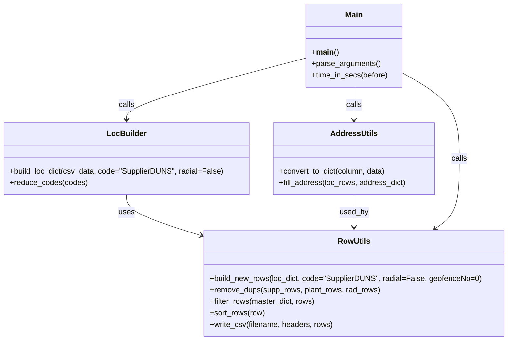

# Diagram: common/location_service/scripts/gm_location_scripts/combine_gm_data.py


> Auto-generated by Obscura crawlers

## Diagram 1

```mermaid
flowchart TD
  A[Start: __main__] --> B[parse_arguments()]
  B --> C[plant_poly = csv.DictReader(open(args.plant_poly))]
  C --> D[build_loc_dict(plant_poly, code="Code")]
  D --> E[build_new_rows(plant_poly_dict)]
  E --> F[convert_to_dict("LOCATION_GID", address_info)]
  F --> G[fill_address(rows, address_dict)]
  G --> H[sort_rows(rows)]
  H --> I{Row has "Address"?}
  I -->|Yes| J[list_with_addrs]
  I -->|No| K[list_without_addrs]
  J --> L[build dict_of_addrs]
  K --> M[build dict_of_non]
  L & M --> N[write_csv("CombinedData.csv", list_with_addrs)]
  K --> O[write_csv("LocsMissingAddr.csv", list_without_addrs)]
  N --> P[Print lengths and exit]
  O --> P
```

> SVG rendering failed for this diagram.

## Diagram 2



### SVG

<svg id="container" width="1047.51953125" xmlns="http://www.w3.org/2000/svg" class="classDiagram" height="710" viewBox="0 0 1047.51953125 710" role="graphics-document document" aria-roledescription="class"><style>#container{font-family:"trebuchet ms",verdana,arial,sans-serif;font-size:16px;fill:#333;}@keyframes edge-animation-frame{from{stroke-dashoffset:0;}}@keyframes dash{to{stroke-dashoffset:0;}}#container .edge-animation-slow{stroke-dasharray:9,5!important;stroke-dashoffset:900;animation:dash 50s linear infinite;stroke-linecap:round;}#container .edge-animation-fast{stroke-dasharray:9,5!important;stroke-dashoffset:900;animation:dash 20s linear infinite;stroke-linecap:round;}#container .error-icon{fill:#552222;}#container .error-text{fill:#552222;stroke:#552222;}#container .edge-thickness-normal{stroke-width:1px;}#container .edge-thickness-thick{stroke-width:3.5px;}#container .edge-pattern-solid{stroke-dasharray:0;}#container .edge-thickness-invisible{stroke-width:0;fill:none;}#container .edge-pattern-dashed{stroke-dasharray:3;}#container .edge-pattern-dotted{stroke-dasharray:2;}#container .marker{fill:#333333;stroke:#333333;}#container .marker.cross{stroke:#333333;}#container svg{font-family:"trebuchet ms",verdana,arial,sans-serif;font-size:16px;}#container p{margin:0;}#container g.classGroup text{fill:#9370DB;stroke:none;font-family:"trebuchet ms",verdana,arial,sans-serif;font-size:10px;}#container g.classGroup text .title{font-weight:bolder;}#container .nodeLabel,#container .edgeLabel{color:#131300;}#container .edgeLabel .label rect{fill:#ECECFF;}#container .label text{fill:#131300;}#container .labelBkg{background:#ECECFF;}#container .edgeLabel .label span{background:#ECECFF;}#container .classTitle{font-weight:bolder;}#container .node rect,#container .node circle,#container .node ellipse,#container .node polygon,#container .node path{fill:#ECECFF;stroke:#9370DB;stroke-width:1px;}#container .divider{stroke:#9370DB;stroke-width:1;}#container g.clickable{cursor:pointer;}#container g.classGroup rect{fill:#ECECFF;stroke:#9370DB;}#container g.classGroup line{stroke:#9370DB;stroke-width:1;}#container .classLabel .box{stroke:none;stroke-width:0;fill:#ECECFF;opacity:0.5;}#container .classLabel .label{fill:#9370DB;font-size:10px;}#container .relation{stroke:#333333;stroke-width:1;fill:none;}#container .dashed-line{stroke-dasharray:3;}#container .dotted-line{stroke-dasharray:1 2;}#container #compositionStart,#container .composition{fill:#333333!important;stroke:#333333!important;stroke-width:1;}#container #compositionEnd,#container .composition{fill:#333333!important;stroke:#333333!important;stroke-width:1;}#container #dependencyStart,#container .dependency{fill:#333333!important;stroke:#333333!important;stroke-width:1;}#container #dependencyStart,#container .dependency{fill:#333333!important;stroke:#333333!important;stroke-width:1;}#container #extensionStart,#container .extension{fill:transparent!important;stroke:#333333!important;stroke-width:1;}#container #extensionEnd,#container .extension{fill:transparent!important;stroke:#333333!important;stroke-width:1;}#container #aggregationStart,#container .aggregation{fill:transparent!important;stroke:#333333!important;stroke-width:1;}#container #aggregationEnd,#container .aggregation{fill:transparent!important;stroke:#333333!important;stroke-width:1;}#container #lollipopStart,#container .lollipop{fill:#ECECFF!important;stroke:#333333!important;stroke-width:1;}#container #lollipopEnd,#container .lollipop{fill:#ECECFF!important;stroke:#333333!important;stroke-width:1;}#container .edgeTerminals{font-size:11px;line-height:initial;}#container .classTitleText{text-anchor:middle;font-size:18px;fill:#333;}#container .label-icon{display:inline-block;height:1em;overflow:visible;vertical-align:-0.125em;}#container .node .label-icon path{fill:currentColor;stroke:revert;stroke-width:revert;}#container :root{--mermaid-font-family:"trebuchet ms",verdana,arial,sans-serif;}</style><g><defs><marker id="container_class-aggregationStart" class="marker aggregation class" refX="18" refY="7" markerWidth="190" markerHeight="240" orient="auto"><path d="M 18,7 L9,13 L1,7 L9,1 Z"></path></marker></defs><defs><marker id="container_class-aggregationEnd" class="marker aggregation class" refX="1" refY="7" markerWidth="20" markerHeight="28" orient="auto"><path d="M 18,7 L9,13 L1,7 L9,1 Z"></path></marker></defs><defs><marker id="container_class-extensionStart" class="marker extension class" refX="18" refY="7" markerWidth="190" markerHeight="240" orient="auto"><path d="M 1,7 L18,13 V 1 Z"></path></marker></defs><defs><marker id="container_class-extensionEnd" class="marker extension class" refX="1" refY="7" markerWidth="20" markerHeight="28" orient="auto"><path d="M 1,1 V 13 L18,7 Z"></path></marker></defs><defs><marker id="container_class-compositionStart" class="marker composition class" refX="18" refY="7" markerWidth="190" markerHeight="240" orient="auto"><path d="M 18,7 L9,13 L1,7 L9,1 Z"></path></marker></defs><defs><marker id="container_class-compositionEnd" class="marker composition class" refX="1" refY="7" markerWidth="20" markerHeight="28" orient="auto"><path d="M 18,7 L9,13 L1,7 L9,1 Z"></path></marker></defs><defs><marker id="container_class-dependencyStart" class="marker dependency class" refX="6" refY="7" markerWidth="190" markerHeight="240" orient="auto"><path d="M 5,7 L9,13 L1,7 L9,1 Z"></path></marker></defs><defs><marker id="container_class-dependencyEnd" class="marker dependency class" refX="13" refY="7" markerWidth="20" markerHeight="28" orient="auto"><path d="M 18,7 L9,13 L14,7 L9,1 Z"></path></marker></defs><defs><marker id="container_class-lollipopStart" class="marker lollipop class" refX="13" refY="7" markerWidth="190" markerHeight="240" orient="auto"><circle stroke="black" fill="transparent" cx="7" cy="7" r="6"></circle></marker></defs><defs><marker id="container_class-lollipopEnd" class="marker lollipop class" refX="1" refY="7" markerWidth="190" markerHeight="240" orient="auto"><circle stroke="black" fill="transparent" cx="7" cy="7" r="6"></circle></marker></defs><g class="root"><g class="clusters"></g><g class="edgePaths"><path d="M260.352,406L260.352,412.167C260.352,418.333,260.352,430.667,286.338,445.009C312.325,459.352,364.299,475.704,390.286,483.88L416.273,492.056" id="id_LocBuilder_RowUtils_1" class="edge-thickness-normal edge-pattern-solid relation" style=";;;" data-edge="true" data-et="edge" data-id="id_LocBuilder_RowUtils_1" data-points="W3sieCI6MjYwLjM1MTU2MjUsInkiOjQwNn0seyJ4IjoyNjAuMzUxNTYyNSwieSI6NDQzfSx7IngiOjQyMS45OTYwOTM3NSwieSI6NDkzLjg1Njg3MjM4NDI0MjM3fV0=" marker-end="url(#container_class-dependencyEnd)"></path><path d="M730.758,406L730.758,412.167C730.758,418.333,730.758,430.667,730.758,442C730.758,453.333,730.758,463.667,730.758,468.833L730.758,474" id="id_AddressUtils_RowUtils_2" class="edge-thickness-normal edge-pattern-solid relation" style=";;;" data-edge="true" data-et="edge" data-id="id_AddressUtils_RowUtils_2" data-points="W3sieCI6NzMwLjc1NzgxMjUsInkiOjQwNn0seyJ4Ijo3MzAuNzU3ODEyNSwieSI6NDQzfSx7IngiOjczMC43NTc4MTI1LCJ5Ijo0ODB9XQ==" marker-end="url(#container_class-dependencyEnd)"></path><path d="M630.133,121.525L568.503,137.771C506.872,154.017,383.612,186.508,321.982,207.921C260.352,229.333,260.352,239.667,260.352,244.833L260.352,250" id="id_Main_LocBuilder_3" class="edge-thickness-normal edge-pattern-solid relation" style=";;;" data-edge="true" data-et="edge" data-id="id_Main_LocBuilder_3" data-points="W3sieCI6NjMwLjEzMjgxMjUsInkiOjEyMS41MjQ5NDUxOTM2NDkxfSx7IngiOjI2MC4zNTE1NjI1LCJ5IjoyMTl9LHsieCI6MjYwLjM1MTU2MjUsInkiOjI1Nn1d" marker-end="url(#container_class-dependencyEnd)"></path><path d="M730.758,182L730.758,188.167C730.758,194.333,730.758,206.667,730.758,218C730.758,229.333,730.758,239.667,730.758,244.833L730.758,250" id="id_Main_AddressUtils_4" class="edge-thickness-normal edge-pattern-solid relation" style=";;;" data-edge="true" data-et="edge" data-id="id_Main_AddressUtils_4" data-points="W3sieCI6NzMwLjc1NzgxMjUsInkiOjE4Mn0seyJ4Ijo3MzAuNzU3ODEyNSwieSI6MjE5fSx7IngiOjczMC43NTc4MTI1LCJ5IjoyNTZ9XQ==" marker-end="url(#container_class-dependencyEnd)"></path><path d="M831.383,151.845L851.195,163.038C871.008,174.23,910.633,196.615,930.445,226.474C950.258,256.333,950.258,293.667,950.258,331C950.258,368.333,950.258,405.667,941.941,429.941C933.624,454.215,916.991,465.43,908.674,471.038L900.358,476.646" id="id_Main_RowUtils_5" class="edge-thickness-normal edge-pattern-solid relation" style=";;;" data-edge="true" data-et="edge" data-id="id_Main_RowUtils_5" data-points="W3sieCI6ODMxLjM4MjgxMjUsInkiOjE1MS44NDUxMDI1MDU2OTQ3N30seyJ4Ijo5NTAuMjU3ODEyNSwieSI6MjE5fSx7IngiOjk1MC4yNTc4MTI1LCJ5IjozMzF9LHsieCI6OTUwLjI1NzgxMjUsInkiOjQ0M30seyJ4Ijo4OTUuMzgyODEyNSwieSI6NDgwfV0=" marker-end="url(#container_class-dependencyEnd)"></path></g><g class="edgeLabels"><g class="edgeLabel" transform="translate(260.3515625, 443)"><g class="label" data-id="id_LocBuilder_RowUtils_1" transform="translate(-16.4921875, -12)"><foreignObject width="32.984375" height="24"><div xmlns="http://www.w3.org/1999/xhtml" class="labelBkg" style="display: table-cell; white-space: nowrap; line-height: 1.5; max-width: 200px; text-align: center;"><span class="edgeLabel"><p>uses</p></span></div></foreignObject></g></g><g class="edgeLabel" transform="translate(730.7578125, 443)"><g class="label" data-id="id_AddressUtils_RowUtils_2" transform="translate(-30.359375, -12)"><foreignObject width="60.71875" height="24"><div xmlns="http://www.w3.org/1999/xhtml" class="labelBkg" style="display: table-cell; white-space: nowrap; line-height: 1.5; max-width: 200px; text-align: center;"><span class="edgeLabel"><p>used_by</p></span></div></foreignObject></g></g><g class="edgeLabel" transform="translate(260.3515625, 219)"><g class="label" data-id="id_Main_LocBuilder_3" transform="translate(-16.4453125, -12)"><foreignObject width="32.890625" height="24"><div xmlns="http://www.w3.org/1999/xhtml" class="labelBkg" style="display: table-cell; white-space: nowrap; line-height: 1.5; max-width: 200px; text-align: center;"><span class="edgeLabel"><p>calls</p></span></div></foreignObject></g></g><g class="edgeLabel" transform="translate(730.7578125, 219)"><g class="label" data-id="id_Main_AddressUtils_4" transform="translate(-16.4453125, -12)"><foreignObject width="32.890625" height="24"><div xmlns="http://www.w3.org/1999/xhtml" class="labelBkg" style="display: table-cell; white-space: nowrap; line-height: 1.5; max-width: 200px; text-align: center;"><span class="edgeLabel"><p>calls</p></span></div></foreignObject></g></g><g class="edgeLabel" transform="translate(950.2578125, 331)"><g class="label" data-id="id_Main_RowUtils_5" transform="translate(-16.4453125, -12)"><foreignObject width="32.890625" height="24"><div xmlns="http://www.w3.org/1999/xhtml" class="labelBkg" style="display: table-cell; white-space: nowrap; line-height: 1.5; max-width: 200px; text-align: center;"><span class="edgeLabel"><p>calls</p></span></div></foreignObject></g></g></g><g class="nodes"><g class="node default" id="classId-LocBuilder-0" transform="translate(260.3515625, 331)"><g class="basic label-container"><path d="M-252.3515625 -75 L252.3515625 -75 L252.3515625 75 L-252.3515625 75" stroke="none" stroke-width="0" fill="#ECECFF" style=""></path><path d="M-252.3515625 -75 C-146.32537273008285 -75, -40.299182960165695 -75, 252.3515625 -75 M-252.3515625 -75 C-93.09160251343695 -75, 66.1683574731261 -75, 252.3515625 -75 M252.3515625 -75 C252.3515625 -23.979118622612432, 252.3515625 27.041762754775135, 252.3515625 75 M252.3515625 -75 C252.3515625 -25.557036890296594, 252.3515625 23.885926219406812, 252.3515625 75 M252.3515625 75 C92.30463770832756 75, -67.74228708334488 75, -252.3515625 75 M252.3515625 75 C131.58372450166974 75, 10.81588650333947 75, -252.3515625 75 M-252.3515625 75 C-252.3515625 24.89263007121893, -252.3515625 -25.214739857562137, -252.3515625 -75 M-252.3515625 75 C-252.3515625 42.7181194585454, -252.3515625 10.436238917090805, -252.3515625 -75" stroke="#9370DB" stroke-width="1.3" fill="none" stroke-dasharray="0 0" style=""></path></g><g class="annotation-group text" transform="translate(0, -51)"></g><g class="label-group text" transform="translate(-38.9375, -51)"><g class="label" style="font-weight: bolder" transform="translate(0,-12)"><foreignObject width="77.875" height="24"><div xmlns="http://www.w3.org/1999/xhtml" style="display: table-cell; white-space: nowrap; line-height: 1.5; max-width: 128px; text-align: center;"><span class="nodeLabel markdown-node-label" style=""><p>LocBuilder</p></span></div></foreignObject></g></g><g class="members-group text" transform="translate(-240.3515625, -3)"></g><g class="methods-group text" transform="translate(-240.3515625, 27)"><g class="label" style="" transform="translate(0,-12)"><foreignObject width="441.765625" height="24"><div xmlns="http://www.w3.org/1999/xhtml" style="display: table-cell; white-space: nowrap; line-height: 1.5; max-width: 499px; text-align: center;"><span class="nodeLabel markdown-node-label" style=""><p>+build_loc_dict(csv_data, code="SupplierDUNS", radial=False)</p></span></div></foreignObject></g><g class="label" style="" transform="translate(0,12)"><foreignObject width="160.25" height="24"><div xmlns="http://www.w3.org/1999/xhtml" style="display: table-cell; white-space: nowrap; line-height: 1.5; max-width: 218px; text-align: center;"><span class="nodeLabel markdown-node-label" style=""><p>+reduce_codes(codes)</p></span></div></foreignObject></g></g><g class="divider" style=""><path d="M-252.3515625 -27 C-65.05501588746264 -27, 122.24153072507471 -27, 252.3515625 -27 M-252.3515625 -27 C-143.91260297624922 -27, -35.473643452498465 -27, 252.3515625 -27" stroke="#9370DB" stroke-width="1.3" fill="none" stroke-dasharray="0 0" style=""></path></g><g class="divider" style=""><path d="M-252.3515625 -3 C-138.55303541218396 -3, -24.75450832436792 -3, 252.3515625 -3 M-252.3515625 -3 C-61.340862079120996 -3, 129.669838341758 -3, 252.3515625 -3" stroke="#9370DB" stroke-width="1.3" fill="none" stroke-dasharray="0 0" style=""></path></g></g><g class="node default" id="classId-AddressUtils-1" transform="translate(730.7578125, 331)"><g class="basic label-container"><path d="M-168.0546875 -75 L168.0546875 -75 L168.0546875 75 L-168.0546875 75" stroke="none" stroke-width="0" fill="#ECECFF" style=""></path><path d="M-168.0546875 -75 C-98.85102442869001 -75, -29.64736135738002 -75, 168.0546875 -75 M-168.0546875 -75 C-42.316899727293446 -75, 83.42088804541311 -75, 168.0546875 -75 M168.0546875 -75 C168.0546875 -40.17011544131138, 168.0546875 -5.3402308826227625, 168.0546875 75 M168.0546875 -75 C168.0546875 -26.193276779686222, 168.0546875 22.613446440627555, 168.0546875 75 M168.0546875 75 C54.17416499756041 75, -59.70635750487918 75, -168.0546875 75 M168.0546875 75 C37.88949510869239 75, -92.27569728261523 75, -168.0546875 75 M-168.0546875 75 C-168.0546875 36.22498408466, -168.0546875 -2.5500318306799983, -168.0546875 -75 M-168.0546875 75 C-168.0546875 34.09693147688008, -168.0546875 -6.80613704623984, -168.0546875 -75" stroke="#9370DB" stroke-width="1.3" fill="none" stroke-dasharray="0 0" style=""></path></g><g class="annotation-group text" transform="translate(0, -51)"></g><g class="label-group text" transform="translate(-46.171875, -51)"><g class="label" style="font-weight: bolder" transform="translate(0,-12)"><foreignObject width="92.34375" height="24"><div xmlns="http://www.w3.org/1999/xhtml" style="display: table-cell; white-space: nowrap; line-height: 1.5; max-width: 141px; text-align: center;"><span class="nodeLabel markdown-node-label" style=""><p>AddressUtils</p></span></div></foreignObject></g></g><g class="members-group text" transform="translate(-156.0546875, -3)"></g><g class="methods-group text" transform="translate(-156.0546875, 27)"><g class="label" style="" transform="translate(0,-12)"><foreignObject width="225.3125" height="24"><div xmlns="http://www.w3.org/1999/xhtml" style="display: table-cell; white-space: nowrap; line-height: 1.5; max-width: 283px; text-align: center;"><span class="nodeLabel markdown-node-label" style=""><p>+convert_to_dict(column, data)</p></span></div></foreignObject></g><g class="label" style="" transform="translate(0,12)"><foreignObject width="265.9375" height="24"><div xmlns="http://www.w3.org/1999/xhtml" style="display: table-cell; white-space: nowrap; line-height: 1.5; max-width: 323px; text-align: center;"><span class="nodeLabel markdown-node-label" style=""><p>+fill_address(loc_rows, address_dict)</p></span></div></foreignObject></g></g><g class="divider" style=""><path d="M-168.0546875 -27 C-46.18814400386931 -27, 75.67839949226138 -27, 168.0546875 -27 M-168.0546875 -27 C-59.00006942251075 -27, 50.054548654978504 -27, 168.0546875 -27" stroke="#9370DB" stroke-width="1.3" fill="none" stroke-dasharray="0 0" style=""></path></g><g class="divider" style=""><path d="M-168.0546875 -3 C-66.10319377038843 -3, 35.84829995922314 -3, 168.0546875 -3 M-168.0546875 -3 C-54.50895069637086 -3, 59.03678610725828 -3, 168.0546875 -3" stroke="#9370DB" stroke-width="1.3" fill="none" stroke-dasharray="0 0" style=""></path></g></g><g class="node default" id="classId-RowUtils-2" transform="translate(730.7578125, 591)"><g class="basic label-container"><path d="M-308.76171875 -111 L308.76171875 -111 L308.76171875 111 L-308.76171875 111" stroke="none" stroke-width="0" fill="#ECECFF" style=""></path><path d="M-308.76171875 -111 C-138.8854123149917 -111, 30.990894120016605 -111, 308.76171875 -111 M-308.76171875 -111 C-153.31345792371434 -111, 2.134802902571323 -111, 308.76171875 -111 M308.76171875 -111 C308.76171875 -57.5855248561706, 308.76171875 -4.171049712341201, 308.76171875 111 M308.76171875 -111 C308.76171875 -47.22983410992282, 308.76171875 16.54033178015436, 308.76171875 111 M308.76171875 111 C84.05567939298854 111, -140.65035996402293 111, -308.76171875 111 M308.76171875 111 C105.62369238129395 111, -97.5143339874121 111, -308.76171875 111 M-308.76171875 111 C-308.76171875 29.16280041990676, -308.76171875 -52.67439916018648, -308.76171875 -111 M-308.76171875 111 C-308.76171875 31.947946417913954, -308.76171875 -47.10410716417209, -308.76171875 -111" stroke="#9370DB" stroke-width="1.3" fill="none" stroke-dasharray="0 0" style=""></path></g><g class="annotation-group text" transform="translate(0, -87)"></g><g class="label-group text" transform="translate(-32.2734375, -87)"><g class="label" style="font-weight: bolder" transform="translate(0,-12)"><foreignObject width="64.546875" height="24"><div xmlns="http://www.w3.org/1999/xhtml" style="display: table-cell; white-space: nowrap; line-height: 1.5; max-width: 113px; text-align: center;"><span class="nodeLabel markdown-node-label" style=""><p>RowUtils</p></span></div></foreignObject></g></g><g class="members-group text" transform="translate(-296.76171875, -39)"></g><g class="methods-group text" transform="translate(-296.76171875, -9)"><g class="label" style="" transform="translate(0,-12)"><foreignObject width="561.25" height="24"><div xmlns="http://www.w3.org/1999/xhtml" style="display: table-cell; white-space: nowrap; line-height: 1.5; max-width: 619px; text-align: center;"><span class="nodeLabel markdown-node-label" style=""><p>+build_new_rows(loc_dict, code="SupplierDUNS", radial=False, geofenceNo=0)</p></span></div></foreignObject></g><g class="label" style="" transform="translate(0,12)"><foreignObject width="356.234375" height="24"><div xmlns="http://www.w3.org/1999/xhtml" style="display: table-cell; white-space: nowrap; line-height: 1.5; max-width: 414px; text-align: center;"><span class="nodeLabel markdown-node-label" style=""><p>+remove_dups(supp_rows, plant_rows, rad_rows)</p></span></div></foreignObject></g><g class="label" style="" transform="translate(0,36)"><foreignObject width="219.96875" height="24"><div xmlns="http://www.w3.org/1999/xhtml" style="display: table-cell; white-space: nowrap; line-height: 1.5; max-width: 277px; text-align: center;"><span class="nodeLabel markdown-node-label" style=""><p>+filter_rows(master_dict, rows)</p></span></div></foreignObject></g><g class="label" style="" transform="translate(0,60)"><foreignObject width="115.9375" height="24"><div xmlns="http://www.w3.org/1999/xhtml" style="display: table-cell; white-space: nowrap; line-height: 1.5; max-width: 173px; text-align: center;"><span class="nodeLabel markdown-node-label" style=""><p>+sort_rows(row)</p></span></div></foreignObject></g><g class="label" style="" transform="translate(0,84)"><foreignObject width="256.53125" height="24"><div xmlns="http://www.w3.org/1999/xhtml" style="display: table-cell; white-space: nowrap; line-height: 1.5; max-width: 314px; text-align: center;"><span class="nodeLabel markdown-node-label" style=""><p>+write_csv(filename, headers, rows)</p></span></div></foreignObject></g></g><g class="divider" style=""><path d="M-308.76171875 -63 C-85.44035289565502 -63, 137.88101295868995 -63, 308.76171875 -63 M-308.76171875 -63 C-140.29980972213693 -63, 28.162099305726144 -63, 308.76171875 -63" stroke="#9370DB" stroke-width="1.3" fill="none" stroke-dasharray="0 0" style=""></path></g><g class="divider" style=""><path d="M-308.76171875 -39 C-131.0665469166651 -39, 46.62862491666982 -39, 308.76171875 -39 M-308.76171875 -39 C-169.8784045391894 -39, -30.995090328378808 -39, 308.76171875 -39" stroke="#9370DB" stroke-width="1.3" fill="none" stroke-dasharray="0 0" style=""></path></g></g><g class="node default" id="classId-Main-3" transform="translate(730.7578125, 95)"><g class="basic label-container"><path d="M-100.625 -87 L100.625 -87 L100.625 87 L-100.625 87" stroke="none" stroke-width="0" fill="#ECECFF" style=""></path><path d="M-100.625 -87 C-49.02830331403234 -87, 2.568393371935315 -87, 100.625 -87 M-100.625 -87 C-52.92774696283917 -87, -5.230493925678346 -87, 100.625 -87 M100.625 -87 C100.625 -19.185225028362893, 100.625 48.62954994327421, 100.625 87 M100.625 -87 C100.625 -40.49247547404397, 100.625 6.015049051912058, 100.625 87 M100.625 87 C43.89733100011243 87, -12.83033799977514 87, -100.625 87 M100.625 87 C34.98730821657132 87, -30.650383566857357 87, -100.625 87 M-100.625 87 C-100.625 40.162414691950424, -100.625 -6.675170616099152, -100.625 -87 M-100.625 87 C-100.625 34.72906375716457, -100.625 -17.541872485670865, -100.625 -87" stroke="#9370DB" stroke-width="1.3" fill="none" stroke-dasharray="0 0" style=""></path></g><g class="annotation-group text" transform="translate(0, -63)"></g><g class="label-group text" transform="translate(-17.546875, -63)"><g class="label" style="font-weight: bolder" transform="translate(0,-12)"><foreignObject width="35.09375" height="24"><div xmlns="http://www.w3.org/1999/xhtml" style="display: table-cell; white-space: nowrap; line-height: 1.5; max-width: 85px; text-align: center;"><span class="nodeLabel markdown-node-label" style=""><p>Main</p></span></div></foreignObject></g></g><g class="members-group text" transform="translate(-88.625, -15)"></g><g class="methods-group text" transform="translate(-88.625, 15)"><g class="label" style="" transform="translate(0,-12)"><foreignObject width="54.40625" height="24"><div xmlns="http://www.w3.org/1999/xhtml" style="display: table-cell; white-space: nowrap; line-height: 1.5; max-width: 144px; text-align: center;"><span class="nodeLabel markdown-node-label" style=""><p>+<strong>main</strong>()</p></span></div></foreignObject></g><g class="label" style="" transform="translate(0,12)"><foreignObject width="143.390625" height="24"><div xmlns="http://www.w3.org/1999/xhtml" style="display: table-cell; white-space: nowrap; line-height: 1.5; max-width: 201px; text-align: center;"><span class="nodeLabel markdown-node-label" style=""><p>+parse_arguments()</p></span></div></foreignObject></g><g class="label" style="" transform="translate(0,36)"><foreignObject width="159.703125" height="24"><div xmlns="http://www.w3.org/1999/xhtml" style="display: table-cell; white-space: nowrap; line-height: 1.5; max-width: 217px; text-align: center;"><span class="nodeLabel markdown-node-label" style=""><p>+time_in_secs(before)</p></span></div></foreignObject></g></g><g class="divider" style=""><path d="M-100.625 -39 C-41.45863719636937 -39, 17.707725607261267 -39, 100.625 -39 M-100.625 -39 C-36.94510015850414 -39, 26.73479968299172 -39, 100.625 -39" stroke="#9370DB" stroke-width="1.3" fill="none" stroke-dasharray="0 0" style=""></path></g><g class="divider" style=""><path d="M-100.625 -15 C-26.945404462136167 -15, 46.734191075727665 -15, 100.625 -15 M-100.625 -15 C-48.773294753586434 -15, 3.078410492827132 -15, 100.625 -15" stroke="#9370DB" stroke-width="1.3" fill="none" stroke-dasharray="0 0" style=""></path></g></g></g></g></g></svg>
