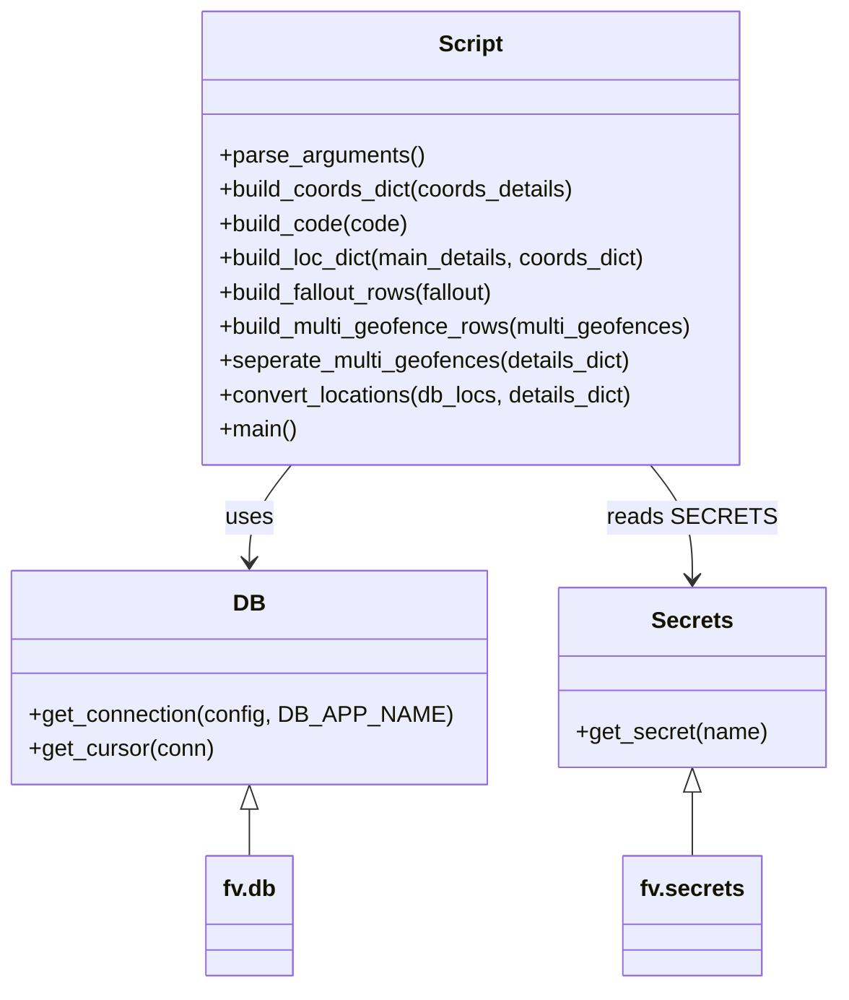

# Diagram: common/location_service/scripts/gm_location_scripts/convert_ryder_data.py


> Auto-generated by Obscura crawlers

## Diagram 1

```mermaid
flowchart LR
    A[parse_arguments()] --> B[main: read CSVs]
    B --> C[build_coords_dict(coords_details)]
    C --> D[build_loc_dict(main_details, coords_dict)]
    D --> E[seperate_multi_geofences(details_dict)]
    E --> F[convert_locations(db_locs, details_dict)]
    F --> G[write_csv("standardized_locations.csv", location_rows)]
    F --> H[get_existing_locations()]
    H --> I[fv.db.get_connection -> cursor -> SELECT FROM location.location]
    D -->|fallout on KeyError| J[build_fallout_rows(fallout)]
    E -->|multi geofences extracted| K[build_multi_geofence_rows(multi_geofences)]
    subgraph CSV_IO
        B
        G
        J
        K
    end
```

> SVG rendering failed for this diagram.

## Diagram 2



### SVG

<svg id="container" width="570.078125" xmlns="http://www.w3.org/2000/svg" class="classDiagram" height="692" viewBox="0 0 570.078125 692" role="graphics-document document" aria-roledescription="class"><style>#container{font-family:"trebuchet ms",verdana,arial,sans-serif;font-size:16px;fill:#333;}@keyframes edge-animation-frame{from{stroke-dashoffset:0;}}@keyframes dash{to{stroke-dashoffset:0;}}#container .edge-animation-slow{stroke-dasharray:9,5!important;stroke-dashoffset:900;animation:dash 50s linear infinite;stroke-linecap:round;}#container .edge-animation-fast{stroke-dasharray:9,5!important;stroke-dashoffset:900;animation:dash 20s linear infinite;stroke-linecap:round;}#container .error-icon{fill:#552222;}#container .error-text{fill:#552222;stroke:#552222;}#container .edge-thickness-normal{stroke-width:1px;}#container .edge-thickness-thick{stroke-width:3.5px;}#container .edge-pattern-solid{stroke-dasharray:0;}#container .edge-thickness-invisible{stroke-width:0;fill:none;}#container .edge-pattern-dashed{stroke-dasharray:3;}#container .edge-pattern-dotted{stroke-dasharray:2;}#container .marker{fill:#333333;stroke:#333333;}#container .marker.cross{stroke:#333333;}#container svg{font-family:"trebuchet ms",verdana,arial,sans-serif;font-size:16px;}#container p{margin:0;}#container g.classGroup text{fill:#9370DB;stroke:none;font-family:"trebuchet ms",verdana,arial,sans-serif;font-size:10px;}#container g.classGroup text .title{font-weight:bolder;}#container .nodeLabel,#container .edgeLabel{color:#131300;}#container .edgeLabel .label rect{fill:#ECECFF;}#container .label text{fill:#131300;}#container .labelBkg{background:#ECECFF;}#container .edgeLabel .label span{background:#ECECFF;}#container .classTitle{font-weight:bolder;}#container .node rect,#container .node circle,#container .node ellipse,#container .node polygon,#container .node path{fill:#ECECFF;stroke:#9370DB;stroke-width:1px;}#container .divider{stroke:#9370DB;stroke-width:1;}#container g.clickable{cursor:pointer;}#container g.classGroup rect{fill:#ECECFF;stroke:#9370DB;}#container g.classGroup line{stroke:#9370DB;stroke-width:1;}#container .classLabel .box{stroke:none;stroke-width:0;fill:#ECECFF;opacity:0.5;}#container .classLabel .label{fill:#9370DB;font-size:10px;}#container .relation{stroke:#333333;stroke-width:1;fill:none;}#container .dashed-line{stroke-dasharray:3;}#container .dotted-line{stroke-dasharray:1 2;}#container #compositionStart,#container .composition{fill:#333333!important;stroke:#333333!important;stroke-width:1;}#container #compositionEnd,#container .composition{fill:#333333!important;stroke:#333333!important;stroke-width:1;}#container #dependencyStart,#container .dependency{fill:#333333!important;stroke:#333333!important;stroke-width:1;}#container #dependencyStart,#container .dependency{fill:#333333!important;stroke:#333333!important;stroke-width:1;}#container #extensionStart,#container .extension{fill:transparent!important;stroke:#333333!important;stroke-width:1;}#container #extensionEnd,#container .extension{fill:transparent!important;stroke:#333333!important;stroke-width:1;}#container #aggregationStart,#container .aggregation{fill:transparent!important;stroke:#333333!important;stroke-width:1;}#container #aggregationEnd,#container .aggregation{fill:transparent!important;stroke:#333333!important;stroke-width:1;}#container #lollipopStart,#container .lollipop{fill:#ECECFF!important;stroke:#333333!important;stroke-width:1;}#container #lollipopEnd,#container .lollipop{fill:#ECECFF!important;stroke:#333333!important;stroke-width:1;}#container .edgeTerminals{font-size:11px;line-height:initial;}#container .classTitleText{text-anchor:middle;font-size:18px;fill:#333;}#container .label-icon{display:inline-block;height:1em;overflow:visible;vertical-align:-0.125em;}#container .node .label-icon path{fill:currentColor;stroke:revert;stroke-width:revert;}#container :root{--mermaid-font-family:"trebuchet ms",verdana,arial,sans-serif;}</style><g><defs><marker id="container_class-aggregationStart" class="marker aggregation class" refX="18" refY="7" markerWidth="190" markerHeight="240" orient="auto"><path d="M 18,7 L9,13 L1,7 L9,1 Z"></path></marker></defs><defs><marker id="container_class-aggregationEnd" class="marker aggregation class" refX="1" refY="7" markerWidth="20" markerHeight="28" orient="auto"><path d="M 18,7 L9,13 L1,7 L9,1 Z"></path></marker></defs><defs><marker id="container_class-extensionStart" class="marker extension class" refX="18" refY="7" markerWidth="190" markerHeight="240" orient="auto"><path d="M 1,7 L18,13 V 1 Z"></path></marker></defs><defs><marker id="container_class-extensionEnd" class="marker extension class" refX="1" refY="7" markerWidth="20" markerHeight="28" orient="auto"><path d="M 1,1 V 13 L18,7 Z"></path></marker></defs><defs><marker id="container_class-compositionStart" class="marker composition class" refX="18" refY="7" markerWidth="190" markerHeight="240" orient="auto"><path d="M 18,7 L9,13 L1,7 L9,1 Z"></path></marker></defs><defs><marker id="container_class-compositionEnd" class="marker composition class" refX="1" refY="7" markerWidth="20" markerHeight="28" orient="auto"><path d="M 18,7 L9,13 L1,7 L9,1 Z"></path></marker></defs><defs><marker id="container_class-dependencyStart" class="marker dependency class" refX="6" refY="7" markerWidth="190" markerHeight="240" orient="auto"><path d="M 5,7 L9,13 L1,7 L9,1 Z"></path></marker></defs><defs><marker id="container_class-dependencyEnd" class="marker dependency class" refX="13" refY="7" markerWidth="20" markerHeight="28" orient="auto"><path d="M 18,7 L9,13 L14,7 L9,1 Z"></path></marker></defs><defs><marker id="container_class-lollipopStart" class="marker lollipop class" refX="13" refY="7" markerWidth="190" markerHeight="240" orient="auto"><circle stroke="black" fill="transparent" cx="7" cy="7" r="6"></circle></marker></defs><defs><marker id="container_class-lollipopEnd" class="marker lollipop class" refX="1" refY="7" markerWidth="190" markerHeight="240" orient="auto"><circle stroke="black" fill="transparent" cx="7" cy="7" r="6"></circle></marker></defs><g class="root"><g class="clusters"></g><g class="edgePaths"><path d="M196.075,326L191.324,332.167C186.572,338.333,177.069,350.667,172.318,362C167.566,373.333,167.566,383.667,167.566,388.833L167.566,394" id="id_Script_DB_1" class="edge-thickness-normal edge-pattern-solid relation" style=";;;" data-edge="true" data-et="edge" data-id="id_Script_DB_1" data-points="W3sieCI6MTk2LjA3NTE5NTMxMjUsInkiOjMyNn0seyJ4IjoxNjcuNTY2NDA2MjUsInkiOjM2M30seyJ4IjoxNjcuNTY2NDA2MjUsInkiOjQwMH1d" marker-end="url(#container_class-dependencyEnd)"></path><path d="M441.097,326L445.848,332.167C450.6,338.333,460.103,350.667,464.854,364C469.605,377.333,469.605,391.667,469.605,398.833L469.605,406" id="id_Script_Secrets_2" class="edge-thickness-normal edge-pattern-solid relation" style=";;;" data-edge="true" data-et="edge" data-id="id_Script_Secrets_2" data-points="W3sieCI6NDQxLjA5NjY3OTY4NzUsInkiOjMyNn0seyJ4Ijo0NjkuNjA1NDY4NzUsInkiOjM2M30seyJ4Ijo0NjkuNjA1NDY4NzUsInkiOjQxMn1d" marker-end="url(#container_class-dependencyEnd)"></path><path d="M167.566,567.25L167.566,568.542C167.566,569.833,167.566,572.417,167.566,577.875C167.566,583.333,167.566,591.667,167.566,595.833L167.566,600" id="id_DB_fv.db_3" class="edge-thickness-normal edge-pattern-solid relation" style=";;;" data-edge="true" data-et="edge" data-id="id_DB_fv.db_3" data-points="W3sieCI6MTY3LjU2NjQwNjI1LCJ5Ijo1NTB9LHsieCI6MTY3LjU2NjQwNjI1LCJ5Ijo1NzV9LHsieCI6MTY3LjU2NjQwNjI1LCJ5Ijo2MDB9XQ==" marker-start="url(#container_class-extensionStart)"></path><path d="M469.605,555.25L469.605,558.542C469.605,561.833,469.605,568.417,469.605,575.875C469.605,583.333,469.605,591.667,469.605,595.833L469.605,600" id="id_Secrets_fv.secrets_4" class="edge-thickness-normal edge-pattern-solid relation" style=";;;" data-edge="true" data-et="edge" data-id="id_Secrets_fv.secrets_4" data-points="W3sieCI6NDY5LjYwNTQ2ODc1LCJ5Ijo1Mzh9LHsieCI6NDY5LjYwNTQ2ODc1LCJ5Ijo1NzV9LHsieCI6NDY5LjYwNTQ2ODc1LCJ5Ijo2MDB9XQ==" marker-start="url(#container_class-extensionStart)"></path></g><g class="edgeLabels"><g class="edgeLabel" transform="translate(167.56640625, 363)"><g class="label" data-id="id_Script_DB_1" transform="translate(-16.4921875, -12)"><foreignObject width="32.984375" height="24"><div xmlns="http://www.w3.org/1999/xhtml" class="labelBkg" style="display: table-cell; white-space: nowrap; line-height: 1.5; max-width: 200px; text-align: center;"><span class="edgeLabel"><p>uses</p></span></div></foreignObject></g></g><g class="edgeLabel" transform="translate(469.60546875, 363)"><g class="label" data-id="id_Script_Secrets_2" transform="translate(-52.6015625, -12)"><foreignObject width="105.203125" height="24"><div xmlns="http://www.w3.org/1999/xhtml" class="labelBkg" style="display: table-cell; white-space: nowrap; line-height: 1.5; max-width: 200px; text-align: center;"><span class="edgeLabel"><p>reads SECRETS</p></span></div></foreignObject></g></g><g class="edgeLabel"><g class="label" data-id="id_DB_fv.db_3" transform="translate(0, 0)"><foreignObject width="0" height="0"><div xmlns="http://www.w3.org/1999/xhtml" class="labelBkg" style="display: table-cell; white-space: nowrap; line-height: 1.5; max-width: 200px; text-align: center;"><span class="edgeLabel"></span></div></foreignObject></g></g><g class="edgeLabel"><g class="label" data-id="id_Secrets_fv.secrets_4" transform="translate(0, 0)"><foreignObject width="0" height="0"><div xmlns="http://www.w3.org/1999/xhtml" class="labelBkg" style="display: table-cell; white-space: nowrap; line-height: 1.5; max-width: 200px; text-align: center;"><span class="edgeLabel"></span></div></foreignObject></g></g></g><g class="nodes"><g class="node default" id="classId-Script-0" transform="translate(318.5859375, 167)"><g class="basic label-container"><path d="M-191.62890625 -159 L191.62890625 -159 L191.62890625 159 L-191.62890625 159" stroke="none" stroke-width="0" fill="#ECECFF" style=""></path><path d="M-191.62890625 -159 C-59.88780090784081 -159, 71.85330443431837 -159, 191.62890625 -159 M-191.62890625 -159 C-39.00181344800089 -159, 113.62527935399822 -159, 191.62890625 -159 M191.62890625 -159 C191.62890625 -39.480788612462916, 191.62890625 80.03842277507417, 191.62890625 159 M191.62890625 -159 C191.62890625 -84.6538515672066, 191.62890625 -10.307703134413202, 191.62890625 159 M191.62890625 159 C67.58580753555141 159, -56.45729117889718 159, -191.62890625 159 M191.62890625 159 C107.25680313600218 159, 22.884700022004353 159, -191.62890625 159 M-191.62890625 159 C-191.62890625 85.911996189655, -191.62890625 12.823992379309999, -191.62890625 -159 M-191.62890625 159 C-191.62890625 47.70528483184508, -191.62890625 -63.589430336309846, -191.62890625 -159" stroke="#9370DB" stroke-width="1.3" fill="none" stroke-dasharray="0 0" style=""></path></g><g class="annotation-group text" transform="translate(0, -135)"></g><g class="label-group text" transform="translate(-21.7421875, -135)"><g class="label" style="font-weight: bolder" transform="translate(0,-12)"><foreignObject width="43.484375" height="24"><div xmlns="http://www.w3.org/1999/xhtml" style="display: table-cell; white-space: nowrap; line-height: 1.5; max-width: 93px; text-align: center;"><span class="nodeLabel markdown-node-label" style=""><p>Script</p></span></div></foreignObject></g></g><g class="members-group text" transform="translate(-179.62890625, -87)"></g><g class="methods-group text" transform="translate(-179.62890625, -57)"><g class="label" style="" transform="translate(0,-12)"><foreignObject width="143.390625" height="24"><div xmlns="http://www.w3.org/1999/xhtml" style="display: table-cell; white-space: nowrap; line-height: 1.5; max-width: 201px; text-align: center;"><span class="nodeLabel markdown-node-label" style=""><p>+parse_arguments()</p></span></div></foreignObject></g><g class="label" style="" transform="translate(0,12)"><foreignObject width="253.5625" height="24"><div xmlns="http://www.w3.org/1999/xhtml" style="display: table-cell; white-space: nowrap; line-height: 1.5; max-width: 311px; text-align: center;"><span class="nodeLabel markdown-node-label" style=""><p>+build_coords_dict(coords_details)</p></span></div></foreignObject></g><g class="label" style="" transform="translate(0,36)"><foreignObject width="133.78125" height="24"><div xmlns="http://www.w3.org/1999/xhtml" style="display: table-cell; white-space: nowrap; line-height: 1.5; max-width: 191px; text-align: center;"><span class="nodeLabel markdown-node-label" style=""><p>+build_code(code)</p></span></div></foreignObject></g><g class="label" style="" transform="translate(0,60)"><foreignObject width="306.78125" height="24"><div xmlns="http://www.w3.org/1999/xhtml" style="display: table-cell; white-space: nowrap; line-height: 1.5; max-width: 364px; text-align: center;"><span class="nodeLabel markdown-node-label" style=""><p>+build_loc_dict(main_details, coords_dict)</p></span></div></foreignObject></g><g class="label" style="" transform="translate(0,84)"><foreignObject width="200.734375" height="24"><div xmlns="http://www.w3.org/1999/xhtml" style="display: table-cell; white-space: nowrap; line-height: 1.5; max-width: 258px; text-align: center;"><span class="nodeLabel markdown-node-label" style=""><p>+build_fallout_rows(fallout)</p></span></div></foreignObject></g><g class="label" style="" transform="translate(0,108)"><foreignObject width="337.515625" height="24"><div xmlns="http://www.w3.org/1999/xhtml" style="display: table-cell; white-space: nowrap; line-height: 1.5; max-width: 395px; text-align: center;"><span class="nodeLabel markdown-node-label" style=""><p>+build_multi_geofence_rows(multi_geofences)</p></span></div></foreignObject></g><g class="label" style="" transform="translate(0,132)"><foreignObject width="293.265625" height="24"><div xmlns="http://www.w3.org/1999/xhtml" style="display: table-cell; white-space: nowrap; line-height: 1.5; max-width: 351px; text-align: center;"><span class="nodeLabel markdown-node-label" style=""><p>+seperate_multi_geofences(details_dict)</p></span></div></foreignObject></g><g class="label" style="" transform="translate(0,156)"><foreignObject width="296.140625" height="24"><div xmlns="http://www.w3.org/1999/xhtml" style="display: table-cell; white-space: nowrap; line-height: 1.5; max-width: 354px; text-align: center;"><span class="nodeLabel markdown-node-label" style=""><p>+convert_locations(db_locs, details_dict)</p></span></div></foreignObject></g><g class="label" style="" transform="translate(0,180)"><foreignObject width="54.65625" height="24"><div xmlns="http://www.w3.org/1999/xhtml" style="display: table-cell; white-space: nowrap; line-height: 1.5; max-width: 112px; text-align: center;"><span class="nodeLabel markdown-node-label" style=""><p>+main()</p></span></div></foreignObject></g></g><g class="divider" style=""><path d="M-191.62890625 -111 C-73.51289761655467 -111, 44.603111016890665 -111, 191.62890625 -111 M-191.62890625 -111 C-69.41618374882711 -111, 52.79653875234578 -111, 191.62890625 -111" stroke="#9370DB" stroke-width="1.3" fill="none" stroke-dasharray="0 0" style=""></path></g><g class="divider" style=""><path d="M-191.62890625 -87 C-69.20324371725359 -87, 53.22241881549283 -87, 191.62890625 -87 M-191.62890625 -87 C-85.18535555560044 -87, 21.258195138799124 -87, 191.62890625 -87" stroke="#9370DB" stroke-width="1.3" fill="none" stroke-dasharray="0 0" style=""></path></g></g><g class="node default" id="classId-DB-1" transform="translate(167.56640625, 475)"><g class="basic label-container"><path d="M-159.56640625 -75 L159.56640625 -75 L159.56640625 75 L-159.56640625 75" stroke="none" stroke-width="0" fill="#ECECFF" style=""></path><path d="M-159.56640625 -75 C-36.30860753450092 -75, 86.94919118099816 -75, 159.56640625 -75 M-159.56640625 -75 C-51.37792083193955 -75, 56.810564586120904 -75, 159.56640625 -75 M159.56640625 -75 C159.56640625 -44.393321131684786, 159.56640625 -13.786642263369572, 159.56640625 75 M159.56640625 -75 C159.56640625 -30.95907420075269, 159.56640625 13.081851598494623, 159.56640625 75 M159.56640625 75 C92.90336714284332 75, 26.240328035686645 75, -159.56640625 75 M159.56640625 75 C79.81923215547465 75, 0.07205806094930267 75, -159.56640625 75 M-159.56640625 75 C-159.56640625 38.10249688327684, -159.56640625 1.2049937665536845, -159.56640625 -75 M-159.56640625 75 C-159.56640625 39.74660507984508, -159.56640625 4.493210159690165, -159.56640625 -75" stroke="#9370DB" stroke-width="1.3" fill="none" stroke-dasharray="0 0" style=""></path></g><g class="annotation-group text" transform="translate(0, -51)"></g><g class="label-group text" transform="translate(-10.1484375, -51)"><g class="label" style="font-weight: bolder" transform="translate(0,-12)"><foreignObject width="20.296875" height="24"><div xmlns="http://www.w3.org/1999/xhtml" style="display: table-cell; white-space: nowrap; line-height: 1.5; max-width: 70px; text-align: center;"><span class="nodeLabel markdown-node-label" style=""><p>DB</p></span></div></foreignObject></g></g><g class="members-group text" transform="translate(-147.56640625, -3)"></g><g class="methods-group text" transform="translate(-147.56640625, 27)"><g class="label" style="" transform="translate(0,-12)"><foreignObject width="284.984375" height="24"><div xmlns="http://www.w3.org/1999/xhtml" style="display: table-cell; white-space: nowrap; line-height: 1.5; max-width: 342px; text-align: center;"><span class="nodeLabel markdown-node-label" style=""><p>+get_connection(config, DB_APP_NAME)</p></span></div></foreignObject></g><g class="label" style="" transform="translate(0,12)"><foreignObject width="130.078125" height="24"><div xmlns="http://www.w3.org/1999/xhtml" style="display: table-cell; white-space: nowrap; line-height: 1.5; max-width: 187px; text-align: center;"><span class="nodeLabel markdown-node-label" style=""><p>+get_cursor(conn)</p></span></div></foreignObject></g></g><g class="divider" style=""><path d="M-159.56640625 -27 C-78.55534017211627 -27, 2.4557259057674514 -27, 159.56640625 -27 M-159.56640625 -27 C-52.041678603728684 -27, 55.48304904254263 -27, 159.56640625 -27" stroke="#9370DB" stroke-width="1.3" fill="none" stroke-dasharray="0 0" style=""></path></g><g class="divider" style=""><path d="M-159.56640625 -3 C-90.93997769262654 -3, -22.313549135253083 -3, 159.56640625 -3 M-159.56640625 -3 C-55.3736849178667 -3, 48.819036414266606 -3, 159.56640625 -3" stroke="#9370DB" stroke-width="1.3" fill="none" stroke-dasharray="0 0" style=""></path></g></g><g class="node default" id="classId-Secrets-2" transform="translate(469.60546875, 475)"><g class="basic label-container"><path d="M-92.47265625 -63 L92.47265625 -63 L92.47265625 63 L-92.47265625 63" stroke="none" stroke-width="0" fill="#ECECFF" style=""></path><path d="M-92.47265625 -63 C-39.49075871850263 -63, 13.491138812994734 -63, 92.47265625 -63 M-92.47265625 -63 C-22.667138685650272 -63, 47.138378878699456 -63, 92.47265625 -63 M92.47265625 -63 C92.47265625 -21.45097620149521, 92.47265625 20.098047597009582, 92.47265625 63 M92.47265625 -63 C92.47265625 -16.90917507009003, 92.47265625 29.18164985981994, 92.47265625 63 M92.47265625 63 C54.963871260662735 63, 17.45508627132547 63, -92.47265625 63 M92.47265625 63 C47.79763798020757 63, 3.1226197104151368 63, -92.47265625 63 M-92.47265625 63 C-92.47265625 28.253107626378984, -92.47265625 -6.493784747242032, -92.47265625 -63 M-92.47265625 63 C-92.47265625 25.00107823457826, -92.47265625 -12.997843530843483, -92.47265625 -63" stroke="#9370DB" stroke-width="1.3" fill="none" stroke-dasharray="0 0" style=""></path></g><g class="annotation-group text" transform="translate(0, -39)"></g><g class="label-group text" transform="translate(-27.1640625, -39)"><g class="label" style="font-weight: bolder" transform="translate(0,-12)"><foreignObject width="54.328125" height="24"><div xmlns="http://www.w3.org/1999/xhtml" style="display: table-cell; white-space: nowrap; line-height: 1.5; max-width: 103px; text-align: center;"><span class="nodeLabel markdown-node-label" style=""><p>Secrets</p></span></div></foreignObject></g></g><g class="members-group text" transform="translate(-80.47265625, 9)"></g><g class="methods-group text" transform="translate(-80.47265625, 39)"><g class="label" style="" transform="translate(0,-12)"><foreignObject width="133.78125" height="24"><div xmlns="http://www.w3.org/1999/xhtml" style="display: table-cell; white-space: nowrap; line-height: 1.5; max-width: 191px; text-align: center;"><span class="nodeLabel markdown-node-label" style=""><p>+get_secret(name)</p></span></div></foreignObject></g></g><g class="divider" style=""><path d="M-92.47265625 -15 C-29.14751433991397 -15, 34.17762757017206 -15, 92.47265625 -15 M-92.47265625 -15 C-43.823740827111614 -15, 4.825174595776772 -15, 92.47265625 -15" stroke="#9370DB" stroke-width="1.3" fill="none" stroke-dasharray="0 0" style=""></path></g><g class="divider" style=""><path d="M-92.47265625 9 C-40.6495165079258 9, 11.173623234148394 9, 92.47265625 9 M-92.47265625 9 C-30.076201057594687 9, 32.320254134810625 9, 92.47265625 9" stroke="#9370DB" stroke-width="1.3" fill="none" stroke-dasharray="0 0" style=""></path></g></g><g class="node default" id="classId-fv.db-3" transform="translate(167.56640625, 642)"><g class="basic label-container"><path d="M-30.0546875 -42 L30.0546875 -42 L30.0546875 42 L-30.0546875 42" stroke="none" stroke-width="0" fill="#ECECFF" style=""></path><path d="M-30.0546875 -42 C-8.150363486555872 -42, 13.753960526888257 -42, 30.0546875 -42 M-30.0546875 -42 C-10.06903259712633 -42, 9.916622305747339 -42, 30.0546875 -42 M30.0546875 -42 C30.0546875 -13.997783196732502, 30.0546875 14.004433606534995, 30.0546875 42 M30.0546875 -42 C30.0546875 -21.04861555835002, 30.0546875 -0.09723111670003703, 30.0546875 42 M30.0546875 42 C14.130198300574385 42, -1.79429089885123 42, -30.0546875 42 M30.0546875 42 C10.000237855236392 42, -10.054211789527216 42, -30.0546875 42 M-30.0546875 42 C-30.0546875 22.61590530488066, -30.0546875 3.231810609761318, -30.0546875 -42 M-30.0546875 42 C-30.0546875 9.306589193971526, -30.0546875 -23.38682161205695, -30.0546875 -42" stroke="#9370DB" stroke-width="1.3" fill="none" stroke-dasharray="0 0" style=""></path></g><g class="annotation-group text" transform="translate(0, -18)"></g><g class="label-group text" transform="translate(-18.0546875, -18)"><g class="label" style="font-weight: bolder" transform="translate(0,-12)"><foreignObject width="36.109375" height="24"><div xmlns="http://www.w3.org/1999/xhtml" style="display: table-cell; white-space: nowrap; line-height: 1.5; max-width: 85px; text-align: center;"><span class="nodeLabel markdown-node-label" style=""><p>fv.db</p></span></div></foreignObject></g></g><g class="members-group text" transform="translate(-18.0546875, 30)"></g><g class="methods-group text" transform="translate(-18.0546875, 60)"></g><g class="divider" style=""><path d="M-30.0546875 6 C-6.1009411668228495 6, 17.8528051663543 6, 30.0546875 6 M-30.0546875 6 C-17.673421465736883 6, -5.292155431473766 6, 30.0546875 6" stroke="#9370DB" stroke-width="1.3" fill="none" stroke-dasharray="0 0" style=""></path></g><g class="divider" style=""><path d="M-30.0546875 24 C-10.888510716875981 24, 8.277666066248038 24, 30.0546875 24 M-30.0546875 24 C-8.575347814798771 24, 12.903991870402457 24, 30.0546875 24" stroke="#9370DB" stroke-width="1.3" fill="none" stroke-dasharray="0 0" style=""></path></g></g><g class="node default" id="classId-fv.secrets-4" transform="translate(469.60546875, 642)"><g class="basic label-container"><path d="M-47.0703125 -42 L47.0703125 -42 L47.0703125 42 L-47.0703125 42" stroke="none" stroke-width="0" fill="#ECECFF" style=""></path><path d="M-47.0703125 -42 C-12.877807021600113 -42, 21.314698456799775 -42, 47.0703125 -42 M-47.0703125 -42 C-26.10695143060464 -42, -5.143590361209277 -42, 47.0703125 -42 M47.0703125 -42 C47.0703125 -12.619604324001184, 47.0703125 16.760791351997632, 47.0703125 42 M47.0703125 -42 C47.0703125 -13.604002166034146, 47.0703125 14.791995667931708, 47.0703125 42 M47.0703125 42 C21.81834904273312 42, -3.433614414533757 42, -47.0703125 42 M47.0703125 42 C18.201076348267755 42, -10.66815980346449 42, -47.0703125 42 M-47.0703125 42 C-47.0703125 22.623577030670518, -47.0703125 3.2471540613410355, -47.0703125 -42 M-47.0703125 42 C-47.0703125 23.494496051747277, -47.0703125 4.988992103494553, -47.0703125 -42" stroke="#9370DB" stroke-width="1.3" fill="none" stroke-dasharray="0 0" style=""></path></g><g class="annotation-group text" transform="translate(0, -18)"></g><g class="label-group text" transform="translate(-35.0703125, -18)"><g class="label" style="font-weight: bolder" transform="translate(0,-12)"><foreignObject width="70.140625" height="24"><div xmlns="http://www.w3.org/1999/xhtml" style="display: table-cell; white-space: nowrap; line-height: 1.5; max-width: 118px; text-align: center;"><span class="nodeLabel markdown-node-label" style=""><p>fv.secrets</p></span></div></foreignObject></g></g><g class="members-group text" transform="translate(-35.0703125, 30)"></g><g class="methods-group text" transform="translate(-35.0703125, 60)"></g><g class="divider" style=""><path d="M-47.0703125 6 C-12.573879666322817 6, 21.922553167354366 6, 47.0703125 6 M-47.0703125 6 C-27.620470523376245 6, -8.17062854675249 6, 47.0703125 6" stroke="#9370DB" stroke-width="1.3" fill="none" stroke-dasharray="0 0" style=""></path></g><g class="divider" style=""><path d="M-47.0703125 24 C-28.037365410753647 24, -9.004418321507295 24, 47.0703125 24 M-47.0703125 24 C-21.840484290547828 24, 3.389343918904345 24, 47.0703125 24" stroke="#9370DB" stroke-width="1.3" fill="none" stroke-dasharray="0 0" style=""></path></g></g></g></g></g></svg>
