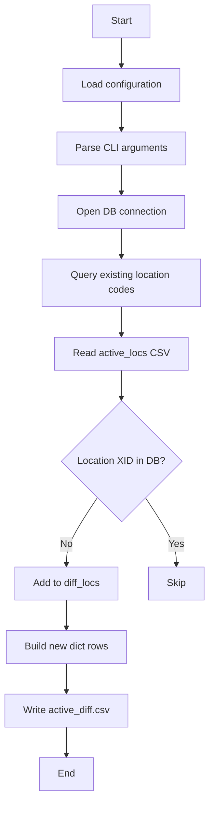

# Diagram: common/location_service/scripts/gm_location_scripts/get_difference_gm_locs.py


> Auto-generated by Obscura crawlers

## Diagram 1



### SVG

<svg id="container" width="345.3359375" xmlns="http://www.w3.org/2000/svg" class="flowchart" height="1297.453125" viewBox="0 0 345.3359375 1297.453125" role="graphics-document document" aria-roledescription="flowchart-v2"><style>#container{font-family:"trebuchet ms",verdana,arial,sans-serif;font-size:16px;fill:#333;}@keyframes edge-animation-frame{from{stroke-dashoffset:0;}}@keyframes dash{to{stroke-dashoffset:0;}}#container .edge-animation-slow{stroke-dasharray:9,5!important;stroke-dashoffset:900;animation:dash 50s linear infinite;stroke-linecap:round;}#container .edge-animation-fast{stroke-dasharray:9,5!important;stroke-dashoffset:900;animation:dash 20s linear infinite;stroke-linecap:round;}#container .error-icon{fill:#552222;}#container .error-text{fill:#552222;stroke:#552222;}#container .edge-thickness-normal{stroke-width:1px;}#container .edge-thickness-thick{stroke-width:3.5px;}#container .edge-pattern-solid{stroke-dasharray:0;}#container .edge-thickness-invisible{stroke-width:0;fill:none;}#container .edge-pattern-dashed{stroke-dasharray:3;}#container .edge-pattern-dotted{stroke-dasharray:2;}#container .marker{fill:#333333;stroke:#333333;}#container .marker.cross{stroke:#333333;}#container svg{font-family:"trebuchet ms",verdana,arial,sans-serif;font-size:16px;}#container p{margin:0;}#container .label{font-family:"trebuchet ms",verdana,arial,sans-serif;color:#333;}#container .cluster-label text{fill:#333;}#container .cluster-label span{color:#333;}#container .cluster-label span p{background-color:transparent;}#container .label text,#container span{fill:#333;color:#333;}#container .node rect,#container .node circle,#container .node ellipse,#container .node polygon,#container .node path{fill:#ECECFF;stroke:#9370DB;stroke-width:1px;}#container .rough-node .label text,#container .node .label text,#container .image-shape .label,#container .icon-shape .label{text-anchor:middle;}#container .node .katex path{fill:#000;stroke:#000;stroke-width:1px;}#container .rough-node .label,#container .node .label,#container .image-shape .label,#container .icon-shape .label{text-align:center;}#container .node.clickable{cursor:pointer;}#container .root .anchor path{fill:#333333!important;stroke-width:0;stroke:#333333;}#container .arrowheadPath{fill:#333333;}#container .edgePath .path{stroke:#333333;stroke-width:2.0px;}#container .flowchart-link{stroke:#333333;fill:none;}#container .edgeLabel{background-color:rgba(232,232,232, 0.8);text-align:center;}#container .edgeLabel p{background-color:rgba(232,232,232, 0.8);}#container .edgeLabel rect{opacity:0.5;background-color:rgba(232,232,232, 0.8);fill:rgba(232,232,232, 0.8);}#container .labelBkg{background-color:rgba(232, 232, 232, 0.5);}#container .cluster rect{fill:#ffffde;stroke:#aaaa33;stroke-width:1px;}#container .cluster text{fill:#333;}#container .cluster span{color:#333;}#container div.mermaidTooltip{position:absolute;text-align:center;max-width:200px;padding:2px;font-family:"trebuchet ms",verdana,arial,sans-serif;font-size:12px;background:hsl(80, 100%, 96.2745098039%);border:1px solid #aaaa33;border-radius:2px;pointer-events:none;z-index:100;}#container .flowchartTitleText{text-anchor:middle;font-size:18px;fill:#333;}#container rect.text{fill:none;stroke-width:0;}#container .icon-shape,#container .image-shape{background-color:rgba(232,232,232, 0.8);text-align:center;}#container .icon-shape p,#container .image-shape p{background-color:rgba(232,232,232, 0.8);padding:2px;}#container .icon-shape rect,#container .image-shape rect{opacity:0.5;background-color:rgba(232,232,232, 0.8);fill:rgba(232,232,232, 0.8);}#container .label-icon{display:inline-block;height:1em;overflow:visible;vertical-align:-0.125em;}#container .node .label-icon path{fill:currentColor;stroke:revert;stroke-width:revert;}#container :root{--mermaid-font-family:"trebuchet ms",verdana,arial,sans-serif;}</style><g><marker id="container_flowchart-v2-pointEnd" class="marker flowchart-v2" viewBox="0 0 10 10" refX="5" refY="5" markerUnits="userSpaceOnUse" markerWidth="8" markerHeight="8" orient="auto"><path d="M 0 0 L 10 5 L 0 10 z" class="arrowMarkerPath" style="stroke-width: 1; stroke-dasharray: 1, 0;"></path></marker><marker id="container_flowchart-v2-pointStart" class="marker flowchart-v2" viewBox="0 0 10 10" refX="4.5" refY="5" markerUnits="userSpaceOnUse" markerWidth="8" markerHeight="8" orient="auto"><path d="M 0 5 L 10 10 L 10 0 z" class="arrowMarkerPath" style="stroke-width: 1; stroke-dasharray: 1, 0;"></path></marker><marker id="container_flowchart-v2-circleEnd" class="marker flowchart-v2" viewBox="0 0 10 10" refX="11" refY="5" markerUnits="userSpaceOnUse" markerWidth="11" markerHeight="11" orient="auto"><circle cx="5" cy="5" r="5" class="arrowMarkerPath" style="stroke-width: 1; stroke-dasharray: 1, 0;"></circle></marker><marker id="container_flowchart-v2-circleStart" class="marker flowchart-v2" viewBox="0 0 10 10" refX="-1" refY="5" markerUnits="userSpaceOnUse" markerWidth="11" markerHeight="11" orient="auto"><circle cx="5" cy="5" r="5" class="arrowMarkerPath" style="stroke-width: 1; stroke-dasharray: 1, 0;"></circle></marker><marker id="container_flowchart-v2-crossEnd" class="marker cross flowchart-v2" viewBox="0 0 11 11" refX="12" refY="5.2" markerUnits="userSpaceOnUse" markerWidth="11" markerHeight="11" orient="auto"><path d="M 1,1 l 9,9 M 10,1 l -9,9" class="arrowMarkerPath" style="stroke-width: 2; stroke-dasharray: 1, 0;"></path></marker><marker id="container_flowchart-v2-crossStart" class="marker cross flowchart-v2" viewBox="0 0 11 11" refX="-1" refY="5.2" markerUnits="userSpaceOnUse" markerWidth="11" markerHeight="11" orient="auto"><path d="M 1,1 l 9,9 M 10,1 l -9,9" class="arrowMarkerPath" style="stroke-width: 2; stroke-dasharray: 1, 0;"></path></marker><g class="root"><g class="clusters"></g><g class="edgePaths"><path d="M200.828,62L200.828,66.167C200.828,70.333,200.828,78.667,200.828,86.333C200.828,94,200.828,101,200.828,104.5L200.828,108" id="L_A_B_0" class="edge-thickness-normal edge-pattern-solid edge-thickness-normal edge-pattern-solid flowchart-link" style=";" data-edge="true" data-et="edge" data-id="L_A_B_0" data-points="W3sieCI6MjAwLjgyODEyNSwieSI6NjJ9LHsieCI6MjAwLjgyODEyNSwieSI6ODd9LHsieCI6MjAwLjgyODEyNSwieSI6MTEyfV0=" marker-end="url(#container_flowchart-v2-pointEnd)"></path><path d="M200.828,166L200.828,170.167C200.828,174.333,200.828,182.667,200.828,190.333C200.828,198,200.828,205,200.828,208.5L200.828,212" id="L_B_C_0" class="edge-thickness-normal edge-pattern-solid edge-thickness-normal edge-pattern-solid flowchart-link" style=";" data-edge="true" data-et="edge" data-id="L_B_C_0" data-points="W3sieCI6MjAwLjgyODEyNSwieSI6MTY2fSx7IngiOjIwMC44MjgxMjUsInkiOjE5MX0seyJ4IjoyMDAuODI4MTI1LCJ5IjoyMTZ9XQ==" marker-end="url(#container_flowchart-v2-pointEnd)"></path><path d="M200.828,270L200.828,274.167C200.828,278.333,200.828,286.667,200.828,294.333C200.828,302,200.828,309,200.828,312.5L200.828,316" id="L_C_D_0" class="edge-thickness-normal edge-pattern-solid edge-thickness-normal edge-pattern-solid flowchart-link" style=";" data-edge="true" data-et="edge" data-id="L_C_D_0" data-points="W3sieCI6MjAwLjgyODEyNSwieSI6MjcwfSx7IngiOjIwMC44MjgxMjUsInkiOjI5NX0seyJ4IjoyMDAuODI4MTI1LCJ5IjozMjB9XQ==" marker-end="url(#container_flowchart-v2-pointEnd)"></path><path d="M200.828,374L200.828,378.167C200.828,382.333,200.828,390.667,200.828,398.333C200.828,406,200.828,413,200.828,416.5L200.828,420" id="L_D_E_0" class="edge-thickness-normal edge-pattern-solid edge-thickness-normal edge-pattern-solid flowchart-link" style=";" data-edge="true" data-et="edge" data-id="L_D_E_0" data-points="W3sieCI6MjAwLjgyODEyNSwieSI6Mzc0fSx7IngiOjIwMC44MjgxMjUsInkiOjM5OX0seyJ4IjoyMDAuODI4MTI1LCJ5Ijo0MjR9XQ==" marker-end="url(#container_flowchart-v2-pointEnd)"></path><path d="M200.828,502L200.828,506.167C200.828,510.333,200.828,518.667,200.828,526.333C200.828,534,200.828,541,200.828,544.5L200.828,548" id="L_E_F_0" class="edge-thickness-normal edge-pattern-solid edge-thickness-normal edge-pattern-solid flowchart-link" style=";" data-edge="true" data-et="edge" data-id="L_E_F_0" data-points="W3sieCI6MjAwLjgyODEyNSwieSI6NTAyfSx7IngiOjIwMC44MjgxMjUsInkiOjUyN30seyJ4IjoyMDAuODI4MTI1LCJ5Ijo1NTJ9XQ==" marker-end="url(#container_flowchart-v2-pointEnd)"></path><path d="M200.828,606L200.828,610.167C200.828,614.333,200.828,622.667,200.828,630.333C200.828,638,200.828,645,200.828,648.5L200.828,652" id="L_F_G_0" class="edge-thickness-normal edge-pattern-solid edge-thickness-normal edge-pattern-solid flowchart-link" style=";" data-edge="true" data-et="edge" data-id="L_F_G_0" data-points="W3sieCI6MjAwLjgyODEyNSwieSI6NjA2fSx7IngiOjIwMC44MjgxMjUsInkiOjYzMX0seyJ4IjoyMDAuODI4MTI1LCJ5Ijo2NTZ9XQ==" marker-end="url(#container_flowchart-v2-pointEnd)"></path><path d="M161.65,810.275L153.007,822.971C144.363,835.668,127.076,861.06,118.433,879.257C109.789,897.453,109.789,908.453,109.789,913.953L109.789,919.453" id="L_G_H_0" class="edge-thickness-normal edge-pattern-solid edge-thickness-normal edge-pattern-solid flowchart-link" style=";" data-edge="true" data-et="edge" data-id="L_G_H_0" data-points="W3sieCI6MTYxLjY1MDAwMDgxNDY1MDY3LCJ5Ijo4MTAuMjc1MDAwODE0NjUwNn0seyJ4IjoxMDkuNzg5MDYyNSwieSI6ODg2LjQ1MzEyNX0seyJ4IjoxMDkuNzg5MDYyNSwieSI6OTIzLjQ1MzEyNX1d" marker-end="url(#container_flowchart-v2-pointEnd)"></path><path d="M240.006,810.275L248.65,822.971C257.293,835.668,274.58,861.06,283.224,879.257C291.867,897.453,291.867,908.453,291.867,913.953L291.867,919.453" id="L_G_I_0" class="edge-thickness-normal edge-pattern-solid edge-thickness-normal edge-pattern-solid flowchart-link" style=";" data-edge="true" data-et="edge" data-id="L_G_I_0" data-points="W3sieCI6MjQwLjAwNjI0OTE4NTM0OTMzLCJ5Ijo4MTAuMjc1MDAwODE0NjUwNn0seyJ4IjoyOTEuODY3MTg3NSwieSI6ODg2LjQ1MzEyNX0seyJ4IjoyOTEuODY3MTg3NSwieSI6OTIzLjQ1MzEyNX1d" marker-end="url(#container_flowchart-v2-pointEnd)"></path><path d="M109.789,977.453L109.789,981.62C109.789,985.786,109.789,994.12,109.789,1001.786C109.789,1009.453,109.789,1016.453,109.789,1019.953L109.789,1023.453" id="L_H_J_0" class="edge-thickness-normal edge-pattern-solid edge-thickness-normal edge-pattern-solid flowchart-link" style=";" data-edge="true" data-et="edge" data-id="L_H_J_0" data-points="W3sieCI6MTA5Ljc4OTA2MjUsInkiOjk3Ny40NTMxMjV9LHsieCI6MTA5Ljc4OTA2MjUsInkiOjEwMDIuNDUzMTI1fSx7IngiOjEwOS43ODkwNjI1LCJ5IjoxMDI3LjQ1MzEyNX1d" marker-end="url(#container_flowchart-v2-pointEnd)"></path><path d="M109.789,1081.453L109.789,1085.62C109.789,1089.786,109.789,1098.12,109.789,1105.786C109.789,1113.453,109.789,1120.453,109.789,1123.953L109.789,1127.453" id="L_J_K_0" class="edge-thickness-normal edge-pattern-solid edge-thickness-normal edge-pattern-solid flowchart-link" style=";" data-edge="true" data-et="edge" data-id="L_J_K_0" data-points="W3sieCI6MTA5Ljc4OTA2MjUsInkiOjEwODEuNDUzMTI1fSx7IngiOjEwOS43ODkwNjI1LCJ5IjoxMTA2LjQ1MzEyNX0seyJ4IjoxMDkuNzg5MDYyNSwieSI6MTEzMS40NTMxMjV9XQ==" marker-end="url(#container_flowchart-v2-pointEnd)"></path><path d="M109.789,1185.453L109.789,1189.62C109.789,1193.786,109.789,1202.12,109.789,1209.786C109.789,1217.453,109.789,1224.453,109.789,1227.953L109.789,1231.453" id="L_K_L_0" class="edge-thickness-normal edge-pattern-solid edge-thickness-normal edge-pattern-solid flowchart-link" style=";" data-edge="true" data-et="edge" data-id="L_K_L_0" data-points="W3sieCI6MTA5Ljc4OTA2MjUsInkiOjExODUuNDUzMTI1fSx7IngiOjEwOS43ODkwNjI1LCJ5IjoxMjEwLjQ1MzEyNX0seyJ4IjoxMDkuNzg5MDYyNSwieSI6MTIzNS40NTMxMjV9XQ==" marker-end="url(#container_flowchart-v2-pointEnd)"></path></g><g class="edgeLabels"><g class="edgeLabel"><g class="label" data-id="L_A_B_0" transform="translate(0, 0)"><foreignObject width="0" height="0"><div xmlns="http://www.w3.org/1999/xhtml" class="labelBkg" style="display: table-cell; white-space: nowrap; line-height: 1.5; max-width: 200px; text-align: center;"><span class="edgeLabel"></span></div></foreignObject></g></g><g class="edgeLabel"><g class="label" data-id="L_B_C_0" transform="translate(0, 0)"><foreignObject width="0" height="0"><div xmlns="http://www.w3.org/1999/xhtml" class="labelBkg" style="display: table-cell; white-space: nowrap; line-height: 1.5; max-width: 200px; text-align: center;"><span class="edgeLabel"></span></div></foreignObject></g></g><g class="edgeLabel"><g class="label" data-id="L_C_D_0" transform="translate(0, 0)"><foreignObject width="0" height="0"><div xmlns="http://www.w3.org/1999/xhtml" class="labelBkg" style="display: table-cell; white-space: nowrap; line-height: 1.5; max-width: 200px; text-align: center;"><span class="edgeLabel"></span></div></foreignObject></g></g><g class="edgeLabel"><g class="label" data-id="L_D_E_0" transform="translate(0, 0)"><foreignObject width="0" height="0"><div xmlns="http://www.w3.org/1999/xhtml" class="labelBkg" style="display: table-cell; white-space: nowrap; line-height: 1.5; max-width: 200px; text-align: center;"><span class="edgeLabel"></span></div></foreignObject></g></g><g class="edgeLabel"><g class="label" data-id="L_E_F_0" transform="translate(0, 0)"><foreignObject width="0" height="0"><div xmlns="http://www.w3.org/1999/xhtml" class="labelBkg" style="display: table-cell; white-space: nowrap; line-height: 1.5; max-width: 200px; text-align: center;"><span class="edgeLabel"></span></div></foreignObject></g></g><g class="edgeLabel"><g class="label" data-id="L_F_G_0" transform="translate(0, 0)"><foreignObject width="0" height="0"><div xmlns="http://www.w3.org/1999/xhtml" class="labelBkg" style="display: table-cell; white-space: nowrap; line-height: 1.5; max-width: 200px; text-align: center;"><span class="edgeLabel"></span></div></foreignObject></g></g><g class="edgeLabel" transform="translate(109.7890625, 886.453125)"><g class="label" data-id="L_G_H_0" transform="translate(-10.140625, -12)"><foreignObject width="20.28125" height="24"><div xmlns="http://www.w3.org/1999/xhtml" class="labelBkg" style="display: table-cell; white-space: nowrap; line-height: 1.5; max-width: 200px; text-align: center;"><span class="edgeLabel"><p>No</p></span></div></foreignObject></g></g><g class="edgeLabel" transform="translate(291.8671875, 886.453125)"><g class="label" data-id="L_G_I_0" transform="translate(-12.03125, -12)"><foreignObject width="24.0625" height="24"><div xmlns="http://www.w3.org/1999/xhtml" class="labelBkg" style="display: table-cell; white-space: nowrap; line-height: 1.5; max-width: 200px; text-align: center;"><span class="edgeLabel"><p>Yes</p></span></div></foreignObject></g></g><g class="edgeLabel"><g class="label" data-id="L_H_J_0" transform="translate(0, 0)"><foreignObject width="0" height="0"><div xmlns="http://www.w3.org/1999/xhtml" class="labelBkg" style="display: table-cell; white-space: nowrap; line-height: 1.5; max-width: 200px; text-align: center;"><span class="edgeLabel"></span></div></foreignObject></g></g><g class="edgeLabel"><g class="label" data-id="L_J_K_0" transform="translate(0, 0)"><foreignObject width="0" height="0"><div xmlns="http://www.w3.org/1999/xhtml" class="labelBkg" style="display: table-cell; white-space: nowrap; line-height: 1.5; max-width: 200px; text-align: center;"><span class="edgeLabel"></span></div></foreignObject></g></g><g class="edgeLabel"><g class="label" data-id="L_K_L_0" transform="translate(0, 0)"><foreignObject width="0" height="0"><div xmlns="http://www.w3.org/1999/xhtml" class="labelBkg" style="display: table-cell; white-space: nowrap; line-height: 1.5; max-width: 200px; text-align: center;"><span class="edgeLabel"></span></div></foreignObject></g></g></g><g class="nodes"><g class="node default" id="flowchart-A-0" transform="translate(200.828125, 35)"><rect class="basic label-container" style="" x="-47.5234375" y="-27" width="95.046875" height="54"></rect><g class="label" style="" transform="translate(-17.5234375, -12)"><rect></rect><foreignObject width="35.046875" height="24"><div xmlns="http://www.w3.org/1999/xhtml" style="display: table-cell; white-space: nowrap; line-height: 1.5; max-width: 200px; text-align: center;"><span class="nodeLabel"><p>Start</p></span></div></foreignObject></g></g><g class="node default" id="flowchart-B-1" transform="translate(200.828125, 139)"><rect class="basic label-container" style="" x="-97.65625" y="-27" width="195.3125" height="54"></rect><g class="label" style="" transform="translate(-67.65625, -12)"><rect></rect><foreignObject width="135.3125" height="24"><div xmlns="http://www.w3.org/1999/xhtml" style="display: table-cell; white-space: nowrap; line-height: 1.5; max-width: 200px; text-align: center;"><span class="nodeLabel"><p>Load configuration</p></span></div></foreignObject></g></g><g class="node default" id="flowchart-C-3" transform="translate(200.828125, 243)"><rect class="basic label-container" style="" x="-103.2734375" y="-27" width="206.546875" height="54"></rect><g class="label" style="" transform="translate(-73.2734375, -12)"><rect></rect><foreignObject width="146.546875" height="24"><div xmlns="http://www.w3.org/1999/xhtml" style="display: table-cell; white-space: nowrap; line-height: 1.5; max-width: 200px; text-align: center;"><span class="nodeLabel"><p>Parse CLI arguments</p></span></div></foreignObject></g></g><g class="node default" id="flowchart-D-5" transform="translate(200.828125, 347)"><rect class="basic label-container" style="" x="-103.9921875" y="-27" width="207.984375" height="54"></rect><g class="label" style="" transform="translate(-73.9921875, -12)"><rect></rect><foreignObject width="147.984375" height="24"><div xmlns="http://www.w3.org/1999/xhtml" style="display: table-cell; white-space: nowrap; line-height: 1.5; max-width: 200px; text-align: center;"><span class="nodeLabel"><p>Open DB connection</p></span></div></foreignObject></g></g><g class="node default" id="flowchart-E-7" transform="translate(200.828125, 463)"><rect class="basic label-container" style="" x="-130" y="-39" width="260" height="78"></rect><g class="label" style="" transform="translate(-100, -24)"><rect></rect><foreignObject width="200" height="48"><div xmlns="http://www.w3.org/1999/xhtml" style="display: table; white-space: break-spaces; line-height: 1.5; max-width: 200px; text-align: center; width: 200px;"><span class="nodeLabel"><p>Query existing location codes</p></span></div></foreignObject></g></g><g class="node default" id="flowchart-F-9" transform="translate(200.828125, 579)"><rect class="basic label-container" style="" x="-105.46875" y="-27" width="210.9375" height="54"></rect><g class="label" style="" transform="translate(-75.46875, -12)"><rect></rect><foreignObject width="150.9375" height="24"><div xmlns="http://www.w3.org/1999/xhtml" style="display: table-cell; white-space: nowrap; line-height: 1.5; max-width: 200px; text-align: center;"><span class="nodeLabel"><p>Read active_locs CSV</p></span></div></foreignObject></g></g><g class="node default" id="flowchart-G-11" transform="translate(200.828125, 752.7265625)"><polygon points="96.7265625,0 193.453125,-96.7265625 96.7265625,-193.453125 0,-96.7265625" class="label-container" transform="translate(-96.2265625, 96.7265625)"></polygon><g class="label" style="" transform="translate(-69.7265625, -12)"><rect></rect><foreignObject width="139.453125" height="24"><div xmlns="http://www.w3.org/1999/xhtml" style="display: table-cell; white-space: nowrap; line-height: 1.5; max-width: 200px; text-align: center;"><span class="nodeLabel"><p>Location XID in DB?</p></span></div></foreignObject></g></g><g class="node default" id="flowchart-H-13" transform="translate(109.7890625, 950.453125)"><rect class="basic label-container" style="" x="-86.609375" y="-27" width="173.21875" height="54"></rect><g class="label" style="" transform="translate(-56.609375, -12)"><rect></rect><foreignObject width="113.21875" height="24"><div xmlns="http://www.w3.org/1999/xhtml" style="display: table-cell; white-space: nowrap; line-height: 1.5; max-width: 200px; text-align: center;"><span class="nodeLabel"><p>Add to diff_locs</p></span></div></foreignObject></g></g><g class="node default" id="flowchart-I-15" transform="translate(291.8671875, 950.453125)"><rect class="basic label-container" style="" x="-45.46875" y="-27" width="90.9375" height="54"></rect><g class="label" style="" transform="translate(-15.46875, -12)"><rect></rect><foreignObject width="30.9375" height="24"><div xmlns="http://www.w3.org/1999/xhtml" style="display: table-cell; white-space: nowrap; line-height: 1.5; max-width: 200px; text-align: center;"><span class="nodeLabel"><p>Skip</p></span></div></foreignObject></g></g><g class="node default" id="flowchart-J-17" transform="translate(109.7890625, 1054.453125)"><rect class="basic label-container" style="" x="-100.7578125" y="-27" width="201.515625" height="54"></rect><g class="label" style="" transform="translate(-70.7578125, -12)"><rect></rect><foreignObject width="141.515625" height="24"><div xmlns="http://www.w3.org/1999/xhtml" style="display: table-cell; white-space: nowrap; line-height: 1.5; max-width: 200px; text-align: center;"><span class="nodeLabel"><p>Build new dict rows</p></span></div></foreignObject></g></g><g class="node default" id="flowchart-K-19" transform="translate(109.7890625, 1158.453125)"><rect class="basic label-container" style="" x="-101.7890625" y="-27" width="203.578125" height="54"></rect><g class="label" style="" transform="translate(-71.7890625, -12)"><rect></rect><foreignObject width="143.578125" height="24"><div xmlns="http://www.w3.org/1999/xhtml" style="display: table-cell; white-space: nowrap; line-height: 1.5; max-width: 200px; text-align: center;"><span class="nodeLabel"><p>Write active_diff.csv</p></span></div></foreignObject></g></g><g class="node default" id="flowchart-L-21" transform="translate(109.7890625, 1262.453125)"><rect class="basic label-container" style="" x="-43.6796875" y="-27" width="87.359375" height="54"></rect><g class="label" style="" transform="translate(-13.6796875, -12)"><rect></rect><foreignObject width="27.359375" height="24"><div xmlns="http://www.w3.org/1999/xhtml" style="display: table-cell; white-space: nowrap; line-height: 1.5; max-width: 200px; text-align: center;"><span class="nodeLabel"><p>End</p></span></div></foreignObject></g></g></g></g></g></svg>

## Diagram 2

```mermaid
classDiagram
    class Module {
        +get_configuration()
        +parse_arguments()
        +write_csv(filename, headers, rows)
        +build_new_dict(rows)
    }
    class Secrets {
        +get_secret(name)
    }
    class DB {
        +get_connection(config, DB_APP_NAME)
        +get_cursor(conn)
    }
    Module --> Secrets : uses
    Module --> DB : uses
    Module : SECRETS : Secrets
    Module : DB_APP_NAME : str
```

> SVG rendering failed for this diagram.
