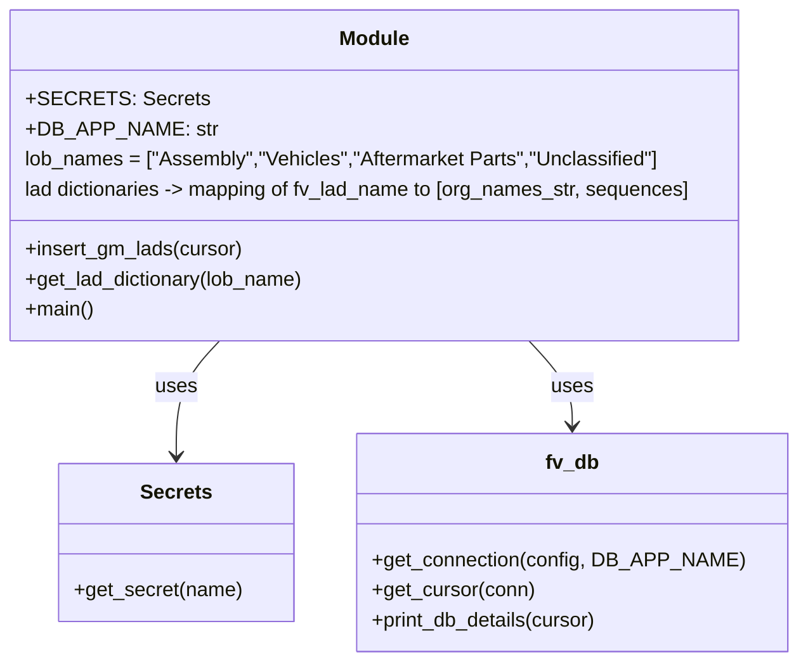

# Diagram: common/location_service/scripts/gm_location_scripts/insert_gm_organization_lads.py


> Auto-generated by Obscura crawlers

## Diagram 1

```mermaid
flowchart LR
    Start([Start])
    A[Get DB config from SECRETS.get_secret]
    B[fv.db.get_connection(config, DB_APP_NAME)]
    C[fv.db.get_cursor(conn)]
    D[print \"Inserting GM's organization LADs\" and fv.db.print_db_details(cursor)]
    E[insert_gm_lads(cursor)]
    E --> E1[SET search_path = location, public]
    E1 --> E2[SELECT id FROM organizations where fv_id='GMHQ' -> gm_org_id]
    E2 --> LoopLobs{for name in lob_names}
    LoopLobs --> L1[SELECT id FROM lob where name=lob_name -> lob_id]
    L1 --> LD[get_lad_dictionary(name)]
    LD --> LoopLads{for fv_lad_name in lad_dictionary}
    LoopLads --> Q1[SELECT id FROM lad where name=fv_lad_name and lob_id=lob_id -> lad_id]
    Q1 --> BuildOrgLads[split org_lad_name_arr and zip with sequence -> org_lad_with_seq]
    BuildOrgLads --> LoopOrgLads{for org_lad_name, seq in org_lad_with_seq}
    LoopOrgLads --> Q2[SELECT name,id FROM organization_lad where lad_id and organization_id and name]
    Q2 --> Cond{org_lad is None?}
    Cond -- yes --> Insert[INSERT INTO organization_lad (lad_id, name, organization_id, sequence)]
    Cond -- no --> Skip[Skip insert]
    Insert --> LoopOrgLads
    Skip --> LoopOrgLads
    LoopOrgLads --> LoopLads
    LoopLads --> LoopLobs
    LoopLobs --> End([End])
    Start --> A --> B --> C --> D --> E
```

> SVG rendering failed for this diagram.

## Diagram 2



### SVG

<svg id="container" width="629.91796875" xmlns="http://www.w3.org/2000/svg" class="classDiagram" height="528" viewBox="0 0 629.91796875 528" role="graphics-document document" aria-roledescription="class"><style>#container{font-family:"trebuchet ms",verdana,arial,sans-serif;font-size:16px;fill:#333;}@keyframes edge-animation-frame{from{stroke-dashoffset:0;}}@keyframes dash{to{stroke-dashoffset:0;}}#container .edge-animation-slow{stroke-dasharray:9,5!important;stroke-dashoffset:900;animation:dash 50s linear infinite;stroke-linecap:round;}#container .edge-animation-fast{stroke-dasharray:9,5!important;stroke-dashoffset:900;animation:dash 20s linear infinite;stroke-linecap:round;}#container .error-icon{fill:#552222;}#container .error-text{fill:#552222;stroke:#552222;}#container .edge-thickness-normal{stroke-width:1px;}#container .edge-thickness-thick{stroke-width:3.5px;}#container .edge-pattern-solid{stroke-dasharray:0;}#container .edge-thickness-invisible{stroke-width:0;fill:none;}#container .edge-pattern-dashed{stroke-dasharray:3;}#container .edge-pattern-dotted{stroke-dasharray:2;}#container .marker{fill:#333333;stroke:#333333;}#container .marker.cross{stroke:#333333;}#container svg{font-family:"trebuchet ms",verdana,arial,sans-serif;font-size:16px;}#container p{margin:0;}#container g.classGroup text{fill:#9370DB;stroke:none;font-family:"trebuchet ms",verdana,arial,sans-serif;font-size:10px;}#container g.classGroup text .title{font-weight:bolder;}#container .nodeLabel,#container .edgeLabel{color:#131300;}#container .edgeLabel .label rect{fill:#ECECFF;}#container .label text{fill:#131300;}#container .labelBkg{background:#ECECFF;}#container .edgeLabel .label span{background:#ECECFF;}#container .classTitle{font-weight:bolder;}#container .node rect,#container .node circle,#container .node ellipse,#container .node polygon,#container .node path{fill:#ECECFF;stroke:#9370DB;stroke-width:1px;}#container .divider{stroke:#9370DB;stroke-width:1;}#container g.clickable{cursor:pointer;}#container g.classGroup rect{fill:#ECECFF;stroke:#9370DB;}#container g.classGroup line{stroke:#9370DB;stroke-width:1;}#container .classLabel .box{stroke:none;stroke-width:0;fill:#ECECFF;opacity:0.5;}#container .classLabel .label{fill:#9370DB;font-size:10px;}#container .relation{stroke:#333333;stroke-width:1;fill:none;}#container .dashed-line{stroke-dasharray:3;}#container .dotted-line{stroke-dasharray:1 2;}#container #compositionStart,#container .composition{fill:#333333!important;stroke:#333333!important;stroke-width:1;}#container #compositionEnd,#container .composition{fill:#333333!important;stroke:#333333!important;stroke-width:1;}#container #dependencyStart,#container .dependency{fill:#333333!important;stroke:#333333!important;stroke-width:1;}#container #dependencyStart,#container .dependency{fill:#333333!important;stroke:#333333!important;stroke-width:1;}#container #extensionStart,#container .extension{fill:transparent!important;stroke:#333333!important;stroke-width:1;}#container #extensionEnd,#container .extension{fill:transparent!important;stroke:#333333!important;stroke-width:1;}#container #aggregationStart,#container .aggregation{fill:transparent!important;stroke:#333333!important;stroke-width:1;}#container #aggregationEnd,#container .aggregation{fill:transparent!important;stroke:#333333!important;stroke-width:1;}#container #lollipopStart,#container .lollipop{fill:#ECECFF!important;stroke:#333333!important;stroke-width:1;}#container #lollipopEnd,#container .lollipop{fill:#ECECFF!important;stroke:#333333!important;stroke-width:1;}#container .edgeTerminals{font-size:11px;line-height:initial;}#container .classTitleText{text-anchor:middle;font-size:18px;fill:#333;}#container .label-icon{display:inline-block;height:1em;overflow:visible;vertical-align:-0.125em;}#container .node .label-icon path{fill:currentColor;stroke:revert;stroke-width:revert;}#container :root{--mermaid-font-family:"trebuchet ms",verdana,arial,sans-serif;}</style><g><defs><marker id="container_class-aggregationStart" class="marker aggregation class" refX="18" refY="7" markerWidth="190" markerHeight="240" orient="auto"><path d="M 18,7 L9,13 L1,7 L9,1 Z"></path></marker></defs><defs><marker id="container_class-aggregationEnd" class="marker aggregation class" refX="1" refY="7" markerWidth="20" markerHeight="28" orient="auto"><path d="M 18,7 L9,13 L1,7 L9,1 Z"></path></marker></defs><defs><marker id="container_class-extensionStart" class="marker extension class" refX="18" refY="7" markerWidth="190" markerHeight="240" orient="auto"><path d="M 1,7 L18,13 V 1 Z"></path></marker></defs><defs><marker id="container_class-extensionEnd" class="marker extension class" refX="1" refY="7" markerWidth="20" markerHeight="28" orient="auto"><path d="M 1,1 V 13 L18,7 Z"></path></marker></defs><defs><marker id="container_class-compositionStart" class="marker composition class" refX="18" refY="7" markerWidth="190" markerHeight="240" orient="auto"><path d="M 18,7 L9,13 L1,7 L9,1 Z"></path></marker></defs><defs><marker id="container_class-compositionEnd" class="marker composition class" refX="1" refY="7" markerWidth="20" markerHeight="28" orient="auto"><path d="M 18,7 L9,13 L1,7 L9,1 Z"></path></marker></defs><defs><marker id="container_class-dependencyStart" class="marker dependency class" refX="6" refY="7" markerWidth="190" markerHeight="240" orient="auto"><path d="M 5,7 L9,13 L1,7 L9,1 Z"></path></marker></defs><defs><marker id="container_class-dependencyEnd" class="marker dependency class" refX="13" refY="7" markerWidth="20" markerHeight="28" orient="auto"><path d="M 18,7 L9,13 L14,7 L9,1 Z"></path></marker></defs><defs><marker id="container_class-lollipopStart" class="marker lollipop class" refX="13" refY="7" markerWidth="190" markerHeight="240" orient="auto"><circle stroke="black" fill="transparent" cx="7" cy="7" r="6"></circle></marker></defs><defs><marker id="container_class-lollipopEnd" class="marker lollipop class" refX="1" refY="7" markerWidth="190" markerHeight="240" orient="auto"><circle stroke="black" fill="transparent" cx="7" cy="7" r="6"></circle></marker></defs><g class="root"><g class="clusters"></g><g class="edgePaths"><path d="M183.79,272L178.187,278.167C172.584,284.333,161.378,296.667,155.775,312C150.172,327.333,150.172,345.667,150.172,354.833L150.172,364" id="id_Module_Secrets_1" class="edge-thickness-normal edge-pattern-solid relation" style=";;;" data-edge="true" data-et="edge" data-id="id_Module_Secrets_1" data-points="W3sieCI6MTgzLjc5MDM1Njg3ODY5ODIyLCJ5IjoyNzJ9LHsieCI6MTUwLjE3MTg3NSwieSI6MzA5fSx7IngiOjE1MC4xNzE4NzUsInkiOjM3MH1d" marker-end="url(#container_class-dependencyEnd)"></path><path d="M423.663,272L429.266,278.167C434.869,284.333,446.075,296.667,451.678,308C457.281,319.333,457.281,329.667,457.281,334.833L457.281,340" id="id_Module_fv_db_2" class="edge-thickness-normal edge-pattern-solid relation" style=";;;" data-edge="true" data-et="edge" data-id="id_Module_fv_db_2" data-points="W3sieCI6NDIzLjY2Mjc2ODEyMTMwMTgsInkiOjI3Mn0seyJ4Ijo0NTcuMjgxMjUsInkiOjMwOX0seyJ4Ijo0NTcuMjgxMjUsInkiOjM0Nn1d" marker-end="url(#container_class-dependencyEnd)"></path></g><g class="edgeLabels"><g class="edgeLabel" transform="translate(150.171875, 309)"><g class="label" data-id="id_Module_Secrets_1" transform="translate(-16.4921875, -12)"><foreignObject width="32.984375" height="24"><div xmlns="http://www.w3.org/1999/xhtml" class="labelBkg" style="display: table-cell; white-space: nowrap; line-height: 1.5; max-width: 200px; text-align: center;"><span class="edgeLabel"><p>uses</p></span></div></foreignObject></g></g><g class="edgeLabel" transform="translate(457.28125, 309)"><g class="label" data-id="id_Module_fv_db_2" transform="translate(-16.4921875, -12)"><foreignObject width="32.984375" height="24"><div xmlns="http://www.w3.org/1999/xhtml" class="labelBkg" style="display: table-cell; white-space: nowrap; line-height: 1.5; max-width: 200px; text-align: center;"><span class="edgeLabel"><p>uses</p></span></div></foreignObject></g></g></g><g class="nodes"><g class="node default" id="classId-Module-0" transform="translate(303.7265625, 140)"><g class="basic label-container"><path d="M-295.7265625 -132 L295.7265625 -132 L295.7265625 132 L-295.7265625 132" stroke="none" stroke-width="0" fill="#ECECFF" style=""></path><path d="M-295.7265625 -132 C-173.23881792861536 -132, -50.75107335723072 -132, 295.7265625 -132 M-295.7265625 -132 C-127.25497035303954 -132, 41.21662179392092 -132, 295.7265625 -132 M295.7265625 -132 C295.7265625 -60.87984513351769, 295.7265625 10.240309732964619, 295.7265625 132 M295.7265625 -132 C295.7265625 -75.61524498439668, 295.7265625 -19.230489968793364, 295.7265625 132 M295.7265625 132 C116.02975100698075 132, -63.66706048603851 132, -295.7265625 132 M295.7265625 132 C59.62101606791785 132, -176.4845303641643 132, -295.7265625 132 M-295.7265625 132 C-295.7265625 41.56290732978903, -295.7265625 -48.874185340421946, -295.7265625 -132 M-295.7265625 132 C-295.7265625 49.98706441343873, -295.7265625 -32.02587117312254, -295.7265625 -132" stroke="#9370DB" stroke-width="1.3" fill="none" stroke-dasharray="0 0" style=""></path></g><g class="annotation-group text" transform="translate(0, -108)"></g><g class="label-group text" transform="translate(-27.09375, -108)"><g class="label" style="font-weight: bolder" transform="translate(0,-12)"><foreignObject width="54.1875" height="24"><div xmlns="http://www.w3.org/1999/xhtml" style="display: table-cell; white-space: nowrap; line-height: 1.5; max-width: 104px; text-align: center;"><span class="nodeLabel markdown-node-label" style=""><p>Module</p></span></div></foreignObject></g></g><g class="members-group text" transform="translate(-283.7265625, -60)"><g class="label" style="" transform="translate(0,-12)"><foreignObject width="129.140625" height="24"><div xmlns="http://www.w3.org/1999/xhtml" style="display: table-cell; white-space: nowrap; line-height: 1.5; max-width: 187px; text-align: center;"><span class="nodeLabel markdown-node-label" style=""><p>+SECRETS: Secrets</p></span></div></foreignObject></g><g class="label" style="" transform="translate(0,12)"><foreignObject width="139.109375" height="24"><div xmlns="http://www.w3.org/1999/xhtml" style="display: table-cell; white-space: nowrap; line-height: 1.5; max-width: 197px; text-align: center;"><span class="nodeLabel markdown-node-label" style=""><p>+DB_APP_NAME: str</p></span></div></foreignObject></g><g class="label" style="" transform="translate(0,36)"><foreignObject width="500.53125" height="24"><div xmlns="http://www.w3.org/1999/xhtml" style="display: table-cell; white-space: nowrap; line-height: 1.5; max-width: 551px; text-align: center;"><span class="nodeLabel markdown-node-label" style=""><p>lob_names = ["Assembly","Vehicles","Aftermarket Parts","Unclassified"]</p></span></div></foreignObject></g><g class="label" style="" transform="translate(0,60)"><foreignObject width="540.359375" height="24"><div xmlns="http://www.w3.org/1999/xhtml" style="display: table-cell; white-space: nowrap; line-height: 1.5; max-width: 612px; text-align: center;"><span class="nodeLabel markdown-node-label" style=""><p>lad dictionaries -&gt; mapping of fv_lad_name to [org_names_str, sequences]</p></span></div></foreignObject></g></g><g class="methods-group text" transform="translate(-283.7265625, 60)"><g class="label" style="" transform="translate(0,-12)"><foreignObject width="175.125" height="24"><div xmlns="http://www.w3.org/1999/xhtml" style="display: table-cell; white-space: nowrap; line-height: 1.5; max-width: 232px; text-align: center;"><span class="nodeLabel markdown-node-label" style=""><p>+insert_gm_lads(cursor)</p></span></div></foreignObject></g><g class="label" style="" transform="translate(0,12)"><foreignObject width="225.421875" height="24"><div xmlns="http://www.w3.org/1999/xhtml" style="display: table-cell; white-space: nowrap; line-height: 1.5; max-width: 283px; text-align: center;"><span class="nodeLabel markdown-node-label" style=""><p>+get_lad_dictionary(lob_name)</p></span></div></foreignObject></g><g class="label" style="" transform="translate(0,36)"><foreignObject width="54.65625" height="24"><div xmlns="http://www.w3.org/1999/xhtml" style="display: table-cell; white-space: nowrap; line-height: 1.5; max-width: 112px; text-align: center;"><span class="nodeLabel markdown-node-label" style=""><p>+main()</p></span></div></foreignObject></g></g><g class="divider" style=""><path d="M-295.7265625 -84 C-115.73690785074288 -84, 64.25274679851424 -84, 295.7265625 -84 M-295.7265625 -84 C-162.6050309247878 -84, -29.483499349575595 -84, 295.7265625 -84" stroke="#9370DB" stroke-width="1.3" fill="none" stroke-dasharray="0 0" style=""></path></g><g class="divider" style=""><path d="M-295.7265625 36 C-114.69575826982395 36, 66.33504596035209 36, 295.7265625 36 M-295.7265625 36 C-148.7809981796049 36, -1.835433859209786 36, 295.7265625 36" stroke="#9370DB" stroke-width="1.3" fill="none" stroke-dasharray="0 0" style=""></path></g></g><g class="node default" id="classId-Secrets-1" transform="translate(150.171875, 433)"><g class="basic label-container"><path d="M-92.47265625 -63 L92.47265625 -63 L92.47265625 63 L-92.47265625 63" stroke="none" stroke-width="0" fill="#ECECFF" style=""></path><path d="M-92.47265625 -63 C-50.44015912176395 -63, -8.407661993527896 -63, 92.47265625 -63 M-92.47265625 -63 C-32.749680344390335 -63, 26.97329556121933 -63, 92.47265625 -63 M92.47265625 -63 C92.47265625 -14.93773731169999, 92.47265625 33.12452537660002, 92.47265625 63 M92.47265625 -63 C92.47265625 -35.44387187863555, 92.47265625 -7.887743757271089, 92.47265625 63 M92.47265625 63 C24.531623051120945 63, -43.40941014775811 63, -92.47265625 63 M92.47265625 63 C47.28337826880132 63, 2.094100287602643 63, -92.47265625 63 M-92.47265625 63 C-92.47265625 20.919138495528422, -92.47265625 -21.161723008943156, -92.47265625 -63 M-92.47265625 63 C-92.47265625 16.373333828564036, -92.47265625 -30.25333234287193, -92.47265625 -63" stroke="#9370DB" stroke-width="1.3" fill="none" stroke-dasharray="0 0" style=""></path></g><g class="annotation-group text" transform="translate(0, -39)"></g><g class="label-group text" transform="translate(-27.1640625, -39)"><g class="label" style="font-weight: bolder" transform="translate(0,-12)"><foreignObject width="54.328125" height="24"><div xmlns="http://www.w3.org/1999/xhtml" style="display: table-cell; white-space: nowrap; line-height: 1.5; max-width: 103px; text-align: center;"><span class="nodeLabel markdown-node-label" style=""><p>Secrets</p></span></div></foreignObject></g></g><g class="members-group text" transform="translate(-80.47265625, 9)"></g><g class="methods-group text" transform="translate(-80.47265625, 39)"><g class="label" style="" transform="translate(0,-12)"><foreignObject width="133.78125" height="24"><div xmlns="http://www.w3.org/1999/xhtml" style="display: table-cell; white-space: nowrap; line-height: 1.5; max-width: 191px; text-align: center;"><span class="nodeLabel markdown-node-label" style=""><p>+get_secret(name)</p></span></div></foreignObject></g></g><g class="divider" style=""><path d="M-92.47265625 -15 C-35.59984429965671 -15, 21.27296765068658 -15, 92.47265625 -15 M-92.47265625 -15 C-31.87391775137675 -15, 28.724820747246497 -15, 92.47265625 -15" stroke="#9370DB" stroke-width="1.3" fill="none" stroke-dasharray="0 0" style=""></path></g><g class="divider" style=""><path d="M-92.47265625 9 C-24.08464781152243 9, 44.30336062695514 9, 92.47265625 9 M-92.47265625 9 C-54.395101372514105 9, -16.31754649502821 9, 92.47265625 9" stroke="#9370DB" stroke-width="1.3" fill="none" stroke-dasharray="0 0" style=""></path></g></g><g class="node default" id="classId-fv_db-2" transform="translate(457.28125, 433)"><g class="basic label-container"><path d="M-164.63671875 -87 L164.63671875 -87 L164.63671875 87 L-164.63671875 87" stroke="none" stroke-width="0" fill="#ECECFF" style=""></path><path d="M-164.63671875 -87 C-68.8245417223384 -87, 26.98763530532321 -87, 164.63671875 -87 M-164.63671875 -87 C-37.29298240397979 -87, 90.05075394204042 -87, 164.63671875 -87 M164.63671875 -87 C164.63671875 -41.835738655832806, 164.63671875 3.328522688334388, 164.63671875 87 M164.63671875 -87 C164.63671875 -43.582297066847765, 164.63671875 -0.16459413369553033, 164.63671875 87 M164.63671875 87 C76.79713154865624 87, -11.042455652687522 87, -164.63671875 87 M164.63671875 87 C33.023736089280135 87, -98.58924657143973 87, -164.63671875 87 M-164.63671875 87 C-164.63671875 40.97663403085024, -164.63671875 -5.046731938299516, -164.63671875 -87 M-164.63671875 87 C-164.63671875 40.66758907402305, -164.63671875 -5.664821851953903, -164.63671875 -87" stroke="#9370DB" stroke-width="1.3" fill="none" stroke-dasharray="0 0" style=""></path></g><g class="annotation-group text" transform="translate(0, -63)"></g><g class="label-group text" transform="translate(-20.2890625, -63)"><g class="label" style="font-weight: bolder" transform="translate(0,-12)"><foreignObject width="40.578125" height="24"><div xmlns="http://www.w3.org/1999/xhtml" style="display: table-cell; white-space: nowrap; line-height: 1.5; max-width: 90px; text-align: center;"><span class="nodeLabel markdown-node-label" style=""><p>fv_db</p></span></div></foreignObject></g></g><g class="members-group text" transform="translate(-152.63671875, -15)"></g><g class="methods-group text" transform="translate(-152.63671875, 15)"><g class="label" style="" transform="translate(0,-12)"><foreignObject width="284.984375" height="24"><div xmlns="http://www.w3.org/1999/xhtml" style="display: table-cell; white-space: nowrap; line-height: 1.5; max-width: 342px; text-align: center;"><span class="nodeLabel markdown-node-label" style=""><p>+get_connection(config, DB_APP_NAME)</p></span></div></foreignObject></g><g class="label" style="" transform="translate(0,12)"><foreignObject width="130.078125" height="24"><div xmlns="http://www.w3.org/1999/xhtml" style="display: table-cell; white-space: nowrap; line-height: 1.5; max-width: 187px; text-align: center;"><span class="nodeLabel markdown-node-label" style=""><p>+get_cursor(conn)</p></span></div></foreignObject></g><g class="label" style="" transform="translate(0,36)"><foreignObject width="183.515625" height="24"><div xmlns="http://www.w3.org/1999/xhtml" style="display: table-cell; white-space: nowrap; line-height: 1.5; max-width: 241px; text-align: center;"><span class="nodeLabel markdown-node-label" style=""><p>+print_db_details(cursor)</p></span></div></foreignObject></g></g><g class="divider" style=""><path d="M-164.63671875 -39 C-56.40170182785455 -39, 51.833315094290896 -39, 164.63671875 -39 M-164.63671875 -39 C-50.74657065053668 -39, 63.143577448926635 -39, 164.63671875 -39" stroke="#9370DB" stroke-width="1.3" fill="none" stroke-dasharray="0 0" style=""></path></g><g class="divider" style=""><path d="M-164.63671875 -15 C-89.35917342717383 -15, -14.081628104347658 -15, 164.63671875 -15 M-164.63671875 -15 C-87.34289064011682 -15, -10.049062530233641 -15, 164.63671875 -15" stroke="#9370DB" stroke-width="1.3" fill="none" stroke-dasharray="0 0" style=""></path></g></g></g></g></g></svg>
