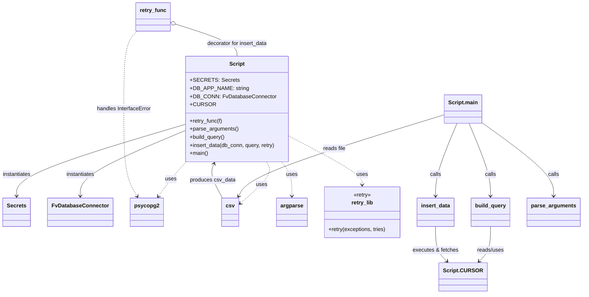

# Diagram: common/location_service/scripts/gm_location_scripts/load_gm_demand_areas.py

> Auto-generated by Obscura crawlers

## Mermaid

### SVG

<svg id="container" width="1696.869140625" xmlns="http://www.w3.org/2000/svg" class="classDiagram" height="868" viewBox="0 0 1696.869140625 868" role="graphics-document document" aria-roledescription="class"><g><defs><marker id="container_class-aggregationStart" class="marker aggregation class" refX="18" refY="7" markerWidth="190" markerHeight="240" orient="auto"><path d="M 18,7 L9,13 L1,7 L9,1 Z"></path></marker></defs><defs><marker id="container_class-aggregationEnd" class="marker aggregation class" refX="1" refY="7" markerWidth="20" markerHeight="28" orient="auto"><path d="M 18,7 L9,13 L1,7 L9,1 Z"></path></marker></defs><defs><marker id="container_class-extensionStart" class="marker extension class" refX="18" refY="7" markerWidth="190" markerHeight="240" orient="auto"><path d="M 1,7 L18,13 V 1 Z"></path></marker></defs><defs><marker id="container_class-extensionEnd" class="marker extension class" refX="1" refY="7" markerWidth="20" markerHeight="28" orient="auto"><path d="M 1,1 V 13 L18,7 Z"></path></marker></defs><defs><marker id="container_class-compositionStart" class="marker composition class" refX="18" refY="7" markerWidth="190" markerHeight="240" orient="auto"><path d="M 18,7 L9,13 L1,7 L9,1 Z"></path></marker></defs><defs><marker id="container_class-compositionEnd" class="marker composition class" refX="1" refY="7" markerWidth="20" markerHeight="28" orient="auto"><path d="M 18,7 L9,13 L1,7 L9,1 Z"></path></marker></defs><defs><marker id="container_class-dependencyStart" class="marker dependency class" refX="6" refY="7" markerWidth="190" markerHeight="240" orient="auto"><path d="M 5,7 L9,13 L1,7 L9,1 Z"></path></marker></defs><defs><marker id="container_class-dependencyEnd" class="marker dependency class" refX="13" refY="7" markerWidth="20" markerHeight="28" orient="auto"><path d="M 18,7 L9,13 L14,7 L9,1 Z"></path></marker></defs><defs><marker id="container_class-lollipopStart" class="marker lollipop class" refX="13" refY="7" markerWidth="190" markerHeight="240" orient="auto"><circle stroke="black" fill="transparent" cx="7" cy="7" r="6"></circle></marker></defs><defs><marker id="container_class-lollipopEnd" class="marker lollipop class" refX="1" refY="7" markerWidth="190" markerHeight="240" orient="auto"><circle stroke="black" fill="transparent" cx="7" cy="7" r="6"></circle></marker></defs><g class="root"><g class="clusters"></g><g class="edgePaths"><path d="M535,367.697L454.319,392.248C373.638,416.798,212.276,465.899,131.595,501.116C50.914,536.333,50.914,557.667,50.914,568.333L50.914,579" id="id_Script_Secrets_1" class="edge-thickness-normal edge-pattern-solid relation" style=";;;" data-edge="true" data-et="edge" data-id="id_Script_Secrets_1" data-points="W3sieCI6NTM1LCJ5IjozNjcuNjk3MTA3MjQyMDU2NzV9LHsieCI6NTAuOTE0MDYyNSwieSI6NTE1fSx7IngiOjUwLjkxNDA2MjUsInkiOjU4NX1d" marker-end="url(#container_class-dependencyEnd)"></path><path d="M535,385.87L484.397,407.392C433.794,428.914,332.589,471.957,281.986,504.145C231.383,536.333,231.383,557.667,231.383,568.333L231.383,579" id="id_Script_FvDatabaseConnector_2" class="edge-thickness-normal edge-pattern-solid relation" style=";;;" data-edge="true" data-et="edge" data-id="id_Script_FvDatabaseConnector_2" data-points="W3sieCI6NTM1LCJ5IjozODUuODcwMzcyMTIzODUxOX0seyJ4IjoyMzEuMzgyODEyNSwieSI6NTE1fSx7IngiOjIzMS4zODI4MTI1LCJ5Ijo1ODV9XQ==" marker-end="url(#container_class-dependencyEnd)"></path><path d="M535.729,478L529.821,484.167C523.914,490.333,512.098,502.667,498.303,519.691C484.508,536.715,468.734,558.43,460.846,569.288L452.959,580.146" id="id_Script_psycopg2_3" class="edge-thickness-normal edge-pattern-dashed relation" style=";;;" data-edge="true" data-et="edge" data-id="id_Script_psycopg2_3" data-points="W3sieCI6NTM1LjcyODkzMDUzNzU2NDgsInkiOjQ3OH0seyJ4Ijo1MDAuMjgzMjAzMTI1LCJ5Ijo1MTV9LHsieCI6NDQ5LjQzMjM3MzA0Njg3NSwieSI6NTg1fV0=" marker-end="url(#container_class-dependencyEnd)"></path><path d="M773.24,478L776.721,484.167C780.202,490.333,787.165,502.667,774.059,523.383C760.953,544.1,727.78,573.199,711.193,587.749L694.606,602.299" id="id_Script_csv_4" class="edge-thickness-normal edge-pattern-dashed relation" style=";;;" data-edge="true" data-et="edge" data-id="id_Script_csv_4" data-points="W3sieCI6NzczLjIzOTk0MDkwMDI1OTEsInkiOjQ3OH0seyJ4Ijo3OTQuMTI2OTUzMTI1LCJ5Ijo1MTV9LHsieCI6NjkwLjA5NTcwMzEyNSwieSI6NjA2LjI1NTcwNTgwNjc2NzR9XQ==" marker-end="url(#container_class-dependencyEnd)"></path><path d="M816.067,478L821.241,484.167C826.415,490.333,836.763,502.667,841.937,519.5C847.111,536.333,847.111,557.667,847.111,568.333L847.111,579" id="id_Script_argparse_5" class="edge-thickness-normal edge-pattern-dashed relation" style=";;;" data-edge="true" data-et="edge" data-id="id_Script_argparse_5" data-points="W3sieCI6ODE2LjA2NjY4OTYwNDkyMjMsInkiOjQ3OH0seyJ4Ijo4NDcuMTExMzI4MTI1LCJ5Ijo1MTV9LHsieCI6ODQ3LjExMTMyODEyNSwieSI6NTg1fV0=" marker-end="url(#container_class-dependencyEnd)"></path><path d="M835.352,400.412L871.929,419.51C908.506,438.608,981.66,476.804,1018.237,501.069C1054.814,525.333,1054.814,535.667,1054.814,540.833L1054.814,546" id="id_Script_retry_lib_6" class="edge-thickness-normal edge-pattern-dashed relation" style=";;;" data-edge="true" data-et="edge" data-id="id_Script_retry_lib_6" data-points="W3sieCI6ODM1LjM1MTU2MjUsInkiOjQwMC40MTE1MDgyODI0NzZ9LHsieCI6MTA1NC44MTQ0NTMxMjUsInkiOjUxNX0seyJ4IjoxMDU0LjgxNDQ1MzEyNSwieSI6NTUyfV0=" marker-end="url(#container_class-dependencyEnd)"></path><path d="M394.806,92L388.44,98.167C382.074,104.333,369.342,116.667,362.975,155C356.609,193.333,356.609,257.667,356.609,322C356.609,386.333,356.609,450.667,362.614,493.626C368.619,536.586,380.628,558.171,386.633,568.964L392.638,579.757" id="id_retry_func_psycopg2_7" class="edge-thickness-normal edge-pattern-dashed relation" style=";;;" data-edge="true" data-et="edge" data-id="id_retry_func_psycopg2_7" data-points="W3sieCI6Mzk0LjgwNTg3NDIwODg2MDc2LCJ5Ijo5Mn0seyJ4IjozNTYuNjA5Mzc1LCJ5IjoxMjl9LHsieCI6MzU2LjYwOTM3NSwieSI6MzIyfSx7IngiOjM1Ni42MDkzNzUsInkiOjUxNX0seyJ4IjozOTUuNTU0Njg3NSwieSI6NTg1fV0=" marker-end="url(#container_class-dependencyEnd)"></path><path d="M504.055,71.073L534.242,80.728C564.429,90.382,624.802,109.691,654.989,125.512C685.176,141.333,685.176,153.667,685.176,159.833L685.176,166" id="id_retry_func_Script_8" class="edge-thickness-normal edge-pattern-solid relation" style=";;;" data-edge="true" data-et="edge" data-id="id_retry_func_Script_8" data-points="W3sieCI6NDg3LjYyNSwieSI6NjUuODE4NzM5NjIyMDQ0NzZ9LHsieCI6Njg1LjE3NTc4MTI1LCJ5IjoxMjl9LHsieCI6Njg1LjE3NTc4MTI1LCJ5IjoxNjZ9XQ==" marker-start="url(#container_class-aggregationStart)"></path><path d="M1432.057,669L1432.057,680.667C1432.057,692.333,1432.057,715.667,1426.527,732.797C1420.997,749.928,1409.938,760.855,1404.408,766.319L1398.878,771.783" id="id_build_query_Script.CURSOR_9" class="edge-thickness-normal edge-pattern-solid relation" style=";;;" data-edge="true" data-et="edge" data-id="id_build_query_Script.CURSOR_9" data-points="W3sieCI6MTQzMi4wNTY2NDA2MjUsInkiOjY2OX0seyJ4IjoxNDMyLjA1NjY0MDYyNSwieSI6NzM5fSx7IngiOjEzOTQuNjEwMjQwMzA4NTQ0MiwieSI6Nzc2fV0=" marker-end="url(#container_class-dependencyEnd)"></path><path d="M1272.15,669L1272.15,680.667C1272.15,692.333,1272.15,715.667,1277.68,732.797C1283.21,749.928,1294.269,760.855,1299.799,766.319L1305.329,771.783" id="id_insert_data_Script.CURSOR_10" class="edge-thickness-normal edge-pattern-solid relation" style=";;;" data-edge="true" data-et="edge" data-id="id_insert_data_Script.CURSOR_10" data-points="W3sieCI6MTI3Mi4xNTAzOTA2MjUsInkiOjY2OX0seyJ4IjoxMjcyLjE1MDM5MDYyNSwieSI6NzM5fSx7IngiOjEzMDkuNTk2NzkwOTQxNDU1OCwieSI6Nzc2fV0=" marker-end="url(#container_class-dependencyEnd)"></path><path d="M1405.846,361.694L1440.439,387.245C1475.033,412.796,1544.221,463.898,1578.814,500.116C1613.408,536.333,1613.408,557.667,1613.408,568.333L1613.408,579" id="id_Script.main_parse_arguments_11" class="edge-thickness-normal edge-pattern-solid relation" style=";;;" data-edge="true" data-et="edge" data-id="id_Script.main_parse_arguments_11" data-points="W3sieCI6MTQwNS44NDU3MDMxMjUsInkiOjM2MS42OTQwNTMyNzgzMjA5fSx7IngiOjE2MTMuNDA4MjAzMTI1LCJ5Ijo1MTV9LHsieCI6MTYxMy40MDgyMDMxMjUsInkiOjU4NX1d" marker-end="url(#container_class-dependencyEnd)"></path><path d="M1369.503,364L1379.928,389.167C1390.354,414.333,1411.205,464.667,1421.631,500.5C1432.057,536.333,1432.057,557.667,1432.057,568.333L1432.057,579" id="id_Script.main_build_query_12" class="edge-thickness-normal edge-pattern-solid relation" style=";;;" data-edge="true" data-et="edge" data-id="id_Script.main_build_query_12" data-points="W3sieCI6MTM2OS41MDI2NDEyNzI2Njg0LCJ5IjozNjR9LHsieCI6MTQzMi4wNTY2NDA2MjUsInkiOjUxNX0seyJ4IjoxNDMyLjA1NjY0MDYyNSwieSI6NTg1fV0=" marker-end="url(#container_class-dependencyEnd)"></path><path d="M1334.704,364L1324.279,389.167C1313.853,414.333,1293.002,464.667,1282.576,500.5C1272.15,536.333,1272.15,557.667,1272.15,568.333L1272.15,579" id="id_Script.main_insert_data_13" class="edge-thickness-normal edge-pattern-solid relation" style=";;;" data-edge="true" data-et="edge" data-id="id_Script.main_insert_data_13" data-points="W3sieCI6MTMzNC43MDQzODk5NzczMzE2LCJ5IjozNjR9LHsieCI6MTI3Mi4xNTAzOTA2MjUsInkiOjUxNX0seyJ4IjoxMjcyLjE1MDM5MDYyNSwieSI6NTg1fV0=" marker-end="url(#container_class-dependencyEnd)"></path><path d="M1298.361,338.52L1202.675,367.933C1106.989,397.347,915.617,456.173,814.368,496.365C713.12,536.556,701.996,558.112,696.435,568.89L690.873,579.668" id="id_Script.main_csv_14" class="edge-thickness-normal edge-pattern-solid relation" style=";;;" data-edge="true" data-et="edge" data-id="id_Script.main_csv_14" data-points="W3sieCI6MTI5OC4zNjEzMjgxMjUsInkiOjMzOC41MjAwMDg0NjEyODk2fSx7IngiOjcyNC4yNDQxNDA2MjUsInkiOjUxNX0seyJ4Ijo2ODguMTIxMDkzNzUsInkiOjU4NX1d" marker-end="url(#container_class-dependencyEnd)"></path><path d="M642.96,585L636.436,573.333C629.911,561.667,616.863,538.333,612.55,521.421C608.237,504.51,612.659,494.019,614.87,488.774L617.081,483.529" id="id_csv_Script_15" class="edge-thickness-normal edge-pattern-solid relation" style=";;;" data-edge="true" data-et="edge" data-id="id_csv_Script_15" data-points="W3sieCI6NjQyLjk1OTk2MDkzNzUsInkiOjU4NX0seyJ4Ijo2MDMuODE0NDUzMTI1LCJ5Ijo1MTV9LHsieCI6NjE5LjQxMjIyMDY5MzAwNTIsInkiOjQ3OH1d" marker-end="url(#container_class-dependencyEnd)"></path></g><g class="edgeLabels"><g class="edgeLabel" transform="translate(50.9140625, 515)"><g class="label" data-id="id_Script_Secrets_1" transform="translate(-42.9140625, -12)"><foreignObject width="85.828125" height="24">

instantiates

</foreignObject></g></g><g class="edgeLabel" transform="translate(231.3828125, 515)"><g class="label" data-id="id_Script_FvDatabaseConnector_2" transform="translate(-42.9140625, -12)"><foreignObject width="85.828125" height="24">

instantiates

</foreignObject></g></g><g class="edgeLabel" transform="translate(489.91507, 529.27252)"><g class="label" data-id="id_Script_psycopg2_3" transform="translate(-16.4921875, -12)"><foreignObject width="32.984375" height="24">

uses

</foreignObject></g></g><g class="edgeLabel" transform="translate(758.08185, 546.61859)"><g class="label" data-id="id_Script_csv_4" transform="translate(-16.4921875, -12)"><foreignObject width="32.984375" height="24">

uses

</foreignObject></g></g><g class="edgeLabel" transform="translate(847.111328125, 515)"><g class="label" data-id="id_Script_argparse_5" transform="translate(-16.4921875, -12)"><foreignObject width="32.984375" height="24">

uses

</foreignObject></g></g><g class="edgeLabel" transform="translate(1054.814453125, 515)"><g class="label" data-id="id_Script_retry_lib_6" transform="translate(-16.4921875, -12)"><foreignObject width="32.984375" height="24">

uses

</foreignObject></g></g><g class="edgeLabel" transform="translate(356.609375, 322)"><g class="label" data-id="id_retry_func_psycopg2_7" transform="translate(-81.078125, -12)"><foreignObject width="162.15625" height="24">

handles InterfaceError

</foreignObject></g></g><g class="edgeLabel" transform="translate(685.17578125, 129)"><g class="label" data-id="id_retry_func_Script_8" transform="translate(-91.109375, -12)"><foreignObject width="182.21875" height="24">

decorator for insert_data

</foreignObject></g></g><g class="edgeLabel" transform="translate(1432.056640625, 739)"><g class="label" data-id="id_build_query_Script.CURSOR_9" transform="translate(-40.4140625, -12)"><foreignObject width="80.828125" height="24">

reads/uses

</foreignObject></g></g><g class="edgeLabel" transform="translate(1272.150390625, 739)"><g class="label" data-id="id_insert_data_Script.CURSOR_10" transform="translate(-68.1328125, -12)"><foreignObject width="136.265625" height="24">

executes &amp; fetches

</foreignObject></g></g><g class="edgeLabel" transform="translate(1613.408203125, 515)"><g class="label" data-id="id_Script.main_parse_arguments_11" transform="translate(-16.4453125, -12)"><foreignObject width="32.890625" height="24">

calls

</foreignObject></g></g><g class="edgeLabel" transform="translate(1432.056640625, 515)"><g class="label" data-id="id_Script.main_build_query_12" transform="translate(-16.4453125, -12)"><foreignObject width="32.890625" height="24">

calls

</foreignObject></g></g><g class="edgeLabel" transform="translate(1272.150390625, 515)"><g class="label" data-id="id_Script.main_insert_data_13" transform="translate(-16.4453125, -12)"><foreignObject width="32.890625" height="24">

calls

</foreignObject></g></g><g class="edgeLabel" transform="translate(973.65573, 438.33246)"><g class="label" data-id="id_Script.main_csv_14" transform="translate(-33.390625, -12)"><foreignObject width="66.78125" height="24">

reads file

</foreignObject></g></g><g class="edgeLabel" transform="translate(613.58807, 532.47717)"><g class="label" data-id="id_csv_Script_15" transform="translate(-67.0390625, -12)"><foreignObject width="134.078125" height="24">

produces csv_data

</foreignObject></g></g></g><g class="nodes"><g class="node default" id="classId-Script-0" transform="translate(685.17578125, 322)"><g class="basic label-container"><path d="M-150.17578125 -156 L150.17578125 -156 L150.17578125 156 L-150.17578125 156" stroke="none" stroke-width="0" fill="#ECECFF" style=""></path><path d="M-150.17578125 -156 C-54.76343035497369 -156, 40.648920540052615 -156, 150.17578125 -156 M-150.17578125 -156 C-53.133507012352524 -156, 43.90876722529495 -156, 150.17578125 -156 M150.17578125 -156 C150.17578125 -90.88113354492366, 150.17578125 -25.762267089847313, 150.17578125 156 M150.17578125 -156 C150.17578125 -58.88940032120817, 150.17578125 38.22119935758366, 150.17578125 156 M150.17578125 156 C39.161120290651496 156, -71.85354066869701 156, -150.17578125 156 M150.17578125 156 C79.18140342518319 156, 8.187025600366383 156, -150.17578125 156 M-150.17578125 156 C-150.17578125 45.77723290556338, -150.17578125 -64.44553418887324, -150.17578125 -156 M-150.17578125 156 C-150.17578125 65.30370197038698, -150.17578125 -25.392596059226037, -150.17578125 -156" stroke="#9370DB" stroke-width="1.3" fill="none" stroke-dasharray="0 0" style=""></path></g><g class="annotation-group text" transform="translate(0, -132)"></g><g class="label-group text" transform="translate(-21.7421875, -132)"><g class="label" style="font-weight: bolder" transform="translate(0,-12)"><foreignObject width="43.484375" height="24">

Script

</foreignObject></g></g><g class="members-group text" transform="translate(-138.17578125, -84)"><g class="label" style="" transform="translate(0,-12)"><foreignObject width="129.140625" height="24">

+SECRETS: Secrets

</foreignObject></g><g class="label" style="" transform="translate(0,12)"><foreignObject width="161.3125" height="24">

+DB_APP_NAME: string

</foreignObject></g><g class="label" style="" transform="translate(0,36)"><foreignObject width="241.65625" height="24">

+DB_CONN: FvDatabaseConnector

</foreignObject></g><g class="label" style="" transform="translate(0,60)"><foreignObject width="66.421875" height="24">

+CURSOR

</foreignObject></g></g><g class="methods-group text" transform="translate(-138.17578125, 36)"><g class="label" style="" transform="translate(0,-12)"><foreignObject width="98.453125" height="24">

+retry_func(f)

</foreignObject></g><g class="label" style="" transform="translate(0,12)"><foreignObject width="143.390625" height="24">

+parse_arguments()

</foreignObject></g><g class="label" style="" transform="translate(0,36)"><foreignObject width="105.515625" height="24">

+build_query()

</foreignObject></g><g class="label" style="" transform="translate(0,60)"><foreignObject width="254.609375" height="24">

+insert_data(db_conn, query, retry)

</foreignObject></g><g class="label" style="" transform="translate(0,84)"><foreignObject width="54.65625" height="24">

+main()

</foreignObject></g></g><g class="divider" style=""><path d="M-150.17578125 -108 C-37.64143936084949 -108, 74.89290252830102 -108, 150.17578125 -108 M-150.17578125 -108 C-69.99266740104271 -108, 10.190446447914582 -108, 150.17578125 -108" stroke="#9370DB" stroke-width="1.3" fill="none" stroke-dasharray="0 0" style=""></path></g><g class="divider" style=""><path d="M-150.17578125 12 C-33.38160606578117 12, 83.41256911843766 12, 150.17578125 12 M-150.17578125 12 C-52.76534669043987 12, 44.64508786912026 12, 150.17578125 12" stroke="#9370DB" stroke-width="1.3" fill="none" stroke-dasharray="0 0" style=""></path></g></g><g class="node default" id="classId-Secrets-1" transform="translate(50.9140625, 627)"><g class="basic label-container"><path d="M-39.1640625 -42 L39.1640625 -42 L39.1640625 42 L-39.1640625 42" stroke="none" stroke-width="0" fill="#ECECFF" style=""></path><path d="M-39.1640625 -42 C-22.869072283461296 -42, -6.574082066922593 -42, 39.1640625 -42 M-39.1640625 -42 C-22.9044558442061 -42, -6.644849188412202 -42, 39.1640625 -42 M39.1640625 -42 C39.1640625 -20.681115317181046, 39.1640625 0.637769365637908, 39.1640625 42 M39.1640625 -42 C39.1640625 -22.04573381669266, 39.1640625 -2.091467633385321, 39.1640625 42 M39.1640625 42 C20.607635434124703 42, 2.051208368249405 42, -39.1640625 42 M39.1640625 42 C11.467993631515021 42, -16.228075236969957 42, -39.1640625 42 M-39.1640625 42 C-39.1640625 20.662665474037773, -39.1640625 -0.6746690519244538, -39.1640625 -42 M-39.1640625 42 C-39.1640625 21.817923736423353, -39.1640625 1.6358474728467058, -39.1640625 -42" stroke="#9370DB" stroke-width="1.3" fill="none" stroke-dasharray="0 0" style=""></path></g><g class="annotation-group text" transform="translate(0, -18)"></g><g class="label-group text" transform="translate(-27.1640625, -18)"><g class="label" style="font-weight: bolder" transform="translate(0,-12)"><foreignObject width="54.328125" height="24">

Secrets

</foreignObject></g></g><g class="members-group text" transform="translate(-27.1640625, 30)"></g><g class="methods-group text" transform="translate(-27.1640625, 60)"></g><g class="divider" style=""><path d="M-39.1640625 6 C-9.868331056315252 6, 19.427400387369495 6, 39.1640625 6 M-39.1640625 6 C-11.626455381778076 6, 15.911151736443848 6, 39.1640625 6" stroke="#9370DB" stroke-width="1.3" fill="none" stroke-dasharray="0 0" style=""></path></g><g class="divider" style=""><path d="M-39.1640625 24 C-9.53282361588694 24, 20.09841526822612 24, 39.1640625 24 M-39.1640625 24 C-8.48568688249549 24, 22.19268873500902 24, 39.1640625 24" stroke="#9370DB" stroke-width="1.3" fill="none" stroke-dasharray="0 0" style=""></path></g></g><g class="node default" id="classId-FvDatabaseConnector-2" transform="translate(231.3828125, 627)"><g class="basic label-container"><path d="M-91.3046875 -42 L91.3046875 -42 L91.3046875 42 L-91.3046875 42" stroke="none" stroke-width="0" fill="#ECECFF" style=""></path><path d="M-91.3046875 -42 C-36.405209701226426 -42, 18.49426809754715 -42, 91.3046875 -42 M-91.3046875 -42 C-51.212142318376834 -42, -11.119597136753669 -42, 91.3046875 -42 M91.3046875 -42 C91.3046875 -14.196706368511375, 91.3046875 13.60658726297725, 91.3046875 42 M91.3046875 -42 C91.3046875 -8.811895710290358, 91.3046875 24.376208579419284, 91.3046875 42 M91.3046875 42 C33.972669544968895 42, -23.35934841006221 42, -91.3046875 42 M91.3046875 42 C28.03896845462249 42, -35.22675059075502 42, -91.3046875 42 M-91.3046875 42 C-91.3046875 15.937920651934071, -91.3046875 -10.124158696131857, -91.3046875 -42 M-91.3046875 42 C-91.3046875 10.903739809544835, -91.3046875 -20.19252038091033, -91.3046875 -42" stroke="#9370DB" stroke-width="1.3" fill="none" stroke-dasharray="0 0" style=""></path></g><g class="annotation-group text" transform="translate(0, -18)"></g><g class="label-group text" transform="translate(-79.3046875, -18)"><g class="label" style="font-weight: bolder" transform="translate(0,-12)"><foreignObject width="158.609375" height="24">

FvDatabaseConnector

</foreignObject></g></g><g class="members-group text" transform="translate(-79.3046875, 30)"></g><g class="methods-group text" transform="translate(-79.3046875, 60)"></g><g class="divider" style=""><path d="M-91.3046875 6 C-53.594287861504874 6, -15.883888223009748 6, 91.3046875 6 M-91.3046875 6 C-46.793969473287916 6, -2.2832514465758322 6, 91.3046875 6" stroke="#9370DB" stroke-width="1.3" fill="none" stroke-dasharray="0 0" style=""></path></g><g class="divider" style=""><path d="M-91.3046875 24 C-21.70587578090104 24, 47.89293593819792 24, 91.3046875 24 M-91.3046875 24 C-46.64115979889882 24, -1.9776320977976383 24, 91.3046875 24" stroke="#9370DB" stroke-width="1.3" fill="none" stroke-dasharray="0 0" style=""></path></g></g><g class="node default" id="classId-psycopg2-3" transform="translate(418.921875, 627)"><g class="basic label-container"><path d="M-46.234375 -42 L46.234375 -42 L46.234375 42 L-46.234375 42" stroke="none" stroke-width="0" fill="#ECECFF" style=""></path><path d="M-46.234375 -42 C-19.927060659114836 -42, 6.380253681770327 -42, 46.234375 -42 M-46.234375 -42 C-22.031758386829463 -42, 2.1708582263410747 -42, 46.234375 -42 M46.234375 -42 C46.234375 -25.075114388146602, 46.234375 -8.150228776293204, 46.234375 42 M46.234375 -42 C46.234375 -20.6832865646715, 46.234375 0.6334268706569972, 46.234375 42 M46.234375 42 C18.26023310314435 42, -9.713908793711298 42, -46.234375 42 M46.234375 42 C15.881697815879825 42, -14.47097936824035 42, -46.234375 42 M-46.234375 42 C-46.234375 12.235271745251715, -46.234375 -17.52945650949657, -46.234375 -42 M-46.234375 42 C-46.234375 15.23736523025445, -46.234375 -11.525269539491099, -46.234375 -42" stroke="#9370DB" stroke-width="1.3" fill="none" stroke-dasharray="0 0" style=""></path></g><g class="annotation-group text" transform="translate(0, -18)"></g><g class="label-group text" transform="translate(-34.234375, -18)"><g class="label" style="font-weight: bolder" transform="translate(0,-12)"><foreignObject width="68.46875" height="24">

psycopg2

</foreignObject></g></g><g class="members-group text" transform="translate(-34.234375, 30)"></g><g class="methods-group text" transform="translate(-34.234375, 60)"></g><g class="divider" style=""><path d="M-46.234375 6 C-13.173921083649894 6, 19.88653283270021 6, 46.234375 6 M-46.234375 6 C-25.502017969206896 6, -4.769660938413793 6, 46.234375 6" stroke="#9370DB" stroke-width="1.3" fill="none" stroke-dasharray="0 0" style=""></path></g><g class="divider" style=""><path d="M-46.234375 24 C-15.95525008807703 24, 14.32387482384594 24, 46.234375 24 M-46.234375 24 C-27.212050184470357 24, -8.189725368940714 24, 46.234375 24" stroke="#9370DB" stroke-width="1.3" fill="none" stroke-dasharray="0 0" style=""></path></g></g><g class="node default" id="classId-csv-4" transform="translate(666.447265625, 627)"><g class="basic label-container"><path d="M-23.6484375 -42 L23.6484375 -42 L23.6484375 42 L-23.6484375 42" stroke="none" stroke-width="0" fill="#ECECFF" style=""></path><path d="M-23.6484375 -42 C-9.527926792766756 -42, 4.592583914466488 -42, 23.6484375 -42 M-23.6484375 -42 C-9.834491747632013 -42, 3.979454004735974 -42, 23.6484375 -42 M23.6484375 -42 C23.6484375 -12.977962820617215, 23.6484375 16.04407435876557, 23.6484375 42 M23.6484375 -42 C23.6484375 -24.714567278979356, 23.6484375 -7.429134557958712, 23.6484375 42 M23.6484375 42 C13.63587152891305 42, 3.6233055578261 42, -23.6484375 42 M23.6484375 42 C6.706555957623284 42, -10.235325584753433 42, -23.6484375 42 M-23.6484375 42 C-23.6484375 16.036589424002354, -23.6484375 -9.926821151995291, -23.6484375 -42 M-23.6484375 42 C-23.6484375 22.608358231102358, -23.6484375 3.2167164622047153, -23.6484375 -42" stroke="#9370DB" stroke-width="1.3" fill="none" stroke-dasharray="0 0" style=""></path></g><g class="annotation-group text" transform="translate(0, -18)"></g><g class="label-group text" transform="translate(-11.6484375, -18)"><g class="label" style="font-weight: bolder" transform="translate(0,-12)"><foreignObject width="23.296875" height="24">

csv

</foreignObject></g></g><g class="members-group text" transform="translate(-11.6484375, 30)"></g><g class="methods-group text" transform="translate(-11.6484375, 60)"></g><g class="divider" style=""><path d="M-23.6484375 6 C-8.482398211762717 6, 6.683641076474565 6, 23.6484375 6 M-23.6484375 6 C-8.790339616587861 6, 6.067758266824278 6, 23.6484375 6" stroke="#9370DB" stroke-width="1.3" fill="none" stroke-dasharray="0 0" style=""></path></g><g class="divider" style=""><path d="M-23.6484375 24 C-10.839233256332497 24, 1.9699709873350066 24, 23.6484375 24 M-23.6484375 24 C-5.157938705835107 24, 13.332560088329785 24, 23.6484375 24" stroke="#9370DB" stroke-width="1.3" fill="none" stroke-dasharray="0 0" style=""></path></g></g><g class="node default" id="classId-argparse-5" transform="translate(847.111328125, 627)"><g class="basic label-container"><path d="M-44.3828125 -42 L44.3828125 -42 L44.3828125 42 L-44.3828125 42" stroke="none" stroke-width="0" fill="#ECECFF" style=""></path><path d="M-44.3828125 -42 C-11.953766962509832 -42, 20.475278574980337 -42, 44.3828125 -42 M-44.3828125 -42 C-17.296133136099492 -42, 9.790546227801016 -42, 44.3828125 -42 M44.3828125 -42 C44.3828125 -20.971569412793677, 44.3828125 0.05686117441264571, 44.3828125 42 M44.3828125 -42 C44.3828125 -22.372339704616493, 44.3828125 -2.7446794092329867, 44.3828125 42 M44.3828125 42 C9.79649481892563 42, -24.78982286214874 42, -44.3828125 42 M44.3828125 42 C10.082782116306596 42, -24.217248267386807 42, -44.3828125 42 M-44.3828125 42 C-44.3828125 18.96544395376288, -44.3828125 -4.069112092474242, -44.3828125 -42 M-44.3828125 42 C-44.3828125 23.24077388877493, -44.3828125 4.4815477775498564, -44.3828125 -42" stroke="#9370DB" stroke-width="1.3" fill="none" stroke-dasharray="0 0" style=""></path></g><g class="annotation-group text" transform="translate(0, -18)"></g><g class="label-group text" transform="translate(-32.3828125, -18)"><g class="label" style="font-weight: bolder" transform="translate(0,-12)"><foreignObject width="64.765625" height="24">

argparse

</foreignObject></g></g><g class="members-group text" transform="translate(-32.3828125, 30)"></g><g class="methods-group text" transform="translate(-32.3828125, 60)"></g><g class="divider" style=""><path d="M-44.3828125 6 C-12.534903572870835 6, 19.31300535425833 6, 44.3828125 6 M-44.3828125 6 C-14.495381782488288 6, 15.392048935023425 6, 44.3828125 6" stroke="#9370DB" stroke-width="1.3" fill="none" stroke-dasharray="0 0" style=""></path></g><g class="divider" style=""><path d="M-44.3828125 24 C-25.115391918454314 24, -5.847971336908628 24, 44.3828125 24 M-44.3828125 24 C-19.43028606072233 24, 5.522240378555338 24, 44.3828125 24" stroke="#9370DB" stroke-width="1.3" fill="none" stroke-dasharray="0 0" style=""></path></g></g><g class="node default" id="classId-retry_lib-6" transform="translate(1054.814453125, 627)"><g class="basic label-container"><path d="M-113.3203125 -75 L113.3203125 -75 L113.3203125 75 L-113.3203125 75" stroke="none" stroke-width="0" fill="#ECECFF" style=""></path><path d="M-113.3203125 -75 C-34.34684557582675 -75, 44.626621348346504 -75, 113.3203125 -75 M-113.3203125 -75 C-59.44484317812297 -75, -5.569373856245946 -75, 113.3203125 -75 M113.3203125 -75 C113.3203125 -41.31628062136623, 113.3203125 -7.632561242732464, 113.3203125 75 M113.3203125 -75 C113.3203125 -23.26182612464862, 113.3203125 28.476347750702757, 113.3203125 75 M113.3203125 75 C23.096080986460322 75, -67.12815052707936 75, -113.3203125 75 M113.3203125 75 C52.21195902303088 75, -8.896394453938242 75, -113.3203125 75 M-113.3203125 75 C-113.3203125 22.399137823477922, -113.3203125 -30.201724353044156, -113.3203125 -75 M-113.3203125 75 C-113.3203125 24.612397831528234, -113.3203125 -25.77520433694353, -113.3203125 -75" stroke="#9370DB" stroke-width="1.3" fill="none" stroke-dasharray="0 0" style=""></path></g><g class="annotation-group text" transform="translate(-26.25, -51)"><g class="label" style="" transform="translate(0,-12)"><foreignObject width="52.5" height="24">

«retry»

</foreignObject></g></g><g class="label-group text" transform="translate(-31.078125, -27)"><g class="label" style="font-weight: bolder" transform="translate(0,-12)"><foreignObject width="62.15625" height="24">

retry_lib

</foreignObject></g></g><g class="members-group text" transform="translate(-101.3203125, 21)"></g><g class="methods-group text" transform="translate(-101.3203125, 51)"><g class="label" style="" transform="translate(0,-12)"><foreignObject width="171.5625" height="24">

+retry(exceptions, tries)

</foreignObject></g></g><g class="divider" style=""><path d="M-113.3203125 -3 C-48.29333445607965 -3, 16.733643587840703 -3, 113.3203125 -3 M-113.3203125 -3 C-27.44286379720465 -3, 58.4345849055907 -3, 113.3203125 -3" stroke="#9370DB" stroke-width="1.3" fill="none" stroke-dasharray="0 0" style=""></path></g><g class="divider" style=""><path d="M-113.3203125 21 C-38.00678402283894 21, 37.306744454322114 21, 113.3203125 21 M-113.3203125 21 C-37.20229578644775 21, 38.9157209271045 21, 113.3203125 21" stroke="#9370DB" stroke-width="1.3" fill="none" stroke-dasharray="0 0" style=""></path></g></g><g class="node default" id="classId-retry_func-7" transform="translate(438.1640625, 50)"><g class="basic label-container"><path d="M-49.4609375 -42 L49.4609375 -42 L49.4609375 42 L-49.4609375 42" stroke="none" stroke-width="0" fill="#ECECFF" style=""></path><path d="M-49.4609375 -42 C-24.85869509083406 -42, -0.2564526816681223 -42, 49.4609375 -42 M-49.4609375 -42 C-27.162492939162583 -42, -4.864048378325165 -42, 49.4609375 -42 M49.4609375 -42 C49.4609375 -18.354936317692466, 49.4609375 5.290127364615067, 49.4609375 42 M49.4609375 -42 C49.4609375 -14.731706596922475, 49.4609375 12.53658680615505, 49.4609375 42 M49.4609375 42 C29.266833860541226 42, 9.072730221082452 42, -49.4609375 42 M49.4609375 42 C11.7359132594665 42, -25.989110981067 42, -49.4609375 42 M-49.4609375 42 C-49.4609375 17.434737944260124, -49.4609375 -7.130524111479751, -49.4609375 -42 M-49.4609375 42 C-49.4609375 19.54203606856501, -49.4609375 -2.915927862869978, -49.4609375 -42" stroke="#9370DB" stroke-width="1.3" fill="none" stroke-dasharray="0 0" style=""></path></g><g class="annotation-group text" transform="translate(0, -18)"></g><g class="label-group text" transform="translate(-37.4609375, -18)"><g class="label" style="font-weight: bolder" transform="translate(0,-12)"><foreignObject width="74.921875" height="24">

retry_func

</foreignObject></g></g><g class="members-group text" transform="translate(-37.4609375, 30)"></g><g class="methods-group text" transform="translate(-37.4609375, 60)"></g><g class="divider" style=""><path d="M-49.4609375 6 C-13.39417480774111 6, 22.67258788451778 6, 49.4609375 6 M-49.4609375 6 C-11.821775612969958 6, 25.817386274060084 6, 49.4609375 6" stroke="#9370DB" stroke-width="1.3" fill="none" stroke-dasharray="0 0" style=""></path></g><g class="divider" style=""><path d="M-49.4609375 24 C-18.235986446856437 24, 12.988964606287126 24, 49.4609375 24 M-49.4609375 24 C-19.028083257306708 24, 11.404770985386584 24, 49.4609375 24" stroke="#9370DB" stroke-width="1.3" fill="none" stroke-dasharray="0 0" style=""></path></g></g><g class="node default" id="classId-build_query-8" transform="translate(1432.056640625, 627)"><g class="basic label-container"><path d="M-55.890625 -42 L55.890625 -42 L55.890625 42 L-55.890625 42" stroke="none" stroke-width="0" fill="#ECECFF" style=""></path><path d="M-55.890625 -42 C-23.679448246566167 -42, 8.531728506867665 -42, 55.890625 -42 M-55.890625 -42 C-20.326216376881717 -42, 15.238192246236565 -42, 55.890625 -42 M55.890625 -42 C55.890625 -16.593489128072903, 55.890625 8.813021743854193, 55.890625 42 M55.890625 -42 C55.890625 -16.846338312209955, 55.890625 8.30732337558009, 55.890625 42 M55.890625 42 C12.66223871113337 42, -30.56614757773326 42, -55.890625 42 M55.890625 42 C33.177154551709556 42, 10.463684103419112 42, -55.890625 42 M-55.890625 42 C-55.890625 24.7848241477756, -55.890625 7.569648295551197, -55.890625 -42 M-55.890625 42 C-55.890625 19.198079634144726, -55.890625 -3.603840731710548, -55.890625 -42" stroke="#9370DB" stroke-width="1.3" fill="none" stroke-dasharray="0 0" style=""></path></g><g class="annotation-group text" transform="translate(0, -18)"></g><g class="label-group text" transform="translate(-43.890625, -18)"><g class="label" style="font-weight: bolder" transform="translate(0,-12)"><foreignObject width="87.78125" height="24">

build_query

</foreignObject></g></g><g class="members-group text" transform="translate(-43.890625, 30)"></g><g class="methods-group text" transform="translate(-43.890625, 60)"></g><g class="divider" style=""><path d="M-55.890625 6 C-25.347099151859904 6, 5.1964266962801915 6, 55.890625 6 M-55.890625 6 C-15.777776001361161 6, 24.335072997277678 6, 55.890625 6" stroke="#9370DB" stroke-width="1.3" fill="none" stroke-dasharray="0 0" style=""></path></g><g class="divider" style=""><path d="M-55.890625 24 C-18.32090419445135 24, 19.248816611097297 24, 55.890625 24 M-55.890625 24 C-30.733287242129073 24, -5.575949484258146 24, 55.890625 24" stroke="#9370DB" stroke-width="1.3" fill="none" stroke-dasharray="0 0" style=""></path></g></g><g class="node default" id="classId-Script.CURSOR-9" transform="translate(1352.103515625, 818)"><g class="basic label-container"><path d="M-65.1953125 -42 L65.1953125 -42 L65.1953125 42 L-65.1953125 42" stroke="none" stroke-width="0" fill="#ECECFF" style=""></path><path d="M-65.1953125 -42 C-33.43049528655631 -42, -1.665678073112609 -42, 65.1953125 -42 M-65.1953125 -42 C-16.685406954668863 -42, 31.824498590662273 -42, 65.1953125 -42 M65.1953125 -42 C65.1953125 -14.326412855899452, 65.1953125 13.347174288201096, 65.1953125 42 M65.1953125 -42 C65.1953125 -19.374706961238385, 65.1953125 3.2505860775232307, 65.1953125 42 M65.1953125 42 C34.22691301422198 42, 3.258513528443956 42, -65.1953125 42 M65.1953125 42 C34.63624051416866 42, 4.0771685283373245 42, -65.1953125 42 M-65.1953125 42 C-65.1953125 16.142472596797006, -65.1953125 -9.715054806405988, -65.1953125 -42 M-65.1953125 42 C-65.1953125 22.276883765955116, -65.1953125 2.553767531910232, -65.1953125 -42" stroke="#9370DB" stroke-width="1.3" fill="none" stroke-dasharray="0 0" style=""></path></g><g class="annotation-group text" transform="translate(0, -18)"></g><g class="label-group text" transform="translate(-53.1953125, -18)"><g class="label" style="font-weight: bolder" transform="translate(0,-12)"><foreignObject width="106.390625" height="24">

Script.CURSOR

</foreignObject></g></g><g class="members-group text" transform="translate(-53.1953125, 30)"></g><g class="methods-group text" transform="translate(-53.1953125, 60)"></g><g class="divider" style=""><path d="M-65.1953125 6 C-17.00261457666138 6, 31.19008334667724 6, 65.1953125 6 M-65.1953125 6 C-14.15137149646052 6, 36.89256950707896 6, 65.1953125 6" stroke="#9370DB" stroke-width="1.3" fill="none" stroke-dasharray="0 0" style=""></path></g><g class="divider" style=""><path d="M-65.1953125 24 C-28.280048380728353 24, 8.635215738543295 24, 65.1953125 24 M-65.1953125 24 C-33.433440556689 24, -1.6715686133779997 24, 65.1953125 24" stroke="#9370DB" stroke-width="1.3" fill="none" stroke-dasharray="0 0" style=""></path></g></g><g class="node default" id="classId-insert_data-10" transform="translate(1272.150390625, 627)"><g class="basic label-container"><path d="M-54.015625 -42 L54.015625 -42 L54.015625 42 L-54.015625 42" stroke="none" stroke-width="0" fill="#ECECFF" style=""></path><path d="M-54.015625 -42 C-13.400031787154113 -42, 27.215561425691774 -42, 54.015625 -42 M-54.015625 -42 C-30.278515296891136 -42, -6.541405593782272 -42, 54.015625 -42 M54.015625 -42 C54.015625 -17.142346234772983, 54.015625 7.715307530454034, 54.015625 42 M54.015625 -42 C54.015625 -14.937180542403926, 54.015625 12.125638915192148, 54.015625 42 M54.015625 42 C31.60108165165286 42, 9.186538303305717 42, -54.015625 42 M54.015625 42 C18.408675453690485 42, -17.19827409261903 42, -54.015625 42 M-54.015625 42 C-54.015625 12.621279135135037, -54.015625 -16.757441729729926, -54.015625 -42 M-54.015625 42 C-54.015625 17.55638606923008, -54.015625 -6.8872278615398415, -54.015625 -42" stroke="#9370DB" stroke-width="1.3" fill="none" stroke-dasharray="0 0" style=""></path></g><g class="annotation-group text" transform="translate(0, -18)"></g><g class="label-group text" transform="translate(-42.015625, -18)"><g class="label" style="font-weight: bolder" transform="translate(0,-12)"><foreignObject width="84.03125" height="24">

insert_data

</foreignObject></g></g><g class="members-group text" transform="translate(-42.015625, 30)"></g><g class="methods-group text" transform="translate(-42.015625, 60)"></g><g class="divider" style=""><path d="M-54.015625 6 C-19.154467160663174 6, 15.706690678673652 6, 54.015625 6 M-54.015625 6 C-16.163815106369093 6, 21.687994787261815 6, 54.015625 6" stroke="#9370DB" stroke-width="1.3" fill="none" stroke-dasharray="0 0" style=""></path></g><g class="divider" style=""><path d="M-54.015625 24 C-11.23636422248655 24, 31.5428965550269 24, 54.015625 24 M-54.015625 24 C-27.0875175754901 24, -0.15941015098020017 24, 54.015625 24" stroke="#9370DB" stroke-width="1.3" fill="none" stroke-dasharray="0 0" style=""></path></g></g><g class="node default" id="classId-Script.main-11" transform="translate(1352.103515625, 322)"><g class="basic label-container"><path d="M-53.7421875 -42 L53.7421875 -42 L53.7421875 42 L-53.7421875 42" stroke="none" stroke-width="0" fill="#ECECFF" style=""></path><path d="M-53.7421875 -42 C-30.383188896871104 -42, -7.024190293742208 -42, 53.7421875 -42 M-53.7421875 -42 C-10.805944806531421 -42, 32.13029788693716 -42, 53.7421875 -42 M53.7421875 -42 C53.7421875 -18.87509160437573, 53.7421875 4.249816791248541, 53.7421875 42 M53.7421875 -42 C53.7421875 -12.530044586047975, 53.7421875 16.93991082790405, 53.7421875 42 M53.7421875 42 C30.861537016249493 42, 7.980886532498985 42, -53.7421875 42 M53.7421875 42 C21.069726839236914 42, -11.602733821526172 42, -53.7421875 42 M-53.7421875 42 C-53.7421875 18.550492016049343, -53.7421875 -4.899015967901313, -53.7421875 -42 M-53.7421875 42 C-53.7421875 12.294575078600317, -53.7421875 -17.410849842799365, -53.7421875 -42" stroke="#9370DB" stroke-width="1.3" fill="none" stroke-dasharray="0 0" style=""></path></g><g class="annotation-group text" transform="translate(0, -18)"></g><g class="label-group text" transform="translate(-41.7421875, -18)"><g class="label" style="font-weight: bolder" transform="translate(0,-12)"><foreignObject width="83.484375" height="24">

Script.main

</foreignObject></g></g><g class="members-group text" transform="translate(-41.7421875, 30)"></g><g class="methods-group text" transform="translate(-41.7421875, 60)"></g><g class="divider" style=""><path d="M-53.7421875 6 C-12.004250069524254 6, 29.733687360951492 6, 53.7421875 6 M-53.7421875 6 C-19.714208439315506 6, 14.313770621368988 6, 53.7421875 6" stroke="#9370DB" stroke-width="1.3" fill="none" stroke-dasharray="0 0" style=""></path></g><g class="divider" style=""><path d="M-53.7421875 24 C-23.090995990389995 24, 7.560195519220009 24, 53.7421875 24 M-53.7421875 24 C-30.52654398476318 24, -7.310900469526359 24, 53.7421875 24" stroke="#9370DB" stroke-width="1.3" fill="none" stroke-dasharray="0 0" style=""></path></g></g><g class="node default" id="classId-parse_arguments-12" transform="translate(1613.408203125, 627)"><g class="basic label-container"><path d="M-75.4609375 -42 L75.4609375 -42 L75.4609375 42 L-75.4609375 42" stroke="none" stroke-width="0" fill="#ECECFF" style=""></path><path d="M-75.4609375 -42 C-30.689029491741373 -42, 14.082878516517255 -42, 75.4609375 -42 M-75.4609375 -42 C-18.001068248966185 -42, 39.45880100206763 -42, 75.4609375 -42 M75.4609375 -42 C75.4609375 -24.52316884636932, 75.4609375 -7.046337692738639, 75.4609375 42 M75.4609375 -42 C75.4609375 -15.300286572884378, 75.4609375 11.399426854231244, 75.4609375 42 M75.4609375 42 C18.882838400547122 42, -37.695260698905756 42, -75.4609375 42 M75.4609375 42 C23.35993080095394 42, -28.74107589809212 42, -75.4609375 42 M-75.4609375 42 C-75.4609375 9.810903006645681, -75.4609375 -22.378193986708638, -75.4609375 -42 M-75.4609375 42 C-75.4609375 25.063797931973674, -75.4609375 8.127595863947349, -75.4609375 -42" stroke="#9370DB" stroke-width="1.3" fill="none" stroke-dasharray="0 0" style=""></path></g><g class="annotation-group text" transform="translate(0, -18)"></g><g class="label-group text" transform="translate(-63.4609375, -18)"><g class="label" style="font-weight: bolder" transform="translate(0,-12)"><foreignObject width="126.921875" height="24">

parse_arguments

</foreignObject></g></g><g class="members-group text" transform="translate(-63.4609375, 30)"></g><g class="methods-group text" transform="translate(-63.4609375, 60)"></g><g class="divider" style=""><path d="M-75.4609375 6 C-36.52230425795628 6, 2.4163289840874427 6, 75.4609375 6 M-75.4609375 6 C-19.093657246081605 6, 37.27362300783679 6, 75.4609375 6" stroke="#9370DB" stroke-width="1.3" fill="none" stroke-dasharray="0 0" style=""></path></g><g class="divider" style=""><path d="M-75.4609375 24 C-24.233054481837243 24, 26.994828536325514 24, 75.4609375 24 M-75.4609375 24 C-33.952169863065734 24, 7.556597773868532 24, 75.4609375 24" stroke="#9370DB" stroke-width="1.3" fill="none" stroke-dasharray="0 0" style=""></path></g></g></g></g></g></svg>
