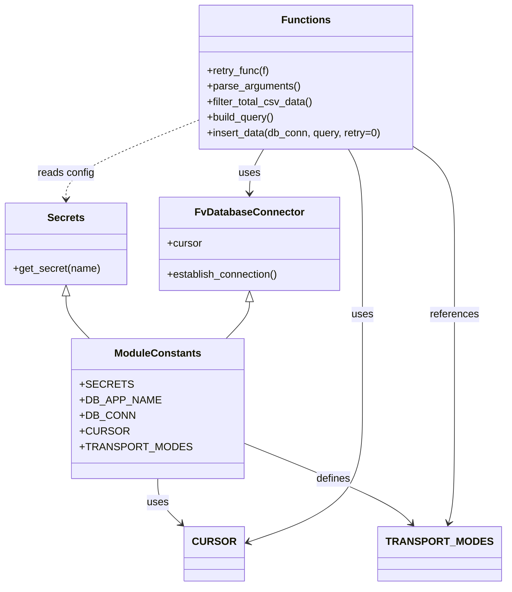

# Diagram: common/location_service/scripts/gm_location_scripts/load_gm_sla_mappings.py


> Auto-generated by Obscura crawlers

## Diagram 1



### SVG

<svg id="container" width="758.640625" xmlns="http://www.w3.org/2000/svg" class="classDiagram" height="904" viewBox="0 0 758.640625 904" role="graphics-document document" aria-roledescription="class"><style>#container{font-family:"trebuchet ms",verdana,arial,sans-serif;font-size:16px;fill:#333;}@keyframes edge-animation-frame{from{stroke-dashoffset:0;}}@keyframes dash{to{stroke-dashoffset:0;}}#container .edge-animation-slow{stroke-dasharray:9,5!important;stroke-dashoffset:900;animation:dash 50s linear infinite;stroke-linecap:round;}#container .edge-animation-fast{stroke-dasharray:9,5!important;stroke-dashoffset:900;animation:dash 20s linear infinite;stroke-linecap:round;}#container .error-icon{fill:#552222;}#container .error-text{fill:#552222;stroke:#552222;}#container .edge-thickness-normal{stroke-width:1px;}#container .edge-thickness-thick{stroke-width:3.5px;}#container .edge-pattern-solid{stroke-dasharray:0;}#container .edge-thickness-invisible{stroke-width:0;fill:none;}#container .edge-pattern-dashed{stroke-dasharray:3;}#container .edge-pattern-dotted{stroke-dasharray:2;}#container .marker{fill:#333333;stroke:#333333;}#container .marker.cross{stroke:#333333;}#container svg{font-family:"trebuchet ms",verdana,arial,sans-serif;font-size:16px;}#container p{margin:0;}#container g.classGroup text{fill:#9370DB;stroke:none;font-family:"trebuchet ms",verdana,arial,sans-serif;font-size:10px;}#container g.classGroup text .title{font-weight:bolder;}#container .nodeLabel,#container .edgeLabel{color:#131300;}#container .edgeLabel .label rect{fill:#ECECFF;}#container .label text{fill:#131300;}#container .labelBkg{background:#ECECFF;}#container .edgeLabel .label span{background:#ECECFF;}#container .classTitle{font-weight:bolder;}#container .node rect,#container .node circle,#container .node ellipse,#container .node polygon,#container .node path{fill:#ECECFF;stroke:#9370DB;stroke-width:1px;}#container .divider{stroke:#9370DB;stroke-width:1;}#container g.clickable{cursor:pointer;}#container g.classGroup rect{fill:#ECECFF;stroke:#9370DB;}#container g.classGroup line{stroke:#9370DB;stroke-width:1;}#container .classLabel .box{stroke:none;stroke-width:0;fill:#ECECFF;opacity:0.5;}#container .classLabel .label{fill:#9370DB;font-size:10px;}#container .relation{stroke:#333333;stroke-width:1;fill:none;}#container .dashed-line{stroke-dasharray:3;}#container .dotted-line{stroke-dasharray:1 2;}#container #compositionStart,#container .composition{fill:#333333!important;stroke:#333333!important;stroke-width:1;}#container #compositionEnd,#container .composition{fill:#333333!important;stroke:#333333!important;stroke-width:1;}#container #dependencyStart,#container .dependency{fill:#333333!important;stroke:#333333!important;stroke-width:1;}#container #dependencyStart,#container .dependency{fill:#333333!important;stroke:#333333!important;stroke-width:1;}#container #extensionStart,#container .extension{fill:transparent!important;stroke:#333333!important;stroke-width:1;}#container #extensionEnd,#container .extension{fill:transparent!important;stroke:#333333!important;stroke-width:1;}#container #aggregationStart,#container .aggregation{fill:transparent!important;stroke:#333333!important;stroke-width:1;}#container #aggregationEnd,#container .aggregation{fill:transparent!important;stroke:#333333!important;stroke-width:1;}#container #lollipopStart,#container .lollipop{fill:#ECECFF!important;stroke:#333333!important;stroke-width:1;}#container #lollipopEnd,#container .lollipop{fill:#ECECFF!important;stroke:#333333!important;stroke-width:1;}#container .edgeTerminals{font-size:11px;line-height:initial;}#container .classTitleText{text-anchor:middle;font-size:18px;fill:#333;}#container .label-icon{display:inline-block;height:1em;overflow:visible;vertical-align:-0.125em;}#container .node .label-icon path{fill:currentColor;stroke:revert;stroke-width:revert;}#container :root{--mermaid-font-family:"trebuchet ms",verdana,arial,sans-serif;}</style><g><defs><marker id="container_class-aggregationStart" class="marker aggregation class" refX="18" refY="7" markerWidth="190" markerHeight="240" orient="auto"><path d="M 18,7 L9,13 L1,7 L9,1 Z"></path></marker></defs><defs><marker id="container_class-aggregationEnd" class="marker aggregation class" refX="1" refY="7" markerWidth="20" markerHeight="28" orient="auto"><path d="M 18,7 L9,13 L1,7 L9,1 Z"></path></marker></defs><defs><marker id="container_class-extensionStart" class="marker extension class" refX="18" refY="7" markerWidth="190" markerHeight="240" orient="auto"><path d="M 1,7 L18,13 V 1 Z"></path></marker></defs><defs><marker id="container_class-extensionEnd" class="marker extension class" refX="1" refY="7" markerWidth="20" markerHeight="28" orient="auto"><path d="M 1,1 V 13 L18,7 Z"></path></marker></defs><defs><marker id="container_class-compositionStart" class="marker composition class" refX="18" refY="7" markerWidth="190" markerHeight="240" orient="auto"><path d="M 18,7 L9,13 L1,7 L9,1 Z"></path></marker></defs><defs><marker id="container_class-compositionEnd" class="marker composition class" refX="1" refY="7" markerWidth="20" markerHeight="28" orient="auto"><path d="M 18,7 L9,13 L1,7 L9,1 Z"></path></marker></defs><defs><marker id="container_class-dependencyStart" class="marker dependency class" refX="6" refY="7" markerWidth="190" markerHeight="240" orient="auto"><path d="M 5,7 L9,13 L1,7 L9,1 Z"></path></marker></defs><defs><marker id="container_class-dependencyEnd" class="marker dependency class" refX="13" refY="7" markerWidth="20" markerHeight="28" orient="auto"><path d="M 18,7 L9,13 L14,7 L9,1 Z"></path></marker></defs><defs><marker id="container_class-lollipopStart" class="marker lollipop class" refX="13" refY="7" markerWidth="190" markerHeight="240" orient="auto"><circle stroke="black" fill="transparent" cx="7" cy="7" r="6"></circle></marker></defs><defs><marker id="container_class-lollipopEnd" class="marker lollipop class" refX="1" refY="7" markerWidth="190" markerHeight="240" orient="auto"><circle stroke="black" fill="transparent" cx="7" cy="7" r="6"></circle></marker></defs><g class="root"><g class="clusters"></g><g class="edgePaths"><path d="M100.473,456.25L100.473,461.042C100.473,465.833,100.473,475.417,106.443,486.375C112.413,497.333,124.353,509.667,130.323,515.833L136.293,522" id="id_Secrets_ModuleConstants_1" class="edge-thickness-normal edge-pattern-solid relation" style=";;;" data-edge="true" data-et="edge" data-id="id_Secrets_ModuleConstants_1" data-points="W3sieCI6MTAwLjQ3MjY1NjI1LCJ5Ijo0Mzl9LHsieCI6MTAwLjQ3MjY1NjI1LCJ5Ijo0ODV9LHsieCI6MTM2LjI5MzQ4MDYwMzQ0ODI3LCJ5Ijo1MjJ9XQ==" marker-start="url(#container_class-extensionStart)"></path><path d="M381.23,465.25L381.23,468.542C381.23,471.833,381.23,478.417,375.26,487.875C369.29,497.333,357.35,509.667,351.38,515.833L345.41,522" id="id_FvDatabaseConnector_ModuleConstants_2" class="edge-thickness-normal edge-pattern-solid relation" style=";;;" data-edge="true" data-et="edge" data-id="id_FvDatabaseConnector_ModuleConstants_2" data-points="W3sieCI6MzgxLjIzMDQ2ODc1LCJ5Ijo0NDh9LHsieCI6MzgxLjIzMDQ2ODc1LCJ5Ijo0ODV9LHsieCI6MzQ1LjQwOTY0NDM5NjU1MTcsInkiOjUyMn1d" marker-start="url(#container_class-extensionStart)"></path><path d="M240.852,738L240.852,744.167C240.852,750.333,240.852,762.667,247.614,774.999C254.377,787.332,267.902,799.665,274.665,805.831L281.428,811.997" id="id_ModuleConstants_CURSOR_3" class="edge-thickness-normal edge-pattern-solid relation" style=";;;" data-edge="true" data-et="edge" data-id="id_ModuleConstants_CURSOR_3" data-points="W3sieCI6MjQwLjg1MTU2MjUsInkiOjczOH0seyJ4IjoyNDAuODUxNTYyNSwieSI6Nzc1fSx7IngiOjI4NS44NjEzMjgxMjUsInkiOjgxNi4wMzk1MzkyMzQ5MTM1fV0=" marker-end="url(#container_class-dependencyEnd)"></path><path d="M359.797,677.883L400.005,694.069C440.214,710.255,520.63,742.628,565.27,764.208C609.909,785.788,618.771,796.576,623.203,801.97L627.634,807.364" id="id_ModuleConstants_TRANSPORT_MODES_4" class="edge-thickness-normal edge-pattern-solid relation" style=";;;" data-edge="true" data-et="edge" data-id="id_ModuleConstants_TRANSPORT_MODES_4" data-points="W3sieCI6MzU5Ljc5Njg3NSwieSI6Njc3Ljg4MjU1MDY5OTQ5MDN9LHsieCI6NjAxLjA0Njg3NSwieSI6Nzc1fSx7IngiOjYzMS40NDIzNDU3Mjc4NDgxLCJ5Ijo4MTJ9XQ==" marker-end="url(#container_class-dependencyEnd)"></path><path d="M402.891,230L399.281,236.167C395.671,242.333,388.451,254.667,384.841,266C381.23,277.333,381.23,287.667,381.23,292.833L381.23,298" id="id_Functions_FvDatabaseConnector_5" class="edge-thickness-normal edge-pattern-solid relation" style=";;;" data-edge="true" data-et="edge" data-id="id_Functions_FvDatabaseConnector_5" data-points="W3sieCI6NDAyLjg5MTExMzI4MTI1LCJ5IjoyMzB9LHsieCI6MzgxLjIzMDQ2ODc1LCJ5IjoyNjd9LHsieCI6MzgxLjIzMDQ2ODc1LCJ5IjozMDR9XQ==" marker-end="url(#container_class-dependencyEnd)"></path><path d="M532.855,230L536.465,236.167C540.075,242.333,547.295,254.667,550.906,279C554.516,303.333,554.516,339.667,554.516,376C554.516,412.333,554.516,448.667,554.516,491C554.516,533.333,554.516,581.667,554.516,630C554.516,678.333,554.516,726.667,524.562,761.257C494.608,795.847,434.701,816.694,404.747,827.117L374.794,837.54" id="id_Functions_CURSOR_6" class="edge-thickness-normal edge-pattern-solid relation" style=";;;" data-edge="true" data-et="edge" data-id="id_Functions_CURSOR_6" data-points="W3sieCI6NTMyLjg1NDk4MDQ2ODc1LCJ5IjoyMzB9LHsieCI6NTU0LjUxNTYyNSwieSI6MjY3fSx7IngiOjU1NC41MTU2MjUsInkiOjM3Nn0seyJ4Ijo1NTQuNTE1NjI1LCJ5Ijo0ODV9LHsieCI6NTU0LjUxNTYyNSwieSI6NjMwfSx7IngiOjU1NC41MTU2MjUsInkiOjc3NX0seyJ4IjozNjkuMTI2OTUzMTI1LCJ5Ijo4MzkuNTEyNDE4ODA2NzI3N31d" marker-end="url(#container_class-dependencyEnd)"></path><path d="M633.213,229.556L642.546,235.797C651.879,242.038,670.545,254.519,679.878,278.926C689.211,303.333,689.211,339.667,689.211,376C689.211,412.333,689.211,448.667,689.211,491C689.211,533.333,689.211,581.667,689.211,630C689.211,678.333,689.211,726.667,687.677,756.041C686.144,785.415,683.077,795.83,681.543,801.037L680.009,806.244" id="id_Functions_TRANSPORT_MODES_7" class="edge-thickness-normal edge-pattern-solid relation" style=";;;" data-edge="true" data-et="edge" data-id="id_Functions_TRANSPORT_MODES_7" data-points="W3sieCI6NjMzLjIxMjg5MDYyNSwieSI6MjI5LjU1NjI5Mzg0NTEzNTY2fSx7IngiOjY4OS4yMTA5Mzc1LCJ5IjoyNjd9LHsieCI6Njg5LjIxMDkzNzUsInkiOjM3Nn0seyJ4Ijo2ODkuMjEwOTM3NSwieSI6NDg1fSx7IngiOjY4OS4yMTA5Mzc1LCJ5Ijo2MzB9LHsieCI6Njg5LjIxMDkzNzUsInkiOjc3NX0seyJ4Ijo2NzguMzE0Mzc4OTU1Njk2MiwieSI6ODEyfV0=" marker-end="url(#container_class-dependencyEnd)"></path><path d="M302.533,185.604L268.856,199.17C235.18,212.736,167.826,239.868,134.149,260.101C100.473,280.333,100.473,293.667,100.473,300.333L100.473,307" id="id_Functions_Secrets_8" class="edge-thickness-normal edge-pattern-dashed relation" style=";;;" data-edge="true" data-et="edge" data-id="id_Functions_Secrets_8" data-points="W3sieCI6MzAyLjUzMzIwMzEyNSwieSI6MTg1LjYwMzg5NDU1MDQ5OTk3fSx7IngiOjEwMC40NzI2NTYyNSwieSI6MjY3fSx7IngiOjEwMC40NzI2NTYyNSwieSI6MzEzfV0=" marker-end="url(#container_class-dependencyEnd)"></path></g><g class="edgeLabels"><g class="edgeLabel"><g class="label" data-id="id_Secrets_ModuleConstants_1" transform="translate(0, 0)"><foreignObject width="0" height="0"><div xmlns="http://www.w3.org/1999/xhtml" class="labelBkg" style="display: table-cell; white-space: nowrap; line-height: 1.5; max-width: 200px; text-align: center;"><span class="edgeLabel"></span></div></foreignObject></g></g><g class="edgeLabel"><g class="label" data-id="id_FvDatabaseConnector_ModuleConstants_2" transform="translate(0, 0)"><foreignObject width="0" height="0"><div xmlns="http://www.w3.org/1999/xhtml" class="labelBkg" style="display: table-cell; white-space: nowrap; line-height: 1.5; max-width: 200px; text-align: center;"><span class="edgeLabel"></span></div></foreignObject></g></g><g class="edgeLabel" transform="translate(240.8515625, 775)"><g class="label" data-id="id_ModuleConstants_CURSOR_3" transform="translate(-16.4921875, -12)"><foreignObject width="32.984375" height="24"><div xmlns="http://www.w3.org/1999/xhtml" class="labelBkg" style="display: table-cell; white-space: nowrap; line-height: 1.5; max-width: 200px; text-align: center;"><span class="edgeLabel"><p>uses</p></span></div></foreignObject></g></g><g class="edgeLabel" transform="translate(502.63184, 735.38211)"><g class="label" data-id="id_ModuleConstants_TRANSPORT_MODES_4" transform="translate(-26.53125, -12)"><foreignObject width="53.0625" height="24"><div xmlns="http://www.w3.org/1999/xhtml" class="labelBkg" style="display: table-cell; white-space: nowrap; line-height: 1.5; max-width: 200px; text-align: center;"><span class="edgeLabel"><p>defines</p></span></div></foreignObject></g></g><g class="edgeLabel" transform="translate(381.23046875, 267)"><g class="label" data-id="id_Functions_FvDatabaseConnector_5" transform="translate(-16.4921875, -12)"><foreignObject width="32.984375" height="24"><div xmlns="http://www.w3.org/1999/xhtml" class="labelBkg" style="display: table-cell; white-space: nowrap; line-height: 1.5; max-width: 200px; text-align: center;"><span class="edgeLabel"><p>uses</p></span></div></foreignObject></g></g><g class="edgeLabel" transform="translate(554.515625, 485)"><g class="label" data-id="id_Functions_CURSOR_6" transform="translate(-16.4921875, -12)"><foreignObject width="32.984375" height="24"><div xmlns="http://www.w3.org/1999/xhtml" class="labelBkg" style="display: table-cell; white-space: nowrap; line-height: 1.5; max-width: 200px; text-align: center;"><span class="edgeLabel"><p>uses</p></span></div></foreignObject></g></g><g class="edgeLabel" transform="translate(689.2109375, 485)"><g class="label" data-id="id_Functions_TRANSPORT_MODES_7" transform="translate(-37.828125, -12)"><foreignObject width="75.65625" height="24"><div xmlns="http://www.w3.org/1999/xhtml" class="labelBkg" style="display: table-cell; white-space: nowrap; line-height: 1.5; max-width: 200px; text-align: center;"><span class="edgeLabel"><p>references</p></span></div></foreignObject></g></g><g class="edgeLabel" transform="translate(100.47265625, 267)"><g class="label" data-id="id_Functions_Secrets_8" transform="translate(-43.90625, -12)"><foreignObject width="87.8125" height="24"><div xmlns="http://www.w3.org/1999/xhtml" class="labelBkg" style="display: table-cell; white-space: nowrap; line-height: 1.5; max-width: 200px; text-align: center;"><span class="edgeLabel"><p>reads config</p></span></div></foreignObject></g></g></g><g class="nodes"><g class="node default" id="classId-Secrets-0" transform="translate(100.47265625, 376)"><g class="basic label-container"><path d="M-92.47265625 -63 L92.47265625 -63 L92.47265625 63 L-92.47265625 63" stroke="none" stroke-width="0" fill="#ECECFF" style=""></path><path d="M-92.47265625 -63 C-54.58358700350965 -63, -16.694517757019298 -63, 92.47265625 -63 M-92.47265625 -63 C-23.713817896115913 -63, 45.045020457768175 -63, 92.47265625 -63 M92.47265625 -63 C92.47265625 -33.22669595165735, 92.47265625 -3.453391903314696, 92.47265625 63 M92.47265625 -63 C92.47265625 -13.581043535801406, 92.47265625 35.83791292839719, 92.47265625 63 M92.47265625 63 C51.42002007435133 63, 10.367383898702656 63, -92.47265625 63 M92.47265625 63 C31.596897169548996 63, -29.27886191090201 63, -92.47265625 63 M-92.47265625 63 C-92.47265625 24.767299771466476, -92.47265625 -13.465400457067048, -92.47265625 -63 M-92.47265625 63 C-92.47265625 14.009315961584981, -92.47265625 -34.98136807683004, -92.47265625 -63" stroke="#9370DB" stroke-width="1.3" fill="none" stroke-dasharray="0 0" style=""></path></g><g class="annotation-group text" transform="translate(0, -39)"></g><g class="label-group text" transform="translate(-27.1640625, -39)"><g class="label" style="font-weight: bolder" transform="translate(0,-12)"><foreignObject width="54.328125" height="24"><div xmlns="http://www.w3.org/1999/xhtml" style="display: table-cell; white-space: nowrap; line-height: 1.5; max-width: 103px; text-align: center;"><span class="nodeLabel markdown-node-label" style=""><p>Secrets</p></span></div></foreignObject></g></g><g class="members-group text" transform="translate(-80.47265625, 9)"></g><g class="methods-group text" transform="translate(-80.47265625, 39)"><g class="label" style="" transform="translate(0,-12)"><foreignObject width="133.78125" height="24"><div xmlns="http://www.w3.org/1999/xhtml" style="display: table-cell; white-space: nowrap; line-height: 1.5; max-width: 191px; text-align: center;"><span class="nodeLabel markdown-node-label" style=""><p>+get_secret(name)</p></span></div></foreignObject></g></g><g class="divider" style=""><path d="M-92.47265625 -15 C-30.709010503020536 -15, 31.054635243958927 -15, 92.47265625 -15 M-92.47265625 -15 C-39.537195329181436 -15, 13.398265591637127 -15, 92.47265625 -15" stroke="#9370DB" stroke-width="1.3" fill="none" stroke-dasharray="0 0" style=""></path></g><g class="divider" style=""><path d="M-92.47265625 9 C-35.50845756030147 9, 21.455741129397055 9, 92.47265625 9 M-92.47265625 9 C-28.75584388896643 9, 34.96096847206714 9, 92.47265625 9" stroke="#9370DB" stroke-width="1.3" fill="none" stroke-dasharray="0 0" style=""></path></g></g><g class="node default" id="classId-FvDatabaseConnector-1" transform="translate(381.23046875, 376)"><g class="basic label-container"><path d="M-138.28515625 -72 L138.28515625 -72 L138.28515625 72 L-138.28515625 72" stroke="none" stroke-width="0" fill="#ECECFF" style=""></path><path d="M-138.28515625 -72 C-48.98261444806151 -72, 40.31992735387698 -72, 138.28515625 -72 M-138.28515625 -72 C-61.60372164097524 -72, 15.077712968049525 -72, 138.28515625 -72 M138.28515625 -72 C138.28515625 -37.30366559860164, 138.28515625 -2.6073311972032798, 138.28515625 72 M138.28515625 -72 C138.28515625 -26.91292827514478, 138.28515625 18.174143449710442, 138.28515625 72 M138.28515625 72 C65.69202092109248 72, -6.901114407815044 72, -138.28515625 72 M138.28515625 72 C81.09360195662154 72, 23.902047663243067 72, -138.28515625 72 M-138.28515625 72 C-138.28515625 34.51993770155587, -138.28515625 -2.9601245968882637, -138.28515625 -72 M-138.28515625 72 C-138.28515625 23.96956579125147, -138.28515625 -24.060868417497062, -138.28515625 -72" stroke="#9370DB" stroke-width="1.3" fill="none" stroke-dasharray="0 0" style=""></path></g><g class="annotation-group text" transform="translate(0, -48)"></g><g class="label-group text" transform="translate(-79.3046875, -48)"><g class="label" style="font-weight: bolder" transform="translate(0,-12)"><foreignObject width="158.609375" height="24"><div xmlns="http://www.w3.org/1999/xhtml" style="display: table-cell; white-space: nowrap; line-height: 1.5; max-width: 207px; text-align: center;"><span class="nodeLabel markdown-node-label" style=""><p>FvDatabaseConnector</p></span></div></foreignObject></g></g><g class="members-group text" transform="translate(-126.28515625, 0)"><g class="label" style="" transform="translate(0,-12)"><foreignObject width="53.71875" height="24"><div xmlns="http://www.w3.org/1999/xhtml" style="display: table-cell; white-space: nowrap; line-height: 1.5; max-width: 112px; text-align: center;"><span class="nodeLabel markdown-node-label" style=""><p>+cursor</p></span></div></foreignObject></g></g><g class="methods-group text" transform="translate(-126.28515625, 48)"><g class="label" style="" transform="translate(0,-12)"><foreignObject width="173.265625" height="24"><div xmlns="http://www.w3.org/1999/xhtml" style="display: table-cell; white-space: nowrap; line-height: 1.5; max-width: 231px; text-align: center;"><span class="nodeLabel markdown-node-label" style=""><p>+establish_connection()</p></span></div></foreignObject></g></g><g class="divider" style=""><path d="M-138.28515625 -24 C-59.34992092397249 -24, 19.58531440205502 -24, 138.28515625 -24 M-138.28515625 -24 C-75.99419646830636 -24, -13.703236686612712 -24, 138.28515625 -24" stroke="#9370DB" stroke-width="1.3" fill="none" stroke-dasharray="0 0" style=""></path></g><g class="divider" style=""><path d="M-138.28515625 24 C-41.96955723441586 24, 54.34604178116828 24, 138.28515625 24 M-138.28515625 24 C-59.502343601968505 24, 19.28046904606299 24, 138.28515625 24" stroke="#9370DB" stroke-width="1.3" fill="none" stroke-dasharray="0 0" style=""></path></g></g><g class="node default" id="classId-ModuleConstants-2" transform="translate(240.8515625, 630)"><g class="basic label-container"><path d="M-118.9453125 -108 L118.9453125 -108 L118.9453125 108 L-118.9453125 108" stroke="none" stroke-width="0" fill="#ECECFF" style=""></path><path d="M-118.9453125 -108 C-57.41149176547825 -108, 4.122328969043494 -108, 118.9453125 -108 M-118.9453125 -108 C-61.28233380474749 -108, -3.6193551094949754 -108, 118.9453125 -108 M118.9453125 -108 C118.9453125 -47.17336096928427, 118.9453125 13.653278061431465, 118.9453125 108 M118.9453125 -108 C118.9453125 -48.64204639086371, 118.9453125 10.715907218272577, 118.9453125 108 M118.9453125 108 C26.96125688025188 108, -65.02279873949624 108, -118.9453125 108 M118.9453125 108 C42.81466810843192 108, -33.315976283136166 108, -118.9453125 108 M-118.9453125 108 C-118.9453125 44.78666313630743, -118.9453125 -18.426673727385136, -118.9453125 -108 M-118.9453125 108 C-118.9453125 62.01812308839424, -118.9453125 16.03624617678848, -118.9453125 -108" stroke="#9370DB" stroke-width="1.3" fill="none" stroke-dasharray="0 0" style=""></path></g><g class="annotation-group text" transform="translate(0, -84)"></g><g class="label-group text" transform="translate(-63.625, -84)"><g class="label" style="font-weight: bolder" transform="translate(0,-12)"><foreignObject width="127.25" height="24"><div xmlns="http://www.w3.org/1999/xhtml" style="display: table-cell; white-space: nowrap; line-height: 1.5; max-width: 176px; text-align: center;"><span class="nodeLabel markdown-node-label" style=""><p>ModuleConstants</p></span></div></foreignObject></g></g><g class="members-group text" transform="translate(-106.9453125, -36)"><g class="label" style="" transform="translate(0,-12)"><foreignObject width="68.3125" height="24"><div xmlns="http://www.w3.org/1999/xhtml" style="display: table-cell; white-space: nowrap; line-height: 1.5; max-width: 126px; text-align: center;"><span class="nodeLabel markdown-node-label" style=""><p>+SECRETS</p></span></div></foreignObject></g><g class="label" style="" transform="translate(0,12)"><foreignObject width="111.609375" height="24"><div xmlns="http://www.w3.org/1999/xhtml" style="display: table-cell; white-space: nowrap; line-height: 1.5; max-width: 169px; text-align: center;"><span class="nodeLabel markdown-node-label" style=""><p>+DB_APP_NAME</p></span></div></foreignObject></g><g class="label" style="" transform="translate(0,36)"><foreignObject width="76.953125" height="24"><div xmlns="http://www.w3.org/1999/xhtml" style="display: table-cell; white-space: nowrap; line-height: 1.5; max-width: 134px; text-align: center;"><span class="nodeLabel markdown-node-label" style=""><p>+DB_CONN</p></span></div></foreignObject></g><g class="label" style="" transform="translate(0,60)"><foreignObject width="66.421875" height="24"><div xmlns="http://www.w3.org/1999/xhtml" style="display: table-cell; white-space: nowrap; line-height: 1.5; max-width: 124px; text-align: center;"><span class="nodeLabel markdown-node-label" style=""><p>+CURSOR</p></span></div></foreignObject></g><g class="label" style="" transform="translate(0,84)"><foreignObject width="150.265625" height="24"><div xmlns="http://www.w3.org/1999/xhtml" style="display: table-cell; white-space: nowrap; line-height: 1.5; max-width: 208px; text-align: center;"><span class="nodeLabel markdown-node-label" style=""><p>+TRANSPORT_MODES</p></span></div></foreignObject></g></g><g class="methods-group text" transform="translate(-106.9453125, 108)"></g><g class="divider" style=""><path d="M-118.9453125 -60 C-55.74457306687639 -60, 7.456166366247217 -60, 118.9453125 -60 M-118.9453125 -60 C-55.83350492060533 -60, 7.278302658789343 -60, 118.9453125 -60" stroke="#9370DB" stroke-width="1.3" fill="none" stroke-dasharray="0 0" style=""></path></g><g class="divider" style=""><path d="M-118.9453125 84 C-29.60121815690762 84, 59.74287618618476 84, 118.9453125 84 M-118.9453125 84 C-63.383337755519406 84, -7.821363011038812 84, 118.9453125 84" stroke="#9370DB" stroke-width="1.3" fill="none" stroke-dasharray="0 0" style=""></path></g></g><g class="node default" id="classId-Functions-3" transform="translate(467.873046875, 119)"><g class="basic label-container"><path d="M-165.33984375 -111 L165.33984375 -111 L165.33984375 111 L-165.33984375 111" stroke="none" stroke-width="0" fill="#ECECFF" style=""></path><path d="M-165.33984375 -111 C-70.24701513688446 -111, 24.845813476231086 -111, 165.33984375 -111 M-165.33984375 -111 C-35.57915107561493 -111, 94.18154159877014 -111, 165.33984375 -111 M165.33984375 -111 C165.33984375 -56.25692086385085, 165.33984375 -1.5138417277017027, 165.33984375 111 M165.33984375 -111 C165.33984375 -65.34004463323176, 165.33984375 -19.68008926646351, 165.33984375 111 M165.33984375 111 C41.95621851397841 111, -81.42740672204317 111, -165.33984375 111 M165.33984375 111 C58.57926538147768 111, -48.181312987044635 111, -165.33984375 111 M-165.33984375 111 C-165.33984375 33.9019161426739, -165.33984375 -43.196167714652205, -165.33984375 -111 M-165.33984375 111 C-165.33984375 61.83785725019461, -165.33984375 12.675714500389219, -165.33984375 -111" stroke="#9370DB" stroke-width="1.3" fill="none" stroke-dasharray="0 0" style=""></path></g><g class="annotation-group text" transform="translate(0, -87)"></g><g class="label-group text" transform="translate(-35.1328125, -87)"><g class="label" style="font-weight: bolder" transform="translate(0,-12)"><foreignObject width="70.265625" height="24"><div xmlns="http://www.w3.org/1999/xhtml" style="display: table-cell; white-space: nowrap; line-height: 1.5; max-width: 120px; text-align: center;"><span class="nodeLabel markdown-node-label" style=""><p>Functions</p></span></div></foreignObject></g></g><g class="members-group text" transform="translate(-153.33984375, -39)"></g><g class="methods-group text" transform="translate(-153.33984375, -9)"><g class="label" style="" transform="translate(0,-12)"><foreignObject width="98.453125" height="24"><div xmlns="http://www.w3.org/1999/xhtml" style="display: table-cell; white-space: nowrap; line-height: 1.5; max-width: 156px; text-align: center;"><span class="nodeLabel markdown-node-label" style=""><p>+retry_func(f)</p></span></div></foreignObject></g><g class="label" style="" transform="translate(0,12)"><foreignObject width="143.390625" height="24"><div xmlns="http://www.w3.org/1999/xhtml" style="display: table-cell; white-space: nowrap; line-height: 1.5; max-width: 201px; text-align: center;"><span class="nodeLabel markdown-node-label" style=""><p>+parse_arguments()</p></span></div></foreignObject></g><g class="label" style="" transform="translate(0,36)"><foreignObject width="163.8125" height="24"><div xmlns="http://www.w3.org/1999/xhtml" style="display: table-cell; white-space: nowrap; line-height: 1.5; max-width: 221px; text-align: center;"><span class="nodeLabel markdown-node-label" style=""><p>+filter_total_csv_data()</p></span></div></foreignObject></g><g class="label" style="" transform="translate(0,60)"><foreignObject width="105.515625" height="24"><div xmlns="http://www.w3.org/1999/xhtml" style="display: table-cell; white-space: nowrap; line-height: 1.5; max-width: 163px; text-align: center;"><span class="nodeLabel markdown-node-label" style=""><p>+build_query()</p></span></div></foreignObject></g><g class="label" style="" transform="translate(0,84)"><foreignObject width="271.546875" height="24"><div xmlns="http://www.w3.org/1999/xhtml" style="display: table-cell; white-space: nowrap; line-height: 1.5; max-width: 329px; text-align: center;"><span class="nodeLabel markdown-node-label" style=""><p>+insert_data(db_conn, query, retry=0)</p></span></div></foreignObject></g></g><g class="divider" style=""><path d="M-165.33984375 -63 C-36.47074218955589 -63, 92.39835937088822 -63, 165.33984375 -63 M-165.33984375 -63 C-94.22395669175535 -63, -23.108069633510695 -63, 165.33984375 -63" stroke="#9370DB" stroke-width="1.3" fill="none" stroke-dasharray="0 0" style=""></path></g><g class="divider" style=""><path d="M-165.33984375 -39 C-68.88148632499187 -39, 27.576871100016263 -39, 165.33984375 -39 M-165.33984375 -39 C-98.34397394415052 -39, -31.34810413830104 -39, 165.33984375 -39" stroke="#9370DB" stroke-width="1.3" fill="none" stroke-dasharray="0 0" style=""></path></g></g><g class="node default" id="classId-CURSOR-4" transform="translate(327.494140625, 854)"><g class="basic label-container"><path d="M-41.6328125 -42 L41.6328125 -42 L41.6328125 42 L-41.6328125 42" stroke="none" stroke-width="0" fill="#ECECFF" style=""></path><path d="M-41.6328125 -42 C-19.496485969051577 -42, 2.639840561896847 -42, 41.6328125 -42 M-41.6328125 -42 C-16.162807124264404 -42, 9.307198251471192 -42, 41.6328125 -42 M41.6328125 -42 C41.6328125 -11.932454724528302, 41.6328125 18.135090550943396, 41.6328125 42 M41.6328125 -42 C41.6328125 -16.60457870449126, 41.6328125 8.79084259101748, 41.6328125 42 M41.6328125 42 C23.996187295283388 42, 6.359562090566776 42, -41.6328125 42 M41.6328125 42 C9.022385994125479 42, -23.588040511749043 42, -41.6328125 42 M-41.6328125 42 C-41.6328125 18.467658442995305, -41.6328125 -5.064683114009391, -41.6328125 -42 M-41.6328125 42 C-41.6328125 18.113949695007538, -41.6328125 -5.772100609984925, -41.6328125 -42" stroke="#9370DB" stroke-width="1.3" fill="none" stroke-dasharray="0 0" style=""></path></g><g class="annotation-group text" transform="translate(0, -18)"></g><g class="label-group text" transform="translate(-29.6328125, -18)"><g class="label" style="font-weight: bolder" transform="translate(0,-12)"><foreignObject width="59.265625" height="24"><div xmlns="http://www.w3.org/1999/xhtml" style="display: table-cell; white-space: nowrap; line-height: 1.5; max-width: 109px; text-align: center;"><span class="nodeLabel markdown-node-label" style=""><p>CURSOR</p></span></div></foreignObject></g></g><g class="members-group text" transform="translate(-29.6328125, 30)"></g><g class="methods-group text" transform="translate(-29.6328125, 60)"></g><g class="divider" style=""><path d="M-41.6328125 6 C-11.539441550741586 6, 18.55392939851683 6, 41.6328125 6 M-41.6328125 6 C-22.074469922998983 6, -2.5161273459979654 6, 41.6328125 6" stroke="#9370DB" stroke-width="1.3" fill="none" stroke-dasharray="0 0" style=""></path></g><g class="divider" style=""><path d="M-41.6328125 24 C-14.967062138254608 24, 11.698688223490784 24, 41.6328125 24 M-41.6328125 24 C-17.536997500269013 24, 6.5588174994619735 24, 41.6328125 24" stroke="#9370DB" stroke-width="1.3" fill="none" stroke-dasharray="0 0" style=""></path></g></g><g class="node default" id="classId-TRANSPORT_MODES-5" transform="translate(665.9453125, 854)"><g class="basic label-container"><path d="M-84.6953125 -42 L84.6953125 -42 L84.6953125 42 L-84.6953125 42" stroke="none" stroke-width="0" fill="#ECECFF" style=""></path><path d="M-84.6953125 -42 C-28.257861910565076 -42, 28.179588678869848 -42, 84.6953125 -42 M-84.6953125 -42 C-48.60967566819015 -42, -12.5240388363803 -42, 84.6953125 -42 M84.6953125 -42 C84.6953125 -21.304296082445102, 84.6953125 -0.6085921648902044, 84.6953125 42 M84.6953125 -42 C84.6953125 -13.580051903481088, 84.6953125 14.839896193037823, 84.6953125 42 M84.6953125 42 C39.21786924237377 42, -6.259574015252454 42, -84.6953125 42 M84.6953125 42 C32.25522809809369 42, -20.184856303812623 42, -84.6953125 42 M-84.6953125 42 C-84.6953125 10.978467544197436, -84.6953125 -20.04306491160513, -84.6953125 -42 M-84.6953125 42 C-84.6953125 23.899547314600408, -84.6953125 5.799094629200816, -84.6953125 -42" stroke="#9370DB" stroke-width="1.3" fill="none" stroke-dasharray="0 0" style=""></path></g><g class="annotation-group text" transform="translate(0, -18)"></g><g class="label-group text" transform="translate(-72.6953125, -18)"><g class="label" style="font-weight: bolder" transform="translate(0,-12)"><foreignObject width="145.390625" height="24"><div xmlns="http://www.w3.org/1999/xhtml" style="display: table-cell; white-space: nowrap; line-height: 1.5; max-width: 193px; text-align: center;"><span class="nodeLabel markdown-node-label" style=""><p>TRANSPORT_MODES</p></span></div></foreignObject></g></g><g class="members-group text" transform="translate(-72.6953125, 30)"></g><g class="methods-group text" transform="translate(-72.6953125, 60)"></g><g class="divider" style=""><path d="M-84.6953125 6 C-37.38481805764707 6, 9.925676384705866 6, 84.6953125 6 M-84.6953125 6 C-40.08259742121999 6, 4.530117657560027 6, 84.6953125 6" stroke="#9370DB" stroke-width="1.3" fill="none" stroke-dasharray="0 0" style=""></path></g><g class="divider" style=""><path d="M-84.6953125 24 C-18.530405851148046 24, 47.63450079770391 24, 84.6953125 24 M-84.6953125 24 C-25.124230892123435 24, 34.44685071575313 24, 84.6953125 24" stroke="#9370DB" stroke-width="1.3" fill="none" stroke-dasharray="0 0" style=""></path></g></g></g></g></g></svg>

## Diagram 2

```mermaid
flowchart TD
    Start([Start script]) --> ParseArgs[parse_arguments()]
    ParseArgs --> ReadCSV[Read CSV file lines into total_csv_data]
    ReadCSV --> Filter[filter_total_csv_data()]
    Filter --> Chunking{Accumulate rows by split}
    Chunking -->|chunk full| BuildQuery(build_query()) 
    BuildQuery --> InsertCall[insert_data(DB_CONN, query)]
    InsertCall --> Retry[retry_func wrapper handles InterfaceError]
    Retry --> Reconnect[DB_CONN.establish_connection()]
    Reconnect --> InsertCall
    Chunking -->|final chunk| BuildQuery2[build_query()]
    BuildQuery2 --> InsertCall2[insert_data(DB_CONN, query)]
    InsertCall2 --> End([End script])
```

> SVG rendering failed for this diagram.
