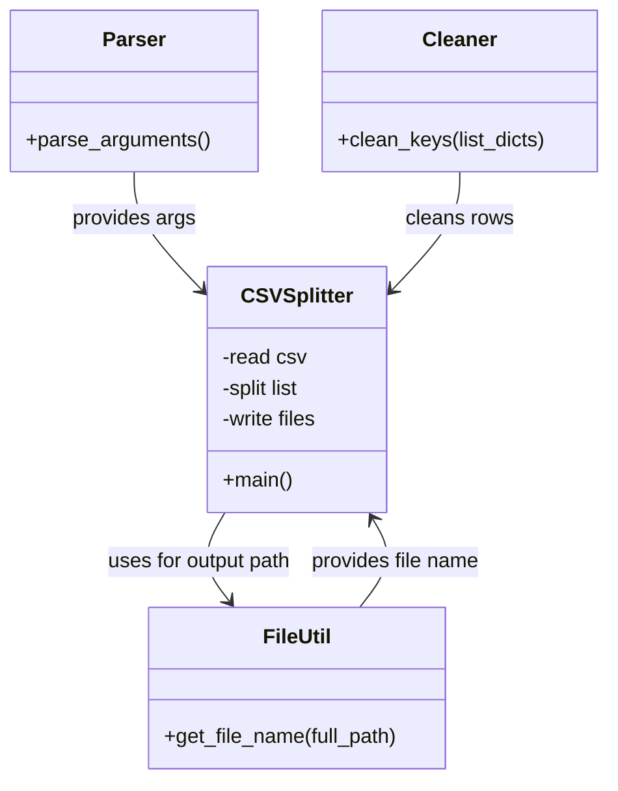

# Diagram: common/location_service/scripts/insert/break_up_csv.py


> Auto-generated by Obscura crawlers

## Diagram 1



### SVG

<svg id="container" width="471.5234375" xmlns="http://www.w3.org/2000/svg" class="classDiagram" height="608" viewBox="0 0 471.5234375 608" role="graphics-document document" aria-roledescription="class"><style>#container{font-family:"trebuchet ms",verdana,arial,sans-serif;font-size:16px;fill:#333;}@keyframes edge-animation-frame{from{stroke-dashoffset:0;}}@keyframes dash{to{stroke-dashoffset:0;}}#container .edge-animation-slow{stroke-dasharray:9,5!important;stroke-dashoffset:900;animation:dash 50s linear infinite;stroke-linecap:round;}#container .edge-animation-fast{stroke-dasharray:9,5!important;stroke-dashoffset:900;animation:dash 20s linear infinite;stroke-linecap:round;}#container .error-icon{fill:#552222;}#container .error-text{fill:#552222;stroke:#552222;}#container .edge-thickness-normal{stroke-width:1px;}#container .edge-thickness-thick{stroke-width:3.5px;}#container .edge-pattern-solid{stroke-dasharray:0;}#container .edge-thickness-invisible{stroke-width:0;fill:none;}#container .edge-pattern-dashed{stroke-dasharray:3;}#container .edge-pattern-dotted{stroke-dasharray:2;}#container .marker{fill:#333333;stroke:#333333;}#container .marker.cross{stroke:#333333;}#container svg{font-family:"trebuchet ms",verdana,arial,sans-serif;font-size:16px;}#container p{margin:0;}#container g.classGroup text{fill:#9370DB;stroke:none;font-family:"trebuchet ms",verdana,arial,sans-serif;font-size:10px;}#container g.classGroup text .title{font-weight:bolder;}#container .nodeLabel,#container .edgeLabel{color:#131300;}#container .edgeLabel .label rect{fill:#ECECFF;}#container .label text{fill:#131300;}#container .labelBkg{background:#ECECFF;}#container .edgeLabel .label span{background:#ECECFF;}#container .classTitle{font-weight:bolder;}#container .node rect,#container .node circle,#container .node ellipse,#container .node polygon,#container .node path{fill:#ECECFF;stroke:#9370DB;stroke-width:1px;}#container .divider{stroke:#9370DB;stroke-width:1;}#container g.clickable{cursor:pointer;}#container g.classGroup rect{fill:#ECECFF;stroke:#9370DB;}#container g.classGroup line{stroke:#9370DB;stroke-width:1;}#container .classLabel .box{stroke:none;stroke-width:0;fill:#ECECFF;opacity:0.5;}#container .classLabel .label{fill:#9370DB;font-size:10px;}#container .relation{stroke:#333333;stroke-width:1;fill:none;}#container .dashed-line{stroke-dasharray:3;}#container .dotted-line{stroke-dasharray:1 2;}#container #compositionStart,#container .composition{fill:#333333!important;stroke:#333333!important;stroke-width:1;}#container #compositionEnd,#container .composition{fill:#333333!important;stroke:#333333!important;stroke-width:1;}#container #dependencyStart,#container .dependency{fill:#333333!important;stroke:#333333!important;stroke-width:1;}#container #dependencyStart,#container .dependency{fill:#333333!important;stroke:#333333!important;stroke-width:1;}#container #extensionStart,#container .extension{fill:transparent!important;stroke:#333333!important;stroke-width:1;}#container #extensionEnd,#container .extension{fill:transparent!important;stroke:#333333!important;stroke-width:1;}#container #aggregationStart,#container .aggregation{fill:transparent!important;stroke:#333333!important;stroke-width:1;}#container #aggregationEnd,#container .aggregation{fill:transparent!important;stroke:#333333!important;stroke-width:1;}#container #lollipopStart,#container .lollipop{fill:#ECECFF!important;stroke:#333333!important;stroke-width:1;}#container #lollipopEnd,#container .lollipop{fill:#ECECFF!important;stroke:#333333!important;stroke-width:1;}#container .edgeTerminals{font-size:11px;line-height:initial;}#container .classTitleText{text-anchor:middle;font-size:18px;fill:#333;}#container .label-icon{display:inline-block;height:1em;overflow:visible;vertical-align:-0.125em;}#container .node .label-icon path{fill:currentColor;stroke:revert;stroke-width:revert;}#container :root{--mermaid-font-family:"trebuchet ms",verdana,arial,sans-serif;}</style><g><defs><marker id="container_class-aggregationStart" class="marker aggregation class" refX="18" refY="7" markerWidth="190" markerHeight="240" orient="auto"><path d="M 18,7 L9,13 L1,7 L9,1 Z"></path></marker></defs><defs><marker id="container_class-aggregationEnd" class="marker aggregation class" refX="1" refY="7" markerWidth="20" markerHeight="28" orient="auto"><path d="M 18,7 L9,13 L1,7 L9,1 Z"></path></marker></defs><defs><marker id="container_class-extensionStart" class="marker extension class" refX="18" refY="7" markerWidth="190" markerHeight="240" orient="auto"><path d="M 1,7 L18,13 V 1 Z"></path></marker></defs><defs><marker id="container_class-extensionEnd" class="marker extension class" refX="1" refY="7" markerWidth="20" markerHeight="28" orient="auto"><path d="M 1,1 V 13 L18,7 Z"></path></marker></defs><defs><marker id="container_class-compositionStart" class="marker composition class" refX="18" refY="7" markerWidth="190" markerHeight="240" orient="auto"><path d="M 18,7 L9,13 L1,7 L9,1 Z"></path></marker></defs><defs><marker id="container_class-compositionEnd" class="marker composition class" refX="1" refY="7" markerWidth="20" markerHeight="28" orient="auto"><path d="M 18,7 L9,13 L1,7 L9,1 Z"></path></marker></defs><defs><marker id="container_class-dependencyStart" class="marker dependency class" refX="6" refY="7" markerWidth="190" markerHeight="240" orient="auto"><path d="M 5,7 L9,13 L1,7 L9,1 Z"></path></marker></defs><defs><marker id="container_class-dependencyEnd" class="marker dependency class" refX="13" refY="7" markerWidth="20" markerHeight="28" orient="auto"><path d="M 18,7 L9,13 L14,7 L9,1 Z"></path></marker></defs><defs><marker id="container_class-lollipopStart" class="marker lollipop class" refX="13" refY="7" markerWidth="190" markerHeight="240" orient="auto"><circle stroke="black" fill="transparent" cx="7" cy="7" r="6"></circle></marker></defs><defs><marker id="container_class-lollipopEnd" class="marker lollipop class" refX="1" refY="7" markerWidth="190" markerHeight="240" orient="auto"><circle stroke="black" fill="transparent" cx="7" cy="7" r="6"></circle></marker></defs><g class="root"><g class="clusters"></g><g class="edgePaths"><path d="M103.383,134L103.383,140.167C103.383,146.333,103.383,158.667,111.913,173.81C120.443,188.954,137.504,206.908,146.034,215.885L154.564,224.862" id="id_Parser_CSVSplitter_1" class="edge-thickness-normal edge-pattern-solid relation" style=";;;" data-edge="true" data-et="edge" data-id="id_Parser_CSVSplitter_1" data-points="W3sieCI6MTAzLjM4MjgxMjUsInkiOjEzNH0seyJ4IjoxMDMuMzgyODEyNSwieSI6MTcxfSx7IngiOjE1OC42OTcyNjU2MjUsInkiOjIyOS4yMTE1MjI3MTAwNjIzfV0=" marker-end="url(#container_class-dependencyEnd)"></path><path d="M280.604,474L285.581,467.833C290.557,461.667,300.51,449.333,302.263,437.855C304.017,426.377,297.571,415.753,294.348,410.441L291.125,405.13" id="id_FileUtil_CSVSplitter_2" class="edge-thickness-normal edge-pattern-solid relation" style=";;;" data-edge="true" data-et="edge" data-id="id_FileUtil_CSVSplitter_2" data-points="W3sieCI6MjgwLjYwNDE3OTY4NzUsInkiOjQ3NH0seyJ4IjozMTAuNDYyODkwNjI1LCJ5Ijo0Mzd9LHsieCI6Mjg4LjAxMjczMjAyNTM3NTk1LCJ5Ijo0MDB9XQ==" marker-end="url(#container_class-dependencyEnd)"></path><path d="M356.145,134L356.145,140.167C356.145,146.333,356.145,158.667,347.614,173.81C339.084,188.954,322.024,206.908,313.493,215.885L304.963,224.862" id="id_Cleaner_CSVSplitter_3" class="edge-thickness-normal edge-pattern-solid relation" style=";;;" data-edge="true" data-et="edge" data-id="id_Cleaner_CSVSplitter_3" data-points="W3sieCI6MzU2LjE0NDUzMTI1LCJ5IjoxMzR9LHsieCI6MzU2LjE0NDUzMTI1LCJ5IjoxNzF9LHsieCI6MzAwLjgzMDA3ODEyNSwieSI6MjI5LjIxMTUyMjcxMDA2MjN9XQ==" marker-end="url(#container_class-dependencyEnd)"></path><path d="M171.515,400L167.773,406.167C164.031,412.333,156.548,424.667,157.155,436.222C157.761,447.777,166.458,458.554,170.807,463.942L175.155,469.331" id="id_CSVSplitter_FileUtil_4" class="edge-thickness-normal edge-pattern-solid relation" style=";;;" data-edge="true" data-et="edge" data-id="id_CSVSplitter_FileUtil_4" data-points="W3sieCI6MTcxLjUxNDYxMTcyNDYyNDA1LCJ5Ijo0MDB9LHsieCI6MTQ5LjA2NDQ1MzEyNSwieSI6NDM3fSx7IngiOjE3OC45MjMxNjQwNjI1LCJ5Ijo0NzR9XQ==" marker-end="url(#container_class-dependencyEnd)"></path></g><g class="edgeLabels"><g class="edgeLabel" transform="translate(103.3828125, 171)"><g class="label" data-id="id_Parser_CSVSplitter_1" transform="translate(-48.59375, -12)"><foreignObject width="97.1875" height="24"><div xmlns="http://www.w3.org/1999/xhtml" class="labelBkg" style="display: table-cell; white-space: nowrap; line-height: 1.5; max-width: 200px; text-align: center;"><span class="edgeLabel"><p>provides args</p></span></div></foreignObject></g></g><g class="edgeLabel" transform="translate(309.12307, 438.66026)"><g class="label" data-id="id_FileUtil_CSVSplitter_2" transform="translate(-67.078125, -12)"><foreignObject width="134.15625" height="24"><div xmlns="http://www.w3.org/1999/xhtml" class="labelBkg" style="display: table-cell; white-space: nowrap; line-height: 1.5; max-width: 200px; text-align: center;"><span class="edgeLabel"><p>provides file name</p></span></div></foreignObject></g></g><g class="edgeLabel" transform="translate(356.14453125, 171)"><g class="label" data-id="id_Cleaner_CSVSplitter_3" transform="translate(-42.296875, -12)"><foreignObject width="84.59375" height="24"><div xmlns="http://www.w3.org/1999/xhtml" class="labelBkg" style="display: table-cell; white-space: nowrap; line-height: 1.5; max-width: 200px; text-align: center;"><span class="edgeLabel"><p>cleans rows</p></span></div></foreignObject></g></g><g class="edgeLabel" transform="translate(150.40427, 438.66026)"><g class="label" data-id="id_CSVSplitter_FileUtil_4" transform="translate(-74.3203125, -12)"><foreignObject width="148.640625" height="24"><div xmlns="http://www.w3.org/1999/xhtml" class="labelBkg" style="display: table-cell; white-space: nowrap; line-height: 1.5; max-width: 200px; text-align: center;"><span class="edgeLabel"><p>uses for output path</p></span></div></foreignObject></g></g></g><g class="nodes"><g class="node default" id="classId-Parser-0" transform="translate(103.3828125, 71)"><g class="basic label-container"><path d="M-95.3828125 -63 L95.3828125 -63 L95.3828125 63 L-95.3828125 63" stroke="none" stroke-width="0" fill="#ECECFF" style=""></path><path d="M-95.3828125 -63 C-27.533404011475184 -63, 40.31600447704963 -63, 95.3828125 -63 M-95.3828125 -63 C-28.58518655859315 -63, 38.2124393828137 -63, 95.3828125 -63 M95.3828125 -63 C95.3828125 -16.47242229825742, 95.3828125 30.05515540348516, 95.3828125 63 M95.3828125 -63 C95.3828125 -20.978831036906826, 95.3828125 21.04233792618635, 95.3828125 63 M95.3828125 63 C46.345324322239385 63, -2.6921638555212297 63, -95.3828125 63 M95.3828125 63 C26.765364040633102 63, -41.852084418733796 63, -95.3828125 63 M-95.3828125 63 C-95.3828125 30.456699970678812, -95.3828125 -2.086600058642375, -95.3828125 -63 M-95.3828125 63 C-95.3828125 37.112359597236974, -95.3828125 11.224719194473955, -95.3828125 -63" stroke="#9370DB" stroke-width="1.3" fill="none" stroke-dasharray="0 0" style=""></path></g><g class="annotation-group text" transform="translate(0, -39)"></g><g class="label-group text" transform="translate(-23.375, -39)"><g class="label" style="font-weight: bolder" transform="translate(0,-12)"><foreignObject width="46.75" height="24"><div xmlns="http://www.w3.org/1999/xhtml" style="display: table-cell; white-space: nowrap; line-height: 1.5; max-width: 96px; text-align: center;"><span class="nodeLabel markdown-node-label" style=""><p>Parser</p></span></div></foreignObject></g></g><g class="members-group text" transform="translate(-83.3828125, 9)"></g><g class="methods-group text" transform="translate(-83.3828125, 39)"><g class="label" style="" transform="translate(0,-12)"><foreignObject width="143.390625" height="24"><div xmlns="http://www.w3.org/1999/xhtml" style="display: table-cell; white-space: nowrap; line-height: 1.5; max-width: 201px; text-align: center;"><span class="nodeLabel markdown-node-label" style=""><p>+parse_arguments()</p></span></div></foreignObject></g></g><g class="divider" style=""><path d="M-95.3828125 -15 C-54.896922181672245 -15, -14.41103186334449 -15, 95.3828125 -15 M-95.3828125 -15 C-37.084968478311914 -15, 21.21287554337617 -15, 95.3828125 -15" stroke="#9370DB" stroke-width="1.3" fill="none" stroke-dasharray="0 0" style=""></path></g><g class="divider" style=""><path d="M-95.3828125 9 C-42.47531296406802 9, 10.432186571863966 9, 95.3828125 9 M-95.3828125 9 C-25.3228747773303 9, 44.7370629453394 9, 95.3828125 9" stroke="#9370DB" stroke-width="1.3" fill="none" stroke-dasharray="0 0" style=""></path></g></g><g class="node default" id="classId-FileUtil-1" transform="translate(229.763671875, 537)"><g class="basic label-container"><path d="M-117.56640625 -63 L117.56640625 -63 L117.56640625 63 L-117.56640625 63" stroke="none" stroke-width="0" fill="#ECECFF" style=""></path><path d="M-117.56640625 -63 C-68.3813169449575 -63, -19.19622763991501 -63, 117.56640625 -63 M-117.56640625 -63 C-63.78832113289412 -63, -10.010236015788237 -63, 117.56640625 -63 M117.56640625 -63 C117.56640625 -28.217968697983025, 117.56640625 6.56406260403395, 117.56640625 63 M117.56640625 -63 C117.56640625 -20.64401357233465, 117.56640625 21.7119728553307, 117.56640625 63 M117.56640625 63 C67.51888631652811 63, 17.47136638305622 63, -117.56640625 63 M117.56640625 63 C40.359451281095005 63, -36.84750368780999 63, -117.56640625 63 M-117.56640625 63 C-117.56640625 30.892160492971783, -117.56640625 -1.215679014056434, -117.56640625 -63 M-117.56640625 63 C-117.56640625 14.300956483382421, -117.56640625 -34.39808703323516, -117.56640625 -63" stroke="#9370DB" stroke-width="1.3" fill="none" stroke-dasharray="0 0" style=""></path></g><g class="annotation-group text" transform="translate(0, -39)"></g><g class="label-group text" transform="translate(-25.6015625, -39)"><g class="label" style="font-weight: bolder" transform="translate(0,-12)"><foreignObject width="51.203125" height="24"><div xmlns="http://www.w3.org/1999/xhtml" style="display: table-cell; white-space: nowrap; line-height: 1.5; max-width: 101px; text-align: center;"><span class="nodeLabel markdown-node-label" style=""><p>FileUtil</p></span></div></foreignObject></g></g><g class="members-group text" transform="translate(-105.56640625, 9)"></g><g class="methods-group text" transform="translate(-105.56640625, 39)"><g class="label" style="" transform="translate(0,-12)"><foreignObject width="185.53125" height="24"><div xmlns="http://www.w3.org/1999/xhtml" style="display: table-cell; white-space: nowrap; line-height: 1.5; max-width: 243px; text-align: center;"><span class="nodeLabel markdown-node-label" style=""><p>+get_file_name(full_path)</p></span></div></foreignObject></g></g><g class="divider" style=""><path d="M-117.56640625 -15 C-36.319599782657136 -15, 44.92720668468573 -15, 117.56640625 -15 M-117.56640625 -15 C-64.20879830364358 -15, -10.851190357287152 -15, 117.56640625 -15" stroke="#9370DB" stroke-width="1.3" fill="none" stroke-dasharray="0 0" style=""></path></g><g class="divider" style=""><path d="M-117.56640625 9 C-45.14954240974002 9, 27.267321430519956 9, 117.56640625 9 M-117.56640625 9 C-57.49724012024021 9, 2.5719260095195864 9, 117.56640625 9" stroke="#9370DB" stroke-width="1.3" fill="none" stroke-dasharray="0 0" style=""></path></g></g><g class="node default" id="classId-Cleaner-2" transform="translate(356.14453125, 71)"><g class="basic label-container"><path d="M-107.37890625 -63 L107.37890625 -63 L107.37890625 63 L-107.37890625 63" stroke="none" stroke-width="0" fill="#ECECFF" style=""></path><path d="M-107.37890625 -63 C-62.157835915338055 -63, -16.93676558067611 -63, 107.37890625 -63 M-107.37890625 -63 C-58.92121475842102 -63, -10.463523266842046 -63, 107.37890625 -63 M107.37890625 -63 C107.37890625 -26.68463362974598, 107.37890625 9.630732740508037, 107.37890625 63 M107.37890625 -63 C107.37890625 -28.838837680514985, 107.37890625 5.322324638970031, 107.37890625 63 M107.37890625 63 C50.13405657167854 63, -7.110793106642916 63, -107.37890625 63 M107.37890625 63 C55.954354781035015 63, 4.52980331207003 63, -107.37890625 63 M-107.37890625 63 C-107.37890625 19.42771352361099, -107.37890625 -24.14457295277802, -107.37890625 -63 M-107.37890625 63 C-107.37890625 13.220983664899023, -107.37890625 -36.55803267020195, -107.37890625 -63" stroke="#9370DB" stroke-width="1.3" fill="none" stroke-dasharray="0 0" style=""></path></g><g class="annotation-group text" transform="translate(0, -39)"></g><g class="label-group text" transform="translate(-27.8203125, -39)"><g class="label" style="font-weight: bolder" transform="translate(0,-12)"><foreignObject width="55.640625" height="24"><div xmlns="http://www.w3.org/1999/xhtml" style="display: table-cell; white-space: nowrap; line-height: 1.5; max-width: 106px; text-align: center;"><span class="nodeLabel markdown-node-label" style=""><p>Cleaner</p></span></div></foreignObject></g></g><g class="members-group text" transform="translate(-95.37890625, 9)"></g><g class="methods-group text" transform="translate(-95.37890625, 39)"><g class="label" style="" transform="translate(0,-12)"><foreignObject width="162.9375" height="24"><div xmlns="http://www.w3.org/1999/xhtml" style="display: table-cell; white-space: nowrap; line-height: 1.5; max-width: 220px; text-align: center;"><span class="nodeLabel markdown-node-label" style=""><p>+clean_keys(list_dicts)</p></span></div></foreignObject></g></g><g class="divider" style=""><path d="M-107.37890625 -15 C-45.83976590616045 -15, 15.699374437679097 -15, 107.37890625 -15 M-107.37890625 -15 C-21.65281866712631 -15, 64.07326891574738 -15, 107.37890625 -15" stroke="#9370DB" stroke-width="1.3" fill="none" stroke-dasharray="0 0" style=""></path></g><g class="divider" style=""><path d="M-107.37890625 9 C-33.3547665718019 9, 40.66937310639619 9, 107.37890625 9 M-107.37890625 9 C-33.45844359067438 9, 40.462019068651244 9, 107.37890625 9" stroke="#9370DB" stroke-width="1.3" fill="none" stroke-dasharray="0 0" style=""></path></g></g><g class="node default" id="classId-CSVSplitter-3" transform="translate(229.763671875, 304)"><g class="basic label-container"><path d="M-71.06640625 -96 L71.06640625 -96 L71.06640625 96 L-71.06640625 96" stroke="none" stroke-width="0" fill="#ECECFF" style=""></path><path d="M-71.06640625 -96 C-20.25830594478061 -96, 30.54979436043878 -96, 71.06640625 -96 M-71.06640625 -96 C-29.231403773778474 -96, 12.603598702443051 -96, 71.06640625 -96 M71.06640625 -96 C71.06640625 -41.19423666694334, 71.06640625 13.61152666611332, 71.06640625 96 M71.06640625 -96 C71.06640625 -47.82415113731759, 71.06640625 0.35169772536481503, 71.06640625 96 M71.06640625 96 C28.297279111031152 96, -14.471848027937696 96, -71.06640625 96 M71.06640625 96 C15.269081502208323 96, -40.528243245583354 96, -71.06640625 96 M-71.06640625 96 C-71.06640625 52.6981413508457, -71.06640625 9.396282701691405, -71.06640625 -96 M-71.06640625 96 C-71.06640625 47.74923191621468, -71.06640625 -0.5015361675706345, -71.06640625 -96" stroke="#9370DB" stroke-width="1.3" fill="none" stroke-dasharray="0 0" style=""></path></g><g class="annotation-group text" transform="translate(0, -72)"></g><g class="label-group text" transform="translate(-41.0234375, -72)"><g class="label" style="font-weight: bolder" transform="translate(0,-12)"><foreignObject width="82.046875" height="24"><div xmlns="http://www.w3.org/1999/xhtml" style="display: table-cell; white-space: nowrap; line-height: 1.5; max-width: 130px; text-align: center;"><span class="nodeLabel markdown-node-label" style=""><p>CSVSplitter</p></span></div></foreignObject></g></g><g class="members-group text" transform="translate(-59.06640625, -24)"><g class="label" style="" transform="translate(0,-12)"><foreignObject width="65.9375" height="24"><div xmlns="http://www.w3.org/1999/xhtml" style="display: table-cell; white-space: nowrap; line-height: 1.5; max-width: 123px; text-align: center;"><span class="nodeLabel markdown-node-label" style=""><p>-read csv</p></span></div></foreignObject></g><g class="label" style="" transform="translate(0,12)"><foreignObject width="65.09375" height="24"><div xmlns="http://www.w3.org/1999/xhtml" style="display: table-cell; white-space: nowrap; line-height: 1.5; max-width: 123px; text-align: center;"><span class="nodeLabel markdown-node-label" style=""><p>-split list</p></span></div></foreignObject></g><g class="label" style="" transform="translate(0,36)"><foreignObject width="77.109375" height="24"><div xmlns="http://www.w3.org/1999/xhtml" style="display: table-cell; white-space: nowrap; line-height: 1.5; max-width: 134px; text-align: center;"><span class="nodeLabel markdown-node-label" style=""><p>-write files</p></span></div></foreignObject></g></g><g class="methods-group text" transform="translate(-59.06640625, 72)"><g class="label" style="" transform="translate(0,-12)"><foreignObject width="54.65625" height="24"><div xmlns="http://www.w3.org/1999/xhtml" style="display: table-cell; white-space: nowrap; line-height: 1.5; max-width: 112px; text-align: center;"><span class="nodeLabel markdown-node-label" style=""><p>+main()</p></span></div></foreignObject></g></g><g class="divider" style=""><path d="M-71.06640625 -48 C-42.06954236270964 -48, -13.072678475419274 -48, 71.06640625 -48 M-71.06640625 -48 C-35.62805584410735 -48, -0.18970543821470187 -48, 71.06640625 -48" stroke="#9370DB" stroke-width="1.3" fill="none" stroke-dasharray="0 0" style=""></path></g><g class="divider" style=""><path d="M-71.06640625 48 C-18.252482979689276 48, 34.56144029062145 48, 71.06640625 48 M-71.06640625 48 C-14.686038338399108 48, 41.694329573201784 48, 71.06640625 48" stroke="#9370DB" stroke-width="1.3" fill="none" stroke-dasharray="0 0" style=""></path></g></g></g></g></g></svg>

## Diagram 2

```mermaid
flowchart TD
    A[Start] --> B[parse_arguments()]
    B --> C[open CSV file]
    C --> D[read csv.DictReader -> list dr]
    D --> E[compute splits: dr[i::number_of_files]]
    E --> F[get_file_name(args.file)]
    F --> G[for each split i]
    G --> H[clean_keys(split)]
    H --> I[open ../fv-location-data/broken_up_locs/{file_name}_{i}.csv]
    I --> J[write header and writerows(split)]
    J --> K[close file]
    K --> L{more splits?}
    L -- yes --> G
    L -- no --> M[End]
```

> SVG rendering failed for this diagram.
