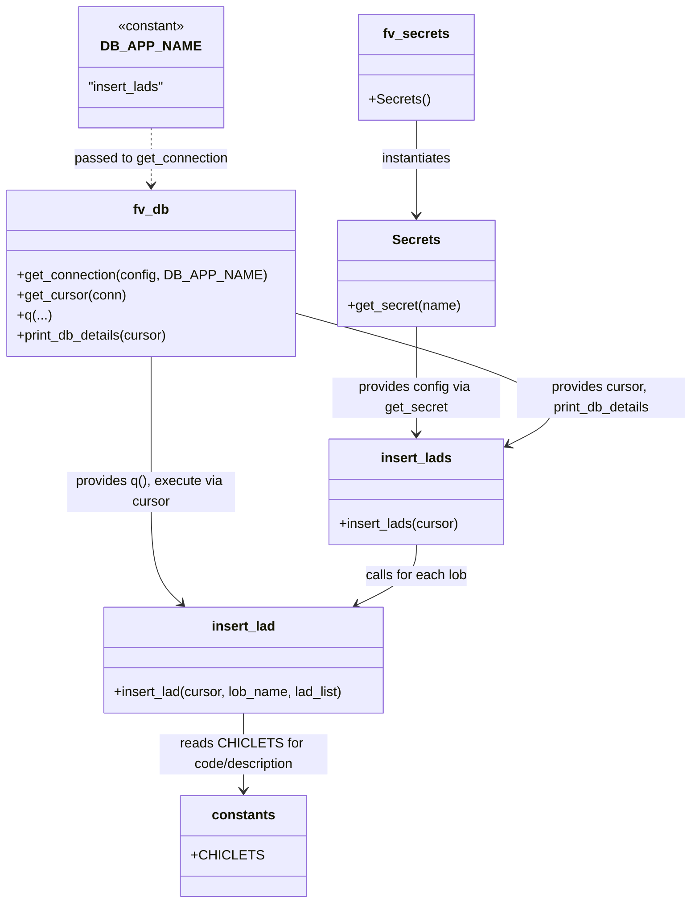

# Diagram: common/location_service/scripts/insert_lads.py

> Auto-generated by Obscura crawlers

## Mermaid

### SVG

<svg id="container" width="688.7544555664062" xmlns="http://www.w3.org/2000/svg" class="classDiagram" height="1074" viewBox="0 0 688.7544555664062 1074" role="graphics-document document" aria-roledescription="class"><g><defs><marker id="container_class-aggregationStart" class="marker aggregation class" refX="18" refY="7" markerWidth="190" markerHeight="240" orient="auto"><path d="M 18,7 L9,13 L1,7 L9,1 Z"></path></marker></defs><defs><marker id="container_class-aggregationEnd" class="marker aggregation class" refX="1" refY="7" markerWidth="20" markerHeight="28" orient="auto"><path d="M 18,7 L9,13 L1,7 L9,1 Z"></path></marker></defs><defs><marker id="container_class-extensionStart" class="marker extension class" refX="18" refY="7" markerWidth="190" markerHeight="240" orient="auto"><path d="M 1,7 L18,13 V 1 Z"></path></marker></defs><defs><marker id="container_class-extensionEnd" class="marker extension class" refX="1" refY="7" markerWidth="20" markerHeight="28" orient="auto"><path d="M 1,1 V 13 L18,7 Z"></path></marker></defs><defs><marker id="container_class-compositionStart" class="marker composition class" refX="18" refY="7" markerWidth="190" markerHeight="240" orient="auto"><path d="M 18,7 L9,13 L1,7 L9,1 Z"></path></marker></defs><defs><marker id="container_class-compositionEnd" class="marker composition class" refX="1" refY="7" markerWidth="20" markerHeight="28" orient="auto"><path d="M 18,7 L9,13 L1,7 L9,1 Z"></path></marker></defs><defs><marker id="container_class-dependencyStart" class="marker dependency class" refX="6" refY="7" markerWidth="190" markerHeight="240" orient="auto"><path d="M 5,7 L9,13 L1,7 L9,1 Z"></path></marker></defs><defs><marker id="container_class-dependencyEnd" class="marker dependency class" refX="13" refY="7" markerWidth="20" markerHeight="28" orient="auto"><path d="M 18,7 L9,13 L14,7 L9,1 Z"></path></marker></defs><defs><marker id="container_class-lollipopStart" class="marker lollipop class" refX="13" refY="7" markerWidth="190" markerHeight="240" orient="auto"><circle stroke="black" fill="transparent" cx="7" cy="7" r="6"></circle></marker></defs><defs><marker id="container_class-lollipopEnd" class="marker lollipop class" refX="1" refY="7" markerWidth="190" markerHeight="240" orient="auto"><circle stroke="black" fill="transparent" cx="7" cy="7" r="6"></circle></marker></defs><g class="root"><g class="clusters"></g><g class="edgePaths"><path d="M479.746,143L479.746,150.667C479.746,158.333,479.746,173.667,479.746,192.5C479.746,211.333,479.746,233.667,479.746,244.833L479.746,256" id="id_fv_secrets_Secrets_1" class="edge-thickness-normal edge-pattern-solid relation" style=";;;" data-edge="true" data-et="edge" data-id="id_fv_secrets_Secrets_1" data-points="W3sieCI6NDc5Ljc0NjA5Mzc1LCJ5IjoxNDN9LHsieCI6NDc5Ljc0NjA5Mzc1LCJ5IjoxODl9LHsieCI6NDc5Ljc0NjA5Mzc1LCJ5IjoyNjJ9XQ==" marker-end="url(#container_class-dependencyEnd)"></path><path d="M479.746,388L479.746,402.167C479.746,416.333,479.746,444.667,479.746,466C479.746,487.333,479.746,501.667,479.746,508.833L479.746,516" id="id_Secrets_insert_lads_2" class="edge-thickness-normal edge-pattern-solid relation" style=";;;" data-edge="true" data-et="edge" data-id="id_Secrets_insert_lads_2" data-points="W3sieCI6NDc5Ljc0NjA5Mzc1LCJ5IjozODh9LHsieCI6NDc5Ljc0NjA5Mzc1LCJ5Ijo0NzN9LHsieCI6NDc5Ljc0NjA5Mzc1LCJ5Ijo1MjJ9XQ==" marker-end="url(#container_class-dependencyEnd)"></path><path d="M337.273,371.226L397.686,388.188C458.098,405.151,578.922,439.075,621.02,465.361C663.118,491.647,626.49,510.294,608.177,519.617L589.863,528.941" id="id_fv_db_insert_lads_3" class="edge-thickness-normal edge-pattern-solid relation" style=";;;" data-edge="true" data-et="edge" data-id="id_fv_db_insert_lads_3" data-points="W3sieCI6MzM3LjI3MzQzNzUsInkiOjM3MS4yMjYxNDQ5NTMzMTI2fSx7IngiOjY5OS43NDYwOTM3NSwieSI6NDczfSx7IngiOjU4NC41MTU2MjUsInkiOjUzMS42NjI3ODQwOTA5MDkxfV0=" marker-end="url(#container_class-dependencyEnd)"></path><path d="M172.637,424L172.637,432.167C172.637,440.333,172.637,456.667,172.637,483.5C172.637,510.333,172.637,547.667,172.637,583C172.637,618.333,172.637,651.667,178.68,673.827C184.724,695.988,196.81,706.976,202.854,712.47L208.897,717.964" id="id_fv_db_insert_lad_4" class="edge-thickness-normal edge-pattern-solid relation" style=";;;" data-edge="true" data-et="edge" data-id="id_fv_db_insert_lad_4" data-points="W3sieCI6MTcyLjYzNjcxODc1LCJ5Ijo0MjR9LHsieCI6MTcyLjYzNjcxODc1LCJ5Ijo0NzN9LHsieCI6MTcyLjYzNjcxODc1LCJ5Ijo1ODV9LHsieCI6MTcyLjYzNjcxODc1LCJ5Ijo2ODV9LHsieCI6MjEzLjMzNjcxODc1LCJ5Ijo3MjJ9XQ==" marker-end="url(#container_class-dependencyEnd)"></path><path d="M479.746,648L479.746,654.167C479.746,660.333,479.746,672.667,468.483,684.548C457.22,696.428,434.693,707.857,423.43,713.571L412.166,719.285" id="id_insert_lads_insert_lad_5" class="edge-thickness-normal edge-pattern-solid relation" style=";;;" data-edge="true" data-et="edge" data-id="id_insert_lads_insert_lad_5" data-points="W3sieCI6NDc5Ljc0NjA5Mzc1LCJ5Ijo2NDh9LHsieCI6NDc5Ljc0NjA5Mzc1LCJ5Ijo2ODV9LHsieCI6NDA2LjgxNTYyNSwieSI6NzIyfV0=" marker-end="url(#container_class-dependencyEnd)"></path><path d="M282.637,848L282.637,856.167C282.637,864.333,282.637,880.667,282.637,896C282.637,911.333,282.637,925.667,282.637,932.833L282.637,940" id="id_insert_lad_constants_6" class="edge-thickness-normal edge-pattern-solid relation" style=";;;" data-edge="true" data-et="edge" data-id="id_insert_lad_constants_6" data-points="W3sieCI6MjgyLjYzNjcxODc1LCJ5Ijo4NDh9LHsieCI6MjgyLjYzNjcxODc1LCJ5Ijo4OTd9LHsieCI6MjgyLjYzNjcxODc1LCJ5Ijo5NDZ9XQ==" marker-end="url(#container_class-dependencyEnd)"></path><path d="M172.637,152L172.637,158.167C172.637,164.333,172.637,176.667,172.637,188C172.637,199.333,172.637,209.667,172.637,214.833L172.637,220" id="id_DB_APP_NAME_fv_db_7" class="edge-thickness-normal edge-pattern-dashed relation" style=";;;" data-edge="true" data-et="edge" data-id="id_DB_APP_NAME_fv_db_7" data-points="W3sieCI6MTcyLjYzNjcxODc1LCJ5IjoxNTJ9LHsieCI6MTcyLjYzNjcxODc1LCJ5IjoxODl9LHsieCI6MTcyLjYzNjcxODc1LCJ5IjoyMjZ9XQ==" marker-end="url(#container_class-dependencyEnd)"></path></g><g class="edgeLabels"><g class="edgeLabel" transform="translate(479.74609375, 189)"><g class="label" data-id="id_fv_secrets_Secrets_1" transform="translate(-42.9140625, -12)"><foreignObject width="85.828125" height="24">

instantiates

</foreignObject></g></g><g class="edgeLabel" transform="translate(479.74609375, 473)"><g class="label" data-id="id_Secrets_insert_lads_2" transform="translate(-100, -24)"><foreignObject width="200" height="48">

provides config via get_secret

</foreignObject></g></g><g class="edgeLabel" transform="translate(580.75448, 439.58994)"><g class="label" data-id="id_fv_db_insert_lads_3" transform="translate(-100, -24)"><foreignObject width="200" height="48">

provides cursor, print_db_details

</foreignObject></g></g><g class="edgeLabel" transform="translate(172.63671875, 585)"><g class="label" data-id="id_fv_db_insert_lad_4" transform="translate(-100, -24)"><foreignObject width="200" height="48">

provides q(), execute via cursor

</foreignObject></g></g><g class="edgeLabel" transform="translate(479.74609375, 685)"><g class="label" data-id="id_insert_lads_insert_lad_5" transform="translate(-62.0390625, -12)"><foreignObject width="124.078125" height="24">

calls for each lob

</foreignObject></g></g><g class="edgeLabel" transform="translate(282.63671875, 897)"><g class="label" data-id="id_insert_lad_constants_6" transform="translate(-100, -24)"><foreignObject width="200" height="48">

reads CHICLETS for code/description

</foreignObject></g></g><g class="edgeLabel" transform="translate(172.63671875, 189)"><g class="label" data-id="id_DB_APP_NAME_fv_db_7" transform="translate(-92.84375, -12)"><foreignObject width="185.6875" height="24">

passed to get_connection

</foreignObject></g></g></g><g class="nodes"><g class="node default" id="classId-fv_db-0" transform="translate(172.63671875, 325)"><g class="basic label-container"><path d="M-164.63671875 -99 L164.63671875 -99 L164.63671875 99 L-164.63671875 99" stroke="none" stroke-width="0" fill="#ECECFF" style=""></path><path d="M-164.63671875 -99 C-70.36662201345426 -99, 23.903474723091477 -99, 164.63671875 -99 M-164.63671875 -99 C-74.28099728931917 -99, 16.07472417136165 -99, 164.63671875 -99 M164.63671875 -99 C164.63671875 -40.47074056693256, 164.63671875 18.058518866134875, 164.63671875 99 M164.63671875 -99 C164.63671875 -57.72016656665337, 164.63671875 -16.440333133306737, 164.63671875 99 M164.63671875 99 C48.30918995427528 99, -68.01833884144943 99, -164.63671875 99 M164.63671875 99 C74.05946861824701 99, -16.51778151350598 99, -164.63671875 99 M-164.63671875 99 C-164.63671875 19.863017055557663, -164.63671875 -59.273965888884675, -164.63671875 -99 M-164.63671875 99 C-164.63671875 24.661480978756032, -164.63671875 -49.677038042487936, -164.63671875 -99" stroke="#9370DB" stroke-width="1.3" fill="none" stroke-dasharray="0 0" style=""></path></g><g class="annotation-group text" transform="translate(0, -75)"></g><g class="label-group text" transform="translate(-20.2890625, -75)"><g class="label" style="font-weight: bolder" transform="translate(0,-12)"><foreignObject width="40.578125" height="24">

fv_db

</foreignObject></g></g><g class="members-group text" transform="translate(-152.63671875, -27)"></g><g class="methods-group text" transform="translate(-152.63671875, 3)"><g class="label" style="" transform="translate(0,-12)"><foreignObject width="284.984375" height="24">

+get_connection(config, DB_APP_NAME)

</foreignObject></g><g class="label" style="" transform="translate(0,12)"><foreignObject width="130.078125" height="24">

+get_cursor(conn)

</foreignObject></g><g class="label" style="" transform="translate(0,36)"><foreignObject width="39.453125" height="24">

+q(...)

</foreignObject></g><g class="label" style="" transform="translate(0,60)"><foreignObject width="183.515625" height="24">

+print_db_details(cursor)

</foreignObject></g></g><g class="divider" style=""><path d="M-164.63671875 -51 C-63.6686315727475 -51, 37.299455604505 -51, 164.63671875 -51 M-164.63671875 -51 C-35.354612031602954 -51, 93.92749468679409 -51, 164.63671875 -51" stroke="#9370DB" stroke-width="1.3" fill="none" stroke-dasharray="0 0" style=""></path></g><g class="divider" style=""><path d="M-164.63671875 -27 C-88.73759177225233 -27, -12.83846479450466 -27, 164.63671875 -27 M-164.63671875 -27 C-81.74061854619626 -27, 1.1554816576074813 -27, 164.63671875 -27" stroke="#9370DB" stroke-width="1.3" fill="none" stroke-dasharray="0 0" style=""></path></g></g><g class="node default" id="classId-fv_secrets-1" transform="translate(479.74609375, 80)"><g class="basic label-container"><path d="M-65.89453125 -63 L65.89453125 -63 L65.89453125 63 L-65.89453125 63" stroke="none" stroke-width="0" fill="#ECECFF" style=""></path><path d="M-65.89453125 -63 C-15.835901609558526 -63, 34.22272803088295 -63, 65.89453125 -63 M-65.89453125 -63 C-31.402092235665094 -63, 3.0903467786698116 -63, 65.89453125 -63 M65.89453125 -63 C65.89453125 -19.958577779467326, 65.89453125 23.082844441065347, 65.89453125 63 M65.89453125 -63 C65.89453125 -24.86648852792434, 65.89453125 13.267022944151321, 65.89453125 63 M65.89453125 63 C39.44161011772975 63, 12.988688985459497 63, -65.89453125 63 M65.89453125 63 C31.06181860034404 63, -3.77089404931192 63, -65.89453125 63 M-65.89453125 63 C-65.89453125 21.395688863178634, -65.89453125 -20.20862227364273, -65.89453125 -63 M-65.89453125 63 C-65.89453125 24.293571284599224, -65.89453125 -14.412857430801552, -65.89453125 -63" stroke="#9370DB" stroke-width="1.3" fill="none" stroke-dasharray="0 0" style=""></path></g><g class="annotation-group text" transform="translate(0, -39)"></g><g class="label-group text" transform="translate(-37.3203125, -39)"><g class="label" style="font-weight: bolder" transform="translate(0,-12)"><foreignObject width="74.640625" height="24">

fv_secrets

</foreignObject></g></g><g class="members-group text" transform="translate(-53.89453125, 9)"></g><g class="methods-group text" transform="translate(-53.89453125, 39)"><g class="label" style="" transform="translate(0,-12)"><foreignObject width="70.46875" height="24">

+Secrets()

</foreignObject></g></g><g class="divider" style=""><path d="M-65.89453125 -15 C-34.965435459737854 -15, -4.0363396694757085 -15, 65.89453125 -15 M-65.89453125 -15 C-26.97454865253369 -15, 11.945433944932617 -15, 65.89453125 -15" stroke="#9370DB" stroke-width="1.3" fill="none" stroke-dasharray="0 0" style=""></path></g><g class="divider" style=""><path d="M-65.89453125 9 C-29.2372595351165 9, 7.420012179766999 9, 65.89453125 9 M-65.89453125 9 C-25.57433638741154 9, 14.745858475176917 9, 65.89453125 9" stroke="#9370DB" stroke-width="1.3" fill="none" stroke-dasharray="0 0" style=""></path></g></g><g class="node default" id="classId-Secrets-2" transform="translate(479.74609375, 325)"><g class="basic label-container"><path d="M-92.47265625 -63 L92.47265625 -63 L92.47265625 63 L-92.47265625 63" stroke="none" stroke-width="0" fill="#ECECFF" style=""></path><path d="M-92.47265625 -63 C-39.010985533383355 -63, 14.45068518323329 -63, 92.47265625 -63 M-92.47265625 -63 C-26.627113734970962 -63, 39.218428780058076 -63, 92.47265625 -63 M92.47265625 -63 C92.47265625 -25.420326457306082, 92.47265625 12.159347085387836, 92.47265625 63 M92.47265625 -63 C92.47265625 -22.0029462572534, 92.47265625 18.994107485493203, 92.47265625 63 M92.47265625 63 C40.176378026141464 63, -12.119900197717072 63, -92.47265625 63 M92.47265625 63 C38.345637523481294 63, -15.781381203037412 63, -92.47265625 63 M-92.47265625 63 C-92.47265625 23.544499238680146, -92.47265625 -15.911001522639708, -92.47265625 -63 M-92.47265625 63 C-92.47265625 21.49500875014401, -92.47265625 -20.00998249971198, -92.47265625 -63" stroke="#9370DB" stroke-width="1.3" fill="none" stroke-dasharray="0 0" style=""></path></g><g class="annotation-group text" transform="translate(0, -39)"></g><g class="label-group text" transform="translate(-27.1640625, -39)"><g class="label" style="font-weight: bolder" transform="translate(0,-12)"><foreignObject width="54.328125" height="24">

Secrets

</foreignObject></g></g><g class="members-group text" transform="translate(-80.47265625, 9)"></g><g class="methods-group text" transform="translate(-80.47265625, 39)"><g class="label" style="" transform="translate(0,-12)"><foreignObject width="133.78125" height="24">

+get_secret(name)

</foreignObject></g></g><g class="divider" style=""><path d="M-92.47265625 -15 C-25.19088747473387 -15, 42.09088130053226 -15, 92.47265625 -15 M-92.47265625 -15 C-34.29769060695738 -15, 23.877275036085237 -15, 92.47265625 -15" stroke="#9370DB" stroke-width="1.3" fill="none" stroke-dasharray="0 0" style=""></path></g><g class="divider" style=""><path d="M-92.47265625 9 C-34.405423311146116 9, 23.66180962770777 9, 92.47265625 9 M-92.47265625 9 C-24.234871330604193 9, 44.002913588791614 9, 92.47265625 9" stroke="#9370DB" stroke-width="1.3" fill="none" stroke-dasharray="0 0" style=""></path></g></g><g class="node default" id="classId-constants-3" transform="translate(282.63671875, 1006)"><g class="basic label-container"><path d="M-67.24609375 -60 L67.24609375 -60 L67.24609375 60 L-67.24609375 60" stroke="none" stroke-width="0" fill="#ECECFF" style=""></path><path d="M-67.24609375 -60 C-14.822486709574434 -60, 37.60112033085113 -60, 67.24609375 -60 M-67.24609375 -60 C-36.329790035565786 -60, -5.413486321131572 -60, 67.24609375 -60 M67.24609375 -60 C67.24609375 -34.67097403518923, 67.24609375 -9.341948070378464, 67.24609375 60 M67.24609375 -60 C67.24609375 -33.886111931395405, 67.24609375 -7.772223862790803, 67.24609375 60 M67.24609375 60 C26.92869650164245 60, -13.388700746715102 60, -67.24609375 60 M67.24609375 60 C35.07426377728053 60, 2.9024338045610563 60, -67.24609375 60 M-67.24609375 60 C-67.24609375 14.856375035977628, -67.24609375 -30.287249928044744, -67.24609375 -60 M-67.24609375 60 C-67.24609375 23.78233164349553, -67.24609375 -12.435336713008937, -67.24609375 -60" stroke="#9370DB" stroke-width="1.3" fill="none" stroke-dasharray="0 0" style=""></path></g><g class="annotation-group text" transform="translate(0, -36)"></g><g class="label-group text" transform="translate(-35.7734375, -36)"><g class="label" style="font-weight: bolder" transform="translate(0,-12)"><foreignObject width="71.546875" height="24">

constants

</foreignObject></g></g><g class="members-group text" transform="translate(-55.24609375, 12)"><g class="label" style="" transform="translate(0,-12)"><foreignObject width="74.71875" height="24">

+CHICLETS

</foreignObject></g></g><g class="methods-group text" transform="translate(-55.24609375, 60)"></g><g class="divider" style=""><path d="M-67.24609375 -12 C-19.556022690149767 -12, 28.134048369700466 -12, 67.24609375 -12 M-67.24609375 -12 C-31.169507106772834 -12, 4.907079536454333 -12, 67.24609375 -12" stroke="#9370DB" stroke-width="1.3" fill="none" stroke-dasharray="0 0" style=""></path></g><g class="divider" style=""><path d="M-67.24609375 36 C-34.699124656610074 36, -2.1521555632201483 36, 67.24609375 36 M-67.24609375 36 C-17.616381825032505 36, 32.01333009993499 36, 67.24609375 36" stroke="#9370DB" stroke-width="1.3" fill="none" stroke-dasharray="0 0" style=""></path></g></g><g class="node default" id="classId-insert_lads-4" transform="translate(479.74609375, 585)"><g class="basic label-container"><path d="M-104.76953125 -63 L104.76953125 -63 L104.76953125 63 L-104.76953125 63" stroke="none" stroke-width="0" fill="#ECECFF" style=""></path><path d="M-104.76953125 -63 C-46.40198489844778 -63, 11.965561453104442 -63, 104.76953125 -63 M-104.76953125 -63 C-38.35927913561899 -63, 28.05097297876202 -63, 104.76953125 -63 M104.76953125 -63 C104.76953125 -29.641511306761025, 104.76953125 3.71697738647795, 104.76953125 63 M104.76953125 -63 C104.76953125 -19.102607643870307, 104.76953125 24.794784712259386, 104.76953125 63 M104.76953125 63 C56.881036941492106 63, 8.992542632984211 63, -104.76953125 63 M104.76953125 63 C53.30689677789263 63, 1.8442623057852643 63, -104.76953125 63 M-104.76953125 63 C-104.76953125 12.998790284500593, -104.76953125 -37.00241943099881, -104.76953125 -63 M-104.76953125 63 C-104.76953125 37.37929818960106, -104.76953125 11.758596379202118, -104.76953125 -63" stroke="#9370DB" stroke-width="1.3" fill="none" stroke-dasharray="0 0" style=""></path></g><g class="annotation-group text" transform="translate(0, -39)"></g><g class="label-group text" transform="translate(-40.9140625, -39)"><g class="label" style="font-weight: bolder" transform="translate(0,-12)"><foreignObject width="81.828125" height="24">

insert_lads

</foreignObject></g></g><g class="members-group text" transform="translate(-92.76953125, 9)"></g><g class="methods-group text" transform="translate(-92.76953125, 39)"><g class="label" style="" transform="translate(0,-12)"><foreignObject width="144.625" height="24">

+insert_lads(cursor)

</foreignObject></g></g><g class="divider" style=""><path d="M-104.76953125 -15 C-60.98280855922837 -15, -17.196085868456734 -15, 104.76953125 -15 M-104.76953125 -15 C-60.673000285058556 -15, -16.576469320117113 -15, 104.76953125 -15" stroke="#9370DB" stroke-width="1.3" fill="none" stroke-dasharray="0 0" style=""></path></g><g class="divider" style=""><path d="M-104.76953125 9 C-34.497029994949315 9, 35.77547126010137 9, 104.76953125 9 M-104.76953125 9 C-25.495356561631553 9, 53.778818126736894 9, 104.76953125 9" stroke="#9370DB" stroke-width="1.3" fill="none" stroke-dasharray="0 0" style=""></path></g></g><g class="node default" id="classId-insert_lad-5" transform="translate(282.63671875, 785)"><g class="basic label-container"><path d="M-169.19921875 -63 L169.19921875 -63 L169.19921875 63 L-169.19921875 63" stroke="none" stroke-width="0" fill="#ECECFF" style=""></path><path d="M-169.19921875 -63 C-51.307138498212126 -63, 66.58494175357575 -63, 169.19921875 -63 M-169.19921875 -63 C-73.17591627645533 -63, 22.84738619708935 -63, 169.19921875 -63 M169.19921875 -63 C169.19921875 -34.14964421331465, 169.19921875 -5.299288426629303, 169.19921875 63 M169.19921875 -63 C169.19921875 -30.452844940732263, 169.19921875 2.094310118535475, 169.19921875 63 M169.19921875 63 C77.79258412702102 63, -13.614050495957969 63, -169.19921875 63 M169.19921875 63 C39.46186084489966 63, -90.27549706020068 63, -169.19921875 63 M-169.19921875 63 C-169.19921875 21.873942838751972, -169.19921875 -19.252114322496055, -169.19921875 -63 M-169.19921875 63 C-169.19921875 29.042387488689783, -169.19921875 -4.915225022620433, -169.19921875 -63" stroke="#9370DB" stroke-width="1.3" fill="none" stroke-dasharray="0 0" style=""></path></g><g class="annotation-group text" transform="translate(0, -39)"></g><g class="label-group text" transform="translate(-37.0546875, -39)"><g class="label" style="font-weight: bolder" transform="translate(0,-12)"><foreignObject width="74.109375" height="24">

insert_lad

</foreignObject></g></g><g class="members-group text" transform="translate(-157.19921875, 9)"></g><g class="methods-group text" transform="translate(-157.19921875, 39)"><g class="label" style="" transform="translate(0,-12)"><foreignObject width="277.34375" height="24">

+insert_lad(cursor, lob_name, lad_list)

</foreignObject></g></g><g class="divider" style=""><path d="M-169.19921875 -15 C-38.43379344077235 -15, 92.3316318684553 -15, 169.19921875 -15 M-169.19921875 -15 C-59.48492007390075 -15, 50.229378602198494 -15, 169.19921875 -15" stroke="#9370DB" stroke-width="1.3" fill="none" stroke-dasharray="0 0" style=""></path></g><g class="divider" style=""><path d="M-169.19921875 9 C-49.18502410410427 9, 70.82917054179146 9, 169.19921875 9 M-169.19921875 9 C-88.17814286286244 9, -7.157066975724888 9, 169.19921875 9" stroke="#9370DB" stroke-width="1.3" fill="none" stroke-dasharray="0 0" style=""></path></g></g><g class="node default" id="classId-DB_APP_NAME-6" transform="translate(172.63671875, 80)"><g class="basic label-container"><path d="M-84.71484375 -72 L84.71484375 -72 L84.71484375 72 L-84.71484375 72" stroke="none" stroke-width="0" fill="#ECECFF" style=""></path><path d="M-84.71484375 -72 C-25.5897551220556 -72, 33.5353335058888 -72, 84.71484375 -72 M-84.71484375 -72 C-39.02317364468564 -72, 6.668496460628717 -72, 84.71484375 -72 M84.71484375 -72 C84.71484375 -40.316608078896365, 84.71484375 -8.63321615779273, 84.71484375 72 M84.71484375 -72 C84.71484375 -37.1974411740741, 84.71484375 -2.394882348148201, 84.71484375 72 M84.71484375 72 C21.66855801023035 72, -41.3777277295393 72, -84.71484375 72 M84.71484375 72 C40.98474295099674 72, -2.7453578480065204 72, -84.71484375 72 M-84.71484375 72 C-84.71484375 22.975526470092277, -84.71484375 -26.048947059815447, -84.71484375 -72 M-84.71484375 72 C-84.71484375 30.31969829759155, -84.71484375 -11.3606034048169, -84.71484375 -72" stroke="#9370DB" stroke-width="1.3" fill="none" stroke-dasharray="0 0" style=""></path></g><g class="annotation-group text" transform="translate(-40.4921875, -48)"><g class="label" style="" transform="translate(0,-12)"><foreignObject width="80.984375" height="24">

«constant»

</foreignObject></g></g><g class="label-group text" transform="translate(-52.3515625, -24)"><g class="label" style="font-weight: bolder" transform="translate(0,-12)"><foreignObject width="104.703125" height="24">

DB_APP_NAME

</foreignObject></g></g><g class="members-group text" transform="translate(-72.71484375, 24)"><g class="label" style="" transform="translate(0,-12)"><foreignObject width="93.078125" height="24">

"insert_lads"

</foreignObject></g></g><g class="methods-group text" transform="translate(-72.71484375, 72)"></g><g class="divider" style=""><path d="M-84.71484375 0 C-31.36090931052845 0, 21.993025128943103 0, 84.71484375 0 M-84.71484375 0 C-34.94913050593817 0, 14.816582738123657 0, 84.71484375 0" stroke="#9370DB" stroke-width="1.3" fill="none" stroke-dasharray="0 0" style=""></path></g><g class="divider" style=""><path d="M-84.71484375 48 C-18.13385044811345 48, 48.4471428537731 48, 84.71484375 48 M-84.71484375 48 C-33.128200555583334 48, 18.458442638833333 48, 84.71484375 48" stroke="#9370DB" stroke-width="1.3" fill="none" stroke-dasharray="0 0" style=""></path></g></g></g></g></g></svg>
