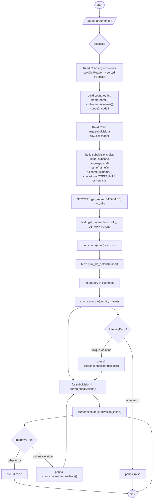
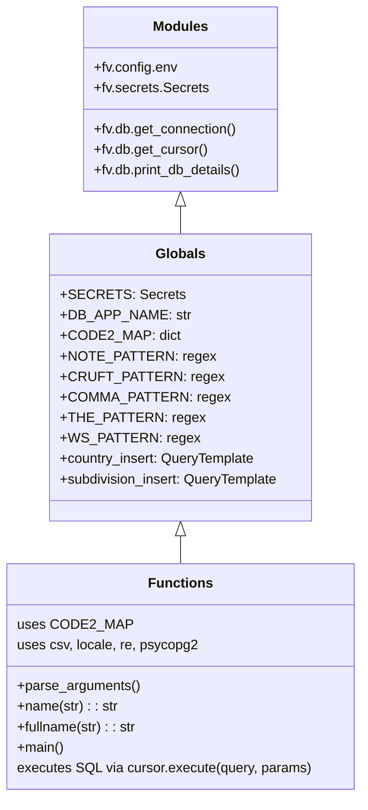

# Diagram: common/location_service/scripts/load_countries.py

> Auto-generated by Obscura crawlers

## Diagram 1

### SVG

<svg id="container" width="875.5469970703125" xmlns="http://www.w3.org/2000/svg" class="flowchart" height="2753.3125" viewBox="0 0 875.5469970703125 2753.3125" role="graphics-document document" aria-roledescription="flowchart-v2"><g><marker id="container_flowchart-v2-pointEnd" class="marker flowchart-v2" viewBox="0 0 10 10" refX="5" refY="5" markerUnits="userSpaceOnUse" markerWidth="8" markerHeight="8" orient="auto"><path d="M 0 0 L 10 5 L 0 10 z" class="arrowMarkerPath" style="stroke-width: 1; stroke-dasharray: 1, 0;"></path></marker><marker id="container_flowchart-v2-pointStart" class="marker flowchart-v2" viewBox="0 0 10 10" refX="4.5" refY="5" markerUnits="userSpaceOnUse" markerWidth="8" markerHeight="8" orient="auto"><path d="M 0 5 L 10 10 L 10 0 z" class="arrowMarkerPath" style="stroke-width: 1; stroke-dasharray: 1, 0;"></path></marker><marker id="container_flowchart-v2-circleEnd" class="marker flowchart-v2" viewBox="0 0 10 10" refX="11" refY="5" markerUnits="userSpaceOnUse" markerWidth="11" markerHeight="11" orient="auto"><circle cx="5" cy="5" r="5" class="arrowMarkerPath" style="stroke-width: 1; stroke-dasharray: 1, 0;"></circle></marker><marker id="container_flowchart-v2-circleStart" class="marker flowchart-v2" viewBox="0 0 10 10" refX="-1" refY="5" markerUnits="userSpaceOnUse" markerWidth="11" markerHeight="11" orient="auto"><circle cx="5" cy="5" r="5" class="arrowMarkerPath" style="stroke-width: 1; stroke-dasharray: 1, 0;"></circle></marker><marker id="container_flowchart-v2-crossEnd" class="marker cross flowchart-v2" viewBox="0 0 11 11" refX="12" refY="5.2" markerUnits="userSpaceOnUse" markerWidth="11" markerHeight="11" orient="auto"><path d="M 1,1 l 9,9 M 10,1 l -9,9" class="arrowMarkerPath" style="stroke-width: 2; stroke-dasharray: 1, 0;"></path></marker><marker id="container_flowchart-v2-crossStart" class="marker cross flowchart-v2" viewBox="0 0 11 11" refX="-1" refY="5.2" markerUnits="userSpaceOnUse" markerWidth="11" markerHeight="11" orient="auto"><path d="M 1,1 l 9,9 M 10,1 l -9,9" class="arrowMarkerPath" style="stroke-width: 2; stroke-dasharray: 1, 0;"></path></marker><g class="root"><g class="clusters"></g><g class="edgePaths"><path d="M568.648,47.5L568.565,51.583C568.482,55.667,568.315,63.833,568.302,71.5C568.289,79.167,568.429,86.334,568.5,89.917L568.57,93.501" id="L_Start_ParseArgs_0" class="edge-thickness-normal edge-pattern-solid edge-thickness-normal edge-pattern-solid flowchart-link" style=";" data-edge="true" data-et="edge" data-id="L_Start_ParseArgs_0" data-points="W3sieCI6NTY4LjY0ODQzNzUsInkiOjQ3LjV9LHsieCI6NTY4LjE0ODQzNzUsInkiOjcyfSx7IngiOjU2OC42NDg0Mzc1LCJ5Ijo5Ny41fV0=" marker-end="url(#container_flowchart-v2-pointEnd)"></path><path d="M568.648,136.5L568.565,140.583C568.482,144.667,568.315,152.833,568.232,160.417C568.148,168,568.148,175,568.148,178.5L568.148,182" id="L_ParseArgs_SetLocale_0" class="edge-thickness-normal edge-pattern-solid edge-thickness-normal edge-pattern-solid flowchart-link" style=";" data-edge="true" data-et="edge" data-id="L_ParseArgs_SetLocale_0" data-points="W3sieCI6NTY4LjY0ODQzNzUsInkiOjEzNi41fSx7IngiOjU2OC4xNDg0Mzc1LCJ5IjoxNjF9LHsieCI6NTY4LjE0ODQzNzUsInkiOjE4Nn1d" marker-end="url(#container_flowchart-v2-pointEnd)"></path><path d="M568.148,305.125L568.148,309.292C568.148,313.458,568.148,321.792,568.148,329.458C568.148,337.125,568.148,344.125,568.148,347.625L568.148,351.125" id="L_SetLocale_LoadCountries_0" class="edge-thickness-normal edge-pattern-solid edge-thickness-normal edge-pattern-solid flowchart-link" style=";" data-edge="true" data-et="edge" data-id="L_SetLocale_LoadCountries_0" data-points="W3sieCI6NTY4LjE0ODQzNzUsInkiOjMwNS4xMjV9LHsieCI6NTY4LjE0ODQzNzUsInkiOjMzMC4xMjV9LHsieCI6NTY4LjE0ODQzNzUsInkiOjM1NS4xMjV9XQ==" marker-end="url(#container_flowchart-v2-pointEnd)"></path><path d="M568.148,457.125L568.148,461.292C568.148,465.458,568.148,473.792,568.148,481.458C568.148,489.125,568.148,496.125,568.148,499.625L568.148,503.125" id="L_LoadCountries_BuildCountries_0" class="edge-thickness-normal edge-pattern-solid edge-thickness-normal edge-pattern-solid flowchart-link" style=";" data-edge="true" data-et="edge" data-id="L_LoadCountries_BuildCountries_0" data-points="W3sieCI6NTY4LjE0ODQzNzUsInkiOjQ1Ny4xMjV9LHsieCI6NTY4LjE0ODQzNzUsInkiOjQ4Mi4xMjV9LHsieCI6NTY4LjE0ODQzNzUsInkiOjUwNy4xMjV9XQ==" marker-end="url(#container_flowchart-v2-pointEnd)"></path><path d="M568.148,633.125L568.148,637.292C568.148,641.458,568.148,649.792,568.148,657.458C568.148,665.125,568.148,672.125,568.148,675.625L568.148,679.125" id="L_BuildCountries_LoadSubdivisions_0" class="edge-thickness-normal edge-pattern-solid edge-thickness-normal edge-pattern-solid flowchart-link" style=";" data-edge="true" data-et="edge" data-id="L_BuildCountries_LoadSubdivisions_0" data-points="W3sieCI6NTY4LjE0ODQzNzUsInkiOjYzMy4xMjV9LHsieCI6NTY4LjE0ODQzNzUsInkiOjY1OC4xMjV9LHsieCI6NTY4LjE0ODQzNzUsInkiOjY4My4xMjV9XQ==" marker-end="url(#container_flowchart-v2-pointEnd)"></path><path d="M568.148,761.125L568.148,765.292C568.148,769.458,568.148,777.792,568.148,785.458C568.148,793.125,568.148,800.125,568.148,803.625L568.148,807.125" id="L_LoadSubdivisions_BuildSubdivisions_0" class="edge-thickness-normal edge-pattern-solid edge-thickness-normal edge-pattern-solid flowchart-link" style=";" data-edge="true" data-et="edge" data-id="L_LoadSubdivisions_BuildSubdivisions_0" data-points="W3sieCI6NTY4LjE0ODQzNzUsInkiOjc2MS4xMjV9LHsieCI6NTY4LjE0ODQzNzUsInkiOjc4Ni4xMjV9LHsieCI6NTY4LjE0ODQzNzUsInkiOjgxMS4xMjV9XQ==" marker-end="url(#container_flowchart-v2-pointEnd)"></path><path d="M568.148,1009.125L568.148,1013.292C568.148,1017.458,568.148,1025.792,568.148,1033.458C568.148,1041.125,568.148,1048.125,568.148,1051.625L568.148,1055.125" id="L_BuildSubdivisions_GetConfig_0" class="edge-thickness-normal edge-pattern-solid edge-thickness-normal edge-pattern-solid flowchart-link" style=";" data-edge="true" data-et="edge" data-id="L_BuildSubdivisions_GetConfig_0" data-points="W3sieCI6NTY4LjE0ODQzNzUsInkiOjEwMDkuMTI1fSx7IngiOjU2OC4xNDg0Mzc1LCJ5IjoxMDM0LjEyNX0seyJ4Ijo1NjguMTQ4NDM3NSwieSI6MTA1OS4xMjV9XQ==" marker-end="url(#container_flowchart-v2-pointEnd)"></path><path d="M568.148,1137.125L568.148,1141.292C568.148,1145.458,568.148,1153.792,568.148,1161.458C568.148,1169.125,568.148,1176.125,568.148,1179.625L568.148,1183.125" id="L_GetConfig_DBConnect_0" class="edge-thickness-normal edge-pattern-solid edge-thickness-normal edge-pattern-solid flowchart-link" style=";" data-edge="true" data-et="edge" data-id="L_GetConfig_DBConnect_0" data-points="W3sieCI6NTY4LjE0ODQzNzUsInkiOjExMzcuMTI1fSx7IngiOjU2OC4xNDg0Mzc1LCJ5IjoxMTYyLjEyNX0seyJ4Ijo1NjguMTQ4NDM3NSwieSI6MTE4Ny4xMjV9XQ==" marker-end="url(#container_flowchart-v2-pointEnd)"></path><path d="M568.148,1265.125L568.148,1269.292C568.148,1273.458,568.148,1281.792,568.148,1289.458C568.148,1297.125,568.148,1304.125,568.148,1307.625L568.148,1311.125" id="L_DBConnect_OpenCursor_0" class="edge-thickness-normal edge-pattern-solid edge-thickness-normal edge-pattern-solid flowchart-link" style=";" data-edge="true" data-et="edge" data-id="L_DBConnect_OpenCursor_0" data-points="W3sieCI6NTY4LjE0ODQzNzUsInkiOjEyNjUuMTI1fSx7IngiOjU2OC4xNDg0Mzc1LCJ5IjoxMjkwLjEyNX0seyJ4Ijo1NjguMTQ4NDM3NSwieSI6MTMxNS4xMjV9XQ==" marker-end="url(#container_flowchart-v2-pointEnd)"></path><path d="M568.148,1369.125L568.148,1373.292C568.148,1377.458,568.148,1385.792,568.148,1393.458C568.148,1401.125,568.148,1408.125,568.148,1411.625L568.148,1415.125" id="L_OpenCursor_PrintDBDetails_0" class="edge-thickness-normal edge-pattern-solid edge-thickness-normal edge-pattern-solid flowchart-link" style=";" data-edge="true" data-et="edge" data-id="L_OpenCursor_PrintDBDetails_0" data-points="W3sieCI6NTY4LjE0ODQzNzUsInkiOjEzNjkuMTI1fSx7IngiOjU2OC4xNDg0Mzc1LCJ5IjoxMzk0LjEyNX0seyJ4Ijo1NjguMTQ4NDM3NSwieSI6MTQxOS4xMjV9XQ==" marker-end="url(#container_flowchart-v2-pointEnd)"></path><path d="M568.148,1473.125L568.148,1477.292C568.148,1481.458,568.148,1489.792,568.148,1497.458C568.148,1505.125,568.148,1512.125,568.148,1515.625L568.148,1519.125" id="L_PrintDBDetails_InsertCountriesLoop_0" class="edge-thickness-normal edge-pattern-solid edge-thickness-normal edge-pattern-solid flowchart-link" style=";" data-edge="true" data-et="edge" data-id="L_PrintDBDetails_InsertCountriesLoop_0" data-points="W3sieCI6NTY4LjE0ODQzNzUsInkiOjE0NzMuMTI1fSx7IngiOjU2OC4xNDg0Mzc1LCJ5IjoxNDk4LjEyNX0seyJ4Ijo1NjguMTQ4NDM3NSwieSI6MTUyMy4xMjV9XQ==" marker-end="url(#container_flowchart-v2-pointEnd)"></path><path d="M568.148,1577.125L568.148,1581.292C568.148,1585.458,568.148,1593.792,568.148,1601.458C568.148,1609.125,568.148,1616.125,568.148,1619.625L568.148,1623.125" id="L_InsertCountriesLoop_TryInsertCountry_0" class="edge-thickness-normal edge-pattern-solid edge-thickness-normal edge-pattern-solid flowchart-link" style=";" data-edge="true" data-et="edge" data-id="L_InsertCountriesLoop_TryInsertCountry_0" data-points="W3sieCI6NTY4LjE0ODQzNzUsInkiOjE1NzcuMTI1fSx7IngiOjU2OC4xNDg0Mzc1LCJ5IjoxNjAyLjEyNX0seyJ4Ijo1NjguMTQ4NDM3NSwieSI6MTYyNy4xMjV9XQ==" marker-end="url(#container_flowchart-v2-pointEnd)"></path><path d="M623.333,1681.125L631.849,1685.292C640.365,1689.458,657.397,1697.792,665.914,1705.458C674.43,1713.125,674.43,1720.125,674.43,1723.625L674.43,1727.125" id="L_TryInsertCountry_CountryUnique_0" class="edge-thickness-normal edge-pattern-solid edge-thickness-normal edge-pattern-solid flowchart-link" style=";" data-edge="true" data-et="edge" data-id="L_TryInsertCountry_CountryUnique_0" data-points="W3sieCI6NjIzLjMzMjkzMjY5MjMwNzcsInkiOjE2ODEuMTI1fSx7IngiOjY3NC40Mjk2ODc1LCJ5IjoxNzA2LjEyNX0seyJ4Ijo2NzQuNDI5Njg3NSwieSI6MTczMS4xMjV9XQ==" marker-end="url(#container_flowchart-v2-pointEnd)"></path><path d="M639.007,1853.296L629.149,1865.366C619.291,1877.437,599.575,1901.578,589.717,1919.148C579.859,1936.719,579.859,1947.719,579.859,1953.219L579.859,1958.719" id="L_CountryUnique_CountryRollback_0" class="edge-thickness-normal edge-pattern-solid edge-thickness-normal edge-pattern-solid flowchart-link" style=";" data-edge="true" data-et="edge" data-id="L_CountryUnique_CountryRollback_0" data-points="W3sieCI6NjM5LjAwNjY0ODQ3MzE4NjcsInkiOjE4NTMuMjk1NzEwOTczMTg2N30seyJ4Ijo1NzkuODU5Mzc1LCJ5IjoxOTI1LjcxODc1fSx7IngiOjU3OS44NTkzNzUsInkiOjE5NjIuNzE4NzV9XQ==" marker-end="url(#container_flowchart-v2-pointEnd)"></path><path d="M707.296,1855.853L715.628,1867.497C723.96,1879.141,740.625,1902.43,748.957,1926.741C757.289,1951.052,757.289,1976.385,757.289,1999.719C757.289,2023.052,757.289,2044.385,757.289,2065.719C757.289,2087.052,757.289,2108.385,757.289,2131.719C757.289,2155.052,757.289,2180.385,757.289,2203.719C757.289,2227.052,757.289,2248.385,757.289,2267.719C757.289,2287.052,757.289,2304.385,757.289,2330.352C757.289,2356.318,757.289,2390.917,757.289,2427.516C757.289,2464.115,757.289,2502.714,757.289,2529.513C757.289,2556.313,757.289,2571.313,757.289,2578.813L757.289,2586.313" id="L_CountryUnique_CountryRaise_0" class="edge-thickness-normal edge-pattern-solid edge-thickness-normal edge-pattern-solid flowchart-link" style=";" data-edge="true" data-et="edge" data-id="L_CountryUnique_CountryRaise_0" data-points="W3sieCI6NzA3LjI5NTgwNTgwNDYyNDgsInkiOjE4NTUuODUyNjMxNjk1Mzc1fSx7IngiOjc1Ny4yODkwNjI1LCJ5IjoxOTI1LjcxODc1fSx7IngiOjc1Ny4yODkwNjI1LCJ5IjoyMDAxLjcxODc1fSx7IngiOjc1Ny4yODkwNjI1LCJ5IjoyMDY1LjcxODc1fSx7IngiOjc1Ny4yODkwNjI1LCJ5IjoyMTI5LjcxODc1fSx7IngiOjc1Ny4yODkwNjI1LCJ5IjoyMjA1LjcxODc1fSx7IngiOjc1Ny4yODkwNjI1LCJ5IjoyMjY5LjcxODc1fSx7IngiOjc1Ny4yODkwNjI1LCJ5IjoyMzIxLjcxODc1fSx7IngiOjc1Ny4yODkwNjI1LCJ5IjoyNDI1LjUxNTYyNX0seyJ4Ijo3NTcuMjg5MDYyNSwieSI6MjU0MS4zMTI1fSx7IngiOjc1Ny4yODkwNjI1LCJ5IjoyNTkwLjMxMjV9XQ==" marker-end="url(#container_flowchart-v2-pointEnd)"></path><path d="M476.021,1681.125L461.804,1685.292C447.587,1689.458,419.153,1697.792,404.936,1719.258C390.719,1740.724,390.719,1775.323,390.719,1811.922C390.719,1848.521,390.719,1887.12,390.719,1919.086C390.719,1951.052,390.719,1976.385,390.719,1999.719C390.719,2023.052,390.719,2044.385,395.586,2058.811C400.453,2073.237,410.186,2080.755,415.053,2084.514L419.92,2088.274" id="L_TryInsertCountry_InsertSubdivisionsLoop_0" class="edge-thickness-normal edge-pattern-solid edge-thickness-normal edge-pattern-solid flowchart-link" style=";" data-edge="true" data-et="edge" data-id="L_TryInsertCountry_InsertSubdivisionsLoop_0" data-points="W3sieCI6NDc2LjAyMTQ4NDM3NSwieSI6MTY4MS4xMjV9LHsieCI6MzkwLjcxODc1LCJ5IjoxNzA2LjEyNX0seyJ4IjozOTAuNzE4NzUsInkiOjE4MDkuOTIxODc1fSx7IngiOjM5MC43MTg3NSwieSI6MTkyNS43MTg3NX0seyJ4IjozOTAuNzE4NzUsInkiOjIwMDEuNzE4NzV9LHsieCI6MzkwLjcxODc1LCJ5IjoyMDY1LjcxODc1fSx7IngiOjQyMy4wODU2OTMzNTkzNzUsInkiOjIwOTAuNzE4NzV9XQ==" marker-end="url(#container_flowchart-v2-pointEnd)"></path><path d="M522.108,2168.719L529.781,2174.885C537.455,2181.052,552.802,2193.385,560.475,2205.052C568.148,2216.719,568.148,2227.719,568.148,2233.219L568.148,2238.719" id="L_InsertSubdivisionsLoop_TryInsertSubdivision_0" class="edge-thickness-normal edge-pattern-solid edge-thickness-normal edge-pattern-solid flowchart-link" style=";" data-edge="true" data-et="edge" data-id="L_InsertSubdivisionsLoop_TryInsertSubdivision_0" data-points="W3sieCI6NTIyLjEwNzYyNzQ2NzEwNTIsInkiOjIxNjguNzE4NzV9LHsieCI6NTY4LjE0ODQzNzUsInkiOjIyMDUuNzE4NzV9LHsieCI6NTY4LjE0ODQzNzUsInkiOjIyNDIuNzE4NzV9XQ==" marker-end="url(#container_flowchart-v2-pointEnd)"></path><path d="M414.008,2288.57L368.835,2294.095C323.661,2299.62,233.315,2310.669,188.142,2319.694C142.969,2328.719,142.969,2335.719,142.969,2339.219L142.969,2342.719" id="L_TryInsertSubdivision_SubdivisionUnique_0" class="edge-thickness-normal edge-pattern-solid edge-thickness-normal edge-pattern-solid flowchart-link" style=";" data-edge="true" data-et="edge" data-id="L_TryInsertSubdivision_SubdivisionUnique_0" data-points="W3sieCI6NDE0LjAwNzgxMjUsInkiOjIyODguNTcwMzM4NDgyODEwN30seyJ4IjoxNDIuOTY4NzUsInkiOjIzMjEuNzE4NzV9LHsieCI6MTQyLjk2ODc1LCJ5IjoyMzQ2LjcxODc1fV0=" marker-end="url(#container_flowchart-v2-pointEnd)"></path><path d="M184.337,2462.944L198.774,2476.005C213.211,2489.067,242.084,2515.19,261.615,2533.922C281.146,2552.654,291.335,2563.995,296.43,2569.666L301.524,2575.337" id="L_SubdivisionUnique_SubdivisionRollback_0" class="edge-thickness-normal edge-pattern-solid edge-thickness-normal edge-pattern-solid flowchart-link" style=";" data-edge="true" data-et="edge" data-id="L_SubdivisionUnique_SubdivisionRollback_0" data-points="W3sieCI6MTg0LjMzNzQ1NjU4Njc5MDM1LCJ5IjoyNDYyLjk0Mzc5MzQxMzIwOTd9LHsieCI6MjcwLjk1NzAzMTI1LCJ5IjoyNTQxLjMxMjV9LHsieCI6MzA0LjE5NzMxNzAyMzAyNjMsInkiOjI1NzguMzEyNX1d" marker-end="url(#container_flowchart-v2-pointEnd)"></path><path d="M116.161,2477.504L110.677,2488.139C105.193,2498.774,94.225,2520.043,88.742,2538.178C83.258,2556.313,83.258,2571.313,83.258,2578.813L83.258,2586.313" id="L_SubdivisionUnique_SubdivisionRaise_0" class="edge-thickness-normal edge-pattern-solid edge-thickness-normal edge-pattern-solid flowchart-link" style=";" data-edge="true" data-et="edge" data-id="L_SubdivisionUnique_SubdivisionRaise_0" data-points="W3sieCI6MTE2LjE2MDYyNTU1NjQyMTEsInkiOjI0NzcuNTA0Mzc1NTU2NDIxfSx7IngiOjgzLjI1NzgxMjUsInkiOjI1NDEuMzEyNX0seyJ4Ijo4My4yNTc4MTI1LCJ5IjoyNTkwLjMxMjV9XQ==" marker-end="url(#container_flowchart-v2-pointEnd)"></path><path d="M83.258,2644.313L83.258,2650.479C83.258,2656.646,83.258,2668.979,190.659,2682.314C298.061,2695.649,512.864,2709.985,620.266,2717.153L727.668,2724.321" id="L_SubdivisionRaise_End_0" class="edge-thickness-normal edge-pattern-solid edge-thickness-normal edge-pattern-solid flowchart-link" style=";" data-edge="true" data-et="edge" data-id="L_SubdivisionRaise_End_0" data-points="W3sieCI6ODMuMjU3ODEyNSwieSI6MjY0NC4zMTI1fSx7IngiOjgzLjI1NzgxMjUsInkiOjI2ODEuMzEyNX0seyJ4Ijo3MzEuNjU4Nzc1MjE3NTI1MSwieSI6MjcyNC41ODczNjA3MjE4NTh9XQ==" marker-end="url(#container_flowchart-v2-pointEnd)"></path><path d="M757.289,2644.313L757.289,2650.479C757.289,2656.646,757.289,2668.979,757.359,2678.729C757.43,2688.479,757.57,2695.646,757.64,2699.23L757.711,2702.813" id="L_CountryRaise_End_0" class="edge-thickness-normal edge-pattern-solid edge-thickness-normal edge-pattern-solid flowchart-link" style=";" data-edge="true" data-et="edge" data-id="L_CountryRaise_End_0" data-points="W3sieCI6NzU3LjI4OTA2MjUsInkiOjI2NDQuMzEyNX0seyJ4Ijo3NTcuMjg5MDYyNSwieSI6MjY4MS4zMTI1fSx7IngiOjc1Ny43ODkwNjI1LCJ5IjoyNzA2LjgxMjV9XQ==" marker-end="url(#container_flowchart-v2-pointEnd)"></path><path d="M579.859,2040.719L579.859,2044.885C579.859,2049.052,579.859,2057.385,573.511,2065.375C567.163,2073.364,554.466,2081.01,548.118,2084.833L541.77,2088.655" id="L_CountryRollback_InsertSubdivisionsLoop_0" class="edge-thickness-normal edge-pattern-solid edge-thickness-normal edge-pattern-solid flowchart-link" style=";" data-edge="true" data-et="edge" data-id="L_CountryRollback_InsertSubdivisionsLoop_0" data-points="W3sieCI6NTc5Ljg1OTM3NSwieSI6MjA0MC43MTg3NX0seyJ4Ijo1NzkuODU5Mzc1LCJ5IjoyMDY1LjcxODc1fSx7IngiOjUzOC4zNDMyNjE3MTg3NSwieSI6MjA5MC43MTg3NX1d" marker-end="url(#container_flowchart-v2-pointEnd)"></path><path d="M359.644,2578.313L362.872,2572.146C366.099,2565.979,372.553,2553.646,375.781,2528.18C379.008,2502.714,379.008,2464.115,379.008,2427.516C379.008,2390.917,379.008,2356.318,379.008,2330.352C379.008,2304.385,379.008,2287.052,379.008,2267.719C379.008,2248.385,379.008,2227.052,386.162,2210.636C393.315,2194.221,407.623,2182.723,414.777,2176.973L421.931,2171.224" id="L_SubdivisionRollback_InsertSubdivisionsLoop_0" class="edge-thickness-normal edge-pattern-solid edge-thickness-normal edge-pattern-solid flowchart-link" style=";" data-edge="true" data-et="edge" data-id="L_SubdivisionRollback_InsertSubdivisionsLoop_0" data-points="W3sieCI6MzU5LjY0NDQyODQ1Mzk0NzQsInkiOjI1NzguMzEyNX0seyJ4IjozNzkuMDA3ODEyNSwieSI6MjU0MS4zMTI1fSx7IngiOjM3OS4wMDc4MTI1LCJ5IjoyNDI1LjUxNTYyNX0seyJ4IjozNzkuMDA3ODEyNSwieSI6MjMyMS43MTg3NX0seyJ4IjozNzkuMDA3ODEyNSwieSI6MjI2OS43MTg3NX0seyJ4IjozNzkuMDA3ODEyNSwieSI6MjIwNS43MTg3NX0seyJ4Ijo0MjUuMDQ4NjIyNTMyODk0NzQsInkiOjIxNjguNzE4NzV9XQ==" marker-end="url(#container_flowchart-v2-pointEnd)"></path><path d="M722.289,2296.49L746.499,2300.695C770.708,2304.9,819.128,2313.309,843.337,2334.813C867.547,2356.318,867.547,2390.917,867.547,2427.516C867.547,2464.115,867.547,2502.714,867.547,2534.68C867.547,2566.646,867.547,2591.979,867.547,2615.313C867.547,2638.646,867.547,2659.979,853.819,2676.298C840.092,2692.617,812.637,2703.922,798.909,2709.574L785.181,2715.227" id="L_TryInsertSubdivision_End_0" class="edge-thickness-normal edge-pattern-solid edge-thickness-normal edge-pattern-solid flowchart-link" style=";" data-edge="true" data-et="edge" data-id="L_TryInsertSubdivision_End_0" data-points="W3sieCI6NzIyLjI4OTA2MjUsInkiOjIyOTYuNDkwMTQwNTQ4NzU2N30seyJ4Ijo4NjcuNTQ2ODc1LCJ5IjoyMzIxLjcxODc1fSx7IngiOjg2Ny41NDY4NzUsInkiOjI0MjUuNTE1NjI1fSx7IngiOjg2Ny41NDY4NzUsInkiOjI1NDEuMzEyNX0seyJ4Ijo4NjcuNTQ2ODc1LCJ5IjoyNjE3LjMxMjV9LHsieCI6ODY3LjU0Njg3NSwieSI6MjY4MS4zMTI1fSx7IngiOjc4MS40ODI3MzA2ODU2NzI5LCJ5IjoyNzE2Ljc0OTc0NjkzNjQ3MDd9XQ==" marker-end="url(#container_flowchart-v2-pointEnd)"></path></g><g class="edgeLabels"><g class="edgeLabel"><g class="label" data-id="L_Start_ParseArgs_0" transform="translate(0, 0)"><foreignObject width="0" height="0">

</foreignObject></g></g><g class="edgeLabel"><g class="label" data-id="L_ParseArgs_SetLocale_0" transform="translate(0, 0)"><foreignObject width="0" height="0">

</foreignObject></g></g><g class="edgeLabel"><g class="label" data-id="L_SetLocale_LoadCountries_0" transform="translate(0, 0)"><foreignObject width="0" height="0">

</foreignObject></g></g><g class="edgeLabel"><g class="label" data-id="L_LoadCountries_BuildCountries_0" transform="translate(0, 0)"><foreignObject width="0" height="0">

</foreignObject></g></g><g class="edgeLabel"><g class="label" data-id="L_BuildCountries_LoadSubdivisions_0" transform="translate(0, 0)"><foreignObject width="0" height="0">

</foreignObject></g></g><g class="edgeLabel"><g class="label" data-id="L_LoadSubdivisions_BuildSubdivisions_0" transform="translate(0, 0)"><foreignObject width="0" height="0">

</foreignObject></g></g><g class="edgeLabel"><g class="label" data-id="L_BuildSubdivisions_GetConfig_0" transform="translate(0, 0)"><foreignObject width="0" height="0">

</foreignObject></g></g><g class="edgeLabel"><g class="label" data-id="L_GetConfig_DBConnect_0" transform="translate(0, 0)"><foreignObject width="0" height="0">

</foreignObject></g></g><g class="edgeLabel"><g class="label" data-id="L_DBConnect_OpenCursor_0" transform="translate(0, 0)"><foreignObject width="0" height="0">

</foreignObject></g></g><g class="edgeLabel"><g class="label" data-id="L_OpenCursor_PrintDBDetails_0" transform="translate(0, 0)"><foreignObject width="0" height="0">

</foreignObject></g></g><g class="edgeLabel"><g class="label" data-id="L_PrintDBDetails_InsertCountriesLoop_0" transform="translate(0, 0)"><foreignObject width="0" height="0">

</foreignObject></g></g><g class="edgeLabel"><g class="label" data-id="L_InsertCountriesLoop_TryInsertCountry_0" transform="translate(0, 0)"><foreignObject width="0" height="0">

</foreignObject></g></g><g class="edgeLabel"><g class="label" data-id="L_TryInsertCountry_CountryUnique_0" transform="translate(0, 0)"><foreignObject width="0" height="0">

</foreignObject></g></g><g class="edgeLabel" transform="translate(579.859375, 1925.71875)"><g class="label" data-id="L_CountryUnique_CountryRollback_0" transform="translate(-59.546875, -12)"><foreignObject width="119.09375" height="24">

unique violation

</foreignObject></g></g><g class="edgeLabel" transform="translate(757.2890625, 2205.71875)"><g class="label" data-id="L_CountryUnique_CountryRaise_0" transform="translate(-39.875, -12)"><foreignObject width="79.75" height="24">

other error

</foreignObject></g></g><g class="edgeLabel"><g class="label" data-id="L_TryInsertCountry_InsertSubdivisionsLoop_0" transform="translate(0, 0)"><foreignObject width="0" height="0">

</foreignObject></g></g><g class="edgeLabel"><g class="label" data-id="L_InsertSubdivisionsLoop_TryInsertSubdivision_0" transform="translate(0, 0)"><foreignObject width="0" height="0">

</foreignObject></g></g><g class="edgeLabel"><g class="label" data-id="L_TryInsertSubdivision_SubdivisionUnique_0" transform="translate(0, 0)"><foreignObject width="0" height="0">

</foreignObject></g></g><g class="edgeLabel" transform="translate(246.08882, 2518.81309)"><g class="label" data-id="L_SubdivisionUnique_SubdivisionRollback_0" transform="translate(-59.546875, -12)"><foreignObject width="119.09375" height="24">

unique violation

</foreignObject></g></g><g class="edgeLabel" transform="translate(83.2578125, 2541.3125)"><g class="label" data-id="L_SubdivisionUnique_SubdivisionRaise_0" transform="translate(-39.875, -12)"><foreignObject width="79.75" height="24">

other error

</foreignObject></g></g><g class="edgeLabel"><g class="label" data-id="L_SubdivisionRaise_End_0" transform="translate(0, 0)"><foreignObject width="0" height="0">

</foreignObject></g></g><g class="edgeLabel"><g class="label" data-id="L_CountryRaise_End_0" transform="translate(0, 0)"><foreignObject width="0" height="0">

</foreignObject></g></g><g class="edgeLabel"><g class="label" data-id="L_CountryRollback_InsertSubdivisionsLoop_0" transform="translate(0, 0)"><foreignObject width="0" height="0">

</foreignObject></g></g><g class="edgeLabel"><g class="label" data-id="L_SubdivisionRollback_InsertSubdivisionsLoop_0" transform="translate(0, 0)"><foreignObject width="0" height="0">

</foreignObject></g></g><g class="edgeLabel"><g class="label" data-id="L_TryInsertSubdivision_End_0" transform="translate(0, 0)"><foreignObject width="0" height="0">

</foreignObject></g></g></g><g class="nodes"><g class="node default" id="flowchart-Start-0" transform="translate(568.1484375, 27.5)"><g class="basic label-container outer-path"><path d="M-9.7734375 -19.5 C-4.9883863368499055 -19.5, -0.20333517369981102 -19.5, 9.7734375 -19.5 C9.7734375 -19.5, 9.7734375 -19.5, 9.773437499999998 -19.5 C10.262183205945078 -19.484326876496148, 10.750928911890158 -19.468653752992296, 11.0228067896239 -19.45993515863156 C11.47681721970936 -19.416137318468643, 11.930827649794821 -19.372339478305726, 12.267042152847864 -19.3399052695533 C12.75969711212231 -19.260256636334077, 13.252352071396757 -19.180608003114855, 13.501030759676757 -19.140403561325776 C13.858225636752868 -19.058876161547563, 14.215420513828978 -18.97734876176935, 14.71970188623539 -18.862249829261074 C15.028187732856232 -18.770692849259262, 15.336673579477074 -18.679135869257447, 15.918047751460602 -18.50658706670804 C16.19799727179139 -18.40356305540131, 16.477946792122175 -18.300539044094585, 17.091144095147794 -18.074876768247425 C17.540525653467522 -17.875948882809578, 17.98990721178725 -17.67702099737173, 18.23417041279238 -17.568892924097174 C18.597686785350533 -17.379246665376936, 18.961203157908688 -17.189600406656698, 19.342429764076783 -16.990714730406097 C19.6375590847699 -16.811805601829526, 19.93268840546302 -16.63289647325296, 20.411368073605697 -16.342718045390892 C20.79883143844902 -16.07244037509492, 21.186294803292345 -15.80216270479895, 21.436592844578712 -15.627565626425154 C21.734277820774064 -15.390169779639267, 22.031962796969417 -15.152773932853382, 22.41389120850187 -14.848196188198123 C22.712504953164927 -14.577003086181865, 23.011118697827985 -14.305809984165604, 23.339247236767985 -14.007812326905688 C23.61681275530501 -13.721203140463329, 23.894378273842033 -13.43459395402097, 24.208858442968648 -13.10986736009568 C24.375560443634136 -12.914049704501446, 24.542262444299624 -12.718232048907211, 25.019151408126582 -12.158051136245305 C25.210676013879933 -11.901425612786342, 25.402200619633284 -11.64480008932738, 25.766796464640635 -11.156274872382312 C25.92818202099775 -10.908343319727997, 26.089567577354867 -10.660411767073683, 26.448721378604247 -10.108655082055241 C26.619192953841523 -9.805965538102624, 26.7896645290788 -9.503275994150009, 27.0621239742735 -9.019496659696287 C27.187217698028423 -8.759736865742283, 27.312311421783345 -8.49997707178828, 27.60448364880834 -7.893275190886684 C27.716168643966427 -7.617411093563728, 27.827853639124513 -7.341546996240771, 28.073571729970325 -6.734618561215508 C28.228927653236 -6.2667112729442005, 28.384283576501673 -5.798803984672894, 28.46746063421488 -5.548287939305138 C28.592628218857946 -5.070969691086791, 28.717795803501012 -4.593651442868445, 28.78453178754556 -4.339158212148133 C28.861491283055056 -3.943987468102004, 28.938450778564555 -3.5488167240558752, 29.023482276581777 -3.1121979531509023 C29.06805787766912 -2.766478393565536, 29.11263347875646 -2.420758833980169, 29.183330202509367 -1.872449005199798 C29.21201891644683 -1.4255991285107323, 29.24070763038429 -0.9787492518216666, 29.263418715913414 -0.6250057626472757 C29.263418715913414 -0.1408691234096483, 29.263418715913414 0.3432675158279791, 29.263418715913414 0.625005762647271 C29.244227093086447 0.9239307793764195, 29.225035470259478 1.222855796105568, 29.183330202509367 1.8724490051997846 C29.122485122196682 2.344351432884838, 29.061640041884 2.816253860569891, 29.023482276581777 3.1121979531508885 C28.953138359303598 3.4733991011821677, 28.882794442025418 3.8346002492134463, 28.78453178754556 4.339158212148129 C28.667078697085625 4.787057750563272, 28.549625606625693 5.234957288978415, 28.467460634214884 5.548287939305125 C28.323160477519234 5.982897020164705, 28.178860320823585 6.417506101024284, 28.07357172997033 6.734618561215495 C27.892463486487745 7.181959424107157, 27.711355243005166 7.62930028699882, 27.604483648808344 7.893275190886679 C27.47896766190036 8.153911823313, 27.353451674992378 8.414548455739322, 27.062123974273504 9.019496659696284 C26.90810878225843 9.292966228848377, 26.75409359024336 9.566435798000471, 26.44872137860425 10.108655082055236 C26.198751807430828 10.492675469606032, 25.948782236257404 10.876695857156829, 25.76679646464064 11.156274872382301 C25.53644188213118 11.4649290272108, 25.306087299621712 11.7735831820393, 25.019151408126582 12.158051136245302 C24.758441985468032 12.464295258886436, 24.49773256280948 12.77053938152757, 24.20885844296866 13.10986736009567 C23.90714388801716 13.421412409308736, 23.60542933306566 13.732957458521804, 23.33924723676799 14.007812326905684 C23.128893239352465 14.198850261696682, 22.918539241936937 14.38988819648768, 22.413891208501887 14.848196188198111 C22.14967968977733 15.058897843417151, 21.88546817105277 15.269599498636191, 21.436592844578715 15.627565626425152 C21.22598782855801 15.774474568656991, 21.015382812537307 15.92138351088883, 20.411368073605708 16.34271804539089 C20.0039257469749 16.58971197819137, 19.596483420344093 16.83670591099185, 19.342429764076787 16.990714730406093 C18.929756715683205 17.20600599542332, 18.517083667289622 17.42129726044055, 18.234170412792388 17.56889292409717 C17.91620973441698 17.709644684445557, 17.598249056041574 17.850396444793944, 17.091144095147804 18.07487676824742 C16.82701233057058 18.172079699219104, 16.562880565993357 18.26928263019079, 15.918047751460616 18.506587066708033 C15.532381407075217 18.62105081331767, 15.146715062689818 18.735514559927303, 14.719701886235413 18.86224982926107 C14.442774489453086 18.92545670045649, 14.165847092670758 18.988663571651905, 13.501030759676766 19.140403561325773 C13.013260810571378 19.21926242398468, 12.525490861465988 19.298121286643592, 12.267042152847878 19.3399052695533 C11.848975588433996 19.3802356482237, 11.430909024020114 19.4205660268941, 11.0228067896239 19.45993515863156 C10.534672033075239 19.47558869017741, 10.046537276526577 19.49124222172326, 9.773437500000004 19.5 C9.773437500000002 19.5, 9.7734375 19.5, 9.7734375 19.5 C3.97111435183933 19.5, -1.8312087963213397 19.5, -9.773437499999996 19.5 C-10.142472727372061 19.488165758541673, -10.511507954744124 19.476331517083345, -11.022806789623893 19.45993515863156 C-11.51744496471688 19.41221800876978, -12.012083139809869 19.364500858908, -12.267042152847871 19.3399052695533 C-12.610240486883397 19.284419624449264, -12.953438820918924 19.228933979345232, -13.501030759676759 19.140403561325773 C-13.82049347225223 19.067488281869444, -14.139956184827701 18.99457300241312, -14.719701886235388 18.862249829261074 C-15.150186763287039 18.734484177413375, -15.58067164033869 18.60671852556568, -15.918047751460593 18.506587066708043 C-16.238882605715464 18.38851687457737, -16.559717459970337 18.270446682446693, -17.091144095147797 18.074876768247425 C-17.515738842614585 17.886921268699552, -17.940333590081373 17.698965769151684, -18.23417041279238 17.568892924097174 C-18.495694740699587 17.43245584974231, -18.757219068606794 17.29601877538745, -19.34242976407678 16.990714730406097 C-19.591977617662543 16.83943735505644, -19.841525471248303 16.688159979706786, -20.411368073605686 16.3427180453909 C-20.765941078490677 16.09538326640113, -21.120514083375667 15.848048487411356, -21.436592844578712 15.627565626425156 C-21.632937065754152 15.4709863349769, -21.829281286929596 15.314407043528643, -22.41389120850187 14.848196188198125 C-22.700639022516736 14.587779410441232, -22.9873868365316 14.32736263268434, -23.339247236767974 14.007812326905697 C-23.574574409921976 13.76481769990396, -23.809901583075977 13.521823072902222, -24.208858442968655 13.109867360095677 C-24.457278650944907 12.818058848296493, -24.705698858921163 12.526250336497311, -25.01915140812658 12.158051136245307 C-25.276864096546632 11.812739611871343, -25.53457678496668 11.46742808749738, -25.766796464640635 11.156274872382316 C-26.030123131514593 10.75173439895309, -26.293449798388554 10.347193925523865, -26.448721378604244 10.108655082055249 C-26.644150045396533 9.761651694867147, -26.83957871218882 9.414648307679048, -27.0621239742735 9.019496659696289 C-27.20855014826015 8.715439576394788, -27.3549763222468 8.411382493093289, -27.60448364880834 7.893275190886686 C-27.71003624354578 7.632558241164621, -27.81558883828322 7.371841291442555, -28.073571729970325 6.73461856121551 C-28.194560297670833 6.370220272211982, -28.315548865371344 6.005821983208453, -28.46746063421488 5.5482879393051325 C-28.58578541252751 5.0970642773157575, -28.70411019084014 4.645840615326382, -28.784531787545557 4.339158212148136 C-28.85573318427078 3.9735540883846534, -28.926934580996 3.6079499646211715, -29.023482276581777 3.112197953150904 C-29.05616983528067 2.858679702770861, -29.08885739397956 2.605161452390818, -29.183330202509364 1.872449005199809 C-29.207558032720733 1.4950809933051705, -29.231785862932103 1.117712981410532, -29.263418715913414 0.6250057626472781 C-29.263418715913414 0.28906053547610305, -29.263418715913414 -0.046884691695072034, -29.263418715913414 -0.6250057626472687 C-29.24439255030186 -0.9213536496916909, -29.225366384690307 -1.217701536736113, -29.183330202509367 -1.8724490051997822 C-29.131557584187238 -2.273987209246343, -29.079784965865112 -2.6755254132929043, -29.023482276581777 -3.112197953150895 C-28.932010884132946 -3.5818842208899966, -28.84053949168412 -4.051570488629098, -28.78453178754556 -4.339158212148126 C-28.66039758241439 -4.81253573641811, -28.536263377283216 -5.285913260688094, -28.467460634214884 -5.548287939305123 C-28.312230463892792 -6.01581647974637, -28.157000293570704 -6.483345020187617, -28.073571729970332 -6.734618561215485 C-27.91093226656046 -7.1363411802579755, -27.748292803150594 -7.538063799300466, -27.604483648808344 -7.893275190886676 C-27.45186472361213 -8.210191654578493, -27.29924579841591 -8.52710811827031, -27.062123974273504 -9.019496659696282 C-26.93373436537613 -9.24746541115124, -26.80534475647875 -9.475434162606199, -26.448721378604247 -10.108655082055243 C-26.214469208889167 -10.468529320252777, -25.98021703917409 -10.828403558450313, -25.76679646464064 -11.156274872382308 C-25.61709371342154 -11.356862920814708, -25.467390962202433 -11.557450969247107, -25.019151408126586 -12.158051136245302 C-24.78464601800918 -12.433514511211916, -24.550140627891775 -12.708977886178529, -24.208858442968662 -13.10986736009567 C-23.892737313253694 -13.436288380553801, -23.57661618353873 -13.762709401011932, -23.339247236767996 -14.007812326905677 C-23.014378251757744 -14.302849743529665, -22.689509266747496 -14.597887160153654, -22.413891208501887 -14.848196188198107 C-22.198270133584014 -15.02014825752733, -21.982649058666144 -15.192100326856552, -21.43659284457872 -15.627565626425149 C-21.15737726663305 -15.82233432655249, -20.878161688687374 -16.01710302667983, -20.41136807360571 -16.342718045390885 C-20.072266331538113 -16.548283514215296, -19.733164589470512 -16.753848983039706, -19.34242976407679 -16.99071473040609 C-19.037525972409384 -17.149782843218777, -18.732622180741973 -17.308850956031467, -18.234170412792388 -17.56889292409717 C-17.927734405718365 -17.70454305432766, -17.621298398644342 -17.840193184558157, -17.091144095147804 -18.07487676824742 C-16.851762119624993 -18.16297154806254, -16.612380144102186 -18.25106632787766, -15.918047751460618 -18.506587066708033 C-15.545807741485861 -18.617065947740855, -15.173567731511104 -18.72754482877368, -14.719701886235413 -18.862249829261067 C-14.343378711396157 -18.948143138179912, -13.967055536556904 -19.034036447098757, -13.501030759676768 -19.140403561325773 C-13.174271315834268 -19.193231494148893, -12.84751187199177 -19.246059426972018, -12.26704215284788 -19.3399052695533 C-11.9876182290855 -19.36686095942222, -11.70819430532312 -19.393816649291143, -11.022806789623903 -19.45993515863156 C-10.525863897837633 -19.475871149930484, -10.028921006051362 -19.491807141229412, -9.773437500000005 -19.5 C-9.773437500000004 -19.5, -9.773437500000002 -19.5, -9.7734375 -19.5" stroke="none" stroke-width="0" fill="#ECECFF" style=""></path><path d="M-9.7734375 -19.5 C-2.32890695955086 -19.5, 5.11562358089828 -19.5, 9.7734375 -19.5 M-9.7734375 -19.5 C-4.347864994442696 -19.5, 1.0777075111146086 -19.5, 9.7734375 -19.5 M9.7734375 -19.5 C9.7734375 -19.5, 9.773437499999998 -19.5, 9.773437499999998 -19.5 M9.7734375 -19.5 C9.7734375 -19.5, 9.773437499999998 -19.5, 9.773437499999998 -19.5 M9.773437499999998 -19.5 C10.04287863344492 -19.49135954728577, 10.312319766889841 -19.482719094571543, 11.0228067896239 -19.45993515863156 M9.773437499999998 -19.5 C10.188683279891587 -19.486683876065754, 10.603929059783173 -19.473367752131512, 11.0228067896239 -19.45993515863156 M11.0228067896239 -19.45993515863156 C11.515804995601078 -19.41237621461803, 12.008803201578255 -19.3648172706045, 12.267042152847864 -19.3399052695533 M11.0228067896239 -19.45993515863156 C11.359508660102817 -19.4274539341297, 11.696210530581732 -19.394972709627844, 12.267042152847864 -19.3399052695533 M12.267042152847864 -19.3399052695533 C12.663173021401626 -19.275861902766295, 13.05930388995539 -19.21181853597929, 13.501030759676757 -19.140403561325776 M12.267042152847864 -19.3399052695533 C12.63705128136814 -19.280085063117788, 13.00706040988842 -19.220264856682277, 13.501030759676757 -19.140403561325776 M13.501030759676757 -19.140403561325776 C13.875390664549494 -19.054958355965255, 14.24975056942223 -18.969513150604737, 14.71970188623539 -18.862249829261074 M13.501030759676757 -19.140403561325776 C13.937757131929626 -19.040723616764975, 14.374483504182495 -18.941043672204174, 14.71970188623539 -18.862249829261074 M14.71970188623539 -18.862249829261074 C15.177775747403734 -18.726295911745073, 15.63584960857208 -18.590341994229075, 15.918047751460602 -18.50658706670804 M14.71970188623539 -18.862249829261074 C15.164028712583912 -18.73037595951994, 15.608355538932434 -18.598502089778805, 15.918047751460602 -18.50658706670804 M15.918047751460602 -18.50658706670804 C16.362955167181074 -18.342857025043838, 16.80786258290155 -18.179126983379636, 17.091144095147794 -18.074876768247425 M15.918047751460602 -18.50658706670804 C16.160463100719337 -18.417375977317903, 16.402878449978072 -18.328164887927763, 17.091144095147794 -18.074876768247425 M17.091144095147794 -18.074876768247425 C17.32911984528126 -17.96953196296315, 17.567095595414724 -17.864187157678877, 18.23417041279238 -17.568892924097174 M17.091144095147794 -18.074876768247425 C17.50280597531538 -17.892646265413035, 17.914467855482965 -17.710415762578645, 18.23417041279238 -17.568892924097174 M18.23417041279238 -17.568892924097174 C18.660179744897338 -17.34664412841002, 19.08618907700229 -17.124395332722866, 19.342429764076783 -16.990714730406097 M18.23417041279238 -17.568892924097174 C18.64606797319787 -17.35400623066661, 19.057965533603355 -17.13911953723605, 19.342429764076783 -16.990714730406097 M19.342429764076783 -16.990714730406097 C19.623983886155397 -16.82003496700636, 19.905538008234014 -16.649355203606625, 20.411368073605697 -16.342718045390892 M19.342429764076783 -16.990714730406097 C19.569883944483237 -16.852830669574573, 19.79733812488969 -16.71494660874305, 20.411368073605697 -16.342718045390892 M20.411368073605697 -16.342718045390892 C20.738989017460803 -16.11418385743965, 21.066609961315912 -15.885649669488405, 21.436592844578712 -15.627565626425154 M20.411368073605697 -16.342718045390892 C20.66881296043807 -16.163135636946162, 20.926257847270445 -15.983553228501428, 21.436592844578712 -15.627565626425154 M21.436592844578712 -15.627565626425154 C21.645544042565938 -15.460932606455241, 21.854495240553167 -15.294299586485328, 22.41389120850187 -14.848196188198123 M21.436592844578712 -15.627565626425154 C21.784946379905406 -15.349762952079008, 22.133299915232104 -15.071960277732861, 22.41389120850187 -14.848196188198123 M22.41389120850187 -14.848196188198123 C22.699338179646762 -14.588960801517326, 22.98478515079165 -14.329725414836528, 23.339247236767985 -14.007812326905688 M22.41389120850187 -14.848196188198123 C22.67202390768131 -14.613766900620314, 22.93015660686075 -14.379337613042505, 23.339247236767985 -14.007812326905688 M23.339247236767985 -14.007812326905688 C23.603135103937895 -13.735326438455937, 23.867022971107804 -13.462840550006185, 24.208858442968648 -13.10986736009568 M23.339247236767985 -14.007812326905688 C23.55115892788348 -13.788996107555532, 23.76307061899898 -13.570179888205377, 24.208858442968648 -13.10986736009568 M24.208858442968648 -13.10986736009568 C24.474251550144647 -12.798121515111154, 24.73964465732065 -12.486375670126625, 25.019151408126582 -12.158051136245305 M24.208858442968648 -13.10986736009568 C24.387078797522005 -12.900519590611854, 24.565299152075358 -12.691171821128027, 25.019151408126582 -12.158051136245305 M25.019151408126582 -12.158051136245305 C25.231710004765933 -11.873241981235093, 25.444268601405284 -11.588432826224881, 25.766796464640635 -11.156274872382312 M25.019151408126582 -12.158051136245305 C25.177965014891907 -11.945255371396986, 25.33677862165723 -11.732459606548666, 25.766796464640635 -11.156274872382312 M25.766796464640635 -11.156274872382312 C25.90905703651274 -10.937724431674386, 26.051317608384842 -10.719173990966459, 26.448721378604247 -10.108655082055241 M25.766796464640635 -11.156274872382312 C25.98753176236392 -10.817166179352526, 26.208267060087202 -10.478057486322738, 26.448721378604247 -10.108655082055241 M26.448721378604247 -10.108655082055241 C26.581503461695306 -9.87288704788316, 26.714285544786364 -9.637119013711077, 27.0621239742735 -9.019496659696287 M26.448721378604247 -10.108655082055241 C26.571785681880847 -9.890141949975638, 26.69484998515745 -9.671628817896035, 27.0621239742735 -9.019496659696287 M27.0621239742735 -9.019496659696287 C27.242085569906013 -8.645802555804075, 27.42204716553853 -8.272108451911862, 27.60448364880834 -7.893275190886684 M27.0621239742735 -9.019496659696287 C27.231588680844634 -8.667599570537478, 27.401053387415764 -8.315702481378668, 27.60448364880834 -7.893275190886684 M27.60448364880834 -7.893275190886684 C27.777429418740024 -7.466095795476432, 27.95037518867171 -7.03891640006618, 28.073571729970325 -6.734618561215508 M27.60448364880834 -7.893275190886684 C27.772372405140466 -7.478586716838048, 27.94026116147259 -7.0638982427894135, 28.073571729970325 -6.734618561215508 M28.073571729970325 -6.734618561215508 C28.217794158228372 -6.300243586025636, 28.362016586486423 -5.865868610835765, 28.46746063421488 -5.548287939305138 M28.073571729970325 -6.734618561215508 C28.191342051024275 -6.379913118353453, 28.30911237207822 -6.025207675491399, 28.46746063421488 -5.548287939305138 M28.46746063421488 -5.548287939305138 C28.590092995977987 -5.080637594700629, 28.71272535774109 -4.612987250096118, 28.78453178754556 -4.339158212148133 M28.46746063421488 -5.548287939305138 C28.556402134782225 -5.209115450151675, 28.645343635349565 -4.869942960998212, 28.78453178754556 -4.339158212148133 M28.78453178754556 -4.339158212148133 C28.835810620215586 -4.075852244172676, 28.88708945288561 -3.812546276197218, 29.023482276581777 -3.1121979531509023 M28.78453178754556 -4.339158212148133 C28.84613721577574 -4.022827358498031, 28.907742644005918 -3.7064965048479284, 29.023482276581777 -3.1121979531509023 M29.023482276581777 -3.1121979531509023 C29.07745450500158 -2.6936000075489313, 29.131426733421378 -2.27500206194696, 29.183330202509367 -1.872449005199798 M29.023482276581777 -3.1121979531509023 C29.07661753779853 -2.700091359897896, 29.129752799015286 -2.28798476664489, 29.183330202509367 -1.872449005199798 M29.183330202509367 -1.872449005199798 C29.21305478656387 -1.409464615298532, 29.24277937061837 -0.9464802253972657, 29.263418715913414 -0.6250057626472757 M29.183330202509367 -1.872449005199798 C29.19989154575487 -1.6144927160754068, 29.216452889000376 -1.3565364269510158, 29.263418715913414 -0.6250057626472757 M29.263418715913414 -0.6250057626472757 C29.263418715913414 -0.26067573300032115, 29.263418715913414 0.10365429664663339, 29.263418715913414 0.625005762647271 M29.263418715913414 -0.6250057626472757 C29.263418715913414 -0.1570785330192554, 29.263418715913414 0.3108486966087649, 29.263418715913414 0.625005762647271 M29.263418715913414 0.625005762647271 C29.233245394197606 1.0949796038378943, 29.2030720724818 1.5649534450285174, 29.183330202509367 1.8724490051997846 M29.263418715913414 0.625005762647271 C29.245632582529215 0.9020391468146598, 29.227846449145012 1.1790725309820485, 29.183330202509367 1.8724490051997846 M29.183330202509367 1.8724490051997846 C29.13993711561106 2.2089972182488364, 29.096544028712753 2.5455454312978882, 29.023482276581777 3.1121979531508885 M29.183330202509367 1.8724490051997846 C29.123847571655148 2.3337845439310785, 29.064364940800925 2.7951200826623723, 29.023482276581777 3.1121979531508885 M29.023482276581777 3.1121979531508885 C28.97399120951257 3.3663241226105454, 28.92450014244336 3.6204502920702017, 28.78453178754556 4.339158212148129 M29.023482276581777 3.1121979531508885 C28.94392753065246 3.520694759596434, 28.86437278472314 3.929191566041979, 28.78453178754556 4.339158212148129 M28.78453178754556 4.339158212148129 C28.665487429501333 4.793125943521913, 28.546443071457105 5.247093674895697, 28.467460634214884 5.548287939305125 M28.78453178754556 4.339158212148129 C28.693218365759517 4.687375864905657, 28.601904943973473 5.035593517663186, 28.467460634214884 5.548287939305125 M28.467460634214884 5.548287939305125 C28.321630073008215 5.987506354715048, 28.17579951180155 6.42672477012497, 28.07357172997033 6.734618561215495 M28.467460634214884 5.548287939305125 C28.355009633571406 5.886972436609457, 28.242558632927928 6.225656933913789, 28.07357172997033 6.734618561215495 M28.07357172997033 6.734618561215495 C27.892592763694633 7.181640106906739, 27.71161379741894 7.628661652597985, 27.604483648808344 7.893275190886679 M28.07357172997033 6.734618561215495 C27.910084767681507 7.138434518874275, 27.746597805392685 7.542250476533057, 27.604483648808344 7.893275190886679 M27.604483648808344 7.893275190886679 C27.454457671050484 8.204807343742564, 27.30443169329262 8.51633949659845, 27.062123974273504 9.019496659696284 M27.604483648808344 7.893275190886679 C27.42494310900573 8.266094963338952, 27.24540256920312 8.638914735791227, 27.062123974273504 9.019496659696284 M27.062123974273504 9.019496659696284 C26.88952266437196 9.325967763204329, 26.716921354470415 9.632438866712375, 26.44872137860425 10.108655082055236 M27.062123974273504 9.019496659696284 C26.85396945059957 9.389096094410487, 26.645814926925638 9.75869552912469, 26.44872137860425 10.108655082055236 M26.44872137860425 10.108655082055236 C26.192955349083412 10.50158038619467, 25.93718931956257 10.894505690334105, 25.76679646464064 11.156274872382301 M26.44872137860425 10.108655082055236 C26.276278516731406 10.373573625283983, 26.10383565485856 10.638492168512732, 25.76679646464064 11.156274872382301 M25.76679646464064 11.156274872382301 C25.561505345280843 11.431346269918714, 25.356214225921043 11.706417667455126, 25.019151408126582 12.158051136245302 M25.76679646464064 11.156274872382301 C25.55544913957783 11.43946103382906, 25.34410181451502 11.722647195275819, 25.019151408126582 12.158051136245302 M25.019151408126582 12.158051136245302 C24.839345339013615 12.369261576280563, 24.659539269900648 12.580472016315825, 24.20885844296866 13.10986736009567 M25.019151408126582 12.158051136245302 C24.781527322116457 12.437177908866328, 24.54390323610633 12.716304681487353, 24.20885844296866 13.10986736009567 M24.20885844296866 13.10986736009567 C23.934986197263644 13.39266293911564, 23.66111395155863 13.67545851813561, 23.33924723676799 14.007812326905684 M24.20885844296866 13.10986736009567 C23.883488983727567 13.4458380400915, 23.55811952448648 13.78180872008733, 23.33924723676799 14.007812326905684 M23.33924723676799 14.007812326905684 C23.02284429726556 14.29516110499876, 22.70644135776313 14.582509883091836, 22.413891208501887 14.848196188198111 M23.33924723676799 14.007812326905684 C23.090278368544713 14.233919265670785, 22.84130950032144 14.460026204435888, 22.413891208501887 14.848196188198111 M22.413891208501887 14.848196188198111 C22.161041538171943 15.049837071673931, 21.908191867842 15.25147795514975, 21.436592844578715 15.627565626425152 M22.413891208501887 14.848196188198111 C22.098619113005977 15.09961729461329, 21.783347017510067 15.351038401028472, 21.436592844578715 15.627565626425152 M21.436592844578715 15.627565626425152 C21.14672520734403 15.829764741992294, 20.856857570109344 16.031963857559436, 20.411368073605708 16.34271804539089 M21.436592844578715 15.627565626425152 C21.076969174897233 15.878423530537205, 20.71734550521575 16.129281434649258, 20.411368073605708 16.34271804539089 M20.411368073605708 16.34271804539089 C20.064185391747348 16.55318222740533, 19.71700270988899 16.763646409419774, 19.342429764076787 16.990714730406093 M20.411368073605708 16.34271804539089 C20.106174482237385 16.527728193994985, 19.800980890869063 16.71273834259908, 19.342429764076787 16.990714730406093 M19.342429764076787 16.990714730406093 C19.087706229511593 17.123603835230544, 18.832982694946402 17.256492940054994, 18.234170412792388 17.56889292409717 M19.342429764076787 16.990714730406093 C19.084899443286517 17.125068133806334, 18.827369122496247 17.259421537206574, 18.234170412792388 17.56889292409717 M18.234170412792388 17.56889292409717 C17.876163564125658 17.727371936106092, 17.51815671545893 17.885850948115014, 17.091144095147804 18.07487676824742 M18.234170412792388 17.56889292409717 C17.900317004340877 17.71667992460916, 17.566463595889363 17.864466925121153, 17.091144095147804 18.07487676824742 M17.091144095147804 18.07487676824742 C16.77139092479854 18.192548890701854, 16.451637754449273 18.31022101315629, 15.918047751460616 18.506587066708033 M17.091144095147804 18.07487676824742 C16.628985093031314 18.244955553177274, 16.166826090914824 18.415034338107123, 15.918047751460616 18.506587066708033 M15.918047751460616 18.506587066708033 C15.663206950114608 18.582222478860864, 15.4083661487686 18.6578578910137, 14.719701886235413 18.86224982926107 M15.918047751460616 18.506587066708033 C15.594025401526062 18.60275519934059, 15.270003051591507 18.69892333197314, 14.719701886235413 18.86224982926107 M14.719701886235413 18.86224982926107 C14.387785450177443 18.938007589834136, 14.055869014119475 19.013765350407205, 13.501030759676766 19.140403561325773 M14.719701886235413 18.86224982926107 C14.260531148569445 18.967052553764237, 13.801360410903477 19.071855278267407, 13.501030759676766 19.140403561325773 M13.501030759676766 19.140403561325773 C13.134303521581131 19.199693177168868, 12.767576283485498 19.258982793011963, 12.267042152847878 19.3399052695533 M13.501030759676766 19.140403561325773 C13.112527302447706 19.20321378740126, 12.724023845218646 19.266024013476745, 12.267042152847878 19.3399052695533 M12.267042152847878 19.3399052695533 C11.995769527275067 19.366074613489243, 11.724496901702258 19.392243957425187, 11.0228067896239 19.45993515863156 M12.267042152847878 19.3399052695533 C11.852965420447699 19.379850753927812, 11.43888868804752 19.41979623830233, 11.0228067896239 19.45993515863156 M11.0228067896239 19.45993515863156 C10.606040665130564 19.47330003705801, 10.18927454063723 19.48666491548446, 9.773437500000004 19.5 M11.0228067896239 19.45993515863156 C10.733768342907156 19.469204059038557, 10.444729896190413 19.478472959445558, 9.773437500000004 19.5 M9.773437500000004 19.5 C9.773437500000002 19.5, 9.773437500000002 19.5, 9.7734375 19.5 M9.773437500000004 19.5 C9.773437500000004 19.5, 9.773437500000002 19.5, 9.7734375 19.5 M9.7734375 19.5 C4.924711888584785 19.5, 0.0759862771695694 19.5, -9.773437499999996 19.5 M9.7734375 19.5 C3.7482331221039757 19.5, -2.2769712557920485 19.5, -9.773437499999996 19.5 M-9.773437499999996 19.5 C-10.154525399930401 19.48777925279183, -10.535613299860806 19.47555850558366, -11.022806789623893 19.45993515863156 M-9.773437499999996 19.5 C-10.024685202619256 19.491942975200985, -10.275932905238518 19.483885950401973, -11.022806789623893 19.45993515863156 M-11.022806789623893 19.45993515863156 C-11.324829939133432 19.430799348634356, -11.626853088642973 19.40166353863715, -12.267042152847871 19.3399052695533 M-11.022806789623893 19.45993515863156 C-11.404266893546772 19.423136161179016, -11.78572699746965 19.38633716372647, -12.267042152847871 19.3399052695533 M-12.267042152847871 19.3399052695533 C-12.633105677908564 19.28072295768652, -12.999169202969258 19.221540645819744, -13.501030759676759 19.140403561325773 M-12.267042152847871 19.3399052695533 C-12.55675491522002 19.293066756888997, -12.84646767759217 19.246228244224696, -13.501030759676759 19.140403561325773 M-13.501030759676759 19.140403561325773 C-13.798083255820806 19.07260326752959, -14.095135751964854 19.004802973733405, -14.719701886235388 18.862249829261074 M-13.501030759676759 19.140403561325773 C-13.885060225341848 19.05275134181418, -14.269089691006934 18.96509912230259, -14.719701886235388 18.862249829261074 M-14.719701886235388 18.862249829261074 C-14.972907217938003 18.787099815913646, -15.22611254964062 18.71194980256622, -15.918047751460593 18.506587066708043 M-14.719701886235388 18.862249829261074 C-15.142469389650897 18.736774653399262, -15.565236893066405 18.61129947753745, -15.918047751460593 18.506587066708043 M-15.918047751460593 18.506587066708043 C-16.300691676775134 18.36577056507062, -16.683335602089677 18.2249540634332, -17.091144095147797 18.074876768247425 M-15.918047751460593 18.506587066708043 C-16.174721153926168 18.41212888193779, -16.431394556391744 18.317670697167532, -17.091144095147797 18.074876768247425 M-17.091144095147797 18.074876768247425 C-17.34485949608239 17.962564486453644, -17.59857489701698 17.85025220465986, -18.23417041279238 17.568892924097174 M-17.091144095147797 18.074876768247425 C-17.436496108155165 17.92199967659254, -17.781848121162533 17.76912258493766, -18.23417041279238 17.568892924097174 M-18.23417041279238 17.568892924097174 C-18.631441064115446 17.361637079765927, -19.02871171543851 17.15438123543468, -19.34242976407678 16.990714730406097 M-18.23417041279238 17.568892924097174 C-18.628298813768378 17.363276389759285, -19.022427214744376 17.157659855421397, -19.34242976407678 16.990714730406097 M-19.34242976407678 16.990714730406097 C-19.6624498153042 16.796716694705466, -19.982469866531616 16.602718659004836, -20.411368073605686 16.3427180453909 M-19.34242976407678 16.990714730406097 C-19.59760572499121 16.83602556331937, -19.852781685905644 16.681336396232645, -20.411368073605686 16.3427180453909 M-20.411368073605686 16.3427180453909 C-20.74672411628807 16.10878818734478, -21.082080158970456 15.87485832929866, -21.436592844578712 15.627565626425156 M-20.411368073605686 16.3427180453909 C-20.818414980750074 16.05877974374359, -21.22546188789446 15.774841442096278, -21.436592844578712 15.627565626425156 M-21.436592844578712 15.627565626425156 C-21.66590638470786 15.444694180461743, -21.895219924837008 15.26182273449833, -22.41389120850187 14.848196188198125 M-21.436592844578712 15.627565626425156 C-21.708748747225993 15.41052853643668, -21.98090464987327 15.193491446448204, -22.41389120850187 14.848196188198125 M-22.41389120850187 14.848196188198125 C-22.78195421418494 14.513931104850242, -23.150017219868012 14.179666021502358, -23.339247236767974 14.007812326905697 M-22.41389120850187 14.848196188198125 C-22.7276638984261 14.563236133179378, -23.041436588350333 14.278276078160632, -23.339247236767974 14.007812326905697 M-23.339247236767974 14.007812326905697 C-23.605741332848325 13.732635293130542, -23.87223542892868 13.457458259355388, -24.208858442968655 13.109867360095677 M-23.339247236767974 14.007812326905697 C-23.537809704153773 13.802780277048107, -23.73637217153957 13.597748227190518, -24.208858442968655 13.109867360095677 M-24.208858442968655 13.109867360095677 C-24.443112486391808 12.834699231258165, -24.67736652981496 12.559531102420653, -25.01915140812658 12.158051136245307 M-24.208858442968655 13.109867360095677 C-24.469448216659316 12.803763783940443, -24.730037990349977 12.497660207785211, -25.01915140812658 12.158051136245307 M-25.01915140812658 12.158051136245307 C-25.311489114327944 11.766345242448395, -25.60382682052931 11.374639348651485, -25.766796464640635 11.156274872382316 M-25.01915140812658 12.158051136245307 C-25.209122916694284 11.903506621525045, -25.399094425261993 11.648962106804783, -25.766796464640635 11.156274872382316 M-25.766796464640635 11.156274872382316 C-25.914733471249505 10.929003903582563, -26.062670477858372 10.701732934782811, -26.448721378604244 10.108655082055249 M-25.766796464640635 11.156274872382316 C-25.963356417182705 10.85430600154002, -26.159916369724773 10.552337130697724, -26.448721378604244 10.108655082055249 M-26.448721378604244 10.108655082055249 C-26.596861362105447 9.845617540548904, -26.74500134560665 9.58257999904256, -27.0621239742735 9.019496659696289 M-26.448721378604244 10.108655082055249 C-26.67730355381021 9.702784283521904, -26.905885729016173 9.296913484988558, -27.0621239742735 9.019496659696289 M-27.0621239742735 9.019496659696289 C-27.18636618636426 8.76150504793235, -27.31060839845502 8.503513436168408, -27.60448364880834 7.893275190886686 M-27.0621239742735 9.019496659696289 C-27.250222995408006 8.628905017636178, -27.43832201654251 8.238313375576068, -27.60448364880834 7.893275190886686 M-27.60448364880834 7.893275190886686 C-27.74526970308984 7.545530914898198, -27.886055757371334 7.197786638909711, -28.073571729970325 6.73461856121551 M-27.60448364880834 7.893275190886686 C-27.70923299467324 7.634542281409556, -27.81398234053814 7.375809371932426, -28.073571729970325 6.73461856121551 M-28.073571729970325 6.73461856121551 C-28.154551030752927 6.490721809557722, -28.235530331535532 6.246825057899935, -28.46746063421488 5.5482879393051325 M-28.073571729970325 6.73461856121551 C-28.213689738210526 6.312605445168867, -28.35380774645073 5.890592329122223, -28.46746063421488 5.5482879393051325 M-28.46746063421488 5.5482879393051325 C-28.592716821873633 5.070631809387174, -28.71797300953239 4.592975679469215, -28.784531787545557 4.339158212148136 M-28.46746063421488 5.5482879393051325 C-28.58968613735918 5.082189122947768, -28.711911640503477 4.6160903065904035, -28.784531787545557 4.339158212148136 M-28.784531787545557 4.339158212148136 C-28.85088522015079 3.998447359523213, -28.917238652756023 3.65773650689829, -29.023482276581777 3.112197953150904 M-28.784531787545557 4.339158212148136 C-28.864331056030114 3.9294058340613054, -28.94413032451467 3.5196534559744745, -29.023482276581777 3.112197953150904 M-29.023482276581777 3.112197953150904 C-29.06539305668516 2.7871462188887004, -29.107303836788542 2.462094484626497, -29.183330202509364 1.872449005199809 M-29.023482276581777 3.112197953150904 C-29.086541833817837 2.6231204797460737, -29.149601391053896 2.134043006341243, -29.183330202509364 1.872449005199809 M-29.183330202509364 1.872449005199809 C-29.208104797094453 1.4865646968442356, -29.232879391679543 1.1006803884886622, -29.263418715913414 0.6250057626472781 M-29.183330202509364 1.872449005199809 C-29.21408791918458 1.3933727408013066, -29.244845635859793 0.9142964764028042, -29.263418715913414 0.6250057626472781 M-29.263418715913414 0.6250057626472781 C-29.263418715913414 0.14618123532705268, -29.263418715913414 -0.3326432919931728, -29.263418715913414 -0.6250057626472687 M-29.263418715913414 0.6250057626472781 C-29.263418715913414 0.34077081378799257, -29.263418715913414 0.05653586492870699, -29.263418715913414 -0.6250057626472687 M-29.263418715913414 -0.6250057626472687 C-29.237546830206288 -1.0279812659460288, -29.211674944499162 -1.4309567692447889, -29.183330202509367 -1.8724490051997822 M-29.263418715913414 -0.6250057626472687 C-29.233190020022477 -1.0958421013127913, -29.202961324131536 -1.5666784399783138, -29.183330202509367 -1.8724490051997822 M-29.183330202509367 -1.8724490051997822 C-29.13982714851777 -2.209850101308939, -29.09632409452617 -2.547251197418096, -29.023482276581777 -3.112197953150895 M-29.183330202509367 -1.8724490051997822 C-29.136203531030205 -2.237954162978277, -29.089076859551042 -2.6034593207567718, -29.023482276581777 -3.112197953150895 M-29.023482276581777 -3.112197953150895 C-28.95391008017924 -3.469436477588994, -28.88433788377671 -3.826675002027093, -28.78453178754556 -4.339158212148126 M-29.023482276581777 -3.112197953150895 C-28.93336077974813 -3.5749527922065756, -28.84323928291448 -4.037707631262256, -28.78453178754556 -4.339158212148126 M-28.78453178754556 -4.339158212148126 C-28.679978299225983 -4.737865976879162, -28.5754248109064 -5.136573741610197, -28.467460634214884 -5.548287939305123 M-28.78453178754556 -4.339158212148126 C-28.667735871029098 -4.78455166149582, -28.550939954512636 -5.2299451108435155, -28.467460634214884 -5.548287939305123 M-28.467460634214884 -5.548287939305123 C-28.333797271165533 -5.950860692444973, -28.20013390811618 -6.353433445584824, -28.073571729970332 -6.734618561215485 M-28.467460634214884 -5.548287939305123 C-28.317144349890107 -6.001016638043868, -28.166828065565333 -6.453745336782614, -28.073571729970332 -6.734618561215485 M-28.073571729970332 -6.734618561215485 C-27.926177628081884 -7.09868484255105, -27.778783526193436 -7.462751123886614, -27.604483648808344 -7.893275190886676 M-28.073571729970332 -6.734618561215485 C-27.92420234498973 -7.10356382997817, -27.774832960009128 -7.472509098740856, -27.604483648808344 -7.893275190886676 M-27.604483648808344 -7.893275190886676 C-27.421673026857494 -8.272885358888313, -27.238862404906644 -8.652495526889949, -27.062123974273504 -9.019496659696282 M-27.604483648808344 -7.893275190886676 C-27.446327929346193 -8.221688926340125, -27.288172209884042 -8.550102661793574, -27.062123974273504 -9.019496659696282 M-27.062123974273504 -9.019496659696282 C-26.862119692187193 -9.374624515170213, -26.662115410100878 -9.729752370644142, -26.448721378604247 -10.108655082055243 M-27.062123974273504 -9.019496659696282 C-26.926023831123228 -9.26115624549352, -26.78992368797295 -9.502815831290759, -26.448721378604247 -10.108655082055243 M-26.448721378604247 -10.108655082055243 C-26.31013685762889 -10.321558121427888, -26.171552336653534 -10.534461160800532, -25.76679646464064 -11.156274872382308 M-26.448721378604247 -10.108655082055243 C-26.204569230012744 -10.483738346323518, -25.960417081421244 -10.858821610591793, -25.76679646464064 -11.156274872382308 M-25.76679646464064 -11.156274872382308 C-25.49883529342983 -11.5153184300399, -25.23087412221902 -11.87436198769749, -25.019151408126586 -12.158051136245302 M-25.76679646464064 -11.156274872382308 C-25.610266689922284 -11.366010510349073, -25.453736915203926 -11.575746148315837, -25.019151408126586 -12.158051136245302 M-25.019151408126586 -12.158051136245302 C-24.842284770628627 -12.36580875264718, -24.665418133130668 -12.573566369049056, -24.208858442968662 -13.10986736009567 M-25.019151408126586 -12.158051136245302 C-24.763993509314933 -12.457774123085214, -24.50883561050328 -12.757497109925126, -24.208858442968662 -13.10986736009567 M-24.208858442968662 -13.10986736009567 C-24.000365355440685 -13.325153590569135, -23.79187226791271 -13.540439821042602, -23.339247236767996 -14.007812326905677 M-24.208858442968662 -13.10986736009567 C-23.988955437458905 -13.336935267657012, -23.76905243194915 -13.564003175218351, -23.339247236767996 -14.007812326905677 M-23.339247236767996 -14.007812326905677 C-22.98942394561924 -14.325512584109896, -22.639600654470485 -14.643212841314117, -22.413891208501887 -14.848196188198107 M-23.339247236767996 -14.007812326905677 C-23.147932420080856 -14.181559381508272, -22.956617603393717 -14.355306436110869, -22.413891208501887 -14.848196188198107 M-22.413891208501887 -14.848196188198107 C-22.11828873212121 -15.083931296799436, -21.82268625574054 -15.319666405400765, -21.43659284457872 -15.627565626425149 M-22.413891208501887 -14.848196188198107 C-22.17346682532173 -15.039928235822751, -21.93304244214157 -15.231660283447395, -21.43659284457872 -15.627565626425149 M-21.43659284457872 -15.627565626425149 C-21.05175686629729 -15.896010545593276, -20.66692088801586 -16.164455464761403, -20.41136807360571 -16.342718045390885 M-21.43659284457872 -15.627565626425149 C-21.106605444858968 -15.857750551545347, -20.776618045139216 -16.087935476665546, -20.41136807360571 -16.342718045390885 M-20.41136807360571 -16.342718045390885 C-20.013256277953932 -16.584055755479593, -19.615144482302153 -16.8253934655683, -19.34242976407679 -16.99071473040609 M-20.41136807360571 -16.342718045390885 C-20.070931520719753 -16.549092684377605, -19.730494967833792 -16.755467323364325, -19.34242976407679 -16.99071473040609 M-19.34242976407679 -16.99071473040609 C-19.04969732922114 -17.14343305416621, -18.756964894365492 -17.29615137792633, -18.234170412792388 -17.56889292409717 M-19.34242976407679 -16.99071473040609 C-18.980439304042555 -17.179564921539995, -18.618448844008324 -17.3684151126739, -18.234170412792388 -17.56889292409717 M-18.234170412792388 -17.56889292409717 C-17.790008358230406 -17.76551029005254, -17.345846303668427 -17.96212765600791, -17.091144095147804 -18.07487676824742 M-18.234170412792388 -17.56889292409717 C-17.877712570296158 -17.726686237024047, -17.521254727799928 -17.88447954995092, -17.091144095147804 -18.07487676824742 M-17.091144095147804 -18.07487676824742 C-16.641992906558396 -18.240168557556398, -16.19284171796899 -18.40546034686537, -15.918047751460618 -18.506587066708033 M-17.091144095147804 -18.07487676824742 C-16.813362820941634 -18.17710284493724, -16.53558154673546 -18.279328921627062, -15.918047751460618 -18.506587066708033 M-15.918047751460618 -18.506587066708033 C-15.555255554370067 -18.614261886469404, -15.192463357279518 -18.721936706230778, -14.719701886235413 -18.862249829261067 M-15.918047751460618 -18.506587066708033 C-15.618796306238151 -18.595403324847172, -15.319544861015682 -18.68421958298631, -14.719701886235413 -18.862249829261067 M-14.719701886235413 -18.862249829261067 C-14.27315195240161 -18.964171937647986, -13.826602018567806 -19.066094046034905, -13.501030759676768 -19.140403561325773 M-14.719701886235413 -18.862249829261067 C-14.343339169897366 -18.94815216326898, -13.966976453559319 -19.034054497276887, -13.501030759676768 -19.140403561325773 M-13.501030759676768 -19.140403561325773 C-13.123680656050373 -19.20141059968633, -12.746330552423979 -19.262417638046884, -12.26704215284788 -19.3399052695533 M-13.501030759676768 -19.140403561325773 C-13.122618895156684 -19.201582256953543, -12.744207030636598 -19.262760952581313, -12.26704215284788 -19.3399052695533 M-12.26704215284788 -19.3399052695533 C-11.816305016081575 -19.383387339046426, -11.365567879315268 -19.426869408539556, -11.022806789623903 -19.45993515863156 M-12.26704215284788 -19.3399052695533 C-11.929276719557045 -19.3724890946805, -11.59151128626621 -19.4050729198077, -11.022806789623903 -19.45993515863156 M-11.022806789623903 -19.45993515863156 C-10.673684982250164 -19.47113081546966, -10.324563174876424 -19.48232647230776, -9.773437500000005 -19.5 M-11.022806789623903 -19.45993515863156 C-10.758387337262953 -19.468414575807532, -10.493967884902002 -19.47689399298351, -9.773437500000005 -19.5 M-9.773437500000005 -19.5 C-9.773437500000004 -19.5, -9.773437500000002 -19.5, -9.7734375 -19.5 M-9.773437500000005 -19.5 C-9.773437500000004 -19.5, -9.773437500000002 -19.5, -9.7734375 -19.5" stroke="#9370DB" stroke-width="1.3" fill="none" stroke-dasharray="0 0" style=""></path></g><g class="label" style="" transform="translate(-16.8984375, -12)"><rect></rect><foreignObject width="33.796875" height="24">

start

</foreignObject></g></g><g class="node default" id="flowchart-ParseArgs-1" transform="translate(568.1484375, 116.5)"><polygon points="-19.5,0 150.40625,0 169.90625,-39 0,-39" class="label-container" transform="translate(-75.203125,19.5)"></polygon><g class="label" style="" transform="translate(-67.703125, -12)"><rect></rect><foreignObject width="135.40625" height="24">

parse_arguments()

</foreignObject></g></g><g class="node default" id="flowchart-SetLocale-3" transform="translate(568.1484375, 245.5625)"><polygon points="59.5625,0 119.125,-59.5625 59.5625,-119.125 0,-59.5625" class="label-container" transform="translate(-59.0625, 59.5625)"></polygon><g class="label" style="" transform="translate(-32.5625, -12)"><rect></rect><foreignObject width="65.125" height="24">

setlocale

</foreignObject></g></g><g class="node default" id="flowchart-LoadCountries-5" transform="translate(568.1484375, 406.125)"><rect class="basic label-container" style="" x="-144.3203125" y="-51" width="288.640625" height="102"></rect><g class="label" style="" transform="translate(-114.3203125, -36)"><rect></rect><foreignObject width="228.640625" height="72">

Read CSV: args.countries\ncsv.DictReader -&gt; sorted by locale

</foreignObject></g></g><g class="node default" id="flowchart-BuildCountries-7" transform="translate(568.1484375, 570.125)"><rect class="basic label-container" style="" x="-130" y="-63" width="260" height="126"></rect><g class="label" style="" transform="translate(-100, -48)"><rect></rect><foreignObject width="200" height="96">

build countries list:\n- name(name())\n- fullname(fullname())\n- code2, code3

</foreignObject></g></g><g class="node default" id="flowchart-LoadSubdivisions-9" transform="translate(568.1484375, 722.125)"><rect class="basic label-container" style="" x="-153.7734375" y="-39" width="307.546875" height="78"></rect><g class="label" style="" transform="translate(-123.7734375, -24)"><rect></rect><foreignObject width="247.546875" height="48">

Read CSV: args.subdivisions\ncsv.DictReader

</foreignObject></g></g><g class="node default" id="flowchart-BuildSubdivisions-11" transform="translate(568.1484375, 910.125)"><rect class="basic label-container" style="" x="-130" y="-99" width="260" height="198"></rect><g class="label" style="" transform="translate(-100, -84)"><rect></rect><foreignObject width="200" height="168">

build subdivisions dict:\n- code, subcode, language_code\n- name(name()), fullname(fullname())\n- code2 via CODE2_MAP or heuristic

</foreignObject></g></g><g class="node default" id="flowchart-GetConfig-13" transform="translate(568.1484375, 1098.125)"><rect class="basic label-container" style="" x="-142.7109375" y="-39" width="285.421875" height="78"></rect><g class="label" style="" transform="translate(-112.7109375, -24)"><rect></rect><foreignObject width="225.421875" height="48">

SECRETS.get_secret(DATABASE) -&gt; config

</foreignObject></g></g><g class="node default" id="flowchart-DBConnect-15" transform="translate(568.1484375, 1226.125)"><rect class="basic label-container" style="" x="-133.53125" y="-39" width="267.0625" height="78"></rect><g class="label" style="" transform="translate(-103.53125, -24)"><rect></rect><foreignObject width="207.0625" height="48">

fv.db.get_connection(config, DB_APP_NAME)

</foreignObject></g></g><g class="node default" id="flowchart-OpenCursor-17" transform="translate(568.1484375, 1342.125)"><rect class="basic label-container" style="" x="-125.375" y="-27" width="250.75" height="54"></rect><g class="label" style="" transform="translate(-95.375, -12)"><rect></rect><foreignObject width="190.75" height="24">

get_cursor(conn) -&gt; cursor

</foreignObject></g></g><g class="node default" id="flowchart-PrintDBDetails-19" transform="translate(568.1484375, 1446.125)"><rect class="basic label-container" style="" x="-137.2734375" y="-27" width="274.546875" height="54"></rect><g class="label" style="" transform="translate(-107.2734375, -12)"><rect></rect><foreignObject width="214.546875" height="24">

fv.db.print_db_details(cursor)

</foreignObject></g></g><g class="node default" id="flowchart-InsertCountriesLoop-21" transform="translate(568.1484375, 1550.125)"><rect class="basic label-container" style="" x="-117.1875" y="-27" width="234.375" height="54"></rect><g class="label" style="" transform="translate(-87.1875, -12)"><rect></rect><foreignObject width="174.375" height="24">

for country in countries:

</foreignObject></g></g><g class="node default" id="flowchart-TryInsertCountry-23" transform="translate(568.1484375, 1654.125)"><rect class="basic label-container" style="" x="-139.765625" y="-27" width="279.53125" height="54"></rect><g class="label" style="" transform="translate(-109.765625, -12)"><rect></rect><foreignObject width="219.53125" height="24">

cursor.execute(country_insert)

</foreignObject></g></g><g class="node default" id="flowchart-CountryUnique-25" transform="translate(674.4296875, 1809.921875)"><polygon points="78.796875,0 157.59375,-78.796875 78.796875,-157.59375 0,-78.796875" class="label-container" transform="translate(-78.296875, 78.796875)"></polygon><g class="label" style="" transform="translate(-51.796875, -12)"><rect></rect><foreignObject width="103.59375" height="24">

IntegrityError?

</foreignObject></g></g><g class="node default" id="flowchart-CountryRollback-27" transform="translate(579.859375, 2001.71875)"><rect class="basic label-container" style="" x="-130.71875" y="-39" width="261.4375" height="78"></rect><g class="label" style="" transform="translate(-100.71875, -24)"><rect></rect><foreignObject width="201.4375" height="48">

print &amp; cursor.connection.rollback()

</foreignObject></g></g><g class="node default" id="flowchart-CountryRaise-29" transform="translate(757.2890625, 2617.3125)"><rect class="basic label-container" style="" x="-75.2578125" y="-27" width="150.515625" height="54"></rect><g class="label" style="" transform="translate(-45.2578125, -12)"><rect></rect><foreignObject width="90.515625" height="24">

print &amp; raise

</foreignObject></g></g><g class="node default" id="flowchart-InsertSubdivisionsLoop-31" transform="translate(473.578125, 2129.71875)"><rect class="basic label-container" style="" x="-130" y="-39" width="260" height="78"></rect><g class="label" style="" transform="translate(-100, -24)"><rect></rect><foreignObject width="200" height="48">

for subdivision in sorted(subdivisions):

</foreignObject></g></g><g class="node default" id="flowchart-TryInsertSubdivision-33" transform="translate(568.1484375, 2269.71875)"><rect class="basic label-container" style="" x="-154.140625" y="-27" width="308.28125" height="54"></rect><g class="label" style="" transform="translate(-124.140625, -12)"><rect></rect><foreignObject width="248.28125" height="24">

cursor.execute(subdivision_insert)

</foreignObject></g></g><g class="node default" id="flowchart-SubdivisionUnique-35" transform="translate(142.96875, 2425.515625)"><polygon points="78.796875,0 157.59375,-78.796875 78.796875,-157.59375 0,-78.796875" class="label-container" transform="translate(-78.296875, 78.796875)"></polygon><g class="label" style="" transform="translate(-51.796875, -12)"><rect></rect><foreignObject width="103.59375" height="24">

IntegrityError?

</foreignObject></g></g><g class="node default" id="flowchart-SubdivisionRollback-37" transform="translate(339.234375, 2617.3125)"><rect class="basic label-container" style="" x="-130.71875" y="-39" width="261.4375" height="78"></rect><g class="label" style="" transform="translate(-100.71875, -24)"><rect></rect><foreignObject width="201.4375" height="48">

print &amp; cursor.connection.rollback()

</foreignObject></g></g><g class="node default" id="flowchart-SubdivisionRaise-39" transform="translate(83.2578125, 2617.3125)"><rect class="basic label-container" style="" x="-75.2578125" y="-27" width="150.515625" height="54"></rect><g class="label" style="" transform="translate(-45.2578125, -12)"><rect></rect><foreignObject width="90.515625" height="24">

print &amp; raise

</foreignObject></g></g><g class="node default" id="flowchart-End-41" transform="translate(757.2890625, 2725.8125)"><g class="basic label-container outer-path"><path d="M-6.7109375 -19.5 C-1.6912813308914005 -19.5, 3.328374838217199 -19.5, 6.7109375 -19.5 C6.7109375 -19.5, 6.710937499999999 -19.5, 6.710937499999999 -19.5 C7.128717231181474 -19.486602617179926, 7.546496962362949 -19.473205234359853, 7.9603067896239 -19.45993515863156 C8.332336118110046 -19.42404593674323, 8.704365446596194 -19.388156714854897, 9.204542152847864 -19.3399052695533 C9.648223250472245 -19.26817435048769, 10.091904348096625 -19.196443431422082, 10.438530759676757 -19.140403561325776 C10.872609085516416 -19.041328016078673, 11.306687411356076 -18.94225247083157, 11.65720188623539 -18.862249829261074 C12.113516718438618 -18.72681798230859, 12.569831550641846 -18.591386135356103, 12.855547751460602 -18.50658706670804 C13.285791866340228 -18.348253255299337, 13.716035981219855 -18.189919443890634, 14.028644095147794 -18.074876768247425 C14.4609391191484 -17.88351258469862, 14.893234143149005 -17.69214840114982, 15.171670412792382 -17.568892924097174 C15.59074351462181 -17.350262755301895, 16.009816616451236 -17.131632586506615, 16.279929764076783 -16.990714730406097 C16.631777425628734 -16.777422610286937, 16.98362508718068 -16.564130490167774, 17.348868073605697 -16.342718045390892 C17.635024579895493 -16.143107654118637, 17.92118108618529 -15.943497262846382, 18.374092844578712 -15.627565626425154 C18.730784340185306 -15.34311365063823, 19.0874758357919 -15.058661674851306, 19.35139120850187 -14.848196188198123 C19.560998158232522 -14.657836702348728, 19.770605107963178 -14.467477216499333, 20.276747236767985 -14.007812326905688 C20.581130262695126 -13.69351186232473, 20.885513288622263 -13.379211397743774, 21.146358442968648 -13.10986736009568 C21.320375556260444 -12.905456956968882, 21.494392669552244 -12.701046553842083, 21.956651408126582 -12.158051136245305 C22.140371642707198 -11.911882759164966, 22.324091877287817 -11.665714382084627, 22.704296464640635 -11.156274872382312 C22.948796159034778 -10.780657684432068, 23.19329585342892 -10.405040496481824, 23.386221378604247 -10.108655082055241 C23.512957888735183 -9.883621574854498, 23.639694398866123 -9.658588067653756, 23.9996239742735 -9.019496659696287 C24.15322009039321 -8.700551038143308, 24.306816206512913 -8.381605416590329, 24.54198364880834 -7.893275190886684 C24.71252556376602 -7.472033363737598, 24.8830674787237 -7.050791536588512, 25.011071729970325 -6.734618561215508 C25.122835435899468 -6.398004086085217, 25.234599141828607 -6.061389610954928, 25.40496063421488 -5.548287939305138 C25.49672596228174 -5.1983469720414375, 25.5884912903486 -4.848406004777737, 25.72203178754556 -4.339158212148133 C25.77931983860738 -4.044996177779571, 25.8366078896692 -3.7508341434110095, 25.960982276581777 -3.1121979531509023 C25.99535857532388 -2.845582168475147, 26.029734874065987 -2.578966383799392, 26.120830202509367 -1.872449005199798 C26.143991614503875 -1.5116913178300846, 26.16715302649838 -1.1509336304603712, 26.200918715913414 -0.6250057626472757 C26.200918715913414 -0.13796483297524276, 26.200918715913414 0.3490760966967902, 26.200918715913414 0.625005762647271 C26.182798894669226 0.9072366045819669, 26.164679073425038 1.1894674465166628, 26.120830202509367 1.8724490051997846 C26.075326754845747 2.2253647596067383, 26.029823307182124 2.5782805140136924, 25.960982276581777 3.1121979531508885 C25.889166689436713 3.480955814911081, 25.81735110229165 3.8497136766712736, 25.72203178754556 4.339158212148129 C25.601873588447937 4.797373502200286, 25.48171538935031 5.255588792252443, 25.404960634214884 5.548287939305125 C25.29979701580108 5.865024002420361, 25.194633397387275 6.181760065535597, 25.01107172997033 6.734618561215495 C24.8402151587914 7.156637595314539, 24.669358587612468 7.578656629413583, 24.541983648808344 7.893275190886679 C24.379309161551188 8.2310722443526, 24.216634674294028 8.568869297818521, 23.999623974273504 9.019496659696284 C23.766578492000622 9.433292511885789, 23.53353300972774 9.847088364075294, 23.38622137860425 10.108655082055236 C23.196211849686296 10.400560743175859, 23.00620232076834 10.692466404296482, 22.70429646464064 11.156274872382301 C22.50662656059612 11.42113453570324, 22.3089566565516 11.68599419902418, 21.956651408126582 12.158051136245302 C21.70158759280346 12.457663607266085, 21.446523777480333 12.75727607828687, 21.14635844296866 13.10986736009567 C20.968074937783125 13.293959716547727, 20.78979143259759 13.478052072999786, 20.27674723676799 14.007812326905684 C20.057036373281964 14.207347919892799, 19.837325509795942 14.406883512879913, 19.351391208501887 14.848196188198111 C19.00414858255389 15.125112941877287, 18.65690595660589 15.402029695556463, 18.374092844578715 15.627565626425152 C17.995589254598833 15.89159334563879, 17.61708566461895 16.15562106485243, 17.348868073605708 16.34271804539089 C16.990033638719467 16.560245588564136, 16.631199203833223 16.77777313173738, 16.279929764076787 16.990714730406093 C15.866545080280577 17.206377255157047, 15.453160396484368 17.422039779908005, 15.171670412792386 17.56889292409717 C14.912469469456877 17.683633492789003, 14.653268526121368 17.79837406148084, 14.028644095147804 18.07487676824742 C13.709027274102493 18.192498712897603, 13.389410453057183 18.31012065754778, 12.855547751460616 18.506587066708033 C12.559521098720145 18.594446223365797, 12.263494445979674 18.68230538002356, 11.657201886235413 18.86224982926107 C11.332400307554025 18.936383670066714, 11.007598728872637 19.01051751087236, 10.438530759676766 19.140403561325773 C10.142350742451185 19.18828764960047, 9.846170725225605 19.23617173787516, 9.204542152847878 19.3399052695533 C8.74594673713494 19.384145417765446, 8.287351321422003 19.428385565977592, 7.960306789623901 19.45993515863156 C7.694335264626871 19.468464347756047, 7.428363739629841 19.476993536880535, 6.7109375000000036 19.5 C6.710937500000003 19.5, 6.710937500000001 19.5, 6.7109375 19.5 C3.867184545596101 19.5, 1.0234315911922023 19.5, -6.7109374999999964 19.5 C-7.148732100707225 19.485960779270815, -7.586526701414453 19.47192155854163, -7.9603067896238935 19.45993515863156 C-8.241549227524168 19.43280403889084, -8.52279166542444 19.405672919150117, -9.204542152847871 19.3399052695533 C-9.681296155790092 19.26282737964011, -10.158050158732314 19.185749489726923, -10.438530759676759 19.140403561325773 C-10.776923550114205 19.063167615127753, -11.11531634055165 18.985931668929734, -11.657201886235388 18.862249829261074 C-11.903463354829526 18.789160718035163, -12.149724823423664 18.716071606809248, -12.855547751460593 18.506587066708043 C-13.096612086808753 18.417873162925634, -13.33767642215691 18.32915925914322, -14.028644095147797 18.074876768247425 C-14.484970767528086 17.872874486834455, -14.941297439908373 17.67087220542149, -15.17167041279238 17.568892924097174 C-15.534604389469882 17.37955050093483, -15.897538366147383 17.190208077772482, -16.27992976407678 16.990714730406097 C-16.67032099104475 16.75405727442461, -17.060712218012725 16.517399818443124, -17.348868073605686 16.3427180453909 C-17.608824176028783 16.161383921658853, -17.868780278451876 15.980049797926803, -18.374092844578712 15.627565626425156 C-18.635910616716664 15.418772920408664, -18.897728388854613 15.20998021439217, -19.35139120850187 14.848196188198125 C-19.625410605671362 14.599339021844743, -19.899430002840855 14.350481855491363, -20.276747236767974 14.007812326905697 C-20.451650522106302 13.82721032496709, -20.626553807444633 13.646608323028483, -21.146358442968655 13.109867360095677 C-21.402774814578986 12.808666099497303, -21.65919118618932 12.507464838898931, -21.95665140812658 12.158051136245307 C-22.189110264723784 11.846577445842549, -22.421569121320992 11.53510375543979, -22.704296464640635 11.156274872382316 C-22.844995962428182 10.940122660675355, -22.985695460215727 10.723970448968394, -23.386221378604244 10.108655082055249 C-23.51155459898066 9.886113257912157, -23.63688781935707 9.663571433769066, -23.9996239742735 9.019496659696289 C-24.112203676261284 8.785722499698917, -24.22478337824907 8.551948339701543, -24.54198364880834 7.893275190886686 C-24.65901721438749 7.604200021216124, -24.776050779966642 7.315124851545561, -25.011071729970325 6.73461856121551 C-25.12069723034111 6.404444020550191, -25.230322730711897 6.074269479884872, -25.40496063421488 5.5482879393051325 C-25.48029191514473 5.261017116335937, -25.555623196074578 4.973746293366743, -25.722031787545557 4.339158212148136 C-25.783015265085815 4.026020943841453, -25.843998742626074 3.71288367553477, -25.960982276581777 3.112197953150904 C-26.000709363344583 2.804082513219201, -26.040436450107386 2.495967073287498, -26.120830202509364 1.872449005199809 C-26.142704561862757 1.5317382016056273, -26.16457892121615 1.1910273980114456, -26.200918715913414 0.6250057626472781 C-26.200918715913414 0.18410515345520162, -26.200918715913414 -0.2567954557368749, -26.200918715913414 -0.6250057626472687 C-26.170012596594162 -1.1063935180151143, -26.13910647727491 -1.58778127338296, -26.120830202509367 -1.8724490051997822 C-26.07110815095449 -2.2580834183297522, -26.021386099399614 -2.643717831459723, -25.960982276581777 -3.112197953150895 C-25.91307830494955 -3.358174722974398, -25.86517433331732 -3.604151492797901, -25.72203178754556 -4.339158212148126 C-25.619017548227383 -4.731996153322077, -25.516003308909205 -5.124834094496028, -25.404960634214884 -5.548287939305123 C-25.290883651979065 -5.891869634100595, -25.17680666974325 -6.235451328896067, -25.011071729970332 -6.734618561215485 C-24.85722650467857 -7.1146192420812175, -24.703381279386814 -7.494619922946949, -24.541983648808344 -7.893275190886676 C-24.374223207948233 -8.241633335831107, -24.20646276708812 -8.589991480775536, -23.999623974273504 -9.019496659696282 C-23.754605826589096 -9.454551191687791, -23.509587678904687 -9.889605723679303, -23.386221378604247 -10.108655082055243 C-23.204430928405266 -10.387934031131861, -23.022640478206288 -10.667212980208479, -22.70429646464064 -11.156274872382308 C-22.5132727074294 -11.412229304423084, -22.32224895021816 -11.668183736463858, -21.956651408126586 -12.158051136245302 C-21.77109953528142 -12.376010924289899, -21.585547662436255 -12.593970712334498, -21.146358442968662 -13.10986736009567 C-20.898815708990398 -13.365475556564654, -20.651272975012137 -13.621083753033638, -20.276747236767996 -14.007812326905677 C-20.024196076663486 -14.237172608375067, -19.771644916558973 -14.466532889844457, -19.351391208501887 -14.848196188198107 C-19.15384323738411 -15.005735438192245, -18.956295266266334 -15.163274688186382, -18.37409284457872 -15.627565626425149 C-18.0588751867905 -15.847447818945732, -17.743657529002284 -16.067330011466314, -17.34886807360571 -16.342718045390885 C-17.026731364256918 -16.53799921168356, -16.704594654908124 -16.73328037797623, -16.27992976407679 -16.99071473040609 C-15.867314367982276 -17.205975918255824, -15.454698971887764 -17.421237106105558, -15.17167041279239 -17.56889292409717 C-14.715862005510756 -17.770665784924752, -14.260053598229122 -17.972438645752334, -14.028644095147806 -18.07487676824742 C-13.713442651845199 -18.190873813072983, -13.398241208542593 -18.30687085789854, -12.855547751460618 -18.506587066708033 C-12.520542264031613 -18.606014936897274, -12.185536776602607 -18.705442807086516, -11.657201886235413 -18.862249829261067 C-11.329047280662826 -18.937148976574083, -11.000892675090238 -19.0120481238871, -10.438530759676768 -19.140403561325773 C-10.099647349222243 -19.195191603047963, -9.760763938767717 -19.24997964477015, -9.20454215284788 -19.3399052695533 C-8.892893933541481 -19.369969598457967, -8.581245714235083 -19.400033927362635, -7.960306789623903 -19.45993515863156 C-7.547349903494803 -19.473177882197902, -7.134393017365703 -19.486420605764245, -6.710937500000006 -19.5 C-6.7109375000000036 -19.5, -6.710937500000001 -19.5, -6.7109375 -19.5" stroke="none" stroke-width="0" fill="#ECECFF" style=""></path><path d="M-6.7109375 -19.5 C-1.7581074652816344 -19.5, 3.194722569436731 -19.5, 6.7109375 -19.5 M-6.7109375 -19.5 C-2.616208052709962 -19.5, 1.478521394580076 -19.5, 6.7109375 -19.5 M6.7109375 -19.5 C6.7109375 -19.5, 6.710937499999999 -19.5, 6.710937499999999 -19.5 M6.7109375 -19.5 C6.7109375 -19.5, 6.710937499999999 -19.5, 6.710937499999999 -19.5 M6.710937499999999 -19.5 C7.080823927351982 -19.488138462215076, 7.450710354703965 -19.476276924430152, 7.9603067896239 -19.45993515863156 M6.710937499999999 -19.5 C7.078148853461372 -19.488224246628032, 7.445360206922746 -19.476448493256065, 7.9603067896239 -19.45993515863156 M7.9603067896239 -19.45993515863156 C8.299098677271846 -19.42725231268702, 8.637890564919793 -19.394569466742478, 9.204542152847864 -19.3399052695533 M7.9603067896239 -19.45993515863156 C8.443029771771254 -19.413367453103128, 8.925752753918609 -19.366799747574696, 9.204542152847864 -19.3399052695533 M9.204542152847864 -19.3399052695533 C9.60286680947202 -19.27550722812415, 10.001191466096177 -19.21110918669501, 10.438530759676757 -19.140403561325776 M9.204542152847864 -19.3399052695533 C9.475583766142321 -19.296085363474955, 9.746625379436777 -19.25226545739661, 10.438530759676757 -19.140403561325776 M10.438530759676757 -19.140403561325776 C10.801043045201597 -19.057662497768472, 11.163555330726435 -18.97492143421117, 11.65720188623539 -18.862249829261074 M10.438530759676757 -19.140403561325776 C10.709144666098945 -19.078637703105684, 10.979758572521135 -19.016871844885593, 11.65720188623539 -18.862249829261074 M11.65720188623539 -18.862249829261074 C12.029671284388575 -18.751702867020978, 12.402140682541761 -18.64115590478088, 12.855547751460602 -18.50658706670804 M11.65720188623539 -18.862249829261074 C12.067068453391228 -18.740603583562734, 12.476935020547065 -18.618957337864398, 12.855547751460602 -18.50658706670804 M12.855547751460602 -18.50658706670804 C13.1347305648447 -18.403845210645056, 13.413913378228797 -18.30110335458207, 14.028644095147794 -18.074876768247425 M12.855547751460602 -18.50658706670804 C13.25882886458501 -18.358175889188512, 13.662109977709417 -18.20976471166899, 14.028644095147794 -18.074876768247425 M14.028644095147794 -18.074876768247425 C14.430850379360027 -17.89683197725218, 14.83305666357226 -17.718787186256936, 15.171670412792382 -17.568892924097174 M14.028644095147794 -18.074876768247425 C14.31383792137182 -17.94862992135232, 14.599031747595845 -17.822383074457214, 15.171670412792382 -17.568892924097174 M15.171670412792382 -17.568892924097174 C15.395729096906678 -17.452001652111182, 15.619787781020971 -17.335110380125194, 16.279929764076783 -16.990714730406097 M15.171670412792382 -17.568892924097174 C15.459651104455705 -17.418653581716857, 15.747631796119027 -17.268414239336536, 16.279929764076783 -16.990714730406097 M16.279929764076783 -16.990714730406097 C16.594584968550425 -16.799968896334942, 16.90924017302407 -16.60922306226379, 17.348868073605697 -16.342718045390892 M16.279929764076783 -16.990714730406097 C16.584867709923582 -16.805859555619485, 16.889805655770385 -16.621004380832872, 17.348868073605697 -16.342718045390892 M17.348868073605697 -16.342718045390892 C17.74797766578183 -16.06431647106461, 18.147087257957956 -15.78591489673833, 18.374092844578712 -15.627565626425154 M17.348868073605697 -16.342718045390892 C17.619613461028834 -16.153857783503437, 17.89035884845197 -15.964997521615977, 18.374092844578712 -15.627565626425154 M18.374092844578712 -15.627565626425154 C18.65129420317458 -15.406504919582902, 18.928495561770447 -15.185444212740649, 19.35139120850187 -14.848196188198123 M18.374092844578712 -15.627565626425154 C18.762768237170196 -15.317607343920024, 19.151443629761683 -15.007649061414893, 19.35139120850187 -14.848196188198123 M19.35139120850187 -14.848196188198123 C19.544309951050057 -14.672992490566077, 19.737228693598247 -14.497788792934031, 20.276747236767985 -14.007812326905688 M19.35139120850187 -14.848196188198123 C19.570746239414316 -14.648983752939518, 19.790101270326765 -14.449771317680913, 20.276747236767985 -14.007812326905688 M20.276747236767985 -14.007812326905688 C20.556957538949543 -13.71847218420957, 20.837167841131105 -13.429132041513453, 21.146358442968648 -13.10986736009568 M20.276747236767985 -14.007812326905688 C20.532372649064413 -13.743858101472965, 20.787998061360845 -13.479903876040241, 21.146358442968648 -13.10986736009568 M21.146358442968648 -13.10986736009568 C21.429849238731776 -12.776862940309059, 21.713340034494905 -12.443858520522436, 21.956651408126582 -12.158051136245305 M21.146358442968648 -13.10986736009568 C21.357827577493698 -12.861463681747924, 21.56929671201875 -12.613060003400168, 21.956651408126582 -12.158051136245305 M21.956651408126582 -12.158051136245305 C22.135164500274133 -11.91885985564484, 22.313677592421683 -11.679668575044374, 22.704296464640635 -11.156274872382312 M21.956651408126582 -12.158051136245305 C22.24777418277983 -11.767973140040327, 22.538896957433078 -11.377895143835351, 22.704296464640635 -11.156274872382312 M22.704296464640635 -11.156274872382312 C22.947541931351882 -10.782584514960284, 23.19078739806313 -10.408894157538256, 23.386221378604247 -10.108655082055241 M22.704296464640635 -11.156274872382312 C22.853634975710698 -10.926850816373523, 23.00297348678076 -10.697426760364737, 23.386221378604247 -10.108655082055241 M23.386221378604247 -10.108655082055241 C23.553147046532914 -9.81226165559111, 23.720072714461583 -9.515868229126978, 23.9996239742735 -9.019496659696287 M23.386221378604247 -10.108655082055241 C23.532088490261103 -9.849653254661767, 23.677955601917958 -9.590651427268291, 23.9996239742735 -9.019496659696287 M23.9996239742735 -9.019496659696287 C24.186384290603367 -8.631684866806701, 24.373144606933234 -8.243873073917115, 24.54198364880834 -7.893275190886684 M23.9996239742735 -9.019496659696287 C24.128660366453133 -8.751549830398783, 24.25769675863276 -8.483603001101281, 24.54198364880834 -7.893275190886684 M24.54198364880834 -7.893275190886684 C24.69058107171911 -7.52623668336136, 24.839178494629877 -7.159198175836037, 25.011071729970325 -6.734618561215508 M24.54198364880834 -7.893275190886684 C24.700048846482062 -7.502851096649892, 24.858114044155784 -7.1124270024131, 25.011071729970325 -6.734618561215508 M25.011071729970325 -6.734618561215508 C25.121703010844882 -6.401414769922201, 25.232334291719436 -6.068210978628892, 25.40496063421488 -5.548287939305138 M25.011071729970325 -6.734618561215508 C25.104142303736644 -6.4543048218134915, 25.197212877502967 -6.173991082411475, 25.40496063421488 -5.548287939305138 M25.40496063421488 -5.548287939305138 C25.517250708939933 -5.120077217552277, 25.629540783664986 -4.691866495799415, 25.72203178754556 -4.339158212148133 M25.40496063421488 -5.548287939305138 C25.477023398009347 -5.273481388757441, 25.549086161803814 -4.998674838209745, 25.72203178754556 -4.339158212148133 M25.72203178754556 -4.339158212148133 C25.790183780418534 -3.9892121326742096, 25.858335773291508 -3.639266053200286, 25.960982276581777 -3.1121979531509023 M25.72203178754556 -4.339158212148133 C25.810920112836456 -3.882735448333596, 25.899808438127348 -3.4263126845190586, 25.960982276581777 -3.1121979531509023 M25.960982276581777 -3.1121979531509023 C26.01029028163389 -2.7297748029336493, 26.059598286686 -2.3473516527163962, 26.120830202509367 -1.872449005199798 M25.960982276581777 -3.1121979531509023 C25.994258211988587 -2.854116369212373, 26.027534147395397 -2.5960347852738437, 26.120830202509367 -1.872449005199798 M26.120830202509367 -1.872449005199798 C26.143161985874627 -1.5246134533948, 26.165493769239884 -1.176777901589802, 26.200918715913414 -0.6250057626472757 M26.120830202509367 -1.872449005199798 C26.14537362354387 -1.490165411494534, 26.169917044578373 -1.10788181778927, 26.200918715913414 -0.6250057626472757 M26.200918715913414 -0.6250057626472757 C26.200918715913414 -0.3646876499189368, 26.200918715913414 -0.10436953719059794, 26.200918715913414 0.625005762647271 M26.200918715913414 -0.6250057626472757 C26.200918715913414 -0.20372984250593495, 26.200918715913414 0.2175460776354058, 26.200918715913414 0.625005762647271 M26.200918715913414 0.625005762647271 C26.183394295016345 0.8979627635770789, 26.165869874119274 1.1709197645068867, 26.120830202509367 1.8724490051997846 M26.200918715913414 0.625005762647271 C26.17843754344527 0.9751681703144013, 26.15595637097713 1.3253305779815316, 26.120830202509367 1.8724490051997846 M26.120830202509367 1.8724490051997846 C26.068052262754332 2.281784283756793, 26.0152743229993 2.6911195623138022, 25.960982276581777 3.1121979531508885 M26.120830202509367 1.8724490051997846 C26.073176741054652 2.242039842002216, 26.025523279599938 2.611630678804647, 25.960982276581777 3.1121979531508885 M25.960982276581777 3.1121979531508885 C25.876582029621158 3.5455753832951618, 25.79218178266054 3.978952813439435, 25.72203178754556 4.339158212148129 M25.960982276581777 3.1121979531508885 C25.87504652383748 3.553459880965094, 25.789110771093178 3.9947218087792997, 25.72203178754556 4.339158212148129 M25.72203178754556 4.339158212148129 C25.615675129931386 4.7447422428979715, 25.50931847231721 5.150326273647815, 25.404960634214884 5.548287939305125 M25.72203178754556 4.339158212148129 C25.600137280698725 4.803994796168564, 25.47824277385189 5.268831380189, 25.404960634214884 5.548287939305125 M25.404960634214884 5.548287939305125 C25.288432202367165 5.899253009746193, 25.171903770519446 6.25021808018726, 25.01107172997033 6.734618561215495 M25.404960634214884 5.548287939305125 C25.292146308575372 5.888066713609532, 25.17933198293586 6.227845487913939, 25.01107172997033 6.734618561215495 M25.01107172997033 6.734618561215495 C24.889217447816865 7.035600994026824, 24.767363165663404 7.336583426838154, 24.541983648808344 7.893275190886679 M25.01107172997033 6.734618561215495 C24.873971969648668 7.073257619853542, 24.736872209327007 7.411896678491589, 24.541983648808344 7.893275190886679 M24.541983648808344 7.893275190886679 C24.418971585657815 8.14871237205526, 24.29595952250729 8.404149553223839, 23.999623974273504 9.019496659696284 M24.541983648808344 7.893275190886679 C24.349384398308384 8.29321165551364, 24.156785147808424 8.6931481201406, 23.999623974273504 9.019496659696284 M23.999623974273504 9.019496659696284 C23.834307884654503 9.313032116884123, 23.668991795035502 9.606567574071963, 23.38622137860425 10.108655082055236 M23.999623974273504 9.019496659696284 C23.797720634538567 9.377996484325784, 23.59581729480363 9.736496308955285, 23.38622137860425 10.108655082055236 M23.38622137860425 10.108655082055236 C23.15374924868988 10.465794701111264, 22.921277118775514 10.822934320167292, 22.70429646464064 11.156274872382301 M23.38622137860425 10.108655082055236 C23.243542132647292 10.327848718587235, 23.100862886690333 10.547042355119233, 22.70429646464064 11.156274872382301 M22.70429646464064 11.156274872382301 C22.408304873904143 11.552876638580564, 22.112313283167644 11.949478404778827, 21.956651408126582 12.158051136245302 M22.70429646464064 11.156274872382301 C22.534028007646324 11.384419092979151, 22.363759550652002 11.612563313576, 21.956651408126582 12.158051136245302 M21.956651408126582 12.158051136245302 C21.75170135069404 12.3987971356942, 21.5467512932615 12.6395431351431, 21.14635844296866 13.10986736009567 M21.956651408126582 12.158051136245302 C21.788939354419902 12.355055257615367, 21.621227300713223 12.552059378985433, 21.14635844296866 13.10986736009567 M21.14635844296866 13.10986736009567 C20.9195902738234 13.344024112751086, 20.692822104678136 13.578180865406503, 20.27674723676799 14.007812326905684 M21.14635844296866 13.10986736009567 C20.90650681995712 13.357533853039559, 20.66665519694558 13.605200345983448, 20.27674723676799 14.007812326905684 M20.27674723676799 14.007812326905684 C20.034588428674123 14.227734549245575, 19.792429620580254 14.447656771585466, 19.351391208501887 14.848196188198111 M20.27674723676799 14.007812326905684 C20.031301116264835 14.230719999398167, 19.785854995761685 14.45362767189065, 19.351391208501887 14.848196188198111 M19.351391208501887 14.848196188198111 C19.040108401819786 15.096435942943712, 18.728825595137685 15.344675697689313, 18.374092844578715 15.627565626425152 M19.351391208501887 14.848196188198111 C18.961185869406545 15.15937456232648, 18.570980530311203 15.47055293645485, 18.374092844578715 15.627565626425152 M18.374092844578715 15.627565626425152 C18.161077485364327 15.77615591972683, 17.948062126149935 15.924746213028511, 17.348868073605708 16.34271804539089 M18.374092844578715 15.627565626425152 C18.104417624923652 15.815679385604419, 17.83474240526859 16.003793144783685, 17.348868073605708 16.34271804539089 M17.348868073605708 16.34271804539089 C16.96077491624178 16.57798239807345, 16.572681758877852 16.813246750756004, 16.279929764076787 16.990714730406093 M17.348868073605708 16.34271804539089 C17.0201344439378 16.541998303548816, 16.69140081426989 16.741278561706743, 16.279929764076787 16.990714730406093 M16.279929764076787 16.990714730406093 C15.98427579125461 17.144957218652014, 15.688621818432434 17.299199706897937, 15.171670412792386 17.56889292409717 M16.279929764076787 16.990714730406093 C15.871830001838834 17.20362011496526, 15.463730239600881 17.416525499524425, 15.171670412792386 17.56889292409717 M15.171670412792386 17.56889292409717 C14.92109372823048 17.67981578925948, 14.670517043668575 17.790738654421784, 14.028644095147804 18.07487676824742 M15.171670412792386 17.56889292409717 C14.737975661724782 17.760876725297106, 14.304280910657178 17.95286052649704, 14.028644095147804 18.07487676824742 M14.028644095147804 18.07487676824742 C13.760714194269148 18.17347744848762, 13.492784293390494 18.272078128727816, 12.855547751460616 18.506587066708033 M14.028644095147804 18.07487676824742 C13.635751784389003 18.219464770463368, 13.242859473630201 18.36405277267931, 12.855547751460616 18.506587066708033 M12.855547751460616 18.506587066708033 C12.436335332016363 18.631007112308197, 12.017122912572109 18.755427157908358, 11.657201886235413 18.86224982926107 M12.855547751460616 18.506587066708033 C12.461832419715202 18.623439710516124, 12.068117087969789 18.740292354324215, 11.657201886235413 18.86224982926107 M11.657201886235413 18.86224982926107 C11.172339286717898 18.972916553576788, 10.687476687200384 19.083583277892505, 10.438530759676766 19.140403561325773 M11.657201886235413 18.86224982926107 C11.363459160140229 18.929294689641868, 11.069716434045047 18.996339550022668, 10.438530759676766 19.140403561325773 M10.438530759676766 19.140403561325773 C9.958468482376293 19.218016307381152, 9.478406205075823 19.295629053436528, 9.204542152847878 19.3399052695533 M10.438530759676766 19.140403561325773 C10.09377697632959 19.196140679411823, 9.749023192982415 19.251877797497876, 9.204542152847878 19.3399052695533 M9.204542152847878 19.3399052695533 C8.844833603234086 19.374605920721717, 8.485125053620292 19.409306571890134, 7.960306789623901 19.45993515863156 M9.204542152847878 19.3399052695533 C8.752379549625935 19.383524852081027, 8.30021694640399 19.427144434608756, 7.960306789623901 19.45993515863156 M7.960306789623901 19.45993515863156 C7.563886621812244 19.47264758182823, 7.167466454000586 19.485360005024905, 6.7109375000000036 19.5 M7.960306789623901 19.45993515863156 C7.571185983672838 19.472413505500707, 7.182065177721776 19.484891852369856, 6.7109375000000036 19.5 M6.7109375000000036 19.5 C6.710937500000003 19.5, 6.710937500000002 19.5, 6.7109375 19.5 M6.7109375000000036 19.5 C6.710937500000003 19.5, 6.710937500000002 19.5, 6.7109375 19.5 M6.7109375 19.5 C1.6803578156245935 19.5, -3.350221868750813 19.5, -6.7109374999999964 19.5 M6.7109375 19.5 C2.5466177787218305 19.5, -1.617701942556339 19.5, -6.7109374999999964 19.5 M-6.7109374999999964 19.5 C-7.106823955844664 19.4873046919073, -7.502710411689332 19.474609383814602, -7.9603067896238935 19.45993515863156 M-6.7109374999999964 19.5 C-7.017874273440281 19.490157135091955, -7.324811046880565 19.480314270183914, -7.9603067896238935 19.45993515863156 M-7.9603067896238935 19.45993515863156 C-8.32871085884499 19.424395661144516, -8.697114928066087 19.388856163657476, -9.204542152847871 19.3399052695533 M-7.9603067896238935 19.45993515863156 C-8.431384089975264 19.414490898020006, -8.902461390326636 19.369046637408452, -9.204542152847871 19.3399052695533 M-9.204542152847871 19.3399052695533 C-9.479538155177373 19.295446048522514, -9.754534157506875 19.25098682749173, -10.438530759676759 19.140403561325773 M-9.204542152847871 19.3399052695533 C-9.471314831574732 19.296775531709763, -9.738087510301593 19.253645793866223, -10.438530759676759 19.140403561325773 M-10.438530759676759 19.140403561325773 C-10.893322147070522 19.036600394944305, -11.348113534464286 18.932797228562833, -11.657201886235388 18.862249829261074 M-10.438530759676759 19.140403561325773 C-10.737648742742897 19.072131833618183, -11.036766725809034 19.003860105910594, -11.657201886235388 18.862249829261074 M-11.657201886235388 18.862249829261074 C-11.930167443650436 18.781235084645736, -12.203133001065487 18.700220340030402, -12.855547751460593 18.506587066708043 M-11.657201886235388 18.862249829261074 C-12.027264166808088 18.75241728688365, -12.397326447380788 18.64258474450622, -12.855547751460593 18.506587066708043 M-12.855547751460593 18.506587066708043 C-13.154562806024838 18.396546762563535, -13.453577860589084 18.28650645841903, -14.028644095147797 18.074876768247425 M-12.855547751460593 18.506587066708043 C-13.26291484333642 18.356672211237623, -13.670281935212248 18.2067573557672, -14.028644095147797 18.074876768247425 M-14.028644095147797 18.074876768247425 C-14.412376053208835 17.9050100134179, -14.796108011269872 17.735143258588376, -15.17167041279238 17.568892924097174 M-14.028644095147797 18.074876768247425 C-14.2928103588355 17.95793819952667, -14.556976622523202 17.840999630805914, -15.17167041279238 17.568892924097174 M-15.17167041279238 17.568892924097174 C-15.511736968163852 17.3914804199829, -15.851803523535326 17.21406791586863, -16.27992976407678 16.990714730406097 M-15.17167041279238 17.568892924097174 C-15.541063035534187 17.376181029420042, -15.910455658275994 17.183469134742907, -16.27992976407678 16.990714730406097 M-16.27992976407678 16.990714730406097 C-16.697485902972982 16.737589745174976, -17.115042041869184 16.484464759943855, -17.348868073605686 16.3427180453909 M-16.27992976407678 16.990714730406097 C-16.524111903993553 16.842690082215015, -16.768294043910327 16.694665434023932, -17.348868073605686 16.3427180453909 M-17.348868073605686 16.3427180453909 C-17.728461035192716 16.077930427702253, -18.108053996779745 15.813142810013609, -18.374092844578712 15.627565626425156 M-17.348868073605686 16.3427180453909 C-17.602157283095767 16.16603445756378, -17.85544649258585 15.989350869736658, -18.374092844578712 15.627565626425156 M-18.374092844578712 15.627565626425156 C-18.701891125073153 15.366155220809429, -19.029689405567595 15.104744815193701, -19.35139120850187 14.848196188198125 M-18.374092844578712 15.627565626425156 C-18.65885980040827 15.400471557118033, -18.943626756237826 15.17337748781091, -19.35139120850187 14.848196188198125 M-19.35139120850187 14.848196188198125 C-19.55987680111382 14.658855089214452, -19.768362393725774 14.469513990230778, -20.276747236767974 14.007812326905697 M-19.35139120850187 14.848196188198125 C-19.569000734237946 14.650568974557162, -19.786610259974026 14.452941760916197, -20.276747236767974 14.007812326905697 M-20.276747236767974 14.007812326905697 C-20.57523811706225 13.699595986444828, -20.873728997356523 13.39137964598396, -21.146358442968655 13.109867360095677 M-20.276747236767974 14.007812326905697 C-20.46299209981508 13.815499214821934, -20.649236962862183 13.62318610273817, -21.146358442968655 13.109867360095677 M-21.146358442968655 13.109867360095677 C-21.388349224157725 12.825611218845468, -21.630340005346795 12.54135507759526, -21.95665140812658 12.158051136245307 M-21.146358442968655 13.109867360095677 C-21.371464547372707 12.845444920962477, -21.59657065177676 12.581022481829278, -21.95665140812658 12.158051136245307 M-21.95665140812658 12.158051136245307 C-22.15669607316347 11.89000950953977, -22.35674073820036 11.621967882834232, -22.704296464640635 11.156274872382316 M-21.95665140812658 12.158051136245307 C-22.18116973620993 11.857217030654082, -22.405688064293287 11.556382925062856, -22.704296464640635 11.156274872382316 M-22.704296464640635 11.156274872382316 C-22.920183883140545 10.824613823677474, -23.136071301640456 10.492952774972634, -23.386221378604244 10.108655082055249 M-22.704296464640635 11.156274872382316 C-22.940353346709532 10.793628111376195, -23.17641022877843 10.430981350370077, -23.386221378604244 10.108655082055249 M-23.386221378604244 10.108655082055249 C-23.581470916918875 9.761969755617955, -23.77672045523351 9.41528442918066, -23.9996239742735 9.019496659696289 M-23.386221378604244 10.108655082055249 C-23.540513334747555 9.83469409016806, -23.694805290890862 9.560733098280872, -23.9996239742735 9.019496659696289 M-23.9996239742735 9.019496659696289 C-24.183792291777372 8.63706720782877, -24.367960609281248 8.25463775596125, -24.54198364880834 7.893275190886686 M-23.9996239742735 9.019496659696289 C-24.1597126556632 8.687069087441525, -24.3198013370529 8.354641515186762, -24.54198364880834 7.893275190886686 M-24.54198364880834 7.893275190886686 C-24.642848722094364 7.64413650977668, -24.743713795380387 7.394997828666673, -25.011071729970325 6.73461856121551 M-24.54198364880834 7.893275190886686 C-24.69675928582895 7.510976375062409, -24.85153492284956 7.128677559238133, -25.011071729970325 6.73461856121551 M-25.011071729970325 6.73461856121551 C-25.130379824867536 6.375281588548541, -25.249687919764742 6.015944615881572, -25.40496063421488 5.5482879393051325 M-25.011071729970325 6.73461856121551 C-25.14754819911294 6.3235731807303335, -25.284024668255558 5.912527800245158, -25.40496063421488 5.5482879393051325 M-25.40496063421488 5.5482879393051325 C-25.511043735002836 5.143747099293939, -25.617126835790792 4.739206259282746, -25.722031787545557 4.339158212148136 M-25.40496063421488 5.5482879393051325 C-25.525423359281387 5.088911359751245, -25.645886084347893 4.629534780197357, -25.722031787545557 4.339158212148136 M-25.722031787545557 4.339158212148136 C-25.814980674443248 3.8618853226827072, -25.907929561340936 3.384612433217279, -25.960982276581777 3.112197953150904 M-25.722031787545557 4.339158212148136 C-25.779348808679515 4.044847422581963, -25.836665829813477 3.750536633015791, -25.960982276581777 3.112197953150904 M-25.960982276581777 3.112197953150904 C-26.001586421526046 2.797280223158483, -26.042190566470317 2.4823624931660615, -26.120830202509364 1.872449005199809 M-25.960982276581777 3.112197953150904 C-26.01557477678642 2.688789302072213, -26.070167276991064 2.2653806509935217, -26.120830202509364 1.872449005199809 M-26.120830202509364 1.872449005199809 C-26.142946514361928 1.5279695961305126, -26.16506282621449 1.1834901870612164, -26.200918715913414 0.6250057626472781 M-26.120830202509364 1.872449005199809 C-26.146397294983597 1.474220902528038, -26.17196438745783 1.075992799856267, -26.200918715913414 0.6250057626472781 M-26.200918715913414 0.6250057626472781 C-26.200918715913414 0.17807661336592395, -26.200918715913414 -0.26885253591543024, -26.200918715913414 -0.6250057626472687 M-26.200918715913414 0.6250057626472781 C-26.200918715913414 0.339835824647368, -26.200918715913414 0.05466588664745786, -26.200918715913414 -0.6250057626472687 M-26.200918715913414 -0.6250057626472687 C-26.183822616923955 -0.8912913041308261, -26.166726517934496 -1.1575768456143836, -26.120830202509367 -1.8724490051997822 M-26.200918715913414 -0.6250057626472687 C-26.170712025542702 -1.0954993475727386, -26.140505335171987 -1.5659929324982085, -26.120830202509367 -1.8724490051997822 M-26.120830202509367 -1.8724490051997822 C-26.069481511516383 -2.2706993125954176, -26.0181328205234 -2.6689496199910527, -25.960982276581777 -3.112197953150895 M-26.120830202509367 -1.8724490051997822 C-26.058429221503083 -2.356418691417075, -25.996028240496795 -2.8403883776343677, -25.960982276581777 -3.112197953150895 M-25.960982276581777 -3.112197953150895 C-25.88742220857721 -3.4899133554284667, -25.813862140572645 -3.8676287577060378, -25.72203178754556 -4.339158212148126 M-25.960982276581777 -3.112197953150895 C-25.906265656268456 -3.3931562340979973, -25.851549035955138 -3.6741145150450993, -25.72203178754556 -4.339158212148126 M-25.72203178754556 -4.339158212148126 C-25.602537615971322 -4.7948412774622575, -25.483043444397083 -5.25052434277639, -25.404960634214884 -5.548287939305123 M-25.72203178754556 -4.339158212148126 C-25.629725761598518 -4.691161094768905, -25.53741973565148 -5.043163977389683, -25.404960634214884 -5.548287939305123 M-25.404960634214884 -5.548287939305123 C-25.3204839047186 -5.802718389008925, -25.23600717522232 -6.057148838712727, -25.011071729970332 -6.734618561215485 M-25.404960634214884 -5.548287939305123 C-25.28596765013857 -5.90667584838565, -25.166974666062256 -6.265063757466176, -25.011071729970332 -6.734618561215485 M-25.011071729970332 -6.734618561215485 C-24.87594115751207 -7.068393687759282, -24.740810585053808 -7.40216881430308, -24.541983648808344 -7.893275190886676 M-25.011071729970332 -6.734618561215485 C-24.89992780918112 -7.00914619438637, -24.788783888391904 -7.283673827557256, -24.541983648808344 -7.893275190886676 M-24.541983648808344 -7.893275190886676 C-24.396659248951185 -8.1950444166341, -24.25133484909403 -8.496813642381523, -23.999623974273504 -9.019496659696282 M-24.541983648808344 -7.893275190886676 C-24.33607382157254 -8.320851352906336, -24.130163994336737 -8.748427514925996, -23.999623974273504 -9.019496659696282 M-23.999623974273504 -9.019496659696282 C-23.82277447274565 -9.333510857612888, -23.6459249712178 -9.647525055529494, -23.386221378604247 -10.108655082055243 M-23.999623974273504 -9.019496659696282 C-23.80489681321126 -9.365254452425525, -23.61016965214902 -9.71101224515477, -23.386221378604247 -10.108655082055243 M-23.386221378604247 -10.108655082055243 C-23.16157607917433 -10.453770587688885, -22.93693077974442 -10.798886093322528, -22.70429646464064 -11.156274872382308 M-23.386221378604247 -10.108655082055243 C-23.145892568650424 -10.477864671465865, -22.9055637586966 -10.847074260876486, -22.70429646464064 -11.156274872382308 M-22.70429646464064 -11.156274872382308 C-22.527088178761282 -11.393717831453692, -22.349879892881926 -11.631160790525076, -21.956651408126586 -12.158051136245302 M-22.70429646464064 -11.156274872382308 C-22.52345500062937 -11.398585959161121, -22.342613536618092 -11.640897045939935, -21.956651408126586 -12.158051136245302 M-21.956651408126586 -12.158051136245302 C-21.700576846587705 -12.458850887284202, -21.444502285048827 -12.759650638323102, -21.146358442968662 -13.10986736009567 M-21.956651408126586 -12.158051136245302 C-21.749894705743273 -12.40091932365439, -21.543138003359957 -12.643787511063477, -21.146358442968662 -13.10986736009567 M-21.146358442968662 -13.10986736009567 C-20.90879476777125 -13.35517135907746, -20.671231092573844 -13.60047535805925, -20.276747236767996 -14.007812326905677 M-21.146358442968662 -13.10986736009567 C-20.925106643197676 -13.338328008469798, -20.70385484342669 -13.566788656843928, -20.276747236767996 -14.007812326905677 M-20.276747236767996 -14.007812326905677 C-19.94147732343657 -14.312295591437476, -19.606207410105142 -14.616778855969274, -19.351391208501887 -14.848196188198107 M-20.276747236767996 -14.007812326905677 C-20.046169753133267 -14.21721669679683, -19.815592269498538 -14.426621066687984, -19.351391208501887 -14.848196188198107 M-19.351391208501887 -14.848196188198107 C-19.022870333179068 -15.110182843960411, -18.694349457856248 -15.372169499722714, -18.37409284457872 -15.627565626425149 M-19.351391208501887 -14.848196188198107 C-18.962106845164975 -15.158640108667326, -18.572822481828062 -15.469084029136543, -18.37409284457872 -15.627565626425149 M-18.37409284457872 -15.627565626425149 C-18.14397010583949 -15.788089287116833, -17.91384736710026 -15.948612947808517, -17.34886807360571 -16.342718045390885 M-18.37409284457872 -15.627565626425149 C-18.142287066395717 -15.789263302575206, -17.91048128821271 -15.950960978725263, -17.34886807360571 -16.342718045390885 M-17.34886807360571 -16.342718045390885 C-17.085880192493114 -16.50214284440968, -16.822892311380514 -16.66156764342847, -16.27992976407679 -16.99071473040609 M-17.34886807360571 -16.342718045390885 C-17.082298173710548 -16.504314285245947, -16.815728273815385 -16.665910525101012, -16.27992976407679 -16.99071473040609 M-16.27992976407679 -16.99071473040609 C-15.97818360029362 -17.14813551077413, -15.67643743651045 -17.305556291142167, -15.17167041279239 -17.56889292409717 M-16.27992976407679 -16.99071473040609 C-16.031822281751463 -17.120152245014786, -15.783714799426138 -17.249589759623483, -15.17167041279239 -17.56889292409717 M-15.17167041279239 -17.56889292409717 C-14.772902127719618 -17.745415814857996, -14.374133842646847 -17.92193870561882, -14.028644095147806 -18.07487676824742 M-15.17167041279239 -17.56889292409717 C-14.73459184693577 -17.762374639726904, -14.297513281079148 -17.955856355356637, -14.028644095147806 -18.07487676824742 M-14.028644095147806 -18.07487676824742 C-13.746082222476481 -18.178862149363788, -13.463520349805155 -18.28284753048015, -12.855547751460618 -18.506587066708033 M-14.028644095147806 -18.07487676824742 C-13.716257133519923 -18.1898380577999, -13.403870171892038 -18.30479934735238, -12.855547751460618 -18.506587066708033 M-12.855547751460618 -18.506587066708033 C-12.609925198995287 -18.579486550980654, -12.364302646529957 -18.65238603525328, -11.657201886235413 -18.862249829261067 M-12.855547751460618 -18.506587066708033 C-12.57810762170939 -18.588929840905237, -12.300667491958164 -18.671272615102442, -11.657201886235413 -18.862249829261067 M-11.657201886235413 -18.862249829261067 C-11.40989701086742 -18.918695553248682, -11.162592135499429 -18.975141277236297, -10.438530759676768 -19.140403561325773 M-11.657201886235413 -18.862249829261067 C-11.231895990951699 -18.959323124479237, -10.806590095667987 -19.056396419697403, -10.438530759676768 -19.140403561325773 M-10.438530759676768 -19.140403561325773 C-10.187585422662108 -19.18097445730415, -9.936640085647449 -19.221545353282526, -9.20454215284788 -19.3399052695533 M-10.438530759676768 -19.140403561325773 C-9.977794760597025 -19.21489178459595, -9.51705876151728 -19.289380007866125, -9.20454215284788 -19.3399052695533 M-9.20454215284788 -19.3399052695533 C-8.894729120107066 -19.36979256021712, -8.584916087366253 -19.39967985088094, -7.960306789623903 -19.45993515863156 M-9.20454215284788 -19.3399052695533 C-8.855849957766107 -19.37354318624912, -8.507157762684336 -19.407181102944936, -7.960306789623903 -19.45993515863156 M-7.960306789623903 -19.45993515863156 C-7.569752508869771 -19.472459474247554, -7.179198228115639 -19.48498378986355, -6.710937500000006 -19.5 M-7.960306789623903 -19.45993515863156 C-7.577116695737848 -19.472223319108213, -7.193926601851794 -19.484511479584867, -6.710937500000006 -19.5 M-6.710937500000006 -19.5 C-6.710937500000004 -19.5, -6.710937500000002 -19.5, -6.7109375 -19.5 M-6.710937500000006 -19.5 C-6.710937500000004 -19.5, -6.710937500000003 -19.5, -6.7109375 -19.5" stroke="#9370DB" stroke-width="1.3" fill="none" stroke-dasharray="0 0" style=""></path></g><g class="label" style="" transform="translate(-13.8359375, -12)"><rect></rect><foreignObject width="27.671875" height="24">

end

</foreignObject></g></g></g></g></g></svg>

## Diagram 2

### SVG

<svg id="container" width="417.2421875" xmlns="http://www.w3.org/2000/svg" class="classDiagram" height="932" viewBox="0 0 417.2421875 932" role="graphics-document document" aria-roledescription="class"><g><defs><marker id="container_class-aggregationStart" class="marker aggregation class" refX="18" refY="7" markerWidth="190" markerHeight="240" orient="auto"><path d="M 18,7 L9,13 L1,7 L9,1 Z"></path></marker></defs><defs><marker id="container_class-aggregationEnd" class="marker aggregation class" refX="1" refY="7" markerWidth="20" markerHeight="28" orient="auto"><path d="M 18,7 L9,13 L1,7 L9,1 Z"></path></marker></defs><defs><marker id="container_class-extensionStart" class="marker extension class" refX="18" refY="7" markerWidth="190" markerHeight="240" orient="auto"><path d="M 1,7 L18,13 V 1 Z"></path></marker></defs><defs><marker id="container_class-extensionEnd" class="marker extension class" refX="1" refY="7" markerWidth="20" markerHeight="28" orient="auto"><path d="M 1,1 V 13 L18,7 Z"></path></marker></defs><defs><marker id="container_class-compositionStart" class="marker composition class" refX="18" refY="7" markerWidth="190" markerHeight="240" orient="auto"><path d="M 18,7 L9,13 L1,7 L9,1 Z"></path></marker></defs><defs><marker id="container_class-compositionEnd" class="marker composition class" refX="1" refY="7" markerWidth="20" markerHeight="28" orient="auto"><path d="M 18,7 L9,13 L1,7 L9,1 Z"></path></marker></defs><defs><marker id="container_class-dependencyStart" class="marker dependency class" refX="6" refY="7" markerWidth="190" markerHeight="240" orient="auto"><path d="M 5,7 L9,13 L1,7 L9,1 Z"></path></marker></defs><defs><marker id="container_class-dependencyEnd" class="marker dependency class" refX="13" refY="7" markerWidth="20" markerHeight="28" orient="auto"><path d="M 18,7 L9,13 L14,7 L9,1 Z"></path></marker></defs><defs><marker id="container_class-lollipopStart" class="marker lollipop class" refX="13" refY="7" markerWidth="190" markerHeight="240" orient="auto"><circle stroke="black" fill="transparent" cx="7" cy="7" r="6"></circle></marker></defs><defs><marker id="container_class-lollipopEnd" class="marker lollipop class" refX="1" refY="7" markerWidth="190" markerHeight="240" orient="auto"><circle stroke="black" fill="transparent" cx="7" cy="7" r="6"></circle></marker></defs><g class="root"><g class="clusters"></g><g class="edgePaths"><path d="M208.621,241.25L208.621,242.542C208.621,243.833,208.621,246.417,208.621,251.875C208.621,257.333,208.621,265.667,208.621,269.833L208.621,274" id="id_Modules_Globals_1" class="edge-thickness-normal edge-pattern-solid relation" style=";;;" data-edge="true" data-et="edge" data-id="id_Modules_Globals_1" data-points="W3sieCI6MjA4LjYyMTA5Mzc1LCJ5IjoyMjR9LHsieCI6MjA4LjYyMTA5Mzc1LCJ5IjoyNDl9LHsieCI6MjA4LjYyMTA5Mzc1LCJ5IjoyNzR9XQ==" marker-start="url(#container_class-extensionStart)"></path><path d="M208.621,627.25L208.621,628.542C208.621,629.833,208.621,632.417,208.621,637.875C208.621,643.333,208.621,651.667,208.621,655.833L208.621,660" id="id_Globals_Functions_2" class="edge-thickness-normal edge-pattern-solid relation" style=";;;" data-edge="true" data-et="edge" data-id="id_Globals_Functions_2" data-points="W3sieCI6MjA4LjYyMTA5Mzc1LCJ5Ijo2MTB9LHsieCI6MjA4LjYyMTA5Mzc1LCJ5Ijo2MzV9LHsieCI6MjA4LjYyMTA5Mzc1LCJ5Ijo2NjB9XQ==" marker-start="url(#container_class-extensionStart)"></path></g><g class="edgeLabels"><g class="edgeLabel"><g class="label" data-id="id_Modules_Globals_1" transform="translate(0, 0)"><foreignObject width="0" height="0">

</foreignObject></g></g><g class="edgeLabel"><g class="label" data-id="id_Globals_Functions_2" transform="translate(0, 0)"><foreignObject width="0" height="0">

</foreignObject></g></g></g><g class="nodes"><g class="node default" id="classId-Modules-0" transform="translate(208.62109375, 116)"><g class="basic label-container"><path d="M-115.7578125 -108 L115.7578125 -108 L115.7578125 108 L-115.7578125 108" stroke="none" stroke-width="0" fill="#ECECFF" style=""></path><path d="M-115.7578125 -108 C-62.84010127282242 -108, -9.922390045644846 -108, 115.7578125 -108 M-115.7578125 -108 C-45.54971649532882 -108, 24.658379509342353 -108, 115.7578125 -108 M115.7578125 -108 C115.7578125 -27.640313059325862, 115.7578125 52.719373881348275, 115.7578125 108 M115.7578125 -108 C115.7578125 -51.94712574426378, 115.7578125 4.1057485114724415, 115.7578125 108 M115.7578125 108 C57.24783774594899 108, -1.262137008102016 108, -115.7578125 108 M115.7578125 108 C47.52022317938503 108, -20.717366141229945 108, -115.7578125 108 M-115.7578125 108 C-115.7578125 52.045275299053976, -115.7578125 -3.909449401892047, -115.7578125 -108 M-115.7578125 108 C-115.7578125 42.0174847416734, -115.7578125 -23.9650305166532, -115.7578125 -108" stroke="#9370DB" stroke-width="1.3" fill="none" stroke-dasharray="0 0" style=""></path></g><g class="annotation-group text" transform="translate(0, -84)"></g><g class="label-group text" transform="translate(-30.953125, -84)"><g class="label" style="font-weight: bolder" transform="translate(0,-12)"><foreignObject width="61.90625" height="24">

Modules

</foreignObject></g></g><g class="members-group text" transform="translate(-103.7578125, -36)"><g class="label" style="" transform="translate(0,-12)"><foreignObject width="97.125" height="24">

+fv.config.env

</foreignObject></g><g class="label" style="" transform="translate(0,12)"><foreignObject width="132.34375" height="24">

+fv.secrets.Secrets

</foreignObject></g></g><g class="methods-group text" transform="translate(-103.7578125, 36)"><g class="label" style="" transform="translate(0,-12)"><foreignObject width="168.34375" height="24">

+fv.db.get_connection()

</foreignObject></g><g class="label" style="" transform="translate(0,12)"><foreignObject width="133.265625" height="24">

+fv.db.get_cursor()

</foreignObject></g><g class="label" style="" transform="translate(0,36)"><foreignObject width="176.5625" height="24">

+fv.db.print_db_details()

</foreignObject></g></g><g class="divider" style=""><path d="M-115.7578125 -60 C-48.743706606876884 -60, 18.27039928624623 -60, 115.7578125 -60 M-115.7578125 -60 C-62.576844658832435 -60, -9.39587681766487 -60, 115.7578125 -60" stroke="#9370DB" stroke-width="1.3" fill="none" stroke-dasharray="0 0" style=""></path></g><g class="divider" style=""><path d="M-115.7578125 12 C-40.60106779383774 12, 34.555676912324515 12, 115.7578125 12 M-115.7578125 12 C-61.700668978068016 12, -7.643525456136032 12, 115.7578125 12" stroke="#9370DB" stroke-width="1.3" fill="none" stroke-dasharray="0 0" style=""></path></g></g><g class="node default" id="classId-Globals-1" transform="translate(208.62109375, 442)"><g class="basic label-container"><path d="M-155.69140625 -168 L155.69140625 -168 L155.69140625 168 L-155.69140625 168" stroke="none" stroke-width="0" fill="#ECECFF" style=""></path><path d="M-155.69140625 -168 C-48.3111831212298 -168, 59.069040007540394 -168, 155.69140625 -168 M-155.69140625 -168 C-57.25634750693385 -168, 41.1787112361323 -168, 155.69140625 -168 M155.69140625 -168 C155.69140625 -47.71734376087599, 155.69140625 72.56531247824802, 155.69140625 168 M155.69140625 -168 C155.69140625 -40.25998810972361, 155.69140625 87.48002378055278, 155.69140625 168 M155.69140625 168 C66.60925217865797 168, -22.472901892684064 168, -155.69140625 168 M155.69140625 168 C64.88278492048909 168, -25.925836409021827 168, -155.69140625 168 M-155.69140625 168 C-155.69140625 34.536811572695, -155.69140625 -98.92637685461, -155.69140625 -168 M-155.69140625 168 C-155.69140625 61.044355519938236, -155.69140625 -45.91128896012353, -155.69140625 -168" stroke="#9370DB" stroke-width="1.3" fill="none" stroke-dasharray="0 0" style=""></path></g><g class="annotation-group text" transform="translate(0, -144)"></g><g class="label-group text" transform="translate(-27.4140625, -144)"><g class="label" style="font-weight: bolder" transform="translate(0,-12)"><foreignObject width="54.828125" height="24">

Globals

</foreignObject></g></g><g class="members-group text" transform="translate(-143.69140625, -96)"><g class="label" style="" transform="translate(0,-12)"><foreignObject width="129.140625" height="24">

+SECRETS: Secrets

</foreignObject></g><g class="label" style="" transform="translate(0,12)"><foreignObject width="139.109375" height="24">

+DB_APP_NAME: str

</foreignObject></g><g class="label" style="" transform="translate(0,36)"><foreignObject width="129.21875" height="24">

+CODE2_MAP: dict

</foreignObject></g><g class="label" style="" transform="translate(0,60)"><foreignObject width="163.890625" height="24">

+NOTE_PATTERN: regex

</foreignObject></g><g class="label" style="" transform="translate(0,84)"><foreignObject width="170.078125" height="24">

+CRUFT_PATTERN: regex

</foreignObject></g><g class="label" style="" transform="translate(0,108)"><foreignObject width="179.28125" height="24">

+COMMA_PATTERN: regex

</foreignObject></g><g class="label" style="" transform="translate(0,132)"><foreignObject width="152.53125" height="24">

+THE_PATTERN: regex

</foreignObject></g><g class="label" style="" transform="translate(0,156)"><foreignObject width="146.921875" height="24">

+WS_PATTERN: regex

</foreignObject></g><g class="label" style="" transform="translate(0,180)"><foreignObject width="231.21875" height="24">

+country_insert: QueryTemplate

</foreignObject></g><g class="label" style="" transform="translate(0,204)"><foreignObject width="259.96875" height="24">

+subdivision_insert: QueryTemplate

</foreignObject></g></g><g class="methods-group text" transform="translate(-143.69140625, 168)"></g><g class="divider" style=""><path d="M-155.69140625 -120 C-87.62512338833301 -120, -19.558840526666017 -120, 155.69140625 -120 M-155.69140625 -120 C-72.59236254774305 -120, 10.506681154513899 -120, 155.69140625 -120" stroke="#9370DB" stroke-width="1.3" fill="none" stroke-dasharray="0 0" style=""></path></g><g class="divider" style=""><path d="M-155.69140625 144 C-92.5700014451014 144, -29.448596640202794 144, 155.69140625 144 M-155.69140625 144 C-74.87272981064659 144, 5.945946628706821 144, 155.69140625 144" stroke="#9370DB" stroke-width="1.3" fill="none" stroke-dasharray="0 0" style=""></path></g></g><g class="node default" id="classId-Functions-2" transform="translate(208.62109375, 792)"><g class="basic label-container"><path d="M-200.62109375 -132 L200.62109375 -132 L200.62109375 132 L-200.62109375 132" stroke="none" stroke-width="0" fill="#ECECFF" style=""></path><path d="M-200.62109375 -132 C-120.15655496504377 -132, -39.692016180087535 -132, 200.62109375 -132 M-200.62109375 -132 C-44.840480557413144 -132, 110.94013263517371 -132, 200.62109375 -132 M200.62109375 -132 C200.62109375 -61.11232737909606, 200.62109375 9.775345241807884, 200.62109375 132 M200.62109375 -132 C200.62109375 -62.688484258063994, 200.62109375 6.623031483872012, 200.62109375 132 M200.62109375 132 C91.62123370595917 132, -17.37862633808166 132, -200.62109375 132 M200.62109375 132 C68.86618250871715 132, -62.88872873256571 132, -200.62109375 132 M-200.62109375 132 C-200.62109375 76.78380574656083, -200.62109375 21.567611493121646, -200.62109375 -132 M-200.62109375 132 C-200.62109375 54.183865526480716, -200.62109375 -23.63226894703857, -200.62109375 -132" stroke="#9370DB" stroke-width="1.3" fill="none" stroke-dasharray="0 0" style=""></path></g><g class="annotation-group text" transform="translate(0, -108)"></g><g class="label-group text" transform="translate(-35.1328125, -108)"><g class="label" style="font-weight: bolder" transform="translate(0,-12)"><foreignObject width="70.265625" height="24">

Functions

</foreignObject></g></g><g class="members-group text" transform="translate(-188.62109375, -60)"><g class="label" style="" transform="translate(0,-12)"><foreignObject width="122.953125" height="24">

uses CODE2_MAP

</foreignObject></g><g class="label" style="" transform="translate(0,12)"><foreignObject width="207.875" height="24">

uses csv, locale, re, psycopg2

</foreignObject></g></g><g class="methods-group text" transform="translate(-188.62109375, 12)"><g class="label" style="" transform="translate(0,-12)"><foreignObject width="143.390625" height="24">

+parse_arguments()

</foreignObject></g><g class="label" style="" transform="translate(0,12)"><foreignObject width="118.125" height="24">

+name(str) : : str

</foreignObject></g><g class="label" style="" transform="translate(0,36)"><foreignObject width="141.921875" height="24">

+fullname(str) : : str

</foreignObject></g><g class="label" style="" transform="translate(0,60)"><foreignObject width="54.65625" height="24">

+main()

</foreignObject></g><g class="label" style="" transform="translate(0,84)"><foreignObject width="342.109375" height="24">

executes SQL via cursor.execute(query, params)

</foreignObject></g></g><g class="divider" style=""><path d="M-200.62109375 -84 C-106.29544836869988 -84, -11.96980298739976 -84, 200.62109375 -84 M-200.62109375 -84 C-92.03921642706682 -84, 16.542660895866362 -84, 200.62109375 -84" stroke="#9370DB" stroke-width="1.3" fill="none" stroke-dasharray="0 0" style=""></path></g><g class="divider" style=""><path d="M-200.62109375 -12 C-81.456461299854 -12, 37.708171150292 -12, 200.62109375 -12 M-200.62109375 -12 C-108.55312574536283 -12, -16.48515774072567 -12, 200.62109375 -12" stroke="#9370DB" stroke-width="1.3" fill="none" stroke-dasharray="0 0" style=""></path></g></g></g></g></g></svg>
