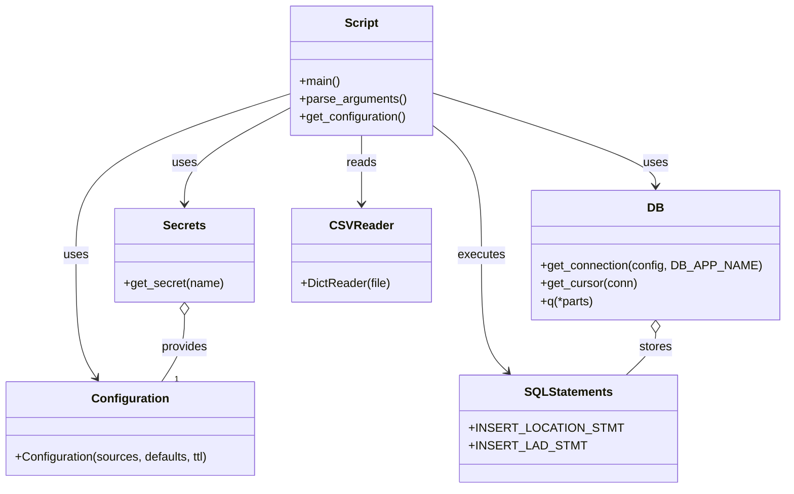

# Diagram: common/location_service/scripts/load_ford_locations.py


> Auto-generated by Obscura crawlers

## Diagram 1



### SVG

<svg id="container" width="1034.759765625" xmlns="http://www.w3.org/2000/svg" class="classDiagram" height="656" viewBox="0 0 1034.759765625 656" role="graphics-document document" aria-roledescription="class"><style>#container{font-family:"trebuchet ms",verdana,arial,sans-serif;font-size:16px;fill:#333;}@keyframes edge-animation-frame{from{stroke-dashoffset:0;}}@keyframes dash{to{stroke-dashoffset:0;}}#container .edge-animation-slow{stroke-dasharray:9,5!important;stroke-dashoffset:900;animation:dash 50s linear infinite;stroke-linecap:round;}#container .edge-animation-fast{stroke-dasharray:9,5!important;stroke-dashoffset:900;animation:dash 20s linear infinite;stroke-linecap:round;}#container .error-icon{fill:#552222;}#container .error-text{fill:#552222;stroke:#552222;}#container .edge-thickness-normal{stroke-width:1px;}#container .edge-thickness-thick{stroke-width:3.5px;}#container .edge-pattern-solid{stroke-dasharray:0;}#container .edge-thickness-invisible{stroke-width:0;fill:none;}#container .edge-pattern-dashed{stroke-dasharray:3;}#container .edge-pattern-dotted{stroke-dasharray:2;}#container .marker{fill:#333333;stroke:#333333;}#container .marker.cross{stroke:#333333;}#container svg{font-family:"trebuchet ms",verdana,arial,sans-serif;font-size:16px;}#container p{margin:0;}#container g.classGroup text{fill:#9370DB;stroke:none;font-family:"trebuchet ms",verdana,arial,sans-serif;font-size:10px;}#container g.classGroup text .title{font-weight:bolder;}#container .nodeLabel,#container .edgeLabel{color:#131300;}#container .edgeLabel .label rect{fill:#ECECFF;}#container .label text{fill:#131300;}#container .labelBkg{background:#ECECFF;}#container .edgeLabel .label span{background:#ECECFF;}#container .classTitle{font-weight:bolder;}#container .node rect,#container .node circle,#container .node ellipse,#container .node polygon,#container .node path{fill:#ECECFF;stroke:#9370DB;stroke-width:1px;}#container .divider{stroke:#9370DB;stroke-width:1;}#container g.clickable{cursor:pointer;}#container g.classGroup rect{fill:#ECECFF;stroke:#9370DB;}#container g.classGroup line{stroke:#9370DB;stroke-width:1;}#container .classLabel .box{stroke:none;stroke-width:0;fill:#ECECFF;opacity:0.5;}#container .classLabel .label{fill:#9370DB;font-size:10px;}#container .relation{stroke:#333333;stroke-width:1;fill:none;}#container .dashed-line{stroke-dasharray:3;}#container .dotted-line{stroke-dasharray:1 2;}#container #compositionStart,#container .composition{fill:#333333!important;stroke:#333333!important;stroke-width:1;}#container #compositionEnd,#container .composition{fill:#333333!important;stroke:#333333!important;stroke-width:1;}#container #dependencyStart,#container .dependency{fill:#333333!important;stroke:#333333!important;stroke-width:1;}#container #dependencyStart,#container .dependency{fill:#333333!important;stroke:#333333!important;stroke-width:1;}#container #extensionStart,#container .extension{fill:transparent!important;stroke:#333333!important;stroke-width:1;}#container #extensionEnd,#container .extension{fill:transparent!important;stroke:#333333!important;stroke-width:1;}#container #aggregationStart,#container .aggregation{fill:transparent!important;stroke:#333333!important;stroke-width:1;}#container #aggregationEnd,#container .aggregation{fill:transparent!important;stroke:#333333!important;stroke-width:1;}#container #lollipopStart,#container .lollipop{fill:#ECECFF!important;stroke:#333333!important;stroke-width:1;}#container #lollipopEnd,#container .lollipop{fill:#ECECFF!important;stroke:#333333!important;stroke-width:1;}#container .edgeTerminals{font-size:11px;line-height:initial;}#container .classTitleText{text-anchor:middle;font-size:18px;fill:#333;}#container .label-icon{display:inline-block;height:1em;overflow:visible;vertical-align:-0.125em;}#container .node .label-icon path{fill:currentColor;stroke:revert;stroke-width:revert;}#container :root{--mermaid-font-family:"trebuchet ms",verdana,arial,sans-serif;}</style><g><defs><marker id="container_class-aggregationStart" class="marker aggregation class" refX="18" refY="7" markerWidth="190" markerHeight="240" orient="auto"><path d="M 18,7 L9,13 L1,7 L9,1 Z"></path></marker></defs><defs><marker id="container_class-aggregationEnd" class="marker aggregation class" refX="1" refY="7" markerWidth="20" markerHeight="28" orient="auto"><path d="M 18,7 L9,13 L1,7 L9,1 Z"></path></marker></defs><defs><marker id="container_class-extensionStart" class="marker extension class" refX="18" refY="7" markerWidth="190" markerHeight="240" orient="auto"><path d="M 1,7 L18,13 V 1 Z"></path></marker></defs><defs><marker id="container_class-extensionEnd" class="marker extension class" refX="1" refY="7" markerWidth="20" markerHeight="28" orient="auto"><path d="M 1,1 V 13 L18,7 Z"></path></marker></defs><defs><marker id="container_class-compositionStart" class="marker composition class" refX="18" refY="7" markerWidth="190" markerHeight="240" orient="auto"><path d="M 18,7 L9,13 L1,7 L9,1 Z"></path></marker></defs><defs><marker id="container_class-compositionEnd" class="marker composition class" refX="1" refY="7" markerWidth="20" markerHeight="28" orient="auto"><path d="M 18,7 L9,13 L1,7 L9,1 Z"></path></marker></defs><defs><marker id="container_class-dependencyStart" class="marker dependency class" refX="6" refY="7" markerWidth="190" markerHeight="240" orient="auto"><path d="M 5,7 L9,13 L1,7 L9,1 Z"></path></marker></defs><defs><marker id="container_class-dependencyEnd" class="marker dependency class" refX="13" refY="7" markerWidth="20" markerHeight="28" orient="auto"><path d="M 18,7 L9,13 L14,7 L9,1 Z"></path></marker></defs><defs><marker id="container_class-lollipopStart" class="marker lollipop class" refX="13" refY="7" markerWidth="190" markerHeight="240" orient="auto"><circle stroke="black" fill="transparent" cx="7" cy="7" r="6"></circle></marker></defs><defs><marker id="container_class-lollipopEnd" class="marker lollipop class" refX="1" refY="7" markerWidth="190" markerHeight="240" orient="auto"><circle stroke="black" fill="transparent" cx="7" cy="7" r="6"></circle></marker></defs><g class="root"><g class="clusters"></g><g class="edgePaths"><path d="M386.939,126.254L339.779,141.712C292.619,157.17,198.299,188.085,151.139,224.209C103.979,260.333,103.979,301.667,103.979,343C103.979,384.333,103.979,425.667,108.49,453.166C113.002,480.664,122.026,494.329,126.538,501.161L131.05,507.993" id="id_Script_Configuration_1" class="edge-thickness-normal edge-pattern-solid relation" style=";;;" data-edge="true" data-et="edge" data-id="id_Script_Configuration_1" data-points="W3sieCI6Mzg2LjkzOTQ1MzEyNSwieSI6MTI2LjI1NDQ2ODI5NjAwNzE5fSx7IngiOjEwMy45Nzg1MTU2MjUsInkiOjIxOX0seyJ4IjoxMDMuOTc4NTE1NjI1LCJ5IjozNDN9LHsieCI6MTAzLjk3ODUxNTYyNSwieSI6NDY3fSx7IngiOjEzNC4zNTY0MTg0MzQ2MzMwNCwieSI6NTEzfV0=" marker-end="url(#container_class-dependencyEnd)"></path><path d="M386.939,145.454L363.773,157.712C340.607,169.97,294.275,194.485,271.109,215.909C247.943,237.333,247.943,255.667,247.943,264.833L247.943,274" id="id_Script_Secrets_2" class="edge-thickness-normal edge-pattern-solid relation" style=";;;" data-edge="true" data-et="edge" data-id="id_Script_Secrets_2" data-points="W3sieCI6Mzg2LjkzOTQ1MzEyNSwieSI6MTQ1LjQ1NDQ0NTQ0NDU0NDQ2fSx7IngiOjI0Ny45NDMzNTkzNzUsInkiOjIxOX0seyJ4IjoyNDcuOTQzMzU5Mzc1LCJ5IjoyODB9XQ==" marker-end="url(#container_class-dependencyEnd)"></path><path d="M577.65,125.72L625.908,141.267C674.165,156.813,770.679,187.907,818.936,208.62C867.193,229.333,867.193,239.667,867.193,244.833L867.193,250" id="id_Script_DB_3" class="edge-thickness-normal edge-pattern-solid relation" style=";;;" data-edge="true" data-et="edge" data-id="id_Script_DB_3" data-points="W3sieCI6NTc3LjY1MDM5MDYyNSwieSI6MTI1LjcxOTk5NTEyODU4NTA1fSx7IngiOjg2Ny4xOTMzNTkzNzUsInkiOjIxOX0seyJ4Ijo4NjcuMTkzMzU5Mzc1LCJ5IjoyNTZ9XQ==" marker-end="url(#container_class-dependencyEnd)"></path><path d="M482.295,182L482.295,188.167C482.295,194.333,482.295,206.667,482.295,222C482.295,237.333,482.295,255.667,482.295,264.833L482.295,274" id="id_Script_CSVReader_4" class="edge-thickness-normal edge-pattern-solid relation" style=";;;" data-edge="true" data-et="edge" data-id="id_Script_CSVReader_4" data-points="W3sieCI6NDgyLjI5NDkyMTg3NSwieSI6MTgyfSx7IngiOjQ4Mi4yOTQ5MjE4NzUsInkiOjIxOX0seyJ4Ijo0ODIuMjk0OTIxODc1LCJ5IjoyODB9XQ==" marker-end="url(#container_class-dependencyEnd)"></path><path d="M577.65,169.55L588.192,177.792C598.734,186.034,619.817,202.517,630.359,231.425C640.9,260.333,640.9,301.667,640.9,343C640.9,384.333,640.9,425.667,646.581,451.806C652.263,477.946,663.625,488.892,669.306,494.364L674.987,499.837" id="id_Script_SQLStatements_5" class="edge-thickness-normal edge-pattern-solid relation" style=";;;" data-edge="true" data-et="edge" data-id="id_Script_SQLStatements_5" data-points="W3sieCI6NTc3LjY1MDM5MDYyNSwieSI6MTY5LjU1MDI1NDkwNzI3Mjg2fSx7IngiOjY0MC45MDAzOTA2MjUsInkiOjIxOX0seyJ4Ijo2NDAuOTAwMzkwNjI1LCJ5IjozNDN9LHsieCI6NjQwLjkwMDM5MDYyNSwieSI6NDY3fSx7IngiOjY3OS4zMDc5MTI4NDQwMzY3LCJ5Ijo1MDR9XQ==" marker-end="url(#container_class-dependencyEnd)"></path><path d="M247.943,423.25L247.943,430.542C247.943,437.833,247.943,452.417,242.88,467.375C237.817,482.333,227.691,497.667,222.628,505.333L217.565,513" id="id_Secrets_Configuration_6" class="edge-thickness-normal edge-pattern-solid relation" style=";;;" data-edge="true" data-et="edge" data-id="id_Secrets_Configuration_6" data-points="W3sieCI6MjQ3Ljk0MzM1OTM3NSwieSI6NDA2fSx7IngiOjI0Ny45NDMzNTkzNzUsInkiOjQ2N30seyJ4IjoyMTcuNTY1NDU2NTY1MzY2OTYsInkiOjUxM31d" marker-start="url(#container_class-aggregationStart)"></path><path d="M867.193,447.25L867.193,450.542C867.193,453.833,867.193,460.417,860.792,469.875C854.391,479.333,841.588,491.667,835.187,497.833L828.786,504" id="id_DB_SQLStatements_7" class="edge-thickness-normal edge-pattern-solid relation" style=";;;" data-edge="true" data-et="edge" data-id="id_DB_SQLStatements_7" data-points="W3sieCI6ODY3LjE5MzM1OTM3NSwieSI6NDMwfSx7IngiOjg2Ny4xOTMzNTkzNzUsInkiOjQ2N30seyJ4Ijo4MjguNzg1ODM3MTU1OTYzMywieSI6NTA0fV0=" marker-start="url(#container_class-aggregationStart)"></path></g><g class="edgeLabels"><g class="edgeLabel" transform="translate(103.978515625, 343)"><g class="label" data-id="id_Script_Configuration_1" transform="translate(-16.4921875, -12)"><foreignObject width="32.984375" height="24"><div xmlns="http://www.w3.org/1999/xhtml" class="labelBkg" style="display: table-cell; white-space: nowrap; line-height: 1.5; max-width: 200px; text-align: center;"><span class="edgeLabel"><p>uses</p></span></div></foreignObject></g></g><g class="edgeLabel" transform="translate(247.943359375, 219)"><g class="label" data-id="id_Script_Secrets_2" transform="translate(-16.4921875, -12)"><foreignObject width="32.984375" height="24"><div xmlns="http://www.w3.org/1999/xhtml" class="labelBkg" style="display: table-cell; white-space: nowrap; line-height: 1.5; max-width: 200px; text-align: center;"><span class="edgeLabel"><p>uses</p></span></div></foreignObject></g></g><g class="edgeLabel" transform="translate(867.193359375, 219)"><g class="label" data-id="id_Script_DB_3" transform="translate(-16.4921875, -12)"><foreignObject width="32.984375" height="24"><div xmlns="http://www.w3.org/1999/xhtml" class="labelBkg" style="display: table-cell; white-space: nowrap; line-height: 1.5; max-width: 200px; text-align: center;"><span class="edgeLabel"><p>uses</p></span></div></foreignObject></g></g><g class="edgeLabel" transform="translate(482.294921875, 219)"><g class="label" data-id="id_Script_CSVReader_4" transform="translate(-20.0078125, -12)"><foreignObject width="40.015625" height="24"><div xmlns="http://www.w3.org/1999/xhtml" class="labelBkg" style="display: table-cell; white-space: nowrap; line-height: 1.5; max-width: 200px; text-align: center;"><span class="edgeLabel"><p>reads</p></span></div></foreignObject></g></g><g class="edgeLabel" transform="translate(640.900390625, 343)"><g class="label" data-id="id_Script_SQLStatements_5" transform="translate(-31.7265625, -12)"><foreignObject width="63.453125" height="24"><div xmlns="http://www.w3.org/1999/xhtml" class="labelBkg" style="display: table-cell; white-space: nowrap; line-height: 1.5; max-width: 200px; text-align: center;"><span class="edgeLabel"><p>executes</p></span></div></foreignObject></g></g><g class="edgeLabel" transform="translate(247.943359375, 467)"><g class="label" data-id="id_Secrets_Configuration_6" transform="translate(-31.3125, -12)"><foreignObject width="62.625" height="24"><div xmlns="http://www.w3.org/1999/xhtml" class="labelBkg" style="display: table-cell; white-space: nowrap; line-height: 1.5; max-width: 200px; text-align: center;"><span class="edgeLabel"><p>provides</p></span></div></foreignObject></g></g><g class="edgeLabel" transform="translate(867.193359375, 467)"><g class="label" data-id="id_DB_SQLStatements_7" transform="translate(-22.125, -12)"><foreignObject width="44.25" height="24"><div xmlns="http://www.w3.org/1999/xhtml" class="labelBkg" style="display: table-cell; white-space: nowrap; line-height: 1.5; max-width: 200px; text-align: center;"><span class="edgeLabel"><p>stores</p></span></div></foreignObject></g></g><g class="edgeTerminals" transform="translate(234.72605418843546, 501.6629763558487)"><g class="inner" transform="translate(0, 0)"></g><foreignObject style="width: 9px; height: 12px;"><div xmlns="http://www.w3.org/1999/xhtml" style="display: inline-block; padding-right: 1px; white-space: nowrap;"><span class="edgeLabel">1</span></div></foreignObject></g></g><g class="nodes"><g class="node default" id="classId-Script-0" transform="translate(482.294921875, 95)"><g class="basic label-container"><path d="M-95.35546875 -87 L95.35546875 -87 L95.35546875 87 L-95.35546875 87" stroke="none" stroke-width="0" fill="#ECECFF" style=""></path><path d="M-95.35546875 -87 C-23.267698008155534 -87, 48.82007273368893 -87, 95.35546875 -87 M-95.35546875 -87 C-27.288298528575623 -87, 40.77887169284875 -87, 95.35546875 -87 M95.35546875 -87 C95.35546875 -40.496041531975784, 95.35546875 6.0079169360484315, 95.35546875 87 M95.35546875 -87 C95.35546875 -49.409169101233736, 95.35546875 -11.818338202467473, 95.35546875 87 M95.35546875 87 C33.94974773324163 87, -27.45597328351674 87, -95.35546875 87 M95.35546875 87 C40.999915483020665 87, -13.35563778395867 87, -95.35546875 87 M-95.35546875 87 C-95.35546875 19.81715652403922, -95.35546875 -47.36568695192156, -95.35546875 -87 M-95.35546875 87 C-95.35546875 23.30560184860782, -95.35546875 -40.38879630278436, -95.35546875 -87" stroke="#9370DB" stroke-width="1.3" fill="none" stroke-dasharray="0 0" style=""></path></g><g class="annotation-group text" transform="translate(0, -63)"></g><g class="label-group text" transform="translate(-21.7421875, -63)"><g class="label" style="font-weight: bolder" transform="translate(0,-12)"><foreignObject width="43.484375" height="24"><div xmlns="http://www.w3.org/1999/xhtml" style="display: table-cell; white-space: nowrap; line-height: 1.5; max-width: 93px; text-align: center;"><span class="nodeLabel markdown-node-label" style=""><p>Script</p></span></div></foreignObject></g></g><g class="members-group text" transform="translate(-83.35546875, -15)"></g><g class="methods-group text" transform="translate(-83.35546875, 15)"><g class="label" style="" transform="translate(0,-12)"><foreignObject width="54.65625" height="24"><div xmlns="http://www.w3.org/1999/xhtml" style="display: table-cell; white-space: nowrap; line-height: 1.5; max-width: 112px; text-align: center;"><span class="nodeLabel markdown-node-label" style=""><p>+main()</p></span></div></foreignObject></g><g class="label" style="" transform="translate(0,12)"><foreignObject width="143.390625" height="24"><div xmlns="http://www.w3.org/1999/xhtml" style="display: table-cell; white-space: nowrap; line-height: 1.5; max-width: 201px; text-align: center;"><span class="nodeLabel markdown-node-label" style=""><p>+parse_arguments()</p></span></div></foreignObject></g><g class="label" style="" transform="translate(0,36)"><foreignObject width="144.96875" height="24"><div xmlns="http://www.w3.org/1999/xhtml" style="display: table-cell; white-space: nowrap; line-height: 1.5; max-width: 202px; text-align: center;"><span class="nodeLabel markdown-node-label" style=""><p>+get_configuration()</p></span></div></foreignObject></g></g><g class="divider" style=""><path d="M-95.35546875 -39 C-40.23562333237449 -39, 14.884222085251025 -39, 95.35546875 -39 M-95.35546875 -39 C-51.75532702819277 -39, -8.155185306385533 -39, 95.35546875 -39" stroke="#9370DB" stroke-width="1.3" fill="none" stroke-dasharray="0 0" style=""></path></g><g class="divider" style=""><path d="M-95.35546875 -15 C-47.987796226865285 -15, -0.6201237037305702 -15, 95.35546875 -15 M-95.35546875 -15 C-47.6647799202463 -15, 0.02590890950739322 -15, 95.35546875 -15" stroke="#9370DB" stroke-width="1.3" fill="none" stroke-dasharray="0 0" style=""></path></g></g><g class="node default" id="classId-Configuration-1" transform="translate(175.9609375, 576)"><g class="basic label-container"><path d="M-167.9609375 -63 L167.9609375 -63 L167.9609375 63 L-167.9609375 63" stroke="none" stroke-width="0" fill="#ECECFF" style=""></path><path d="M-167.9609375 -63 C-69.62698028309981 -63, 28.706976933800377 -63, 167.9609375 -63 M-167.9609375 -63 C-84.45037534503332 -63, -0.9398131900666442 -63, 167.9609375 -63 M167.9609375 -63 C167.9609375 -29.715201851700257, 167.9609375 3.569596296599485, 167.9609375 63 M167.9609375 -63 C167.9609375 -32.74398380427377, 167.9609375 -2.487967608547528, 167.9609375 63 M167.9609375 63 C71.10211802446018 63, -25.756701451079635 63, -167.9609375 63 M167.9609375 63 C46.931843956866544 63, -74.09724958626691 63, -167.9609375 63 M-167.9609375 63 C-167.9609375 33.51366679785723, -167.9609375 4.027333595714467, -167.9609375 -63 M-167.9609375 63 C-167.9609375 24.980112792087525, -167.9609375 -13.039774415824951, -167.9609375 -63" stroke="#9370DB" stroke-width="1.3" fill="none" stroke-dasharray="0 0" style=""></path></g><g class="annotation-group text" transform="translate(0, -39)"></g><g class="label-group text" transform="translate(-49.375, -39)"><g class="label" style="font-weight: bolder" transform="translate(0,-12)"><foreignObject width="98.75" height="24"><div xmlns="http://www.w3.org/1999/xhtml" style="display: table-cell; white-space: nowrap; line-height: 1.5; max-width: 147px; text-align: center;"><span class="nodeLabel markdown-node-label" style=""><p>Configuration</p></span></div></foreignObject></g></g><g class="members-group text" transform="translate(-155.9609375, 9)"></g><g class="methods-group text" transform="translate(-155.9609375, 39)"><g class="label" style="" transform="translate(0,-12)"><foreignObject width="262.546875" height="24"><div xmlns="http://www.w3.org/1999/xhtml" style="display: table-cell; white-space: nowrap; line-height: 1.5; max-width: 320px; text-align: center;"><span class="nodeLabel markdown-node-label" style=""><p>+Configuration(sources, defaults, ttl)</p></span></div></foreignObject></g></g><g class="divider" style=""><path d="M-167.9609375 -15 C-37.15698773242701 -15, 93.64696203514598 -15, 167.9609375 -15 M-167.9609375 -15 C-47.061677499959416 -15, 73.83758250008117 -15, 167.9609375 -15" stroke="#9370DB" stroke-width="1.3" fill="none" stroke-dasharray="0 0" style=""></path></g><g class="divider" style=""><path d="M-167.9609375 9 C-59.29485059816385 9, 49.371236303672305 9, 167.9609375 9 M-167.9609375 9 C-80.28302908361643 9, 7.394879332767147 9, 167.9609375 9" stroke="#9370DB" stroke-width="1.3" fill="none" stroke-dasharray="0 0" style=""></path></g></g><g class="node default" id="classId-Secrets-2" transform="translate(247.943359375, 343)"><g class="basic label-container"><path d="M-92.47265625 -63 L92.47265625 -63 L92.47265625 63 L-92.47265625 63" stroke="none" stroke-width="0" fill="#ECECFF" style=""></path><path d="M-92.47265625 -63 C-41.77550749212154 -63, 8.921641265756918 -63, 92.47265625 -63 M-92.47265625 -63 C-18.96663885217268 -63, 54.53937854565464 -63, 92.47265625 -63 M92.47265625 -63 C92.47265625 -28.924772982408385, 92.47265625 5.15045403518323, 92.47265625 63 M92.47265625 -63 C92.47265625 -34.47661936610733, 92.47265625 -5.9532387322146505, 92.47265625 63 M92.47265625 63 C26.995079036058115 63, -38.48249817788377 63, -92.47265625 63 M92.47265625 63 C50.29531248439148 63, 8.117968718782961 63, -92.47265625 63 M-92.47265625 63 C-92.47265625 35.771397603316444, -92.47265625 8.542795206632888, -92.47265625 -63 M-92.47265625 63 C-92.47265625 22.289035652676503, -92.47265625 -18.421928694646994, -92.47265625 -63" stroke="#9370DB" stroke-width="1.3" fill="none" stroke-dasharray="0 0" style=""></path></g><g class="annotation-group text" transform="translate(0, -39)"></g><g class="label-group text" transform="translate(-27.1640625, -39)"><g class="label" style="font-weight: bolder" transform="translate(0,-12)"><foreignObject width="54.328125" height="24"><div xmlns="http://www.w3.org/1999/xhtml" style="display: table-cell; white-space: nowrap; line-height: 1.5; max-width: 103px; text-align: center;"><span class="nodeLabel markdown-node-label" style=""><p>Secrets</p></span></div></foreignObject></g></g><g class="members-group text" transform="translate(-80.47265625, 9)"></g><g class="methods-group text" transform="translate(-80.47265625, 39)"><g class="label" style="" transform="translate(0,-12)"><foreignObject width="133.78125" height="24"><div xmlns="http://www.w3.org/1999/xhtml" style="display: table-cell; white-space: nowrap; line-height: 1.5; max-width: 191px; text-align: center;"><span class="nodeLabel markdown-node-label" style=""><p>+get_secret(name)</p></span></div></foreignObject></g></g><g class="divider" style=""><path d="M-92.47265625 -15 C-44.495727772504445 -15, 3.4812007049911102 -15, 92.47265625 -15 M-92.47265625 -15 C-23.90688531728486 -15, 44.65888561543028 -15, 92.47265625 -15" stroke="#9370DB" stroke-width="1.3" fill="none" stroke-dasharray="0 0" style=""></path></g><g class="divider" style=""><path d="M-92.47265625 9 C-25.626982239511918 9, 41.218691770976164 9, 92.47265625 9 M-92.47265625 9 C-25.091163371573515 9, 42.29032950685297 9, 92.47265625 9" stroke="#9370DB" stroke-width="1.3" fill="none" stroke-dasharray="0 0" style=""></path></g></g><g class="node default" id="classId-DB-3" transform="translate(867.193359375, 343)"><g class="basic label-container"><path d="M-159.56640625 -87 L159.56640625 -87 L159.56640625 87 L-159.56640625 87" stroke="none" stroke-width="0" fill="#ECECFF" style=""></path><path d="M-159.56640625 -87 C-67.24683568233702 -87, 25.072734885325957 -87, 159.56640625 -87 M-159.56640625 -87 C-34.6957593699981 -87, 90.1748875100038 -87, 159.56640625 -87 M159.56640625 -87 C159.56640625 -20.361588401611684, 159.56640625 46.27682319677663, 159.56640625 87 M159.56640625 -87 C159.56640625 -24.873145428474714, 159.56640625 37.25370914305057, 159.56640625 87 M159.56640625 87 C68.39132981161701 87, -22.783746626765975 87, -159.56640625 87 M159.56640625 87 C52.503592507175455 87, -54.55922123564909 87, -159.56640625 87 M-159.56640625 87 C-159.56640625 26.334105445111668, -159.56640625 -34.331789109776665, -159.56640625 -87 M-159.56640625 87 C-159.56640625 46.43896029962041, -159.56640625 5.877920599240824, -159.56640625 -87" stroke="#9370DB" stroke-width="1.3" fill="none" stroke-dasharray="0 0" style=""></path></g><g class="annotation-group text" transform="translate(0, -63)"></g><g class="label-group text" transform="translate(-10.1484375, -63)"><g class="label" style="font-weight: bolder" transform="translate(0,-12)"><foreignObject width="20.296875" height="24"><div xmlns="http://www.w3.org/1999/xhtml" style="display: table-cell; white-space: nowrap; line-height: 1.5; max-width: 70px; text-align: center;"><span class="nodeLabel markdown-node-label" style=""><p>DB</p></span></div></foreignObject></g></g><g class="members-group text" transform="translate(-147.56640625, -15)"></g><g class="methods-group text" transform="translate(-147.56640625, 15)"><g class="label" style="" transform="translate(0,-12)"><foreignObject width="284.984375" height="24"><div xmlns="http://www.w3.org/1999/xhtml" style="display: table-cell; white-space: nowrap; line-height: 1.5; max-width: 342px; text-align: center;"><span class="nodeLabel markdown-node-label" style=""><p>+get_connection(config, DB_APP_NAME)</p></span></div></foreignObject></g><g class="label" style="" transform="translate(0,12)"><foreignObject width="130.078125" height="24"><div xmlns="http://www.w3.org/1999/xhtml" style="display: table-cell; white-space: nowrap; line-height: 1.5; max-width: 187px; text-align: center;"><span class="nodeLabel markdown-node-label" style=""><p>+get_cursor(conn)</p></span></div></foreignObject></g><g class="label" style="" transform="translate(0,36)"><foreignObject width="72.421875" height="24"><div xmlns="http://www.w3.org/1999/xhtml" style="display: table-cell; white-space: nowrap; line-height: 1.5; max-width: 130px; text-align: center;"><span class="nodeLabel markdown-node-label" style=""><p>+q(*parts)</p></span></div></foreignObject></g></g><g class="divider" style=""><path d="M-159.56640625 -39 C-69.72064569545476 -39, 20.125114859090473 -39, 159.56640625 -39 M-159.56640625 -39 C-34.02359875598887 -39, 91.51920873802226 -39, 159.56640625 -39" stroke="#9370DB" stroke-width="1.3" fill="none" stroke-dasharray="0 0" style=""></path></g><g class="divider" style=""><path d="M-159.56640625 -15 C-66.48974553242874 -15, 26.586915185142516 -15, 159.56640625 -15 M-159.56640625 -15 C-77.3346539495935 -15, 4.897098350812996 -15, 159.56640625 -15" stroke="#9370DB" stroke-width="1.3" fill="none" stroke-dasharray="0 0" style=""></path></g></g><g class="node default" id="classId-SQLStatements-4" transform="translate(754.046875, 576)"><g class="basic label-container"><path d="M-130.84765625 -72 L130.84765625 -72 L130.84765625 72 L-130.84765625 72" stroke="none" stroke-width="0" fill="#ECECFF" style=""></path><path d="M-130.84765625 -72 C-72.08934222270959 -72, -13.33102819541918 -72, 130.84765625 -72 M-130.84765625 -72 C-27.729002236246615 -72, 75.38965177750677 -72, 130.84765625 -72 M130.84765625 -72 C130.84765625 -25.839434808357545, 130.84765625 20.32113038328491, 130.84765625 72 M130.84765625 -72 C130.84765625 -41.940489136942674, 130.84765625 -11.880978273885347, 130.84765625 72 M130.84765625 72 C35.80896399875678 72, -59.22972825248644 72, -130.84765625 72 M130.84765625 72 C77.1128305667672 72, 23.378004883534416 72, -130.84765625 72 M-130.84765625 72 C-130.84765625 39.94849229643821, -130.84765625 7.8969845928764215, -130.84765625 -72 M-130.84765625 72 C-130.84765625 22.256422844998546, -130.84765625 -27.487154310002907, -130.84765625 -72" stroke="#9370DB" stroke-width="1.3" fill="none" stroke-dasharray="0 0" style=""></path></g><g class="annotation-group text" transform="translate(0, -48)"></g><g class="label-group text" transform="translate(-56.1640625, -48)"><g class="label" style="font-weight: bolder" transform="translate(0,-12)"><foreignObject width="112.328125" height="24"><div xmlns="http://www.w3.org/1999/xhtml" style="display: table-cell; white-space: nowrap; line-height: 1.5; max-width: 160px; text-align: center;"><span class="nodeLabel markdown-node-label" style=""><p>SQLStatements</p></span></div></foreignObject></g></g><g class="members-group text" transform="translate(-118.84765625, 0)"><g class="label" style="" transform="translate(0,-12)"><foreignObject width="181.53125" height="24"><div xmlns="http://www.w3.org/1999/xhtml" style="display: table-cell; white-space: nowrap; line-height: 1.5; max-width: 240px; text-align: center;"><span class="nodeLabel markdown-node-label" style=""><p>+INSERT_LOCATION_STMT</p></span></div></foreignObject></g><g class="label" style="" transform="translate(0,12)"><foreignObject width="137.6875" height="24"><div xmlns="http://www.w3.org/1999/xhtml" style="display: table-cell; white-space: nowrap; line-height: 1.5; max-width: 196px; text-align: center;"><span class="nodeLabel markdown-node-label" style=""><p>+INSERT_LAD_STMT</p></span></div></foreignObject></g></g><g class="methods-group text" transform="translate(-118.84765625, 72)"></g><g class="divider" style=""><path d="M-130.84765625 -24 C-63.52795084090408 -24, 3.791754568191834 -24, 130.84765625 -24 M-130.84765625 -24 C-68.70384768239757 -24, -6.560039114795146 -24, 130.84765625 -24" stroke="#9370DB" stroke-width="1.3" fill="none" stroke-dasharray="0 0" style=""></path></g><g class="divider" style=""><path d="M-130.84765625 48 C-44.89342920384469 48, 41.06079784231062 48, 130.84765625 48 M-130.84765625 48 C-63.22140873907324 48, 4.40483877185352 48, 130.84765625 48" stroke="#9370DB" stroke-width="1.3" fill="none" stroke-dasharray="0 0" style=""></path></g></g><g class="node default" id="classId-CSVReader-5" transform="translate(482.294921875, 343)"><g class="basic label-container"><path d="M-91.87890625 -63 L91.87890625 -63 L91.87890625 63 L-91.87890625 63" stroke="none" stroke-width="0" fill="#ECECFF" style=""></path><path d="M-91.87890625 -63 C-47.56464677577242 -63, -3.2503873015448335 -63, 91.87890625 -63 M-91.87890625 -63 C-40.61490726562702 -63, 10.649091718745964 -63, 91.87890625 -63 M91.87890625 -63 C91.87890625 -35.087657152722755, 91.87890625 -7.175314305445504, 91.87890625 63 M91.87890625 -63 C91.87890625 -23.086201941626918, 91.87890625 16.827596116746165, 91.87890625 63 M91.87890625 63 C55.119544618416654 63, 18.36018298683331 63, -91.87890625 63 M91.87890625 63 C19.170652561060365 63, -53.53760112787927 63, -91.87890625 63 M-91.87890625 63 C-91.87890625 33.2391523688134, -91.87890625 3.4783047376268, -91.87890625 -63 M-91.87890625 63 C-91.87890625 17.501630431473565, -91.87890625 -27.99673913705287, -91.87890625 -63" stroke="#9370DB" stroke-width="1.3" fill="none" stroke-dasharray="0 0" style=""></path></g><g class="annotation-group text" transform="translate(0, -39)"></g><g class="label-group text" transform="translate(-39.4609375, -39)"><g class="label" style="font-weight: bolder" transform="translate(0,-12)"><foreignObject width="78.921875" height="24"><div xmlns="http://www.w3.org/1999/xhtml" style="display: table-cell; white-space: nowrap; line-height: 1.5; max-width: 128px; text-align: center;"><span class="nodeLabel markdown-node-label" style=""><p>CSVReader</p></span></div></foreignObject></g></g><g class="members-group text" transform="translate(-79.87890625, 9)"></g><g class="methods-group text" transform="translate(-79.87890625, 39)"><g class="label" style="" transform="translate(0,-12)"><foreignObject width="120.296875" height="24"><div xmlns="http://www.w3.org/1999/xhtml" style="display: table-cell; white-space: nowrap; line-height: 1.5; max-width: 178px; text-align: center;"><span class="nodeLabel markdown-node-label" style=""><p>+DictReader(file)</p></span></div></foreignObject></g></g><g class="divider" style=""><path d="M-91.87890625 -15 C-27.978278208972874 -15, 35.92234983205425 -15, 91.87890625 -15 M-91.87890625 -15 C-39.421982886274414 -15, 13.034940477451173 -15, 91.87890625 -15" stroke="#9370DB" stroke-width="1.3" fill="none" stroke-dasharray="0 0" style=""></path></g><g class="divider" style=""><path d="M-91.87890625 9 C-18.89184235304218 9, 54.09522154391564 9, 91.87890625 9 M-91.87890625 9 C-37.93282510133872 9, 16.013256047322557 9, 91.87890625 9" stroke="#9370DB" stroke-width="1.3" fill="none" stroke-dasharray="0 0" style=""></path></g></g></g></g></g></svg>

## Diagram 2

```mermaid
flowchart TD
    A[Start script] --> B[parse_arguments(csv)]
    B --> C[get_configuration()]
    C --> D[SECRETS.get_secret(DATABASE)]
    D --> E[get DB connection with DB_APP_NAME]
    E --> F[open CSV and read rows]
    F --> G{for each location}
    G --> H[compute lad_code and poly]
    H --> I[for each organization_fv_id]
    I --> J[execute INSERT_LOCATION_STMT]
    J --> K[fetch newloc]
    K --> L[execute INSERT_LAD_STMT with newloc.id]
    L --> M[fetch newlad and commit]
    J -->|IntegrityError UNIQUE_VIOLATION| N[log duplicate and rollback]
    J -->|Other psycopg2.Error| O[log and raise]
    M --> G
    N --> G
    O --> P[Exit with error]
    G --> Q[Finished processing all locations]
    Q --> R[End]
```

> SVG rendering failed for this diagram.
