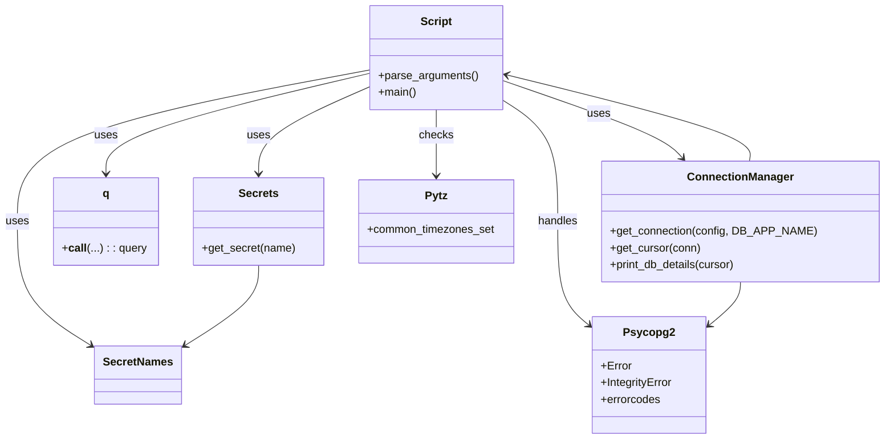

# Diagram: common/location_service/scripts/load_time_zones.py


> Auto-generated by Obscura crawlers

## Diagram 1

```mermaid
flowchart LR
    A[parse_arguments()] --> B[args.geojson]
    B --> C[json.load(open(args.geojson))]
    C --> D[for each feature in gj["features"]]
    D --> E{name = properties.tzid}
    E --> F{name in pytz.common_timezones_set?}
    F -- No --> G[print "Skipping time zone"]
    F -- Yes --> H[tz_insert = q(INSERT INTO location.timezone...)]
    H --> I[query = cursor.mogrify(tz_insert, params)]
    I --> J[try cursor.execute(query)]
    J --> K{psycopg2.IntegrityError?}
    K -- UNIQUE_VIOLATION --> L[print "Timezone already exists" and rollback]
    K -- other IntegrityError --> M[print error and rollback]
    J --> N{psycopg2.Error?}
    N -- Yes --> O[print error and raise]
    N -- No --> P[continue loop]
    subgraph DB
      Q[get_connection(config, DB_APP_NAME)] --> R[get_cursor(conn)]
      R --> S[fv.db.print_db_details(cursor)]
    end
```

> SVG rendering failed for this diagram.

## Diagram 2



### SVG

<svg id="container" width="1247.609375" xmlns="http://www.w3.org/2000/svg" class="classDiagram" height="632" viewBox="0 0 1247.609375 632" role="graphics-document document" aria-roledescription="class"><style>#container{font-family:"trebuchet ms",verdana,arial,sans-serif;font-size:16px;fill:#333;}@keyframes edge-animation-frame{from{stroke-dashoffset:0;}}@keyframes dash{to{stroke-dashoffset:0;}}#container .edge-animation-slow{stroke-dasharray:9,5!important;stroke-dashoffset:900;animation:dash 50s linear infinite;stroke-linecap:round;}#container .edge-animation-fast{stroke-dasharray:9,5!important;stroke-dashoffset:900;animation:dash 20s linear infinite;stroke-linecap:round;}#container .error-icon{fill:#552222;}#container .error-text{fill:#552222;stroke:#552222;}#container .edge-thickness-normal{stroke-width:1px;}#container .edge-thickness-thick{stroke-width:3.5px;}#container .edge-pattern-solid{stroke-dasharray:0;}#container .edge-thickness-invisible{stroke-width:0;fill:none;}#container .edge-pattern-dashed{stroke-dasharray:3;}#container .edge-pattern-dotted{stroke-dasharray:2;}#container .marker{fill:#333333;stroke:#333333;}#container .marker.cross{stroke:#333333;}#container svg{font-family:"trebuchet ms",verdana,arial,sans-serif;font-size:16px;}#container p{margin:0;}#container g.classGroup text{fill:#9370DB;stroke:none;font-family:"trebuchet ms",verdana,arial,sans-serif;font-size:10px;}#container g.classGroup text .title{font-weight:bolder;}#container .nodeLabel,#container .edgeLabel{color:#131300;}#container .edgeLabel .label rect{fill:#ECECFF;}#container .label text{fill:#131300;}#container .labelBkg{background:#ECECFF;}#container .edgeLabel .label span{background:#ECECFF;}#container .classTitle{font-weight:bolder;}#container .node rect,#container .node circle,#container .node ellipse,#container .node polygon,#container .node path{fill:#ECECFF;stroke:#9370DB;stroke-width:1px;}#container .divider{stroke:#9370DB;stroke-width:1;}#container g.clickable{cursor:pointer;}#container g.classGroup rect{fill:#ECECFF;stroke:#9370DB;}#container g.classGroup line{stroke:#9370DB;stroke-width:1;}#container .classLabel .box{stroke:none;stroke-width:0;fill:#ECECFF;opacity:0.5;}#container .classLabel .label{fill:#9370DB;font-size:10px;}#container .relation{stroke:#333333;stroke-width:1;fill:none;}#container .dashed-line{stroke-dasharray:3;}#container .dotted-line{stroke-dasharray:1 2;}#container #compositionStart,#container .composition{fill:#333333!important;stroke:#333333!important;stroke-width:1;}#container #compositionEnd,#container .composition{fill:#333333!important;stroke:#333333!important;stroke-width:1;}#container #dependencyStart,#container .dependency{fill:#333333!important;stroke:#333333!important;stroke-width:1;}#container #dependencyStart,#container .dependency{fill:#333333!important;stroke:#333333!important;stroke-width:1;}#container #extensionStart,#container .extension{fill:transparent!important;stroke:#333333!important;stroke-width:1;}#container #extensionEnd,#container .extension{fill:transparent!important;stroke:#333333!important;stroke-width:1;}#container #aggregationStart,#container .aggregation{fill:transparent!important;stroke:#333333!important;stroke-width:1;}#container #aggregationEnd,#container .aggregation{fill:transparent!important;stroke:#333333!important;stroke-width:1;}#container #lollipopStart,#container .lollipop{fill:#ECECFF!important;stroke:#333333!important;stroke-width:1;}#container #lollipopEnd,#container .lollipop{fill:#ECECFF!important;stroke:#333333!important;stroke-width:1;}#container .edgeTerminals{font-size:11px;line-height:initial;}#container .classTitleText{text-anchor:middle;font-size:18px;fill:#333;}#container .label-icon{display:inline-block;height:1em;overflow:visible;vertical-align:-0.125em;}#container .node .label-icon path{fill:currentColor;stroke:revert;stroke-width:revert;}#container :root{--mermaid-font-family:"trebuchet ms",verdana,arial,sans-serif;}</style><g><defs><marker id="container_class-aggregationStart" class="marker aggregation class" refX="18" refY="7" markerWidth="190" markerHeight="240" orient="auto"><path d="M 18,7 L9,13 L1,7 L9,1 Z"></path></marker></defs><defs><marker id="container_class-aggregationEnd" class="marker aggregation class" refX="1" refY="7" markerWidth="20" markerHeight="28" orient="auto"><path d="M 18,7 L9,13 L1,7 L9,1 Z"></path></marker></defs><defs><marker id="container_class-extensionStart" class="marker extension class" refX="18" refY="7" markerWidth="190" markerHeight="240" orient="auto"><path d="M 1,7 L18,13 V 1 Z"></path></marker></defs><defs><marker id="container_class-extensionEnd" class="marker extension class" refX="1" refY="7" markerWidth="20" markerHeight="28" orient="auto"><path d="M 1,1 V 13 L18,7 Z"></path></marker></defs><defs><marker id="container_class-compositionStart" class="marker composition class" refX="18" refY="7" markerWidth="190" markerHeight="240" orient="auto"><path d="M 18,7 L9,13 L1,7 L9,1 Z"></path></marker></defs><defs><marker id="container_class-compositionEnd" class="marker composition class" refX="1" refY="7" markerWidth="20" markerHeight="28" orient="auto"><path d="M 18,7 L9,13 L1,7 L9,1 Z"></path></marker></defs><defs><marker id="container_class-dependencyStart" class="marker dependency class" refX="6" refY="7" markerWidth="190" markerHeight="240" orient="auto"><path d="M 5,7 L9,13 L1,7 L9,1 Z"></path></marker></defs><defs><marker id="container_class-dependencyEnd" class="marker dependency class" refX="13" refY="7" markerWidth="20" markerHeight="28" orient="auto"><path d="M 18,7 L9,13 L14,7 L9,1 Z"></path></marker></defs><defs><marker id="container_class-lollipopStart" class="marker lollipop class" refX="13" refY="7" markerWidth="190" markerHeight="240" orient="auto"><circle stroke="black" fill="transparent" cx="7" cy="7" r="6"></circle></marker></defs><defs><marker id="container_class-lollipopEnd" class="marker lollipop class" refX="1" refY="7" markerWidth="190" markerHeight="240" orient="auto"><circle stroke="black" fill="transparent" cx="7" cy="7" r="6"></circle></marker></defs><g class="root"><g class="clusters"></g><g class="edgePaths"><path d="M524.133,124.717L497.579,136.43C471.025,148.144,417.917,171.572,391.363,192.453C364.809,213.333,364.809,231.667,364.809,240.833L364.809,250" id="id_Script_Secrets_1" class="edge-thickness-normal edge-pattern-solid relation" style=";;;" data-edge="true" data-et="edge" data-id="id_Script_Secrets_1" data-points="W3sieCI6NTI0LjEzMjgxMjUsInkiOjEyNC43MTY1MzY0MDIyNDAxNH0seyJ4IjozNjQuODA4NTkzNzUsInkiOjE5NX0seyJ4IjozNjQuODA4NTkzNzUsInkiOjI1Nn1d" marker-end="url(#container_class-dependencyEnd)"></path><path d="M524.133,100.824L440.859,116.52C357.586,132.216,191.039,163.608,107.766,199.971C24.492,236.333,24.492,277.667,24.492,317C24.492,356.333,24.492,393.667,42.005,423.551C59.517,453.436,94.542,475.873,112.054,487.091L129.567,498.309" id="id_Script_SecretNames_2" class="edge-thickness-normal edge-pattern-solid relation" style=";;;" data-edge="true" data-et="edge" data-id="id_Script_SecretNames_2" data-points="W3sieCI6NTI0LjEzMjgxMjUsInkiOjEwMC44MjQ0OTAzNTkzOTQ0Mn0seyJ4IjoyNC40OTIxODc1LCJ5IjoxOTV9LHsieCI6MjQuNDkyMTg3NSwieSI6MzE5fSx7IngiOjI0LjQ5MjE4NzUsInkiOjQzMX0seyJ4IjoxMzQuNjE5MTQwNjI1LCJ5Ijo1MDEuNTQ1MTYxMzI3MzQ5M31d" marker-end="url(#container_class-dependencyEnd)"></path><path d="M524.133,105.557L461.637,120.464C399.142,135.371,274.151,165.186,211.656,189.26C149.16,213.333,149.16,231.667,149.16,240.833L149.16,250" id="id_Script_q_3" class="edge-thickness-normal edge-pattern-solid relation" style=";;;" data-edge="true" data-et="edge" data-id="id_Script_q_3" data-points="W3sieCI6NTI0LjEzMjgxMjUsInkiOjEwNS41NTcwOTU1NTU4MTQzOX0seyJ4IjoxNDkuMTYwMTU2MjUsInkiOjE5NX0seyJ4IjoxNDkuMTYwMTU2MjUsInkiOjI1Nn1d" marker-end="url(#container_class-dependencyEnd)"></path><path d="M713.266,116L750.996,129.167C788.727,142.333,864.189,168.667,906.686,187.249C949.183,205.832,958.716,216.664,963.482,222.08L968.249,227.496" id="id_Script_ConnectionManager_4" class="edge-thickness-normal edge-pattern-solid relation" style=";;;" data-edge="true" data-et="edge" data-id="id_Script_ConnectionManager_4" data-points="W3sieCI6NzEzLjI2NTYyNSwieSI6MTE2LjAwMDE1MjEzNTY4MDY4fSx7IngiOjkzOS42NTAzOTA2MjUsInkiOjE5NX0seyJ4Ijo5NzIuMjEyNDY1MzQ3NzgyMiwieSI6MjMyfV0=" marker-end="url(#container_class-dependencyEnd)"></path><path d="M713.266,143.408L726.727,152.007C740.188,160.605,767.109,177.803,780.57,207.068C794.031,236.333,794.031,277.667,794.031,317C794.031,356.333,794.031,393.667,800.937,418.243C807.843,442.82,821.655,454.639,828.561,460.549L835.467,466.459" id="id_Script_Psycopg2_5" class="edge-thickness-normal edge-pattern-solid relation" style=";;;" data-edge="true" data-et="edge" data-id="id_Script_Psycopg2_5" data-points="W3sieCI6NzEzLjI2NTYyNSwieSI6MTQzLjQwNzg4NjgyMTg3ODEyfSx7IngiOjc5NC4wMzEyNSwieSI6MTk1fSx7IngiOjc5NC4wMzEyNSwieSI6MzE5fSx7IngiOjc5NC4wMzEyNSwieSI6NDMxfSx7IngiOjg0MC4wMjUzOTA2MjUsInkiOjQ3MC4zNTk2NzE4NTQ2MzQ2Nn1d" marker-end="url(#container_class-dependencyEnd)"></path><path d="M618.699,158L618.699,164.167C618.699,170.333,618.699,182.667,618.699,198.5C618.699,214.333,618.699,233.667,618.699,243.333L618.699,253" id="id_Script_Pytz_6" class="edge-thickness-normal edge-pattern-solid relation" style=";;;" data-edge="true" data-et="edge" data-id="id_Script_Pytz_6" data-points="W3sieCI6NjE4LjY5OTIxODc1LCJ5IjoxNTh9LHsieCI6NjE4LjY5OTIxODc1LCJ5IjoxOTV9LHsieCI6NjE4LjY5OTIxODc1LCJ5IjoyNTl9XQ==" marker-end="url(#container_class-dependencyEnd)"></path><path d="M364.809,382L364.809,390.167C364.809,398.333,364.809,414.667,347.296,434.051C329.784,453.436,294.759,475.873,277.246,487.091L259.734,498.309" id="id_Secrets_SecretNames_7" class="edge-thickness-normal edge-pattern-solid relation" style=";;;" data-edge="true" data-et="edge" data-id="id_Secrets_SecretNames_7" data-points="W3sieCI6MzY0LjgwODU5Mzc1LCJ5IjozODJ9LHsieCI6MzY0LjgwODU5Mzc1LCJ5Ijo0MzF9LHsieCI6MjU0LjY4MTY0MDYyNSwieSI6NTAxLjU0NTE2MTMyNzM0OTN9XQ==" marker-end="url(#container_class-dependencyEnd)"></path><path d="M1048.777,406L1048.777,410.167C1048.777,414.333,1048.777,422.667,1041.871,432.743C1034.966,442.82,1021.154,454.639,1014.248,460.549L1007.342,466.459" id="id_ConnectionManager_Psycopg2_8" class="edge-thickness-normal edge-pattern-solid relation" style=";;;" data-edge="true" data-et="edge" data-id="id_ConnectionManager_Psycopg2_8" data-points="W3sieCI6MTA0OC43NzczNDM3NSwieSI6NDA2fSx7IngiOjEwNDguNzc3MzQzNzUsInkiOjQzMX0seyJ4IjoxMDAyLjc4MzIwMzEyNSwieSI6NDcwLjM1OTY3MTg1NDYzNDY2fV0=" marker-end="url(#container_class-dependencyEnd)"></path><path d="M1061.579,232L1062.486,225.833C1063.394,219.667,1065.209,207.333,1008.127,186.68C951.045,166.026,835.066,137.052,777.076,122.566L719.087,108.079" id="id_ConnectionManager_Script_9" class="edge-thickness-normal edge-pattern-solid relation" style=";;;" data-edge="true" data-et="edge" data-id="id_ConnectionManager_Script_9" data-points="W3sieCI6MTA2MS41NzkwMzg1NTg0Njc4LCJ5IjoyMzJ9LHsieCI6MTA2Ny4wMjM0Mzc1LCJ5IjoxOTV9LHsieCI6NzEzLjI2NTYyNSwieSI6MTA2LjYyNDUwNDQ0Nzk4NzczfV0=" marker-end="url(#container_class-dependencyEnd)"></path></g><g class="edgeLabels"><g class="edgeLabel" transform="translate(364.80859375, 195)"><g class="label" data-id="id_Script_Secrets_1" transform="translate(-16.4921875, -12)"><foreignObject width="32.984375" height="24"><div xmlns="http://www.w3.org/1999/xhtml" class="labelBkg" style="display: table-cell; white-space: nowrap; line-height: 1.5; max-width: 200px; text-align: center;"><span class="edgeLabel"><p>uses</p></span></div></foreignObject></g></g><g class="edgeLabel" transform="translate(24.4921875, 319)"><g class="label" data-id="id_Script_SecretNames_2" transform="translate(-16.4921875, -12)"><foreignObject width="32.984375" height="24"><div xmlns="http://www.w3.org/1999/xhtml" class="labelBkg" style="display: table-cell; white-space: nowrap; line-height: 1.5; max-width: 200px; text-align: center;"><span class="edgeLabel"><p>uses</p></span></div></foreignObject></g></g><g class="edgeLabel" transform="translate(149.16015625, 195)"><g class="label" data-id="id_Script_q_3" transform="translate(-16.4921875, -12)"><foreignObject width="32.984375" height="24"><div xmlns="http://www.w3.org/1999/xhtml" class="labelBkg" style="display: table-cell; white-space: nowrap; line-height: 1.5; max-width: 200px; text-align: center;"><span class="edgeLabel"><p>uses</p></span></div></foreignObject></g></g><g class="edgeLabel" transform="translate(849.72588, 163.6197)"><g class="label" data-id="id_Script_ConnectionManager_4" transform="translate(-16.4921875, -12)"><foreignObject width="32.984375" height="24"><div xmlns="http://www.w3.org/1999/xhtml" class="labelBkg" style="display: table-cell; white-space: nowrap; line-height: 1.5; max-width: 200px; text-align: center;"><span class="edgeLabel"><p>uses</p></span></div></foreignObject></g></g><g class="edgeLabel" transform="translate(794.03125, 319)"><g class="label" data-id="id_Script_Psycopg2_5" transform="translate(-28.9140625, -12)"><foreignObject width="57.828125" height="24"><div xmlns="http://www.w3.org/1999/xhtml" class="labelBkg" style="display: table-cell; white-space: nowrap; line-height: 1.5; max-width: 200px; text-align: center;"><span class="edgeLabel"><p>handles</p></span></div></foreignObject></g></g><g class="edgeLabel" transform="translate(618.69921875, 195)"><g class="label" data-id="id_Script_Pytz_6" transform="translate(-24.4921875, -12)"><foreignObject width="48.984375" height="24"><div xmlns="http://www.w3.org/1999/xhtml" class="labelBkg" style="display: table-cell; white-space: nowrap; line-height: 1.5; max-width: 200px; text-align: center;"><span class="edgeLabel"><p>checks</p></span></div></foreignObject></g></g><g class="edgeLabel"><g class="label" data-id="id_Secrets_SecretNames_7" transform="translate(0, 0)"><foreignObject width="0" height="0"><div xmlns="http://www.w3.org/1999/xhtml" class="labelBkg" style="display: table-cell; white-space: nowrap; line-height: 1.5; max-width: 200px; text-align: center;"><span class="edgeLabel"></span></div></foreignObject></g></g><g class="edgeLabel"><g class="label" data-id="id_ConnectionManager_Psycopg2_8" transform="translate(0, 0)"><foreignObject width="0" height="0"><div xmlns="http://www.w3.org/1999/xhtml" class="labelBkg" style="display: table-cell; white-space: nowrap; line-height: 1.5; max-width: 200px; text-align: center;"><span class="edgeLabel"></span></div></foreignObject></g></g><g class="edgeLabel"><g class="label" data-id="id_ConnectionManager_Script_9" transform="translate(0, 0)"><foreignObject width="0" height="0"><div xmlns="http://www.w3.org/1999/xhtml" class="labelBkg" style="display: table-cell; white-space: nowrap; line-height: 1.5; max-width: 200px; text-align: center;"><span class="edgeLabel"></span></div></foreignObject></g></g></g><g class="nodes"><g class="node default" id="classId-Script-0" transform="translate(618.69921875, 83)"><g class="basic label-container"><path d="M-94.56640625 -75 L94.56640625 -75 L94.56640625 75 L-94.56640625 75" stroke="none" stroke-width="0" fill="#ECECFF" style=""></path><path d="M-94.56640625 -75 C-54.64732002905394 -75, -14.728233808107873 -75, 94.56640625 -75 M-94.56640625 -75 C-48.33751614419751 -75, -2.108626038395016 -75, 94.56640625 -75 M94.56640625 -75 C94.56640625 -33.08733209545449, 94.56640625 8.825335809091015, 94.56640625 75 M94.56640625 -75 C94.56640625 -42.1635247507671, 94.56640625 -9.327049501534205, 94.56640625 75 M94.56640625 75 C43.56127586273653 75, -7.443854524526941 75, -94.56640625 75 M94.56640625 75 C41.81554379429827 75, -10.935318661403457 75, -94.56640625 75 M-94.56640625 75 C-94.56640625 39.17595962861883, -94.56640625 3.351919257237654, -94.56640625 -75 M-94.56640625 75 C-94.56640625 27.187626439253606, -94.56640625 -20.62474712149279, -94.56640625 -75" stroke="#9370DB" stroke-width="1.3" fill="none" stroke-dasharray="0 0" style=""></path></g><g class="annotation-group text" transform="translate(0, -51)"></g><g class="label-group text" transform="translate(-21.7421875, -51)"><g class="label" style="font-weight: bolder" transform="translate(0,-12)"><foreignObject width="43.484375" height="24"><div xmlns="http://www.w3.org/1999/xhtml" style="display: table-cell; white-space: nowrap; line-height: 1.5; max-width: 93px; text-align: center;"><span class="nodeLabel markdown-node-label" style=""><p>Script</p></span></div></foreignObject></g></g><g class="members-group text" transform="translate(-82.56640625, -3)"></g><g class="methods-group text" transform="translate(-82.56640625, 27)"><g class="label" style="" transform="translate(0,-12)"><foreignObject width="143.390625" height="24"><div xmlns="http://www.w3.org/1999/xhtml" style="display: table-cell; white-space: nowrap; line-height: 1.5; max-width: 201px; text-align: center;"><span class="nodeLabel markdown-node-label" style=""><p>+parse_arguments()</p></span></div></foreignObject></g><g class="label" style="" transform="translate(0,12)"><foreignObject width="54.65625" height="24"><div xmlns="http://www.w3.org/1999/xhtml" style="display: table-cell; white-space: nowrap; line-height: 1.5; max-width: 112px; text-align: center;"><span class="nodeLabel markdown-node-label" style=""><p>+main()</p></span></div></foreignObject></g></g><g class="divider" style=""><path d="M-94.56640625 -27 C-54.25619895453887 -27, -13.945991659077734 -27, 94.56640625 -27 M-94.56640625 -27 C-53.08412832336563 -27, -11.601850396731265 -27, 94.56640625 -27" stroke="#9370DB" stroke-width="1.3" fill="none" stroke-dasharray="0 0" style=""></path></g><g class="divider" style=""><path d="M-94.56640625 -3 C-21.022502896042127 -3, 52.521400457915746 -3, 94.56640625 -3 M-94.56640625 -3 C-51.94868348374971 -3, -9.330960717499423 -3, 94.56640625 -3" stroke="#9370DB" stroke-width="1.3" fill="none" stroke-dasharray="0 0" style=""></path></g></g><g class="node default" id="classId-Secrets-1" transform="translate(364.80859375, 319)"><g class="basic label-container"><path d="M-92.47265625 -63 L92.47265625 -63 L92.47265625 63 L-92.47265625 63" stroke="none" stroke-width="0" fill="#ECECFF" style=""></path><path d="M-92.47265625 -63 C-48.910662713703736 -63, -5.348669177407473 -63, 92.47265625 -63 M-92.47265625 -63 C-19.50564777281815 -63, 53.4613607043637 -63, 92.47265625 -63 M92.47265625 -63 C92.47265625 -33.53762042847276, 92.47265625 -4.075240856945527, 92.47265625 63 M92.47265625 -63 C92.47265625 -24.346582294298578, 92.47265625 14.306835411402844, 92.47265625 63 M92.47265625 63 C55.03377387133727 63, 17.594891492674535 63, -92.47265625 63 M92.47265625 63 C45.85594277366986 63, -0.760770702660281 63, -92.47265625 63 M-92.47265625 63 C-92.47265625 12.932179605895577, -92.47265625 -37.135640788208846, -92.47265625 -63 M-92.47265625 63 C-92.47265625 26.591440265968195, -92.47265625 -9.81711946806361, -92.47265625 -63" stroke="#9370DB" stroke-width="1.3" fill="none" stroke-dasharray="0 0" style=""></path></g><g class="annotation-group text" transform="translate(0, -39)"></g><g class="label-group text" transform="translate(-27.1640625, -39)"><g class="label" style="font-weight: bolder" transform="translate(0,-12)"><foreignObject width="54.328125" height="24"><div xmlns="http://www.w3.org/1999/xhtml" style="display: table-cell; white-space: nowrap; line-height: 1.5; max-width: 103px; text-align: center;"><span class="nodeLabel markdown-node-label" style=""><p>Secrets</p></span></div></foreignObject></g></g><g class="members-group text" transform="translate(-80.47265625, 9)"></g><g class="methods-group text" transform="translate(-80.47265625, 39)"><g class="label" style="" transform="translate(0,-12)"><foreignObject width="133.78125" height="24"><div xmlns="http://www.w3.org/1999/xhtml" style="display: table-cell; white-space: nowrap; line-height: 1.5; max-width: 191px; text-align: center;"><span class="nodeLabel markdown-node-label" style=""><p>+get_secret(name)</p></span></div></foreignObject></g></g><g class="divider" style=""><path d="M-92.47265625 -15 C-32.30109138168697 -15, 27.870473486626054 -15, 92.47265625 -15 M-92.47265625 -15 C-32.29752609257856 -15, 27.877604064842885 -15, 92.47265625 -15" stroke="#9370DB" stroke-width="1.3" fill="none" stroke-dasharray="0 0" style=""></path></g><g class="divider" style=""><path d="M-92.47265625 9 C-42.84668237681682 9, 6.779291496366355 9, 92.47265625 9 M-92.47265625 9 C-20.501036051808057 9, 51.470584146383885 9, 92.47265625 9" stroke="#9370DB" stroke-width="1.3" fill="none" stroke-dasharray="0 0" style=""></path></g></g><g class="node default" id="classId-SecretNames-2" transform="translate(194.650390625, 540)"><g class="basic label-container"><path d="M-60.03125 -42 L60.03125 -42 L60.03125 42 L-60.03125 42" stroke="none" stroke-width="0" fill="#ECECFF" style=""></path><path d="M-60.03125 -42 C-18.874431504075403 -42, 22.282386991849194 -42, 60.03125 -42 M-60.03125 -42 C-29.837241116998936 -42, 0.3567677660021289 -42, 60.03125 -42 M60.03125 -42 C60.03125 -10.765426503767568, 60.03125 20.469146992464864, 60.03125 42 M60.03125 -42 C60.03125 -17.18834747305821, 60.03125 7.623305053883577, 60.03125 42 M60.03125 42 C26.159425359651593 42, -7.712399280696815 42, -60.03125 42 M60.03125 42 C27.388831523811653 42, -5.253586952376693 42, -60.03125 42 M-60.03125 42 C-60.03125 14.318103053736284, -60.03125 -13.363793892527433, -60.03125 -42 M-60.03125 42 C-60.03125 13.075382847086019, -60.03125 -15.849234305827963, -60.03125 -42" stroke="#9370DB" stroke-width="1.3" fill="none" stroke-dasharray="0 0" style=""></path></g><g class="annotation-group text" transform="translate(0, -18)"></g><g class="label-group text" transform="translate(-48.03125, -18)"><g class="label" style="font-weight: bolder" transform="translate(0,-12)"><foreignObject width="96.0625" height="24"><div xmlns="http://www.w3.org/1999/xhtml" style="display: table-cell; white-space: nowrap; line-height: 1.5; max-width: 145px; text-align: center;"><span class="nodeLabel markdown-node-label" style=""><p>SecretNames</p></span></div></foreignObject></g></g><g class="members-group text" transform="translate(-48.03125, 30)"></g><g class="methods-group text" transform="translate(-48.03125, 60)"></g><g class="divider" style=""><path d="M-60.03125 6 C-18.8876964807601 6, 22.255857038479803 6, 60.03125 6 M-60.03125 6 C-19.150242787171443 6, 21.730764425657114 6, 60.03125 6" stroke="#9370DB" stroke-width="1.3" fill="none" stroke-dasharray="0 0" style=""></path></g><g class="divider" style=""><path d="M-60.03125 24 C-21.58232632694226 24, 16.866597346115483 24, 60.03125 24 M-60.03125 24 C-19.04148506597506 24, 21.94827986804988 24, 60.03125 24" stroke="#9370DB" stroke-width="1.3" fill="none" stroke-dasharray="0 0" style=""></path></g></g><g class="node default" id="classId-q-3" transform="translate(149.16015625, 319)"><g class="basic label-container"><path d="M-73.17578125 -63 L73.17578125 -63 L73.17578125 63 L-73.17578125 63" stroke="none" stroke-width="0" fill="#ECECFF" style=""></path><path d="M-73.17578125 -63 C-16.75493205595202 -63, 39.66591713809596 -63, 73.17578125 -63 M-73.17578125 -63 C-39.96024562322191 -63, -6.744709996443817 -63, 73.17578125 -63 M73.17578125 -63 C73.17578125 -28.117786883386692, 73.17578125 6.764426233226615, 73.17578125 63 M73.17578125 -63 C73.17578125 -25.978999736410536, 73.17578125 11.042000527178928, 73.17578125 63 M73.17578125 63 C28.156307132152193 63, -16.863166985695614 63, -73.17578125 63 M73.17578125 63 C43.777046161384845 63, 14.378311072769684 63, -73.17578125 63 M-73.17578125 63 C-73.17578125 35.77234544916436, -73.17578125 8.544690898328732, -73.17578125 -63 M-73.17578125 63 C-73.17578125 28.985943978797806, -73.17578125 -5.028112042404388, -73.17578125 -63" stroke="#9370DB" stroke-width="1.3" fill="none" stroke-dasharray="0 0" style=""></path></g><g class="annotation-group text" transform="translate(0, -39)"></g><g class="label-group text" transform="translate(-4.8046875, -39)"><g class="label" style="font-weight: bolder" transform="translate(0,-12)"><foreignObject width="9.609375" height="24"><div xmlns="http://www.w3.org/1999/xhtml" style="display: table-cell; white-space: nowrap; line-height: 1.5; max-width: 60px; text-align: center;"><span class="nodeLabel markdown-node-label" style=""><p>q</p></span></div></foreignObject></g></g><g class="members-group text" transform="translate(-61.17578125, 9)"></g><g class="methods-group text" transform="translate(-61.17578125, 39)"><g class="label" style="" transform="translate(0,-12)"><foreignObject width="117.546875" height="24"><div xmlns="http://www.w3.org/1999/xhtml" style="display: table-cell; white-space: nowrap; line-height: 1.5; max-width: 206px; text-align: center;"><span class="nodeLabel markdown-node-label" style=""><p>+<strong>call</strong>(...) : : query</p></span></div></foreignObject></g></g><g class="divider" style=""><path d="M-73.17578125 -15 C-21.795868625986458 -15, 29.584043998027084 -15, 73.17578125 -15 M-73.17578125 -15 C-29.549429792968446 -15, 14.076921664063107 -15, 73.17578125 -15" stroke="#9370DB" stroke-width="1.3" fill="none" stroke-dasharray="0 0" style=""></path></g><g class="divider" style=""><path d="M-73.17578125 9 C-14.944740356840143 9, 43.286300536319715 9, 73.17578125 9 M-73.17578125 9 C-35.672149746050664 9, 1.831481757898672 9, 73.17578125 9" stroke="#9370DB" stroke-width="1.3" fill="none" stroke-dasharray="0 0" style=""></path></g></g><g class="node default" id="classId-ConnectionManager-4" transform="translate(1048.77734375, 319)"><g class="basic label-container"><path d="M-190.83203125 -87 L190.83203125 -87 L190.83203125 87 L-190.83203125 87" stroke="none" stroke-width="0" fill="#ECECFF" style=""></path><path d="M-190.83203125 -87 C-104.32885026725091 -87, -17.825669284501828 -87, 190.83203125 -87 M-190.83203125 -87 C-64.5838773063165 -87, 61.66427663736701 -87, 190.83203125 -87 M190.83203125 -87 C190.83203125 -43.144911896895444, 190.83203125 0.7101762062091126, 190.83203125 87 M190.83203125 -87 C190.83203125 -25.89925417944773, 190.83203125 35.20149164110454, 190.83203125 87 M190.83203125 87 C52.67251735589659 87, -85.48699653820682 87, -190.83203125 87 M190.83203125 87 C90.40390964957 87, -10.024211950860007 87, -190.83203125 87 M-190.83203125 87 C-190.83203125 32.682701852051196, -190.83203125 -21.63459629589761, -190.83203125 -87 M-190.83203125 87 C-190.83203125 45.98227699162368, -190.83203125 4.964553983247356, -190.83203125 -87" stroke="#9370DB" stroke-width="1.3" fill="none" stroke-dasharray="0 0" style=""></path></g><g class="annotation-group text" transform="translate(0, -63)"></g><g class="label-group text" transform="translate(-72.6796875, -63)"><g class="label" style="font-weight: bolder" transform="translate(0,-12)"><foreignObject width="145.359375" height="24"><div xmlns="http://www.w3.org/1999/xhtml" style="display: table-cell; white-space: nowrap; line-height: 1.5; max-width: 195px; text-align: center;"><span class="nodeLabel markdown-node-label" style=""><p>ConnectionManager</p></span></div></foreignObject></g></g><g class="members-group text" transform="translate(-178.83203125, -15)"></g><g class="methods-group text" transform="translate(-178.83203125, 15)"><g class="label" style="" transform="translate(0,-12)"><foreignObject width="284.984375" height="24"><div xmlns="http://www.w3.org/1999/xhtml" style="display: table-cell; white-space: nowrap; line-height: 1.5; max-width: 342px; text-align: center;"><span class="nodeLabel markdown-node-label" style=""><p>+get_connection(config, DB_APP_NAME)</p></span></div></foreignObject></g><g class="label" style="" transform="translate(0,12)"><foreignObject width="130.078125" height="24"><div xmlns="http://www.w3.org/1999/xhtml" style="display: table-cell; white-space: nowrap; line-height: 1.5; max-width: 187px; text-align: center;"><span class="nodeLabel markdown-node-label" style=""><p>+get_cursor(conn)</p></span></div></foreignObject></g><g class="label" style="" transform="translate(0,36)"><foreignObject width="183.515625" height="24"><div xmlns="http://www.w3.org/1999/xhtml" style="display: table-cell; white-space: nowrap; line-height: 1.5; max-width: 241px; text-align: center;"><span class="nodeLabel markdown-node-label" style=""><p>+print_db_details(cursor)</p></span></div></foreignObject></g></g><g class="divider" style=""><path d="M-190.83203125 -39 C-46.269295699734926 -39, 98.29343985053015 -39, 190.83203125 -39 M-190.83203125 -39 C-98.9506444731747 -39, -7.0692576963494105 -39, 190.83203125 -39" stroke="#9370DB" stroke-width="1.3" fill="none" stroke-dasharray="0 0" style=""></path></g><g class="divider" style=""><path d="M-190.83203125 -15 C-112.71334324380567 -15, -34.594655237611335 -15, 190.83203125 -15 M-190.83203125 -15 C-47.52349263453095 -15, 95.7850459809381 -15, 190.83203125 -15" stroke="#9370DB" stroke-width="1.3" fill="none" stroke-dasharray="0 0" style=""></path></g></g><g class="node default" id="classId-Psycopg2-5" transform="translate(921.404296875, 540)"><g class="basic label-container"><path d="M-81.37890625 -84 L81.37890625 -84 L81.37890625 84 L-81.37890625 84" stroke="none" stroke-width="0" fill="#ECECFF" style=""></path><path d="M-81.37890625 -84 C-40.16667156821783 -84, 1.0455631135643415 -84, 81.37890625 -84 M-81.37890625 -84 C-23.320555274843734 -84, 34.73779570031253 -84, 81.37890625 -84 M81.37890625 -84 C81.37890625 -45.194018891958436, 81.37890625 -6.388037783916872, 81.37890625 84 M81.37890625 -84 C81.37890625 -41.99244499433592, 81.37890625 0.015110011328161477, 81.37890625 84 M81.37890625 84 C28.896238095112018 84, -23.586430059775964 84, -81.37890625 84 M81.37890625 84 C33.757519857602894 84, -13.863866534794212 84, -81.37890625 84 M-81.37890625 84 C-81.37890625 49.8630891162946, -81.37890625 15.726178232589206, -81.37890625 -84 M-81.37890625 84 C-81.37890625 27.28324758339739, -81.37890625 -29.43350483320522, -81.37890625 -84" stroke="#9370DB" stroke-width="1.3" fill="none" stroke-dasharray="0 0" style=""></path></g><g class="annotation-group text" transform="translate(0, -60)"></g><g class="label-group text" transform="translate(-34.0390625, -60)"><g class="label" style="font-weight: bolder" transform="translate(0,-12)"><foreignObject width="68.078125" height="24"><div xmlns="http://www.w3.org/1999/xhtml" style="display: table-cell; white-space: nowrap; line-height: 1.5; max-width: 116px; text-align: center;"><span class="nodeLabel markdown-node-label" style=""><p>Psycopg2</p></span></div></foreignObject></g></g><g class="members-group text" transform="translate(-69.37890625, -12)"><g class="label" style="" transform="translate(0,-12)"><foreignObject width="43.78125" height="24"><div xmlns="http://www.w3.org/1999/xhtml" style="display: table-cell; white-space: nowrap; line-height: 1.5; max-width: 102px; text-align: center;"><span class="nodeLabel markdown-node-label" style=""><p>+Error</p></span></div></foreignObject></g><g class="label" style="" transform="translate(0,12)"><foreignObject width="104.71875" height="24"><div xmlns="http://www.w3.org/1999/xhtml" style="display: table-cell; white-space: nowrap; line-height: 1.5; max-width: 163px; text-align: center;"><span class="nodeLabel markdown-node-label" style=""><p>+IntegrityError</p></span></div></foreignObject></g><g class="label" style="" transform="translate(0,36)"><foreignObject width="86.0625" height="24"><div xmlns="http://www.w3.org/1999/xhtml" style="display: table-cell; white-space: nowrap; line-height: 1.5; max-width: 143px; text-align: center;"><span class="nodeLabel markdown-node-label" style=""><p>+errorcodes</p></span></div></foreignObject></g></g><g class="methods-group text" transform="translate(-69.37890625, 84)"></g><g class="divider" style=""><path d="M-81.37890625 -36 C-24.130656429619144 -36, 33.11759339076171 -36, 81.37890625 -36 M-81.37890625 -36 C-37.73955077995481 -36, 5.899804690090377 -36, 81.37890625 -36" stroke="#9370DB" stroke-width="1.3" fill="none" stroke-dasharray="0 0" style=""></path></g><g class="divider" style=""><path d="M-81.37890625 60 C-31.460731761078222 60, 18.457442727843556 60, 81.37890625 60 M-81.37890625 60 C-18.964946000877532 60, 43.449014248244936 60, 81.37890625 60" stroke="#9370DB" stroke-width="1.3" fill="none" stroke-dasharray="0 0" style=""></path></g></g><g class="node default" id="classId-Pytz-6" transform="translate(618.69921875, 319)"><g class="basic label-container"><path d="M-111.41796875 -60 L111.41796875 -60 L111.41796875 60 L-111.41796875 60" stroke="none" stroke-width="0" fill="#ECECFF" style=""></path><path d="M-111.41796875 -60 C-48.01073463686656 -60, 15.396499476266882 -60, 111.41796875 -60 M-111.41796875 -60 C-26.9631323837108 -60, 57.4917039825784 -60, 111.41796875 -60 M111.41796875 -60 C111.41796875 -25.673682512251936, 111.41796875 8.652634975496127, 111.41796875 60 M111.41796875 -60 C111.41796875 -35.72509886871626, 111.41796875 -11.450197737432518, 111.41796875 60 M111.41796875 60 C30.79125693102209 60, -49.83545488795582 60, -111.41796875 60 M111.41796875 60 C52.72278890465378 60, -5.972390940692435 60, -111.41796875 60 M-111.41796875 60 C-111.41796875 22.612267791692517, -111.41796875 -14.775464416614966, -111.41796875 -60 M-111.41796875 60 C-111.41796875 30.043356590573186, -111.41796875 0.08671318114637216, -111.41796875 -60" stroke="#9370DB" stroke-width="1.3" fill="none" stroke-dasharray="0 0" style=""></path></g><g class="annotation-group text" transform="translate(0, -36)"></g><g class="label-group text" transform="translate(-15.6640625, -36)"><g class="label" style="font-weight: bolder" transform="translate(0,-12)"><foreignObject width="31.328125" height="24"><div xmlns="http://www.w3.org/1999/xhtml" style="display: table-cell; white-space: nowrap; line-height: 1.5; max-width: 80px; text-align: center;"><span class="nodeLabel markdown-node-label" style=""><p>Pytz</p></span></div></foreignObject></g></g><g class="members-group text" transform="translate(-99.41796875, 12)"><g class="label" style="" transform="translate(0,-12)"><foreignObject width="183.171875" height="24"><div xmlns="http://www.w3.org/1999/xhtml" style="display: table-cell; white-space: nowrap; line-height: 1.5; max-width: 241px; text-align: center;"><span class="nodeLabel markdown-node-label" style=""><p>+common_timezones_set</p></span></div></foreignObject></g></g><g class="methods-group text" transform="translate(-99.41796875, 60)"></g><g class="divider" style=""><path d="M-111.41796875 -12 C-25.805079495974525 -12, 59.80780975805095 -12, 111.41796875 -12 M-111.41796875 -12 C-50.66622021736662 -12, 10.085528315266757 -12, 111.41796875 -12" stroke="#9370DB" stroke-width="1.3" fill="none" stroke-dasharray="0 0" style=""></path></g><g class="divider" style=""><path d="M-111.41796875 36 C-37.480490365748864 36, 36.45698801850227 36, 111.41796875 36 M-111.41796875 36 C-29.12438262542244 36, 53.16920349915512 36, 111.41796875 36" stroke="#9370DB" stroke-width="1.3" fill="none" stroke-dasharray="0 0" style=""></path></g></g></g></g></g></svg>
