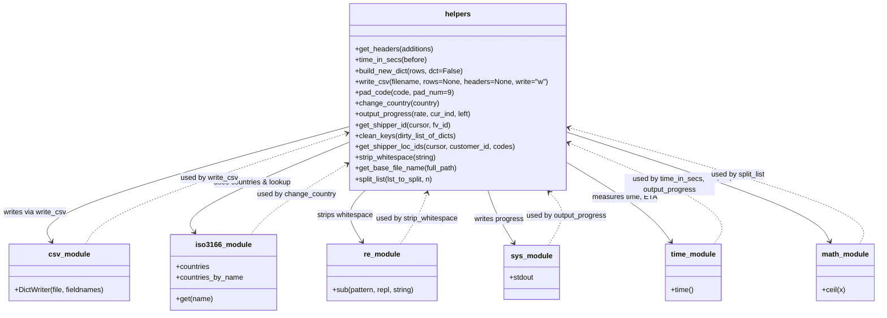

# Diagram: common/location_service/scripts/loc_helpers.py

> Auto-generated by Obscura crawlers

## Mermaid

### SVG

<svg id="container" width="1950.80078125" xmlns="http://www.w3.org/2000/svg" class="classDiagram" height="696" viewBox="12.87109375 0 1950.80078125 696" role="graphics-document document" aria-roledescription="class"><g><defs><marker id="container_class-aggregationStart" class="marker aggregation class" refX="18" refY="7" markerWidth="190" markerHeight="240" orient="auto"><path d="M 18,7 L9,13 L1,7 L9,1 Z"></path></marker></defs><defs><marker id="container_class-aggregationEnd" class="marker aggregation class" refX="1" refY="7" markerWidth="20" markerHeight="28" orient="auto"><path d="M 18,7 L9,13 L1,7 L9,1 Z"></path></marker></defs><defs><marker id="container_class-extensionStart" class="marker extension class" refX="18" refY="7" markerWidth="190" markerHeight="240" orient="auto"><path d="M 1,7 L18,13 V 1 Z"></path></marker></defs><defs><marker id="container_class-extensionEnd" class="marker extension class" refX="1" refY="7" markerWidth="20" markerHeight="28" orient="auto"><path d="M 1,1 V 13 L18,7 Z"></path></marker></defs><defs><marker id="container_class-compositionStart" class="marker composition class" refX="18" refY="7" markerWidth="190" markerHeight="240" orient="auto"><path d="M 18,7 L9,13 L1,7 L9,1 Z"></path></marker></defs><defs><marker id="container_class-compositionEnd" class="marker composition class" refX="1" refY="7" markerWidth="20" markerHeight="28" orient="auto"><path d="M 18,7 L9,13 L1,7 L9,1 Z"></path></marker></defs><defs><marker id="container_class-dependencyStart" class="marker dependency class" refX="6" refY="7" markerWidth="190" markerHeight="240" orient="auto"><path d="M 5,7 L9,13 L1,7 L9,1 Z"></path></marker></defs><defs><marker id="container_class-dependencyEnd" class="marker dependency class" refX="13" refY="7" markerWidth="20" markerHeight="28" orient="auto"><path d="M 18,7 L9,13 L14,7 L9,1 Z"></path></marker></defs><defs><marker id="container_class-lollipopStart" class="marker lollipop class" refX="13" refY="7" markerWidth="190" markerHeight="240" orient="auto"><circle stroke="black" fill="transparent" cx="7" cy="7" r="6"></circle></marker></defs><defs><marker id="container_class-lollipopEnd" class="marker lollipop class" refX="1" refY="7" markerWidth="190" markerHeight="240" orient="auto"><circle stroke="black" fill="transparent" cx="7" cy="7" r="6"></circle></marker></defs><g class="root"><g class="clusters"></g><g class="edgePaths"><path d="M789.813,279.285L671.201,311.237C552.589,343.19,315.365,407.095,203.005,449.849C90.646,492.602,103.151,514.205,109.404,525.006L115.657,535.807" id="id_helpers_csv_module_1" class="edge-thickness-normal edge-pattern-solid relation" style=";;;" data-edge="true" data-et="edge" data-id="id_helpers_csv_module_1" data-points="W3sieCI6Nzg5LjgxMjUsInkiOjI3OS4yODQ2NDU1NDk1MzU5fSx7IngiOjc4LjE0MDYyNSwieSI6NDcxfSx7IngiOjExOC42NjI4Mjg5NDczNjg0MSwieSI6NTQxfV0=" marker-end="url(#container_class-dependencyEnd)"></path><path d="M789.813,312.793L725.47,339.161C661.128,365.529,532.443,418.264,473.513,451.993C414.584,485.722,425.409,500.444,430.822,507.805L436.235,515.166" id="id_helpers_iso3166_module_2" class="edge-thickness-normal edge-pattern-solid relation" style=";;;" data-edge="true" data-et="edge" data-id="id_helpers_iso3166_module_2" data-points="W3sieCI6Nzg5LjgxMjUsInkiOjMxMi43OTI4OTY0NDgyMjQxfSx7IngiOjQwMy43NTc4MTI1LCJ5Ijo0NzF9LHsieCI6NDM5Ljc4OTY3OTI3NjMxNTgsInkiOjUyMH1d" marker-end="url(#container_class-dependencyEnd)"></path><path d="M819.746,422L811.512,430.167C803.279,438.333,786.811,454.667,785.693,473.664C784.575,492.662,798.807,514.324,805.922,525.155L813.038,535.985" id="id_helpers_re_module_3" class="edge-thickness-normal edge-pattern-solid relation" style=";;;" data-edge="true" data-et="edge" data-id="id_helpers_re_module_3" data-points="W3sieCI6ODE5Ljc0NjAwMjE5NzI2NTYsInkiOjQyMn0seyJ4Ijo3NzAuMzQzNzUsInkiOjQ3MX0seyJ4Ijo4MTYuMzMyNjQ4MDI2MzE1OCwieSI6NTQxfV0=" marker-end="url(#container_class-dependencyEnd)"></path><path d="M1095.837,422L1098.495,430.167C1101.154,438.333,1106.472,454.667,1116.161,474.151C1125.85,493.634,1139.911,516.269,1146.941,527.586L1153.971,538.903" id="id_helpers_sys_module_4" class="edge-thickness-normal edge-pattern-solid relation" style=";;;" data-edge="true" data-et="edge" data-id="id_helpers_sys_module_4" data-points="W3sieCI6MTA5NS44MzY1NDc4NTE1NjI1LCJ5Ijo0MjJ9LHsieCI6MTExMS43ODkwNjI1LCJ5Ijo0NzF9LHsieCI6MTE1Ny4xMzc0ODIzNzc4MTk3LCJ5Ijo1NDR9XQ==" marker-end="url(#container_class-dependencyEnd)"></path><path d="M1267.078,357.562L1298.725,376.468C1330.372,395.375,1393.667,433.187,1433.057,462.946C1472.447,492.705,1487.934,514.411,1495.677,525.263L1503.421,536.116" id="id_helpers_time_module_5" class="edge-thickness-normal edge-pattern-solid relation" style=";;;" data-edge="true" data-et="edge" data-id="id_helpers_time_module_5" data-points="W3sieCI6MTI2Ny4wNzgxMjUsInkiOjM1Ny41NjE4OTYwODAyMTg4fSx7IngiOjE0NTYuOTYwOTM3NSwieSI6NDcxfSx7IngiOjE1MDYuOTA1NDI3NjMxNTc5LCJ5Ijo1NDF9XQ==" marker-end="url(#container_class-dependencyEnd)"></path><path d="M1267.078,291.84L1359.811,321.7C1452.544,351.56,1638.01,411.28,1736.354,451.92C1834.698,492.559,1845.918,514.118,1851.529,524.898L1857.139,535.678" id="id_helpers_math_module_6" class="edge-thickness-normal edge-pattern-solid relation" style=";;;" data-edge="true" data-et="edge" data-id="id_helpers_math_module_6" data-points="W3sieCI6MTI2Ny4wNzgxMjUsInkiOjI5MS44Mzk3NDY4NjUyOTYyfSx7IngiOjE4MjMuNDc2NTYyNSwieSI6NDcxfSx7IngiOjE4NTkuOTA5NTM5NDczNjg0MiwieSI6NTQxfV0=" marker-end="url(#container_class-dependencyEnd)"></path><path d="M191.603,541L198.356,529.333C205.11,517.667,218.618,494.333,317.367,453.092C416.117,411.851,600.109,352.701,692.105,323.126L784.1,293.552" id="id_csv_module_helpers_7" class="edge-thickness-normal edge-pattern-dashed relation" style=";;;" data-edge="true" data-et="edge" data-id="id_csv_module_helpers_7" data-points="W3sieCI6MTkxLjYwMjc5NjA1MjYzMTYsInkiOjU0MX0seyJ4IjoyMzIuMTI1LCJ5Ijo0NzF9LHsieCI6Nzg5LjgxMjUsInkiOjI5MS43MTUzNjA2OTIyNDY2fV0=" marker-end="url(#container_class-dependencyEnd)"></path><path d="M563.328,520L569.333,511.833C575.338,503.667,587.349,487.333,624.237,460.741C661.126,434.149,722.893,397.298,753.776,378.872L784.66,360.447" id="id_iso3166_module_helpers_8" class="edge-thickness-normal edge-pattern-dashed relation" style=";;;" data-edge="true" data-et="edge" data-id="id_iso3166_module_helpers_8" data-points="W3sieCI6NTYzLjMyNzUwODIyMzY4NDIsInkiOjUyMH0seyJ4Ijo1OTkuMzU5Mzc1LCJ5Ijo0NzF9LHsieCI6Nzg5LjgxMjUsInkiOjM1Ny4zNzI0MTIyODYyOTE3fV0=" marker-end="url(#container_class-dependencyEnd)"></path><path d="M899.113,541L906.777,529.333C914.442,517.667,929.772,494.333,939.786,475.451C949.8,456.568,954.498,442.137,956.847,434.921L959.197,427.705" id="id_re_module_helpers_9" class="edge-thickness-normal edge-pattern-dashed relation" style=";;;" data-edge="true" data-et="edge" data-id="id_re_module_helpers_9" data-points="W3sieCI6ODk5LjExMjY2NDQ3MzY4NDIsInkiOjU0MX0seyJ4Ijo5NDUuMTAxNTYyNSwieSI6NDcxfSx7IngiOjk2MS4wNTQwNzcxNDg0Mzc1LCJ5Ijo0MjJ9XQ==" marker-end="url(#container_class-dependencyEnd)"></path><path d="M1231.683,544L1239.241,531.833C1246.799,519.667,1261.915,495.333,1262.24,475.717C1262.564,456.102,1248.097,441.203,1240.864,433.754L1233.63,426.305" id="id_sys_module_helpers_10" class="edge-thickness-normal edge-pattern-dashed relation" style=";;;" data-edge="true" data-et="edge" data-id="id_sys_module_helpers_10" data-points="W3sieCI6MTIzMS42ODI4MzAxMjIxODAzLCJ5Ijo1NDR9LHsieCI6MTI3Ny4wMzEyNSwieSI6NDcxfSx7IngiOjEyMjkuNDUwMzQ3OTAwMzkwNiwieSI6NDIyfV0=" marker-end="url(#container_class-dependencyEnd)"></path><path d="M1596.806,541L1605.13,529.333C1613.454,517.667,1630.102,494.333,1576.071,456.85C1522.041,419.366,1397.331,367.732,1334.976,341.915L1272.622,316.098" id="id_time_module_helpers_11" class="edge-thickness-normal edge-pattern-dashed relation" style=";;;" data-edge="true" data-et="edge" data-id="id_time_module_helpers_11" data-points="W3sieCI6MTU5Ni44MDU1MDk4Njg0MjEsInkiOjU0MX0seyJ4IjoxNjQ2Ljc1LCJ5Ijo0NzF9LHsieCI6MTI2Ny4wNzgxMjUsInkiOjMxMy44MDI0MjA5MzQyNTgyNH1d" marker-end="url(#container_class-dependencyEnd)"></path><path d="M1925.489,541L1931.561,529.333C1937.633,517.667,1949.778,494.333,1841.007,451.172C1732.236,408.01,1502.55,345.02,1387.707,313.525L1272.864,282.03" id="id_math_module_helpers_12" class="edge-thickness-normal edge-pattern-dashed relation" style=";;;" data-edge="true" data-et="edge" data-id="id_math_module_helpers_12" data-points="W3sieCI6MTkyNS40ODg4OTgwMjYzMTU4LCJ5Ijo1NDF9LHsieCI6MTk2MS45MjE4NzUsInkiOjQ3MX0seyJ4IjoxMjY3LjA3ODEyNSwieSI6MjgwLjQ0MzUyODQ3NjM3Nzc2fV0=" marker-end="url(#container_class-dependencyEnd)"></path></g><g class="edgeLabels"><g class="edgeLabel" transform="translate(394.92718, 385.66173)"><g class="label" data-id="id_helpers_csv_module_1" transform="translate(-70.140625, -12)"><foreignObject width="140.28125" height="24">

writes via write_csv

</foreignObject></g></g><g class="edgeLabel" transform="translate(568.64547, 403.42823)"><g class="label" data-id="id_helpers_iso3166_module_2" transform="translate(-87.7890625, -12)"><foreignObject width="175.578125" height="24">

uses countries &amp; lookup

</foreignObject></g></g><g class="edgeLabel" transform="translate(774.23511, 476.92307)"><g class="label" data-id="id_helpers_re_module_3" transform="translate(-63.171875, -12)"><foreignObject width="126.34375" height="24">

strips whitespace

</foreignObject></g></g><g class="edgeLabel" transform="translate(1120.86717, 485.61355)"><g class="label" data-id="id_helpers_sys_module_4" transform="translate(-55.1015625, -12)"><foreignObject width="110.203125" height="24">

writes progress

</foreignObject></g></g><g class="edgeLabel" transform="translate(1398.92996, 436.33165)"><g class="label" data-id="id_helpers_time_module_5" transform="translate(-69.7890625, -12)"><foreignObject width="139.578125" height="24">

measures time, ETA

</foreignObject></g></g><g class="edgeLabel" transform="translate(1582.8351, 393.51347)"><g class="label" data-id="id_helpers_math_module_6" transform="translate(-56.7265625, -12)"><foreignObject width="113.453125" height="24">

splits lists (ceil)

</foreignObject></g></g><g class="edgeLabel" transform="translate(472.46788, 393.73489)"><g class="label" data-id="id_csv_module_helpers_7" transform="translate(-63.84375, -12)"><foreignObject width="127.6875" height="24">

used by write_csv

</foreignObject></g></g><g class="edgeLabel" transform="translate(668.4699, 429.76748)"><g class="label" data-id="id_iso3166_module_helpers_8" transform="translate(-87.8125, -12)"><foreignObject width="175.625" height="24">

used by change_country

</foreignObject></g></g><g class="edgeLabel" transform="translate(936.25467, 484.46591)"><g class="label" data-id="id_re_module_helpers_9" transform="translate(-91.5859375, -12)"><foreignObject width="183.171875" height="24">

used by strip_whitespace

</foreignObject></g></g><g class="edgeLabel" transform="translate(1272.3775, 478.49141)"><g class="label" data-id="id_sys_module_helpers_10" transform="translate(-90.140625, -12)"><foreignObject width="180.28125" height="24">

used by output_progress

</foreignObject></g></g><g class="edgeLabel" transform="translate(1496.63923, 408.84883)"><g class="label" data-id="id_time_module_helpers_11" transform="translate(-100, -24)"><foreignObject width="200" height="48">

used by time_in_secs, output_progress

</foreignObject></g></g><g class="edgeLabel" transform="translate(1652.55183, 386.15723)"><g class="label" data-id="id_math_module_helpers_12" transform="translate(-61.71875, -12)"><foreignObject width="123.4375" height="24">

used by split_list

</foreignObject></g></g></g><g class="nodes"><g class="node default" id="classId-helpers-0" transform="translate(1028.4453125, 215)"><g class="basic label-container"><path d="M-238.6328125 -207 L238.6328125 -207 L238.6328125 207 L-238.6328125 207" stroke="none" stroke-width="0" fill="#ECECFF" style=""></path><path d="M-238.6328125 -207 C-75.42844495438393 -207, 87.77592259123213 -207, 238.6328125 -207 M-238.6328125 -207 C-136.46695036390042 -207, -34.301088227800875 -207, 238.6328125 -207 M238.6328125 -207 C238.6328125 -67.72991782814938, 238.6328125 71.54016434370124, 238.6328125 207 M238.6328125 -207 C238.6328125 -76.79170508658257, 238.6328125 53.416589826834866, 238.6328125 207 M238.6328125 207 C54.0895067163209 207, -130.4537990673582 207, -238.6328125 207 M238.6328125 207 C94.88651646063943 207, -48.859779578721145 207, -238.6328125 207 M-238.6328125 207 C-238.6328125 77.1812429282009, -238.6328125 -52.637514143598196, -238.6328125 -207 M-238.6328125 207 C-238.6328125 108.83472115832632, -238.6328125 10.669442316652635, -238.6328125 -207" stroke="#9370DB" stroke-width="1.3" fill="none" stroke-dasharray="0 0" style=""></path></g><g class="annotation-group text" transform="translate(0, -183)"></g><g class="label-group text" transform="translate(-27.578125, -183)"><g class="label" style="font-weight: bolder" transform="translate(0,-12)"><foreignObject width="55.15625" height="24">

helpers

</foreignObject></g></g><g class="members-group text" transform="translate(-226.6328125, -135)"></g><g class="methods-group text" transform="translate(-226.6328125, -105)"><g class="label" style="" transform="translate(0,-12)"><foreignObject width="176.40625" height="24">

+get_headers(additions)

</foreignObject></g><g class="label" style="" transform="translate(0,12)"><foreignObject width="159.703125" height="24">

+time_in_secs(before)

</foreignObject></g><g class="label" style="" transform="translate(0,36)"><foreignObject width="238.3125" height="24">

+build_new_dict(rows, dct=False)

</foreignObject></g><g class="label" style="" transform="translate(0,60)"><foreignObject width="425.6875" height="24">

+write_csv(filename, rows=None, headers=None, write="w")

</foreignObject></g><g class="label" style="" transform="translate(0,84)"><foreignObject width="216.390625" height="24">

+pad_code(code, pad_num=9)

</foreignObject></g><g class="label" style="" transform="translate(0,108)"><foreignObject width="188.296875" height="24">

+change_country(country)

</foreignObject></g><g class="label" style="" transform="translate(0,132)"><foreignObject width="260.28125" height="24">

+output_progress(rate, cur_ind, left)

</foreignObject></g><g class="label" style="" transform="translate(0,156)"><foreignObject width="213.296875" height="24">

+get_shipper_id(cursor, fv_id)

</foreignObject></g><g class="label" style="" transform="translate(0,180)"><foreignObject width="226.671875" height="24">

+clean_keys(dirty_list_of_dicts)

</foreignObject></g><g class="label" style="" transform="translate(0,204)"><foreignObject width="354.78125" height="24">

+get_shipper_loc_ids(cursor, customer_id, codes)

</foreignObject></g><g class="label" style="" transform="translate(0,228)"><foreignObject width="182.296875" height="24">

+strip_whitespace(string)

</foreignObject></g><g class="label" style="" transform="translate(0,252)"><foreignObject width="227.609375" height="24">

+get_base_file_name(full_path)

</foreignObject></g><g class="label" style="" transform="translate(0,276)"><foreignObject width="179.203125" height="24">

+split_list(lst_to_split, n)

</foreignObject></g></g><g class="divider" style=""><path d="M-238.6328125 -159 C-126.64889302858262 -159, -14.66497355716524 -159, 238.6328125 -159 M-238.6328125 -159 C-135.01581828147883 -159, -31.398824062957658 -159, 238.6328125 -159" stroke="#9370DB" stroke-width="1.3" fill="none" stroke-dasharray="0 0" style=""></path></g><g class="divider" style=""><path d="M-238.6328125 -135 C-109.68656791711427 -135, 19.25967666577145 -135, 238.6328125 -135 M-238.6328125 -135 C-97.77597055046448 -135, 43.08087139907104 -135, 238.6328125 -135" stroke="#9370DB" stroke-width="1.3" fill="none" stroke-dasharray="0 0" style=""></path></g></g><g class="node default" id="classId-csv_module-1" transform="translate(155.1328125, 604)"><g class="basic label-container"><path d="M-134.26171875 -63 L134.26171875 -63 L134.26171875 63 L-134.26171875 63" stroke="none" stroke-width="0" fill="#ECECFF" style=""></path><path d="M-134.26171875 -63 C-27.667886652788198 -63, 78.9259454444236 -63, 134.26171875 -63 M-134.26171875 -63 C-73.06541982438851 -63, -11.869120898777027 -63, 134.26171875 -63 M134.26171875 -63 C134.26171875 -36.03178285596901, 134.26171875 -9.063565711938026, 134.26171875 63 M134.26171875 -63 C134.26171875 -21.245280170995684, 134.26171875 20.50943965800863, 134.26171875 63 M134.26171875 63 C38.15935415304048 63, -57.943010443919036 63, -134.26171875 63 M134.26171875 63 C69.895149605547 63, 5.528580461094009 63, -134.26171875 63 M-134.26171875 63 C-134.26171875 15.169754787888813, -134.26171875 -32.660490424222374, -134.26171875 -63 M-134.26171875 63 C-134.26171875 35.297661812368524, -134.26171875 7.595323624737048, -134.26171875 -63" stroke="#9370DB" stroke-width="1.3" fill="none" stroke-dasharray="0 0" style=""></path></g><g class="annotation-group text" transform="translate(0, -39)"></g><g class="label-group text" transform="translate(-43.1328125, -39)"><g class="label" style="font-weight: bolder" transform="translate(0,-12)"><foreignObject width="86.265625" height="24">

csv_module

</foreignObject></g></g><g class="members-group text" transform="translate(-122.26171875, 9)"></g><g class="methods-group text" transform="translate(-122.26171875, 39)"><g class="label" style="" transform="translate(0,-12)"><foreignObject width="201.390625" height="24">

+DictWriter(file, fieldnames)

</foreignObject></g></g><g class="divider" style=""><path d="M-134.26171875 -15 C-62.98372445321942 -15, 8.294269843561153 -15, 134.26171875 -15 M-134.26171875 -15 C-33.05857697870458 -15, 68.14456479259084 -15, 134.26171875 -15" stroke="#9370DB" stroke-width="1.3" fill="none" stroke-dasharray="0 0" style=""></path></g><g class="divider" style=""><path d="M-134.26171875 9 C-52.642110977187386 9, 28.97749679562523 9, 134.26171875 9 M-134.26171875 9 C-44.8607017337239 9, 44.5403152825522 9, 134.26171875 9" stroke="#9370DB" stroke-width="1.3" fill="none" stroke-dasharray="0 0" style=""></path></g></g><g class="node default" id="classId-iso3166_module-2" transform="translate(501.55859375, 604)"><g class="basic label-container"><path d="M-116.29296875 -84 L116.29296875 -84 L116.29296875 84 L-116.29296875 84" stroke="none" stroke-width="0" fill="#ECECFF" style=""></path><path d="M-116.29296875 -84 C-46.25108152480027 -84, 23.79080570039946 -84, 116.29296875 -84 M-116.29296875 -84 C-68.76033414561134 -84, -21.227699541222677 -84, 116.29296875 -84 M116.29296875 -84 C116.29296875 -17.47895066661269, 116.29296875 49.04209866677462, 116.29296875 84 M116.29296875 -84 C116.29296875 -17.375045655317848, 116.29296875 49.249908689364304, 116.29296875 84 M116.29296875 84 C66.31050127329715 84, 16.328033796594283 84, -116.29296875 84 M116.29296875 84 C44.164652784350395 84, -27.96366318129921 84, -116.29296875 84 M-116.29296875 84 C-116.29296875 23.47799833106835, -116.29296875 -37.0440033378633, -116.29296875 -84 M-116.29296875 84 C-116.29296875 28.878370349551645, -116.29296875 -26.24325930089671, -116.29296875 -84" stroke="#9370DB" stroke-width="1.3" fill="none" stroke-dasharray="0 0" style=""></path></g><g class="annotation-group text" transform="translate(0, -60)"></g><g class="label-group text" transform="translate(-58.9140625, -60)"><g class="label" style="font-weight: bolder" transform="translate(0,-12)"><foreignObject width="117.828125" height="24">

iso3166_module

</foreignObject></g></g><g class="members-group text" transform="translate(-104.29296875, -12)"><g class="label" style="" transform="translate(0,-12)"><foreignObject width="76.015625" height="24">

+countries

</foreignObject></g><g class="label" style="" transform="translate(0,12)"><foreignObject width="149.671875" height="24">

+countries_by_name

</foreignObject></g></g><g class="methods-group text" transform="translate(-104.29296875, 60)"><g class="label" style="" transform="translate(0,-12)"><foreignObject width="81.4375" height="24">

+get(name)

</foreignObject></g></g><g class="divider" style=""><path d="M-116.29296875 -36 C-54.18169669521988 -36, 7.929575359560246 -36, 116.29296875 -36 M-116.29296875 -36 C-63.53291895311521 -36, -10.772869156230414 -36, 116.29296875 -36" stroke="#9370DB" stroke-width="1.3" fill="none" stroke-dasharray="0 0" style=""></path></g><g class="divider" style=""><path d="M-116.29296875 36 C-61.62099463147151 36, -6.949020512943022 36, 116.29296875 36 M-116.29296875 36 C-26.526266541578266 36, 63.24043566684347 36, 116.29296875 36" stroke="#9370DB" stroke-width="1.3" fill="none" stroke-dasharray="0 0" style=""></path></g></g><g class="node default" id="classId-re_module-3" transform="translate(857.72265625, 604)"><g class="basic label-container"><path d="M-123.84765625 -63 L123.84765625 -63 L123.84765625 63 L-123.84765625 63" stroke="none" stroke-width="0" fill="#ECECFF" style=""></path><path d="M-123.84765625 -63 C-41.19522010964707 -63, 41.457216030705865 -63, 123.84765625 -63 M-123.84765625 -63 C-56.342973412753125 -63, 11.16170942449375 -63, 123.84765625 -63 M123.84765625 -63 C123.84765625 -18.949423533197326, 123.84765625 25.10115293360535, 123.84765625 63 M123.84765625 -63 C123.84765625 -25.881723237032915, 123.84765625 11.23655352593417, 123.84765625 63 M123.84765625 63 C70.23534981845513 63, 16.62304338691027 63, -123.84765625 63 M123.84765625 63 C72.49273338465045 63, 21.137810519300885 63, -123.84765625 63 M-123.84765625 63 C-123.84765625 27.80189653120457, -123.84765625 -7.396206937590861, -123.84765625 -63 M-123.84765625 63 C-123.84765625 16.40810955436178, -123.84765625 -30.18378089127644, -123.84765625 -63" stroke="#9370DB" stroke-width="1.3" fill="none" stroke-dasharray="0 0" style=""></path></g><g class="annotation-group text" transform="translate(0, -39)"></g><g class="label-group text" transform="translate(-38.9453125, -39)"><g class="label" style="font-weight: bolder" transform="translate(0,-12)"><foreignObject width="77.890625" height="24">

re_module

</foreignObject></g></g><g class="members-group text" transform="translate(-111.84765625, 9)"></g><g class="methods-group text" transform="translate(-111.84765625, 39)"><g class="label" style="" transform="translate(0,-12)"><foreignObject width="184.75" height="24">

+sub(pattern, repl, string)

</foreignObject></g></g><g class="divider" style=""><path d="M-123.84765625 -15 C-67.36773139513252 -15, -10.887806540265032 -15, 123.84765625 -15 M-123.84765625 -15 C-47.770076364986124 -15, 28.30750352002775 -15, 123.84765625 -15" stroke="#9370DB" stroke-width="1.3" fill="none" stroke-dasharray="0 0" style=""></path></g><g class="divider" style=""><path d="M-123.84765625 9 C-49.364390619036456 9, 25.118875011927088 9, 123.84765625 9 M-123.84765625 9 C-32.91313695464149 9, 58.021382340717025 9, 123.84765625 9" stroke="#9370DB" stroke-width="1.3" fill="none" stroke-dasharray="0 0" style=""></path></g></g><g class="node default" id="classId-sys_module-4" transform="translate(1194.41015625, 604)"><g class="basic label-container"><path d="M-61.10546875 -60 L61.10546875 -60 L61.10546875 60 L-61.10546875 60" stroke="none" stroke-width="0" fill="#ECECFF" style=""></path><path d="M-61.10546875 -60 C-33.53582361713601 -60, -5.966178484272021 -60, 61.10546875 -60 M-61.10546875 -60 C-20.76484595672035 -60, 19.5757768365593 -60, 61.10546875 -60 M61.10546875 -60 C61.10546875 -23.64260246867677, 61.10546875 12.71479506264646, 61.10546875 60 M61.10546875 -60 C61.10546875 -30.789234594139092, 61.10546875 -1.5784691882781843, 61.10546875 60 M61.10546875 60 C29.07157619160551 60, -2.9623163667889827 60, -61.10546875 60 M61.10546875 60 C19.339586630482216 60, -22.426295489035567 60, -61.10546875 60 M-61.10546875 60 C-61.10546875 33.97287889406918, -61.10546875 7.945757788138366, -61.10546875 -60 M-61.10546875 60 C-61.10546875 15.655156412461267, -61.10546875 -28.689687175077466, -61.10546875 -60" stroke="#9370DB" stroke-width="1.3" fill="none" stroke-dasharray="0 0" style=""></path></g><g class="annotation-group text" transform="translate(0, -36)"></g><g class="label-group text" transform="translate(-43.2109375, -36)"><g class="label" style="font-weight: bolder" transform="translate(0,-12)"><foreignObject width="86.421875" height="24">

sys_module

</foreignObject></g></g><g class="members-group text" transform="translate(-49.10546875, 12)"><g class="label" style="" transform="translate(0,-12)"><foreignObject width="55" height="24">

+stdout

</foreignObject></g></g><g class="methods-group text" transform="translate(-49.10546875, 60)"></g><g class="divider" style=""><path d="M-61.10546875 -12 C-23.530763362730788 -12, 14.043942024538424 -12, 61.10546875 -12 M-61.10546875 -12 C-13.441893589099223 -12, 34.221681571801554 -12, 61.10546875 -12" stroke="#9370DB" stroke-width="1.3" fill="none" stroke-dasharray="0 0" style=""></path></g><g class="divider" style=""><path d="M-61.10546875 36 C-24.972941414493576 36, 11.159585921012848 36, 61.10546875 36 M-61.10546875 36 C-16.63747298154233 36, 27.83052278691534 36, 61.10546875 36" stroke="#9370DB" stroke-width="1.3" fill="none" stroke-dasharray="0 0" style=""></path></g></g><g class="node default" id="classId-time_module-5" transform="translate(1551.85546875, 604)"><g class="basic label-container"><path d="M-61.54296875 -63 L61.54296875 -63 L61.54296875 63 L-61.54296875 63" stroke="none" stroke-width="0" fill="#ECECFF" style=""></path><path d="M-61.54296875 -63 C-14.045076996128792 -63, 33.452814757742416 -63, 61.54296875 -63 M-61.54296875 -63 C-36.549711708000515 -63, -11.55645466600103 -63, 61.54296875 -63 M61.54296875 -63 C61.54296875 -27.19510456122837, 61.54296875 8.609790877543261, 61.54296875 63 M61.54296875 -63 C61.54296875 -13.23347078795259, 61.54296875 36.53305842409482, 61.54296875 63 M61.54296875 63 C23.583594139400944 63, -14.375780471198112 63, -61.54296875 63 M61.54296875 63 C26.38438271126261 63, -8.77420332747478 63, -61.54296875 63 M-61.54296875 63 C-61.54296875 24.918124100579135, -61.54296875 -13.16375179884173, -61.54296875 -63 M-61.54296875 63 C-61.54296875 19.555653633375485, -61.54296875 -23.88869273324903, -61.54296875 -63" stroke="#9370DB" stroke-width="1.3" fill="none" stroke-dasharray="0 0" style=""></path></g><g class="annotation-group text" transform="translate(0, -39)"></g><g class="label-group text" transform="translate(-48.0859375, -39)"><g class="label" style="font-weight: bolder" transform="translate(0,-12)"><foreignObject width="96.171875" height="24">

time_module

</foreignObject></g></g><g class="members-group text" transform="translate(-49.54296875, 9)"></g><g class="methods-group text" transform="translate(-49.54296875, 39)"><g class="label" style="" transform="translate(0,-12)"><foreignObject width="51" height="24">

+time()

</foreignObject></g></g><g class="divider" style=""><path d="M-61.54296875 -15 C-19.901302699342082 -15, 21.740363351315835 -15, 61.54296875 -15 M-61.54296875 -15 C-30.308799785321025 -15, 0.9253691793579506 -15, 61.54296875 -15" stroke="#9370DB" stroke-width="1.3" fill="none" stroke-dasharray="0 0" style=""></path></g><g class="divider" style=""><path d="M-61.54296875 9 C-21.181420622213416 9, 19.180127505573168 9, 61.54296875 9 M-61.54296875 9 C-28.960750731127085 9, 3.62146728774583 9, 61.54296875 9" stroke="#9370DB" stroke-width="1.3" fill="none" stroke-dasharray="0 0" style=""></path></g></g><g class="node default" id="classId-math_module-6" transform="translate(1892.69921875, 604)"><g class="basic label-container"><path d="M-62.97265625 -63 L62.97265625 -63 L62.97265625 63 L-62.97265625 63" stroke="none" stroke-width="0" fill="#ECECFF" style=""></path><path d="M-62.97265625 -63 C-27.62446230456215 -63, 7.723731640875698 -63, 62.97265625 -63 M-62.97265625 -63 C-16.237929976830664 -63, 30.496796296338673 -63, 62.97265625 -63 M62.97265625 -63 C62.97265625 -17.03971429919457, 62.97265625 28.920571401610857, 62.97265625 63 M62.97265625 -63 C62.97265625 -34.41770008985287, 62.97265625 -5.8354001797057435, 62.97265625 63 M62.97265625 63 C22.916096132724057 63, -17.140463984551886 63, -62.97265625 63 M62.97265625 63 C37.40667583895826 63, 11.840695427916515 63, -62.97265625 63 M-62.97265625 63 C-62.97265625 21.83160276206837, -62.97265625 -19.336794475863258, -62.97265625 -63 M-62.97265625 63 C-62.97265625 19.24527909012002, -62.97265625 -24.509441819759957, -62.97265625 -63" stroke="#9370DB" stroke-width="1.3" fill="none" stroke-dasharray="0 0" style=""></path></g><g class="annotation-group text" transform="translate(0, -39)"></g><g class="label-group text" transform="translate(-50.5703125, -39)"><g class="label" style="font-weight: bolder" transform="translate(0,-12)"><foreignObject width="101.140625" height="24">

math_module

</foreignObject></g></g><g class="members-group text" transform="translate(-50.97265625, 9)"></g><g class="methods-group text" transform="translate(-50.97265625, 39)"><g class="label" style="" transform="translate(0,-12)"><foreignObject width="51.375" height="24">

+ceil(x)

</foreignObject></g></g><g class="divider" style=""><path d="M-62.97265625 -15 C-25.84654853364276 -15, 11.279559182714479 -15, 62.97265625 -15 M-62.97265625 -15 C-29.674921069326302 -15, 3.6228141113473953 -15, 62.97265625 -15" stroke="#9370DB" stroke-width="1.3" fill="none" stroke-dasharray="0 0" style=""></path></g><g class="divider" style=""><path d="M-62.97265625 9 C-20.150761266505235 9, 22.67113371698953 9, 62.97265625 9 M-62.97265625 9 C-31.594401137915582 9, -0.21614602583116493 9, 62.97265625 9" stroke="#9370DB" stroke-width="1.3" fill="none" stroke-dasharray="0 0" style=""></path></g></g></g></g></g></svg>
