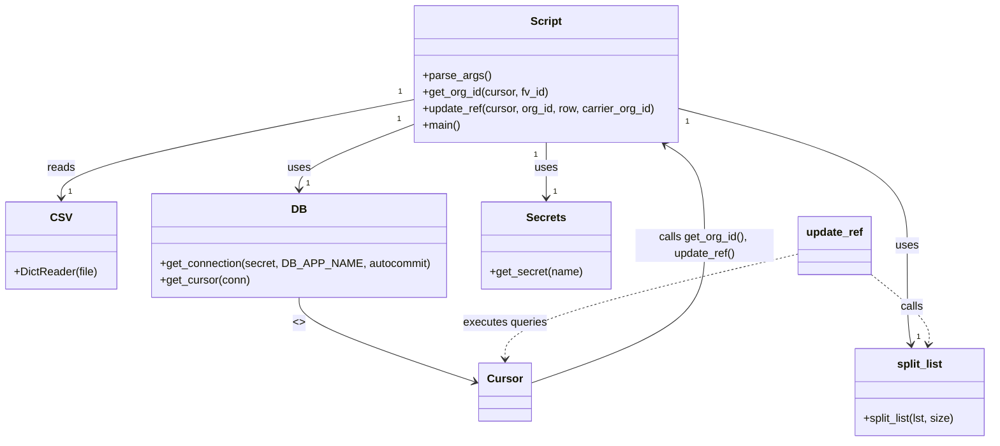

# Diagram: common/location_service/scripts/location_linking/transfer_carrier_loc_to_customer.py


> Auto-generated by Obscura crawlers

## Diagram 1



### SVG

<svg id="container" width="1413.05078125" xmlns="http://www.w3.org/2000/svg" class="classDiagram" height="638" viewBox="0 0 1413.05078125 638" role="graphics-document document" aria-roledescription="class"><style>#container{font-family:"trebuchet ms",verdana,arial,sans-serif;font-size:16px;fill:#333;}@keyframes edge-animation-frame{from{stroke-dashoffset:0;}}@keyframes dash{to{stroke-dashoffset:0;}}#container .edge-animation-slow{stroke-dasharray:9,5!important;stroke-dashoffset:900;animation:dash 50s linear infinite;stroke-linecap:round;}#container .edge-animation-fast{stroke-dasharray:9,5!important;stroke-dashoffset:900;animation:dash 20s linear infinite;stroke-linecap:round;}#container .error-icon{fill:#552222;}#container .error-text{fill:#552222;stroke:#552222;}#container .edge-thickness-normal{stroke-width:1px;}#container .edge-thickness-thick{stroke-width:3.5px;}#container .edge-pattern-solid{stroke-dasharray:0;}#container .edge-thickness-invisible{stroke-width:0;fill:none;}#container .edge-pattern-dashed{stroke-dasharray:3;}#container .edge-pattern-dotted{stroke-dasharray:2;}#container .marker{fill:#333333;stroke:#333333;}#container .marker.cross{stroke:#333333;}#container svg{font-family:"trebuchet ms",verdana,arial,sans-serif;font-size:16px;}#container p{margin:0;}#container g.classGroup text{fill:#9370DB;stroke:none;font-family:"trebuchet ms",verdana,arial,sans-serif;font-size:10px;}#container g.classGroup text .title{font-weight:bolder;}#container .nodeLabel,#container .edgeLabel{color:#131300;}#container .edgeLabel .label rect{fill:#ECECFF;}#container .label text{fill:#131300;}#container .labelBkg{background:#ECECFF;}#container .edgeLabel .label span{background:#ECECFF;}#container .classTitle{font-weight:bolder;}#container .node rect,#container .node circle,#container .node ellipse,#container .node polygon,#container .node path{fill:#ECECFF;stroke:#9370DB;stroke-width:1px;}#container .divider{stroke:#9370DB;stroke-width:1;}#container g.clickable{cursor:pointer;}#container g.classGroup rect{fill:#ECECFF;stroke:#9370DB;}#container g.classGroup line{stroke:#9370DB;stroke-width:1;}#container .classLabel .box{stroke:none;stroke-width:0;fill:#ECECFF;opacity:0.5;}#container .classLabel .label{fill:#9370DB;font-size:10px;}#container .relation{stroke:#333333;stroke-width:1;fill:none;}#container .dashed-line{stroke-dasharray:3;}#container .dotted-line{stroke-dasharray:1 2;}#container #compositionStart,#container .composition{fill:#333333!important;stroke:#333333!important;stroke-width:1;}#container #compositionEnd,#container .composition{fill:#333333!important;stroke:#333333!important;stroke-width:1;}#container #dependencyStart,#container .dependency{fill:#333333!important;stroke:#333333!important;stroke-width:1;}#container #dependencyStart,#container .dependency{fill:#333333!important;stroke:#333333!important;stroke-width:1;}#container #extensionStart,#container .extension{fill:transparent!important;stroke:#333333!important;stroke-width:1;}#container #extensionEnd,#container .extension{fill:transparent!important;stroke:#333333!important;stroke-width:1;}#container #aggregationStart,#container .aggregation{fill:transparent!important;stroke:#333333!important;stroke-width:1;}#container #aggregationEnd,#container .aggregation{fill:transparent!important;stroke:#333333!important;stroke-width:1;}#container #lollipopStart,#container .lollipop{fill:#ECECFF!important;stroke:#333333!important;stroke-width:1;}#container #lollipopEnd,#container .lollipop{fill:#ECECFF!important;stroke:#333333!important;stroke-width:1;}#container .edgeTerminals{font-size:11px;line-height:initial;}#container .classTitleText{text-anchor:middle;font-size:18px;fill:#333;}#container .label-icon{display:inline-block;height:1em;overflow:visible;vertical-align:-0.125em;}#container .node .label-icon path{fill:currentColor;stroke:revert;stroke-width:revert;}#container :root{--mermaid-font-family:"trebuchet ms",verdana,arial,sans-serif;}</style><g><defs><marker id="container_class-aggregationStart" class="marker aggregation class" refX="18" refY="7" markerWidth="190" markerHeight="240" orient="auto"><path d="M 18,7 L9,13 L1,7 L9,1 Z"></path></marker></defs><defs><marker id="container_class-aggregationEnd" class="marker aggregation class" refX="1" refY="7" markerWidth="20" markerHeight="28" orient="auto"><path d="M 18,7 L9,13 L1,7 L9,1 Z"></path></marker></defs><defs><marker id="container_class-extensionStart" class="marker extension class" refX="18" refY="7" markerWidth="190" markerHeight="240" orient="auto"><path d="M 1,7 L18,13 V 1 Z"></path></marker></defs><defs><marker id="container_class-extensionEnd" class="marker extension class" refX="1" refY="7" markerWidth="20" markerHeight="28" orient="auto"><path d="M 1,1 V 13 L18,7 Z"></path></marker></defs><defs><marker id="container_class-compositionStart" class="marker composition class" refX="18" refY="7" markerWidth="190" markerHeight="240" orient="auto"><path d="M 18,7 L9,13 L1,7 L9,1 Z"></path></marker></defs><defs><marker id="container_class-compositionEnd" class="marker composition class" refX="1" refY="7" markerWidth="20" markerHeight="28" orient="auto"><path d="M 18,7 L9,13 L1,7 L9,1 Z"></path></marker></defs><defs><marker id="container_class-dependencyStart" class="marker dependency class" refX="6" refY="7" markerWidth="190" markerHeight="240" orient="auto"><path d="M 5,7 L9,13 L1,7 L9,1 Z"></path></marker></defs><defs><marker id="container_class-dependencyEnd" class="marker dependency class" refX="13" refY="7" markerWidth="20" markerHeight="28" orient="auto"><path d="M 18,7 L9,13 L14,7 L9,1 Z"></path></marker></defs><defs><marker id="container_class-lollipopStart" class="marker lollipop class" refX="13" refY="7" markerWidth="190" markerHeight="240" orient="auto"><circle stroke="black" fill="transparent" cx="7" cy="7" r="6"></circle></marker></defs><defs><marker id="container_class-lollipopEnd" class="marker lollipop class" refX="1" refY="7" markerWidth="190" markerHeight="240" orient="auto"><circle stroke="black" fill="transparent" cx="7" cy="7" r="6"></circle></marker></defs><g class="root"><g class="clusters"></g><g class="edgePaths"><path d="M580.844,145.131L498.52,161.443C416.195,177.754,251.547,210.377,169.223,233.855C86.898,257.333,86.898,271.667,86.898,278.833L86.898,286" id="id_Script_CSV_1" class="edge-thickness-normal edge-pattern-solid relation" style=";;;" data-edge="true" data-et="edge" data-id="id_Script_CSV_1" data-points="W3sieCI6NTgwLjg0Mzc1LCJ5IjoxNDUuMTMxMjY3ODkwOTgzOH0seyJ4Ijo4Ni44OTg0Mzc1LCJ5IjoyNDN9LHsieCI6ODYuODk4NDM3NSwieSI6MjkyfV0=" marker-end="url(#container_class-dependencyEnd)"></path><path d="M580.844,181.784L554.588,191.986C528.332,202.189,475.82,222.595,449.564,237.964C423.309,253.333,423.309,263.667,423.309,268.833L423.309,274" id="id_Script_DB_2" class="edge-thickness-normal edge-pattern-solid relation" style=";;;" data-edge="true" data-et="edge" data-id="id_Script_DB_2" data-points="W3sieCI6NTgwLjg0Mzc1LCJ5IjoxODEuNzgzNjA2NDExMDAwNX0seyJ4Ijo0MjMuMzA4NTkzNzUsInkiOjI0M30seyJ4Ijo0MjMuMzA4NTkzNzUsInkiOjI4MH1d" marker-end="url(#container_class-dependencyEnd)"></path><path d="M773.293,206L773.293,212.167C773.293,218.333,773.293,230.667,773.293,244C773.293,257.333,773.293,271.667,773.293,278.833L773.293,286" id="id_Script_Secrets_3" class="edge-thickness-normal edge-pattern-solid relation" style=";;;" data-edge="true" data-et="edge" data-id="id_Script_Secrets_3" data-points="W3sieCI6NzczLjI5Mjk2ODc1LCJ5IjoyMDZ9LHsieCI6NzczLjI5Mjk2ODc1LCJ5IjoyNDN9LHsieCI6NzczLjI5Mjk2ODc1LCJ5IjoyOTJ9XQ==" marker-end="url(#container_class-dependencyEnd)"></path><path d="M965.742,157.505L1020.039,171.754C1074.336,186.003,1182.93,214.502,1237.227,247.417C1291.523,280.333,1291.523,317.667,1291.523,355C1291.523,392.333,1291.523,429.667,1292.468,453.516C1293.412,477.366,1295.301,487.731,1296.246,492.914L1297.19,498.097" id="id_Script_split_list_4" class="edge-thickness-normal edge-pattern-solid relation" style=";;;" data-edge="true" data-et="edge" data-id="id_Script_split_list_4" data-points="W3sieCI6OTY1Ljc0MjE4NzUsInkiOjE1Ny41MDQ3Mzc0MjUyODI4NX0seyJ4IjoxMjkxLjUyMzQzNzUsInkiOjI0M30seyJ4IjoxMjkxLjUyMzQzNzUsInkiOjM1NX0seyJ4IjoxMjkxLjUyMzQzNzUsInkiOjQ2N30seyJ4IjoxMjk4LjI2NTgyMDMxMjUsInkiOjUwNH1d" marker-end="url(#container_class-dependencyEnd)"></path><path d="M423.309,430L423.309,436.167C423.309,442.333,423.309,454.667,465.167,475.132C507.025,495.598,590.741,524.196,632.599,538.495L674.457,552.795" id="id_DB_Cursor_5" class="edge-thickness-normal edge-pattern-solid relation" style=";;;" data-edge="true" data-et="edge" data-id="id_DB_Cursor_5" data-points="W3sieCI6NDIzLjMwODU5Mzc1LCJ5Ijo0MzB9LHsieCI6NDIzLjMwODU5Mzc1LCJ5Ijo0Njd9LHsieCI6NjgwLjEzNDc2NTYyNSwieSI6NTU0LjczNDEwNTUxMTc3OTV9XQ==" marker-end="url(#container_class-dependencyEnd)"></path><path d="M751.947,554.389L793.417,539.824C834.887,525.259,917.826,496.13,959.296,462.898C1000.766,429.667,1000.766,392.333,1000.766,355C1000.766,317.667,1000.766,280.333,991.31,256.013C981.854,231.693,962.942,220.386,953.485,214.732L944.029,209.079" id="id_Cursor_Script_6" class="edge-thickness-normal edge-pattern-solid relation" style=";;;" data-edge="true" data-et="edge" data-id="id_Cursor_Script_6" data-points="W3sieCI6NzUxLjk0NzI2NTYyNSwieSI6NTU0LjM4OTEzMDEyMTYyMjR9LHsieCI6MTAwMC43NjU2MjUsInkiOjQ2N30seyJ4IjoxMDAwLjc2NTYyNSwieSI6MzU1fSx7IngiOjEwMDAuNzY1NjI1LCJ5IjoyNDN9LHsieCI6OTM4Ljg3OTY4MTc1NTUxNDYsInkiOjIwNn1d" marker-end="url(#container_class-dependencyEnd)"></path><path d="M1240.031,396.685L1254.688,408.404C1269.344,420.124,1298.656,443.562,1312.368,460.464C1326.08,477.366,1324.191,487.731,1323.246,492.914L1322.302,498.097" id="id_update_ref_split_list_7" class="edge-thickness-normal edge-pattern-dashed relation" style=";;;" data-edge="true" data-et="edge" data-id="id_update_ref_split_list_7" data-points="W3sieCI6MTI0MC4wMzEyNSwieSI6Mzk2LjY4NTMxNDI5NTI3NTh9LHsieCI6MTMyNy45Njg3NSwieSI6NDY3fSx7IngiOjEzMjEuMjI2MzY3MTg3NSwieSI6NTA0fV0=" marker-end="url(#container_class-dependencyEnd)"></path><path d="M1135.766,367.374L1065.812,383.979C995.857,400.583,855.949,433.791,785.995,459.062C716.041,484.333,716.041,501.667,716.041,510.333L716.041,519" id="id_update_ref_Cursor_8" class="edge-thickness-normal edge-pattern-dashed relation" style=";;;" data-edge="true" data-et="edge" data-id="id_update_ref_Cursor_8" data-points="W3sieCI6MTEzNS43NjU2MjUsInkiOjM2Ny4zNzQyMzU3OTUyMDc2fSx7IngiOjcxNi4wNDEwMTU2MjUsInkiOjQ2N30seyJ4Ijo3MTYuMDQxMDE1NjI1LCJ5Ijo1MjV9XQ==" marker-end="url(#container_class-dependencyEnd)"></path></g><g class="edgeLabels"><g class="edgeLabel" transform="translate(86.8984375, 243)"><g class="label" data-id="id_Script_CSV_1" transform="translate(-20.0078125, -12)"><foreignObject width="40.015625" height="24"><div xmlns="http://www.w3.org/1999/xhtml" class="labelBkg" style="display: table-cell; white-space: nowrap; line-height: 1.5; max-width: 200px; text-align: center;"><span class="edgeLabel"><p>reads</p></span></div></foreignObject></g></g><g class="edgeLabel" transform="translate(423.30859375, 243)"><g class="label" data-id="id_Script_DB_2" transform="translate(-16.4921875, -12)"><foreignObject width="32.984375" height="24"><div xmlns="http://www.w3.org/1999/xhtml" class="labelBkg" style="display: table-cell; white-space: nowrap; line-height: 1.5; max-width: 200px; text-align: center;"><span class="edgeLabel"><p>uses</p></span></div></foreignObject></g></g><g class="edgeLabel" transform="translate(773.29296875, 243)"><g class="label" data-id="id_Script_Secrets_3" transform="translate(-16.4921875, -12)"><foreignObject width="32.984375" height="24"><div xmlns="http://www.w3.org/1999/xhtml" class="labelBkg" style="display: table-cell; white-space: nowrap; line-height: 1.5; max-width: 200px; text-align: center;"><span class="edgeLabel"><p>uses</p></span></div></foreignObject></g></g><g class="edgeLabel" transform="translate(1291.5234375, 355)"><g class="label" data-id="id_Script_split_list_4" transform="translate(-16.4921875, -12)"><foreignObject width="32.984375" height="24"><div xmlns="http://www.w3.org/1999/xhtml" class="labelBkg" style="display: table-cell; white-space: nowrap; line-height: 1.5; max-width: 200px; text-align: center;"><span class="edgeLabel"><p>uses</p></span></div></foreignObject></g></g><g class="edgeLabel" transform="translate(423.30859375, 467)"><g class="label" data-id="id_DB_Cursor_5" transform="translate(-8.0078125, -12)"><foreignObject width="16.015625" height="24"><div xmlns="http://www.w3.org/1999/xhtml" class="labelBkg" style="display: table-cell; white-space: nowrap; line-height: 1.5; max-width: 200px; text-align: center;"><span class="edgeLabel"><p>&lt;&gt;</p></span></div></foreignObject></g></g><g class="edgeLabel" transform="translate(1000.765625, 355)"><g class="label" data-id="id_Cursor_Script_6" transform="translate(-100, -24)"><foreignObject width="200" height="48"><div xmlns="http://www.w3.org/1999/xhtml" class="labelBkg" style="display: table; white-space: break-spaces; line-height: 1.5; max-width: 200px; text-align: center; width: 200px;"><span class="edgeLabel"><p>calls get_org_id(), update_ref()</p></span></div></foreignObject></g></g><g class="edgeLabel" transform="translate(1298.68684, 443.58623)"><g class="label" data-id="id_update_ref_split_list_7" transform="translate(-16.4453125, -12)"><foreignObject width="32.890625" height="24"><div xmlns="http://www.w3.org/1999/xhtml" class="labelBkg" style="display: table-cell; white-space: nowrap; line-height: 1.5; max-width: 200px; text-align: center;"><span class="edgeLabel"><p>calls</p></span></div></foreignObject></g></g><g class="edgeLabel" transform="translate(716.041015625, 467)"><g class="label" data-id="id_update_ref_Cursor_8" transform="translate(-61.0859375, -12)"><foreignObject width="122.171875" height="24"><div xmlns="http://www.w3.org/1999/xhtml" class="labelBkg" style="display: table-cell; white-space: nowrap; line-height: 1.5; max-width: 200px; text-align: center;"><span class="edgeLabel"><p>executes queries</p></span></div></foreignObject></g></g><g class="edgeTerminals" transform="translate(560.7620897413449, 133.8185800254316)"><g class="inner" transform="translate(0, 0)"><foreignObject style="width: 9px; height: 12px;"><div xmlns="http://www.w3.org/1999/xhtml" style="display: inline-block; padding-right: 1px; white-space: nowrap;"><span class="edgeLabel">1</span></div></foreignObject></g></g><g class="edgeTerminals" transform="translate(559.0989663274032, 174.14067608426762)"><g class="inner" transform="translate(0, 0)"><foreignObject style="width: 9px; height: 12px;"><div xmlns="http://www.w3.org/1999/xhtml" style="display: inline-block; padding-right: 1px; white-space: nowrap;"><span class="edgeLabel">1</span></div></foreignObject></g></g><g class="edgeTerminals" transform="translate(758.292969375, 223.50000053571426)"><g class="inner" transform="translate(0, 0)"><foreignObject style="width: 9px; height: 12px;"><div xmlns="http://www.w3.org/1999/xhtml" style="display: inline-block; padding-right: 1px; white-space: nowrap;"><span class="edgeLabel">1</span></div></foreignObject></g></g><g class="edgeTerminals" transform="translate(978.8614725052624, 176.45557746530523)"><g class="inner" transform="translate(0, 0)"><foreignObject style="width: 9px; height: 12px;"><div xmlns="http://www.w3.org/1999/xhtml" style="display: inline-block; padding-right: 1px; white-space: nowrap;"><span class="edgeLabel">1</span></div></foreignObject></g></g><g class="edgeTerminals" transform="translate(96.89843874999995, 269.5000010714286)"><g class="inner" transform="translate(0, 0)"></g><foreignObject style="width: 9px; height: 12px;"><div xmlns="http://www.w3.org/1999/xhtml" style="display: inline-block; padding-right: 1px; white-space: nowrap;"><span class="edgeLabel">1</span></div></foreignObject></g><g class="edgeTerminals" transform="translate(433.3085918749999, 257.49999839285715)"><g class="inner" transform="translate(0, 0)"></g><foreignObject style="width: 9px; height: 12px;"><div xmlns="http://www.w3.org/1999/xhtml" style="display: inline-block; padding-right: 1px; white-space: nowrap;"><span class="edgeLabel">1</span></div></foreignObject></g><g class="edgeTerminals" transform="translate(783.292969375, 269.50000053571426)"><g class="inner" transform="translate(0, 0)"></g><foreignObject style="width: 9px; height: 12px;"><div xmlns="http://www.w3.org/1999/xhtml" style="display: inline-block; padding-right: 1px; white-space: nowrap;"><span class="edgeLabel">1</span></div></foreignObject></g><g class="edgeTerminals" transform="translate(1304.8855071057453, 479.0944006155928)"><g class="inner" transform="translate(0, 0)"></g><foreignObject style="width: 9px; height: 12px;"><div xmlns="http://www.w3.org/1999/xhtml" style="display: inline-block; padding-right: 1px; white-space: nowrap;"><span class="edgeLabel">1</span></div></foreignObject></g></g><g class="nodes"><g class="node default" id="classId-Script-0" transform="translate(773.29296875, 107)"><g class="basic label-container"><path d="M-192.44921875 -99 L192.44921875 -99 L192.44921875 99 L-192.44921875 99" stroke="none" stroke-width="0" fill="#ECECFF" style=""></path><path d="M-192.44921875 -99 C-66.99360692223689 -99, 58.462004905526214 -99, 192.44921875 -99 M-192.44921875 -99 C-52.71558853652485 -99, 87.0180416769503 -99, 192.44921875 -99 M192.44921875 -99 C192.44921875 -27.646591382754636, 192.44921875 43.70681723449073, 192.44921875 99 M192.44921875 -99 C192.44921875 -25.620800710895253, 192.44921875 47.758398578209494, 192.44921875 99 M192.44921875 99 C52.48707357301279 99, -87.47507160397441 99, -192.44921875 99 M192.44921875 99 C72.07009902387945 99, -48.3090207022411 99, -192.44921875 99 M-192.44921875 99 C-192.44921875 46.898885486794185, -192.44921875 -5.202229026411629, -192.44921875 -99 M-192.44921875 99 C-192.44921875 31.039556522618312, -192.44921875 -36.920886954763375, -192.44921875 -99" stroke="#9370DB" stroke-width="1.3" fill="none" stroke-dasharray="0 0" style=""></path></g><g class="annotation-group text" transform="translate(0, -75)"></g><g class="label-group text" transform="translate(-21.7421875, -75)"><g class="label" style="font-weight: bolder" transform="translate(0,-12)"><foreignObject width="43.484375" height="24"><div xmlns="http://www.w3.org/1999/xhtml" style="display: table-cell; white-space: nowrap; line-height: 1.5; max-width: 93px; text-align: center;"><span class="nodeLabel markdown-node-label" style=""><p>Script</p></span></div></foreignObject></g></g><g class="members-group text" transform="translate(-180.44921875, -27)"></g><g class="methods-group text" transform="translate(-180.44921875, 3)"><g class="label" style="" transform="translate(0,-12)"><foreignObject width="96.53125" height="24"><div xmlns="http://www.w3.org/1999/xhtml" style="display: table-cell; white-space: nowrap; line-height: 1.5; max-width: 154px; text-align: center;"><span class="nodeLabel markdown-node-label" style=""><p>+parse_args()</p></span></div></foreignObject></g><g class="label" style="" transform="translate(0,12)"><foreignObject width="182.671875" height="24"><div xmlns="http://www.w3.org/1999/xhtml" style="display: table-cell; white-space: nowrap; line-height: 1.5; max-width: 240px; text-align: center;"><span class="nodeLabel markdown-node-label" style=""><p>+get_org_id(cursor, fv_id)</p></span></div></foreignObject></g><g class="label" style="" transform="translate(0,36)"><foreignObject width="339.15625" height="24"><div xmlns="http://www.w3.org/1999/xhtml" style="display: table-cell; white-space: nowrap; line-height: 1.5; max-width: 397px; text-align: center;"><span class="nodeLabel markdown-node-label" style=""><p>+update_ref(cursor, org_id, row, carrier_org_id)</p></span></div></foreignObject></g><g class="label" style="" transform="translate(0,60)"><foreignObject width="54.65625" height="24"><div xmlns="http://www.w3.org/1999/xhtml" style="display: table-cell; white-space: nowrap; line-height: 1.5; max-width: 112px; text-align: center;"><span class="nodeLabel markdown-node-label" style=""><p>+main()</p></span></div></foreignObject></g></g><g class="divider" style=""><path d="M-192.44921875 -51 C-81.48038381885245 -51, 29.48845111229511 -51, 192.44921875 -51 M-192.44921875 -51 C-110.16687803478297 -51, -27.884537319565936 -51, 192.44921875 -51" stroke="#9370DB" stroke-width="1.3" fill="none" stroke-dasharray="0 0" style=""></path></g><g class="divider" style=""><path d="M-192.44921875 -27 C-47.45586735430453 -27, 97.53748404139094 -27, 192.44921875 -27 M-192.44921875 -27 C-103.16952177605026 -27, -13.88982480210052 -27, 192.44921875 -27" stroke="#9370DB" stroke-width="1.3" fill="none" stroke-dasharray="0 0" style=""></path></g></g><g class="node default" id="classId-CSV-1" transform="translate(86.8984375, 355)"><g class="basic label-container"><path d="M-78.8984375 -63 L78.8984375 -63 L78.8984375 63 L-78.8984375 63" stroke="none" stroke-width="0" fill="#ECECFF" style=""></path><path d="M-78.8984375 -63 C-23.70371611680187 -63, 31.491005266396257 -63, 78.8984375 -63 M-78.8984375 -63 C-21.518160040099666 -63, 35.86211741980067 -63, 78.8984375 -63 M78.8984375 -63 C78.8984375 -22.296257317390925, 78.8984375 18.40748536521815, 78.8984375 63 M78.8984375 -63 C78.8984375 -23.425527077686787, 78.8984375 16.148945844626425, 78.8984375 63 M78.8984375 63 C40.6297338210668 63, 2.3610301421336004 63, -78.8984375 63 M78.8984375 63 C23.606135328880754 63, -31.686166842238492 63, -78.8984375 63 M-78.8984375 63 C-78.8984375 22.41699563225027, -78.8984375 -18.16600873549946, -78.8984375 -63 M-78.8984375 63 C-78.8984375 23.945992036793193, -78.8984375 -15.108015926413614, -78.8984375 -63" stroke="#9370DB" stroke-width="1.3" fill="none" stroke-dasharray="0 0" style=""></path></g><g class="annotation-group text" transform="translate(0, -39)"></g><g class="label-group text" transform="translate(-13.5, -39)"><g class="label" style="font-weight: bolder" transform="translate(0,-12)"><foreignObject width="27" height="24"><div xmlns="http://www.w3.org/1999/xhtml" style="display: table-cell; white-space: nowrap; line-height: 1.5; max-width: 76px; text-align: center;"><span class="nodeLabel markdown-node-label" style=""><p>CSV</p></span></div></foreignObject></g></g><g class="members-group text" transform="translate(-66.8984375, 9)"></g><g class="methods-group text" transform="translate(-66.8984375, 39)"><g class="label" style="" transform="translate(0,-12)"><foreignObject width="120.296875" height="24"><div xmlns="http://www.w3.org/1999/xhtml" style="display: table-cell; white-space: nowrap; line-height: 1.5; max-width: 178px; text-align: center;"><span class="nodeLabel markdown-node-label" style=""><p>+DictReader(file)</p></span></div></foreignObject></g></g><g class="divider" style=""><path d="M-78.8984375 -15 C-24.237396608463648 -15, 30.423644283072704 -15, 78.8984375 -15 M-78.8984375 -15 C-16.408166779559863 -15, 46.08210394088027 -15, 78.8984375 -15" stroke="#9370DB" stroke-width="1.3" fill="none" stroke-dasharray="0 0" style=""></path></g><g class="divider" style=""><path d="M-78.8984375 9 C-24.210023209727645 9, 30.47839108054471 9, 78.8984375 9 M-78.8984375 9 C-22.52137085849256 9, 33.85569578301488 9, 78.8984375 9" stroke="#9370DB" stroke-width="1.3" fill="none" stroke-dasharray="0 0" style=""></path></g></g><g class="node default" id="classId-DB-2" transform="translate(423.30859375, 355)"><g class="basic label-container"><path d="M-207.51171875 -75 L207.51171875 -75 L207.51171875 75 L-207.51171875 75" stroke="none" stroke-width="0" fill="#ECECFF" style=""></path><path d="M-207.51171875 -75 C-62.158992368216616 -75, 83.19373401356677 -75, 207.51171875 -75 M-207.51171875 -75 C-69.66771971796729 -75, 68.17627931406543 -75, 207.51171875 -75 M207.51171875 -75 C207.51171875 -19.4601276593525, 207.51171875 36.079744681295, 207.51171875 75 M207.51171875 -75 C207.51171875 -18.978360704066937, 207.51171875 37.04327859186613, 207.51171875 75 M207.51171875 75 C45.013359772031265 75, -117.48499920593747 75, -207.51171875 75 M207.51171875 75 C87.21912132389313 75, -33.07347610221373 75, -207.51171875 75 M-207.51171875 75 C-207.51171875 33.95649376809907, -207.51171875 -7.087012463801855, -207.51171875 -75 M-207.51171875 75 C-207.51171875 35.02792287349115, -207.51171875 -4.9441542530177, -207.51171875 -75" stroke="#9370DB" stroke-width="1.3" fill="none" stroke-dasharray="0 0" style=""></path></g><g class="annotation-group text" transform="translate(0, -51)"></g><g class="label-group text" transform="translate(-10.1484375, -51)"><g class="label" style="font-weight: bolder" transform="translate(0,-12)"><foreignObject width="20.296875" height="24"><div xmlns="http://www.w3.org/1999/xhtml" style="display: table-cell; white-space: nowrap; line-height: 1.5; max-width: 70px; text-align: center;"><span class="nodeLabel markdown-node-label" style=""><p>DB</p></span></div></foreignObject></g></g><g class="members-group text" transform="translate(-195.51171875, -3)"></g><g class="methods-group text" transform="translate(-195.51171875, 27)"><g class="label" style="" transform="translate(0,-12)"><foreignObject width="380.875" height="24"><div xmlns="http://www.w3.org/1999/xhtml" style="display: table-cell; white-space: nowrap; line-height: 1.5; max-width: 438px; text-align: center;"><span class="nodeLabel markdown-node-label" style=""><p>+get_connection(secret, DB_APP_NAME, autocommit)</p></span></div></foreignObject></g><g class="label" style="" transform="translate(0,12)"><foreignObject width="130.078125" height="24"><div xmlns="http://www.w3.org/1999/xhtml" style="display: table-cell; white-space: nowrap; line-height: 1.5; max-width: 187px; text-align: center;"><span class="nodeLabel markdown-node-label" style=""><p>+get_cursor(conn)</p></span></div></foreignObject></g></g><g class="divider" style=""><path d="M-207.51171875 -27 C-108.00474035095614 -27, -8.497761951912281 -27, 207.51171875 -27 M-207.51171875 -27 C-97.91883210611843 -27, 11.67405453776314 -27, 207.51171875 -27" stroke="#9370DB" stroke-width="1.3" fill="none" stroke-dasharray="0 0" style=""></path></g><g class="divider" style=""><path d="M-207.51171875 -3 C-44.904503237966026 -3, 117.70271227406795 -3, 207.51171875 -3 M-207.51171875 -3 C-46.69925702923132 -3, 114.11320469153736 -3, 207.51171875 -3" stroke="#9370DB" stroke-width="1.3" fill="none" stroke-dasharray="0 0" style=""></path></g></g><g class="node default" id="classId-Secrets-3" transform="translate(773.29296875, 355)"><g class="basic label-container"><path d="M-92.47265625 -63 L92.47265625 -63 L92.47265625 63 L-92.47265625 63" stroke="none" stroke-width="0" fill="#ECECFF" style=""></path><path d="M-92.47265625 -63 C-23.005099486849446 -63, 46.46245727630111 -63, 92.47265625 -63 M-92.47265625 -63 C-39.17624934142687 -63, 14.120157567146265 -63, 92.47265625 -63 M92.47265625 -63 C92.47265625 -33.188588538549624, 92.47265625 -3.3771770770992546, 92.47265625 63 M92.47265625 -63 C92.47265625 -20.152214611682354, 92.47265625 22.695570776635293, 92.47265625 63 M92.47265625 63 C22.898803768650225 63, -46.67504871269955 63, -92.47265625 63 M92.47265625 63 C19.889687245339218 63, -52.693281759321565 63, -92.47265625 63 M-92.47265625 63 C-92.47265625 29.71781009818907, -92.47265625 -3.5643798036218612, -92.47265625 -63 M-92.47265625 63 C-92.47265625 14.549566320029584, -92.47265625 -33.90086735994083, -92.47265625 -63" stroke="#9370DB" stroke-width="1.3" fill="none" stroke-dasharray="0 0" style=""></path></g><g class="annotation-group text" transform="translate(0, -39)"></g><g class="label-group text" transform="translate(-27.1640625, -39)"><g class="label" style="font-weight: bolder" transform="translate(0,-12)"><foreignObject width="54.328125" height="24"><div xmlns="http://www.w3.org/1999/xhtml" style="display: table-cell; white-space: nowrap; line-height: 1.5; max-width: 103px; text-align: center;"><span class="nodeLabel markdown-node-label" style=""><p>Secrets</p></span></div></foreignObject></g></g><g class="members-group text" transform="translate(-80.47265625, 9)"></g><g class="methods-group text" transform="translate(-80.47265625, 39)"><g class="label" style="" transform="translate(0,-12)"><foreignObject width="133.78125" height="24"><div xmlns="http://www.w3.org/1999/xhtml" style="display: table-cell; white-space: nowrap; line-height: 1.5; max-width: 191px; text-align: center;"><span class="nodeLabel markdown-node-label" style=""><p>+get_secret(name)</p></span></div></foreignObject></g></g><g class="divider" style=""><path d="M-92.47265625 -15 C-45.72143694988905 -15, 1.0297823502218932 -15, 92.47265625 -15 M-92.47265625 -15 C-42.5226342117221 -15, 7.427387826555801 -15, 92.47265625 -15" stroke="#9370DB" stroke-width="1.3" fill="none" stroke-dasharray="0 0" style=""></path></g><g class="divider" style=""><path d="M-92.47265625 9 C-41.47798965746022 9, 9.516676935079559 9, 92.47265625 9 M-92.47265625 9 C-26.99195946814291 9, 38.48873731371418 9, 92.47265625 9" stroke="#9370DB" stroke-width="1.3" fill="none" stroke-dasharray="0 0" style=""></path></g></g><g class="node default" id="classId-split_list-4" transform="translate(1309.74609375, 567)"><g class="basic label-container"><path d="M-95.3046875 -63 L95.3046875 -63 L95.3046875 63 L-95.3046875 63" stroke="none" stroke-width="0" fill="#ECECFF" style=""></path><path d="M-95.3046875 -63 C-22.91026027830783 -63, 49.48416694338434 -63, 95.3046875 -63 M-95.3046875 -63 C-31.9515194062637 -63, 31.4016486874726 -63, 95.3046875 -63 M95.3046875 -63 C95.3046875 -16.67786191615472, 95.3046875 29.644276167690563, 95.3046875 63 M95.3046875 -63 C95.3046875 -30.38474833692249, 95.3046875 2.2305033261550165, 95.3046875 63 M95.3046875 63 C30.580507783870928 63, -34.143671932258144 63, -95.3046875 63 M95.3046875 63 C36.13620148695476 63, -23.03228452609048 63, -95.3046875 63 M-95.3046875 63 C-95.3046875 21.103463817068175, -95.3046875 -20.79307236586365, -95.3046875 -63 M-95.3046875 63 C-95.3046875 15.880366355689269, -95.3046875 -31.239267288621463, -95.3046875 -63" stroke="#9370DB" stroke-width="1.3" fill="none" stroke-dasharray="0 0" style=""></path></g><g class="annotation-group text" transform="translate(0, -39)"></g><g class="label-group text" transform="translate(-32.03125, -39)"><g class="label" style="font-weight: bolder" transform="translate(0,-12)"><foreignObject width="64.0625" height="24"><div xmlns="http://www.w3.org/1999/xhtml" style="display: table-cell; white-space: nowrap; line-height: 1.5; max-width: 113px; text-align: center;"><span class="nodeLabel markdown-node-label" style=""><p>split_list</p></span></div></foreignObject></g></g><g class="members-group text" transform="translate(-83.3046875, 9)"></g><g class="methods-group text" transform="translate(-83.3046875, 39)"><g class="label" style="" transform="translate(0,-12)"><foreignObject width="134.578125" height="24"><div xmlns="http://www.w3.org/1999/xhtml" style="display: table-cell; white-space: nowrap; line-height: 1.5; max-width: 192px; text-align: center;"><span class="nodeLabel markdown-node-label" style=""><p>+split_list(lst, size)</p></span></div></foreignObject></g></g><g class="divider" style=""><path d="M-95.3046875 -15 C-48.70032692446723 -15, -2.0959663489344535 -15, 95.3046875 -15 M-95.3046875 -15 C-48.42776470775017 -15, -1.5508419155003423 -15, 95.3046875 -15" stroke="#9370DB" stroke-width="1.3" fill="none" stroke-dasharray="0 0" style=""></path></g><g class="divider" style=""><path d="M-95.3046875 9 C-32.59575526012079 9, 30.11317697975842 9, 95.3046875 9 M-95.3046875 9 C-30.443091505182494 9, 34.41850448963501 9, 95.3046875 9" stroke="#9370DB" stroke-width="1.3" fill="none" stroke-dasharray="0 0" style=""></path></g></g><g class="node default" id="classId-Cursor-5" transform="translate(716.041015625, 567)"><g class="basic label-container"><path d="M-35.90625 -42 L35.90625 -42 L35.90625 42 L-35.90625 42" stroke="none" stroke-width="0" fill="#ECECFF" style=""></path><path d="M-35.90625 -42 C-8.049924455412373 -42, 19.806401089175253 -42, 35.90625 -42 M-35.90625 -42 C-7.362551975842006 -42, 21.181146048315988 -42, 35.90625 -42 M35.90625 -42 C35.90625 -15.590325636476102, 35.90625 10.819348727047796, 35.90625 42 M35.90625 -42 C35.90625 -18.876432410527247, 35.90625 4.247135178945506, 35.90625 42 M35.90625 42 C11.323780696583391 42, -13.258688606833218 42, -35.90625 42 M35.90625 42 C11.45773598677102 42, -12.99077802645796 42, -35.90625 42 M-35.90625 42 C-35.90625 23.35863423099869, -35.90625 4.717268461997378, -35.90625 -42 M-35.90625 42 C-35.90625 12.044868966927822, -35.90625 -17.910262066144355, -35.90625 -42" stroke="#9370DB" stroke-width="1.3" fill="none" stroke-dasharray="0 0" style=""></path></g><g class="annotation-group text" transform="translate(0, -18)"></g><g class="label-group text" transform="translate(-23.90625, -18)"><g class="label" style="font-weight: bolder" transform="translate(0,-12)"><foreignObject width="47.8125" height="24"><div xmlns="http://www.w3.org/1999/xhtml" style="display: table-cell; white-space: nowrap; line-height: 1.5; max-width: 98px; text-align: center;"><span class="nodeLabel markdown-node-label" style=""><p>Cursor</p></span></div></foreignObject></g></g><g class="members-group text" transform="translate(-23.90625, 30)"></g><g class="methods-group text" transform="translate(-23.90625, 60)"></g><g class="divider" style=""><path d="M-35.90625 6 C-15.370028263344544 6, 5.166193473310912 6, 35.90625 6 M-35.90625 6 C-10.273190478804917 6, 15.359869042390166 6, 35.90625 6" stroke="#9370DB" stroke-width="1.3" fill="none" stroke-dasharray="0 0" style=""></path></g><g class="divider" style=""><path d="M-35.90625 24 C-14.783358782704653 24, 6.339532434590694 24, 35.90625 24 M-35.90625 24 C-12.947172565197981 24, 10.011904869604038 24, 35.90625 24" stroke="#9370DB" stroke-width="1.3" fill="none" stroke-dasharray="0 0" style=""></path></g></g><g class="node default" id="classId-update_ref-6" transform="translate(1187.8984375, 355)"><g class="basic label-container"><path d="M-52.1328125 -42 L52.1328125 -42 L52.1328125 42 L-52.1328125 42" stroke="none" stroke-width="0" fill="#ECECFF" style=""></path><path d="M-52.1328125 -42 C-24.663363576655495 -42, 2.8060853466890094 -42, 52.1328125 -42 M-52.1328125 -42 C-11.794107636577287 -42, 28.544597226845426 -42, 52.1328125 -42 M52.1328125 -42 C52.1328125 -21.262335968088426, 52.1328125 -0.5246719361768513, 52.1328125 42 M52.1328125 -42 C52.1328125 -15.616640676935418, 52.1328125 10.766718646129164, 52.1328125 42 M52.1328125 42 C26.140021885732637 42, 0.14723127146527304 42, -52.1328125 42 M52.1328125 42 C22.25825485954899 42, -7.616302780902018 42, -52.1328125 42 M-52.1328125 42 C-52.1328125 14.549953930122268, -52.1328125 -12.900092139755465, -52.1328125 -42 M-52.1328125 42 C-52.1328125 8.590967980383041, -52.1328125 -24.818064039233917, -52.1328125 -42" stroke="#9370DB" stroke-width="1.3" fill="none" stroke-dasharray="0 0" style=""></path></g><g class="annotation-group text" transform="translate(0, -18)"></g><g class="label-group text" transform="translate(-40.1328125, -18)"><g class="label" style="font-weight: bolder" transform="translate(0,-12)"><foreignObject width="80.265625" height="24"><div xmlns="http://www.w3.org/1999/xhtml" style="display: table-cell; white-space: nowrap; line-height: 1.5; max-width: 131px; text-align: center;"><span class="nodeLabel markdown-node-label" style=""><p>update_ref</p></span></div></foreignObject></g></g><g class="members-group text" transform="translate(-40.1328125, 30)"></g><g class="methods-group text" transform="translate(-40.1328125, 60)"></g><g class="divider" style=""><path d="M-52.1328125 6 C-24.581448337006613 6, 2.9699158259867744 6, 52.1328125 6 M-52.1328125 6 C-18.86895378649617 6, 14.394904927007659 6, 52.1328125 6" stroke="#9370DB" stroke-width="1.3" fill="none" stroke-dasharray="0 0" style=""></path></g><g class="divider" style=""><path d="M-52.1328125 24 C-15.247240907416291 24, 21.638330685167418 24, 52.1328125 24 M-52.1328125 24 C-25.575924711720663 24, 0.9809630765586732 24, 52.1328125 24" stroke="#9370DB" stroke-width="1.3" fill="none" stroke-dasharray="0 0" style=""></path></g></g></g></g></g></svg>

## Diagram 2

```mermaid
flowchart TD
    A[Start script] --> B[parse_args()]
    B --> C{open CSV file}
    C --> D[Iterate rows]
    D --> E[get_connection(SECRETS, APP_NAME)]
    E --> F[get_cursor(conn)]
    F --> G[get_org_id(cursor, args.org)]
    G --> H{args.co provided?}
    H -->|yes| I[get_org_id(cursor, args.co)]
    H -->|no| J[carrier_org_id = None]
    D --> K[call update_ref(cursor, org_id, row, carrier_org_id)]
    K --> L{row has Carrier_Code or Address?}
    L -->|Carrier_Code| M[set carrier_code condition]
    L -->|Address| N[set address condition]
    L -->|neither| O[raise ValueError]
    M --> P[build UPDATE query with where_append]
    N --> P
    P --> Q[cursor.execute(query)]
    Q --> R[cursor.fetchall() -> records]
    R --> S{records exist?}
    S -->|yes| T[for each record: select shipment_ids]
    T --> U[split_list(lst,50) -> batches]
    U --> V[for each batch update shipments set updated_at]
    V --> W[cursor.execute(update_shipments)]
    S -->|no| X[noop]
    W --> Y[print(updated records)]
    X --> Y
    Y --> Z[Next CSV row or End]
    Z --> End[Exit script]
```

> SVG rendering failed for this diagram.
