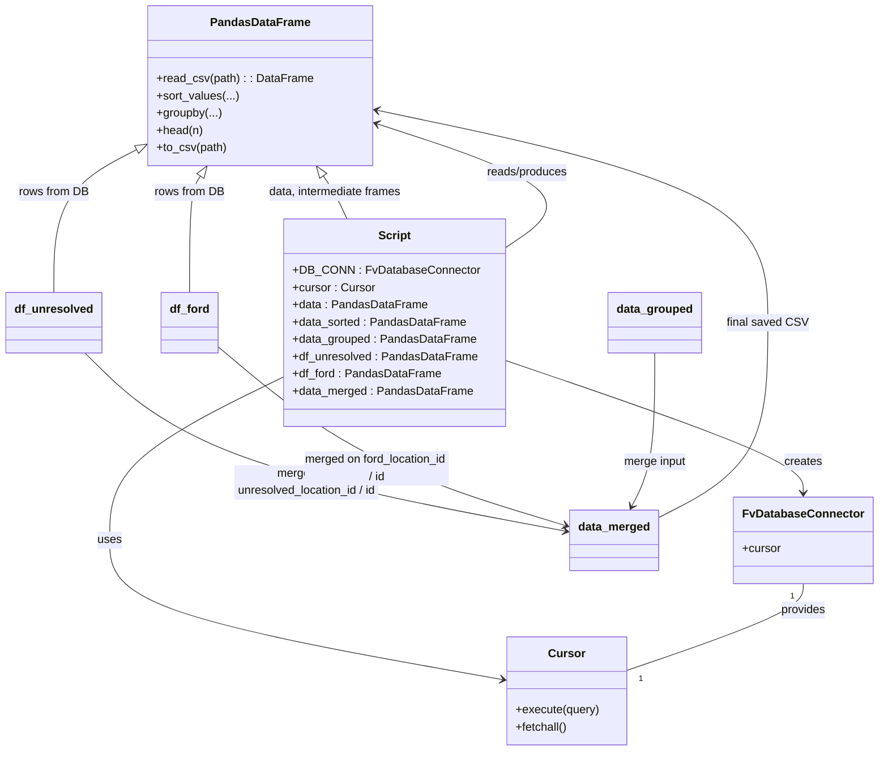

# Diagram: common/location_service/scripts/reorder_locations.py


> Auto-generated by Obscura crawlers

## Diagram 1



### SVG

<svg id="container" width="1200.240234375" xmlns="http://www.w3.org/2000/svg" class="classDiagram" height="1066" viewBox="0 0 1200.240234375 1066" role="graphics-document document" aria-roledescription="class"><style>#container{font-family:"trebuchet ms",verdana,arial,sans-serif;font-size:16px;fill:#333;}@keyframes edge-animation-frame{from{stroke-dashoffset:0;}}@keyframes dash{to{stroke-dashoffset:0;}}#container .edge-animation-slow{stroke-dasharray:9,5!important;stroke-dashoffset:900;animation:dash 50s linear infinite;stroke-linecap:round;}#container .edge-animation-fast{stroke-dasharray:9,5!important;stroke-dashoffset:900;animation:dash 20s linear infinite;stroke-linecap:round;}#container .error-icon{fill:#552222;}#container .error-text{fill:#552222;stroke:#552222;}#container .edge-thickness-normal{stroke-width:1px;}#container .edge-thickness-thick{stroke-width:3.5px;}#container .edge-pattern-solid{stroke-dasharray:0;}#container .edge-thickness-invisible{stroke-width:0;fill:none;}#container .edge-pattern-dashed{stroke-dasharray:3;}#container .edge-pattern-dotted{stroke-dasharray:2;}#container .marker{fill:#333333;stroke:#333333;}#container .marker.cross{stroke:#333333;}#container svg{font-family:"trebuchet ms",verdana,arial,sans-serif;font-size:16px;}#container p{margin:0;}#container g.classGroup text{fill:#9370DB;stroke:none;font-family:"trebuchet ms",verdana,arial,sans-serif;font-size:10px;}#container g.classGroup text .title{font-weight:bolder;}#container .nodeLabel,#container .edgeLabel{color:#131300;}#container .edgeLabel .label rect{fill:#ECECFF;}#container .label text{fill:#131300;}#container .labelBkg{background:#ECECFF;}#container .edgeLabel .label span{background:#ECECFF;}#container .classTitle{font-weight:bolder;}#container .node rect,#container .node circle,#container .node ellipse,#container .node polygon,#container .node path{fill:#ECECFF;stroke:#9370DB;stroke-width:1px;}#container .divider{stroke:#9370DB;stroke-width:1;}#container g.clickable{cursor:pointer;}#container g.classGroup rect{fill:#ECECFF;stroke:#9370DB;}#container g.classGroup line{stroke:#9370DB;stroke-width:1;}#container .classLabel .box{stroke:none;stroke-width:0;fill:#ECECFF;opacity:0.5;}#container .classLabel .label{fill:#9370DB;font-size:10px;}#container .relation{stroke:#333333;stroke-width:1;fill:none;}#container .dashed-line{stroke-dasharray:3;}#container .dotted-line{stroke-dasharray:1 2;}#container #compositionStart,#container .composition{fill:#333333!important;stroke:#333333!important;stroke-width:1;}#container #compositionEnd,#container .composition{fill:#333333!important;stroke:#333333!important;stroke-width:1;}#container #dependencyStart,#container .dependency{fill:#333333!important;stroke:#333333!important;stroke-width:1;}#container #dependencyStart,#container .dependency{fill:#333333!important;stroke:#333333!important;stroke-width:1;}#container #extensionStart,#container .extension{fill:transparent!important;stroke:#333333!important;stroke-width:1;}#container #extensionEnd,#container .extension{fill:transparent!important;stroke:#333333!important;stroke-width:1;}#container #aggregationStart,#container .aggregation{fill:transparent!important;stroke:#333333!important;stroke-width:1;}#container #aggregationEnd,#container .aggregation{fill:transparent!important;stroke:#333333!important;stroke-width:1;}#container #lollipopStart,#container .lollipop{fill:#ECECFF!important;stroke:#333333!important;stroke-width:1;}#container #lollipopEnd,#container .lollipop{fill:#ECECFF!important;stroke:#333333!important;stroke-width:1;}#container .edgeTerminals{font-size:11px;line-height:initial;}#container .classTitleText{text-anchor:middle;font-size:18px;fill:#333;}#container .label-icon{display:inline-block;height:1em;overflow:visible;vertical-align:-0.125em;}#container .node .label-icon path{fill:currentColor;stroke:revert;stroke-width:revert;}#container :root{--mermaid-font-family:"trebuchet ms",verdana,arial,sans-serif;}</style><g><defs><marker id="container_class-aggregationStart" class="marker aggregation class" refX="18" refY="7" markerWidth="190" markerHeight="240" orient="auto"><path d="M 18,7 L9,13 L1,7 L9,1 Z"></path></marker></defs><defs><marker id="container_class-aggregationEnd" class="marker aggregation class" refX="1" refY="7" markerWidth="20" markerHeight="28" orient="auto"><path d="M 18,7 L9,13 L1,7 L9,1 Z"></path></marker></defs><defs><marker id="container_class-extensionStart" class="marker extension class" refX="18" refY="7" markerWidth="190" markerHeight="240" orient="auto"><path d="M 1,7 L18,13 V 1 Z"></path></marker></defs><defs><marker id="container_class-extensionEnd" class="marker extension class" refX="1" refY="7" markerWidth="20" markerHeight="28" orient="auto"><path d="M 1,1 V 13 L18,7 Z"></path></marker></defs><defs><marker id="container_class-compositionStart" class="marker composition class" refX="18" refY="7" markerWidth="190" markerHeight="240" orient="auto"><path d="M 18,7 L9,13 L1,7 L9,1 Z"></path></marker></defs><defs><marker id="container_class-compositionEnd" class="marker composition class" refX="1" refY="7" markerWidth="20" markerHeight="28" orient="auto"><path d="M 18,7 L9,13 L1,7 L9,1 Z"></path></marker></defs><defs><marker id="container_class-dependencyStart" class="marker dependency class" refX="6" refY="7" markerWidth="190" markerHeight="240" orient="auto"><path d="M 5,7 L9,13 L1,7 L9,1 Z"></path></marker></defs><defs><marker id="container_class-dependencyEnd" class="marker dependency class" refX="13" refY="7" markerWidth="20" markerHeight="28" orient="auto"><path d="M 18,7 L9,13 L14,7 L9,1 Z"></path></marker></defs><defs><marker id="container_class-lollipopStart" class="marker lollipop class" refX="13" refY="7" markerWidth="190" markerHeight="240" orient="auto"><circle stroke="black" fill="transparent" cx="7" cy="7" r="6"></circle></marker></defs><defs><marker id="container_class-lollipopEnd" class="marker lollipop class" refX="1" refY="7" markerWidth="190" markerHeight="240" orient="auto"><circle stroke="black" fill="transparent" cx="7" cy="7" r="6"></circle></marker></defs><g class="root"><g class="clusters"></g><g class="edgePaths"><path d="M693.545,502.95L761.443,527.958C829.342,552.967,965.139,602.983,1033.037,637.158C1100.936,671.333,1100.936,689.667,1100.936,698.833L1100.936,708" id="id_Script_FvDatabaseConnector_1" class="edge-thickness-normal edge-pattern-solid relation" style=";;;" data-edge="true" data-et="edge" data-id="id_Script_FvDatabaseConnector_1" data-points="W3sieCI6NjkzLjU0NDkyMTg3NSwieSI6NTAyLjk1MDEwMDAxMDUyNzR9LHsieCI6MTEwMC45MzU1NDY4NzUsInkiOjY1M30seyJ4IjoxMTAwLjkzNTU0Njg3NSwieSI6NzE0fV0=" marker-end="url(#container_class-dependencyEnd)"></path><path d="M395.162,525.983L354.662,547.152C314.162,568.322,233.162,610.661,192.662,651.997C152.162,693.333,152.162,733.667,152.162,770C152.162,806.333,152.162,838.667,241.589,870.874C331.016,903.081,509.869,935.162,599.296,951.203L688.723,967.243" id="id_Script_Cursor_2" class="edge-thickness-normal edge-pattern-solid relation" style=";;;" data-edge="true" data-et="edge" data-id="id_Script_Cursor_2" data-points="W3sieCI6Mzk1LjE2MjEwOTM3NSwieSI6NTI1Ljk4MjkzODQxNjk0ODF9LHsieCI6MTUyLjE2MjEwOTM3NSwieSI6NjUzfSx7IngiOjE1Mi4xNjIxMDkzNzUsInkiOjc3NH0seyJ4IjoxNTIuMTYyMTA5Mzc1LCJ5Ijo4NzF9LHsieCI6Njk0LjYyODkwNjI1LCJ5Ijo5NjguMzAyNzkxNzIzMzYxM31d" marker-end="url(#container_class-dependencyEnd)"></path><path d="M693.545,345.162L712.444,332.135C731.342,319.108,769.14,293.054,738.865,263.913C708.589,234.773,610.241,202.546,561.067,186.433L511.893,170.319" id="id_Script_PandasDataFrame_3" class="edge-thickness-normal edge-pattern-solid relation" style=";;;" data-edge="true" data-et="edge" data-id="id_Script_PandasDataFrame_3" data-points="W3sieCI6NjkzLjU0NDkyMTg3NSwieSI6MzQ1LjE2MTg3NTI5Mjg3NTA0fSx7IngiOjgwNi45Mzc1LCJ5IjoyNjd9LHsieCI6NTA2LjE5MTQwNjI1LCJ5IjoxNjguNDUwNjY3NjgxNDUwMjN9XQ==" marker-end="url(#container_class-dependencyEnd)"></path><path d="M1100.936,834L1100.936,840.167C1100.936,846.333,1100.936,858.667,1060.53,878.785C1020.125,898.903,939.314,926.805,898.909,940.757L858.504,954.708" id="id_FvDatabaseConnector_Cursor_4" class="edge-thickness-normal edge-pattern-solid relation" style=";;;" data-edge="true" data-et="edge" data-id="id_FvDatabaseConnector_Cursor_4" data-points="W3sieCI6MTEwMC45MzU1NDY4NzUsInkiOjgzNH0seyJ4IjoxMTAwLjkzNTU0Njg3NSwieSI6ODcxfSx7IngiOjg1OC41MDM5MDYyNSwieSI6OTU0LjcwODE1OTQ2ODE5ODV9XQ=="></path><path d="M442.619,244.146L445.277,247.955C447.935,251.764,453.252,259.382,458.833,269.358C464.414,279.333,470.259,291.667,473.182,297.833L476.105,304" id="id_PandasDataFrame_Script_5" class="edge-thickness-normal edge-pattern-solid relation" style=";;;" data-edge="true" data-et="edge" data-id="id_PandasDataFrame_Script_5" data-points="W3sieCI6NDMyLjc0NjU4MjAzMTI1LCJ5IjoyMzB9LHsieCI6NDU4LjU2ODM1OTM3NSwieSI6MjY3fSx7IngiOjQ3Ni4xMDQ1NTE1MzY2MDIyMywieSI6MzA0fV0=" marker-start="url(#container_class-extensionStart)"></path><path d="M189.083,205.854L169.582,216.045C150.081,226.236,111.08,246.618,91.579,279.976C72.078,313.333,72.078,359.667,72.078,382.833L72.078,406" id="id_PandasDataFrame_df_unresolved_6" class="edge-thickness-normal edge-pattern-solid relation" style=";;;" data-edge="true" data-et="edge" data-id="id_PandasDataFrame_df_unresolved_6" data-points="W3sieCI6MjA0LjM3MTA5Mzc1LCJ5IjoxOTcuODY0NjA2ODk2NTUxNzJ9LHsieCI6NzIuMDc4MTI1LCJ5IjoyNjd9LHsieCI6NzIuMDc4MTI1LCJ5Ijo0MDZ9XQ==" marker-start="url(#container_class-extensionStart)"></path><path d="M273.194,244.434L270.732,248.195C268.271,251.956,263.348,259.478,260.887,286.406C258.426,313.333,258.426,359.667,258.426,382.833L258.426,406" id="id_PandasDataFrame_df_ford_7" class="edge-thickness-normal edge-pattern-solid relation" style=";;;" data-edge="true" data-et="edge" data-id="id_PandasDataFrame_df_ford_7" data-points="W3sieCI6MjgyLjYzOTY0ODQzNzUsInkiOjIzMH0seyJ4IjoyNTguNDI1NzgxMjUsInkiOjI2N30seyJ4IjoyNTguNDI1NzgxMjUsInkiOjQwNn1d" marker-start="url(#container_class-extensionStart)"></path><path d="M113.071,490L139.586,517.167C166.101,544.333,219.132,598.667,330.179,643.668C441.225,688.669,610.289,724.337,694.82,742.171L779.352,760.006" id="id_df_unresolved_data_merged_8" class="edge-thickness-normal edge-pattern-solid relation" style=";;;" data-edge="true" data-et="edge" data-id="id_df_unresolved_data_merged_8" data-points="W3sieCI6MTEzLjA3MDk0MTMxMDk3NTYxLCJ5Ijo0OTB9LHsieCI6MjcyLjE2MjEwOTM3NSwieSI6NjUzfSx7IngiOjc4NS4yMjI2NTYyNSwieSI6NzYxLjI0NDExNjE1NDY1MDN9XQ==" marker-end="url(#container_class-dependencyEnd)"></path><path d="M297.043,481.869L329.563,510.391C362.083,538.913,427.122,595.956,507.54,640.872C587.957,685.788,683.751,718.575,731.649,734.969L779.546,751.363" id="id_df_ford_data_merged_9" class="edge-thickness-normal edge-pattern-solid relation" style=";;;" data-edge="true" data-et="edge" data-id="id_df_ford_data_merged_9" data-points="W3sieCI6Mjk3LjA0Mjk2ODc1LCJ5Ijo0ODEuODY5NDYwOTQ3NzQ5M30seyJ4Ijo0OTIuMTYyMTA5Mzc1LCJ5Ijo2NTN9LHsieCI6Nzg1LjIyMjY1NjI1LCJ5Ijo3NTMuMzA2MDAwNDUzMDMxMn1d" marker-end="url(#container_class-dependencyEnd)"></path><path d="M900.666,490L900.666,517.167C900.666,544.333,900.666,598.667,895.097,638.09C889.528,677.513,878.389,702.025,872.82,714.281L867.251,726.538" id="id_data_grouped_data_merged_10" class="edge-thickness-normal edge-pattern-solid relation" style=";;;" data-edge="true" data-et="edge" data-id="id_data_grouped_data_merged_10" data-points="W3sieCI6OTAwLjY2NjAxNTYyNSwieSI6NDkwfSx7IngiOjkwMC42NjYwMTU2MjUsInkiOjY1M30seyJ4Ijo4NjQuNzY4NDAxMzQyOTc1MiwieSI6NzMyfV0=" marker-end="url(#container_class-dependencyEnd)"></path><path d="M906.145,738.758L930.665,724.465C955.186,710.172,1004.227,681.586,1028.747,633.126C1053.268,584.667,1053.268,516.333,1053.268,452C1053.268,387.667,1053.268,327.333,963.066,278.041C872.865,228.748,692.463,190.496,602.262,171.369L512.061,152.243" id="id_data_merged_PandasDataFrame_11" class="edge-thickness-normal edge-pattern-solid relation" style=";;;" data-edge="true" data-et="edge" data-id="id_data_merged_PandasDataFrame_11" data-points="W3sieCI6OTA2LjE0NDUzMTI1LCJ5Ijo3MzguNzU3NTI0NzIxNzMzNX0seyJ4IjoxMDUzLjI2NzU3ODEyNSwieSI6NjUzfSx7IngiOjEwNTMuMjY3NTc4MTI1LCJ5Ijo0NDh9LHsieCI6MTA1My4yNjc1NzgxMjUsInkiOjI2N30seyJ4Ijo1MDYuMTkxNDA2MjUsInkiOjE1MC45OTg3Njg3Nzk2MDg3NX1d" marker-end="url(#container_class-dependencyEnd)"></path></g><g class="edgeLabels"><g class="edgeLabel" transform="translate(1100.935546875, 653)"><g class="label" data-id="id_Script_FvDatabaseConnector_1" transform="translate(-26.171875, -12)"><foreignObject width="52.34375" height="24"><div xmlns="http://www.w3.org/1999/xhtml" class="labelBkg" style="display: table-cell; white-space: nowrap; line-height: 1.5; max-width: 200px; text-align: center;"><span class="edgeLabel"><p>creates</p></span></div></foreignObject></g></g><g class="edgeLabel" transform="translate(152.162109375, 774)"><g class="label" data-id="id_Script_Cursor_2" transform="translate(-16.4921875, -12)"><foreignObject width="32.984375" height="24"><div xmlns="http://www.w3.org/1999/xhtml" class="labelBkg" style="display: table-cell; white-space: nowrap; line-height: 1.5; max-width: 200px; text-align: center;"><span class="edgeLabel"><p>uses</p></span></div></foreignObject></g></g><g class="edgeLabel" transform="translate(722.00148, 239.16792)"><g class="label" data-id="id_Script_PandasDataFrame_3" transform="translate(-57.3984375, -12)"><foreignObject width="114.796875" height="24"><div xmlns="http://www.w3.org/1999/xhtml" class="labelBkg" style="display: table-cell; white-space: nowrap; line-height: 1.5; max-width: 200px; text-align: center;"><span class="edgeLabel"><p>reads/produces</p></span></div></foreignObject></g></g><g class="edgeLabel" transform="translate(1100.935546875, 871)"><g class="label" data-id="id_FvDatabaseConnector_Cursor_4" transform="translate(-31.3125, -12)"><foreignObject width="62.625" height="24"><div xmlns="http://www.w3.org/1999/xhtml" class="labelBkg" style="display: table-cell; white-space: nowrap; line-height: 1.5; max-width: 200px; text-align: center;"><span class="edgeLabel"><p>provides</p></span></div></foreignObject></g></g><g class="edgeLabel" transform="translate(458.568359375, 267)"><g class="label" data-id="id_PandasDataFrame_Script_5" transform="translate(-94.171875, -12)"><foreignObject width="188.34375" height="24"><div xmlns="http://www.w3.org/1999/xhtml" class="labelBkg" style="display: table-cell; white-space: nowrap; line-height: 1.5; max-width: 200px; text-align: center;"><span class="edgeLabel"><p>data, intermediate frames</p></span></div></foreignObject></g></g><g class="edgeLabel" transform="translate(72.078125, 267)"><g class="label" data-id="id_PandasDataFrame_df_unresolved_6" transform="translate(-48.3046875, -12)"><foreignObject width="96.609375" height="24"><div xmlns="http://www.w3.org/1999/xhtml" class="labelBkg" style="display: table-cell; white-space: nowrap; line-height: 1.5; max-width: 200px; text-align: center;"><span class="edgeLabel"><p>rows from DB</p></span></div></foreignObject></g></g><g class="edgeLabel" transform="translate(258.42578125, 267)"><g class="label" data-id="id_PandasDataFrame_df_ford_7" transform="translate(-48.3046875, -12)"><foreignObject width="96.609375" height="24"><div xmlns="http://www.w3.org/1999/xhtml" class="labelBkg" style="display: table-cell; white-space: nowrap; line-height: 1.5; max-width: 200px; text-align: center;"><span class="edgeLabel"><p>rows from DB</p></span></div></foreignObject></g></g><g class="edgeLabel" transform="translate(417.26057, 683.61248)"><g class="label" data-id="id_df_unresolved_data_merged_8" transform="translate(-100, -36)"><foreignObject width="200" height="72"><div xmlns="http://www.w3.org/1999/xhtml" class="labelBkg" style="display: table; white-space: break-spaces; line-height: 1.5; max-width: 200px; text-align: center; width: 200px;"><span class="edgeLabel"><p>merged on unresolved_location_id / id</p></span></div></foreignObject></g></g><g class="edgeLabel" transform="translate(515.91843, 661.13109)"><g class="label" data-id="id_df_ford_data_merged_9" transform="translate(-100, -24)"><foreignObject width="200" height="48"><div xmlns="http://www.w3.org/1999/xhtml" class="labelBkg" style="display: table; white-space: break-spaces; line-height: 1.5; max-width: 200px; text-align: center; width: 200px;"><span class="edgeLabel"><p>merged on ford_location_id / id</p></span></div></foreignObject></g></g><g class="edgeLabel" transform="translate(900.666015625, 653)"><g class="label" data-id="id_data_grouped_data_merged_10" transform="translate(-43.9375, -12)"><foreignObject width="87.875" height="24"><div xmlns="http://www.w3.org/1999/xhtml" class="labelBkg" style="display: table-cell; white-space: nowrap; line-height: 1.5; max-width: 200px; text-align: center;"><span class="edgeLabel"><p>merge input</p></span></div></foreignObject></g></g><g class="edgeLabel" transform="translate(1053.267578125, 448)"><g class="label" data-id="id_data_merged_PandasDataFrame_11" transform="translate(-54.1328125, -12)"><foreignObject width="108.265625" height="24"><div xmlns="http://www.w3.org/1999/xhtml" class="labelBkg" style="display: table-cell; white-space: nowrap; line-height: 1.5; max-width: 200px; text-align: center;"><span class="edgeLabel"><p>final saved CSV</p></span></div></foreignObject></g></g><g class="edgeTerminals" transform="translate(1085.9355484375, 851.5000013392856)"><g class="inner" transform="translate(0, 0)"><foreignObject style="width: 9px; height: 12px;"><div xmlns="http://www.w3.org/1999/xhtml" style="display: inline-block; padding-right: 1px; white-space: nowrap;"><span class="edgeLabel">1</span></div></foreignObject></g></g><g class="edgeTerminals" transform="translate(874.9412631650292, 958.1751414771405)"><g class="inner" transform="translate(0, 0)"></g><foreignObject style="width: 9px; height: 12px;"><div xmlns="http://www.w3.org/1999/xhtml" style="display: inline-block; padding-right: 1px; white-space: nowrap;"><span class="edgeLabel">1</span></div></foreignObject></g></g><g class="nodes"><g class="node default" id="classId-FvDatabaseConnector-0" transform="translate(1100.935546875, 774)"><g class="basic label-container"><path d="M-91.3046875 -60 L91.3046875 -60 L91.3046875 60 L-91.3046875 60" stroke="none" stroke-width="0" fill="#ECECFF" style=""></path><path d="M-91.3046875 -60 C-33.35933763046322 -60, 24.586012239073554 -60, 91.3046875 -60 M-91.3046875 -60 C-35.746222683094686 -60, 19.812242133810628 -60, 91.3046875 -60 M91.3046875 -60 C91.3046875 -32.44181295238306, 91.3046875 -4.88362590476612, 91.3046875 60 M91.3046875 -60 C91.3046875 -30.70422764163562, 91.3046875 -1.4084552832712376, 91.3046875 60 M91.3046875 60 C28.864886784186226 60, -33.57491393162755 60, -91.3046875 60 M91.3046875 60 C47.71906079951277 60, 4.133434099025536 60, -91.3046875 60 M-91.3046875 60 C-91.3046875 31.79360985522232, -91.3046875 3.587219710444643, -91.3046875 -60 M-91.3046875 60 C-91.3046875 13.462955398310086, -91.3046875 -33.07408920337983, -91.3046875 -60" stroke="#9370DB" stroke-width="1.3" fill="none" stroke-dasharray="0 0" style=""></path></g><g class="annotation-group text" transform="translate(0, -36)"></g><g class="label-group text" transform="translate(-79.3046875, -36)"><g class="label" style="font-weight: bolder" transform="translate(0,-12)"><foreignObject width="158.609375" height="24"><div xmlns="http://www.w3.org/1999/xhtml" style="display: table-cell; white-space: nowrap; line-height: 1.5; max-width: 207px; text-align: center;"><span class="nodeLabel markdown-node-label" style=""><p>FvDatabaseConnector</p></span></div></foreignObject></g></g><g class="members-group text" transform="translate(-79.3046875, 12)"><g class="label" style="" transform="translate(0,-12)"><foreignObject width="53.71875" height="24"><div xmlns="http://www.w3.org/1999/xhtml" style="display: table-cell; white-space: nowrap; line-height: 1.5; max-width: 112px; text-align: center;"><span class="nodeLabel markdown-node-label" style=""><p>+cursor</p></span></div></foreignObject></g></g><g class="methods-group text" transform="translate(-79.3046875, 60)"></g><g class="divider" style=""><path d="M-91.3046875 -12 C-35.14871845605494 -12, 21.007250587890127 -12, 91.3046875 -12 M-91.3046875 -12 C-34.86602738235674 -12, 21.57263273528652 -12, 91.3046875 -12" stroke="#9370DB" stroke-width="1.3" fill="none" stroke-dasharray="0 0" style=""></path></g><g class="divider" style=""><path d="M-91.3046875 36 C-35.491073295666396 36, 20.322540908667207 36, 91.3046875 36 M-91.3046875 36 C-44.189677663147656 36, 2.925332173704689 36, 91.3046875 36" stroke="#9370DB" stroke-width="1.3" fill="none" stroke-dasharray="0 0" style=""></path></g></g><g class="node default" id="classId-Cursor-1" transform="translate(776.56640625, 983)"><g class="basic label-container"><path d="M-81.9375 -75 L81.9375 -75 L81.9375 75 L-81.9375 75" stroke="none" stroke-width="0" fill="#ECECFF" style=""></path><path d="M-81.9375 -75 C-42.586218739179316 -75, -3.2349374783586313 -75, 81.9375 -75 M-81.9375 -75 C-19.746429458287885 -75, 42.44464108342423 -75, 81.9375 -75 M81.9375 -75 C81.9375 -17.354944487378205, 81.9375 40.29011102524359, 81.9375 75 M81.9375 -75 C81.9375 -26.158014300895502, 81.9375 22.683971398208996, 81.9375 75 M81.9375 75 C28.69361867288785 75, -24.550262654224298 75, -81.9375 75 M81.9375 75 C21.06272868062517 75, -39.81204263874966 75, -81.9375 75 M-81.9375 75 C-81.9375 42.59869519847333, -81.9375 10.197390396946659, -81.9375 -75 M-81.9375 75 C-81.9375 29.59504301343842, -81.9375 -15.809913973123159, -81.9375 -75" stroke="#9370DB" stroke-width="1.3" fill="none" stroke-dasharray="0 0" style=""></path></g><g class="annotation-group text" transform="translate(0, -51)"></g><g class="label-group text" transform="translate(-23.90625, -51)"><g class="label" style="font-weight: bolder" transform="translate(0,-12)"><foreignObject width="47.8125" height="24"><div xmlns="http://www.w3.org/1999/xhtml" style="display: table-cell; white-space: nowrap; line-height: 1.5; max-width: 98px; text-align: center;"><span class="nodeLabel markdown-node-label" style=""><p>Cursor</p></span></div></foreignObject></g></g><g class="members-group text" transform="translate(-69.9375, -3)"></g><g class="methods-group text" transform="translate(-69.9375, 27)"><g class="label" style="" transform="translate(0,-12)"><foreignObject width="115.96875" height="24"><div xmlns="http://www.w3.org/1999/xhtml" style="display: table-cell; white-space: nowrap; line-height: 1.5; max-width: 173px; text-align: center;"><span class="nodeLabel markdown-node-label" style=""><p>+execute(query)</p></span></div></foreignObject></g><g class="label" style="" transform="translate(0,12)"><foreignObject width="72.515625" height="24"><div xmlns="http://www.w3.org/1999/xhtml" style="display: table-cell; white-space: nowrap; line-height: 1.5; max-width: 130px; text-align: center;"><span class="nodeLabel markdown-node-label" style=""><p>+fetchall()</p></span></div></foreignObject></g></g><g class="divider" style=""><path d="M-81.9375 -27 C-45.06349035258787 -27, -8.18948070517574 -27, 81.9375 -27 M-81.9375 -27 C-45.14709830072662 -27, -8.356696601453237 -27, 81.9375 -27" stroke="#9370DB" stroke-width="1.3" fill="none" stroke-dasharray="0 0" style=""></path></g><g class="divider" style=""><path d="M-81.9375 -3 C-40.37474641646504 -3, 1.1880071670699266 -3, 81.9375 -3 M-81.9375 -3 C-36.3174109586975 -3, 9.302678082604999 -3, 81.9375 -3" stroke="#9370DB" stroke-width="1.3" fill="none" stroke-dasharray="0 0" style=""></path></g></g><g class="node default" id="classId-PandasDataFrame-2" transform="translate(355.28125, 119)"><g class="basic label-container"><path d="M-150.91015625 -111 L150.91015625 -111 L150.91015625 111 L-150.91015625 111" stroke="none" stroke-width="0" fill="#ECECFF" style=""></path><path d="M-150.91015625 -111 C-46.01526526766328 -111, 58.87962571467344 -111, 150.91015625 -111 M-150.91015625 -111 C-76.00676898605623 -111, -1.1033817221124593 -111, 150.91015625 -111 M150.91015625 -111 C150.91015625 -35.78543197489586, 150.91015625 39.429136050208285, 150.91015625 111 M150.91015625 -111 C150.91015625 -55.01907531795459, 150.91015625 0.9618493640908241, 150.91015625 111 M150.91015625 111 C78.36123874353859 111, 5.812321237077185 111, -150.91015625 111 M150.91015625 111 C61.314028244158166 111, -28.282099761683668 111, -150.91015625 111 M-150.91015625 111 C-150.91015625 45.67899334350349, -150.91015625 -19.642013312993015, -150.91015625 -111 M-150.91015625 111 C-150.91015625 50.06114572794635, -150.91015625 -10.877708544107307, -150.91015625 -111" stroke="#9370DB" stroke-width="1.3" fill="none" stroke-dasharray="0 0" style=""></path></g><g class="annotation-group text" transform="translate(0, -87)"></g><g class="label-group text" transform="translate(-65.3515625, -87)"><g class="label" style="font-weight: bolder" transform="translate(0,-12)"><foreignObject width="130.703125" height="24"><div xmlns="http://www.w3.org/1999/xhtml" style="display: table-cell; white-space: nowrap; line-height: 1.5; max-width: 179px; text-align: center;"><span class="nodeLabel markdown-node-label" style=""><p>PandasDataFrame</p></span></div></foreignObject></g></g><g class="members-group text" transform="translate(-138.91015625, -39)"></g><g class="methods-group text" transform="translate(-138.91015625, -9)"><g class="label" style="" transform="translate(0,-12)"><foreignObject width="212.46875" height="24"><div xmlns="http://www.w3.org/1999/xhtml" style="display: table-cell; white-space: nowrap; line-height: 1.5; max-width: 270px; text-align: center;"><span class="nodeLabel markdown-node-label" style=""><p>+read_csv(path) : : DataFrame</p></span></div></foreignObject></g><g class="label" style="" transform="translate(0,12)"><foreignObject width="112.84375" height="24"><div xmlns="http://www.w3.org/1999/xhtml" style="display: table-cell; white-space: nowrap; line-height: 1.5; max-width: 170px; text-align: center;"><span class="nodeLabel markdown-node-label" style=""><p>+sort_values(...)</p></span></div></foreignObject></g><g class="label" style="" transform="translate(0,36)"><foreignObject width="89.375" height="24"><div xmlns="http://www.w3.org/1999/xhtml" style="display: table-cell; white-space: nowrap; line-height: 1.5; max-width: 147px; text-align: center;"><span class="nodeLabel markdown-node-label" style=""><p>+groupby(...)</p></span></div></foreignObject></g><g class="label" style="" transform="translate(0,60)"><foreignObject width="63.9375" height="24"><div xmlns="http://www.w3.org/1999/xhtml" style="display: table-cell; white-space: nowrap; line-height: 1.5; max-width: 121px; text-align: center;"><span class="nodeLabel markdown-node-label" style=""><p>+head(n)</p></span></div></foreignObject></g><g class="label" style="" transform="translate(0,84)"><foreignObject width="96.765625" height="24"><div xmlns="http://www.w3.org/1999/xhtml" style="display: table-cell; white-space: nowrap; line-height: 1.5; max-width: 154px; text-align: center;"><span class="nodeLabel markdown-node-label" style=""><p>+to_csv(path)</p></span></div></foreignObject></g></g><g class="divider" style=""><path d="M-150.91015625 -63 C-34.5754854337615 -63, 81.759185382477 -63, 150.91015625 -63 M-150.91015625 -63 C-76.12831859643715 -63, -1.346480942874308 -63, 150.91015625 -63" stroke="#9370DB" stroke-width="1.3" fill="none" stroke-dasharray="0 0" style=""></path></g><g class="divider" style=""><path d="M-150.91015625 -39 C-68.74038308887812 -39, 13.429390072243763 -39, 150.91015625 -39 M-150.91015625 -39 C-68.24491763982056 -39, 14.420320970358887 -39, 150.91015625 -39" stroke="#9370DB" stroke-width="1.3" fill="none" stroke-dasharray="0 0" style=""></path></g></g><g class="node default" id="classId-Script-3" transform="translate(544.353515625, 448)"><g class="basic label-container"><path d="M-149.19140625 -144 L149.19140625 -144 L149.19140625 144 L-149.19140625 144" stroke="none" stroke-width="0" fill="#ECECFF" style=""></path><path d="M-149.19140625 -144 C-38.9434681990314 -144, 71.3044698519372 -144, 149.19140625 -144 M-149.19140625 -144 C-74.67095866728768 -144, -0.15051108457535634 -144, 149.19140625 -144 M149.19140625 -144 C149.19140625 -45.670955030891946, 149.19140625 52.65808993821611, 149.19140625 144 M149.19140625 -144 C149.19140625 -39.52246890160251, 149.19140625 64.95506219679498, 149.19140625 144 M149.19140625 144 C42.96456397419476 144, -63.26227830161048 144, -149.19140625 144 M149.19140625 144 C58.427084392537296 144, -32.33723746492541 144, -149.19140625 144 M-149.19140625 144 C-149.19140625 53.82006364352017, -149.19140625 -36.35987271295966, -149.19140625 -144 M-149.19140625 144 C-149.19140625 61.45806962189452, -149.19140625 -21.083860756210953, -149.19140625 -144" stroke="#9370DB" stroke-width="1.3" fill="none" stroke-dasharray="0 0" style=""></path></g><g class="annotation-group text" transform="translate(0, -120)"></g><g class="label-group text" transform="translate(-21.7421875, -120)"><g class="label" style="font-weight: bolder" transform="translate(0,-12)"><foreignObject width="43.484375" height="24"><div xmlns="http://www.w3.org/1999/xhtml" style="display: table-cell; white-space: nowrap; line-height: 1.5; max-width: 93px; text-align: center;"><span class="nodeLabel markdown-node-label" style=""><p>Script</p></span></div></foreignObject></g></g><g class="members-group text" transform="translate(-137.19140625, -72)"><g class="label" style="" transform="translate(0,-12)"><foreignObject width="245.890625" height="24"><div xmlns="http://www.w3.org/1999/xhtml" style="display: table-cell; white-space: nowrap; line-height: 1.5; max-width: 304px; text-align: center;"><span class="nodeLabel markdown-node-label" style=""><p>+DB_CONN : FvDatabaseConnector</p></span></div></foreignObject></g><g class="label" style="" transform="translate(0,12)"><foreignObject width="112.96875" height="24"><div xmlns="http://www.w3.org/1999/xhtml" style="display: table-cell; white-space: nowrap; line-height: 1.5; max-width: 171px; text-align: center;"><span class="nodeLabel markdown-node-label" style=""><p>+cursor : Cursor</p></span></div></foreignObject></g><g class="label" style="" transform="translate(0,36)"><foreignObject width="182.296875" height="24"><div xmlns="http://www.w3.org/1999/xhtml" style="display: table-cell; white-space: nowrap; line-height: 1.5; max-width: 240px; text-align: center;"><span class="nodeLabel markdown-node-label" style=""><p>+data : PandasDataFrame</p></span></div></foreignObject></g><g class="label" style="" transform="translate(0,60)"><foreignObject width="237.4375" height="24"><div xmlns="http://www.w3.org/1999/xhtml" style="display: table-cell; white-space: nowrap; line-height: 1.5; max-width: 295px; text-align: center;"><span class="nodeLabel markdown-node-label" style=""><p>+data_sorted : PandasDataFrame</p></span></div></foreignObject></g><g class="label" style="" transform="translate(0,84)"><foreignObject width="251.21875" height="24"><div xmlns="http://www.w3.org/1999/xhtml" style="display: table-cell; white-space: nowrap; line-height: 1.5; max-width: 309px; text-align: center;"><span class="nodeLabel markdown-node-label" style=""><p>+data_grouped : PandasDataFrame</p></span></div></foreignObject></g><g class="label" style="" transform="translate(0,108)"><foreignObject width="252.640625" height="24"><div xmlns="http://www.w3.org/1999/xhtml" style="display: table-cell; white-space: nowrap; line-height: 1.5; max-width: 310px; text-align: center;"><span class="nodeLabel markdown-node-label" style=""><p>+df_unresolved : PandasDataFrame</p></span></div></foreignObject></g><g class="label" style="" transform="translate(0,132)"><foreignObject width="201.90625" height="24"><div xmlns="http://www.w3.org/1999/xhtml" style="display: table-cell; white-space: nowrap; line-height: 1.5; max-width: 259px; text-align: center;"><span class="nodeLabel markdown-node-label" style=""><p>+df_ford : PandasDataFrame</p></span></div></foreignObject></g><g class="label" style="" transform="translate(0,156)"><foreignObject width="245.34375" height="24"><div xmlns="http://www.w3.org/1999/xhtml" style="display: table-cell; white-space: nowrap; line-height: 1.5; max-width: 303px; text-align: center;"><span class="nodeLabel markdown-node-label" style=""><p>+data_merged : PandasDataFrame</p></span></div></foreignObject></g></g><g class="methods-group text" transform="translate(-137.19140625, 144)"></g><g class="divider" style=""><path d="M-149.19140625 -96 C-43.00478787976412 -96, 63.181830490471754 -96, 149.19140625 -96 M-149.19140625 -96 C-44.17501404709658 -96, 60.84137815580684 -96, 149.19140625 -96" stroke="#9370DB" stroke-width="1.3" fill="none" stroke-dasharray="0 0" style=""></path></g><g class="divider" style=""><path d="M-149.19140625 120 C-58.77634502745974 120, 31.63871619508052 120, 149.19140625 120 M-149.19140625 120 C-33.591246151337856 120, 82.00891394732429 120, 149.19140625 120" stroke="#9370DB" stroke-width="1.3" fill="none" stroke-dasharray="0 0" style=""></path></g></g><g class="node default" id="classId-df_unresolved-4" transform="translate(72.078125, 448)"><g class="basic label-container"><path d="M-64.078125 -42 L64.078125 -42 L64.078125 42 L-64.078125 42" stroke="none" stroke-width="0" fill="#ECECFF" style=""></path><path d="M-64.078125 -42 C-37.643390494407285 -42, -11.20865598881457 -42, 64.078125 -42 M-64.078125 -42 C-33.60783506191042 -42, -3.1375451238208427 -42, 64.078125 -42 M64.078125 -42 C64.078125 -14.313081606067904, 64.078125 13.373836787864192, 64.078125 42 M64.078125 -42 C64.078125 -23.039916689224935, 64.078125 -4.0798333784498695, 64.078125 42 M64.078125 42 C34.01873764316936 42, 3.9593502863387258 42, -64.078125 42 M64.078125 42 C32.386051529949015 42, 0.6939780598980363 42, -64.078125 42 M-64.078125 42 C-64.078125 15.557276467953674, -64.078125 -10.885447064092652, -64.078125 -42 M-64.078125 42 C-64.078125 23.92422313844301, -64.078125 5.848446276886023, -64.078125 -42" stroke="#9370DB" stroke-width="1.3" fill="none" stroke-dasharray="0 0" style=""></path></g><g class="annotation-group text" transform="translate(0, -18)"></g><g class="label-group text" transform="translate(-52.078125, -18)"><g class="label" style="font-weight: bolder" transform="translate(0,-12)"><foreignObject width="104.15625" height="24"><div xmlns="http://www.w3.org/1999/xhtml" style="display: table-cell; white-space: nowrap; line-height: 1.5; max-width: 153px; text-align: center;"><span class="nodeLabel markdown-node-label" style=""><p>df_unresolved</p></span></div></foreignObject></g></g><g class="members-group text" transform="translate(-52.078125, 30)"></g><g class="methods-group text" transform="translate(-52.078125, 60)"></g><g class="divider" style=""><path d="M-64.078125 6 C-13.818823421272675 6, 36.44047815745465 6, 64.078125 6 M-64.078125 6 C-19.01253215659245 6, 26.0530606868151 6, 64.078125 6" stroke="#9370DB" stroke-width="1.3" fill="none" stroke-dasharray="0 0" style=""></path></g><g class="divider" style=""><path d="M-64.078125 24 C-25.59484404491468 24, 12.88843691017064 24, 64.078125 24 M-64.078125 24 C-19.843190281145183 24, 24.391744437709633 24, 64.078125 24" stroke="#9370DB" stroke-width="1.3" fill="none" stroke-dasharray="0 0" style=""></path></g></g><g class="node default" id="classId-df_ford-5" transform="translate(258.42578125, 448)"><g class="basic label-container"><path d="M-38.6171875 -42 L38.6171875 -42 L38.6171875 42 L-38.6171875 42" stroke="none" stroke-width="0" fill="#ECECFF" style=""></path><path d="M-38.6171875 -42 C-20.732409857971042 -42, -2.8476322159420846 -42, 38.6171875 -42 M-38.6171875 -42 C-8.804254691789982 -42, 21.008678116420036 -42, 38.6171875 -42 M38.6171875 -42 C38.6171875 -14.830721146660327, 38.6171875 12.338557706679346, 38.6171875 42 M38.6171875 -42 C38.6171875 -11.394859949054577, 38.6171875 19.210280101890845, 38.6171875 42 M38.6171875 42 C19.294817058306833 42, -0.027553383386333508 42, -38.6171875 42 M38.6171875 42 C19.301671886444492 42, -0.013843727111016335 42, -38.6171875 42 M-38.6171875 42 C-38.6171875 20.179365851318817, -38.6171875 -1.641268297362366, -38.6171875 -42 M-38.6171875 42 C-38.6171875 12.197938570842911, -38.6171875 -17.604122858314177, -38.6171875 -42" stroke="#9370DB" stroke-width="1.3" fill="none" stroke-dasharray="0 0" style=""></path></g><g class="annotation-group text" transform="translate(0, -18)"></g><g class="label-group text" transform="translate(-26.6171875, -18)"><g class="label" style="font-weight: bolder" transform="translate(0,-12)"><foreignObject width="53.234375" height="24"><div xmlns="http://www.w3.org/1999/xhtml" style="display: table-cell; white-space: nowrap; line-height: 1.5; max-width: 102px; text-align: center;"><span class="nodeLabel markdown-node-label" style=""><p>df_ford</p></span></div></foreignObject></g></g><g class="members-group text" transform="translate(-26.6171875, 30)"></g><g class="methods-group text" transform="translate(-26.6171875, 60)"></g><g class="divider" style=""><path d="M-38.6171875 6 C-17.875699034056964 6, 2.8657894318860713 6, 38.6171875 6 M-38.6171875 6 C-13.913386534427719 6, 10.790414431144562 6, 38.6171875 6" stroke="#9370DB" stroke-width="1.3" fill="none" stroke-dasharray="0 0" style=""></path></g><g class="divider" style=""><path d="M-38.6171875 24 C-9.808279262311927 24, 19.000628975376145 24, 38.6171875 24 M-38.6171875 24 C-10.68078972777709 24, 17.25560804444582 24, 38.6171875 24" stroke="#9370DB" stroke-width="1.3" fill="none" stroke-dasharray="0 0" style=""></path></g></g><g class="node default" id="classId-data_merged-6" transform="translate(845.68359375, 774)"><g class="basic label-container"><path d="M-60.4609375 -42 L60.4609375 -42 L60.4609375 42 L-60.4609375 42" stroke="none" stroke-width="0" fill="#ECECFF" style=""></path><path d="M-60.4609375 -42 C-35.96009424174254 -42, -11.459250983485077 -42, 60.4609375 -42 M-60.4609375 -42 C-33.37533457513415 -42, -6.289731650268301 -42, 60.4609375 -42 M60.4609375 -42 C60.4609375 -13.4539048864597, 60.4609375 15.0921902270806, 60.4609375 42 M60.4609375 -42 C60.4609375 -21.08866944129224, 60.4609375 -0.17733888258447905, 60.4609375 42 M60.4609375 42 C27.009438198588462 42, -6.442061102823075 42, -60.4609375 42 M60.4609375 42 C13.936471055301624 42, -32.58799538939675 42, -60.4609375 42 M-60.4609375 42 C-60.4609375 12.173622007271707, -60.4609375 -17.652755985456587, -60.4609375 -42 M-60.4609375 42 C-60.4609375 14.676663496879897, -60.4609375 -12.646673006240206, -60.4609375 -42" stroke="#9370DB" stroke-width="1.3" fill="none" stroke-dasharray="0 0" style=""></path></g><g class="annotation-group text" transform="translate(0, -18)"></g><g class="label-group text" transform="translate(-48.4609375, -18)"><g class="label" style="font-weight: bolder" transform="translate(0,-12)"><foreignObject width="96.921875" height="24"><div xmlns="http://www.w3.org/1999/xhtml" style="display: table-cell; white-space: nowrap; line-height: 1.5; max-width: 146px; text-align: center;"><span class="nodeLabel markdown-node-label" style=""><p>data_merged</p></span></div></foreignObject></g></g><g class="members-group text" transform="translate(-48.4609375, 30)"></g><g class="methods-group text" transform="translate(-48.4609375, 60)"></g><g class="divider" style=""><path d="M-60.4609375 6 C-27.877627385654705 6, 4.70568272869059 6, 60.4609375 6 M-60.4609375 6 C-18.864905784941683 6, 22.731125930116633 6, 60.4609375 6" stroke="#9370DB" stroke-width="1.3" fill="none" stroke-dasharray="0 0" style=""></path></g><g class="divider" style=""><path d="M-60.4609375 24 C-21.11150741145549 24, 18.237922677089017 24, 60.4609375 24 M-60.4609375 24 C-12.819923491703491 24, 34.82109051659302 24, 60.4609375 24" stroke="#9370DB" stroke-width="1.3" fill="none" stroke-dasharray="0 0" style=""></path></g></g><g class="node default" id="classId-data_grouped-7" transform="translate(900.666015625, 448)"><g class="basic label-container"><path d="M-63.46875 -42 L63.46875 -42 L63.46875 42 L-63.46875 42" stroke="none" stroke-width="0" fill="#ECECFF" style=""></path><path d="M-63.46875 -42 C-22.61577866483192 -42, 18.237192670336157 -42, 63.46875 -42 M-63.46875 -42 C-25.566800154531315 -42, 12.33514969093737 -42, 63.46875 -42 M63.46875 -42 C63.46875 -24.337741678865747, 63.46875 -6.675483357731494, 63.46875 42 M63.46875 -42 C63.46875 -21.272315005003534, 63.46875 -0.5446300100070687, 63.46875 42 M63.46875 42 C12.915000349373663 42, -37.63874930125267 42, -63.46875 42 M63.46875 42 C31.54025080278119 42, -0.3882483944376176 42, -63.46875 42 M-63.46875 42 C-63.46875 11.013011542098809, -63.46875 -19.973976915802382, -63.46875 -42 M-63.46875 42 C-63.46875 15.77201404064801, -63.46875 -10.45597191870398, -63.46875 -42" stroke="#9370DB" stroke-width="1.3" fill="none" stroke-dasharray="0 0" style=""></path></g><g class="annotation-group text" transform="translate(0, -18)"></g><g class="label-group text" transform="translate(-51.46875, -18)"><g class="label" style="font-weight: bolder" transform="translate(0,-12)"><foreignObject width="102.9375" height="24"><div xmlns="http://www.w3.org/1999/xhtml" style="display: table-cell; white-space: nowrap; line-height: 1.5; max-width: 152px; text-align: center;"><span class="nodeLabel markdown-node-label" style=""><p>data_grouped</p></span></div></foreignObject></g></g><g class="members-group text" transform="translate(-51.46875, 30)"></g><g class="methods-group text" transform="translate(-51.46875, 60)"></g><g class="divider" style=""><path d="M-63.46875 6 C-19.632731890309678 6, 24.203286219380644 6, 63.46875 6 M-63.46875 6 C-27.403955658292972 6, 8.660838683414056 6, 63.46875 6" stroke="#9370DB" stroke-width="1.3" fill="none" stroke-dasharray="0 0" style=""></path></g><g class="divider" style=""><path d="M-63.46875 24 C-21.57027928807961 24, 20.328191423840778 24, 63.46875 24 M-63.46875 24 C-23.777164092221128 24, 15.914421815557745 24, 63.46875 24" stroke="#9370DB" stroke-width="1.3" fill="none" stroke-dasharray="0 0" style=""></path></g></g></g></g></g></svg>

## Diagram 2

```mermaid
flowchart TD
    A[Start script] --> B[Connect to DB: FvDatabaseConnector]
    B --> C[Read CSV: pd.read_csv(...)]
    C --> D[Sort by unresolved_location_id, similarity]
    D --> E[Group and take head(2) per unresolved_location_id]
    E --> F{Extract unique unresolved IDs}
    F --> G[Query DB for unresolved locations]
    E --> H{Extract unique ford IDs}
    H --> I[Query DB for ford locations]
    G --> J[Create df_unresolved DataFrame]
    I --> K[Create df_ford DataFrame]
    E --> L[Merge data_grouped with df_unresolved]
    L --> M[Merge result with df_ford]
    M --> N[Drop duplicate id columns]
    N --> O[Save final CSV to disk]
    O --> P[End]
```

> SVG rendering failed for this diagram.
