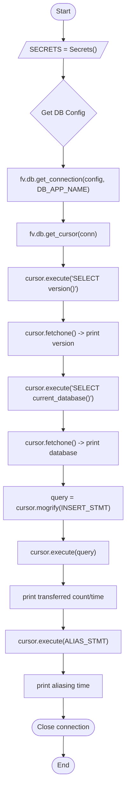
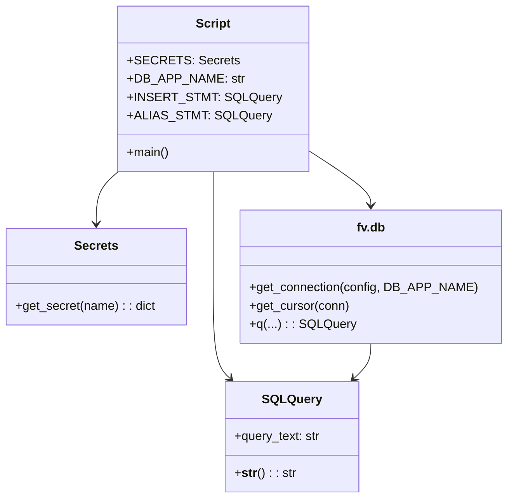

# Diagram: common/location_service/scripts/transfer_carrier_locations.py

> Auto-generated by Obscura crawlers

## Diagram 1

### SVG

<svg id="container" width="284.53125" xmlns="http://www.w3.org/2000/svg" class="flowchart" height="1835.984375" viewBox="0 0 284.53125 1835.984375" role="graphics-document document" aria-roledescription="flowchart-v2"><g><marker id="container_flowchart-v2-pointEnd" class="marker flowchart-v2" viewBox="0 0 10 10" refX="5" refY="5" markerUnits="userSpaceOnUse" markerWidth="8" markerHeight="8" orient="auto"><path d="M 0 0 L 10 5 L 0 10 z" class="arrowMarkerPath" style="stroke-width: 1; stroke-dasharray: 1, 0;"></path></marker><marker id="container_flowchart-v2-pointStart" class="marker flowchart-v2" viewBox="0 0 10 10" refX="4.5" refY="5" markerUnits="userSpaceOnUse" markerWidth="8" markerHeight="8" orient="auto"><path d="M 0 5 L 10 10 L 10 0 z" class="arrowMarkerPath" style="stroke-width: 1; stroke-dasharray: 1, 0;"></path></marker><marker id="container_flowchart-v2-circleEnd" class="marker flowchart-v2" viewBox="0 0 10 10" refX="11" refY="5" markerUnits="userSpaceOnUse" markerWidth="11" markerHeight="11" orient="auto"><circle cx="5" cy="5" r="5" class="arrowMarkerPath" style="stroke-width: 1; stroke-dasharray: 1, 0;"></circle></marker><marker id="container_flowchart-v2-circleStart" class="marker flowchart-v2" viewBox="0 0 10 10" refX="-1" refY="5" markerUnits="userSpaceOnUse" markerWidth="11" markerHeight="11" orient="auto"><circle cx="5" cy="5" r="5" class="arrowMarkerPath" style="stroke-width: 1; stroke-dasharray: 1, 0;"></circle></marker><marker id="container_flowchart-v2-crossEnd" class="marker cross flowchart-v2" viewBox="0 0 11 11" refX="12" refY="5.2" markerUnits="userSpaceOnUse" markerWidth="11" markerHeight="11" orient="auto"><path d="M 1,1 l 9,9 M 10,1 l -9,9" class="arrowMarkerPath" style="stroke-width: 2; stroke-dasharray: 1, 0;"></path></marker><marker id="container_flowchart-v2-crossStart" class="marker cross flowchart-v2" viewBox="0 0 11 11" refX="-1" refY="5.2" markerUnits="userSpaceOnUse" markerWidth="11" markerHeight="11" orient="auto"><path d="M 1,1 l 9,9 M 10,1 l -9,9" class="arrowMarkerPath" style="stroke-width: 2; stroke-dasharray: 1, 0;"></path></marker><g class="root"><g class="clusters"></g><g class="edgePaths"><path d="M142.766,47.5L142.682,51.583C142.599,55.667,142.432,63.833,142.419,71.5C142.406,79.167,142.547,86.334,142.617,89.917L142.687,93.501" id="L_Start_InitSecrets_0" class="edge-thickness-normal edge-pattern-solid edge-thickness-normal edge-pattern-solid flowchart-link" style=";" data-edge="true" data-et="edge" data-id="L_Start_InitSecrets_0" data-points="W3sieCI6MTQyLjc2NTYyNSwieSI6NDcuNX0seyJ4IjoxNDIuMjY1NjI1LCJ5Ijo3Mn0seyJ4IjoxNDIuNzY1NjI1LCJ5Ijo5Ny41fV0=" marker-end="url(#container_flowchart-v2-pointEnd)"></path><path d="M142.766,136.5L142.682,140.583C142.599,144.667,142.432,152.833,142.349,160.417C142.266,168,142.266,175,142.266,178.5L142.266,182" id="L_InitSecrets_GetConfig_0" class="edge-thickness-normal edge-pattern-solid edge-thickness-normal edge-pattern-solid flowchart-link" style=";" data-edge="true" data-et="edge" data-id="L_InitSecrets_GetConfig_0" data-points="W3sieCI6MTQyLjc2NTYyNSwieSI6MTM2LjV9LHsieCI6MTQyLjI2NTYyNSwieSI6MTYxfSx7IngiOjE0Mi4yNjU2MjUsInkiOjE4Nn1d" marker-end="url(#container_flowchart-v2-pointEnd)"></path><path d="M142.266,337.984L142.266,342.151C142.266,346.318,142.266,354.651,142.266,362.318C142.266,369.984,142.266,376.984,142.266,380.484L142.266,383.984" id="L_GetConfig_Connect_0" class="edge-thickness-normal edge-pattern-solid edge-thickness-normal edge-pattern-solid flowchart-link" style=";" data-edge="true" data-et="edge" data-id="L_GetConfig_Connect_0" data-points="W3sieCI6MTQyLjI2NTYyNSwieSI6MzM3Ljk4NDM3NX0seyJ4IjoxNDIuMjY1NjI1LCJ5IjozNjIuOTg0Mzc1fSx7IngiOjE0Mi4yNjU2MjUsInkiOjM4Ny45ODQzNzV9XQ==" marker-end="url(#container_flowchart-v2-pointEnd)"></path><path d="M142.266,465.984L142.266,470.151C142.266,474.318,142.266,482.651,142.266,490.318C142.266,497.984,142.266,504.984,142.266,508.484L142.266,511.984" id="L_Connect_Cursor_0" class="edge-thickness-normal edge-pattern-solid edge-thickness-normal edge-pattern-solid flowchart-link" style=";" data-edge="true" data-et="edge" data-id="L_Connect_Cursor_0" data-points="W3sieCI6MTQyLjI2NTYyNSwieSI6NDY1Ljk4NDM3NX0seyJ4IjoxNDIuMjY1NjI1LCJ5Ijo0OTAuOTg0Mzc1fSx7IngiOjE0Mi4yNjU2MjUsInkiOjUxNS45ODQzNzV9XQ==" marker-end="url(#container_flowchart-v2-pointEnd)"></path><path d="M142.266,569.984L142.266,574.151C142.266,578.318,142.266,586.651,142.266,594.318C142.266,601.984,142.266,608.984,142.266,612.484L142.266,615.984" id="L_Cursor_ExecVersion_0" class="edge-thickness-normal edge-pattern-solid edge-thickness-normal edge-pattern-solid flowchart-link" style=";" data-edge="true" data-et="edge" data-id="L_Cursor_ExecVersion_0" data-points="W3sieCI6MTQyLjI2NTYyNSwieSI6NTY5Ljk4NDM3NX0seyJ4IjoxNDIuMjY1NjI1LCJ5Ijo1OTQuOTg0Mzc1fSx7IngiOjE0Mi4yNjU2MjUsInkiOjYxOS45ODQzNzV9XQ==" marker-end="url(#container_flowchart-v2-pointEnd)"></path><path d="M142.266,697.984L142.266,702.151C142.266,706.318,142.266,714.651,142.266,722.318C142.266,729.984,142.266,736.984,142.266,740.484L142.266,743.984" id="L_ExecVersion_FetchVersion_0" class="edge-thickness-normal edge-pattern-solid edge-thickness-normal edge-pattern-solid flowchart-link" style=";" data-edge="true" data-et="edge" data-id="L_ExecVersion_FetchVersion_0" data-points="W3sieCI6MTQyLjI2NTYyNSwieSI6Njk3Ljk4NDM3NX0seyJ4IjoxNDIuMjY1NjI1LCJ5Ijo3MjIuOTg0Mzc1fSx7IngiOjE0Mi4yNjU2MjUsInkiOjc0Ny45ODQzNzV9XQ==" marker-end="url(#container_flowchart-v2-pointEnd)"></path><path d="M142.266,825.984L142.266,830.151C142.266,834.318,142.266,842.651,142.266,850.318C142.266,857.984,142.266,864.984,142.266,868.484L142.266,871.984" id="L_FetchVersion_ExecDB_0" class="edge-thickness-normal edge-pattern-solid edge-thickness-normal edge-pattern-solid flowchart-link" style=";" data-edge="true" data-et="edge" data-id="L_FetchVersion_ExecDB_0" data-points="W3sieCI6MTQyLjI2NTYyNSwieSI6ODI1Ljk4NDM3NX0seyJ4IjoxNDIuMjY1NjI1LCJ5Ijo4NTAuOTg0Mzc1fSx7IngiOjE0Mi4yNjU2MjUsInkiOjg3NS45ODQzNzV9XQ==" marker-end="url(#container_flowchart-v2-pointEnd)"></path><path d="M142.266,953.984L142.266,958.151C142.266,962.318,142.266,970.651,142.266,978.318C142.266,985.984,142.266,992.984,142.266,996.484L142.266,999.984" id="L_ExecDB_FetchDB_0" class="edge-thickness-normal edge-pattern-solid edge-thickness-normal edge-pattern-solid flowchart-link" style=";" data-edge="true" data-et="edge" data-id="L_ExecDB_FetchDB_0" data-points="W3sieCI6MTQyLjI2NTYyNSwieSI6OTUzLjk4NDM3NX0seyJ4IjoxNDIuMjY1NjI1LCJ5Ijo5NzguOTg0Mzc1fSx7IngiOjE0Mi4yNjU2MjUsInkiOjEwMDMuOTg0Mzc1fV0=" marker-end="url(#container_flowchart-v2-pointEnd)"></path><path d="M142.266,1081.984L142.266,1086.151C142.266,1090.318,142.266,1098.651,142.266,1106.318C142.266,1113.984,142.266,1120.984,142.266,1124.484L142.266,1127.984" id="L_FetchDB_PrepareInsert_0" class="edge-thickness-normal edge-pattern-solid edge-thickness-normal edge-pattern-solid flowchart-link" style=";" data-edge="true" data-et="edge" data-id="L_FetchDB_PrepareInsert_0" data-points="W3sieCI6MTQyLjI2NTYyNSwieSI6MTA4MS45ODQzNzV9LHsieCI6MTQyLjI2NTYyNSwieSI6MTEwNi45ODQzNzV9LHsieCI6MTQyLjI2NTYyNSwieSI6MTEzMS45ODQzNzV9XQ==" marker-end="url(#container_flowchart-v2-pointEnd)"></path><path d="M142.266,1209.984L142.266,1214.151C142.266,1218.318,142.266,1226.651,142.266,1234.318C142.266,1241.984,142.266,1248.984,142.266,1252.484L142.266,1255.984" id="L_PrepareInsert_ExecuteInsert_0" class="edge-thickness-normal edge-pattern-solid edge-thickness-normal edge-pattern-solid flowchart-link" style=";" data-edge="true" data-et="edge" data-id="L_PrepareInsert_ExecuteInsert_0" data-points="W3sieCI6MTQyLjI2NTYyNSwieSI6MTIwOS45ODQzNzV9LHsieCI6MTQyLjI2NTYyNSwieSI6MTIzNC45ODQzNzV9LHsieCI6MTQyLjI2NTYyNSwieSI6MTI1OS45ODQzNzV9XQ==" marker-end="url(#container_flowchart-v2-pointEnd)"></path><path d="M142.266,1313.984L142.266,1318.151C142.266,1322.318,142.266,1330.651,142.266,1338.318C142.266,1345.984,142.266,1352.984,142.266,1356.484L142.266,1359.984" id="L_ExecuteInsert_PrintInsert_0" class="edge-thickness-normal edge-pattern-solid edge-thickness-normal edge-pattern-solid flowchart-link" style=";" data-edge="true" data-et="edge" data-id="L_ExecuteInsert_PrintInsert_0" data-points="W3sieCI6MTQyLjI2NTYyNSwieSI6MTMxMy45ODQzNzV9LHsieCI6MTQyLjI2NTYyNSwieSI6MTMzOC45ODQzNzV9LHsieCI6MTQyLjI2NTYyNSwieSI6MTM2My45ODQzNzV9XQ==" marker-end="url(#container_flowchart-v2-pointEnd)"></path><path d="M142.266,1441.984L142.266,1446.151C142.266,1450.318,142.266,1458.651,142.266,1466.318C142.266,1473.984,142.266,1480.984,142.266,1484.484L142.266,1487.984" id="L_PrintInsert_ExecuteAlias_0" class="edge-thickness-normal edge-pattern-solid edge-thickness-normal edge-pattern-solid flowchart-link" style=";" data-edge="true" data-et="edge" data-id="L_PrintInsert_ExecuteAlias_0" data-points="W3sieCI6MTQyLjI2NTYyNSwieSI6MTQ0MS45ODQzNzV9LHsieCI6MTQyLjI2NTYyNSwieSI6MTQ2Ni45ODQzNzV9LHsieCI6MTQyLjI2NTYyNSwieSI6MTQ5MS45ODQzNzV9XQ==" marker-end="url(#container_flowchart-v2-pointEnd)"></path><path d="M142.266,1545.984L142.266,1550.151C142.266,1554.318,142.266,1562.651,142.266,1570.318C142.266,1577.984,142.266,1584.984,142.266,1588.484L142.266,1591.984" id="L_ExecuteAlias_PrintAlias_0" class="edge-thickness-normal edge-pattern-solid edge-thickness-normal edge-pattern-solid flowchart-link" style=";" data-edge="true" data-et="edge" data-id="L_ExecuteAlias_PrintAlias_0" data-points="W3sieCI6MTQyLjI2NTYyNSwieSI6MTU0NS45ODQzNzV9LHsieCI6MTQyLjI2NTYyNSwieSI6MTU3MC45ODQzNzV9LHsieCI6MTQyLjI2NTYyNSwieSI6MTU5NS45ODQzNzV9XQ==" marker-end="url(#container_flowchart-v2-pointEnd)"></path><path d="M142.266,1649.984L142.266,1654.151C142.266,1658.318,142.266,1666.651,142.336,1674.401C142.406,1682.151,142.547,1689.318,142.617,1692.902L142.687,1696.485" id="L_PrintAlias_CloseConn_0" class="edge-thickness-normal edge-pattern-solid edge-thickness-normal edge-pattern-solid flowchart-link" style=";" data-edge="true" data-et="edge" data-id="L_PrintAlias_CloseConn_0" data-points="W3sieCI6MTQyLjI2NTYyNSwieSI6MTY0OS45ODQzNzV9LHsieCI6MTQyLjI2NTYyNSwieSI6MTY3NC45ODQzNzV9LHsieCI6MTQyLjc2NTYyNSwieSI6MTcwMC40ODQzNzQ5OTk5OTk4fV0=" marker-end="url(#container_flowchart-v2-pointEnd)"></path><path d="M142.766,1739.484L142.682,1743.568C142.599,1747.651,142.432,1755.818,142.419,1763.485C142.406,1771.151,142.547,1778.318,142.617,1781.902L142.687,1785.485" id="L_CloseConn_End_0" class="edge-thickness-normal edge-pattern-solid edge-thickness-normal edge-pattern-solid flowchart-link" style=";" data-edge="true" data-et="edge" data-id="L_CloseConn_End_0" data-points="W3sieCI6MTQyLjc2NTYyNSwieSI6MTczOS40ODQzNzV9LHsieCI6MTQyLjI2NTYyNSwieSI6MTc2My45ODQzNzV9LHsieCI6MTQyLjc2NTYyNSwieSI6MTc4OS40ODQzNzQ5OTk5OTc3fV0=" marker-end="url(#container_flowchart-v2-pointEnd)"></path></g><g class="edgeLabels"><g class="edgeLabel"><g class="label" data-id="L_Start_InitSecrets_0" transform="translate(0, 0)"><foreignObject width="0" height="0">

</foreignObject></g></g><g class="edgeLabel"><g class="label" data-id="L_InitSecrets_GetConfig_0" transform="translate(0, 0)"><foreignObject width="0" height="0">

</foreignObject></g></g><g class="edgeLabel"><g class="label" data-id="L_GetConfig_Connect_0" transform="translate(0, 0)"><foreignObject width="0" height="0">

</foreignObject></g></g><g class="edgeLabel"><g class="label" data-id="L_Connect_Cursor_0" transform="translate(0, 0)"><foreignObject width="0" height="0">

</foreignObject></g></g><g class="edgeLabel"><g class="label" data-id="L_Cursor_ExecVersion_0" transform="translate(0, 0)"><foreignObject width="0" height="0">

</foreignObject></g></g><g class="edgeLabel"><g class="label" data-id="L_ExecVersion_FetchVersion_0" transform="translate(0, 0)"><foreignObject width="0" height="0">

</foreignObject></g></g><g class="edgeLabel"><g class="label" data-id="L_FetchVersion_ExecDB_0" transform="translate(0, 0)"><foreignObject width="0" height="0">

</foreignObject></g></g><g class="edgeLabel"><g class="label" data-id="L_ExecDB_FetchDB_0" transform="translate(0, 0)"><foreignObject width="0" height="0">

</foreignObject></g></g><g class="edgeLabel"><g class="label" data-id="L_FetchDB_PrepareInsert_0" transform="translate(0, 0)"><foreignObject width="0" height="0">

</foreignObject></g></g><g class="edgeLabel"><g class="label" data-id="L_PrepareInsert_ExecuteInsert_0" transform="translate(0, 0)"><foreignObject width="0" height="0">

</foreignObject></g></g><g class="edgeLabel"><g class="label" data-id="L_ExecuteInsert_PrintInsert_0" transform="translate(0, 0)"><foreignObject width="0" height="0">

</foreignObject></g></g><g class="edgeLabel"><g class="label" data-id="L_PrintInsert_ExecuteAlias_0" transform="translate(0, 0)"><foreignObject width="0" height="0">

</foreignObject></g></g><g class="edgeLabel"><g class="label" data-id="L_ExecuteAlias_PrintAlias_0" transform="translate(0, 0)"><foreignObject width="0" height="0">

</foreignObject></g></g><g class="edgeLabel"><g class="label" data-id="L_PrintAlias_CloseConn_0" transform="translate(0, 0)"><foreignObject width="0" height="0">

</foreignObject></g></g><g class="edgeLabel"><g class="label" data-id="L_CloseConn_End_0" transform="translate(0, 0)"><foreignObject width="0" height="0">

</foreignObject></g></g></g><g class="nodes"><g class="node default" id="flowchart-Start-0" transform="translate(142.265625, 27.5)"><g class="basic label-container outer-path"><path d="M-10.3984375 -19.5 C-4.799019259332042 -19.5, 0.8003989813359151 -19.5, 10.3984375 -19.5 C10.3984375 -19.5, 10.398437499999998 -19.5, 10.398437499999998 -19.5 C10.799166013569119 -19.48714941654057, 11.199894527138238 -19.474298833081143, 11.6478067896239 -19.45993515863156 C12.083549422322088 -19.417899590912352, 12.519292055020276 -19.375864023193145, 12.892042152847864 -19.3399052695533 C13.315722295802694 -19.271407949728943, 13.739402438757523 -19.202910629904586, 14.126030759676757 -19.140403561325776 C14.496390536052987 -19.055871359191308, 14.866750312429216 -18.971339157056835, 15.34470188623539 -18.862249829261074 C15.7929296753313 -18.729218174253084, 16.241157464427207 -18.596186519245098, 16.543047751460602 -18.50658706670804 C16.838642269361436 -18.39780555167476, 17.13423678726227 -18.289024036641486, 17.716144095147794 -18.074876768247425 C18.097386424958877 -17.906112097991958, 18.478628754769964 -17.737347427736488, 18.85917041279238 -17.568892924097174 C19.26072111780788 -17.359404178496092, 19.662271822823378 -17.149915432895007, 19.967429764076783 -16.990714730406097 C20.340722888745248 -16.764422244518173, 20.714016013413712 -16.53812975863025, 21.036368073605697 -16.342718045390892 C21.406386973516593 -16.084608878673066, 21.77640587342749 -15.826499711955242, 22.061592844578712 -15.627565626425154 C22.392317227984883 -15.36382173160419, 22.723041611391057 -15.100077836783226, 23.03889120850187 -14.848196188198123 C23.34946150427333 -14.56614446281822, 23.660031800044788 -14.284092737438318, 23.964247236767985 -14.007812326905688 C24.227190613727572 -13.736301702142182, 24.49013399068716 -13.464791077378676, 24.833858442968648 -13.10986736009568 C25.110003888730574 -12.785491206382726, 25.3861493344925 -12.461115052669772, 25.644151408126582 -12.158051136245305 C25.816266152874384 -11.927433058259066, 25.988380897622182 -11.696814980272826, 26.391796464640635 -11.156274872382312 C26.558186445791513 -10.900655179368561, 26.724576426942388 -10.64503548635481, 27.073721378604247 -10.108655082055241 C27.231441316722353 -9.82860736105099, 27.389161254840456 -9.548559640046738, 27.6871239742735 -9.019496659696287 C27.803747514414933 -8.777325383248591, 27.920371054556366 -8.535154106800896, 28.22948364880834 -7.893275190886684 C28.341212622515545 -7.617302465697133, 28.45294159622275 -7.341329740507582, 28.698571729970325 -6.734618561215508 C28.788561739149806 -6.463582991527747, 28.878551748329283 -6.192547421839985, 29.09246063421488 -5.548287939305138 C29.207901919392487 -5.108060286353442, 29.323343204570094 -4.667832633401747, 29.40953178754556 -4.339158212148133 C29.46418888922255 -4.058505546819315, 29.518845990899543 -3.777852881490497, 29.648482276581777 -3.1121979531509023 C29.70598786535705 -2.6661959623728175, 29.763493454132323 -2.2201939715947328, 29.808330202509367 -1.872449005199798 C29.83132814514899 -1.5142374849824856, 29.854326087788614 -1.1560259647651732, 29.888418715913414 -0.6250057626472757 C29.888418715913414 -0.36855267793466856, 29.888418715913414 -0.11209959322206142, 29.888418715913414 0.625005762647271 C29.867243724224704 0.9548233503446071, 29.84606873253599 1.284640938041943, 29.808330202509367 1.8724490051997846 C29.750760549869252 2.3189478626627356, 29.69319089722914 2.7654467201256865, 29.648482276581777 3.1121979531508885 C29.582410280873457 3.4514636867918855, 29.516338285165133 3.790729420432883, 29.40953178754556 4.339158212148129 C29.300602751986787 4.75455183487638, 29.191673716428014 5.169945457604632, 29.092460634214884 5.548287939305125 C28.936885104785585 6.0168566463517825, 28.781309575356286 6.48542535339844, 28.69857172997033 6.734618561215495 C28.53574913382043 7.136793521666483, 28.372926537670537 7.538968482117472, 28.229483648808344 7.893275190886679 C28.038753184400225 8.289331081208315, 27.848022719992105 8.685386971529953, 27.687123974273504 9.019496659696284 C27.518067299157142 9.319673905210045, 27.349010624040776 9.619851150723807, 27.07372137860425 10.108655082055236 C26.878681895508272 10.408288103525125, 26.68364241241229 10.707921124995012, 26.39179646464064 11.156274872382301 C26.09947402946426 11.547960304396955, 25.807151594287877 11.93964573641161, 25.644151408126582 12.158051136245302 C25.48097896994974 12.34972276690258, 25.317806531772895 12.541394397559857, 24.83385844296866 13.10986736009567 C24.584225387654037 13.36763398496302, 24.334592332339415 13.625400609830368, 23.96424723676799 14.007812326905684 C23.694860043546438 14.252462648194946, 23.425472850324887 14.497112969484206, 23.038891208501887 14.848196188198111 C22.810677124621172 15.030190847061158, 22.582463040740457 15.212185505924205, 22.061592844578715 15.627565626425152 C21.680516202487922 15.89338819540573, 21.29943956039713 16.15921076438631, 21.036368073605708 16.34271804539089 C20.679955266203198 16.558777583752434, 20.323542458800688 16.77483712211398, 19.967429764076787 16.990714730406093 C19.591850765803326 17.18665405323553, 19.216271767529864 17.382593376064964, 18.859170412792388 17.56889292409717 C18.568412244073485 17.6976029403544, 18.277654075354587 17.82631295661163, 17.716144095147804 18.07487676824742 C17.268721219168757 18.239532522539438, 16.82129834318971 18.40418827683145, 16.543047751460616 18.506587066708033 C16.11871084630061 18.632528032769656, 15.694373941140599 18.758468998831283, 15.344701886235413 18.86224982926107 C15.001154924093688 18.94066218151648, 14.657607961951964 19.019074533771885, 14.126030759676766 19.140403561325773 C13.834963495580329 19.18746105932454, 13.543896231483892 19.234518557323305, 12.892042152847878 19.3399052695533 C12.400281370484105 19.387344840799063, 11.908520588120334 19.434784412044827, 11.6478067896239 19.45993515863156 C11.348212269022962 19.469542571781872, 11.048617748422025 19.479149984932185, 10.398437500000004 19.5 C10.398437500000002 19.5, 10.398437500000002 19.5, 10.3984375 19.5 C3.858196639714734 19.5, -2.682044220570532 19.5, -10.398437499999996 19.5 C-10.759449119858008 19.488423060017645, -11.12046073971602 19.476846120035287, -11.647806789623893 19.45993515863156 C-11.908652946580816 19.434771643583325, -12.169499103537738 19.409608128535094, -12.892042152847871 19.3399052695533 C-13.256538981504427 19.28097624901123, -13.621035810160985 19.22204722846916, -14.126030759676759 19.140403561325773 C-14.443504592815502 19.06794223062223, -14.760978425954246 18.995480899918682, -15.344701886235388 18.862249829261074 C-15.771530521854613 18.735569330678516, -16.19835915747384 18.60888883209596, -16.54304775146059 18.506587066708043 C-16.811841244218137 18.40766857667346, -17.080634736975686 18.30875008663887, -17.716144095147797 18.074876768247425 C-18.165511881135547 17.875954979412402, -18.614879667123297 17.67703319057738, -18.85917041279238 17.568892924097174 C-19.23778942605972 17.371367627392654, -19.61640843932706 17.173842330688135, -19.96742976407678 16.990714730406097 C-20.38014475009137 16.74052448050158, -20.79285973610596 16.490334230597064, -21.036368073605686 16.3427180453909 C-21.375766752411003 16.10596821938832, -21.715165431216317 15.86921839338574, -22.061592844578712 15.627565626425156 C-22.27794467472303 15.455030799249055, -22.49429650486735 15.282495972072955, -23.03889120850187 14.848196188198125 C-23.376588346630516 14.541508582326342, -23.71428548475916 14.234820976454559, -23.964247236767974 14.007812326905697 C-24.30472124807035 13.656244956799805, -24.645195259372727 13.304677586693913, -24.833858442968655 13.109867360095677 C-25.090622174946933 12.808258070243749, -25.347385906925215 12.50664878039182, -25.64415140812658 12.158051136245307 C-25.79526240300977 11.955576169596672, -25.946373397892955 11.753101202948036, -26.391796464640635 11.156274872382316 C-26.595247105023144 10.843720054608335, -26.798697745405654 10.531165236834354, -27.073721378604244 10.108655082055249 C-27.3190394898106 9.673067934455926, -27.56435760101695 9.237480786856601, -27.6871239742735 9.019496659696289 C-27.83796131566891 8.706279692886637, -27.98879865706432 8.393062726076986, -28.22948364880834 7.893275190886686 C-28.379959894193945 7.521595955523954, -28.53043613957955 7.149916720161222, -28.698571729970325 6.73461856121551 C-28.805844918233895 6.411528809827091, -28.913118106497464 6.088439058438674, -29.09246063421488 5.5482879393051325 C-29.21546139887889 5.079232714772646, -29.3384621635429 4.610177490240158, -29.409531787545557 4.339158212148136 C-29.479578448863915 3.979483410645481, -29.549625110182276 3.619808609142826, -29.648482276581777 3.112197953150904 C-29.68643620046597 2.817834814355109, -29.72439012435016 2.5234716755593145, -29.808330202509364 1.872449005199809 C-29.835772391089026 1.44501476713563, -29.86321457966869 1.0175805290714508, -29.888418715913414 0.6250057626472781 C-29.888418715913414 0.16640613375745844, -29.888418715913414 -0.29219349513236126, -29.888418715913414 -0.6250057626472687 C-29.86370552987847 -1.009933583266267, -29.838992343843525 -1.3948614038852656, -29.808330202509367 -1.8724490051997822 C-29.745567027455515 -2.359227796926696, -29.682803852401662 -2.84600658865361, -29.648482276581777 -3.112197953150895 C-29.58718101125342 -3.4269669945849883, -29.525879745925064 -3.741736036019081, -29.40953178754556 -4.339158212148126 C-29.32571716030388 -4.658779711309884, -29.2419025330622 -4.978401210471642, -29.092460634214884 -5.548287939305123 C-29.001166234720564 -5.823252124794816, -28.90987183522624 -6.098216310284509, -28.698571729970332 -6.734618561215485 C-28.56520526155247 -7.064036316672861, -28.43183879313461 -7.393454072130236, -28.229483648808344 -7.893275190886676 C-28.022974705458733 -8.322095430335686, -27.816465762109125 -8.750915669784698, -27.687123974273504 -9.019496659696282 C-27.558900352232662 -9.24717068467947, -27.43067673019182 -9.474844709662657, -27.073721378604247 -10.108655082055243 C-26.92888414487326 -10.331163967309008, -26.78404691114227 -10.553672852562773, -26.39179646464064 -11.156274872382308 C-26.14834824939587 -11.482473302221639, -25.904900034151098 -11.808671732060969, -25.644151408126586 -12.158051136245302 C-25.425325035479787 -12.415097045129574, -25.206498662832985 -12.672142954013847, -24.833858442968662 -13.10986736009567 C-24.510957405119303 -13.443289192343371, -24.188056367269944 -13.776711024591073, -23.964247236767996 -14.007812326905677 C-23.751798791679338 -14.200752383657363, -23.53935034659068 -14.393692440409051, -23.038891208501887 -14.848196188198107 C-22.70834344344674 -15.111799234584142, -22.377795678391593 -15.375402280970174, -22.06159284457872 -15.627565626425149 C-21.698146511870657 -15.881090054784128, -21.334700179162596 -16.134614483143107, -21.03636807360571 -16.342718045390885 C-20.813360403477795 -16.477906605560964, -20.59035273334988 -16.613095165731043, -19.96742976407679 -16.99071473040609 C-19.529868289454356 -17.21899027144511, -19.092306814831925 -17.447265812484137, -18.859170412792388 -17.56889292409717 C-18.627737288463646 -17.671341503017793, -18.396304164134907 -17.773790081938415, -17.716144095147804 -18.07487676824742 C-17.41180006403671 -18.186878185021687, -17.10745603292562 -18.298879601795953, -16.54304775146062 -18.506587066708033 C-16.208391847266498 -18.60591118242816, -15.873735943072376 -18.70523529814829, -15.344701886235413 -18.862249829261067 C-14.961224365568093 -18.9497760709287, -14.577746844900773 -19.037302312596328, -14.126030759676768 -19.140403561325773 C-13.805635381512705 -19.192202601364073, -13.485240003348641 -19.24400164140237, -12.89204215284788 -19.3399052695533 C-12.51269877978579 -19.376500068525445, -12.133355406723698 -19.41309486749759, -11.647806789623903 -19.45993515863156 C-11.393930440285631 -19.468076479014503, -11.140054090947359 -19.476217799397443, -10.398437500000005 -19.5 C-10.398437500000004 -19.5, -10.398437500000002 -19.5, -10.3984375 -19.5" stroke="none" stroke-width="0" fill="#ECECFF" style=""></path><path d="M-10.3984375 -19.5 C-2.6744842816286187 -19.5, 5.0494689367427625 -19.5, 10.3984375 -19.5 M-10.3984375 -19.5 C-3.2343273141448483 -19.5, 3.9297828717103034 -19.5, 10.3984375 -19.5 M10.3984375 -19.5 C10.3984375 -19.5, 10.398437499999998 -19.5, 10.398437499999998 -19.5 M10.3984375 -19.5 C10.3984375 -19.5, 10.3984375 -19.5, 10.398437499999998 -19.5 M10.398437499999998 -19.5 C10.670575037539072 -19.491273078854704, 10.942712575078145 -19.48254615770941, 11.6478067896239 -19.45993515863156 M10.398437499999998 -19.5 C10.826974327869733 -19.486257658026553, 11.255511155739466 -19.472515316053105, 11.6478067896239 -19.45993515863156 M11.6478067896239 -19.45993515863156 C11.953319231120007 -19.430462740832898, 12.258831672616116 -19.400990323034236, 12.892042152847864 -19.3399052695533 M11.6478067896239 -19.45993515863156 C12.1310837316142 -19.413314013263314, 12.614360673604502 -19.36669286789507, 12.892042152847864 -19.3399052695533 M12.892042152847864 -19.3399052695533 C13.266161441913317 -19.279420564235615, 13.64028073097877 -19.21893585891793, 14.126030759676757 -19.140403561325776 M12.892042152847864 -19.3399052695533 C13.319201459298663 -19.27084546555623, 13.74636076574946 -19.201785661559164, 14.126030759676757 -19.140403561325776 M14.126030759676757 -19.140403561325776 C14.52875047445702 -19.04848541441892, 14.931470189237281 -18.95656726751206, 15.34470188623539 -18.862249829261074 M14.126030759676757 -19.140403561325776 C14.435022058264268 -19.06987831377984, 14.74401335685178 -18.9993530662339, 15.34470188623539 -18.862249829261074 M15.34470188623539 -18.862249829261074 C15.798338499241815 -18.72761286370794, 16.25197511224824 -18.59297589815481, 16.543047751460602 -18.50658706670804 M15.34470188623539 -18.862249829261074 C15.793626770520019 -18.729011280060202, 16.242551654804647 -18.595772730859327, 16.543047751460602 -18.50658706670804 M16.543047751460602 -18.50658706670804 C16.875060627685528 -18.384403259163882, 17.207073503910454 -18.262219451619725, 17.716144095147794 -18.074876768247425 M16.543047751460602 -18.50658706670804 C16.908412415846303 -18.372129492820168, 17.273777080232005 -18.237671918932296, 17.716144095147794 -18.074876768247425 M17.716144095147794 -18.074876768247425 C18.136140392534237 -17.88895686614195, 18.55613668992068 -17.70303696403647, 18.85917041279238 -17.568892924097174 M17.716144095147794 -18.074876768247425 C18.002158767033 -17.94826655732764, 18.288173438918204 -17.82165634640785, 18.85917041279238 -17.568892924097174 M18.85917041279238 -17.568892924097174 C19.1978764420466 -17.392190205586814, 19.536582471300814 -17.21548748707646, 19.967429764076783 -16.990714730406097 M18.85917041279238 -17.568892924097174 C19.177208635737944 -17.40297258689968, 19.495246858683505 -17.237052249702185, 19.967429764076783 -16.990714730406097 M19.967429764076783 -16.990714730406097 C20.25378548297251 -16.81712421079851, 20.540141201868238 -16.643533691190928, 21.036368073605697 -16.342718045390892 M19.967429764076783 -16.990714730406097 C20.21117852981146 -16.84295279619099, 20.45492729554614 -16.695190861975885, 21.036368073605697 -16.342718045390892 M21.036368073605697 -16.342718045390892 C21.300600384071025 -16.158401024042647, 21.564832694536353 -15.974084002694397, 22.061592844578712 -15.627565626425154 M21.036368073605697 -16.342718045390892 C21.42669890673124 -16.070440153351946, 21.817029739856785 -15.798162261313, 22.061592844578712 -15.627565626425154 M22.061592844578712 -15.627565626425154 C22.275396715300865 -15.457062729084186, 22.489200586023014 -15.286559831743215, 23.03889120850187 -14.848196188198123 M22.061592844578712 -15.627565626425154 C22.368409528260358 -15.382887485923892, 22.675226211942004 -15.138209345422629, 23.03889120850187 -14.848196188198123 M23.03889120850187 -14.848196188198123 C23.300770117321342 -14.610364692144513, 23.56264902614081 -14.372533196090904, 23.964247236767985 -14.007812326905688 M23.03889120850187 -14.848196188198123 C23.343144166803032 -14.571881701561152, 23.647397125104195 -14.295567214924182, 23.964247236767985 -14.007812326905688 M23.964247236767985 -14.007812326905688 C24.305984280065047 -13.654940772568423, 24.64772132336211 -13.30206921823116, 24.833858442968648 -13.10986736009568 M23.964247236767985 -14.007812326905688 C24.22789271122562 -13.735576728832172, 24.491538185683254 -13.463341130758655, 24.833858442968648 -13.10986736009568 M24.833858442968648 -13.10986736009568 C25.061377177669442 -12.842610908133377, 25.288895912370233 -12.575354456171073, 25.644151408126582 -12.158051136245305 M24.833858442968648 -13.10986736009568 C25.032865731296162 -12.876102075390685, 25.23187301962368 -12.642336790685691, 25.644151408126582 -12.158051136245305 M25.644151408126582 -12.158051136245305 C25.92829617784716 -11.777323030940781, 26.212440947567735 -11.396594925636258, 26.391796464640635 -11.156274872382312 M25.644151408126582 -12.158051136245305 C25.840719488860127 -11.894667815782906, 26.03728756959367 -11.631284495320509, 26.391796464640635 -11.156274872382312 M26.391796464640635 -11.156274872382312 C26.58841878544986 -10.85421018713344, 26.785041106259087 -10.552145501884567, 27.073721378604247 -10.108655082055241 M26.391796464640635 -11.156274872382312 C26.66299869280639 -10.73963542192457, 26.934200920972145 -10.322995971466826, 27.073721378604247 -10.108655082055241 M27.073721378604247 -10.108655082055241 C27.29187586088815 -9.721299708223421, 27.51003034317206 -9.333944334391601, 27.6871239742735 -9.019496659696287 M27.073721378604247 -10.108655082055241 C27.200798952810985 -9.883015981051432, 27.32787652701772 -9.657376880047623, 27.6871239742735 -9.019496659696287 M27.6871239742735 -9.019496659696287 C27.849050989506992 -8.683251747880846, 28.010978004740483 -8.347006836065406, 28.22948364880834 -7.893275190886684 M27.6871239742735 -9.019496659696287 C27.798905147160298 -8.7873806624629, 27.9106863200471 -8.555264665229512, 28.22948364880834 -7.893275190886684 M28.22948364880834 -7.893275190886684 C28.39550498772082 -7.483199273968637, 28.5615263266333 -7.07312335705059, 28.698571729970325 -6.734618561215508 M28.22948364880834 -7.893275190886684 C28.38922651368554 -7.4987072262218195, 28.548969378562735 -7.104139261556954, 28.698571729970325 -6.734618561215508 M28.698571729970325 -6.734618561215508 C28.832025306186647 -6.33267765259175, 28.96547888240297 -5.930736743967992, 29.09246063421488 -5.548287939305138 M28.698571729970325 -6.734618561215508 C28.78785662430171 -6.465706685105414, 28.877141518633092 -6.19679480899532, 29.09246063421488 -5.548287939305138 M29.09246063421488 -5.548287939305138 C29.19485836656441 -5.157801006398454, 29.297256098913937 -4.767314073491772, 29.40953178754556 -4.339158212148133 M29.09246063421488 -5.548287939305138 C29.177420352987276 -5.2242997098509525, 29.262380071759672 -4.900311480396767, 29.40953178754556 -4.339158212148133 M29.40953178754556 -4.339158212148133 C29.504852153553173 -3.849708278665533, 29.600172519560786 -3.3602583451829333, 29.648482276581777 -3.1121979531509023 M29.40953178754556 -4.339158212148133 C29.463446877591533 -4.06231561972038, 29.517361967637505 -3.785473027292627, 29.648482276581777 -3.1121979531509023 M29.648482276581777 -3.1121979531509023 C29.707693848065762 -2.6529646973684264, 29.76690541954975 -2.193731441585951, 29.808330202509367 -1.872449005199798 M29.648482276581777 -3.1121979531509023 C29.706136382199876 -2.6650440950678127, 29.763790487817978 -2.217890236984723, 29.808330202509367 -1.872449005199798 M29.808330202509367 -1.872449005199798 C29.83114462732127 -1.5170959232821506, 29.853959052133174 -1.1617428413645035, 29.888418715913414 -0.6250057626472757 M29.808330202509367 -1.872449005199798 C29.83723496786564 -1.422233953269146, 29.866139733221917 -0.9720189013384939, 29.888418715913414 -0.6250057626472757 M29.888418715913414 -0.6250057626472757 C29.888418715913414 -0.25245187066648583, 29.888418715913414 0.12010202131430403, 29.888418715913414 0.625005762647271 M29.888418715913414 -0.6250057626472757 C29.888418715913414 -0.15436904550195518, 29.888418715913414 0.31626767164336533, 29.888418715913414 0.625005762647271 M29.888418715913414 0.625005762647271 C29.868921932849997 0.9286838963800255, 29.84942514978658 1.2323620301127798, 29.808330202509367 1.8724490051997846 M29.888418715913414 0.625005762647271 C29.86540604196405 0.9834467349046927, 29.842393368014687 1.3418877071621145, 29.808330202509367 1.8724490051997846 M29.808330202509367 1.8724490051997846 C29.745115327840296 2.362731089944166, 29.68190045317122 2.853013174688547, 29.648482276581777 3.1121979531508885 M29.808330202509367 1.8724490051997846 C29.769611971891777 2.172739956090381, 29.730893741274187 2.4730309069809775, 29.648482276581777 3.1121979531508885 M29.648482276581777 3.1121979531508885 C29.592434751233736 3.399990150164407, 29.536387225885694 3.687782347177925, 29.40953178754556 4.339158212148129 M29.648482276581777 3.1121979531508885 C29.57639273741284 3.4823625006538887, 29.504303198243903 3.8525270481568885, 29.40953178754556 4.339158212148129 M29.40953178754556 4.339158212148129 C29.323323391813048 4.66790818803126, 29.237114996080535 4.99665816391439, 29.092460634214884 5.548287939305125 M29.40953178754556 4.339158212148129 C29.333308075108857 4.629832263235219, 29.257084362672156 4.920506314322309, 29.092460634214884 5.548287939305125 M29.092460634214884 5.548287939305125 C28.952324674151665 5.970355123382457, 28.812188714088446 6.392422307459787, 28.69857172997033 6.734618561215495 M29.092460634214884 5.548287939305125 C28.937118640487775 6.016153274025646, 28.781776646760665 6.484018608746165, 28.69857172997033 6.734618561215495 M28.69857172997033 6.734618561215495 C28.56651213187026 7.060808321721303, 28.43445253377019 7.3869980822271115, 28.229483648808344 7.893275190886679 M28.69857172997033 6.734618561215495 C28.583745869792608 7.018240655861451, 28.468920009614884 7.301862750507406, 28.229483648808344 7.893275190886679 M28.229483648808344 7.893275190886679 C28.070356321143482 8.223706491562142, 27.91122899347862 8.554137792237606, 27.687123974273504 9.019496659696284 M28.229483648808344 7.893275190886679 C28.028875805061357 8.309841670747536, 27.82826796131437 8.726408150608394, 27.687123974273504 9.019496659696284 M27.687123974273504 9.019496659696284 C27.441968024597728 9.454795873077428, 27.196812074921954 9.890095086458572, 27.07372137860425 10.108655082055236 M27.687123974273504 9.019496659696284 C27.449581451298553 9.441277463027063, 27.2120389283236 9.863058266357845, 27.07372137860425 10.108655082055236 M27.07372137860425 10.108655082055236 C26.83255795663262 10.479146859649918, 26.59139453466099 10.849638637244599, 26.39179646464064 11.156274872382301 M27.07372137860425 10.108655082055236 C26.818766703288738 10.50033392825618, 26.56381202797322 10.892012774457124, 26.39179646464064 11.156274872382301 M26.39179646464064 11.156274872382301 C26.206471823885213 11.404593007572478, 26.021147183129784 11.652911142762656, 25.644151408126582 12.158051136245302 M26.39179646464064 11.156274872382301 C26.137806517620035 11.49659826242973, 25.883816570599425 11.836921652477159, 25.644151408126582 12.158051136245302 M25.644151408126582 12.158051136245302 C25.429016056495847 12.410761361819057, 25.213880704865115 12.663471587392813, 24.83385844296866 13.10986736009567 M25.644151408126582 12.158051136245302 C25.393138199356606 12.452905534322715, 25.14212499058663 12.747759932400127, 24.83385844296866 13.10986736009567 M24.83385844296866 13.10986736009567 C24.582315418079073 13.369606185360587, 24.330772393189488 13.629345010625505, 23.96424723676799 14.007812326905684 M24.83385844296866 13.10986736009567 C24.622644514623534 13.327963082098027, 24.41143058627841 13.546058804100383, 23.96424723676799 14.007812326905684 M23.96424723676799 14.007812326905684 C23.617963558809087 14.32229800106391, 23.27167988085019 14.636783675222137, 23.038891208501887 14.848196188198111 M23.96424723676799 14.007812326905684 C23.707927259659723 14.240595348260452, 23.451607282551453 14.473378369615222, 23.038891208501887 14.848196188198111 M23.038891208501887 14.848196188198111 C22.802019456743473 15.037095106803406, 22.56514770498506 15.225994025408701, 22.061592844578715 15.627565626425152 M23.038891208501887 14.848196188198111 C22.656380382454948 15.153238392929971, 22.27386955640801 15.458280597661831, 22.061592844578715 15.627565626425152 M22.061592844578715 15.627565626425152 C21.79610738215937 15.81275679232845, 21.53062191974002 15.997947958231748, 21.036368073605708 16.34271804539089 M22.061592844578715 15.627565626425152 C21.65225112772877 15.91310468798235, 21.242909410878827 16.19864374953955, 21.036368073605708 16.34271804539089 M21.036368073605708 16.34271804539089 C20.79744598832016 16.48755401755301, 20.55852390303461 16.63238998971513, 19.967429764076787 16.990714730406093 M21.036368073605708 16.34271804539089 C20.79634649456484 16.488220537128825, 20.556324915523973 16.633723028866765, 19.967429764076787 16.990714730406093 M19.967429764076787 16.990714730406093 C19.717599726732743 17.121050900864706, 19.4677696893887 17.251387071323318, 18.859170412792388 17.56889292409717 M19.967429764076787 16.990714730406093 C19.54787055514936 17.209598500963033, 19.12831134622193 17.42848227151997, 18.859170412792388 17.56889292409717 M18.859170412792388 17.56889292409717 C18.475377074068863 17.738786850325184, 18.09158373534534 17.9086807765532, 17.716144095147804 18.07487676824742 M18.859170412792388 17.56889292409717 C18.446493856172992 17.75157259409747, 18.033817299553597 17.93425226409777, 17.716144095147804 18.07487676824742 M17.716144095147804 18.07487676824742 C17.37489337058607 18.200460189373256, 17.033642646024337 18.32604361049909, 16.543047751460616 18.506587066708033 M17.716144095147804 18.07487676824742 C17.292946336102116 18.230617455573434, 16.86974857705643 18.386358142899446, 16.543047751460616 18.506587066708033 M16.543047751460616 18.506587066708033 C16.267266792331895 18.588437407773643, 15.991485833203178 18.670287748839254, 15.344701886235413 18.86224982926107 M16.543047751460616 18.506587066708033 C16.218270109091883 18.60297936617044, 15.893492466723151 18.69937166563285, 15.344701886235413 18.86224982926107 M15.344701886235413 18.86224982926107 C14.901614688002205 18.963381590843614, 14.458527489768995 19.064513352426157, 14.126030759676766 19.140403561325773 M15.344701886235413 18.86224982926107 C14.894541384741542 18.964996026155244, 14.444380883247671 19.067742223049414, 14.126030759676766 19.140403561325773 M14.126030759676766 19.140403561325773 C13.746242589263481 19.20180476741694, 13.366454418850196 19.263205973508114, 12.892042152847878 19.3399052695533 M14.126030759676766 19.140403561325773 C13.837854150540323 19.186993720647973, 13.54967754140388 19.233583879970173, 12.892042152847878 19.3399052695533 M12.892042152847878 19.3399052695533 C12.467305484731956 19.380879105105862, 12.042568816616031 19.421852940658425, 11.6478067896239 19.45993515863156 M12.892042152847878 19.3399052695533 C12.573847089695363 19.37060116461007, 12.255652026542847 19.40129705966684, 11.6478067896239 19.45993515863156 M11.6478067896239 19.45993515863156 C11.296826658915993 19.47119040828198, 10.945846528208087 19.482445657932402, 10.398437500000004 19.5 M11.6478067896239 19.45993515863156 C11.160037256698162 19.475576978166686, 10.672267723772427 19.491218797701816, 10.398437500000004 19.5 M10.398437500000004 19.5 C10.398437500000004 19.5, 10.398437500000002 19.5, 10.3984375 19.5 M10.398437500000004 19.5 C10.398437500000004 19.5, 10.398437500000002 19.5, 10.3984375 19.5 M10.3984375 19.5 C2.351533411493003 19.5, -5.695370677013994 19.5, -10.398437499999996 19.5 M10.3984375 19.5 C4.303898267099609 19.5, -1.7906409658007814 19.5, -10.398437499999996 19.5 M-10.398437499999996 19.5 C-10.669956313194506 19.49129292014016, -10.941475126389014 19.482585840280322, -11.647806789623893 19.45993515863156 M-10.398437499999996 19.5 C-10.867125398269339 19.484970091348153, -11.335813296538682 19.46994018269631, -11.647806789623893 19.45993515863156 M-11.647806789623893 19.45993515863156 C-11.897746800808047 19.435823746349467, -12.147686811992202 19.411712334067374, -12.892042152847871 19.3399052695533 M-11.647806789623893 19.45993515863156 C-12.032606519705581 19.42281399145996, -12.417406249787271 19.385692824288366, -12.892042152847871 19.3399052695533 M-12.892042152847871 19.3399052695533 C-13.150518545782417 19.298116810858005, -13.408994938716964 19.25632835216271, -14.126030759676759 19.140403561325773 M-12.892042152847871 19.3399052695533 C-13.307003510467613 19.272817535326727, -13.721964868087356 19.20572980110016, -14.126030759676759 19.140403561325773 M-14.126030759676759 19.140403561325773 C-14.391502428465582 19.07981138528926, -14.656974097254405 19.01921920925275, -15.344701886235388 18.862249829261074 M-14.126030759676759 19.140403561325773 C-14.511893510087864 19.052332906534204, -14.897756260498971 18.964262251742632, -15.344701886235388 18.862249829261074 M-15.344701886235388 18.862249829261074 C-15.686060399277832 18.760936414417476, -16.027418912320275 18.65962299957388, -16.54304775146059 18.506587066708043 M-15.344701886235388 18.862249829261074 C-15.795142209170734 18.728561505823368, -16.24558253210608 18.594873182385662, -16.54304775146059 18.506587066708043 M-16.54304775146059 18.506587066708043 C-16.863396257700032 18.3886958551428, -17.183744763939472 18.270804643577556, -17.716144095147797 18.074876768247425 M-16.54304775146059 18.506587066708043 C-16.98255838456218 18.344843090934905, -17.422069017663762 18.183099115161767, -17.716144095147797 18.074876768247425 M-17.716144095147797 18.074876768247425 C-18.091870728474575 17.908553733208237, -18.467597361801356 17.742230698169045, -18.85917041279238 17.568892924097174 M-17.716144095147797 18.074876768247425 C-18.072895846170347 17.91695335073443, -18.4296475971929 17.75902993322144, -18.85917041279238 17.568892924097174 M-18.85917041279238 17.568892924097174 C-19.193576924431763 17.3944332611725, -19.52798343607115 17.219973598247826, -19.96742976407678 16.990714730406097 M-18.85917041279238 17.568892924097174 C-19.23204251155979 17.374365789006195, -19.6049146103272 17.179838653915215, -19.96742976407678 16.990714730406097 M-19.96742976407678 16.990714730406097 C-20.29393603699511 16.792784708999168, -20.620442309913436 16.594854687592235, -21.036368073605686 16.3427180453909 M-19.96742976407678 16.990714730406097 C-20.27374603209286 16.80502400862055, -20.580062300108942 16.619333286835, -21.036368073605686 16.3427180453909 M-21.036368073605686 16.3427180453909 C-21.34364739322381 16.128373293932654, -21.650926712841937 15.914028542474407, -22.061592844578712 15.627565626425156 M-21.036368073605686 16.3427180453909 C-21.302359440867072 16.157173982170065, -21.568350808128457 15.97162991894923, -22.061592844578712 15.627565626425156 M-22.061592844578712 15.627565626425156 C-22.44316201462028 15.323274367299058, -22.824731184661854 15.01898310817296, -23.03889120850187 14.848196188198125 M-22.061592844578712 15.627565626425156 C-22.35212791302939 15.395871640798614, -22.642662981480065 15.16417765517207, -23.03889120850187 14.848196188198125 M-23.03889120850187 14.848196188198125 C-23.247779389825293 14.658489468798606, -23.456667571148714 14.46878274939909, -23.964247236767974 14.007812326905697 M-23.03889120850187 14.848196188198125 C-23.346560417679076 14.568779152904575, -23.654229626856285 14.289362117611025, -23.964247236767974 14.007812326905697 M-23.964247236767974 14.007812326905697 C-24.221620172626466 13.742053639920792, -24.47899310848496 13.476294952935888, -24.833858442968655 13.109867360095677 M-23.964247236767974 14.007812326905697 C-24.27524533985349 13.686681252050782, -24.586243442939008 13.36555017719587, -24.833858442968655 13.109867360095677 M-24.833858442968655 13.109867360095677 C-25.032204223981893 12.876879119522862, -25.230550004995134 12.643890878950048, -25.64415140812658 12.158051136245307 M-24.833858442968655 13.109867360095677 C-25.1055700936956 12.790699394320892, -25.37728174442255 12.471531428546108, -25.64415140812658 12.158051136245307 M-25.64415140812658 12.158051136245307 C-25.842046557058914 11.892889665294929, -26.03994170599125 11.62772819434455, -26.391796464640635 11.156274872382316 M-25.64415140812658 12.158051136245307 C-25.807383794880117 11.939334608771919, -25.970616181633655 11.72061808129853, -26.391796464640635 11.156274872382316 M-26.391796464640635 11.156274872382316 C-26.63648214858844 10.78037195453246, -26.881167832536242 10.404469036682604, -27.073721378604244 10.108655082055249 M-26.391796464640635 11.156274872382316 C-26.628496866087 10.792639492803255, -26.865197267533368 10.429004113224195, -27.073721378604244 10.108655082055249 M-27.073721378604244 10.108655082055249 C-27.203210427625084 9.878734163330696, -27.332699476645924 9.648813244606142, -27.6871239742735 9.019496659696289 M-27.073721378604244 10.108655082055249 C-27.28315877523394 9.736777776503114, -27.49259617186364 9.36490047095098, -27.6871239742735 9.019496659696289 M-27.6871239742735 9.019496659696289 C-27.889111241215495 8.60006577805607, -28.09109850815749 8.180634896415851, -28.22948364880834 7.893275190886686 M-27.6871239742735 9.019496659696289 C-27.821972095087208 8.739481651539053, -27.956820215900915 8.45946664338182, -28.22948364880834 7.893275190886686 M-28.22948364880834 7.893275190886686 C-28.384660965847903 7.509984217649642, -28.539838282887466 7.126693244412596, -28.698571729970325 6.73461856121551 M-28.22948364880834 7.893275190886686 C-28.330883462570817 7.642815690461334, -28.432283276333298 7.392356190035983, -28.698571729970325 6.73461856121551 M-28.698571729970325 6.73461856121551 C-28.79371082801452 6.448074756263121, -28.888849926058715 6.1615309513107315, -29.09246063421488 5.5482879393051325 M-28.698571729970325 6.73461856121551 C-28.830736627009458 6.336558948950299, -28.962901524048593 5.938499336685087, -29.09246063421488 5.5482879393051325 M-29.09246063421488 5.5482879393051325 C-29.212837018880133 5.0892406131213885, -29.333213403545386 4.630193286937644, -29.409531787545557 4.339158212148136 M-29.09246063421488 5.5482879393051325 C-29.187226967252276 5.186902839444996, -29.28199330028967 4.8255177395848605, -29.409531787545557 4.339158212148136 M-29.409531787545557 4.339158212148136 C-29.48518015171392 3.9507198504310255, -29.56082851588228 3.5622814887139156, -29.648482276581777 3.112197953150904 M-29.409531787545557 4.339158212148136 C-29.46718804818928 4.043105499397638, -29.524844308832996 3.7470527866471404, -29.648482276581777 3.112197953150904 M-29.648482276581777 3.112197953150904 C-29.68351005409619 2.840529427766155, -29.718537831610604 2.568860902381406, -29.808330202509364 1.872449005199809 M-29.648482276581777 3.112197953150904 C-29.692499491467753 2.770809126677506, -29.73651670635373 2.429420300204108, -29.808330202509364 1.872449005199809 M-29.808330202509364 1.872449005199809 C-29.82545172384278 1.605767490188613, -29.842573245176194 1.339085975177417, -29.888418715913414 0.6250057626472781 M-29.808330202509364 1.872449005199809 C-29.83360498177534 1.478773916697585, -29.85887976104132 1.085098828195361, -29.888418715913414 0.6250057626472781 M-29.888418715913414 0.6250057626472781 C-29.888418715913414 0.23826180829294297, -29.888418715913414 -0.1484821460613922, -29.888418715913414 -0.6250057626472687 M-29.888418715913414 0.6250057626472781 C-29.888418715913414 0.3013321291407131, -29.888418715913414 -0.022341504365851916, -29.888418715913414 -0.6250057626472687 M-29.888418715913414 -0.6250057626472687 C-29.8669905853108 -0.9587661932587215, -29.845562454708183 -1.2925266238701743, -29.808330202509367 -1.8724490051997822 M-29.888418715913414 -0.6250057626472687 C-29.869655126172855 -0.9172638185535158, -29.850891536432297 -1.209521874459763, -29.808330202509367 -1.8724490051997822 M-29.808330202509367 -1.8724490051997822 C-29.773996805862584 -2.1387320496962126, -29.7396634092158 -2.405015094192643, -29.648482276581777 -3.112197953150895 M-29.808330202509367 -1.8724490051997822 C-29.754735291935848 -2.2881205480958213, -29.701140381362332 -2.7037920909918602, -29.648482276581777 -3.112197953150895 M-29.648482276581777 -3.112197953150895 C-29.58116197413215 -3.457873478078763, -29.513841671682524 -3.803549003006631, -29.40953178754556 -4.339158212148126 M-29.648482276581777 -3.112197953150895 C-29.55372246124093 -3.598769577432072, -29.458962645900087 -4.085341201713248, -29.40953178754556 -4.339158212148126 M-29.40953178754556 -4.339158212148126 C-29.3036604598798 -4.742891469461339, -29.197789132214037 -5.146624726774553, -29.092460634214884 -5.548287939305123 M-29.40953178754556 -4.339158212148126 C-29.300267188638834 -4.755831483356194, -29.191002589732108 -5.172504754564262, -29.092460634214884 -5.548287939305123 M-29.092460634214884 -5.548287939305123 C-28.988253196404607 -5.862144138789224, -28.88404575859433 -6.176000338273325, -28.698571729970332 -6.734618561215485 M-29.092460634214884 -5.548287939305123 C-28.9493284557871 -5.979379255713958, -28.806196277359316 -6.410470572122793, -28.698571729970332 -6.734618561215485 M-28.698571729970332 -6.734618561215485 C-28.516146717670736 -7.185211868543163, -28.333721705371143 -7.635805175870841, -28.229483648808344 -7.893275190886676 M-28.698571729970332 -6.734618561215485 C-28.53548649273946 -7.137442250214311, -28.37240125550858 -7.540265939213137, -28.229483648808344 -7.893275190886676 M-28.229483648808344 -7.893275190886676 C-28.108336699807055 -8.144839422617311, -27.987189750805765 -8.396403654347948, -27.687123974273504 -9.019496659696282 M-28.229483648808344 -7.893275190886676 C-28.09523870445033 -8.172037690227757, -27.960993760092315 -8.450800189568836, -27.687123974273504 -9.019496659696282 M-27.687123974273504 -9.019496659696282 C-27.544545020452926 -9.272660029889364, -27.401966066632347 -9.525823400082444, -27.073721378604247 -10.108655082055243 M-27.687123974273504 -9.019496659696282 C-27.54584660339366 -9.270348937578527, -27.40456923251381 -9.521201215460772, -27.073721378604247 -10.108655082055243 M-27.073721378604247 -10.108655082055243 C-26.93642573819648 -10.319578054763175, -26.799130097788716 -10.530501027471107, -26.39179646464064 -11.156274872382308 M-27.073721378604247 -10.108655082055243 C-26.864737984887938 -10.429709694702234, -26.65575459117163 -10.750764307349224, -26.39179646464064 -11.156274872382308 M-26.39179646464064 -11.156274872382308 C-26.095284011382223 -11.55357454690839, -25.798771558123804 -11.950874221434473, -25.644151408126586 -12.158051136245302 M-26.39179646464064 -11.156274872382308 C-26.213227704809526 -11.395540742607322, -26.034658944978407 -11.634806612832335, -25.644151408126586 -12.158051136245302 M-25.644151408126586 -12.158051136245302 C-25.377629899855126 -12.4711224653644, -25.111108391583663 -12.7841937944835, -24.833858442968662 -13.10986736009567 M-25.644151408126586 -12.158051136245302 C-25.376705922045037 -12.472207822275958, -25.109260435963485 -12.786364508306614, -24.833858442968662 -13.10986736009567 M-24.833858442968662 -13.10986736009567 C-24.536124742966564 -13.41730184973921, -24.238391042964462 -13.724736339382753, -23.964247236767996 -14.007812326905677 M-24.833858442968662 -13.10986736009567 C-24.592035108830494 -13.359569806658296, -24.350211774692326 -13.609272253220922, -23.964247236767996 -14.007812326905677 M-23.964247236767996 -14.007812326905677 C-23.708131205689753 -14.240410129872094, -23.452015174611507 -14.473007932838511, -23.038891208501887 -14.848196188198107 M-23.964247236767996 -14.007812326905677 C-23.695066733967035 -14.252274937423683, -23.42588623116608 -14.496737547941692, -23.038891208501887 -14.848196188198107 M-23.038891208501887 -14.848196188198107 C-22.831221045353395 -15.013807616973898, -22.623550882204906 -15.179419045749686, -22.06159284457872 -15.627565626425149 M-23.038891208501887 -14.848196188198107 C-22.817728415569487 -15.024567630172609, -22.596565622637083 -15.200939072147108, -22.06159284457872 -15.627565626425149 M-22.06159284457872 -15.627565626425149 C-21.7857675216998 -15.8199694313797, -21.50994219882088 -16.012373236334252, -21.03636807360571 -16.342718045390885 M-22.06159284457872 -15.627565626425149 C-21.832553223973616 -15.787333750793895, -21.603513603368512 -15.94710187516264, -21.03636807360571 -16.342718045390885 M-21.03636807360571 -16.342718045390885 C-20.776759938829585 -16.500094022318915, -20.517151804053462 -16.657469999246942, -19.96742976407679 -16.99071473040609 M-21.03636807360571 -16.342718045390885 C-20.708677529418832 -16.54136597900036, -20.380986985231953 -16.740013912609836, -19.96742976407679 -16.99071473040609 M-19.96742976407679 -16.99071473040609 C-19.729361281851396 -17.114914905092938, -19.491292799626006 -17.239115079779783, -18.859170412792388 -17.56889292409717 M-19.96742976407679 -16.99071473040609 C-19.62148420911765 -17.17119430483957, -19.275538654158513 -17.35167387927305, -18.859170412792388 -17.56889292409717 M-18.859170412792388 -17.56889292409717 C-18.499306906834118 -17.728193823213275, -18.13944340087585 -17.88749472232938, -17.716144095147804 -18.07487676824742 M-18.859170412792388 -17.56889292409717 C-18.47090937318378 -17.740764568977372, -18.082648333575175 -17.912636213857574, -17.716144095147804 -18.07487676824742 M-17.716144095147804 -18.07487676824742 C-17.2908416504784 -18.231391999338463, -16.86553920580899 -18.38790723042951, -16.54304775146062 -18.506587066708033 M-17.716144095147804 -18.07487676824742 C-17.34763944498695 -18.21048988592626, -16.979134794826095 -18.346103003605098, -16.54304775146062 -18.506587066708033 M-16.54304775146062 -18.506587066708033 C-16.195083247377184 -18.609861105017043, -15.847118743293747 -18.713135143326053, -15.344701886235413 -18.862249829261067 M-16.54304775146062 -18.506587066708033 C-16.297454256875902 -18.57947792675422, -16.05186076229118 -18.652368786800402, -15.344701886235413 -18.862249829261067 M-15.344701886235413 -18.862249829261067 C-15.067195872473434 -18.925588766006264, -14.789689858711455 -18.988927702751457, -14.126030759676768 -19.140403561325773 M-15.344701886235413 -18.862249829261067 C-14.910287410488042 -18.961402098531025, -14.47587293474067 -19.06055436780098, -14.126030759676768 -19.140403561325773 M-14.126030759676768 -19.140403561325773 C-13.66995280943391 -19.21413870738371, -13.213874859191053 -19.28787385344165, -12.89204215284788 -19.3399052695533 M-14.126030759676768 -19.140403561325773 C-13.72869149744316 -19.204642291831703, -13.331352235209552 -19.268881022337634, -12.89204215284788 -19.3399052695533 M-12.89204215284788 -19.3399052695533 C-12.448156568189166 -19.382726378054805, -12.004270983530452 -19.42554748655631, -11.647806789623903 -19.45993515863156 M-12.89204215284788 -19.3399052695533 C-12.39729650257596 -19.387632787416333, -11.902550852304039 -19.435360305279367, -11.647806789623903 -19.45993515863156 M-11.647806789623903 -19.45993515863156 C-11.342861432531869 -19.46971416269337, -11.037916075439837 -19.479493166755184, -10.398437500000005 -19.5 M-11.647806789623903 -19.45993515863156 C-11.275731508807135 -19.471866888686755, -10.903656227990366 -19.483798618741947, -10.398437500000005 -19.5 M-10.398437500000005 -19.5 C-10.398437500000004 -19.5, -10.398437500000002 -19.5, -10.3984375 -19.5 M-10.398437500000005 -19.5 C-10.398437500000004 -19.5, -10.398437500000004 -19.5, -10.3984375 -19.5" stroke="#9370DB" stroke-width="1.3" fill="none" stroke-dasharray="0 0" style=""></path></g><g class="label" style="" transform="translate(-17.5234375, -12)"><rect></rect><foreignObject width="35.046875" height="24">

Start

</foreignObject></g></g><g class="node default" id="flowchart-InitSecrets-1" transform="translate(142.265625, 116.5)"><polygon points="-19.5,0 155.5625,0 175.0625,-39 0,-39" class="label-container" transform="translate(-77.78125,19.5)"></polygon><g class="label" style="" transform="translate(-70.28125, -12)"><rect></rect><foreignObject width="140.5625" height="24">

SECRETS = Secrets()

</foreignObject></g></g><g class="node default" id="flowchart-GetConfig-3" transform="translate(142.265625, 261.9921875)"><polygon points="75.9921875,0 151.984375,-75.9921875 75.9921875,-151.984375 0,-75.9921875" class="label-container" transform="translate(-75.4921875, 75.9921875)"></polygon><g class="label" style="" transform="translate(-48.9921875, -12)"><rect></rect><foreignObject width="97.984375" height="24">

Get DB Config

</foreignObject></g></g><g class="node default" id="flowchart-Connect-5" transform="translate(142.265625, 426.984375)"><rect class="basic label-container" style="" x="-133.53125" y="-39" width="267.0625" height="78"></rect><g class="label" style="" transform="translate(-103.53125, -24)"><rect></rect><foreignObject width="207.0625" height="48">

fv.db.get_connection(config, DB_APP_NAME)

</foreignObject></g></g><g class="node default" id="flowchart-Cursor-7" transform="translate(142.265625, 542.984375)"><rect class="basic label-container" style="" x="-110.4765625" y="-27" width="220.953125" height="54"></rect><g class="label" style="" transform="translate(-80.4765625, -12)"><rect></rect><foreignObject width="160.953125" height="24">

fv.db.get_cursor(conn)

</foreignObject></g></g><g class="node default" id="flowchart-ExecVersion-9" transform="translate(142.265625, 658.984375)"><rect class="basic label-container" style="" x="-130" y="-39" width="260" height="78"></rect><g class="label" style="" transform="translate(-100, -24)"><rect></rect><foreignObject width="200" height="48">

cursor.execute('SELECT version()')

</foreignObject></g></g><g class="node default" id="flowchart-FetchVersion-11" transform="translate(142.265625, 786.984375)"><rect class="basic label-container" style="" x="-130" y="-39" width="260" height="78"></rect><g class="label" style="" transform="translate(-100, -24)"><rect></rect><foreignObject width="200" height="48">

cursor.fetchone() -&gt; print version

</foreignObject></g></g><g class="node default" id="flowchart-ExecDB-13" transform="translate(142.265625, 914.984375)"><rect class="basic label-container" style="" x="-130" y="-39" width="260" height="78"></rect><g class="label" style="" transform="translate(-100, -24)"><rect></rect><foreignObject width="200" height="48">

cursor.execute('SELECT current_database()')

</foreignObject></g></g><g class="node default" id="flowchart-FetchDB-15" transform="translate(142.265625, 1042.984375)"><rect class="basic label-container" style="" x="-130" y="-39" width="260" height="78"></rect><g class="label" style="" transform="translate(-100, -24)"><rect></rect><foreignObject width="200" height="48">

cursor.fetchone() -&gt; print database

</foreignObject></g></g><g class="node default" id="flowchart-PrepareInsert-17" transform="translate(142.265625, 1170.984375)"><rect class="basic label-container" style="" x="-134.265625" y="-39" width="268.53125" height="78"></rect><g class="label" style="" transform="translate(-104.265625, -24)"><rect></rect><foreignObject width="208.53125" height="48">

query = cursor.mogrify(INSERT_STMT)

</foreignObject></g></g><g class="node default" id="flowchart-ExecuteInsert-19" transform="translate(142.265625, 1286.984375)"><rect class="basic label-container" style="" x="-108.0625" y="-27" width="216.125" height="54"></rect><g class="label" style="" transform="translate(-78.0625, -12)"><rect></rect><foreignObject width="156.125" height="24">

cursor.execute(query)

</foreignObject></g></g><g class="node default" id="flowchart-PrintInsert-21" transform="translate(142.265625, 1402.984375)"><rect class="basic label-container" style="" x="-130" y="-39" width="260" height="78"></rect><g class="label" style="" transform="translate(-100, -24)"><rect></rect><foreignObject width="200" height="48">

print transferred count/time

</foreignObject></g></g><g class="node default" id="flowchart-ExecuteAlias-23" transform="translate(142.265625, 1518.984375)"><rect class="basic label-container" style="" x="-129.2734375" y="-27" width="258.546875" height="54"></rect><g class="label" style="" transform="translate(-99.2734375, -12)"><rect></rect><foreignObject width="198.546875" height="24">

cursor.execute(ALIAS_STMT)

</foreignObject></g></g><g class="node default" id="flowchart-PrintAlias-25" transform="translate(142.265625, 1622.984375)"><rect class="basic label-container" style="" x="-96.2578125" y="-27" width="192.515625" height="54"></rect><g class="label" style="" transform="translate(-66.2578125, -12)"><rect></rect><foreignObject width="132.515625" height="24">

print aliasing time

</foreignObject></g></g><g class="node default" id="flowchart-CloseConn-27" transform="translate(142.265625, 1719.484375)"><g class="basic label-container outer-path"><path d="M-54.8671875 -19.5 C-24.765979383605355 -19.5, 5.3352287327892896 -19.5, 54.8671875 -19.5 C54.8671875 -19.5, 54.8671875 -19.5, 54.8671875 -19.5 C55.30045213679547 -19.486106046396426, 55.733716773590935 -19.47221209279285, 56.1165567896239 -19.45993515863156 C56.59120495415876 -19.414146421046816, 57.06585311869363 -19.368357683462072, 57.360792152847864 -19.3399052695533 C57.83383991273126 -19.26342657627552, 58.30688767261464 -19.186947882997742, 58.59478075967676 -19.140403561325776 C59.015211578352705 -19.044442970530483, 59.43564239702865 -18.94848237973519, 59.81345188623539 -18.862249829261074 C60.26655719467309 -18.727770552115064, 60.7196625031108 -18.59329127496905, 61.011797751460605 -18.50658706670804 C61.24817235237085 -18.419599028550213, 61.48454695328109 -18.332610990392382, 62.1848940951478 -18.074876768247425 C62.60310817811308 -17.889745799598682, 63.02132226107836 -17.704614830949943, 63.32792041279238 -17.568892924097174 C63.63501372156233 -17.408682541614546, 63.94210703033228 -17.248472159131914, 64.43617976407678 -16.990714730406097 C64.80795423730324 -16.76534285994691, 65.17972871052969 -16.539970989487724, 65.5051180736057 -16.342718045390892 C65.90743149350071 -16.062081619539384, 66.30974491339573 -15.781445193687876, 66.53034284457871 -15.627565626425154 C66.83286860300133 -15.386309384631645, 67.13539436142396 -15.145053142838133, 67.50764120850187 -14.848196188198123 C67.74091233004853 -14.636345527625112, 67.97418345159518 -14.424494867052099, 68.43299723676799 -14.007812326905688 C68.73237005235794 -13.698685315843802, 69.03174286794787 -13.389558304781918, 69.30260844296865 -13.10986736009568 C69.6231744858087 -12.733312245451174, 69.94374052864876 -12.356757130806667, 70.11290140812658 -12.158051136245305 C70.31465656325659 -11.887717608643841, 70.51641171838659 -11.617384081042378, 70.86054646464063 -11.156274872382312 C71.1313952449209 -10.74017841279074, 71.40224402520114 -10.32408195319917, 71.54247137860425 -10.108655082055241 C71.73057049462118 -9.774666054466289, 71.9186696106381 -9.440677026877335, 72.1558739742735 -9.019496659696287 C72.2676503638225 -8.787390595166205, 72.37942675337148 -8.555284530636122, 72.69823364880834 -7.893275190886684 C72.8219869036493 -7.587602258823097, 72.94574015849027 -7.28192932675951, 73.16732172997033 -6.734618561215508 C73.25011436088023 -6.485260348129215, 73.33290699179014 -6.235902135042921, 73.56121063421489 -5.548287939305138 C73.6284046297338 -5.292048112329674, 73.6955986252527 -5.03580828535421, 73.87828178754556 -4.339158212148133 C73.95702224766121 -3.9348425912563485, 74.03576270777688 -3.5305269703645634, 74.11723227658177 -3.1121979531509023 C74.166674823289 -2.7287313244248503, 74.21611736999623 -2.345264695698798, 74.27708020250937 -1.872449005199798 C74.30896944359914 -1.375748334694534, 74.34085868468891 -0.8790476641892702, 74.35716871591342 -0.6250057626472757 C74.35716871591342 -0.13933863835291954, 74.35716871591342 0.3463284859414366, 74.35716871591342 0.625005762647271 C74.33337603180725 0.9955960227098947, 74.30958334770106 1.3661862827725182, 74.27708020250937 1.8724490051997846 C74.23137396297 2.2269375733492547, 74.18566772343063 2.5814261414987243, 74.11723227658177 3.1121979531508885 C74.04393654483667 3.4885560446036283, 73.97064081309156 3.8649141360563686, 73.87828178754556 4.339158212148129 C73.77192021220833 4.7447609963073605, 73.6655586368711 5.150363780466592, 73.56121063421489 5.548287939305125 C73.4368387605071 5.922876206945951, 73.31246688679931 6.297464474586775, 73.16732172997033 6.734618561215495 C73.04430559841717 7.0384707845069, 72.92128946686401 7.342323007798305, 72.69823364880834 7.893275190886679 C72.53400760802859 8.234294078440207, 72.36978156724882 8.575312965993735, 72.1558739742735 9.019496659696284 C71.91614908454041 9.445152476194748, 71.67642419480731 9.870808292693214, 71.54247137860425 10.108655082055236 C71.35973190982769 10.38939197851418, 71.17699244105114 10.670128874973122, 70.86054646464065 11.156274872382301 C70.57327638688643 11.541190605730476, 70.28600630913223 11.92610633907865, 70.11290140812659 12.158051136245302 C69.90538035329165 12.40181717553695, 69.69785929845672 12.6455832148286, 69.30260844296866 13.10986736009567 C68.96815799986292 13.455214901494392, 68.63370755675717 13.800562442893114, 68.43299723676799 14.007812326905684 C68.1140255073046 14.297494012074846, 67.79505377784122 14.58717569724401, 67.5076412085019 14.848196188198111 C67.24791773032513 15.055318750512058, 66.98819425214836 15.262441312826004, 66.53034284457871 15.627565626425152 C66.31304809808493 15.779141035041246, 66.09575335159114 15.930716443657339, 65.5051180736057 16.34271804539089 C65.29079468535458 16.47264214285275, 65.07647129710347 16.602566240314605, 64.43617976407678 16.990714730406093 C64.16959594617425 17.129791337450758, 63.903012128271726 17.268867944495426, 63.32792041279239 17.56889292409717 C63.08806564358566 17.67506951538606, 62.84821087437892 17.78124610667495, 62.184894095147804 18.07487676824742 C61.7254064421031 18.243972472025177, 61.26591878905839 18.41306817580293, 61.01179775146062 18.506587066708033 C60.57068901980823 18.637505822835482, 60.12958028815584 18.76842457896293, 59.81345188623541 18.86224982926107 C59.353687796086405 18.967187982596506, 58.8939237059374 19.072126135931942, 58.594780759676766 19.140403561325773 C58.274238641525855 19.19222632514716, 57.953696523374944 19.24404908896855, 57.36079215284788 19.3399052695533 C57.00094807454397 19.374618995011456, 56.64110399624006 19.40933272046961, 56.1165567896239 19.45993515863156 C55.86525787105581 19.467993825826365, 55.61395895248772 19.47605249302117, 54.86718750000001 19.5 C54.86718750000001 19.5, 54.8671875 19.5, 54.8671875 19.5 C28.931938085842607 19.5, 2.996688671685213 19.5, -54.86718749999999 19.5 C-55.26796491813691 19.487147848266268, -55.66874233627384 19.47429569653254, -56.11655678962389 19.45993515863156 C-56.53480407001674 19.41958734650801, -56.953051350409595 19.37923953438446, -57.36079215284787 19.3399052695533 C-57.837657533567466 19.262809372944815, -58.31452291428706 19.18571347633633, -58.59478075967676 19.140403561325773 C-59.004933727810275 19.046788822847546, -59.41508669594379 18.95317408436932, -59.813451886235384 18.862249829261074 C-60.15748836634847 18.760141607847846, -60.50152484646156 18.65803338643462, -61.01179775146059 18.506587066708043 C-61.249989784947054 18.418930196562002, -61.488181818433524 18.331273326415964, -62.1848940951478 18.074876768247425 C-62.48699486712618 17.941145717993592, -62.789095639104566 17.80741466773976, -63.32792041279238 17.568892924097174 C-63.74733829554696 17.350082883314087, -64.16675617830154 17.131272842530997, -64.43617976407678 16.990714730406097 C-64.81326742674909 16.76212197328106, -65.19035508942142 16.533529216156023, -65.50511807360569 16.3427180453909 C-65.77118433385456 16.157121740064053, -66.03725059410345 15.971525434737206, -66.53034284457871 15.627565626425156 C-66.76663274251791 15.4391307207569, -67.00292264045711 15.250695815088644, -67.50764120850187 14.848196188198125 C-67.77775791156853 14.60288334536931, -68.04787461463519 14.357570502540497, -68.43299723676797 14.007812326905697 C-68.76923336908676 13.660620914786687, -69.10546950140557 13.313429502667677, -69.30260844296865 13.109867360095677 C-69.48256780182544 12.898476857204889, -69.66252716068223 12.6870863543141, -70.11290140812658 12.158051136245307 C-70.33717528046024 11.857544579088291, -70.5614491527939 11.557038021931273, -70.86054646464063 11.156274872382316 C-71.05953289261 10.850578283683811, -71.25851932057937 10.544881694985309, -71.54247137860425 10.108655082055249 C-71.75446747552446 9.732234545040809, -71.96646357244467 9.355814008026368, -72.1558739742735 9.019496659696289 C-72.29694147386779 8.726566978427808, -72.43800897346206 8.433637297159326, -72.69823364880834 7.893275190886686 C-72.8295411862256 7.568943034807537, -72.96084872364285 7.244610878728389, -73.16732172997033 6.73461856121551 C-73.30638707715224 6.3157758925576735, -73.44545242433415 5.896933223899838, -73.56121063421489 5.5482879393051325 C-73.66929991548157 5.136096663644444, -73.77738919674825 4.723905387983755, -73.87828178754556 4.339158212148136 C-73.96492980705233 3.894238945046304, -74.05157782655908 3.4493196779444726, -74.11723227658177 3.112197953150904 C-74.15394828325508 2.827435855788357, -74.19066428992838 2.54267375842581, -74.27708020250937 1.872449005199809 C-74.30126831772843 1.4956995863677747, -74.32545643294749 1.1189501675357403, -74.35716871591342 0.6250057626472781 C-74.35716871591342 0.23291238122479074, -74.35716871591342 -0.15918100019769665, -74.35716871591342 -0.6250057626472687 C-74.32821374942337 -1.0760027377580759, -74.29925878293332 -1.526999712868883, -74.27708020250937 -1.8724490051997822 C-74.22108626829773 -2.3067269016922616, -74.1650923340861 -2.7410047981847407, -74.11723227658177 -3.112197953150895 C-74.03546698040978 -3.5320454678926603, -73.95370168423777 -3.9518929826344253, -73.87828178754556 -4.339158212148126 C-73.7801561450563 -4.713353814882176, -73.68203050256703 -5.087549417616225, -73.56121063421489 -5.548287939305123 C-73.41546165505913 -5.9872606425760395, -73.26971267590336 -6.426233345846956, -73.16732172997033 -6.734618561215485 C-72.99521001913529 -7.1597378145316055, -72.82309830830023 -7.584857067847725, -72.69823364880834 -7.893275190886676 C-72.54167465354656 -8.218373294373624, -72.38511565828479 -8.54347139786057, -72.1558739742735 -9.019496659696282 C-71.99277514130937 -9.309095153171842, -71.82967630834521 -9.598693646647405, -71.54247137860425 -10.108655082055243 C-71.30576632030211 -10.4722976158153, -71.06906126199998 -10.835940149575356, -70.86054646464063 -11.156274872382308 C-70.63825574834586 -11.45412418111646, -70.41596503205108 -11.751973489850613, -70.11290140812659 -12.158051136245302 C-69.91768395241748 -12.387364667909141, -69.72246649670835 -12.61667819957298, -69.30260844296866 -13.10986736009567 C-69.07414698281634 -13.34577257473764, -68.84568552266404 -13.581677789379613, -68.43299723676799 -14.007812326905677 C-68.2318977529422 -14.190445557315481, -68.03079826911643 -14.373078787725285, -67.5076412085019 -14.848196188198107 C-67.12871926674144 -15.150376353215716, -66.74979732498099 -15.452556518233326, -66.53034284457871 -15.627565626425149 C-66.23816547236598 -15.831375913126163, -65.94598810015324 -16.035186199827177, -65.50511807360571 -16.342718045390885 C-65.11624378209325 -16.578455926184738, -64.72736949058078 -16.814193806978587, -64.43617976407678 -16.99071473040609 C-64.03650328142902 -17.199225695398425, -63.63682679878126 -17.407736660390757, -63.32792041279239 -17.56889292409717 C-62.968586937306995 -17.727959194445727, -62.60925346182161 -17.88702546479428, -62.184894095147804 -18.07487676824742 C-61.904309606866086 -18.17813445362967, -61.62372511858437 -18.28139213901192, -61.01179775146062 -18.506587066708033 C-60.59770275628501 -18.629488287647167, -60.18360776110941 -18.7523895085863, -59.81345188623541 -18.862249829261067 C-59.53809677176588 -18.92509783727869, -59.262741657296345 -18.987945845296316, -58.594780759676766 -19.140403561325773 C-58.250715381766696 -19.196029383359416, -57.90665000385663 -19.25165520539306, -57.36079215284788 -19.3399052695533 C-56.89214496122848 -19.385115100498112, -56.423497769609085 -19.430324931442925, -56.1165567896239 -19.45993515863156 C-55.853479766566686 -19.46837152671264, -55.59040274350948 -19.476807894793726, -54.86718750000001 -19.5 C-54.86718750000001 -19.5, -54.8671875 -19.5, -54.8671875 -19.5" stroke="none" stroke-width="0" fill="#ECECFF" style=""></path><path d="M-54.8671875 -19.5 C-15.158863947263612 -19.5, 24.549459605472777 -19.5, 54.8671875 -19.5 M-54.8671875 -19.5 C-21.500447207146344 -19.5, 11.866293085707312 -19.5, 54.8671875 -19.5 M54.8671875 -19.5 C54.8671875 -19.5, 54.8671875 -19.5, 54.8671875 -19.5 M54.8671875 -19.5 C54.8671875 -19.5, 54.8671875 -19.5, 54.8671875 -19.5 M54.8671875 -19.5 C55.28611447361824 -19.48656582734795, 55.705041447236475 -19.4731316546959, 56.1165567896239 -19.45993515863156 M54.8671875 -19.5 C55.341077767288056 -19.484803261499522, 55.814968034576104 -19.46960652299904, 56.1165567896239 -19.45993515863156 M56.1165567896239 -19.45993515863156 C56.523723729515005 -19.420656253630153, 56.93089066940611 -19.381377348628746, 57.360792152847864 -19.3399052695533 M56.1165567896239 -19.45993515863156 C56.4717832964868 -19.425666884736874, 56.82700980334969 -19.391398610842188, 57.360792152847864 -19.3399052695533 M57.360792152847864 -19.3399052695533 C57.82353628393835 -19.265092387072922, 58.28628041502885 -19.190279504592546, 58.59478075967676 -19.140403561325776 M57.360792152847864 -19.3399052695533 C57.617292926123696 -19.298436213723267, 57.87379369939953 -19.256967157893236, 58.59478075967676 -19.140403561325776 M58.59478075967676 -19.140403561325776 C59.01010349831847 -19.04560885646496, 59.425426236960185 -18.950814151604142, 59.81345188623539 -18.862249829261074 M58.59478075967676 -19.140403561325776 C58.94025661489698 -19.061550951812404, 59.2857324701172 -18.98269834229903, 59.81345188623539 -18.862249829261074 M59.81345188623539 -18.862249829261074 C60.12001109235715 -18.771264666046246, 60.42657029847892 -18.680279502831414, 61.011797751460605 -18.50658706670804 M59.81345188623539 -18.862249829261074 C60.09147383462888 -18.779734374344876, 60.369495783022366 -18.697218919428675, 61.011797751460605 -18.50658706670804 M61.011797751460605 -18.50658706670804 C61.404941643258354 -18.36190648034417, 61.79808553505611 -18.2172258939803, 62.1848940951478 -18.074876768247425 M61.011797751460605 -18.50658706670804 C61.44952026961067 -18.345501133766213, 61.88724278776074 -18.184415200824386, 62.1848940951478 -18.074876768247425 M62.1848940951478 -18.074876768247425 C62.49370400997727 -17.938175779473067, 62.802513924806746 -17.801474790698705, 63.32792041279238 -17.568892924097174 M62.1848940951478 -18.074876768247425 C62.44882354231497 -17.958043031175396, 62.712752989482134 -17.841209294103372, 63.32792041279238 -17.568892924097174 M63.32792041279238 -17.568892924097174 C63.61925655057236 -17.416903047627063, 63.91059268835233 -17.26491317115695, 64.43617976407678 -16.990714730406097 M63.32792041279238 -17.568892924097174 C63.62873740202844 -17.411956893495198, 63.9295543912645 -17.255020862893222, 64.43617976407678 -16.990714730406097 M64.43617976407678 -16.990714730406097 C64.85554833413417 -16.736491038754036, 65.27491690419157 -16.482267347101974, 65.5051180736057 -16.342718045390892 M64.43617976407678 -16.990714730406097 C64.76057180877595 -16.79406636657021, 65.0849638534751 -16.597418002734322, 65.5051180736057 -16.342718045390892 M65.5051180736057 -16.342718045390892 C65.75964819924508 -16.16516884817641, 66.01417832488447 -15.98761965096193, 66.53034284457871 -15.627565626425154 M65.5051180736057 -16.342718045390892 C65.84064101443889 -16.108671766419675, 66.17616395527207 -15.874625487448458, 66.53034284457871 -15.627565626425154 M66.53034284457871 -15.627565626425154 C66.83136527164007 -15.387508251386924, 67.13238769870144 -15.147450876348696, 67.50764120850187 -14.848196188198123 M66.53034284457871 -15.627565626425154 C66.90165451851843 -15.331454447476851, 67.27296619245814 -15.035343268528548, 67.50764120850187 -14.848196188198123 M67.50764120850187 -14.848196188198123 C67.86320040097793 -14.525286737172074, 68.21875959345401 -14.202377286146023, 68.43299723676799 -14.007812326905688 M67.50764120850187 -14.848196188198123 C67.75454804377804 -14.62396193319717, 68.00145487905424 -14.399727678196218, 68.43299723676799 -14.007812326905688 M68.43299723676799 -14.007812326905688 C68.69547957854381 -13.736777758821113, 68.95796192031963 -13.465743190736536, 69.30260844296865 -13.10986736009568 M68.43299723676799 -14.007812326905688 C68.62931042995685 -13.805102837325292, 68.82562362314569 -13.602393347744895, 69.30260844296865 -13.10986736009568 M69.30260844296865 -13.10986736009568 C69.56831067540259 -12.797758398993448, 69.83401290783652 -12.485649437891217, 70.11290140812658 -12.158051136245305 M69.30260844296865 -13.10986736009568 C69.5166633276351 -12.858426312498484, 69.73071821230155 -12.606985264901287, 70.11290140812658 -12.158051136245305 M70.11290140812658 -12.158051136245305 C70.40778699710576 -11.762931311643005, 70.70267258608496 -11.367811487040704, 70.86054646464063 -11.156274872382312 M70.11290140812658 -12.158051136245305 C70.30817995408438 -11.896395674903358, 70.5034585000422 -11.634740213561413, 70.86054646464063 -11.156274872382312 M70.86054646464063 -11.156274872382312 C71.07827897065974 -10.821779273772627, 71.29601147667883 -10.487283675162942, 71.54247137860425 -10.108655082055241 M70.86054646464063 -11.156274872382312 C71.02291867439355 -10.906827555158523, 71.18529088414645 -10.657380237934733, 71.54247137860425 -10.108655082055241 M71.54247137860425 -10.108655082055241 C71.71804511965479 -9.796906126050866, 71.89361886070533 -9.48515717004649, 72.1558739742735 -9.019496659696287 M71.54247137860425 -10.108655082055241 C71.72154209693633 -9.790696888780127, 71.90061281526843 -9.472738695505013, 72.1558739742735 -9.019496659696287 M72.1558739742735 -9.019496659696287 C72.36034084813318 -8.594916821236422, 72.56480772199285 -8.17033698277656, 72.69823364880834 -7.893275190886684 M72.1558739742735 -9.019496659696287 C72.35435993263937 -8.607336320230408, 72.55284589100523 -8.195175980764528, 72.69823364880834 -7.893275190886684 M72.69823364880834 -7.893275190886684 C72.82717835376192 -7.574779276675077, 72.95612305871549 -7.25628336246347, 73.16732172997033 -6.734618561215508 M72.69823364880834 -7.893275190886684 C72.79524249197235 -7.653661472733215, 72.89225133513634 -7.4140477545797445, 73.16732172997033 -6.734618561215508 M73.16732172997033 -6.734618561215508 C73.27009473650827 -6.4250826401781005, 73.37286774304621 -6.115546719140694, 73.56121063421489 -5.548287939305138 M73.16732172997033 -6.734618561215508 C73.24852773337395 -6.490039017383369, 73.32973373677757 -6.2454594735512305, 73.56121063421489 -5.548287939305138 M73.56121063421489 -5.548287939305138 C73.63515465655969 -5.266307334562362, 73.70909867890451 -4.9843267298195855, 73.87828178754556 -4.339158212148133 M73.56121063421489 -5.548287939305138 C73.64796999900211 -5.217436879624875, 73.73472936378934 -4.886585819944612, 73.87828178754556 -4.339158212148133 M73.87828178754556 -4.339158212148133 C73.96199803561599 -3.909292971741796, 74.04571428368641 -3.4794277313354596, 74.11723227658177 -3.1121979531509023 M73.87828178754556 -4.339158212148133 C73.95946100878658 -3.9223200683100212, 74.04064023002758 -3.5054819244719093, 74.11723227658177 -3.1121979531509023 M74.11723227658177 -3.1121979531509023 C74.17845744680504 -2.6373476231766477, 74.2396826170283 -2.162497293202393, 74.27708020250937 -1.872449005199798 M74.11723227658177 -3.1121979531509023 C74.17103034672556 -2.694950744746329, 74.22482841686933 -2.2777035363417557, 74.27708020250937 -1.872449005199798 M74.27708020250937 -1.872449005199798 C74.29710436248256 -1.5605565504064467, 74.31712852245573 -1.2486640956130954, 74.35716871591342 -0.6250057626472757 M74.27708020250937 -1.872449005199798 C74.30441282917224 -1.446721282426393, 74.33174545583512 -1.0209935596529882, 74.35716871591342 -0.6250057626472757 M74.35716871591342 -0.6250057626472757 C74.35716871591342 -0.20841352368454807, 74.35716871591342 0.20817871527817955, 74.35716871591342 0.625005762647271 M74.35716871591342 -0.6250057626472757 C74.35716871591342 -0.1321860734210748, 74.35716871591342 0.3606336158051261, 74.35716871591342 0.625005762647271 M74.35716871591342 0.625005762647271 C74.33723045285596 0.9355603036432838, 74.31729218979852 1.2461148446392964, 74.27708020250937 1.8724490051997846 M74.35716871591342 0.625005762647271 C74.3321605517866 1.0145281051491644, 74.30715238765978 1.4040504476510578, 74.27708020250937 1.8724490051997846 M74.27708020250937 1.8724490051997846 C74.24483680141242 2.1225224569280203, 74.21259340031546 2.3725959086562556, 74.11723227658177 3.1121979531508885 M74.27708020250937 1.8724490051997846 C74.23842974244975 2.1722143410254824, 74.19977928239015 2.4719796768511806, 74.11723227658177 3.1121979531508885 M74.11723227658177 3.1121979531508885 C74.05739413965104 3.419454139495513, 73.9975560027203 3.7267103258401373, 73.87828178754556 4.339158212148129 M74.11723227658177 3.1121979531508885 C74.0333643103153 3.542842234428235, 73.94949634404885 3.9734865157055816, 73.87828178754556 4.339158212148129 M73.87828178754556 4.339158212148129 C73.81378825347 4.58510000925273, 73.74929471939444 4.83104180635733, 73.56121063421489 5.548287939305125 M73.87828178754556 4.339158212148129 C73.757054762022 4.801449400594681, 73.63582773649844 5.263740589041234, 73.56121063421489 5.548287939305125 M73.56121063421489 5.548287939305125 C73.45827383262352 5.858317184946271, 73.35533703103214 6.168346430587418, 73.16732172997033 6.734618561215495 M73.56121063421489 5.548287939305125 C73.47252593750089 5.815392115820165, 73.38384124078688 6.082496292335205, 73.16732172997033 6.734618561215495 M73.16732172997033 6.734618561215495 C73.05220529375842 7.0189583842837795, 72.93708885754653 7.303298207352065, 72.69823364880834 7.893275190886679 M73.16732172997033 6.734618561215495 C73.0470471797499 7.0316990256101874, 72.92677262952947 7.32877949000488, 72.69823364880834 7.893275190886679 M72.69823364880834 7.893275190886679 C72.58600542467013 8.126319499608972, 72.47377720053194 8.359363808331263, 72.1558739742735 9.019496659696284 M72.69823364880834 7.893275190886679 C72.51865256641658 8.26617915089281, 72.3390714840248 8.639083110898943, 72.1558739742735 9.019496659696284 M72.1558739742735 9.019496659696284 C72.02778179023292 9.24693730320048, 71.89968960619233 9.47437794670468, 71.54247137860425 10.108655082055236 M72.1558739742735 9.019496659696284 C72.02655856121628 9.249109270184896, 71.89724314815905 9.478721880673506, 71.54247137860425 10.108655082055236 M71.54247137860425 10.108655082055236 C71.3160691577007 10.456469690871856, 71.08966693679716 10.804284299688476, 70.86054646464065 11.156274872382301 M71.54247137860425 10.108655082055236 C71.38520119515786 10.350264316786314, 71.22793101171148 10.591873551517391, 70.86054646464065 11.156274872382301 M70.86054646464065 11.156274872382301 C70.60166931659224 11.503146666573821, 70.34279216854381 11.850018460765341, 70.11290140812659 12.158051136245302 M70.86054646464065 11.156274872382301 C70.64261053067331 11.448289169526511, 70.42467459670597 11.74030346667072, 70.11290140812659 12.158051136245302 M70.11290140812659 12.158051136245302 C69.81548919820985 12.507408441247664, 69.5180769882931 12.856765746250025, 69.30260844296866 13.10986736009567 M70.11290140812659 12.158051136245302 C69.93074259302115 12.372025245598353, 69.74858377791573 12.585999354951403, 69.30260844296866 13.10986736009567 M69.30260844296866 13.10986736009567 C69.11215965025201 13.306521374712293, 68.92171085753534 13.503175389328916, 68.43299723676799 14.007812326905684 M69.30260844296866 13.10986736009567 C69.08885024444736 13.330590249943404, 68.87509204592604 13.551313139791139, 68.43299723676799 14.007812326905684 M68.43299723676799 14.007812326905684 C68.08065568739185 14.327799599602546, 67.72831413801573 14.647786872299408, 67.5076412085019 14.848196188198111 M68.43299723676799 14.007812326905684 C68.07872868288436 14.329549654110508, 67.72446012900075 14.651286981315332, 67.5076412085019 14.848196188198111 M67.5076412085019 14.848196188198111 C67.13989225821439 15.141466189841838, 66.77214330792687 15.434736191485564, 66.53034284457871 15.627565626425152 M67.5076412085019 14.848196188198111 C67.14270937589012 15.13921961346209, 66.77777754327833 15.43024303872607, 66.53034284457871 15.627565626425152 M66.53034284457871 15.627565626425152 C66.27905986572998 15.802849754605198, 66.02777688688123 15.978133882785245, 65.5051180736057 16.34271804539089 M66.53034284457871 15.627565626425152 C66.22277179049844 15.84211387921521, 65.91520073641817 16.05666213200527, 65.5051180736057 16.34271804539089 M65.5051180736057 16.34271804539089 C65.09907428226813 16.588864177877902, 64.69303049093057 16.835010310364915, 64.43617976407678 16.990714730406093 M65.5051180736057 16.34271804539089 C65.2711760002969 16.484535105026904, 65.03723392698811 16.626352164662915, 64.43617976407678 16.990714730406093 M64.43617976407678 16.990714730406093 C64.05795688308224 17.18803336515763, 63.6797340020877 17.385351999909165, 63.32792041279239 17.56889292409717 M64.43617976407678 16.990714730406093 C64.0253558330797 17.205041312061983, 63.614531902082625 17.419367893717872, 63.32792041279239 17.56889292409717 M63.32792041279239 17.56889292409717 C62.96014988940575 17.731694025275473, 62.59237936601912 17.894495126453776, 62.184894095147804 18.07487676824742 M63.32792041279239 17.56889292409717 C62.962960153569725 17.73045000469361, 62.59799989434707 17.892007085290043, 62.184894095147804 18.07487676824742 M62.184894095147804 18.07487676824742 C61.72010685177841 18.24592277025354, 61.25531960840901 18.416968772259654, 61.01179775146062 18.506587066708033 M62.184894095147804 18.07487676824742 C61.79554654989121 18.218160263991102, 61.406199004634615 18.361443759734783, 61.01179775146062 18.506587066708033 M61.01179775146062 18.506587066708033 C60.75256628698788 18.58352560462982, 60.49333482251514 18.660464142551604, 59.81345188623541 18.86224982926107 M61.01179775146062 18.506587066708033 C60.711353884161475 18.59575722946038, 60.41091001686233 18.68492739221272, 59.81345188623541 18.86224982926107 M59.81345188623541 18.86224982926107 C59.455240934439466 18.944009141463578, 59.09702998264352 19.02576845366609, 58.594780759676766 19.140403561325773 M59.81345188623541 18.86224982926107 C59.55667774688552 18.92085685095983, 59.299903607535626 18.97946387265859, 58.594780759676766 19.140403561325773 M58.594780759676766 19.140403561325773 C58.31203645703155 19.186115467462635, 58.02929215438634 19.231827373599497, 57.36079215284788 19.3399052695533 M58.594780759676766 19.140403561325773 C58.30755052032844 19.186840718919836, 58.02032028098011 19.233277876513903, 57.36079215284788 19.3399052695533 M57.36079215284788 19.3399052695533 C56.875265323646644 19.386743458834896, 56.38973849444541 19.433581648116498, 56.1165567896239 19.45993515863156 M57.36079215284788 19.3399052695533 C57.08188639156565 19.36681097291094, 56.80298063028342 19.393716676268586, 56.1165567896239 19.45993515863156 M56.1165567896239 19.45993515863156 C55.694856327993215 19.4734582716459, 55.27315586636253 19.486981384660243, 54.86718750000001 19.5 M56.1165567896239 19.45993515863156 C55.855061826592404 19.46832079312691, 55.59356686356091 19.47670642762226, 54.86718750000001 19.5 M54.86718750000001 19.5 C54.86718750000001 19.5, 54.8671875 19.5, 54.8671875 19.5 M54.86718750000001 19.5 C54.86718750000001 19.5, 54.8671875 19.5, 54.8671875 19.5 M54.8671875 19.5 C31.21807386865343 19.5, 7.568960237306861 19.5, -54.86718749999999 19.5 M54.8671875 19.5 C19.99476758910204 19.5, -14.877652321795921 19.5, -54.86718749999999 19.5 M-54.86718749999999 19.5 C-55.176940705793214 19.49006681758825, -55.486693911586435 19.480133635176504, -56.11655678962389 19.45993515863156 M-54.86718749999999 19.5 C-55.33569187887767 19.484975976457847, -55.80419625775534 19.469951952915693, -56.11655678962389 19.45993515863156 M-56.11655678962389 19.45993515863156 C-56.41195183038699 19.431438754313657, -56.70734687115008 19.402942349995755, -57.36079215284787 19.3399052695533 M-56.11655678962389 19.45993515863156 C-56.444056913156636 19.42834161559088, -56.77155703668938 19.3967480725502, -57.36079215284787 19.3399052695533 M-57.36079215284787 19.3399052695533 C-57.82285279549993 19.265202888183115, -58.28491343815198 19.19050050681293, -58.59478075967676 19.140403561325773 M-57.36079215284787 19.3399052695533 C-57.68919806696026 19.286811148185507, -58.01760398107265 19.233717026817718, -58.59478075967676 19.140403561325773 M-58.59478075967676 19.140403561325773 C-58.997131229069595 19.048569692269044, -59.39948169846243 18.956735823212316, -59.813451886235384 18.862249829261074 M-58.59478075967676 19.140403561325773 C-58.8879754581398 19.073483784675798, -59.18117015660283 19.00656400802582, -59.813451886235384 18.862249829261074 M-59.813451886235384 18.862249829261074 C-60.16503671923871 18.757901296332136, -60.516621552242036 18.653552763403198, -61.01179775146059 18.506587066708043 M-59.813451886235384 18.862249829261074 C-60.20429015066767 18.74625108392949, -60.59512841509995 18.630252338597902, -61.01179775146059 18.506587066708043 M-61.01179775146059 18.506587066708043 C-61.366664620551596 18.375992778529174, -61.72153148964261 18.245398490350308, -62.1848940951478 18.074876768247425 M-61.01179775146059 18.506587066708043 C-61.45594860996129 18.34313544509426, -61.90009946846199 18.17968382348047, -62.1848940951478 18.074876768247425 M-62.1848940951478 18.074876768247425 C-62.543806702274495 17.915996803836645, -62.9027193094012 17.757116839425866, -63.32792041279238 17.568892924097174 M-62.1848940951478 18.074876768247425 C-62.420446803759646 17.970604571567797, -62.655999512371494 17.86633237488817, -63.32792041279238 17.568892924097174 M-63.32792041279238 17.568892924097174 C-63.57466098576272 17.44016852522343, -63.82140155873305 17.311444126349684, -64.43617976407678 16.990714730406097 M-63.32792041279238 17.568892924097174 C-63.74183304284812 17.352954970120788, -64.15574567290386 17.1370170161444, -64.43617976407678 16.990714730406097 M-64.43617976407678 16.990714730406097 C-64.79129484336576 16.775441882453272, -65.14640992265473 16.56016903450045, -65.50511807360569 16.3427180453909 M-64.43617976407678 16.990714730406097 C-64.77786914249887 16.78358062121696, -65.11955852092095 16.57644651202782, -65.50511807360569 16.3427180453909 M-65.50511807360569 16.3427180453909 C-65.80635822764737 16.132585954407514, -66.10759838168906 15.922453863424128, -66.53034284457871 15.627565626425156 M-65.50511807360569 16.3427180453909 C-65.89527367914002 16.0705623845341, -66.28542928467435 15.798406723677301, -66.53034284457871 15.627565626425156 M-66.53034284457871 15.627565626425156 C-66.88463270242576 15.345028892841198, -67.23892256027283 15.06249215925724, -67.50764120850187 14.848196188198125 M-66.53034284457871 15.627565626425156 C-66.81519909256424 15.40040034899981, -67.10005534054977 15.173235071574462, -67.50764120850187 14.848196188198125 M-67.50764120850187 14.848196188198125 C-67.80541946984678 14.57776185002573, -68.10319773119168 14.307327511853336, -68.43299723676797 14.007812326905697 M-67.50764120850187 14.848196188198125 C-67.74622359826608 14.631521974358376, -67.9848059880303 14.414847760518628, -68.43299723676797 14.007812326905697 M-68.43299723676797 14.007812326905697 C-68.68081388914469 13.751921287201197, -68.92863054152139 13.496030247496698, -69.30260844296865 13.109867360095677 M-68.43299723676797 14.007812326905697 C-68.76493670862752 13.66505756947325, -69.09687618048706 13.322302812040803, -69.30260844296865 13.109867360095677 M-69.30260844296865 13.109867360095677 C-69.53268169165285 12.83961023065249, -69.76275494033706 12.569353101209302, -70.11290140812658 12.158051136245307 M-69.30260844296865 13.109867360095677 C-69.47706383479687 12.90494213006124, -69.6515192266251 12.700016900026803, -70.11290140812658 12.158051136245307 M-70.11290140812658 12.158051136245307 C-70.32209698715238 11.87774811846004, -70.53129256617818 11.597445100674774, -70.86054646464063 11.156274872382316 M-70.11290140812658 12.158051136245307 C-70.34713220189204 11.844203211463874, -70.58136299565751 11.530355286682441, -70.86054646464063 11.156274872382316 M-70.86054646464063 11.156274872382316 C-71.00884097115738 10.9284546877219, -71.15713547767413 10.700634503061483, -71.54247137860425 10.108655082055249 M-70.86054646464063 11.156274872382316 C-71.10126741410099 10.786462851385457, -71.34198836356136 10.4166508303886, -71.54247137860425 10.108655082055249 M-71.54247137860425 10.108655082055249 C-71.68832880213905 9.849670456903493, -71.83418622567386 9.590685831751738, -72.1558739742735 9.019496659696289 M-71.54247137860425 10.108655082055249 C-71.70964540305835 9.811820673431384, -71.87681942751244 9.51498626480752, -72.1558739742735 9.019496659696289 M-72.1558739742735 9.019496659696289 C-72.28982849446835 8.74133723234409, -72.42378301466321 8.46317780499189, -72.69823364880834 7.893275190886686 M-72.1558739742735 9.019496659696289 C-72.3562563969501 8.603398271511333, -72.5566388196267 8.187299883326377, -72.69823364880834 7.893275190886686 M-72.69823364880834 7.893275190886686 C-72.81019167548936 7.616736700423357, -72.9221497021704 7.340198209960027, -73.16732172997033 6.73461856121551 M-72.69823364880834 7.893275190886686 C-72.87282461577152 7.462032127000905, -73.04741558273471 7.030789063115124, -73.16732172997033 6.73461856121551 M-73.16732172997033 6.73461856121551 C-73.31484524536853 6.29030123751631, -73.46236876076674 5.84598391381711, -73.56121063421489 5.5482879393051325 M-73.16732172997033 6.73461856121551 C-73.3088483165028 6.308363031778998, -73.4503749030353 5.882107502342486, -73.56121063421489 5.5482879393051325 M-73.56121063421489 5.5482879393051325 C-73.631360989202 5.280774232383096, -73.70151134418911 5.013260525461059, -73.87828178754556 4.339158212148136 M-73.56121063421489 5.5482879393051325 C-73.6847215767628 5.0772871853888155, -73.80823251931072 4.6062864314724985, -73.87828178754556 4.339158212148136 M-73.87828178754556 4.339158212148136 C-73.93966816652052 4.023952130127512, -74.00105454549548 3.708746048106888, -74.11723227658177 3.112197953150904 M-73.87828178754556 4.339158212148136 C-73.97200679817318 3.8579000913633257, -74.06573180880079 3.376641970578515, -74.11723227658177 3.112197953150904 M-74.11723227658177 3.112197953150904 C-74.16013410849892 2.7794598167264377, -74.20303594041607 2.4467216803019713, -74.27708020250937 1.872449005199809 M-74.11723227658177 3.112197953150904 C-74.15134962258894 2.8475905547513745, -74.1854669685961 2.582983156351845, -74.27708020250937 1.872449005199809 M-74.27708020250937 1.872449005199809 C-74.30575547305287 1.4258085202230535, -74.33443074359636 0.9791680352462979, -74.35716871591342 0.6250057626472781 M-74.27708020250937 1.872449005199809 C-74.29349447112726 1.6167835221170255, -74.30990873974514 1.3611180390342417, -74.35716871591342 0.6250057626472781 M-74.35716871591342 0.6250057626472781 C-74.35716871591342 0.2121221102023641, -74.35716871591342 -0.20076154224254994, -74.35716871591342 -0.6250057626472687 M-74.35716871591342 0.6250057626472781 C-74.35716871591342 0.146692126144351, -74.35716871591342 -0.3316215103585761, -74.35716871591342 -0.6250057626472687 M-74.35716871591342 -0.6250057626472687 C-74.33968268980789 -0.8973647337070876, -74.32219666370236 -1.1697237047669065, -74.27708020250937 -1.8724490051997822 M-74.35716871591342 -0.6250057626472687 C-74.3300057998551 -1.0480901057668455, -74.30284288379677 -1.4711744488864222, -74.27708020250937 -1.8724490051997822 M-74.27708020250937 -1.8724490051997822 C-74.22909058411037 -2.244647008880381, -74.18110096571137 -2.6168450125609795, -74.11723227658177 -3.112197953150895 M-74.27708020250937 -1.8724490051997822 C-74.22104009842684 -2.3070849860935967, -74.16499999434431 -2.741720966987411, -74.11723227658177 -3.112197953150895 M-74.11723227658177 -3.112197953150895 C-74.04886810989869 -3.4632335002967736, -73.98050394321561 -3.8142690474426515, -73.87828178754556 -4.339158212148126 M-74.11723227658177 -3.112197953150895 C-74.04330303290291 -3.4918089944906843, -73.96937378922405 -3.8714200358304733, -73.87828178754556 -4.339158212148126 M-73.87828178754556 -4.339158212148126 C-73.78006141677363 -4.71371505487946, -73.68184104600171 -5.0882718976107935, -73.56121063421489 -5.548287939305123 M-73.87828178754556 -4.339158212148126 C-73.8023864824556 -4.628579903689429, -73.72649117736565 -4.9180015952307325, -73.56121063421489 -5.548287939305123 M-73.56121063421489 -5.548287939305123 C-73.46728197651774 -5.8311860907896955, -73.37335331882058 -6.114084242274268, -73.16732172997033 -6.734618561215485 M-73.56121063421489 -5.548287939305123 C-73.41562544495073 -5.986767333518884, -73.27004025568658 -6.425246727732644, -73.16732172997033 -6.734618561215485 M-73.16732172997033 -6.734618561215485 C-73.05093621056321 -7.022093044312005, -72.93455069115609 -7.309567527408524, -72.69823364880834 -7.893275190886676 M-73.16732172997033 -6.734618561215485 C-73.00685364840753 -7.130977825114895, -72.84638556684473 -7.527337089014306, -72.69823364880834 -7.893275190886676 M-72.69823364880834 -7.893275190886676 C-72.5456411343595 -8.21013681209648, -72.39304861991064 -8.526998433306284, -72.1558739742735 -9.019496659696282 M-72.69823364880834 -7.893275190886676 C-72.57310107463162 -8.153115658572801, -72.4479685004549 -8.412956126258928, -72.1558739742735 -9.019496659696282 M-72.1558739742735 -9.019496659696282 C-71.92398351916661 -9.431241644193403, -71.6920930640597 -9.842986628690525, -71.54247137860425 -10.108655082055243 M-72.1558739742735 -9.019496659696282 C-71.9400146713246 -9.402776710206679, -71.72415536837572 -9.786056760717075, -71.54247137860425 -10.108655082055243 M-71.54247137860425 -10.108655082055243 C-71.38158614689051 -10.355818001701353, -71.22070091517676 -10.602980921347463, -70.86054646464063 -11.156274872382308 M-71.54247137860425 -10.108655082055243 C-71.32027999540138 -10.450000713395367, -71.09808861219851 -10.791346344735489, -70.86054646464063 -11.156274872382308 M-70.86054646464063 -11.156274872382308 C-70.67775024165977 -11.40120515809818, -70.4949540186789 -11.646135443814051, -70.11290140812659 -12.158051136245302 M-70.86054646464063 -11.156274872382308 C-70.57891138785966 -11.533640217785495, -70.29727631107869 -11.911005563188683, -70.11290140812659 -12.158051136245302 M-70.11290140812659 -12.158051136245302 C-69.94153382900697 -12.359349245770696, -69.77016624988734 -12.560647355296092, -69.30260844296866 -13.10986736009567 M-70.11290140812659 -12.158051136245302 C-69.86678213166535 -12.447156842960238, -69.6206628552041 -12.736262549675173, -69.30260844296866 -13.10986736009567 M-69.30260844296866 -13.10986736009567 C-69.00136113413457 -13.420929939330891, -68.70011382530048 -13.731992518566111, -68.43299723676799 -14.007812326905677 M-69.30260844296866 -13.10986736009567 C-69.0474064455552 -13.373384374898718, -68.79220444814173 -13.636901389701768, -68.43299723676799 -14.007812326905677 M-68.43299723676799 -14.007812326905677 C-68.06376179298368 -14.343142187516088, -67.69452634919939 -14.6784720481265, -67.5076412085019 -14.848196188198107 M-68.43299723676799 -14.007812326905677 C-68.1339825977162 -14.279369510598707, -67.83496795866441 -14.550926694291737, -67.5076412085019 -14.848196188198107 M-67.5076412085019 -14.848196188198107 C-67.11828869522218 -15.158694456433162, -66.72893618194246 -15.469192724668218, -66.53034284457871 -15.627565626425149 M-67.5076412085019 -14.848196188198107 C-67.30986422624169 -15.005918068484087, -67.11208724398148 -15.163639948770069, -66.53034284457871 -15.627565626425149 M-66.53034284457871 -15.627565626425149 C-66.24744155282248 -15.82490532095476, -65.96454026106625 -16.022245015484373, -65.50511807360571 -16.342718045390885 M-66.53034284457871 -15.627565626425149 C-66.2329279987592 -15.835029347987676, -65.93551315293968 -16.042493069550204, -65.50511807360571 -16.342718045390885 M-65.50511807360571 -16.342718045390885 C-65.09288996346922 -16.592613148276897, -64.68066185333272 -16.84250825116291, -64.43617976407678 -16.99071473040609 M-65.50511807360571 -16.342718045390885 C-65.23964130577843 -16.50365162216244, -64.97416453795115 -16.664585198933995, -64.43617976407678 -16.99071473040609 M-64.43617976407678 -16.99071473040609 C-64.07408087180008 -17.17962149057144, -63.71198197952338 -17.368528250736784, -63.32792041279239 -17.56889292409717 M-64.43617976407678 -16.99071473040609 C-64.00240868676822 -17.21701282359433, -63.568637609459664 -17.443310916782576, -63.32792041279239 -17.56889292409717 M-63.32792041279239 -17.56889292409717 C-63.07827268971524 -17.679404565566838, -62.82862496663809 -17.789916207036505, -62.184894095147804 -18.07487676824742 M-63.32792041279239 -17.56889292409717 C-62.93604035717634 -17.74236660000957, -62.54416030156028 -17.915840275921976, -62.184894095147804 -18.07487676824742 M-62.184894095147804 -18.07487676824742 C-61.810007488428354 -18.21283850493398, -61.43512088170891 -18.35080024162054, -61.01179775146062 -18.506587066708033 M-62.184894095147804 -18.07487676824742 C-61.84774175814046 -18.198951944868163, -61.51058942113311 -18.323027121488906, -61.01179775146062 -18.506587066708033 M-61.01179775146062 -18.506587066708033 C-60.72419436685107 -18.591946241599175, -60.43659098224152 -18.677305416490317, -59.81345188623541 -18.862249829261067 M-61.01179775146062 -18.506587066708033 C-60.562631450406776 -18.63989726713879, -60.11346514935293 -18.77320746756954, -59.81345188623541 -18.862249829261067 M-59.81345188623541 -18.862249829261067 C-59.54557383263982 -18.9233912469266, -59.277695779044215 -18.984532664592127, -58.594780759676766 -19.140403561325773 M-59.81345188623541 -18.862249829261067 C-59.46818290552767 -18.94105522101695, -59.12291392481992 -19.01986061277283, -58.594780759676766 -19.140403561325773 M-58.594780759676766 -19.140403561325773 C-58.229463395106855 -19.19946523975096, -57.86414603053694 -19.258526918176152, -57.36079215284788 -19.3399052695533 M-58.594780759676766 -19.140403561325773 C-58.20772956959652 -19.20297899611114, -57.82067837951628 -19.265554430896504, -57.36079215284788 -19.3399052695533 M-57.36079215284788 -19.3399052695533 C-57.070648231996074 -19.367895104648756, -56.78050431114427 -19.39588493974421, -56.1165567896239 -19.45993515863156 M-57.36079215284788 -19.3399052695533 C-56.93080693684155 -19.38138542620855, -56.50082172083522 -19.422865582863796, -56.1165567896239 -19.45993515863156 M-56.1165567896239 -19.45993515863156 C-55.67538988533434 -19.47408252257284, -55.23422298104478 -19.48822988651412, -54.86718750000001 -19.5 M-56.1165567896239 -19.45993515863156 C-55.76600044695885 -19.4711768182243, -55.4154441042938 -19.482418477817042, -54.86718750000001 -19.5 M-54.86718750000001 -19.5 C-54.86718750000001 -19.5, -54.8671875 -19.5, -54.8671875 -19.5 M-54.86718750000001 -19.5 C-54.86718750000001 -19.5, -54.8671875 -19.5, -54.8671875 -19.5" stroke="#9370DB" stroke-width="1.3" fill="none" stroke-dasharray="0 0" style=""></path></g><g class="label" style="" transform="translate(-61.9921875, -12)"><rect></rect><foreignObject width="123.984375" height="24">

Close connection

</foreignObject></g></g><g class="node default" id="flowchart-End-29" transform="translate(142.265625, 1808.484375)"><g class="basic label-container outer-path"><path d="M-6.5546875 -19.5 C-2.711335401636234 -19.5, 1.1320166967275318 -19.5, 6.5546875 -19.5 C6.5546875 -19.5, 6.554687499999999 -19.5, 6.554687499999999 -19.5 C6.964963598268394 -19.48684324408251, 7.37523969653679 -19.473686488165026, 7.8040567896239 -19.45993515863156 C8.294846943347434 -19.412589222763366, 8.78563709707097 -19.365243286895176, 9.048292152847864 -19.3399052695533 C9.301751312534838 -19.29892795822025, 9.55521047222181 -19.2579506468872, 10.282280759676757 -19.140403561325776 C10.679240638077673 -19.04980005948606, 11.076200516478588 -18.959196557646344, 11.50095188623539 -18.862249829261074 C11.907385317187833 -18.741622520367002, 12.313818748140278 -18.620995211472934, 12.699297751460602 -18.50658706670804 C13.085734129079201 -18.36437490756568, 13.4721705066978 -18.22216274842332, 13.872394095147794 -18.074876768247425 C14.205295607357378 -17.927511143964736, 14.538197119566965 -17.780145519682048, 15.015420412792382 -17.568892924097174 C15.371068156588073 -17.383351723962214, 15.726715900383763 -17.197810523827254, 16.123679764076783 -16.990714730406097 C16.516014155294762 -16.752879316836953, 16.90834854651274 -16.515043903267813, 17.192618073605697 -16.342718045390892 C17.559573018670537 -16.086746160937206, 17.926527963735378 -15.830774276483524, 18.217842844578712 -15.627565626425154 C18.604734312136987 -15.319029976661769, 18.991625779695262 -15.010494326898383, 19.19514120850187 -14.848196188198123 C19.41286636853746 -14.650463958545858, 19.630591528573053 -14.452731728893593, 20.120497236767985 -14.007812326905688 C20.412221733782555 -13.70658283271151, 20.70394623079713 -13.40535333851733, 20.990108442968648 -13.10986736009568 C21.247965189201263 -12.806974153506339, 21.50582193543388 -12.504080946916995, 21.800401408126582 -12.158051136245305 C22.096254234560227 -11.761635301571177, 22.392107060993872 -11.365219466897049, 22.548046464640635 -11.156274872382312 C22.788481005558896 -10.786902851817572, 23.028915546477158 -10.417530831252835, 23.229971378604247 -10.108655082055241 C23.46879388714931 -9.684601534732137, 23.70761639569437 -9.26054798740903, 23.8433739742735 -9.019496659696287 C23.959125447172063 -8.779136249537657, 24.074876920070626 -8.538775839379028, 24.38573364880834 -7.893275190886684 C24.506198621025632 -7.595724380478175, 24.626663593242927 -7.298173570069666, 24.854821729970325 -6.734618561215508 C24.954063329628088 -6.435718675047915, 25.053304929285854 -6.136818788880322, 25.24871063421488 -5.548287939305138 C25.344725853524313 -5.182140294818994, 25.440741072833745 -4.815992650332849, 25.56578178754556 -4.339158212148133 C25.63605410063694 -3.9783247364825343, 25.70632641372832 -3.617491260816936, 25.804732276581777 -3.1121979531509023 C25.83762877608514 -2.85705919915143, 25.8705252755885 -2.6019204451519578, 25.964580202509367 -1.872449005199798 C25.98429899836082 -1.5653128430878662, 26.004017794212274 -1.2581766809759345, 26.044668715913414 -0.6250057626472757 C26.044668715913414 -0.37296554762837825, 26.044668715913414 -0.1209253326094808, 26.044668715913414 0.625005762647271 C26.024942809503493 0.9322526774468365, 26.005216903093576 1.239499592246402, 25.964580202509367 1.8724490051997846 C25.918067332213752 2.2331936422074286, 25.87155446191814 2.593938279215073, 25.804732276581777 3.1121979531508885 C25.742373376257383 3.4323977267584014, 25.68001447593299 3.7525975003659138, 25.56578178754556 4.339158212148129 C25.44016886921206 4.81817471073695, 25.31455595087856 5.297191209325772, 25.248710634214884 5.548287939305125 C25.16653849299301 5.795777336312684, 25.084366351771134 6.043266733320241, 24.85482172997033 6.734618561215495 C24.744019867895688 7.008301302748129, 24.633218005821046 7.2819840442807635, 24.385733648808344 7.893275190886679 C24.236328779654034 8.203517598437697, 24.08692391049972 8.513760005988715, 23.843373974273504 9.019496659696284 C23.62565157391206 9.406084828321735, 23.407929173550617 9.792672996947188, 23.22997137860425 10.108655082055236 C23.021481945926617 10.42895083789971, 22.812992513248982 10.749246593744182, 22.54804646464064 11.156274872382301 C22.358662402996448 11.410032261742572, 22.169278341352257 11.663789651102842, 21.800401408126582 12.158051136245302 C21.53789943198222 12.466400894210054, 21.275397455837858 12.774750652174806, 20.99010844296866 13.10986736009567 C20.76153087083064 13.345892469895858, 20.532953298692618 13.581917579696047, 20.12049723676799 14.007812326905684 C19.921512759955526 14.18852476390601, 19.722528283143067 14.369237200906337, 19.195141208501887 14.848196188198111 C18.943736103219077 15.048685069490332, 18.692330997936267 15.249173950782552, 18.217842844578715 15.627565626425152 C17.809723223319335 15.912252207002037, 17.401603602059954 16.196938787578922, 17.192618073605708 16.34271804539089 C16.82453161888903 16.56585421735625, 16.456445164172354 16.788990389321608, 16.123679764076787 16.990714730406093 C15.785102663524386 17.1673501868953, 15.446525562971985 17.343985643384503, 15.015420412792386 17.56889292409717 C14.641115228058993 17.73458672600984, 14.266810043325599 17.900280527922515, 13.872394095147804 18.07487676824742 C13.411812502375271 18.244375051957284, 12.951230909602737 18.413873335667148, 12.699297751460616 18.506587066708033 C12.394393788715597 18.597080962377195, 12.089489825970578 18.687574858046357, 11.500951886235413 18.86224982926107 C11.21556853557255 18.927386716749464, 10.930185184909686 18.99252360423786, 10.282280759676766 19.140403561325773 C9.988672230050609 19.187871911427575, 9.69506370042445 19.23534026152938, 9.048292152847878 19.3399052695533 C8.677401163152323 19.375684677267554, 8.306510173456767 19.41146408498181, 7.804056789623901 19.45993515863156 C7.41919830827527 19.47227682104682, 7.034339826926638 19.48461848346208, 6.5546875000000036 19.5 C6.554687500000003 19.5, 6.554687500000002 19.5, 6.5546875 19.5 C2.7693739995901985 19.5, -1.015939500819603 19.5, -6.5546874999999964 19.5 C-6.877576050805667 19.489645592640098, -7.200464601611337 19.4792911852802, -7.8040567896238935 19.45993515863156 C-8.106530060910412 19.43075592592788, -8.40900333219693 19.4015766932242, -9.048292152847871 19.3399052695533 C-9.477701488663207 19.27048169825781, -9.907110824478544 19.20105812696232, -10.282280759676759 19.140403561325773 C-10.537160630344069 19.082228894092555, -10.792040501011378 19.024054226859334, -11.500951886235388 18.862249829261074 C-11.843763517319868 18.760505136610174, -12.186575148404346 18.658760443959274, -12.699297751460593 18.506587066708043 C-13.075777421745627 18.36803906790323, -13.452257092030662 18.22949106909841, -13.872394095147797 18.074876768247425 C-14.204072503755075 17.9280525756474, -14.535750912362353 17.78122838304737, -15.01542041279238 17.568892924097174 C-15.326127477241876 17.406797247591246, -15.636834541691371 17.24470157108532, -16.12367976407678 16.990714730406097 C-16.374752672415585 16.838512857902927, -16.625825580754395 16.68631098539976, -17.192618073605686 16.3427180453909 C-17.460777816776055 16.155661417003436, -17.728937559946424 15.968604788615975, -18.217842844578712 15.627565626425156 C-18.496730242020533 15.405160348470632, -18.775617639462357 15.182755070516107, -19.19514120850187 14.848196188198125 C-19.526027531302205 14.547693984603214, -19.85691385410254 14.247191781008304, -20.120497236767974 14.007812326905697 C-20.345566798934872 13.775409525413668, -20.57063636110177 13.54300672392164, -20.990108442968655 13.109867360095677 C-21.20319916870081 12.859558868444903, -21.41628989443296 12.60925037679413, -21.80040140812658 12.158051136245307 C-21.96893014314348 11.932237984606267, -22.13745887816038 11.706424832967228, -22.548046464640635 11.156274872382316 C-22.782463775069285 10.796146933702246, -23.016881085497936 10.436018995022177, -23.229971378604244 10.108655082055249 C-23.462385839722735 9.695979671823187, -23.694800300841223 9.283304261591123, -23.8433739742735 9.019496659696289 C-23.95555475118914 8.786550876146853, -24.06773552810478 8.553605092597417, -24.38573364880834 7.893275190886686 C-24.546229986915673 7.4968461327759695, -24.70672632502301 7.100417074665254, -24.854821729970325 6.73461856121551 C-24.974608984573827 6.37383843585692, -25.09439623917733 6.01305831049833, -25.24871063421488 5.5482879393051325 C-25.329216900421383 5.241282654623248, -25.409723166627888 4.934277369941364, -25.565781787545557 4.339158212148136 C-25.640993050479008 3.952964272890917, -25.71620431341246 3.5667703336336984, -25.804732276581777 3.112197953150904 C-25.86271906506318 2.662463872475692, -25.920705853544582 2.2127297918004794, -25.964580202509364 1.872449005199809 C-25.991669536798724 1.4505107575259462, -26.018758871088085 1.0285725098520833, -26.044668715913414 0.6250057626472781 C-26.044668715913414 0.24927655365666995, -26.044668715913414 -0.12645265533393824, -26.044668715913414 -0.6250057626472687 C-26.023642717314875 -0.9525026627001025, -26.002616718716336 -1.2799995627529364, -25.964580202509367 -1.8724490051997822 C-25.910503830051052 -2.2918546713988928, -25.85642745759274 -2.711260337598003, -25.804732276581777 -3.112197953150895 C-25.72554123110964 -3.518827234616933, -25.646350185637502 -3.925456516082971, -25.56578178754556 -4.339158212148126 C-25.48685963179637 -4.640122597098457, -25.40793747604718 -4.941086982048788, -25.248710634214884 -5.548287939305123 C-25.16227518951667 -5.808617727118253, -25.075839744818456 -6.068947514931382, -24.854821729970332 -6.734618561215485 C-24.715314292572167 -7.0792046287817705, -24.575806855174 -7.423790696348055, -24.385733648808344 -7.893275190886676 C-24.222352553824873 -8.232539530415275, -24.0589714588414 -8.571803869943873, -23.843373974273504 -9.019496659696282 C-23.696926504736574 -9.279528971273438, -23.550479035199647 -9.539561282850592, -23.229971378604247 -10.108655082055243 C-22.963365116599018 -10.518233894300703, -22.69675885459379 -10.927812706546163, -22.54804646464064 -11.156274872382308 C-22.357181840200994 -11.412016081006444, -22.166317215761346 -11.667757289630579, -21.800401408126586 -12.158051136245302 C-21.532692384925763 -12.472517387971942, -21.26498336172494 -12.786983639698583, -20.990108442968662 -13.10986736009567 C-20.78455703280112 -13.322116067178282, -20.57900562263358 -13.534364774260894, -20.120497236767996 -14.007812326905677 C-19.757623017600807 -14.337365091627603, -19.394748798433618 -14.666917856349531, -19.195141208501887 -14.848196188198107 C-18.884058885788846 -15.096276062313487, -18.572976563075805 -15.344355936428865, -18.21784284457872 -15.627565626425149 C-17.826632226323177 -15.9004572184855, -17.435421608067635 -16.17334881054585, -17.19261807360571 -16.342718045390885 C-16.868915581993683 -16.53894839809309, -16.54521309038165 -16.735178750795292, -16.12367976407679 -16.99071473040609 C-15.681160074409116 -17.221576969058326, -15.238640384741442 -17.452439207710565, -15.01542041279239 -17.56889292409717 C-14.612402752177413 -17.747296887357283, -14.209385091562435 -17.925700850617396, -13.872394095147806 -18.07487676824742 C-13.440469342045715 -18.233829070057638, -13.008544588943625 -18.39278137186786, -12.699297751460618 -18.506587066708033 C-12.336346132994633 -18.614309201896813, -11.973394514528648 -18.722031337085596, -11.500951886235413 -18.862249829261067 C-11.216491320952825 -18.92717609700815, -10.932030755670239 -18.992102364755237, -10.282280759676768 -19.140403561325773 C-9.982726934368522 -19.188833100727, -9.683173109060276 -19.237262640128225, -9.04829215284788 -19.3399052695533 C-8.600570740847983 -19.38309641570515, -8.152849328848085 -19.426287561857002, -7.804056789623903 -19.45993515863156 C-7.436129931657931 -19.471733856840345, -7.068203073691958 -19.483532555049127, -6.554687500000006 -19.5 C-6.5546875000000036 -19.5, -6.554687500000002 -19.5, -6.5546875 -19.5" stroke="none" stroke-width="0" fill="#ECECFF" style=""></path><path d="M-6.5546875 -19.5 C-3.6677590263653954 -19.5, -0.7808305527307908 -19.5, 6.5546875 -19.5 M-6.5546875 -19.5 C-1.4896185674896225 -19.5, 3.575450365020755 -19.5, 6.5546875 -19.5 M6.5546875 -19.5 C6.5546875 -19.5, 6.554687499999999 -19.5, 6.554687499999999 -19.5 M6.5546875 -19.5 C6.5546875 -19.5, 6.554687499999999 -19.5, 6.554687499999999 -19.5 M6.554687499999999 -19.5 C6.887395647398569 -19.48933069729005, 7.220103794797138 -19.4786613945801, 7.8040567896239 -19.45993515863156 M6.554687499999999 -19.5 C6.9363610918212855 -19.48776047079287, 7.318034683642572 -19.47552094158574, 7.8040567896239 -19.45993515863156 M7.8040567896239 -19.45993515863156 C8.083529841078983 -19.432974729473205, 8.363002892534066 -19.406014300314855, 9.048292152847864 -19.3399052695533 M7.8040567896239 -19.45993515863156 C8.132460422301657 -19.428254455150288, 8.460864054979414 -19.39657375166902, 9.048292152847864 -19.3399052695533 M9.048292152847864 -19.3399052695533 C9.34769215099739 -19.291500599734146, 9.647092149146912 -19.243095929914997, 10.282280759676757 -19.140403561325776 M9.048292152847864 -19.3399052695533 C9.451477317242288 -19.274721418921658, 9.854662481636712 -19.209537568290017, 10.282280759676757 -19.140403561325776 M10.282280759676757 -19.140403561325776 C10.753272183264231 -19.032902842398208, 11.224263606851705 -18.92540212347064, 11.50095188623539 -18.862249829261074 M10.282280759676757 -19.140403561325776 C10.59148206823264 -19.069830380375, 10.900683376788521 -18.999257199424225, 11.50095188623539 -18.862249829261074 M11.50095188623539 -18.862249829261074 C11.789291254223127 -18.776672218366542, 12.077630622210862 -18.69109460747201, 12.699297751460602 -18.50658706670804 M11.50095188623539 -18.862249829261074 C11.82026682765553 -18.767478830765906, 12.13958176907567 -18.672707832270742, 12.699297751460602 -18.50658706670804 M12.699297751460602 -18.50658706670804 C13.048506596098065 -18.37807498383028, 13.397715440735526 -18.24956290095252, 13.872394095147794 -18.074876768247425 M12.699297751460602 -18.50658706670804 C13.153392214796046 -18.33947610659739, 13.60748667813149 -18.172365146486744, 13.872394095147794 -18.074876768247425 M13.872394095147794 -18.074876768247425 C14.291629379235504 -17.889293744154642, 14.710864663323214 -17.703710720061856, 15.015420412792382 -17.568892924097174 M13.872394095147794 -18.074876768247425 C14.282001000163467 -17.893555941954112, 14.691607905179142 -17.712235115660803, 15.015420412792382 -17.568892924097174 M15.015420412792382 -17.568892924097174 C15.306237965829025 -17.417173592955493, 15.597055518865666 -17.265454261813808, 16.123679764076783 -16.990714730406097 M15.015420412792382 -17.568892924097174 C15.330709169053796 -17.40440698190768, 15.645997925315209 -17.23992103971819, 16.123679764076783 -16.990714730406097 M16.123679764076783 -16.990714730406097 C16.371777902677938 -16.84031618079958, 16.619876041279095 -16.68991763119306, 17.192618073605697 -16.342718045390892 M16.123679764076783 -16.990714730406097 C16.399808608140727 -16.823323802421328, 16.675937452204675 -16.655932874436555, 17.192618073605697 -16.342718045390892 M17.192618073605697 -16.342718045390892 C17.588744025434384 -16.06639772941128, 17.98486997726307 -15.790077413431664, 18.217842844578712 -15.627565626425154 M17.192618073605697 -16.342718045390892 C17.547196627848628 -16.09537939540925, 17.901775182091555 -15.848040745427605, 18.217842844578712 -15.627565626425154 M18.217842844578712 -15.627565626425154 C18.591746763695134 -15.329387200930968, 18.965650682811557 -15.031208775436783, 19.19514120850187 -14.848196188198123 M18.217842844578712 -15.627565626425154 C18.5920486435474 -15.329146459782146, 18.96625444251609 -15.030727293139138, 19.19514120850187 -14.848196188198123 M19.19514120850187 -14.848196188198123 C19.38041631796524 -14.679934235894262, 19.565691427428604 -14.511672283590402, 20.120497236767985 -14.007812326905688 M19.19514120850187 -14.848196188198123 C19.44521994468067 -14.621081296721313, 19.695298680859466 -14.393966405244504, 20.120497236767985 -14.007812326905688 M20.120497236767985 -14.007812326905688 C20.46146577597207 -13.655734316139782, 20.802434315176157 -13.303656305373877, 20.990108442968648 -13.10986736009568 M20.120497236767985 -14.007812326905688 C20.438751565486616 -13.679188603337378, 20.757005894205243 -13.35056487976907, 20.990108442968648 -13.10986736009568 M20.990108442968648 -13.10986736009568 C21.234243521283712 -12.823092405427316, 21.47837859959878 -12.53631745075895, 21.800401408126582 -12.158051136245305 M20.990108442968648 -13.10986736009568 C21.224383475159804 -12.83467457665698, 21.45865850735096 -12.559481793218277, 21.800401408126582 -12.158051136245305 M21.800401408126582 -12.158051136245305 C21.96832838353727 -11.933044287657163, 22.136255358947956 -11.70803743906902, 22.548046464640635 -11.156274872382312 M21.800401408126582 -12.158051136245305 C21.97780367682635 -11.92034825786677, 22.15520594552612 -11.682645379488235, 22.548046464640635 -11.156274872382312 M22.548046464640635 -11.156274872382312 C22.704086000989484 -10.91655624206807, 22.860125537338334 -10.676837611753827, 23.229971378604247 -10.108655082055241 M22.548046464640635 -11.156274872382312 C22.8010827867751 -10.767543131817417, 23.054119108909564 -10.378811391252523, 23.229971378604247 -10.108655082055241 M23.229971378604247 -10.108655082055241 C23.42563721169929 -9.761230582080913, 23.62130304479433 -9.413806082106582, 23.8433739742735 -9.019496659696287 M23.229971378604247 -10.108655082055241 C23.437775285984596 -9.739678202074046, 23.645579193364945 -9.37070132209285, 23.8433739742735 -9.019496659696287 M23.8433739742735 -9.019496659696287 C23.98191965941787 -8.731803580091231, 24.120465344562238 -8.444110500486177, 24.38573364880834 -7.893275190886684 M23.8433739742735 -9.019496659696287 C24.048968735835462 -8.592574738289688, 24.254563497397424 -8.165652816883089, 24.38573364880834 -7.893275190886684 M24.38573364880834 -7.893275190886684 C24.49640101628779 -7.619924653604449, 24.607068383767242 -7.346574116322213, 24.854821729970325 -6.734618561215508 M24.38573364880834 -7.893275190886684 C24.55130032821103 -7.484322291748056, 24.716867007613722 -7.075369392609426, 24.854821729970325 -6.734618561215508 M24.854821729970325 -6.734618561215508 C24.978630843353542 -6.361725238008593, 25.10243995673676 -5.988831914801678, 25.24871063421488 -5.548287939305138 M24.854821729970325 -6.734618561215508 C24.947881282170922 -6.4543380170134, 25.040940834371522 -6.174057472811294, 25.24871063421488 -5.548287939305138 M25.24871063421488 -5.548287939305138 C25.339527873401643 -5.201962445845564, 25.43034511258841 -4.85563695238599, 25.56578178754556 -4.339158212148133 M25.24871063421488 -5.548287939305138 C25.341717776527123 -5.193611396118092, 25.43472491883937 -4.838934852931045, 25.56578178754556 -4.339158212148133 M25.56578178754556 -4.339158212148133 C25.62742950071872 -4.022610234252754, 25.689077213891878 -3.7060622563573764, 25.804732276581777 -3.1121979531509023 M25.56578178754556 -4.339158212148133 C25.658601881368444 -3.862546647901399, 25.75142197519133 -3.3859350836546644, 25.804732276581777 -3.1121979531509023 M25.804732276581777 -3.1121979531509023 C25.85825313449492 -2.6971007480653912, 25.91177399240806 -2.2820035429798806, 25.964580202509367 -1.872449005199798 M25.804732276581777 -3.1121979531509023 C25.850672141252215 -2.755897434619364, 25.896612005922652 -2.3995969160878254, 25.964580202509367 -1.872449005199798 M25.964580202509367 -1.872449005199798 C25.982679192179294 -1.590542631849181, 26.00077818184922 -1.3086362584985645, 26.044668715913414 -0.6250057626472757 M25.964580202509367 -1.872449005199798 C25.99459495108697 -1.4049450686346276, 26.024609699664573 -0.9374411320694573, 26.044668715913414 -0.6250057626472757 M26.044668715913414 -0.6250057626472757 C26.044668715913414 -0.3227428729840374, 26.044668715913414 -0.020479983320799144, 26.044668715913414 0.625005762647271 M26.044668715913414 -0.6250057626472757 C26.044668715913414 -0.2262045645600631, 26.044668715913414 0.1725966335271495, 26.044668715913414 0.625005762647271 M26.044668715913414 0.625005762647271 C26.018988332384982 1.0249984649351074, 25.993307948856547 1.4249911672229436, 25.964580202509367 1.8724490051997846 M26.044668715913414 0.625005762647271 C26.012967998809614 1.1187700198972617, 25.98126728170581 1.6125342771472522, 25.964580202509367 1.8724490051997846 M25.964580202509367 1.8724490051997846 C25.915009373493067 2.2569105661828317, 25.865438544476763 2.641372127165879, 25.804732276581777 3.1121979531508885 M25.964580202509367 1.8724490051997846 C25.909172427773317 2.302180764549908, 25.853764653037263 2.7319125239000317, 25.804732276581777 3.1121979531508885 M25.804732276581777 3.1121979531508885 C25.740783136263534 3.4405632730294853, 25.676833995945287 3.7689285929080825, 25.56578178754556 4.339158212148129 M25.804732276581777 3.1121979531508885 C25.75037315827848 3.391320536834584, 25.69601403997519 3.6704431205182795, 25.56578178754556 4.339158212148129 M25.56578178754556 4.339158212148129 C25.499747554330835 4.5909753628135945, 25.43371332111611 4.84279251347906, 25.248710634214884 5.548287939305125 M25.56578178754556 4.339158212148129 C25.48374448190319 4.65200201375566, 25.40170717626082 4.964845815363192, 25.248710634214884 5.548287939305125 M25.248710634214884 5.548287939305125 C25.11237585627097 5.9589065684752365, 24.976041078327054 6.3695251976453475, 24.85482172997033 6.734618561215495 M25.248710634214884 5.548287939305125 C25.157894406894016 5.82181194639477, 25.067078179573144 6.095335953484415, 24.85482172997033 6.734618561215495 M24.85482172997033 6.734618561215495 C24.6889349914239 7.144362012627084, 24.52304825287747 7.554105464038673, 24.385733648808344 7.893275190886679 M24.85482172997033 6.734618561215495 C24.672772162121646 7.184284513490699, 24.49072259427296 7.633950465765903, 24.385733648808344 7.893275190886679 M24.385733648808344 7.893275190886679 C24.2753076596939 8.122577120020486, 24.164881670579454 8.351879049154293, 23.843373974273504 9.019496659696284 M24.385733648808344 7.893275190886679 C24.24546236203447 8.18455151919736, 24.1051910752606 8.475827847508041, 23.843373974273504 9.019496659696284 M23.843373974273504 9.019496659696284 C23.655553808555442 9.352990382782814, 23.46773364283738 9.686484105869345, 23.22997137860425 10.108655082055236 M23.843373974273504 9.019496659696284 C23.6637897907034 9.338366562495489, 23.484205607133294 9.657236465294696, 23.22997137860425 10.108655082055236 M23.22997137860425 10.108655082055236 C23.054430861916558 10.378332454916379, 22.87889034522886 10.648009827777523, 22.54804646464064 11.156274872382301 M23.22997137860425 10.108655082055236 C23.000015264794257 10.46192942473002, 22.770059150984263 10.815203767404805, 22.54804646464064 11.156274872382301 M22.54804646464064 11.156274872382301 C22.396158513009066 11.359790890291562, 22.244270561377487 11.563306908200822, 21.800401408126582 12.158051136245302 M22.54804646464064 11.156274872382301 C22.35423379734198 11.415966189865287, 22.160421130043318 11.675657507348271, 21.800401408126582 12.158051136245302 M21.800401408126582 12.158051136245302 C21.61184977430455 12.379534614224564, 21.423298140482512 12.601018092203827, 20.99010844296866 13.10986736009567 M21.800401408126582 12.158051136245302 C21.529117118256597 12.476717099639975, 21.257832828386615 12.795383063034649, 20.99010844296866 13.10986736009567 M20.99010844296866 13.10986736009567 C20.67802496998647 13.432119168479424, 20.365941497004286 13.754370976863179, 20.12049723676799 14.007812326905684 M20.99010844296866 13.10986736009567 C20.67619451087528 13.434009267795219, 20.3622805787819 13.758151175494767, 20.12049723676799 14.007812326905684 M20.12049723676799 14.007812326905684 C19.7771996723816 14.319586091725592, 19.433902107995213 14.631359856545497, 19.195141208501887 14.848196188198111 M20.12049723676799 14.007812326905684 C19.91824096175399 14.191496124465608, 19.715984686739993 14.375179922025533, 19.195141208501887 14.848196188198111 M19.195141208501887 14.848196188198111 C18.976688555198628 15.022406365938215, 18.758235901895368 15.196616543678317, 18.217842844578715 15.627565626425152 M19.195141208501887 14.848196188198111 C18.864447130422146 15.111915915327705, 18.533753052342405 15.375635642457299, 18.217842844578715 15.627565626425152 M18.217842844578715 15.627565626425152 C17.976644735967717 15.795814985694347, 17.735446627356716 15.964064344963544, 17.192618073605708 16.34271804539089 M18.217842844578715 15.627565626425152 C17.85610766284249 15.87989642994071, 17.494372481106268 16.132227233456266, 17.192618073605708 16.34271804539089 M17.192618073605708 16.34271804539089 C16.932792021035304 16.500226125366435, 16.672965968464904 16.65773420534198, 16.123679764076787 16.990714730406093 M17.192618073605708 16.34271804539089 C16.822318719459602 16.567195689994808, 16.452019365313497 16.791673334598727, 16.123679764076787 16.990714730406093 M16.123679764076787 16.990714730406093 C15.708657057362679 17.207231810664112, 15.29363435064857 17.42374889092213, 15.015420412792386 17.56889292409717 M16.123679764076787 16.990714730406093 C15.854948225959546 17.130911801711093, 15.586216687842308 17.27110887301609, 15.015420412792386 17.56889292409717 M15.015420412792386 17.56889292409717 C14.595137488070435 17.754939707621578, 14.174854563348486 17.940986491145985, 13.872394095147804 18.07487676824742 M15.015420412792386 17.56889292409717 C14.616118328686746 17.74565211185526, 14.216816244581103 17.922411299613355, 13.872394095147804 18.07487676824742 M13.872394095147804 18.07487676824742 C13.580342457178544 18.182354470715854, 13.288290819209285 18.28983217318429, 12.699297751460616 18.506587066708033 M13.872394095147804 18.07487676824742 C13.521238466507565 18.204105285634075, 13.170082837867325 18.333333803020732, 12.699297751460616 18.506587066708033 M12.699297751460616 18.506587066708033 C12.36878529397209 18.604681429195335, 12.038272836483564 18.70277579168264, 11.500951886235413 18.86224982926107 M12.699297751460616 18.506587066708033 C12.24523615698271 18.64135016453113, 11.791174562504805 18.77611326235423, 11.500951886235413 18.86224982926107 M11.500951886235413 18.86224982926107 C11.058303520885993 18.963281430101542, 10.61565515553657 19.064313030942014, 10.282280759676766 19.140403561325773 M11.500951886235413 18.86224982926107 C11.08034991059293 18.958249485517072, 10.659747934950449 19.054249141773074, 10.282280759676766 19.140403561325773 M10.282280759676766 19.140403561325773 C9.988989024595263 19.187820694542374, 9.695697289513758 19.23523782775898, 9.048292152847878 19.3399052695533 M10.282280759676766 19.140403561325773 C9.883204973384753 19.20492303957452, 9.484129187092739 19.26944251782327, 9.048292152847878 19.3399052695533 M9.048292152847878 19.3399052695533 C8.652208899420886 19.378114944651596, 8.256125645993896 19.41632461974989, 7.804056789623901 19.45993515863156 M9.048292152847878 19.3399052695533 C8.57866237790504 19.385209889129595, 8.109032602962202 19.43051450870589, 7.804056789623901 19.45993515863156 M7.804056789623901 19.45993515863156 C7.541583389952306 19.46835216968555, 7.279109990280713 19.476769180739534, 6.5546875000000036 19.5 M7.804056789623901 19.45993515863156 C7.44394396186598 19.47148327610066, 7.083831134108059 19.483031393569757, 6.5546875000000036 19.5 M6.5546875000000036 19.5 C6.554687500000003 19.5, 6.554687500000002 19.5, 6.5546875 19.5 M6.5546875000000036 19.5 C6.554687500000002 19.5, 6.554687500000001 19.5, 6.5546875 19.5 M6.5546875 19.5 C3.6379790388157427 19.5, 0.7212705776314854 19.5, -6.5546874999999964 19.5 M6.5546875 19.5 C1.7262321001030871 19.5, -3.1022232997938257 19.5, -6.5546874999999964 19.5 M-6.5546874999999964 19.5 C-6.902738473984592 19.488838682704436, -7.250789447969188 19.477677365408873, -7.8040567896238935 19.45993515863156 M-6.5546874999999964 19.5 C-6.977546967151542 19.48643971993447, -7.400406434303088 19.472879439868944, -7.8040567896238935 19.45993515863156 M-7.8040567896238935 19.45993515863156 C-8.06618686340942 19.434647785671007, -8.328316937194945 19.409360412710456, -9.048292152847871 19.3399052695533 M-7.8040567896238935 19.45993515863156 C-8.082896011445206 19.433035874255687, -8.361735233266517 19.40613658987981, -9.048292152847871 19.3399052695533 M-9.048292152847871 19.3399052695533 C-9.324600942092346 19.295233807314915, -9.60090973133682 19.25056234507653, -10.282280759676759 19.140403561325773 M-9.048292152847871 19.3399052695533 C-9.307496542094574 19.29799911405995, -9.566700931341277 19.256092958566605, -10.282280759676759 19.140403561325773 M-10.282280759676759 19.140403561325773 C-10.640613707072141 19.058616404423788, -10.998946654467524 18.976829247521803, -11.500951886235388 18.862249829261074 M-10.282280759676759 19.140403561325773 C-10.531750010512525 19.08346383276151, -10.78121926134829 19.026524104197247, -11.500951886235388 18.862249829261074 M-11.500951886235388 18.862249829261074 C-11.78489986596731 18.77797555935, -12.068847845699233 18.693701289438927, -12.699297751460593 18.506587066708043 M-11.500951886235388 18.862249829261074 C-11.7503548840611 18.788228328649453, -11.999757881886811 18.714206828037835, -12.699297751460593 18.506587066708043 M-12.699297751460593 18.506587066708043 C-13.069083951886684 18.370502326685077, -13.438870152312777 18.234417586662108, -13.872394095147797 18.074876768247425 M-12.699297751460593 18.506587066708043 C-13.096934677517497 18.360253002203653, -13.494571603574402 18.21391893769926, -13.872394095147797 18.074876768247425 M-13.872394095147797 18.074876768247425 C-14.318822350750883 17.877256222315623, -14.765250606353971 17.679635676383818, -15.01542041279238 17.568892924097174 M-13.872394095147797 18.074876768247425 C-14.274394436761487 17.896923141931484, -14.676394778375176 17.718969515615544, -15.01542041279238 17.568892924097174 M-15.01542041279238 17.568892924097174 C-15.27340543015099 17.434302305788478, -15.531390447509601 17.299711687479782, -16.12367976407678 16.990714730406097 M-15.01542041279238 17.568892924097174 C-15.374730658053041 17.381440999293883, -15.734040903313701 17.19398907449059, -16.12367976407678 16.990714730406097 M-16.12367976407678 16.990714730406097 C-16.53027846305894 16.74423220964393, -16.936877162041107 16.497749688881765, -17.192618073605686 16.3427180453909 M-16.12367976407678 16.990714730406097 C-16.398297277084176 16.824239980189372, -16.672914790091575 16.65776522997265, -17.192618073605686 16.3427180453909 M-17.192618073605686 16.3427180453909 C-17.57695109937445 16.07462396412315, -17.961284125143212 15.806529882855397, -18.217842844578712 15.627565626425156 M-17.192618073605686 16.3427180453909 C-17.52355975407116 16.111867455332636, -17.854501434536633 15.881016865274372, -18.217842844578712 15.627565626425156 M-18.217842844578712 15.627565626425156 C-18.55511090345787 15.358603324549005, -18.892378962337023 15.089641022672852, -19.19514120850187 14.848196188198125 M-18.217842844578712 15.627565626425156 C-18.437390611247277 15.452482124918411, -18.656938377915843 15.277398623411667, -19.19514120850187 14.848196188198125 M-19.19514120850187 14.848196188198125 C-19.416768764623857 14.646919905671938, -19.638396320745844 14.44564362314575, -20.120497236767974 14.007812326905697 M-19.19514120850187 14.848196188198125 C-19.423779113881746 14.640553291959598, -19.652417019261627 14.43291039572107, -20.120497236767974 14.007812326905697 M-20.120497236767974 14.007812326905697 C-20.459721716709325 13.657535200518495, -20.79894619665068 13.307258074131292, -20.990108442968655 13.109867360095677 M-20.120497236767974 14.007812326905697 C-20.34549341515315 13.775485300193214, -20.57048959353833 13.543158273480733, -20.990108442968655 13.109867360095677 M-20.990108442968655 13.109867360095677 C-21.306438668721317 12.738287877226844, -21.62276889447398 12.36670839435801, -21.80040140812658 12.158051136245307 M-20.990108442968655 13.109867360095677 C-21.31089307706355 12.733055475725044, -21.631677711158446 12.35624359135441, -21.80040140812658 12.158051136245307 M-21.80040140812658 12.158051136245307 C-21.9957148351083 11.896348937509044, -22.191028262090022 11.634646738772782, -22.548046464640635 11.156274872382316 M-21.80040140812658 12.158051136245307 C-21.96416990483905 11.93861627026757, -22.127938401551525 11.719181404289834, -22.548046464640635 11.156274872382316 M-22.548046464640635 11.156274872382316 C-22.764272584337238 10.82409348768535, -22.98049870403384 10.491912102988382, -23.229971378604244 10.108655082055249 M-22.548046464640635 11.156274872382316 C-22.760715754058044 10.829557734136854, -22.973385043475453 10.502840595891392, -23.229971378604244 10.108655082055249 M-23.229971378604244 10.108655082055249 C-23.35277745669054 9.890600454949169, -23.475583534776835 9.67254582784309, -23.8433739742735 9.019496659696289 M-23.229971378604244 10.108655082055249 C-23.451171029013395 9.715892703860346, -23.672370679422546 9.323130325665442, -23.8433739742735 9.019496659696289 M-23.8433739742735 9.019496659696289 C-24.04324831844468 8.604453307398973, -24.243122662615857 8.18940995510166, -24.38573364880834 7.893275190886686 M-23.8433739742735 9.019496659696289 C-23.95944498747765 8.778472717256045, -24.075516000681798 8.5374487748158, -24.38573364880834 7.893275190886686 M-24.38573364880834 7.893275190886686 C-24.527838587655605 7.542273244521859, -24.669943526502866 7.191271298157033, -24.854821729970325 6.73461856121551 M-24.38573364880834 7.893275190886686 C-24.57222886393863 7.432628403875179, -24.75872407906892 6.971981616863672, -24.854821729970325 6.73461856121551 M-24.854821729970325 6.73461856121551 C-24.93930401948332 6.480171365627246, -25.02378630899631 6.225724170038983, -25.24871063421488 5.5482879393051325 M-24.854821729970325 6.73461856121551 C-24.95795148704615 6.424008164398478, -25.061081244121972 6.1133977675814455, -25.24871063421488 5.5482879393051325 M-25.24871063421488 5.5482879393051325 C-25.347273819822107 5.172423795029918, -25.445837005429333 4.796559650754702, -25.565781787545557 4.339158212148136 M-25.24871063421488 5.5482879393051325 C-25.363720383481674 5.109705919810209, -25.478730132748467 4.671123900315287, -25.565781787545557 4.339158212148136 M-25.565781787545557 4.339158212148136 C-25.660774304678974 3.8513917133436504, -25.755766821812394 3.3636252145391654, -25.804732276581777 3.112197953150904 M-25.565781787545557 4.339158212148136 C-25.647928642095472 3.917351475778192, -25.730075496645384 3.495544739408248, -25.804732276581777 3.112197953150904 M-25.804732276581777 3.112197953150904 C-25.848023461979764 2.7764400680156016, -25.89131464737775 2.440682182880299, -25.964580202509364 1.872449005199809 M-25.804732276581777 3.112197953150904 C-25.849000633311498 2.7688613201309935, -25.893268990041218 2.4255246871110834, -25.964580202509364 1.872449005199809 M-25.964580202509364 1.872449005199809 C-25.988758364920496 1.4958546093850127, -26.012936527331625 1.1192602135702163, -26.044668715913414 0.6250057626472781 M-25.964580202509364 1.872449005199809 C-25.99386424055646 1.4163264749662496, -26.023148278603554 0.9602039447326901, -26.044668715913414 0.6250057626472781 M-26.044668715913414 0.6250057626472781 C-26.044668715913414 0.27976864996605844, -26.044668715913414 -0.06546846271516127, -26.044668715913414 -0.6250057626472687 M-26.044668715913414 0.6250057626472781 C-26.044668715913414 0.24882899921219676, -26.044668715913414 -0.12734776422288463, -26.044668715913414 -0.6250057626472687 M-26.044668715913414 -0.6250057626472687 C-26.02226416370928 -0.9739747478556868, -25.999859611505148 -1.322943733064105, -25.964580202509367 -1.8724490051997822 M-26.044668715913414 -0.6250057626472687 C-26.01653447387825 -1.0632192918964205, -25.98840023184308 -1.5014328211455723, -25.964580202509367 -1.8724490051997822 M-25.964580202509367 -1.8724490051997822 C-25.919940648539182 -2.2186645707155597, -25.875301094568997 -2.564880136231338, -25.804732276581777 -3.112197953150895 M-25.964580202509367 -1.8724490051997822 C-25.918997192342115 -2.2259818306735117, -25.873414182174862 -2.5795146561472415, -25.804732276581777 -3.112197953150895 M-25.804732276581777 -3.112197953150895 C-25.715538011020957 -3.5701916555910125, -25.626343745460133 -4.02818535803113, -25.56578178754556 -4.339158212148126 M-25.804732276581777 -3.112197953150895 C-25.736586953521847 -3.46210978454451, -25.668441630461917 -3.812021615938125, -25.56578178754556 -4.339158212148126 M-25.56578178754556 -4.339158212148126 C-25.44104006998954 -4.8148524445916125, -25.316298352433517 -5.290546677035099, -25.248710634214884 -5.548287939305123 M-25.56578178754556 -4.339158212148126 C-25.496285898710397 -4.604176155985355, -25.426790009875234 -4.869194099822584, -25.248710634214884 -5.548287939305123 M-25.248710634214884 -5.548287939305123 C-25.140719691922957 -5.873539451468377, -25.03272874963103 -6.198790963631633, -24.854821729970332 -6.734618561215485 M-25.248710634214884 -5.548287939305123 C-25.098661869091057 -6.000210912834012, -24.948613103967226 -6.452133886362901, -24.854821729970332 -6.734618561215485 M-24.854821729970332 -6.734618561215485 C-24.727259798217112 -7.049698998888111, -24.59969786646389 -7.364779436560738, -24.385733648808344 -7.893275190886676 M-24.854821729970332 -6.734618561215485 C-24.69214525807162 -7.136432591940933, -24.529468786172902 -7.538246622666382, -24.385733648808344 -7.893275190886676 M-24.385733648808344 -7.893275190886676 C-24.195255022191777 -8.288808134645695, -24.004776395575206 -8.684341078404714, -23.843373974273504 -9.019496659696282 M-24.385733648808344 -7.893275190886676 C-24.180396698990478 -8.319661760690375, -23.975059749172612 -8.746048330494073, -23.843373974273504 -9.019496659696282 M-23.843373974273504 -9.019496659696282 C-23.667010139024732 -9.332648507955337, -23.490646303775957 -9.645800356214393, -23.229971378604247 -10.108655082055243 M-23.843373974273504 -9.019496659696282 C-23.685911388149705 -9.299087426174927, -23.52844880202591 -9.578678192653571, -23.229971378604247 -10.108655082055243 M-23.229971378604247 -10.108655082055243 C-23.06119393578634 -10.367942557312778, -22.89241649296843 -10.627230032570314, -22.54804646464064 -11.156274872382308 M-23.229971378604247 -10.108655082055243 C-22.96262067419416 -10.51937755774534, -22.695269969784075 -10.930100033435437, -22.54804646464064 -11.156274872382308 M-22.54804646464064 -11.156274872382308 C-22.257295285777833 -11.545854964081167, -21.966544106915027 -11.935435055780026, -21.800401408126586 -12.158051136245302 M-22.54804646464064 -11.156274872382308 C-22.279996845271082 -11.51543694251483, -22.011947225901523 -11.874599012647352, -21.800401408126586 -12.158051136245302 M-21.800401408126586 -12.158051136245302 C-21.51366952581299 -12.494862720717153, -21.226937643499397 -12.831674305189003, -20.990108442968662 -13.10986736009567 M-21.800401408126586 -12.158051136245302 C-21.543479730877348 -12.459845957599839, -21.286558053628106 -12.761640778954376, -20.990108442968662 -13.10986736009567 M-20.990108442968662 -13.10986736009567 C-20.773409249373774 -13.33362706881706, -20.556710055778886 -13.55738677753845, -20.120497236767996 -14.007812326905677 M-20.990108442968662 -13.10986736009567 C-20.765997571424307 -13.34128023480996, -20.541886699879957 -13.572693109524247, -20.120497236767996 -14.007812326905677 M-20.120497236767996 -14.007812326905677 C-19.790789794142178 -14.30724390271755, -19.46108235151636 -14.606675478529421, -19.195141208501887 -14.848196188198107 M-20.120497236767996 -14.007812326905677 C-19.804598005910158 -14.294703650135135, -19.48869877505232 -14.581594973364592, -19.195141208501887 -14.848196188198107 M-19.195141208501887 -14.848196188198107 C-18.918897493172313 -15.06849320001945, -18.64265377784274 -15.288790211840793, -18.21784284457872 -15.627565626425149 M-19.195141208501887 -14.848196188198107 C-18.954860061369843 -15.03981400888605, -18.714578914237798 -15.231431829573996, -18.21784284457872 -15.627565626425149 M-18.21784284457872 -15.627565626425149 C-17.905301095384353 -15.845581220948878, -17.592759346189982 -16.063596815472607, -17.19261807360571 -16.342718045390885 M-18.21784284457872 -15.627565626425149 C-18.000875426055508 -15.778912705218772, -17.783908007532297 -15.930259784012396, -17.19261807360571 -16.342718045390885 M-17.19261807360571 -16.342718045390885 C-16.83924838882246 -16.556932824937263, -16.4858787040392 -16.77114760448364, -16.12367976407679 -16.99071473040609 M-17.19261807360571 -16.342718045390885 C-16.975540609157182 -16.474311680028364, -16.758463144708653 -16.605905314665844, -16.12367976407679 -16.99071473040609 M-16.12367976407679 -16.99071473040609 C-15.771123923396964 -17.174642886665964, -15.418568082717135 -17.358571042925835, -15.01542041279239 -17.56889292409717 M-16.12367976407679 -16.99071473040609 C-15.885023349871316 -17.11522162883036, -15.646366935665844 -17.239728527254623, -15.01542041279239 -17.56889292409717 M-15.01542041279239 -17.56889292409717 C-14.76095522330293 -17.681537115042506, -14.50649003381347 -17.794181305987838, -13.872394095147806 -18.07487676824742 M-15.01542041279239 -17.56889292409717 C-14.646386958448383 -17.732253087346788, -14.277353504104376 -17.8956132505964, -13.872394095147806 -18.07487676824742 M-13.872394095147806 -18.07487676824742 C-13.422428382006213 -18.24046831012098, -12.972462668864623 -18.406059851994545, -12.699297751460618 -18.506587066708033 M-13.872394095147806 -18.07487676824742 C-13.517409868914754 -18.205514244939398, -13.162425642681704 -18.336151721631378, -12.699297751460618 -18.506587066708033 M-12.699297751460618 -18.506587066708033 C-12.369784023797795 -18.604385011425506, -12.040270296134972 -18.70218295614298, -11.500951886235413 -18.862249829261067 M-12.699297751460618 -18.506587066708033 C-12.45659989731691 -18.57861851587085, -12.213902043173203 -18.650649965033672, -11.500951886235413 -18.862249829261067 M-11.500951886235413 -18.862249829261067 C-11.075526362900089 -18.95935042880137, -10.650100839564764 -19.056451028341673, -10.282280759676768 -19.140403561325773 M-11.500951886235413 -18.862249829261067 C-11.235091990747065 -18.92293061550833, -10.969232095258718 -18.983611401755592, -10.282280759676768 -19.140403561325773 M-10.282280759676768 -19.140403561325773 C-9.979932594895368 -19.189284867862593, -9.677584430113969 -19.238166174399414, -9.04829215284788 -19.3399052695533 M-10.282280759676768 -19.140403561325773 C-9.850446861068422 -19.21021911713087, -9.418612962460076 -19.28003467293597, -9.04829215284788 -19.3399052695533 M-9.04829215284788 -19.3399052695533 C-8.75838630928897 -19.36787213761864, -8.46848046573006 -19.39583900568398, -7.804056789623903 -19.45993515863156 M-9.04829215284788 -19.3399052695533 C-8.618626414967146 -19.381354606538, -8.188960677086412 -19.422803943522702, -7.804056789623903 -19.45993515863156 M-7.804056789623903 -19.45993515863156 C-7.41560824116223 -19.472391947511493, -7.027159692700558 -19.484848736391427, -6.554687500000006 -19.5 M-7.804056789623903 -19.45993515863156 C-7.553460834651072 -19.467971283152103, -7.302864879678241 -19.476007407672643, -6.554687500000006 -19.5 M-6.554687500000006 -19.5 C-6.5546875000000036 -19.5, -6.554687500000002 -19.5, -6.5546875 -19.5 M-6.554687500000006 -19.5 C-6.554687500000004 -19.5, -6.554687500000002 -19.5, -6.5546875 -19.5" stroke="#9370DB" stroke-width="1.3" fill="none" stroke-dasharray="0 0" style=""></path></g><g class="label" style="" transform="translate(-13.6796875, -12)"><rect></rect><foreignObject width="27.359375" height="24">

End

</foreignObject></g></g></g></g></g></svg>

## Diagram 2

### SVG

<svg id="container" width="645.890625" xmlns="http://www.w3.org/2000/svg" class="classDiagram" height="650" viewBox="0 0 645.890625 650" role="graphics-document document" aria-roledescription="class"><g><defs><marker id="container_class-aggregationStart" class="marker aggregation class" refX="18" refY="7" markerWidth="190" markerHeight="240" orient="auto"><path d="M 18,7 L9,13 L1,7 L9,1 Z"></path></marker></defs><defs><marker id="container_class-aggregationEnd" class="marker aggregation class" refX="1" refY="7" markerWidth="20" markerHeight="28" orient="auto"><path d="M 18,7 L9,13 L1,7 L9,1 Z"></path></marker></defs><defs><marker id="container_class-extensionStart" class="marker extension class" refX="18" refY="7" markerWidth="190" markerHeight="240" orient="auto"><path d="M 1,7 L18,13 V 1 Z"></path></marker></defs><defs><marker id="container_class-extensionEnd" class="marker extension class" refX="1" refY="7" markerWidth="20" markerHeight="28" orient="auto"><path d="M 1,1 V 13 L18,7 Z"></path></marker></defs><defs><marker id="container_class-compositionStart" class="marker composition class" refX="18" refY="7" markerWidth="190" markerHeight="240" orient="auto"><path d="M 18,7 L9,13 L1,7 L9,1 Z"></path></marker></defs><defs><marker id="container_class-compositionEnd" class="marker composition class" refX="1" refY="7" markerWidth="20" markerHeight="28" orient="auto"><path d="M 18,7 L9,13 L1,7 L9,1 Z"></path></marker></defs><defs><marker id="container_class-dependencyStart" class="marker dependency class" refX="6" refY="7" markerWidth="190" markerHeight="240" orient="auto"><path d="M 5,7 L9,13 L1,7 L9,1 Z"></path></marker></defs><defs><marker id="container_class-dependencyEnd" class="marker dependency class" refX="13" refY="7" markerWidth="20" markerHeight="28" orient="auto"><path d="M 18,7 L9,13 L14,7 L9,1 Z"></path></marker></defs><defs><marker id="container_class-lollipopStart" class="marker lollipop class" refX="13" refY="7" markerWidth="190" markerHeight="240" orient="auto"><circle stroke="black" fill="transparent" cx="7" cy="7" r="6"></circle></marker></defs><defs><marker id="container_class-lollipopEnd" class="marker lollipop class" refX="1" refY="7" markerWidth="190" markerHeight="240" orient="auto"><circle stroke="black" fill="transparent" cx="7" cy="7" r="6"></circle></marker></defs><g class="root"><g class="clusters"></g><g class="edgePaths"><path d="M162.895,215.212L156.483,220.844C150.072,226.475,137.249,237.737,130.837,250.535C124.426,263.333,124.426,277.667,124.426,284.833L124.426,292" id="id_Script_Secrets_1" class="edge-thickness-normal edge-pattern-solid relation" style=";;;" data-edge="true" data-et="edge" data-id="id_Script_Secrets_1" data-points="W3sieCI6MTYyLjg5NDUzMTI1LCJ5IjoyMTUuMjEyMjAxNzI4MzYzMn0seyJ4IjoxMjQuNDI1NzgxMjUsInkiOjI0OX0seyJ4IjoxMjQuNDI1NzgxMjUsInkiOjI5OH1d" marker-end="url(#container_class-dependencyEnd)"></path><path d="M388.809,191.677L403.069,201.231C417.329,210.784,445.85,229.892,460.111,242.613C474.371,255.333,474.371,261.667,474.371,264.833L474.371,268" id="id_Script_fv.db_2" class="edge-thickness-normal edge-pattern-solid relation" style=";;;" data-edge="true" data-et="edge" data-id="id_Script_fv.db_2" data-points="W3sieCI6Mzg4LjgwODU5Mzc1LCJ5IjoxOTEuNjc2NjEwMDYyNzY5MzN9LHsieCI6NDc0LjM3MTA5Mzc1LCJ5IjoyNDl9LHsieCI6NDc0LjM3MTA5Mzc1LCJ5IjoyNzR9XQ==" marker-end="url(#container_class-dependencyEnd)"></path><path d="M275.852,224L275.852,228.167C275.852,232.333,275.852,240.667,275.852,263.5C275.852,286.333,275.852,323.667,275.852,361C275.852,398.333,275.852,435.667,279.4,457.801C282.949,479.935,290.046,486.871,293.594,490.339L297.143,493.806" id="id_Script_SQLQuery_3" class="edge-thickness-normal edge-pattern-solid relation" style=";;;" data-edge="true" data-et="edge" data-id="id_Script_SQLQuery_3" data-points="W3sieCI6Mjc1Ljg1MTU2MjUsInkiOjIyNH0seyJ4IjoyNzUuODUxNTYyNSwieSI6MjQ5fSx7IngiOjI3NS44NTE1NjI1LCJ5IjozNjF9LHsieCI6Mjc1Ljg1MTU2MjUsInkiOjQ3M30seyJ4IjozMDEuNDMzOTc2MzIwODc2MywieSI6NDk4fV0=" marker-end="url(#container_class-dependencyEnd)"></path><path d="M474.371,448L474.371,452.167C474.371,456.333,474.371,464.667,470.823,472.301C467.274,479.935,460.177,486.871,456.628,490.339L453.08,493.806" id="id_fv.db_SQLQuery_4" class="edge-thickness-normal edge-pattern-solid relation" style=";;;" data-edge="true" data-et="edge" data-id="id_fv.db_SQLQuery_4" data-points="W3sieCI6NDc0LjM3MTA5Mzc1LCJ5Ijo0NDh9LHsieCI6NDc0LjM3MTA5Mzc1LCJ5Ijo0NzN9LHsieCI6NDQ4Ljc4ODY3OTkyOTEyMzcsInkiOjQ5OH1d" marker-end="url(#container_class-dependencyEnd)"></path></g><g class="edgeLabels"><g class="edgeLabel"><g class="label" data-id="id_Script_Secrets_1" transform="translate(0, 0)"><foreignObject width="0" height="0">

</foreignObject></g></g><g class="edgeLabel"><g class="label" data-id="id_Script_fv.db_2" transform="translate(0, 0)"><foreignObject width="0" height="0">

</foreignObject></g></g><g class="edgeLabel"><g class="label" data-id="id_Script_SQLQuery_3" transform="translate(0, 0)"><foreignObject width="0" height="0">

</foreignObject></g></g><g class="edgeLabel"><g class="label" data-id="id_fv.db_SQLQuery_4" transform="translate(0, 0)"><foreignObject width="0" height="0">

</foreignObject></g></g></g><g class="nodes"><g class="node default" id="classId-Script-0" transform="translate(275.8515625, 116)"><g class="basic label-container"><path d="M-112.95703125 -108 L112.95703125 -108 L112.95703125 108 L-112.95703125 108" stroke="none" stroke-width="0" fill="#ECECFF" style=""></path><path d="M-112.95703125 -108 C-41.21655995145494 -108, 30.52391134709012 -108, 112.95703125 -108 M-112.95703125 -108 C-36.35535926980111 -108, 40.246312710397774 -108, 112.95703125 -108 M112.95703125 -108 C112.95703125 -49.64022941405674, 112.95703125 8.719541171886519, 112.95703125 108 M112.95703125 -108 C112.95703125 -59.75318935221185, 112.95703125 -11.506378704423696, 112.95703125 108 M112.95703125 108 C50.30410431823933 108, -12.348822613521335 108, -112.95703125 108 M112.95703125 108 C41.6438990912505 108, -29.669233067498993 108, -112.95703125 108 M-112.95703125 108 C-112.95703125 30.144325513526624, -112.95703125 -47.71134897294675, -112.95703125 -108 M-112.95703125 108 C-112.95703125 25.698879996148563, -112.95703125 -56.602240007702875, -112.95703125 -108" stroke="#9370DB" stroke-width="1.3" fill="none" stroke-dasharray="0 0" style=""></path></g><g class="annotation-group text" transform="translate(0, -84)"></g><g class="label-group text" transform="translate(-21.7421875, -84)"><g class="label" style="font-weight: bolder" transform="translate(0,-12)"><foreignObject width="43.484375" height="24">

Script

</foreignObject></g></g><g class="members-group text" transform="translate(-100.95703125, -36)"><g class="label" style="" transform="translate(0,-12)"><foreignObject width="129.140625" height="24">

+SECRETS: Secrets

</foreignObject></g><g class="label" style="" transform="translate(0,12)"><foreignObject width="139.109375" height="24">

+DB_APP_NAME: str

</foreignObject></g><g class="label" style="" transform="translate(0,36)"><foreignObject width="180.171875" height="24">

+INSERT_STMT: SQLQuery

</foreignObject></g><g class="label" style="" transform="translate(0,60)"><foreignObject width="169.515625" height="24">

+ALIAS_STMT: SQLQuery

</foreignObject></g></g><g class="methods-group text" transform="translate(-100.95703125, 84)"><g class="label" style="" transform="translate(0,-12)"><foreignObject width="54.65625" height="24">

+main()

</foreignObject></g></g><g class="divider" style=""><path d="M-112.95703125 -60 C-66.61797655974483 -60, -20.278921869489665 -60, 112.95703125 -60 M-112.95703125 -60 C-58.25752373787707 -60, -3.5580162257541446 -60, 112.95703125 -60" stroke="#9370DB" stroke-width="1.3" fill="none" stroke-dasharray="0 0" style=""></path></g><g class="divider" style=""><path d="M-112.95703125 60 C-61.57251840317373 60, -10.188005556347463 60, 112.95703125 60 M-112.95703125 60 C-32.85896314147469 60, 47.23910496705062 60, 112.95703125 60" stroke="#9370DB" stroke-width="1.3" fill="none" stroke-dasharray="0 0" style=""></path></g></g><g class="node default" id="classId-Secrets-1" transform="translate(124.42578125, 361)"><g class="basic label-container"><path d="M-116.42578125 -63 L116.42578125 -63 L116.42578125 63 L-116.42578125 63" stroke="none" stroke-width="0" fill="#ECECFF" style=""></path><path d="M-116.42578125 -63 C-37.7346263275829 -63, 40.9565285948342 -63, 116.42578125 -63 M-116.42578125 -63 C-28.529450290809265 -63, 59.36688066838147 -63, 116.42578125 -63 M116.42578125 -63 C116.42578125 -37.543577712003874, 116.42578125 -12.087155424007747, 116.42578125 63 M116.42578125 -63 C116.42578125 -31.012010478964825, 116.42578125 0.9759790420703496, 116.42578125 63 M116.42578125 63 C29.77570596779634 63, -56.87436931440732 63, -116.42578125 63 M116.42578125 63 C24.207541879891025 63, -68.01069749021795 63, -116.42578125 63 M-116.42578125 63 C-116.42578125 34.92744553960043, -116.42578125 6.854891079200861, -116.42578125 -63 M-116.42578125 63 C-116.42578125 26.95760036052082, -116.42578125 -9.084799278958357, -116.42578125 -63" stroke="#9370DB" stroke-width="1.3" fill="none" stroke-dasharray="0 0" style=""></path></g><g class="annotation-group text" transform="translate(0, -39)"></g><g class="label-group text" transform="translate(-27.1640625, -39)"><g class="label" style="font-weight: bolder" transform="translate(0,-12)"><foreignObject width="54.328125" height="24">

Secrets

</foreignObject></g></g><g class="members-group text" transform="translate(-104.42578125, 9)"></g><g class="methods-group text" transform="translate(-104.42578125, 39)"><g class="label" style="" transform="translate(0,-12)"><foreignObject width="181.6875" height="24">

+get_secret(name) : : dict

</foreignObject></g></g><g class="divider" style=""><path d="M-116.42578125 -15 C-54.15439242584111 -15, 8.11699639831778 -15, 116.42578125 -15 M-116.42578125 -15 C-63.46725871404218 -15, -10.508736178084362 -15, 116.42578125 -15" stroke="#9370DB" stroke-width="1.3" fill="none" stroke-dasharray="0 0" style=""></path></g><g class="divider" style=""><path d="M-116.42578125 9 C-63.085166461975646 9, -9.744551673951293 9, 116.42578125 9 M-116.42578125 9 C-39.9114487983893 9, 36.6028836532214 9, 116.42578125 9" stroke="#9370DB" stroke-width="1.3" fill="none" stroke-dasharray="0 0" style=""></path></g></g><g class="node default" id="classId-fv.db-2" transform="translate(474.37109375, 361)"><g class="basic label-container"><path d="M-163.51953125 -87 L163.51953125 -87 L163.51953125 87 L-163.51953125 87" stroke="none" stroke-width="0" fill="#ECECFF" style=""></path><path d="M-163.51953125 -87 C-95.8330725017509 -87, -28.14661375350181 -87, 163.51953125 -87 M-163.51953125 -87 C-64.88849235004238 -87, 33.74254654991523 -87, 163.51953125 -87 M163.51953125 -87 C163.51953125 -24.3352844642628, 163.51953125 38.3294310714744, 163.51953125 87 M163.51953125 -87 C163.51953125 -20.77460189864631, 163.51953125 45.45079620270738, 163.51953125 87 M163.51953125 87 C48.13112833192449 87, -67.25727458615103 87, -163.51953125 87 M163.51953125 87 C54.10896485616115 87, -55.3016015376777 87, -163.51953125 87 M-163.51953125 87 C-163.51953125 27.124828968163563, -163.51953125 -32.750342063672875, -163.51953125 -87 M-163.51953125 87 C-163.51953125 47.36494828669217, -163.51953125 7.729896573384337, -163.51953125 -87" stroke="#9370DB" stroke-width="1.3" fill="none" stroke-dasharray="0 0" style=""></path></g><g class="annotation-group text" transform="translate(0, -63)"></g><g class="label-group text" transform="translate(-18.0546875, -63)"><g class="label" style="font-weight: bolder" transform="translate(0,-12)"><foreignObject width="36.109375" height="24">

fv.db

</foreignObject></g></g><g class="members-group text" transform="translate(-151.51953125, -15)"></g><g class="methods-group text" transform="translate(-151.51953125, 15)"><g class="label" style="" transform="translate(0,-12)"><foreignObject width="284.984375" height="24">

+get_connection(config, DB_APP_NAME)

</foreignObject></g><g class="label" style="" transform="translate(0,12)"><foreignObject width="130.078125" height="24">

+get_cursor(conn)

</foreignObject></g><g class="label" style="" transform="translate(0,36)"><foreignObject width="130.015625" height="24">

+q(...) : : SQLQuery

</foreignObject></g></g><g class="divider" style=""><path d="M-163.51953125 -39 C-83.18073200522761 -39, -2.8419327604552223 -39, 163.51953125 -39 M-163.51953125 -39 C-66.04727726322207 -39, 31.424976723555858 -39, 163.51953125 -39" stroke="#9370DB" stroke-width="1.3" fill="none" stroke-dasharray="0 0" style=""></path></g><g class="divider" style=""><path d="M-163.51953125 -15 C-44.68655263035046 -15, 74.14642598929908 -15, 163.51953125 -15 M-163.51953125 -15 C-44.99519516852682 -15, 73.52914091294636 -15, 163.51953125 -15" stroke="#9370DB" stroke-width="1.3" fill="none" stroke-dasharray="0 0" style=""></path></g></g><g class="node default" id="classId-SQLQuery-3" transform="translate(375.111328125, 570)"><g class="basic label-container"><path d="M-86.0546875 -72 L86.0546875 -72 L86.0546875 72 L-86.0546875 72" stroke="none" stroke-width="0" fill="#ECECFF" style=""></path><path d="M-86.0546875 -72 C-47.51602959977135 -72, -8.9773716995427 -72, 86.0546875 -72 M-86.0546875 -72 C-50.53005227034244 -72, -15.005417040684875 -72, 86.0546875 -72 M86.0546875 -72 C86.0546875 -19.36554559586594, 86.0546875 33.26890880826812, 86.0546875 72 M86.0546875 -72 C86.0546875 -37.00106913934071, 86.0546875 -2.0021382786814144, 86.0546875 72 M86.0546875 72 C43.07632022022924 72, 0.0979529404584838 72, -86.0546875 72 M86.0546875 72 C17.417597549947345 72, -51.21949240010531 72, -86.0546875 72 M-86.0546875 72 C-86.0546875 23.306006288479963, -86.0546875 -25.387987423040073, -86.0546875 -72 M-86.0546875 72 C-86.0546875 26.44810673898754, -86.0546875 -19.10378652202492, -86.0546875 -72" stroke="#9370DB" stroke-width="1.3" fill="none" stroke-dasharray="0 0" style=""></path></g><g class="annotation-group text" transform="translate(0, -48)"></g><g class="label-group text" transform="translate(-35.734375, -48)"><g class="label" style="font-weight: bolder" transform="translate(0,-12)"><foreignObject width="71.46875" height="24">

SQLQuery

</foreignObject></g></g><g class="members-group text" transform="translate(-74.0546875, 0)"><g class="label" style="" transform="translate(0,-12)"><foreignObject width="112.375" height="24">

+query_text: str

</foreignObject></g></g><g class="methods-group text" transform="translate(-74.0546875, 48)"><g class="label" style="" transform="translate(0,-12)"><foreignObject width="78.515625" height="24">

+<strong>str</strong>() : : str

</foreignObject></g></g><g class="divider" style=""><path d="M-86.0546875 -24 C-48.194991703915186 -24, -10.335295907830371 -24, 86.0546875 -24 M-86.0546875 -24 C-32.868035287527555 -24, 20.31861692494489 -24, 86.0546875 -24" stroke="#9370DB" stroke-width="1.3" fill="none" stroke-dasharray="0 0" style=""></path></g><g class="divider" style=""><path d="M-86.0546875 24 C-33.775419207633334 24, 18.503849084733332 24, 86.0546875 24 M-86.0546875 24 C-25.177239358396662 24, 35.700208783206676 24, 86.0546875 24" stroke="#9370DB" stroke-width="1.3" fill="none" stroke-dasharray="0 0" style=""></path></g></g></g></g></g></svg>
