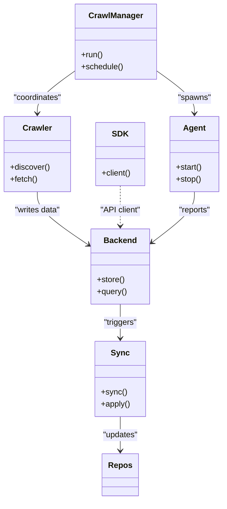

# Diagram: common/monitoring/config/config.alpha.yml


> Auto-generated by Obscura crawlers

## Diagram 1

```mermaid
flowchart TD
    User[User / API] --> CrawlManager[Crawl Manager\n(crawl.py)]
    CrawlManager --> Crawlers[Crawlers Module\n(crawlers.py, crawlers/)]
    Crawlers --> Backend[Backend Service\n(backend/)]
    Backend --> Sync[Sync Service\n(sync.py)]
    Sync --> Repos[Local Repos\n(repos/)]
    CrawlManager --> Agents[Agents\n(agents/)]
    Backend --> SDK[SDK\n(sdk/)]
    Agents --> Backend
    SDK -->|uses| Backend
```

> SVG rendering failed for this diagram.

## Diagram 2



### SVG

<svg id="container" width="442.1171875" xmlns="http://www.w3.org/2000/svg" class="classDiagram" height="996" viewBox="0 0 442.1171875 996" role="graphics-document document" aria-roledescription="class"><style>#container{font-family:"trebuchet ms",verdana,arial,sans-serif;font-size:16px;fill:#333;}@keyframes edge-animation-frame{from{stroke-dashoffset:0;}}@keyframes dash{to{stroke-dashoffset:0;}}#container .edge-animation-slow{stroke-dasharray:9,5!important;stroke-dashoffset:900;animation:dash 50s linear infinite;stroke-linecap:round;}#container .edge-animation-fast{stroke-dasharray:9,5!important;stroke-dashoffset:900;animation:dash 20s linear infinite;stroke-linecap:round;}#container .error-icon{fill:#552222;}#container .error-text{fill:#552222;stroke:#552222;}#container .edge-thickness-normal{stroke-width:1px;}#container .edge-thickness-thick{stroke-width:3.5px;}#container .edge-pattern-solid{stroke-dasharray:0;}#container .edge-thickness-invisible{stroke-width:0;fill:none;}#container .edge-pattern-dashed{stroke-dasharray:3;}#container .edge-pattern-dotted{stroke-dasharray:2;}#container .marker{fill:#333333;stroke:#333333;}#container .marker.cross{stroke:#333333;}#container svg{font-family:"trebuchet ms",verdana,arial,sans-serif;font-size:16px;}#container p{margin:0;}#container g.classGroup text{fill:#9370DB;stroke:none;font-family:"trebuchet ms",verdana,arial,sans-serif;font-size:10px;}#container g.classGroup text .title{font-weight:bolder;}#container .nodeLabel,#container .edgeLabel{color:#131300;}#container .edgeLabel .label rect{fill:#ECECFF;}#container .label text{fill:#131300;}#container .labelBkg{background:#ECECFF;}#container .edgeLabel .label span{background:#ECECFF;}#container .classTitle{font-weight:bolder;}#container .node rect,#container .node circle,#container .node ellipse,#container .node polygon,#container .node path{fill:#ECECFF;stroke:#9370DB;stroke-width:1px;}#container .divider{stroke:#9370DB;stroke-width:1;}#container g.clickable{cursor:pointer;}#container g.classGroup rect{fill:#ECECFF;stroke:#9370DB;}#container g.classGroup line{stroke:#9370DB;stroke-width:1;}#container .classLabel .box{stroke:none;stroke-width:0;fill:#ECECFF;opacity:0.5;}#container .classLabel .label{fill:#9370DB;font-size:10px;}#container .relation{stroke:#333333;stroke-width:1;fill:none;}#container .dashed-line{stroke-dasharray:3;}#container .dotted-line{stroke-dasharray:1 2;}#container #compositionStart,#container .composition{fill:#333333!important;stroke:#333333!important;stroke-width:1;}#container #compositionEnd,#container .composition{fill:#333333!important;stroke:#333333!important;stroke-width:1;}#container #dependencyStart,#container .dependency{fill:#333333!important;stroke:#333333!important;stroke-width:1;}#container #dependencyStart,#container .dependency{fill:#333333!important;stroke:#333333!important;stroke-width:1;}#container #extensionStart,#container .extension{fill:transparent!important;stroke:#333333!important;stroke-width:1;}#container #extensionEnd,#container .extension{fill:transparent!important;stroke:#333333!important;stroke-width:1;}#container #aggregationStart,#container .aggregation{fill:transparent!important;stroke:#333333!important;stroke-width:1;}#container #aggregationEnd,#container .aggregation{fill:transparent!important;stroke:#333333!important;stroke-width:1;}#container #lollipopStart,#container .lollipop{fill:#ECECFF!important;stroke:#333333!important;stroke-width:1;}#container #lollipopEnd,#container .lollipop{fill:#ECECFF!important;stroke:#333333!important;stroke-width:1;}#container .edgeTerminals{font-size:11px;line-height:initial;}#container .classTitleText{text-anchor:middle;font-size:18px;fill:#333;}#container .label-icon{display:inline-block;height:1em;overflow:visible;vertical-align:-0.125em;}#container .node .label-icon path{fill:currentColor;stroke:revert;stroke-width:revert;}#container :root{--mermaid-font-family:"trebuchet ms",verdana,arial,sans-serif;}</style><g><defs><marker id="container_class-aggregationStart" class="marker aggregation class" refX="18" refY="7" markerWidth="190" markerHeight="240" orient="auto"><path d="M 18,7 L9,13 L1,7 L9,1 Z"></path></marker></defs><defs><marker id="container_class-aggregationEnd" class="marker aggregation class" refX="1" refY="7" markerWidth="20" markerHeight="28" orient="auto"><path d="M 18,7 L9,13 L1,7 L9,1 Z"></path></marker></defs><defs><marker id="container_class-extensionStart" class="marker extension class" refX="18" refY="7" markerWidth="190" markerHeight="240" orient="auto"><path d="M 1,7 L18,13 V 1 Z"></path></marker></defs><defs><marker id="container_class-extensionEnd" class="marker extension class" refX="1" refY="7" markerWidth="20" markerHeight="28" orient="auto"><path d="M 1,1 V 13 L18,7 Z"></path></marker></defs><defs><marker id="container_class-compositionStart" class="marker composition class" refX="18" refY="7" markerWidth="190" markerHeight="240" orient="auto"><path d="M 18,7 L9,13 L1,7 L9,1 Z"></path></marker></defs><defs><marker id="container_class-compositionEnd" class="marker composition class" refX="1" refY="7" markerWidth="20" markerHeight="28" orient="auto"><path d="M 18,7 L9,13 L1,7 L9,1 Z"></path></marker></defs><defs><marker id="container_class-dependencyStart" class="marker dependency class" refX="6" refY="7" markerWidth="190" markerHeight="240" orient="auto"><path d="M 5,7 L9,13 L1,7 L9,1 Z"></path></marker></defs><defs><marker id="container_class-dependencyEnd" class="marker dependency class" refX="13" refY="7" markerWidth="20" markerHeight="28" orient="auto"><path d="M 18,7 L9,13 L14,7 L9,1 Z"></path></marker></defs><defs><marker id="container_class-lollipopStart" class="marker lollipop class" refX="13" refY="7" markerWidth="190" markerHeight="240" orient="auto"><circle stroke="black" fill="transparent" cx="7" cy="7" r="6"></circle></marker></defs><defs><marker id="container_class-lollipopEnd" class="marker lollipop class" refX="1" refY="7" markerWidth="190" markerHeight="240" orient="auto"><circle stroke="black" fill="transparent" cx="7" cy="7" r="6"></circle></marker></defs><g class="root"><g class="clusters"></g><g class="edgePaths"><path d="M149.801,140.207L137.08,149.339C124.359,158.471,98.918,176.736,86.197,191.035C73.477,205.333,73.477,215.667,73.477,220.833L73.477,226" id="id_CrawlManager_Crawler_1" class="edge-thickness-normal edge-pattern-solid relation" style=";;;" data-edge="true" data-et="edge" data-id="id_CrawlManager_Crawler_1" data-points="W3sieCI6MTQ5LjgwMDc4MTI1LCJ5IjoxNDAuMjA3MjQxMDQyNTg5OTR9LHsieCI6NzMuNDc2NTYyNSwieSI6MTk1fSx7IngiOjczLjQ3NjU2MjUsInkiOjIzMn1d" marker-end="url(#container_class-dependencyEnd)"></path><path d="M309.176,140.207L321.896,149.339C334.617,158.471,360.059,176.736,372.779,191.035C385.5,205.333,385.5,215.667,385.5,220.833L385.5,226" id="id_CrawlManager_Agent_2" class="edge-thickness-normal edge-pattern-solid relation" style=";;;" data-edge="true" data-et="edge" data-id="id_CrawlManager_Agent_2" data-points="W3sieCI6MzA5LjE3NTc4MTI1LCJ5IjoxNDAuMjA3MjQxMDQyNTg5OTR9LHsieCI6Mzg1LjUsInkiOjE5NX0seyJ4IjozODUuNSwieSI6MjMyfV0=" marker-end="url(#container_class-dependencyEnd)"></path><path d="M73.477,382L73.477,388.167C73.477,394.333,73.477,406.667,90.448,424.392C107.419,442.118,141.361,465.235,158.332,476.794L175.303,488.353" id="id_Crawler_Backend_3" class="edge-thickness-normal edge-pattern-solid relation" style=";;;" data-edge="true" data-et="edge" data-id="id_Crawler_Backend_3" data-points="W3sieCI6NzMuNDc2NTYyNSwieSI6MzgyfSx7IngiOjczLjQ3NjU2MjUsInkiOjQxOX0seyJ4IjoxODAuMjYxNzE4NzUsInkiOjQ5MS43MzA2OTMzOTg1Nzk1fV0=" marker-end="url(#container_class-dependencyEnd)"></path><path d="M237.918,606L237.918,612.167C237.918,618.333,237.918,630.667,237.918,642C237.918,653.333,237.918,663.667,237.918,668.833L237.918,674" id="id_Backend_Sync_4" class="edge-thickness-normal edge-pattern-solid relation" style=";;;" data-edge="true" data-et="edge" data-id="id_Backend_Sync_4" data-points="W3sieCI6MjM3LjkxNzk2ODc1LCJ5Ijo2MDZ9LHsieCI6MjM3LjkxNzk2ODc1LCJ5Ijo2NDN9LHsieCI6MjM3LjkxNzk2ODc1LCJ5Ijo2ODB9XQ==" marker-end="url(#container_class-dependencyEnd)"></path><path d="M237.918,830L237.918,836.167C237.918,842.333,237.918,854.667,237.918,866C237.918,877.333,237.918,887.667,237.918,892.833L237.918,898" id="id_Sync_Repos_5" class="edge-thickness-normal edge-pattern-solid relation" style=";;;" data-edge="true" data-et="edge" data-id="id_Sync_Repos_5" data-points="W3sieCI6MjM3LjkxNzk2ODc1LCJ5Ijo4MzB9LHsieCI6MjM3LjkxNzk2ODc1LCJ5Ijo4Njd9LHsieCI6MjM3LjkxNzk2ODc1LCJ5Ijo5MDR9XQ==" marker-end="url(#container_class-dependencyEnd)"></path><path d="M237.918,370L237.918,378.167C237.918,386.333,237.918,402.667,237.918,416C237.918,429.333,237.918,439.667,237.918,444.833L237.918,450" id="id_SDK_Backend_6" class="edge-thickness-normal edge-pattern-dashed relation" style=";;;" data-edge="true" data-et="edge" data-id="id_SDK_Backend_6" data-points="W3sieCI6MjM3LjkxNzk2ODc1LCJ5IjozNzB9LHsieCI6MjM3LjkxNzk2ODc1LCJ5Ijo0MTl9LHsieCI6MjM3LjkxNzk2ODc1LCJ5Ijo0NTZ9XQ==" marker-end="url(#container_class-dependencyEnd)"></path><path d="M385.5,382L385.5,388.167C385.5,394.333,385.5,406.667,371.309,423.603C357.118,440.539,328.736,462.078,314.545,472.848L300.354,483.618" id="id_Agent_Backend_7" class="edge-thickness-normal edge-pattern-solid relation" style=";;;" data-edge="true" data-et="edge" data-id="id_Agent_Backend_7" data-points="W3sieCI6Mzg1LjUsInkiOjM4Mn0seyJ4IjozODUuNSwieSI6NDE5fSx7IngiOjI5NS41NzQyMTg3NSwieSI6NDg3LjI0NDY3MzI0ODQ1ODI0fV0=" marker-end="url(#container_class-dependencyEnd)"></path></g><g class="edgeLabels"><g class="edgeLabel" transform="translate(73.4765625, 195)"><g class="label" data-id="id_CrawlManager_Crawler_1" transform="translate(-48.984375, -12)"><foreignObject width="97.96875" height="24"><div xmlns="http://www.w3.org/1999/xhtml" class="labelBkg" style="display: table-cell; white-space: nowrap; line-height: 1.5; max-width: 200px; text-align: center;"><span class="edgeLabel"><p>"coordinates"</p></span></div></foreignObject></g></g><g class="edgeLabel" transform="translate(385.5, 195)"><g class="label" data-id="id_CrawlManager_Agent_2" transform="translate(-33.0703125, -12)"><foreignObject width="66.140625" height="24"><div xmlns="http://www.w3.org/1999/xhtml" class="labelBkg" style="display: table-cell; white-space: nowrap; line-height: 1.5; max-width: 200px; text-align: center;"><span class="edgeLabel"><p>"spawns"</p></span></div></foreignObject></g></g><g class="edgeLabel" transform="translate(73.4765625, 419)"><g class="label" data-id="id_Crawler_Backend_3" transform="translate(-46.6953125, -12)"><foreignObject width="93.390625" height="24"><div xmlns="http://www.w3.org/1999/xhtml" class="labelBkg" style="display: table-cell; white-space: nowrap; line-height: 1.5; max-width: 200px; text-align: center;"><span class="edgeLabel"><p>"writes data"</p></span></div></foreignObject></g></g><g class="edgeLabel" transform="translate(237.91796875, 643)"><g class="label" data-id="id_Backend_Sync_4" transform="translate(-33.8359375, -12)"><foreignObject width="67.671875" height="24"><div xmlns="http://www.w3.org/1999/xhtml" class="labelBkg" style="display: table-cell; white-space: nowrap; line-height: 1.5; max-width: 200px; text-align: center;"><span class="edgeLabel"><p>"triggers"</p></span></div></foreignObject></g></g><g class="edgeLabel" transform="translate(237.91796875, 867)"><g class="label" data-id="id_Sync_Repos_5" transform="translate(-35.6796875, -12)"><foreignObject width="71.359375" height="24"><div xmlns="http://www.w3.org/1999/xhtml" class="labelBkg" style="display: table-cell; white-space: nowrap; line-height: 1.5; max-width: 200px; text-align: center;"><span class="edgeLabel"><p>"updates"</p></span></div></foreignObject></g></g><g class="edgeLabel" transform="translate(237.91796875, 419)"><g class="label" data-id="id_SDK_Backend_6" transform="translate(-40.1015625, -12)"><foreignObject width="80.203125" height="24"><div xmlns="http://www.w3.org/1999/xhtml" class="labelBkg" style="display: table-cell; white-space: nowrap; line-height: 1.5; max-width: 200px; text-align: center;"><span class="edgeLabel"><p>"API client"</p></span></div></foreignObject></g></g><g class="edgeLabel" transform="translate(385.5, 419)"><g class="label" data-id="id_Agent_Backend_7" transform="translate(-32.609375, -12)"><foreignObject width="65.21875" height="24"><div xmlns="http://www.w3.org/1999/xhtml" class="labelBkg" style="display: table-cell; white-space: nowrap; line-height: 1.5; max-width: 200px; text-align: center;"><span class="edgeLabel"><p>"reports"</p></span></div></foreignObject></g></g></g><g class="nodes"><g class="node default" id="classId-CrawlManager-0" transform="translate(229.48828125, 83)"><g class="basic label-container"><path d="M-79.6875 -75 L79.6875 -75 L79.6875 75 L-79.6875 75" stroke="none" stroke-width="0" fill="#ECECFF" style=""></path><path d="M-79.6875 -75 C-22.032845357274496 -75, 35.62180928545101 -75, 79.6875 -75 M-79.6875 -75 C-37.24155273883602 -75, 5.204394522327959 -75, 79.6875 -75 M79.6875 -75 C79.6875 -38.918499214074295, 79.6875 -2.83699842814859, 79.6875 75 M79.6875 -75 C79.6875 -34.73761604988925, 79.6875 5.524767900221505, 79.6875 75 M79.6875 75 C38.118496863745136 75, -3.4505062725097275 75, -79.6875 75 M79.6875 75 C47.74686116884454 75, 15.806222337689078 75, -79.6875 75 M-79.6875 75 C-79.6875 28.717548683648978, -79.6875 -17.564902632702044, -79.6875 -75 M-79.6875 75 C-79.6875 40.293257470667015, -79.6875 5.5865149413340305, -79.6875 -75" stroke="#9370DB" stroke-width="1.3" fill="none" stroke-dasharray="0 0" style=""></path></g><g class="annotation-group text" transform="translate(0, -51)"></g><g class="label-group text" transform="translate(-51.59375, -51)"><g class="label" style="font-weight: bolder" transform="translate(0,-12)"><foreignObject width="103.1875" height="24"><div xmlns="http://www.w3.org/1999/xhtml" style="display: table-cell; white-space: nowrap; line-height: 1.5; max-width: 152px; text-align: center;"><span class="nodeLabel markdown-node-label" style=""><p>CrawlManager</p></span></div></foreignObject></g></g><g class="members-group text" transform="translate(-67.6875, -3)"></g><g class="methods-group text" transform="translate(-67.6875, 27)"><g class="label" style="" transform="translate(0,-12)"><foreignObject width="43.21875" height="24"><div xmlns="http://www.w3.org/1999/xhtml" style="display: table-cell; white-space: nowrap; line-height: 1.5; max-width: 101px; text-align: center;"><span class="nodeLabel markdown-node-label" style=""><p>+run()</p></span></div></foreignObject></g><g class="label" style="" transform="translate(0,12)"><foreignObject width="83.78125" height="24"><div xmlns="http://www.w3.org/1999/xhtml" style="display: table-cell; white-space: nowrap; line-height: 1.5; max-width: 141px; text-align: center;"><span class="nodeLabel markdown-node-label" style=""><p>+schedule()</p></span></div></foreignObject></g></g><g class="divider" style=""><path d="M-79.6875 -27 C-39.48713149943166 -27, 0.713237001136676 -27, 79.6875 -27 M-79.6875 -27 C-40.65355827080597 -27, -1.619616541611947 -27, 79.6875 -27" stroke="#9370DB" stroke-width="1.3" fill="none" stroke-dasharray="0 0" style=""></path></g><g class="divider" style=""><path d="M-79.6875 -3 C-44.837459417352235 -3, -9.98741883470447 -3, 79.6875 -3 M-79.6875 -3 C-26.450952254227403 -3, 26.785595491545195 -3, 79.6875 -3" stroke="#9370DB" stroke-width="1.3" fill="none" stroke-dasharray="0 0" style=""></path></g></g><g class="node default" id="classId-Crawler-1" transform="translate(73.4765625, 307)"><g class="basic label-container"><path d="M-65.4765625 -75 L65.4765625 -75 L65.4765625 75 L-65.4765625 75" stroke="none" stroke-width="0" fill="#ECECFF" style=""></path><path d="M-65.4765625 -75 C-19.11134579381151 -75, 27.253870912376982 -75, 65.4765625 -75 M-65.4765625 -75 C-30.26765085478545 -75, 4.941260790429098 -75, 65.4765625 -75 M65.4765625 -75 C65.4765625 -44.27908706301216, 65.4765625 -13.558174126024326, 65.4765625 75 M65.4765625 -75 C65.4765625 -35.11000463850566, 65.4765625 4.7799907229886855, 65.4765625 75 M65.4765625 75 C26.53936569707728 75, -12.397831105845441 75, -65.4765625 75 M65.4765625 75 C20.150012257653273 75, -25.176537984693454 75, -65.4765625 75 M-65.4765625 75 C-65.4765625 44.62680625593741, -65.4765625 14.25361251187482, -65.4765625 -75 M-65.4765625 75 C-65.4765625 20.366400308161687, -65.4765625 -34.267199383676626, -65.4765625 -75" stroke="#9370DB" stroke-width="1.3" fill="none" stroke-dasharray="0 0" style=""></path></g><g class="annotation-group text" transform="translate(0, -51)"></g><g class="label-group text" transform="translate(-27.734375, -51)"><g class="label" style="font-weight: bolder" transform="translate(0,-12)"><foreignObject width="55.46875" height="24"><div xmlns="http://www.w3.org/1999/xhtml" style="display: table-cell; white-space: nowrap; line-height: 1.5; max-width: 105px; text-align: center;"><span class="nodeLabel markdown-node-label" style=""><p>Crawler</p></span></div></foreignObject></g></g><g class="members-group text" transform="translate(-53.4765625, -3)"></g><g class="methods-group text" transform="translate(-53.4765625, 27)"><g class="label" style="" transform="translate(0,-12)"><foreignObject width="79.21875" height="24"><div xmlns="http://www.w3.org/1999/xhtml" style="display: table-cell; white-space: nowrap; line-height: 1.5; max-width: 137px; text-align: center;"><span class="nodeLabel markdown-node-label" style=""><p>+discover()</p></span></div></foreignObject></g><g class="label" style="" transform="translate(0,12)"><foreignObject width="54.59375" height="24"><div xmlns="http://www.w3.org/1999/xhtml" style="display: table-cell; white-space: nowrap; line-height: 1.5; max-width: 112px; text-align: center;"><span class="nodeLabel markdown-node-label" style=""><p>+fetch()</p></span></div></foreignObject></g></g><g class="divider" style=""><path d="M-65.4765625 -27 C-26.510167067648 -27, 12.456228364704003 -27, 65.4765625 -27 M-65.4765625 -27 C-26.42912810124959 -27, 12.618306297500823 -27, 65.4765625 -27" stroke="#9370DB" stroke-width="1.3" fill="none" stroke-dasharray="0 0" style=""></path></g><g class="divider" style=""><path d="M-65.4765625 -3 C-25.956632829753147 -3, 13.563296840493706 -3, 65.4765625 -3 M-65.4765625 -3 C-38.45347581300017 -3, -11.430389126000335 -3, 65.4765625 -3" stroke="#9370DB" stroke-width="1.3" fill="none" stroke-dasharray="0 0" style=""></path></g></g><g class="node default" id="classId-Backend-2" transform="translate(237.91796875, 531)"><g class="basic label-container"><path d="M-57.65625 -75 L57.65625 -75 L57.65625 75 L-57.65625 75" stroke="none" stroke-width="0" fill="#ECECFF" style=""></path><path d="M-57.65625 -75 C-16.9557652868991 -75, 23.744719426201797 -75, 57.65625 -75 M-57.65625 -75 C-17.594532146909465 -75, 22.46718570618107 -75, 57.65625 -75 M57.65625 -75 C57.65625 -43.559206409707535, 57.65625 -12.11841281941507, 57.65625 75 M57.65625 -75 C57.65625 -44.975147605706184, 57.65625 -14.950295211412374, 57.65625 75 M57.65625 75 C28.235569254329786 75, -1.1851114913404288 75, -57.65625 75 M57.65625 75 C12.40099952616687 75, -32.85425094766626 75, -57.65625 75 M-57.65625 75 C-57.65625 23.287872586359754, -57.65625 -28.424254827280492, -57.65625 -75 M-57.65625 75 C-57.65625 37.63126142864624, -57.65625 0.26252285729248115, -57.65625 -75" stroke="#9370DB" stroke-width="1.3" fill="none" stroke-dasharray="0 0" style=""></path></g><g class="annotation-group text" transform="translate(0, -51)"></g><g class="label-group text" transform="translate(-31.296875, -51)"><g class="label" style="font-weight: bolder" transform="translate(0,-12)"><foreignObject width="62.59375" height="24"><div xmlns="http://www.w3.org/1999/xhtml" style="display: table-cell; white-space: nowrap; line-height: 1.5; max-width: 112px; text-align: center;"><span class="nodeLabel markdown-node-label" style=""><p>Backend</p></span></div></foreignObject></g></g><g class="members-group text" transform="translate(-45.65625, -3)"></g><g class="methods-group text" transform="translate(-45.65625, 27)"><g class="label" style="" transform="translate(0,-12)"><foreignObject width="55.125" height="24"><div xmlns="http://www.w3.org/1999/xhtml" style="display: table-cell; white-space: nowrap; line-height: 1.5; max-width: 112px; text-align: center;"><span class="nodeLabel markdown-node-label" style=""><p>+store()</p></span></div></foreignObject></g><g class="label" style="" transform="translate(0,12)"><foreignObject width="60.015625" height="24"><div xmlns="http://www.w3.org/1999/xhtml" style="display: table-cell; white-space: nowrap; line-height: 1.5; max-width: 117px; text-align: center;"><span class="nodeLabel markdown-node-label" style=""><p>+query()</p></span></div></foreignObject></g></g><g class="divider" style=""><path d="M-57.65625 -27 C-26.52743008858329 -27, 4.6013898228334185 -27, 57.65625 -27 M-57.65625 -27 C-33.35845861963685 -27, -9.060667239273705 -27, 57.65625 -27" stroke="#9370DB" stroke-width="1.3" fill="none" stroke-dasharray="0 0" style=""></path></g><g class="divider" style=""><path d="M-57.65625 -3 C-28.731926111552177 -3, 0.1923977768956462 -3, 57.65625 -3 M-57.65625 -3 C-23.758712303074127 -3, 10.138825393851747 -3, 57.65625 -3" stroke="#9370DB" stroke-width="1.3" fill="none" stroke-dasharray="0 0" style=""></path></g></g><g class="node default" id="classId-Sync-3" transform="translate(237.91796875, 755)"><g class="basic label-container"><path d="M-49.6640625 -75 L49.6640625 -75 L49.6640625 75 L-49.6640625 75" stroke="none" stroke-width="0" fill="#ECECFF" style=""></path><path d="M-49.6640625 -75 C-27.18739419221208 -75, -4.710725884424157 -75, 49.6640625 -75 M-49.6640625 -75 C-20.60090266074917 -75, 8.462257178501659 -75, 49.6640625 -75 M49.6640625 -75 C49.6640625 -20.26301428904067, 49.6640625 34.47397142191866, 49.6640625 75 M49.6640625 -75 C49.6640625 -33.865588609167155, 49.6640625 7.2688227816656905, 49.6640625 75 M49.6640625 75 C11.976257709013197 75, -25.711547081973606 75, -49.6640625 75 M49.6640625 75 C21.217734489874044 75, -7.228593520251913 75, -49.6640625 75 M-49.6640625 75 C-49.6640625 24.027841551601902, -49.6640625 -26.944316896796195, -49.6640625 -75 M-49.6640625 75 C-49.6640625 36.71876321536101, -49.6640625 -1.5624735692779836, -49.6640625 -75" stroke="#9370DB" stroke-width="1.3" fill="none" stroke-dasharray="0 0" style=""></path></g><g class="annotation-group text" transform="translate(0, -51)"></g><g class="label-group text" transform="translate(-17.09375, -51)"><g class="label" style="font-weight: bolder" transform="translate(0,-12)"><foreignObject width="34.1875" height="24"><div xmlns="http://www.w3.org/1999/xhtml" style="display: table-cell; white-space: nowrap; line-height: 1.5; max-width: 84px; text-align: center;"><span class="nodeLabel markdown-node-label" style=""><p>Sync</p></span></div></foreignObject></g></g><g class="members-group text" transform="translate(-37.6640625, -3)"></g><g class="methods-group text" transform="translate(-37.6640625, 27)"><g class="label" style="" transform="translate(0,-12)"><foreignObject width="50.453125" height="24"><div xmlns="http://www.w3.org/1999/xhtml" style="display: table-cell; white-space: nowrap; line-height: 1.5; max-width: 108px; text-align: center;"><span class="nodeLabel markdown-node-label" style=""><p>+sync()</p></span></div></foreignObject></g><g class="label" style="" transform="translate(0,12)"><foreignObject width="58.234375" height="24"><div xmlns="http://www.w3.org/1999/xhtml" style="display: table-cell; white-space: nowrap; line-height: 1.5; max-width: 116px; text-align: center;"><span class="nodeLabel markdown-node-label" style=""><p>+apply()</p></span></div></foreignObject></g></g><g class="divider" style=""><path d="M-49.6640625 -27 C-27.50000840375796 -27, -5.3359543075159195 -27, 49.6640625 -27 M-49.6640625 -27 C-22.689572731617485 -27, 4.28491703676503 -27, 49.6640625 -27" stroke="#9370DB" stroke-width="1.3" fill="none" stroke-dasharray="0 0" style=""></path></g><g class="divider" style=""><path d="M-49.6640625 -3 C-14.804259168823897 -3, 20.055544162352206 -3, 49.6640625 -3 M-49.6640625 -3 C-15.970725078893963 -3, 17.722612342212074 -3, 49.6640625 -3" stroke="#9370DB" stroke-width="1.3" fill="none" stroke-dasharray="0 0" style=""></path></g></g><g class="node default" id="classId-Agent-4" transform="translate(385.5, 307)"><g class="basic label-container"><path d="M-48.6171875 -75 L48.6171875 -75 L48.6171875 75 L-48.6171875 75" stroke="none" stroke-width="0" fill="#ECECFF" style=""></path><path d="M-48.6171875 -75 C-13.456269368216702 -75, 21.704648763566595 -75, 48.6171875 -75 M-48.6171875 -75 C-22.222800810928188 -75, 4.171585878143624 -75, 48.6171875 -75 M48.6171875 -75 C48.6171875 -15.253063811736439, 48.6171875 44.49387237652712, 48.6171875 75 M48.6171875 -75 C48.6171875 -33.69774734046192, 48.6171875 7.604505319076154, 48.6171875 75 M48.6171875 75 C26.65700557210853 75, 4.696823644217062 75, -48.6171875 75 M48.6171875 75 C24.370016519048484 75, 0.12284553809696774 75, -48.6171875 75 M-48.6171875 75 C-48.6171875 22.54559571526149, -48.6171875 -29.908808569477017, -48.6171875 -75 M-48.6171875 75 C-48.6171875 18.03616473004707, -48.6171875 -38.92767053990586, -48.6171875 -75" stroke="#9370DB" stroke-width="1.3" fill="none" stroke-dasharray="0 0" style=""></path></g><g class="annotation-group text" transform="translate(0, -51)"></g><g class="label-group text" transform="translate(-21.078125, -51)"><g class="label" style="font-weight: bolder" transform="translate(0,-12)"><foreignObject width="42.15625" height="24"><div xmlns="http://www.w3.org/1999/xhtml" style="display: table-cell; white-space: nowrap; line-height: 1.5; max-width: 91px; text-align: center;"><span class="nodeLabel markdown-node-label" style=""><p>Agent</p></span></div></foreignObject></g></g><g class="members-group text" transform="translate(-36.6171875, -3)"></g><g class="methods-group text" transform="translate(-36.6171875, 27)"><g class="label" style="" transform="translate(0,-12)"><foreignObject width="52.15625" height="24"><div xmlns="http://www.w3.org/1999/xhtml" style="display: table-cell; white-space: nowrap; line-height: 1.5; max-width: 110px; text-align: center;"><span class="nodeLabel markdown-node-label" style=""><p>+start()</p></span></div></foreignObject></g><g class="label" style="" transform="translate(0,12)"><foreignObject width="50.21875" height="24"><div xmlns="http://www.w3.org/1999/xhtml" style="display: table-cell; white-space: nowrap; line-height: 1.5; max-width: 108px; text-align: center;"><span class="nodeLabel markdown-node-label" style=""><p>+stop()</p></span></div></foreignObject></g></g><g class="divider" style=""><path d="M-48.6171875 -27 C-12.359516392810157 -27, 23.898154714379686 -27, 48.6171875 -27 M-48.6171875 -27 C-16.87020328714006 -27, 14.876780925719878 -27, 48.6171875 -27" stroke="#9370DB" stroke-width="1.3" fill="none" stroke-dasharray="0 0" style=""></path></g><g class="divider" style=""><path d="M-48.6171875 -3 C-12.333509263212747 -3, 23.950168973574506 -3, 48.6171875 -3 M-48.6171875 -3 C-23.646903434844624 -3, 1.3233806303107514 -3, 48.6171875 -3" stroke="#9370DB" stroke-width="1.3" fill="none" stroke-dasharray="0 0" style=""></path></g></g><g class="node default" id="classId-SDK-5" transform="translate(237.91796875, 307)"><g class="basic label-container"><path d="M-48.96484375 -63 L48.96484375 -63 L48.96484375 63 L-48.96484375 63" stroke="none" stroke-width="0" fill="#ECECFF" style=""></path><path d="M-48.96484375 -63 C-18.593880903921914 -63, 11.777081942156173 -63, 48.96484375 -63 M-48.96484375 -63 C-14.847218331512885 -63, 19.27040708697423 -63, 48.96484375 -63 M48.96484375 -63 C48.96484375 -37.48721134140894, 48.96484375 -11.974422682817874, 48.96484375 63 M48.96484375 -63 C48.96484375 -14.376483454852824, 48.96484375 34.24703309029435, 48.96484375 63 M48.96484375 63 C17.225640926094854 63, -14.513561897810291 63, -48.96484375 63 M48.96484375 63 C15.986340175817652 63, -16.992163398364696 63, -48.96484375 63 M-48.96484375 63 C-48.96484375 22.734540327967295, -48.96484375 -17.53091934406541, -48.96484375 -63 M-48.96484375 63 C-48.96484375 28.188336295717015, -48.96484375 -6.62332740856597, -48.96484375 -63" stroke="#9370DB" stroke-width="1.3" fill="none" stroke-dasharray="0 0" style=""></path></g><g class="annotation-group text" transform="translate(0, -39)"></g><g class="label-group text" transform="translate(-14.8515625, -39)"><g class="label" style="font-weight: bolder" transform="translate(0,-12)"><foreignObject width="29.703125" height="24"><div xmlns="http://www.w3.org/1999/xhtml" style="display: table-cell; white-space: nowrap; line-height: 1.5; max-width: 79px; text-align: center;"><span class="nodeLabel markdown-node-label" style=""><p>SDK</p></span></div></foreignObject></g></g><g class="members-group text" transform="translate(-36.96484375, 9)"></g><g class="methods-group text" transform="translate(-36.96484375, 39)"><g class="label" style="" transform="translate(0,-12)"><foreignObject width="59.078125" height="24"><div xmlns="http://www.w3.org/1999/xhtml" style="display: table-cell; white-space: nowrap; line-height: 1.5; max-width: 116px; text-align: center;"><span class="nodeLabel markdown-node-label" style=""><p>+client()</p></span></div></foreignObject></g></g><g class="divider" style=""><path d="M-48.96484375 -15 C-24.83342674126375 -15, -0.7020097325275003 -15, 48.96484375 -15 M-48.96484375 -15 C-28.287720210133173 -15, -7.610596670266347 -15, 48.96484375 -15" stroke="#9370DB" stroke-width="1.3" fill="none" stroke-dasharray="0 0" style=""></path></g><g class="divider" style=""><path d="M-48.96484375 9 C-23.626387303435873 9, 1.7120691431282538 9, 48.96484375 9 M-48.96484375 9 C-15.585309383801956 9, 17.794224982396088 9, 48.96484375 9" stroke="#9370DB" stroke-width="1.3" fill="none" stroke-dasharray="0 0" style=""></path></g></g><g class="node default" id="classId-Repos-6" transform="translate(237.91796875, 946)"><g class="basic label-container"><path d="M-34.546875 -42 L34.546875 -42 L34.546875 42 L-34.546875 42" stroke="none" stroke-width="0" fill="#ECECFF" style=""></path><path d="M-34.546875 -42 C-20.14731885335585 -42, -5.747762706711693 -42, 34.546875 -42 M-34.546875 -42 C-6.917640698541696 -42, 20.711593602916608 -42, 34.546875 -42 M34.546875 -42 C34.546875 -18.23911825005569, 34.546875 5.521763499888621, 34.546875 42 M34.546875 -42 C34.546875 -15.247258877488125, 34.546875 11.50548224502375, 34.546875 42 M34.546875 42 C17.247270471749175 42, -0.052334056501649684 42, -34.546875 42 M34.546875 42 C12.401162812733567 42, -9.744549374532866 42, -34.546875 42 M-34.546875 42 C-34.546875 18.872629452389248, -34.546875 -4.254741095221505, -34.546875 -42 M-34.546875 42 C-34.546875 8.63267030735441, -34.546875 -24.73465938529118, -34.546875 -42" stroke="#9370DB" stroke-width="1.3" fill="none" stroke-dasharray="0 0" style=""></path></g><g class="annotation-group text" transform="translate(0, -18)"></g><g class="label-group text" transform="translate(-22.546875, -18)"><g class="label" style="font-weight: bolder" transform="translate(0,-12)"><foreignObject width="45.09375" height="24"><div xmlns="http://www.w3.org/1999/xhtml" style="display: table-cell; white-space: nowrap; line-height: 1.5; max-width: 94px; text-align: center;"><span class="nodeLabel markdown-node-label" style=""><p>Repos</p></span></div></foreignObject></g></g><g class="members-group text" transform="translate(-22.546875, 30)"></g><g class="methods-group text" transform="translate(-22.546875, 60)"></g><g class="divider" style=""><path d="M-34.546875 6 C-9.479034014648207 6, 15.588806970703587 6, 34.546875 6 M-34.546875 6 C-15.064248316176823 6, 4.418378367646355 6, 34.546875 6" stroke="#9370DB" stroke-width="1.3" fill="none" stroke-dasharray="0 0" style=""></path></g><g class="divider" style=""><path d="M-34.546875 24 C-17.979408415157575 24, -1.4119418303151505 24, 34.546875 24 M-34.546875 24 C-7.793327955868737 24, 18.960219088262527 24, 34.546875 24" stroke="#9370DB" stroke-width="1.3" fill="none" stroke-dasharray="0 0" style=""></path></g></g></g></g></g></svg>
