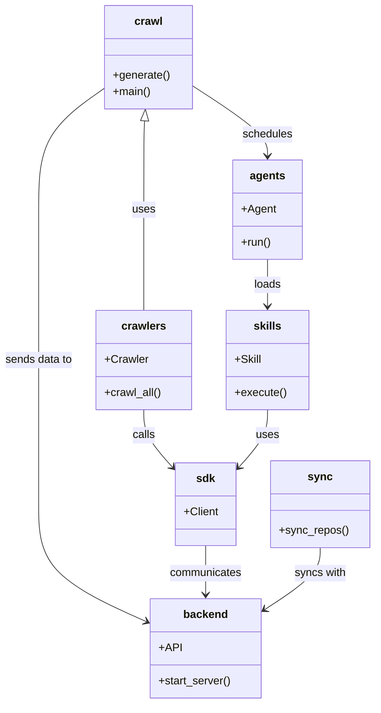
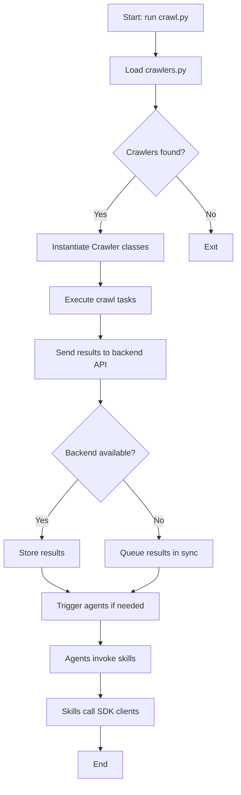

# Diagram: common/monitoring/config/config.dev.yml

> Auto-generated by Obscura crawlers

## Diagram 1

### SVG

<svg id="container" width="540.140625" xmlns="http://www.w3.org/2000/svg" class="classDiagram" height="1020" viewBox="0 0 540.140625 1020" role="graphics-document document" aria-roledescription="class"><g><defs><marker id="container_class-aggregationStart" class="marker aggregation class" refX="18" refY="7" markerWidth="190" markerHeight="240" orient="auto"><path d="M 18,7 L9,13 L1,7 L9,1 Z"></path></marker></defs><defs><marker id="container_class-aggregationEnd" class="marker aggregation class" refX="1" refY="7" markerWidth="20" markerHeight="28" orient="auto"><path d="M 18,7 L9,13 L1,7 L9,1 Z"></path></marker></defs><defs><marker id="container_class-extensionStart" class="marker extension class" refX="18" refY="7" markerWidth="190" markerHeight="240" orient="auto"><path d="M 1,7 L18,13 V 1 Z"></path></marker></defs><defs><marker id="container_class-extensionEnd" class="marker extension class" refX="1" refY="7" markerWidth="20" markerHeight="28" orient="auto"><path d="M 1,1 V 13 L18,7 Z"></path></marker></defs><defs><marker id="container_class-compositionStart" class="marker composition class" refX="18" refY="7" markerWidth="190" markerHeight="240" orient="auto"><path d="M 18,7 L9,13 L1,7 L9,1 Z"></path></marker></defs><defs><marker id="container_class-compositionEnd" class="marker composition class" refX="1" refY="7" markerWidth="20" markerHeight="28" orient="auto"><path d="M 18,7 L9,13 L1,7 L9,1 Z"></path></marker></defs><defs><marker id="container_class-dependencyStart" class="marker dependency class" refX="6" refY="7" markerWidth="190" markerHeight="240" orient="auto"><path d="M 5,7 L9,13 L1,7 L9,1 Z"></path></marker></defs><defs><marker id="container_class-dependencyEnd" class="marker dependency class" refX="13" refY="7" markerWidth="20" markerHeight="28" orient="auto"><path d="M 18,7 L9,13 L14,7 L9,1 Z"></path></marker></defs><defs><marker id="container_class-lollipopStart" class="marker lollipop class" refX="13" refY="7" markerWidth="190" markerHeight="240" orient="auto"><circle stroke="black" fill="transparent" cx="7" cy="7" r="6"></circle></marker></defs><defs><marker id="container_class-lollipopEnd" class="marker lollipop class" refX="1" refY="7" markerWidth="190" markerHeight="240" orient="auto"><circle stroke="black" fill="transparent" cx="7" cy="7" r="6"></circle></marker></defs><g class="root"><g class="clusters"></g><g class="edgePaths"><path d="M211.114,175.231L210.96,178.526C210.805,181.821,210.496,188.41,210.342,209.872C210.188,231.333,210.188,267.667,210.188,304C210.188,340.333,210.188,376.667,210.188,401C210.188,425.333,210.188,437.667,210.188,443.833L210.188,450" id="id_crawl_crawlers_1" class="edge-thickness-normal edge-pattern-solid relation" style=";;;" data-edge="true" data-et="edge" data-id="id_crawl_crawlers_1" data-points="W3sieCI6MjExLjkyMTg3NSwieSI6MTU4fSx7IngiOjIxMC4xODc1LCJ5IjoxOTV9LHsieCI6MjEwLjE4NzUsInkiOjMwNH0seyJ4IjoyMTAuMTg3NSwieSI6NDEzfSx7IngiOjIxMC4xODc1LCJ5Ijo0NTB9XQ==" marker-start="url(#container_class-extensionStart)"></path><path d="M152.793,127.369L136.878,138.641C120.964,149.913,89.134,172.456,73.219,201.895C57.305,231.333,57.305,267.667,57.305,304C57.305,340.333,57.305,376.667,57.305,413C57.305,449.333,57.305,485.667,57.305,522C57.305,558.333,57.305,594.667,57.305,629.5C57.305,664.333,57.305,697.667,57.305,731C57.305,764.333,57.305,797.667,83.266,826.049C109.228,854.431,161.151,877.862,187.112,889.578L213.074,901.293" id="id_crawl_backend_2" class="edge-thickness-normal edge-pattern-solid relation" style=";;;" data-edge="true" data-et="edge" data-id="id_crawl_backend_2" data-points="W3sieCI6MTUyLjc5Mjk2ODc1LCJ5IjoxMjcuMzY4OTU0MTAzMDU4MTR9LHsieCI6NTcuMzA0Njg3NSwieSI6MTk1fSx7IngiOjU3LjMwNDY4NzUsInkiOjMwNH0seyJ4Ijo1Ny4zMDQ2ODc1LCJ5Ijo0MTN9LHsieCI6NTcuMzA0Njg3NSwieSI6NTIyfSx7IngiOjU3LjMwNDY4NzUsInkiOjYzMX0seyJ4Ijo1Ny4zMDQ2ODc1LCJ5Ijo3MzF9LHsieCI6NTcuMzA0Njg3NSwieSI6ODMxfSx7IngiOjIxOC41NDI5Njg3NSwieSI6OTAzLjc2MTI2Nzg5MDM1MzN9XQ==" marker-end="url(#container_class-dependencyEnd)"></path><path d="M278.082,123.775L296.32,135.646C314.557,147.517,351.033,171.258,369.27,188.296C387.508,205.333,387.508,215.667,387.508,220.833L387.508,226" id="id_crawl_agents_3" class="edge-thickness-normal edge-pattern-solid relation" style=";;;" data-edge="true" data-et="edge" data-id="id_crawl_agents_3" data-points="W3sieCI6Mjc4LjA4MjAzMTI1LCJ5IjoxMjMuNzc1MTE5MTgyNzQ2ODh9LHsieCI6Mzg3LjUwNzgxMjUsInkiOjE5NX0seyJ4IjozODcuNTA3ODEyNSwieSI6MjMyfV0=" marker-end="url(#container_class-dependencyEnd)"></path><path d="M387.508,376L387.508,382.167C387.508,388.333,387.508,400.667,387.508,412C387.508,423.333,387.508,433.667,387.508,438.833L387.508,444" id="id_agents_skills_4" class="edge-thickness-normal edge-pattern-solid relation" style=";;;" data-edge="true" data-et="edge" data-id="id_agents_skills_4" data-points="W3sieCI6Mzg3LjUwNzgxMjUsInkiOjM3Nn0seyJ4IjozODcuNTA3ODEyNSwieSI6NDEzfSx7IngiOjM4Ny41MDc4MTI1LCJ5Ijo0NTB9XQ==" marker-end="url(#container_class-dependencyEnd)"></path><path d="M298.848,791L298.848,797.667C298.848,804.333,298.848,817.667,298.848,829.5C298.848,841.333,298.848,851.667,298.848,856.833L298.848,862" id="id_sdk_backend_5" class="edge-thickness-normal edge-pattern-solid relation" style=";;;" data-edge="true" data-et="edge" data-id="id_sdk_backend_5" data-points="W3sieCI6Mjk4Ljg0NzY1NjI1LCJ5Ijo3OTF9LHsieCI6Mjk4Ljg0NzY1NjI1LCJ5Ijo4MzF9LHsieCI6Mjk4Ljg0NzY1NjI1LCJ5Ijo4Njh9XQ==" marker-end="url(#container_class-dependencyEnd)"></path><path d="M462.23,794L462.23,800.167C462.23,806.333,462.23,818.667,449.216,833.516C436.201,848.365,410.173,865.73,397.158,874.413L384.144,883.095" id="id_sync_backend_6" class="edge-thickness-normal edge-pattern-solid relation" style=";;;" data-edge="true" data-et="edge" data-id="id_sync_backend_6" data-points="W3sieCI6NDYyLjIzMDQ2ODc1LCJ5Ijo3OTR9LHsieCI6NDYyLjIzMDQ2ODc1LCJ5Ijo4MzF9LHsieCI6Mzc5LjE1MjM0Mzc1LCJ5Ijo4ODYuNDI1MTQyMjU2MDEzfV0=" marker-end="url(#container_class-dependencyEnd)"></path><path d="M210.188,594L210.188,600.167C210.188,606.333,210.188,618.667,217.055,632.58C223.923,646.493,237.659,661.985,244.527,669.731L251.395,677.478" id="id_crawlers_sdk_7" class="edge-thickness-normal edge-pattern-solid relation" style=";;;" data-edge="true" data-et="edge" data-id="id_crawlers_sdk_7" data-points="W3sieCI6MjEwLjE4NzUsInkiOjU5NH0seyJ4IjoyMTAuMTg3NSwieSI6NjMxfSx7IngiOjI1NS4zNzUsInkiOjY4MS45NjcwODgxNjE0MzF9XQ==" marker-end="url(#container_class-dependencyEnd)"></path><path d="M387.508,594L387.508,600.167C387.508,606.333,387.508,618.667,380.64,632.58C373.772,646.493,360.036,661.985,353.169,669.731L346.301,677.478" id="id_skills_sdk_8" class="edge-thickness-normal edge-pattern-solid relation" style=";;;" data-edge="true" data-et="edge" data-id="id_skills_sdk_8" data-points="W3sieCI6Mzg3LjUwNzgxMjUsInkiOjU5NH0seyJ4IjozODcuNTA3ODEyNSwieSI6NjMxfSx7IngiOjM0Mi4zMjAzMTI1LCJ5Ijo2ODEuOTY3MDg4MTYxNDMxfV0=" marker-end="url(#container_class-dependencyEnd)"></path></g><g class="edgeLabels"><g class="edgeLabel" transform="translate(210.1875, 304)"><g class="label" data-id="id_crawl_crawlers_1" transform="translate(-16.4921875, -12)"><foreignObject width="32.984375" height="24">

uses

</foreignObject></g></g><g class="edgeLabel" transform="translate(57.3046875, 522)"><g class="label" data-id="id_crawl_backend_2" transform="translate(-49.3046875, -12)"><foreignObject width="98.609375" height="24">

sends data to

</foreignObject></g></g><g class="edgeLabel" transform="translate(387.5078125, 195)"><g class="label" data-id="id_crawl_agents_3" transform="translate(-36.453125, -12)"><foreignObject width="72.90625" height="24">

schedules

</foreignObject></g></g><g class="edgeLabel" transform="translate(387.5078125, 413)"><g class="label" data-id="id_agents_skills_4" transform="translate(-19.7734375, -12)"><foreignObject width="39.546875" height="24">

loads

</foreignObject></g></g><g class="edgeLabel" transform="translate(298.84765625, 831)"><g class="label" data-id="id_sdk_backend_5" transform="translate(-52.609375, -12)"><foreignObject width="105.21875" height="24">

communicates

</foreignObject></g></g><g class="edgeLabel" transform="translate(462.23046875, 831)"><g class="label" data-id="id_sync_backend_6" transform="translate(-37.4765625, -12)"><foreignObject width="74.953125" height="24">

syncs with

</foreignObject></g></g><g class="edgeLabel" transform="translate(210.1875, 631)"><g class="label" data-id="id_crawlers_sdk_7" transform="translate(-16.4453125, -12)"><foreignObject width="32.890625" height="24">

calls

</foreignObject></g></g><g class="edgeLabel" transform="translate(387.5078125, 631)"><g class="label" data-id="id_skills_sdk_8" transform="translate(-16.4921875, -12)"><foreignObject width="32.984375" height="24">

uses

</foreignObject></g></g></g><g class="nodes"><g class="node default" id="classId-crawl-0" transform="translate(215.4375, 83)"><g class="basic label-container"><path d="M-62.64453125 -75 L62.64453125 -75 L62.64453125 75 L-62.64453125 75" stroke="none" stroke-width="0" fill="#ECECFF" style=""></path><path d="M-62.64453125 -75 C-22.609015612987463 -75, 17.426500024025074 -75, 62.64453125 -75 M-62.64453125 -75 C-18.30776680017547 -75, 26.028997649649057 -75, 62.64453125 -75 M62.64453125 -75 C62.64453125 -33.350104817141606, 62.64453125 8.299790365716788, 62.64453125 75 M62.64453125 -75 C62.64453125 -18.046025406707436, 62.64453125 38.90794918658513, 62.64453125 75 M62.64453125 75 C22.292295680057407 75, -18.059939889885186 75, -62.64453125 75 M62.64453125 75 C33.76914651790101 75, 4.893761785802013 75, -62.64453125 75 M-62.64453125 75 C-62.64453125 31.249896085149274, -62.64453125 -12.500207829701452, -62.64453125 -75 M-62.64453125 75 C-62.64453125 33.31724382210008, -62.64453125 -8.365512355799837, -62.64453125 -75" stroke="#9370DB" stroke-width="1.3" fill="none" stroke-dasharray="0 0" style=""></path></g><g class="annotation-group text" transform="translate(0, -51)"></g><g class="label-group text" transform="translate(-19.4765625, -51)"><g class="label" style="font-weight: bolder" transform="translate(0,-12)"><foreignObject width="38.953125" height="24">

crawl

</foreignObject></g></g><g class="members-group text" transform="translate(-50.64453125, -3)"></g><g class="methods-group text" transform="translate(-50.64453125, 27)"><g class="label" style="" transform="translate(0,-12)"><foreignObject width="81.8125" height="24">

+generate()

</foreignObject></g><g class="label" style="" transform="translate(0,12)"><foreignObject width="54.65625" height="24">

+main()

</foreignObject></g></g><g class="divider" style=""><path d="M-62.64453125 -27 C-31.251946640251802 -27, 0.14063796949639595 -27, 62.64453125 -27 M-62.64453125 -27 C-26.230533702266868 -27, 10.183463845466264 -27, 62.64453125 -27" stroke="#9370DB" stroke-width="1.3" fill="none" stroke-dasharray="0 0" style=""></path></g><g class="divider" style=""><path d="M-62.64453125 -3 C-34.99350095884621 -3, -7.3424706676924245 -3, 62.64453125 -3 M-62.64453125 -3 C-32.757779260451414 -3, -2.871027270902829 -3, 62.64453125 -3" stroke="#9370DB" stroke-width="1.3" fill="none" stroke-dasharray="0 0" style=""></path></g></g><g class="node default" id="classId-crawlers-1" transform="translate(210.1875, 522)"><g class="basic label-container"><path d="M-68.578125 -72 L68.578125 -72 L68.578125 72 L-68.578125 72" stroke="none" stroke-width="0" fill="#ECECFF" style=""></path><path d="M-68.578125 -72 C-24.522751864854932 -72, 19.532621270290136 -72, 68.578125 -72 M-68.578125 -72 C-24.862171389778347 -72, 18.853782220443307 -72, 68.578125 -72 M68.578125 -72 C68.578125 -22.889733418188634, 68.578125 26.220533163622733, 68.578125 72 M68.578125 -72 C68.578125 -20.494762542208143, 68.578125 31.010474915583714, 68.578125 72 M68.578125 72 C40.07842168234518 72, 11.57871836469036 72, -68.578125 72 M68.578125 72 C18.162171621293183 72, -32.253781757413634 72, -68.578125 72 M-68.578125 72 C-68.578125 36.76009021688785, -68.578125 1.5201804337757068, -68.578125 -72 M-68.578125 72 C-68.578125 30.13567892727125, -68.578125 -11.7286421454575, -68.578125 -72" stroke="#9370DB" stroke-width="1.3" fill="none" stroke-dasharray="0 0" style=""></path></g><g class="annotation-group text" transform="translate(0, -48)"></g><g class="label-group text" transform="translate(-30.828125, -48)"><g class="label" style="font-weight: bolder" transform="translate(0,-12)"><foreignObject width="61.65625" height="24">

crawlers

</foreignObject></g></g><g class="members-group text" transform="translate(-56.578125, 0)"><g class="label" style="" transform="translate(0,-12)"><foreignObject width="61.921875" height="24">

+Crawler

</foreignObject></g></g><g class="methods-group text" transform="translate(-56.578125, 48)"><g class="label" style="" transform="translate(0,-12)"><foreignObject width="82.328125" height="24">

+crawl_all()

</foreignObject></g></g><g class="divider" style=""><path d="M-68.578125 -24 C-26.083710279246944 -24, 16.410704441506113 -24, 68.578125 -24 M-68.578125 -24 C-30.011982065871102 -24, 8.554160868257796 -24, 68.578125 -24" stroke="#9370DB" stroke-width="1.3" fill="none" stroke-dasharray="0 0" style=""></path></g><g class="divider" style=""><path d="M-68.578125 24 C-29.59939397239723 24, 9.37933705520554 24, 68.578125 24 M-68.578125 24 C-25.107781608119105 24, 18.36256178376179 24, 68.578125 24" stroke="#9370DB" stroke-width="1.3" fill="none" stroke-dasharray="0 0" style=""></path></g></g><g class="node default" id="classId-backend-2" transform="translate(298.84765625, 940)"><g class="basic label-container"><path d="M-80.3046875 -72 L80.3046875 -72 L80.3046875 72 L-80.3046875 72" stroke="none" stroke-width="0" fill="#ECECFF" style=""></path><path d="M-80.3046875 -72 C-40.557096494531635 -72, -0.8095054890632696 -72, 80.3046875 -72 M-80.3046875 -72 C-21.887260929710834 -72, 36.53016564057833 -72, 80.3046875 -72 M80.3046875 -72 C80.3046875 -34.427299382966396, 80.3046875 3.145401234067208, 80.3046875 72 M80.3046875 -72 C80.3046875 -31.868274593508715, 80.3046875 8.263450812982569, 80.3046875 72 M80.3046875 72 C21.525871042260277 72, -37.252945415479445 72, -80.3046875 72 M80.3046875 72 C27.15312425783103 72, -25.998438984337938 72, -80.3046875 72 M-80.3046875 72 C-80.3046875 19.938634985082786, -80.3046875 -32.12273002983443, -80.3046875 -72 M-80.3046875 72 C-80.3046875 25.43325726924089, -80.3046875 -21.13348546151822, -80.3046875 -72" stroke="#9370DB" stroke-width="1.3" fill="none" stroke-dasharray="0 0" style=""></path></g><g class="annotation-group text" transform="translate(0, -48)"></g><g class="label-group text" transform="translate(-31.0625, -48)"><g class="label" style="font-weight: bolder" transform="translate(0,-12)"><foreignObject width="62.125" height="24">

backend

</foreignObject></g></g><g class="members-group text" transform="translate(-68.3046875, 0)"><g class="label" style="" transform="translate(0,-12)"><foreignObject width="31.015625" height="24">

+API

</foreignObject></g></g><g class="methods-group text" transform="translate(-68.3046875, 48)"><g class="label" style="" transform="translate(0,-12)"><foreignObject width="105.546875" height="24">

+start_server()

</foreignObject></g></g><g class="divider" style=""><path d="M-80.3046875 -24 C-31.112158672855486 -24, 18.080370154289028 -24, 80.3046875 -24 M-80.3046875 -24 C-27.99967937584516 -24, 24.305328748309677 -24, 80.3046875 -24" stroke="#9370DB" stroke-width="1.3" fill="none" stroke-dasharray="0 0" style=""></path></g><g class="divider" style=""><path d="M-80.3046875 24 C-40.48226363240091 24, -0.6598397648018164 24, 80.3046875 24 M-80.3046875 24 C-43.49904319119416 24, -6.693398882388323 24, 80.3046875 24" stroke="#9370DB" stroke-width="1.3" fill="none" stroke-dasharray="0 0" style=""></path></g></g><g class="node default" id="classId-agents-3" transform="translate(387.5078125, 304)"><g class="basic label-container"><path d="M-48.73046875 -72 L48.73046875 -72 L48.73046875 72 L-48.73046875 72" stroke="none" stroke-width="0" fill="#ECECFF" style=""></path><path d="M-48.73046875 -72 C-13.449932416525954 -72, 21.830603916948093 -72, 48.73046875 -72 M-48.73046875 -72 C-25.698019477953288 -72, -2.665570205906576 -72, 48.73046875 -72 M48.73046875 -72 C48.73046875 -29.94345969834926, 48.73046875 12.113080603301484, 48.73046875 72 M48.73046875 -72 C48.73046875 -41.72361454706644, 48.73046875 -11.44722909413288, 48.73046875 72 M48.73046875 72 C16.445221393980823 72, -15.840025962038354 72, -48.73046875 72 M48.73046875 72 C20.890339136673944 72, -6.949790476652112 72, -48.73046875 72 M-48.73046875 72 C-48.73046875 31.024966851340793, -48.73046875 -9.950066297318415, -48.73046875 -72 M-48.73046875 72 C-48.73046875 17.171019620329453, -48.73046875 -37.657960759341094, -48.73046875 -72" stroke="#9370DB" stroke-width="1.3" fill="none" stroke-dasharray="0 0" style=""></path></g><g class="annotation-group text" transform="translate(0, -48)"></g><g class="label-group text" transform="translate(-24.5234375, -48)"><g class="label" style="font-weight: bolder" transform="translate(0,-12)"><foreignObject width="49.046875" height="24">

agents

</foreignObject></g></g><g class="members-group text" transform="translate(-36.73046875, 0)"><g class="label" style="" transform="translate(0,-12)"><foreignObject width="48.9375" height="24">

+Agent

</foreignObject></g></g><g class="methods-group text" transform="translate(-36.73046875, 48)"><g class="label" style="" transform="translate(0,-12)"><foreignObject width="43.21875" height="24">

+run()

</foreignObject></g></g><g class="divider" style=""><path d="M-48.73046875 -24 C-20.249492554164355 -24, 8.23148364167129 -24, 48.73046875 -24 M-48.73046875 -24 C-20.882972843941296 -24, 6.964523062117408 -24, 48.73046875 -24" stroke="#9370DB" stroke-width="1.3" fill="none" stroke-dasharray="0 0" style=""></path></g><g class="divider" style=""><path d="M-48.73046875 24 C-21.43487568429761 24, 5.860717381404783 24, 48.73046875 24 M-48.73046875 24 C-13.273498716542598 24, 22.183471316914805 24, 48.73046875 24" stroke="#9370DB" stroke-width="1.3" fill="none" stroke-dasharray="0 0" style=""></path></g></g><g class="node default" id="classId-sdk-4" transform="translate(298.84765625, 731)"><g class="basic label-container"><path d="M-43.47265625 -60 L43.47265625 -60 L43.47265625 60 L-43.47265625 60" stroke="none" stroke-width="0" fill="#ECECFF" style=""></path><path d="M-43.47265625 -60 C-23.578143437562087 -60, -3.6836306251241737 -60, 43.47265625 -60 M-43.47265625 -60 C-14.448871807355932 -60, 14.574912635288136 -60, 43.47265625 -60 M43.47265625 -60 C43.47265625 -35.13770390204658, 43.47265625 -10.275407804093156, 43.47265625 60 M43.47265625 -60 C43.47265625 -31.81449522615648, 43.47265625 -3.628990452312962, 43.47265625 60 M43.47265625 60 C14.427826550608017 60, -14.617003148783965 60, -43.47265625 60 M43.47265625 60 C15.51562972432524 60, -12.44139680134952 60, -43.47265625 60 M-43.47265625 60 C-43.47265625 17.590987106751307, -43.47265625 -24.818025786497387, -43.47265625 -60 M-43.47265625 60 C-43.47265625 31.0070374624871, -43.47265625 2.014074924974203, -43.47265625 -60" stroke="#9370DB" stroke-width="1.3" fill="none" stroke-dasharray="0 0" style=""></path></g><g class="annotation-group text" transform="translate(0, -36)"></g><g class="label-group text" transform="translate(-13.0859375, -36)"><g class="label" style="font-weight: bolder" transform="translate(0,-12)"><foreignObject width="26.171875" height="24">

sdk

</foreignObject></g></g><g class="members-group text" transform="translate(-31.47265625, 12)"><g class="label" style="" transform="translate(0,-12)"><foreignObject width="49.859375" height="24">

+Client

</foreignObject></g></g><g class="methods-group text" transform="translate(-31.47265625, 60)"></g><g class="divider" style=""><path d="M-43.47265625 -12 C-14.609731384228883 -12, 14.253193481542233 -12, 43.47265625 -12 M-43.47265625 -12 C-13.276828514907866 -12, 16.91899922018427 -12, 43.47265625 -12" stroke="#9370DB" stroke-width="1.3" fill="none" stroke-dasharray="0 0" style=""></path></g><g class="divider" style=""><path d="M-43.47265625 36 C-18.212406151730335 36, 7.047843946539331 36, 43.47265625 36 M-43.47265625 36 C-15.346212938553837 36, 12.780230372892326 36, 43.47265625 36" stroke="#9370DB" stroke-width="1.3" fill="none" stroke-dasharray="0 0" style=""></path></g></g><g class="node default" id="classId-skills-5" transform="translate(387.5078125, 522)"><g class="basic label-container"><path d="M-58.7421875 -72 L58.7421875 -72 L58.7421875 72 L-58.7421875 72" stroke="none" stroke-width="0" fill="#ECECFF" style=""></path><path d="M-58.7421875 -72 C-17.052694049009425 -72, 24.63679940198115 -72, 58.7421875 -72 M-58.7421875 -72 C-30.47507247183301 -72, -2.207957443666018 -72, 58.7421875 -72 M58.7421875 -72 C58.7421875 -16.09114576591979, 58.7421875 39.81770846816042, 58.7421875 72 M58.7421875 -72 C58.7421875 -31.158160412038093, 58.7421875 9.683679175923814, 58.7421875 72 M58.7421875 72 C31.35565485235755 72, 3.9691222047150987 72, -58.7421875 72 M58.7421875 72 C15.272835219055736 72, -28.196517061888528 72, -58.7421875 72 M-58.7421875 72 C-58.7421875 32.99907224977724, -58.7421875 -6.001855500445515, -58.7421875 -72 M-58.7421875 72 C-58.7421875 19.097691540054313, -58.7421875 -33.80461691989137, -58.7421875 -72" stroke="#9370DB" stroke-width="1.3" fill="none" stroke-dasharray="0 0" style=""></path></g><g class="annotation-group text" transform="translate(0, -48)"></g><g class="label-group text" transform="translate(-19.15625, -48)"><g class="label" style="font-weight: bolder" transform="translate(0,-12)"><foreignObject width="38.3125" height="24">

skills

</foreignObject></g></g><g class="members-group text" transform="translate(-46.7421875, 0)"><g class="label" style="" transform="translate(0,-12)"><foreignObject width="38.15625" height="24">

+Skill

</foreignObject></g></g><g class="methods-group text" transform="translate(-46.7421875, 48)"><g class="label" style="" transform="translate(0,-12)"><foreignObject width="74.328125" height="24">

+execute()

</foreignObject></g></g><g class="divider" style=""><path d="M-58.7421875 -24 C-21.18505076207662 -24, 16.37208597584676 -24, 58.7421875 -24 M-58.7421875 -24 C-25.368044788684955 -24, 8.00609792263009 -24, 58.7421875 -24" stroke="#9370DB" stroke-width="1.3" fill="none" stroke-dasharray="0 0" style=""></path></g><g class="divider" style=""><path d="M-58.7421875 24 C-15.297174254441167 24, 28.147838991117666 24, 58.7421875 24 M-58.7421875 24 C-13.211107113904482 24, 32.319973272191035 24, 58.7421875 24" stroke="#9370DB" stroke-width="1.3" fill="none" stroke-dasharray="0 0" style=""></path></g></g><g class="node default" id="classId-sync-6" transform="translate(462.23046875, 731)"><g class="basic label-container"><path d="M-69.91015625 -63 L69.91015625 -63 L69.91015625 63 L-69.91015625 63" stroke="none" stroke-width="0" fill="#ECECFF" style=""></path><path d="M-69.91015625 -63 C-22.171940410656532 -63, 25.566275428686936 -63, 69.91015625 -63 M-69.91015625 -63 C-27.151617719372055 -63, 15.60692081125589 -63, 69.91015625 -63 M69.91015625 -63 C69.91015625 -15.566566935051213, 69.91015625 31.866866129897574, 69.91015625 63 M69.91015625 -63 C69.91015625 -22.396529203494488, 69.91015625 18.206941593011024, 69.91015625 63 M69.91015625 63 C20.682148396374643 63, -28.545859457250714 63, -69.91015625 63 M69.91015625 63 C21.99625588134672 63, -25.91764448730656 63, -69.91015625 63 M-69.91015625 63 C-69.91015625 22.512256029278255, -69.91015625 -17.97548794144349, -69.91015625 -63 M-69.91015625 63 C-69.91015625 14.543339251310151, -69.91015625 -33.9133214973797, -69.91015625 -63" stroke="#9370DB" stroke-width="1.3" fill="none" stroke-dasharray="0 0" style=""></path></g><g class="annotation-group text" transform="translate(0, -39)"></g><g class="label-group text" transform="translate(-16.3046875, -39)"><g class="label" style="font-weight: bolder" transform="translate(0,-12)"><foreignObject width="32.609375" height="24">

sync

</foreignObject></g></g><g class="members-group text" transform="translate(-57.91015625, 9)"></g><g class="methods-group text" transform="translate(-57.91015625, 39)"><g class="label" style="" transform="translate(0,-12)"><foreignObject width="99.515625" height="24">

+sync_repos()

</foreignObject></g></g><g class="divider" style=""><path d="M-69.91015625 -15 C-39.13212307973056 -15, -8.354089909461123 -15, 69.91015625 -15 M-69.91015625 -15 C-29.55714365516728 -15, 10.79586893966544 -15, 69.91015625 -15" stroke="#9370DB" stroke-width="1.3" fill="none" stroke-dasharray="0 0" style=""></path></g><g class="divider" style=""><path d="M-69.91015625 9 C-22.717612837093625 9, 24.47493057581275 9, 69.91015625 9 M-69.91015625 9 C-32.24258661437608 9, 5.42498302124784 9, 69.91015625 9" stroke="#9370DB" stroke-width="1.3" fill="none" stroke-dasharray="0 0" style=""></path></g></g></g></g></g></svg>

## Diagram 2

### SVG

<svg id="container" width="471.2890625" xmlns="http://www.w3.org/2000/svg" class="flowchart" height="1539.75" viewBox="0 0 471.2890625 1539.75" role="graphics-document document" aria-roledescription="flowchart-v2"><g><marker id="container_flowchart-v2-pointEnd" class="marker flowchart-v2" viewBox="0 0 10 10" refX="5" refY="5" markerUnits="userSpaceOnUse" markerWidth="8" markerHeight="8" orient="auto"><path d="M 0 0 L 10 5 L 0 10 z" class="arrowMarkerPath" style="stroke-width: 1; stroke-dasharray: 1, 0;"></path></marker><marker id="container_flowchart-v2-pointStart" class="marker flowchart-v2" viewBox="0 0 10 10" refX="4.5" refY="5" markerUnits="userSpaceOnUse" markerWidth="8" markerHeight="8" orient="auto"><path d="M 0 5 L 10 10 L 10 0 z" class="arrowMarkerPath" style="stroke-width: 1; stroke-dasharray: 1, 0;"></path></marker><marker id="container_flowchart-v2-circleEnd" class="marker flowchart-v2" viewBox="0 0 10 10" refX="11" refY="5" markerUnits="userSpaceOnUse" markerWidth="11" markerHeight="11" orient="auto"><circle cx="5" cy="5" r="5" class="arrowMarkerPath" style="stroke-width: 1; stroke-dasharray: 1, 0;"></circle></marker><marker id="container_flowchart-v2-circleStart" class="marker flowchart-v2" viewBox="0 0 10 10" refX="-1" refY="5" markerUnits="userSpaceOnUse" markerWidth="11" markerHeight="11" orient="auto"><circle cx="5" cy="5" r="5" class="arrowMarkerPath" style="stroke-width: 1; stroke-dasharray: 1, 0;"></circle></marker><marker id="container_flowchart-v2-crossEnd" class="marker cross flowchart-v2" viewBox="0 0 11 11" refX="12" refY="5.2" markerUnits="userSpaceOnUse" markerWidth="11" markerHeight="11" orient="auto"><path d="M 1,1 l 9,9 M 10,1 l -9,9" class="arrowMarkerPath" style="stroke-width: 2; stroke-dasharray: 1, 0;"></path></marker><marker id="container_flowchart-v2-crossStart" class="marker cross flowchart-v2" viewBox="0 0 11 11" refX="-1" refY="5.2" markerUnits="userSpaceOnUse" markerWidth="11" markerHeight="11" orient="auto"><path d="M 1,1 l 9,9 M 10,1 l -9,9" class="arrowMarkerPath" style="stroke-width: 2; stroke-dasharray: 1, 0;"></path></marker><g class="root"><g class="clusters"></g><g class="edgePaths"><path d="M310.141,62L310.141,66.167C310.141,70.333,310.141,78.667,310.141,86.333C310.141,94,310.141,101,310.141,104.5L310.141,108" id="L_A_B_0" class="edge-thickness-normal edge-pattern-solid edge-thickness-normal edge-pattern-solid flowchart-link" style=";" data-edge="true" data-et="edge" data-id="L_A_B_0" data-points="W3sieCI6MzEwLjE0MDYyNSwieSI6NjJ9LHsieCI6MzEwLjE0MDYyNSwieSI6ODd9LHsieCI6MzEwLjE0MDYyNSwieSI6MTEyfV0=" marker-end="url(#container_flowchart-v2-pointEnd)"></path><path d="M310.141,166L310.141,170.167C310.141,174.333,310.141,182.667,310.141,190.333C310.141,198,310.141,205,310.141,208.5L310.141,212" id="L_B_C_0" class="edge-thickness-normal edge-pattern-solid edge-thickness-normal edge-pattern-solid flowchart-link" style=";" data-edge="true" data-et="edge" data-id="L_B_C_0" data-points="W3sieCI6MzEwLjE0MDYyNSwieSI6MTY2fSx7IngiOjMxMC4xNDA2MjUsInkiOjE5MX0seyJ4IjozMTAuMTQwNjI1LCJ5IjoyMTZ9XQ==" marker-end="url(#container_flowchart-v2-pointEnd)"></path><path d="M269.935,345.357L258.328,358.224C246.722,371.092,223.509,396.827,211.903,415.195C200.297,433.563,200.297,444.563,200.297,450.063L200.297,455.563" id="L_C_D_0" class="edge-thickness-normal edge-pattern-solid edge-thickness-normal edge-pattern-solid flowchart-link" style=";" data-edge="true" data-et="edge" data-id="L_C_D_0" data-points="W3sieCI6MjY5LjkzNDcyOTk5ODY1MDgsInkiOjM0NS4zNTY2MDQ5OTg2NTA4fSx7IngiOjIwMC4yOTY4NzUsInkiOjQyMi41NjI1fSx7IngiOjIwMC4yOTY4NzUsInkiOjQ1OS41NjI1fV0=" marker-end="url(#container_flowchart-v2-pointEnd)"></path><path d="M350.347,345.357L361.953,358.224C373.559,371.092,396.772,396.827,408.378,415.195C419.984,433.563,419.984,444.563,419.984,450.063L419.984,455.563" id="L_C_E_0" class="edge-thickness-normal edge-pattern-solid edge-thickness-normal edge-pattern-solid flowchart-link" style=";" data-edge="true" data-et="edge" data-id="L_C_E_0" data-points="W3sieCI6MzUwLjM0NjUyMDAwMTM0OTIsInkiOjM0NS4zNTY2MDQ5OTg2NTA4fSx7IngiOjQxOS45ODQzNzUsInkiOjQyMi41NjI1fSx7IngiOjQxOS45ODQzNzUsInkiOjQ1OS41NjI1fV0=" marker-end="url(#container_flowchart-v2-pointEnd)"></path><path d="M200.297,513.563L200.297,517.729C200.297,521.896,200.297,530.229,200.297,537.896C200.297,545.563,200.297,552.563,200.297,556.063L200.297,559.563" id="L_D_F_0" class="edge-thickness-normal edge-pattern-solid edge-thickness-normal edge-pattern-solid flowchart-link" style=";" data-edge="true" data-et="edge" data-id="L_D_F_0" data-points="W3sieCI6MjAwLjI5Njg3NSwieSI6NTEzLjU2MjV9LHsieCI6MjAwLjI5Njg3NSwieSI6NTM4LjU2MjV9LHsieCI6MjAwLjI5Njg3NSwieSI6NTYzLjU2MjV9XQ==" marker-end="url(#container_flowchart-v2-pointEnd)"></path><path d="M200.297,617.563L200.297,621.729C200.297,625.896,200.297,634.229,200.297,641.896C200.297,649.563,200.297,656.563,200.297,660.063L200.297,663.563" id="L_F_G_0" class="edge-thickness-normal edge-pattern-solid edge-thickness-normal edge-pattern-solid flowchart-link" style=";" data-edge="true" data-et="edge" data-id="L_F_G_0" data-points="W3sieCI6MjAwLjI5Njg3NSwieSI6NjE3LjU2MjV9LHsieCI6MjAwLjI5Njg3NSwieSI6NjQyLjU2MjV9LHsieCI6MjAwLjI5Njg3NSwieSI6NjY3LjU2MjV9XQ==" marker-end="url(#container_flowchart-v2-pointEnd)"></path><path d="M200.297,745.563L200.297,749.729C200.297,753.896,200.297,762.229,200.297,769.896C200.297,777.563,200.297,784.563,200.297,788.063L200.297,791.563" id="L_G_H_0" class="edge-thickness-normal edge-pattern-solid edge-thickness-normal edge-pattern-solid flowchart-link" style=";" data-edge="true" data-et="edge" data-id="L_G_H_0" data-points="W3sieCI6MjAwLjI5Njg3NSwieSI6NzQ1LjU2MjV9LHsieCI6MjAwLjI5Njg3NSwieSI6NzcwLjU2MjV9LHsieCI6MjAwLjI5Njg3NSwieSI6Nzk1LjU2MjV9XQ==" marker-end="url(#container_flowchart-v2-pointEnd)"></path><path d="M155.425,942.878L143.471,956.523C131.518,970.169,107.61,997.459,95.657,1016.605C83.703,1035.75,83.703,1046.75,83.703,1052.25L83.703,1057.75" id="L_H_I_0" class="edge-thickness-normal edge-pattern-solid edge-thickness-normal edge-pattern-solid flowchart-link" style=";" data-edge="true" data-et="edge" data-id="L_H_I_0" data-points="W3sieCI6MTU1LjQyNTA2MjU3ODIyMjc2LCJ5Ijo5NDIuODc4MTg3NTc4MjIyOH0seyJ4Ijo4My43MDMxMjUsInkiOjEwMjQuNzV9LHsieCI6ODMuNzAzMTI1LCJ5IjoxMDYxLjc1fV0=" marker-end="url(#container_flowchart-v2-pointEnd)"></path><path d="M245.169,942.878L257.122,956.523C269.076,970.169,292.983,997.459,304.937,1016.605C316.891,1035.75,316.891,1046.75,316.891,1052.25L316.891,1057.75" id="L_H_J_0" class="edge-thickness-normal edge-pattern-solid edge-thickness-normal edge-pattern-solid flowchart-link" style=";" data-edge="true" data-et="edge" data-id="L_H_J_0" data-points="W3sieCI6MjQ1LjE2ODY4NzQyMTc3NzI0LCJ5Ijo5NDIuODc4MTg3NTc4MjIyOH0seyJ4IjozMTYuODkwNjI1LCJ5IjoxMDI0Ljc1fSx7IngiOjMxNi44OTA2MjUsInkiOjEwNjEuNzV9XQ==" marker-end="url(#container_flowchart-v2-pointEnd)"></path><path d="M83.703,1115.75L83.703,1119.917C83.703,1124.083,83.703,1132.417,92.437,1140.478C101.17,1148.54,118.637,1156.33,127.371,1160.226L136.105,1164.121" id="L_I_K_0" class="edge-thickness-normal edge-pattern-solid edge-thickness-normal edge-pattern-solid flowchart-link" style=";" data-edge="true" data-et="edge" data-id="L_I_K_0" data-points="W3sieCI6ODMuNzAzMTI1LCJ5IjoxMTE1Ljc1fSx7IngiOjgzLjcwMzEyNSwieSI6MTE0MC43NX0seyJ4IjoxMzkuNzU3ODEyNSwieSI6MTE2NS43NX1d" marker-end="url(#container_flowchart-v2-pointEnd)"></path><path d="M316.891,1115.75L316.891,1119.917C316.891,1124.083,316.891,1132.417,308.157,1140.478C299.423,1148.54,281.956,1156.33,273.223,1160.226L264.489,1164.121" id="L_J_K_0" class="edge-thickness-normal edge-pattern-solid edge-thickness-normal edge-pattern-solid flowchart-link" style=";" data-edge="true" data-et="edge" data-id="L_J_K_0" data-points="W3sieCI6MzE2Ljg5MDYyNSwieSI6MTExNS43NX0seyJ4IjozMTYuODkwNjI1LCJ5IjoxMTQwLjc1fSx7IngiOjI2MC44MzU5Mzc1LCJ5IjoxMTY1Ljc1fV0=" marker-end="url(#container_flowchart-v2-pointEnd)"></path><path d="M200.297,1219.75L200.297,1223.917C200.297,1228.083,200.297,1236.417,200.297,1244.083C200.297,1251.75,200.297,1258.75,200.297,1262.25L200.297,1265.75" id="L_K_L_0" class="edge-thickness-normal edge-pattern-solid edge-thickness-normal edge-pattern-solid flowchart-link" style=";" data-edge="true" data-et="edge" data-id="L_K_L_0" data-points="W3sieCI6MjAwLjI5Njg3NSwieSI6MTIxOS43NX0seyJ4IjoyMDAuMjk2ODc1LCJ5IjoxMjQ0Ljc1fSx7IngiOjIwMC4yOTY4NzUsInkiOjEyNjkuNzV9XQ==" marker-end="url(#container_flowchart-v2-pointEnd)"></path><path d="M200.297,1323.75L200.297,1327.917C200.297,1332.083,200.297,1340.417,200.297,1348.083C200.297,1355.75,200.297,1362.75,200.297,1366.25L200.297,1369.75" id="L_L_M_0" class="edge-thickness-normal edge-pattern-solid edge-thickness-normal edge-pattern-solid flowchart-link" style=";" data-edge="true" data-et="edge" data-id="L_L_M_0" data-points="W3sieCI6MjAwLjI5Njg3NSwieSI6MTMyMy43NX0seyJ4IjoyMDAuMjk2ODc1LCJ5IjoxMzQ4Ljc1fSx7IngiOjIwMC4yOTY4NzUsInkiOjEzNzMuNzV9XQ==" marker-end="url(#container_flowchart-v2-pointEnd)"></path><path d="M200.297,1427.75L200.297,1431.917C200.297,1436.083,200.297,1444.417,200.297,1452.083C200.297,1459.75,200.297,1466.75,200.297,1470.25L200.297,1473.75" id="L_M_N_0" class="edge-thickness-normal edge-pattern-solid edge-thickness-normal edge-pattern-solid flowchart-link" style=";" data-edge="true" data-et="edge" data-id="L_M_N_0" data-points="W3sieCI6MjAwLjI5Njg3NSwieSI6MTQyNy43NX0seyJ4IjoyMDAuMjk2ODc1LCJ5IjoxNDUyLjc1fSx7IngiOjIwMC4yOTY4NzUsInkiOjE0NzcuNzV9XQ==" marker-end="url(#container_flowchart-v2-pointEnd)"></path></g><g class="edgeLabels"><g class="edgeLabel"><g class="label" data-id="L_A_B_0" transform="translate(0, 0)"><foreignObject width="0" height="0">

</foreignObject></g></g><g class="edgeLabel"><g class="label" data-id="L_B_C_0" transform="translate(0, 0)"><foreignObject width="0" height="0">

</foreignObject></g></g><g class="edgeLabel" transform="translate(200.296875, 422.5625)"><g class="label" data-id="L_C_D_0" transform="translate(-12.03125, -12)"><foreignObject width="24.0625" height="24">

Yes

</foreignObject></g></g><g class="edgeLabel" transform="translate(419.984375, 422.5625)"><g class="label" data-id="L_C_E_0" transform="translate(-10.140625, -12)"><foreignObject width="20.28125" height="24">

No

</foreignObject></g></g><g class="edgeLabel"><g class="label" data-id="L_D_F_0" transform="translate(0, 0)"><foreignObject width="0" height="0">

</foreignObject></g></g><g class="edgeLabel"><g class="label" data-id="L_F_G_0" transform="translate(0, 0)"><foreignObject width="0" height="0">

</foreignObject></g></g><g class="edgeLabel"><g class="label" data-id="L_G_H_0" transform="translate(0, 0)"><foreignObject width="0" height="0">

</foreignObject></g></g><g class="edgeLabel" transform="translate(83.703125, 1024.75)"><g class="label" data-id="L_H_I_0" transform="translate(-12.03125, -12)"><foreignObject width="24.0625" height="24">

Yes

</foreignObject></g></g><g class="edgeLabel" transform="translate(316.890625, 1024.75)"><g class="label" data-id="L_H_J_0" transform="translate(-10.140625, -12)"><foreignObject width="20.28125" height="24">

No

</foreignObject></g></g><g class="edgeLabel"><g class="label" data-id="L_I_K_0" transform="translate(0, 0)"><foreignObject width="0" height="0">

</foreignObject></g></g><g class="edgeLabel"><g class="label" data-id="L_J_K_0" transform="translate(0, 0)"><foreignObject width="0" height="0">

</foreignObject></g></g><g class="edgeLabel"><g class="label" data-id="L_K_L_0" transform="translate(0, 0)"><foreignObject width="0" height="0">

</foreignObject></g></g><g class="edgeLabel"><g class="label" data-id="L_L_M_0" transform="translate(0, 0)"><foreignObject width="0" height="0">

</foreignObject></g></g><g class="edgeLabel"><g class="label" data-id="L_M_N_0" transform="translate(0, 0)"><foreignObject width="0" height="0">

</foreignObject></g></g></g><g class="nodes"><g class="node default" id="flowchart-A-0" transform="translate(310.140625, 35)"><rect class="basic label-container" style="" x="-95.78125" y="-27" width="191.5625" height="54"></rect><g class="label" style="" transform="translate(-65.78125, -12)"><rect></rect><foreignObject width="131.5625" height="24">

Start: run crawl.py

</foreignObject></g></g><g class="node default" id="flowchart-B-1" transform="translate(310.140625, 139)"><rect class="basic label-container" style="" x="-90.2578125" y="-27" width="180.515625" height="54"></rect><g class="label" style="" transform="translate(-60.2578125, -12)"><rect></rect><foreignObject width="120.515625" height="24">

Load crawlers.py

</foreignObject></g></g><g class="node default" id="flowchart-C-3" transform="translate(310.140625, 300.78125)"><polygon points="84.78125,0 169.5625,-84.78125 84.78125,-169.5625 0,-84.78125" class="label-container" transform="translate(-84.28125, 84.78125)"></polygon><g class="label" style="" transform="translate(-57.78125, -12)"><rect></rect><foreignObject width="115.5625" height="24">

Crawlers found?

</foreignObject></g></g><g class="node default" id="flowchart-D-5" transform="translate(200.296875, 486.5625)"><rect class="basic label-container" style="" x="-126.3828125" y="-27" width="252.765625" height="54"></rect><g class="label" style="" transform="translate(-96.3828125, -12)"><rect></rect><foreignObject width="192.765625" height="24">

Instantiate Crawler classes

</foreignObject></g></g><g class="node default" id="flowchart-E-7" transform="translate(419.984375, 486.5625)"><rect class="basic label-container" style="" x="-43.3046875" y="-27" width="86.609375" height="54"></rect><g class="label" style="" transform="translate(-13.3046875, -12)"><rect></rect><foreignObject width="26.609375" height="24">

Exit

</foreignObject></g></g><g class="node default" id="flowchart-F-9" transform="translate(200.296875, 590.5625)"><rect class="basic label-container" style="" x="-99.875" y="-27" width="199.75" height="54"></rect><g class="label" style="" transform="translate(-69.875, -12)"><rect></rect><foreignObject width="139.75" height="24">

Execute crawl tasks

</foreignObject></g></g><g class="node default" id="flowchart-G-11" transform="translate(200.296875, 706.5625)"><rect class="basic label-container" style="" x="-130" y="-39" width="260" height="78"></rect><g class="label" style="" transform="translate(-100, -24)"><rect></rect><foreignObject width="200" height="48">

Send results to backend API

</foreignObject></g></g><g class="node default" id="flowchart-H-13" transform="translate(200.296875, 891.65625)"><polygon points="96.09375,0 192.1875,-96.09375 96.09375,-192.1875 0,-96.09375" class="label-container" transform="translate(-95.59375, 96.09375)"></polygon><g class="label" style="" transform="translate(-69.09375, -12)"><rect></rect><foreignObject width="138.1875" height="24">

Backend available?

</foreignObject></g></g><g class="node default" id="flowchart-I-15" transform="translate(83.703125, 1088.75)"><rect class="basic label-container" style="" x="-75.703125" y="-27" width="151.40625" height="54"></rect><g class="label" style="" transform="translate(-45.703125, -12)"><rect></rect><foreignObject width="91.40625" height="24">

Store results

</foreignObject></g></g><g class="node default" id="flowchart-J-17" transform="translate(316.890625, 1088.75)"><rect class="basic label-container" style="" x="-107.484375" y="-27" width="214.96875" height="54"></rect><g class="label" style="" transform="translate(-77.484375, -12)"><rect></rect><foreignObject width="154.96875" height="24">

Queue results in sync

</foreignObject></g></g><g class="node default" id="flowchart-K-19" transform="translate(200.296875, 1192.75)"><rect class="basic label-container" style="" x="-117.4921875" y="-27" width="234.984375" height="54"></rect><g class="label" style="" transform="translate(-87.4921875, -12)"><rect></rect><foreignObject width="174.984375" height="24">

Trigger agents if needed

</foreignObject></g></g><g class="node default" id="flowchart-L-23" transform="translate(200.296875, 1296.75)"><rect class="basic label-container" style="" x="-100.890625" y="-27" width="201.78125" height="54"></rect><g class="label" style="" transform="translate(-70.890625, -12)"><rect></rect><foreignObject width="141.78125" height="24">

Agents invoke skills

</foreignObject></g></g><g class="node default" id="flowchart-M-25" transform="translate(200.296875, 1400.75)"><rect class="basic label-container" style="" x="-106.5234375" y="-27" width="213.046875" height="54"></rect><g class="label" style="" transform="translate(-76.5234375, -12)"><rect></rect><foreignObject width="153.046875" height="24">

Skills call SDK clients

</foreignObject></g></g><g class="node default" id="flowchart-N-27" transform="translate(200.296875, 1504.75)"><rect class="basic label-container" style="" x="-43.6796875" y="-27" width="87.359375" height="54"></rect><g class="label" style="" transform="translate(-13.6796875, -12)"><rect></rect><foreignObject width="27.359375" height="24">

End

</foreignObject></g></g></g></g></g></svg>
