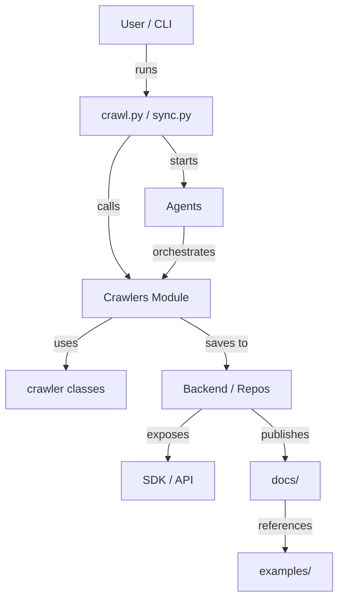
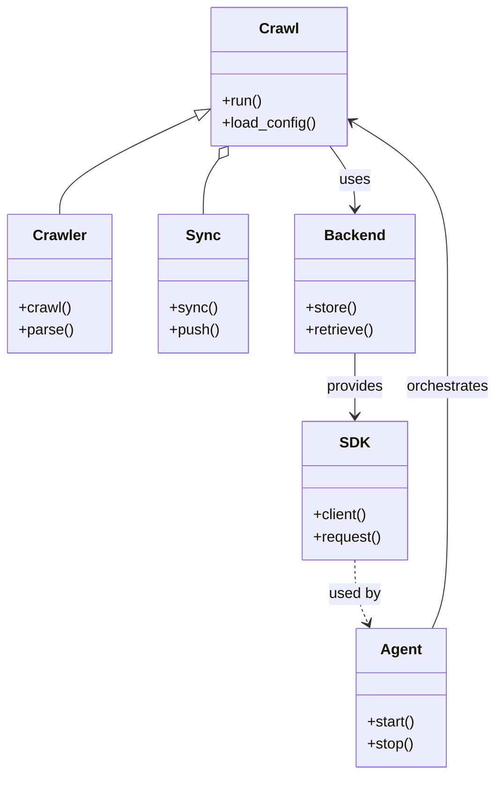
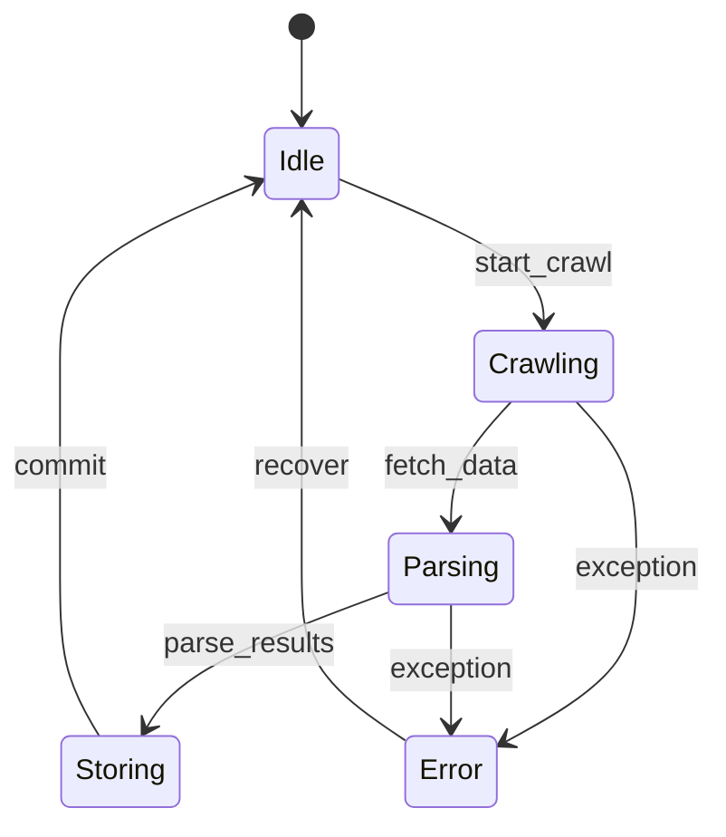
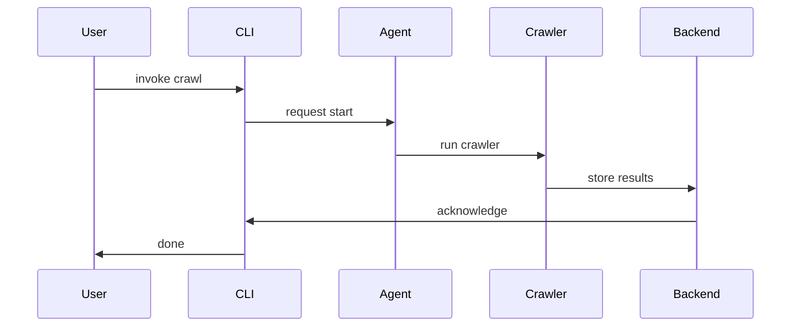
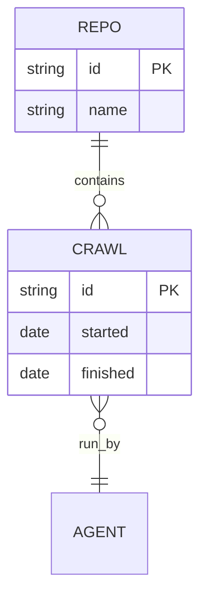
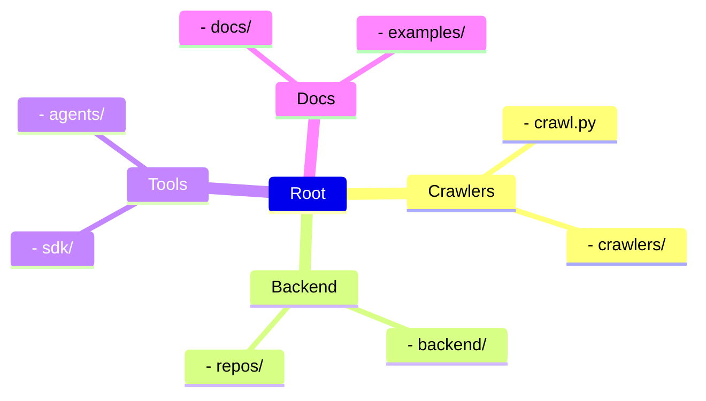

# Diagram: common/monitoring/config/config.dev2.yml

> Auto-generated by Obscura crawlers

## Diagram 1

### SVG

<svg id="container" width="477.69921875" xmlns="http://www.w3.org/2000/svg" class="flowchart" height="838" viewBox="0 0 477.69921875 838" role="graphics-document document" aria-roledescription="flowchart-v2"><g><marker id="container_flowchart-v2-pointEnd" class="marker flowchart-v2" viewBox="0 0 10 10" refX="5" refY="5" markerUnits="userSpaceOnUse" markerWidth="8" markerHeight="8" orient="auto"><path d="M 0 0 L 10 5 L 0 10 z" class="arrowMarkerPath" style="stroke-width: 1; stroke-dasharray: 1, 0;"></path></marker><marker id="container_flowchart-v2-pointStart" class="marker flowchart-v2" viewBox="0 0 10 10" refX="4.5" refY="5" markerUnits="userSpaceOnUse" markerWidth="8" markerHeight="8" orient="auto"><path d="M 0 5 L 10 10 L 10 0 z" class="arrowMarkerPath" style="stroke-width: 1; stroke-dasharray: 1, 0;"></path></marker><marker id="container_flowchart-v2-circleEnd" class="marker flowchart-v2" viewBox="0 0 10 10" refX="11" refY="5" markerUnits="userSpaceOnUse" markerWidth="11" markerHeight="11" orient="auto"><circle cx="5" cy="5" r="5" class="arrowMarkerPath" style="stroke-width: 1; stroke-dasharray: 1, 0;"></circle></marker><marker id="container_flowchart-v2-circleStart" class="marker flowchart-v2" viewBox="0 0 10 10" refX="-1" refY="5" markerUnits="userSpaceOnUse" markerWidth="11" markerHeight="11" orient="auto"><circle cx="5" cy="5" r="5" class="arrowMarkerPath" style="stroke-width: 1; stroke-dasharray: 1, 0;"></circle></marker><marker id="container_flowchart-v2-crossEnd" class="marker cross flowchart-v2" viewBox="0 0 11 11" refX="12" refY="5.2" markerUnits="userSpaceOnUse" markerWidth="11" markerHeight="11" orient="auto"><path d="M 1,1 l 9,9 M 10,1 l -9,9" class="arrowMarkerPath" style="stroke-width: 2; stroke-dasharray: 1, 0;"></path></marker><marker id="container_flowchart-v2-crossStart" class="marker cross flowchart-v2" viewBox="0 0 11 11" refX="-1" refY="5.2" markerUnits="userSpaceOnUse" markerWidth="11" markerHeight="11" orient="auto"><path d="M 1,1 l 9,9 M 10,1 l -9,9" class="arrowMarkerPath" style="stroke-width: 2; stroke-dasharray: 1, 0;"></path></marker><g class="root"><g class="clusters"></g><g class="edgePaths"><path d="M205.438,62L205.438,68.167C205.438,74.333,205.438,86.667,205.438,98.333C205.438,110,205.438,121,205.438,126.5L205.438,132" id="L_User_CLI_0" class="edge-thickness-normal edge-pattern-solid edge-thickness-normal edge-pattern-solid flowchart-link" style=";" data-edge="true" data-et="edge" data-id="L_User_CLI_0" data-points="W3sieCI6MjA1LjQzNzUsInkiOjYyfSx7IngiOjIwNS40Mzc1LCJ5Ijo5OX0seyJ4IjoyMDUuNDM3NSwieSI6MTM2fV0=" marker-end="url(#container_flowchart-v2-pointEnd)"></path><path d="M183.134,190L178.04,196.167C172.946,202.333,162.758,214.667,157.664,231.5C152.57,248.333,152.57,269.667,152.57,291C152.57,312.333,152.57,333.667,157.24,349.986C161.909,366.305,171.248,377.611,175.917,383.263L180.587,388.916" id="L_CLI_Crawlers_0" class="edge-thickness-normal edge-pattern-solid edge-thickness-normal edge-pattern-solid flowchart-link" style=";" data-edge="true" data-et="edge" data-id="L_CLI_Crawlers_0" data-points="W3sieCI6MTgzLjEzNDE1NTI3MzQzNzUsInkiOjE5MH0seyJ4IjoxNTIuNTcwMzEyNSwieSI6MjI3fSx7IngiOjE1Mi41NzAzMTI1LCJ5IjoyOTF9LHsieCI6MTUyLjU3MDMxMjUsInkiOjM1NX0seyJ4IjoxODMuMTM0MTU1MjczNDM3NSwieSI6MzkyfV0=" marker-end="url(#container_flowchart-v2-pointEnd)"></path><path d="M157.769,446L146.882,452.167C135.994,458.333,114.22,470.667,103.333,482.333C92.445,494,92.445,505,92.445,510.5L92.445,516" id="L_Crawlers_Crawler_0" class="edge-thickness-normal edge-pattern-solid edge-thickness-normal edge-pattern-solid flowchart-link" style=";" data-edge="true" data-et="edge" data-id="L_Crawlers_Crawler_0" data-points="W3sieCI6MTU3Ljc2ODkyMDg5ODQzNzUsInkiOjQ0Nn0seyJ4Ijo5Mi40NDUzMTI1LCJ5Ijo0ODN9LHsieCI6OTIuNDQ1MzEyNSwieSI6NTIwfV0=" marker-end="url(#container_flowchart-v2-pointEnd)"></path><path d="M253.106,446L263.993,452.167C274.881,458.333,296.655,470.667,307.542,482.333C318.43,494,318.43,505,318.43,510.5L318.43,516" id="L_Crawlers_Backend_0" class="edge-thickness-normal edge-pattern-solid edge-thickness-normal edge-pattern-solid flowchart-link" style=";" data-edge="true" data-et="edge" data-id="L_Crawlers_Backend_0" data-points="W3sieCI6MjUzLjEwNjA3OTEwMTU2MjUsInkiOjQ0Nn0seyJ4IjozMTguNDI5Njg3NSwieSI6NDgzfSx7IngiOjMxOC40Mjk2ODc1LCJ5Ijo1MjB9XQ==" marker-end="url(#container_flowchart-v2-pointEnd)"></path><path d="M283.541,574L275.573,580.167C267.604,586.333,251.667,598.667,243.699,610.333C235.73,622,235.73,633,235.73,638.5L235.73,644" id="L_Backend_SDK_0" class="edge-thickness-normal edge-pattern-solid edge-thickness-normal edge-pattern-solid flowchart-link" style=";" data-edge="true" data-et="edge" data-id="L_Backend_SDK_0" data-points="W3sieCI6MjgzLjU0MDk1NDU4OTg0Mzc1LCJ5Ijo1NzR9LHsieCI6MjM1LjczMDQ2ODc1LCJ5Ijo2MTF9LHsieCI6MjM1LjczMDQ2ODc1LCJ5Ijo2NDh9XQ==" marker-end="url(#container_flowchart-v2-pointEnd)"></path><path d="M258.305,318L258.305,324.167C258.305,330.333,258.305,342.667,253.635,354.486C248.966,366.305,239.627,377.611,234.958,383.263L230.288,388.916" id="L_Agents_Crawlers_0" class="edge-thickness-normal edge-pattern-solid edge-thickness-normal edge-pattern-solid flowchart-link" style=";" data-edge="true" data-et="edge" data-id="L_Agents_Crawlers_0" data-points="W3sieCI6MjU4LjMwNDY4NzUsInkiOjMxOH0seyJ4IjoyNTguMzA0Njg3NSwieSI6MzU1fSx7IngiOjIyNy43NDA4NDQ3MjY1NjI1LCJ5IjozOTJ9XQ==" marker-end="url(#container_flowchart-v2-pointEnd)"></path><path d="M227.741,190L232.835,196.167C237.929,202.333,248.117,214.667,253.211,226.333C258.305,238,258.305,249,258.305,254.5L258.305,260" id="L_CLI_Agents_0" class="edge-thickness-normal edge-pattern-solid edge-thickness-normal edge-pattern-solid flowchart-link" style=";" data-edge="true" data-et="edge" data-id="L_CLI_Agents_0" data-points="W3sieCI6MjI3Ljc0MDg0NDcyNjU2MjUsInkiOjE5MH0seyJ4IjoyNTguMzA0Njg3NSwieSI6MjI3fSx7IngiOjI1OC4zMDQ2ODc1LCJ5IjoyNjR9XQ==" marker-end="url(#container_flowchart-v2-pointEnd)"></path><path d="M353.318,574L361.287,580.167C369.255,586.333,385.192,598.667,393.16,610.333C401.129,622,401.129,633,401.129,638.5L401.129,644" id="L_Backend_Docs_0" class="edge-thickness-normal edge-pattern-solid edge-thickness-normal edge-pattern-solid flowchart-link" style=";" data-edge="true" data-et="edge" data-id="L_Backend_Docs_0" data-points="W3sieCI6MzUzLjMxODQyMDQxMDE1NjI1LCJ5Ijo1NzR9LHsieCI6NDAxLjEyODkwNjI1LCJ5Ijo2MTF9LHsieCI6NDAxLjEyODkwNjI1LCJ5Ijo2NDh9XQ==" marker-end="url(#container_flowchart-v2-pointEnd)"></path><path d="M401.129,702L401.129,708.167C401.129,714.333,401.129,726.667,401.129,738.333C401.129,750,401.129,761,401.129,766.5L401.129,772" id="L_Docs_Examples_0" class="edge-thickness-normal edge-pattern-solid edge-thickness-normal edge-pattern-solid flowchart-link" style=";" data-edge="true" data-et="edge" data-id="L_Docs_Examples_0" data-points="W3sieCI6NDAxLjEyODkwNjI1LCJ5Ijo3MDJ9LHsieCI6NDAxLjEyODkwNjI1LCJ5Ijo3Mzl9LHsieCI6NDAxLjEyODkwNjI1LCJ5Ijo3NzZ9XQ==" marker-end="url(#container_flowchart-v2-pointEnd)"></path></g><g class="edgeLabels"><g class="edgeLabel" transform="translate(205.4375, 99)"><g class="label" data-id="L_User_CLI_0" transform="translate(-16.171875, -12)"><foreignObject width="32.34375" height="24">

runs

</foreignObject></g></g><g class="edgeLabel" transform="translate(152.5703125, 291)"><g class="label" data-id="L_CLI_Crawlers_0" transform="translate(-16.4453125, -12)"><foreignObject width="32.890625" height="24">

calls

</foreignObject></g></g><g class="edgeLabel" transform="translate(92.4453125, 483)"><g class="label" data-id="L_Crawlers_Crawler_0" transform="translate(-16.4921875, -12)"><foreignObject width="32.984375" height="24">

uses

</foreignObject></g></g><g class="edgeLabel" transform="translate(318.4296875, 483)"><g class="label" data-id="L_Crawlers_Backend_0" transform="translate(-29.453125, -12)"><foreignObject width="58.90625" height="24">

saves to

</foreignObject></g></g><g class="edgeLabel" transform="translate(235.73046875, 611)"><g class="label" data-id="L_Backend_SDK_0" transform="translate(-29.4296875, -12)"><foreignObject width="58.859375" height="24">

exposes

</foreignObject></g></g><g class="edgeLabel" transform="translate(258.3046875, 355)"><g class="label" data-id="L_Agents_Crawlers_0" transform="translate(-45.046875, -12)"><foreignObject width="90.09375" height="24">

orchestrates

</foreignObject></g></g><g class="edgeLabel" transform="translate(258.3046875, 227)"><g class="label" data-id="L_CLI_Agents_0" transform="translate(-20.6328125, -12)"><foreignObject width="41.265625" height="24">

starts

</foreignObject></g></g><g class="edgeLabel" transform="translate(401.12890625, 611)"><g class="label" data-id="L_Backend_Docs_0" transform="translate(-35.28125, -12)"><foreignObject width="70.5625" height="24">

publishes

</foreignObject></g></g><g class="edgeLabel" transform="translate(401.12890625, 739)"><g class="label" data-id="L_Docs_Examples_0" transform="translate(-37.828125, -12)"><foreignObject width="75.65625" height="24">

references

</foreignObject></g></g></g><g class="nodes"><g class="node default" id="flowchart-User-0" transform="translate(205.4375, 35)"><rect class="basic label-container" style="" x="-65.671875" y="-27" width="131.34375" height="54"></rect><g class="label" style="" transform="translate(-35.671875, -12)"><rect></rect><foreignObject width="71.34375" height="24">

User / CLI

</foreignObject></g></g><g class="node default" id="flowchart-CLI-1" transform="translate(205.4375, 163)"><rect class="basic label-container" style="" x="-94.7421875" y="-27" width="189.484375" height="54"></rect><g class="label" style="" transform="translate(-64.7421875, -12)"><rect></rect><foreignObject width="129.484375" height="24">

crawl.py / sync.py

</foreignObject></g></g><g class="node default" id="flowchart-Crawlers-3" transform="translate(205.4375, 419)"><rect class="basic label-container" style="" x="-89.7109375" y="-27" width="179.421875" height="54"></rect><g class="label" style="" transform="translate(-59.7109375, -12)"><rect></rect><foreignObject width="119.421875" height="24">

Crawlers Module

</foreignObject></g></g><g class="node default" id="flowchart-Crawler-5" transform="translate(92.4453125, 547)"><rect class="basic label-container" style="" x="-84.4453125" y="-27" width="168.890625" height="54"></rect><g class="label" style="" transform="translate(-54.4453125, -12)"><rect></rect><foreignObject width="108.890625" height="24">

crawler classes

</foreignObject></g></g><g class="node default" id="flowchart-Backend-7" transform="translate(318.4296875, 547)"><rect class="basic label-container" style="" x="-91.5390625" y="-27" width="183.078125" height="54"></rect><g class="label" style="" transform="translate(-61.5390625, -12)"><rect></rect><foreignObject width="123.078125" height="24">

Backend / Repos

</foreignObject></g></g><g class="node default" id="flowchart-SDK-9" transform="translate(235.73046875, 675)"><rect class="basic label-container" style="" x="-64.21875" y="-27" width="128.4375" height="54"></rect><g class="label" style="" transform="translate(-34.21875, -12)"><rect></rect><foreignObject width="68.4375" height="24">

SDK / API

</foreignObject></g></g><g class="node default" id="flowchart-Agents-10" transform="translate(258.3046875, 291)"><rect class="basic label-container" style="" x="-54.2890625" y="-27" width="108.578125" height="54"></rect><g class="label" style="" transform="translate(-24.2890625, -12)"><rect></rect><foreignObject width="48.578125" height="24">

Agents

</foreignObject></g></g><g class="node default" id="flowchart-Docs-15" transform="translate(401.12890625, 675)"><rect class="basic label-container" style="" x="-51.1796875" y="-27" width="102.359375" height="54"></rect><g class="label" style="" transform="translate(-21.1796875, -12)"><rect></rect><foreignObject width="42.359375" height="24">

docs/

</foreignObject></g></g><g class="node default" id="flowchart-Examples-17" transform="translate(401.12890625, 803)"><rect class="basic label-container" style="" x="-68.5703125" y="-27" width="137.140625" height="54"></rect><g class="label" style="" transform="translate(-38.5703125, -12)"><rect></rect><foreignObject width="77.140625" height="24">

examples/

</foreignObject></g></g></g></g></g></svg>

## Diagram 2

### SVG

<svg id="container" width="531.15625" xmlns="http://www.w3.org/2000/svg" class="classDiagram" height="838" viewBox="0 0 531.15625 838" role="graphics-document document" aria-roledescription="class"><g><defs><marker id="container_class-aggregationStart" class="marker aggregation class" refX="18" refY="7" markerWidth="190" markerHeight="240" orient="auto"><path d="M 18,7 L9,13 L1,7 L9,1 Z"></path></marker></defs><defs><marker id="container_class-aggregationEnd" class="marker aggregation class" refX="1" refY="7" markerWidth="20" markerHeight="28" orient="auto"><path d="M 18,7 L9,13 L1,7 L9,1 Z"></path></marker></defs><defs><marker id="container_class-extensionStart" class="marker extension class" refX="18" refY="7" markerWidth="190" markerHeight="240" orient="auto"><path d="M 1,7 L18,13 V 1 Z"></path></marker></defs><defs><marker id="container_class-extensionEnd" class="marker extension class" refX="1" refY="7" markerWidth="20" markerHeight="28" orient="auto"><path d="M 1,1 V 13 L18,7 Z"></path></marker></defs><defs><marker id="container_class-compositionStart" class="marker composition class" refX="18" refY="7" markerWidth="190" markerHeight="240" orient="auto"><path d="M 18,7 L9,13 L1,7 L9,1 Z"></path></marker></defs><defs><marker id="container_class-compositionEnd" class="marker composition class" refX="1" refY="7" markerWidth="20" markerHeight="28" orient="auto"><path d="M 18,7 L9,13 L1,7 L9,1 Z"></path></marker></defs><defs><marker id="container_class-dependencyStart" class="marker dependency class" refX="6" refY="7" markerWidth="190" markerHeight="240" orient="auto"><path d="M 5,7 L9,13 L1,7 L9,1 Z"></path></marker></defs><defs><marker id="container_class-dependencyEnd" class="marker dependency class" refX="13" refY="7" markerWidth="20" markerHeight="28" orient="auto"><path d="M 18,7 L9,13 L14,7 L9,1 Z"></path></marker></defs><defs><marker id="container_class-lollipopStart" class="marker lollipop class" refX="13" refY="7" markerWidth="190" markerHeight="240" orient="auto"><circle stroke="black" fill="transparent" cx="7" cy="7" r="6"></circle></marker></defs><defs><marker id="container_class-lollipopEnd" class="marker lollipop class" refX="1" refY="7" markerWidth="190" markerHeight="240" orient="auto"><circle stroke="black" fill="transparent" cx="7" cy="7" r="6"></circle></marker></defs><g class="root"><g class="clusters"></g><g class="edgePaths"><path d="M208.414,125.436L184.201,137.03C159.987,148.624,111.56,171.812,87.346,189.573C63.133,207.333,63.133,219.667,63.133,225.833L63.133,232" id="id_Crawl_Crawler_1" class="edge-thickness-normal edge-pattern-solid relation" style=";;;" data-edge="true" data-et="edge" data-id="id_Crawl_Crawler_1" data-points="W3sieCI6MjIzLjk3MjY1NjI1LCJ5IjoxMTcuOTg1OTcxOTQzODg3Nzh9LHsieCI6NjMuMTMyODEyNSwieSI6MTk1fSx7IngiOjYzLjEzMjgxMjUsInkiOjIzMn1d" marker-start="url(#container_class-extensionStart)"></path><path d="M232.531,171.965L229.747,175.804C226.963,179.643,221.396,187.322,218.612,197.328C215.828,207.333,215.828,219.667,215.828,225.833L215.828,232" id="id_Crawl_Sync_2" class="edge-thickness-normal edge-pattern-solid relation" style=";;;" data-edge="true" data-et="edge" data-id="id_Crawl_Sync_2" data-points="W3sieCI6MjQyLjY1NjczODI4MTI1LCJ5IjoxNTh9LHsieCI6MjE1LjgyODEyNSwieSI6MTk1fSx7IngiOjIxNS44MjgxMjUsInkiOjIzMn1d" marker-start="url(#container_class-aggregationStart)"></path><path d="M351.421,158L355.893,164.167C360.364,170.333,369.307,182.667,373.779,194C378.25,205.333,378.25,215.667,378.25,220.833L378.25,226" id="id_Crawl_Backend_3" class="edge-thickness-normal edge-pattern-solid relation" style=";;;" data-edge="true" data-et="edge" data-id="id_Crawl_Backend_3" data-points="W3sieCI6MzUxLjQyMTM4NjcxODc1LCJ5IjoxNTh9LHsieCI6Mzc4LjI1LCJ5IjoxOTV9LHsieCI6Mzc4LjI1LCJ5IjoyMzJ9XQ==" marker-end="url(#container_class-dependencyEnd)"></path><path d="M461.615,680L464.364,673.833C467.113,667.667,472.611,655.333,475.36,630.5C478.109,605.667,478.109,568.333,478.109,531C478.109,493.667,478.109,456.333,478.109,419C478.109,381.667,478.109,344.333,478.109,307C478.109,269.667,478.109,232.333,460.959,203.059C443.809,173.784,409.509,152.567,392.358,141.959L375.208,131.351" id="id_Agent_Crawl_4" class="edge-thickness-normal edge-pattern-solid relation" style=";;;" data-edge="true" data-et="edge" data-id="id_Agent_Crawl_4" data-points="W3sieCI6NDYxLjYxNDc0NjA5Mzc1LCJ5Ijo2ODB9LHsieCI6NDc4LjEwOTM3NSwieSI6NjQzfSx7IngiOjQ3OC4xMDkzNzUsInkiOjUzMX0seyJ4Ijo0NzguMTA5Mzc1LCJ5Ijo0MTl9LHsieCI6NDc4LjEwOTM3NSwieSI6MzA3fSx7IngiOjQ3OC4xMDkzNzUsInkiOjE5NX0seyJ4IjozNzAuMTA1NDY4NzUsInkiOjEyOC4xOTQ4MDUxOTQ4MDUyfV0=" marker-end="url(#container_class-dependencyEnd)"></path><path d="M378.25,382L378.25,388.167C378.25,394.333,378.25,406.667,378.25,418C378.25,429.333,378.25,439.667,378.25,444.833L378.25,450" id="id_Backend_SDK_5" class="edge-thickness-normal edge-pattern-solid relation" style=";;;" data-edge="true" data-et="edge" data-id="id_Backend_SDK_5" data-points="W3sieCI6Mzc4LjI1LCJ5IjozODJ9LHsieCI6Mzc4LjI1LCJ5Ijo0MTl9LHsieCI6Mzc4LjI1LCJ5Ijo0NTZ9XQ==" marker-end="url(#container_class-dependencyEnd)"></path><path d="M378.25,606L378.25,612.167C378.25,618.333,378.25,630.667,380.592,642.087C382.934,653.507,387.618,664.013,389.96,669.267L392.302,674.52" id="id_SDK_Agent_6" class="edge-thickness-normal edge-pattern-dashed relation" style=";;;" data-edge="true" data-et="edge" data-id="id_SDK_Agent_6" data-points="W3sieCI6Mzc4LjI1LCJ5Ijo2MDZ9LHsieCI6Mzc4LjI1LCJ5Ijo2NDN9LHsieCI6Mzk0Ljc0NDYyODkwNjI1LCJ5Ijo2ODB9XQ==" marker-end="url(#container_class-dependencyEnd)"></path></g><g class="edgeLabels"><g class="edgeLabel"><g class="label" data-id="id_Crawl_Crawler_1" transform="translate(0, 0)"><foreignObject width="0" height="0">

</foreignObject></g></g><g class="edgeLabel"><g class="label" data-id="id_Crawl_Sync_2" transform="translate(0, 0)"><foreignObject width="0" height="0">

</foreignObject></g></g><g class="edgeLabel" transform="translate(378.25, 195)"><g class="label" data-id="id_Crawl_Backend_3" transform="translate(-16.4921875, -12)"><foreignObject width="32.984375" height="24">

uses

</foreignObject></g></g><g class="edgeLabel" transform="translate(478.109375, 419)"><g class="label" data-id="id_Agent_Crawl_4" transform="translate(-45.046875, -12)"><foreignObject width="90.09375" height="24">

orchestrates

</foreignObject></g></g><g class="edgeLabel" transform="translate(378.25, 419)"><g class="label" data-id="id_Backend_SDK_5" transform="translate(-31.3125, -12)"><foreignObject width="62.625" height="24">

provides

</foreignObject></g></g><g class="edgeLabel" transform="translate(378.25, 643)"><g class="label" data-id="id_SDK_Agent_6" transform="translate(-28.3125, -12)"><foreignObject width="56.625" height="24">

used by

</foreignObject></g></g></g><g class="nodes"><g class="node default" id="classId-Crawl-0" transform="translate(297.0390625, 83)"><g class="basic label-container"><path d="M-73.06640625 -75 L73.06640625 -75 L73.06640625 75 L-73.06640625 75" stroke="none" stroke-width="0" fill="#ECECFF" style=""></path><path d="M-73.06640625 -75 C-43.78854503075712 -75, -14.510683811514241 -75, 73.06640625 -75 M-73.06640625 -75 C-35.03303268447822 -75, 3.000340881043556 -75, 73.06640625 -75 M73.06640625 -75 C73.06640625 -27.74851624892829, 73.06640625 19.50296750214342, 73.06640625 75 M73.06640625 -75 C73.06640625 -22.04927616719339, 73.06640625 30.90144766561322, 73.06640625 75 M73.06640625 75 C39.04094566128634 75, 5.015485072572673 75, -73.06640625 75 M73.06640625 75 C27.790610533055983 75, -17.485185183888035 75, -73.06640625 75 M-73.06640625 75 C-73.06640625 38.69015507094347, -73.06640625 2.3803101418869375, -73.06640625 -75 M-73.06640625 75 C-73.06640625 32.49565025071259, -73.06640625 -10.008699498574813, -73.06640625 -75" stroke="#9370DB" stroke-width="1.3" fill="none" stroke-dasharray="0 0" style=""></path></g><g class="annotation-group text" transform="translate(0, -51)"></g><g class="label-group text" transform="translate(-20.1484375, -51)"><g class="label" style="font-weight: bolder" transform="translate(0,-12)"><foreignObject width="40.296875" height="24">

Crawl

</foreignObject></g></g><g class="members-group text" transform="translate(-61.06640625, -3)"></g><g class="methods-group text" transform="translate(-61.06640625, 27)"><g class="label" style="" transform="translate(0,-12)"><foreignObject width="43.21875" height="24">

+run()

</foreignObject></g><g class="label" style="" transform="translate(0,12)"><foreignObject width="101.984375" height="24">

+load_config()

</foreignObject></g></g><g class="divider" style=""><path d="M-73.06640625 -27 C-36.794210572921834 -27, -0.5220148958436681 -27, 73.06640625 -27 M-73.06640625 -27 C-19.202417687384234 -27, 34.66157087523153 -27, 73.06640625 -27" stroke="#9370DB" stroke-width="1.3" fill="none" stroke-dasharray="0 0" style=""></path></g><g class="divider" style=""><path d="M-73.06640625 -3 C-34.856790845507504 -3, 3.3528245589849917 -3, 73.06640625 -3 M-73.06640625 -3 C-32.94835409261163 -3, 7.169698064776739 -3, 73.06640625 -3" stroke="#9370DB" stroke-width="1.3" fill="none" stroke-dasharray="0 0" style=""></path></g></g><g class="node default" id="classId-Crawler-1" transform="translate(63.1328125, 307)"><g class="basic label-container"><path d="M-55.1328125 -75 L55.1328125 -75 L55.1328125 75 L-55.1328125 75" stroke="none" stroke-width="0" fill="#ECECFF" style=""></path><path d="M-55.1328125 -75 C-15.661145740849278 -75, 23.810521018301444 -75, 55.1328125 -75 M-55.1328125 -75 C-15.937053313893955 -75, 23.25870587221209 -75, 55.1328125 -75 M55.1328125 -75 C55.1328125 -23.123119465108275, 55.1328125 28.75376106978345, 55.1328125 75 M55.1328125 -75 C55.1328125 -30.243905670852307, 55.1328125 14.512188658295386, 55.1328125 75 M55.1328125 75 C29.48891857067679 75, 3.8450246413535822 75, -55.1328125 75 M55.1328125 75 C13.208347663821364 75, -28.716117172357272 75, -55.1328125 75 M-55.1328125 75 C-55.1328125 36.256641927085525, -55.1328125 -2.48671614582895, -55.1328125 -75 M-55.1328125 75 C-55.1328125 19.792980166576385, -55.1328125 -35.41403966684723, -55.1328125 -75" stroke="#9370DB" stroke-width="1.3" fill="none" stroke-dasharray="0 0" style=""></path></g><g class="annotation-group text" transform="translate(0, -51)"></g><g class="label-group text" transform="translate(-27.734375, -51)"><g class="label" style="font-weight: bolder" transform="translate(0,-12)"><foreignObject width="55.46875" height="24">

Crawler

</foreignObject></g></g><g class="members-group text" transform="translate(-43.1328125, -3)"></g><g class="methods-group text" transform="translate(-43.1328125, 27)"><g class="label" style="" transform="translate(0,-12)"><foreignObject width="56.40625" height="24">

+crawl()

</foreignObject></g><g class="label" style="" transform="translate(0,12)"><foreignObject width="58.53125" height="24">

+parse()

</foreignObject></g></g><g class="divider" style=""><path d="M-55.1328125 -27 C-16.5267267396437 -27, 22.0793590207126 -27, 55.1328125 -27 M-55.1328125 -27 C-14.288839225621132 -27, 26.555134048757736 -27, 55.1328125 -27" stroke="#9370DB" stroke-width="1.3" fill="none" stroke-dasharray="0 0" style=""></path></g><g class="divider" style=""><path d="M-55.1328125 -3 C-32.664633405175756 -3, -10.196454310351513 -3, 55.1328125 -3 M-55.1328125 -3 C-28.43929234818592 -3, -1.7457721963718384 -3, 55.1328125 -3" stroke="#9370DB" stroke-width="1.3" fill="none" stroke-dasharray="0 0" style=""></path></g></g><g class="node default" id="classId-Sync-2" transform="translate(215.828125, 307)"><g class="basic label-container"><path d="M-47.5625 -75 L47.5625 -75 L47.5625 75 L-47.5625 75" stroke="none" stroke-width="0" fill="#ECECFF" style=""></path><path d="M-47.5625 -75 C-19.262760231530383 -75, 9.036979536939235 -75, 47.5625 -75 M-47.5625 -75 C-12.216834275239052 -75, 23.128831449521897 -75, 47.5625 -75 M47.5625 -75 C47.5625 -19.1544032106922, 47.5625 36.6911935786156, 47.5625 75 M47.5625 -75 C47.5625 -25.835601369290636, 47.5625 23.32879726141873, 47.5625 75 M47.5625 75 C19.66021988457815 75, -8.242060230843698 75, -47.5625 75 M47.5625 75 C24.03445364732318 75, 0.5064072946463583 75, -47.5625 75 M-47.5625 75 C-47.5625 41.54978476737969, -47.5625 8.099569534759382, -47.5625 -75 M-47.5625 75 C-47.5625 34.89790789127484, -47.5625 -5.204184217450319, -47.5625 -75" stroke="#9370DB" stroke-width="1.3" fill="none" stroke-dasharray="0 0" style=""></path></g><g class="annotation-group text" transform="translate(0, -51)"></g><g class="label-group text" transform="translate(-17.09375, -51)"><g class="label" style="font-weight: bolder" transform="translate(0,-12)"><foreignObject width="34.1875" height="24">

Sync

</foreignObject></g></g><g class="members-group text" transform="translate(-35.5625, -3)"></g><g class="methods-group text" transform="translate(-35.5625, 27)"><g class="label" style="" transform="translate(0,-12)"><foreignObject width="50.453125" height="24">

+sync()

</foreignObject></g><g class="label" style="" transform="translate(0,12)"><foreignObject width="54.03125" height="24">

+push()

</foreignObject></g></g><g class="divider" style=""><path d="M-47.5625 -27 C-26.293368921390037 -27, -5.0242378427800745 -27, 47.5625 -27 M-47.5625 -27 C-10.83475856863378 -27, 25.89298286273244 -27, 47.5625 -27" stroke="#9370DB" stroke-width="1.3" fill="none" stroke-dasharray="0 0" style=""></path></g><g class="divider" style=""><path d="M-47.5625 -3 C-14.14782864225753 -3, 19.26684271548494 -3, 47.5625 -3 M-47.5625 -3 C-20.417922079493486 -3, 6.726655841013027 -3, 47.5625 -3" stroke="#9370DB" stroke-width="1.3" fill="none" stroke-dasharray="0 0" style=""></path></g></g><g class="node default" id="classId-Backend-3" transform="translate(378.25, 307)"><g class="basic label-container"><path d="M-64.859375 -75 L64.859375 -75 L64.859375 75 L-64.859375 75" stroke="none" stroke-width="0" fill="#ECECFF" style=""></path><path d="M-64.859375 -75 C-29.006255579266053 -75, 6.8468638414678935 -75, 64.859375 -75 M-64.859375 -75 C-23.756382875334083 -75, 17.346609249331834 -75, 64.859375 -75 M64.859375 -75 C64.859375 -35.19365113225882, 64.859375 4.612697735482357, 64.859375 75 M64.859375 -75 C64.859375 -32.55362692152974, 64.859375 9.892746156940518, 64.859375 75 M64.859375 75 C35.22614416446666 75, 5.592913328933321 75, -64.859375 75 M64.859375 75 C21.72190847545945 75, -21.4155580490811 75, -64.859375 75 M-64.859375 75 C-64.859375 43.15732820430546, -64.859375 11.314656408610915, -64.859375 -75 M-64.859375 75 C-64.859375 25.305367946197585, -64.859375 -24.38926410760483, -64.859375 -75" stroke="#9370DB" stroke-width="1.3" fill="none" stroke-dasharray="0 0" style=""></path></g><g class="annotation-group text" transform="translate(0, -51)"></g><g class="label-group text" transform="translate(-31.296875, -51)"><g class="label" style="font-weight: bolder" transform="translate(0,-12)"><foreignObject width="62.59375" height="24">

Backend

</foreignObject></g></g><g class="members-group text" transform="translate(-52.859375, -3)"></g><g class="methods-group text" transform="translate(-52.859375, 27)"><g class="label" style="" transform="translate(0,-12)"><foreignObject width="55.125" height="24">

+store()

</foreignObject></g><g class="label" style="" transform="translate(0,12)"><foreignObject width="74.421875" height="24">

+retrieve()

</foreignObject></g></g><g class="divider" style=""><path d="M-64.859375 -27 C-34.1190690373532 -27, -3.3787630747063915 -27, 64.859375 -27 M-64.859375 -27 C-23.607128944107238 -27, 17.645117111785524 -27, 64.859375 -27" stroke="#9370DB" stroke-width="1.3" fill="none" stroke-dasharray="0 0" style=""></path></g><g class="divider" style=""><path d="M-64.859375 -3 C-29.58850304519136 -3, 5.682368909617281 -3, 64.859375 -3 M-64.859375 -3 C-34.4361731332812 -3, -4.012971266562403 -3, 64.859375 -3" stroke="#9370DB" stroke-width="1.3" fill="none" stroke-dasharray="0 0" style=""></path></g></g><g class="node default" id="classId-Agent-4" transform="translate(428.1796875, 755)"><g class="basic label-container"><path d="M-48.6171875 -75 L48.6171875 -75 L48.6171875 75 L-48.6171875 75" stroke="none" stroke-width="0" fill="#ECECFF" style=""></path><path d="M-48.6171875 -75 C-28.86116383385247 -75, -9.105140167704938 -75, 48.6171875 -75 M-48.6171875 -75 C-26.161653819881533 -75, -3.7061201397630654 -75, 48.6171875 -75 M48.6171875 -75 C48.6171875 -37.12071778201072, 48.6171875 0.7585644359785562, 48.6171875 75 M48.6171875 -75 C48.6171875 -20.544765265701386, 48.6171875 33.91046946859723, 48.6171875 75 M48.6171875 75 C14.040257607677972 75, -20.536672284644055 75, -48.6171875 75 M48.6171875 75 C12.440813788375905 75, -23.73555992324819 75, -48.6171875 75 M-48.6171875 75 C-48.6171875 44.61138811466641, -48.6171875 14.222776229332823, -48.6171875 -75 M-48.6171875 75 C-48.6171875 39.49300213468256, -48.6171875 3.986004269365125, -48.6171875 -75" stroke="#9370DB" stroke-width="1.3" fill="none" stroke-dasharray="0 0" style=""></path></g><g class="annotation-group text" transform="translate(0, -51)"></g><g class="label-group text" transform="translate(-21.078125, -51)"><g class="label" style="font-weight: bolder" transform="translate(0,-12)"><foreignObject width="42.15625" height="24">

Agent

</foreignObject></g></g><g class="members-group text" transform="translate(-36.6171875, -3)"></g><g class="methods-group text" transform="translate(-36.6171875, 27)"><g class="label" style="" transform="translate(0,-12)"><foreignObject width="52.15625" height="24">

+start()

</foreignObject></g><g class="label" style="" transform="translate(0,12)"><foreignObject width="50.21875" height="24">

+stop()

</foreignObject></g></g><g class="divider" style=""><path d="M-48.6171875 -27 C-19.35885747238964 -27, 9.899472555220719 -27, 48.6171875 -27 M-48.6171875 -27 C-26.835477906595322 -27, -5.053768313190645 -27, 48.6171875 -27" stroke="#9370DB" stroke-width="1.3" fill="none" stroke-dasharray="0 0" style=""></path></g><g class="divider" style=""><path d="M-48.6171875 -3 C-18.821539517798257 -3, 10.974108464403486 -3, 48.6171875 -3 M-48.6171875 -3 C-15.36525067163786 -3, 17.88668615672428 -3, 48.6171875 -3" stroke="#9370DB" stroke-width="1.3" fill="none" stroke-dasharray="0 0" style=""></path></g></g><g class="node default" id="classId-SDK-5" transform="translate(378.25, 531)"><g class="basic label-container"><path d="M-56.23828125 -75 L56.23828125 -75 L56.23828125 75 L-56.23828125 75" stroke="none" stroke-width="0" fill="#ECECFF" style=""></path><path d="M-56.23828125 -75 C-26.88719776951157 -75, 2.463885710976861 -75, 56.23828125 -75 M-56.23828125 -75 C-14.070505707417027 -75, 28.097269835165946 -75, 56.23828125 -75 M56.23828125 -75 C56.23828125 -28.86254366007112, 56.23828125 17.274912679857763, 56.23828125 75 M56.23828125 -75 C56.23828125 -21.496183360197243, 56.23828125 32.007633279605514, 56.23828125 75 M56.23828125 75 C30.56829244798019 75, 4.898303645960382 75, -56.23828125 75 M56.23828125 75 C29.478300614324336 75, 2.7183199786486725 75, -56.23828125 75 M-56.23828125 75 C-56.23828125 32.198208935202, -56.23828125 -10.603582129596006, -56.23828125 -75 M-56.23828125 75 C-56.23828125 23.2514153103345, -56.23828125 -28.497169379330998, -56.23828125 -75" stroke="#9370DB" stroke-width="1.3" fill="none" stroke-dasharray="0 0" style=""></path></g><g class="annotation-group text" transform="translate(0, -51)"></g><g class="label-group text" transform="translate(-14.8515625, -51)"><g class="label" style="font-weight: bolder" transform="translate(0,-12)"><foreignObject width="29.703125" height="24">

SDK

</foreignObject></g></g><g class="members-group text" transform="translate(-44.23828125, -3)"></g><g class="methods-group text" transform="translate(-44.23828125, 27)"><g class="label" style="" transform="translate(0,-12)"><foreignObject width="59.078125" height="24">

+client()

</foreignObject></g><g class="label" style="" transform="translate(0,12)"><foreignObject width="73.625" height="24">

+request()

</foreignObject></g></g><g class="divider" style=""><path d="M-56.23828125 -27 C-16.94119599630237 -27, 22.355889257395262 -27, 56.23828125 -27 M-56.23828125 -27 C-12.487314515392285 -27, 31.26365221921543 -27, 56.23828125 -27" stroke="#9370DB" stroke-width="1.3" fill="none" stroke-dasharray="0 0" style=""></path></g><g class="divider" style=""><path d="M-56.23828125 -3 C-22.09342590925911 -3, 12.051429431481779 -3, 56.23828125 -3 M-56.23828125 -3 C-32.71438453742084 -3, -9.190487824841675 -3, 56.23828125 -3" stroke="#9370DB" stroke-width="1.3" fill="none" stroke-dasharray="0 0" style=""></path></g></g></g></g></g></svg>

## Diagram 3

### SVG

<svg id="container" width="406.078125" xmlns="http://www.w3.org/2000/svg" class="statediagram" height="462" viewBox="0 0 406.078125 462" role="graphics-document document" aria-roledescription="stateDiagram"><g><defs><marker id="container_stateDiagram-barbEnd" refX="19" refY="7" markerWidth="20" markerHeight="14" markerUnits="userSpaceOnUse" orient="auto"><path d="M 19,7 L9,13 L14,7 L9,1 Z"></path></marker></defs><g class="root"><g class="clusters"></g><g class="edgePaths"><path d="M172.508,22L172.508,26.167C172.508,30.333,172.508,38.667,172.591,47.083C172.674,55.5,172.841,64,172.924,68.25L173.008,72.5" id="edge0" class="edge-thickness-normal edge-pattern-solid transition" style="fill:none;;;fill:none" data-edge="true" data-et="edge" data-id="edge0" data-points="W3sieCI6MTcyLjUwNzgxMjUsInkiOjIyfSx7IngiOjE3Mi41MDc4MTI1LCJ5Ijo0N30seyJ4IjoxNzMuMDA3ODEyNSwieSI6NzIuNX1d" marker-end="url(#container_stateDiagram-barbEnd)"></path><path d="M194.82,101.522L214.07,109.435C233.319,117.348,271.818,133.174,291.15,147.337C310.483,161.5,310.65,174,310.733,180.25L310.816,186.5" id="edge1" class="edge-thickness-normal edge-pattern-solid transition" style="fill:none;;;fill:none" data-edge="true" data-et="edge" data-id="edge1" data-points="W3sieCI6MTk0LjgyMDMxMjUsInkiOjEwMS41MjIwMjQ0MzM3OTkxNX0seyJ4IjozMTAuMzE2NDA2MjUsInkiOjE0OX0seyJ4IjozMTAuODE2NDA2MjUsInkiOjE4Ni41fV0=" marker-end="url(#container_stateDiagram-barbEnd)"></path><path d="M292.438,226.5L286.688,232.583C280.938,238.667,269.438,250.833,263.771,263.167C258.104,275.5,258.271,288,258.354,294.25L258.438,300.5" id="edge2" class="edge-thickness-normal edge-pattern-solid transition" style="fill:none;;;fill:none" data-edge="true" data-et="edge" data-id="edge2" data-points="W3sieCI6MjkyLjQzNzg0MjY1MzUwODc3LCJ5IjoyMjYuNX0seyJ4IjoyNTcuOTM3NSwieSI6MjYzfSx7IngiOjI1OC40Mzc1LCJ5IjozMDAuNX1d" marker-end="url(#container_stateDiagram-barbEnd)"></path><path d="M224.063,333.216L204.027,340.513C183.992,347.811,143.922,362.405,120.256,375.953C96.591,389.5,89.329,402,85.699,408.25L82.068,414.5" id="edge3" class="edge-thickness-normal edge-pattern-solid transition" style="fill:none;;;fill:none" data-edge="true" data-et="edge" data-id="edge3" data-points="W3sieCI6MjI0LjA2MjUsInkiOjMzMy4yMTYxMTgyMzc1OTA2NX0seyJ4IjoxMDMuODUxNTYyNSwieSI6Mzc3fSx7IngiOjgyLjA2ODM5MzY0MDM1MDg4LCJ5Ijo0MTQuNX1d" marker-end="url(#container_stateDiagram-barbEnd)"></path><path d="M57.978,414.5L54.181,408.25C50.384,402,42.79,389.5,38.993,373.75C35.195,358,35.195,339,35.195,320C35.195,301,35.195,282,35.195,263C35.195,244,35.195,225,35.195,206C35.195,187,35.195,168,54.529,150.592C73.862,133.185,112.529,117.37,131.862,109.462L151.195,101.555" id="edge4" class="edge-thickness-normal edge-pattern-solid transition" style="fill:none;;;fill:none" data-edge="true" data-et="edge" data-id="edge4" data-points="W3sieCI6NTcuOTc4NDgxMzU5NjQ5MTIsInkiOjQxNC41fSx7IngiOjM1LjE5NTMxMjUsInkiOjM3N30seyJ4IjozNS4xOTUzMTI1LCJ5IjozMjB9LHsieCI6MzUuMTk1MzEyNSwieSI6MjYzfSx7IngiOjM1LjE5NTMxMjUsInkiOjIwNn0seyJ4IjozNS4xOTUzMTI1LCJ5IjoxNDl9LHsieCI6MTUxLjE5NTMxMjUsInkiOjEwMS41NTQ2MTk5MzYyNzY3NH1d" marker-end="url(#container_stateDiagram-barbEnd)"></path><path d="M329.195,226.5L334.778,232.583C340.362,238.667,351.529,250.833,357.112,266.417C362.695,282,362.695,301,362.695,320C362.695,339,362.695,358,349.635,374.735C336.576,391.469,310.456,405.939,297.396,413.174L284.336,420.408" id="edge5" class="edge-thickness-normal edge-pattern-solid transition" style="fill:none;;;fill:none" data-edge="true" data-et="edge" data-id="edge5" data-points="W3sieCI6MzI5LjE5NDk2OTg0NjQ5MTIzLCJ5IjoyMjYuNX0seyJ4IjozNjIuNjk1MzEyNSwieSI6MjYzfSx7IngiOjM2Mi42OTUzMTI1LCJ5IjozMjB9LHsieCI6MzYyLjY5NTMxMjUsInkiOjM3N30seyJ4IjoyODQuMzM1OTM3NSwieSI6NDIwLjQwODM0NTE0MTMyMjk3fV0=" marker-end="url(#container_stateDiagram-barbEnd)"></path><path d="M258.438,340.5L258.354,346.583C258.271,352.667,258.104,364.833,258.104,377.167C258.104,389.5,258.271,402,258.354,408.25L258.438,414.5" id="edge6" class="edge-thickness-normal edge-pattern-solid transition" style="fill:none;;;fill:none" data-edge="true" data-et="edge" data-id="edge6" data-points="W3sieCI6MjU4LjQzNzUsInkiOjM0MC41fSx7IngiOjI1Ny45Mzc1LCJ5IjozNzd9LHsieCI6MjU4LjQzNzUsInkiOjQxNC41fV0=" marker-end="url(#container_stateDiagram-barbEnd)"></path><path d="M232.957,417.499L222.882,410.749C212.807,403.999,192.658,390.5,182.583,374.25C172.508,358,172.508,339,172.508,320C172.508,301,172.508,282,172.508,263C172.508,244,172.508,225,172.508,206C172.508,187,172.508,168,172.591,152.417C172.674,136.833,172.841,124.667,172.924,118.583L173.008,112.5" id="edge7" class="edge-thickness-normal edge-pattern-solid transition" style="fill:none;;;fill:none" data-edge="true" data-et="edge" data-id="edge7" data-points="W3sieCI6MjMyLjk1NzIxNDkzODcxODgsInkiOjQxNy40OTkxNjIzNDA0NTY1Nn0seyJ4IjoxNzIuNTA3ODEyNSwieSI6Mzc3fSx7IngiOjE3Mi41MDc4MTI1LCJ5IjozMjB9LHsieCI6MTcyLjUwNzgxMjUsInkiOjI2M30seyJ4IjoxNzIuNTA3ODEyNSwieSI6MjA2fSx7IngiOjE3Mi41MDc4MTI1LCJ5IjoxNDl9LHsieCI6MTczLjAwNzgxMjUsInkiOjExMi41fV0=" marker-end="url(#container_stateDiagram-barbEnd)"></path></g><g class="edgeLabels"><g class="edgeLabel"><g class="label" data-id="edge0" transform="translate(0, 0)"><foreignObject width="0" height="0">

</foreignObject></g></g><g class="edgeLabel" transform="translate(310.31640625, 149)"><g class="label" data-id="edge1" transform="translate(-39.921875, -12)"><foreignObject width="79.84375" height="24">

start_crawl

</foreignObject></g></g><g class="edgeLabel" transform="translate(257.9375, 263)"><g class="label" data-id="edge2" transform="translate(-38.5625, -12)"><foreignObject width="77.125" height="24">

fetch_data

</foreignObject></g></g><g class="edgeLabel" transform="translate(143.58255, 362.52896)"><g class="label" data-id="edge3" transform="translate(-48.65625, -12)"><foreignObject width="97.3125" height="24">

parse_results

</foreignObject></g></g><g class="edgeLabel" transform="translate(35.1953125, 263)"><g class="label" data-id="edge4" transform="translate(-27.1953125, -12)"><foreignObject width="54.390625" height="24">

commit

</foreignObject></g></g><g class="edgeLabel" transform="translate(362.6953125, 320)"><g class="label" data-id="edge5" transform="translate(-35.3828125, -12)"><foreignObject width="70.765625" height="24">

exception

</foreignObject></g></g><g class="edgeLabel" transform="translate(257.9375, 377)"><g class="label" data-id="edge6" transform="translate(-35.3828125, -12)"><foreignObject width="70.765625" height="24">

exception

</foreignObject></g></g><g class="edgeLabel" transform="translate(172.5078125, 263)"><g class="label" data-id="edge7" transform="translate(-26.8671875, -12)"><foreignObject width="53.734375" height="24">

recover

</foreignObject></g></g></g><g class="nodes"><g class="node default" id="state-root_start-0" transform="translate(172.5078125, 15)"><circle class="state-start" r="7" width="14" height="14"></circle></g><g class="node  statediagram-state" id="state-Idle-7" transform="translate(172.5078125, 92)"><g class="basic label-container outer-path"><path d="M-16.8125 -20 C-6.476755758318829 -20, 3.8589884833623422 -20, 16.8125 -20 C16.8125 -20, 16.8125 -20, 16.8125 -20 C16.90311873886779 -19.996251981236234, 16.993737477735582 -19.99250396247247, 17.225396727361662 -19.982922465033347 C17.31495963577977 -19.971758460141594, 17.40452254419787 -19.960594455249844, 17.63547295140367 -19.931806517013612 C17.760126679202465 -19.905669378853254, 17.884780407001262 -19.879532240692896, 18.039927435703998 -19.847001329696653 C18.16347155410383 -19.810220652057925, 18.28701567250366 -19.7734399744192, 18.435997346023417 -19.729086208503173 C18.56500679892434 -19.67874656377164, 18.694016251825264 -19.628406919040103, 18.820977123264846 -19.578866633275286 C18.926697810422045 -19.52718293864129, 19.032418497579243 -19.475499244007295, 19.19223696518537 -19.397368756032446 C19.289881975355637 -19.339184959112465, 19.387526985525906 -19.28100116219249, 19.547240790612136 -19.185832391312644 C19.621024259179794 -19.133152007311534, 19.694807727747456 -19.080471623310423, 19.88356356344834 -18.94570254698197 C19.97249705641392 -18.87037972067849, 20.0614305493795 -18.79505689437501, 20.198907858128706 -18.678619553365657 C20.28110164005279 -18.596425771441574, 20.36329542197687 -18.514231989517494, 20.491119553365657 -18.386407858128706 C20.58391553037545 -18.276843855108105, 20.676711507385242 -18.167279852087507, 20.75820254698197 -18.07106356344834 C20.817991370248514 -17.98732410623232, 20.877780193515058 -17.903584649016302, 20.998332391312644 -17.734740790612136 C21.05717438526327 -17.6359911833005, 21.1160163792139 -17.537241575988862, 21.209868756032446 -17.37973696518537 C21.27345440212686 -17.249670447185043, 21.337040048221276 -17.11960392918472, 21.391366633275286 -17.008477123264846 C21.4435107887435 -16.87484310568663, 21.495654944211715 -16.741209088108413, 21.541586208503173 -16.623497346023417 C21.575395554561794 -16.509933754468232, 21.609204900620416 -16.39637016291305, 21.659501329696653 -16.227427435703994 C21.692710831940676 -16.06904405693995, 21.725920334184703 -15.91066067817591, 21.744306517013612 -15.82297295140367 C21.764327790466645 -15.66235286048876, 21.784349063919674 -15.50173276957385, 21.795422465033347 -15.412896727361662 C21.799045824280466 -15.325291977723491, 21.802669183527584 -15.237687228085319, 21.8125 -15 C21.8125 -15, 21.8125 -15, 21.8125 -15 C21.8125 -5.715428432367959, 21.8125 3.5691431352640812, 21.8125 15 C21.8125 15, 21.8125 15, 21.8125 15 C21.8070166092901 15.13257616414693, 21.801533218580197 15.265152328293857, 21.795422465033347 15.412896727361662 C21.782698070207182 15.51497781918684, 21.769973675381017 15.617058911012016, 21.744306517013612 15.822972951403669 C21.716403582339623 15.956048148936747, 21.688500647665634 16.089123346469826, 21.659501329696653 16.227427435703994 C21.617641129361726 16.36803337008118, 21.575780929026795 16.508639304458363, 21.541586208503173 16.623497346023417 C21.486138883718464 16.765596661055213, 21.430691558933756 16.907695976087012, 21.391366633275286 17.008477123264846 C21.345838525852013 17.101606355527377, 21.30031041842874 17.19473558778991, 21.209868756032446 17.379736965185366 C21.152809915298775 17.475494055280492, 21.095751074565104 17.57125114537562, 20.998332391312644 17.734740790612133 C20.93702079447041 17.820613024921336, 20.875709197628176 17.906485259230536, 20.75820254698197 18.07106356344834 C20.67586360378455 18.168280969977108, 20.59352466058713 18.265498376505874, 20.491119553365657 18.386407858128706 C20.406908511011313 18.47061890048305, 20.322697468656965 18.554829942837397, 20.198907858128706 18.678619553365657 C20.091963099468344 18.76919714356286, 19.98501834080798 18.859774733760062, 19.88356356344834 18.94570254698197 C19.793818757504074 19.009779106826993, 19.704073951559806 19.073855666672017, 19.547240790612136 19.185832391312644 C19.425087961903717 19.2586196783064, 19.3029351331953 19.331406965300154, 19.19223696518537 19.397368756032446 C19.102982845131198 19.4410024365329, 19.013728725077026 19.484636117033357, 18.820977123264846 19.578866633275286 C18.69223738720012 19.629101034170752, 18.563497651135396 19.679335435066218, 18.435997346023417 19.729086208503173 C18.28216620661654 19.77488372296688, 18.12833506720966 19.820681237430588, 18.039927435703998 19.847001329696653 C17.958345117934687 19.86410734287919, 17.876762800165377 19.88121335606173, 17.63547295140367 19.931806517013612 C17.532258254459116 19.94467221557055, 17.42904355751456 19.95753791412748, 17.225396727361662 19.982922465033347 C17.14147768341675 19.986393382365375, 17.057558639471836 19.989864299697405, 16.8125 20 C16.8125 20, 16.8125 20, 16.8125 20 C5.0288331054365525 20, -6.754833789126895 20, -16.8125 20 C-16.8125 20, -16.8125 20, -16.8125 20 C-16.931395966675804 19.995082426442867, -17.05029193335161 19.990164852885737, -17.225396727361662 19.982922465033347 C-17.334898120236065 19.969273130645984, -17.444399513110465 19.95562379625862, -17.63547295140367 19.931806517013612 C-17.780978536063405 19.90129720424365, -17.926484120723142 19.870787891473686, -18.039927435703994 19.847001329696653 C-18.139818393167705 19.817262503169875, -18.239709350631415 19.787523676643094, -18.435997346023417 19.729086208503173 C-18.556023530474533 19.68225184599804, -18.676049714925647 19.635417483492905, -18.820977123264846 19.578866633275286 C-18.901313357506307 19.53959264149346, -18.98164959174777 19.500318649711634, -19.19223696518537 19.397368756032446 C-19.295784785479945 19.335667647731874, -19.399332605774518 19.273966539431303, -19.547240790612133 19.185832391312644 C-19.674443536942576 19.095011376080233, -19.80164628327302 19.004190360847826, -19.88356356344834 18.94570254698197 C-19.955811757328426 18.884511448140547, -20.028059951208512 18.823320349299127, -20.198907858128706 18.67861955336566 C-20.312210956516523 18.565316454977843, -20.425514054904337 18.452013356590026, -20.491119553365657 18.386407858128706 C-20.581814375225125 18.279324684306253, -20.672509197084597 18.172241510483804, -20.758202546981966 18.07106356344834 C-20.809721451296237 17.998906848397972, -20.861240355610505 17.9267501333476, -20.998332391312644 17.734740790612133 C-21.082298037762303 17.593828254209495, -21.166263684211966 17.452915717806857, -21.209868756032446 17.37973696518537 C-21.261807683774613 17.273494190360637, -21.313746611516777 17.167251415535905, -21.391366633275286 17.00847712326485 C-21.436518522292594 16.892762748826343, -21.481670411309903 16.777048374387835, -21.541586208503173 16.623497346023417 C-21.57997432674359 16.494553929819272, -21.618362444984005 16.365610513615128, -21.659501329696653 16.227427435703994 C-21.685180535700784 16.10495768650311, -21.710859741704912 15.982487937302224, -21.744306517013612 15.82297295140367 C-21.76387242888475 15.666005985693534, -21.783438340755886 15.5090390199834, -21.795422465033347 15.412896727361664 C-21.799286396606988 15.319475475136432, -21.803150328180624 15.2260542229112, -21.8125 15 C-21.8125 15, -21.8125 15, -21.8125 15 C-21.8125 5.0067194217250055, -21.8125 -4.986561156549989, -21.8125 -15 C-21.8125 -15, -21.8125 -15, -21.8125 -15 C-21.807632815482908 -15.11767767201164, -21.802765630965816 -15.23535534402328, -21.795422465033347 -15.41289672736166 C-21.780753581399395 -15.530577424767502, -21.76608469776544 -15.648258122173344, -21.744306517013612 -15.822972951403669 C-21.71886718564 -15.944298686033605, -21.69342785426639 -16.065624420663543, -21.659501329696653 -16.227427435703994 C-21.61390299298824 -16.38058954882418, -21.568304656279825 -16.53375166194437, -21.541586208503173 -16.623497346023417 C-21.502213680727007 -16.724400486973632, -21.46284115295084 -16.825303627923848, -21.39136663327529 -17.008477123264846 C-21.341508935172815 -17.110462674816386, -21.291651237070344 -17.212448226367925, -21.209868756032446 -17.379736965185366 C-21.13145822300496 -17.511326818378606, -21.05304768997747 -17.642916671571843, -20.998332391312644 -17.734740790612133 C-20.924951596789228 -17.837516988030785, -20.85157080226581 -17.940293185449438, -20.75820254698197 -18.07106356344834 C-20.698717080143197 -18.141297921428293, -20.639231613304425 -18.211532279408242, -20.49111955336566 -18.386407858128706 C-20.399944954521285 -18.47758245697308, -20.30877035567691 -18.568757055817454, -20.198907858128706 -18.678619553365657 C-20.108806050939307 -18.754931891341442, -20.01870424374991 -18.83124422931723, -19.88356356344834 -18.945702546981966 C-19.769104271510198 -19.027424910661132, -19.654644979572055 -19.109147274340298, -19.547240790612136 -19.185832391312644 C-19.422413193293384 -19.260213494450824, -19.297585595974628 -19.334594597589, -19.192236965185366 -19.397368756032446 C-19.07046815332422 -19.456897900776067, -18.94869934146308 -19.516427045519688, -18.82097712326485 -19.578866633275286 C-18.6902356441818 -19.62988211672029, -18.55949416509875 -19.68089760016529, -18.43599734602342 -19.729086208503173 C-18.352518354110348 -19.753938981188178, -18.269039362197276 -19.778791753873186, -18.039927435703994 -19.847001329696653 C-17.910536063804372 -19.87413184736202, -17.781144691904746 -19.90126236502738, -17.635472951403674 -19.931806517013612 C-17.47905201244856 -19.951304366720716, -17.322631073493444 -19.97080221642782, -17.225396727361662 -19.982922465033347 C-17.123759919363803 -19.987126194507237, -17.022123111365946 -19.991329923981123, -16.8125 -20 C-16.8125 -20, -16.8125 -20, -16.8125 -20" stroke="none" stroke-width="0" fill="#ECECFF" style=""></path><path d="M-16.8125 -20 C-8.16793424049069 -20, 0.4766315190186212 -20, 16.8125 -20 M-16.8125 -20 C-7.577857618804172 -20, 1.6567847623916556 -20, 16.8125 -20 M16.8125 -20 C16.8125 -20, 16.8125 -20, 16.8125 -20 M16.8125 -20 C16.8125 -20, 16.8125 -20, 16.8125 -20 M16.8125 -20 C16.956590106847578 -19.994040389097385, 17.100680213695153 -19.98808077819477, 17.225396727361662 -19.982922465033347 M16.8125 -20 C16.90413035302857 -19.996210140565047, 16.99576070605714 -19.992420281130098, 17.225396727361662 -19.982922465033347 M17.225396727361662 -19.982922465033347 C17.31579016609653 -19.971654934645574, 17.406183604831398 -19.9603874042578, 17.63547295140367 -19.931806517013612 M17.225396727361662 -19.982922465033347 C17.387651142557523 -19.962697473271145, 17.549905557753384 -19.942472481508943, 17.63547295140367 -19.931806517013612 M17.63547295140367 -19.931806517013612 C17.759817907117288 -19.90573412155123, 17.8841628628309 -19.879661726088848, 18.039927435703998 -19.847001329696653 M17.63547295140367 -19.931806517013612 C17.771422858872597 -19.903300819052145, 17.907372766341524 -19.87479512109068, 18.039927435703998 -19.847001329696653 M18.039927435703998 -19.847001329696653 C18.154565959283275 -19.81287196250895, 18.269204482862552 -19.778742595321248, 18.435997346023417 -19.729086208503173 M18.039927435703998 -19.847001329696653 C18.130287725550392 -19.820099905855283, 18.220648015396787 -19.793198482013917, 18.435997346023417 -19.729086208503173 M18.435997346023417 -19.729086208503173 C18.55503132234374 -19.682639006812078, 18.67406529866407 -19.636191805120983, 18.820977123264846 -19.578866633275286 M18.435997346023417 -19.729086208503173 C18.573224035010245 -19.675540188301174, 18.71045072399707 -19.621994168099175, 18.820977123264846 -19.578866633275286 M18.820977123264846 -19.578866633275286 C18.910418216339288 -19.535141547234968, 18.999859309413726 -19.491416461194646, 19.19223696518537 -19.397368756032446 M18.820977123264846 -19.578866633275286 C18.92464779450224 -19.528185130356487, 19.028318465739634 -19.47750362743769, 19.19223696518537 -19.397368756032446 M19.19223696518537 -19.397368756032446 C19.307258022450434 -19.3288310824149, 19.4222790797155 -19.260293408797352, 19.547240790612136 -19.185832391312644 M19.19223696518537 -19.397368756032446 C19.332648583337274 -19.31370159207281, 19.473060201489176 -19.23003442811318, 19.547240790612136 -19.185832391312644 M19.547240790612136 -19.185832391312644 C19.628792057465827 -19.127605905935503, 19.71034332431952 -19.069379420558366, 19.88356356344834 -18.94570254698197 M19.547240790612136 -19.185832391312644 C19.634504151391262 -19.123527549261794, 19.721767512170388 -19.06122270721095, 19.88356356344834 -18.94570254698197 M19.88356356344834 -18.94570254698197 C19.996100113386365 -18.850388951157555, 20.108636663324393 -18.75507535533314, 20.198907858128706 -18.678619553365657 M19.88356356344834 -18.94570254698197 C19.948880567312113 -18.89038186663268, 20.014197571175885 -18.835061186283394, 20.198907858128706 -18.678619553365657 M20.198907858128706 -18.678619553365657 C20.281873506791495 -18.595653904702868, 20.364839155454284 -18.51268825604008, 20.491119553365657 -18.386407858128706 M20.198907858128706 -18.678619553365657 C20.295559679176563 -18.5819677323178, 20.39221150022442 -18.485315911269943, 20.491119553365657 -18.386407858128706 M20.491119553365657 -18.386407858128706 C20.57615187320364 -18.286010387809558, 20.661184193041617 -18.18561291749041, 20.75820254698197 -18.07106356344834 M20.491119553365657 -18.386407858128706 C20.551054117866734 -18.315643251540845, 20.61098868236781 -18.24487864495298, 20.75820254698197 -18.07106356344834 M20.75820254698197 -18.07106356344834 C20.8307936351969 -17.96939341853281, 20.903384723411833 -17.86772327361728, 20.998332391312644 -17.734740790612136 M20.75820254698197 -18.07106356344834 C20.848356495934695 -17.944795101573355, 20.93851044488742 -17.818526639698366, 20.998332391312644 -17.734740790612136 M20.998332391312644 -17.734740790612136 C21.06709603094149 -17.619340513450133, 21.135859670570333 -17.50394023628813, 21.209868756032446 -17.37973696518537 M20.998332391312644 -17.734740790612136 C21.07182325218495 -17.611407212585814, 21.145314113057253 -17.48807363455949, 21.209868756032446 -17.37973696518537 M21.209868756032446 -17.37973696518537 C21.2535481743419 -17.290389286947505, 21.297227592651353 -17.20104160870964, 21.391366633275286 -17.008477123264846 M21.209868756032446 -17.37973696518537 C21.278839803056062 -17.238654433510245, 21.347810850079682 -17.097571901835117, 21.391366633275286 -17.008477123264846 M21.391366633275286 -17.008477123264846 C21.440918510518827 -16.881486545411235, 21.490470387762368 -16.754495967557624, 21.541586208503173 -16.623497346023417 M21.391366633275286 -17.008477123264846 C21.43191575069959 -16.904558641471347, 21.4724648681239 -16.800640159677847, 21.541586208503173 -16.623497346023417 M21.541586208503173 -16.623497346023417 C21.584944010669215 -16.47786105576872, 21.628301812835254 -16.332224765514027, 21.659501329696653 -16.227427435703994 M21.541586208503173 -16.623497346023417 C21.568280852379715 -16.53383161783541, 21.594975496256254 -16.444165889647405, 21.659501329696653 -16.227427435703994 M21.659501329696653 -16.227427435703994 C21.692571343623204 -16.06970930723058, 21.72564135754976 -15.911991178757164, 21.744306517013612 -15.82297295140367 M21.659501329696653 -16.227427435703994 C21.689460806887663 -16.084544137163434, 21.719420284078673 -15.941660838622871, 21.744306517013612 -15.82297295140367 M21.744306517013612 -15.82297295140367 C21.755639680523274 -15.732052972834587, 21.766972844032935 -15.641132994265503, 21.795422465033347 -15.412896727361662 M21.744306517013612 -15.82297295140367 C21.756852404499746 -15.722323929584023, 21.769398291985883 -15.621674907764376, 21.795422465033347 -15.412896727361662 M21.795422465033347 -15.412896727361662 C21.80061854061354 -15.2872672025868, 21.80581461619374 -15.161637677811939, 21.8125 -15 M21.795422465033347 -15.412896727361662 C21.800643529263176 -15.286663032741735, 21.805864593493006 -15.160429338121807, 21.8125 -15 M21.8125 -15 C21.8125 -15, 21.8125 -15, 21.8125 -15 M21.8125 -15 C21.8125 -15, 21.8125 -15, 21.8125 -15 M21.8125 -15 C21.8125 -3.5713156657425813, 21.8125 7.857368668514837, 21.8125 15 M21.8125 -15 C21.8125 -3.420509653814909, 21.8125 8.158980692370182, 21.8125 15 M21.8125 15 C21.8125 15, 21.8125 15, 21.8125 15 M21.8125 15 C21.8125 15, 21.8125 15, 21.8125 15 M21.8125 15 C21.8087201688905 15.091387890473639, 21.804940337781 15.182775780947278, 21.795422465033347 15.412896727361662 M21.8125 15 C21.807209059032427 15.127923158373866, 21.801918118064854 15.255846316747734, 21.795422465033347 15.412896727361662 M21.795422465033347 15.412896727361662 C21.775005637740712 15.576690137587555, 21.754588810448077 15.740483547813447, 21.744306517013612 15.822972951403669 M21.795422465033347 15.412896727361662 C21.777532545600128 15.556418091902477, 21.75964262616691 15.699939456443293, 21.744306517013612 15.822972951403669 M21.744306517013612 15.822972951403669 C21.72206303453944 15.929056983734267, 21.699819552065268 16.035141016064863, 21.659501329696653 16.227427435703994 M21.744306517013612 15.822972951403669 C21.72541265062735 15.91308193208587, 21.70651878424109 16.00319091276807, 21.659501329696653 16.227427435703994 M21.659501329696653 16.227427435703994 C21.618323094016656 16.365742691184483, 21.577144858336656 16.50405794666497, 21.541586208503173 16.623497346023417 M21.659501329696653 16.227427435703994 C21.61572911742508 16.374455704965893, 21.57195690515351 16.521483974227788, 21.541586208503173 16.623497346023417 M21.541586208503173 16.623497346023417 C21.481852471344382 16.776581794506935, 21.42211873418559 16.929666242990454, 21.391366633275286 17.008477123264846 M21.541586208503173 16.623497346023417 C21.482698677812017 16.77441315319027, 21.423811147120865 16.92532896035712, 21.391366633275286 17.008477123264846 M21.391366633275286 17.008477123264846 C21.32212192069367 17.150119446786267, 21.25287720811206 17.291761770307687, 21.209868756032446 17.379736965185366 M21.391366633275286 17.008477123264846 C21.32657638838715 17.141007687481732, 21.261786143499016 17.27353825169862, 21.209868756032446 17.379736965185366 M21.209868756032446 17.379736965185366 C21.15583964941519 17.470409505383945, 21.101810542797928 17.561082045582523, 20.998332391312644 17.734740790612133 M21.209868756032446 17.379736965185366 C21.128801085687886 17.515786070164904, 21.047733415343327 17.651835175144445, 20.998332391312644 17.734740790612133 M20.998332391312644 17.734740790612133 C20.927342816633843 17.834167876258178, 20.856353241955045 17.93359496190422, 20.75820254698197 18.07106356344834 M20.998332391312644 17.734740790612133 C20.943350053937895 17.81174834548077, 20.888367716563145 17.888755900349405, 20.75820254698197 18.07106356344834 M20.75820254698197 18.07106356344834 C20.703983633606132 18.135079713504684, 20.649764720230294 18.199095863561027, 20.491119553365657 18.386407858128706 M20.75820254698197 18.07106356344834 C20.67770861111714 18.16610257393587, 20.59721467525231 18.2611415844234, 20.491119553365657 18.386407858128706 M20.491119553365657 18.386407858128706 C20.397885747145303 18.47964166434906, 20.30465194092495 18.572875470569414, 20.198907858128706 18.678619553365657 M20.491119553365657 18.386407858128706 C20.38491704017679 18.49261037131757, 20.278714526987926 18.598812884506437, 20.198907858128706 18.678619553365657 M20.198907858128706 18.678619553365657 C20.095767169958943 18.76597526020649, 19.992626481789177 18.853330967047324, 19.88356356344834 18.94570254698197 M20.198907858128706 18.678619553365657 C20.104969008913443 18.7581817001637, 20.011030159698176 18.83774384696174, 19.88356356344834 18.94570254698197 M19.88356356344834 18.94570254698197 C19.765818635818878 19.029770809454817, 19.648073708189415 19.113839071927664, 19.547240790612136 19.185832391312644 M19.88356356344834 18.94570254698197 C19.771374012027444 19.02580434708026, 19.659184460606546 19.10590614717855, 19.547240790612136 19.185832391312644 M19.547240790612136 19.185832391312644 C19.453709991589037 19.241564650509854, 19.360179192565933 19.29729690970706, 19.19223696518537 19.397368756032446 M19.547240790612136 19.185832391312644 C19.432901337542543 19.25396391698653, 19.31856188447295 19.32209544266042, 19.19223696518537 19.397368756032446 M19.19223696518537 19.397368756032446 C19.04434941693892 19.469666572942913, 18.89646186869247 19.54196438985338, 18.820977123264846 19.578866633275286 M19.19223696518537 19.397368756032446 C19.10730747395758 19.438888254326198, 19.022377982729793 19.48040775261995, 18.820977123264846 19.578866633275286 M18.820977123264846 19.578866633275286 C18.704052749521118 19.624490665486604, 18.58712837577739 19.670114697697926, 18.435997346023417 19.729086208503173 M18.820977123264846 19.578866633275286 C18.694545563785542 19.628200380872293, 18.568114004306235 19.6775341284693, 18.435997346023417 19.729086208503173 M18.435997346023417 19.729086208503173 C18.29783355229881 19.770219352064746, 18.1596697585742 19.81135249562632, 18.039927435703998 19.847001329696653 M18.435997346023417 19.729086208503173 C18.290791523133958 19.772315854982, 18.145585700244503 19.81554550146083, 18.039927435703998 19.847001329696653 M18.039927435703998 19.847001329696653 C17.900144069784123 19.876310819369234, 17.760360703864247 19.90562030904182, 17.63547295140367 19.931806517013612 M18.039927435703998 19.847001329696653 C17.92216283020972 19.871693970811826, 17.80439822471544 19.896386611926996, 17.63547295140367 19.931806517013612 M17.63547295140367 19.931806517013612 C17.501752081849876 19.948474806020695, 17.36803121229608 19.965143095027777, 17.225396727361662 19.982922465033347 M17.63547295140367 19.931806517013612 C17.479291778625033 19.951274479897986, 17.32311060584639 19.97074244278236, 17.225396727361662 19.982922465033347 M17.225396727361662 19.982922465033347 C17.13734880270374 19.986564154134868, 17.049300878045823 19.99020584323639, 16.8125 20 M17.225396727361662 19.982922465033347 C17.119789023835615 19.98729043196115, 17.01418132030957 19.991658398888955, 16.8125 20 M16.8125 20 C16.8125 20, 16.8125 20, 16.8125 20 M16.8125 20 C16.8125 20, 16.8125 20, 16.8125 20 M16.8125 20 C4.219311744560104 20, -8.373876510879793 20, -16.8125 20 M16.8125 20 C7.923676601853424 20, -0.9651467962931513 20, -16.8125 20 M-16.8125 20 C-16.8125 20, -16.8125 20, -16.8125 20 M-16.8125 20 C-16.8125 20, -16.8125 20, -16.8125 20 M-16.8125 20 C-16.9196118442094 19.995569821353353, -17.026723688418794 19.991139642706703, -17.225396727361662 19.982922465033347 M-16.8125 20 C-16.972496962613857 19.9933824766763, -17.132493925227713 19.986764953352594, -17.225396727361662 19.982922465033347 M-17.225396727361662 19.982922465033347 C-17.33879773641034 19.968787043996784, -17.452198745459015 19.95465162296022, -17.63547295140367 19.931806517013612 M-17.225396727361662 19.982922465033347 C-17.347476869966513 19.967705191127234, -17.469557012571364 19.952487917221124, -17.63547295140367 19.931806517013612 M-17.63547295140367 19.931806517013612 C-17.750668742253293 19.907652499688208, -17.86586453310291 19.883498482362803, -18.039927435703994 19.847001329696653 M-17.63547295140367 19.931806517013612 C-17.76385275233882 19.90488810347481, -17.89223255327397 19.877969689936005, -18.039927435703994 19.847001329696653 M-18.039927435703994 19.847001329696653 C-18.152872283579544 19.813376191612612, -18.265817131455094 19.77975105352857, -18.435997346023417 19.729086208503173 M-18.039927435703994 19.847001329696653 C-18.17857902062625 19.80572296440354, -18.3172306055485 19.764444599110426, -18.435997346023417 19.729086208503173 M-18.435997346023417 19.729086208503173 C-18.552254588007663 19.683722491912192, -18.668511829991907 19.638358775321212, -18.820977123264846 19.578866633275286 M-18.435997346023417 19.729086208503173 C-18.54360096905776 19.68709914450458, -18.651204592092107 19.64511208050598, -18.820977123264846 19.578866633275286 M-18.820977123264846 19.578866633275286 C-18.9227971333395 19.529089863469544, -19.024617143414154 19.4793130936638, -19.19223696518537 19.397368756032446 M-18.820977123264846 19.578866633275286 C-18.95143768792839 19.515088349505493, -19.08189825259193 19.4513100657357, -19.19223696518537 19.397368756032446 M-19.19223696518537 19.397368756032446 C-19.28563771595742 19.341713988772774, -19.379038466729472 19.2860592215131, -19.547240790612133 19.185832391312644 M-19.19223696518537 19.397368756032446 C-19.273158092650956 19.3491502301827, -19.354079220116542 19.30093170433296, -19.547240790612133 19.185832391312644 M-19.547240790612133 19.185832391312644 C-19.64130106783563 19.118674644196965, -19.73536134505913 19.05151689708128, -19.88356356344834 18.94570254698197 M-19.547240790612133 19.185832391312644 C-19.644614926343657 19.116308594699465, -19.741989062075177 19.04678479808629, -19.88356356344834 18.94570254698197 M-19.88356356344834 18.94570254698197 C-19.949836617615464 18.889572133330464, -20.01610967178259 18.83344171967896, -20.198907858128706 18.67861955336566 M-19.88356356344834 18.94570254698197 C-19.94973607681977 18.8896572870407, -20.015908590191206 18.83361202709943, -20.198907858128706 18.67861955336566 M-20.198907858128706 18.67861955336566 C-20.292399166277182 18.585128245217184, -20.385890474425658 18.49163693706871, -20.491119553365657 18.386407858128706 M-20.198907858128706 18.67861955336566 C-20.305970415503 18.571556995991365, -20.413032972877293 18.46449443861707, -20.491119553365657 18.386407858128706 M-20.491119553365657 18.386407858128706 C-20.570293502480855 18.292927353051475, -20.649467451596053 18.199446847974247, -20.758202546981966 18.07106356344834 M-20.491119553365657 18.386407858128706 C-20.56147881062743 18.303334840056564, -20.63183806788921 18.220261821984426, -20.758202546981966 18.07106356344834 M-20.758202546981966 18.07106356344834 C-20.823420826039435 17.979719680253183, -20.888639105096903 17.88837579705802, -20.998332391312644 17.734740790612133 M-20.758202546981966 18.07106356344834 C-20.851339133904894 17.940617657177384, -20.944475720827818 17.810171750906427, -20.998332391312644 17.734740790612133 M-20.998332391312644 17.734740790612133 C-21.06640393872436 17.62050199405397, -21.13447548613608 17.506263197495805, -21.209868756032446 17.37973696518537 M-20.998332391312644 17.734740790612133 C-21.05756654304261 17.635333057630138, -21.116800694772582 17.53592532464814, -21.209868756032446 17.37973696518537 M-21.209868756032446 17.37973696518537 C-21.27700704483195 17.242403400379164, -21.344145333631456 17.10506983557296, -21.391366633275286 17.00847712326485 M-21.209868756032446 17.37973696518537 C-21.25685839938645 17.283618113392038, -21.30384804274045 17.187499261598706, -21.391366633275286 17.00847712326485 M-21.391366633275286 17.00847712326485 C-21.445761617034023 16.869074727147552, -21.50015660079276 16.729672331030258, -21.541586208503173 16.623497346023417 M-21.391366633275286 17.00847712326485 C-21.423517158623234 16.926082388305236, -21.45566768397118 16.843687653345622, -21.541586208503173 16.623497346023417 M-21.541586208503173 16.623497346023417 C-21.57239767367188 16.520003458872537, -21.603209138840587 16.41650957172166, -21.659501329696653 16.227427435703994 M-21.541586208503173 16.623497346023417 C-21.569881904402024 16.528453778890963, -21.598177600300875 16.43341021175851, -21.659501329696653 16.227427435703994 M-21.659501329696653 16.227427435703994 C-21.678280542897074 16.13786526113849, -21.697059756097495 16.048303086572982, -21.744306517013612 15.82297295140367 M-21.659501329696653 16.227427435703994 C-21.68603674663149 16.100874229330405, -21.71257216356633 15.974321022956813, -21.744306517013612 15.82297295140367 M-21.744306517013612 15.82297295140367 C-21.75669391654287 15.723595394663521, -21.76908131607213 15.624217837923371, -21.795422465033347 15.412896727361664 M-21.744306517013612 15.82297295140367 C-21.75637407521815 15.726161312499618, -21.768441633422693 15.629349673595566, -21.795422465033347 15.412896727361664 M-21.795422465033347 15.412896727361664 C-21.801632288434096 15.262757040066639, -21.807842111834844 15.112617352771613, -21.8125 15 M-21.795422465033347 15.412896727361664 C-21.80100630996842 15.277891803976123, -21.806590154903493 15.14288688059058, -21.8125 15 M-21.8125 15 C-21.8125 15, -21.8125 15, -21.8125 15 M-21.8125 15 C-21.8125 15, -21.8125 15, -21.8125 15 M-21.8125 15 C-21.8125 7.657210674246875, -21.8125 0.3144213484937506, -21.8125 -15 M-21.8125 15 C-21.8125 3.8177003857023664, -21.8125 -7.364599228595267, -21.8125 -15 M-21.8125 -15 C-21.8125 -15, -21.8125 -15, -21.8125 -15 M-21.8125 -15 C-21.8125 -15, -21.8125 -15, -21.8125 -15 M-21.8125 -15 C-21.80713115400779 -15.129806728208708, -21.801762308015586 -15.259613456417416, -21.795422465033347 -15.41289672736166 M-21.8125 -15 C-21.807819082470132 -15.113174151474826, -21.80313816494026 -15.226348302949653, -21.795422465033347 -15.41289672736166 M-21.795422465033347 -15.41289672736166 C-21.78403347314148 -15.50426458752261, -21.772644481249614 -15.595632447683558, -21.744306517013612 -15.822972951403669 M-21.795422465033347 -15.41289672736166 C-21.778151551864408 -15.551452131936014, -21.76088063869547 -15.690007536510365, -21.744306517013612 -15.822972951403669 M-21.744306517013612 -15.822972951403669 C-21.724138878182963 -15.919156831433545, -21.703971239352313 -16.015340711463423, -21.659501329696653 -16.227427435703994 M-21.744306517013612 -15.822972951403669 C-21.724047929403866 -15.919590586050582, -21.70378934179412 -16.016208220697497, -21.659501329696653 -16.227427435703994 M-21.659501329696653 -16.227427435703994 C-21.621363103662713 -16.355531478782737, -21.583224877628773 -16.483635521861476, -21.541586208503173 -16.623497346023417 M-21.659501329696653 -16.227427435703994 C-21.620915866054602 -16.357033723427385, -21.58233040241255 -16.48664001115078, -21.541586208503173 -16.623497346023417 M-21.541586208503173 -16.623497346023417 C-21.51098148658194 -16.701930526318986, -21.480376764660708 -16.78036370661455, -21.39136663327529 -17.008477123264846 M-21.541586208503173 -16.623497346023417 C-21.483025996193042 -16.77357430807157, -21.424465783882912 -16.923651270119723, -21.39136663327529 -17.008477123264846 M-21.39136663327529 -17.008477123264846 C-21.353076242966388 -17.08680136853487, -21.314785852657486 -17.165125613804896, -21.209868756032446 -17.379736965185366 M-21.39136663327529 -17.008477123264846 C-21.322449505837568 -17.149449360664132, -21.253532378399846 -17.290421598063418, -21.209868756032446 -17.379736965185366 M-21.209868756032446 -17.379736965185366 C-21.159879859525812 -17.463629157963776, -21.10989096301918 -17.547521350742183, -20.998332391312644 -17.734740790612133 M-21.209868756032446 -17.379736965185366 C-21.134030532545587 -17.507009925969516, -21.05819230905873 -17.634282886753667, -20.998332391312644 -17.734740790612133 M-20.998332391312644 -17.734740790612133 C-20.918331309067856 -17.846789277902253, -20.838330226823068 -17.958837765192374, -20.75820254698197 -18.07106356344834 M-20.998332391312644 -17.734740790612133 C-20.92654772580405 -17.83528147025262, -20.85476306029545 -17.93582214989311, -20.75820254698197 -18.07106356344834 M-20.75820254698197 -18.07106356344834 C-20.674929546606347 -18.169383809203463, -20.591656546230723 -18.267704054958582, -20.49111955336566 -18.386407858128706 M-20.75820254698197 -18.07106356344834 C-20.69993414452857 -18.139860936223844, -20.641665742075173 -18.20865830899935, -20.49111955336566 -18.386407858128706 M-20.49111955336566 -18.386407858128706 C-20.40813335841478 -18.469394053079586, -20.3251471634639 -18.552380248030463, -20.198907858128706 -18.678619553365657 M-20.49111955336566 -18.386407858128706 C-20.403351281996862 -18.474176129497504, -20.315583010628064 -18.5619444008663, -20.198907858128706 -18.678619553365657 M-20.198907858128706 -18.678619553365657 C-20.11123819111245 -18.752871973691768, -20.02356852409619 -18.827124394017876, -19.88356356344834 -18.945702546981966 M-20.198907858128706 -18.678619553365657 C-20.107868294257095 -18.755726130736903, -20.016828730385484 -18.832832708108153, -19.88356356344834 -18.945702546981966 M-19.88356356344834 -18.945702546981966 C-19.79133236504332 -19.01155435692234, -19.699101166638304 -19.077406166862712, -19.547240790612136 -19.185832391312644 M-19.88356356344834 -18.945702546981966 C-19.791369144569984 -19.01152809684504, -19.699174725691627 -19.077353646708115, -19.547240790612136 -19.185832391312644 M-19.547240790612136 -19.185832391312644 C-19.47321684991676 -19.229941085910824, -19.39919290922138 -19.274049780509, -19.192236965185366 -19.397368756032446 M-19.547240790612136 -19.185832391312644 C-19.431069210411533 -19.255055627794246, -19.31489763021093 -19.324278864275847, -19.192236965185366 -19.397368756032446 M-19.192236965185366 -19.397368756032446 C-19.090616711148737 -19.447047871061738, -18.98899645711211 -19.49672698609103, -18.82097712326485 -19.578866633275286 M-19.192236965185366 -19.397368756032446 C-19.09295589709406 -19.44590431273516, -18.99367482900276 -19.494439869437873, -18.82097712326485 -19.578866633275286 M-18.82097712326485 -19.578866633275286 C-18.698045500206778 -19.62683470144287, -18.57511387714871 -19.674802769610455, -18.43599734602342 -19.729086208503173 M-18.82097712326485 -19.578866633275286 C-18.742641968780536 -19.609433105406275, -18.664306814296218 -19.639999577537264, -18.43599734602342 -19.729086208503173 M-18.43599734602342 -19.729086208503173 C-18.30004939921643 -19.76955966585524, -18.16410145240944 -19.81003312320731, -18.039927435703994 -19.847001329696653 M-18.43599734602342 -19.729086208503173 C-18.345934073975872 -19.755899206314602, -18.255870801928324 -19.78271220412603, -18.039927435703994 -19.847001329696653 M-18.039927435703994 -19.847001329696653 C-17.95413038488054 -19.864991079467664, -17.868333334057084 -19.882980829238672, -17.635472951403674 -19.931806517013612 M-18.039927435703994 -19.847001329696653 C-17.954939441178375 -19.864821438201336, -17.86995144665276 -19.882641546706022, -17.635472951403674 -19.931806517013612 M-17.635472951403674 -19.931806517013612 C-17.507263927478483 -19.947787755179593, -17.379054903553296 -19.96376899334557, -17.225396727361662 -19.982922465033347 M-17.635472951403674 -19.931806517013612 C-17.534086795630472 -19.944444288151235, -17.432700639857273 -19.957082059288858, -17.225396727361662 -19.982922465033347 M-17.225396727361662 -19.982922465033347 C-17.09617630392908 -19.988267061280638, -16.9669558804965 -19.99361165752793, -16.8125 -20 M-17.225396727361662 -19.982922465033347 C-17.111294138863766 -19.987641783002537, -16.99719155036587 -19.99236110097173, -16.8125 -20 M-16.8125 -20 C-16.8125 -20, -16.8125 -20, -16.8125 -20 M-16.8125 -20 C-16.8125 -20, -16.8125 -20, -16.8125 -20" stroke="#9370DB" stroke-width="1.3" fill="none" stroke-dasharray="0 0" style=""></path></g><g class="label" style="" transform="translate(-13.8125, -12)"><rect></rect><foreignObject width="27.625" height="24">

Idle

</foreignObject></g></g><g class="node  statediagram-state" id="state-Crawling-5" transform="translate(310.31640625, 206)"><g class="basic label-container outer-path"><path d="M-33.671875 -20 C-13.597077521070155 -20, 6.477719957859691 -20, 33.671875 -20 C33.671875 -20, 33.671875 -20, 33.671875 -20 C33.81050620265716 -19.994266171044817, 33.94913740531432 -19.988532342089634, 34.08477172736166 -19.982922465033347 C34.227289393156774 -19.965157656518308, 34.369807058951885 -19.94739284800327, 34.49484795140367 -19.931806517013612 C34.61011453910951 -19.9076376551485, 34.72538112681535 -19.883468793283384, 34.899302435703994 -19.847001329696653 C35.04286077942306 -19.804262159017625, 35.186419123142116 -19.7615229883386, 35.29537234602342 -19.729086208503173 C35.379163871924725 -19.69639065363849, 35.46295539782603 -19.663695098773808, 35.680352123264846 -19.578866633275286 C35.78969876271202 -19.525410318580338, 35.899045402159196 -19.471954003885386, 36.051611965185366 -19.397368756032446 C36.18821943750336 -19.315968370971888, 36.324826909821354 -19.234567985911333, 36.406615790612136 -19.185832391312644 C36.53663491875627 -19.093000518115446, 36.666654046900405 -19.000168644918244, 36.74293856344834 -18.94570254698197 C36.86379923672474 -18.843338778321236, 36.984659910001135 -18.740975009660502, 37.058282858128706 -18.678619553365657 C37.12821980552861 -18.608682605965754, 37.19815675292851 -18.53874565856585, 37.35049455336566 -18.386407858128706 C37.439181769120395 -18.281695060354988, 37.52786898487514 -18.17698226258127, 37.61757754698197 -18.07106356344834 C37.669102299372454 -17.9988986576576, 37.720627051762946 -17.926733751866866, 37.857707391312644 -17.734740790612136 C37.921457349884314 -17.627754555910993, 37.985207308455976 -17.520768321209847, 38.06924375603245 -17.37973696518537 C38.115748035570746 -17.284610940945896, 38.162252315109036 -17.189484916706427, 38.25074163327529 -17.008477123264846 C38.30597981976609 -16.866913783745428, 38.361218006256884 -16.72535044422601, 38.400961208503176 -16.623497346023417 C38.44505983986954 -16.475372654349417, 38.48915847123591 -16.32724796267542, 38.51887632969665 -16.227427435703994 C38.53848341991492 -16.13391693459256, 38.558090510133184 -16.040406433481124, 38.60368151701361 -15.82297295140367 C38.61932314349697 -15.69748845244272, 38.63496476998033 -15.572003953481769, 38.65479746503335 -15.412896727361662 C38.658824863403275 -15.315523212391689, 38.6628522617732 -15.218149697421715, 38.671875 -15 C38.671875 -15, 38.671875 -15, 38.671875 -15 C38.671875 -7.592283115487932, 38.671875 -0.18456623097586444, 38.671875 15 C38.671875 15, 38.671875 15, 38.671875 15 C38.66785563916173 15.097179185371193, 38.66383627832346 15.194358370742385, 38.65479746503335 15.412896727361662 C38.64369350527843 15.501977925395076, 38.63258954552351 15.59105912342849, 38.60368151701361 15.822972951403669 C38.584080670550634 15.916453674680698, 38.564479824087655 16.00993439795773, 38.51887632969665 16.227427435703994 C38.48262927612592 16.349179142455394, 38.44638222255519 16.470930849206795, 38.400961208503176 16.623497346023417 C38.34402288358072 16.769417766926583, 38.28708455865826 16.91533818782975, 38.25074163327529 17.008477123264846 C38.1954791889126 17.121518259998265, 38.14021674454991 17.234559396731683, 38.06924375603245 17.379736965185366 C37.99216311986921 17.50909496346865, 37.91508248370598 17.63845296175194, 37.857707391312644 17.734740790612133 C37.78878335136354 17.831274914870487, 37.71985931141443 17.927809039128846, 37.61757754698197 18.07106356344834 C37.55309789244986 18.1471945476954, 37.488618237917755 18.223325531942457, 37.35049455336566 18.386407858128706 C37.2882582350598 18.44864417643456, 37.22602191675395 18.510880494740412, 37.058282858128706 18.678619553365657 C36.93623611039852 18.78198787584618, 36.81418936266833 18.885356198326704, 36.74293856344834 18.94570254698197 C36.64923254688065 19.01260735685105, 36.55552653031295 19.079512166720125, 36.406615790612136 19.185832391312644 C36.311642812812266 19.242424002533305, 36.21666983501239 19.299015613753966, 36.051611965185366 19.397368756032446 C35.92747872662196 19.45805379855681, 35.80334548805856 19.51873884108118, 35.680352123264846 19.578866633275286 C35.590919315978894 19.613763422966937, 35.50148650869295 19.648660212658587, 35.29537234602342 19.729086208503173 C35.17493210134012 19.764942822899734, 35.05449185665681 19.800799437296295, 34.899302435703994 19.847001329696653 C34.7904087275352 19.869833939241996, 34.681515019366415 19.89266654878734, 34.49484795140367 19.931806517013612 C34.39882966995994 19.943775183313853, 34.3028113885162 19.955743849614098, 34.08477172736166 19.982922465033347 C33.97618284358805 19.98741373448826, 33.867593959814435 19.991905003943177, 33.671875 20 C33.671875 20, 33.671875 20, 33.671875 20 C12.66600833977142 20, -8.33985832045716 20, -33.671875 20 C-33.671875 20, -33.671875 20, -33.671875 20 C-33.831439328013076 19.993400370575745, -33.99100365602615 19.986800741151495, -34.08477172736166 19.982922465033347 C-34.22482554408331 19.96546477498503, -34.364879360804956 19.948007084936716, -34.49484795140367 19.931806517013612 C-34.638103356984814 19.901769017180985, -34.78135876256595 19.871731517348362, -34.899302435703994 19.847001329696653 C-35.05423727918684 19.80087522829289, -35.20917212266969 19.754749126889127, -35.29537234602342 19.729086208503173 C-35.386959387692116 19.693348833946946, -35.47854642936081 19.657611459390715, -35.680352123264846 19.578866633275286 C-35.81625847434556 19.51242606675086, -35.952164825426266 19.445985500226428, -36.051611965185366 19.397368756032446 C-36.191999535880576 19.313715921246768, -36.332387106575794 19.230063086461087, -36.406615790612136 19.185832391312644 C-36.512344256377325 19.110343717704804, -36.618072722142514 19.03485504409696, -36.74293856344834 18.94570254698197 C-36.83674522891541 18.866252354107846, -36.93055189438249 18.786802161233723, -37.058282858128706 18.67861955336566 C-37.129496205336686 18.60740620615768, -37.20070955254466 18.536192858949704, -37.35049455336566 18.386407858128706 C-37.406005999388334 18.320865617659976, -37.46151744541101 18.255323377191242, -37.61757754698197 18.07106356344834 C-37.71306782622854 17.93732110596819, -37.80855810547511 17.803578648488042, -37.857707391312644 17.734740790612133 C-37.94065235807757 17.59554117573529, -38.02359732484249 17.456341560858444, -38.06924375603244 17.37973696518537 C-38.136006122479124 17.243172361842532, -38.202768488925805 17.106607758499695, -38.25074163327528 17.00847712326485 C-38.29252767625174 16.901388672958205, -38.3343137192282 16.794300222651565, -38.400961208503176 16.623497346023417 C-38.429641375057905 16.52716236472242, -38.458321541612634 16.43082738342143, -38.51887632969665 16.227427435703994 C-38.5409608235408 16.122101654919085, -38.563045317384955 16.016775874134176, -38.60368151701361 15.82297295140367 C-38.62151634995062 15.679893516695659, -38.63935118288762 15.536814081987647, -38.65479746503335 15.412896727361664 C-38.66075277583067 15.268910587474501, -38.66670808662799 15.12492444758734, -38.671875 15 C-38.671875 15, -38.671875 15, -38.671875 15 C-38.671875 4.73569424422559, -38.671875 -5.528611511548821, -38.671875 -15 C-38.671875 -15, -38.671875 -15, -38.671875 -15 C-38.66659863779766 -15.12757067632855, -38.661322275595325 -15.255141352657096, -38.65479746503335 -15.41289672736166 C-38.63914429713375 -15.53847381700273, -38.623491129234154 -15.664050906643801, -38.60368151701361 -15.822972951403669 C-38.582589296474985 -15.923566363794997, -38.56149707593636 -16.024159776186327, -38.51887632969665 -16.227427435703994 C-38.47591594783067 -16.371728814702095, -38.43295556596469 -16.516030193700196, -38.400961208503176 -16.623497346023417 C-38.36687338834734 -16.71085694207029, -38.3327855681915 -16.79821653811716, -38.25074163327529 -17.008477123264846 C-38.21313986442681 -17.085392770823304, -38.17553809557833 -17.162308418381762, -38.06924375603245 -17.379736965185366 C-38.00369317143981 -17.489745040251673, -37.93814258684716 -17.59975311531798, -37.857707391312644 -17.734740790612133 C-37.789143599742275 -17.83077035562262, -37.720579808171905 -17.926799920633105, -37.61757754698197 -18.07106356344834 C-37.51684772253196 -18.189995042440586, -37.41611789808196 -18.308926521432834, -37.35049455336566 -18.386407858128706 C-37.2673334394492 -18.46956897204516, -37.18417232553275 -18.552730085961613, -37.058282858128706 -18.678619553365657 C-36.935370493894865 -18.78272101562711, -36.812458129661024 -18.88682247788856, -36.74293856344834 -18.945702546981966 C-36.619193565877346 -19.03405477705202, -36.49544856830635 -19.122407007122074, -36.406615790612136 -19.185832391312644 C-36.3270661063421 -19.23323371439659, -36.24751642207206 -19.28063503748054, -36.051611965185366 -19.397368756032446 C-35.962215882327925 -19.441071837918486, -35.87281979947048 -19.48477491980453, -35.680352123264846 -19.578866633275286 C-35.585772271689216 -19.61577180588101, -35.49119242011359 -19.65267697848673, -35.29537234602342 -19.729086208503173 C-35.137798969949685 -19.775997835093577, -34.98022559387595 -19.822909461683984, -34.899302435703994 -19.847001329696653 C-34.768582729203146 -19.87441036983871, -34.63786302270229 -19.901819409980767, -34.49484795140367 -19.931806517013612 C-34.39808448869686 -19.943868070061427, -34.301321025990056 -19.955929623109245, -34.08477172736166 -19.982922465033347 C-33.9345809328969 -19.98913440224227, -33.784390138432144 -19.995346339451196, -33.671875 -20 C-33.671875 -20, -33.671875 -20, -33.671875 -20" stroke="none" stroke-width="0" fill="#ECECFF" style=""></path><path d="M-33.671875 -20 C-8.182014319537352 -20, 17.307846360925296 -20, 33.671875 -20 M-33.671875 -20 C-7.169029220916833 -20, 19.333816558166333 -20, 33.671875 -20 M33.671875 -20 C33.671875 -20, 33.671875 -20, 33.671875 -20 M33.671875 -20 C33.671875 -20, 33.671875 -20, 33.671875 -20 M33.671875 -20 C33.789738281930155 -19.995125138599892, 33.90760156386031 -19.99025027719978, 34.08477172736166 -19.982922465033347 M33.671875 -20 C33.78585118981768 -19.99528590991889, 33.899827379635354 -19.990571819837786, 34.08477172736166 -19.982922465033347 M34.08477172736166 -19.982922465033347 C34.23522720908809 -19.96416820879433, 34.38568269081451 -19.945413952555313, 34.49484795140367 -19.931806517013612 M34.08477172736166 -19.982922465033347 C34.20987441864672 -19.96732843082716, 34.33497710993178 -19.951734396620967, 34.49484795140367 -19.931806517013612 M34.49484795140367 -19.931806517013612 C34.5913672839464 -19.911568541187595, 34.68788661648912 -19.89133056536158, 34.899302435703994 -19.847001329696653 M34.49484795140367 -19.931806517013612 C34.61922231983778 -19.90572795435228, 34.74359668827189 -19.879649391690947, 34.899302435703994 -19.847001329696653 M34.899302435703994 -19.847001329696653 C35.05719631434135 -19.79999428535891, 35.21509019297869 -19.752987241021163, 35.29537234602342 -19.729086208503173 M34.899302435703994 -19.847001329696653 C34.98823688589312 -19.820524396713108, 35.07717133608225 -19.794047463729562, 35.29537234602342 -19.729086208503173 M35.29537234602342 -19.729086208503173 C35.392397671279426 -19.691226809106293, 35.489422996535424 -19.653367409709418, 35.680352123264846 -19.578866633275286 M35.29537234602342 -19.729086208503173 C35.40440441051494 -19.686541764918374, 35.51343647500647 -19.643997321333575, 35.680352123264846 -19.578866633275286 M35.680352123264846 -19.578866633275286 C35.77001380914946 -19.53503370598132, 35.859675495034075 -19.49120077868735, 36.051611965185366 -19.397368756032446 M35.680352123264846 -19.578866633275286 C35.79781955773057 -19.521440303806408, 35.91528699219629 -19.46401397433753, 36.051611965185366 -19.397368756032446 M36.051611965185366 -19.397368756032446 C36.17467532295544 -19.32403891148331, 36.29773868072551 -19.250709066934178, 36.406615790612136 -19.185832391312644 M36.051611965185366 -19.397368756032446 C36.14812741438446 -19.339858031356925, 36.24464286358356 -19.282347306681405, 36.406615790612136 -19.185832391312644 M36.406615790612136 -19.185832391312644 C36.496650765668484 -19.121548654703687, 36.586685740724825 -19.057264918094734, 36.74293856344834 -18.94570254698197 M36.406615790612136 -19.185832391312644 C36.532075575387005 -19.096255826711648, 36.65753536016187 -19.00667926211065, 36.74293856344834 -18.94570254698197 M36.74293856344834 -18.94570254698197 C36.81857547428249 -18.881641351284898, 36.89421238511663 -18.817580155587827, 37.058282858128706 -18.678619553365657 M36.74293856344834 -18.94570254698197 C36.80693588245236 -18.891499582693886, 36.87093320145638 -18.837296618405798, 37.058282858128706 -18.678619553365657 M37.058282858128706 -18.678619553365657 C37.17190313746229 -18.564999274032076, 37.28552341679587 -18.451378994698494, 37.35049455336566 -18.386407858128706 M37.058282858128706 -18.678619553365657 C37.171403945741645 -18.56549846575272, 37.284525033354576 -18.452377378139783, 37.35049455336566 -18.386407858128706 M37.35049455336566 -18.386407858128706 C37.43639646823794 -18.28498365889269, 37.52229838311022 -18.183559459656674, 37.61757754698197 -18.07106356344834 M37.35049455336566 -18.386407858128706 C37.42109219075901 -18.303053385167054, 37.49168982815237 -18.219698912205406, 37.61757754698197 -18.07106356344834 M37.61757754698197 -18.07106356344834 C37.69604183217491 -17.961167494351812, 37.774506117367864 -17.851271425255288, 37.857707391312644 -17.734740790612136 M37.61757754698197 -18.07106356344834 C37.710256064403104 -17.941259223432606, 37.80293458182424 -17.81145488341687, 37.857707391312644 -17.734740790612136 M37.857707391312644 -17.734740790612136 C37.93226030429878 -17.609624859165347, 38.00681321728491 -17.484508927718558, 38.06924375603245 -17.37973696518537 M37.857707391312644 -17.734740790612136 C37.93135655368772 -17.611141548386055, 38.00500571606279 -17.48754230615997, 38.06924375603245 -17.37973696518537 M38.06924375603245 -17.37973696518537 C38.12581058162982 -17.264027673990032, 38.1823774072272 -17.1483183827947, 38.25074163327529 -17.008477123264846 M38.06924375603245 -17.37973696518537 C38.133764424063806 -17.247757829242758, 38.19828509209516 -17.115778693300147, 38.25074163327529 -17.008477123264846 M38.25074163327529 -17.008477123264846 C38.29485335094646 -16.895428479524355, 38.33896506861763 -16.782379835783868, 38.400961208503176 -16.623497346023417 M38.25074163327529 -17.008477123264846 C38.307642695198346 -16.862652199244735, 38.3645437571214 -16.716827275224627, 38.400961208503176 -16.623497346023417 M38.400961208503176 -16.623497346023417 C38.430417022872255 -16.524557009640233, 38.459872837241335 -16.425616673257046, 38.51887632969665 -16.227427435703994 M38.400961208503176 -16.623497346023417 C38.44749927624549 -16.46717873200195, 38.494037343987806 -16.310860117980486, 38.51887632969665 -16.227427435703994 M38.51887632969665 -16.227427435703994 C38.54850567362995 -16.08611861486609, 38.57813501756324 -15.944809794028188, 38.60368151701361 -15.82297295140367 M38.51887632969665 -16.227427435703994 C38.54655219511114 -16.095435181127087, 38.574228060525634 -15.963442926550181, 38.60368151701361 -15.82297295140367 M38.60368151701361 -15.82297295140367 C38.61979950468097 -15.693666858533504, 38.635917492348334 -15.564360765663338, 38.65479746503335 -15.412896727361662 M38.60368151701361 -15.82297295140367 C38.6168084085737 -15.71766284109739, 38.62993530013378 -15.612352730791107, 38.65479746503335 -15.412896727361662 M38.65479746503335 -15.412896727361662 C38.66037303763595 -15.278091810535201, 38.665948610238544 -15.143286893708739, 38.671875 -15 M38.65479746503335 -15.412896727361662 C38.658402383983386 -15.325737823000921, 38.662007302933425 -15.23857891864018, 38.671875 -15 M38.671875 -15 C38.671875 -15, 38.671875 -15, 38.671875 -15 M38.671875 -15 C38.671875 -15, 38.671875 -15, 38.671875 -15 M38.671875 -15 C38.671875 -4.061148908429148, 38.671875 6.877702183141704, 38.671875 15 M38.671875 -15 C38.671875 -4.130358783456314, 38.671875 6.7392824330873715, 38.671875 15 M38.671875 15 C38.671875 15, 38.671875 15, 38.671875 15 M38.671875 15 C38.671875 15, 38.671875 15, 38.671875 15 M38.671875 15 C38.667452656454984 15.106922408917411, 38.66303031290997 15.213844817834822, 38.65479746503335 15.412896727361662 M38.671875 15 C38.668368187958045 15.084786898016757, 38.66486137591609 15.169573796033516, 38.65479746503335 15.412896727361662 M38.65479746503335 15.412896727361662 C38.64377767428239 15.5013026819796, 38.63275788353143 15.58970863659754, 38.60368151701361 15.822972951403669 M38.65479746503335 15.412896727361662 C38.64377458409469 15.501327472921574, 38.632751703156046 15.589758218481485, 38.60368151701361 15.822972951403669 M38.60368151701361 15.822972951403669 C38.58511392600762 15.911525853444425, 38.56654633500163 16.000078755485184, 38.51887632969665 16.227427435703994 M38.60368151701361 15.822972951403669 C38.58233777092475 15.924765944149993, 38.5609940248359 16.026558936896315, 38.51887632969665 16.227427435703994 M38.51887632969665 16.227427435703994 C38.48466816476661 16.34233063623416, 38.450459999836575 16.45723383676432, 38.400961208503176 16.623497346023417 M38.51887632969665 16.227427435703994 C38.492340843417644 16.316558562945637, 38.465805357138635 16.405689690187284, 38.400961208503176 16.623497346023417 M38.400961208503176 16.623497346023417 C38.36250235277026 16.722058946204744, 38.32404349703734 16.820620546386067, 38.25074163327529 17.008477123264846 M38.400961208503176 16.623497346023417 C38.3637291483608 16.718914938558274, 38.32649708821841 16.81433253109313, 38.25074163327529 17.008477123264846 M38.25074163327529 17.008477123264846 C38.18718782969995 17.138478506351312, 38.12363402612462 17.268479889437778, 38.06924375603245 17.379736965185366 M38.25074163327529 17.008477123264846 C38.19157806954 17.12949812722088, 38.13241450580471 17.25051913117692, 38.06924375603245 17.379736965185366 M38.06924375603245 17.379736965185366 C38.02376337768028 17.456062888240066, 37.97828299932812 17.532388811294766, 37.857707391312644 17.734740790612133 M38.06924375603245 17.379736965185366 C37.99395566182986 17.506086689907228, 37.91866756762727 17.63243641462909, 37.857707391312644 17.734740790612133 M37.857707391312644 17.734740790612133 C37.77002917595363 17.857541771844044, 37.68235096059462 17.980342753075956, 37.61757754698197 18.07106356344834 M37.857707391312644 17.734740790612133 C37.7743949543072 17.851427118808928, 37.69108251730175 17.96811344700572, 37.61757754698197 18.07106356344834 M37.61757754698197 18.07106356344834 C37.51599920595734 18.190996884067133, 37.41442086493272 18.31093020468592, 37.35049455336566 18.386407858128706 M37.61757754698197 18.07106356344834 C37.53986159167964 18.162822618483613, 37.46214563637731 18.25458167351888, 37.35049455336566 18.386407858128706 M37.35049455336566 18.386407858128706 C37.2434023113196 18.49350010017476, 37.13631006927355 18.600592342220818, 37.058282858128706 18.678619553365657 M37.35049455336566 18.386407858128706 C37.24072783072862 18.496174580765743, 37.13096110809158 18.60594130340278, 37.058282858128706 18.678619553365657 M37.058282858128706 18.678619553365657 C36.97761088591086 18.74694522852243, 36.89693891369303 18.815270903679206, 36.74293856344834 18.94570254698197 M37.058282858128706 18.678619553365657 C36.97638630741071 18.74798239360598, 36.89448975669272 18.8173452338463, 36.74293856344834 18.94570254698197 M36.74293856344834 18.94570254698197 C36.66982896160688 18.99790179938828, 36.59671935976542 19.050101051794588, 36.406615790612136 19.185832391312644 M36.74293856344834 18.94570254698197 C36.616262380604965 19.03614760311083, 36.48958619776158 19.12659265923969, 36.406615790612136 19.185832391312644 M36.406615790612136 19.185832391312644 C36.31260121412295 19.24185291930917, 36.21858663763376 19.297873447305694, 36.051611965185366 19.397368756032446 M36.406615790612136 19.185832391312644 C36.28960195654888 19.255557502161547, 36.17258812248563 19.325282613010454, 36.051611965185366 19.397368756032446 M36.051611965185366 19.397368756032446 C35.95216633141306 19.44598476399435, 35.852720697640756 19.49460077195625, 35.680352123264846 19.578866633275286 M36.051611965185366 19.397368756032446 C35.97531178563657 19.4346696409052, 35.899011606087775 19.47197052577795, 35.680352123264846 19.578866633275286 M35.680352123264846 19.578866633275286 C35.57195209460669 19.621164455712613, 35.46355206594853 19.66346227814994, 35.29537234602342 19.729086208503173 M35.680352123264846 19.578866633275286 C35.56270219887245 19.624773776228242, 35.445052274480055 19.670680919181194, 35.29537234602342 19.729086208503173 M35.29537234602342 19.729086208503173 C35.19777226467587 19.75814301166024, 35.100172183328326 19.787199814817313, 34.899302435703994 19.847001329696653 M35.29537234602342 19.729086208503173 C35.20141887583457 19.757057368480794, 35.10746540564572 19.78502852845841, 34.899302435703994 19.847001329696653 M34.899302435703994 19.847001329696653 C34.74806316611222 19.87871286977167, 34.59682389652044 19.91042440984669, 34.49484795140367 19.931806517013612 M34.899302435703994 19.847001329696653 C34.80136452934594 19.867536749172825, 34.703426622987884 19.888072168648996, 34.49484795140367 19.931806517013612 M34.49484795140367 19.931806517013612 C34.39150016650666 19.94468880496652, 34.288152381609656 19.957571092919427, 34.08477172736166 19.982922465033347 M34.49484795140367 19.931806517013612 C34.38902656879981 19.944997138599128, 34.28320518619594 19.958187760184646, 34.08477172736166 19.982922465033347 M34.08477172736166 19.982922465033347 C33.976266774730256 19.987410263070544, 33.867761822098856 19.991898061107737, 33.671875 20 M34.08477172736166 19.982922465033347 C33.99522115373013 19.986626304156143, 33.905670580098594 19.99033014327894, 33.671875 20 M33.671875 20 C33.671875 20, 33.671875 20, 33.671875 20 M33.671875 20 C33.671875 20, 33.671875 20, 33.671875 20 M33.671875 20 C10.504327845923566 20, -12.663219308152868 20, -33.671875 20 M33.671875 20 C10.204202131704555 20, -13.26347073659089 20, -33.671875 20 M-33.671875 20 C-33.671875 20, -33.671875 20, -33.671875 20 M-33.671875 20 C-33.671875 20, -33.671875 20, -33.671875 20 M-33.671875 20 C-33.82733324606977 19.99357019938115, -33.98279149213953 19.9871403987623, -34.08477172736166 19.982922465033347 M-33.671875 20 C-33.774399034444734 19.995759574568826, -33.876923068889475 19.991519149137655, -34.08477172736166 19.982922465033347 M-34.08477172736166 19.982922465033347 C-34.16740199633862 19.97262261274674, -34.25003226531558 19.96232276046013, -34.49484795140367 19.931806517013612 M-34.08477172736166 19.982922465033347 C-34.243731701165686 19.963108124962382, -34.40269167496972 19.94329378489142, -34.49484795140367 19.931806517013612 M-34.49484795140367 19.931806517013612 C-34.592006415989374 19.91143452929076, -34.689164880575085 19.891062541567905, -34.899302435703994 19.847001329696653 M-34.49484795140367 19.931806517013612 C-34.628868561605124 19.903705350148993, -34.762889171806584 19.87560418328437, -34.899302435703994 19.847001329696653 M-34.899302435703994 19.847001329696653 C-35.032961728554476 19.8072092341487, -35.16662102140496 19.76741713860075, -35.29537234602342 19.729086208503173 M-34.899302435703994 19.847001329696653 C-34.99962756075237 19.817133245879607, -35.09995268580076 19.787265162062557, -35.29537234602342 19.729086208503173 M-35.29537234602342 19.729086208503173 C-35.439155570955485 19.672981820036437, -35.58293879588754 19.6168774315697, -35.680352123264846 19.578866633275286 M-35.29537234602342 19.729086208503173 C-35.409455444857876 19.684570845201776, -35.52353854369234 19.640055481900376, -35.680352123264846 19.578866633275286 M-35.680352123264846 19.578866633275286 C-35.76075505733962 19.539560033931878, -35.84115799141439 19.50025343458847, -36.051611965185366 19.397368756032446 M-35.680352123264846 19.578866633275286 C-35.763642494629885 19.538148451854635, -35.84693286599492 19.49743027043398, -36.051611965185366 19.397368756032446 M-36.051611965185366 19.397368756032446 C-36.14645214239545 19.340856276787232, -36.24129231960553 19.284343797542014, -36.406615790612136 19.185832391312644 M-36.051611965185366 19.397368756032446 C-36.17331096599114 19.324851891771793, -36.29500996679692 19.252335027511137, -36.406615790612136 19.185832391312644 M-36.406615790612136 19.185832391312644 C-36.479365899404144 19.133889812010196, -36.55211600819615 19.081947232707744, -36.74293856344834 18.94570254698197 M-36.406615790612136 19.185832391312644 C-36.48825303585649 19.127544518544482, -36.56989028110084 19.069256645776324, -36.74293856344834 18.94570254698197 M-36.74293856344834 18.94570254698197 C-36.85803610567634 18.84821990133178, -36.97313364790434 18.750737255681596, -37.058282858128706 18.67861955336566 M-36.74293856344834 18.94570254698197 C-36.815238163923844 18.884467908975175, -36.88753776439934 18.823233270968384, -37.058282858128706 18.67861955336566 M-37.058282858128706 18.67861955336566 C-37.12519452269186 18.611707888802506, -37.19210618725501 18.544796224239356, -37.35049455336566 18.386407858128706 M-37.058282858128706 18.67861955336566 C-37.151742691780896 18.585159719713467, -37.245202525433086 18.491699886061273, -37.35049455336566 18.386407858128706 M-37.35049455336566 18.386407858128706 C-37.404673113870516 18.322439352617103, -37.45885167437537 18.258470847105496, -37.61757754698197 18.07106356344834 M-37.35049455336566 18.386407858128706 C-37.414013251063786 18.31141147347156, -37.477531948761914 18.236415088814407, -37.61757754698197 18.07106356344834 M-37.61757754698197 18.07106356344834 C-37.69480543788001 17.962899172306052, -37.77203332877804 17.854734781163764, -37.857707391312644 17.734740790612133 M-37.61757754698197 18.07106356344834 C-37.689545609067885 17.97026602091942, -37.7615136711538 17.869468478390505, -37.857707391312644 17.734740790612133 M-37.857707391312644 17.734740790612133 C-37.93004789562798 17.613337759983033, -38.00238839994332 17.49193472935393, -38.06924375603244 17.37973696518537 M-37.857707391312644 17.734740790612133 C-37.93125923448717 17.611304871077763, -38.00481107766169 17.487868951543394, -38.06924375603244 17.37973696518537 M-38.06924375603244 17.37973696518537 C-38.140528949502304 17.233920771294112, -38.21181414297216 17.088104577402852, -38.25074163327528 17.00847712326485 M-38.06924375603244 17.37973696518537 C-38.13081567164477 17.253789598724484, -38.1923875872571 17.127842232263596, -38.25074163327528 17.00847712326485 M-38.25074163327528 17.00847712326485 C-38.29515761862154 16.89464870830215, -38.3395736039678 16.78082029333945, -38.400961208503176 16.623497346023417 M-38.25074163327528 17.00847712326485 C-38.28922613183694 16.90984980614563, -38.327710630398606 16.811222489026406, -38.400961208503176 16.623497346023417 M-38.400961208503176 16.623497346023417 C-38.43814861343257 16.49858705473661, -38.47533601836196 16.373676763449804, -38.51887632969665 16.227427435703994 M-38.400961208503176 16.623497346023417 C-38.4259809279733 16.539457589744078, -38.45100064744342 16.45541783346474, -38.51887632969665 16.227427435703994 M-38.51887632969665 16.227427435703994 C-38.54858031845903 16.085762617352152, -38.57828430722141 15.944097799000312, -38.60368151701361 15.82297295140367 M-38.51887632969665 16.227427435703994 C-38.536988471324875 16.14104667134771, -38.5551006129531 16.05466590699142, -38.60368151701361 15.82297295140367 M-38.60368151701361 15.82297295140367 C-38.618904083442594 15.700850349686196, -38.634126649871575 15.57872774796872, -38.65479746503335 15.412896727361664 M-38.60368151701361 15.82297295140367 C-38.620028149828585 15.691832559407496, -38.63637478264355 15.560692167411323, -38.65479746503335 15.412896727361664 M-38.65479746503335 15.412896727361664 C-38.65871114189723 15.318272744907294, -38.66262481876112 15.223648762452921, -38.671875 15 M-38.65479746503335 15.412896727361664 C-38.66161430642226 15.248080698237946, -38.66843114781117 15.083264669114229, -38.671875 15 M-38.671875 15 C-38.671875 15, -38.671875 15, -38.671875 15 M-38.671875 15 C-38.671875 15, -38.671875 15, -38.671875 15 M-38.671875 15 C-38.671875 8.764240660389348, -38.671875 2.5284813207786954, -38.671875 -15 M-38.671875 15 C-38.671875 3.074002337681579, -38.671875 -8.851995324636842, -38.671875 -15 M-38.671875 -15 C-38.671875 -15, -38.671875 -15, -38.671875 -15 M-38.671875 -15 C-38.671875 -15, -38.671875 -15, -38.671875 -15 M-38.671875 -15 C-38.66628063983886 -15.135259158112017, -38.66068627967772 -15.270518316224033, -38.65479746503335 -15.41289672736166 M-38.671875 -15 C-38.66529805090541 -15.159015968199267, -38.658721101810826 -15.318031936398535, -38.65479746503335 -15.41289672736166 M-38.65479746503335 -15.41289672736166 C-38.636539959638306 -15.559367039717696, -38.618282454243264 -15.705837352073733, -38.60368151701361 -15.822972951403669 M-38.65479746503335 -15.41289672736166 C-38.63964298729931 -15.534473089480667, -38.62448850956527 -15.656049451599673, -38.60368151701361 -15.822972951403669 M-38.60368151701361 -15.822972951403669 C-38.579096267177526 -15.940225384402675, -38.55451101734143 -16.057477817401683, -38.51887632969665 -16.227427435703994 M-38.60368151701361 -15.822972951403669 C-38.574234119385096 -15.963414030524396, -38.54478672175657 -16.103855109645124, -38.51887632969665 -16.227427435703994 M-38.51887632969665 -16.227427435703994 C-38.487298933239735 -16.33349404070109, -38.45572153678281 -16.439560645698187, -38.400961208503176 -16.623497346023417 M-38.51887632969665 -16.227427435703994 C-38.47816785483003 -16.36416479242695, -38.437459379963414 -16.500902149149905, -38.400961208503176 -16.623497346023417 M-38.400961208503176 -16.623497346023417 C-38.36393408601211 -16.71838972837024, -38.32690696352104 -16.813282110717065, -38.25074163327529 -17.008477123264846 M-38.400961208503176 -16.623497346023417 C-38.359897691020535 -16.728734122184154, -38.31883417353789 -16.83397089834489, -38.25074163327529 -17.008477123264846 M-38.25074163327529 -17.008477123264846 C-38.20874755697785 -17.09437737931537, -38.166753480680406 -17.180277635365897, -38.06924375603245 -17.379736965185366 M-38.25074163327529 -17.008477123264846 C-38.18850265844928 -17.13578898115662, -38.12626368362327 -17.26310083904839, -38.06924375603245 -17.379736965185366 M-38.06924375603245 -17.379736965185366 C-38.017762467638335 -17.46613371470887, -37.96628117924421 -17.55253046423238, -37.857707391312644 -17.734740790612133 M-38.06924375603245 -17.379736965185366 C-38.002813158258114 -17.491221892925868, -37.93638256048378 -17.602706820666373, -37.857707391312644 -17.734740790612133 M-37.857707391312644 -17.734740790612133 C-37.79331224449923 -17.824931805368536, -37.72891709768582 -17.91512282012494, -37.61757754698197 -18.07106356344834 M-37.857707391312644 -17.734740790612133 C-37.78923896009844 -17.83063679513374, -37.72077052888423 -17.926532799655345, -37.61757754698197 -18.07106356344834 M-37.61757754698197 -18.07106356344834 C-37.53434515623005 -18.16933586151135, -37.45111276547814 -18.26760815957436, -37.35049455336566 -18.386407858128706 M-37.61757754698197 -18.07106356344834 C-37.547821322603056 -18.153424581941096, -37.47806509822415 -18.23578560043385, -37.35049455336566 -18.386407858128706 M-37.35049455336566 -18.386407858128706 C-37.26254034950497 -18.4743620619894, -37.17458614564427 -18.562316265850093, -37.058282858128706 -18.678619553365657 M-37.35049455336566 -18.386407858128706 C-37.280322136573275 -18.45658027492109, -37.21014971978089 -18.526752691713476, -37.058282858128706 -18.678619553365657 M-37.058282858128706 -18.678619553365657 C-36.98783863448246 -18.73828276735685, -36.91739441083621 -18.797945981348047, -36.74293856344834 -18.945702546981966 M-37.058282858128706 -18.678619553365657 C-36.94871601222636 -18.77141793817346, -36.83914916632403 -18.864216322981264, -36.74293856344834 -18.945702546981966 M-36.74293856344834 -18.945702546981966 C-36.61200708522642 -19.039185825614208, -36.4810756070045 -19.13266910424645, -36.406615790612136 -19.185832391312644 M-36.74293856344834 -18.945702546981966 C-36.626050036338754 -19.029159351236302, -36.50916150922917 -19.11261615549064, -36.406615790612136 -19.185832391312644 M-36.406615790612136 -19.185832391312644 C-36.30728312197116 -19.24502181440398, -36.207950453330184 -19.30421123749532, -36.051611965185366 -19.397368756032446 M-36.406615790612136 -19.185832391312644 C-36.27897840200693 -19.261887766646744, -36.151341013401726 -19.33794314198084, -36.051611965185366 -19.397368756032446 M-36.051611965185366 -19.397368756032446 C-35.91677429610277 -19.463286875763, -35.78193662702018 -19.52920499549355, -35.680352123264846 -19.578866633275286 M-36.051611965185366 -19.397368756032446 C-35.960019793670064 -19.44214544024395, -35.86842762215476 -19.48692212445546, -35.680352123264846 -19.578866633275286 M-35.680352123264846 -19.578866633275286 C-35.558462904067596 -19.626427954194195, -35.43657368487034 -19.673989275113108, -35.29537234602342 -19.729086208503173 M-35.680352123264846 -19.578866633275286 C-35.582933378175504 -19.6168795455675, -35.48551463308617 -19.654892457859713, -35.29537234602342 -19.729086208503173 M-35.29537234602342 -19.729086208503173 C-35.215151516015645 -19.75296898436206, -35.13493068600787 -19.776851760220946, -34.899302435703994 -19.847001329696653 M-35.29537234602342 -19.729086208503173 C-35.20470089748192 -19.756080268301698, -35.114029448940414 -19.783074328100227, -34.899302435703994 -19.847001329696653 M-34.899302435703994 -19.847001329696653 C-34.75457778965699 -19.877346896858874, -34.609853143609996 -19.907692464021093, -34.49484795140367 -19.931806517013612 M-34.899302435703994 -19.847001329696653 C-34.81020418849204 -19.865683267560424, -34.721105941280086 -19.884365205424196, -34.49484795140367 -19.931806517013612 M-34.49484795140367 -19.931806517013612 C-34.33180308879789 -19.95213003794271, -34.168758226192104 -19.972453558871802, -34.08477172736166 -19.982922465033347 M-34.49484795140367 -19.931806517013612 C-34.33218953461393 -19.952081867521972, -34.16953111782419 -19.972357218030332, -34.08477172736166 -19.982922465033347 M-34.08477172736166 -19.982922465033347 C-33.94836639611967 -19.98856423126581, -33.81196106487767 -19.99420599749827, -33.671875 -20 M-34.08477172736166 -19.982922465033347 C-33.99974699400694 -19.986439114017642, -33.914722260652226 -19.98995576300194, -33.671875 -20 M-33.671875 -20 C-33.671875 -20, -33.671875 -20, -33.671875 -20 M-33.671875 -20 C-33.671875 -20, -33.671875 -20, -33.671875 -20" stroke="#9370DB" stroke-width="1.3" fill="none" stroke-dasharray="0 0" style=""></path></g><g class="label" style="" transform="translate(-30.671875, -12)"><rect></rect><foreignObject width="61.34375" height="24">

Crawling

</foreignObject></g></g><g class="node  statediagram-state" id="state-Parsing-6" transform="translate(257.9375, 320)"><g class="basic label-container outer-path"><path d="M-29.375 -20 C-15.155648095639695 -20, -0.9362961912793892 -20, 29.375 -20 C29.375 -20, 29.375 -20, 29.375 -20 C29.47030367807933 -19.99605821071712, 29.565607356158658 -19.99211642143424, 29.787896727361662 -19.982922465033347 C29.906722958218232 -19.96811079080367, 30.025549189074802 -19.953299116573998, 30.19797295140367 -19.931806517013612 C30.288934569963256 -19.91273387126475, 30.379896188522842 -19.893661225515885, 30.602427435703998 -19.847001329696653 C30.747685350319674 -19.803756174839002, 30.892943264935347 -19.760511019981347, 30.998497346023417 -19.729086208503173 C31.121578419104097 -19.681059824755806, 31.24465949218478 -19.63303344100844, 31.383477123264846 -19.578866633275286 C31.509813748832205 -19.517104420481456, 31.636150374399566 -19.455342207687625, 31.75473696518537 -19.397368756032446 C31.883070659899364 -19.320898472315857, 32.011404354613354 -19.24442818859927, 32.109740790612136 -19.185832391312644 C32.18761127530742 -19.130233933883954, 32.2654817600027 -19.074635476455267, 32.44606356344834 -18.94570254698197 C32.51625732209331 -18.886251466025893, 32.58645108073828 -18.826800385069816, 32.761407858128706 -18.678619553365657 C32.83835282298849 -18.601674588505873, 32.915297787848274 -18.524729623646092, 33.05361955336566 -18.386407858128706 C33.157285692653325 -18.264009478758776, 33.26095183194099 -18.141611099388847, 33.32070254698197 -18.07106356344834 C33.372326370669064 -17.998759899673246, 33.42395019435616 -17.92645623589815, 33.560832391312644 -17.734740790612136 C33.603270035541506 -17.663521234280523, 33.645707679770375 -17.592301677948907, 33.77236875603245 -17.37973696518537 C33.81974177750355 -17.28283390091907, 33.86711479897466 -17.18593083665277, 33.95386663327529 -17.008477123264846 C34.010312274490644 -16.863819342490462, 34.066757915706 -16.719161561716074, 34.104086208503176 -16.623497346023417 C34.14811271148529 -16.47561492932139, 34.1921392144674 -16.327732512619363, 34.22200132969665 -16.227427435703994 C34.252759689081785 -16.080734093272692, 34.28351804846692 -15.934040750841394, 34.30680651701361 -15.82297295140367 C34.32088155529076 -15.710056361307142, 34.33495659356791 -15.597139771210614, 34.35792246503335 -15.412896727361662 C34.36237989511353 -15.305126004236575, 34.36683732519371 -15.197355281111486, 34.375 -15 C34.375 -15, 34.375 -15, 34.375 -15 C34.375 -6.913969902825528, 34.375 1.1720601943489442, 34.375 15 C34.375 15, 34.375 15, 34.375 15 C34.37128621336932 15.08979108219784, 34.36757242673864 15.179582164395677, 34.35792246503335 15.412896727361662 C34.34297080687061 15.532845975298423, 34.328019148707874 15.652795223235184, 34.30680651701361 15.822972951403669 C34.278099966582786 15.95988076822324, 34.24939341615197 16.096788585042813, 34.22200132969665 16.227427435703994 C34.18529412988834 16.35072474642211, 34.14858693008002 16.47402205714023, 34.104086208503176 16.623497346023417 C34.06710528643083 16.718271326844466, 34.030124364358485 16.81304530766552, 33.95386663327529 17.008477123264846 C33.88321537597655 17.152996579991722, 33.812564118677805 17.297516036718598, 33.77236875603245 17.379736965185366 C33.719189069800144 17.468983994047136, 33.66600938356785 17.558231022908906, 33.560832391312644 17.734740790612133 C33.4917450011992 17.83150370101061, 33.42265761108576 17.928266611409093, 33.32070254698197 18.07106356344834 C33.21908714584989 18.19104064085332, 33.11747174471781 18.311017718258295, 33.05361955336566 18.386407858128706 C32.986075176661984 18.45395223483238, 32.91853079995831 18.521496611536048, 32.761407858128706 18.678619553365657 C32.67132693890702 18.75491420013522, 32.58124601968534 18.83120884690479, 32.44606356344834 18.94570254698197 C32.368063394090974 19.00139359747968, 32.29006322473361 19.057084647977387, 32.109740790612136 19.185832391312644 C32.02476917325225 19.23646448525998, 31.939797555892365 19.28709657920732, 31.75473696518537 19.397368756032446 C31.645732593499762 19.45065774621459, 31.53672822181416 19.503946736396735, 31.383477123264846 19.578866633275286 C31.2792314012151 19.619543440243817, 31.17498567916535 19.660220247212347, 30.998497346023417 19.729086208503173 C30.91231766101594 19.754743012358524, 30.826137976008468 19.780399816213876, 30.602427435703998 19.847001329696653 C30.47454493689409 19.873815469945082, 30.34666243808418 19.900629610193512, 30.19797295140367 19.931806517013612 C30.053599076216894 19.94980270178803, 29.909225201030115 19.967798886562445, 29.787896727361662 19.982922465033347 C29.655588283217785 19.988394782762015, 29.523279839073908 19.993867100490686, 29.375 20 C29.375 20, 29.375 20, 29.375 20 C11.903674354205368 20, -5.567651291589264 20, -29.375 20 C-29.375 20, -29.375 20, -29.375 20 C-29.50378734773934 19.994673315895877, -29.63257469547868 19.989346631791758, -29.787896727361662 19.982922465033347 C-29.91742206826544 19.966777148127097, -30.046947409169224 19.95063183122085, -30.19797295140367 19.931806517013612 C-30.351327443343322 19.899651461451953, -30.50468193528297 19.867496405890293, -30.602427435703994 19.847001329696653 C-30.686992765484348 19.821825140215925, -30.771558095264698 19.796648950735197, -30.998497346023417 19.729086208503173 C-31.14453016315034 19.672104026438113, -31.29056298027726 19.61512184437305, -31.383477123264846 19.578866633275286 C-31.512401095200627 19.515839543916485, -31.641325067136403 19.452812454557684, -31.75473696518537 19.397368756032446 C-31.850313495752584 19.34041750542433, -31.945890026319802 19.28346625481621, -32.109740790612136 19.185832391312644 C-32.237090576232 19.09490639204546, -32.36444036185186 19.00398039277827, -32.44606356344834 18.94570254698197 C-32.55709955670152 18.851659857840318, -32.6681355499547 18.757617168698662, -32.761407858128706 18.67861955336566 C-32.82435744579437 18.6156699657, -32.887307033460026 18.552720378034337, -33.05361955336566 18.386407858128706 C-33.15508152025254 18.26661194019471, -33.25654348713942 18.146816022260715, -33.32070254698197 18.07106356344834 C-33.39796208433745 17.962854848684604, -33.47522162169294 17.854646133920866, -33.560832391312644 17.734740790612133 C-33.63742052924207 17.60620931100921, -33.7140086671715 17.477677831406286, -33.77236875603244 17.37973696518537 C-33.8415997069667 17.238122791563555, -33.91083065790095 17.096508617941744, -33.95386663327528 17.00847712326485 C-33.98837857817881 16.920030588643968, -34.02289052308233 16.83158405402309, -34.104086208503176 16.623497346023417 C-34.140264862348864 16.501975389898483, -34.17644351619456 16.38045343377355, -34.22200132969665 16.227427435703994 C-34.244742212952374 16.118971190269974, -34.267483096208096 16.010514944835954, -34.30680651701361 15.82297295140367 C-34.31712539506213 15.74019004879858, -34.32744427311064 15.657407146193489, -34.35792246503335 15.412896727361664 C-34.36234371799323 15.306000686361708, -34.36676497095311 15.199104645361754, -34.375 15 C-34.375 15, -34.375 15, -34.375 15 C-34.375 4.339210535180976, -34.375 -6.321578929638047, -34.375 -15 C-34.375 -15, -34.375 -15, -34.375 -15 C-34.37064333691419 -15.10533440182442, -34.366286673828384 -15.21066880364884, -34.35792246503335 -15.41289672736166 C-34.34126254712284 -15.54655044003378, -34.32460262921232 -15.680204152705901, -34.30680651701361 -15.822972951403669 C-34.28531966007339 -15.925448471096942, -34.26383280313318 -16.027923990790214, -34.22200132969665 -16.227427435703994 C-34.18626815490034 -16.34745305407894, -34.15053498010403 -16.46747867245389, -34.104086208503176 -16.623497346023417 C-34.06291094481936 -16.729020503153944, -34.02173568113554 -16.834543660284467, -33.95386663327529 -17.008477123264846 C-33.91625676037508 -17.085409347926085, -33.878646887474865 -17.162341572587323, -33.77236875603245 -17.379736965185366 C-33.71384534577027 -17.47795192008267, -33.65532193550808 -17.57616687497998, -33.560832391312644 -17.734740790612133 C-33.51165369592914 -17.80361983912004, -33.46247500054563 -17.87249888762794, -33.32070254698197 -18.07106356344834 C-33.240979162961665 -18.1651927850922, -33.16125577894136 -18.259322006736053, -33.05361955336566 -18.386407858128706 C-32.991569778496334 -18.448457632998032, -32.929520003627005 -18.510507407867355, -32.761407858128706 -18.678619553365657 C-32.65495832653582 -18.768777707632246, -32.54850879494294 -18.858935861898836, -32.44606356344834 -18.945702546981966 C-32.34758300340274 -19.01601631537155, -32.24910244335714 -19.086330083761137, -32.109740790612136 -19.185832391312644 C-32.01121824729107 -19.244539084492736, -31.912695703969998 -19.303245777672828, -31.754736965185366 -19.397368756032446 C-31.636393396450536 -19.455223401446297, -31.518049827715704 -19.513078046860148, -31.38347712326485 -19.578866633275286 C-31.241478968210032 -19.63427448531449, -31.099480813155214 -19.68968233735369, -30.99849734602342 -19.729086208503173 C-30.860162033337808 -19.770270415471852, -30.721826720652196 -19.811454622440532, -30.602427435703994 -19.847001329696653 C-30.48751431972962 -19.871096076333572, -30.372601203755245 -19.89519082297049, -30.197972951403674 -19.931806517013612 C-30.11296034791339 -19.94240332698762, -30.027947744423106 -19.953000136961627, -29.787896727361662 -19.982922465033347 C-29.66702382494558 -19.98792180525753, -29.5461509225295 -19.992921145481706, -29.375 -20 C-29.375 -20, -29.375 -20, -29.375 -20" stroke="none" stroke-width="0" fill="#ECECFF" style=""></path><path d="M-29.375 -20 C-11.496564816909896 -20, 6.381870366180209 -20, 29.375 -20 M-29.375 -20 C-11.365130505908521 -20, 6.644738988182958 -20, 29.375 -20 M29.375 -20 C29.375 -20, 29.375 -20, 29.375 -20 M29.375 -20 C29.375 -20, 29.375 -20, 29.375 -20 M29.375 -20 C29.528080286313 -19.993668552524213, 29.681160572625995 -19.98733710504842, 29.787896727361662 -19.982922465033347 M29.375 -20 C29.47715202517176 -19.99577496098617, 29.579304050343517 -19.991549921972343, 29.787896727361662 -19.982922465033347 M29.787896727361662 -19.982922465033347 C29.9510128851189 -19.962590057172893, 30.11412904287614 -19.942257649312435, 30.19797295140367 -19.931806517013612 M29.787896727361662 -19.982922465033347 C29.914493665118464 -19.967142173198695, 30.041090602875265 -19.951361881364047, 30.19797295140367 -19.931806517013612 M30.19797295140367 -19.931806517013612 C30.294638310303533 -19.91153792268032, 30.3913036692034 -19.89126932834703, 30.602427435703998 -19.847001329696653 M30.19797295140367 -19.931806517013612 C30.345495229716185 -19.900874348051858, 30.493017508028704 -19.8699421790901, 30.602427435703998 -19.847001329696653 M30.602427435703998 -19.847001329696653 C30.711313225524396 -19.814584625553273, 30.82019901534479 -19.78216792140989, 30.998497346023417 -19.729086208503173 M30.602427435703998 -19.847001329696653 C30.72474092130542 -19.8105870273159, 30.84705440690684 -19.77417272493515, 30.998497346023417 -19.729086208503173 M30.998497346023417 -19.729086208503173 C31.116583217777638 -19.68300895836177, 31.23466908953186 -19.636931708220374, 31.383477123264846 -19.578866633275286 M30.998497346023417 -19.729086208503173 C31.11138287892704 -19.685038136878045, 31.224268411830664 -19.640990065252918, 31.383477123264846 -19.578866633275286 M31.383477123264846 -19.578866633275286 C31.47216977383871 -19.535507438478117, 31.56086242441258 -19.49214824368095, 31.75473696518537 -19.397368756032446 M31.383477123264846 -19.578866633275286 C31.501628219863882 -19.521106081755068, 31.61977931646292 -19.463345530234847, 31.75473696518537 -19.397368756032446 M31.75473696518537 -19.397368756032446 C31.8391902368189 -19.34704552909658, 31.923643508452432 -19.296722302160717, 32.109740790612136 -19.185832391312644 M31.75473696518537 -19.397368756032446 C31.850278885360904 -19.340438128741358, 31.945820805536435 -19.28350750145027, 32.109740790612136 -19.185832391312644 M32.109740790612136 -19.185832391312644 C32.20490185730069 -19.117888695625428, 32.30006292398925 -19.049944999938212, 32.44606356344834 -18.94570254698197 M32.109740790612136 -19.185832391312644 C32.236693376259396 -19.095189987374983, 32.363645961906656 -19.004547583437326, 32.44606356344834 -18.94570254698197 M32.44606356344834 -18.94570254698197 C32.56954524733421 -18.84111889557185, 32.69302693122008 -18.73653524416173, 32.761407858128706 -18.678619553365657 M32.44606356344834 -18.94570254698197 C32.55066245642462 -18.857111803669575, 32.655261349400895 -18.768521060357177, 32.761407858128706 -18.678619553365657 M32.761407858128706 -18.678619553365657 C32.86159133235788 -18.578436079136477, 32.961774806587066 -18.478252604907297, 33.05361955336566 -18.386407858128706 M32.761407858128706 -18.678619553365657 C32.86256160272308 -18.57746580877128, 32.96371534731746 -18.476312064176902, 33.05361955336566 -18.386407858128706 M33.05361955336566 -18.386407858128706 C33.12819000460707 -18.298362692720303, 33.202760455848484 -18.2103175273119, 33.32070254698197 -18.07106356344834 M33.05361955336566 -18.386407858128706 C33.1145398986382 -18.31447934238333, 33.175460243910734 -18.24255082663795, 33.32070254698197 -18.07106356344834 M33.32070254698197 -18.07106356344834 C33.38789469657593 -17.976955102556055, 33.455086846169884 -17.882846641663765, 33.560832391312644 -17.734740790612136 M33.32070254698197 -18.07106356344834 C33.37415126187779 -17.99620398050729, 33.42759997677361 -17.921344397566237, 33.560832391312644 -17.734740790612136 M33.560832391312644 -17.734740790612136 C33.63117302996967 -17.61669396760237, 33.70151366862671 -17.498647144592606, 33.77236875603245 -17.37973696518537 M33.560832391312644 -17.734740790612136 C33.60417867879797 -17.66199633414139, 33.6475249662833 -17.589251877670637, 33.77236875603245 -17.37973696518537 M33.77236875603245 -17.37973696518537 C33.83665597750829 -17.24823535180453, 33.90094319898413 -17.116733738423694, 33.95386663327529 -17.008477123264846 M33.77236875603245 -17.37973696518537 C33.8334140853846 -17.25486674813627, 33.894459414736744 -17.129996531087173, 33.95386663327529 -17.008477123264846 M33.95386663327529 -17.008477123264846 C34.00738918137077 -16.871310588131642, 34.06091172946624 -16.73414405299844, 34.104086208503176 -16.623497346023417 M33.95386663327529 -17.008477123264846 C34.01354230540553 -16.855541482696154, 34.073217977535776 -16.70260584212746, 34.104086208503176 -16.623497346023417 M34.104086208503176 -16.623497346023417 C34.150618340262646 -16.467198670616845, 34.19715047202212 -16.310899995210274, 34.22200132969665 -16.227427435703994 M34.104086208503176 -16.623497346023417 C34.150625213844414 -16.467175582662684, 34.19716421918565 -16.31085381930195, 34.22200132969665 -16.227427435703994 M34.22200132969665 -16.227427435703994 C34.2520667605564 -16.084038820946297, 34.282132191416146 -15.940650206188597, 34.30680651701361 -15.82297295140367 M34.22200132969665 -16.227427435703994 C34.2515605573765 -16.086453014612456, 34.28111978505634 -15.945478593520921, 34.30680651701361 -15.82297295140367 M34.30680651701361 -15.82297295140367 C34.32226230461302 -15.69897933954863, 34.337718092212434 -15.57498572769359, 34.35792246503335 -15.412896727361662 M34.30680651701361 -15.82297295140367 C34.321967680464454 -15.701342953313736, 34.3371288439153 -15.579712955223803, 34.35792246503335 -15.412896727361662 M34.35792246503335 -15.412896727361662 C34.3626312153417 -15.299049641346068, 34.367339965650054 -15.185202555330473, 34.375 -15 M34.35792246503335 -15.412896727361662 C34.36414793683455 -15.262378696626108, 34.37037340863575 -15.111860665890555, 34.375 -15 M34.375 -15 C34.375 -15, 34.375 -15, 34.375 -15 M34.375 -15 C34.375 -15, 34.375 -15, 34.375 -15 M34.375 -15 C34.375 -5.974512575300457, 34.375 3.0509748493990863, 34.375 15 M34.375 -15 C34.375 -6.697970179355588, 34.375 1.6040596412888242, 34.375 15 M34.375 15 C34.375 15, 34.375 15, 34.375 15 M34.375 15 C34.375 15, 34.375 15, 34.375 15 M34.375 15 C34.36983356815487 15.124912805340967, 34.364667136309734 15.249825610681937, 34.35792246503335 15.412896727361662 M34.375 15 C34.368409309447294 15.159348206025069, 34.36181861889458 15.318696412050139, 34.35792246503335 15.412896727361662 M34.35792246503335 15.412896727361662 C34.344734558910844 15.51869632524154, 34.33154665278834 15.624495923121417, 34.30680651701361 15.822972951403669 M34.35792246503335 15.412896727361662 C34.341672969040786 15.543257841991553, 34.32542347304822 15.673618956621443, 34.30680651701361 15.822972951403669 M34.30680651701361 15.822972951403669 C34.27996251054196 15.950997888763572, 34.2531185040703 16.079022826123474, 34.22200132969665 16.227427435703994 M34.30680651701361 15.822972951403669 C34.286614412021024 15.91927351591032, 34.266422307028435 16.015574080416968, 34.22200132969665 16.227427435703994 M34.22200132969665 16.227427435703994 C34.18868702400662 16.33932821597251, 34.15537271831658 16.451228996241024, 34.104086208503176 16.623497346023417 M34.22200132969665 16.227427435703994 C34.18537269204472 16.350460860790488, 34.14874405439279 16.473494285876985, 34.104086208503176 16.623497346023417 M34.104086208503176 16.623497346023417 C34.07226194546056 16.705055942354367, 34.04043768241795 16.786614538685317, 33.95386663327529 17.008477123264846 M34.104086208503176 16.623497346023417 C34.05031081432365 16.76131187013519, 33.99653542014412 16.899126394246966, 33.95386663327529 17.008477123264846 M33.95386663327529 17.008477123264846 C33.91673580336204 17.084429449834083, 33.879604973448785 17.160381776403316, 33.77236875603245 17.379736965185366 M33.95386663327529 17.008477123264846 C33.887865053223535 17.143485513163167, 33.82186347317178 17.278493903061484, 33.77236875603245 17.379736965185366 M33.77236875603245 17.379736965185366 C33.72236998221944 17.46364573422267, 33.67237120840643 17.547554503259978, 33.560832391312644 17.734740790612133 M33.77236875603245 17.379736965185366 C33.712346675588336 17.48046701316533, 33.65232459514422 17.5811970611453, 33.560832391312644 17.734740790612133 M33.560832391312644 17.734740790612133 C33.49272030173497 17.830137707618775, 33.424608212157295 17.92553462462542, 33.32070254698197 18.07106356344834 M33.560832391312644 17.734740790612133 C33.46813876407924 17.86456629323668, 33.37544513684583 17.99439179586123, 33.32070254698197 18.07106356344834 M33.32070254698197 18.07106356344834 C33.21399466115218 18.19705332617419, 33.107286775322386 18.323043088900036, 33.05361955336566 18.386407858128706 M33.32070254698197 18.07106356344834 C33.22406050474233 18.185168607104956, 33.127418462502696 18.299273650761567, 33.05361955336566 18.386407858128706 M33.05361955336566 18.386407858128706 C32.953291545293965 18.486735866200394, 32.85296353722228 18.587063874272086, 32.761407858128706 18.678619553365657 M33.05361955336566 18.386407858128706 C32.94692407461508 18.493103336879276, 32.84022859586452 18.599798815629846, 32.761407858128706 18.678619553365657 M32.761407858128706 18.678619553365657 C32.67989529447665 18.747657173150717, 32.598382730824596 18.81669479293578, 32.44606356344834 18.94570254698197 M32.761407858128706 18.678619553365657 C32.65170056320064 18.77153689243036, 32.541993268272584 18.86445423149506, 32.44606356344834 18.94570254698197 M32.44606356344834 18.94570254698197 C32.370983648305725 18.999308576046012, 32.29590373316311 19.052914605110054, 32.109740790612136 19.185832391312644 M32.44606356344834 18.94570254698197 C32.35619757163801 19.009865631872284, 32.266331579827686 19.074028716762598, 32.109740790612136 19.185832391312644 M32.109740790612136 19.185832391312644 C31.99830763432072 19.252232139999304, 31.886874478029302 19.31863188868596, 31.75473696518537 19.397368756032446 M32.109740790612136 19.185832391312644 C32.013451975618146 19.243208071314175, 31.91716316062416 19.300583751315706, 31.75473696518537 19.397368756032446 M31.75473696518537 19.397368756032446 C31.673839228500533 19.436917249632224, 31.5929414918157 19.476465743231998, 31.383477123264846 19.578866633275286 M31.75473696518537 19.397368756032446 C31.64029232637142 19.453317330753332, 31.52584768755747 19.509265905474223, 31.383477123264846 19.578866633275286 M31.383477123264846 19.578866633275286 C31.239149152030283 19.635183582408857, 31.094821180795716 19.691500531542427, 30.998497346023417 19.729086208503173 M31.383477123264846 19.578866633275286 C31.233285141612665 19.63747172637418, 31.083093159960484 19.696076819473074, 30.998497346023417 19.729086208503173 M30.998497346023417 19.729086208503173 C30.859994951867062 19.770320157780873, 30.721492557710707 19.81155410705857, 30.602427435703998 19.847001329696653 M30.998497346023417 19.729086208503173 C30.890344907391185 19.761284584538366, 30.782192468758957 19.79348296057356, 30.602427435703998 19.847001329696653 M30.602427435703998 19.847001329696653 C30.4731802282391 19.874101619258816, 30.34393302077421 19.90120190882098, 30.19797295140367 19.931806517013612 M30.602427435703998 19.847001329696653 C30.488902862659522 19.870804929497925, 30.37537828961505 19.894608529299195, 30.19797295140367 19.931806517013612 M30.19797295140367 19.931806517013612 C30.036877378970427 19.951887059176094, 29.875781806537187 19.971967601338577, 29.787896727361662 19.982922465033347 M30.19797295140367 19.931806517013612 C30.046841588558276 19.950645021746247, 29.895710225712886 19.969483526478882, 29.787896727361662 19.982922465033347 M29.787896727361662 19.982922465033347 C29.679803006597094 19.987393254394718, 29.571709285832526 19.991864043756085, 29.375 20 M29.787896727361662 19.982922465033347 C29.696300986001525 19.986710892919103, 29.604705244641387 19.990499320804858, 29.375 20 M29.375 20 C29.375 20, 29.375 20, 29.375 20 M29.375 20 C29.375 20, 29.375 20, 29.375 20 M29.375 20 C11.887786079629848 20, -5.599427840740304 20, -29.375 20 M29.375 20 C17.109450272626262 20, 4.843900545252527 20, -29.375 20 M-29.375 20 C-29.375 20, -29.375 20, -29.375 20 M-29.375 20 C-29.375 20, -29.375 20, -29.375 20 M-29.375 20 C-29.495434825686544 19.99501877876338, -29.61586965137309 19.99003755752676, -29.787896727361662 19.982922465033347 M-29.375 20 C-29.508582596970697 19.994474982920597, -29.6421651939414 19.98894996584119, -29.787896727361662 19.982922465033347 M-29.787896727361662 19.982922465033347 C-29.947276502585474 19.96305579676998, -30.10665627780929 19.94318912850661, -30.19797295140367 19.931806517013612 M-29.787896727361662 19.982922465033347 C-29.922390447038335 19.966157840358914, -30.056884166715005 19.949393215684477, -30.19797295140367 19.931806517013612 M-30.19797295140367 19.931806517013612 C-30.348325178040945 19.900280970287252, -30.49867740467822 19.86875542356089, -30.602427435703994 19.847001329696653 M-30.19797295140367 19.931806517013612 C-30.30292112189697 19.909801199721475, -30.407869292390266 19.887795882429337, -30.602427435703994 19.847001329696653 M-30.602427435703994 19.847001329696653 C-30.734677359877107 19.80762882138335, -30.866927284050217 19.768256313070044, -30.998497346023417 19.729086208503173 M-30.602427435703994 19.847001329696653 C-30.688680558386018 19.821322662498318, -30.774933681068045 19.795643995299983, -30.998497346023417 19.729086208503173 M-30.998497346023417 19.729086208503173 C-31.139327444640283 19.674134133500385, -31.280157543257154 19.6191820584976, -31.383477123264846 19.578866633275286 M-30.998497346023417 19.729086208503173 C-31.147520139683373 19.670937333974543, -31.296542933343332 19.612788459445913, -31.383477123264846 19.578866633275286 M-31.383477123264846 19.578866633275286 C-31.466126078671344 19.538462021009604, -31.54877503407784 19.49805740874392, -31.75473696518537 19.397368756032446 M-31.383477123264846 19.578866633275286 C-31.496403882732057 19.52366010455086, -31.609330642199264 19.468453575826434, -31.75473696518537 19.397368756032446 M-31.75473696518537 19.397368756032446 C-31.83348489096632 19.350445177310718, -31.91223281674727 19.303521598588993, -32.109740790612136 19.185832391312644 M-31.75473696518537 19.397368756032446 C-31.868566217651253 19.329541243930404, -31.98239547011714 19.261713731828358, -32.109740790612136 19.185832391312644 M-32.109740790612136 19.185832391312644 C-32.24068425561476 19.092340554283478, -32.37162772061739 18.99884871725431, -32.44606356344834 18.94570254698197 M-32.109740790612136 19.185832391312644 C-32.22955253066354 19.10028845313412, -32.34936427071494 19.014744514955595, -32.44606356344834 18.94570254698197 M-32.44606356344834 18.94570254698197 C-32.537938670625906 18.86788830052898, -32.62981377780346 18.790074054075987, -32.761407858128706 18.67861955336566 M-32.44606356344834 18.94570254698197 C-32.523788393799734 18.879872973659225, -32.60151322415113 18.81404340033648, -32.761407858128706 18.67861955336566 M-32.761407858128706 18.67861955336566 C-32.83664454988345 18.603382861610914, -32.9118812416382 18.528146169856164, -33.05361955336566 18.386407858128706 M-32.761407858128706 18.67861955336566 C-32.8714453514763 18.56858206001807, -32.98148284482388 18.45854456667048, -33.05361955336566 18.386407858128706 M-33.05361955336566 18.386407858128706 C-33.150536672786075 18.271978031458463, -33.24745379220649 18.157548204788224, -33.32070254698197 18.07106356344834 M-33.05361955336566 18.386407858128706 C-33.128278127002886 18.29825864680417, -33.202936700640116 18.210109435479637, -33.32070254698197 18.07106356344834 M-33.32070254698197 18.07106356344834 C-33.403373427791934 17.95527579061103, -33.4860443086019 17.839488017773718, -33.560832391312644 17.734740790612133 M-33.32070254698197 18.07106356344834 C-33.37113160280806 18.000433276179308, -33.42156065863416 17.92980298891027, -33.560832391312644 17.734740790612133 M-33.560832391312644 17.734740790612133 C-33.64455289952222 17.594239649257833, -33.72827340773179 17.453738507903534, -33.77236875603244 17.37973696518537 M-33.560832391312644 17.734740790612133 C-33.620853766700186 17.634011925869764, -33.68087514208773 17.533283061127396, -33.77236875603244 17.37973696518537 M-33.77236875603244 17.37973696518537 C-33.844891077812896 17.23139018488724, -33.91741339959335 17.08304340458911, -33.95386663327528 17.00847712326485 M-33.77236875603244 17.37973696518537 C-33.81660124289716 17.28925796713531, -33.86083372976187 17.19877896908525, -33.95386663327528 17.00847712326485 M-33.95386663327528 17.00847712326485 C-34.013908755387284 16.85460235187961, -34.07395087749928 16.700727580494366, -34.104086208503176 16.623497346023417 M-33.95386663327528 17.00847712326485 C-33.99000353468174 16.91586618203068, -34.02614043608819 16.823255240796506, -34.104086208503176 16.623497346023417 M-34.104086208503176 16.623497346023417 C-34.13194601725908 16.52991789799518, -34.15980582601499 16.436338449966943, -34.22200132969665 16.227427435703994 M-34.104086208503176 16.623497346023417 C-34.138244789187524 16.50876069603864, -34.17240336987187 16.39402404605386, -34.22200132969665 16.227427435703994 M-34.22200132969665 16.227427435703994 C-34.241371823754044 16.135045313424797, -34.26074231781144 16.0426631911456, -34.30680651701361 15.82297295140367 M-34.22200132969665 16.227427435703994 C-34.239842087451926 16.14234096038654, -34.2576828452072 16.05725448506909, -34.30680651701361 15.82297295140367 M-34.30680651701361 15.82297295140367 C-34.319415777941295 15.721815517970406, -34.33202503886898 15.620658084537139, -34.35792246503335 15.412896727361664 M-34.30680651701361 15.82297295140367 C-34.327103428170304 15.660141564932292, -34.347400339326995 15.497310178460914, -34.35792246503335 15.412896727361664 M-34.35792246503335 15.412896727361664 C-34.361365206252955 15.329658919006699, -34.36480794747256 15.246421110651731, -34.375 15 M-34.35792246503335 15.412896727361664 C-34.36452077683095 15.253364256623836, -34.371119088628554 15.093831785886008, -34.375 15 M-34.375 15 C-34.375 15, -34.375 15, -34.375 15 M-34.375 15 C-34.375 15, -34.375 15, -34.375 15 M-34.375 15 C-34.375 8.93169331900194, -34.375 2.8633866380038793, -34.375 -15 M-34.375 15 C-34.375 3.449167240461991, -34.375 -8.101665519076018, -34.375 -15 M-34.375 -15 C-34.375 -15, -34.375 -15, -34.375 -15 M-34.375 -15 C-34.375 -15, -34.375 -15, -34.375 -15 M-34.375 -15 C-34.37045354581516 -15.109923127528974, -34.36590709163032 -15.21984625505795, -34.35792246503335 -15.41289672736166 M-34.375 -15 C-34.3709213938646 -15.098611604590108, -34.36684278772919 -15.197223209180217, -34.35792246503335 -15.41289672736166 M-34.35792246503335 -15.41289672736166 C-34.3378622969924 -15.573828848990427, -34.31780212895144 -15.734760970619195, -34.30680651701361 -15.822972951403669 M-34.35792246503335 -15.41289672736166 C-34.345212347328314 -15.51486328139283, -34.33250222962329 -15.616829835424001, -34.30680651701361 -15.822972951403669 M-34.30680651701361 -15.822972951403669 C-34.27626239540038 -15.968644547049264, -34.245718273787155 -16.11431614269486, -34.22200132969665 -16.227427435703994 M-34.30680651701361 -15.822972951403669 C-34.28312978405517 -15.93589246873026, -34.259453051096735 -16.04881198605685, -34.22200132969665 -16.227427435703994 M-34.22200132969665 -16.227427435703994 C-34.177753922814794 -16.376051855525517, -34.133506515932936 -16.524676275347044, -34.104086208503176 -16.623497346023417 M-34.22200132969665 -16.227427435703994 C-34.180388065257105 -16.367203927029706, -34.13877480081756 -16.50698041835542, -34.104086208503176 -16.623497346023417 M-34.104086208503176 -16.623497346023417 C-34.052687191014684 -16.75522173862092, -34.00128817352619 -16.886946131218426, -33.95386663327529 -17.008477123264846 M-34.104086208503176 -16.623497346023417 C-34.060747025356925 -16.734566153455198, -34.017407842210666 -16.845634960886983, -33.95386663327529 -17.008477123264846 M-33.95386663327529 -17.008477123264846 C-33.90541667360411 -17.10758309982958, -33.85696671393293 -17.206689076394312, -33.77236875603245 -17.379736965185366 M-33.95386663327529 -17.008477123264846 C-33.885267903176725 -17.148798068496983, -33.81666917307816 -17.28911901372912, -33.77236875603245 -17.379736965185366 M-33.77236875603245 -17.379736965185366 C-33.70028477852046 -17.500709488290926, -33.628200801008475 -17.621682011396487, -33.560832391312644 -17.734740790612133 M-33.77236875603245 -17.379736965185366 C-33.717843282198146 -17.471242517055963, -33.663317808363836 -17.562748068926563, -33.560832391312644 -17.734740790612133 M-33.560832391312644 -17.734740790612133 C-33.51029679305668 -17.805520299838715, -33.45976119480073 -17.876299809065298, -33.32070254698197 -18.07106356344834 M-33.560832391312644 -17.734740790612133 C-33.504930454212605 -17.81303632503354, -33.449028517112566 -17.89133185945495, -33.32070254698197 -18.07106356344834 M-33.32070254698197 -18.07106356344834 C-33.23712435873127 -18.169744143846664, -33.153546170480574 -18.268424724244987, -33.05361955336566 -18.386407858128706 M-33.32070254698197 -18.07106356344834 C-33.22976735653154 -18.17843053992986, -33.13883216608111 -18.285797516411378, -33.05361955336566 -18.386407858128706 M-33.05361955336566 -18.386407858128706 C-32.98908670846338 -18.45094070303098, -32.92455386356111 -18.515473547933254, -32.761407858128706 -18.678619553365657 M-33.05361955336566 -18.386407858128706 C-32.96678624124203 -18.47324117025233, -32.87995292911841 -18.560074482375953, -32.761407858128706 -18.678619553365657 M-32.761407858128706 -18.678619553365657 C-32.65982791841884 -18.764653373690756, -32.55824797870898 -18.85068719401585, -32.44606356344834 -18.945702546981966 M-32.761407858128706 -18.678619553365657 C-32.68695112492682 -18.741681189596008, -32.612494391724944 -18.804742825826356, -32.44606356344834 -18.945702546981966 M-32.44606356344834 -18.945702546981966 C-32.32010761483382 -19.035633365755448, -32.1941516662193 -19.12556418452893, -32.109740790612136 -19.185832391312644 M-32.44606356344834 -18.945702546981966 C-32.33703929780793 -19.02354437647131, -32.22801503216751 -19.101386205960655, -32.109740790612136 -19.185832391312644 M-32.109740790612136 -19.185832391312644 C-31.99063218563834 -19.256805714692227, -31.871523580664547 -19.32777903807181, -31.754736965185366 -19.397368756032446 M-32.109740790612136 -19.185832391312644 C-31.969614148018138 -19.269329746697732, -31.829487505424144 -19.35282710208282, -31.754736965185366 -19.397368756032446 M-31.754736965185366 -19.397368756032446 C-31.64502866745068 -19.451001874690707, -31.535320369716 -19.50463499334897, -31.38347712326485 -19.578866633275286 M-31.754736965185366 -19.397368756032446 C-31.62018911347036 -19.463145192685364, -31.485641261755358 -19.528921629338285, -31.38347712326485 -19.578866633275286 M-31.38347712326485 -19.578866633275286 C-31.293437049113365 -19.614000379233172, -31.203396974961876 -19.649134125191058, -30.99849734602342 -19.729086208503173 M-31.38347712326485 -19.578866633275286 C-31.29358276320736 -19.613943521417255, -31.203688403149876 -19.649020409559228, -30.99849734602342 -19.729086208503173 M-30.99849734602342 -19.729086208503173 C-30.896102190342784 -19.759570567140692, -30.793707034662148 -19.79005492577821, -30.602427435703994 -19.847001329696653 M-30.99849734602342 -19.729086208503173 C-30.85091728752146 -19.77302269554902, -30.703337229019507 -19.816959182594864, -30.602427435703994 -19.847001329696653 M-30.602427435703994 -19.847001329696653 C-30.46343669353982 -19.876144623644667, -30.324445951375647 -19.905287917592677, -30.197972951403674 -19.931806517013612 M-30.602427435703994 -19.847001329696653 C-30.517877237334176 -19.864729642000675, -30.433327038964357 -19.882457954304698, -30.197972951403674 -19.931806517013612 M-30.197972951403674 -19.931806517013612 C-30.044297971335677 -19.950962083302393, -29.89062299126768 -19.970117649591174, -29.787896727361662 -19.982922465033347 M-30.197972951403674 -19.931806517013612 C-30.074459649068114 -19.947202434093857, -29.950946346732557 -19.9625983511741, -29.787896727361662 -19.982922465033347 M-29.787896727361662 -19.982922465033347 C-29.639130329286367 -19.98907548877182, -29.490363931211068 -19.99522851251029, -29.375 -20 M-29.787896727361662 -19.982922465033347 C-29.692000170732815 -19.986888775954423, -29.596103614103967 -19.9908550868755, -29.375 -20 M-29.375 -20 C-29.375 -20, -29.375 -20, -29.375 -20 M-29.375 -20 C-29.375 -20, -29.375 -20, -29.375 -20" stroke="#9370DB" stroke-width="1.3" fill="none" stroke-dasharray="0 0" style=""></path></g><g class="label" style="" transform="translate(-26.375, -12)"><rect></rect><foreignObject width="52.75" height="24">

Parsing

</foreignObject></g></g><g class="node  statediagram-state" id="state-Storing-4" transform="translate(69.5234375, 434)"><g class="basic label-container outer-path"><path d="M-28.9921875 -20 C-9.30082865984279 -20, 10.390530180314421 -20, 28.9921875 -20 C28.9921875 -20, 28.9921875 -20, 28.9921875 -20 C29.145490029233027 -19.993659360489044, 29.29879255846605 -19.98731872097809, 29.405084227361662 -19.982922465033347 C29.490306042706308 -19.97229957682889, 29.57552785805095 -19.961676688624433, 29.81516045140367 -19.931806517013612 C29.91733976248204 -19.910381768488673, 30.01951907356041 -19.88895701996373, 30.219614935703998 -19.847001329696653 C30.347521955843494 -19.808921759933117, 30.475428975982993 -19.77084219016958, 30.615684846023417 -19.729086208503173 C30.728198294239025 -19.685183324773842, 30.840711742454634 -19.641280441044515, 31.000664623264846 -19.578866633275286 C31.112850614089542 -19.5240222442734, 31.22503660491424 -19.469177855271518, 31.37192446518537 -19.397368756032446 C31.449379853712497 -19.351215362340724, 31.526835242239624 -19.305061968649007, 31.726928290612136 -19.185832391312644 C31.8064331105123 -19.129067040976217, 31.88593793041247 -19.072301690639794, 32.06325106344834 -18.94570254698197 C32.16623444836848 -18.85848006919752, 32.26921783328862 -18.771257591413065, 32.378595358128706 -18.678619553365657 C32.49003016458641 -18.56718474690795, 32.601464971044116 -18.455749940450247, 32.67080705336566 -18.386407858128706 C32.74477096315904 -18.29907883485475, 32.818734872952426 -18.21174981158079, 32.93789004698197 -18.07106356344834 C33.00098441513844 -17.98269440255591, 33.0640787832949 -17.89432524166348, 33.178019891312644 -17.734740790612136 C33.23454944432907 -17.63987195991686, 33.2910789973455 -17.545003129221584, 33.38955625603245 -17.37973696518537 C33.433589507599415 -17.289665509450796, 33.47762275916638 -17.19959405371622, 33.57105413327529 -17.008477123264846 C33.608375672504536 -16.91283021548345, 33.64569721173378 -16.817183307702056, 33.721273708503176 -16.623497346023417 C33.765918177855085 -16.473539216875118, 33.81056264720699 -16.323581087726815, 33.83918882969665 -16.227427435703994 C33.86952147433794 -16.082764419985367, 33.89985411897921 -15.938101404266739, 33.92399401701361 -15.82297295140367 C33.93664215532314 -15.721503625291788, 33.94929029363267 -15.620034299179906, 33.97510996503335 -15.412896727361662 C33.98158506279744 -15.256343297293373, 33.98806016056153 -15.099789867225084, 33.9921875 -15 C33.9921875 -15, 33.9921875 -15, 33.9921875 -15 C33.9921875 -3.7870085407390217, 33.9921875 7.425982918521957, 33.9921875 15 C33.9921875 15, 33.9921875 15, 33.9921875 15 C33.986690632349365 15.132902006531891, 33.98119376469873 15.265804013063782, 33.97510996503335 15.412896727361662 C33.96426165078668 15.499927016651732, 33.95341333654002 15.5869573059418, 33.92399401701361 15.822972951403669 C33.903426047277804 15.921066097068334, 33.88285807754199 16.019159242733, 33.83918882969665 16.227427435703994 C33.80253498905207 16.350545516150547, 33.76588114840748 16.4736635965971, 33.721273708503176 16.623497346023417 C33.68143999144161 16.725582413816984, 33.641606274380045 16.82766748161055, 33.57105413327529 17.008477123264846 C33.511146186589194 17.13102078688414, 33.451238239903105 17.25356445050343, 33.38955625603245 17.379736965185366 C33.336549368915975 17.468693999713395, 33.2835424817995 17.557651034241424, 33.178019891312644 17.734740790612133 C33.11330180624481 17.82538410853595, 33.04858372117698 17.916027426459767, 32.93789004698197 18.07106356344834 C32.87606803658836 18.14405667319048, 32.81424602619475 18.217049782932623, 32.67080705336566 18.386407858128706 C32.57173558775767 18.485479323736694, 32.47266412214968 18.584550789344682, 32.378595358128706 18.678619553365657 C32.27961071834271 18.762455266781288, 32.180626078556706 18.846290980196915, 32.06325106344834 18.94570254698197 C31.981700655611125 19.003928419033134, 31.90015024777391 19.062154291084298, 31.726928290612136 19.185832391312644 C31.64863743395263 19.232483615954074, 31.570346577293126 19.279134840595503, 31.37192446518537 19.397368756032446 C31.258380046851997 19.452877239777077, 31.144835628518624 19.50838572352171, 31.000664623264846 19.578866633275286 C30.88353009498411 19.62457266804141, 30.766395566703377 19.67027870280753, 30.615684846023417 19.729086208503173 C30.519491815215986 19.757724114564954, 30.423298784408555 19.78636202062674, 30.219614935703998 19.847001329696653 C30.091903907671654 19.87377951630388, 29.964192879639306 19.900557702911108, 29.81516045140367 19.931806517013612 C29.714500957447385 19.94435370985022, 29.6138414634911 19.956900902686826, 29.405084227361662 19.982922465033347 C29.2850623056511 19.987886608435197, 29.165040383940536 19.992850751837043, 28.9921875 20 C28.9921875 20, 28.9921875 20, 28.9921875 20 C15.938403840221573 20, 2.8846201804431466 20, -28.9921875 20 C-28.9921875 20, -28.9921875 20, -28.9921875 20 C-29.07785569771654 19.996456737132835, -29.16352389543308 19.99291347426567, -29.405084227361662 19.982922465033347 C-29.54331195132068 19.965692397210514, -29.681539675279694 19.94846232938768, -29.81516045140367 19.931806517013612 C-29.962802658061666 19.900849201722174, -30.110444864719664 19.86989188643074, -30.219614935703994 19.847001329696653 C-30.32172664174431 19.816601357673264, -30.42383834778462 19.786201385649875, -30.615684846023417 19.729086208503173 C-30.745356854815608 19.678488033660617, -30.8750288636078 19.62788985881806, -31.000664623264846 19.578866633275286 C-31.129586426165233 19.515840604293274, -31.258508229065615 19.452814575311265, -31.37192446518537 19.397368756032446 C-31.475133769002564 19.33586935976959, -31.57834307281976 19.27436996350673, -31.726928290612133 19.185832391312644 C-31.850593595151867 19.097537060973256, -31.974258899691602 19.009241730633867, -32.06325106344834 18.94570254698197 C-32.182147152615 18.84500269618527, -32.30104324178166 18.744302845388567, -32.378595358128706 18.67861955336566 C-32.48905777235599 18.568157139138375, -32.59952018658328 18.45769472491109, -32.67080705336566 18.386407858128706 C-32.76213112277805 18.27858173312442, -32.853455192190445 18.170755608120132, -32.93789004698197 18.07106356344834 C-33.02282583137246 17.952103595773977, -33.10776161576294 17.833143628099617, -33.178019891312644 17.734740790612133 C-33.2222747908065 17.66047148644305, -33.26652969030036 17.586202182273965, -33.38955625603244 17.37973696518537 C-33.4507106370049 17.254643679481514, -33.51186501797736 17.12955039377766, -33.57105413327528 17.00847712326485 C-33.62360930531294 16.873789760494393, -33.6761644773506 16.739102397723933, -33.721273708503176 16.623497346023417 C-33.766636782921424 16.471125465005976, -33.81199985733968 16.318753583988535, -33.83918882969665 16.227427435703994 C-33.857031280024266 16.14233288813892, -33.87487373035187 16.05723834057385, -33.92399401701361 15.82297295140367 C-33.9422605512773 15.676430205208385, -33.96052708554099 15.5298874590131, -33.97510996503335 15.412896727361664 C-33.98040474286085 15.284880802267525, -33.98569952068836 15.156864877173387, -33.9921875 15 C-33.9921875 15, -33.9921875 15, -33.9921875 15 C-33.9921875 8.941686954051836, -33.9921875 2.883373908103673, -33.9921875 -15 C-33.9921875 -15, -33.9921875 -15, -33.9921875 -15 C-33.988108537582576 -15.0986202186952, -33.98402957516515 -15.197240437390398, -33.97510996503335 -15.41289672736166 C-33.955289633213305 -15.571904769800508, -33.935469301393255 -15.730912812239355, -33.92399401701361 -15.822972951403669 C-33.8991589664676 -15.94141673861701, -33.8743239159216 -16.05986052583035, -33.83918882969665 -16.227427435703994 C-33.80786735954338 -16.33263439940057, -33.77654588939011 -16.437841363097146, -33.721273708503176 -16.623497346023417 C-33.66132340463613 -16.777136807413708, -33.60137310076909 -16.930776268804003, -33.57105413327529 -17.008477123264846 C-33.5013591626542 -17.151040464327078, -33.431664192033104 -17.293603805389314, -33.38955625603245 -17.379736965185366 C-33.34170313382337 -17.460044866218546, -33.293850011614296 -17.540352767251726, -33.178019891312644 -17.734740790612133 C-33.08675731540987 -17.862561981140743, -32.99549473950709 -17.990383171669357, -32.93789004698197 -18.07106356344834 C-32.85559115292604 -18.168233684045102, -32.77329225887011 -18.265403804641867, -32.67080705336566 -18.386407858128706 C-32.59076632476322 -18.466448586731143, -32.51072559616078 -18.54648931533358, -32.378595358128706 -18.678619553365657 C-32.30212266720215 -18.74338861869237, -32.2256499762756 -18.808157684019083, -32.06325106344834 -18.945702546981966 C-31.934881959204816 -19.037356325757983, -31.806512854961294 -19.129010104534, -31.726928290612136 -19.185832391312644 C-31.63855203757442 -19.238493207777598, -31.5501757845367 -19.29115402424255, -31.371924465185366 -19.397368756032446 C-31.237286976287535 -19.463189013633844, -31.102649487389705 -19.529009271235243, -31.00066462326485 -19.578866633275286 C-30.877310354372327 -19.62699961835923, -30.753956085479803 -19.67513260344317, -30.61568484602342 -19.729086208503173 C-30.48977258399904 -19.766571913045524, -30.363860321974663 -19.804057617587876, -30.219614935703994 -19.847001329696653 C-30.10175947531026 -19.871713021080932, -29.983904014916526 -19.896424712465212, -29.815160451403674 -19.931806517013612 C-29.69068869720899 -19.947321904993505, -29.56621694301431 -19.962837292973393, -29.405084227361662 -19.982922465033347 C-29.28233276551484 -19.987999503050315, -29.15958130366802 -19.993076541067282, -28.9921875 -20 C-28.9921875 -20, -28.9921875 -20, -28.9921875 -20" stroke="none" stroke-width="0" fill="#ECECFF" style=""></path><path d="M-28.9921875 -20 C-16.019000136981127 -20, -3.045812773962254 -20, 28.9921875 -20 M-28.9921875 -20 C-9.89661395067144 -20, 9.198959598657119 -20, 28.9921875 -20 M28.9921875 -20 C28.9921875 -20, 28.9921875 -20, 28.9921875 -20 M28.9921875 -20 C28.9921875 -20, 28.9921875 -20, 28.9921875 -20 M28.9921875 -20 C29.09182058829961 -19.995879144985857, 29.191453676599217 -19.99175828997171, 29.405084227361662 -19.982922465033347 M28.9921875 -20 C29.112932476875528 -19.995005950815315, 29.233677453751056 -19.99001190163063, 29.405084227361662 -19.982922465033347 M29.405084227361662 -19.982922465033347 C29.488500669933053 -19.97252461631039, 29.57191711250444 -19.96212676758743, 29.81516045140367 -19.931806517013612 M29.405084227361662 -19.982922465033347 C29.548109289453 -19.96509440963594, 29.691134351544335 -19.947266354238536, 29.81516045140367 -19.931806517013612 M29.81516045140367 -19.931806517013612 C29.974216619533124 -19.898455945674367, 30.133272787662573 -19.86510537433512, 30.219614935703998 -19.847001329696653 M29.81516045140367 -19.931806517013612 C29.933815765949827 -19.90692711385, 30.052471080495984 -19.882047710686383, 30.219614935703998 -19.847001329696653 M30.219614935703998 -19.847001329696653 C30.321835116369556 -19.816569063378118, 30.424055297035117 -19.786136797059584, 30.615684846023417 -19.729086208503173 M30.219614935703998 -19.847001329696653 C30.377506575712477 -19.7999949518276, 30.535398215720953 -19.752988573958543, 30.615684846023417 -19.729086208503173 M30.615684846023417 -19.729086208503173 C30.741473433089993 -19.68000334952015, 30.867262020156566 -19.630920490537125, 31.000664623264846 -19.578866633275286 M30.615684846023417 -19.729086208503173 C30.694121776498065 -19.69848002325752, 30.772558706972717 -19.667873838011868, 31.000664623264846 -19.578866633275286 M31.000664623264846 -19.578866633275286 C31.11312566726126 -19.523887778971318, 31.225586711257677 -19.468908924667346, 31.37192446518537 -19.397368756032446 M31.000664623264846 -19.578866633275286 C31.088645398827673 -19.535855452964945, 31.1766261743905 -19.492844272654608, 31.37192446518537 -19.397368756032446 M31.37192446518537 -19.397368756032446 C31.45287453117537 -19.34913298656498, 31.53382459716537 -19.30089721709752, 31.726928290612136 -19.185832391312644 M31.37192446518537 -19.397368756032446 C31.450289714419828 -19.35067320303808, 31.528654963654283 -19.303977650043713, 31.726928290612136 -19.185832391312644 M31.726928290612136 -19.185832391312644 C31.803340408947065 -19.13127518745158, 31.87975252728199 -19.076717983590516, 32.06325106344834 -18.94570254698197 M31.726928290612136 -19.185832391312644 C31.843815550887623 -19.10237649156047, 31.96070281116311 -19.018920591808296, 32.06325106344834 -18.94570254698197 M32.06325106344834 -18.94570254698197 C32.17940256936327 -18.847327239623876, 32.2955540752782 -18.748951932265786, 32.378595358128706 -18.678619553365657 M32.06325106344834 -18.94570254698197 C32.18497068569281 -18.84261128565488, 32.30669030793728 -18.739520024327792, 32.378595358128706 -18.678619553365657 M32.378595358128706 -18.678619553365657 C32.44779818067659 -18.609416730817767, 32.517001003224486 -18.54021390826988, 32.67080705336566 -18.386407858128706 M32.378595358128706 -18.678619553365657 C32.47886558883188 -18.57834932266248, 32.57913581953506 -18.478079091959305, 32.67080705336566 -18.386407858128706 M32.67080705336566 -18.386407858128706 C32.72448371191369 -18.323031947137732, 32.778160370461734 -18.25965603614676, 32.93789004698197 -18.07106356344834 M32.67080705336566 -18.386407858128706 C32.76211783016101 -18.278597427687703, 32.85342860695636 -18.170786997246697, 32.93789004698197 -18.07106356344834 M32.93789004698197 -18.07106356344834 C32.99518062319568 -17.990823118936806, 33.052471199409396 -17.910582674425267, 33.178019891312644 -17.734740790612136 M32.93789004698197 -18.07106356344834 C32.99986074693459 -17.984268197796236, 33.0618314468872 -17.897472832144132, 33.178019891312644 -17.734740790612136 M33.178019891312644 -17.734740790612136 C33.25939063434716 -17.598183064032426, 33.34076137738168 -17.46162533745272, 33.38955625603245 -17.37973696518537 M33.178019891312644 -17.734740790612136 C33.2607099189539 -17.59596901878853, 33.34339994659516 -17.457197246964924, 33.38955625603245 -17.37973696518537 M33.38955625603245 -17.37973696518537 C33.445889163027964 -17.264506162138044, 33.50222207002347 -17.14927535909072, 33.57105413327529 -17.008477123264846 M33.38955625603245 -17.37973696518537 C33.458706898498356 -17.238287065161224, 33.52785754096426 -17.096837165137075, 33.57105413327529 -17.008477123264846 M33.57105413327529 -17.008477123264846 C33.60477910077796 -16.92204743887148, 33.638504068280625 -16.835617754478115, 33.721273708503176 -16.623497346023417 M33.57105413327529 -17.008477123264846 C33.62417898191004 -16.872329804499202, 33.677303830544794 -16.736182485733554, 33.721273708503176 -16.623497346023417 M33.721273708503176 -16.623497346023417 C33.75601039462205 -16.50681887411376, 33.79074708074093 -16.3901404022041, 33.83918882969665 -16.227427435703994 M33.721273708503176 -16.623497346023417 C33.76373628629575 -16.480868061432844, 33.80619886408832 -16.33823877684227, 33.83918882969665 -16.227427435703994 M33.83918882969665 -16.227427435703994 C33.869626132631495 -16.08226528169571, 33.900063435566345 -15.937103127687433, 33.92399401701361 -15.82297295140367 M33.83918882969665 -16.227427435703994 C33.86562381114289 -16.101353228139704, 33.892058792589125 -15.975279020575416, 33.92399401701361 -15.82297295140367 M33.92399401701361 -15.82297295140367 C33.94184436082932 -15.679769081117017, 33.95969470464503 -15.536565210830364, 33.97510996503335 -15.412896727361662 M33.92399401701361 -15.82297295140367 C33.938545955274776 -15.706230444890293, 33.95309789353595 -15.589487938376914, 33.97510996503335 -15.412896727361662 M33.97510996503335 -15.412896727361662 C33.981833482792254 -15.250337055580532, 33.988557000551154 -15.0877773837994, 33.9921875 -15 M33.97510996503335 -15.412896727361662 C33.979485695726375 -15.307101313299052, 33.983861426419395 -15.201305899236443, 33.9921875 -15 M33.9921875 -15 C33.9921875 -15, 33.9921875 -15, 33.9921875 -15 M33.9921875 -15 C33.9921875 -15, 33.9921875 -15, 33.9921875 -15 M33.9921875 -15 C33.9921875 -8.666176787323138, 33.9921875 -2.3323535746462767, 33.9921875 15 M33.9921875 -15 C33.9921875 -7.905922016660498, 33.9921875 -0.8118440333209964, 33.9921875 15 M33.9921875 15 C33.9921875 15, 33.9921875 15, 33.9921875 15 M33.9921875 15 C33.9921875 15, 33.9921875 15, 33.9921875 15 M33.9921875 15 C33.987081567543804 15.123450064977755, 33.98197563508761 15.24690012995551, 33.97510996503335 15.412896727361662 M33.9921875 15 C33.98576371848176 15.155312717634283, 33.979339936963534 15.310625435268566, 33.97510996503335 15.412896727361662 M33.97510996503335 15.412896727361662 C33.9621683042744 15.516720828888877, 33.94922664351546 15.62054493041609, 33.92399401701361 15.822972951403669 M33.97510996503335 15.412896727361662 C33.95870583297259 15.54449840540475, 33.94230170091184 15.67610008344784, 33.92399401701361 15.822972951403669 M33.92399401701361 15.822972951403669 C33.89089810647188 15.980814586498196, 33.85780219593015 16.138656221592726, 33.83918882969665 16.227427435703994 M33.92399401701361 15.822972951403669 C33.89694370108177 15.951981823696876, 33.86989338514992 16.08099069599008, 33.83918882969665 16.227427435703994 M33.83918882969665 16.227427435703994 C33.80884369291489 16.329354953414498, 33.77849855613312 16.431282471125, 33.721273708503176 16.623497346023417 M33.83918882969665 16.227427435703994 C33.81324708463385 16.314564221355887, 33.78730533957105 16.40170100700778, 33.721273708503176 16.623497346023417 M33.721273708503176 16.623497346023417 C33.67288523748614 16.7475063692478, 33.6244967664691 16.871515392472187, 33.57105413327529 17.008477123264846 M33.721273708503176 16.623497346023417 C33.678982405388496 16.731880667089534, 33.636691102273815 16.840263988155648, 33.57105413327529 17.008477123264846 M33.57105413327529 17.008477123264846 C33.5321445921334 17.08806786180671, 33.49323505099151 17.167658600348577, 33.38955625603245 17.379736965185366 M33.57105413327529 17.008477123264846 C33.526866841668166 17.098863672937853, 33.48267955006105 17.18925022261086, 33.38955625603245 17.379736965185366 M33.38955625603245 17.379736965185366 C33.33979218497027 17.46325185218497, 33.29002811390809 17.54676673918458, 33.178019891312644 17.734740790612133 M33.38955625603245 17.379736965185366 C33.31859495618423 17.49882539207, 33.247633656336 17.617913818954634, 33.178019891312644 17.734740790612133 M33.178019891312644 17.734740790612133 C33.084697714499676 17.865446631697125, 32.99137553768671 17.996152472782114, 32.93789004698197 18.07106356344834 M33.178019891312644 17.734740790612133 C33.090242130628866 17.857681193746142, 33.002464369945095 17.980621596880155, 32.93789004698197 18.07106356344834 M32.93789004698197 18.07106356344834 C32.83888692491228 18.187956328792552, 32.739883802842584 18.304849094136763, 32.67080705336566 18.386407858128706 M32.93789004698197 18.07106356344834 C32.865153754241895 18.156943142006362, 32.79241746150182 18.242822720564387, 32.67080705336566 18.386407858128706 M32.67080705336566 18.386407858128706 C32.568060862384634 18.489154049109725, 32.46531467140362 18.591900240090748, 32.378595358128706 18.678619553365657 M32.67080705336566 18.386407858128706 C32.558720948623886 18.498493962870477, 32.446634843882116 18.610580067612247, 32.378595358128706 18.678619553365657 M32.378595358128706 18.678619553365657 C32.29293619014362 18.751169167872963, 32.207277022158536 18.823718782380272, 32.06325106344834 18.94570254698197 M32.378595358128706 18.678619553365657 C32.305552921885884 18.740483341174265, 32.23251048564306 18.802347128982877, 32.06325106344834 18.94570254698197 M32.06325106344834 18.94570254698197 C31.96355197321942 19.01688632920013, 31.863852882990503 19.08807011141829, 31.726928290612136 19.185832391312644 M32.06325106344834 18.94570254698197 C31.992456612608567 18.9962488133447, 31.921662161768793 19.046795079707426, 31.726928290612136 19.185832391312644 M31.726928290612136 19.185832391312644 C31.60626938100551 19.257729495741188, 31.485610471398882 19.329626600169732, 31.37192446518537 19.397368756032446 M31.726928290612136 19.185832391312644 C31.603061600717812 19.25964091790703, 31.479194910823487 19.333449444501415, 31.37192446518537 19.397368756032446 M31.37192446518537 19.397368756032446 C31.257498277389026 19.453308310600463, 31.143072089592685 19.509247865168483, 31.000664623264846 19.578866633275286 M31.37192446518537 19.397368756032446 C31.263115032939144 19.450562446129734, 31.154305600692922 19.50375613622702, 31.000664623264846 19.578866633275286 M31.000664623264846 19.578866633275286 C30.89425681334159 19.62038708955, 30.78784900341833 19.66190754582471, 30.615684846023417 19.729086208503173 M31.000664623264846 19.578866633275286 C30.889031550138203 19.622425993578908, 30.77739847701156 19.665985353882533, 30.615684846023417 19.729086208503173 M30.615684846023417 19.729086208503173 C30.521585398531993 19.757100827806724, 30.427485951040566 19.78511544711028, 30.219614935703998 19.847001329696653 M30.615684846023417 19.729086208503173 C30.50854394429473 19.760983436954405, 30.40140304256604 19.792880665405633, 30.219614935703998 19.847001329696653 M30.219614935703998 19.847001329696653 C30.07182392549265 19.877989845812174, 29.924032915281305 19.908978361927698, 29.81516045140367 19.931806517013612 M30.219614935703998 19.847001329696653 C30.09063417257589 19.87404575175637, 29.96165340944778 19.901090173816087, 29.81516045140367 19.931806517013612 M29.81516045140367 19.931806517013612 C29.668235864480337 19.950120647674414, 29.521311277557004 19.96843477833522, 29.405084227361662 19.982922465033347 M29.81516045140367 19.931806517013612 C29.709277241121853 19.945004845411148, 29.603394030840036 19.958203173808684, 29.405084227361662 19.982922465033347 M29.405084227361662 19.982922465033347 C29.30188264700613 19.987190913970682, 29.198681066650604 19.991459362908014, 28.9921875 20 M29.405084227361662 19.982922465033347 C29.25888163621362 19.988969448932927, 29.112679045065576 19.99501643283251, 28.9921875 20 M28.9921875 20 C28.9921875 20, 28.9921875 20, 28.9921875 20 M28.9921875 20 C28.9921875 20, 28.9921875 20, 28.9921875 20 M28.9921875 20 C9.71607498830155 20, -9.5600375233969 20, -28.9921875 20 M28.9921875 20 C8.10112265836862 20, -12.78994218326276 20, -28.9921875 20 M-28.9921875 20 C-28.9921875 20, -28.9921875 20, -28.9921875 20 M-28.9921875 20 C-28.9921875 20, -28.9921875 20, -28.9921875 20 M-28.9921875 20 C-29.075116678382432 19.996570023810477, -29.15804585676486 19.993140047620958, -29.405084227361662 19.982922465033347 M-28.9921875 20 C-29.096961339538677 19.99566652194183, -29.20173517907735 19.99133304388366, -29.405084227361662 19.982922465033347 M-29.405084227361662 19.982922465033347 C-29.52714261726601 19.967707902598526, -29.649201007170355 19.952493340163702, -29.81516045140367 19.931806517013612 M-29.405084227361662 19.982922465033347 C-29.548006551310312 19.965107215932072, -29.690928875258965 19.947291966830797, -29.81516045140367 19.931806517013612 M-29.81516045140367 19.931806517013612 C-29.953438547000545 19.902812649337225, -30.09171664259742 19.873818781660837, -30.219614935703994 19.847001329696653 M-29.81516045140367 19.931806517013612 C-29.902152376904155 19.913566228369284, -29.98914430240464 19.895325939724952, -30.219614935703994 19.847001329696653 M-30.219614935703994 19.847001329696653 C-30.329786178655343 19.814201929575173, -30.439957421606692 19.781402529453697, -30.615684846023417 19.729086208503173 M-30.219614935703994 19.847001329696653 C-30.314761827609484 19.818674872680084, -30.409908719514977 19.790348415663516, -30.615684846023417 19.729086208503173 M-30.615684846023417 19.729086208503173 C-30.69934366469307 19.696442436160968, -30.78300248336273 19.66379866381876, -31.000664623264846 19.578866633275286 M-30.615684846023417 19.729086208503173 C-30.757215117633088 19.673860925150798, -30.89874538924276 19.618635641798424, -31.000664623264846 19.578866633275286 M-31.000664623264846 19.578866633275286 C-31.113734603718566 19.52359008807697, -31.226804584172285 19.468313542878654, -31.37192446518537 19.397368756032446 M-31.000664623264846 19.578866633275286 C-31.08062953750314 19.539774168781744, -31.160594451741428 19.500681704288205, -31.37192446518537 19.397368756032446 M-31.37192446518537 19.397368756032446 C-31.47282589051262 19.33724455685483, -31.573727315839875 19.27712035767722, -31.726928290612133 19.185832391312644 M-31.37192446518537 19.397368756032446 C-31.466341284529488 19.341108543319383, -31.560758103873603 19.28484833060632, -31.726928290612133 19.185832391312644 M-31.726928290612133 19.185832391312644 C-31.797743954895903 19.13527097884202, -31.868559619179678 19.084709566371394, -32.06325106344834 18.94570254698197 M-31.726928290612133 19.185832391312644 C-31.82263697688833 19.117497702755028, -31.918345663164526 19.04916301419741, -32.06325106344834 18.94570254698197 M-32.06325106344834 18.94570254698197 C-32.177351165362005 18.84906469018511, -32.291451267275676 18.75242683338825, -32.378595358128706 18.67861955336566 M-32.06325106344834 18.94570254698197 C-32.1446974096358 18.876721010528595, -32.226143755823266 18.80773947407522, -32.378595358128706 18.67861955336566 M-32.378595358128706 18.67861955336566 C-32.48877595737666 18.568438954117706, -32.598956556624614 18.458258354869752, -32.67080705336566 18.386407858128706 M-32.378595358128706 18.67861955336566 C-32.493681369679 18.563533541815364, -32.6087673812293 18.448447530265064, -32.67080705336566 18.386407858128706 M-32.67080705336566 18.386407858128706 C-32.73114774746374 18.315163735231767, -32.79148844156182 18.243919612334828, -32.93789004698197 18.07106356344834 M-32.67080705336566 18.386407858128706 C-32.757286002550025 18.284302355767817, -32.84376495173439 18.182196853406925, -32.93789004698197 18.07106356344834 M-32.93789004698197 18.07106356344834 C-32.993875961840644 17.99265041085781, -33.04986187669932 17.91423725826728, -33.178019891312644 17.734740790612133 M-32.93789004698197 18.07106356344834 C-32.993539855217726 17.993121157472853, -33.04918966345348 17.91517875149736, -33.178019891312644 17.734740790612133 M-33.178019891312644 17.734740790612133 C-33.227352660862216 17.65194972094336, -33.276685430411796 17.569158651274584, -33.38955625603244 17.37973696518537 M-33.178019891312644 17.734740790612133 C-33.24168828680777 17.627891436414835, -33.3053566823029 17.521042082217537, -33.38955625603244 17.37973696518537 M-33.38955625603244 17.37973696518537 C-33.428602395207825 17.299866810899964, -33.46764853438321 17.219996656614562, -33.57105413327528 17.00847712326485 M-33.38955625603244 17.37973696518537 C-33.437042793196596 17.28260170085757, -33.48452933036076 17.18546643652977, -33.57105413327528 17.00847712326485 M-33.57105413327528 17.00847712326485 C-33.62889348633858 16.860247565137563, -33.68673283940189 16.71201800701028, -33.721273708503176 16.623497346023417 M-33.57105413327528 17.00847712326485 C-33.6016763833524 16.929999022155616, -33.63229863342952 16.851520921046387, -33.721273708503176 16.623497346023417 M-33.721273708503176 16.623497346023417 C-33.745322103623 16.542720210724486, -33.76937049874282 16.461943075425555, -33.83918882969665 16.227427435703994 M-33.721273708503176 16.623497346023417 C-33.763278505920596 16.482405718607744, -33.80528330333802 16.341314091192075, -33.83918882969665 16.227427435703994 M-33.83918882969665 16.227427435703994 C-33.86140292767567 16.121483544456858, -33.883617025654694 16.01553965320972, -33.92399401701361 15.82297295140367 M-33.83918882969665 16.227427435703994 C-33.858832258134875 16.13374362967479, -33.878475686573104 16.04005982364558, -33.92399401701361 15.82297295140367 M-33.92399401701361 15.82297295140367 C-33.94039482024439 15.691397978803403, -33.956795623475166 15.559823006203136, -33.97510996503335 15.412896727361664 M-33.92399401701361 15.82297295140367 C-33.936592249899086 15.72190399012211, -33.94919048278456 15.620835028840549, -33.97510996503335 15.412896727361664 M-33.97510996503335 15.412896727361664 C-33.980115350981016 15.291877652828374, -33.985120736928685 15.170858578295084, -33.9921875 15 M-33.97510996503335 15.412896727361664 C-33.98182701159254 15.250493514764269, -33.988544058151746 15.088090302166874, -33.9921875 15 M-33.9921875 15 C-33.9921875 15, -33.9921875 15, -33.9921875 15 M-33.9921875 15 C-33.9921875 15, -33.9921875 15, -33.9921875 15 M-33.9921875 15 C-33.9921875 6.388079953191037, -33.9921875 -2.223840093617927, -33.9921875 -15 M-33.9921875 15 C-33.9921875 3.6804339784399414, -33.9921875 -7.639132043120117, -33.9921875 -15 M-33.9921875 -15 C-33.9921875 -15, -33.9921875 -15, -33.9921875 -15 M-33.9921875 -15 C-33.9921875 -15, -33.9921875 -15, -33.9921875 -15 M-33.9921875 -15 C-33.985404615772836 -15.1639950206478, -33.978621731545665 -15.327990041295598, -33.97510996503335 -15.41289672736166 M-33.9921875 -15 C-33.9862047459166 -15.144649657369667, -33.980221991833204 -15.289299314739333, -33.97510996503335 -15.41289672736166 M-33.97510996503335 -15.41289672736166 C-33.95486089629359 -15.57534429941805, -33.93461182755383 -15.73779187147444, -33.92399401701361 -15.822972951403669 M-33.97510996503335 -15.41289672736166 C-33.95579742504699 -15.56783102440746, -33.93648488506062 -15.722765321453256, -33.92399401701361 -15.822972951403669 M-33.92399401701361 -15.822972951403669 C-33.9006755706204 -15.934183721747264, -33.87735712422719 -16.045394492090857, -33.83918882969665 -16.227427435703994 M-33.92399401701361 -15.822972951403669 C-33.893207892694775 -15.969798710875722, -33.86242176837593 -16.116624470347777, -33.83918882969665 -16.227427435703994 M-33.83918882969665 -16.227427435703994 C-33.8032540941521 -16.34813008469784, -33.76731935860755 -16.468832733691688, -33.721273708503176 -16.623497346023417 M-33.83918882969665 -16.227427435703994 C-33.804588161803984 -16.343649030445487, -33.76998749391131 -16.459870625186976, -33.721273708503176 -16.623497346023417 M-33.721273708503176 -16.623497346023417 C-33.68745249484842 -16.710173688165177, -33.65363128119367 -16.796850030306942, -33.57105413327529 -17.008477123264846 M-33.721273708503176 -16.623497346023417 C-33.6625295183528 -16.774045802867423, -33.60378532820242 -16.92459425971143, -33.57105413327529 -17.008477123264846 M-33.57105413327529 -17.008477123264846 C-33.51986456330443 -17.113187062268338, -33.46867499333357 -17.21789700127183, -33.38955625603245 -17.379736965185366 M-33.57105413327529 -17.008477123264846 C-33.52950027282906 -17.093476903398987, -33.48794641238283 -17.178476683533127, -33.38955625603245 -17.379736965185366 M-33.38955625603245 -17.379736965185366 C-33.332059984991204 -17.476228158056397, -33.274563713949966 -17.57271935092743, -33.178019891312644 -17.734740790612133 M-33.38955625603245 -17.379736965185366 C-33.32397609033459 -17.489794683751626, -33.25839592463672 -17.599852402317886, -33.178019891312644 -17.734740790612133 M-33.178019891312644 -17.734740790612133 C-33.122642469303926 -17.81230169593986, -33.06726504729521 -17.889862601267584, -32.93789004698197 -18.07106356344834 M-33.178019891312644 -17.734740790612133 C-33.10772917096643 -17.833189069864495, -33.03743845062022 -17.93163734911686, -32.93789004698197 -18.07106356344834 M-32.93789004698197 -18.07106356344834 C-32.85937307222928 -18.16376838036151, -32.780856097476594 -18.256473197274683, -32.67080705336566 -18.386407858128706 M-32.93789004698197 -18.07106356344834 C-32.84901613298321 -18.175996795422233, -32.76014221898445 -18.280930027396124, -32.67080705336566 -18.386407858128706 M-32.67080705336566 -18.386407858128706 C-32.57237970554103 -18.484835205953335, -32.4739523577164 -18.583262553777963, -32.378595358128706 -18.678619553365657 M-32.67080705336566 -18.386407858128706 C-32.61226634956602 -18.444948561928342, -32.553725645766384 -18.503489265727975, -32.378595358128706 -18.678619553365657 M-32.378595358128706 -18.678619553365657 C-32.26794429942279 -18.772336219576303, -32.15729324071686 -18.86605288578695, -32.06325106344834 -18.945702546981966 M-32.378595358128706 -18.678619553365657 C-32.2911825047235 -18.752654463658452, -32.2037696513183 -18.82668937395125, -32.06325106344834 -18.945702546981966 M-32.06325106344834 -18.945702546981966 C-31.941800314254237 -19.032416715195687, -31.820349565060138 -19.119130883409408, -31.726928290612136 -19.185832391312644 M-32.06325106344834 -18.945702546981966 C-31.984933745575947 -19.00162003716707, -31.90661642770355 -19.057537527352167, -31.726928290612136 -19.185832391312644 M-31.726928290612136 -19.185832391312644 C-31.652065228969747 -19.230441093465608, -31.577202167327357 -19.27504979561857, -31.371924465185366 -19.397368756032446 M-31.726928290612136 -19.185832391312644 C-31.608069298841862 -19.256656977507227, -31.489210307071588 -19.327481563701806, -31.371924465185366 -19.397368756032446 M-31.371924465185366 -19.397368756032446 C-31.259042223691264 -19.45255352124597, -31.146159982197158 -19.507738286459492, -31.00066462326485 -19.578866633275286 M-31.371924465185366 -19.397368756032446 C-31.26399600105828 -19.450131767059478, -31.156067536931197 -19.502894778086507, -31.00066462326485 -19.578866633275286 M-31.00066462326485 -19.578866633275286 C-30.854961999175604 -19.635719973617235, -30.709259375086358 -19.692573313959183, -30.61568484602342 -19.729086208503173 M-31.00066462326485 -19.578866633275286 C-30.848541022087495 -19.63822544665178, -30.69641742091014 -19.697584260028275, -30.61568484602342 -19.729086208503173 M-30.61568484602342 -19.729086208503173 C-30.477074068562516 -19.770352424888667, -30.33846329110161 -19.811618641274162, -30.219614935703994 -19.847001329696653 M-30.61568484602342 -19.729086208503173 C-30.46752922875786 -19.773194046817057, -30.3193736114923 -19.817301885130938, -30.219614935703994 -19.847001329696653 M-30.219614935703994 -19.847001329696653 C-30.109985704536513 -19.86998816219687, -30.000356473369035 -19.892974994697084, -29.815160451403674 -19.931806517013612 M-30.219614935703994 -19.847001329696653 C-30.095159440058115 -19.873096902945477, -29.97070394441224 -19.899192476194298, -29.815160451403674 -19.931806517013612 M-29.815160451403674 -19.931806517013612 C-29.653633736133752 -19.95194080107464, -29.49210702086383 -19.972075085135668, -29.405084227361662 -19.982922465033347 M-29.815160451403674 -19.931806517013612 C-29.710341413992893 -19.944872196401107, -29.605522376582112 -19.957937875788605, -29.405084227361662 -19.982922465033347 M-29.405084227361662 -19.982922465033347 C-29.26323493056936 -19.988789395346515, -29.12138563377706 -19.994656325659683, -28.9921875 -20 M-29.405084227361662 -19.982922465033347 C-29.264282507754988 -19.988746067233617, -29.123480788148317 -19.994569669433886, -28.9921875 -20 M-28.9921875 -20 C-28.9921875 -20, -28.9921875 -20, -28.9921875 -20 M-28.9921875 -20 C-28.9921875 -20, -28.9921875 -20, -28.9921875 -20" stroke="#9370DB" stroke-width="1.3" fill="none" stroke-dasharray="0 0" style=""></path></g><g class="label" style="" transform="translate(-25.9921875, -12)"><rect></rect><foreignObject width="51.984375" height="24">

Storing

</foreignObject></g></g><g class="node  statediagram-state" id="state-Error-7" transform="translate(257.9375, 434)"><g class="basic label-container outer-path"><path d="M-20.8984375 -20 C-9.185413463455019 -20, 2.5276105730899623 -20, 20.8984375 -20 C20.8984375 -20, 20.8984375 -20, 20.8984375 -20 C21.059949937363353 -19.99331979617701, 21.22146237472671 -19.986639592354017, 21.311334227361662 -19.982922465033347 C21.423935446307013 -19.968886737729196, 21.536536665252363 -19.954851010425045, 21.72141045140367 -19.931806517013612 C21.863935777083935 -19.901922098838266, 22.0064611027642 -19.872037680662917, 22.125864935703998 -19.847001329696653 C22.205392011887845 -19.823325093299854, 22.284919088071693 -19.799648856903055, 22.521934846023417 -19.729086208503173 C22.652542600646278 -19.678122904504452, 22.78315035526914 -19.627159600505735, 22.906914623264846 -19.578866633275286 C23.03761393171814 -19.514971634778632, 23.168313240171432 -19.45107663628198, 23.27817446518537 -19.397368756032446 C23.393895938411433 -19.328413725092048, 23.5096174116375 -19.259458694151654, 23.633178290612136 -19.185832391312644 C23.73312821122829 -19.11446951964023, 23.83307813184444 -19.043106647967818, 23.96950106344834 -18.94570254698197 C24.03593239168067 -18.889438082035227, 24.102363719913 -18.833173617088484, 24.284845358128706 -18.678619553365657 C24.37373939464376 -18.589725516850603, 24.462633431158814 -18.50083148033555, 24.577057053365657 -18.386407858128706 C24.660638021997634 -18.287723994940407, 24.744218990629616 -18.18904013175211, 24.84414004698197 -18.07106356344834 C24.93347037133086 -17.945948659604888, 25.02280069567975 -17.820833755761434, 25.084269891312644 -17.734740790612136 C25.16804506622367 -17.59414790669544, 25.251820241134695 -17.453555022778744, 25.295806256032446 -17.37973696518537 C25.356265517232778 -17.256065569702134, 25.41672477843311 -17.132394174218895, 25.477304133275286 -17.008477123264846 C25.529846778669462 -16.87382186353029, 25.582389424063642 -16.73916660379573, 25.627523708503173 -16.623497346023417 C25.660627273136544 -16.512304432486243, 25.693730837769913 -16.401111518949065, 25.745438829696653 -16.227427435703994 C25.7689732494579 -16.11518664113719, 25.792507669219145 -16.002945846570384, 25.830244017013612 -15.82297295140367 C25.846018452317814 -15.696422997494098, 25.861792887622013 -15.569873043584526, 25.881359965033347 -15.412896727361662 C25.88608279637251 -15.298709193409687, 25.890805627711668 -15.18452165945771, 25.8984375 -15 C25.8984375 -15, 25.8984375 -15, 25.8984375 -15 C25.8984375 -5.604794641520591, 25.8984375 3.7904107169588173, 25.8984375 15 C25.8984375 15, 25.8984375 15, 25.8984375 15 C25.8925356430645 15.142693744664083, 25.886633786129007 15.285387489328164, 25.881359965033347 15.412896727361662 C25.866852187137425 15.529284958613939, 25.8523444092415 15.645673189866216, 25.830244017013612 15.822972951403669 C25.79831394203363 15.97525446174845, 25.76638386705365 16.127535972093234, 25.745438829696653 16.227427435703994 C25.720826317578577 16.3100994065986, 25.696213805460506 16.3927713774932, 25.627523708503173 16.623497346023417 C25.56830451390363 16.77526313494116, 25.50908531930409 16.9270289238589, 25.477304133275286 17.008477123264846 C25.41885726347441 17.12803210634594, 25.360410393673533 17.24758708942704, 25.295806256032446 17.379736965185366 C25.243310800069516 17.467835707494036, 25.190815344106586 17.555934449802702, 25.084269891312644 17.734740790612133 C24.995845660068742 17.858586632101566, 24.90742142882484 17.982432473591004, 24.84414004698197 18.07106356344834 C24.786815771195382 18.138746207974755, 24.729491495408798 18.206428852501173, 24.577057053365657 18.386407858128706 C24.513201751953098 18.450263159541265, 24.44934645054054 18.514118460953824, 24.284845358128706 18.678619553365657 C24.178757566741236 18.768471329306706, 24.072669775353766 18.858323105247756, 23.96950106344834 18.94570254698197 C23.879079115964444 19.01026257659364, 23.788657168480547 19.074822606205313, 23.633178290612136 19.185832391312644 C23.535234825874728 19.24419402855333, 23.43729136113732 19.30255566579402, 23.27817446518537 19.397368756032446 C23.153928425188894 19.458108943817198, 23.02968238519242 19.518849131601947, 22.906914623264846 19.578866633275286 C22.787279140753217 19.625548543410556, 22.667643658241587 19.672230453545822, 22.521934846023417 19.729086208503173 C22.36566631480736 19.775609365948302, 22.209397783591303 19.82213252339343, 22.125864935703998 19.847001329696653 C21.991208661539954 19.87523578127812, 21.856552387375906 19.90347023285959, 21.72141045140367 19.931806517013612 C21.616385749611762 19.94489783243948, 21.51136104781985 19.95798914786535, 21.311334227361662 19.982922465033347 C21.21274103672944 19.987000309561818, 21.114147846097218 19.991078154090292, 20.8984375 20 C20.8984375 20, 20.8984375 20, 20.8984375 20 C7.467092957230559 20, -5.964251585538882 20, -20.8984375 20 C-20.8984375 20, -20.8984375 20, -20.8984375 20 C-21.061806393598218 19.993243012579164, -21.225175287196432 19.986486025158328, -21.311334227361662 19.982922465033347 C-21.417104591597752 19.96973820288074, -21.522874955833846 19.956553940728135, -21.72141045140367 19.931806517013612 C-21.854615442556725 19.903876367479405, -21.98782043370978 19.8759462179452, -22.125864935703994 19.847001329696653 C-22.27324519643966 19.803124325023013, -22.420625457175326 19.759247320349377, -22.521934846023417 19.729086208503173 C-22.6436685551923 19.681585567785632, -22.765402264361178 19.634084927068088, -22.906914623264846 19.578866633275286 C-23.018317233753113 19.52440521558374, -23.12971984424138 19.469943797892192, -23.27817446518537 19.397368756032446 C-23.38902256002217 19.33131762830247, -23.499870654858974 19.265266500572498, -23.633178290612133 19.185832391312644 C-23.716690672938174 19.126205696401318, -23.80020305526422 19.066579001489988, -23.96950106344834 18.94570254698197 C-24.0808818274662 18.851367851897937, -24.19226259148406 18.757033156813904, -24.284845358128706 18.67861955336566 C-24.35533054132348 18.608134370170887, -24.42581572451825 18.53764918697611, -24.577057053365657 18.386407858128706 C-24.67885541423061 18.26621476057532, -24.780653775095562 18.14602166302193, -24.844140046981966 18.07106356344834 C-24.932006749887066 17.947998588982596, -25.019873452792165 17.82493361451685, -25.084269891312644 17.734740790612133 C-25.158819106928725 17.609631064152904, -25.23336832254481 17.484521337693675, -25.295806256032446 17.37973696518537 C-25.351860919557772 17.2650753182534, -25.4079155830831 17.15041367132143, -25.477304133275286 17.00847712326485 C-25.510118098289478 16.924382138157828, -25.542932063303674 16.840287153050806, -25.627523708503173 16.623497346023417 C-25.660600301421496 16.512395028880082, -25.693676894339823 16.401292711736748, -25.745438829696653 16.227427435703994 C-25.77047335143726 16.108032326741395, -25.795507873177865 15.988637217778793, -25.830244017013612 15.82297295140367 C-25.848251304571907 15.678510004452288, -25.866258592130205 15.534047057500906, -25.881359965033347 15.412896727361664 C-25.887246208848413 15.270580473145813, -25.893132452663483 15.128264218929964, -25.8984375 15 C-25.8984375 15, -25.8984375 15, -25.8984375 15 C-25.8984375 6.969075729667397, -25.8984375 -1.0618485406652063, -25.8984375 -15 C-25.8984375 -15, -25.8984375 -15, -25.8984375 -15 C-25.89262018583223 -15.140649688997762, -25.886802871664454 -15.281299377995524, -25.881359965033347 -15.41289672736166 C-25.86170247010881 -15.570598415485811, -25.842044975184276 -15.728300103609962, -25.830244017013612 -15.822972951403669 C-25.812833467829766 -15.906007667961976, -25.795422918645922 -15.989042384520282, -25.745438829696653 -16.227427435703994 C-25.71128802613815 -16.342137962783543, -25.677137222579645 -16.456848489863088, -25.627523708503173 -16.623497346023417 C-25.593500291641256 -16.71069189057344, -25.55947687477934 -16.797886435123463, -25.47730413327529 -17.008477123264846 C-25.422023594142548 -17.12155527344201, -25.36674305500981 -17.23463342361917, -25.295806256032446 -17.379736965185366 C-25.25214195324177 -17.453015120200533, -25.208477650451094 -17.526293275215696, -25.084269891312644 -17.734740790612133 C-25.02500471810343 -17.817746830289956, -24.965739544894216 -17.900752869967775, -24.84414004698197 -18.07106356344834 C-24.760104650040386 -18.170283969127926, -24.676069253098806 -18.269504374807507, -24.57705705336566 -18.386407858128706 C-24.463751584318974 -18.49971332717539, -24.35044611527229 -18.613018796222075, -24.284845358128706 -18.678619553365657 C-24.201641255579975 -18.749089833515796, -24.11843715303125 -18.819560113665933, -23.96950106344834 -18.945702546981966 C-23.849721050343057 -19.031223832556364, -23.729941037237776 -19.116745118130762, -23.633178290612136 -19.185832391312644 C-23.51670465582765 -19.255235613259316, -23.40023102104316 -19.32463883520599, -23.278174465185366 -19.397368756032446 C-23.143864430471073 -19.463028931038057, -23.009554395756776 -19.528689106043668, -22.90691462326485 -19.578866633275286 C-22.755931557637254 -19.63778040829926, -22.604948492009658 -19.696694183323235, -22.52193484602342 -19.729086208503173 C-22.407359458532877 -19.76319677926287, -22.292784071042338 -19.797307350022564, -22.125864935703994 -19.847001329696653 C-22.027973021120054 -19.86752710571189, -21.930081106536115 -19.888052881727127, -21.721410451403674 -19.931806517013612 C-21.62996447150795 -19.943205246520264, -21.538518491612223 -19.954603976026913, -21.311334227361662 -19.982922465033347 C-21.15441186704585 -19.98941282186535, -20.997489506730037 -19.99590317869735, -20.8984375 -20 C-20.8984375 -20, -20.8984375 -20, -20.8984375 -20" stroke="none" stroke-width="0" fill="#ECECFF" style=""></path><path d="M-20.8984375 -20 C-11.025751609180205 -20, -1.1530657183604092 -20, 20.8984375 -20 M-20.8984375 -20 C-10.200567408830535 -20, 0.4973026823389297 -20, 20.8984375 -20 M20.8984375 -20 C20.8984375 -20, 20.8984375 -20, 20.8984375 -20 M20.8984375 -20 C20.8984375 -20, 20.8984375 -20, 20.8984375 -20 M20.8984375 -20 C21.01534453715677 -19.995164689176274, 21.132251574313543 -19.99032937835255, 21.311334227361662 -19.982922465033347 M20.8984375 -20 C21.04591635875971 -19.993900229281536, 21.193395217519416 -19.98780045856307, 21.311334227361662 -19.982922465033347 M21.311334227361662 -19.982922465033347 C21.44729407902421 -19.96597508719746, 21.58325393068676 -19.949027709361573, 21.72141045140367 -19.931806517013612 M21.311334227361662 -19.982922465033347 C21.419035632695206 -19.969497498858967, 21.526737038028752 -19.956072532684583, 21.72141045140367 -19.931806517013612 M21.72141045140367 -19.931806517013612 C21.8656260243963 -19.90156769124606, 22.009841597388927 -19.87132886547851, 22.125864935703998 -19.847001329696653 M21.72141045140367 -19.931806517013612 C21.859561450407103 -19.902839298690445, 21.997712449410535 -19.87387208036728, 22.125864935703998 -19.847001329696653 M22.125864935703998 -19.847001329696653 C22.272880089040015 -19.803233022205397, 22.41989524237603 -19.75946471471414, 22.521934846023417 -19.729086208503173 M22.125864935703998 -19.847001329696653 C22.249750077685043 -19.810119124938947, 22.37363521966609 -19.773236920181244, 22.521934846023417 -19.729086208503173 M22.521934846023417 -19.729086208503173 C22.654837104923654 -19.677227586157148, 22.787739363823892 -19.625368963811123, 22.906914623264846 -19.578866633275286 M22.521934846023417 -19.729086208503173 C22.620829427863868 -19.690497422923674, 22.719724009704322 -19.651908637344178, 22.906914623264846 -19.578866633275286 M22.906914623264846 -19.578866633275286 C22.986287823212034 -19.540063440272068, 23.065661023159223 -19.50126024726885, 23.27817446518537 -19.397368756032446 M22.906914623264846 -19.578866633275286 C22.982405238949177 -19.541961520059743, 23.057895854633504 -19.505056406844204, 23.27817446518537 -19.397368756032446 M23.27817446518537 -19.397368756032446 C23.41652087675768 -19.314932188086015, 23.55486728832999 -19.232495620139588, 23.633178290612136 -19.185832391312644 M23.27817446518537 -19.397368756032446 C23.41291411169851 -19.317081353572046, 23.54765375821165 -19.236793951111643, 23.633178290612136 -19.185832391312644 M23.633178290612136 -19.185832391312644 C23.760769928204038 -19.094733713056442, 23.888361565795936 -19.003635034800244, 23.96950106344834 -18.94570254698197 M23.633178290612136 -19.185832391312644 C23.73130391771798 -19.115772040171176, 23.829429544823828 -19.04571168902971, 23.96950106344834 -18.94570254698197 M23.96950106344834 -18.94570254698197 C24.05938871033709 -18.869571593528356, 24.149276357225837 -18.793440640074746, 24.284845358128706 -18.678619553365657 M23.96950106344834 -18.94570254698197 C24.0740279969931 -18.857172750199172, 24.17855493053786 -18.76864295341637, 24.284845358128706 -18.678619553365657 M24.284845358128706 -18.678619553365657 C24.370788129336642 -18.59267678215772, 24.456730900544578 -18.506734010949785, 24.577057053365657 -18.386407858128706 M24.284845358128706 -18.678619553365657 C24.367819426226358 -18.595645485268005, 24.45079349432401 -18.512671417170353, 24.577057053365657 -18.386407858128706 M24.577057053365657 -18.386407858128706 C24.661922591634475 -18.286207306436165, 24.74678812990329 -18.186006754743627, 24.84414004698197 -18.07106356344834 M24.577057053365657 -18.386407858128706 C24.66468836618832 -18.282941762591093, 24.75231967901098 -18.17947566705348, 24.84414004698197 -18.07106356344834 M24.84414004698197 -18.07106356344834 C24.90367999117325 -17.987672683065522, 24.963219935364528 -17.904281802682704, 25.084269891312644 -17.734740790612136 M24.84414004698197 -18.07106356344834 C24.90895807018314 -17.980280273459783, 24.97377609338431 -17.88949698347123, 25.084269891312644 -17.734740790612136 M25.084269891312644 -17.734740790612136 C25.136922524364174 -17.64637827111416, 25.189575157415703 -17.558015751616182, 25.295806256032446 -17.37973696518537 M25.084269891312644 -17.734740790612136 C25.157832242567267 -17.611287236243975, 25.231394593821893 -17.487833681875816, 25.295806256032446 -17.37973696518537 M25.295806256032446 -17.37973696518537 C25.332302771523587 -17.30508214950528, 25.368799287014728 -17.230427333825197, 25.477304133275286 -17.008477123264846 M25.295806256032446 -17.37973696518537 C25.335309680943134 -17.29893141797757, 25.374813105853825 -17.21812587076977, 25.477304133275286 -17.008477123264846 M25.477304133275286 -17.008477123264846 C25.531791702920863 -16.868837449855047, 25.58627927256644 -16.72919777644525, 25.627523708503173 -16.623497346023417 M25.477304133275286 -17.008477123264846 C25.52067265574856 -16.897333125581977, 25.564041178221828 -16.786189127899107, 25.627523708503173 -16.623497346023417 M25.627523708503173 -16.623497346023417 C25.67457008339251 -16.465471358392037, 25.721616458281844 -16.30744537076066, 25.745438829696653 -16.227427435703994 M25.627523708503173 -16.623497346023417 C25.655016924289804 -16.53114926207297, 25.68251014007643 -16.438801178122517, 25.745438829696653 -16.227427435703994 M25.745438829696653 -16.227427435703994 C25.7699140655129 -16.1106996836245, 25.794389301329147 -15.993971931545005, 25.830244017013612 -15.82297295140367 M25.745438829696653 -16.227427435703994 C25.773226617923036 -16.09490139676084, 25.80101440614942 -15.962375357817688, 25.830244017013612 -15.82297295140367 M25.830244017013612 -15.82297295140367 C25.840631854592466 -15.739636822948142, 25.851019692171324 -15.656300694492614, 25.881359965033347 -15.412896727361662 M25.830244017013612 -15.82297295140367 C25.841918378916795 -15.729315718527772, 25.853592740819977 -15.635658485651874, 25.881359965033347 -15.412896727361662 M25.881359965033347 -15.412896727361662 C25.88801802006157 -15.251919798483188, 25.89467607508979 -15.090942869604714, 25.8984375 -15 M25.881359965033347 -15.412896727361662 C25.8854187997321 -15.314763152036521, 25.889477634430857 -15.21662957671138, 25.8984375 -15 M25.8984375 -15 C25.8984375 -15, 25.8984375 -15, 25.8984375 -15 M25.8984375 -15 C25.8984375 -15, 25.8984375 -15, 25.8984375 -15 M25.8984375 -15 C25.8984375 -7.471333694212978, 25.8984375 0.05733261157404357, 25.8984375 15 M25.8984375 -15 C25.8984375 -3.093404227231783, 25.8984375 8.813191545536434, 25.8984375 15 M25.8984375 15 C25.8984375 15, 25.8984375 15, 25.8984375 15 M25.8984375 15 C25.8984375 15, 25.8984375 15, 25.8984375 15 M25.8984375 15 C25.893946733058005 15.108576734131368, 25.88945596611601 15.217153468262737, 25.881359965033347 15.412896727361662 M25.8984375 15 C25.893174900927455 15.127237914530049, 25.887912301854907 15.254475829060098, 25.881359965033347 15.412896727361662 M25.881359965033347 15.412896727361662 C25.868145043600943 15.51891305478886, 25.85493012216854 15.624929382216056, 25.830244017013612 15.822972951403669 M25.881359965033347 15.412896727361662 C25.86252854465676 15.563971256164221, 25.84369712428018 15.71504578496678, 25.830244017013612 15.822972951403669 M25.830244017013612 15.822972951403669 C25.80960677338244 15.921396479424773, 25.78896952975127 16.019820007445876, 25.745438829696653 16.227427435703994 M25.830244017013612 15.822972951403669 C25.800054329822558 15.966954171778896, 25.769864642631507 16.110935392154126, 25.745438829696653 16.227427435703994 M25.745438829696653 16.227427435703994 C25.714676376172974 16.3307566956412, 25.6839139226493 16.434085955578407, 25.627523708503173 16.623497346023417 M25.745438829696653 16.227427435703994 C25.71934017817633 16.31509126085625, 25.693241526656006 16.402755086008504, 25.627523708503173 16.623497346023417 M25.627523708503173 16.623497346023417 C25.572796542258406 16.763751052892196, 25.51806937601364 16.90400475976098, 25.477304133275286 17.008477123264846 M25.627523708503173 16.623497346023417 C25.583516989471352 16.736276901313033, 25.539510270439532 16.849056456602653, 25.477304133275286 17.008477123264846 M25.477304133275286 17.008477123264846 C25.42933503836551 17.10659947523839, 25.38136594345574 17.20472182721193, 25.295806256032446 17.379736965185366 M25.477304133275286 17.008477123264846 C25.405302732033906 17.15575834356895, 25.333301330792526 17.30303956387306, 25.295806256032446 17.379736965185366 M25.295806256032446 17.379736965185366 C25.232144156355595 17.486575753636316, 25.168482056678744 17.593414542087267, 25.084269891312644 17.734740790612133 M25.295806256032446 17.379736965185366 C25.236833679313577 17.478705718658098, 25.177861102594708 17.577674472130834, 25.084269891312644 17.734740790612133 M25.084269891312644 17.734740790612133 C25.015009298930835 17.831746285880982, 24.945748706549026 17.92875178114983, 24.84414004698197 18.07106356344834 M25.084269891312644 17.734740790612133 C25.02533847695871 17.817279371928088, 24.966407062604773 17.899817953244042, 24.84414004698197 18.07106356344834 M24.84414004698197 18.07106356344834 C24.77503555524419 18.152655082665774, 24.705931063506416 18.234246601883203, 24.577057053365657 18.386407858128706 M24.84414004698197 18.07106356344834 C24.739811911290563 18.1942435604952, 24.63548377559916 18.31742355754206, 24.577057053365657 18.386407858128706 M24.577057053365657 18.386407858128706 C24.51659405880401 18.446870852690353, 24.456131064242363 18.507333847252, 24.284845358128706 18.678619553365657 M24.577057053365657 18.386407858128706 C24.469669877083152 18.49379503441121, 24.362282700800645 18.601182210693718, 24.284845358128706 18.678619553365657 M24.284845358128706 18.678619553365657 C24.159070339697745 18.785145560055383, 24.033295321266785 18.891671566745114, 23.96950106344834 18.94570254698197 M24.284845358128706 18.678619553365657 C24.199226234758356 18.75113525181435, 24.113607111388006 18.823650950263044, 23.96950106344834 18.94570254698197 M23.96950106344834 18.94570254698197 C23.866695730934058 19.019104143563837, 23.76389039841978 19.0925057401457, 23.633178290612136 19.185832391312644 M23.96950106344834 18.94570254698197 C23.877603275246585 19.011316306612716, 23.785705487044826 19.076930066243463, 23.633178290612136 19.185832391312644 M23.633178290612136 19.185832391312644 C23.545575197203394 19.238032504637108, 23.45797210379465 19.290232617961568, 23.27817446518537 19.397368756032446 M23.633178290612136 19.185832391312644 C23.55800150861341 19.230628030222242, 23.48282472661468 19.275423669131843, 23.27817446518537 19.397368756032446 M23.27817446518537 19.397368756032446 C23.182746682965146 19.44402055605845, 23.087318900744926 19.490672356084456, 22.906914623264846 19.578866633275286 M23.27817446518537 19.397368756032446 C23.141235489337806 19.464314142044493, 23.004296513490242 19.53125952805654, 22.906914623264846 19.578866633275286 M22.906914623264846 19.578866633275286 C22.766669750238798 19.633590352543923, 22.62642487721275 19.68831407181256, 22.521934846023417 19.729086208503173 M22.906914623264846 19.578866633275286 C22.801313628537745 19.620072269283536, 22.695712633810643 19.661277905291787, 22.521934846023417 19.729086208503173 M22.521934846023417 19.729086208503173 C22.44075355653322 19.753254925538908, 22.35957226704302 19.777423642574647, 22.125864935703998 19.847001329696653 M22.521934846023417 19.729086208503173 C22.435961907400948 19.754681461292893, 22.34998896877848 19.780276714082618, 22.125864935703998 19.847001329696653 M22.125864935703998 19.847001329696653 C22.023985101831315 19.8683632844549, 21.92210526795863 19.889725239213146, 21.72141045140367 19.931806517013612 M22.125864935703998 19.847001329696653 C22.02287067290911 19.868596955627225, 21.919876410114224 19.8901925815578, 21.72141045140367 19.931806517013612 M21.72141045140367 19.931806517013612 C21.600675923894624 19.94685606017295, 21.479941396385577 19.961905603332294, 21.311334227361662 19.982922465033347 M21.72141045140367 19.931806517013612 C21.55839749943907 19.952126060285433, 21.395384547474475 19.97244560355725, 21.311334227361662 19.982922465033347 M21.311334227361662 19.982922465033347 C21.197702618183484 19.98762230315378, 21.084071009005303 19.99232214127422, 20.8984375 20 M21.311334227361662 19.982922465033347 C21.21469656965787 19.986919428121617, 21.118058911954076 19.990916391209886, 20.8984375 20 M20.8984375 20 C20.8984375 20, 20.8984375 20, 20.8984375 20 M20.8984375 20 C20.8984375 20, 20.8984375 20, 20.8984375 20 M20.8984375 20 C12.078325688766792 20, 3.258213877533585 20, -20.8984375 20 M20.8984375 20 C5.269435603390685 20, -10.35956629321863 20, -20.8984375 20 M-20.8984375 20 C-20.8984375 20, -20.8984375 20, -20.8984375 20 M-20.8984375 20 C-20.8984375 20, -20.8984375 20, -20.8984375 20 M-20.8984375 20 C-21.011607174007153 19.995319267659564, -21.124776848014307 19.99063853531913, -21.311334227361662 19.982922465033347 M-20.8984375 20 C-21.049229662744576 19.993763190015038, -21.200021825489152 19.987526380030076, -21.311334227361662 19.982922465033347 M-21.311334227361662 19.982922465033347 C-21.412431863904516 19.97032065778028, -21.51352950044737 19.957718850527215, -21.72141045140367 19.931806517013612 M-21.311334227361662 19.982922465033347 C-21.444766350559266 19.966290168222027, -21.57819847375687 19.94965787141071, -21.72141045140367 19.931806517013612 M-21.72141045140367 19.931806517013612 C-21.806806559793557 19.91390083603032, -21.892202668183447 19.895995155047025, -22.125864935703994 19.847001329696653 M-21.72141045140367 19.931806517013612 C-21.87159662918131 19.900315787071815, -22.021782806958953 19.868825057130014, -22.125864935703994 19.847001329696653 M-22.125864935703994 19.847001329696653 C-22.278898298319387 19.801441323674265, -22.431931660934776 19.755881317651877, -22.521934846023417 19.729086208503173 M-22.125864935703994 19.847001329696653 C-22.26758875049421 19.804808321943266, -22.409312565284424 19.76261531418988, -22.521934846023417 19.729086208503173 M-22.521934846023417 19.729086208503173 C-22.621682893822857 19.69016439947307, -22.721430941622298 19.651242590442966, -22.906914623264846 19.578866633275286 M-22.521934846023417 19.729086208503173 C-22.634510829507445 19.685158923436386, -22.74708681299147 19.6412316383696, -22.906914623264846 19.578866633275286 M-22.906914623264846 19.578866633275286 C-23.037258541713598 19.515145374365126, -23.167602460162353 19.451424115454966, -23.27817446518537 19.397368756032446 M-22.906914623264846 19.578866633275286 C-22.993430015229237 19.53657183535386, -23.079945407193623 19.494277037432436, -23.27817446518537 19.397368756032446 M-23.27817446518537 19.397368756032446 C-23.39227181151537 19.329381494661924, -23.506369157845374 19.2613942332914, -23.633178290612133 19.185832391312644 M-23.27817446518537 19.397368756032446 C-23.39429955731753 19.328173220426994, -23.510424649449693 19.25897768482154, -23.633178290612133 19.185832391312644 M-23.633178290612133 19.185832391312644 C-23.704603736716457 19.134835602990393, -23.776029182820782 19.083838814668145, -23.96950106344834 18.94570254698197 M-23.633178290612133 19.185832391312644 C-23.711372110505195 19.130003076989983, -23.789565930398254 19.07417376266732, -23.96950106344834 18.94570254698197 M-23.96950106344834 18.94570254698197 C-24.03695352480665 18.88857322639405, -24.104405986164956 18.831443905806132, -24.284845358128706 18.67861955336566 M-23.96950106344834 18.94570254698197 C-24.03970273851612 18.88624476115779, -24.109904413583898 18.826786975333615, -24.284845358128706 18.67861955336566 M-24.284845358128706 18.67861955336566 C-24.389330833608042 18.57413407788632, -24.49381630908738 18.469648602406984, -24.577057053365657 18.386407858128706 M-24.284845358128706 18.67861955336566 C-24.371509379543735 18.591955531950628, -24.458173400958767 18.505291510535596, -24.577057053365657 18.386407858128706 M-24.577057053365657 18.386407858128706 C-24.678374926503277 18.266782071362975, -24.779692799640898 18.147156284597244, -24.844140046981966 18.07106356344834 M-24.577057053365657 18.386407858128706 C-24.651633040741462 18.298356156218773, -24.72620902811727 18.210304454308844, -24.844140046981966 18.07106356344834 M-24.844140046981966 18.07106356344834 C-24.901525609738357 17.990690082006285, -24.958911172494748 17.91031660056423, -25.084269891312644 17.734740790612133 M-24.844140046981966 18.07106356344834 C-24.93399710835801 17.945210918496436, -25.023854169734054 17.819358273544534, -25.084269891312644 17.734740790612133 M-25.084269891312644 17.734740790612133 C-25.13463351618178 17.650219722498928, -25.184997141050918 17.565698654385727, -25.295806256032446 17.37973696518537 M-25.084269891312644 17.734740790612133 C-25.13902110016025 17.642856406509257, -25.19377230900786 17.550972022406384, -25.295806256032446 17.37973696518537 M-25.295806256032446 17.37973696518537 C-25.343539352941924 17.282097354837315, -25.391272449851403 17.18445774448926, -25.477304133275286 17.00847712326485 M-25.295806256032446 17.37973696518537 C-25.361713112758288 17.24492233494715, -25.42761996948413 17.110107704708938, -25.477304133275286 17.00847712326485 M-25.477304133275286 17.00847712326485 C-25.5105268986456 16.92333447263356, -25.543749664015916 16.838191822002273, -25.627523708503173 16.623497346023417 M-25.477304133275286 17.00847712326485 C-25.50771752216912 16.930534287494325, -25.538130911062954 16.8525914517238, -25.627523708503173 16.623497346023417 M-25.627523708503173 16.623497346023417 C-25.655897772508638 16.528190545061037, -25.684271836514103 16.432883744098657, -25.745438829696653 16.227427435703994 M-25.627523708503173 16.623497346023417 C-25.653505061609536 16.5362275192984, -25.6794864147159 16.448957692573384, -25.745438829696653 16.227427435703994 M-25.745438829696653 16.227427435703994 C-25.778688284133302 16.068853516196203, -25.811937738569956 15.910279596688412, -25.830244017013612 15.82297295140367 M-25.745438829696653 16.227427435703994 C-25.771176992406467 16.10467650908051, -25.796915155116277 15.981925582457023, -25.830244017013612 15.82297295140367 M-25.830244017013612 15.82297295140367 C-25.841724553643054 15.730870676216277, -25.8532050902725 15.638768401028882, -25.881359965033347 15.412896727361664 M-25.830244017013612 15.82297295140367 C-25.84252736964454 15.724430107915316, -25.85481072227547 15.625887264426963, -25.881359965033347 15.412896727361664 M-25.881359965033347 15.412896727361664 C-25.8873108292875 15.2690180949764, -25.893261693541653 15.125139462591136, -25.8984375 15 M-25.881359965033347 15.412896727361664 C-25.886786214610044 15.281702108440356, -25.892212464186738 15.150507489519049, -25.8984375 15 M-25.8984375 15 C-25.8984375 15, -25.8984375 15, -25.8984375 15 M-25.8984375 15 C-25.8984375 15, -25.8984375 15, -25.8984375 15 M-25.8984375 15 C-25.8984375 7.751250118256628, -25.8984375 0.5025002365132565, -25.8984375 -15 M-25.8984375 15 C-25.8984375 6.492847087730047, -25.8984375 -2.014305824539907, -25.8984375 -15 M-25.8984375 -15 C-25.8984375 -15, -25.8984375 -15, -25.8984375 -15 M-25.8984375 -15 C-25.8984375 -15, -25.8984375 -15, -25.8984375 -15 M-25.8984375 -15 C-25.8931651968464 -15.12747253757822, -25.8878928936928 -15.254945075156439, -25.881359965033347 -15.41289672736166 M-25.8984375 -15 C-25.893584216727263 -15.117341570910877, -25.888730933454525 -15.234683141821757, -25.881359965033347 -15.41289672736166 M-25.881359965033347 -15.41289672736166 C-25.866825325015444 -15.529500459215562, -25.852290684997545 -15.646104191069464, -25.830244017013612 -15.822972951403669 M-25.881359965033347 -15.41289672736166 C-25.86435661961488 -15.549305577347093, -25.84735327419641 -15.685714427332524, -25.830244017013612 -15.822972951403669 M-25.830244017013612 -15.822972951403669 C-25.798138258768102 -15.97609233366181, -25.76603250052259 -16.129211715919954, -25.745438829696653 -16.227427435703994 M-25.830244017013612 -15.822972951403669 C-25.805228890839427 -15.942275558668399, -25.780213764665245 -16.061578165933128, -25.745438829696653 -16.227427435703994 M-25.745438829696653 -16.227427435703994 C-25.70793995447745 -16.353383937252083, -25.670441079258243 -16.479340438800172, -25.627523708503173 -16.623497346023417 M-25.745438829696653 -16.227427435703994 C-25.708510122845716 -16.351468775462813, -25.67158141599478 -16.47551011522163, -25.627523708503173 -16.623497346023417 M-25.627523708503173 -16.623497346023417 C-25.586794027101234 -16.727878573632708, -25.546064345699296 -16.832259801242, -25.47730413327529 -17.008477123264846 M-25.627523708503173 -16.623497346023417 C-25.57149780324539 -16.767079435728913, -25.515471897987602 -16.91066152543441, -25.47730413327529 -17.008477123264846 M-25.47730413327529 -17.008477123264846 C-25.4245417364907 -17.116404330938934, -25.37177933970611 -17.224331538613026, -25.295806256032446 -17.379736965185366 M-25.47730413327529 -17.008477123264846 C-25.40639332773849 -17.153527494398524, -25.33548252220169 -17.298577865532202, -25.295806256032446 -17.379736965185366 M-25.295806256032446 -17.379736965185366 C-25.220950477045122 -17.505361171363816, -25.1460946980578 -17.630985377542267, -25.084269891312644 -17.734740790612133 M-25.295806256032446 -17.379736965185366 C-25.221007344642253 -17.5052657352219, -25.14620843325206 -17.630794505258436, -25.084269891312644 -17.734740790612133 M-25.084269891312644 -17.734740790612133 C-25.003321211295454 -17.84811647115987, -24.922372531278267 -17.961492151707603, -24.84414004698197 -18.07106356344834 M-25.084269891312644 -17.734740790612133 C-25.003588247351953 -17.847742463892178, -24.922906603391265 -17.960744137172224, -24.84414004698197 -18.07106356344834 M-24.84414004698197 -18.07106356344834 C-24.737781198302738 -18.196641218789253, -24.631422349623506 -18.322218874130165, -24.57705705336566 -18.386407858128706 M-24.84414004698197 -18.07106356344834 C-24.78661755455022 -18.138980241925466, -24.729095062118468 -18.206896920402595, -24.57705705336566 -18.386407858128706 M-24.57705705336566 -18.386407858128706 C-24.46208243989688 -18.501382471597484, -24.3471078264281 -18.616357085066262, -24.284845358128706 -18.678619553365657 M-24.57705705336566 -18.386407858128706 C-24.484383779843597 -18.47908113165077, -24.391710506321534 -18.57175440517283, -24.284845358128706 -18.678619553365657 M-24.284845358128706 -18.678619553365657 C-24.199411587745875 -18.75097826584182, -24.113977817363043 -18.823336978317982, -23.96950106344834 -18.945702546981966 M-24.284845358128706 -18.678619553365657 C-24.172724724254536 -18.773580886253015, -24.06060409038037 -18.868542219140373, -23.96950106344834 -18.945702546981966 M-23.96950106344834 -18.945702546981966 C-23.8866110979452 -19.004884844823387, -23.803721132442057 -19.064067142664808, -23.633178290612136 -19.185832391312644 M-23.96950106344834 -18.945702546981966 C-23.853112870983654 -19.028802119166112, -23.73672467851897 -19.111901691350255, -23.633178290612136 -19.185832391312644 M-23.633178290612136 -19.185832391312644 C-23.501348159077768 -19.264386099154493, -23.3695180275434 -19.342939806996345, -23.278174465185366 -19.397368756032446 M-23.633178290612136 -19.185832391312644 C-23.55125913854813 -19.234645610741243, -23.469339986484123 -19.283458830169838, -23.278174465185366 -19.397368756032446 M-23.278174465185366 -19.397368756032446 C-23.16423494529725 -19.4530703931575, -23.050295425409136 -19.508772030282554, -22.90691462326485 -19.578866633275286 M-23.278174465185366 -19.397368756032446 C-23.187228008450536 -19.441829769523, -23.096281551715705 -19.48629078301356, -22.90691462326485 -19.578866633275286 M-22.90691462326485 -19.578866633275286 C-22.800987067061293 -19.620199693967063, -22.69505951085773 -19.66153275465884, -22.52193484602342 -19.729086208503173 M-22.90691462326485 -19.578866633275286 C-22.806105023775523 -19.618202661060153, -22.7052954242862 -19.657538688845015, -22.52193484602342 -19.729086208503173 M-22.52193484602342 -19.729086208503173 C-22.394579268881635 -19.767001606573245, -22.26722369173985 -19.80491700464332, -22.125864935703994 -19.847001329696653 M-22.52193484602342 -19.729086208503173 C-22.39015433028422 -19.76831896787082, -22.258373814545017 -19.807551727238465, -22.125864935703994 -19.847001329696653 M-22.125864935703994 -19.847001329696653 C-22.020347117816275 -19.86912608948693, -21.91482929992856 -19.891250849277206, -21.721410451403674 -19.931806517013612 M-22.125864935703994 -19.847001329696653 C-21.972930491078728 -19.879068310598342, -21.81999604645346 -19.91113529150003, -21.721410451403674 -19.931806517013612 M-21.721410451403674 -19.931806517013612 C-21.59347969325836 -19.9477530693863, -21.46554893511304 -19.963699621758995, -21.311334227361662 -19.982922465033347 M-21.721410451403674 -19.931806517013612 C-21.626113884105617 -19.943685221739415, -21.530817316807557 -19.955563926465217, -21.311334227361662 -19.982922465033347 M-21.311334227361662 -19.982922465033347 C-21.195218642714764 -19.987725041139125, -21.079103058067865 -19.992527617244903, -20.8984375 -20 M-21.311334227361662 -19.982922465033347 C-21.216449540791412 -19.986846924699226, -21.121564854221166 -19.9907713843651, -20.8984375 -20 M-20.8984375 -20 C-20.8984375 -20, -20.8984375 -20, -20.8984375 -20 M-20.8984375 -20 C-20.8984375 -20, -20.8984375 -20, -20.8984375 -20" stroke="#9370DB" stroke-width="1.3" fill="none" stroke-dasharray="0 0" style=""></path></g><g class="label" style="" transform="translate(-17.8984375, -12)"><rect></rect><foreignObject width="35.796875" height="24">

Error

</foreignObject></g></g></g></g></g></svg>

## Diagram 4

### SVG

<svg id="container" width="1050" xmlns="http://www.w3.org/2000/svg" height="459" viewBox="-50 -10 1050 459" role="graphics-document document" aria-roledescription="sequence"><g><rect x="800" y="373" fill="#eaeaea" stroke="#666" width="150" height="65" name="B" rx="3" ry="3" class="actor actor-bottom"></rect><text x="875" y="405.5" dominant-baseline="central" alignment-baseline="central" class="actor actor-box" style="text-anchor: middle; font-size: 16px; font-weight: 400;"><tspan x="875" dy="0">Backend</tspan></text></g><g><rect x="600" y="373" fill="#eaeaea" stroke="#666" width="150" height="65" name="C" rx="3" ry="3" class="actor actor-bottom"></rect><text x="675" y="405.5" dominant-baseline="central" alignment-baseline="central" class="actor actor-box" style="text-anchor: middle; font-size: 16px; font-weight: 400;"><tspan x="675" dy="0">Crawler</tspan></text></g><g><rect x="400" y="373" fill="#eaeaea" stroke="#666" width="150" height="65" name="A" rx="3" ry="3" class="actor actor-bottom"></rect><text x="475" y="405.5" dominant-baseline="central" alignment-baseline="central" class="actor actor-box" style="text-anchor: middle; font-size: 16px; font-weight: 400;"><tspan x="475" dy="0">Agent</tspan></text></g><g><rect x="200" y="373" fill="#eaeaea" stroke="#666" width="150" height="65" name="CLI" rx="3" ry="3" class="actor actor-bottom"></rect><text x="275" y="405.5" dominant-baseline="central" alignment-baseline="central" class="actor actor-box" style="text-anchor: middle; font-size: 16px; font-weight: 400;"><tspan x="275" dy="0">CLI</tspan></text></g><g><rect x="0" y="373" fill="#eaeaea" stroke="#666" width="150" height="65" name="U" rx="3" ry="3" class="actor actor-bottom"></rect><text x="75" y="405.5" dominant-baseline="central" alignment-baseline="central" class="actor actor-box" style="text-anchor: middle; font-size: 16px; font-weight: 400;"><tspan x="75" dy="0">User</tspan></text></g><g><line id="actor4" x1="875" y1="65" x2="875" y2="373" class="actor-line 200" stroke-width="0.5px" stroke="#999" name="B"></line><g id="root-4"><rect x="800" y="0" fill="#eaeaea" stroke="#666" width="150" height="65" name="B" rx="3" ry="3" class="actor actor-top"></rect><text x="875" y="32.5" dominant-baseline="central" alignment-baseline="central" class="actor actor-box" style="text-anchor: middle; font-size: 16px; font-weight: 400;"><tspan x="875" dy="0">Backend</tspan></text></g></g><g><line id="actor3" x1="675" y1="65" x2="675" y2="373" class="actor-line 200" stroke-width="0.5px" stroke="#999" name="C"></line><g id="root-3"><rect x="600" y="0" fill="#eaeaea" stroke="#666" width="150" height="65" name="C" rx="3" ry="3" class="actor actor-top"></rect><text x="675" y="32.5" dominant-baseline="central" alignment-baseline="central" class="actor actor-box" style="text-anchor: middle; font-size: 16px; font-weight: 400;"><tspan x="675" dy="0">Crawler</tspan></text></g></g><g><line id="actor2" x1="475" y1="65" x2="475" y2="373" class="actor-line 200" stroke-width="0.5px" stroke="#999" name="A"></line><g id="root-2"><rect x="400" y="0" fill="#eaeaea" stroke="#666" width="150" height="65" name="A" rx="3" ry="3" class="actor actor-top"></rect><text x="475" y="32.5" dominant-baseline="central" alignment-baseline="central" class="actor actor-box" style="text-anchor: middle; font-size: 16px; font-weight: 400;"><tspan x="475" dy="0">Agent</tspan></text></g></g><g><line id="actor1" x1="275" y1="65" x2="275" y2="373" class="actor-line 200" stroke-width="0.5px" stroke="#999" name="CLI"></line><g id="root-1"><rect x="200" y="0" fill="#eaeaea" stroke="#666" width="150" height="65" name="CLI" rx="3" ry="3" class="actor actor-top"></rect><text x="275" y="32.5" dominant-baseline="central" alignment-baseline="central" class="actor actor-box" style="text-anchor: middle; font-size: 16px; font-weight: 400;"><tspan x="275" dy="0">CLI</tspan></text></g></g><g><line id="actor0" x1="75" y1="65" x2="75" y2="373" class="actor-line 200" stroke-width="0.5px" stroke="#999" name="U"></line><g id="root-0"><rect x="0" y="0" fill="#eaeaea" stroke="#666" width="150" height="65" name="U" rx="3" ry="3" class="actor actor-top"></rect><text x="75" y="32.5" dominant-baseline="central" alignment-baseline="central" class="actor actor-box" style="text-anchor: middle; font-size: 16px; font-weight: 400;"><tspan x="75" dy="0">User</tspan></text></g></g><g></g><defs><symbol id="computer" width="24" height="24"><path transform="scale(.5)" d="M2 2v13h20v-13h-20zm18 11h-16v-9h16v9zm-10.228 6l.466-1h3.524l.467 1h-4.457zm14.228 3h-24l2-6h2.104l-1.33 4h18.45l-1.297-4h2.073l2 6zm-5-10h-14v-7h14v7z"></path></symbol></defs><defs><symbol id="database" fill-rule="evenodd" clip-rule="evenodd"><path transform="scale(.5)" d="M12.258.001l.256.004.255.005.253.008.251.01.249.012.247.015.246.016.242.019.241.02.239.023.236.024.233.027.231.028.229.031.225.032.223.034.22.036.217.038.214.04.211.041.208.043.205.045.201.046.198.048.194.05.191.051.187.053.183.054.18.056.175.057.172.059.168.06.163.061.16.063.155.064.15.066.074.033.073.033.071.034.07.034.069.035.068.035.067.035.066.035.064.036.064.036.062.036.06.036.06.037.058.037.058.037.055.038.055.038.053.038.052.038.051.039.05.039.048.039.047.039.045.04.044.04.043.04.041.04.04.041.039.041.037.041.036.041.034.041.033.042.032.042.03.042.029.042.027.042.026.043.024.043.023.043.021.043.02.043.018.044.017.043.015.044.013.044.012.044.011.045.009.044.007.045.006.045.004.045.002.045.001.045v17l-.001.045-.002.045-.004.045-.006.045-.007.045-.009.044-.011.045-.012.044-.013.044-.015.044-.017.043-.018.044-.02.043-.021.043-.023.043-.024.043-.026.043-.027.042-.029.042-.03.042-.032.042-.033.042-.034.041-.036.041-.037.041-.039.041-.04.041-.041.04-.043.04-.044.04-.045.04-.047.039-.048.039-.05.039-.051.039-.052.038-.053.038-.055.038-.055.038-.058.037-.058.037-.06.037-.06.036-.062.036-.064.036-.064.036-.066.035-.067.035-.068.035-.069.035-.07.034-.071.034-.073.033-.074.033-.15.066-.155.064-.16.063-.163.061-.168.06-.172.059-.175.057-.18.056-.183.054-.187.053-.191.051-.194.05-.198.048-.201.046-.205.045-.208.043-.211.041-.214.04-.217.038-.22.036-.223.034-.225.032-.229.031-.231.028-.233.027-.236.024-.239.023-.241.02-.242.019-.246.016-.247.015-.249.012-.251.01-.253.008-.255.005-.256.004-.258.001-.258-.001-.256-.004-.255-.005-.253-.008-.251-.01-.249-.012-.247-.015-.245-.016-.243-.019-.241-.02-.238-.023-.236-.024-.234-.027-.231-.028-.228-.031-.226-.032-.223-.034-.22-.036-.217-.038-.214-.04-.211-.041-.208-.043-.204-.045-.201-.046-.198-.048-.195-.05-.19-.051-.187-.053-.184-.054-.179-.056-.176-.057-.172-.059-.167-.06-.164-.061-.159-.063-.155-.064-.151-.066-.074-.033-.072-.033-.072-.034-.07-.034-.069-.035-.068-.035-.067-.035-.066-.035-.064-.036-.063-.036-.062-.036-.061-.036-.06-.037-.058-.037-.057-.037-.056-.038-.055-.038-.053-.038-.052-.038-.051-.039-.049-.039-.049-.039-.046-.039-.046-.04-.044-.04-.043-.04-.041-.04-.04-.041-.039-.041-.037-.041-.036-.041-.034-.041-.033-.042-.032-.042-.03-.042-.029-.042-.027-.042-.026-.043-.024-.043-.023-.043-.021-.043-.02-.043-.018-.044-.017-.043-.015-.044-.013-.044-.012-.044-.011-.045-.009-.044-.007-.045-.006-.045-.004-.045-.002-.045-.001-.045v-17l.001-.045.002-.045.004-.045.006-.045.007-.045.009-.044.011-.045.012-.044.013-.044.015-.044.017-.043.018-.044.02-.043.021-.043.023-.043.024-.043.026-.043.027-.042.029-.042.03-.042.032-.042.033-.042.034-.041.036-.041.037-.041.039-.041.04-.041.041-.04.043-.04.044-.04.046-.04.046-.039.049-.039.049-.039.051-.039.052-.038.053-.038.055-.038.056-.038.057-.037.058-.037.06-.037.061-.036.062-.036.063-.036.064-.036.066-.035.067-.035.068-.035.069-.035.07-.034.072-.034.072-.033.074-.033.151-.066.155-.064.159-.063.164-.061.167-.06.172-.059.176-.057.179-.056.184-.054.187-.053.19-.051.195-.05.198-.048.201-.046.204-.045.208-.043.211-.041.214-.04.217-.038.22-.036.223-.034.226-.032.228-.031.231-.028.234-.027.236-.024.238-.023.241-.02.243-.019.245-.016.247-.015.249-.012.251-.01.253-.008.255-.005.256-.004.258-.001.258.001zm-9.258 20.499v.01l.001.021.003.021.004.022.005.021.006.022.007.022.009.023.01.022.011.023.012.023.013.023.015.023.016.024.017.023.018.024.019.024.021.024.022.025.023.024.024.025.052.049.056.05.061.051.066.051.07.051.075.051.079.052.084.052.088.052.092.052.097.052.102.051.105.052.11.052.114.051.119.051.123.051.127.05.131.05.135.05.139.048.144.049.147.047.152.047.155.047.16.045.163.045.167.043.171.043.176.041.178.041.183.039.187.039.19.037.194.035.197.035.202.033.204.031.209.03.212.029.216.027.219.025.222.024.226.021.23.02.233.018.236.016.24.015.243.012.246.01.249.008.253.005.256.004.259.001.26-.001.257-.004.254-.005.25-.008.247-.011.244-.012.241-.014.237-.016.233-.018.231-.021.226-.021.224-.024.22-.026.216-.027.212-.028.21-.031.205-.031.202-.034.198-.034.194-.036.191-.037.187-.039.183-.04.179-.04.175-.042.172-.043.168-.044.163-.045.16-.046.155-.046.152-.047.148-.048.143-.049.139-.049.136-.05.131-.05.126-.05.123-.051.118-.052.114-.051.11-.052.106-.052.101-.052.096-.052.092-.052.088-.053.083-.051.079-.052.074-.052.07-.051.065-.051.06-.051.056-.05.051-.05.023-.024.023-.025.021-.024.02-.024.019-.024.018-.024.017-.024.015-.023.014-.024.013-.023.012-.023.01-.023.01-.022.008-.022.006-.022.006-.022.004-.022.004-.021.001-.021.001-.021v-4.127l-.077.055-.08.053-.083.054-.085.053-.087.052-.09.052-.093.051-.095.05-.097.05-.1.049-.102.049-.105.048-.106.047-.109.047-.111.046-.114.045-.115.045-.118.044-.12.043-.122.042-.124.042-.126.041-.128.04-.13.04-.132.038-.134.038-.135.037-.138.037-.139.035-.142.035-.143.034-.144.033-.147.032-.148.031-.15.03-.151.03-.153.029-.154.027-.156.027-.158.026-.159.025-.161.024-.162.023-.163.022-.165.021-.166.02-.167.019-.169.018-.169.017-.171.016-.173.015-.173.014-.175.013-.175.012-.177.011-.178.01-.179.008-.179.008-.181.006-.182.005-.182.004-.184.003-.184.002h-.37l-.184-.002-.184-.003-.182-.004-.182-.005-.181-.006-.179-.008-.179-.008-.178-.01-.176-.011-.176-.012-.175-.013-.173-.014-.172-.015-.171-.016-.17-.017-.169-.018-.167-.019-.166-.02-.165-.021-.163-.022-.162-.023-.161-.024-.159-.025-.157-.026-.156-.027-.155-.027-.153-.029-.151-.03-.15-.03-.148-.031-.146-.032-.145-.033-.143-.034-.141-.035-.14-.035-.137-.037-.136-.037-.134-.038-.132-.038-.13-.04-.128-.04-.126-.041-.124-.042-.122-.042-.12-.044-.117-.043-.116-.045-.113-.045-.112-.046-.109-.047-.106-.047-.105-.048-.102-.049-.1-.049-.097-.05-.095-.05-.093-.052-.09-.051-.087-.052-.085-.053-.083-.054-.08-.054-.077-.054v4.127zm0-5.654v.011l.001.021.003.021.004.021.005.022.006.022.007.022.009.022.01.022.011.023.012.023.013.023.015.024.016.023.017.024.018.024.019.024.021.024.022.024.023.025.024.024.052.05.056.05.061.05.066.051.07.051.075.052.079.051.084.052.088.052.092.052.097.052.102.052.105.052.11.051.114.051.119.052.123.05.127.051.131.05.135.049.139.049.144.048.147.048.152.047.155.046.16.045.163.045.167.044.171.042.176.042.178.04.183.04.187.038.19.037.194.036.197.034.202.033.204.032.209.03.212.028.216.027.219.025.222.024.226.022.23.02.233.018.236.016.24.014.243.012.246.01.249.008.253.006.256.003.259.001.26-.001.257-.003.254-.006.25-.008.247-.01.244-.012.241-.015.237-.016.233-.018.231-.02.226-.022.224-.024.22-.025.216-.027.212-.029.21-.03.205-.032.202-.033.198-.035.194-.036.191-.037.187-.039.183-.039.179-.041.175-.042.172-.043.168-.044.163-.045.16-.045.155-.047.152-.047.148-.048.143-.048.139-.05.136-.049.131-.05.126-.051.123-.051.118-.051.114-.052.11-.052.106-.052.101-.052.096-.052.092-.052.088-.052.083-.052.079-.052.074-.051.07-.052.065-.051.06-.05.056-.051.051-.049.023-.025.023-.024.021-.025.02-.024.019-.024.018-.024.017-.024.015-.023.014-.023.013-.024.012-.022.01-.023.01-.023.008-.022.006-.022.006-.022.004-.021.004-.022.001-.021.001-.021v-4.139l-.077.054-.08.054-.083.054-.085.052-.087.053-.09.051-.093.051-.095.051-.097.05-.1.049-.102.049-.105.048-.106.047-.109.047-.111.046-.114.045-.115.044-.118.044-.12.044-.122.042-.124.042-.126.041-.128.04-.13.039-.132.039-.134.038-.135.037-.138.036-.139.036-.142.035-.143.033-.144.033-.147.033-.148.031-.15.03-.151.03-.153.028-.154.028-.156.027-.158.026-.159.025-.161.024-.162.023-.163.022-.165.021-.166.02-.167.019-.169.018-.169.017-.171.016-.173.015-.173.014-.175.013-.175.012-.177.011-.178.009-.179.009-.179.007-.181.007-.182.005-.182.004-.184.003-.184.002h-.37l-.184-.002-.184-.003-.182-.004-.182-.005-.181-.007-.179-.007-.179-.009-.178-.009-.176-.011-.176-.012-.175-.013-.173-.014-.172-.015-.171-.016-.17-.017-.169-.018-.167-.019-.166-.02-.165-.021-.163-.022-.162-.023-.161-.024-.159-.025-.157-.026-.156-.027-.155-.028-.153-.028-.151-.03-.15-.03-.148-.031-.146-.033-.145-.033-.143-.033-.141-.035-.14-.036-.137-.036-.136-.037-.134-.038-.132-.039-.13-.039-.128-.04-.126-.041-.124-.042-.122-.043-.12-.043-.117-.044-.116-.044-.113-.046-.112-.046-.109-.046-.106-.047-.105-.048-.102-.049-.1-.049-.097-.05-.095-.051-.093-.051-.09-.051-.087-.053-.085-.052-.083-.054-.08-.054-.077-.054v4.139zm0-5.666v.011l.001.02.003.022.004.021.005.022.006.021.007.022.009.023.01.022.011.023.012.023.013.023.015.023.016.024.017.024.018.023.019.024.021.025.022.024.023.024.024.025.052.05.056.05.061.05.066.051.07.051.075.052.079.051.084.052.088.052.092.052.097.052.102.052.105.051.11.052.114.051.119.051.123.051.127.05.131.05.135.05.139.049.144.048.147.048.152.047.155.046.16.045.163.045.167.043.171.043.176.042.178.04.183.04.187.038.19.037.194.036.197.034.202.033.204.032.209.03.212.028.216.027.219.025.222.024.226.021.23.02.233.018.236.017.24.014.243.012.246.01.249.008.253.006.256.003.259.001.26-.001.257-.003.254-.006.25-.008.247-.01.244-.013.241-.014.237-.016.233-.018.231-.02.226-.022.224-.024.22-.025.216-.027.212-.029.21-.03.205-.032.202-.033.198-.035.194-.036.191-.037.187-.039.183-.039.179-.041.175-.042.172-.043.168-.044.163-.045.16-.045.155-.047.152-.047.148-.048.143-.049.139-.049.136-.049.131-.051.126-.05.123-.051.118-.052.114-.051.11-.052.106-.052.101-.052.096-.052.092-.052.088-.052.083-.052.079-.052.074-.052.07-.051.065-.051.06-.051.056-.05.051-.049.023-.025.023-.025.021-.024.02-.024.019-.024.018-.024.017-.024.015-.023.014-.024.013-.023.012-.023.01-.022.01-.023.008-.022.006-.022.006-.022.004-.022.004-.021.001-.021.001-.021v-4.153l-.077.054-.08.054-.083.053-.085.053-.087.053-.09.051-.093.051-.095.051-.097.05-.1.049-.102.048-.105.048-.106.048-.109.046-.111.046-.114.046-.115.044-.118.044-.12.043-.122.043-.124.042-.126.041-.128.04-.13.039-.132.039-.134.038-.135.037-.138.036-.139.036-.142.034-.143.034-.144.033-.147.032-.148.032-.15.03-.151.03-.153.028-.154.028-.156.027-.158.026-.159.024-.161.024-.162.023-.163.023-.165.021-.166.02-.167.019-.169.018-.169.017-.171.016-.173.015-.173.014-.175.013-.175.012-.177.01-.178.01-.179.009-.179.007-.181.006-.182.006-.182.004-.184.003-.184.001-.185.001-.185-.001-.184-.001-.184-.003-.182-.004-.182-.006-.181-.006-.179-.007-.179-.009-.178-.01-.176-.01-.176-.012-.175-.013-.173-.014-.172-.015-.171-.016-.17-.017-.169-.018-.167-.019-.166-.02-.165-.021-.163-.023-.162-.023-.161-.024-.159-.024-.157-.026-.156-.027-.155-.028-.153-.028-.151-.03-.15-.03-.148-.032-.146-.032-.145-.033-.143-.034-.141-.034-.14-.036-.137-.036-.136-.037-.134-.038-.132-.039-.13-.039-.128-.041-.126-.041-.124-.041-.122-.043-.12-.043-.117-.044-.116-.044-.113-.046-.112-.046-.109-.046-.106-.048-.105-.048-.102-.048-.1-.05-.097-.049-.095-.051-.093-.051-.09-.052-.087-.052-.085-.053-.083-.053-.08-.054-.077-.054v4.153zm8.74-8.179l-.257.004-.254.005-.25.008-.247.011-.244.012-.241.014-.237.016-.233.018-.231.021-.226.022-.224.023-.22.026-.216.027-.212.028-.21.031-.205.032-.202.033-.198.034-.194.036-.191.038-.187.038-.183.04-.179.041-.175.042-.172.043-.168.043-.163.045-.16.046-.155.046-.152.048-.148.048-.143.048-.139.049-.136.05-.131.05-.126.051-.123.051-.118.051-.114.052-.11.052-.106.052-.101.052-.096.052-.092.052-.088.052-.083.052-.079.052-.074.051-.07.052-.065.051-.06.05-.056.05-.051.05-.023.025-.023.024-.021.024-.02.025-.019.024-.018.024-.017.023-.015.024-.014.023-.013.023-.012.023-.01.023-.01.022-.008.022-.006.023-.006.021-.004.022-.004.021-.001.021-.001.021.001.021.001.021.004.021.004.022.006.021.006.023.008.022.01.022.01.023.012.023.013.023.014.023.015.024.017.023.018.024.019.024.02.025.021.024.023.024.023.025.051.05.056.05.06.05.065.051.07.052.074.051.079.052.083.052.088.052.092.052.096.052.101.052.106.052.11.052.114.052.118.051.123.051.126.051.131.05.136.05.139.049.143.048.148.048.152.048.155.046.16.046.163.045.168.043.172.043.175.042.179.041.183.04.187.038.191.038.194.036.198.034.202.033.205.032.21.031.212.028.216.027.22.026.224.023.226.022.231.021.233.018.237.016.241.014.244.012.247.011.25.008.254.005.257.004.26.001.26-.001.257-.004.254-.005.25-.008.247-.011.244-.012.241-.014.237-.016.233-.018.231-.021.226-.022.224-.023.22-.026.216-.027.212-.028.21-.031.205-.032.202-.033.198-.034.194-.036.191-.038.187-.038.183-.04.179-.041.175-.042.172-.043.168-.043.163-.045.16-.046.155-.046.152-.048.148-.048.143-.048.139-.049.136-.05.131-.05.126-.051.123-.051.118-.051.114-.052.11-.052.106-.052.101-.052.096-.052.092-.052.088-.052.083-.052.079-.052.074-.051.07-.052.065-.051.06-.05.056-.05.051-.05.023-.025.023-.024.021-.024.02-.025.019-.024.018-.024.017-.023.015-.024.014-.023.013-.023.012-.023.01-.023.01-.022.008-.022.006-.023.006-.021.004-.022.004-.021.001-.021.001-.021-.001-.021-.001-.021-.004-.021-.004-.022-.006-.021-.006-.023-.008-.022-.01-.022-.01-.023-.012-.023-.013-.023-.014-.023-.015-.024-.017-.023-.018-.024-.019-.024-.02-.025-.021-.024-.023-.024-.023-.025-.051-.05-.056-.05-.06-.05-.065-.051-.07-.052-.074-.051-.079-.052-.083-.052-.088-.052-.092-.052-.096-.052-.101-.052-.106-.052-.11-.052-.114-.052-.118-.051-.123-.051-.126-.051-.131-.05-.136-.05-.139-.049-.143-.048-.148-.048-.152-.048-.155-.046-.16-.046-.163-.045-.168-.043-.172-.043-.175-.042-.179-.041-.183-.04-.187-.038-.191-.038-.194-.036-.198-.034-.202-.033-.205-.032-.21-.031-.212-.028-.216-.027-.22-.026-.224-.023-.226-.022-.231-.021-.233-.018-.237-.016-.241-.014-.244-.012-.247-.011-.25-.008-.254-.005-.257-.004-.26-.001-.26.001z"></path></symbol></defs><defs><symbol id="clock" width="24" height="24"><path transform="scale(.5)" d="M12 2c5.514 0 10 4.486 10 10s-4.486 10-10 10-10-4.486-10-10 4.486-10 10-10zm0-2c-6.627 0-12 5.373-12 12s5.373 12 12 12 12-5.373 12-12-5.373-12-12-12zm5.848 12.459c.202.038.202.333.001.372-1.907.361-6.045 1.111-6.547 1.111-.719 0-1.301-.582-1.301-1.301 0-.512.77-5.447 1.125-7.445.034-.192.312-.181.343.014l.985 6.238 5.394 1.011z"></path></symbol></defs><defs><marker id="arrowhead" refX="7.9" refY="5" markerUnits="userSpaceOnUse" markerWidth="12" markerHeight="12" orient="auto-start-reverse"><path d="M -1 0 L 10 5 L 0 10 z"></path></marker></defs><defs><marker id="crosshead" markerWidth="15" markerHeight="8" orient="auto" refX="4" refY="4.5"><path fill="none" stroke="#000000" stroke-width="1pt" d="M 1,2 L 6,7 M 6,2 L 1,7" style="stroke-dasharray: 0, 0;"></path></marker></defs><defs><marker id="filled-head" refX="15.5" refY="7" markerWidth="20" markerHeight="28" orient="auto"><path d="M 18,7 L9,13 L14,7 L9,1 Z"></path></marker></defs><defs><marker id="sequencenumber" refX="15" refY="15" markerWidth="60" markerHeight="40" orient="auto"><circle cx="15" cy="15" r="6"></circle></marker></defs><text x="174" y="80" text-anchor="middle" dominant-baseline="middle" alignment-baseline="middle" class="messageText" dy="1em" style="font-size: 16px; font-weight: 400;">invoke crawl</text><line x1="76" y1="113" x2="271" y2="113" class="messageLine0" stroke-width="2" stroke="none" marker-end="url(#arrowhead)" style="fill: none;"></line><text x="374" y="128" text-anchor="middle" dominant-baseline="middle" alignment-baseline="middle" class="messageText" dy="1em" style="font-size: 16px; font-weight: 400;">request start</text><line x1="276" y1="161" x2="471" y2="161" class="messageLine0" stroke-width="2" stroke="none" marker-end="url(#arrowhead)" style="fill: none;"></line><text x="574" y="176" text-anchor="middle" dominant-baseline="middle" alignment-baseline="middle" class="messageText" dy="1em" style="font-size: 16px; font-weight: 400;">run crawler</text><line x1="476" y1="209" x2="671" y2="209" class="messageLine0" stroke-width="2" stroke="none" marker-end="url(#arrowhead)" style="fill: none;"></line><text x="774" y="224" text-anchor="middle" dominant-baseline="middle" alignment-baseline="middle" class="messageText" dy="1em" style="font-size: 16px; font-weight: 400;">store results</text><line x1="676" y1="257" x2="871" y2="257" class="messageLine0" stroke-width="2" stroke="none" marker-end="url(#arrowhead)" style="fill: none;"></line><text x="577" y="272" text-anchor="middle" dominant-baseline="middle" alignment-baseline="middle" class="messageText" dy="1em" style="font-size: 16px; font-weight: 400;">acknowledge</text><line x1="874" y1="305" x2="279" y2="305" class="messageLine0" stroke-width="2" stroke="none" marker-end="url(#arrowhead)" style="fill: none;"></line><text x="177" y="320" text-anchor="middle" dominant-baseline="middle" alignment-baseline="middle" class="messageText" dy="1em" style="font-size: 16px; font-weight: 400;">done</text><line x1="274" y1="353" x2="79" y2="353" class="messageLine0" stroke-width="2" stroke="none" marker-end="url(#arrowhead)" style="fill: none;"></line></svg>

## Diagram 5

### SVG

<svg id="container" width="209.609375" xmlns="http://www.w3.org/2000/svg" class="erDiagram" height="601.25" viewBox="0 0 209.609375 601.25" role="graphics-document document" aria-roledescription="er"><g><defs><marker id="container_er-onlyOneStart" class="marker onlyOne er" refX="0" refY="9" markerWidth="18" markerHeight="18" orient="auto"><path d="M9,0 L9,18 M15,0 L15,18"></path></marker></defs><defs><marker id="container_er-onlyOneEnd" class="marker onlyOne er" refX="18" refY="9" markerWidth="18" markerHeight="18" orient="auto"><path d="M3,0 L3,18 M9,0 L9,18"></path></marker></defs><defs><marker id="container_er-zeroOrOneStart" class="marker zeroOrOne er" refX="0" refY="9" markerWidth="30" markerHeight="18" orient="auto"><circle fill="white" cx="21" cy="9" r="6"></circle><path d="M9,0 L9,18"></path></marker></defs><defs><marker id="container_er-zeroOrOneEnd" class="marker zeroOrOne er" refX="30" refY="9" markerWidth="30" markerHeight="18" orient="auto"><circle fill="white" cx="9" cy="9" r="6"></circle><path d="M21,0 L21,18"></path></marker></defs><defs><marker id="container_er-oneOrMoreStart" class="marker oneOrMore er" refX="18" refY="18" markerWidth="45" markerHeight="36" orient="auto"><path d="M0,18 Q 18,0 36,18 Q 18,36 0,18 M42,9 L42,27"></path></marker></defs><defs><marker id="container_er-oneOrMoreEnd" class="marker oneOrMore er" refX="27" refY="18" markerWidth="45" markerHeight="36" orient="auto"><path d="M3,9 L3,27 M9,18 Q27,0 45,18 Q27,36 9,18"></path></marker></defs><defs><marker id="container_er-zeroOrMoreStart" class="marker zeroOrMore er" refX="18" refY="18" markerWidth="57" markerHeight="36" orient="auto"><circle fill="white" cx="48" cy="18" r="6"></circle><path d="M0,18 Q18,0 36,18 Q18,36 0,18"></path></marker></defs><defs><marker id="container_er-zeroOrMoreEnd" class="marker zeroOrMore er" refX="39" refY="18" markerWidth="57" markerHeight="36" orient="auto"><circle fill="white" cx="9" cy="18" r="6"></circle><path d="M21,18 Q39,0 57,18 Q39,36 21,18"></path></marker></defs><g class="root"><g class="clusters"></g><g class="edgePaths"><path d="M104.805,136.25L104.805,144.667C104.805,153.083,104.805,169.917,104.805,186.75C104.805,203.583,104.805,220.417,104.805,228.833L104.805,237.25" id="id_entity-REPO-0_entity-CRAWL-1_0" class="edge-thickness-normal edge-pattern-solid relationshipLine" style="undefined;;;undefined" data-edge="true" data-et="edge" data-id="id_entity-REPO-0_entity-CRAWL-1_0" data-points="W3sieCI6MTA0LjgwNDY4NzUsInkiOjEzNi4yNX0seyJ4IjoxMDQuODA0Njg3NSwieSI6MTg2Ljc1fSx7IngiOjEwNC44MDQ2ODc1LCJ5IjoyMzcuMjV9XQ==" marker-start="url(#container_er-onlyOneStart)" marker-end="url(#container_er-zeroOrMoreEnd)"></path><path d="M104.805,408.25L104.805,416.667C104.805,425.083,104.805,441.917,104.805,458.75C104.805,475.583,104.805,492.417,104.805,500.833L104.805,509.25" id="id_entity-CRAWL-1_entity-AGENT-2_1" class="edge-thickness-normal edge-pattern-solid relationshipLine" style="undefined;;;undefined" data-edge="true" data-et="edge" data-id="id_entity-CRAWL-1_entity-AGENT-2_1" data-points="W3sieCI6MTA0LjgwNDY4NzUsInkiOjQwOC4yNX0seyJ4IjoxMDQuODA0Njg3NSwieSI6NDU4Ljc1fSx7IngiOjEwNC44MDQ2ODc1LCJ5Ijo1MDkuMjV9XQ==" marker-start="url(#container_er-zeroOrMoreStart)" marker-end="url(#container_er-onlyOneEnd)"></path></g><g class="edgeLabels"><g class="edgeLabel" transform="translate(104.8046875, 186.75)"><g class="label" data-id="id_entity-REPO-0_entity-CRAWL-1_0" transform="translate(-27.03125, -10.5)"><foreignObject width="54.0625" height="21">

contains

</foreignObject></g></g><g class="edgeLabel" transform="translate(104.8046875, 458.75)"><g class="label" data-id="id_entity-CRAWL-1_entity-AGENT-2_1" transform="translate(-22.09375, -10.5)"><foreignObject width="44.1875" height="21">

run_by

</foreignObject></g></g></g><g class="nodes"><g class="node default" id="entity-REPO-0" transform="translate(104.8046875, 72.125)"><g style=""><path d="M-87.9453125 -64.125 L87.9453125 -64.125 L87.9453125 64.125 L-87.9453125 64.125" stroke="none" stroke-width="0" fill="#ECECFF"></path><path d="M-87.9453125 -64.125 C-22.09857237429344 -64.125, 43.74816775141312 -64.125, 87.9453125 -64.125 M-87.9453125 -64.125 C-35.974123639928074 -64.125, 15.997065220143853 -64.125, 87.9453125 -64.125 M87.9453125 -64.125 C87.9453125 -19.42087558638805, 87.9453125 25.2832488272239, 87.9453125 64.125 M87.9453125 -64.125 C87.9453125 -38.46077709465903, 87.9453125 -12.796554189318059, 87.9453125 64.125 M87.9453125 64.125 C52.35395402641096 64.125, 16.76259555282192 64.125, -87.9453125 64.125 M87.9453125 64.125 C20.497445490672973 64.125, -46.95042151865405 64.125, -87.9453125 64.125 M-87.9453125 64.125 C-87.9453125 27.157910055994797, -87.9453125 -9.809179888010405, -87.9453125 -64.125 M-87.9453125 64.125 C-87.9453125 36.71558128521258, -87.9453125 9.306162570425151, -87.9453125 -64.125" stroke="#9370DB" stroke-width="1.3" fill="none" stroke-dasharray="0 0"></path></g><g style="" class="row-rect-odd"><path d="M-87.9453125 -21.375 L87.9453125 -21.375 L87.9453125 21.375 L-87.9453125 21.375" stroke="none" stroke-width="0" fill="hsl(240, 100%, 100%)"></path><path d="M-87.9453125 -21.375 C-49.428989649611964 -21.375, -10.912666799223928 -21.375, 87.9453125 -21.375 M-87.9453125 -21.375 C-51.56429875477702 -21.375, -15.18328500955404 -21.375, 87.9453125 -21.375 M87.9453125 -21.375 C87.9453125 -12.525139441862335, 87.9453125 -3.675278883724669, 87.9453125 21.375 M87.9453125 -21.375 C87.9453125 -10.504490785332585, 87.9453125 0.3660184293348294, 87.9453125 21.375 M87.9453125 21.375 C43.35576175160069 21.375, -1.2337889967986229 21.375, -87.9453125 21.375 M87.9453125 21.375 C32.44201853491646 21.375, -23.061275430167086 21.375, -87.9453125 21.375 M-87.9453125 21.375 C-87.9453125 7.146876364068964, -87.9453125 -7.081247271862072, -87.9453125 -21.375 M-87.9453125 21.375 C-87.9453125 7.245426453790838, -87.9453125 -6.884147092418324, -87.9453125 -21.375" stroke="#9370DB" stroke-width="1.3" fill="none" stroke-dasharray="0 0"></path></g><g style="" class="row-rect-even"><path d="M-87.9453125 21.375 L87.9453125 21.375 L87.9453125 64.125 L-87.9453125 64.125" stroke="none" stroke-width="0" fill="hsl(240, 100%, 97.2745098039%)"></path><path d="M-87.9453125 21.375 C-41.55632772402068 21.375, 4.832657051958634 21.375, 87.9453125 21.375 M-87.9453125 21.375 C-46.20527555117505 21.375, -4.465238602350098 21.375, 87.9453125 21.375 M87.9453125 21.375 C87.9453125 33.25544642266783, 87.9453125 45.13589284533566, 87.9453125 64.125 M87.9453125 21.375 C87.9453125 33.67839023235253, 87.9453125 45.981780464705054, 87.9453125 64.125 M87.9453125 64.125 C24.564524472459794 64.125, -38.81626355508041 64.125, -87.9453125 64.125 M87.9453125 64.125 C29.48002907226462 64.125, -28.985254355470758 64.125, -87.9453125 64.125 M-87.9453125 64.125 C-87.9453125 50.23602030350608, -87.9453125 36.34704060701216, -87.9453125 21.375 M-87.9453125 64.125 C-87.9453125 53.09685999804823, -87.9453125 42.068719996096455, -87.9453125 21.375" stroke="#9370DB" stroke-width="1.3" fill="none" stroke-dasharray="0 0"></path></g><g class="label name" transform="translate(-19.3046875, -54.75)" style=""><foreignObject width="38.609375" height="24">

REPO

</foreignObject></g><g class="label attribute-type" transform="translate(-75.4453125, -12)" style=""><foreignObject width="41.640625" height="24">

string

</foreignObject></g><g class="label attribute-name" transform="translate(-8.8046875, -12)" style=""><foreignObject width="14.09375" height="24">

id

</foreignObject></g><g class="label attribute-keys" transform="translate(56.7109375, -12)" style=""><foreignObject width="18.734375" height="24">

PK

</foreignObject></g><g class="label attribute-comment" transform="translate(100.4453125, -12)" style=""><foreignObject width="0" height="0">

</foreignObject></g><g class="label attribute-type" transform="translate(-75.4453125, 30.75)" style=""><foreignObject width="41.640625" height="24">

string

</foreignObject></g><g class="label attribute-name" transform="translate(-8.8046875, 30.75)" style=""><foreignObject width="40.515625" height="24">

name

</foreignObject></g><g class="label attribute-keys" transform="translate(56.7109375, 30.75)" style=""><foreignObject width="0" height="0">

</foreignObject></g><g class="label attribute-comment" transform="translate(100.4453125, 30.75)" style=""><foreignObject width="0" height="0">

</foreignObject></g><g class="divider"><path d="M-87.9453125 -21.375 C-44.23557339405474 -21.375, -0.5258342881094791 -21.375, 87.9453125 -21.375 M-87.9453125 -21.375 C-49.24641064487763 -21.375, -10.547508789755256 -21.375, 87.9453125 -21.375" stroke="#9370DB" stroke-width="1.3" fill="none" stroke-dasharray="0 0"></path></g><g class="divider"><path d="M-21.3046875 -21.375 C-21.3046875 8.883487369963742, -21.3046875 39.141974739927484, -21.3046875 64.125 M-21.3046875 -21.375 C-21.3046875 4.6023708740669775, -21.3046875 30.579741748133955, -21.3046875 64.125" stroke="#9370DB" stroke-width="1.3" fill="none" stroke-dasharray="0 0"></path></g><g class="divider"><path d="M44.2109375 -21.375 C44.2109375 -3.816136072159658, 44.2109375 13.742727855680684, 44.2109375 64.125 M44.2109375 -21.375 C44.2109375 -2.1302929775026733, 44.2109375 17.114414044994653, 44.2109375 64.125" stroke="#9370DB" stroke-width="1.3" fill="none" stroke-dasharray="0 0"></path></g><g class="divider"><path d="M-87.9453125 -21.375 C-42.980819668963086 -21.375, 1.9836731620738277 -21.375, 87.9453125 -21.375 M-87.9453125 -21.375 C-47.457459087832945 -21.375, -6.969605675665889 -21.375, 87.9453125 -21.375" stroke="#9370DB" stroke-width="1.3" fill="none" stroke-dasharray="0 0"></path></g></g><g class="node default" id="entity-CRAWL-1" transform="translate(104.8046875, 322.75)"><g style=""><path d="M-96.8046875 -85.5 L96.8046875 -85.5 L96.8046875 85.5 L-96.8046875 85.5" stroke="none" stroke-width="0" fill="#ECECFF"></path><path d="M-96.8046875 -85.5 C-51.423179192051364 -85.5, -6.041670884102729 -85.5, 96.8046875 -85.5 M-96.8046875 -85.5 C-19.462828495605862 -85.5, 57.879030508788276 -85.5, 96.8046875 -85.5 M96.8046875 -85.5 C96.8046875 -45.06580785448069, 96.8046875 -4.631615708961377, 96.8046875 85.5 M96.8046875 -85.5 C96.8046875 -25.96261369321698, 96.8046875 33.57477261356604, 96.8046875 85.5 M96.8046875 85.5 C22.416113487302752 85.5, -51.972460525394496 85.5, -96.8046875 85.5 M96.8046875 85.5 C20.407269177929408 85.5, -55.990149144141185 85.5, -96.8046875 85.5 M-96.8046875 85.5 C-96.8046875 43.98948258907164, -96.8046875 2.4789651781432838, -96.8046875 -85.5 M-96.8046875 85.5 C-96.8046875 48.5163076850148, -96.8046875 11.532615370029603, -96.8046875 -85.5" stroke="#9370DB" stroke-width="1.3" fill="none" stroke-dasharray="0 0"></path></g><g style="" class="row-rect-odd"><path d="M-96.8046875 -42.75 L96.8046875 -42.75 L96.8046875 0 L-96.8046875 0" stroke="none" stroke-width="0" fill="hsl(240, 100%, 100%)"></path><path d="M-96.8046875 -42.75 C-29.524252692021108 -42.75, 37.756182115957785 -42.75, 96.8046875 -42.75 M-96.8046875 -42.75 C-19.821017800168008 -42.75, 57.162651899663985 -42.75, 96.8046875 -42.75 M96.8046875 -42.75 C96.8046875 -31.52387456514171, 96.8046875 -20.29774913028342, 96.8046875 0 M96.8046875 -42.75 C96.8046875 -33.84149523573871, 96.8046875 -24.93299047147742, 96.8046875 0 M96.8046875 0 C29.235820659612074 0, -38.33304618077585 0, -96.8046875 0 M96.8046875 0 C47.327274517751 0, -2.1501384644979993 0, -96.8046875 0 M-96.8046875 0 C-96.8046875 -10.700717269259687, -96.8046875 -21.401434538519375, -96.8046875 -42.75 M-96.8046875 0 C-96.8046875 -15.406415850017275, -96.8046875 -30.81283170003455, -96.8046875 -42.75" stroke="#9370DB" stroke-width="1.3" fill="none" stroke-dasharray="0 0"></path></g><g style="" class="row-rect-even"><path d="M-96.8046875 0 L96.8046875 0 L96.8046875 42.75 L-96.8046875 42.75" stroke="none" stroke-width="0" fill="hsl(240, 100%, 97.2745098039%)"></path><path d="M-96.8046875 0 C-56.933301677434066 0, -17.061915854868133 0, 96.8046875 0 M-96.8046875 0 C-26.445283316933185 0, 43.91412086613363 0, 96.8046875 0 M96.8046875 0 C96.8046875 12.592286919233242, 96.8046875 25.184573838466484, 96.8046875 42.75 M96.8046875 0 C96.8046875 13.091368014762406, 96.8046875 26.18273602952481, 96.8046875 42.75 M96.8046875 42.75 C28.949625470453554 42.75, -38.90543655909289 42.75, -96.8046875 42.75 M96.8046875 42.75 C52.59078053306453 42.75, 8.376873566129063 42.75, -96.8046875 42.75 M-96.8046875 42.75 C-96.8046875 29.12265226629983, -96.8046875 15.495304532599661, -96.8046875 0 M-96.8046875 42.75 C-96.8046875 29.74741291961545, -96.8046875 16.744825839230902, -96.8046875 0" stroke="#9370DB" stroke-width="1.3" fill="none" stroke-dasharray="0 0"></path></g><g style="" class="row-rect-odd"><path d="M-96.8046875 42.75 L96.8046875 42.75 L96.8046875 85.5 L-96.8046875 85.5" stroke="none" stroke-width="0" fill="hsl(240, 100%, 100%)"></path><path d="M-96.8046875 42.75 C-29.689102202534627 42.75, 37.426483094930745 42.75, 96.8046875 42.75 M-96.8046875 42.75 C-28.945100139329583 42.75, 38.914487221340835 42.75, 96.8046875 42.75 M96.8046875 42.75 C96.8046875 59.15307976522341, 96.8046875 75.55615953044682, 96.8046875 85.5 M96.8046875 42.75 C96.8046875 58.91394390696648, 96.8046875 75.07788781393296, 96.8046875 85.5 M96.8046875 85.5 C32.14358967737945 85.5, -32.517508145241095 85.5, -96.8046875 85.5 M96.8046875 85.5 C56.516149716561 85.5, 16.227611933122006 85.5, -96.8046875 85.5 M-96.8046875 85.5 C-96.8046875 71.48533987305325, -96.8046875 57.470679746106484, -96.8046875 42.75 M-96.8046875 85.5 C-96.8046875 72.881051973914, -96.8046875 60.262103947827995, -96.8046875 42.75" stroke="#9370DB" stroke-width="1.3" fill="none" stroke-dasharray="0 0"></path></g><g class="label name" transform="translate(-24.5, -76.125)" style=""><foreignObject width="49" height="24">

CRAWL

</foreignObject></g><g class="label attribute-type" transform="translate(-84.3046875, -33.375)" style=""><foreignObject width="41.640625" height="24">

string

</foreignObject></g><g class="label attribute-name" transform="translate(-17.6640625, -33.375)" style=""><foreignObject width="14.09375" height="24">

id

</foreignObject></g><g class="label attribute-keys" transform="translate(65.5703125, -33.375)" style=""><foreignObject width="18.734375" height="24">

PK

</foreignObject></g><g class="label attribute-comment" transform="translate(109.3046875, -33.375)" style=""><foreignObject width="0" height="0">

</foreignObject></g><g class="label attribute-type" transform="translate(-84.3046875, 9.375)" style=""><foreignObject width="32.53125" height="24">

date

</foreignObject></g><g class="label attribute-name" transform="translate(-17.6640625, 9.375)" style=""><foreignObject width="51.84375" height="24">

started

</foreignObject></g><g class="label attribute-keys" transform="translate(65.5703125, 9.375)" style=""><foreignObject width="0" height="0">

</foreignObject></g><g class="label attribute-comment" transform="translate(109.3046875, 9.375)" style=""><foreignObject width="0" height="0">

</foreignObject></g><g class="label attribute-type" transform="translate(-84.3046875, 52.125)" style=""><foreignObject width="32.53125" height="24">

date

</foreignObject></g><g class="label attribute-name" transform="translate(-17.6640625, 52.125)" style=""><foreignObject width="58.234375" height="24">

finished

</foreignObject></g><g class="label attribute-keys" transform="translate(65.5703125, 52.125)" style=""><foreignObject width="0" height="0">

</foreignObject></g><g class="label attribute-comment" transform="translate(109.3046875, 52.125)" style=""><foreignObject width="0" height="0">

</foreignObject></g><g class="divider"><path d="M-96.8046875 -42.75 C-22.040619731521943 -42.75, 52.723448036956114 -42.75, 96.8046875 -42.75 M-96.8046875 -42.75 C-37.012535211823504 -42.75, 22.77961707635299 -42.75, 96.8046875 -42.75" stroke="#9370DB" stroke-width="1.3" fill="none" stroke-dasharray="0 0"></path></g><g class="divider"><path d="M-30.1640625 -42.75 C-30.1640625 -9.696902628811799, -30.1640625 23.356194742376402, -30.1640625 85.5 M-30.1640625 -42.75 C-30.1640625 0.2236566554107, -30.1640625 43.1973133108214, -30.1640625 85.5" stroke="#9370DB" stroke-width="1.3" fill="none" stroke-dasharray="0 0"></path></g><g class="divider"><path d="M53.0703125 -42.75 C53.0703125 3.9223843027165515, 53.0703125 50.5947686054331, 53.0703125 85.5 M53.0703125 -42.75 C53.0703125 -11.052422090244669, 53.0703125 20.645155819510663, 53.0703125 85.5" stroke="#9370DB" stroke-width="1.3" fill="none" stroke-dasharray="0 0"></path></g><g class="divider"><path d="M-96.8046875 -42.75 C-20.81001791405393 -42.75, 55.18465167189214 -42.75, 96.8046875 -42.75 M-96.8046875 -42.75 C-57.62076548239581 -42.75, -18.43684346479162 -42.75, 96.8046875 -42.75" stroke="#9370DB" stroke-width="1.3" fill="none" stroke-dasharray="0 0"></path></g></g><g class="node default" id="entity-AGENT-2" transform="translate(104.8046875, 551.25)"><rect class="basic label-container" style="" x="-50" y="-42" width="100" height="84"></rect><g class="label" style="" transform="translate(-23.4375, -12)"><rect></rect><foreignObject width="46.875" height="24">

AGENT

</foreignObject></g></g></g></g></g></svg>

## Diagram 6

### SVG

<svg id="container" width="100%" xmlns="http://www.w3.org/2000/svg" class="mindmapDiagram" style="max-width: 664.2745361328125px;" viewBox="5 5 664.2745361328125 364.2547912597656" role="graphics-document document" aria-roledescription="mindmap"><g><marker id="container_mindmap-pointEnd" class="marker mindmap" viewBox="0 0 10 10" refX="5" refY="5" markerUnits="userSpaceOnUse" markerWidth="8" markerHeight="8" orient="auto"><path d="M 0 0 L 10 5 L 0 10 z" class="arrowMarkerPath" style="stroke-width: 1; stroke-dasharray: 1, 0;"></path></marker><marker id="container_mindmap-pointStart" class="marker mindmap" viewBox="0 0 10 10" refX="4.5" refY="5" markerUnits="userSpaceOnUse" markerWidth="8" markerHeight="8" orient="auto"><path d="M 0 5 L 10 10 L 10 0 z" class="arrowMarkerPath" style="stroke-width: 1; stroke-dasharray: 1, 0;"></path></marker><g class="subgraphs"></g><g class="edgePaths"><path d="M336.953,189.485L346.49,189.123C356.028,188.762,375.103,188.039,394.178,187.316C413.253,186.594,432.328,185.871,441.866,185.509L451.404,185.148" id="edge_0_1" class="edge-thickness-normal edge-pattern-solid edge section-edge-0 edge-depth-1" style="undefined;;;undefined" data-edge="true" data-et="edge" data-id="edge_0_1" data-points="W3sieCI6MzM2Ljk1MjY2MTgxNjYwNTEsInkiOjE4OS40ODQ1Mjk0NTMyNTQ4Mn0seyJ4IjozOTQuMTc4MTEyNDA2NjMyNzUsInkiOjE4Ny4zMTYyODUxMzAxMTAzMn0seyJ4Ijo0NTEuNDAzNTYyOTk2NjYwNCwieSI6MTg1LjE0ODA0MDgwNjk2NTh9XQ=="></path><path d="M478.885,176.277L484.845,172.315C490.805,168.353,502.726,160.43,514.646,152.507C526.567,144.584,538.487,136.66,544.447,132.699L550.408,128.737" id="edge_1_2" class="edge-thickness-normal edge-pattern-solid edge section-edge-0 edge-depth-3" style="undefined;;;undefined" data-edge="true" data-et="edge" data-id="edge_1_2" data-points="W3sieCI6NDc4Ljg4NDk5MTY4MzY4NDYsInkiOjE3Ni4yNzY3NzI5OTk3OTc5NH0seyJ4Ijo1MTQuNjQ2MjUzMzAwMDI3MywieSI6MTUyLjUwNjg5ODQ0NDU1MTM4fSx7IngiOjU1MC40MDc1MTQ5MTYzNywieSI6MTI4LjczNzAyMzg4OTMwNDgyfV0="></path><path d="M480.258,190.303L489.058,193.935C497.858,197.567,515.457,204.831,533.056,212.095C550.656,219.359,568.255,226.623,577.055,230.255L585.854,233.888" id="edge_1_3" class="edge-thickness-normal edge-pattern-solid edge section-edge-0 edge-depth-3" style="undefined;;;undefined" data-edge="true" data-et="edge" data-id="edge_1_3" data-points="W3sieCI6NDgwLjI1ODE4MDcwMDM1MjYsInkiOjE5MC4zMDI5OTE3NDAzMzY2fSx7IngiOjUzMy4wNTYzMjEzNzA0Nzg3LCJ5IjoyMTIuMDk1MjQ2MzUyNTI2MX0seyJ4Ijo1ODUuODU0NDYyMDQwNjA0NywieSI6MjMzLjg4NzUwMDk2NDcxNTU3fV0="></path><path d="M320.941,205.018L320.612,209.84C320.283,214.662,319.624,224.305,318.965,233.949C318.307,243.593,317.648,253.237,317.319,258.059L316.99,262.881" id="edge_0_4" class="edge-thickness-normal edge-pattern-solid edge section-edge-1 edge-depth-1" style="undefined;;;undefined" data-edge="true" data-et="edge" data-id="edge_0_4" data-points="W3sieCI6MzIwLjk0MTM1ODY4MzkxMDk1LCJ5IjoyMDUuMDE3NjAzOTUyNjY1MzV9LHsieCI6MzE4Ljk2NTQzOTI4OTIyOTgzLCJ5IjoyMzMuOTQ5MzE4MDM3NTg2NzV9LHsieCI6MzE2Ljk4OTUxOTg5NDU0ODcsInkiOjI2Mi44ODEwMzIxMjI1MDgxNX1d"></path><path d="M329.141,285.02L336.189,288.858C343.237,292.696,357.333,300.371,371.429,308.047C385.525,315.723,399.621,323.399,406.669,327.237L413.717,331.075" id="edge_4_5" class="edge-thickness-normal edge-pattern-solid edge section-edge-1 edge-depth-3" style="undefined;;;undefined" data-edge="true" data-et="edge" data-id="edge_4_5" data-points="W3sieCI6MzI5LjE0MDk0NTYyODUwNDIsInkiOjI4NS4wMTk2ODU4NzcxMDE1fSx7IngiOjM3MS40Mjg5ODk1MDQwODA2LCJ5IjozMDguMDQ3Mjk4MTc5Mjc3NDV9LHsieCI6NDEzLjcxNzAzMzM3OTY1NzA0LCJ5IjozMzEuMDc0OTEwNDgxNDUzNH1d"></path><path d="M303.444,286.103L297.39,290.094C291.336,294.085,279.228,302.068,267.12,310.05C255.012,318.033,242.903,326.016,236.849,330.007L230.795,333.998" id="edge_4_6" class="edge-thickness-normal edge-pattern-solid edge section-edge-1 edge-depth-3" style="undefined;;;undefined" data-edge="true" data-et="edge" data-id="edge_4_6" data-points="W3sieCI6MzAzLjQ0NDE2OTc5NjA4NDEsInkiOjI4Ni4xMDI1MTI3ODU0OTQ2fSx7IngiOjI2Ny4xMTk2NzI3MzE0NDcwNSwieSI6MzEwLjA1MDQ4NTgxMDIzMDF9LHsieCI6MjMwLjc5NTE3NTY2NjgwOTk3LCJ5IjozMzMuOTk4NDU4ODM0OTY1Nn1d"></path><path d="M306.965,190.249L298.39,190.361C289.816,190.474,272.667,190.699,255.519,190.923C238.37,191.148,221.221,191.373,212.647,191.485L204.073,191.598" id="edge_0_7" class="edge-thickness-normal edge-pattern-solid edge section-edge-2 edge-depth-1" style="undefined;;;undefined" data-edge="true" data-et="edge" data-id="edge_0_7" data-points="W3sieCI6MzA2Ljk2NDcwNTQ4MTY3ODk1LCJ5IjoxOTAuMjQ5MDQxMDEzNzQwMTd9LHsieCI6MjU1LjUxODczMDc2MTc0OTU3LCJ5IjoxOTAuOTIzMzAzMjkxMDY5NX0seyJ4IjoyMDQuMDcyNzU2MDQxODIwMTYsInkiOjE5MS41OTc1NjU1NjgzOTg4fV0="></path><path d="M175.118,197.291L166.448,200.706C157.778,204.12,140.439,210.95,123.1,217.779C105.76,224.608,88.421,231.438,79.751,234.852L71.081,238.267" id="edge_7_8" class="edge-thickness-normal edge-pattern-solid edge section-edge-2 edge-depth-3" style="undefined;;;undefined" data-edge="true" data-et="edge" data-id="edge_7_8" data-points="W3sieCI6MTc1LjExNzU0NTk1NDEzOTk2LCJ5IjoxOTcuMjkxMDY0NTM0MDcyNzV9LHsieCI6MTIzLjA5OTUyMjA4NjcyNDI4LCJ5IjoyMTcuNzc4OTQzNjI3ODQ5ODZ9LHsieCI6NzEuMDgxNDk4MjE5MzA4NiwieSI6MjM4LjI2NjgyMjcyMTYyNjk3fV0="></path><path d="M177.396,182.38L172.313,178.282C167.229,174.184,157.063,165.988,146.896,157.792C136.73,149.597,126.563,141.401,121.48,137.303L116.396,133.205" id="edge_7_9" class="edge-thickness-normal edge-pattern-solid edge section-edge-2 edge-depth-3" style="undefined;;;undefined" data-edge="true" data-et="edge" data-id="edge_7_9" data-points="W3sieCI6MTc3LjM5NjEzMTU2NDg3ODIsInkiOjE4Mi4zNzk5ODQ3MTk5Nzc5fSx7IngiOjE0Ni44OTYxOTY3ODUzNjIxMiwieSI6MTU3Ljc5MjQ0MTM0OTI0NjgxfSx7IngiOjExNi4zOTYyNjIwMDU4NDYwNSwieSI6MTMzLjIwNDg5Nzk3ODUxNTczfV0="></path><path d="M320.291,175.146L319.726,170.119C319.162,165.092,318.034,155.037,316.906,144.983C315.777,134.929,314.649,124.874,314.085,119.847L313.521,114.82" id="edge_0_10" class="edge-thickness-normal edge-pattern-solid edge section-edge-3 edge-depth-1" style="undefined;;;undefined" data-edge="true" data-et="edge" data-id="edge_0_10" data-points="W3sieCI6MzIwLjI5MDYwNTc5NDE5MywieSI6MTc1LjE0NjAzMzA0MzkyNTZ9LHsieCI6MzE2LjkwNTY5NTk4NjcwNTUsInkiOjE0NC45ODMwODYwMTkwOTgyN30seyJ4IjozMTMuNTIwNzg2MTc5MjE3OTYsInkiOjExNC44MjAxMzg5OTQyNzA5M31d"></path><path d="M300.255,90.395L295.295,86.322C290.335,82.249,280.415,74.103,270.495,65.957C260.575,57.811,250.654,49.665,245.694,45.592L240.734,41.519" id="edge_10_11" class="edge-thickness-normal edge-pattern-solid edge section-edge-3 edge-depth-3" style="undefined;;;undefined" data-edge="true" data-et="edge" data-id="edge_10_11" data-points="W3sieCI6MzAwLjI1NTQ1NDI2NTI5ODEsInkiOjkwLjM5NDU5NjU3NjU0ODQ1fSx7IngiOjI3MC40OTQ3OTMyNzM0ODI5NywieSI6NjUuOTU2ODUzNzIzMDc4Nzh9LHsieCI6MjQwLjczNDEzMjI4MTY2Nzg1LCJ5Ijo0MS41MTkxMTA4Njk2MDkxMTV9XQ=="></path><path d="M325.065,92.82L332.021,89.086C338.978,85.352,352.892,77.884,366.805,70.416C380.719,62.948,394.632,55.48,401.589,51.746L408.546,48.012" id="edge_10_12" class="edge-thickness-normal edge-pattern-solid edge section-edge-3 edge-depth-3" style="undefined;;;undefined" data-edge="true" data-et="edge" data-id="edge_10_12" data-points="W3sieCI6MzI1LjA2NDUxMDIwNzE3Nzc2LCJ5Ijo5Mi44MTk4MjM2NjA2OTIxfSx7IngiOjM2Ni44MDUyMDcyNjU0ODUxNCwieSI6NzAuNDE1Nzk0MDg4OTQwMzR9LHsieCI6NDA4LjU0NTkwNDMyMzc5MjUsInkiOjQ4LjAxMTc2NDUxNzE4ODZ9XQ=="></path></g><g class="edgeLabels"><g class="edgeLabel"><g class="label" data-id="edge_0_1" transform="translate(0, 0)"><foreignObject width="0" height="0">

</foreignObject></g></g><g class="edgeLabel"><g class="label" data-id="edge_1_2" transform="translate(0, 0)"><foreignObject width="0" height="0">

</foreignObject></g></g><g class="edgeLabel"><g class="label" data-id="edge_1_3" transform="translate(0, 0)"><foreignObject width="0" height="0">

</foreignObject></g></g><g class="edgeLabel"><g class="label" data-id="edge_0_4" transform="translate(0, 0)"><foreignObject width="0" height="0">

</foreignObject></g></g><g class="edgeLabel"><g class="label" data-id="edge_4_5" transform="translate(0, 0)"><foreignObject width="0" height="0">

</foreignObject></g></g><g class="edgeLabel"><g class="label" data-id="edge_4_6" transform="translate(0, 0)"><foreignObject width="0" height="0">

</foreignObject></g></g><g class="edgeLabel"><g class="label" data-id="edge_0_7" transform="translate(0, 0)"><foreignObject width="0" height="0">

</foreignObject></g></g><g class="edgeLabel"><g class="label" data-id="edge_7_8" transform="translate(0, 0)"><foreignObject width="0" height="0">

</foreignObject></g></g><g class="edgeLabel"><g class="label" data-id="edge_7_9" transform="translate(0, 0)"><foreignObject width="0" height="0">

</foreignObject></g></g><g class="edgeLabel"><g class="label" data-id="edge_0_10" transform="translate(0, 0)"><foreignObject width="0" height="0">

</foreignObject></g></g><g class="edgeLabel"><g class="label" data-id="edge_10_11" transform="translate(0, 0)"><foreignObject width="0" height="0">

</foreignObject></g></g><g class="edgeLabel"><g class="label" data-id="edge_10_12" transform="translate(0, 0)"><foreignObject width="0" height="0">

</foreignObject></g></g></g><g class="nodes"><g class="node mindmap-node section-root section--1" id="node_0" transform="translate(321.9634173500506, 190.05246459203897)"><path id="node-0" class="node-bkg node-0" style="" d="M-36.953125 12
    v-24
    q0,-5 5,-5
    h63.90625
    q5,0 5,5
    v24
    q0,5 -5,5
    h-63.90625
    q-5,0 -5,-5
    Z"></path><line class="node-line-" x1="-36.953125" y1="17" x2="36.953125" y2="17"></line><g class="label" style="" transform="translate(-16.953125, -12)"><rect></rect><foreignObject width="33.90625" height="24">

Root

</foreignObject></g></g><g class="node mindmap-node section-0" id="node_1" transform="translate(466.3928074632149, 184.58010566818166)"><path id="node-1" class="node-bkg node-0" style="" d="M-50.5859375 12
    v-24
    q0,-5 5,-5
    h91.171875
    q5,0 5,5
    v24
    q0,5 -5,5
    h-91.171875
    q-5,0 -5,-5
    Z"></path><line class="node-line-" x1="-50.5859375" y1="17" x2="50.5859375" y2="17"></line><g class="label" style="" transform="translate(-30.5859375, -12)"><rect></rect><foreignObject width="61.171875" height="24">

Crawlers

</foreignObject></g></g><g class="node mindmap-node section-0" id="node_2" transform="translate(562.8996991368397, 120.4336912209211)"><path id="node-2" class="node-bkg node-0" style="" d="M-54.9765625 12
    v-24
    q0,-5 5,-5
    h99.953125
    q5,0 5,5
    v24
    q0,5 -5,5
    h-99.953125
    q-5,0 -5,-5
    Z"></path><line class="node-line-" x1="-54.9765625" y1="17" x2="54.9765625" y2="17"></line><g class="label" style="" transform="translate(-34.9765625, -12)"><rect></rect><foreignObject width="69.953125" height="24">
- crawl.py
</foreignObject></g></g><g class="node mindmap-node section-0" id="node_3" transform="translate(599.7198352777425, 239.61038703687052)"><path id="node-3" class="node-bkg node-0" style="" d="M-59.5546875 12
    v-24
    q0,-5 5,-5
    h109.109375
    q5,0 5,5
    v24
    q0,5 -5,5
    h-109.109375
    q-5,0 -5,-5
    Z"></path><line class="node-line-" x1="-59.5546875" y1="17" x2="59.5546875" y2="17"></line><g class="label" style="" transform="translate(-39.5546875, -12)"><rect></rect><foreignObject width="79.109375" height="24">
- crawlers/
</foreignObject></g></g><g class="node mindmap-node section-1" id="node_4" transform="translate(315.9674612284091, 277.8461714831345)"><path id="node-4" class="node-bkg node-0" style="" d="M-50.8984375 12
    v-24
    q0,-5 5,-5
    h91.796875
    q5,0 5,5
    v24
    q0,5 -5,5
    h-91.796875
    q-5,0 -5,-5
    Z"></path><line class="node-line-" x1="-50.8984375" y1="17" x2="50.8984375" y2="17"></line><g class="label" style="" transform="translate(-30.8984375, -12)"><rect></rect><foreignObject width="61.796875" height="24">

Backend

</foreignObject></g></g><g class="node mindmap-node section-1" id="node_5" transform="translate(426.89051777975214, 338.24842487542037)"><path id="node-5" class="node-bkg node-0" style="" d="M-60.2109375 12
    v-24
    q0,-5 5,-5
    h110.421875
    q5,0 5,5
    v24
    q0,5 -5,5
    h-110.421875
    q-5,0 -5,-5
    Z"></path><line class="node-line-" x1="-60.2109375" y1="17" x2="60.2109375" y2="17"></line><g class="label" style="" transform="translate(-40.2109375, -12)"><rect></rect><foreignObject width="80.421875" height="24">
- backend/
</foreignObject></g></g><g class="node mindmap-node section-1" id="node_6" transform="translate(218.27188423448501, 342.2548001373257)"><path id="node-6" class="node-bkg node-0" style="" d="M-49.875 12
    v-24
    q0,-5 5,-5
    h89.75
    q5,0 5,5
    v24
    q0,5 -5,5
    h-89.75
    q-5,0 -5,-5
    Z"></path><line class="node-line-" x1="-49.875" y1="17" x2="49.875" y2="17"></line><g class="label" style="" transform="translate(-29.875, -12)"><rect></rect><foreignObject width="59.75" height="24">
- repos/
</foreignObject></g></g><g class="node mindmap-node section-2" id="node_7" transform="translate(189.07404417344856, 191.7941419901)"><path id="node-7" class="node-bkg node-0" style="" d="M-39.125 12
    v-24
    q0,-5 5,-5
    h68.25
    q5,0 5,5
    v24
    q0,5 -5,5
    h-68.25
    q-5,0 -5,-5
    Z"></path><line class="node-line-" x1="-39.125" y1="17" x2="39.125" y2="17"></line><g class="label" style="" transform="translate(-19.125, -12)"><rect></rect><foreignObject width="38.25" height="24">

Tools

</foreignObject></g></g><g class="node mindmap-node section-2" id="node_8" transform="translate(57.125, 243.7637452655997)"><path id="node-8" class="node-bkg node-0" style="" d="M-42.125 12
    v-24
    q0,-5 5,-5
    h74.25
    q5,0 5,5
    v24
    q0,5 -5,5
    h-74.25
    q-5,0 -5,-5
    Z"></path><line class="node-line-" x1="-42.125" y1="17" x2="42.125" y2="17"></line><g class="label" style="" transform="translate(-22.125, -12)"><rect></rect><foreignObject width="44.25" height="24">
- sdk/
</foreignObject></g></g><g class="node mindmap-node section-2" id="node_9" transform="translate(104.71834939727569, 123.79074070839363)"><path id="node-9" class="node-bkg node-0" style="" d="M-53.484375 12
    v-24
    q0,-5 5,-5
    h96.96875
    q5,0 5,5
    v24
    q0,5 -5,5
    h-96.96875
    q-5,0 -5,-5
    Z"></path><line class="node-line-" x1="-53.484375" y1="17" x2="53.484375" y2="17"></line><g class="label" style="" transform="translate(-33.484375, -12)"><rect></rect><foreignObject width="66.96875" height="24">
- agents/
</foreignObject></g></g><g class="node mindmap-node section-3" id="node_10" transform="translate(311.8479746233604, 99.91370744615756)"><path id="node-10" class="node-bkg node-0" style="" d="M-37.390625 12
    v-24
    q0,-5 5,-5
    h64.78125
    q5,0 5,5
    v24
    q0,5 -5,5
    h-64.78125
    q-5,0 -5,-5
    Z"></path><line class="node-line-" x1="-37.390625" y1="17" x2="37.390625" y2="17"></line><g class="label" style="" transform="translate(-17.390625, -12)"><rect></rect><foreignObject width="34.78125" height="24">

Docs

</foreignObject></g></g><g class="node mindmap-node section-3" id="node_11" transform="translate(229.14161192360552, 32)"><path id="node-11" class="node-bkg node-0" style="" d="M-46.5234375 12
    v-24
    q0,-5 5,-5
    h83.046875
    q5,0 5,5
    v24
    q0,5 -5,5
    h-83.046875
    q-5,0 -5,-5
    Z"></path><line class="node-line-" x1="-46.5234375" y1="17" x2="46.5234375" y2="17"></line><g class="label" style="" transform="translate(-26.5234375, -12)"><rect></rect><foreignObject width="53.046875" height="24">
- docs/
</foreignObject></g></g><g class="node mindmap-node section-3" id="node_12" transform="translate(421.76243990760986, 40.91788073172313)"><path id="node-12" class="node-bkg node-0" style="" d="M-63.9140625 12
    v-24
    q0,-5 5,-5
    h117.828125
    q5,0 5,5
    v24
    q0,5 -5,5
    h-117.828125
    q-5,0 -5,-5
    Z"></path><line class="node-line-" x1="-63.9140625" y1="17" x2="63.9140625" y2="17"></line><g class="label" style="" transform="translate(-43.9140625, -12)"><rect></rect><foreignObject width="87.828125" height="24">
- examples/
</foreignObject></g></g></g></g></svg>
