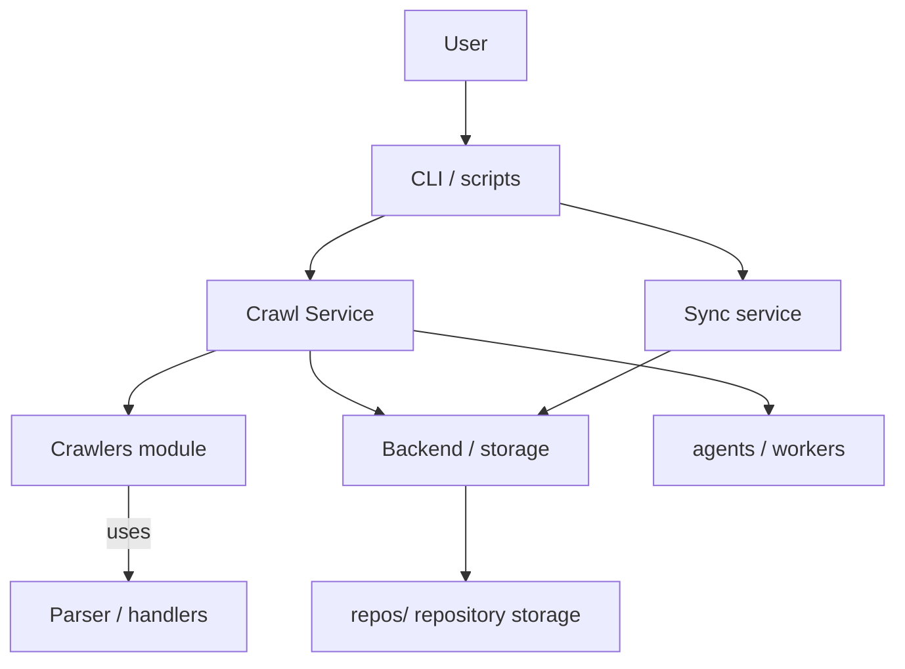
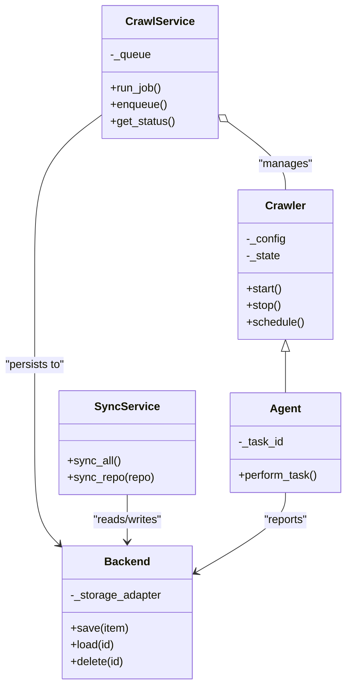

# Diagram: common/monitoring/config/config.prod-b.yml

> Auto-generated by Obscura crawlers

## Diagram 1

### SVG

<svg id="container" width="702.359375" xmlns="http://www.w3.org/2000/svg" class="flowchart" height="510" viewBox="0 0 702.359375 510" role="graphics-document document" aria-roledescription="flowchart-v2"><g><marker id="container_flowchart-v2-pointEnd" class="marker flowchart-v2" viewBox="0 0 10 10" refX="5" refY="5" markerUnits="userSpaceOnUse" markerWidth="8" markerHeight="8" orient="auto"><path d="M 0 0 L 10 5 L 0 10 z" class="arrowMarkerPath" style="stroke-width: 1; stroke-dasharray: 1, 0;"></path></marker><marker id="container_flowchart-v2-pointStart" class="marker flowchart-v2" viewBox="0 0 10 10" refX="4.5" refY="5" markerUnits="userSpaceOnUse" markerWidth="8" markerHeight="8" orient="auto"><path d="M 0 5 L 10 10 L 10 0 z" class="arrowMarkerPath" style="stroke-width: 1; stroke-dasharray: 1, 0;"></path></marker><marker id="container_flowchart-v2-circleEnd" class="marker flowchart-v2" viewBox="0 0 10 10" refX="11" refY="5" markerUnits="userSpaceOnUse" markerWidth="11" markerHeight="11" orient="auto"><circle cx="5" cy="5" r="5" class="arrowMarkerPath" style="stroke-width: 1; stroke-dasharray: 1, 0;"></circle></marker><marker id="container_flowchart-v2-circleStart" class="marker flowchart-v2" viewBox="0 0 10 10" refX="-1" refY="5" markerUnits="userSpaceOnUse" markerWidth="11" markerHeight="11" orient="auto"><circle cx="5" cy="5" r="5" class="arrowMarkerPath" style="stroke-width: 1; stroke-dasharray: 1, 0;"></circle></marker><marker id="container_flowchart-v2-crossEnd" class="marker cross flowchart-v2" viewBox="0 0 11 11" refX="12" refY="5.2" markerUnits="userSpaceOnUse" markerWidth="11" markerHeight="11" orient="auto"><path d="M 1,1 l 9,9 M 10,1 l -9,9" class="arrowMarkerPath" style="stroke-width: 2; stroke-dasharray: 1, 0;"></path></marker><marker id="container_flowchart-v2-crossStart" class="marker cross flowchart-v2" viewBox="0 0 11 11" refX="-1" refY="5.2" markerUnits="userSpaceOnUse" markerWidth="11" markerHeight="11" orient="auto"><path d="M 1,1 l 9,9 M 10,1 l -9,9" class="arrowMarkerPath" style="stroke-width: 2; stroke-dasharray: 1, 0;"></path></marker><g class="root"><g class="clusters"></g><g class="edgePaths"><path d="M366.492,62L366.492,66.167C366.492,70.333,366.492,78.667,366.492,86.333C366.492,94,366.492,101,366.492,104.5L366.492,108" id="L_User_CLI_0" class="edge-thickness-normal edge-pattern-solid edge-thickness-normal edge-pattern-solid flowchart-link" style=";" data-edge="true" data-et="edge" data-id="L_User_CLI_0" data-points="W3sieCI6MzY2LjQ5MjE4NzUsInkiOjYyfSx7IngiOjM2Ni40OTIxODc1LCJ5Ijo4N30seyJ4IjozNjYuNDkyMTg3NSwieSI6MTEyfV0=" marker-end="url(#container_flowchart-v2-pointEnd)"></path><path d="M302.757,166L292.921,170.167C283.085,174.333,263.414,182.667,253.578,190.333C243.742,198,243.742,205,243.742,208.5L243.742,212" id="L_CLI_CrawlService_0" class="edge-thickness-normal edge-pattern-solid edge-thickness-normal edge-pattern-solid flowchart-link" style=";" data-edge="true" data-et="edge" data-id="L_CLI_CrawlService_0" data-points="W3sieCI6MzAyLjc1NjYxMDU3NjkyMzEsInkiOjE2Nn0seyJ4IjoyNDMuNzQyMTg3NSwieSI6MTkxfSx7IngiOjI0My43NDIxODc1LCJ5IjoyMTZ9XQ==" marker-end="url(#container_flowchart-v2-pointEnd)"></path><path d="M169.622,270L158.184,274.167C146.745,278.333,123.869,286.667,112.43,294.333C100.992,302,100.992,309,100.992,312.5L100.992,316" id="L_CrawlService_Crawlers_0" class="edge-thickness-normal edge-pattern-solid edge-thickness-normal edge-pattern-solid flowchart-link" style=";" data-edge="true" data-et="edge" data-id="L_CrawlService_Crawlers_0" data-points="W3sieCI6MTY5LjYyMTk5NTE5MjMwNzY4LCJ5IjoyNzB9LHsieCI6MTAwLjk5MjE4NzUsInkiOjI5NX0seyJ4IjoxMDAuOTkyMTg3NSwieSI6MzIwfV0=" marker-end="url(#container_flowchart-v2-pointEnd)"></path><path d="M100.992,374L100.992,380.167C100.992,386.333,100.992,398.667,100.992,410.333C100.992,422,100.992,433,100.992,438.5L100.992,444" id="L_Crawlers_Parser_0" class="edge-thickness-normal edge-pattern-solid edge-thickness-normal edge-pattern-solid flowchart-link" style=";" data-edge="true" data-et="edge" data-id="L_Crawlers_Parser_0" data-points="W3sieCI6MTAwLjk5MjE4NzUsInkiOjM3NH0seyJ4IjoxMDAuOTkyMTg3NSwieSI6NDExfSx7IngiOjEwMC45OTIxODc1LCJ5Ijo0NDh9XQ==" marker-end="url(#container_flowchart-v2-pointEnd)"></path><path d="M243.742,270L243.742,274.167C243.742,278.333,243.742,286.667,252.964,294.74C262.186,302.813,280.63,310.626,289.852,314.533L299.073,318.44" id="L_CrawlService_Backend_0" class="edge-thickness-normal edge-pattern-solid edge-thickness-normal edge-pattern-solid flowchart-link" style=";" data-edge="true" data-et="edge" data-id="L_CrawlService_Backend_0" data-points="W3sieCI6MjQzLjc0MjE4NzUsInkiOjI3MH0seyJ4IjoyNDMuNzQyMTg3NSwieSI6Mjk1fSx7IngiOjMwMi43NTY2MTA1NzY5MjMxLCJ5IjozMjB9XQ==" marker-end="url(#container_flowchart-v2-pointEnd)"></path><path d="M366.492,374L366.492,380.167C366.492,386.333,366.492,398.667,366.492,410.333C366.492,422,366.492,433,366.492,438.5L366.492,444" id="L_Backend_Repos_0" class="edge-thickness-normal edge-pattern-solid edge-thickness-normal edge-pattern-solid flowchart-link" style=";" data-edge="true" data-et="edge" data-id="L_Backend_Repos_0" data-points="W3sieCI6MzY2LjQ5MjE4NzUsInkiOjM3NH0seyJ4IjozNjYuNDkyMTg3NSwieSI6NDExfSx7IngiOjM2Ni40OTIxODc1LCJ5Ijo0NDh9XQ==" marker-end="url(#container_flowchart-v2-pointEnd)"></path><path d="M440,156.622L463.9,162.352C487.799,168.082,535.599,179.541,559.499,188.77C583.398,198,583.398,205,583.398,208.5L583.398,212" id="L_CLI_Sync_0" class="edge-thickness-normal edge-pattern-solid edge-thickness-normal edge-pattern-solid flowchart-link" style=";" data-edge="true" data-et="edge" data-id="L_CLI_Sync_0" data-points="W3sieCI6NDQwLCJ5IjoxNTYuNjIyMzg4NzA0Nzk3NTd9LHsieCI6NTgzLjM5ODQzNzUsInkiOjE5MX0seyJ4Ijo1ODMuMzk4NDM3NSwieSI6MjE2fV0=" marker-end="url(#container_flowchart-v2-pointEnd)"></path><path d="M527.086,270L518.396,274.167C509.706,278.333,492.326,286.667,475.546,294.712C458.767,302.757,442.589,310.514,434.5,314.392L426.411,318.271" id="L_Sync_Backend_0" class="edge-thickness-normal edge-pattern-solid edge-thickness-normal edge-pattern-solid flowchart-link" style=";" data-edge="true" data-et="edge" data-id="L_Sync_Backend_0" data-points="W3sieCI6NTI3LjA4NjIzNzk4MDc2OTMsInkiOjI3MH0seyJ4Ijo0NzQuOTQ1MzEyNSwieSI6Mjk1fSx7IngiOjQyMi44MDQzODcwMTkyMzA4LCJ5IjozMjB9XQ==" marker-end="url(#container_flowchart-v2-pointEnd)"></path><path d="M321.453,254.236L368.444,261.03C415.435,267.824,509.417,281.412,556.408,291.706C603.398,302,603.398,309,603.398,312.5L603.398,316" id="L_CrawlService_Agents_0" class="edge-thickness-normal edge-pattern-solid edge-thickness-normal edge-pattern-solid flowchart-link" style=";" data-edge="true" data-et="edge" data-id="L_CrawlService_Agents_0" data-points="W3sieCI6MzIxLjQ1MzEyNSwieSI6MjU0LjIzNTY0MTY3MTczNTE1fSx7IngiOjYwMy4zOTg0Mzc1LCJ5IjoyOTV9LHsieCI6NjAzLjM5ODQzNzUsInkiOjMyMH1d" marker-end="url(#container_flowchart-v2-pointEnd)"></path></g><g class="edgeLabels"><g class="edgeLabel"><g class="label" data-id="L_User_CLI_0" transform="translate(0, 0)"><foreignObject width="0" height="0">

</foreignObject></g></g><g class="edgeLabel"><g class="label" data-id="L_CLI_CrawlService_0" transform="translate(0, 0)"><foreignObject width="0" height="0">

</foreignObject></g></g><g class="edgeLabel"><g class="label" data-id="L_CrawlService_Crawlers_0" transform="translate(0, 0)"><foreignObject width="0" height="0">

</foreignObject></g></g><g class="edgeLabel" transform="translate(100.9921875, 411)"><g class="label" data-id="L_Crawlers_Parser_0" transform="translate(-16.4921875, -12)"><foreignObject width="32.984375" height="24">

uses

</foreignObject></g></g><g class="edgeLabel"><g class="label" data-id="L_CrawlService_Backend_0" transform="translate(0, 0)"><foreignObject width="0" height="0">

</foreignObject></g></g><g class="edgeLabel"><g class="label" data-id="L_Backend_Repos_0" transform="translate(0, 0)"><foreignObject width="0" height="0">

</foreignObject></g></g><g class="edgeLabel"><g class="label" data-id="L_CLI_Sync_0" transform="translate(0, 0)"><foreignObject width="0" height="0">

</foreignObject></g></g><g class="edgeLabel"><g class="label" data-id="L_Sync_Backend_0" transform="translate(0, 0)"><foreignObject width="0" height="0">

</foreignObject></g></g><g class="edgeLabel"><g class="label" data-id="L_CrawlService_Agents_0" transform="translate(0, 0)"><foreignObject width="0" height="0">

</foreignObject></g></g></g><g class="nodes"><g class="node default" id="flowchart-User-0" transform="translate(366.4921875, 35)"><rect class="basic label-container" style="" x="-46.4453125" y="-27" width="92.890625" height="54"></rect><g class="label" style="" transform="translate(-16.4453125, -12)"><rect></rect><foreignObject width="32.890625" height="24">

User

</foreignObject></g></g><g class="node default" id="flowchart-CLI-1" transform="translate(366.4921875, 139)"><rect class="basic label-container" style="" x="-73.5078125" y="-27" width="147.015625" height="54"></rect><g class="label" style="" transform="translate(-43.5078125, -12)"><rect></rect><foreignObject width="87.015625" height="24">

CLI / scripts

</foreignObject></g></g><g class="node default" id="flowchart-CrawlService-3" transform="translate(243.7421875, 243)"><rect class="basic label-container" style="" x="-77.7109375" y="-27" width="155.421875" height="54"></rect><g class="label" style="" transform="translate(-47.7109375, -12)"><rect></rect><foreignObject width="95.421875" height="24">

Crawl Service

</foreignObject></g></g><g class="node default" id="flowchart-Crawlers-5" transform="translate(100.9921875, 347)"><rect class="basic label-container" style="" x="-90.34375" y="-27" width="180.6875" height="54"></rect><g class="label" style="" transform="translate(-60.34375, -12)"><rect></rect><foreignObject width="120.6875" height="24">

Crawlers module

</foreignObject></g></g><g class="node default" id="flowchart-Parser-7" transform="translate(100.9921875, 475)"><rect class="basic label-container" style="" x="-92.9921875" y="-27" width="185.984375" height="54"></rect><g class="label" style="" transform="translate(-62.9921875, -12)"><rect></rect><foreignObject width="125.984375" height="24">

Parser / handlers

</foreignObject></g></g><g class="node default" id="flowchart-Backend-9" transform="translate(366.4921875, 347)"><rect class="basic label-container" style="" x="-95.9453125" y="-27" width="191.890625" height="54"></rect><g class="label" style="" transform="translate(-65.9453125, -12)"><rect></rect><foreignObject width="131.890625" height="24">

Backend / storage

</foreignObject></g></g><g class="node default" id="flowchart-Repos-11" transform="translate(366.4921875, 475)"><rect class="basic label-container" style="" x="-122.5078125" y="-27" width="245.015625" height="54"></rect><g class="label" style="" transform="translate(-92.5078125, -12)"><rect></rect><foreignObject width="185.015625" height="24">

repos/ repository storage

</foreignObject></g></g><g class="node default" id="flowchart-Sync-13" transform="translate(583.3984375, 243)"><rect class="basic label-container" style="" x="-74.25" y="-27" width="148.5" height="54"></rect><g class="label" style="" transform="translate(-44.25, -12)"><rect></rect><foreignObject width="88.5" height="24">

Sync service

</foreignObject></g></g><g class="node default" id="flowchart-Agents-17" transform="translate(603.3984375, 347)"><rect class="basic label-container" style="" x="-90.9609375" y="-27" width="181.921875" height="54"></rect><g class="label" style="" transform="translate(-60.9609375, -12)"><rect></rect><foreignObject width="121.921875" height="24">

agents / workers

</foreignObject></g></g></g></g></g></svg>

## Diagram 2

### SVG

<svg id="container" width="498.4765625" xmlns="http://www.w3.org/2000/svg" class="classDiagram" height="988" viewBox="0 0 498.4765625 988" role="graphics-document document" aria-roledescription="class"><g><defs><marker id="container_class-aggregationStart" class="marker aggregation class" refX="18" refY="7" markerWidth="190" markerHeight="240" orient="auto"><path d="M 18,7 L9,13 L1,7 L9,1 Z"></path></marker></defs><defs><marker id="container_class-aggregationEnd" class="marker aggregation class" refX="1" refY="7" markerWidth="20" markerHeight="28" orient="auto"><path d="M 18,7 L9,13 L1,7 L9,1 Z"></path></marker></defs><defs><marker id="container_class-extensionStart" class="marker extension class" refX="18" refY="7" markerWidth="190" markerHeight="240" orient="auto"><path d="M 1,7 L18,13 V 1 Z"></path></marker></defs><defs><marker id="container_class-extensionEnd" class="marker extension class" refX="1" refY="7" markerWidth="20" markerHeight="28" orient="auto"><path d="M 1,1 V 13 L18,7 Z"></path></marker></defs><defs><marker id="container_class-compositionStart" class="marker composition class" refX="18" refY="7" markerWidth="190" markerHeight="240" orient="auto"><path d="M 18,7 L9,13 L1,7 L9,1 Z"></path></marker></defs><defs><marker id="container_class-compositionEnd" class="marker composition class" refX="1" refY="7" markerWidth="20" markerHeight="28" orient="auto"><path d="M 18,7 L9,13 L1,7 L9,1 Z"></path></marker></defs><defs><marker id="container_class-dependencyStart" class="marker dependency class" refX="6" refY="7" markerWidth="190" markerHeight="240" orient="auto"><path d="M 5,7 L9,13 L1,7 L9,1 Z"></path></marker></defs><defs><marker id="container_class-dependencyEnd" class="marker dependency class" refX="13" refY="7" markerWidth="20" markerHeight="28" orient="auto"><path d="M 18,7 L9,13 L14,7 L9,1 Z"></path></marker></defs><defs><marker id="container_class-lollipopStart" class="marker lollipop class" refX="13" refY="7" markerWidth="190" markerHeight="240" orient="auto"><circle stroke="black" fill="transparent" cx="7" cy="7" r="6"></circle></marker></defs><defs><marker id="container_class-lollipopEnd" class="marker lollipop class" refX="1" refY="7" markerWidth="190" markerHeight="240" orient="auto"><circle stroke="black" fill="transparent" cx="7" cy="7" r="6"></circle></marker></defs><g class="root"><g class="clusters"></g><g class="edgePaths"><path d="M410.406,507.25L410.406,510.542C410.406,513.833,410.406,520.417,410.406,530.375C410.406,540.333,410.406,553.667,410.406,560.333L410.406,567" id="id_Crawler_Agent_1" class="edge-thickness-normal edge-pattern-solid relation" style=";;;" data-edge="true" data-et="edge" data-id="id_Crawler_Agent_1" data-points="W3sieCI6NDEwLjQwNjI1LCJ5Ijo0OTB9LHsieCI6NDEwLjQwNjI1LCJ5Ijo1Mjd9LHsieCI6NDEwLjQwNjI1LCJ5Ijo1Njd9XQ==" marker-start="url(#container_class-extensionStart)"></path><path d="M327.418,175.357L341.249,185.631C355.081,195.905,382.744,216.452,396.575,232.893C410.406,249.333,410.406,261.667,410.406,267.833L410.406,274" id="id_CrawlService_Crawler_2" class="edge-thickness-normal edge-pattern-solid relation" style=";;;" data-edge="true" data-et="edge" data-id="id_CrawlService_Crawler_2" data-points="W3sieCI6MzEzLjU3MDMxMjUsInkiOjE2NS4wNzEyNTA5MjcxNzgzfSx7IngiOjQxMC40MDYyNSwieSI6MjM3fSx7IngiOjQxMC40MDYyNSwieSI6Mjc0fV0=" marker-start="url(#container_class-aggregationStart)"></path><path d="M149.133,165.071L132.993,177.059C116.854,189.048,84.576,213.024,68.436,249.179C52.297,285.333,52.297,333.667,52.297,382C52.297,430.333,52.297,478.667,52.297,521.5C52.297,564.333,52.297,601.667,52.297,639C52.297,676.333,52.297,713.667,57.956,738.057C63.616,762.446,74.935,773.893,80.594,779.616L86.254,785.339" id="id_CrawlService_Backend_3" class="edge-thickness-normal edge-pattern-solid relation" style=";;;" data-edge="true" data-et="edge" data-id="id_CrawlService_Backend_3" data-points="W3sieCI6MTQ5LjEzMjgxMjUsInkiOjE2NS4wNzEyNTA5MjcxNzgzfSx7IngiOjUyLjI5Njg3NSwieSI6MjM3fSx7IngiOjUyLjI5Njg3NSwieSI6MzgyfSx7IngiOjUyLjI5Njg3NSwieSI6NTI3fSx7IngiOjUyLjI5Njg3NSwieSI6NjM5fSx7IngiOjUyLjI5Njg3NSwieSI6NzUxfSx7IngiOjkwLjQ3MjY1NjI1LCJ5Ijo3ODkuNjA1NTEyNDg5MjMzNH1d" marker-end="url(#container_class-dependencyEnd)"></path><path d="M183.816,714L183.816,720.167C183.816,726.333,183.816,738.667,183.816,750C183.816,761.333,183.816,771.667,183.816,776.833L183.816,782" id="id_SyncService_Backend_4" class="edge-thickness-normal edge-pattern-solid relation" style=";;;" data-edge="true" data-et="edge" data-id="id_SyncService_Backend_4" data-points="W3sieCI6MTgzLjgxNjQwNjI1LCJ5Ijo3MTR9LHsieCI6MTgzLjgxNjQwNjI1LCJ5Ijo3NTF9LHsieCI6MTgzLjgxNjQwNjI1LCJ5Ijo3ODh9XQ==" marker-end="url(#container_class-dependencyEnd)"></path><path d="M410.406,711L410.406,717.667C410.406,724.333,410.406,737.667,389.061,756.862C367.716,776.058,325.025,801.116,303.68,813.644L282.335,826.173" id="id_Agent_Backend_5" class="edge-thickness-normal edge-pattern-solid relation" style=";;;" data-edge="true" data-et="edge" data-id="id_Agent_Backend_5" data-points="W3sieCI6NDEwLjQwNjI1LCJ5Ijo3MTF9LHsieCI6NDEwLjQwNjI1LCJ5Ijo3NTF9LHsieCI6Mjc3LjE2MDE1NjI1LCJ5Ijo4MjkuMjEwNjEyNTEyMjgzfV0=" marker-end="url(#container_class-dependencyEnd)"></path></g><g class="edgeLabels"><g class="edgeLabel"><g class="label" data-id="id_Crawler_Agent_1" transform="translate(0, 0)"><foreignObject width="0" height="0">

</foreignObject></g></g><g class="edgeLabel" transform="translate(410.40625, 237)"><g class="label" data-id="id_CrawlService_Crawler_2" transform="translate(-38.5625, -12)"><foreignObject width="77.125" height="24">

"manages"

</foreignObject></g></g><g class="edgeLabel" transform="translate(52.296875, 527)"><g class="label" data-id="id_CrawlService_Backend_3" transform="translate(-44.296875, -12)"><foreignObject width="88.59375" height="24">

"persists to"

</foreignObject></g></g><g class="edgeLabel" transform="translate(183.81640625, 751)"><g class="label" data-id="id_SyncService_Backend_4" transform="translate(-52.2109375, -12)"><foreignObject width="104.421875" height="24">

"reads/writes"

</foreignObject></g></g><g class="edgeLabel" transform="translate(410.40625, 751)"><g class="label" data-id="id_Agent_Backend_5" transform="translate(-32.609375, -12)"><foreignObject width="65.21875" height="24">

"reports"

</foreignObject></g></g></g><g class="nodes"><g class="node default" id="classId-Crawler-0" transform="translate(410.40625, 382)"><g class="basic label-container"><path d="M-67.7578125 -108 L67.7578125 -108 L67.7578125 108 L-67.7578125 108" stroke="none" stroke-width="0" fill="#ECECFF" style=""></path><path d="M-67.7578125 -108 C-21.027039156162942 -108, 25.703734187674115 -108, 67.7578125 -108 M-67.7578125 -108 C-14.488175383890102 -108, 38.781461732219796 -108, 67.7578125 -108 M67.7578125 -108 C67.7578125 -26.679020397796137, 67.7578125 54.641959204407726, 67.7578125 108 M67.7578125 -108 C67.7578125 -63.485304470924504, 67.7578125 -18.970608941849008, 67.7578125 108 M67.7578125 108 C30.748024771436683 108, -6.261762957126635 108, -67.7578125 108 M67.7578125 108 C21.4247240435258 108, -24.9083644129484 108, -67.7578125 108 M-67.7578125 108 C-67.7578125 22.01069514277873, -67.7578125 -63.97860971444254, -67.7578125 -108 M-67.7578125 108 C-67.7578125 36.279859000580274, -67.7578125 -35.44028199883945, -67.7578125 -108" stroke="#9370DB" stroke-width="1.3" fill="none" stroke-dasharray="0 0" style=""></path></g><g class="annotation-group text" transform="translate(0, -84)"></g><g class="label-group text" transform="translate(-27.734375, -84)"><g class="label" style="font-weight: bolder" transform="translate(0,-12)"><foreignObject width="55.46875" height="24">

Crawler

</foreignObject></g></g><g class="members-group text" transform="translate(-55.7578125, -36)"><g class="label" style="" transform="translate(0,-12)"><foreignObject width="56.75" height="24">

-_config

</foreignObject></g><g class="label" style="" transform="translate(0,12)"><foreignObject width="49.59375" height="24">

-_state

</foreignObject></g></g><g class="methods-group text" transform="translate(-55.7578125, 36)"><g class="label" style="" transform="translate(0,-12)"><foreignObject width="52.15625" height="24">

+start()

</foreignObject></g><g class="label" style="" transform="translate(0,12)"><foreignObject width="50.21875" height="24">

+stop()

</foreignObject></g><g class="label" style="" transform="translate(0,36)"><foreignObject width="83.78125" height="24">

+schedule()

</foreignObject></g></g><g class="divider" style=""><path d="M-67.7578125 -60 C-16.192794771422946 -60, 35.37222295715411 -60, 67.7578125 -60 M-67.7578125 -60 C-37.700884418425254 -60, -7.643956336850508 -60, 67.7578125 -60" stroke="#9370DB" stroke-width="1.3" fill="none" stroke-dasharray="0 0" style=""></path></g><g class="divider" style=""><path d="M-67.7578125 12 C-17.553948594671738 12, 32.649915310656525 12, 67.7578125 12 M-67.7578125 12 C-32.14417512574922 12, 3.469462248501557 12, 67.7578125 12" stroke="#9370DB" stroke-width="1.3" fill="none" stroke-dasharray="0 0" style=""></path></g></g><g class="node default" id="classId-CrawlService-1" transform="translate(231.3515625, 104)"><g class="basic label-container"><path d="M-82.21875 -96 L82.21875 -96 L82.21875 96 L-82.21875 96" stroke="none" stroke-width="0" fill="#ECECFF" style=""></path><path d="M-82.21875 -96 C-27.947863389310676 -96, 26.323023221378648 -96, 82.21875 -96 M-82.21875 -96 C-41.14467834398024 -96, -0.07060668796047764 -96, 82.21875 -96 M82.21875 -96 C82.21875 -27.287348008364802, 82.21875 41.425303983270396, 82.21875 96 M82.21875 -96 C82.21875 -27.03435061926463, 82.21875 41.93129876147074, 82.21875 96 M82.21875 96 C30.403196476110146 96, -21.412357047779707 96, -82.21875 96 M82.21875 96 C48.21878366301461 96, 14.218817326029225 96, -82.21875 96 M-82.21875 96 C-82.21875 54.987557574637, -82.21875 13.975115149274004, -82.21875 -96 M-82.21875 96 C-82.21875 21.07379278018854, -82.21875 -53.85241443962292, -82.21875 -96" stroke="#9370DB" stroke-width="1.3" fill="none" stroke-dasharray="0 0" style=""></path></g><g class="annotation-group text" transform="translate(0, -72)"></g><g class="label-group text" transform="translate(-46.796875, -72)"><g class="label" style="font-weight: bolder" transform="translate(0,-12)"><foreignObject width="93.59375" height="24">

CrawlService

</foreignObject></g></g><g class="members-group text" transform="translate(-70.21875, -24)"><g class="label" style="" transform="translate(0,-12)"><foreignObject width="58.8125" height="24">

-_queue

</foreignObject></g></g><g class="methods-group text" transform="translate(-70.21875, 24)"><g class="label" style="" transform="translate(0,-12)"><foreignObject width="75.453125" height="24">

+run_job()

</foreignObject></g><g class="label" style="" transform="translate(0,12)"><foreignObject width="82.09375" height="24">

+enqueue()

</foreignObject></g><g class="label" style="" transform="translate(0,36)"><foreignObject width="93.640625" height="24">

+get_status()

</foreignObject></g></g><g class="divider" style=""><path d="M-82.21875 -48 C-45.4724880488302 -48, -8.726226097660401 -48, 82.21875 -48 M-82.21875 -48 C-28.198153393569385 -48, 25.82244321286123 -48, 82.21875 -48" stroke="#9370DB" stroke-width="1.3" fill="none" stroke-dasharray="0 0" style=""></path></g><g class="divider" style=""><path d="M-82.21875 0 C-36.43618763208641 0, 9.346374735827183 0, 82.21875 0 M-82.21875 0 C-18.72791290851243 0, 44.76292418297514 0, 82.21875 0" stroke="#9370DB" stroke-width="1.3" fill="none" stroke-dasharray="0 0" style=""></path></g></g><g class="node default" id="classId-Backend-2" transform="translate(183.81640625, 884)"><g class="basic label-container"><path d="M-93.34375 -96 L93.34375 -96 L93.34375 96 L-93.34375 96" stroke="none" stroke-width="0" fill="#ECECFF" style=""></path><path d="M-93.34375 -96 C-33.56828636713951 -96, 26.207177265720986 -96, 93.34375 -96 M-93.34375 -96 C-34.15461478299027 -96, 25.034520434019456 -96, 93.34375 -96 M93.34375 -96 C93.34375 -33.37593823735247, 93.34375 29.248123525295057, 93.34375 96 M93.34375 -96 C93.34375 -51.250935569673516, 93.34375 -6.501871139347031, 93.34375 96 M93.34375 96 C20.527548746825843 96, -52.28865250634831 96, -93.34375 96 M93.34375 96 C40.35688640685965 96, -12.629977186280698 96, -93.34375 96 M-93.34375 96 C-93.34375 52.49615420290202, -93.34375 8.992308405804039, -93.34375 -96 M-93.34375 96 C-93.34375 30.025775737111942, -93.34375 -35.948448525776115, -93.34375 -96" stroke="#9370DB" stroke-width="1.3" fill="none" stroke-dasharray="0 0" style=""></path></g><g class="annotation-group text" transform="translate(0, -72)"></g><g class="label-group text" transform="translate(-31.296875, -72)"><g class="label" style="font-weight: bolder" transform="translate(0,-12)"><foreignObject width="62.59375" height="24">

Backend

</foreignObject></g></g><g class="members-group text" transform="translate(-81.34375, -24)"><g class="label" style="" transform="translate(0,-12)"><foreignObject width="131.390625" height="24">

-_storage_adapter

</foreignObject></g></g><g class="methods-group text" transform="translate(-81.34375, 24)"><g class="label" style="" transform="translate(0,-12)"><foreignObject width="83.140625" height="24">

+save(item)

</foreignObject></g><g class="label" style="" transform="translate(0,12)"><foreignObject width="64.5" height="24">

+load(id)

</foreignObject></g><g class="label" style="" transform="translate(0,36)"><foreignObject width="78.3125" height="24">

+delete(id)

</foreignObject></g></g><g class="divider" style=""><path d="M-93.34375 -48 C-51.42670102812586 -48, -9.509652056251724 -48, 93.34375 -48 M-93.34375 -48 C-34.3438696185575 -48, 24.656010762885003 -48, 93.34375 -48" stroke="#9370DB" stroke-width="1.3" fill="none" stroke-dasharray="0 0" style=""></path></g><g class="divider" style=""><path d="M-93.34375 0 C-22.07359247702361 0, 49.19656504595278 0, 93.34375 0 M-93.34375 0 C-47.17800567772575 0, -1.0122613554514999 0, 93.34375 0" stroke="#9370DB" stroke-width="1.3" fill="none" stroke-dasharray="0 0" style=""></path></g></g><g class="node default" id="classId-SyncService-3" transform="translate(183.81640625, 639)"><g class="basic label-container"><path d="M-96.51953125 -75 L96.51953125 -75 L96.51953125 75 L-96.51953125 75" stroke="none" stroke-width="0" fill="#ECECFF" style=""></path><path d="M-96.51953125 -75 C-23.20376735925808 -75, 50.11199653148384 -75, 96.51953125 -75 M-96.51953125 -75 C-48.05834037832863 -75, 0.4028504933427399 -75, 96.51953125 -75 M96.51953125 -75 C96.51953125 -44.90011662517871, 96.51953125 -14.800233250357415, 96.51953125 75 M96.51953125 -75 C96.51953125 -22.671505870512256, 96.51953125 29.65698825897549, 96.51953125 75 M96.51953125 75 C26.840143807915595 75, -42.83924363416881 75, -96.51953125 75 M96.51953125 75 C42.48745615288912 75, -11.544618944221753 75, -96.51953125 75 M-96.51953125 75 C-96.51953125 16.62708056515806, -96.51953125 -41.74583886968388, -96.51953125 -75 M-96.51953125 75 C-96.51953125 36.02375978436497, -96.51953125 -2.952480431270061, -96.51953125 -75" stroke="#9370DB" stroke-width="1.3" fill="none" stroke-dasharray="0 0" style=""></path></g><g class="annotation-group text" transform="translate(0, -51)"></g><g class="label-group text" transform="translate(-43.7421875, -51)"><g class="label" style="font-weight: bolder" transform="translate(0,-12)"><foreignObject width="87.484375" height="24">

SyncService

</foreignObject></g></g><g class="members-group text" transform="translate(-84.51953125, -3)"></g><g class="methods-group text" transform="translate(-84.51953125, 27)"><g class="label" style="" transform="translate(0,-12)"><foreignObject width="76.375" height="24">

+sync_all()

</foreignObject></g><g class="label" style="" transform="translate(0,12)"><foreignObject width="125.296875" height="24">

+sync_repo(repo)

</foreignObject></g></g><g class="divider" style=""><path d="M-96.51953125 -27 C-33.755921262441944 -27, 29.00768872511611 -27, 96.51953125 -27 M-96.51953125 -27 C-25.54846976517507 -27, 45.42259171964986 -27, 96.51953125 -27" stroke="#9370DB" stroke-width="1.3" fill="none" stroke-dasharray="0 0" style=""></path></g><g class="divider" style=""><path d="M-96.51953125 -3 C-29.01519476613541 -3, 38.48914171772918 -3, 96.51953125 -3 M-96.51953125 -3 C-27.519069888826763 -3, 41.48139147234647 -3, 96.51953125 -3" stroke="#9370DB" stroke-width="1.3" fill="none" stroke-dasharray="0 0" style=""></path></g></g><g class="node default" id="classId-Agent-4" transform="translate(410.40625, 639)"><g class="basic label-container"><path d="M-80.0703125 -72 L80.0703125 -72 L80.0703125 72 L-80.0703125 72" stroke="none" stroke-width="0" fill="#ECECFF" style=""></path><path d="M-80.0703125 -72 C-36.87590535127886 -72, 6.318501797442281 -72, 80.0703125 -72 M-80.0703125 -72 C-19.281159005314485 -72, 41.50799448937103 -72, 80.0703125 -72 M80.0703125 -72 C80.0703125 -37.20224840934395, 80.0703125 -2.404496818687903, 80.0703125 72 M80.0703125 -72 C80.0703125 -26.40764441898817, 80.0703125 19.18471116202366, 80.0703125 72 M80.0703125 72 C43.24516835401218 72, 6.420024208024358 72, -80.0703125 72 M80.0703125 72 C33.24281932358964 72, -13.584673852820714 72, -80.0703125 72 M-80.0703125 72 C-80.0703125 42.324135264338494, -80.0703125 12.648270528676996, -80.0703125 -72 M-80.0703125 72 C-80.0703125 32.00891426536639, -80.0703125 -7.9821714692672145, -80.0703125 -72" stroke="#9370DB" stroke-width="1.3" fill="none" stroke-dasharray="0 0" style=""></path></g><g class="annotation-group text" transform="translate(0, -48)"></g><g class="label-group text" transform="translate(-21.078125, -48)"><g class="label" style="font-weight: bolder" transform="translate(0,-12)"><foreignObject width="42.15625" height="24">

Agent

</foreignObject></g></g><g class="members-group text" transform="translate(-68.0703125, 0)"><g class="label" style="" transform="translate(0,-12)"><foreignObject width="65.453125" height="24">

-_task_id

</foreignObject></g></g><g class="methods-group text" transform="translate(-68.0703125, 48)"><g class="label" style="" transform="translate(0,-12)"><foreignObject width="115.0625" height="24">

+perform_task()

</foreignObject></g></g><g class="divider" style=""><path d="M-80.0703125 -24 C-17.45021588592858 -24, 45.16988072814284 -24, 80.0703125 -24 M-80.0703125 -24 C-25.636286529542325 -24, 28.79773944091535 -24, 80.0703125 -24" stroke="#9370DB" stroke-width="1.3" fill="none" stroke-dasharray="0 0" style=""></path></g><g class="divider" style=""><path d="M-80.0703125 24 C-21.494971297955658 24, 37.080369904088684 24, 80.0703125 24 M-80.0703125 24 C-45.280378682221716 24, -10.490444864443432 24, 80.0703125 24" stroke="#9370DB" stroke-width="1.3" fill="none" stroke-dasharray="0 0" style=""></path></g></g></g></g></g></svg>
