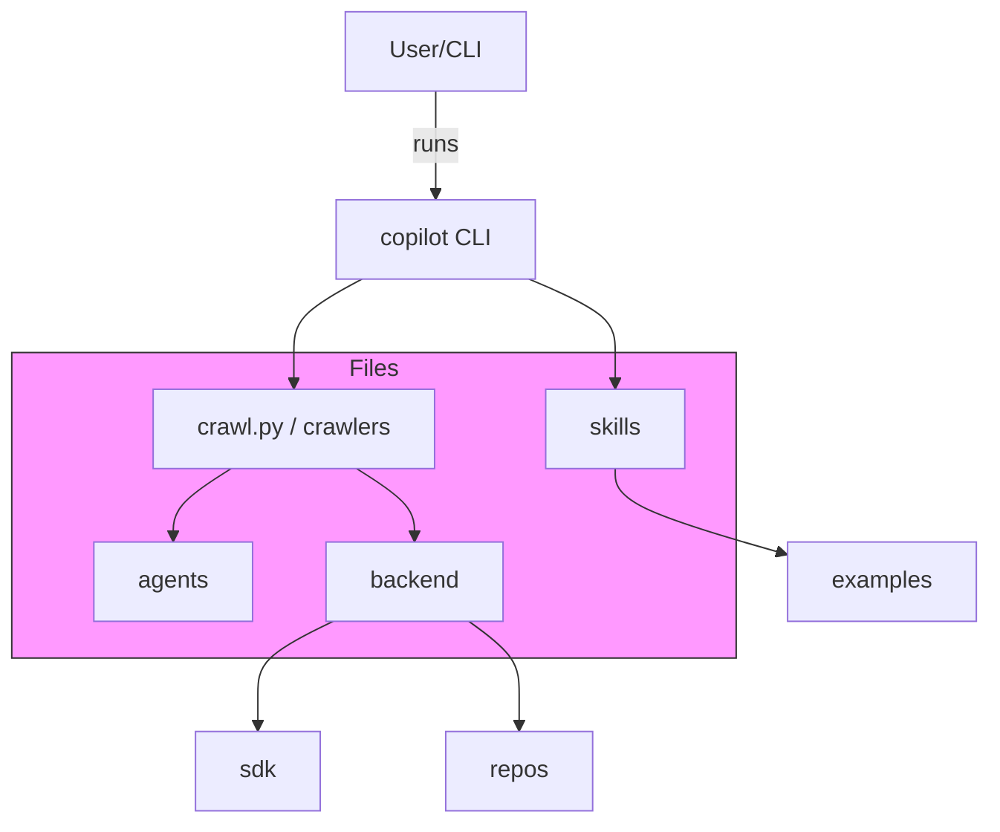
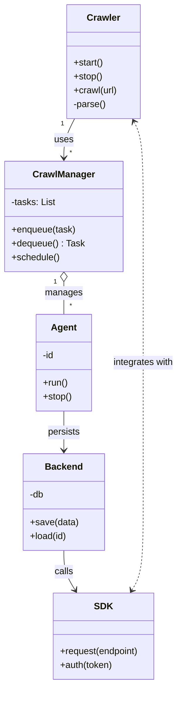

# Diagram: common/monitoring/config/config.qa2.yml

> Auto-generated by Obscura crawlers

## Diagram 1

### SVG

<svg id="container" width="677.1015625" xmlns="http://www.w3.org/2000/svg" class="flowchart" height="560" viewBox="0 0 677.1015625 560" role="graphics-document document" aria-roledescription="flowchart-v2"><g><marker id="container_flowchart-v2-pointEnd" class="marker flowchart-v2" viewBox="0 0 10 10" refX="5" refY="5" markerUnits="userSpaceOnUse" markerWidth="8" markerHeight="8" orient="auto"><path d="M 0 0 L 10 5 L 0 10 z" class="arrowMarkerPath" style="stroke-width: 1; stroke-dasharray: 1, 0;"></path></marker><marker id="container_flowchart-v2-pointStart" class="marker flowchart-v2" viewBox="0 0 10 10" refX="4.5" refY="5" markerUnits="userSpaceOnUse" markerWidth="8" markerHeight="8" orient="auto"><path d="M 0 5 L 10 10 L 10 0 z" class="arrowMarkerPath" style="stroke-width: 1; stroke-dasharray: 1, 0;"></path></marker><marker id="container_flowchart-v2-circleEnd" class="marker flowchart-v2" viewBox="0 0 10 10" refX="11" refY="5" markerUnits="userSpaceOnUse" markerWidth="11" markerHeight="11" orient="auto"><circle cx="5" cy="5" r="5" class="arrowMarkerPath" style="stroke-width: 1; stroke-dasharray: 1, 0;"></circle></marker><marker id="container_flowchart-v2-circleStart" class="marker flowchart-v2" viewBox="0 0 10 10" refX="-1" refY="5" markerUnits="userSpaceOnUse" markerWidth="11" markerHeight="11" orient="auto"><circle cx="5" cy="5" r="5" class="arrowMarkerPath" style="stroke-width: 1; stroke-dasharray: 1, 0;"></circle></marker><marker id="container_flowchart-v2-crossEnd" class="marker cross flowchart-v2" viewBox="0 0 11 11" refX="12" refY="5.2" markerUnits="userSpaceOnUse" markerWidth="11" markerHeight="11" orient="auto"><path d="M 1,1 l 9,9 M 10,1 l -9,9" class="arrowMarkerPath" style="stroke-width: 2; stroke-dasharray: 1, 0;"></path></marker><marker id="container_flowchart-v2-crossStart" class="marker cross flowchart-v2" viewBox="0 0 11 11" refX="-1" refY="5.2" markerUnits="userSpaceOnUse" markerWidth="11" markerHeight="11" orient="auto"><path d="M 1,1 l 9,9 M 10,1 l -9,9" class="arrowMarkerPath" style="stroke-width: 2; stroke-dasharray: 1, 0;"></path></marker><g class="root"><g class="clusters"><g class="cluster" id="Files" data-look="classic"><rect style="fill:#f9f !important;stroke:#333 !important;stroke-width:1px !important" x="8" y="240" width="497.2734375" height="208"></rect><g class="cluster-label" transform="translate(240.33203125, 240)"><foreignObject width="32.609375" height="24">

Files

</foreignObject></g></g></g><g class="edgePaths"><path d="M299.676,62L299.676,68.167C299.676,74.333,299.676,86.667,299.676,98.333C299.676,110,299.676,121,299.676,126.5L299.676,132" id="L_A_B_0" class="edge-thickness-normal edge-pattern-solid edge-thickness-normal edge-pattern-solid flowchart-link" style=";" data-edge="true" data-et="edge" data-id="L_A_B_0" data-points="W3sieCI6Mjk5LjY3NTc4MTI1LCJ5Ijo2Mn0seyJ4IjoyOTkuNjc1NzgxMjUsInkiOjk5fSx7IngiOjI5OS42NzU3ODEyNSwieSI6MTM2fV0=" marker-end="url(#container_flowchart-v2-pointEnd)"></path><path d="M248.635,190L240.758,194.167C232.882,198.333,217.128,206.667,209.252,215C201.375,223.333,201.375,231.667,201.375,239.333C201.375,247,201.375,254,201.375,257.5L201.375,261" id="L_B_C_0" class="edge-thickness-normal edge-pattern-solid edge-thickness-normal edge-pattern-solid flowchart-link" style=";" data-edge="true" data-et="edge" data-id="L_B_C_0" data-points="W3sieCI6MjQ4LjYzNDk5MDk4NTU3NjksInkiOjE5MH0seyJ4IjoyMDEuMzc1LCJ5IjoyMTV9LHsieCI6MjAxLjM3NSwieSI6MjQwfSx7IngiOjIwMS4zNzUsInkiOjI2NX1d" marker-end="url(#container_flowchart-v2-pointEnd)"></path><path d="M158.62,319L152.022,323.167C145.423,327.333,132.227,335.667,125.629,343.333C119.031,351,119.031,358,119.031,361.5L119.031,365" id="L_C_D_0" class="edge-thickness-normal edge-pattern-solid edge-thickness-normal edge-pattern-solid flowchart-link" style=";" data-edge="true" data-et="edge" data-id="L_C_D_0" data-points="W3sieCI6MTU4LjYxOTU5MTM0NjE1Mzg0LCJ5IjozMTl9LHsieCI6MTE5LjAzMTI1LCJ5IjozNDR9LHsieCI6MTE5LjAzMTI1LCJ5IjozNjl9XQ==" marker-end="url(#container_flowchart-v2-pointEnd)"></path><path d="M244.13,319L250.728,323.167C257.327,327.333,270.523,335.667,277.121,343.333C283.719,351,283.719,358,283.719,361.5L283.719,365" id="L_C_E_0" class="edge-thickness-normal edge-pattern-solid edge-thickness-normal edge-pattern-solid flowchart-link" style=";" data-edge="true" data-et="edge" data-id="L_C_E_0" data-points="W3sieCI6MjQ0LjEzMDQwODY1Mzg0NjE2LCJ5IjozMTl9LHsieCI6MjgzLjcxODc1LCJ5IjozNDR9LHsieCI6MjgzLjcxODc1LCJ5IjozNjl9XQ==" marker-end="url(#container_flowchart-v2-pointEnd)"></path><path d="M228.248,423L219.688,427.167C211.128,431.333,194.007,439.667,185.447,448C176.887,456.333,176.887,464.667,176.887,472.333C176.887,480,176.887,487,176.887,490.5L176.887,494" id="L_E_F_0" class="edge-thickness-normal edge-pattern-solid edge-thickness-normal edge-pattern-solid flowchart-link" style=";" data-edge="true" data-et="edge" data-id="L_E_F_0" data-points="W3sieCI6MjI4LjI0ODI3MjIzNTU3NjksInkiOjQyM30seyJ4IjoxNzYuODg2NzE4NzUsInkiOjQ0OH0seyJ4IjoxNzYuODg2NzE4NzUsInkiOjQ3M30seyJ4IjoxNzYuODg2NzE4NzUsInkiOjQ5OH1d" marker-end="url(#container_flowchart-v2-pointEnd)"></path><path d="M363.065,190L372.847,194.167C382.629,198.333,402.193,206.667,411.976,215C421.758,223.333,421.758,231.667,421.758,239.333C421.758,247,421.758,254,421.758,257.5L421.758,261" id="L_B_G_0" class="edge-thickness-normal edge-pattern-solid edge-thickness-normal edge-pattern-solid flowchart-link" style=";" data-edge="true" data-et="edge" data-id="L_B_G_0" data-points="W3sieCI6MzYzLjA2NDUyODI0NTE5MjMsInkiOjE5MH0seyJ4Ijo0MjEuNzU3ODEyNSwieSI6MjE1fSx7IngiOjQyMS43NTc4MTI1LCJ5IjoyNDB9LHsieCI6NDIxLjc1NzgxMjUsInkiOjI2NX1d" marker-end="url(#container_flowchart-v2-pointEnd)"></path><path d="M421.758,319L421.758,323.167C421.758,327.333,421.758,335.667,440.869,345.266C459.98,354.865,498.203,365.731,517.315,371.163L536.426,376.596" id="L_G_H_0" class="edge-thickness-normal edge-pattern-solid edge-thickness-normal edge-pattern-solid flowchart-link" style=";" data-edge="true" data-et="edge" data-id="L_G_H_0" data-points="W3sieCI6NDIxLjc1NzgxMjUsInkiOjMxOX0seyJ4Ijo0MjEuNzU3ODEyNSwieSI6MzQ0fSx7IngiOjU0MC4yNzM0Mzc1LCJ5IjozNzcuNjg5NTE1MjY3OTkwNn1d" marker-end="url(#container_flowchart-v2-pointEnd)"></path><path d="M320.842,423L326.571,427.167C332.299,431.333,343.757,439.667,349.486,448C355.215,456.333,355.215,464.667,355.215,472.333C355.215,480,355.215,487,355.215,490.5L355.215,494" id="L_E_I_0" class="edge-thickness-normal edge-pattern-solid edge-thickness-normal edge-pattern-solid flowchart-link" style=";" data-edge="true" data-et="edge" data-id="L_E_I_0" data-points="W3sieCI6MzIwLjg0MTcyMTc1NDgwNzcsInkiOjQyM30seyJ4IjozNTUuMjE0ODQzNzUsInkiOjQ0OH0seyJ4IjozNTUuMjE0ODQzNzUsInkiOjQ3M30seyJ4IjozNTUuMjE0ODQzNzUsInkiOjQ5OH1d" marker-end="url(#container_flowchart-v2-pointEnd)"></path></g><g class="edgeLabels"><g class="edgeLabel" transform="translate(299.67578125, 99)"><g class="label" data-id="L_A_B_0" transform="translate(-16.171875, -12)"><foreignObject width="32.34375" height="24">

runs

</foreignObject></g></g><g class="edgeLabel"><g class="label" data-id="L_B_C_0" transform="translate(0, 0)"><foreignObject width="0" height="0">

</foreignObject></g></g><g class="edgeLabel"><g class="label" data-id="L_C_D_0" transform="translate(0, 0)"><foreignObject width="0" height="0">

</foreignObject></g></g><g class="edgeLabel"><g class="label" data-id="L_C_E_0" transform="translate(0, 0)"><foreignObject width="0" height="0">

</foreignObject></g></g><g class="edgeLabel"><g class="label" data-id="L_E_F_0" transform="translate(0, 0)"><foreignObject width="0" height="0">

</foreignObject></g></g><g class="edgeLabel"><g class="label" data-id="L_B_G_0" transform="translate(0, 0)"><foreignObject width="0" height="0">

</foreignObject></g></g><g class="edgeLabel"><g class="label" data-id="L_G_H_0" transform="translate(0, 0)"><foreignObject width="0" height="0">

</foreignObject></g></g><g class="edgeLabel"><g class="label" data-id="L_E_I_0" transform="translate(0, 0)"><foreignObject width="0" height="0">

</foreignObject></g></g></g><g class="nodes"><g class="node default" id="flowchart-A-0" transform="translate(299.67578125, 35)"><rect class="basic label-container" style="" x="-60.7890625" y="-27" width="121.578125" height="54"></rect><g class="label" style="" transform="translate(-30.7890625, -12)"><rect></rect><foreignObject width="61.578125" height="24">

User/CLI

</foreignObject></g></g><g class="node default" id="flowchart-B-1" transform="translate(299.67578125, 163)"><rect class="basic label-container" style="" x="-68.15625" y="-27" width="136.3125" height="54"></rect><g class="label" style="" transform="translate(-38.15625, -12)"><rect></rect><foreignObject width="76.3125" height="24">

copilot CLI

</foreignObject></g></g><g class="node default" id="flowchart-C-3" transform="translate(201.375, 292)"><rect class="basic label-container" style="" x="-98.0859375" y="-27" width="196.171875" height="54"></rect><g class="label" style="" transform="translate(-68.0859375, -12)"><rect></rect><foreignObject width="136.171875" height="24">

crawl.py / crawlers

</foreignObject></g></g><g class="node default" id="flowchart-D-5" transform="translate(119.03125, 396)"><rect class="basic label-container" style="" x="-53.9765625" y="-27" width="107.953125" height="54"></rect><g class="label" style="" transform="translate(-23.9765625, -12)"><rect></rect><foreignObject width="47.953125" height="24">

agents

</foreignObject></g></g><g class="node default" id="flowchart-E-7" transform="translate(283.71875, 396)"><rect class="basic label-container" style="" x="-60.7109375" y="-27" width="121.421875" height="54"></rect><g class="label" style="" transform="translate(-30.7109375, -12)"><rect></rect><foreignObject width="61.421875" height="24">

backend

</foreignObject></g></g><g class="node default" id="flowchart-F-9" transform="translate(176.88671875, 525)"><rect class="basic label-container" style="" x="-42.6171875" y="-27" width="85.234375" height="54"></rect><g class="label" style="" transform="translate(-12.6171875, -12)"><rect></rect><foreignObject width="25.234375" height="24">

sdk

</foreignObject></g></g><g class="node default" id="flowchart-G-11" transform="translate(421.7578125, 292)"><rect class="basic label-container" style="" x="-48.515625" y="-27" width="97.03125" height="54"></rect><g class="label" style="" transform="translate(-18.515625, -12)"><rect></rect><foreignObject width="37.03125" height="24">

skills

</foreignObject></g></g><g class="node default" id="flowchart-H-13" transform="translate(604.6875, 396)"><rect class="basic label-container" style="" x="-64.4140625" y="-27" width="128.828125" height="54"></rect><g class="label" style="" transform="translate(-34.4140625, -12)"><rect></rect><foreignObject width="68.828125" height="24">

examples

</foreignObject></g></g><g class="node default" id="flowchart-I-15" transform="translate(355.21484375, 525)"><rect class="basic label-container" style="" x="-50.375" y="-27" width="100.75" height="54"></rect><g class="label" style="" transform="translate(-20.375, -12)"><rect></rect><foreignObject width="40.75" height="24">

repos

</foreignObject></g></g></g></g></g></svg>

## Diagram 2

### SVG

<svg id="container" width="307.4765625" xmlns="http://www.w3.org/2000/svg" class="classDiagram" height="1188" viewBox="0 0 307.4765625 1188" role="graphics-document document" aria-roledescription="class"><g><defs><marker id="container_class-aggregationStart" class="marker aggregation class" refX="18" refY="7" markerWidth="190" markerHeight="240" orient="auto"><path d="M 18,7 L9,13 L1,7 L9,1 Z"></path></marker></defs><defs><marker id="container_class-aggregationEnd" class="marker aggregation class" refX="1" refY="7" markerWidth="20" markerHeight="28" orient="auto"><path d="M 18,7 L9,13 L1,7 L9,1 Z"></path></marker></defs><defs><marker id="container_class-extensionStart" class="marker extension class" refX="18" refY="7" markerWidth="190" markerHeight="240" orient="auto"><path d="M 1,7 L18,13 V 1 Z"></path></marker></defs><defs><marker id="container_class-extensionEnd" class="marker extension class" refX="1" refY="7" markerWidth="20" markerHeight="28" orient="auto"><path d="M 1,1 V 13 L18,7 Z"></path></marker></defs><defs><marker id="container_class-compositionStart" class="marker composition class" refX="18" refY="7" markerWidth="190" markerHeight="240" orient="auto"><path d="M 18,7 L9,13 L1,7 L9,1 Z"></path></marker></defs><defs><marker id="container_class-compositionEnd" class="marker composition class" refX="1" refY="7" markerWidth="20" markerHeight="28" orient="auto"><path d="M 18,7 L9,13 L1,7 L9,1 Z"></path></marker></defs><defs><marker id="container_class-dependencyStart" class="marker dependency class" refX="6" refY="7" markerWidth="190" markerHeight="240" orient="auto"><path d="M 5,7 L9,13 L1,7 L9,1 Z"></path></marker></defs><defs><marker id="container_class-dependencyEnd" class="marker dependency class" refX="13" refY="7" markerWidth="20" markerHeight="28" orient="auto"><path d="M 18,7 L9,13 L14,7 L9,1 Z"></path></marker></defs><defs><marker id="container_class-lollipopStart" class="marker lollipop class" refX="13" refY="7" markerWidth="190" markerHeight="240" orient="auto"><circle stroke="black" fill="transparent" cx="7" cy="7" r="6"></circle></marker></defs><defs><marker id="container_class-lollipopEnd" class="marker lollipop class" refX="1" refY="7" markerWidth="190" markerHeight="240" orient="auto"><circle stroke="black" fill="transparent" cx="7" cy="7" r="6"></circle></marker></defs><g class="root"><g class="clusters"></g><g class="edgePaths"><path d="M127.518,206L124.421,212.167C121.325,218.333,115.131,230.667,112.034,242C108.938,253.333,108.938,263.667,108.938,268.833L108.938,274" id="id_Crawler_CrawlManager_1" class="edge-thickness-normal edge-pattern-solid relation" style=";;;" data-edge="true" data-et="edge" data-id="id_Crawler_CrawlManager_1" data-points="W3sieCI6MTI3LjUxODI2NzQ2MzIzNTMsInkiOjIwNn0seyJ4IjoxMDguOTM3NSwieSI6MjQzfSx7IngiOjEwOC45Mzc1LCJ5IjoyODB9XQ==" marker-end="url(#container_class-dependencyEnd)"></path><path d="M108.938,489.25L108.938,492.542C108.938,495.833,108.938,502.417,108.938,511.875C108.938,521.333,108.938,533.667,108.938,539.833L108.938,546" id="id_CrawlManager_Agent_2" class="edge-thickness-normal edge-pattern-solid relation" style=";;;" data-edge="true" data-et="edge" data-id="id_CrawlManager_Agent_2" data-points="W3sieCI6MTA4LjkzNzUsInkiOjQ3Mn0seyJ4IjoxMDguOTM3NSwieSI6NTA5fSx7IngiOjEwOC45Mzc1LCJ5Ijo1NDZ9XQ==" marker-start="url(#container_class-aggregationStart)"></path><path d="M108.938,714L108.938,720.167C108.938,726.333,108.938,738.667,108.938,750C108.938,761.333,108.938,771.667,108.938,776.833L108.938,782" id="id_Agent_Backend_3" class="edge-thickness-normal edge-pattern-solid relation" style=";;;" data-edge="true" data-et="edge" data-id="id_Agent_Backend_3" data-points="W3sieCI6MTA4LjkzNzUsInkiOjcxNH0seyJ4IjoxMDguOTM3NSwieSI6NzUxfSx7IngiOjEwOC45Mzc1LCJ5Ijo3ODh9XQ==" marker-end="url(#container_class-dependencyEnd)"></path><path d="M108.938,956L108.938,962.167C108.938,968.333,108.938,980.667,112.177,992.146C115.417,1003.626,121.897,1014.252,125.136,1019.564L128.376,1024.877" id="id_Backend_SDK_4" class="edge-thickness-normal edge-pattern-solid relation" style=";;;" data-edge="true" data-et="edge" data-id="id_Backend_SDK_4" data-points="W3sieCI6MTA4LjkzNzUsInkiOjk1Nn0seyJ4IjoxMDguOTM3NSwieSI6OTkzfSx7IngiOjEzMS40OTk4NjA0OTEwNzE0NCwieSI6MTAzMH1d" marker-end="url(#container_class-dependencyEnd)"></path><path d="M226.093,1024.877L229.332,1019.564C232.572,1014.252,239.052,1003.626,242.291,978.146C245.531,952.667,245.531,912.333,245.531,872C245.531,831.667,245.531,791.333,245.531,751C245.531,710.667,245.531,670.333,245.531,630C245.531,589.667,245.531,549.333,245.531,507C245.531,464.667,245.531,420.333,245.531,376C245.531,331.667,245.531,287.333,242.883,259.894C240.235,232.454,234.939,221.908,232.291,216.635L229.643,211.362" id="id_SDK_Crawler_5" class="edge-thickness-normal edge-pattern-dashed relation" style=";;;" data-edge="true" data-et="edge" data-id="id_SDK_Crawler_5" data-points="W3sieCI6MjIyLjk2ODg4OTUwODkyODU2LCJ5IjoxMDMwfSx7IngiOjI0NS41MzEyNSwieSI6OTkzfSx7IngiOjI0NS41MzEyNSwieSI6ODcyfSx7IngiOjI0NS41MzEyNSwieSI6NzUxfSx7IngiOjI0NS41MzEyNSwieSI6NjMwfSx7IngiOjI0NS41MzEyNSwieSI6NTA5fSx7IngiOjI0NS41MzEyNSwieSI6Mzc2fSx7IngiOjI0NS41MzEyNSwieSI6MjQzfSx7IngiOjIyNi45NTA0ODI1MzY3NjQ3LCJ5IjoyMDZ9XQ==" marker-start="url(#container_class-dependencyStart)" marker-end="url(#container_class-dependencyEnd)"></path></g><g class="edgeLabels"><g class="edgeLabel" transform="translate(108.9375, 243)"><g class="label" data-id="id_Crawler_CrawlManager_1" transform="translate(-16.4921875, -12)"><foreignObject width="32.984375" height="24">

uses

</foreignObject></g></g><g class="edgeLabel" transform="translate(108.9375, 509)"><g class="label" data-id="id_CrawlManager_Agent_2" transform="translate(-32.296875, -12)"><foreignObject width="64.59375" height="24">

manages

</foreignObject></g></g><g class="edgeLabel" transform="translate(108.9375, 751)"><g class="label" data-id="id_Agent_Backend_3" transform="translate(-28.4375, -12)"><foreignObject width="56.875" height="24">

persists

</foreignObject></g></g><g class="edgeLabel" transform="translate(108.9375, 993)"><g class="label" data-id="id_Backend_SDK_4" transform="translate(-16.4453125, -12)"><foreignObject width="32.890625" height="24">

calls

</foreignObject></g></g><g class="edgeLabel" transform="translate(245.53125, 630)"><g class="label" data-id="id_SDK_Crawler_5" transform="translate(-53.9453125, -12)"><foreignObject width="107.890625" height="24">

integrates with

</foreignObject></g></g><g class="edgeTerminals" transform="translate(106.2600468579242, 214.90719014936641)"><g class="inner" transform="translate(0, 0)"><foreignObject style="width: 9px; height: 12px;">
1
</foreignObject></g></g><g class="edgeTerminals" transform="translate(93.9375, 489.5)"><g class="inner" transform="translate(0, 0)"><foreignObject style="width: 9px; height: 12px;">
1
</foreignObject></g></g><g class="edgeTerminals" transform="translate(118.9375, 257.5)"><g class="inner" transform="translate(0, 0)"></g><foreignObject style="width: 9px; height: 12px;">
*
</foreignObject></g><g class="edgeTerminals" transform="translate(118.9375, 523.5)"><g class="inner" transform="translate(0, 0)"></g><foreignObject style="width: 9px; height: 12px;">
*
</foreignObject></g></g><g class="nodes"><g class="node default" id="classId-Crawler-0" transform="translate(177.234375, 107)"><g class="basic label-container"><path d="M-64.15625 -99 L64.15625 -99 L64.15625 99 L-64.15625 99" stroke="none" stroke-width="0" fill="#ECECFF" style=""></path><path d="M-64.15625 -99 C-14.731539052545521 -99, 34.69317189490896 -99, 64.15625 -99 M-64.15625 -99 C-16.870173407843616 -99, 30.415903184312768 -99, 64.15625 -99 M64.15625 -99 C64.15625 -31.25797627678199, 64.15625 36.48404744643602, 64.15625 99 M64.15625 -99 C64.15625 -39.50260239793384, 64.15625 19.994795204132316, 64.15625 99 M64.15625 99 C28.599410589022 99, -6.957428821956 99, -64.15625 99 M64.15625 99 C37.46060835643759 99, 10.764966712875172 99, -64.15625 99 M-64.15625 99 C-64.15625 40.32968719129275, -64.15625 -18.340625617414503, -64.15625 -99 M-64.15625 99 C-64.15625 34.16488267250648, -64.15625 -30.67023465498704, -64.15625 -99" stroke="#9370DB" stroke-width="1.3" fill="none" stroke-dasharray="0 0" style=""></path></g><g class="annotation-group text" transform="translate(0, -75)"></g><g class="label-group text" transform="translate(-27.734375, -75)"><g class="label" style="font-weight: bolder" transform="translate(0,-12)"><foreignObject width="55.46875" height="24">

Crawler

</foreignObject></g></g><g class="members-group text" transform="translate(-52.15625, -27)"></g><g class="methods-group text" transform="translate(-52.15625, 3)"><g class="label" style="" transform="translate(0,-12)"><foreignObject width="52.15625" height="24">

+start()

</foreignObject></g><g class="label" style="" transform="translate(0,12)"><foreignObject width="50.21875" height="24">

+stop()

</foreignObject></g><g class="label" style="" transform="translate(0,36)"><foreignObject width="76.578125" height="24">

+crawl(url)

</foreignObject></g><g class="label" style="" transform="translate(0,60)"><foreignObject width="57" height="24">

-parse()

</foreignObject></g></g><g class="divider" style=""><path d="M-64.15625 -51 C-33.244460242168614 -51, -2.3326704843372212 -51, 64.15625 -51 M-64.15625 -51 C-19.13798570185488 -51, 25.88027859629024 -51, 64.15625 -51" stroke="#9370DB" stroke-width="1.3" fill="none" stroke-dasharray="0 0" style=""></path></g><g class="divider" style=""><path d="M-64.15625 -27 C-35.73459018837977 -27, -7.312930376759539 -27, 64.15625 -27 M-64.15625 -27 C-16.165860134486174 -27, 31.824529731027653 -27, 64.15625 -27" stroke="#9370DB" stroke-width="1.3" fill="none" stroke-dasharray="0 0" style=""></path></g></g><g class="node default" id="classId-CrawlManager-1" transform="translate(108.9375, 376)"><g class="basic label-container"><path d="M-100.9375 -96 L100.9375 -96 L100.9375 96 L-100.9375 96" stroke="none" stroke-width="0" fill="#ECECFF" style=""></path><path d="M-100.9375 -96 C-24.850150784076035 -96, 51.23719843184793 -96, 100.9375 -96 M-100.9375 -96 C-54.49851125638377 -96, -8.059522512767543 -96, 100.9375 -96 M100.9375 -96 C100.9375 -32.61820365223641, 100.9375 30.76359269552718, 100.9375 96 M100.9375 -96 C100.9375 -46.96853901691341, 100.9375 2.062921966173178, 100.9375 96 M100.9375 96 C53.765137002289556 96, 6.592774004579113 96, -100.9375 96 M100.9375 96 C42.13871464215245 96, -16.6600707156951 96, -100.9375 96 M-100.9375 96 C-100.9375 30.914613001635587, -100.9375 -34.170773996728826, -100.9375 -96 M-100.9375 96 C-100.9375 53.87429493449311, -100.9375 11.748589868986215, -100.9375 -96" stroke="#9370DB" stroke-width="1.3" fill="none" stroke-dasharray="0 0" style=""></path></g><g class="annotation-group text" transform="translate(0, -72)"></g><g class="label-group text" transform="translate(-51.59375, -72)"><g class="label" style="font-weight: bolder" transform="translate(0,-12)"><foreignObject width="103.1875" height="24">

CrawlManager

</foreignObject></g></g><g class="members-group text" transform="translate(-88.9375, -24)"><g class="label" style="" transform="translate(0,-12)"><foreignObject width="77.453125" height="24">

-tasks: List

</foreignObject></g></g><g class="methods-group text" transform="translate(-88.9375, 24)"><g class="label" style="" transform="translate(0,-12)"><foreignObject width="111.953125" height="24">

+enqueue(task)

</foreignObject></g><g class="label" style="" transform="translate(0,12)"><foreignObject width="126.28125" height="24">

+dequeue() : Task

</foreignObject></g><g class="label" style="" transform="translate(0,36)"><foreignObject width="83.78125" height="24">

+schedule()

</foreignObject></g></g><g class="divider" style=""><path d="M-100.9375 -48 C-55.09545613021662 -48, -9.253412260433237 -48, 100.9375 -48 M-100.9375 -48 C-20.454329143397146 -48, 60.02884171320571 -48, 100.9375 -48" stroke="#9370DB" stroke-width="1.3" fill="none" stroke-dasharray="0 0" style=""></path></g><g class="divider" style=""><path d="M-100.9375 0 C-30.828313182900317 0, 39.28087363419937 0, 100.9375 0 M-100.9375 0 C-34.33610546885909 0, 32.26528906228182 0, 100.9375 0" stroke="#9370DB" stroke-width="1.3" fill="none" stroke-dasharray="0 0" style=""></path></g></g><g class="node default" id="classId-Agent-2" transform="translate(108.9375, 630)"><g class="basic label-container"><path d="M-47.6484375 -84 L47.6484375 -84 L47.6484375 84 L-47.6484375 84" stroke="none" stroke-width="0" fill="#ECECFF" style=""></path><path d="M-47.6484375 -84 C-10.0915055182085 -84, 27.465426463583 -84, 47.6484375 -84 M-47.6484375 -84 C-18.16650350160415 -84, 11.315430496791699 -84, 47.6484375 -84 M47.6484375 -84 C47.6484375 -34.96029198913732, 47.6484375 14.079416021725365, 47.6484375 84 M47.6484375 -84 C47.6484375 -38.36647226568485, 47.6484375 7.2670554686303035, 47.6484375 84 M47.6484375 84 C17.39156438734236 84, -12.86530872531528 84, -47.6484375 84 M47.6484375 84 C11.649881305724897 84, -24.348674888550207 84, -47.6484375 84 M-47.6484375 84 C-47.6484375 27.457514373236734, -47.6484375 -29.084971253526533, -47.6484375 -84 M-47.6484375 84 C-47.6484375 29.098668692293906, -47.6484375 -25.80266261541219, -47.6484375 -84" stroke="#9370DB" stroke-width="1.3" fill="none" stroke-dasharray="0 0" style=""></path></g><g class="annotation-group text" transform="translate(0, -60)"></g><g class="label-group text" transform="translate(-21.078125, -60)"><g class="label" style="font-weight: bolder" transform="translate(0,-12)"><foreignObject width="42.15625" height="24">

Agent

</foreignObject></g></g><g class="members-group text" transform="translate(-35.6484375, -12)"><g class="label" style="" transform="translate(0,-12)"><foreignObject width="20.53125" height="24">

-id

</foreignObject></g></g><g class="methods-group text" transform="translate(-35.6484375, 36)"><g class="label" style="" transform="translate(0,-12)"><foreignObject width="43.21875" height="24">

+run()

</foreignObject></g><g class="label" style="" transform="translate(0,12)"><foreignObject width="50.21875" height="24">

+stop()

</foreignObject></g></g><g class="divider" style=""><path d="M-47.6484375 -36 C-16.302756267987565 -36, 15.04292496402487 -36, 47.6484375 -36 M-47.6484375 -36 C-11.560497965379831 -36, 24.527441569240338 -36, 47.6484375 -36" stroke="#9370DB" stroke-width="1.3" fill="none" stroke-dasharray="0 0" style=""></path></g><g class="divider" style=""><path d="M-47.6484375 12 C-21.40337219007007 12, 4.841693119859862 12, 47.6484375 12 M-47.6484375 12 C-22.265986983164886 12, 3.1164635336702275 12, 47.6484375 12" stroke="#9370DB" stroke-width="1.3" fill="none" stroke-dasharray="0 0" style=""></path></g></g><g class="node default" id="classId-Backend-3" transform="translate(108.9375, 872)"><g class="basic label-container"><path d="M-69.296875 -84 L69.296875 -84 L69.296875 84 L-69.296875 84" stroke="none" stroke-width="0" fill="#ECECFF" style=""></path><path d="M-69.296875 -84 C-34.132120509856776 -84, 1.0326339802864481 -84, 69.296875 -84 M-69.296875 -84 C-20.612380157101214 -84, 28.072114685797573 -84, 69.296875 -84 M69.296875 -84 C69.296875 -38.34107263772861, 69.296875 7.317854724542784, 69.296875 84 M69.296875 -84 C69.296875 -27.69152608454681, 69.296875 28.616947830906383, 69.296875 84 M69.296875 84 C18.117742462115274 84, -33.06139007576945 84, -69.296875 84 M69.296875 84 C23.439662826293286 84, -22.417549347413427 84, -69.296875 84 M-69.296875 84 C-69.296875 34.86138410229827, -69.296875 -14.277231795403466, -69.296875 -84 M-69.296875 84 C-69.296875 47.79056886976191, -69.296875 11.581137739523825, -69.296875 -84" stroke="#9370DB" stroke-width="1.3" fill="none" stroke-dasharray="0 0" style=""></path></g><g class="annotation-group text" transform="translate(0, -60)"></g><g class="label-group text" transform="translate(-31.296875, -60)"><g class="label" style="font-weight: bolder" transform="translate(0,-12)"><foreignObject width="62.59375" height="24">

Backend

</foreignObject></g></g><g class="members-group text" transform="translate(-57.296875, -12)"><g class="label" style="" transform="translate(0,-12)"><foreignObject width="25.53125" height="24">

-db

</foreignObject></g></g><g class="methods-group text" transform="translate(-57.296875, 36)"><g class="label" style="" transform="translate(0,-12)"><foreignObject width="83.296875" height="24">

+save(data)

</foreignObject></g><g class="label" style="" transform="translate(0,12)"><foreignObject width="64.5" height="24">

+load(id)

</foreignObject></g></g><g class="divider" style=""><path d="M-69.296875 -36 C-35.36294110009475 -36, -1.4290072001895027 -36, 69.296875 -36 M-69.296875 -36 C-14.86094540435056 -36, 39.57498419129888 -36, 69.296875 -36" stroke="#9370DB" stroke-width="1.3" fill="none" stroke-dasharray="0 0" style=""></path></g><g class="divider" style=""><path d="M-69.296875 12 C-38.230529954620124 12, -7.164184909240255 12, 69.296875 12 M-69.296875 12 C-22.930277259112657 12, 23.436320481774686 12, 69.296875 12" stroke="#9370DB" stroke-width="1.3" fill="none" stroke-dasharray="0 0" style=""></path></g></g><g class="node default" id="classId-SDK-4" transform="translate(177.234375, 1105)"><g class="basic label-container"><path d="M-89.32421875 -75 L89.32421875 -75 L89.32421875 75 L-89.32421875 75" stroke="none" stroke-width="0" fill="#ECECFF" style=""></path><path d="M-89.32421875 -75 C-40.68237342692791 -75, 7.95947189614418 -75, 89.32421875 -75 M-89.32421875 -75 C-35.46988463630851 -75, 18.384449477382987 -75, 89.32421875 -75 M89.32421875 -75 C89.32421875 -42.09316785650209, 89.32421875 -9.186335713004183, 89.32421875 75 M89.32421875 -75 C89.32421875 -26.503171523647445, 89.32421875 21.99365695270511, 89.32421875 75 M89.32421875 75 C38.32506176299318 75, -12.67409522401364 75, -89.32421875 75 M89.32421875 75 C41.8473619576001 75, -5.6294948347998 75, -89.32421875 75 M-89.32421875 75 C-89.32421875 39.53395886236104, -89.32421875 4.067917724722079, -89.32421875 -75 M-89.32421875 75 C-89.32421875 34.797381703768984, -89.32421875 -5.405236592462032, -89.32421875 -75" stroke="#9370DB" stroke-width="1.3" fill="none" stroke-dasharray="0 0" style=""></path></g><g class="annotation-group text" transform="translate(0, -51)"></g><g class="label-group text" transform="translate(-14.8515625, -51)"><g class="label" style="font-weight: bolder" transform="translate(0,-12)"><foreignObject width="29.703125" height="24">

SDK

</foreignObject></g></g><g class="members-group text" transform="translate(-77.32421875, -3)"></g><g class="methods-group text" transform="translate(-77.32421875, 27)"><g class="label" style="" transform="translate(0,-12)"><foreignObject width="139.796875" height="24">

+request(endpoint)

</foreignObject></g><g class="label" style="" transform="translate(0,12)"><foreignObject width="92.3125" height="24">

+auth(token)

</foreignObject></g></g><g class="divider" style=""><path d="M-89.32421875 -27 C-52.296360194680155 -27, -15.26850163936031 -27, 89.32421875 -27 M-89.32421875 -27 C-49.294647513404215 -27, -9.26507627680843 -27, 89.32421875 -27" stroke="#9370DB" stroke-width="1.3" fill="none" stroke-dasharray="0 0" style=""></path></g><g class="divider" style=""><path d="M-89.32421875 -3 C-24.105485419084502 -3, 41.113247911830996 -3, 89.32421875 -3 M-89.32421875 -3 C-23.00530990536315 -3, 43.3135989392737 -3, 89.32421875 -3" stroke="#9370DB" stroke-width="1.3" fill="none" stroke-dasharray="0 0" style=""></path></g></g></g></g></g></svg>
