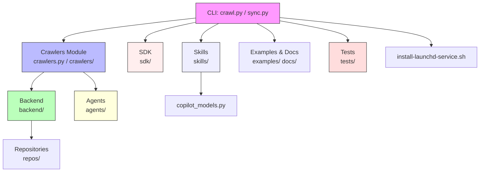

# Diagram: common/monitoring/config/config.staging.yml

> Auto-generated by Obscura crawlers

## Mermaid

### SVG

<svg id="container" width="1608.8984375" xmlns="http://www.w3.org/2000/svg" class="flowchart" height="430" viewBox="0 0 1608.8984375 430" role="graphics-document document" aria-roledescription="flowchart-v2"><g><marker id="container_flowchart-v2-pointEnd" class="marker flowchart-v2" viewBox="0 0 10 10" refX="5" refY="5" markerUnits="userSpaceOnUse" markerWidth="8" markerHeight="8" orient="auto"><path d="M 0 0 L 10 5 L 0 10 z" class="arrowMarkerPath" style="stroke-width: 1; stroke-dasharray: 1, 0;"></path></marker><marker id="container_flowchart-v2-pointStart" class="marker flowchart-v2" viewBox="0 0 10 10" refX="4.5" refY="5" markerUnits="userSpaceOnUse" markerWidth="8" markerHeight="8" orient="auto"><path d="M 0 5 L 10 10 L 10 0 z" class="arrowMarkerPath" style="stroke-width: 1; stroke-dasharray: 1, 0;"></path></marker><marker id="container_flowchart-v2-circleEnd" class="marker flowchart-v2" viewBox="0 0 10 10" refX="11" refY="5" markerUnits="userSpaceOnUse" markerWidth="11" markerHeight="11" orient="auto"><circle cx="5" cy="5" r="5" class="arrowMarkerPath" style="stroke-width: 1; stroke-dasharray: 1, 0;"></circle></marker><marker id="container_flowchart-v2-circleStart" class="marker flowchart-v2" viewBox="0 0 10 10" refX="-1" refY="5" markerUnits="userSpaceOnUse" markerWidth="11" markerHeight="11" orient="auto"><circle cx="5" cy="5" r="5" class="arrowMarkerPath" style="stroke-width: 1; stroke-dasharray: 1, 0;"></circle></marker><marker id="container_flowchart-v2-crossEnd" class="marker cross flowchart-v2" viewBox="0 0 11 11" refX="12" refY="5.2" markerUnits="userSpaceOnUse" markerWidth="11" markerHeight="11" orient="auto"><path d="M 1,1 l 9,9 M 10,1 l -9,9" class="arrowMarkerPath" style="stroke-width: 2; stroke-dasharray: 1, 0;"></path></marker><marker id="container_flowchart-v2-crossStart" class="marker cross flowchart-v2" viewBox="0 0 11 11" refX="-1" refY="5.2" markerUnits="userSpaceOnUse" markerWidth="11" markerHeight="11" orient="auto"><path d="M 1,1 l 9,9 M 10,1 l -9,9" class="arrowMarkerPath" style="stroke-width: 2; stroke-dasharray: 1, 0;"></path></marker><g class="root"><g class="clusters"></g><g class="edgePaths"><path d="M726.266,44.552L645.091,51.627C563.917,58.701,401.568,72.851,320.393,83.425C239.219,94,239.219,101,239.219,104.5L239.219,108" id="L_A_B_0" class="edge-thickness-normal edge-pattern-solid edge-thickness-normal edge-pattern-solid flowchart-link" style=";" data-edge="true" data-et="edge" data-id="L_A_B_0" data-points="W3sieCI6NzI2LjI2NTYyNSwieSI6NDQuNTUyMTU5ODUxMjUyNDR9LHsieCI6MjM5LjIxODc1LCJ5Ijo4N30seyJ4IjoyMzkuMjE4NzUsInkiOjExMn1d" marker-end="url(#container_flowchart-v2-pointEnd)"></path><path d="M156.826,214L150.095,218.167C143.363,222.333,129.9,230.667,123.169,238.333C116.438,246,116.438,253,116.438,256.5L116.438,260" id="L_B_C_0" class="edge-thickness-normal edge-pattern-solid edge-thickness-normal edge-pattern-solid flowchart-link" style=";" data-edge="true" data-et="edge" data-id="L_B_C_0" data-points="W3sieCI6MTU2LjgyNjA2OTA3ODk0NzM3LCJ5IjoyMTR9LHsieCI6MTE2LjQzNzUsInkiOjIzOX0seyJ4IjoxMTYuNDM3NSwieSI6MjY0fV0=" marker-end="url(#container_flowchart-v2-pointEnd)"></path><path d="M321.611,214L328.343,218.167C335.074,222.333,348.537,230.667,355.269,238.333C362,246,362,253,362,256.5L362,260" id="L_B_D_0" class="edge-thickness-normal edge-pattern-solid edge-thickness-normal edge-pattern-solid flowchart-link" style=";" data-edge="true" data-et="edge" data-id="L_B_D_0" data-points="W3sieCI6MzIxLjYxMTQzMDkyMTA1MjYsInkiOjIxNH0seyJ4IjozNjIsInkiOjIzOX0seyJ4IjozNjIsInkiOjI2NH1d" marker-end="url(#container_flowchart-v2-pointEnd)"></path><path d="M726.266,52.26L689.497,58.05C652.729,63.84,579.193,75.42,542.424,88.71C505.656,102,505.656,117,505.656,124.5L505.656,132" id="L_A_E_0" class="edge-thickness-normal edge-pattern-solid edge-thickness-normal edge-pattern-solid flowchart-link" style=";" data-edge="true" data-et="edge" data-id="L_A_E_0" data-points="W3sieCI6NzI2LjI2NTYyNSwieSI6NTIuMjU5NTE2ODgwNzgxNjk2fSx7IngiOjUwNS42NTYyNSwieSI6ODd9LHsieCI6NTA1LjY1NjI1LCJ5IjoxMzZ9XQ==" marker-end="url(#container_flowchart-v2-pointEnd)"></path><path d="M768.278,62L757.848,66.167C747.417,70.333,726.556,78.667,716.126,90.333C705.695,102,705.695,117,705.695,124.5L705.695,132" id="L_A_F_0" class="edge-thickness-normal edge-pattern-solid edge-thickness-normal edge-pattern-solid flowchart-link" style=";" data-edge="true" data-et="edge" data-id="L_A_F_0" data-points="W3sieCI6NzY4LjI3Nzk0NDcxMTUzODUsInkiOjYyfSx7IngiOjcwNS42OTUzMTI1LCJ5Ijo4N30seyJ4Ijo3MDUuNjk1MzEyNSwieSI6MTM2fV0=" marker-end="url(#container_flowchart-v2-pointEnd)"></path><path d="M903.456,62L913.887,66.167C924.317,70.333,945.178,78.667,955.609,88.333C966.039,98,966.039,109,966.039,114.5L966.039,120" id="L_A_G_0" class="edge-thickness-normal edge-pattern-solid edge-thickness-normal edge-pattern-solid flowchart-link" style=";" data-edge="true" data-et="edge" data-id="L_A_G_0" data-points="W3sieCI6OTAzLjQ1NjQzMDI4ODQ2MTUsInkiOjYyfSx7IngiOjk2Ni4wMzkwNjI1LCJ5Ijo4N30seyJ4Ijo5NjYuMDM5MDYyNSwieSI6MTI0fV0=" marker-end="url(#container_flowchart-v2-pointEnd)"></path><path d="M945.469,49.66L991.996,55.883C1038.523,62.107,1131.578,74.553,1178.105,88.277C1224.633,102,1224.633,117,1224.633,124.5L1224.633,132" id="L_A_H_0" class="edge-thickness-normal edge-pattern-solid edge-thickness-normal edge-pattern-solid flowchart-link" style=";" data-edge="true" data-et="edge" data-id="L_A_H_0" data-points="W3sieCI6OTQ1LjQ2ODc1LCJ5Ijo0OS42NTk5NDEzMjA2ODY0N30seyJ4IjoxMjI0LjYzMjgxMjUsInkiOjg3fSx7IngiOjEyMjQuNjMyODEyNSwieSI6MTM2fV0=" marker-end="url(#container_flowchart-v2-pointEnd)"></path><path d="M116.438,318L116.438,322.167C116.438,326.333,116.438,334.667,116.438,342.333C116.438,350,116.438,357,116.438,360.5L116.438,364" id="L_C_I_0" class="edge-thickness-normal edge-pattern-solid edge-thickness-normal edge-pattern-solid flowchart-link" style=";" data-edge="true" data-et="edge" data-id="L_C_I_0" data-points="W3sieCI6MTE2LjQzNzUsInkiOjMxOH0seyJ4IjoxMTYuNDM3NSwieSI6MzQzfSx7IngiOjExNi40Mzc1LCJ5IjozNjh9XQ==" marker-end="url(#container_flowchart-v2-pointEnd)"></path><path d="M705.695,190L705.695,198.167C705.695,206.333,705.695,222.667,705.695,234.333C705.695,246,705.695,253,705.695,256.5L705.695,260" id="L_F_J_0" class="edge-thickness-normal edge-pattern-solid edge-thickness-normal edge-pattern-solid flowchart-link" style=";" data-edge="true" data-et="edge" data-id="L_F_J_0" data-points="W3sieCI6NzA1LjY5NTMxMjUsInkiOjE5MH0seyJ4Ijo3MDUuNjk1MzEyNSwieSI6MjM5fSx7IngiOjcwNS42OTUzMTI1LCJ5IjoyNjR9XQ==" marker-end="url(#container_flowchart-v2-pointEnd)"></path><path d="M945.469,43.889L1034.068,51.074C1122.667,58.259,1299.865,72.63,1388.464,87.315C1477.063,102,1477.063,117,1477.063,124.5L1477.063,132" id="L_A_K_0" class="edge-thickness-normal edge-pattern-solid edge-thickness-normal edge-pattern-solid flowchart-link" style=";" data-edge="true" data-et="edge" data-id="L_A_K_0" data-points="W3sieCI6OTQ1LjQ2ODc1LCJ5Ijo0My44ODg1MjYwNjgyNTYzMX0seyJ4IjoxNDc3LjA2MjUsInkiOjg3fSx7IngiOjE0NzcuMDYyNSwieSI6MTM2fV0=" marker-end="url(#container_flowchart-v2-pointEnd)"></path></g><g class="edgeLabels"><g class="edgeLabel"><g class="label" data-id="L_A_B_0" transform="translate(0, 0)"><foreignObject width="0" height="0">

</foreignObject></g></g><g class="edgeLabel"><g class="label" data-id="L_B_C_0" transform="translate(0, 0)"><foreignObject width="0" height="0">

</foreignObject></g></g><g class="edgeLabel"><g class="label" data-id="L_B_D_0" transform="translate(0, 0)"><foreignObject width="0" height="0">

</foreignObject></g></g><g class="edgeLabel"><g class="label" data-id="L_A_E_0" transform="translate(0, 0)"><foreignObject width="0" height="0">

</foreignObject></g></g><g class="edgeLabel"><g class="label" data-id="L_A_F_0" transform="translate(0, 0)"><foreignObject width="0" height="0">

</foreignObject></g></g><g class="edgeLabel"><g class="label" data-id="L_A_G_0" transform="translate(0, 0)"><foreignObject width="0" height="0">

</foreignObject></g></g><g class="edgeLabel"><g class="label" data-id="L_A_H_0" transform="translate(0, 0)"><foreignObject width="0" height="0">

</foreignObject></g></g><g class="edgeLabel"><g class="label" data-id="L_C_I_0" transform="translate(0, 0)"><foreignObject width="0" height="0">

</foreignObject></g></g><g class="edgeLabel"><g class="label" data-id="L_F_J_0" transform="translate(0, 0)"><foreignObject width="0" height="0">

</foreignObject></g></g><g class="edgeLabel"><g class="label" data-id="L_A_K_0" transform="translate(0, 0)"><foreignObject width="0" height="0">

</foreignObject></g></g></g><g class="nodes"><g class="node default" id="flowchart-A-0" transform="translate(835.8671875, 35)"><rect class="basic label-container" style="fill:#f9f !important;stroke:#333 !important;stroke-width:1px !important" x="-109.6015625" y="-27" width="219.203125" height="54"></rect><g class="label" style="" transform="translate(-79.6015625, -12)"><rect></rect><foreignObject width="159.203125" height="24">

CLI: crawl.py / sync.py

</foreignObject></g></g><g class="node default" id="flowchart-B-1" transform="translate(239.21875, 163)"><rect class="basic label-container" style="fill:#bbf !important;stroke:#333 !important;stroke-width:1px !important" x="-130" y="-51" width="260" height="102"></rect><g class="label" style="" transform="translate(-100, -36)"><rect></rect><foreignObject width="200" height="72">

Crawlers Module\ncrawlers.py / crawlers/

</foreignObject></g></g><g class="node default" id="flowchart-C-3" transform="translate(116.4375, 291)"><rect class="basic label-container" style="fill:#bfb !important;stroke:#333 !important;stroke-width:1px !important" x="-104.609375" y="-27" width="209.21875" height="54"></rect><g class="label" style="" transform="translate(-74.609375, -12)"><rect></rect><foreignObject width="149.21875" height="24">

Backend\nbackend/

</foreignObject></g></g><g class="node default" id="flowchart-D-5" transform="translate(362, 291)"><rect class="basic label-container" style="fill:#ffd !important;stroke:#333 !important;stroke-width:1px !important" x="-90.953125" y="-27" width="181.90625" height="54"></rect><g class="label" style="" transform="translate(-60.953125, -12)"><rect></rect><foreignObject width="121.90625" height="24">

Agents\nagents/

</foreignObject></g></g><g class="node default" id="flowchart-E-7" transform="translate(505.65625, 163)"><rect class="basic label-container" style="fill:#fee !important;stroke:#333 !important;stroke-width:1px !important" x="-69.6953125" y="-27" width="139.390625" height="54"></rect><g class="label" style="" transform="translate(-39.6953125, -12)"><rect></rect><foreignObject width="79.390625" height="24">

SDK\nsdk/

</foreignObject></g></g><g class="node default" id="flowchart-F-9" transform="translate(705.6953125, 163)"><rect class="basic label-container" style="fill:#eef !important;stroke:#333 !important;stroke-width:1px !important" x="-80.34375" y="-27" width="160.6875" height="54"></rect><g class="label" style="" transform="translate(-50.34375, -12)"><rect></rect><foreignObject width="100.6875" height="24">

Skills\nskills/

</foreignObject></g></g><g class="node default" id="flowchart-G-11" transform="translate(966.0390625, 163)"><rect class="basic label-container" style="" x="-130" y="-39" width="260" height="78"></rect><g class="label" style="" transform="translate(-100, -24)"><rect></rect><foreignObject width="200" height="48">

Examples &amp; Docs\nexamples/ docs/

</foreignObject></g></g><g class="node default" id="flowchart-H-13" transform="translate(1224.6328125, 163)"><rect class="basic label-container" style="fill:#fdd !important;stroke:#333 !important;stroke-width:1px !important" x="-78.59375" y="-27" width="157.1875" height="54"></rect><g class="label" style="" transform="translate(-48.59375, -12)"><rect></rect><foreignObject width="97.1875" height="24">

Tests\ntests/

</foreignObject></g></g><g class="node default" id="flowchart-I-15" transform="translate(116.4375, 395)"><rect class="basic label-container" style="" x="-108.4375" y="-27" width="216.875" height="54"></rect><g class="label" style="" transform="translate(-78.4375, -12)"><rect></rect><foreignObject width="156.875" height="24">

Repositories\nrepos/

</foreignObject></g></g><g class="node default" id="flowchart-J-17" transform="translate(705.6953125, 291)"><rect class="basic label-container" style="" x="-96.703125" y="-27" width="193.40625" height="54"></rect><g class="label" style="" transform="translate(-66.703125, -12)"><rect></rect><foreignObject width="133.40625" height="24">

copilot_models.py

</foreignObject></g></g><g class="node default" id="flowchart-K-19" transform="translate(1477.0625, 163)"><rect class="basic label-container" style="" x="-123.8359375" y="-27" width="247.671875" height="54"></rect><g class="label" style="" transform="translate(-93.8359375, -12)"><rect></rect><foreignObject width="187.671875" height="24">

install-launchd-service.sh

</foreignObject></g></g></g></g></g></svg>
