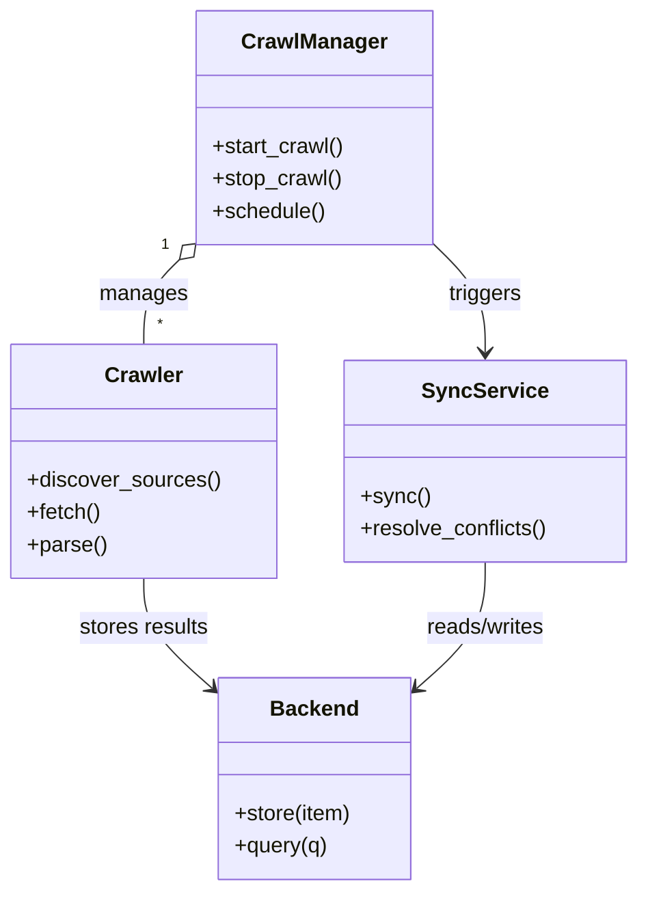
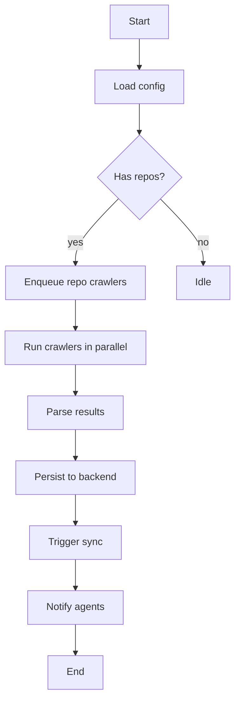

# Diagram: common/monitoring/config/config.test.yml

> Auto-generated by Obscura crawlers

## Diagram 1

### SVG

<svg id="container" width="466.3359375" xmlns="http://www.w3.org/2000/svg" class="classDiagram" height="662" viewBox="0 0 466.3359375 662" role="graphics-document document" aria-roledescription="class"><g><defs><marker id="container_class-aggregationStart" class="marker aggregation class" refX="18" refY="7" markerWidth="190" markerHeight="240" orient="auto"><path d="M 18,7 L9,13 L1,7 L9,1 Z"></path></marker></defs><defs><marker id="container_class-aggregationEnd" class="marker aggregation class" refX="1" refY="7" markerWidth="20" markerHeight="28" orient="auto"><path d="M 18,7 L9,13 L1,7 L9,1 Z"></path></marker></defs><defs><marker id="container_class-extensionStart" class="marker extension class" refX="18" refY="7" markerWidth="190" markerHeight="240" orient="auto"><path d="M 1,7 L18,13 V 1 Z"></path></marker></defs><defs><marker id="container_class-extensionEnd" class="marker extension class" refX="1" refY="7" markerWidth="20" markerHeight="28" orient="auto"><path d="M 1,1 V 13 L18,7 Z"></path></marker></defs><defs><marker id="container_class-compositionStart" class="marker composition class" refX="18" refY="7" markerWidth="190" markerHeight="240" orient="auto"><path d="M 18,7 L9,13 L1,7 L9,1 Z"></path></marker></defs><defs><marker id="container_class-compositionEnd" class="marker composition class" refX="1" refY="7" markerWidth="20" markerHeight="28" orient="auto"><path d="M 18,7 L9,13 L1,7 L9,1 Z"></path></marker></defs><defs><marker id="container_class-dependencyStart" class="marker dependency class" refX="6" refY="7" markerWidth="190" markerHeight="240" orient="auto"><path d="M 5,7 L9,13 L1,7 L9,1 Z"></path></marker></defs><defs><marker id="container_class-dependencyEnd" class="marker dependency class" refX="13" refY="7" markerWidth="20" markerHeight="28" orient="auto"><path d="M 18,7 L9,13 L14,7 L9,1 Z"></path></marker></defs><defs><marker id="container_class-lollipopStart" class="marker lollipop class" refX="13" refY="7" markerWidth="190" markerHeight="240" orient="auto"><circle stroke="black" fill="transparent" cx="7" cy="7" r="6"></circle></marker></defs><defs><marker id="container_class-lollipopEnd" class="marker lollipop class" refX="1" refY="7" markerWidth="190" markerHeight="240" orient="auto"><circle stroke="black" fill="transparent" cx="7" cy="7" r="6"></circle></marker></defs><g class="root"><g class="clusters"></g><g class="edgePaths"><path d="M130.607,193.29L126.284,197.575C121.962,201.86,113.317,210.43,108.994,220.882C104.672,231.333,104.672,243.667,104.672,249.833L104.672,256" id="id_CrawlManager_Crawler_1" class="edge-thickness-normal edge-pattern-solid relation" style=";;;" data-edge="true" data-et="edge" data-id="id_CrawlManager_Crawler_1" data-points="W3sieCI6MTQyLjg1NzQyMTg3NSwieSI6MTgxLjE0NTM3MTA3ODgwNjQyfSx7IngiOjEwNC42NzE4NzUsInkiOjIxOX0seyJ4IjoxMDQuNjcxODc1LCJ5IjoyNTZ9XQ==" marker-start="url(#container_class-aggregationStart)"></path><path d="M104.672,430L104.672,436.167C104.672,442.333,104.672,454.667,112.865,468.17C121.059,481.673,137.446,496.346,145.639,503.682L153.833,511.019" id="id_Crawler_Backend_2" class="edge-thickness-normal edge-pattern-solid relation" style=";;;" data-edge="true" data-et="edge" data-id="id_Crawler_Backend_2" data-points="W3sieCI6MTA0LjY3MTg3NSwieSI6NDMwfSx7IngiOjEwNC42NzE4NzUsInkiOjQ2N30seyJ4IjoxNTguMzAyNzM0Mzc1LCJ5Ijo1MTUuMDIwOTg1OTAwMDk4NH1d" marker-end="url(#container_class-dependencyEnd)"></path><path d="M354.84,418L354.84,426.167C354.84,434.333,354.84,450.667,346.646,466.17C338.453,481.673,322.066,496.346,313.872,503.682L305.679,511.019" id="id_SyncService_Backend_3" class="edge-thickness-normal edge-pattern-solid relation" style=";;;" data-edge="true" data-et="edge" data-id="id_SyncService_Backend_3" data-points="W3sieCI6MzU0LjgzOTg0Mzc1LCJ5Ijo0MTh9LHsieCI6MzU0LjgzOTg0Mzc1LCJ5Ijo0Njd9LHsieCI6MzAxLjIwODk4NDM3NSwieSI6NTE1LjAyMDk4NTkwMDA5ODR9XQ==" marker-end="url(#container_class-dependencyEnd)"></path><path d="M316.654,181.145L323.019,187.454C329.383,193.764,342.111,206.382,348.476,219.858C354.84,233.333,354.84,247.667,354.84,254.833L354.84,262" id="id_CrawlManager_SyncService_4" class="edge-thickness-normal edge-pattern-solid relation" style=";;;" data-edge="true" data-et="edge" data-id="id_CrawlManager_SyncService_4" data-points="W3sieCI6MzE2LjY1NDI5Njg3NSwieSI6MTgxLjE0NTM3MTA3ODgwNjQyfSx7IngiOjM1NC44Mzk4NDM3NSwieSI6MjE5fSx7IngiOjM1NC44Mzk4NDM3NSwieSI6MjY4fV0=" marker-end="url(#container_class-dependencyEnd)"></path></g><g class="edgeLabels"><g class="edgeLabel" transform="translate(104.671875, 219)"><g class="label" data-id="id_CrawlManager_Crawler_1" transform="translate(-32.296875, -12)"><foreignObject width="64.59375" height="24">

manages

</foreignObject></g></g><g class="edgeLabel" transform="translate(104.671875, 467)"><g class="label" data-id="id_Crawler_Backend_2" transform="translate(-48.8125, -12)"><foreignObject width="97.625" height="24">

stores results

</foreignObject></g></g><g class="edgeLabel" transform="translate(354.83984375, 467)"><g class="label" data-id="id_SyncService_Backend_3" transform="translate(-45.9453125, -12)"><foreignObject width="91.890625" height="24">

reads/writes

</foreignObject></g></g><g class="edgeLabel" transform="translate(354.83984375, 219)"><g class="label" data-id="id_CrawlManager_SyncService_4" transform="translate(-27.4921875, -12)"><foreignObject width="54.984375" height="24">

triggers

</foreignObject></g></g><g class="edgeTerminals" transform="translate(119.86897743548494, 182.81311147607784)"><g class="inner" transform="translate(0, 0)"><foreignObject style="width: 9px; height: 12px;">
1
</foreignObject></g></g><g class="edgeTerminals" transform="translate(114.67187749999984, 233.50000214285714)"><g class="inner" transform="translate(0, 0)"></g><foreignObject style="width: 9px; height: 12px;">
*
</foreignObject></g></g><g class="nodes"><g class="node default" id="classId-CrawlManager-0" transform="translate(229.755859375, 95)"><g class="basic label-container"><path d="M-86.8984375 -87 L86.8984375 -87 L86.8984375 87 L-86.8984375 87" stroke="none" stroke-width="0" fill="#ECECFF" style=""></path><path d="M-86.8984375 -87 C-36.82248059212174 -87, 13.253476315756515 -87, 86.8984375 -87 M-86.8984375 -87 C-43.97061906684746 -87, -1.0428006336949238 -87, 86.8984375 -87 M86.8984375 -87 C86.8984375 -43.918798785241904, 86.8984375 -0.8375975704838083, 86.8984375 87 M86.8984375 -87 C86.8984375 -45.55864219793154, 86.8984375 -4.117284395863081, 86.8984375 87 M86.8984375 87 C51.828714157318295 87, 16.75899081463659 87, -86.8984375 87 M86.8984375 87 C27.867455876729046 87, -31.163525746541907 87, -86.8984375 87 M-86.8984375 87 C-86.8984375 45.129933908858334, -86.8984375 3.2598678177166676, -86.8984375 -87 M-86.8984375 87 C-86.8984375 33.0276114337659, -86.8984375 -20.944777132468204, -86.8984375 -87" stroke="#9370DB" stroke-width="1.3" fill="none" stroke-dasharray="0 0" style=""></path></g><g class="annotation-group text" transform="translate(0, -63)"></g><g class="label-group text" transform="translate(-51.59375, -63)"><g class="label" style="font-weight: bolder" transform="translate(0,-12)"><foreignObject width="103.1875" height="24">

CrawlManager

</foreignObject></g></g><g class="members-group text" transform="translate(-74.8984375, -15)"></g><g class="methods-group text" transform="translate(-74.8984375, 15)"><g class="label" style="" transform="translate(0,-12)"><foreignObject width="98.203125" height="24">

+start_crawl()

</foreignObject></g><g class="label" style="" transform="translate(0,12)"><foreignObject width="95.9375" height="24">

+stop_crawl()

</foreignObject></g><g class="label" style="" transform="translate(0,36)"><foreignObject width="83.78125" height="24">

+schedule()

</foreignObject></g></g><g class="divider" style=""><path d="M-86.8984375 -39 C-21.606900481603063 -39, 43.684636536793874 -39, 86.8984375 -39 M-86.8984375 -39 C-41.65101328002429 -39, 3.5964109399514257 -39, 86.8984375 -39" stroke="#9370DB" stroke-width="1.3" fill="none" stroke-dasharray="0 0" style=""></path></g><g class="divider" style=""><path d="M-86.8984375 -15 C-25.497353363192147 -15, 35.903730773615706 -15, 86.8984375 -15 M-86.8984375 -15 C-40.74669894345331 -15, 5.405039613093379 -15, 86.8984375 -15" stroke="#9370DB" stroke-width="1.3" fill="none" stroke-dasharray="0 0" style=""></path></g></g><g class="node default" id="classId-Crawler-1" transform="translate(104.671875, 343)"><g class="basic label-container"><path d="M-96.671875 -87 L96.671875 -87 L96.671875 87 L-96.671875 87" stroke="none" stroke-width="0" fill="#ECECFF" style=""></path><path d="M-96.671875 -87 C-27.831173074045168 -87, 41.009528851909664 -87, 96.671875 -87 M-96.671875 -87 C-25.06772471725789 -87, 46.53642556548422 -87, 96.671875 -87 M96.671875 -87 C96.671875 -41.73588363916906, 96.671875 3.5282327216618796, 96.671875 87 M96.671875 -87 C96.671875 -36.32972107263751, 96.671875 14.340557854724977, 96.671875 87 M96.671875 87 C43.54570423350922 87, -9.58046653298156 87, -96.671875 87 M96.671875 87 C36.92132235261485 87, -22.829230294770298 87, -96.671875 87 M-96.671875 87 C-96.671875 24.130943277454996, -96.671875 -38.73811344509001, -96.671875 -87 M-96.671875 87 C-96.671875 18.495068620328638, -96.671875 -50.009862759342724, -96.671875 -87" stroke="#9370DB" stroke-width="1.3" fill="none" stroke-dasharray="0 0" style=""></path></g><g class="annotation-group text" transform="translate(0, -63)"></g><g class="label-group text" transform="translate(-27.734375, -63)"><g class="label" style="font-weight: bolder" transform="translate(0,-12)"><foreignObject width="55.46875" height="24">

Crawler

</foreignObject></g></g><g class="members-group text" transform="translate(-84.671875, -15)"></g><g class="methods-group text" transform="translate(-84.671875, 15)"><g class="label" style="" transform="translate(0,-12)"><foreignObject width="141.609375" height="24">

+discover_sources()

</foreignObject></g><g class="label" style="" transform="translate(0,12)"><foreignObject width="54.59375" height="24">

+fetch()

</foreignObject></g><g class="label" style="" transform="translate(0,36)"><foreignObject width="58.53125" height="24">

+parse()

</foreignObject></g></g><g class="divider" style=""><path d="M-96.671875 -39 C-46.673168579954535 -39, 3.325537840090931 -39, 96.671875 -39 M-96.671875 -39 C-54.14935027249866 -39, -11.626825544997317 -39, 96.671875 -39" stroke="#9370DB" stroke-width="1.3" fill="none" stroke-dasharray="0 0" style=""></path></g><g class="divider" style=""><path d="M-96.671875 -15 C-20.696556211923877 -15, 55.278762576152246 -15, 96.671875 -15 M-96.671875 -15 C-51.838637763981374 -15, -7.005400527962749 -15, 96.671875 -15" stroke="#9370DB" stroke-width="1.3" fill="none" stroke-dasharray="0 0" style=""></path></g></g><g class="node default" id="classId-Backend-2" transform="translate(229.755859375, 579)"><g class="basic label-container"><path d="M-71.453125 -75 L71.453125 -75 L71.453125 75 L-71.453125 75" stroke="none" stroke-width="0" fill="#ECECFF" style=""></path><path d="M-71.453125 -75 C-15.109055556643568 -75, 41.23501388671286 -75, 71.453125 -75 M-71.453125 -75 C-22.487701907514797 -75, 26.477721184970406 -75, 71.453125 -75 M71.453125 -75 C71.453125 -34.571552109375084, 71.453125 5.856895781249833, 71.453125 75 M71.453125 -75 C71.453125 -39.59894463738516, 71.453125 -4.1978892747703185, 71.453125 75 M71.453125 75 C17.17523399973812 75, -37.10265700052376 75, -71.453125 75 M71.453125 75 C15.253689677248268 75, -40.945745645503465 75, -71.453125 75 M-71.453125 75 C-71.453125 35.07449355093741, -71.453125 -4.851012898125177, -71.453125 -75 M-71.453125 75 C-71.453125 38.69240011371516, -71.453125 2.3848002274303184, -71.453125 -75" stroke="#9370DB" stroke-width="1.3" fill="none" stroke-dasharray="0 0" style=""></path></g><g class="annotation-group text" transform="translate(0, -51)"></g><g class="label-group text" transform="translate(-31.296875, -51)"><g class="label" style="font-weight: bolder" transform="translate(0,-12)"><foreignObject width="62.59375" height="24">

Backend

</foreignObject></g></g><g class="members-group text" transform="translate(-59.453125, -3)"></g><g class="methods-group text" transform="translate(-59.453125, 27)"><g class="label" style="" transform="translate(0,-12)"><foreignObject width="87.609375" height="24">

+store(item)

</foreignObject></g><g class="label" style="" transform="translate(0,12)"><foreignObject width="69.578125" height="24">

+query(q)

</foreignObject></g></g><g class="divider" style=""><path d="M-71.453125 -27 C-14.400655723243531 -27, 42.65181355351294 -27, 71.453125 -27 M-71.453125 -27 C-22.288375610434883 -27, 26.876373779130233 -27, 71.453125 -27" stroke="#9370DB" stroke-width="1.3" fill="none" stroke-dasharray="0 0" style=""></path></g><g class="divider" style=""><path d="M-71.453125 -3 C-14.479692839974874 -3, 42.49373932005025 -3, 71.453125 -3 M-71.453125 -3 C-28.231050766754848 -3, 14.991023466490304 -3, 71.453125 -3" stroke="#9370DB" stroke-width="1.3" fill="none" stroke-dasharray="0 0" style=""></path></g></g><g class="node default" id="classId-SyncService-3" transform="translate(354.83984375, 343)"><g class="basic label-container"><path d="M-103.49609375 -75 L103.49609375 -75 L103.49609375 75 L-103.49609375 75" stroke="none" stroke-width="0" fill="#ECECFF" style=""></path><path d="M-103.49609375 -75 C-36.92966448936589 -75, 29.63676477126822 -75, 103.49609375 -75 M-103.49609375 -75 C-45.46005674548153 -75, 12.575980259036939 -75, 103.49609375 -75 M103.49609375 -75 C103.49609375 -34.29458114363318, 103.49609375 6.410837712733638, 103.49609375 75 M103.49609375 -75 C103.49609375 -36.87425933394887, 103.49609375 1.2514813321022586, 103.49609375 75 M103.49609375 75 C31.932682986989406 75, -39.63072777602119 75, -103.49609375 75 M103.49609375 75 C52.7022069740792 75, 1.9083201981584068 75, -103.49609375 75 M-103.49609375 75 C-103.49609375 20.70287355132269, -103.49609375 -33.59425289735462, -103.49609375 -75 M-103.49609375 75 C-103.49609375 38.04038526144372, -103.49609375 1.080770522887434, -103.49609375 -75" stroke="#9370DB" stroke-width="1.3" fill="none" stroke-dasharray="0 0" style=""></path></g><g class="annotation-group text" transform="translate(0, -51)"></g><g class="label-group text" transform="translate(-43.7421875, -51)"><g class="label" style="font-weight: bolder" transform="translate(0,-12)"><foreignObject width="87.484375" height="24">

SyncService

</foreignObject></g></g><g class="members-group text" transform="translate(-91.49609375, -3)"></g><g class="methods-group text" transform="translate(-91.49609375, 27)"><g class="label" style="" transform="translate(0,-12)"><foreignObject width="50.453125" height="24">

+sync()

</foreignObject></g><g class="label" style="" transform="translate(0,12)"><foreignObject width="139.25" height="24">

+resolve_conflicts()

</foreignObject></g></g><g class="divider" style=""><path d="M-103.49609375 -27 C-30.481538173949204 -27, 42.53301740210159 -27, 103.49609375 -27 M-103.49609375 -27 C-50.806710712466575 -27, 1.8826723250668493 -27, 103.49609375 -27" stroke="#9370DB" stroke-width="1.3" fill="none" stroke-dasharray="0 0" style=""></path></g><g class="divider" style=""><path d="M-103.49609375 -3 C-30.324883826719912 -3, 42.846326096560176 -3, 103.49609375 -3 M-103.49609375 -3 C-31.623705503939448 -3, 40.248682742121105 -3, 103.49609375 -3" stroke="#9370DB" stroke-width="1.3" fill="none" stroke-dasharray="0 0" style=""></path></g></g></g></g></g></svg>

## Diagram 2

### SVG

<svg id="container" width="381.2421875" xmlns="http://www.w3.org/2000/svg" class="flowchart" height="1108.75" viewBox="0 0 381.2421875 1108.75" role="graphics-document document" aria-roledescription="flowchart-v2"><g><marker id="container_flowchart-v2-pointEnd" class="marker flowchart-v2" viewBox="0 0 10 10" refX="5" refY="5" markerUnits="userSpaceOnUse" markerWidth="8" markerHeight="8" orient="auto"><path d="M 0 0 L 10 5 L 0 10 z" class="arrowMarkerPath" style="stroke-width: 1; stroke-dasharray: 1, 0;"></path></marker><marker id="container_flowchart-v2-pointStart" class="marker flowchart-v2" viewBox="0 0 10 10" refX="4.5" refY="5" markerUnits="userSpaceOnUse" markerWidth="8" markerHeight="8" orient="auto"><path d="M 0 5 L 10 10 L 10 0 z" class="arrowMarkerPath" style="stroke-width: 1; stroke-dasharray: 1, 0;"></path></marker><marker id="container_flowchart-v2-circleEnd" class="marker flowchart-v2" viewBox="0 0 10 10" refX="11" refY="5" markerUnits="userSpaceOnUse" markerWidth="11" markerHeight="11" orient="auto"><circle cx="5" cy="5" r="5" class="arrowMarkerPath" style="stroke-width: 1; stroke-dasharray: 1, 0;"></circle></marker><marker id="container_flowchart-v2-circleStart" class="marker flowchart-v2" viewBox="0 0 10 10" refX="-1" refY="5" markerUnits="userSpaceOnUse" markerWidth="11" markerHeight="11" orient="auto"><circle cx="5" cy="5" r="5" class="arrowMarkerPath" style="stroke-width: 1; stroke-dasharray: 1, 0;"></circle></marker><marker id="container_flowchart-v2-crossEnd" class="marker cross flowchart-v2" viewBox="0 0 11 11" refX="12" refY="5.2" markerUnits="userSpaceOnUse" markerWidth="11" markerHeight="11" orient="auto"><path d="M 1,1 l 9,9 M 10,1 l -9,9" class="arrowMarkerPath" style="stroke-width: 2; stroke-dasharray: 1, 0;"></path></marker><marker id="container_flowchart-v2-crossStart" class="marker cross flowchart-v2" viewBox="0 0 11 11" refX="-1" refY="5.2" markerUnits="userSpaceOnUse" markerWidth="11" markerHeight="11" orient="auto"><path d="M 1,1 l 9,9 M 10,1 l -9,9" class="arrowMarkerPath" style="stroke-width: 2; stroke-dasharray: 1, 0;"></path></marker><g class="root"><g class="clusters"></g><g class="edgePaths"><path d="M226.211,62L226.211,66.167C226.211,70.333,226.211,78.667,226.211,86.333C226.211,94,226.211,101,226.211,104.5L226.211,108" id="L_A_B_0" class="edge-thickness-normal edge-pattern-solid edge-thickness-normal edge-pattern-solid flowchart-link" style=";" data-edge="true" data-et="edge" data-id="L_A_B_0" data-points="W3sieCI6MjI2LjIxMDkzNzUsInkiOjYyfSx7IngiOjIyNi4yMTA5Mzc1LCJ5Ijo4N30seyJ4IjoyMjYuMjEwOTM3NSwieSI6MTEyfV0=" marker-end="url(#container_flowchart-v2-pointEnd)"></path><path d="M226.211,166L226.211,170.167C226.211,174.333,226.211,182.667,226.211,190.333C226.211,198,226.211,205,226.211,208.5L226.211,212" id="L_B_C_0" class="edge-thickness-normal edge-pattern-solid edge-thickness-normal edge-pattern-solid flowchart-link" style=";" data-edge="true" data-et="edge" data-id="L_B_C_0" data-points="W3sieCI6MjI2LjIxMDkzNzUsInkiOjE2Nn0seyJ4IjoyMjYuMjEwOTM3NSwieSI6MTkxfSx7IngiOjIyNi4yMTA5Mzc1LCJ5IjoyMTZ9XQ==" marker-end="url(#container_flowchart-v2-pointEnd)"></path><path d="M193.049,315.588L181.372,327.281C169.696,338.975,146.344,362.363,134.668,379.556C122.992,396.75,122.992,407.75,122.992,413.25L122.992,418.75" id="L_C_D_0" class="edge-thickness-normal edge-pattern-solid edge-thickness-normal edge-pattern-solid flowchart-link" style=";" data-edge="true" data-et="edge" data-id="L_C_D_0" data-points="W3sieCI6MTkzLjA0ODUzNzcxMTc2ODI2LCJ5IjozMTUuNTg3NjAwMjExNzY4M30seyJ4IjoxMjIuOTkyMTg3NSwieSI6Mzg1Ljc1fSx7IngiOjEyMi45OTIxODc1LCJ5Ijo0MjIuNzV9XQ==" marker-end="url(#container_flowchart-v2-pointEnd)"></path><path d="M259.373,315.588L271.049,327.281C282.725,338.975,306.078,362.363,317.754,379.556C329.43,396.75,329.43,407.75,329.43,413.25L329.43,418.75" id="L_C_E_0" class="edge-thickness-normal edge-pattern-solid edge-thickness-normal edge-pattern-solid flowchart-link" style=";" data-edge="true" data-et="edge" data-id="L_C_E_0" data-points="W3sieCI6MjU5LjM3MzMzNzI4ODIzMTcsInkiOjMxNS41ODc2MDAyMTE3NjgzfSx7IngiOjMyOS40Mjk2ODc1LCJ5IjozODUuNzV9LHsieCI6MzI5LjQyOTY4NzUsInkiOjQyMi43NX1d" marker-end="url(#container_flowchart-v2-pointEnd)"></path><path d="M122.992,476.75L122.992,480.917C122.992,485.083,122.992,493.417,122.992,501.083C122.992,508.75,122.992,515.75,122.992,519.25L122.992,522.75" id="L_D_F_0" class="edge-thickness-normal edge-pattern-solid edge-thickness-normal edge-pattern-solid flowchart-link" style=";" data-edge="true" data-et="edge" data-id="L_D_F_0" data-points="W3sieCI6MTIyLjk5MjE4NzUsInkiOjQ3Ni43NX0seyJ4IjoxMjIuOTkyMTg3NSwieSI6NTAxLjc1fSx7IngiOjEyMi45OTIxODc1LCJ5Ijo1MjYuNzV9XQ==" marker-end="url(#container_flowchart-v2-pointEnd)"></path><path d="M122.992,580.75L122.992,584.917C122.992,589.083,122.992,597.417,122.992,605.083C122.992,612.75,122.992,619.75,122.992,623.25L122.992,626.75" id="L_F_G_0" class="edge-thickness-normal edge-pattern-solid edge-thickness-normal edge-pattern-solid flowchart-link" style=";" data-edge="true" data-et="edge" data-id="L_F_G_0" data-points="W3sieCI6MTIyLjk5MjE4NzUsInkiOjU4MC43NX0seyJ4IjoxMjIuOTkyMTg3NSwieSI6NjA1Ljc1fSx7IngiOjEyMi45OTIxODc1LCJ5Ijo2MzAuNzV9XQ==" marker-end="url(#container_flowchart-v2-pointEnd)"></path><path d="M122.992,684.75L122.992,688.917C122.992,693.083,122.992,701.417,122.992,709.083C122.992,716.75,122.992,723.75,122.992,727.25L122.992,730.75" id="L_G_H_0" class="edge-thickness-normal edge-pattern-solid edge-thickness-normal edge-pattern-solid flowchart-link" style=";" data-edge="true" data-et="edge" data-id="L_G_H_0" data-points="W3sieCI6MTIyLjk5MjE4NzUsInkiOjY4NC43NX0seyJ4IjoxMjIuOTkyMTg3NSwieSI6NzA5Ljc1fSx7IngiOjEyMi45OTIxODc1LCJ5Ijo3MzQuNzV9XQ==" marker-end="url(#container_flowchart-v2-pointEnd)"></path><path d="M122.992,788.75L122.992,792.917C122.992,797.083,122.992,805.417,122.992,813.083C122.992,820.75,122.992,827.75,122.992,831.25L122.992,834.75" id="L_H_I_0" class="edge-thickness-normal edge-pattern-solid edge-thickness-normal edge-pattern-solid flowchart-link" style=";" data-edge="true" data-et="edge" data-id="L_H_I_0" data-points="W3sieCI6MTIyLjk5MjE4NzUsInkiOjc4OC43NX0seyJ4IjoxMjIuOTkyMTg3NSwieSI6ODEzLjc1fSx7IngiOjEyMi45OTIxODc1LCJ5Ijo4MzguNzV9XQ==" marker-end="url(#container_flowchart-v2-pointEnd)"></path><path d="M122.992,892.75L122.992,896.917C122.992,901.083,122.992,909.417,122.992,917.083C122.992,924.75,122.992,931.75,122.992,935.25L122.992,938.75" id="L_I_J_0" class="edge-thickness-normal edge-pattern-solid edge-thickness-normal edge-pattern-solid flowchart-link" style=";" data-edge="true" data-et="edge" data-id="L_I_J_0" data-points="W3sieCI6MTIyLjk5MjE4NzUsInkiOjg5Mi43NX0seyJ4IjoxMjIuOTkyMTg3NSwieSI6OTE3Ljc1fSx7IngiOjEyMi45OTIxODc1LCJ5Ijo5NDIuNzV9XQ==" marker-end="url(#container_flowchart-v2-pointEnd)"></path><path d="M122.992,996.75L122.992,1000.917C122.992,1005.083,122.992,1013.417,122.992,1021.083C122.992,1028.75,122.992,1035.75,122.992,1039.25L122.992,1042.75" id="L_J_K_0" class="edge-thickness-normal edge-pattern-solid edge-thickness-normal edge-pattern-solid flowchart-link" style=";" data-edge="true" data-et="edge" data-id="L_J_K_0" data-points="W3sieCI6MTIyLjk5MjE4NzUsInkiOjk5Ni43NX0seyJ4IjoxMjIuOTkyMTg3NSwieSI6MTAyMS43NX0seyJ4IjoxMjIuOTkyMTg3NSwieSI6MTA0Ni43NX1d" marker-end="url(#container_flowchart-v2-pointEnd)"></path></g><g class="edgeLabels"><g class="edgeLabel"><g class="label" data-id="L_A_B_0" transform="translate(0, 0)"><foreignObject width="0" height="0">

</foreignObject></g></g><g class="edgeLabel"><g class="label" data-id="L_B_C_0" transform="translate(0, 0)"><foreignObject width="0" height="0">

</foreignObject></g></g><g class="edgeLabel" transform="translate(122.9921875, 385.75)"><g class="label" data-id="L_C_D_0" transform="translate(-12.0078125, -12)"><foreignObject width="24.015625" height="24">

yes

</foreignObject></g></g><g class="edgeLabel" transform="translate(329.4296875, 385.75)"><g class="label" data-id="L_C_E_0" transform="translate(-9.3671875, -12)"><foreignObject width="18.734375" height="24">

no

</foreignObject></g></g><g class="edgeLabel"><g class="label" data-id="L_D_F_0" transform="translate(0, 0)"><foreignObject width="0" height="0">

</foreignObject></g></g><g class="edgeLabel"><g class="label" data-id="L_F_G_0" transform="translate(0, 0)"><foreignObject width="0" height="0">

</foreignObject></g></g><g class="edgeLabel"><g class="label" data-id="L_G_H_0" transform="translate(0, 0)"><foreignObject width="0" height="0">

</foreignObject></g></g><g class="edgeLabel"><g class="label" data-id="L_H_I_0" transform="translate(0, 0)"><foreignObject width="0" height="0">

</foreignObject></g></g><g class="edgeLabel"><g class="label" data-id="L_I_J_0" transform="translate(0, 0)"><foreignObject width="0" height="0">

</foreignObject></g></g><g class="edgeLabel"><g class="label" data-id="L_J_K_0" transform="translate(0, 0)"><foreignObject width="0" height="0">

</foreignObject></g></g></g><g class="nodes"><g class="node default" id="flowchart-A-0" transform="translate(226.2109375, 35)"><rect class="basic label-container" style="" x="-47.5234375" y="-27" width="95.046875" height="54"></rect><g class="label" style="" transform="translate(-17.5234375, -12)"><rect></rect><foreignObject width="35.046875" height="24">

Start

</foreignObject></g></g><g class="node default" id="flowchart-B-1" transform="translate(226.2109375, 139)"><rect class="basic label-container" style="" x="-71.421875" y="-27" width="142.84375" height="54"></rect><g class="label" style="" transform="translate(-41.421875, -12)"><rect></rect><foreignObject width="82.84375" height="24">

Load config

</foreignObject></g></g><g class="node default" id="flowchart-C-3" transform="translate(226.2109375, 282.375)"><polygon points="66.375,0 132.75,-66.375 66.375,-132.75 0,-66.375" class="label-container" transform="translate(-65.875, 66.375)"></polygon><g class="label" style="" transform="translate(-39.375, -12)"><rect></rect><foreignObject width="78.75" height="24">

Has repos?

</foreignObject></g></g><g class="node default" id="flowchart-D-5" transform="translate(122.9921875, 449.75)"><rect class="basic label-container" style="" x="-112.625" y="-27" width="225.25" height="54"></rect><g class="label" style="" transform="translate(-82.625, -12)"><rect></rect><foreignObject width="165.25" height="24">

Enqueue repo crawlers

</foreignObject></g></g><g class="node default" id="flowchart-E-7" transform="translate(329.4296875, 449.75)"><rect class="basic label-container" style="" x="-43.8125" y="-27" width="87.625" height="54"></rect><g class="label" style="" transform="translate(-13.8125, -12)"><rect></rect><foreignObject width="27.625" height="24">

Idle

</foreignObject></g></g><g class="node default" id="flowchart-F-9" transform="translate(122.9921875, 553.75)"><rect class="basic label-container" style="" x="-114.9921875" y="-27" width="229.984375" height="54"></rect><g class="label" style="" transform="translate(-84.9921875, -12)"><rect></rect><foreignObject width="169.984375" height="24">

Run crawlers in parallel

</foreignObject></g></g><g class="node default" id="flowchart-G-11" transform="translate(122.9921875, 657.75)"><rect class="basic label-container" style="" x="-76.3125" y="-27" width="152.625" height="54"></rect><g class="label" style="" transform="translate(-46.3125, -12)"><rect></rect><foreignObject width="92.625" height="24">

Parse results

</foreignObject></g></g><g class="node default" id="flowchart-H-13" transform="translate(122.9921875, 761.75)"><rect class="basic label-container" style="" x="-96.7421875" y="-27" width="193.484375" height="54"></rect><g class="label" style="" transform="translate(-66.7421875, -12)"><rect></rect><foreignObject width="133.484375" height="24">

Persist to backend

</foreignObject></g></g><g class="node default" id="flowchart-I-15" transform="translate(122.9921875, 865.75)"><rect class="basic label-container" style="" x="-73.0546875" y="-27" width="146.109375" height="54"></rect><g class="label" style="" transform="translate(-43.0546875, -12)"><rect></rect><foreignObject width="86.109375" height="24">

Trigger sync

</foreignObject></g></g><g class="node default" id="flowchart-J-17" transform="translate(122.9921875, 969.75)"><rect class="basic label-container" style="" x="-77.9921875" y="-27" width="155.984375" height="54"></rect><g class="label" style="" transform="translate(-47.9921875, -12)"><rect></rect><foreignObject width="95.984375" height="24">

Notify agents

</foreignObject></g></g><g class="node default" id="flowchart-K-19" transform="translate(122.9921875, 1073.75)"><rect class="basic label-container" style="" x="-43.6796875" y="-27" width="87.359375" height="54"></rect><g class="label" style="" transform="translate(-13.6796875, -12)"><rect></rect><foreignObject width="27.359375" height="24">

End

</foreignObject></g></g></g></g></g></svg>
