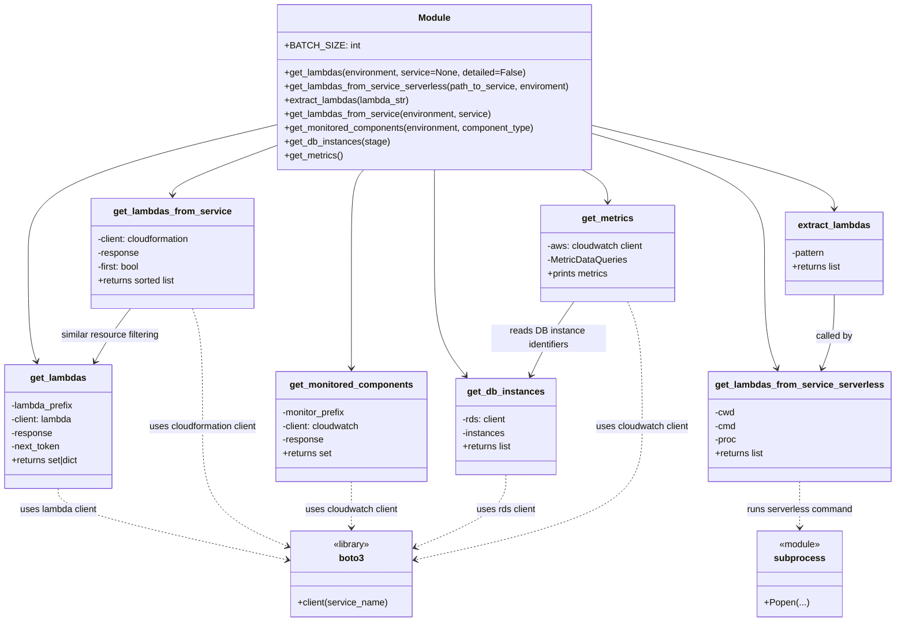

# Diagram: common/monitoring/monitoring/components.py

> Auto-generated by Obscura crawlers

## Mermaid

### SVG

<svg id="container" width="1569.048828125" xmlns="http://www.w3.org/2000/svg" class="classDiagram" height="1084" viewBox="0 0 1569.048828125 1084" role="graphics-document document" aria-roledescription="class"><g><defs><marker id="container_class-aggregationStart" class="marker aggregation class" refX="18" refY="7" markerWidth="190" markerHeight="240" orient="auto"><path d="M 18,7 L9,13 L1,7 L9,1 Z"></path></marker></defs><defs><marker id="container_class-aggregationEnd" class="marker aggregation class" refX="1" refY="7" markerWidth="20" markerHeight="28" orient="auto"><path d="M 18,7 L9,13 L1,7 L9,1 Z"></path></marker></defs><defs><marker id="container_class-extensionStart" class="marker extension class" refX="18" refY="7" markerWidth="190" markerHeight="240" orient="auto"><path d="M 1,7 L18,13 V 1 Z"></path></marker></defs><defs><marker id="container_class-extensionEnd" class="marker extension class" refX="1" refY="7" markerWidth="20" markerHeight="28" orient="auto"><path d="M 1,1 V 13 L18,7 Z"></path></marker></defs><defs><marker id="container_class-compositionStart" class="marker composition class" refX="18" refY="7" markerWidth="190" markerHeight="240" orient="auto"><path d="M 18,7 L9,13 L1,7 L9,1 Z"></path></marker></defs><defs><marker id="container_class-compositionEnd" class="marker composition class" refX="1" refY="7" markerWidth="20" markerHeight="28" orient="auto"><path d="M 18,7 L9,13 L1,7 L9,1 Z"></path></marker></defs><defs><marker id="container_class-dependencyStart" class="marker dependency class" refX="6" refY="7" markerWidth="190" markerHeight="240" orient="auto"><path d="M 5,7 L9,13 L1,7 L9,1 Z"></path></marker></defs><defs><marker id="container_class-dependencyEnd" class="marker dependency class" refX="13" refY="7" markerWidth="20" markerHeight="28" orient="auto"><path d="M 18,7 L9,13 L14,7 L9,1 Z"></path></marker></defs><defs><marker id="container_class-lollipopStart" class="marker lollipop class" refX="13" refY="7" markerWidth="190" markerHeight="240" orient="auto"><circle stroke="black" fill="transparent" cx="7" cy="7" r="6"></circle></marker></defs><defs><marker id="container_class-lollipopEnd" class="marker lollipop class" refX="1" refY="7" markerWidth="190" markerHeight="240" orient="auto"><circle stroke="black" fill="transparent" cx="7" cy="7" r="6"></circle></marker></defs><g class="root"><g class="clusters"></g><g class="edgePaths"><path d="M497.539,216.3L422.885,233.75C348.232,251.2,198.924,286.1,124.271,323.717C49.617,361.333,49.617,401.667,49.617,446C49.617,490.333,49.617,538.667,52.113,570.055C54.608,601.443,59.598,615.886,62.094,623.108L64.589,630.329" id="id_Module_get_lambdas_1" class="edge-thickness-normal edge-pattern-solid relation" style=";;;" data-edge="true" data-et="edge" data-id="id_Module_get_lambdas_1" data-points="W3sieCI6NDk3LjUzOTA2MjUsInkiOjIxNi4zMDAxNjc0ODYwODc4NH0seyJ4Ijo0OS42MTcxODc1LCJ5IjozMjF9LHsieCI6NDkuNjE3MTg3NSwieSI6NDQyfSx7IngiOjQ5LjYxNzE4NzUsInkiOjU4N30seyJ4Ijo2Ni41NDg3MTYxNjI0MjAzOSwieSI6NjM2fV0=" marker-end="url(#container_class-dependencyEnd)"></path><path d="M1047.711,232.703L1097.873,247.419C1148.035,262.135,1248.359,291.568,1298.521,326.45C1348.684,361.333,1348.684,401.667,1348.684,446C1348.684,490.333,1348.684,538.667,1352.245,572.067C1355.807,605.467,1362.931,623.935,1366.492,633.168L1370.054,642.402" id="id_Module_get_lambdas_from_service_serverless_2" class="edge-thickness-normal edge-pattern-solid relation" style=";;;" data-edge="true" data-et="edge" data-id="id_Module_get_lambdas_from_service_serverless_2" data-points="W3sieCI6MTA0Ny43MTA5Mzc1LCJ5IjoyMzIuNzAyNzY4Njc5OTQzODZ9LHsieCI6MTM0OC42ODM1OTM3NSwieSI6MzIxfSx7IngiOjEzNDguNjgzNTkzNzUsInkiOjQ0Mn0seyJ4IjoxMzQ4LjY4MzU5Mzc1LCJ5Ijo1ODd9LHsieCI6MTM3Mi4yMTM0ODc3NTg3NTgsInkiOjY0OH1d" marker-end="url(#container_class-dependencyEnd)"></path><path d="M1047.711,218.682L1118.06,235.735C1188.409,252.788,1329.107,286.894,1399.456,311.114C1469.805,335.333,1469.805,349.667,1469.805,356.833L1469.805,364" id="id_Module_extract_lambdas_3" class="edge-thickness-normal edge-pattern-solid relation" style=";;;" data-edge="true" data-et="edge" data-id="id_Module_extract_lambdas_3" data-points="W3sieCI6MTA0Ny43MTA5Mzc1LCJ5IjoyMTguNjgyMjY4OTYzMTIxNX0seyJ4IjoxNDY5LjgwNDY4NzUsInkiOjMyMX0seyJ4IjoxNDY5LjgwNDY4NzUsInkiOjM3MH1d" marker-end="url(#container_class-dependencyEnd)"></path><path d="M497.539,252.068L465.957,263.557C434.374,275.045,371.21,298.023,339.627,312.678C308.045,327.333,308.045,333.667,308.045,336.833L308.045,340" id="id_Module_get_lambdas_from_service_4" class="edge-thickness-normal edge-pattern-solid relation" style=";;;" data-edge="true" data-et="edge" data-id="id_Module_get_lambdas_from_service_4" data-points="W3sieCI6NDk3LjUzOTA2MjUsInkiOjI1Mi4wNjc4MzY3OTgxODM4Nn0seyJ4IjozMDguMDQ0OTIxODc1LCJ5IjozMjF9LHsieCI6MzA4LjA0NDkyMTg3NSwieSI6MzQ2fV0=" marker-end="url(#container_class-dependencyEnd)"></path><path d="M648.927,296L645.347,300.167C641.768,304.333,634.61,312.667,631.03,337C627.451,361.333,627.451,401.667,627.451,446C627.451,490.333,627.451,538.667,627.451,572C627.451,605.333,627.451,623.667,627.451,632.833L627.451,642" id="id_Module_get_monitored_components_5" class="edge-thickness-normal edge-pattern-solid relation" style=";;;" data-edge="true" data-et="edge" data-id="id_Module_get_monitored_components_5" data-points="W3sieCI6NjQ4LjkyNjU5MDIzNjY4NjQsInkiOjI5Nn0seyJ4Ijo2MjcuNDUxMTcxODc1LCJ5IjozMjF9LHsieCI6NjI3LjQ1MTE3MTg3NSwieSI6NDQyfSx7IngiOjYyNy40NTExNzE4NzUsInkiOjU4N30seyJ4Ijo2MjcuNDUxMTcxODc1LCJ5Ijo2NDh9XQ==" marker-end="url(#container_class-dependencyEnd)"></path><path d="M772.625,296L772.625,300.167C772.625,304.333,772.625,312.667,772.625,337C772.625,361.333,772.625,401.667,772.625,446C772.625,490.333,772.625,538.667,781.702,574.218C790.779,609.77,808.933,632.539,818.01,643.924L827.086,655.309" id="id_Module_get_db_instances_6" class="edge-thickness-normal edge-pattern-solid relation" style=";;;" data-edge="true" data-et="edge" data-id="id_Module_get_db_instances_6" data-points="W3sieCI6NzcyLjYyNSwieSI6Mjk2fSx7IngiOjc3Mi42MjUsInkiOjMyMX0seyJ4Ijo3NzIuNjI1LCJ5Ijo0NDJ9LHsieCI6NzcyLjYyNSwieSI6NTg3fSx7IngiOjgzMC44MjY4NDM2NTA0Nzc3LCJ5Ijo2NjB9XQ==" marker-end="url(#container_class-dependencyEnd)"></path><path d="M1032.136,296L1039.645,300.167C1047.154,304.333,1062.171,312.667,1069.68,322C1077.189,331.333,1077.189,341.667,1077.189,346.833L1077.189,352" id="id_Module_get_metrics_7" class="edge-thickness-normal edge-pattern-solid relation" style=";;;" data-edge="true" data-et="edge" data-id="id_Module_get_metrics_7" data-points="W3sieCI6MTAzMi4xMzU1Mzk5NDA4Mjg1LCJ5IjoyOTZ9LHsieCI6MTA3Ny4xODk0NTMxMjUsInkiOjMyMX0seyJ4IjoxMDc3LjE4OTQ1MzEyNSwieSI6MzU4fV0=" marker-end="url(#container_class-dependencyEnd)"></path><path d="M103.867,852L103.867,858.167C103.867,864.333,103.867,876.667,172.232,897.457C240.597,918.248,377.327,947.496,445.692,962.12L514.057,976.744" id="id_get_lambdas_boto3_8" class="edge-thickness-normal edge-pattern-dashed relation" style=";;;" data-edge="true" data-et="edge" data-id="id_get_lambdas_boto3_8" data-points="W3sieCI6MTAzLjg2NzE4NzUsInkiOjg1Mn0seyJ4IjoxMDMuODY3MTg3NSwieSI6ODg5fSx7IngiOjUxOS45MjM4MjgxMjUsInkiOjk3Ny45OTg3OTUxMTMzMDc5fV0=" marker-end="url(#container_class-dependencyEnd)"></path><path d="M343.962,538L347.018,546.167C350.073,554.333,356.184,570.667,359.239,605C362.295,639.333,362.295,691.667,362.295,742C362.295,792.333,362.295,840.667,387.645,875.541C412.996,910.416,463.696,931.831,489.046,942.539L514.397,953.247" id="id_get_lambdas_from_service_boto3_9" class="edge-thickness-normal edge-pattern-dashed relation" style=";;;" data-edge="true" data-et="edge" data-id="id_get_lambdas_from_service_boto3_9" data-points="W3sieCI6MzQzLjk2MjE2MzI1NDMxMDMsInkiOjUzOH0seyJ4IjozNjIuMjk0OTIxODc1LCJ5Ijo1ODd9LHsieCI6MzYyLjI5NDkyMTg3NSwieSI6NzQ0fSx7IngiOjM2Mi4yOTQ5MjE4NzUsInkiOjg4OX0seyJ4Ijo1MTkuOTIzODI4MTI1LCJ5Ijo5NTUuNTgxMjYxMDQ4OTA5OH1d" marker-end="url(#container_class-dependencyEnd)"></path><path d="M627.451,840L627.451,848.167C627.451,856.333,627.451,872.667,627.451,886C627.451,899.333,627.451,909.667,627.451,914.833L627.451,920" id="id_get_monitored_components_boto3_10" class="edge-thickness-normal edge-pattern-dashed relation" style=";;;" data-edge="true" data-et="edge" data-id="id_get_monitored_components_boto3_10" data-points="W3sieCI6NjI3LjQ1MTE3MTg3NSwieSI6ODQwfSx7IngiOjYyNy40NTExNzE4NzUsInkiOjg4OX0seyJ4Ijo2MjcuNDUxMTcxODc1LCJ5Ijo5MjZ9XQ==" marker-end="url(#container_class-dependencyEnd)"></path><path d="M897.799,828L897.799,838.167C897.799,848.333,897.799,868.667,871.586,889.693C845.373,910.719,792.947,932.438,766.735,943.298L740.522,954.157" id="id_get_db_instances_boto3_11" class="edge-thickness-normal edge-pattern-dashed relation" style=";;;" data-edge="true" data-et="edge" data-id="id_get_db_instances_boto3_11" data-points="W3sieCI6ODk3Ljc5ODgyODEyNSwieSI6ODI4fSx7IngiOjg5Ny43OTg4MjgxMjUsInkiOjg4OX0seyJ4Ijo3MzQuOTc4NTE1NjI1LCJ5Ijo5NTYuNDUzNDIzNjg3NjcwN31d" marker-end="url(#container_class-dependencyEnd)"></path><path d="M1111.948,526L1116.155,536.167C1120.362,546.333,1128.776,566.667,1132.983,603C1137.189,639.333,1137.189,691.667,1137.189,742C1137.189,792.333,1137.189,840.667,1071.131,879.348C1005.073,918.029,872.956,947.058,806.897,961.572L740.839,976.086" id="id_get_metrics_boto3_12" class="edge-thickness-normal edge-pattern-dashed relation" style=";;;" data-edge="true" data-et="edge" data-id="id_get_metrics_boto3_12" data-points="W3sieCI6MTExMS45NDgwNzM4MTQ2NTUxLCJ5Ijo1MjZ9LHsieCI6MTEzNy4xODk0NTMxMjUsInkiOjU4N30seyJ4IjoxMTM3LjE4OTQ1MzEyNSwieSI6NzQ0fSx7IngiOjExMzcuMTg5NDUzMTI1LCJ5Ijo4ODl9LHsieCI6NzM0Ljk3ODUxNTYyNSwieSI6OTc3LjM3NDAyNzcyNTYyNTJ9XQ==" marker-end="url(#container_class-dependencyEnd)"></path><path d="M1409.244,840L1409.244,848.167C1409.244,856.333,1409.244,872.667,1409.244,886C1409.244,899.333,1409.244,909.667,1409.244,914.833L1409.244,920" id="id_get_lambdas_from_service_serverless_subprocess_13" class="edge-thickness-normal edge-pattern-dashed relation" style=";;;" data-edge="true" data-et="edge" data-id="id_get_lambdas_from_service_serverless_subprocess_13" data-points="W3sieCI6MTQwOS4yNDQxNDA2MjUsInkiOjg0MH0seyJ4IjoxNDA5LjI0NDE0MDYyNSwieSI6ODg5fSx7IngiOjE0MDkuMjQ0MTQwNjI1LCJ5Ijo5MjZ9XQ==" marker-end="url(#container_class-dependencyEnd)"></path><path d="M1469.805,514L1469.805,526.167C1469.805,538.333,1469.805,562.667,1466.243,584.067C1462.681,605.467,1455.558,623.935,1451.996,633.168L1448.434,642.402" id="id_extract_lambdas_get_lambdas_from_service_serverless_14" class="edge-thickness-normal edge-pattern-solid relation" style=";;;" data-edge="true" data-et="edge" data-id="id_extract_lambdas_get_lambdas_from_service_serverless_14" data-points="W3sieCI6MTQ2OS44MDQ2ODc1LCJ5Ijo1MTR9LHsieCI6MTQ2OS44MDQ2ODc1LCJ5Ijo1ODd9LHsieCI6MTQ0Ni4yNzQ3OTM0OTEyNDIsInkiOjY0OH1d" marker-end="url(#container_class-dependencyEnd)"></path><path d="M232.479,538L226.05,546.167C219.622,554.333,206.765,570.667,196.15,586.133C185.536,601.598,177.164,616.197,172.977,623.496L168.791,630.795" id="id_get_lambdas_from_service_get_lambdas_15" class="edge-thickness-normal edge-pattern-solid relation" style=";;;" data-edge="true" data-et="edge" data-id="id_get_lambdas_from_service_get_lambdas_15" data-points="W3sieCI6MjMyLjQ3ODU0MjU2NDY1NTE5LCJ5Ijo1Mzh9LHsieCI6MTkzLjkwODIwMzEyNSwieSI6NTg3fSx7IngiOjE2NS44MDYyMzAwOTU1NDE0LCJ5Ijo2MzZ9XQ==" marker-end="url(#container_class-dependencyEnd)"></path><path d="M1017.752,526L1010.559,536.167C1003.365,546.333,988.977,566.667,976.272,588.102C963.567,609.537,952.544,632.073,947.032,643.342L941.521,654.61" id="id_get_metrics_get_db_instances_16" class="edge-thickness-normal edge-pattern-solid relation" style=";;;" data-edge="true" data-et="edge" data-id="id_get_metrics_get_db_instances_16" data-points="W3sieCI6MTAxNy43NTI0MzgwMzg3OTMxLCJ5Ijo1MjZ9LHsieCI6OTc0LjU4OTg0Mzc1LCJ5Ijo1ODd9LHsieCI6OTM4Ljg4NDQ2NzA1ODEyMSwieSI6NjYwfV0=" marker-end="url(#container_class-dependencyEnd)"></path></g><g class="edgeLabels"><g class="edgeLabel"><g class="label" data-id="id_Module_get_lambdas_1" transform="translate(0, 0)"><foreignObject width="0" height="0">

</foreignObject></g></g><g class="edgeLabel"><g class="label" data-id="id_Module_get_lambdas_from_service_serverless_2" transform="translate(0, 0)"><foreignObject width="0" height="0">

</foreignObject></g></g><g class="edgeLabel"><g class="label" data-id="id_Module_extract_lambdas_3" transform="translate(0, 0)"><foreignObject width="0" height="0">

</foreignObject></g></g><g class="edgeLabel"><g class="label" data-id="id_Module_get_lambdas_from_service_4" transform="translate(0, 0)"><foreignObject width="0" height="0">

</foreignObject></g></g><g class="edgeLabel"><g class="label" data-id="id_Module_get_monitored_components_5" transform="translate(0, 0)"><foreignObject width="0" height="0">

</foreignObject></g></g><g class="edgeLabel"><g class="label" data-id="id_Module_get_db_instances_6" transform="translate(0, 0)"><foreignObject width="0" height="0">

</foreignObject></g></g><g class="edgeLabel"><g class="label" data-id="id_Module_get_metrics_7" transform="translate(0, 0)"><foreignObject width="0" height="0">

</foreignObject></g></g><g class="edgeLabel" transform="translate(103.8671875, 889)"><g class="label" data-id="id_get_lambdas_boto3_8" transform="translate(-68.4921875, -12)"><foreignObject width="136.984375" height="24">

uses lambda client

</foreignObject></g></g><g class="edgeLabel" transform="translate(362.294921875, 744)"><g class="label" data-id="id_get_lambdas_from_service_boto3_9" transform="translate(-97.40625, -12)"><foreignObject width="194.8125" height="24">

uses cloudformation client

</foreignObject></g></g><g class="edgeLabel" transform="translate(627.451171875, 889)"><g class="label" data-id="id_get_monitored_components_boto3_10" transform="translate(-82.6015625, -12)"><foreignObject width="165.203125" height="24">

uses cloudwatch client

</foreignObject></g></g><g class="edgeLabel" transform="translate(897.798828125, 889)"><g class="label" data-id="id_get_db_instances_boto3_11" transform="translate(-52.4609375, -12)"><foreignObject width="104.921875" height="24">

uses rds client

</foreignObject></g></g><g class="edgeLabel" transform="translate(1137.189453125, 744)"><g class="label" data-id="id_get_metrics_boto3_12" transform="translate(-82.6015625, -12)"><foreignObject width="165.203125" height="24">

uses cloudwatch client

</foreignObject></g></g><g class="edgeLabel" transform="translate(1409.244140625, 889)"><g class="label" data-id="id_get_lambdas_from_service_serverless_subprocess_13" transform="translate(-92.875, -12)"><foreignObject width="185.75" height="24">

runs serverless command

</foreignObject></g></g><g class="edgeLabel" transform="translate(1469.8046875, 587)"><g class="label" data-id="id_extract_lambdas_get_lambdas_from_service_serverless_14" transform="translate(-32.5859375, -12)"><foreignObject width="65.171875" height="24">

called by

</foreignObject></g></g><g class="edgeLabel" transform="translate(195.7244, 584.69269)"><g class="label" data-id="id_get_lambdas_from_service_get_lambdas_15" transform="translate(-88.5, -12)"><foreignObject width="177" height="24">

similar resource filtering

</foreignObject></g></g><g class="edgeLabel" transform="translate(973.15353, 589.93655)"><g class="label" data-id="id_get_metrics_get_db_instances_16" transform="translate(-100, -24)"><foreignObject width="200" height="48">

reads DB instance identifiers

</foreignObject></g></g></g><g class="nodes"><g class="node default" id="classId-Module-0" transform="translate(772.625, 152)"><g class="basic label-container"><path d="M-275.0859375 -144 L275.0859375 -144 L275.0859375 144 L-275.0859375 144" stroke="none" stroke-width="0" fill="#ECECFF" style=""></path><path d="M-275.0859375 -144 C-78.370835090859 -144, 118.344267318282 -144, 275.0859375 -144 M-275.0859375 -144 C-118.42957073036177 -144, 38.22679603927645 -144, 275.0859375 -144 M275.0859375 -144 C275.0859375 -79.50038473738378, 275.0859375 -15.000769474767566, 275.0859375 144 M275.0859375 -144 C275.0859375 -53.44859510919768, 275.0859375 37.102809781604634, 275.0859375 144 M275.0859375 144 C97.48717143921706 144, -80.11159462156587 144, -275.0859375 144 M275.0859375 144 C164.33579580354632 144, 53.58565410709264 144, -275.0859375 144 M-275.0859375 144 C-275.0859375 30.184912301977334, -275.0859375 -83.63017539604533, -275.0859375 -144 M-275.0859375 144 C-275.0859375 75.36682702437096, -275.0859375 6.733654048741926, -275.0859375 -144" stroke="#9370DB" stroke-width="1.3" fill="none" stroke-dasharray="0 0" style=""></path></g><g class="annotation-group text" transform="translate(0, -120)"></g><g class="label-group text" transform="translate(-27.09375, -120)"><g class="label" style="font-weight: bolder" transform="translate(0,-12)"><foreignObject width="54.1875" height="24">

Module

</foreignObject></g></g><g class="members-group text" transform="translate(-263.0859375, -72)"><g class="label" style="" transform="translate(0,-12)"><foreignObject width="119.65625" height="24">

+BATCH_SIZE: int

</foreignObject></g></g><g class="methods-group text" transform="translate(-263.0859375, -24)"><g class="label" style="" transform="translate(0,-12)"><foreignObject width="421.171875" height="24">

+get_lambdas(environment, service=None, detailed=False)

</foreignObject></g><g class="label" style="" transform="translate(0,12)"><foreignObject width="499.078125" height="24">

+get_lambdas_from_service_serverless(path_to_service, enviroment)

</foreignObject></g><g class="label" style="" transform="translate(0,36)"><foreignObject width="221.03125" height="24">

+extract_lambdas(lambda_str)

</foreignObject></g><g class="label" style="" transform="translate(0,60)"><foreignObject width="363.421875" height="24">

+get_lambdas_from_service(environment, service)

</foreignObject></g><g class="label" style="" transform="translate(0,84)"><foreignObject width="445.78125" height="24">

+get_monitored_components(environment, component_type)

</foreignObject></g><g class="label" style="" transform="translate(0,108)"><foreignObject width="183.078125" height="24">

+get_db_instances(stage)

</foreignObject></g><g class="label" style="" transform="translate(0,132)"><foreignObject width="103.25" height="24">

+get_metrics()

</foreignObject></g></g><g class="divider" style=""><path d="M-275.0859375 -96 C-66.90389352601798 -96, 141.27815044796404 -96, 275.0859375 -96 M-275.0859375 -96 C-65.48395411104175 -96, 144.1180292779165 -96, 275.0859375 -96" stroke="#9370DB" stroke-width="1.3" fill="none" stroke-dasharray="0 0" style=""></path></g><g class="divider" style=""><path d="M-275.0859375 -48 C-71.57351019037966 -48, 131.93891711924067 -48, 275.0859375 -48 M-275.0859375 -48 C-82.06656603616366 -48, 110.95280542767267 -48, 275.0859375 -48" stroke="#9370DB" stroke-width="1.3" fill="none" stroke-dasharray="0 0" style=""></path></g></g><g class="node default" id="classId-get_lambdas-1" transform="translate(103.8671875, 744)"><g class="basic label-container"><path d="M-95.8671875 -108 L95.8671875 -108 L95.8671875 108 L-95.8671875 108" stroke="none" stroke-width="0" fill="#ECECFF" style=""></path><path d="M-95.8671875 -108 C-40.524693045900264 -108, 14.817801408199472 -108, 95.8671875 -108 M-95.8671875 -108 C-24.089461700830057 -108, 47.688264098339886 -108, 95.8671875 -108 M95.8671875 -108 C95.8671875 -53.187564971646, 95.8671875 1.624870056708005, 95.8671875 108 M95.8671875 -108 C95.8671875 -52.8603544421486, 95.8671875 2.2792911157028044, 95.8671875 108 M95.8671875 108 C40.977060058801676 108, -13.913067382396648 108, -95.8671875 108 M95.8671875 108 C30.831323257173366 108, -34.20454098565327 108, -95.8671875 108 M-95.8671875 108 C-95.8671875 51.80941733727797, -95.8671875 -4.381165325444059, -95.8671875 -108 M-95.8671875 108 C-95.8671875 61.91119480882617, -95.8671875 15.822389617652334, -95.8671875 -108" stroke="#9370DB" stroke-width="1.3" fill="none" stroke-dasharray="0 0" style=""></path></g><g class="annotation-group text" transform="translate(0, -84)"></g><g class="label-group text" transform="translate(-47.046875, -84)"><g class="label" style="font-weight: bolder" transform="translate(0,-12)"><foreignObject width="94.09375" height="24">

get_lambdas

</foreignObject></g></g><g class="members-group text" transform="translate(-83.8671875, -36)"><g class="label" style="" transform="translate(0,-12)"><foreignObject width="110.453125" height="24">

-lambda_prefix

</foreignObject></g><g class="label" style="" transform="translate(0,12)"><foreignObject width="110.125" height="24">

-client: lambda

</foreignObject></g><g class="label" style="" transform="translate(0,36)"><foreignObject width="72.765625" height="24">

-response

</foreignObject></g><g class="label" style="" transform="translate(0,60)"><foreignObject width="86.96875" height="24">

-next_token

</foreignObject></g><g class="label" style="" transform="translate(0,84)"><foreignObject width="120.6875" height="24">

+returns set|dict

</foreignObject></g></g><g class="methods-group text" transform="translate(-83.8671875, 108)"></g><g class="divider" style=""><path d="M-95.8671875 -60 C-43.82204586234089 -60, 8.223095775318214 -60, 95.8671875 -60 M-95.8671875 -60 C-37.08227518570834 -60, 21.70263712858332 -60, 95.8671875 -60" stroke="#9370DB" stroke-width="1.3" fill="none" stroke-dasharray="0 0" style=""></path></g><g class="divider" style=""><path d="M-95.8671875 84 C-53.61305498687583 84, -11.358922473751662 84, 95.8671875 84 M-95.8671875 84 C-42.435296769077816 84, 10.996593961844368 84, 95.8671875 84" stroke="#9370DB" stroke-width="1.3" fill="none" stroke-dasharray="0 0" style=""></path></g></g><g class="node default" id="classId-get_lambdas_from_service_serverless-2" transform="translate(1409.244140625, 744)"><g class="basic label-container"><path d="M-151.8046875 -96 L151.8046875 -96 L151.8046875 96 L-151.8046875 96" stroke="none" stroke-width="0" fill="#ECECFF" style=""></path><path d="M-151.8046875 -96 C-81.86613591074405 -96, -11.927584321488098 -96, 151.8046875 -96 M-151.8046875 -96 C-43.74854924881289 -96, 64.30758900237421 -96, 151.8046875 -96 M151.8046875 -96 C151.8046875 -19.533984825384948, 151.8046875 56.932030349230104, 151.8046875 96 M151.8046875 -96 C151.8046875 -32.806866699055966, 151.8046875 30.386266601888067, 151.8046875 96 M151.8046875 96 C63.17491635789773 96, -25.454854784204542 96, -151.8046875 96 M151.8046875 96 C41.875541776120656 96, -68.05360394775869 96, -151.8046875 96 M-151.8046875 96 C-151.8046875 46.38730545014477, -151.8046875 -3.225389099710455, -151.8046875 -96 M-151.8046875 96 C-151.8046875 31.710154002515253, -151.8046875 -32.579691994969494, -151.8046875 -96" stroke="#9370DB" stroke-width="1.3" fill="none" stroke-dasharray="0 0" style=""></path></g><g class="annotation-group text" transform="translate(0, -72)"></g><g class="label-group text" transform="translate(-139.8046875, -72)"><g class="label" style="font-weight: bolder" transform="translate(0,-12)"><foreignObject width="279.609375" height="24">

get_lambdas_from_service_serverless

</foreignObject></g></g><g class="members-group text" transform="translate(-139.8046875, -24)"><g class="label" style="" transform="translate(0,-12)"><foreignObject width="35.140625" height="24">

-cwd

</foreignObject></g><g class="label" style="" transform="translate(0,12)"><foreignObject width="37.390625" height="24">

-cmd

</foreignObject></g><g class="label" style="" transform="translate(0,36)"><foreignObject width="38.640625" height="24">

-proc

</foreignObject></g><g class="label" style="" transform="translate(0,60)"><foreignObject width="87.203125" height="24">

+returns list

</foreignObject></g></g><g class="methods-group text" transform="translate(-139.8046875, 96)"></g><g class="divider" style=""><path d="M-151.8046875 -48 C-74.37175515942799 -48, 3.061177181144018 -48, 151.8046875 -48 M-151.8046875 -48 C-46.89596041439199 -48, 58.01276667121601 -48, 151.8046875 -48" stroke="#9370DB" stroke-width="1.3" fill="none" stroke-dasharray="0 0" style=""></path></g><g class="divider" style=""><path d="M-151.8046875 72 C-48.88326756029471 72, 54.038152379410576 72, 151.8046875 72 M-151.8046875 72 C-55.42785566835411 72, 40.948976163291775 72, 151.8046875 72" stroke="#9370DB" stroke-width="1.3" fill="none" stroke-dasharray="0 0" style=""></path></g></g><g class="node default" id="classId-extract_lambdas-3" transform="translate(1469.8046875, 442)"><g class="basic label-container"><path d="M-86.12109375 -72 L86.12109375 -72 L86.12109375 72 L-86.12109375 72" stroke="none" stroke-width="0" fill="#ECECFF" style=""></path><path d="M-86.12109375 -72 C-41.24801758388718 -72, 3.625058582225634 -72, 86.12109375 -72 M-86.12109375 -72 C-29.993555962158602 -72, 26.133981825682795 -72, 86.12109375 -72 M86.12109375 -72 C86.12109375 -42.84948902280952, 86.12109375 -13.698978045619043, 86.12109375 72 M86.12109375 -72 C86.12109375 -33.0878676650746, 86.12109375 5.824264669850805, 86.12109375 72 M86.12109375 72 C44.88029861398723 72, 3.6395034779744577 72, -86.12109375 72 M86.12109375 72 C45.21494949841221 72, 4.30880524682442 72, -86.12109375 72 M-86.12109375 72 C-86.12109375 37.08956852471777, -86.12109375 2.179137049435539, -86.12109375 -72 M-86.12109375 72 C-86.12109375 41.18037525040543, -86.12109375 10.360750500810866, -86.12109375 -72" stroke="#9370DB" stroke-width="1.3" fill="none" stroke-dasharray="0 0" style=""></path></g><g class="annotation-group text" transform="translate(0, -48)"></g><g class="label-group text" transform="translate(-61.0390625, -48)"><g class="label" style="font-weight: bolder" transform="translate(0,-12)"><foreignObject width="122.078125" height="24">

extract_lambdas

</foreignObject></g></g><g class="members-group text" transform="translate(-74.12109375, 0)"><g class="label" style="" transform="translate(0,-12)"><foreignObject width="60.09375" height="24">

-pattern

</foreignObject></g><g class="label" style="" transform="translate(0,12)"><foreignObject width="87.203125" height="24">

+returns list

</foreignObject></g></g><g class="methods-group text" transform="translate(-74.12109375, 72)"></g><g class="divider" style=""><path d="M-86.12109375 -24 C-41.70245719749496 -24, 2.716179355010084 -24, 86.12109375 -24 M-86.12109375 -24 C-41.35608505631325 -24, 3.408923637373505 -24, 86.12109375 -24" stroke="#9370DB" stroke-width="1.3" fill="none" stroke-dasharray="0 0" style=""></path></g><g class="divider" style=""><path d="M-86.12109375 48 C-36.110476953749576 48, 13.900139842500849 48, 86.12109375 48 M-86.12109375 48 C-29.720057652830427 48, 26.680978444339146 48, 86.12109375 48" stroke="#9370DB" stroke-width="1.3" fill="none" stroke-dasharray="0 0" style=""></path></g></g><g class="node default" id="classId-get_lambdas_from_service-4" transform="translate(308.044921875, 442)"><g class="basic label-container"><path d="M-145.08203125 -96 L145.08203125 -96 L145.08203125 96 L-145.08203125 96" stroke="none" stroke-width="0" fill="#ECECFF" style=""></path><path d="M-145.08203125 -96 C-50.460220748574685 -96, 44.16158975285063 -96, 145.08203125 -96 M-145.08203125 -96 C-82.86712898435866 -96, -20.65222671871733 -96, 145.08203125 -96 M145.08203125 -96 C145.08203125 -31.804905397329293, 145.08203125 32.390189205341414, 145.08203125 96 M145.08203125 -96 C145.08203125 -33.804043860778776, 145.08203125 28.391912278442447, 145.08203125 96 M145.08203125 96 C57.26670532792254 96, -30.548620594154926 96, -145.08203125 96 M145.08203125 96 C34.582813006965836 96, -75.91640523606833 96, -145.08203125 96 M-145.08203125 96 C-145.08203125 23.640949159730724, -145.08203125 -48.71810168053855, -145.08203125 -96 M-145.08203125 96 C-145.08203125 20.568342615079047, -145.08203125 -54.86331476984191, -145.08203125 -96" stroke="#9370DB" stroke-width="1.3" fill="none" stroke-dasharray="0 0" style=""></path></g><g class="annotation-group text" transform="translate(0, -72)"></g><g class="label-group text" transform="translate(-98.2265625, -72)"><g class="label" style="font-weight: bolder" transform="translate(0,-12)"><foreignObject width="196.453125" height="24">

get_lambdas_from_service

</foreignObject></g></g><g class="members-group text" transform="translate(-133.08203125, -24)"><g class="label" style="" transform="translate(0,-12)"><foreignObject width="167.9375" height="24">

-client: cloudformation

</foreignObject></g><g class="label" style="" transform="translate(0,12)"><foreignObject width="72.765625" height="24">

-response

</foreignObject></g><g class="label" style="" transform="translate(0,36)"><foreignObject width="75.625" height="24">

-first: bool

</foreignObject></g><g class="label" style="" transform="translate(0,60)"><foreignObject width="138.265625" height="24">

+returns sorted list

</foreignObject></g></g><g class="methods-group text" transform="translate(-133.08203125, 96)"></g><g class="divider" style=""><path d="M-145.08203125 -48 C-71.69479816996257 -48, 1.6924349100748657 -48, 145.08203125 -48 M-145.08203125 -48 C-55.05846846131027 -48, 34.96509432737946 -48, 145.08203125 -48" stroke="#9370DB" stroke-width="1.3" fill="none" stroke-dasharray="0 0" style=""></path></g><g class="divider" style=""><path d="M-145.08203125 72 C-46.61154757715643 72, 51.85893609568714 72, 145.08203125 72 M-145.08203125 72 C-51.2444915018155 72, 42.593048246368994 72, 145.08203125 72" stroke="#9370DB" stroke-width="1.3" fill="none" stroke-dasharray="0 0" style=""></path></g></g><g class="node default" id="classId-get_monitored_components-5" transform="translate(627.451171875, 744)"><g class="basic label-container"><path d="M-132.75 -96 L132.75 -96 L132.75 96 L-132.75 96" stroke="none" stroke-width="0" fill="#ECECFF" style=""></path><path d="M-132.75 -96 C-69.64205554156945 -96, -6.53411108313891 -96, 132.75 -96 M-132.75 -96 C-66.41669692999203 -96, -0.08339385998405646 -96, 132.75 -96 M132.75 -96 C132.75 -46.371215611918586, 132.75 3.2575687761628274, 132.75 96 M132.75 -96 C132.75 -28.642727811181203, 132.75 38.714544377637594, 132.75 96 M132.75 96 C37.54456402068311 96, -57.66087195863378 96, -132.75 96 M132.75 96 C78.86671536654748 96, 24.983430733094963 96, -132.75 96 M-132.75 96 C-132.75 39.09939420131701, -132.75 -17.801211597365977, -132.75 -96 M-132.75 96 C-132.75 31.581712242525143, -132.75 -32.836575514949715, -132.75 -96" stroke="#9370DB" stroke-width="1.3" fill="none" stroke-dasharray="0 0" style=""></path></g><g class="annotation-group text" transform="translate(0, -72)"></g><g class="label-group text" transform="translate(-103.15625, -72)"><g class="label" style="font-weight: bolder" transform="translate(0,-12)"><foreignObject width="206.3125" height="24">

get_monitored_components

</foreignObject></g></g><g class="members-group text" transform="translate(-120.75, -24)"><g class="label" style="" transform="translate(0,-12)"><foreignObject width="112.375" height="24">

-monitor_prefix

</foreignObject></g><g class="label" style="" transform="translate(0,12)"><foreignObject width="138.34375" height="24">

-client: cloudwatch

</foreignObject></g><g class="label" style="" transform="translate(0,36)"><foreignObject width="72.765625" height="24">

-response

</foreignObject></g><g class="label" style="" transform="translate(0,60)"><foreignObject width="86.734375" height="24">

+returns set

</foreignObject></g></g><g class="methods-group text" transform="translate(-120.75, 96)"></g><g class="divider" style=""><path d="M-132.75 -48 C-52.23284194240034 -48, 28.284316115199317 -48, 132.75 -48 M-132.75 -48 C-68.82856774514889 -48, -4.90713549029779 -48, 132.75 -48" stroke="#9370DB" stroke-width="1.3" fill="none" stroke-dasharray="0 0" style=""></path></g><g class="divider" style=""><path d="M-132.75 72 C-60.98428966294533 72, 10.781420674109341 72, 132.75 72 M-132.75 72 C-79.29368366894121 72, -25.837367337882412 72, 132.75 72" stroke="#9370DB" stroke-width="1.3" fill="none" stroke-dasharray="0 0" style=""></path></g></g><g class="node default" id="classId-get_db_instances-6" transform="translate(897.798828125, 744)"><g class="basic label-container"><path d="M-87.59765625 -84 L87.59765625 -84 L87.59765625 84 L-87.59765625 84" stroke="none" stroke-width="0" fill="#ECECFF" style=""></path><path d="M-87.59765625 -84 C-38.030280723731906 -84, 11.537094802536188 -84, 87.59765625 -84 M-87.59765625 -84 C-21.817765775307606 -84, 43.96212469938479 -84, 87.59765625 -84 M87.59765625 -84 C87.59765625 -31.517810850321816, 87.59765625 20.96437829935637, 87.59765625 84 M87.59765625 -84 C87.59765625 -35.17570095439028, 87.59765625 13.64859809121944, 87.59765625 84 M87.59765625 84 C42.00315503034692 84, -3.591346189306165 84, -87.59765625 84 M87.59765625 84 C23.283985445878457 84, -41.029685358243086 84, -87.59765625 84 M-87.59765625 84 C-87.59765625 41.34612145531468, -87.59765625 -1.3077570893706394, -87.59765625 -84 M-87.59765625 84 C-87.59765625 16.834225454441082, -87.59765625 -50.331549091117836, -87.59765625 -84" stroke="#9370DB" stroke-width="1.3" fill="none" stroke-dasharray="0 0" style=""></path></g><g class="annotation-group text" transform="translate(0, -60)"></g><g class="label-group text" transform="translate(-63.9921875, -60)"><g class="label" style="font-weight: bolder" transform="translate(0,-12)"><foreignObject width="127.984375" height="24">

get_db_instances

</foreignObject></g></g><g class="members-group text" transform="translate(-75.59765625, -12)"><g class="label" style="" transform="translate(0,-12)"><foreignObject width="77.984375" height="24">

-rds: client

</foreignObject></g><g class="label" style="" transform="translate(0,12)"><foreignObject width="75.078125" height="24">

-instances

</foreignObject></g><g class="label" style="" transform="translate(0,36)"><foreignObject width="87.203125" height="24">

+returns list

</foreignObject></g></g><g class="methods-group text" transform="translate(-75.59765625, 84)"></g><g class="divider" style=""><path d="M-87.59765625 -36 C-18.246119482767327 -36, 51.10541728446535 -36, 87.59765625 -36 M-87.59765625 -36 C-19.258227118784873 -36, 49.08120201243025 -36, 87.59765625 -36" stroke="#9370DB" stroke-width="1.3" fill="none" stroke-dasharray="0 0" style=""></path></g><g class="divider" style=""><path d="M-87.59765625 60 C-21.037839487163495 60, 45.52197727567301 60, 87.59765625 60 M-87.59765625 60 C-29.55665519052637 60, 28.48434586894726 60, 87.59765625 60" stroke="#9370DB" stroke-width="1.3" fill="none" stroke-dasharray="0 0" style=""></path></g></g><g class="node default" id="classId-get_metrics-7" transform="translate(1077.189453125, 442)"><g class="basic label-container"><path d="M-118.58203125 -84 L118.58203125 -84 L118.58203125 84 L-118.58203125 84" stroke="none" stroke-width="0" fill="#ECECFF" style=""></path><path d="M-118.58203125 -84 C-37.7243588825816 -84, 43.133313484836805 -84, 118.58203125 -84 M-118.58203125 -84 C-32.94762003742244 -84, 52.68679117515512 -84, 118.58203125 -84 M118.58203125 -84 C118.58203125 -34.007312364547104, 118.58203125 15.985375270905791, 118.58203125 84 M118.58203125 -84 C118.58203125 -18.18655830831733, 118.58203125 47.62688338336534, 118.58203125 84 M118.58203125 84 C25.87846625925745 84, -66.8250987314851 84, -118.58203125 84 M118.58203125 84 C39.775384531636604 84, -39.03126218672679 84, -118.58203125 84 M-118.58203125 84 C-118.58203125 19.311460323001114, -118.58203125 -45.37707935399777, -118.58203125 -84 M-118.58203125 84 C-118.58203125 18.119503051458423, -118.58203125 -47.760993897083154, -118.58203125 -84" stroke="#9370DB" stroke-width="1.3" fill="none" stroke-dasharray="0 0" style=""></path></g><g class="annotation-group text" transform="translate(0, -60)"></g><g class="label-group text" transform="translate(-43.3203125, -60)"><g class="label" style="font-weight: bolder" transform="translate(0,-12)"><foreignObject width="86.640625" height="24">

get_metrics

</foreignObject></g></g><g class="members-group text" transform="translate(-106.58203125, -12)"><g class="label" style="" transform="translate(0,-12)"><foreignObject width="169.84375" height="24">

-aws: cloudwatch client

</foreignObject></g><g class="label" style="" transform="translate(0,12)"><foreignObject width="140.921875" height="24">

-MetricDataQueries

</foreignObject></g><g class="label" style="" transform="translate(0,36)"><foreignObject width="109.0625" height="24">

+prints metrics

</foreignObject></g></g><g class="methods-group text" transform="translate(-106.58203125, 84)"></g><g class="divider" style=""><path d="M-118.58203125 -36 C-31.33903849925838 -36, 55.90395425148324 -36, 118.58203125 -36 M-118.58203125 -36 C-27.418622008936552 -36, 63.744787232126896 -36, 118.58203125 -36" stroke="#9370DB" stroke-width="1.3" fill="none" stroke-dasharray="0 0" style=""></path></g><g class="divider" style=""><path d="M-118.58203125 60 C-27.812229634109414 60, 62.95757198178117 60, 118.58203125 60 M-118.58203125 60 C-67.11074740543481 60, -15.639463560869629 60, 118.58203125 60" stroke="#9370DB" stroke-width="1.3" fill="none" stroke-dasharray="0 0" style=""></path></g></g><g class="node default" id="classId-boto3-8" transform="translate(627.451171875, 1001)"><g class="basic label-container"><path d="M-107.52734375 -75 L107.52734375 -75 L107.52734375 75 L-107.52734375 75" stroke="none" stroke-width="0" fill="#ECECFF" style=""></path><path d="M-107.52734375 -75 C-34.65477600914009 -75, 38.217791731719814 -75, 107.52734375 -75 M-107.52734375 -75 C-44.4328050074784 -75, 18.6617337350432 -75, 107.52734375 -75 M107.52734375 -75 C107.52734375 -44.961224003136266, 107.52734375 -14.922448006272525, 107.52734375 75 M107.52734375 -75 C107.52734375 -19.98195311281551, 107.52734375 35.03609377436898, 107.52734375 75 M107.52734375 75 C32.31291944734622 75, -42.901504855307564 75, -107.52734375 75 M107.52734375 75 C49.181289170973876 75, -9.164765408052247 75, -107.52734375 75 M-107.52734375 75 C-107.52734375 35.52138167762879, -107.52734375 -3.957236644742423, -107.52734375 -75 M-107.52734375 75 C-107.52734375 38.49797877619243, -107.52734375 1.9959575523848656, -107.52734375 -75" stroke="#9370DB" stroke-width="1.3" fill="none" stroke-dasharray="0 0" style=""></path></g><g class="annotation-group text" transform="translate(-32.6640625, -51)"><g class="label" style="" transform="translate(0,-12)"><foreignObject width="65.328125" height="24">

«library»

</foreignObject></g></g><g class="label-group text" transform="translate(-21.0703125, -27)"><g class="label" style="font-weight: bolder" transform="translate(0,-12)"><foreignObject width="42.140625" height="24">

boto3

</foreignObject></g></g><g class="members-group text" transform="translate(-95.52734375, 21)"></g><g class="methods-group text" transform="translate(-95.52734375, 51)"><g class="label" style="" transform="translate(0,-12)"><foreignObject width="158.390625" height="24">

+client(service_name)

</foreignObject></g></g><g class="divider" style=""><path d="M-107.52734375 -3 C-31.49475800387897 -3, 44.53782774224206 -3, 107.52734375 -3 M-107.52734375 -3 C-34.86326325043419 -3, 37.800817249131626 -3, 107.52734375 -3" stroke="#9370DB" stroke-width="1.3" fill="none" stroke-dasharray="0 0" style=""></path></g><g class="divider" style=""><path d="M-107.52734375 21 C-53.77961213313873 21, -0.03188051627745381 21, 107.52734375 21 M-107.52734375 21 C-28.502101457009474 21, 50.52314083598105 21, 107.52734375 21" stroke="#9370DB" stroke-width="1.3" fill="none" stroke-dasharray="0 0" style=""></path></g></g><g class="node default" id="classId-subprocess-9" transform="translate(1409.244140625, 1001)"><g class="basic label-container"><path d="M-70.51953125 -75 L70.51953125 -75 L70.51953125 75 L-70.51953125 75" stroke="none" stroke-width="0" fill="#ECECFF" style=""></path><path d="M-70.51953125 -75 C-14.12125832955271 -75, 42.27701459089458 -75, 70.51953125 -75 M-70.51953125 -75 C-39.773348867203936 -75, -9.027166484407878 -75, 70.51953125 -75 M70.51953125 -75 C70.51953125 -20.448219120986323, 70.51953125 34.103561758027354, 70.51953125 75 M70.51953125 -75 C70.51953125 -33.61165170469404, 70.51953125 7.77669659061192, 70.51953125 75 M70.51953125 75 C32.8802851753023 75, -4.7589608993954045 75, -70.51953125 75 M70.51953125 75 C27.560649328067676 75, -15.398232593864648 75, -70.51953125 75 M-70.51953125 75 C-70.51953125 44.80291590280944, -70.51953125 14.605831805618877, -70.51953125 -75 M-70.51953125 75 C-70.51953125 31.775808791173645, -70.51953125 -11.44838241765271, -70.51953125 -75" stroke="#9370DB" stroke-width="1.3" fill="none" stroke-dasharray="0 0" style=""></path></g><g class="annotation-group text" transform="translate(-36.6015625, -51)"><g class="label" style="" transform="translate(0,-12)"><foreignObject width="73.203125" height="24">

«module»

</foreignObject></g></g><g class="label-group text" transform="translate(-41.3984375, -27)"><g class="label" style="font-weight: bolder" transform="translate(0,-12)"><foreignObject width="82.796875" height="24">

subprocess

</foreignObject></g></g><g class="members-group text" transform="translate(-58.51953125, 21)"></g><g class="methods-group text" transform="translate(-58.51953125, 51)"><g class="label" style="" transform="translate(0,-12)"><foreignObject width="75.640625" height="24">

+Popen(...)

</foreignObject></g></g><g class="divider" style=""><path d="M-70.51953125 -3 C-37.19560112744629 -3, -3.871671004892576 -3, 70.51953125 -3 M-70.51953125 -3 C-24.760617067680904 -3, 20.99829711463819 -3, 70.51953125 -3" stroke="#9370DB" stroke-width="1.3" fill="none" stroke-dasharray="0 0" style=""></path></g><g class="divider" style=""><path d="M-70.51953125 21 C-24.151621991983944 21, 22.21628726603211 21, 70.51953125 21 M-70.51953125 21 C-17.359266951938388 21, 35.800997346123225 21, 70.51953125 21" stroke="#9370DB" stroke-width="1.3" fill="none" stroke-dasharray="0 0" style=""></path></g></g></g></g></g></svg>
