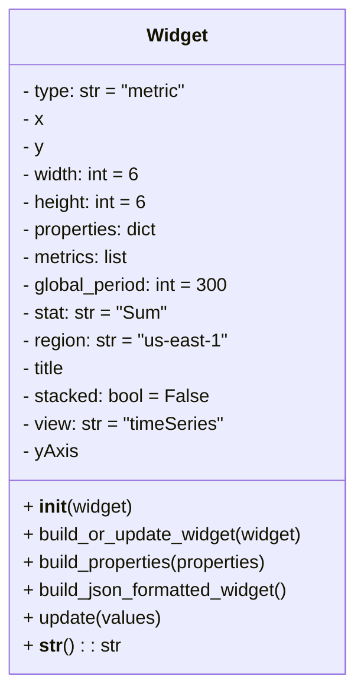

# Diagram: common/monitoring/monitoring/dashboard/Widget.py

> Auto-generated by Obscura crawlers

## Mermaid

### SVG

<svg id="container" width="311.1640625" xmlns="http://www.w3.org/2000/svg" class="classDiagram" height="592" viewBox="0 0 311.1640625 592" role="graphics-document document" aria-roledescription="class"><g><defs><marker id="container_class-aggregationStart" class="marker aggregation class" refX="18" refY="7" markerWidth="190" markerHeight="240" orient="auto"><path d="M 18,7 L9,13 L1,7 L9,1 Z"></path></marker></defs><defs><marker id="container_class-aggregationEnd" class="marker aggregation class" refX="1" refY="7" markerWidth="20" markerHeight="28" orient="auto"><path d="M 18,7 L9,13 L1,7 L9,1 Z"></path></marker></defs><defs><marker id="container_class-extensionStart" class="marker extension class" refX="18" refY="7" markerWidth="190" markerHeight="240" orient="auto"><path d="M 1,7 L18,13 V 1 Z"></path></marker></defs><defs><marker id="container_class-extensionEnd" class="marker extension class" refX="1" refY="7" markerWidth="20" markerHeight="28" orient="auto"><path d="M 1,1 V 13 L18,7 Z"></path></marker></defs><defs><marker id="container_class-compositionStart" class="marker composition class" refX="18" refY="7" markerWidth="190" markerHeight="240" orient="auto"><path d="M 18,7 L9,13 L1,7 L9,1 Z"></path></marker></defs><defs><marker id="container_class-compositionEnd" class="marker composition class" refX="1" refY="7" markerWidth="20" markerHeight="28" orient="auto"><path d="M 18,7 L9,13 L1,7 L9,1 Z"></path></marker></defs><defs><marker id="container_class-dependencyStart" class="marker dependency class" refX="6" refY="7" markerWidth="190" markerHeight="240" orient="auto"><path d="M 5,7 L9,13 L1,7 L9,1 Z"></path></marker></defs><defs><marker id="container_class-dependencyEnd" class="marker dependency class" refX="13" refY="7" markerWidth="20" markerHeight="28" orient="auto"><path d="M 18,7 L9,13 L14,7 L9,1 Z"></path></marker></defs><defs><marker id="container_class-lollipopStart" class="marker lollipop class" refX="13" refY="7" markerWidth="190" markerHeight="240" orient="auto"><circle stroke="black" fill="transparent" cx="7" cy="7" r="6"></circle></marker></defs><defs><marker id="container_class-lollipopEnd" class="marker lollipop class" refX="1" refY="7" markerWidth="190" markerHeight="240" orient="auto"><circle stroke="black" fill="transparent" cx="7" cy="7" r="6"></circle></marker></defs><g class="root"><g class="clusters"></g><g class="edgePaths"></g><g class="edgeLabels"></g><g class="nodes"><g class="node default" id="classId-Widget-0" transform="translate(155.58203125, 296)"><g class="basic label-container"><path d="M-147.58203125 -288 L147.58203125 -288 L147.58203125 288 L-147.58203125 288" stroke="none" stroke-width="0" fill="#ECECFF" style=""></path><path d="M-147.58203125 -288 C-34.88299709677733 -288, 77.81603705644534 -288, 147.58203125 -288 M-147.58203125 -288 C-42.2033023182215 -288, 63.17542661355699 -288, 147.58203125 -288 M147.58203125 -288 C147.58203125 -172.27395414108028, 147.58203125 -56.54790828216056, 147.58203125 288 M147.58203125 -288 C147.58203125 -86.17408752618718, 147.58203125 115.65182494762564, 147.58203125 288 M147.58203125 288 C80.41364161270448 288, 13.245251975408962 288, -147.58203125 288 M147.58203125 288 C56.65544033060347 288, -34.27115058879306 288, -147.58203125 288 M-147.58203125 288 C-147.58203125 135.12271373200477, -147.58203125 -17.754572535990462, -147.58203125 -288 M-147.58203125 288 C-147.58203125 63.168802164666005, -147.58203125 -161.662395670668, -147.58203125 -288" stroke="#9370DB" stroke-width="1.3" fill="none" stroke-dasharray="0 0" style=""></path></g><g class="annotation-group text" transform="translate(0, -264)"></g><g class="label-group text" transform="translate(-25.5703125, -264)"><g class="label" style="font-weight: bolder" transform="translate(0,-12)"><foreignObject width="51.140625" height="24">

Widget

</foreignObject></g></g><g class="members-group text" transform="translate(-135.58203125, -216)"><g class="label" style="" transform="translate(0,-12)"><foreignObject width="145.78125" height="24">

- type: str = "metric"

</foreignObject></g><g class="label" style="" transform="translate(0,12)"><foreignObject width="18.453125" height="24">

- x

</foreignObject></g><g class="label" style="" transform="translate(0,36)"><foreignObject width="18.5625" height="24">

- y

</foreignObject></g><g class="label" style="" transform="translate(0,60)"><foreignObject width="104.15625" height="24">

- width: int = 6

</foreignObject></g><g class="label" style="" transform="translate(0,84)"><foreignObject width="109.59375" height="24">

- height: int = 6

</foreignObject></g><g class="label" style="" transform="translate(0,108)"><foreignObject width="121.703125" height="24">

- properties: dict

</foreignObject></g><g class="label" style="" transform="translate(0,132)"><foreignObject width="95.234375" height="24">

- metrics: list

</foreignObject></g><g class="label" style="" transform="translate(0,156)"><foreignObject width="181.75" height="24">

- global_period: int = 300

</foreignObject></g><g class="label" style="" transform="translate(0,180)"><foreignObject width="126.71875" height="24">

- stat: str = "Sum"

</foreignObject></g><g class="label" style="" transform="translate(0,204)"><foreignObject width="178.453125" height="24">

- region: str = "us-east-1"

</foreignObject></g><g class="label" style="" transform="translate(0,228)"><foreignObject width="39.921875" height="24">

- title

</foreignObject></g><g class="label" style="" transform="translate(0,252)"><foreignObject width="160.28125" height="24">

- stacked: bool = False

</foreignObject></g><g class="label" style="" transform="translate(0,276)"><foreignObject width="177.046875" height="24">

- view: str = "timeSeries"

</foreignObject></g><g class="label" style="" transform="translate(0,300)"><foreignObject width="47.484375" height="24">

- yAxis

</foreignObject></g></g><g class="methods-group text" transform="translate(-135.58203125, 144)"><g class="label" style="" transform="translate(0,-12)"><foreignObject width="95.15625" height="24">

+ <strong>init</strong>(widget)

</foreignObject></g><g class="label" style="" transform="translate(0,12)"><foreignObject width="245.59375" height="24">

+ build_or_update_widget(widget)

</foreignObject></g><g class="label" style="" transform="translate(0,36)"><foreignObject width="219.265625" height="24">

+ build_properties(properties)

</foreignObject></g><g class="label" style="" transform="translate(0,60)"><foreignObject width="236.515625" height="24">

+ build_json_formatted_widget()

</foreignObject></g><g class="label" style="" transform="translate(0,84)"><foreignObject width="120.296875" height="24">

+ update(values)

</foreignObject></g><g class="label" style="" transform="translate(0,108)"><foreignObject width="82.765625" height="24">

+ <strong>str</strong>() : : str

</foreignObject></g></g><g class="divider" style=""><path d="M-147.58203125 -240 C-36.463361478749775 -240, 74.65530829250045 -240, 147.58203125 -240 M-147.58203125 -240 C-47.482067502468695 -240, 52.61789624506261 -240, 147.58203125 -240" stroke="#9370DB" stroke-width="1.3" fill="none" stroke-dasharray="0 0" style=""></path></g><g class="divider" style=""><path d="M-147.58203125 120 C-71.80140915370829 120, 3.979212942583416 120, 147.58203125 120 M-147.58203125 120 C-41.50308153367868 120, 64.57586818264264 120, 147.58203125 120" stroke="#9370DB" stroke-width="1.3" fill="none" stroke-dasharray="0 0" style=""></path></g></g></g></g></g></svg>
