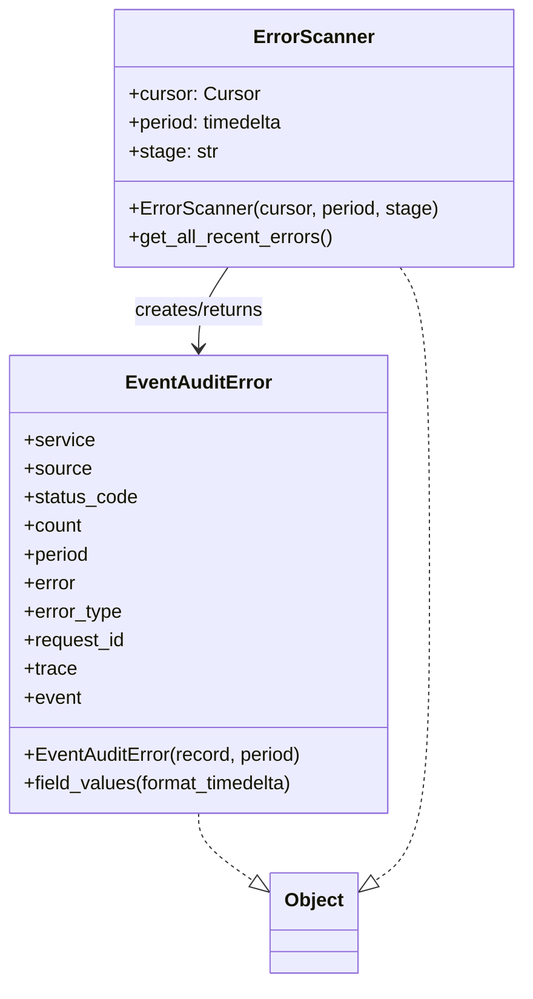

# Diagram: common/monitoring/monitoring/error_scan/scan.py

> Auto-generated by Obscura crawlers

## Mermaid

### SVG

<svg id="container" width="436.564453125" xmlns="http://www.w3.org/2000/svg" class="classDiagram" height="824" viewBox="0 0 436.564453125 824" role="graphics-document document" aria-roledescription="class"><g><defs><marker id="container_class-aggregationStart" class="marker aggregation class" refX="18" refY="7" markerWidth="190" markerHeight="240" orient="auto"><path d="M 18,7 L9,13 L1,7 L9,1 Z"></path></marker></defs><defs><marker id="container_class-aggregationEnd" class="marker aggregation class" refX="1" refY="7" markerWidth="20" markerHeight="28" orient="auto"><path d="M 18,7 L9,13 L1,7 L9,1 Z"></path></marker></defs><defs><marker id="container_class-extensionStart" class="marker extension class" refX="18" refY="7" markerWidth="190" markerHeight="240" orient="auto"><path d="M 1,7 L18,13 V 1 Z"></path></marker></defs><defs><marker id="container_class-extensionEnd" class="marker extension class" refX="1" refY="7" markerWidth="20" markerHeight="28" orient="auto"><path d="M 1,1 V 13 L18,7 Z"></path></marker></defs><defs><marker id="container_class-compositionStart" class="marker composition class" refX="18" refY="7" markerWidth="190" markerHeight="240" orient="auto"><path d="M 18,7 L9,13 L1,7 L9,1 Z"></path></marker></defs><defs><marker id="container_class-compositionEnd" class="marker composition class" refX="1" refY="7" markerWidth="20" markerHeight="28" orient="auto"><path d="M 18,7 L9,13 L1,7 L9,1 Z"></path></marker></defs><defs><marker id="container_class-dependencyStart" class="marker dependency class" refX="6" refY="7" markerWidth="190" markerHeight="240" orient="auto"><path d="M 5,7 L9,13 L1,7 L9,1 Z"></path></marker></defs><defs><marker id="container_class-dependencyEnd" class="marker dependency class" refX="13" refY="7" markerWidth="20" markerHeight="28" orient="auto"><path d="M 18,7 L9,13 L14,7 L9,1 Z"></path></marker></defs><defs><marker id="container_class-lollipopStart" class="marker lollipop class" refX="13" refY="7" markerWidth="190" markerHeight="240" orient="auto"><circle stroke="black" fill="transparent" cx="7" cy="7" r="6"></circle></marker></defs><defs><marker id="container_class-lollipopEnd" class="marker lollipop class" refX="1" refY="7" markerWidth="190" markerHeight="240" orient="auto"><circle stroke="black" fill="transparent" cx="7" cy="7" r="6"></circle></marker></defs><g class="root"><g class="clusters"></g><g class="edgePaths"><path d="M190.91,224L186.801,230.167C182.692,236.333,174.473,248.667,170.363,260C166.254,271.333,166.254,281.667,166.254,286.833L166.254,292" id="id_ErrorScanner_EventAuditError_1" class="edge-thickness-normal edge-pattern-solid relation" style=";;;" data-edge="true" data-et="edge" data-id="id_ErrorScanner_EventAuditError_1" data-points="W3sieCI6MTkwLjkxMDQzOTExNjM3OTMsInkiOjIyNH0seyJ4IjoxNjYuMjUzOTA2MjUsInkiOjI2MX0seyJ4IjoxNjYuMjUzOTA2MjUsInkiOjI5OH1d" marker-end="url(#container_class-dependencyEnd)"></path><path d="M166.254,682L166.254,686.167C166.254,690.333,166.254,698.667,174.014,708.214C181.774,717.762,197.294,728.523,205.054,733.904L212.815,739.285" id="id_EventAuditError_Object_2" class="edge-thickness-normal edge-pattern-dashed relation" style=";;;" data-edge="true" data-et="edge" data-id="id_EventAuditError_Object_2" data-points="W3sieCI6MTY2LjI1MzkwNjI1LCJ5Ijo2ODJ9LHsieCI6MTY2LjI1MzkwNjI1LCJ5Ijo3MDd9LHsieCI6MjI2Ljk5MDIzNDM3NSwieSI6NzQ5LjExMzg2MDA4NTI5OX1d" marker-end="url(#container_class-extensionEnd)"></path><path d="M334.851,224L338.961,230.167C343.07,236.333,351.289,248.667,355.398,293C359.508,337.333,359.508,413.667,359.508,488C359.508,562.333,359.508,634.667,351.748,676.214C343.988,717.762,328.467,728.523,320.707,733.904L312.947,739.285" id="id_ErrorScanner_Object_3" class="edge-thickness-normal edge-pattern-dashed relation" style=";;;" data-edge="true" data-et="edge" data-id="id_ErrorScanner_Object_3" data-points="W3sieCI6MzM0Ljg1MTI3OTYzMzYyMDcsInkiOjIyNH0seyJ4IjozNTkuNTA3ODEyNSwieSI6MjYxfSx7IngiOjM1OS41MDc4MTI1LCJ5Ijo0OTB9LHsieCI6MzU5LjUwNzgxMjUsInkiOjcwN30seyJ4IjoyOTguNzcxNDg0Mzc1LCJ5Ijo3NDkuMTEzODYwMDg1Mjk5fV0=" marker-end="url(#container_class-extensionEnd)"></path></g><g class="edgeLabels"><g class="edgeLabel" transform="translate(166.25390625, 261)"><g class="label" data-id="id_ErrorScanner_EventAuditError_1" transform="translate(-56.359375, -12)"><foreignObject width="112.71875" height="24">

creates/returns

</foreignObject></g></g><g class="edgeLabel"><g class="label" data-id="id_EventAuditError_Object_2" transform="translate(0, 0)"><foreignObject width="0" height="0">

</foreignObject></g></g><g class="edgeLabel"><g class="label" data-id="id_ErrorScanner_Object_3" transform="translate(0, 0)"><foreignObject width="0" height="0">

</foreignObject></g></g></g><g class="nodes"><g class="node default" id="classId-EventAuditError-0" transform="translate(166.25390625, 490)"><g class="basic label-container"><path d="M-158.25390625 -192 L158.25390625 -192 L158.25390625 192 L-158.25390625 192" stroke="none" stroke-width="0" fill="#ECECFF" style=""></path><path d="M-158.25390625 -192 C-48.63133594827251 -192, 60.991234353454985 -192, 158.25390625 -192 M-158.25390625 -192 C-77.10998874981816 -192, 4.033928750363685 -192, 158.25390625 -192 M158.25390625 -192 C158.25390625 -52.239187898243955, 158.25390625 87.52162420351209, 158.25390625 192 M158.25390625 -192 C158.25390625 -107.40944174732697, 158.25390625 -22.81888349465393, 158.25390625 192 M158.25390625 192 C69.79896106208076 192, -18.655984125838472 192, -158.25390625 192 M158.25390625 192 C45.494866373048964 192, -67.26417350390207 192, -158.25390625 192 M-158.25390625 192 C-158.25390625 68.11630977614563, -158.25390625 -55.767380447708746, -158.25390625 -192 M-158.25390625 192 C-158.25390625 54.37924765199156, -158.25390625 -83.24150469601688, -158.25390625 -192" stroke="#9370DB" stroke-width="1.3" fill="none" stroke-dasharray="0 0" style=""></path></g><g class="annotation-group text" transform="translate(0, -168)"></g><g class="label-group text" transform="translate(-57.8359375, -168)"><g class="label" style="font-weight: bolder" transform="translate(0,-12)"><foreignObject width="115.671875" height="24">

EventAuditError

</foreignObject></g></g><g class="members-group text" transform="translate(-146.25390625, -120)"><g class="label" style="" transform="translate(0,-12)"><foreignObject width="58.796875" height="24">

+service

</foreignObject></g><g class="label" style="" transform="translate(0,12)"><foreignObject width="55.859375" height="24">

+source

</foreignObject></g><g class="label" style="" transform="translate(0,36)"><foreignObject width="95.03125" height="24">

+status_code

</foreignObject></g><g class="label" style="" transform="translate(0,60)"><foreignObject width="49.125" height="24">

+count

</foreignObject></g><g class="label" style="" transform="translate(0,84)"><foreignObject width="55.8125" height="24">

+period

</foreignObject></g><g class="label" style="" transform="translate(0,108)"><foreignObject width="44.109375" height="24">

+error

</foreignObject></g><g class="label" style="" transform="translate(0,132)"><foreignObject width="82.609375" height="24">

+error_type

</foreignObject></g><g class="label" style="" transform="translate(0,156)"><foreignObject width="85.65625" height="24">

+request_id

</foreignObject></g><g class="label" style="" transform="translate(0,180)"><foreignObject width="44.0625" height="24">

+trace

</foreignObject></g><g class="label" style="" transform="translate(0,204)"><foreignObject width="48.328125" height="24">

+event

</foreignObject></g></g><g class="methods-group text" transform="translate(-146.25390625, 144)"><g class="label" style="" transform="translate(0,-12)"><foreignObject width="234.671875" height="24">

+EventAuditError(record, period)

</foreignObject></g><g class="label" style="" transform="translate(0,12)"><foreignObject width="231.390625" height="24">

+field_values(format_timedelta)

</foreignObject></g></g><g class="divider" style=""><path d="M-158.25390625 -144 C-85.15968387779557 -144, -12.065461505591145 -144, 158.25390625 -144 M-158.25390625 -144 C-93.40366208660333 -144, -28.553417923206666 -144, 158.25390625 -144" stroke="#9370DB" stroke-width="1.3" fill="none" stroke-dasharray="0 0" style=""></path></g><g class="divider" style=""><path d="M-158.25390625 120 C-57.06261189350862 120, 44.128682462982766 120, 158.25390625 120 M-158.25390625 120 C-43.55711706999355 120, 71.1396721100129 120, 158.25390625 120" stroke="#9370DB" stroke-width="1.3" fill="none" stroke-dasharray="0 0" style=""></path></g></g><g class="node default" id="classId-ErrorScanner-1" transform="translate(262.880859375, 116)"><g class="basic label-container"><path d="M-165.68359375 -108 L165.68359375 -108 L165.68359375 108 L-165.68359375 108" stroke="none" stroke-width="0" fill="#ECECFF" style=""></path><path d="M-165.68359375 -108 C-73.55340125452747 -108, 18.576791240945056 -108, 165.68359375 -108 M-165.68359375 -108 C-67.05336439532024 -108, 31.57686495935951 -108, 165.68359375 -108 M165.68359375 -108 C165.68359375 -55.82367513557536, 165.68359375 -3.6473502711507138, 165.68359375 108 M165.68359375 -108 C165.68359375 -48.54610285308583, 165.68359375 10.907794293828346, 165.68359375 108 M165.68359375 108 C55.05473987268846 108, -55.574114004623084 108, -165.68359375 108 M165.68359375 108 C87.9868156368542 108, 10.290037523708406 108, -165.68359375 108 M-165.68359375 108 C-165.68359375 63.48720238230882, -165.68359375 18.974404764617645, -165.68359375 -108 M-165.68359375 108 C-165.68359375 23.77833242468465, -165.68359375 -60.4433351506307, -165.68359375 -108" stroke="#9370DB" stroke-width="1.3" fill="none" stroke-dasharray="0 0" style=""></path></g><g class="annotation-group text" transform="translate(0, -84)"></g><g class="label-group text" transform="translate(-47.7578125, -84)"><g class="label" style="font-weight: bolder" transform="translate(0,-12)"><foreignObject width="95.515625" height="24">

ErrorScanner

</foreignObject></g></g><g class="members-group text" transform="translate(-153.68359375, -36)"><g class="label" style="" transform="translate(0,-12)"><foreignObject width="108.890625" height="24">

+cursor: Cursor

</foreignObject></g><g class="label" style="" transform="translate(0,12)"><foreignObject width="133.953125" height="24">

+period: timedelta

</foreignObject></g><g class="label" style="" transform="translate(0,36)"><foreignObject width="73.953125" height="24">

+stage: str

</foreignObject></g></g><g class="methods-group text" transform="translate(-153.68359375, 60)"><g class="label" style="" transform="translate(0,-12)"><foreignObject width="259.609375" height="24">

+ErrorScanner(cursor, period, stage)

</foreignObject></g><g class="label" style="" transform="translate(0,12)"><foreignObject width="172.125" height="24">

+get_all_recent_errors()

</foreignObject></g></g><g class="divider" style=""><path d="M-165.68359375 -60 C-68.06217345026279 -60, 29.55924684947442 -60, 165.68359375 -60 M-165.68359375 -60 C-87.27466164559932 -60, -8.865729541198647 -60, 165.68359375 -60" stroke="#9370DB" stroke-width="1.3" fill="none" stroke-dasharray="0 0" style=""></path></g><g class="divider" style=""><path d="M-165.68359375 36 C-42.97249141819539 36, 79.73861091360922 36, 165.68359375 36 M-165.68359375 36 C-84.34085203803684 36, -2.998110326073686 36, 165.68359375 36" stroke="#9370DB" stroke-width="1.3" fill="none" stroke-dasharray="0 0" style=""></path></g></g><g class="node default" id="classId-Object-2" transform="translate(262.880859375, 774)"><g class="basic label-container"><path d="M-35.890625 -42 L35.890625 -42 L35.890625 42 L-35.890625 42" stroke="none" stroke-width="0" fill="#ECECFF" style=""></path><path d="M-35.890625 -42 C-19.804182189658786 -42, -3.717739379317571 -42, 35.890625 -42 M-35.890625 -42 C-12.41798112266762 -42, 11.054662754664761 -42, 35.890625 -42 M35.890625 -42 C35.890625 -24.7961696475468, 35.890625 -7.592339295093602, 35.890625 42 M35.890625 -42 C35.890625 -22.436950763724237, 35.890625 -2.8739015274484743, 35.890625 42 M35.890625 42 C20.043464900146198 42, 4.196304800292392 42, -35.890625 42 M35.890625 42 C20.02009924415694 42, 4.14957348831388 42, -35.890625 42 M-35.890625 42 C-35.890625 14.872800732777598, -35.890625 -12.254398534444803, -35.890625 -42 M-35.890625 42 C-35.890625 12.438467115213378, -35.890625 -17.123065769573245, -35.890625 -42" stroke="#9370DB" stroke-width="1.3" fill="none" stroke-dasharray="0 0" style=""></path></g><g class="annotation-group text" transform="translate(0, -18)"></g><g class="label-group text" transform="translate(-23.890625, -18)"><g class="label" style="font-weight: bolder" transform="translate(0,-12)"><foreignObject width="47.78125" height="24">

Object

</foreignObject></g></g><g class="members-group text" transform="translate(-23.890625, 30)"></g><g class="methods-group text" transform="translate(-23.890625, 60)"></g><g class="divider" style=""><path d="M-35.890625 6 C-19.65089785284726 6, -3.4111707056945235 6, 35.890625 6 M-35.890625 6 C-8.017694641149063 6, 19.855235717701873 6, 35.890625 6" stroke="#9370DB" stroke-width="1.3" fill="none" stroke-dasharray="0 0" style=""></path></g><g class="divider" style=""><path d="M-35.890625 24 C-10.17440996370917 24, 15.54180507258166 24, 35.890625 24 M-35.890625 24 C-12.262010825826202 24, 11.366603348347596 24, 35.890625 24" stroke="#9370DB" stroke-width="1.3" fill="none" stroke-dasharray="0 0" style=""></path></g></g></g></g></g></svg>
