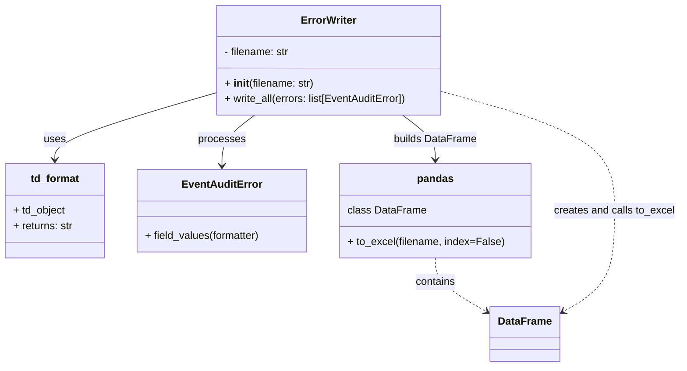

# Diagram: common/monitoring/monitoring/error_scan/write.py

> Auto-generated by Obscura crawlers

## Mermaid

### SVG

<svg id="container" width="1036.625" xmlns="http://www.w3.org/2000/svg" class="classDiagram" height="560" viewBox="0 0 1036.625 560" role="graphics-document document" aria-roledescription="class"><g><defs><marker id="container_class-aggregationStart" class="marker aggregation class" refX="18" refY="7" markerWidth="190" markerHeight="240" orient="auto"><path d="M 18,7 L9,13 L1,7 L9,1 Z"></path></marker></defs><defs><marker id="container_class-aggregationEnd" class="marker aggregation class" refX="1" refY="7" markerWidth="20" markerHeight="28" orient="auto"><path d="M 18,7 L9,13 L1,7 L9,1 Z"></path></marker></defs><defs><marker id="container_class-extensionStart" class="marker extension class" refX="18" refY="7" markerWidth="190" markerHeight="240" orient="auto"><path d="M 1,7 L18,13 V 1 Z"></path></marker></defs><defs><marker id="container_class-extensionEnd" class="marker extension class" refX="1" refY="7" markerWidth="20" markerHeight="28" orient="auto"><path d="M 1,1 V 13 L18,7 Z"></path></marker></defs><defs><marker id="container_class-compositionStart" class="marker composition class" refX="18" refY="7" markerWidth="190" markerHeight="240" orient="auto"><path d="M 18,7 L9,13 L1,7 L9,1 Z"></path></marker></defs><defs><marker id="container_class-compositionEnd" class="marker composition class" refX="1" refY="7" markerWidth="20" markerHeight="28" orient="auto"><path d="M 18,7 L9,13 L1,7 L9,1 Z"></path></marker></defs><defs><marker id="container_class-dependencyStart" class="marker dependency class" refX="6" refY="7" markerWidth="190" markerHeight="240" orient="auto"><path d="M 5,7 L9,13 L1,7 L9,1 Z"></path></marker></defs><defs><marker id="container_class-dependencyEnd" class="marker dependency class" refX="13" refY="7" markerWidth="20" markerHeight="28" orient="auto"><path d="M 18,7 L9,13 L14,7 L9,1 Z"></path></marker></defs><defs><marker id="container_class-lollipopStart" class="marker lollipop class" refX="13" refY="7" markerWidth="190" markerHeight="240" orient="auto"><circle stroke="black" fill="transparent" cx="7" cy="7" r="6"></circle></marker></defs><defs><marker id="container_class-lollipopEnd" class="marker lollipop class" refX="1" refY="7" markerWidth="190" markerHeight="240" orient="auto"><circle stroke="black" fill="transparent" cx="7" cy="7" r="6"></circle></marker></defs><g class="root"><g class="clusters"></g><g class="edgePaths"><path d="M328.941,142.292L288.192,154.076C247.443,165.861,165.944,189.431,125.195,206.382C84.445,223.333,84.445,233.667,84.445,238.833L84.445,244" id="id_ErrorWriter_td_format_1" class="edge-thickness-normal edge-pattern-solid relation" style=";;;" data-edge="true" data-et="edge" data-id="id_ErrorWriter_td_format_1" data-points="W3sieCI6MzI4Ljk0MTQwNjI1LCJ5IjoxNDIuMjkxNTUzNDY0MjI4MDN9LHsieCI6ODQuNDQ1MzEyNSwieSI6MjEzfSx7IngiOjg0LjQ0NTMxMjUsInkiOjI1MH1d" marker-end="url(#container_class-dependencyEnd)"></path><path d="M390.437,176L382.185,182.167C373.933,188.333,357.429,200.667,349.178,213.5C340.926,226.333,340.926,239.667,340.926,246.333L340.926,253" id="id_ErrorWriter_EventAuditError_2" class="edge-thickness-normal edge-pattern-solid relation" style=";;;" data-edge="true" data-et="edge" data-id="id_ErrorWriter_EventAuditError_2" data-points="W3sieCI6MzkwLjQzNjY5MjkyMzU1MzcsInkiOjE3Nn0seyJ4IjozNDAuOTI1NzgxMjUsInkiOjIxM30seyJ4IjozNDAuOTI1NzgxMjUsInkiOjI1OX1d" marker-end="url(#container_class-dependencyEnd)"></path><path d="M615.243,176L623.495,182.167C631.747,188.333,648.25,200.667,656.502,212C664.754,223.333,664.754,233.667,664.754,238.833L664.754,244" id="id_ErrorWriter_pandas_3" class="edge-thickness-normal edge-pattern-solid relation" style=";;;" data-edge="true" data-et="edge" data-id="id_ErrorWriter_pandas_3" data-points="W3sieCI6NjE1LjI0Mjk5NDU3NjQ0NjMsInkiOjE3Nn0seyJ4Ijo2NjQuNzUzOTA2MjUsInkiOjIxM30seyJ4Ijo2NjQuNzUzOTA2MjUsInkiOjI1MH1d" marker-end="url(#container_class-dependencyEnd)"></path><path d="M664.754,394L664.754,400.167C664.754,406.333,664.754,418.667,678.002,432.548C691.25,446.429,717.746,461.858,730.995,469.573L744.243,477.287" id="id_pandas_DataFrame_4" class="edge-thickness-normal edge-pattern-dashed relation" style=";;;" data-edge="true" data-et="edge" data-id="id_pandas_DataFrame_4" data-points="W3sieCI6NjY0Ljc1MzkwNjI1LCJ5IjozOTR9LHsieCI6NjY0Ljc1MzkwNjI1LCJ5Ijo0MzF9LHsieCI6NzQ5LjQyNzczNDM3NSwieSI6NDgwLjMwNjYxODEwMjI0NDQ0fV0=" marker-end="url(#container_class-dependencyEnd)"></path><path d="M676.738,140.568L719.963,152.64C763.188,164.712,849.637,188.856,892.861,219.095C936.086,249.333,936.086,285.667,936.086,322C936.086,358.333,936.086,394.667,922.838,420.548C909.59,446.429,883.093,461.858,869.845,469.573L856.597,477.287" id="id_ErrorWriter_DataFrame_5" class="edge-thickness-normal edge-pattern-dashed relation" style=";;;" data-edge="true" data-et="edge" data-id="id_ErrorWriter_DataFrame_5" data-points="W3sieCI6Njc2LjczODI4MTI1LCJ5IjoxNDAuNTY3NTcyMTk3NTI3NzR9LHsieCI6OTM2LjA4NTkzNzUsInkiOjIxM30seyJ4Ijo5MzYuMDg1OTM3NSwieSI6MzIyfSx7IngiOjkzNi4wODU5Mzc1LCJ5Ijo0MzF9LHsieCI6ODUxLjQxMjEwOTM3NSwieSI6NDgwLjMwNjYxODEwMjI0NDQ0fV0=" marker-end="url(#container_class-dependencyEnd)"></path></g><g class="edgeLabels"><g class="edgeLabel" transform="translate(84.4453125, 213)"><g class="label" data-id="id_ErrorWriter_td_format_1" transform="translate(-16.4921875, -12)"><foreignObject width="32.984375" height="24">

uses

</foreignObject></g></g><g class="edgeLabel" transform="translate(340.92578125, 213)"><g class="label" data-id="id_ErrorWriter_EventAuditError_2" transform="translate(-35.7890625, -12)"><foreignObject width="71.578125" height="24">

processes

</foreignObject></g></g><g class="edgeLabel" transform="translate(664.75390625, 213)"><g class="label" data-id="id_ErrorWriter_pandas_3" transform="translate(-63.2421875, -12)"><foreignObject width="126.484375" height="24">

builds DataFrame

</foreignObject></g></g><g class="edgeLabel" transform="translate(664.75390625, 431)"><g class="label" data-id="id_pandas_DataFrame_4" transform="translate(-30.890625, -12)"><foreignObject width="61.78125" height="24">

contains

</foreignObject></g></g><g class="edgeLabel" transform="translate(936.0859375, 322)"><g class="label" data-id="id_ErrorWriter_DataFrame_5" transform="translate(-92.5390625, -12)"><foreignObject width="185.078125" height="24">

creates and calls to_excel

</foreignObject></g></g></g><g class="nodes"><g class="node default" id="classId-ErrorWriter-0" transform="translate(502.83984375, 92)"><g class="basic label-container"><path d="M-173.8984375 -84 L173.8984375 -84 L173.8984375 84 L-173.8984375 84" stroke="none" stroke-width="0" fill="#ECECFF" style=""></path><path d="M-173.8984375 -84 C-78.78319943067133 -84, 16.332038638657338 -84, 173.8984375 -84 M-173.8984375 -84 C-77.266610587436 -84, 19.36521632512799 -84, 173.8984375 -84 M173.8984375 -84 C173.8984375 -27.629481531935923, 173.8984375 28.741036936128154, 173.8984375 84 M173.8984375 -84 C173.8984375 -38.995827202885295, 173.8984375 6.008345594229411, 173.8984375 84 M173.8984375 84 C66.26268298302772 84, -41.37307153394457 84, -173.8984375 84 M173.8984375 84 C63.87390482606533 84, -46.150627847869345 84, -173.8984375 84 M-173.8984375 84 C-173.8984375 25.46593729142952, -173.8984375 -33.06812541714096, -173.8984375 -84 M-173.8984375 84 C-173.8984375 37.23556370550286, -173.8984375 -9.528872588994275, -173.8984375 -84" stroke="#9370DB" stroke-width="1.3" fill="none" stroke-dasharray="0 0" style=""></path></g><g class="annotation-group text" transform="translate(0, -60)"></g><g class="label-group text" transform="translate(-40.953125, -60)"><g class="label" style="font-weight: bolder" transform="translate(0,-12)"><foreignObject width="81.90625" height="24">

ErrorWriter

</foreignObject></g></g><g class="members-group text" transform="translate(-161.8984375, -12)"><g class="label" style="" transform="translate(0,-12)"><foreignObject width="101.234375" height="24">

- filename: str

</foreignObject></g></g><g class="methods-group text" transform="translate(-161.8984375, 36)"><g class="label" style="" transform="translate(0,-12)"><foreignObject width="137.59375" height="24">

+ <strong>init</strong>(filename: str)

</foreignObject></g><g class="label" style="" transform="translate(0,12)"><foreignObject width="282.84375" height="24">

+ write_all(errors: list[EventAuditError])

</foreignObject></g></g><g class="divider" style=""><path d="M-173.8984375 -36 C-57.94525625473658 -36, 58.007924990526845 -36, 173.8984375 -36 M-173.8984375 -36 C-94.04202713637886 -36, -14.185616772757726 -36, 173.8984375 -36" stroke="#9370DB" stroke-width="1.3" fill="none" stroke-dasharray="0 0" style=""></path></g><g class="divider" style=""><path d="M-173.8984375 12 C-36.04263965494823 12, 101.81315819010354 12, 173.8984375 12 M-173.8984375 12 C-46.23118196969406 12, 81.43607356061187 12, 173.8984375 12" stroke="#9370DB" stroke-width="1.3" fill="none" stroke-dasharray="0 0" style=""></path></g></g><g class="node default" id="classId-td_format-1" transform="translate(84.4453125, 322)"><g class="basic label-container"><path d="M-76.4453125 -72 L76.4453125 -72 L76.4453125 72 L-76.4453125 72" stroke="none" stroke-width="0" fill="#ECECFF" style=""></path><path d="M-76.4453125 -72 C-44.78643286498325 -72, -13.127553229966495 -72, 76.4453125 -72 M-76.4453125 -72 C-16.73217843798421 -72, 42.98095562403158 -72, 76.4453125 -72 M76.4453125 -72 C76.4453125 -26.761614222368422, 76.4453125 18.476771555263156, 76.4453125 72 M76.4453125 -72 C76.4453125 -15.762408958573822, 76.4453125 40.475182082852356, 76.4453125 72 M76.4453125 72 C27.38691899827338 72, -21.67147450345324 72, -76.4453125 72 M76.4453125 72 C37.05670780814162 72, -2.331896883716766 72, -76.4453125 72 M-76.4453125 72 C-76.4453125 31.450950817642713, -76.4453125 -9.098098364714573, -76.4453125 -72 M-76.4453125 72 C-76.4453125 26.716636275504385, -76.4453125 -18.56672744899123, -76.4453125 -72" stroke="#9370DB" stroke-width="1.3" fill="none" stroke-dasharray="0 0" style=""></path></g><g class="annotation-group text" transform="translate(0, -48)"></g><g class="label-group text" transform="translate(-36.625, -48)"><g class="label" style="font-weight: bolder" transform="translate(0,-12)"><foreignObject width="73.25" height="24">

td_format

</foreignObject></g></g><g class="members-group text" transform="translate(-64.4453125, 0)"><g class="label" style="" transform="translate(0,-12)"><foreignObject width="80.8125" height="24">

+ td_object

</foreignObject></g><g class="label" style="" transform="translate(0,12)"><foreignObject width="92.265625" height="24">

+ returns: str

</foreignObject></g></g><g class="methods-group text" transform="translate(-64.4453125, 72)"></g><g class="divider" style=""><path d="M-76.4453125 -24 C-40.15849212433851 -24, -3.8716717486770165 -24, 76.4453125 -24 M-76.4453125 -24 C-32.26636700423653 -24, 11.912578491526943 -24, 76.4453125 -24" stroke="#9370DB" stroke-width="1.3" fill="none" stroke-dasharray="0 0" style=""></path></g><g class="divider" style=""><path d="M-76.4453125 48 C-44.47238032946275 48, -12.49944815892551 48, 76.4453125 48 M-76.4453125 48 C-28.171573181473903 48, 20.102166137052194 48, 76.4453125 48" stroke="#9370DB" stroke-width="1.3" fill="none" stroke-dasharray="0 0" style=""></path></g></g><g class="node default" id="classId-EventAuditError-2" transform="translate(340.92578125, 322)"><g class="basic label-container"><path d="M-130.03515625 -63 L130.03515625 -63 L130.03515625 63 L-130.03515625 63" stroke="none" stroke-width="0" fill="#ECECFF" style=""></path><path d="M-130.03515625 -63 C-40.88331242298926 -63, 48.26853140402147 -63, 130.03515625 -63 M-130.03515625 -63 C-57.92189787184812 -63, 14.191360506303766 -63, 130.03515625 -63 M130.03515625 -63 C130.03515625 -19.310867200333277, 130.03515625 24.378265599333446, 130.03515625 63 M130.03515625 -63 C130.03515625 -18.69697507000042, 130.03515625 25.60604985999916, 130.03515625 63 M130.03515625 63 C31.773794429053396 63, -66.48756739189321 63, -130.03515625 63 M130.03515625 63 C42.40072560071384 63, -45.23370504857232 63, -130.03515625 63 M-130.03515625 63 C-130.03515625 36.31685199675537, -130.03515625 9.633703993510736, -130.03515625 -63 M-130.03515625 63 C-130.03515625 18.92170327349065, -130.03515625 -25.1565934530187, -130.03515625 -63" stroke="#9370DB" stroke-width="1.3" fill="none" stroke-dasharray="0 0" style=""></path></g><g class="annotation-group text" transform="translate(0, -39)"></g><g class="label-group text" transform="translate(-57.8359375, -39)"><g class="label" style="font-weight: bolder" transform="translate(0,-12)"><foreignObject width="115.671875" height="24">

EventAuditError

</foreignObject></g></g><g class="members-group text" transform="translate(-118.03515625, 9)"></g><g class="methods-group text" transform="translate(-118.03515625, 39)"><g class="label" style="" transform="translate(0,-12)"><foreignObject width="178.234375" height="24">

+ field_values(formatter)

</foreignObject></g></g><g class="divider" style=""><path d="M-130.03515625 -15 C-65.54909762673321 -15, -1.0630390034664288 -15, 130.03515625 -15 M-130.03515625 -15 C-26.80462753752856 -15, 76.42590117494288 -15, 130.03515625 -15" stroke="#9370DB" stroke-width="1.3" fill="none" stroke-dasharray="0 0" style=""></path></g><g class="divider" style=""><path d="M-130.03515625 9 C-33.308504252290774 9, 63.41814774541845 9, 130.03515625 9 M-130.03515625 9 C-42.29203629611436 9, 45.45108365777128 9, 130.03515625 9" stroke="#9370DB" stroke-width="1.3" fill="none" stroke-dasharray="0 0" style=""></path></g></g><g class="node default" id="classId-pandas-3" transform="translate(664.75390625, 322)"><g class="basic label-container"><path d="M-143.79296875 -72 L143.79296875 -72 L143.79296875 72 L-143.79296875 72" stroke="none" stroke-width="0" fill="#ECECFF" style=""></path><path d="M-143.79296875 -72 C-47.21922786983076 -72, 49.35451301033848 -72, 143.79296875 -72 M-143.79296875 -72 C-33.00089103217131 -72, 77.79118668565738 -72, 143.79296875 -72 M143.79296875 -72 C143.79296875 -39.07465827094761, 143.79296875 -6.149316541895217, 143.79296875 72 M143.79296875 -72 C143.79296875 -21.71693667765785, 143.79296875 28.566126644684303, 143.79296875 72 M143.79296875 72 C59.95050209576449 72, -23.891964558471017 72, -143.79296875 72 M143.79296875 72 C81.90971261287498 72, 20.02645647574998 72, -143.79296875 72 M-143.79296875 72 C-143.79296875 21.310999431421386, -143.79296875 -29.378001137157227, -143.79296875 -72 M-143.79296875 72 C-143.79296875 15.76343102786523, -143.79296875 -40.47313794426954, -143.79296875 -72" stroke="#9370DB" stroke-width="1.3" fill="none" stroke-dasharray="0 0" style=""></path></g><g class="annotation-group text" transform="translate(0, -48)"></g><g class="label-group text" transform="translate(-26.6640625, -48)"><g class="label" style="font-weight: bolder" transform="translate(0,-12)"><foreignObject width="53.328125" height="24">

pandas

</foreignObject></g></g><g class="members-group text" transform="translate(-131.79296875, 0)"><g class="label" style="" transform="translate(0,-12)"><foreignObject width="117.09375" height="24">

class DataFrame

</foreignObject></g></g><g class="methods-group text" transform="translate(-131.79296875, 48)"><g class="label" style="" transform="translate(0,-12)"><foreignObject width="236.921875" height="24">

+ to_excel(filename, index=False)

</foreignObject></g></g><g class="divider" style=""><path d="M-143.79296875 -24 C-81.51102649095392 -24, -19.229084231907862 -24, 143.79296875 -24 M-143.79296875 -24 C-80.00160641037735 -24, -16.21024407075471 -24, 143.79296875 -24" stroke="#9370DB" stroke-width="1.3" fill="none" stroke-dasharray="0 0" style=""></path></g><g class="divider" style=""><path d="M-143.79296875 24 C-42.3005306396134 24, 59.1919074707732 24, 143.79296875 24 M-143.79296875 24 C-40.062110529305045 24, 63.66874769138991 24, 143.79296875 24" stroke="#9370DB" stroke-width="1.3" fill="none" stroke-dasharray="0 0" style=""></path></g></g><g class="node default" id="classId-DataFrame-4" transform="translate(800.419921875, 510)"><g class="basic label-container"><path d="M-50.9921875 -42 L50.9921875 -42 L50.9921875 42 L-50.9921875 42" stroke="none" stroke-width="0" fill="#ECECFF" style=""></path><path d="M-50.9921875 -42 C-23.860824425293625 -42, 3.2705386494127495 -42, 50.9921875 -42 M-50.9921875 -42 C-25.433453787640744 -42, 0.12527992471851235 -42, 50.9921875 -42 M50.9921875 -42 C50.9921875 -19.84196924476701, 50.9921875 2.3160615104659783, 50.9921875 42 M50.9921875 -42 C50.9921875 -19.001828749673702, 50.9921875 3.996342500652595, 50.9921875 42 M50.9921875 42 C28.6987710491221 42, 6.405354598244202 42, -50.9921875 42 M50.9921875 42 C27.144126124264034 42, 3.2960647485280674 42, -50.9921875 42 M-50.9921875 42 C-50.9921875 25.04945499237827, -50.9921875 8.098909984756538, -50.9921875 -42 M-50.9921875 42 C-50.9921875 14.711534575145897, -50.9921875 -12.576930849708205, -50.9921875 -42" stroke="#9370DB" stroke-width="1.3" fill="none" stroke-dasharray="0 0" style=""></path></g><g class="annotation-group text" transform="translate(0, -18)"></g><g class="label-group text" transform="translate(-38.9921875, -18)"><g class="label" style="font-weight: bolder" transform="translate(0,-12)"><foreignObject width="77.984375" height="24">

DataFrame

</foreignObject></g></g><g class="members-group text" transform="translate(-38.9921875, 30)"></g><g class="methods-group text" transform="translate(-38.9921875, 60)"></g><g class="divider" style=""><path d="M-50.9921875 6 C-22.56100664666432 6, 5.870174206671358 6, 50.9921875 6 M-50.9921875 6 C-13.657877284249672 6, 23.676432931500656 6, 50.9921875 6" stroke="#9370DB" stroke-width="1.3" fill="none" stroke-dasharray="0 0" style=""></path></g><g class="divider" style=""><path d="M-50.9921875 24 C-30.365609050956508 24, -9.739030601913015 24, 50.9921875 24 M-50.9921875 24 C-23.485966093239213 24, 4.020255313521574 24, 50.9921875 24" stroke="#9370DB" stroke-width="1.3" fill="none" stroke-dasharray="0 0" style=""></path></g></g></g></g></g></svg>
