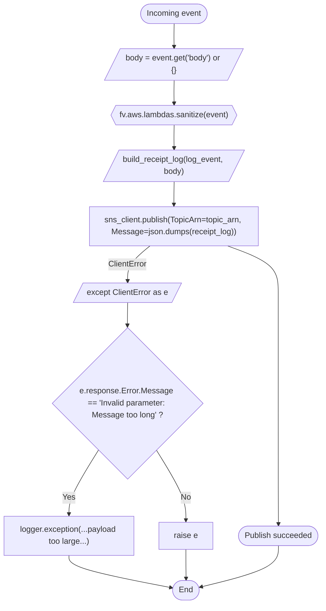

# Diagram: common/monitoring/monitoring/lambdas/audit/audit.py

> Auto-generated by Obscura crawlers

## Diagram 1

### SVG

<svg id="container" width="644.5748291015625" xmlns="http://www.w3.org/2000/svg" class="flowchart" height="1204" viewBox="0 0 644.5748291015625 1204" role="graphics-document document" aria-roledescription="flowchart-v2"><g><marker id="container_flowchart-v2-pointEnd" class="marker flowchart-v2" viewBox="0 0 10 10" refX="5" refY="5" markerUnits="userSpaceOnUse" markerWidth="8" markerHeight="8" orient="auto"><path d="M 0 0 L 10 5 L 0 10 z" class="arrowMarkerPath" style="stroke-width: 1; stroke-dasharray: 1, 0;"></path></marker><marker id="container_flowchart-v2-pointStart" class="marker flowchart-v2" viewBox="0 0 10 10" refX="4.5" refY="5" markerUnits="userSpaceOnUse" markerWidth="8" markerHeight="8" orient="auto"><path d="M 0 5 L 10 10 L 10 0 z" class="arrowMarkerPath" style="stroke-width: 1; stroke-dasharray: 1, 0;"></path></marker><marker id="container_flowchart-v2-circleEnd" class="marker flowchart-v2" viewBox="0 0 10 10" refX="11" refY="5" markerUnits="userSpaceOnUse" markerWidth="11" markerHeight="11" orient="auto"><circle cx="5" cy="5" r="5" class="arrowMarkerPath" style="stroke-width: 1; stroke-dasharray: 1, 0;"></circle></marker><marker id="container_flowchart-v2-circleStart" class="marker flowchart-v2" viewBox="0 0 10 10" refX="-1" refY="5" markerUnits="userSpaceOnUse" markerWidth="11" markerHeight="11" orient="auto"><circle cx="5" cy="5" r="5" class="arrowMarkerPath" style="stroke-width: 1; stroke-dasharray: 1, 0;"></circle></marker><marker id="container_flowchart-v2-crossEnd" class="marker cross flowchart-v2" viewBox="0 0 11 11" refX="12" refY="5.2" markerUnits="userSpaceOnUse" markerWidth="11" markerHeight="11" orient="auto"><path d="M 1,1 l 9,9 M 10,1 l -9,9" class="arrowMarkerPath" style="stroke-width: 2; stroke-dasharray: 1, 0;"></path></marker><marker id="container_flowchart-v2-crossStart" class="marker cross flowchart-v2" viewBox="0 0 11 11" refX="-1" refY="5.2" markerUnits="userSpaceOnUse" markerWidth="11" markerHeight="11" orient="auto"><path d="M 1,1 l 9,9 M 10,1 l -9,9" class="arrowMarkerPath" style="stroke-width: 2; stroke-dasharray: 1, 0;"></path></marker><g class="root"><g class="clusters"></g><g class="edgePaths"><path d="M348.496,47.5L348.413,51.583C348.329,55.667,348.163,63.833,348.15,71.5C348.137,79.167,348.277,86.334,348.347,89.917L348.418,93.501" id="L_Start_ExtractBody_0" class="edge-thickness-normal edge-pattern-solid edge-thickness-normal edge-pattern-solid flowchart-link" style=";" data-edge="true" data-et="edge" data-id="L_Start_ExtractBody_0" data-points="W3sieCI6MzQ4LjQ5NjA5Mzc1LCJ5Ijo0Ny40OTk5OTk5OTk5OTk5OH0seyJ4IjozNDcuOTk2MDkzNzUsInkiOjcyfSx7IngiOjM0OC40OTYwOTM3NSwieSI6OTcuNX1d" marker-end="url(#container_flowchart-v2-pointEnd)"></path><path d="M348.496,160.5L348.413,164.583C348.329,168.667,348.163,176.833,348.15,184.5C348.137,192.167,348.277,199.334,348.347,202.917L348.418,206.501" id="L_ExtractBody_Sanitize_0" class="edge-thickness-normal edge-pattern-solid edge-thickness-normal edge-pattern-solid flowchart-link" style=";" data-edge="true" data-et="edge" data-id="L_ExtractBody_Sanitize_0" data-points="W3sieCI6MzQ4LjQ5NjA5Mzc1LCJ5IjoxNjAuNX0seyJ4IjozNDcuOTk2MDkzNzUsInkiOjE4NX0seyJ4IjozNDguNDk2MDkzNzUsInkiOjIxMC41fV0=" marker-end="url(#container_flowchart-v2-pointEnd)"></path><path d="M348.496,249.5L348.413,253.583C348.329,257.667,348.163,265.833,348.15,273.5C348.137,281.167,348.277,288.334,348.347,291.917L348.418,295.501" id="L_Sanitize_BuildReceipt_0" class="edge-thickness-normal edge-pattern-solid edge-thickness-normal edge-pattern-solid flowchart-link" style=";" data-edge="true" data-et="edge" data-id="L_Sanitize_BuildReceipt_0" data-points="W3sieCI6MzQ4LjQ5NjA5Mzc1LCJ5IjoyNDkuNX0seyJ4IjozNDcuOTk2MDkzNzUsInkiOjI3NH0seyJ4IjozNDguNDk2MDkzNzUsInkiOjI5OS41fV0=" marker-end="url(#container_flowchart-v2-pointEnd)"></path><path d="M348.496,362.5L348.413,366.583C348.329,370.667,348.163,378.833,348.079,386.417C347.996,394,347.996,401,347.996,404.5L347.996,408" id="L_BuildReceipt_Publish_0" class="edge-thickness-normal edge-pattern-solid edge-thickness-normal edge-pattern-solid flowchart-link" style=";" data-edge="true" data-et="edge" data-id="L_BuildReceipt_Publish_0" data-points="W3sieCI6MzQ4LjQ5NjA5Mzc1LCJ5IjozNjIuNX0seyJ4IjozNDcuOTk2MDkzNzUsInkiOjM4N30seyJ4IjozNDcuOTk2MDkzNzUsInkiOjQxMn1d" marker-end="url(#container_flowchart-v2-pointEnd)"></path><path d="M455.171,490L472.118,496.167C489.064,502.333,522.957,514.667,539.904,530.25C556.85,545.833,556.85,564.667,556.85,581.5C556.85,598.333,556.85,613.167,556.85,649.917C556.85,686.667,556.85,745.333,556.85,806C556.85,866.667,556.85,929.333,556.928,969.5C557.005,1009.667,557.16,1027.333,557.238,1036.167L557.315,1045" id="L_Publish_Success_0" class="edge-thickness-normal edge-pattern-solid edge-thickness-normal edge-pattern-solid flowchart-link" style=";" data-edge="true" data-et="edge" data-id="L_Publish_Success_0" data-points="W3sieCI6NDU1LjE3MTM2MDY2ODM4MzE2LCJ5Ijo0OTB9LHsieCI6NTU2Ljg1MDQ2MDA1MjQ5MDIsInkiOjUyN30seyJ4Ijo1NTYuODUwNDYwMDUyNDkwMiwieSI6NTgzLjV9LHsieCI6NTU2Ljg1MDQ2MDA1MjQ5MDIsInkiOjYyOH0seyJ4Ijo1NTYuODUwNDYwMDUyNDkwMiwieSI6ODA0fSx7IngiOjU1Ni44NTA0NjAwNTI0OTAyLCJ5Ijo5OTJ9LHsieCI6NTU3LjM1MDQ2MDA1MjQ5MDIsInkiOjEwNDl9XQ==" marker-end="url(#container_flowchart-v2-pointEnd)"></path><path d="M300.272,490L292.726,496.167C285.18,502.333,270.088,514.667,262.617,526.417C255.145,538.167,255.294,549.334,255.368,554.917L255.443,560.5" id="L_Publish_HandleError_0" class="edge-thickness-normal edge-pattern-solid edge-thickness-normal edge-pattern-solid flowchart-link" style=";" data-edge="true" data-et="edge" data-id="L_Publish_HandleError_0" data-points="W3sieCI6MzAwLjI3MjQwOTUzOTQ3MzcsInkiOjQ5MH0seyJ4IjoyNTQuOTk2MDkzNzUsInkiOjUyN30seyJ4IjoyNTUuNDk2MDkzNzUsInkiOjU2NC41fV0=" marker-end="url(#container_flowchart-v2-pointEnd)"></path><path d="M255.496,603.5L255.413,607.583C255.329,611.667,255.163,619.833,255.079,627.417C254.996,635,254.996,642,254.996,645.5L254.996,649" id="L_HandleError_CheckMsg_0" class="edge-thickness-normal edge-pattern-solid edge-thickness-normal edge-pattern-solid flowchart-link" style=";" data-edge="true" data-et="edge" data-id="L_HandleError_CheckMsg_0" data-points="W3sieCI6MjU1LjQ5NjA5Mzc1LCJ5Ijo2MDMuNX0seyJ4IjoyNTQuOTk2MDkzNzUsInkiOjYyOH0seyJ4IjoyNTQuOTk2MDkzNzUsInkiOjY1M31d" marker-end="url(#container_flowchart-v2-pointEnd)"></path><path d="M197.073,897.077L187.227,912.897C177.382,928.718,157.691,960.359,147.845,981.679C138,1003,138,1014,138,1019.5L138,1025" id="L_CheckMsg_LogException_0" class="edge-thickness-normal edge-pattern-solid edge-thickness-normal edge-pattern-solid flowchart-link" style=";" data-edge="true" data-et="edge" data-id="L_CheckMsg_LogException_0" data-points="W3sieCI6MTk3LjA3MjY5NTY1MzIwMDYsInkiOjg5Ny4wNzY2MDE5MDMyMDA2fSx7IngiOjEzOCwieSI6OTkyfSx7IngiOjEzOCwieSI6MTAyOX1d" marker-end="url(#container_flowchart-v2-pointEnd)"></path><path d="M312.919,897.077L322.765,912.897C332.61,928.718,352.301,960.359,362.147,983.679C371.992,1007,371.992,1022,371.992,1029.5L371.992,1037" id="L_CheckMsg_Reraise_0" class="edge-thickness-normal edge-pattern-solid edge-thickness-normal edge-pattern-solid flowchart-link" style=";" data-edge="true" data-et="edge" data-id="L_CheckMsg_Reraise_0" data-points="W3sieCI6MzEyLjkxOTQ5MTg0Njc5OTQsInkiOjg5Ny4wNzY2MDE5MDMyMDA2fSx7IngiOjM3MS45OTIxODc1LCJ5Ijo5OTJ9LHsieCI6MzcxLjk5MjE4NzUsInkiOjEwNDF9XQ==" marker-end="url(#container_flowchart-v2-pointEnd)"></path><path d="M138,1107L138,1111.167C138,1115.333,138,1123.667,172.188,1134.401C206.376,1145.136,274.753,1158.272,308.941,1164.84L343.129,1171.408" id="L_LogException_End_0" class="edge-thickness-normal edge-pattern-solid edge-thickness-normal edge-pattern-solid flowchart-link" style=";" data-edge="true" data-et="edge" data-id="L_LogException_End_0" data-points="W3sieCI6MTM4LCJ5IjoxMTA3fSx7IngiOjEzOCwieSI6MTEzMn0seyJ4IjozNDcuMDU3MDA2NTM1MjM4OSwieSI6MTE3Mi4xNjI4MDYyMjQzMjM1fV0=" marker-end="url(#container_flowchart-v2-pointEnd)"></path><path d="M371.992,1095L371.992,1101.167C371.992,1107.333,371.992,1119.667,372.062,1129.417C372.133,1139.167,372.273,1146.334,372.344,1149.917L372.414,1153.501" id="L_Reraise_End_0" class="edge-thickness-normal edge-pattern-solid edge-thickness-normal edge-pattern-solid flowchart-link" style=";" data-edge="true" data-et="edge" data-id="L_Reraise_End_0" data-points="W3sieCI6MzcxLjk5MjE4NzUsInkiOjEwOTV9LHsieCI6MzcxLjk5MjE4NzUsInkiOjExMzJ9LHsieCI6MzcyLjQ5MjE4NzUsInkiOjExNTcuNX1d" marker-end="url(#container_flowchart-v2-pointEnd)"></path><path d="M557.35,1088L557.267,1095.333C557.184,1102.667,557.017,1117.333,531.036,1131.002C505.055,1144.67,453.259,1157.341,427.361,1163.676L401.463,1170.011" id="L_Success_End_0" class="edge-thickness-normal edge-pattern-solid edge-thickness-normal edge-pattern-solid flowchart-link" style=";" data-edge="true" data-et="edge" data-id="L_Success_End_0" data-points="W3sieCI6NTU3LjM1MDQ2MDA1MjQ5MDIsInkiOjEwODh9LHsieCI6NTU2Ljg1MDQ2MDA1MjQ5MDIsInkiOjExMzJ9LHsieCI6Mzk3LjU3ODA0MDQ0NTUyOTk1LCJ5IjoxMTcwLjk2MTIwOTA4OTIwMDN9XQ==" marker-end="url(#container_flowchart-v2-pointEnd)"></path></g><g class="edgeLabels"><g class="edgeLabel"><g class="label" data-id="L_Start_ExtractBody_0" transform="translate(0, 0)"><foreignObject width="0" height="0">

</foreignObject></g></g><g class="edgeLabel"><g class="label" data-id="L_ExtractBody_Sanitize_0" transform="translate(0, 0)"><foreignObject width="0" height="0">

</foreignObject></g></g><g class="edgeLabel"><g class="label" data-id="L_Sanitize_BuildReceipt_0" transform="translate(0, 0)"><foreignObject width="0" height="0">

</foreignObject></g></g><g class="edgeLabel"><g class="label" data-id="L_BuildReceipt_Publish_0" transform="translate(0, 0)"><foreignObject width="0" height="0">

</foreignObject></g></g><g class="edgeLabel"><g class="label" data-id="L_Publish_Success_0" transform="translate(0, 0)"><foreignObject width="0" height="0">

</foreignObject></g></g><g class="edgeLabel" transform="translate(254.99609375, 527)"><g class="label" data-id="L_Publish_HandleError_0" transform="translate(-38.8359375, -12)"><foreignObject width="77.671875" height="24">

ClientError

</foreignObject></g></g><g class="edgeLabel"><g class="label" data-id="L_HandleError_CheckMsg_0" transform="translate(0, 0)"><foreignObject width="0" height="0">

</foreignObject></g></g><g class="edgeLabel" transform="translate(138, 992)"><g class="label" data-id="L_CheckMsg_LogException_0" transform="translate(-12.03125, -12)"><foreignObject width="24.0625" height="24">

Yes

</foreignObject></g></g><g class="edgeLabel" transform="translate(371.9921875, 992)"><g class="label" data-id="L_CheckMsg_Reraise_0" transform="translate(-10.140625, -12)"><foreignObject width="20.28125" height="24">

No

</foreignObject></g></g><g class="edgeLabel"><g class="label" data-id="L_LogException_End_0" transform="translate(0, 0)"><foreignObject width="0" height="0">

</foreignObject></g></g><g class="edgeLabel"><g class="label" data-id="L_Reraise_End_0" transform="translate(0, 0)"><foreignObject width="0" height="0">

</foreignObject></g></g><g class="edgeLabel"><g class="label" data-id="L_Success_End_0" transform="translate(0, 0)"><foreignObject width="0" height="0">

</foreignObject></g></g></g><g class="nodes"><g class="node default" id="flowchart-Start-0" transform="translate(347.99609375, 27.5)"><g class="basic label-container outer-path"><path d="M-48.5078125 -19.5 C-23.160507699413262 -19.5, 2.1867971011734753 -19.5, 48.5078125 -19.5 C48.5078125 -19.5, 48.5078125 -19.5, 48.5078125 -19.5 C48.95849474355724 -19.48554749764889, 49.40917698711448 -19.47109499529778, 49.7571817896239 -19.45993515863156 C50.080797557694694 -19.428716334690673, 50.404413325765496 -19.397497510749787, 51.001417152847864 -19.3399052695533 C51.31046826027849 -19.28994028323105, 51.61951936770912 -19.2399752969088, 52.23540575967676 -19.140403561325776 C52.63812827923463 -19.048484774246734, 53.04085079879249 -18.95656598716769, 53.45407688623539 -18.862249829261074 C53.88809067655937 -18.73343681447779, 54.32210446688336 -18.604623799694508, 54.652422751460605 -18.50658706670804 C54.912083525731035 -18.411029501498636, 55.171744300001464 -18.315471936289235, 55.8255190951478 -18.074876768247425 C56.113228819129205 -17.947516208046583, 56.40093854311061 -17.820155647845738, 56.96854541279238 -17.568892924097174 C57.19869815890455 -17.44882238387033, 57.42885090501671 -17.32875184364348, 58.07680476407678 -16.990714730406097 C58.488278633562 -16.7412768526353, 58.89975250304721 -16.4918389748645, 59.1457430736057 -16.342718045390892 C59.52584478827834 -16.077575543573285, 59.90594650295099 -15.81243304175568, 60.17096784457871 -15.627565626425154 C60.42859838343561 -15.42211212752334, 60.686228922292514 -15.216658628621525, 61.148266208501866 -14.848196188198123 C61.436434174148694 -14.586489666304239, 61.72460213979552 -14.324783144410354, 62.07362223676799 -14.007812326905688 C62.29491629978813 -13.779308038256927, 62.51621036280827 -13.550803749608168, 62.94323344296865 -13.10986736009568 C63.18402990328098 -12.827014136106069, 63.42482636359332 -12.544160912116459, 63.75352640812658 -12.158051136245305 C63.99517478033507 -11.834264332105521, 64.23682315254356 -11.510477527965737, 64.50117146464063 -11.156274872382312 C64.70488571266085 -10.843315082488255, 64.90859996068106 -10.5303552925942, 65.18309637860425 -10.108655082055241 C65.38092683635259 -9.757387071816975, 65.57875729410092 -9.406119061578707, 65.7964989742735 -9.019496659696287 C65.98253267952379 -8.633193690260446, 66.16856638477407 -8.246890720824608, 66.33885864880834 -7.893275190886684 C66.49013178147442 -7.519627628534413, 66.6414049141405 -7.14598006618214, 66.80794672997033 -6.734618561215508 C66.88968024599883 -6.488450233404942, 66.97141376202734 -6.242281905594375, 67.20183563421489 -5.548287939305138 C67.28041092974873 -5.248646282686119, 67.35898622528255 -4.949004626067101, 67.51890678754556 -4.339158212148133 C67.57317088439731 -4.060523543535331, 67.62743498124905 -3.7818888749225295, 67.75785727658177 -3.1121979531509023 C67.79152155630493 -2.851104447382104, 67.82518583602807 -2.590010941613306, 67.91770520250937 -1.872449005199798 C67.93385383719945 -1.6209209849585506, 67.95000247188952 -1.3693929647173035, 67.99779371591342 -0.6250057626472757 C67.99779371591342 -0.24852564263539817, 67.99779371591342 0.12795447737647936, 67.99779371591342 0.625005762647271 C67.97715682234858 0.9464420377202347, 67.95651992878375 1.2678783127931985, 67.91770520250937 1.8724490051997846 C67.86436399405876 2.286152884529642, 67.81102278560816 2.6998567638594997, 67.75785727658177 3.1121979531508885 C67.70942430547152 3.360891023489973, 67.66099133436127 3.6095840938290573, 67.51890678754556 4.339158212148129 C67.44005322119506 4.639861035994444, 67.36119965484455 4.940563859840758, 67.20183563421489 5.548287939305125 C67.09958024514614 5.856264878996466, 66.99732485607738 6.164241818687806, 66.80794672997033 6.734618561215495 C66.66828434955707 7.079587341024673, 66.52862196914381 7.42455612083385, 66.33885864880834 7.893275190886679 C66.16123400439979 8.262116565559596, 65.98360935999123 8.630957940232515, 65.7964989742735 9.019496659696284 C65.66767643375432 9.248234125084842, 65.53885389323513 9.4769715904734, 65.18309637860425 10.108655082055236 C65.03585025184522 10.334864673878418, 64.88860412508619 10.561074265701597, 64.50117146464065 11.156274872382301 C64.22859278512907 11.521505470499255, 63.9560141056175 11.886736068616209, 63.75352640812658 12.158051136245302 C63.492874401041355 12.46422781528697, 63.232222393956135 12.770404494328638, 62.94323344296866 13.10986736009567 C62.71334497711322 13.347246075285472, 62.48345651125778 13.584624790475273, 62.07362223676799 14.007812326905684 C61.727330398228744 14.322305412287065, 61.38103855968949 14.636798497668446, 61.14826620850189 14.848196188198111 C60.75950626239941 15.158221899878193, 60.37074631629694 15.468247611558272, 60.17096784457871 15.627565626425152 C59.868634633573336 15.838460186628737, 59.56630142256796 16.04935474683232, 59.14574307360571 16.34271804539089 C58.91790675549948 16.480833760341707, 58.69007043739325 16.618949475292524, 58.07680476407678 16.990714730406093 C57.83352789184009 17.117632118825703, 57.59025101960339 17.244549507245313, 56.96854541279239 17.56889292409717 C56.578359962690776 17.741616448417016, 56.188174512589164 17.91433997273686, 55.825519095147804 18.07487676824742 C55.37758484668641 18.239720712340016, 54.929650598225024 18.40456465643261, 54.65242275146062 18.506587066708033 C54.211948732275054 18.637317443507, 53.77147471308949 18.76804782030597, 53.45407688623541 18.86224982926107 C53.20698864820937 18.918646107189076, 52.95990041018332 18.97504238511708, 52.235405759676766 19.140403561325773 C51.974845615635694 19.182528904740238, 51.71428547159462 19.224654248154703, 51.00141715284788 19.3399052695533 C50.67429410842244 19.371462436226, 50.347171063996996 19.403019602898702, 49.7571817896239 19.45993515863156 C49.28974687056707 19.474924886678835, 48.822311951510244 19.489914614726114, 48.50781250000001 19.5 C48.50781250000001 19.5, 48.5078125 19.5, 48.5078125 19.5 C11.96632854575067 19.5, -24.57515540849866 19.5, -48.50781249999999 19.5 C-48.93270962164676 19.486374376320864, -49.357606743293516 19.472748752641728, -49.75718178962389 19.45993515863156 C-50.08920434276173 19.427905342245893, -50.421226895899565 19.39587552586023, -51.00141715284787 19.3399052695533 C-51.437486267769856 19.269404996819205, -51.87355538269183 19.19890472408511, -52.23540575967676 19.140403561325773 C-52.61378152061154 19.054041763025, -52.992157281546326 18.96767996472423, -53.454076886235384 18.862249829261074 C-53.90028942237367 18.72981629075263, -54.34650195851196 18.597382752244187, -54.65242275146059 18.506587066708043 C-55.06225663739829 18.355764408220058, -55.47209052333599 18.204941749732072, -55.8255190951478 18.074876768247425 C-56.264136263926254 17.880713958745226, -56.70275343270471 17.68655114924303, -56.96854541279238 17.568892924097174 C-57.29799271649407 17.39702047677707, -57.62744002019577 17.225148029456964, -58.07680476407678 16.990714730406097 C-58.436546870525234 16.772636951397768, -58.796288976973685 16.55455917238944, -59.145743073605686 16.3427180453909 C-59.47471727477556 16.113239883718446, -59.80369147594542 15.883761722045989, -60.17096784457871 15.627565626425156 C-60.43404964371003 15.417764892518619, -60.69713144284135 15.207964158612082, -61.148266208501866 14.848196188198125 C-61.362592224635435 14.653550971101255, -61.57691824076901 14.458905754004386, -62.073622236767974 14.007812326905697 C-62.3406785895721 13.732054716901109, -62.607734942376226 13.456297106896521, -62.943233442968655 13.109867360095677 C-63.191416180235265 12.818337794904505, -63.439598917501876 12.52680822971333, -63.753526408126575 12.158051136245307 C-63.96766843290158 11.871120331786585, -64.18181045767659 11.584189527327863, -64.50117146464063 11.156274872382316 C-64.66175990911795 10.909567897629879, -64.82234835359527 10.662860922877442, -65.18309637860425 10.108655082055249 C-65.40004687404996 9.723437508771516, -65.61699736949568 9.338219935487786, -65.7964989742735 9.019496659696289 C-65.96449273678861 8.67065401734296, -66.13248649930374 8.321811374989629, -66.33885864880834 7.893275190886686 C-66.49341017185947 7.511529940899996, -66.64796169491058 7.129784690913305, -66.80794672997033 6.73461856121551 C-66.9384794184454 6.341474901088134, -67.06901210692047 5.948331240960757, -67.20183563421489 5.5482879393051325 C-67.3170429663506 5.108952450698073, -67.43225029848631 4.6696169620910135, -67.51890678754556 4.339158212148136 C-67.5912146437553 3.967872652782004, -67.66352249996501 3.5965870934158723, -67.75785727658177 3.112197953150904 C-67.81275796143355 2.6863990828070436, -67.86765864628532 2.260600212463183, -67.91770520250937 1.872449005199809 C-67.94668450016198 1.4210730525922821, -67.9756637978146 0.9696970999847552, -67.99779371591342 0.6250057626472781 C-67.99779371591342 0.15421807426647938, -67.99779371591342 -0.3165696141143194, -67.99779371591342 -0.6250057626472687 C-67.97593955876962 -0.9654019005199592, -67.95408540162583 -1.3057980383926497, -67.91770520250937 -1.8724490051997822 C-67.88416793592535 -2.132557422143033, -67.85063066934134 -2.392665839086283, -67.75785727658177 -3.112197953150895 C-67.67062074255013 -3.5601391179554187, -67.58338420851848 -4.008080282759942, -67.51890678754556 -4.339158212148126 C-67.41690532385647 -4.728134000908639, -67.31490386016738 -5.117109789669153, -67.20183563421489 -5.548287939305123 C-67.07526765325134 -5.929490532098098, -66.94869967228782 -6.310693124891074, -66.80794672997033 -6.734618561215485 C-66.64237053171462 -7.143594972105104, -66.47679433345891 -7.552571382994724, -66.33885864880834 -7.893275190886676 C-66.21474336220456 -8.151003239161147, -66.09062807560076 -8.40873128743562, -65.7964989742735 -9.019496659696282 C-65.63607771263128 -9.304340854156276, -65.47565645098905 -9.589185048616269, -65.18309637860425 -10.108655082055243 C-65.00538745248159 -10.38166371410796, -64.82767852635892 -10.654672346160677, -64.50117146464063 -11.156274872382308 C-64.25009639000238 -11.492692598987725, -63.999021315364125 -11.82911032559314, -63.75352640812659 -12.158051136245302 C-63.50723269343034 -12.447361748036899, -63.26093897873408 -12.736672359828498, -62.94323344296866 -13.10986736009567 C-62.67018755662769 -13.391809655226904, -62.397141670286715 -13.673751950358136, -62.073622236767996 -14.007812326905677 C-61.83704583674402 -14.222664753938918, -61.60046943672003 -14.437517180972161, -61.14826620850189 -14.848196188198107 C-60.75925208920806 -15.158424596234461, -60.370237969914236 -15.468653004270813, -60.17096784457872 -15.627565626425149 C-59.77845453162024 -15.901365921917524, -59.38594121866176 -16.175166217409895, -59.145743073605715 -16.342718045390885 C-58.832326268260964 -16.53271315463246, -58.51890946291622 -16.722708263874036, -58.07680476407679 -16.99071473040609 C-57.72917807028995 -17.172071353889162, -57.381551376503104 -17.353427977372235, -56.96854541279239 -17.56889292409717 C-56.610058347772366 -17.727584513640583, -56.251571282752344 -17.886276103183995, -55.825519095147804 -18.07487676824742 C-55.44394726691569 -18.21529872824815, -55.06237543868358 -18.355720688248883, -54.65242275146062 -18.506587066708033 C-54.33581379818577 -18.6005549421257, -54.01920484491092 -18.694522817543366, -53.45407688623541 -18.862249829261067 C-53.09672893177106 -18.943812167954224, -52.73938097730671 -19.02537450664738, -52.235405759676766 -19.140403561325773 C-51.9249550987992 -19.190594816595624, -51.614504437921646 -19.240786071865475, -51.00141715284788 -19.3399052695533 C-50.618739838637765 -19.376821689818343, -50.23606252442765 -19.413738110083386, -49.7571817896239 -19.45993515863156 C-49.3727789862369 -19.472262208341512, -48.98837618284991 -19.484589258051468, -48.50781250000001 -19.5 C-48.50781250000001 -19.5, -48.5078125 -19.5, -48.5078125 -19.5" stroke="none" stroke-width="0" fill="#ECECFF" style=""></path><path d="M-48.5078125 -19.5 C-20.858268694284583 -19.5, 6.791275111430835 -19.5, 48.5078125 -19.5 M-48.5078125 -19.5 C-21.551725317350694 -19.5, 5.404361865298611 -19.5, 48.5078125 -19.5 M48.5078125 -19.5 C48.5078125 -19.5, 48.5078125 -19.5, 48.5078125 -19.5 M48.5078125 -19.5 C48.5078125 -19.5, 48.5078125 -19.5, 48.5078125 -19.5 M48.5078125 -19.5 C48.99646689147008 -19.484329804773626, 49.485121282940156 -19.468659609547256, 49.7571817896239 -19.45993515863156 M48.5078125 -19.5 C48.82252324841086 -19.489907838845774, 49.13723399682172 -19.479815677691548, 49.7571817896239 -19.45993515863156 M49.7571817896239 -19.45993515863156 C50.21417620264156 -19.41584945722394, 50.67117061565923 -19.371763755816318, 51.001417152847864 -19.3399052695533 M49.7571817896239 -19.45993515863156 C50.024690175146866 -19.434128946406062, 50.292198560669824 -19.408322734180565, 51.001417152847864 -19.3399052695533 M51.001417152847864 -19.3399052695533 C51.29920423272609 -19.291761363851883, 51.596991312604324 -19.243617458150467, 52.23540575967676 -19.140403561325776 M51.001417152847864 -19.3399052695533 C51.286292527019256 -19.293848828298792, 51.57116790119064 -19.247792387044285, 52.23540575967676 -19.140403561325776 M52.23540575967676 -19.140403561325776 C52.51178826134461 -19.077321058884465, 52.78817076301247 -19.01423855644315, 53.45407688623539 -18.862249829261074 M52.23540575967676 -19.140403561325776 C52.68513316507657 -19.037756215788853, 53.13486057047639 -18.93510887025193, 53.45407688623539 -18.862249829261074 M53.45407688623539 -18.862249829261074 C53.926864173822125 -18.72192904401645, 54.39965146140886 -18.58160825877182, 54.652422751460605 -18.50658706670804 M53.45407688623539 -18.862249829261074 C53.80002437159896 -18.759574431520576, 54.14597185696252 -18.65689903378008, 54.652422751460605 -18.50658706670804 M54.652422751460605 -18.50658706670804 C54.92160912874683 -18.407523991535115, 55.19079550603306 -18.308460916362186, 55.8255190951478 -18.074876768247425 M54.652422751460605 -18.50658706670804 C54.91959040497526 -18.40826690054393, 55.186758058489914 -18.30994673437982, 55.8255190951478 -18.074876768247425 M55.8255190951478 -18.074876768247425 C56.21684502530872 -17.90164838723646, 56.60817095546964 -17.728420006225495, 56.96854541279238 -17.568892924097174 M55.8255190951478 -18.074876768247425 C56.22200835164046 -17.899362735834032, 56.618497608133126 -17.72384870342064, 56.96854541279238 -17.568892924097174 M56.96854541279238 -17.568892924097174 C57.23036368105237 -17.432302501248547, 57.49218194931235 -17.295712078399916, 58.07680476407678 -16.990714730406097 M56.96854541279238 -17.568892924097174 C57.35181370259161 -17.36894210280397, 57.735081992390846 -17.16899128151077, 58.07680476407678 -16.990714730406097 M58.07680476407678 -16.990714730406097 C58.36030035770571 -16.818858035543208, 58.64379595133464 -16.64700134068032, 59.1457430736057 -16.342718045390892 M58.07680476407678 -16.990714730406097 C58.34814460300562 -16.826226925477545, 58.61948444193446 -16.661739120548997, 59.1457430736057 -16.342718045390892 M59.1457430736057 -16.342718045390892 C59.54173506773873 -16.066491172500832, 59.93772706187176 -15.790264299610772, 60.17096784457871 -15.627565626425154 M59.1457430736057 -16.342718045390892 C59.463727235355506 -16.12090605946673, 59.78171139710532 -15.899094073542567, 60.17096784457871 -15.627565626425154 M60.17096784457871 -15.627565626425154 C60.44844968816319 -15.406281240268504, 60.72593153174766 -15.184996854111853, 61.148266208501866 -14.848196188198123 M60.17096784457871 -15.627565626425154 C60.43608766826444 -15.416139622170586, 60.70120749195018 -15.204713617916019, 61.148266208501866 -14.848196188198123 M61.148266208501866 -14.848196188198123 C61.43376595043458 -14.588912876484066, 61.719265692367294 -14.32962956477001, 62.07362223676799 -14.007812326905688 M61.148266208501866 -14.848196188198123 C61.394697930354106 -14.624393418637988, 61.64112965220634 -14.400590649077852, 62.07362223676799 -14.007812326905688 M62.07362223676799 -14.007812326905688 C62.37524368392503 -13.696363419134691, 62.67686513108207 -13.384914511363695, 62.94323344296865 -13.10986736009568 M62.07362223676799 -14.007812326905688 C62.315925577902696 -13.757614233709825, 62.558228919037404 -13.507416140513962, 62.94323344296865 -13.10986736009568 M62.94323344296865 -13.10986736009568 C63.24624023553816 -12.753938339968602, 63.54924702810767 -12.398009319841524, 63.75352640812658 -12.158051136245305 M62.94323344296865 -13.10986736009568 C63.105439002887046 -12.919331479657707, 63.26764456280544 -12.728795599219733, 63.75352640812658 -12.158051136245305 M63.75352640812658 -12.158051136245305 C64.03126338319872 -11.785908892007596, 64.30900035827085 -11.413766647769885, 64.50117146464063 -11.156274872382312 M63.75352640812658 -12.158051136245305 C63.99093058080124 -11.839951172826325, 64.22833475347589 -11.521851209407345, 64.50117146464063 -11.156274872382312 M64.50117146464063 -11.156274872382312 C64.77204927319552 -10.740133817565733, 65.0429270817504 -10.323992762749153, 65.18309637860425 -10.108655082055241 M64.50117146464063 -11.156274872382312 C64.76653633084764 -10.748603177444362, 65.03190119705467 -10.340931482506411, 65.18309637860425 -10.108655082055241 M65.18309637860425 -10.108655082055241 C65.41460168582708 -9.697593966626748, 65.6461069930499 -9.286532851198256, 65.7964989742735 -9.019496659696287 M65.18309637860425 -10.108655082055241 C65.4226342435176 -9.683331347062536, 65.66217210843097 -9.258007612069832, 65.7964989742735 -9.019496659696287 M65.7964989742735 -9.019496659696287 C65.94686218542513 -8.707264234482597, 66.09722539657677 -8.395031809268906, 66.33885864880834 -7.893275190886684 M65.7964989742735 -9.019496659696287 C65.9768082160499 -8.645080661147848, 66.15711745782632 -8.27066466259941, 66.33885864880834 -7.893275190886684 M66.33885864880834 -7.893275190886684 C66.51383608487144 -7.461077540852229, 66.68881352093454 -7.028879890817775, 66.80794672997033 -6.734618561215508 M66.33885864880834 -7.893275190886684 C66.44075933176069 -7.6415785338786915, 66.54266001471305 -7.389881876870698, 66.80794672997033 -6.734618561215508 M66.80794672997033 -6.734618561215508 C66.95946450268093 -6.278271170889843, 67.11098227539152 -5.821923780564179, 67.20183563421489 -5.548287939305138 M66.80794672997033 -6.734618561215508 C66.96514146298193 -6.261173070963997, 67.12233619599354 -5.787727580712486, 67.20183563421489 -5.548287939305138 M67.20183563421489 -5.548287939305138 C67.31329601032873 -5.123241217950463, 67.42475638644257 -4.6981944965957885, 67.51890678754556 -4.339158212148133 M67.20183563421489 -5.548287939305138 C67.27371707825601 -5.2741728395614, 67.34559852229714 -5.000057739817663, 67.51890678754556 -4.339158212148133 M67.51890678754556 -4.339158212148133 C67.56819746373857 -4.0860610074851, 67.6174881399316 -3.8329638028220656, 67.75785727658177 -3.1121979531509023 M67.51890678754556 -4.339158212148133 C67.59506239225071 -3.948115277479917, 67.67121799695587 -3.5570723428117, 67.75785727658177 -3.1121979531509023 M67.75785727658177 -3.1121979531509023 C67.81100016690031 -2.7000321900909445, 67.86414305721887 -2.2878664270309867, 67.91770520250937 -1.872449005199798 M67.75785727658177 -3.1121979531509023 C67.82052228174287 -2.6261805477264333, 67.88318728690395 -2.140163142301964, 67.91770520250937 -1.872449005199798 M67.91770520250937 -1.872449005199798 C67.9363533326474 -1.5819893258001627, 67.95500146278545 -1.2915296464005275, 67.99779371591342 -0.6250057626472757 M67.91770520250937 -1.872449005199798 C67.9491889796202 -1.3820637634511175, 67.98067275673102 -0.8916785217024369, 67.99779371591342 -0.6250057626472757 M67.99779371591342 -0.6250057626472757 C67.99779371591342 -0.3471000761175524, 67.99779371591342 -0.06919438958782909, 67.99779371591342 0.625005762647271 M67.99779371591342 -0.6250057626472757 C67.99779371591342 -0.2917869716519176, 67.99779371591342 0.041431819343440535, 67.99779371591342 0.625005762647271 M67.99779371591342 0.625005762647271 C67.97835094777955 0.9278425702521955, 67.95890817964569 1.23067937785712, 67.91770520250937 1.8724490051997846 M67.99779371591342 0.625005762647271 C67.9761380128226 0.9623108184556541, 67.95448230973179 1.2996158742640371, 67.91770520250937 1.8724490051997846 M67.91770520250937 1.8724490051997846 C67.85496866700056 2.359021185875811, 67.79223213149177 2.845593366551838, 67.75785727658177 3.1121979531508885 M67.91770520250937 1.8724490051997846 C67.88433981786973 2.1312243397244126, 67.85097443323008 2.389999674249041, 67.75785727658177 3.1121979531508885 M67.75785727658177 3.1121979531508885 C67.69732944183207 3.422995592028201, 67.63680160708238 3.7337932309055137, 67.51890678754556 4.339158212148129 M67.75785727658177 3.1121979531508885 C67.67556730403268 3.534739570198609, 67.59327733148359 3.9572811872463287, 67.51890678754556 4.339158212148129 M67.51890678754556 4.339158212148129 C67.44005595421363 4.639850613810096, 67.36120512088172 4.940543015472063, 67.20183563421489 5.548287939305125 M67.51890678754556 4.339158212148129 C67.44407489666567 4.624524644419844, 67.36924300578576 4.909891076691559, 67.20183563421489 5.548287939305125 M67.20183563421489 5.548287939305125 C67.04629926531076 6.016738701089341, 66.89076289640663 6.485189462873558, 66.80794672997033 6.734618561215495 M67.20183563421489 5.548287939305125 C67.08146009809501 5.9108398748611055, 66.96108456197513 6.2733918104170865, 66.80794672997033 6.734618561215495 M66.80794672997033 6.734618561215495 C66.69234403811056 7.0201594451351035, 66.5767413462508 7.305700329054711, 66.33885864880834 7.893275190886679 M66.80794672997033 6.734618561215495 C66.702650623012 6.9947019811642965, 66.59735451605367 7.254785401113099, 66.33885864880834 7.893275190886679 M66.33885864880834 7.893275190886679 C66.20879550473957 8.163354092450962, 66.07873236067078 8.433432994015245, 65.7964989742735 9.019496659696284 M66.33885864880834 7.893275190886679 C66.13724019072453 8.311940233041652, 65.93562173264071 8.730605275196625, 65.7964989742735 9.019496659696284 M65.7964989742735 9.019496659696284 C65.57068801678965 9.420446880547809, 65.34487705930577 9.821397101399334, 65.18309637860425 10.108655082055236 M65.7964989742735 9.019496659696284 C65.61350780776652 9.344416005694354, 65.43051664125953 9.669335351692425, 65.18309637860425 10.108655082055236 M65.18309637860425 10.108655082055236 C65.0116576101481 10.372031068159098, 64.84021884169196 10.635407054262958, 64.50117146464065 11.156274872382301 M65.18309637860425 10.108655082055236 C64.93294988187799 10.492947274766347, 64.68280338515174 10.87723946747746, 64.50117146464065 11.156274872382301 M64.50117146464065 11.156274872382301 C64.22045660346666 11.532407212705486, 63.939741742292675 11.908539553028671, 63.75352640812658 12.158051136245302 M64.50117146464065 11.156274872382301 C64.25622218303175 11.484484594399596, 64.01127290142286 11.81269431641689, 63.75352640812658 12.158051136245302 M63.75352640812658 12.158051136245302 C63.554747661967006 12.39154796231542, 63.35596891580743 12.625044788385539, 62.94323344296866 13.10986736009567 M63.75352640812658 12.158051136245302 C63.5838937245075 12.35731133879742, 63.414261040888405 12.556571541349538, 62.94323344296866 13.10986736009567 M62.94323344296866 13.10986736009567 C62.765820590189314 13.293060696456449, 62.588407737409966 13.476254032817227, 62.07362223676799 14.007812326905684 M62.94323344296866 13.10986736009567 C62.68890908566887 13.372478139425768, 62.43458472836907 13.635088918755864, 62.07362223676799 14.007812326905684 M62.07362223676799 14.007812326905684 C61.799964403739786 14.25634113027241, 61.526306570711576 14.504869933639139, 61.14826620850189 14.848196188198111 M62.07362223676799 14.007812326905684 C61.873136251969626 14.189888393731081, 61.672650267171264 14.37196446055648, 61.14826620850189 14.848196188198111 M61.14826620850189 14.848196188198111 C60.86012717316272 15.077979401179345, 60.571988137823546 15.30776261416058, 60.17096784457871 15.627565626425152 M61.14826620850189 14.848196188198111 C60.7591037526009 15.15854289073127, 60.36994129669991 15.46888959326443, 60.17096784457871 15.627565626425152 M60.17096784457871 15.627565626425152 C59.93879440127993 15.789519769844013, 59.706620957981144 15.951473913262873, 59.14574307360571 16.34271804539089 M60.17096784457871 15.627565626425152 C59.78985927123667 15.893410469264321, 59.40875069789463 16.15925531210349, 59.14574307360571 16.34271804539089 M59.14574307360571 16.34271804539089 C58.80954345953812 16.546524227166895, 58.47334384547054 16.750330408942897, 58.07680476407678 16.990714730406093 M59.14574307360571 16.34271804539089 C58.92160930725448 16.478589251709217, 58.69747554090325 16.614460458027544, 58.07680476407678 16.990714730406093 M58.07680476407678 16.990714730406093 C57.845689523087486 17.111287403593835, 57.61457428209819 17.231860076781572, 56.96854541279239 17.56889292409717 M58.07680476407678 16.990714730406093 C57.82635163421091 17.121375967834233, 57.57589850434504 17.252037205262372, 56.96854541279239 17.56889292409717 M56.96854541279239 17.56889292409717 C56.60558919571971 17.72956287468161, 56.24263297864703 17.890232825266047, 55.825519095147804 18.07487676824742 M56.96854541279239 17.56889292409717 C56.68227429726268 17.695616655011246, 56.39600318173297 17.822340385925326, 55.825519095147804 18.07487676824742 M55.825519095147804 18.07487676824742 C55.43704148596682 18.217840119473674, 55.04856387678584 18.36080347069993, 54.65242275146062 18.506587066708033 M55.825519095147804 18.07487676824742 C55.540322113578945 18.17983189379676, 55.255125132010086 18.284787019346098, 54.65242275146062 18.506587066708033 M54.65242275146062 18.506587066708033 C54.3036004047779 18.6101157081976, 53.954778058095194 18.713644349687172, 53.45407688623541 18.86224982926107 M54.65242275146062 18.506587066708033 C54.265483949950706 18.62142847191296, 53.87854514844079 18.736269877117888, 53.45407688623541 18.86224982926107 M53.45407688623541 18.86224982926107 C53.026884037439764 18.959753809304814, 52.59969118864411 19.05725778934856, 52.235405759676766 19.140403561325773 M53.45407688623541 18.86224982926107 C53.05064892041832 18.954329629845315, 52.647220954601224 19.04640943042956, 52.235405759676766 19.140403561325773 M52.235405759676766 19.140403561325773 C51.85666980880886 19.20163465272093, 51.477933857940954 19.262865744116088, 51.00141715284788 19.3399052695533 M52.235405759676766 19.140403561325773 C51.97407503129113 19.182653486841094, 51.7127443029055 19.22490341235642, 51.00141715284788 19.3399052695533 M51.00141715284788 19.3399052695533 C50.57485458814302 19.381055247153835, 50.14829202343816 19.42220522475437, 49.7571817896239 19.45993515863156 M51.00141715284788 19.3399052695533 C50.537351794999964 19.38467309650464, 50.07328643715205 19.429440923455978, 49.7571817896239 19.45993515863156 M49.7571817896239 19.45993515863156 C49.29098668865427 19.47488512812594, 48.824791587684636 19.48983509762032, 48.50781250000001 19.5 M49.7571817896239 19.45993515863156 C49.36233291888018 19.472597193389607, 48.967484048136455 19.485259228147655, 48.50781250000001 19.5 M48.50781250000001 19.5 C48.50781250000001 19.5, 48.5078125 19.5, 48.5078125 19.5 M48.50781250000001 19.5 C48.50781250000001 19.5, 48.5078125 19.5, 48.5078125 19.5 M48.5078125 19.5 C10.187873327860032 19.5, -28.132065844279936 19.5, -48.50781249999999 19.5 M48.5078125 19.5 C25.392309461774268 19.5, 2.2768064235485355 19.5, -48.50781249999999 19.5 M-48.50781249999999 19.5 C-48.894012100327444 19.487615330509417, -49.28021170065489 19.475230661018838, -49.75718178962389 19.45993515863156 M-48.50781249999999 19.5 C-48.98770952126912 19.484610636590784, -49.467606542538235 19.46922127318157, -49.75718178962389 19.45993515863156 M-49.75718178962389 19.45993515863156 C-50.21872213255446 19.41541091683252, -50.68026247548503 19.370886675033482, -51.00141715284787 19.3399052695533 M-49.75718178962389 19.45993515863156 C-50.03628578657807 19.433010331717057, -50.315389783532254 19.406085504802554, -51.00141715284787 19.3399052695533 M-51.00141715284787 19.3399052695533 C-51.352881882244965 19.283083177754058, -51.704346611642066 19.22626108595482, -52.23540575967676 19.140403561325773 M-51.00141715284787 19.3399052695533 C-51.41851821683512 19.2724716041949, -51.835619280822364 19.205037938836504, -52.23540575967676 19.140403561325773 M-52.23540575967676 19.140403561325773 C-52.652030159196215 19.045311760863743, -53.06865455871567 18.95021996040171, -53.454076886235384 18.862249829261074 M-52.23540575967676 19.140403561325773 C-52.675713981872 19.03990608288938, -53.11602220406724 18.93940860445299, -53.454076886235384 18.862249829261074 M-53.454076886235384 18.862249829261074 C-53.815159194977525 18.755082495386123, -54.17624150371966 18.647915161511175, -54.65242275146059 18.506587066708043 M-53.454076886235384 18.862249829261074 C-53.844658502722844 18.74632725569234, -54.23524011921031 18.630404682123604, -54.65242275146059 18.506587066708043 M-54.65242275146059 18.506587066708043 C-54.94051791329265 18.400565384031363, -55.22861307512471 18.29454370135468, -55.8255190951478 18.074876768247425 M-54.65242275146059 18.506587066708043 C-55.01578714259024 18.372865611868722, -55.3791515337199 18.239144157029397, -55.8255190951478 18.074876768247425 M-55.8255190951478 18.074876768247425 C-56.165025434699274 17.924587382825724, -56.50453177425075 17.77429799740402, -56.96854541279238 17.568892924097174 M-55.8255190951478 18.074876768247425 C-56.19317269827481 17.912127424199742, -56.56082630140181 17.74937808015206, -56.96854541279238 17.568892924097174 M-56.96854541279238 17.568892924097174 C-57.39158262428511 17.348194681829685, -57.81461983577783 17.1274964395622, -58.07680476407678 16.990714730406097 M-56.96854541279238 17.568892924097174 C-57.337507491830955 17.37640564379424, -57.70646957086953 17.18391836349131, -58.07680476407678 16.990714730406097 M-58.07680476407678 16.990714730406097 C-58.49531286681049 16.737012659102323, -58.91382096954419 16.483310587798545, -59.145743073605686 16.3427180453909 M-58.07680476407678 16.990714730406097 C-58.39928019440057 16.79522822946784, -58.72175562472436 16.59974172852958, -59.145743073605686 16.3427180453909 M-59.145743073605686 16.3427180453909 C-59.42910640701676 16.145056050604335, -59.712469740427835 15.947394055817771, -60.17096784457871 15.627565626425156 M-59.145743073605686 16.3427180453909 C-59.36976873413759 16.186447442518386, -59.593794394669494 16.030176839645872, -60.17096784457871 15.627565626425156 M-60.17096784457871 15.627565626425156 C-60.55307498462136 15.322845350539179, -60.93518212466402 15.0181250746532, -61.148266208501866 14.848196188198125 M-60.17096784457871 15.627565626425156 C-60.5468913659524 15.327776621874676, -60.92281488732608 15.027987617324195, -61.148266208501866 14.848196188198125 M-61.148266208501866 14.848196188198125 C-61.480981216497526 14.546033221093184, -61.81369622449318 14.243870253988243, -62.073622236767974 14.007812326905697 M-61.148266208501866 14.848196188198125 C-61.34415970633852 14.670290896520804, -61.54005320417518 14.49238560484348, -62.073622236767974 14.007812326905697 M-62.073622236767974 14.007812326905697 C-62.313918156569436 13.759687061048767, -62.554214076370904 13.511561795191838, -62.943233442968655 13.109867360095677 M-62.073622236767974 14.007812326905697 C-62.33077821989415 13.742277661429057, -62.58793420302033 13.476742995952419, -62.943233442968655 13.109867360095677 M-62.943233442968655 13.109867360095677 C-63.144659468528 12.87326088900813, -63.34608549408734 12.63665441792058, -63.753526408126575 12.158051136245307 M-62.943233442968655 13.109867360095677 C-63.1350630289362 12.884533413005535, -63.32689261490375 12.659199465915393, -63.753526408126575 12.158051136245307 M-63.753526408126575 12.158051136245307 C-64.02745888135387 11.791006577882449, -64.30139135458114 11.42396201951959, -64.50117146464063 11.156274872382316 M-63.753526408126575 12.158051136245307 C-64.01732096100582 11.80459046756528, -64.28111551388506 11.451129798885251, -64.50117146464063 11.156274872382316 M-64.50117146464063 11.156274872382316 C-64.70915205243784 10.836760838918163, -64.91713264023505 10.517246805454011, -65.18309637860425 10.108655082055249 M-64.50117146464063 11.156274872382316 C-64.77057188981365 10.74240347517326, -65.03997231498668 10.328532077964205, -65.18309637860425 10.108655082055249 M-65.18309637860425 10.108655082055249 C-65.34103301965962 9.828222583042324, -65.49896966071499 9.547790084029401, -65.7964989742735 9.019496659696289 M-65.18309637860425 10.108655082055249 C-65.34977796578733 9.812695045670779, -65.51645955297039 9.51673500928631, -65.7964989742735 9.019496659696289 M-65.7964989742735 9.019496659696289 C-65.9599985389672 8.679986315279573, -66.12349810366089 8.340475970862858, -66.33885864880834 7.893275190886686 M-65.7964989742735 9.019496659696289 C-65.98164061428444 8.635046082817075, -66.16678225429538 8.250595505937861, -66.33885864880834 7.893275190886686 M-66.33885864880834 7.893275190886686 C-66.47886234660959 7.547463350530232, -66.61886604441085 7.201651510173779, -66.80794672997033 6.73461856121551 M-66.33885864880834 7.893275190886686 C-66.51917986522366 7.447878300067294, -66.69950108163899 7.002481409247902, -66.80794672997033 6.73461856121551 M-66.80794672997033 6.73461856121551 C-66.91862746134015 6.401265832909341, -67.02930819270996 6.067913104603172, -67.20183563421489 5.5482879393051325 M-66.80794672997033 6.73461856121551 C-66.93678075357309 6.346591009038061, -67.06561477717584 5.958563456860612, -67.20183563421489 5.5482879393051325 M-67.20183563421489 5.5482879393051325 C-67.30443372638764 5.157036947555964, -67.40703181856041 4.765785955806796, -67.51890678754556 4.339158212148136 M-67.20183563421489 5.5482879393051325 C-67.28038257521216 5.248754410822991, -67.35892951620941 4.94922088234085, -67.51890678754556 4.339158212148136 M-67.51890678754556 4.339158212148136 C-67.60496064713061 3.8972898306685506, -67.69101450671566 3.4554214491889654, -67.75785727658177 3.112197953150904 M-67.51890678754556 4.339158212148136 C-67.58426783370416 4.003543054185696, -67.64962887986277 3.6679278962232544, -67.75785727658177 3.112197953150904 M-67.75785727658177 3.112197953150904 C-67.79552832465306 2.8200287432998055, -67.83319937272437 2.527859533448707, -67.91770520250937 1.872449005199809 M-67.75785727658177 3.112197953150904 C-67.8206691145003 2.6250417418551453, -67.88348095241884 2.1378855305593865, -67.91770520250937 1.872449005199809 M-67.91770520250937 1.872449005199809 C-67.94115021802911 1.5072739640038597, -67.96459523354886 1.1420989228079104, -67.99779371591342 0.6250057626472781 M-67.91770520250937 1.872449005199809 C-67.9431696096247 1.4758203098790355, -67.96863401674003 1.0791916145582618, -67.99779371591342 0.6250057626472781 M-67.99779371591342 0.6250057626472781 C-67.99779371591342 0.1407478689398458, -67.99779371591342 -0.3435100247675865, -67.99779371591342 -0.6250057626472687 M-67.99779371591342 0.6250057626472781 C-67.99779371591342 0.3708325160700135, -67.99779371591342 0.11665926949274885, -67.99779371591342 -0.6250057626472687 M-67.99779371591342 -0.6250057626472687 C-67.97894709628588 -0.9185570760636534, -67.96010047665835 -1.2121083894800382, -67.91770520250937 -1.8724490051997822 M-67.99779371591342 -0.6250057626472687 C-67.9786877687305 -0.9225963120643289, -67.95958182154756 -1.220186861481389, -67.91770520250937 -1.8724490051997822 M-67.91770520250937 -1.8724490051997822 C-67.88268534117235 -2.144056134275873, -67.84766547983533 -2.4156632633519637, -67.75785727658177 -3.112197953150895 M-67.91770520250937 -1.8724490051997822 C-67.8672306512078 -2.263919657767201, -67.81675609990623 -2.65539031033462, -67.75785727658177 -3.112197953150895 M-67.75785727658177 -3.112197953150895 C-67.67215007922675 -3.5522862973463907, -67.58644288187172 -3.9923746415418857, -67.51890678754556 -4.339158212148126 M-67.75785727658177 -3.112197953150895 C-67.70483585931935 -3.3844517247129287, -67.65181444205693 -3.656705496274962, -67.51890678754556 -4.339158212148126 M-67.51890678754556 -4.339158212148126 C-67.44624496588516 -4.6162492299719435, -67.37358314422477 -4.893340247795762, -67.20183563421489 -5.548287939305123 M-67.51890678754556 -4.339158212148126 C-67.41371501425452 -4.740300034109809, -67.30852324096348 -5.1414418560714905, -67.20183563421489 -5.548287939305123 M-67.20183563421489 -5.548287939305123 C-67.10470122411277 -5.840841306266135, -67.00756681401067 -6.133394673227147, -66.80794672997033 -6.734618561215485 M-67.20183563421489 -5.548287939305123 C-67.09335146618963 -5.8750249687922995, -66.98486729816437 -6.201761998279476, -66.80794672997033 -6.734618561215485 M-66.80794672997033 -6.734618561215485 C-66.6797805687838 -7.051191457270349, -66.55161440759728 -7.367764353325212, -66.33885864880834 -7.893275190886676 M-66.80794672997033 -6.734618561215485 C-66.6703148470155 -7.074571973045348, -66.53268296406067 -7.41452538487521, -66.33885864880834 -7.893275190886676 M-66.33885864880834 -7.893275190886676 C-66.13264071038489 -8.321491152380023, -65.92642277196143 -8.749707113873372, -65.7964989742735 -9.019496659696282 M-66.33885864880834 -7.893275190886676 C-66.1724488374426 -8.23882872478721, -66.00603902607685 -8.584382258687745, -65.7964989742735 -9.019496659696282 M-65.7964989742735 -9.019496659696282 C-65.62588015123792 -9.32244765702524, -65.45526132820235 -9.625398654354198, -65.18309637860425 -10.108655082055243 M-65.7964989742735 -9.019496659696282 C-65.5833973561801 -9.39788016149989, -65.3702957380867 -9.7762636633035, -65.18309637860425 -10.108655082055243 M-65.18309637860425 -10.108655082055243 C-65.04440094885604 -10.32172850708617, -64.90570551910781 -10.534801932117098, -64.50117146464063 -11.156274872382308 M-65.18309637860425 -10.108655082055243 C-64.92836551861949 -10.499990087805319, -64.67363465863473 -10.891325093555396, -64.50117146464063 -11.156274872382308 M-64.50117146464063 -11.156274872382308 C-64.3165880007516 -11.403599898094123, -64.13200453686257 -11.650924923805936, -63.75352640812659 -12.158051136245302 M-64.50117146464063 -11.156274872382308 C-64.31252831952261 -11.409039501096402, -64.12388517440458 -11.661804129810497, -63.75352640812659 -12.158051136245302 M-63.75352640812659 -12.158051136245302 C-63.45929906666406 -12.503667313537195, -63.165071725201535 -12.849283490829087, -62.94323344296866 -13.10986736009567 M-63.75352640812659 -12.158051136245302 C-63.478042249147194 -12.481650504875212, -63.2025580901678 -12.80524987350512, -62.94323344296866 -13.10986736009567 M-62.94323344296866 -13.10986736009567 C-62.69223241330232 -13.369046530793948, -62.44123138363598 -13.628225701492228, -62.073622236767996 -14.007812326905677 M-62.94323344296866 -13.10986736009567 C-62.72418400128349 -13.33605389292923, -62.505134559598325 -13.562240425762793, -62.073622236767996 -14.007812326905677 M-62.073622236767996 -14.007812326905677 C-61.867615330716234 -14.19490234833784, -61.66160842466447 -14.38199236977, -61.14826620850189 -14.848196188198107 M-62.073622236767996 -14.007812326905677 C-61.76706292658327 -14.286221381300575, -61.46050361639854 -14.564630435695472, -61.14826620850189 -14.848196188198107 M-61.14826620850189 -14.848196188198107 C-60.78608952107578 -15.137022458494009, -60.42391283364967 -15.425848728789909, -60.17096784457872 -15.627565626425149 M-61.14826620850189 -14.848196188198107 C-60.94829574995634 -15.007667307450797, -60.74832529141079 -15.167138426703486, -60.17096784457872 -15.627565626425149 M-60.17096784457872 -15.627565626425149 C-59.925025814985865 -15.799124139610257, -59.67908378539302 -15.970682652795363, -59.145743073605715 -16.342718045390885 M-60.17096784457872 -15.627565626425149 C-59.91994699672736 -15.802666903368891, -59.668926148876004 -15.977768180312635, -59.145743073605715 -16.342718045390885 M-59.145743073605715 -16.342718045390885 C-58.76745235224109 -16.572040103765158, -58.38916163087646 -16.80136216213943, -58.07680476407679 -16.99071473040609 M-59.145743073605715 -16.342718045390885 C-58.83430906335329 -16.531511172595295, -58.52287505310087 -16.720304299799707, -58.07680476407679 -16.99071473040609 M-58.07680476407679 -16.99071473040609 C-57.69118480007347 -17.191892418625244, -57.30556483607016 -17.3930701068444, -56.96854541279239 -17.56889292409717 M-58.07680476407679 -16.99071473040609 C-57.836109470956806 -17.116285310654092, -57.595414177836815 -17.241855890902098, -56.96854541279239 -17.56889292409717 M-56.96854541279239 -17.56889292409717 C-56.68431799719959 -17.694711969673385, -56.40009058160679 -17.820531015249596, -55.825519095147804 -18.07487676824742 M-56.96854541279239 -17.56889292409717 C-56.620453502893824 -17.722982886829634, -56.27236159299525 -17.877072849562097, -55.825519095147804 -18.07487676824742 M-55.825519095147804 -18.07487676824742 C-55.54189624657598 -18.179252598302725, -55.258273398004164 -18.283628428358025, -54.65242275146062 -18.506587066708033 M-55.825519095147804 -18.07487676824742 C-55.543744313021506 -18.17857249276743, -55.261969530895215 -18.282268217287438, -54.65242275146062 -18.506587066708033 M-54.65242275146062 -18.506587066708033 C-54.23334386722763 -18.630967479758432, -53.81426498299464 -18.75534789280883, -53.45407688623541 -18.862249829261067 M-54.65242275146062 -18.506587066708033 C-54.22472008508897 -18.63352697303003, -53.79701741871732 -18.760466879352027, -53.45407688623541 -18.862249829261067 M-53.45407688623541 -18.862249829261067 C-53.193411099674876 -18.921745094040286, -52.93274531311434 -18.981240358819505, -52.235405759676766 -19.140403561325773 M-53.45407688623541 -18.862249829261067 C-52.993655744585595 -18.9673379503139, -52.53323460293578 -19.072426071366735, -52.235405759676766 -19.140403561325773 M-52.235405759676766 -19.140403561325773 C-51.88492019863667 -19.197067348778617, -51.534434637596576 -19.25373113623146, -51.00141715284788 -19.3399052695533 M-52.235405759676766 -19.140403561325773 C-51.89231584413342 -19.19587167816879, -51.54922592859007 -19.251339795011805, -51.00141715284788 -19.3399052695533 M-51.00141715284788 -19.3399052695533 C-50.64411824087441 -19.37437346587657, -50.28681932890095 -19.408841662199837, -49.7571817896239 -19.45993515863156 M-51.00141715284788 -19.3399052695533 C-50.7048445679126 -19.368515270141287, -50.408271982977325 -19.397125270729276, -49.7571817896239 -19.45993515863156 M-49.7571817896239 -19.45993515863156 C-49.38322211263989 -19.47192731760408, -49.00926243565588 -19.483919476576606, -48.50781250000001 -19.5 M-49.7571817896239 -19.45993515863156 C-49.45072503123137 -19.469762630391312, -49.14426827283884 -19.479590102151068, -48.50781250000001 -19.5 M-48.50781250000001 -19.5 C-48.50781250000001 -19.5, -48.5078125 -19.5, -48.5078125 -19.5 M-48.50781250000001 -19.5 C-48.50781250000001 -19.5, -48.5078125 -19.5, -48.5078125 -19.5" stroke="#9370DB" stroke-width="1.3" fill="none" stroke-dasharray="0 0" style=""></path></g><g class="label" style="" transform="translate(-55.6328125, -12)"><rect></rect><foreignObject width="111.265625" height="24">

Incoming event

</foreignObject></g></g><g class="node default" id="flowchart-ExtractBody-1" transform="translate(347.99609375, 128.5)"><polygon points="-31.5,0 215,0 246.5,-63 0,-63" class="label-container" transform="translate(-107.5,31.5)"></polygon><g class="label" style="" transform="translate(-100, -24)"><rect></rect><foreignObject width="200" height="48">

body = event.get('body') or {}

</foreignObject></g></g><g class="node default" id="flowchart-Sanitize-3" transform="translate(347.99609375, 229.5)"><g class="basic label-container"><path d="M-140.66796875 -19.5 C-100.66844892887673 -19.5, -60.66892910775347 -19.5, 0 -19.5 C55.66996582967903 -19.5, 111.33993165935806 -19.5, 140.66796875 -19.5 C143.22108317466947 -14.393771150661061, 145.77419759933895 -9.287542301322123, 150.41796875 0 C146.93978626721272 6.956364965574572, 143.46160378442542 13.912729931149144, 140.66796875 19.5 C111.46280396525586 19.5, 82.25763918051173 19.5, 0 19.5 C-29.643788109166966 19.5, -59.28757621833393 19.5, -140.66796875 19.5 C-143.16769012751075 14.5005572449785, -145.6674115050215 9.501114489957, -150.41796875 0 C-147.84512745551518 -5.1456825889696365, -145.27228616103037 -10.291365177939273, -140.66796875 -19.5" stroke="none" stroke-width="0" fill="#ECECFF" style=""></path><path d="M-140.66796875 -19.5 C-101.73122797344061 -19.5, -62.79448719688122 -19.5, 0 -19.5 M-140.66796875 -19.5 C-101.46145901130785 -19.5, -62.254949272615704 -19.5, 0 -19.5 M0 -19.5 C51.75785744832805 -19.5, 103.5157148966561 -19.5, 140.66796875 -19.5 M0 -19.5 C49.19803299337043 -19.5, 98.39606598674087 -19.5, 140.66796875 -19.5 M140.66796875 -19.5 C142.83530286761416 -15.165331764771702, 145.0026369852283 -10.830663529543404, 150.41796875 0 M140.66796875 -19.5 C143.9590691152422 -12.917799269515617, 147.25016948048437 -6.335598539031235, 150.41796875 0 M150.41796875 0 C148.22229004758134 4.391357404837321, 146.02661134516268 8.782714809674642, 140.66796875 19.5 M150.41796875 0 C148.26261494992855 4.3107076001429, 146.1072611498571 8.6214152002858, 140.66796875 19.5 M140.66796875 19.5 C93.31863934626483 19.5, 45.96930994252968 19.5, 0 19.5 M140.66796875 19.5 C100.79806800362724 19.5, 60.928167257254486 19.5, 0 19.5 M0 19.5 C-33.10898327610362 19.5, -66.21796655220724 19.5, -140.66796875 19.5 M0 19.5 C-29.056330712175782 19.5, -58.112661424351565 19.5, -140.66796875 19.5 M-140.66796875 19.5 C-143.13535944686933 14.565218606261345, -145.60275014373866 9.63043721252269, -150.41796875 0 M-140.66796875 19.5 C-143.64620475781706 13.5435279843659, -146.6244407656341 7.5870559687318, -150.41796875 0 M-150.41796875 0 C-147.12552178629286 -6.584893927414249, -143.83307482258576 -13.169787854828497, -140.66796875 -19.5 M-150.41796875 0 C-146.88390010192572 -7.0681372961485565, -143.34983145385144 -14.136274592297113, -140.66796875 -19.5" stroke="#9370DB" stroke-width="1.3" fill="none" stroke-dasharray="0 0" style=""></path></g><g class="label" style="" transform="translate(-110.1796875, -12)"><rect></rect><foreignObject width="220.359375" height="24">

fv.aws.lambdas.sanitize(event)

</foreignObject></g></g><g class="node default" id="flowchart-BuildReceipt-5" transform="translate(347.99609375, 330.5)"><polygon points="-31.5,0 225.515625,0 257.015625,-63 0,-63" class="label-container" transform="translate(-112.7578125,31.5)"></polygon><g class="label" style="" transform="translate(-105.2578125, -24)"><rect></rect><foreignObject width="210.515625" height="48">

build_receipt_log(log_event, body)

</foreignObject></g></g><g class="node default" id="flowchart-Publish-7" transform="translate(347.99609375, 451)"><rect class="basic label-container" style="" x="-172.09375" y="-39" width="344.1875" height="78"></rect><g class="label" style="" transform="translate(-142.09375, -24)"><rect></rect><foreignObject width="284.1875" height="48">

sns_client.publish(TopicArn=topic_arn, Message=json.dumps(receipt_log))

</foreignObject></g></g><g class="node default" id="flowchart-Success-9" transform="translate(556.8504600524902, 1068)"><g class="basic label-container outer-path"><path d="M-60.234375 -19.5 C-33.295840186216765 -19.5, -6.357305372433537 -19.5, 60.234375 -19.5 C60.234375 -19.5, 60.234375 -19.5, 60.234375 -19.5 C60.549841049452915 -19.48988361781146, 60.865307098905824 -19.47976723562292, 61.4837442896239 -19.45993515863156 C61.833079985437955 -19.42623516419402, 62.182415681252 -19.39253516975648, 62.727979652847864 -19.3399052695533 C63.216660644888485 -19.260899116537864, 63.70534163692911 -19.181892963522433, 63.96196825967676 -19.140403561325776 C64.32264018932058 -19.05808254698887, 64.6833121189644 -18.975761532651966, 65.18063938623538 -18.862249829261074 C65.44143325914958 -18.784847576715116, 65.70222713206377 -18.70744532416916, 66.3789852514606 -18.50658706670804 C66.63934452718057 -18.410772446508332, 66.89970380290053 -18.314957826308625, 67.5520815951478 -18.074876768247425 C67.84860006074852 -17.943616839433748, 68.14511852634925 -17.812356910620068, 68.69510791279238 -17.568892924097174 C69.00078339833898 -17.409422219082007, 69.30645888388558 -17.24995151406684, 69.80336726407678 -16.990714730406097 C70.04474637065142 -16.844389297499472, 70.28612547722605 -16.698063864592847, 70.8723055736057 -16.342718045390892 C71.10810755572817 -16.17823279036555, 71.34390953785064 -16.0137475353402, 71.89753034457871 -15.627565626425154 C72.12873908651241 -15.443182807456049, 72.35994782844611 -15.258799988486944, 72.87482870850187 -14.848196188198123 C73.09271076478625 -14.650321469523961, 73.31059282107061 -14.4524467508498, 73.80018473676799 -14.007812326905688 C74.11606596875636 -13.681639020546232, 74.43194720074473 -13.355465714186776, 74.66979594296865 -13.10986736009568 C74.95953850965698 -12.769519254444475, 75.2492810763453 -12.429171148793268, 75.48008890812658 -12.158051136245305 C75.63279665960737 -11.9534366612234, 75.78550441108816 -11.748822186201492, 76.22773396464063 -11.156274872382312 C76.36827778200451 -10.940361827612152, 76.50882159936839 -10.724448782841991, 76.90965887860425 -10.108655082055241 C77.1348154145565 -9.708866852900464, 77.35997195050874 -9.309078623745684, 77.5230614742735 -9.019496659696287 C77.73697168117052 -8.57530753812943, 77.95088188806753 -8.131118416562572, 78.06542114880834 -7.893275190886684 C78.17965991514231 -7.611103229385497, 78.29389868147626 -7.328931267884309, 78.53450922997033 -6.734618561215508 C78.69051965996722 -6.26474000295124, 78.84653008996413 -5.794861444686972, 78.92839813421489 -5.548287939305138 C79.04075960097772 -5.119804968770708, 79.15312106774056 -4.691321998236279, 79.24546928754556 -4.339158212148133 C79.3364480885539 -3.8720012973467446, 79.42742688956223 -3.404844382545356, 79.48441977658177 -3.1121979531509023 C79.52795382253989 -2.774556489469572, 79.57148786849798 -2.4369150257882417, 79.64426770250937 -1.872449005199798 C79.66464849211012 -1.5550017560907778, 79.68502928171088 -1.2375545069817577, 79.72435621591342 -0.6250057626472757 C79.72435621591342 -0.35023962134177544, 79.72435621591342 -0.07547348003627519, 79.72435621591342 0.625005762647271 C79.70216041243765 0.9707233179124155, 79.67996460896188 1.3164408731775599, 79.64426770250937 1.8724490051997846 C79.59127641076343 2.2834389996671756, 79.53828511901747 2.694428994134566, 79.48441977658177 3.1121979531508885 C79.40323838389419 3.529047246908215, 79.32205699120661 3.945896540665542, 79.24546928754556 4.339158212148129 C79.16373683286322 4.650839484921815, 79.08200437818088 4.962520757695502, 78.92839813421489 5.548287939305125 C78.77522560575373 6.009619190301932, 78.62205307729258 6.470950441298739, 78.53450922997033 6.734618561215495 C78.36191644728589 7.160926071300485, 78.18932366460146 7.587233581385476, 78.06542114880834 7.893275190886679 C77.84988538023077 8.340839826064677, 77.63434961165319 8.788404461242676, 77.5230614742735 9.019496659696284 C77.35055352387342 9.32580199395582, 77.17804557347333 9.632107328215353, 76.90965887860425 10.108655082055236 C76.69432634987521 10.439463671063258, 76.47899382114616 10.77027226007128, 76.22773396464065 11.156274872382301 C76.06381021011866 11.37591776968051, 75.89988645559667 11.595560666978718, 75.48008890812659 12.158051136245302 C75.31679985170267 12.349859753331366, 75.15351079527875 12.541668370417431, 74.66979594296866 13.10986736009567 C74.33446292050745 13.456126237140024, 73.99912989804625 13.802385114184379, 73.80018473676799 14.007812326905684 C73.54450002848907 14.240018413917928, 73.28881532021016 14.472224500930174, 72.8748287085019 14.848196188198111 C72.65775344197279 15.021307936639628, 72.44067817544368 15.194419685081147, 71.89753034457871 15.627565626425152 C71.55622456598178 15.865645762685347, 71.21491878738485 16.10372589894554, 70.8723055736057 16.34271804539089 C70.526768047379 16.552184924393416, 70.1812305211523 16.76165180339594, 69.80336726407678 16.990714730406093 C69.44091526375863 17.17980570681049, 69.07846326344047 17.36889668321489, 68.69510791279238 17.56889292409717 C68.35657074803788 17.718753284585798, 68.0180335832834 17.868613645074426, 67.5520815951478 18.07487676824742 C67.27084822341787 18.178373248736825, 66.98961485168793 18.28186972922623, 66.37898525146062 18.506587066708033 C66.12845717811919 18.580942483827076, 65.87792910477776 18.65529790094612, 65.18063938623541 18.86224982926107 C64.82097617946779 18.944340609184014, 64.46131297270018 19.026431389106957, 63.961968259676766 19.140403561325773 C63.4761386448747 19.218948725782038, 62.99030903007264 19.297493890238304, 62.72797965284788 19.3399052695533 C62.23314624200676 19.387641253572895, 61.73831283116564 19.43537723759249, 61.4837442896239 19.45993515863156 C61.17220852795411 19.469925504140736, 60.86067276628433 19.47991584964991, 60.23437500000001 19.5 C60.23437500000001 19.5, 60.234375 19.5, 60.234375 19.5 C32.12716840639038 19.5, 4.019961812780757 19.5, -60.23437499999999 19.5 C-60.71403531458798 19.484618227313327, -61.19369562917596 19.469236454626657, -61.48374428962389 19.45993515863156 C-61.74939481792247 19.4343081716581, -62.01504534622105 19.40868118468464, -62.72797965284787 19.3399052695533 C-63.072633727729674 19.28418427155868, -63.417287802611476 19.228463273564056, -63.96196825967676 19.140403561325773 C-64.39073953996656 19.042539314593718, -64.81951082025635 18.94467506786166, -65.18063938623538 18.862249829261074 C-65.5247119098964 18.76013091031202, -65.86878443355741 18.658011991362965, -66.37898525146059 18.506587066708043 C-66.65091949899264 18.40651274988362, -66.92285374652468 18.306438433059203, -67.5520815951478 18.074876768247425 C-67.91112885648893 17.915937196410294, -68.27017611783006 17.75699762457316, -68.69510791279238 17.568892924097174 C-68.96334832402756 17.428952073371963, -69.23158873526275 17.28901122264675, -69.80336726407678 16.990714730406097 C-70.06179577042616 16.834053851162633, -70.32022427677552 16.677392971919165, -70.87230557360569 16.3427180453909 C-71.13512637384012 16.159385632476432, -71.39794717407456 15.976053219561964, -71.89753034457871 15.627565626425156 C-72.24505567646723 15.350423422281539, -72.59258100835574 15.073281218137923, -72.87482870850187 14.848196188198125 C-73.16823761258728 14.58172998468195, -73.46164651667269 14.315263781165774, -73.80018473676797 14.007812326905697 C-74.03005532871258 13.770452067996315, -74.25992592065717 13.533091809086935, -74.66979594296865 13.109867360095677 C-74.84227183777054 12.907267359904946, -75.01474773257242 12.704667359714213, -75.48008890812658 12.158051136245307 C-75.73113586287303 11.821671087733137, -75.98218281761949 11.485291039220966, -76.22773396464063 11.156274872382316 C-76.36426219271135 10.94653085110315, -76.50079042078208 10.736786829823986, -76.90965887860425 10.108655082055249 C-77.07606916582188 9.813176766231509, -77.24247945303952 9.517698450407767, -77.5230614742735 9.019496659696289 C-77.68053141654856 8.692506955245134, -77.8380013588236 8.365517250793978, -78.06542114880834 7.893275190886686 C-78.22666714491764 7.494994463017447, -78.38791314102696 7.096713735148207, -78.53450922997033 6.73461856121551 C-78.64591762821857 6.399074216209482, -78.75732602646683 6.063529871203454, -78.92839813421489 5.5482879393051325 C-79.0167557910487 5.2113418993471, -79.1051134478825 4.874395859389066, -79.24546928754556 4.339158212148136 C-79.29332052603037 4.093452215891435, -79.3411717645152 3.8477462196347334, -79.48441977658177 3.112197953150904 C-79.51897458594695 2.84419767533353, -79.55352939531213 2.5761973975161556, -79.64426770250937 1.872449005199809 C-79.6723124095076 1.4356300564222568, -79.70035711650584 0.9988111076447046, -79.72435621591342 0.6250057626472781 C-79.72435621591342 0.15474366581470478, -79.72435621591342 -0.3155184310178686, -79.72435621591342 -0.6250057626472687 C-79.70594630903848 -0.9117549224338328, -79.68753640216353 -1.198504082220397, -79.64426770250937 -1.8724490051997822 C-79.60118653671759 -2.2065780197423375, -79.55810537092582 -2.5407070342848925, -79.48441977658177 -3.112197953150895 C-79.43340531936457 -3.3741464090519298, -79.38239086214735 -3.6360948649529643, -79.24546928754556 -4.339158212148126 C-79.14265313813578 -4.731240750648656, -79.039836988726 -5.1233232891491856, -78.92839813421489 -5.548287939305123 C-78.8131785919827 -5.895310842767432, -78.69795904975052 -6.2423337462297415, -78.53450922997033 -6.734618561215485 C-78.36891260873085 -7.143645417269844, -78.2033159874914 -7.552672273324203, -78.06542114880834 -7.893275190886676 C-77.86967737008676 -8.299741335647951, -77.67393359136518 -8.706207480409224, -77.5230614742735 -9.019496659696282 C-77.32556183351136 -9.370177270876713, -77.12806219274921 -9.720857882057144, -76.90965887860425 -10.108655082055243 C-76.75979608931878 -10.338884570191308, -76.6099333000333 -10.569114058327372, -76.22773396464063 -11.156274872382308 C-76.07502651762616 -11.360888939447102, -75.92231907061166 -11.565503006511896, -75.48008890812659 -12.158051136245302 C-75.26982744594069 -12.405036213944992, -75.05956598375478 -12.652021291644683, -74.66979594296866 -13.10986736009567 C-74.47133435348643 -13.3147952452356, -74.27287276400419 -13.519723130375532, -73.80018473676799 -14.007812326905677 C-73.55219337295195 -14.233031522031483, -73.3042020091359 -14.45825071715729, -72.8748287085019 -14.848196188198107 C-72.67721545207331 -15.005787501490298, -72.47960219564472 -15.16337881478249, -71.89753034457871 -15.627565626425149 C-71.56047287996367 -15.862682322758126, -71.22341541534864 -16.097799019091102, -70.87230557360571 -16.342718045390885 C-70.58450519476885 -16.517184326344548, -70.29670481593199 -16.691650607298214, -69.80336726407678 -16.99071473040609 C-69.57957938709937 -17.107464722482234, -69.35579151012195 -17.224214714558375, -68.6951079127924 -17.56889292409717 C-68.2398456578412 -17.7704240194891, -67.78458340289001 -17.97195511488103, -67.55208159514781 -18.07487676824742 C-67.11453114140772 -18.23589937989583, -66.67698068766764 -18.396921991544236, -66.37898525146062 -18.506587066708033 C-65.90447661226803 -18.64741874007372, -65.42996797307543 -18.78825041343941, -65.18063938623541 -18.862249829261067 C-64.74135708066416 -18.962513148922767, -64.30207477509292 -19.062776468584463, -63.961968259676766 -19.140403561325773 C-63.53312522769791 -19.209735577008733, -63.10428219571905 -19.279067592691693, -62.72797965284788 -19.3399052695533 C-62.42660927153509 -19.36897810778763, -62.1252388902223 -19.398050946021964, -61.4837442896239 -19.45993515863156 C-61.01405130677071 -19.47499729838973, -60.54435832391753 -19.490059438147902, -60.23437500000001 -19.5 C-60.23437500000001 -19.5, -60.234375 -19.5, -60.234375 -19.5" stroke="none" stroke-width="0" fill="#ECECFF" style=""></path><path d="M-60.234375 -19.5 C-15.216923773578472 -19.5, 29.800527452843056 -19.5, 60.234375 -19.5 M-60.234375 -19.5 C-33.55355213364666 -19.5, -6.87272926729333 -19.5, 60.234375 -19.5 M60.234375 -19.5 C60.234375 -19.5, 60.234375 -19.5, 60.234375 -19.5 M60.234375 -19.5 C60.234375 -19.5, 60.234375 -19.5, 60.234375 -19.5 M60.234375 -19.5 C60.53604355784139 -19.490326076512254, 60.83771211568278 -19.480652153024508, 61.4837442896239 -19.45993515863156 M60.234375 -19.5 C60.67938015404703 -19.4857295508597, 61.12438530809407 -19.471459101719397, 61.4837442896239 -19.45993515863156 M61.4837442896239 -19.45993515863156 C61.76473708429261 -19.432828121673147, 62.045729878961325 -19.405721084714735, 62.727979652847864 -19.3399052695533 M61.4837442896239 -19.45993515863156 C61.90254424275558 -19.41953403083358, 62.321344195887264 -19.3791329030356, 62.727979652847864 -19.3399052695533 M62.727979652847864 -19.3399052695533 C63.21338097867543 -19.261429347537, 63.698782304503005 -19.182953425520704, 63.96196825967676 -19.140403561325776 M62.727979652847864 -19.3399052695533 C63.19228115971717 -19.264840602634635, 63.65658266658647 -19.189775935715968, 63.96196825967676 -19.140403561325776 M63.96196825967676 -19.140403561325776 C64.35026197275377 -19.051778055169226, 64.73855568583079 -18.963152549012676, 65.18063938623538 -18.862249829261074 M63.96196825967676 -19.140403561325776 C64.26112321485435 -19.072123394975012, 64.56027817003195 -19.00384322862425, 65.18063938623538 -18.862249829261074 M65.18063938623538 -18.862249829261074 C65.55630286111305 -18.7507548818152, 65.93196633599072 -18.639259934369328, 66.3789852514606 -18.50658706670804 M65.18063938623538 -18.862249829261074 C65.46658624301774 -18.777382303133752, 65.7525330998001 -18.692514777006426, 66.3789852514606 -18.50658706670804 M66.3789852514606 -18.50658706670804 C66.64022956186908 -18.41044674556179, 66.90147387227755 -18.31430642441554, 67.5520815951478 -18.074876768247425 M66.3789852514606 -18.50658706670804 C66.74425689708728 -18.372163724583345, 67.10952854271396 -18.23774038245865, 67.5520815951478 -18.074876768247425 M67.5520815951478 -18.074876768247425 C67.87280389239234 -17.932902521146183, 68.19352618963688 -17.790928274044944, 68.69510791279238 -17.568892924097174 M67.5520815951478 -18.074876768247425 C67.78221923604828 -17.973001661411345, 68.01235687694876 -17.871126554575262, 68.69510791279238 -17.568892924097174 M68.69510791279238 -17.568892924097174 C69.09695429423988 -17.359249924290907, 69.49880067568738 -17.149606924484644, 69.80336726407678 -16.990714730406097 M68.69510791279238 -17.568892924097174 C68.91952791836248 -17.45181315093913, 69.14394792393256 -17.334733377781088, 69.80336726407678 -16.990714730406097 M69.80336726407678 -16.990714730406097 C70.17604882156617 -16.764792980136104, 70.54873037905554 -16.538871229866107, 70.8723055736057 -16.342718045390892 M69.80336726407678 -16.990714730406097 C70.03619717589955 -16.849571869598698, 70.26902708772232 -16.708429008791303, 70.8723055736057 -16.342718045390892 M70.8723055736057 -16.342718045390892 C71.16418919645207 -16.13911266553165, 71.45607281929844 -15.935507285672404, 71.89753034457871 -15.627565626425154 M70.8723055736057 -16.342718045390892 C71.19577645252451 -16.11707876308579, 71.51924733144334 -15.891439480780685, 71.89753034457871 -15.627565626425154 M71.89753034457871 -15.627565626425154 C72.22912001169595 -15.363131690870778, 72.5607096788132 -15.098697755316405, 72.87482870850187 -14.848196188198123 M71.89753034457871 -15.627565626425154 C72.19310561861207 -15.39185221097193, 72.48868089264542 -15.156138795518704, 72.87482870850187 -14.848196188198123 M72.87482870850187 -14.848196188198123 C73.20183199177315 -14.55122045836391, 73.52883527504443 -14.254244728529697, 73.80018473676799 -14.007812326905688 M72.87482870850187 -14.848196188198123 C73.06046989369767 -14.679601775599899, 73.24611107889348 -14.511007363001674, 73.80018473676799 -14.007812326905688 M73.80018473676799 -14.007812326905688 C74.07953541737527 -13.719359814061255, 74.35888609798255 -13.43090730121682, 74.66979594296865 -13.10986736009568 M73.80018473676799 -14.007812326905688 C74.13796362517229 -13.659027892465753, 74.4757425135766 -13.310243458025818, 74.66979594296865 -13.10986736009568 M74.66979594296865 -13.10986736009568 C74.93816937143056 -12.794620660143634, 75.20654279989247 -12.479373960191587, 75.48008890812658 -12.158051136245305 M74.66979594296865 -13.10986736009568 C74.87979882473196 -12.863186025674006, 75.08980170649527 -12.616504691252333, 75.48008890812658 -12.158051136245305 M75.48008890812658 -12.158051136245305 C75.7653195894979 -11.775868008257364, 76.05055027086924 -11.393684880269422, 76.22773396464063 -11.156274872382312 M75.48008890812658 -12.158051136245305 C75.67009098411764 -11.903465663962495, 75.8600930601087 -11.648880191679684, 76.22773396464063 -11.156274872382312 M76.22773396464063 -11.156274872382312 C76.44617005612376 -10.820698377560737, 76.66460614760688 -10.48512188273916, 76.90965887860425 -10.108655082055241 M76.22773396464063 -11.156274872382312 C76.37646215192584 -10.927788437601945, 76.52519033921105 -10.699302002821579, 76.90965887860425 -10.108655082055241 M76.90965887860425 -10.108655082055241 C77.08894109229418 -9.790321357356047, 77.26822330598411 -9.471987632656854, 77.5230614742735 -9.019496659696287 M76.90965887860425 -10.108655082055241 C77.04150068942988 -9.874556596503309, 77.17334250025552 -9.640458110951375, 77.5230614742735 -9.019496659696287 M77.5230614742735 -9.019496659696287 C77.68280453310098 -8.687786780087109, 77.84254759192847 -8.35607690047793, 78.06542114880834 -7.893275190886684 M77.5230614742735 -9.019496659696287 C77.69501685458556 -8.662427633222556, 77.86697223489763 -8.305358606748825, 78.06542114880834 -7.893275190886684 M78.06542114880834 -7.893275190886684 C78.19915846940518 -7.562941423377315, 78.332895790002 -7.232607655867945, 78.53450922997033 -6.734618561215508 M78.06542114880834 -7.893275190886684 C78.21052275530394 -7.5348714174938385, 78.35562436179954 -7.176467644100994, 78.53450922997033 -6.734618561215508 M78.53450922997033 -6.734618561215508 C78.6361550297606 -6.428477607306074, 78.73780082955088 -6.122336653396641, 78.92839813421489 -5.548287939305138 M78.53450922997033 -6.734618561215508 C78.66191694301457 -6.350886829188566, 78.78932465605882 -5.967155097161624, 78.92839813421489 -5.548287939305138 M78.92839813421489 -5.548287939305138 C79.0053653389787 -5.254778629743161, 79.08233254374251 -4.9612693201811835, 79.24546928754556 -4.339158212148133 M78.92839813421489 -5.548287939305138 C79.04294711700851 -5.111463022069889, 79.15749609980212 -4.6746381048346395, 79.24546928754556 -4.339158212148133 M79.24546928754556 -4.339158212148133 C79.3197970160196 -3.957501035604889, 79.39412474449365 -3.575843859061645, 79.48441977658177 -3.1121979531509023 M79.24546928754556 -4.339158212148133 C79.33543247080289 -3.877216279847314, 79.4253956540602 -3.415274347546495, 79.48441977658177 -3.1121979531509023 M79.48441977658177 -3.1121979531509023 C79.51979033072001 -2.837870919960683, 79.55516088485825 -2.5635438867704634, 79.64426770250937 -1.872449005199798 M79.48441977658177 -3.1121979531509023 C79.52565369067604 -2.792395857993134, 79.5668876047703 -2.4725937628353654, 79.64426770250937 -1.872449005199798 M79.64426770250937 -1.872449005199798 C79.66285503661811 -1.582936273030089, 79.68144237072686 -1.2934235408603802, 79.72435621591342 -0.6250057626472757 M79.64426770250937 -1.872449005199798 C79.66901084040906 -1.4870546601107617, 79.69375397830873 -1.1016603150217255, 79.72435621591342 -0.6250057626472757 M79.72435621591342 -0.6250057626472757 C79.72435621591342 -0.2643887569855138, 79.72435621591342 0.09622824867624813, 79.72435621591342 0.625005762647271 M79.72435621591342 -0.6250057626472757 C79.72435621591342 -0.17442991681183279, 79.72435621591342 0.2761459290236101, 79.72435621591342 0.625005762647271 M79.72435621591342 0.625005762647271 C79.7037576563167 0.9458449552242463, 79.68315909671998 1.2666841478012216, 79.64426770250937 1.8724490051997846 M79.72435621591342 0.625005762647271 C79.70145185822446 0.9817596217175972, 79.6785475005355 1.3385134807879233, 79.64426770250937 1.8724490051997846 M79.64426770250937 1.8724490051997846 C79.58956510110336 2.296711579454309, 79.53486249969735 2.720974153708834, 79.48441977658177 3.1121979531508885 M79.64426770250937 1.8724490051997846 C79.6066499581214 2.164204802209041, 79.56903221373342 2.4559605992182973, 79.48441977658177 3.1121979531508885 M79.48441977658177 3.1121979531508885 C79.42081433291055 3.4387984633873363, 79.35720888923933 3.7653989736237845, 79.24546928754556 4.339158212148129 M79.48441977658177 3.1121979531508885 C79.41066509131255 3.4909126739500786, 79.33691040604334 3.8696273947492683, 79.24546928754556 4.339158212148129 M79.24546928754556 4.339158212148129 C79.13144548226602 4.773980399908865, 79.01742167698646 5.2088025876696005, 78.92839813421489 5.548287939305125 M79.24546928754556 4.339158212148129 C79.14522519078955 4.7214323991452, 79.04498109403352 5.103706586142271, 78.92839813421489 5.548287939305125 M78.92839813421489 5.548287939305125 C78.80845929489095 5.909524613689927, 78.688520455567 6.270761288074727, 78.53450922997033 6.734618561215495 M78.92839813421489 5.548287939305125 C78.84174302297725 5.809279327735877, 78.75508791173962 6.070270716166628, 78.53450922997033 6.734618561215495 M78.53450922997033 6.734618561215495 C78.38615540289207 7.101055382324888, 78.23780157581383 7.467492203434281, 78.06542114880834 7.893275190886679 M78.53450922997033 6.734618561215495 C78.4094975754111 7.04339976491273, 78.28448592085185 7.352180968609965, 78.06542114880834 7.893275190886679 M78.06542114880834 7.893275190886679 C77.8618647341008 8.315964441436433, 77.65830831939327 8.738653691986189, 77.5230614742735 9.019496659696284 M78.06542114880834 7.893275190886679 C77.89585624945049 8.245380332510905, 77.72629135009262 8.597485474135132, 77.5230614742735 9.019496659696284 M77.5230614742735 9.019496659696284 C77.3090708368371 9.399458705366373, 77.09508019940067 9.779420751036461, 76.90965887860425 10.108655082055236 M77.5230614742735 9.019496659696284 C77.3054060235101 9.405965952531036, 77.08775057274669 9.792435245365787, 76.90965887860425 10.108655082055236 M76.90965887860425 10.108655082055236 C76.72727922551093 10.388839205000684, 76.54489957241762 10.669023327946134, 76.22773396464065 11.156274872382301 M76.90965887860425 10.108655082055236 C76.70638329307832 10.42094096856071, 76.50310770755237 10.733226855066185, 76.22773396464065 11.156274872382301 M76.22773396464065 11.156274872382301 C76.03861935898844 11.409671215261255, 75.84950475333623 11.663067558140208, 75.48008890812659 12.158051136245302 M76.22773396464065 11.156274872382301 C76.02137300892096 11.432779753176868, 75.81501205320127 11.709284633971436, 75.48008890812659 12.158051136245302 M75.48008890812659 12.158051136245302 C75.22856885841483 12.453500898532997, 74.97704880870307 12.748950660820693, 74.66979594296866 13.10986736009567 M75.48008890812659 12.158051136245302 C75.21143935555007 12.473622187294266, 74.94278980297356 12.78919323834323, 74.66979594296866 13.10986736009567 M74.66979594296866 13.10986736009567 C74.32592755179361 13.464939706103868, 73.98205916061856 13.820012052112066, 73.80018473676799 14.007812326905684 M74.66979594296866 13.10986736009567 C74.41997014669558 13.36783300582696, 74.17014435042249 13.625798651558249, 73.80018473676799 14.007812326905684 M73.80018473676799 14.007812326905684 C73.5958261257893 14.193405410363987, 73.3914675148106 14.378998493822287, 72.8748287085019 14.848196188198111 M73.80018473676799 14.007812326905684 C73.49512126120392 14.284862903875721, 73.19005778563985 14.561913480845757, 72.8748287085019 14.848196188198111 M72.8748287085019 14.848196188198111 C72.61493358113982 15.055455636169567, 72.35503845377774 15.262715084141025, 71.89753034457871 15.627565626425152 M72.8748287085019 14.848196188198111 C72.57264716598827 15.089177926964165, 72.27046562347464 15.330159665730218, 71.89753034457871 15.627565626425152 M71.89753034457871 15.627565626425152 C71.5332771587233 15.881652880611611, 71.16902397286789 16.13574013479807, 70.8723055736057 16.34271804539089 M71.89753034457871 15.627565626425152 C71.60993777146922 15.828177755744495, 71.32234519835973 16.028789885063837, 70.8723055736057 16.34271804539089 M70.8723055736057 16.34271804539089 C70.55565923265547 16.53467091809536, 70.23901289170526 16.726623790799835, 69.80336726407678 16.990714730406093 M70.8723055736057 16.34271804539089 C70.47414902262699 16.584082886421797, 70.07599247164828 16.825447727452705, 69.80336726407678 16.990714730406093 M69.80336726407678 16.990714730406093 C69.56359392884937 17.115804325812086, 69.32382059362195 17.240893921218078, 68.69510791279238 17.56889292409717 M69.80336726407678 16.990714730406093 C69.37471639191689 17.214341615847925, 68.94606551975698 17.437968501289753, 68.69510791279238 17.56889292409717 M68.69510791279238 17.56889292409717 C68.2870240691101 17.749539536318196, 67.87894022542783 17.93018614853922, 67.5520815951478 18.07487676824742 M68.69510791279238 17.56889292409717 C68.33178339958513 17.72972590845526, 67.9684588863779 17.890558892813353, 67.5520815951478 18.07487676824742 M67.5520815951478 18.07487676824742 C67.24869061116853 18.186527454867306, 66.94529962718926 18.298178141487192, 66.37898525146062 18.506587066708033 M67.5520815951478 18.07487676824742 C67.27313841617197 18.177530436633006, 66.99419523719615 18.280184105018588, 66.37898525146062 18.506587066708033 M66.37898525146062 18.506587066708033 C66.04924686443225 18.60445168914594, 65.71950847740388 18.702316311583846, 65.18063938623541 18.86224982926107 M66.37898525146062 18.506587066708033 C66.07882265755431 18.595673748993818, 65.77866006364799 18.684760431279607, 65.18063938623541 18.86224982926107 M65.18063938623541 18.86224982926107 C64.88926134075008 18.928754966723652, 64.59788329526475 18.995260104186237, 63.961968259676766 19.140403561325773 M65.18063938623541 18.86224982926107 C64.85035713710062 18.937634597332988, 64.52007488796583 19.013019365404904, 63.961968259676766 19.140403561325773 M63.961968259676766 19.140403561325773 C63.55813509189393 19.205692176119914, 63.154301924111095 19.270980790914052, 62.72797965284788 19.3399052695533 M63.961968259676766 19.140403561325773 C63.59065645750112 19.2004343739355, 63.21934465532547 19.260465186545225, 62.72797965284788 19.3399052695533 M62.72797965284788 19.3399052695533 C62.397704727951975 19.371766494344296, 62.06742980305608 19.40362771913529, 61.4837442896239 19.45993515863156 M62.72797965284788 19.3399052695533 C62.26590379028475 19.384481172287234, 61.80382792772162 19.429057075021166, 61.4837442896239 19.45993515863156 M61.4837442896239 19.45993515863156 C61.166806116853664 19.47009874894957, 60.849867944083435 19.480262339267583, 60.23437500000001 19.5 M61.4837442896239 19.45993515863156 C61.17491771936466 19.46983862564532, 60.866091149105415 19.47974209265908, 60.23437500000001 19.5 M60.23437500000001 19.5 C60.23437500000001 19.5, 60.234375 19.5, 60.234375 19.5 M60.23437500000001 19.5 C60.23437500000001 19.5, 60.23437500000001 19.5, 60.234375 19.5 M60.234375 19.5 C26.35715633331683 19.5, -7.52006233336634 19.5, -60.23437499999999 19.5 M60.234375 19.5 C13.658777995426284 19.5, -32.91681900914743 19.5, -60.23437499999999 19.5 M-60.23437499999999 19.5 C-60.72394081775776 19.484300577106566, -61.21350663551552 19.46860115421313, -61.48374428962389 19.45993515863156 M-60.23437499999999 19.5 C-60.67972938531064 19.48571835169281, -61.12508377062127 19.471436703385624, -61.48374428962389 19.45993515863156 M-61.48374428962389 19.45993515863156 C-61.76325950747715 19.43297066173149, -62.0427747253304 19.406006164831417, -62.72797965284787 19.3399052695533 M-61.48374428962389 19.45993515863156 C-61.97089517877619 19.4129402982397, -62.458046067928485 19.365945437847838, -62.72797965284787 19.3399052695533 M-62.72797965284787 19.3399052695533 C-63.16512044669161 19.26923173608213, -63.60226124053534 19.19855820261096, -63.96196825967676 19.140403561325773 M-62.72797965284787 19.3399052695533 C-62.98316963490247 19.29864813228258, -63.23835961695706 19.25739099501186, -63.96196825967676 19.140403561325773 M-63.96196825967676 19.140403561325773 C-64.35947600342642 19.049675012795362, -64.75698374717608 18.95894646426495, -65.18063938623538 18.862249829261074 M-63.96196825967676 19.140403561325773 C-64.34475869307737 19.053034142843106, -64.72754912647798 18.96566472436044, -65.18063938623538 18.862249829261074 M-65.18063938623538 18.862249829261074 C-65.47145901366495 18.775936090383354, -65.76227864109453 18.689622351505633, -66.37898525146059 18.506587066708043 M-65.18063938623538 18.862249829261074 C-65.64096370253726 18.725627988474322, -66.10128801883914 18.58900614768757, -66.37898525146059 18.506587066708043 M-66.37898525146059 18.506587066708043 C-66.68659571668975 18.393383571983744, -66.99420618191891 18.28018007725944, -67.5520815951478 18.074876768247425 M-66.37898525146059 18.506587066708043 C-66.84201967248651 18.336186119527238, -67.30505409351244 18.165785172346432, -67.5520815951478 18.074876768247425 M-67.5520815951478 18.074876768247425 C-67.92342638929007 17.91049344343257, -68.29477118343236 17.746110118617718, -68.69510791279238 17.568892924097174 M-67.5520815951478 18.074876768247425 C-67.8350227483696 17.949627112867233, -68.1179639015914 17.824377457487046, -68.69510791279238 17.568892924097174 M-68.69510791279238 17.568892924097174 C-69.104834848907 17.355138643968804, -69.51456178502163 17.141384363840437, -69.80336726407678 16.990714730406097 M-68.69510791279238 17.568892924097174 C-68.99891186814236 17.410398595186813, -69.30271582349233 17.251904266276455, -69.80336726407678 16.990714730406097 M-69.80336726407678 16.990714730406097 C-70.15906680269306 16.7750875797744, -70.51476634130933 16.559460429142703, -70.87230557360569 16.3427180453909 M-69.80336726407678 16.990714730406097 C-70.02141216414907 16.85853463060821, -70.23945706422136 16.726354530810326, -70.87230557360569 16.3427180453909 M-70.87230557360569 16.3427180453909 C-71.12330204607564 16.16763377165804, -71.37429851854559 15.992549497925177, -71.89753034457871 15.627565626425156 M-70.87230557360569 16.3427180453909 C-71.08869569384878 16.191773664886654, -71.30508581409185 16.040829284382408, -71.89753034457871 15.627565626425156 M-71.89753034457871 15.627565626425156 C-72.27164128274576 15.329222108747098, -72.64575222091283 15.030878591069042, -72.87482870850187 14.848196188198125 M-71.89753034457871 15.627565626425156 C-72.28454758575683 15.31892967554692, -72.67156482693495 15.010293724668685, -72.87482870850187 14.848196188198125 M-72.87482870850187 14.848196188198125 C-73.14116433653969 14.606317217668737, -73.40749996457751 14.36443824713935, -73.80018473676797 14.007812326905697 M-72.87482870850187 14.848196188198125 C-73.11734339831533 14.627950763496614, -73.35985808812879 14.407705338795102, -73.80018473676797 14.007812326905697 M-73.80018473676797 14.007812326905697 C-74.06580293950103 13.733539724923816, -74.33142114223406 13.459267122941935, -74.66979594296865 13.109867360095677 M-73.80018473676797 14.007812326905697 C-74.02457028427453 13.77611582670912, -74.24895583178107 13.544419326512545, -74.66979594296865 13.109867360095677 M-74.66979594296865 13.109867360095677 C-74.86167854850082 12.884471133208024, -75.053561154033 12.65907490632037, -75.48008890812658 12.158051136245307 M-74.66979594296865 13.109867360095677 C-74.98480341348068 12.739841660799401, -75.2998108839927 12.369815961503123, -75.48008890812658 12.158051136245307 M-75.48008890812658 12.158051136245307 C-75.65559137567696 11.922893818331506, -75.83109384322734 11.687736500417707, -76.22773396464063 11.156274872382316 M-75.48008890812658 12.158051136245307 C-75.73038759513737 11.822673698330327, -75.98068628214817 11.487296260415347, -76.22773396464063 11.156274872382316 M-76.22773396464063 11.156274872382316 C-76.42724275198586 10.849775799409352, -76.6267515393311 10.543276726436389, -76.90965887860425 10.108655082055249 M-76.22773396464063 11.156274872382316 C-76.48330821166256 10.763644197662021, -76.7388824586845 10.371013522941727, -76.90965887860425 10.108655082055249 M-76.90965887860425 10.108655082055249 C-77.15363599826475 9.675449000735718, -77.39761311792523 9.242242919416189, -77.5230614742735 9.019496659696289 M-76.90965887860425 10.108655082055249 C-77.14362695704953 9.69322106693865, -77.37759503549482 9.277787051822052, -77.5230614742735 9.019496659696289 M-77.5230614742735 9.019496659696289 C-77.63494690832826 8.787164161916799, -77.74683234238302 8.55483166413731, -78.06542114880834 7.893275190886686 M-77.5230614742735 9.019496659696289 C-77.67463845923001 8.704743807206185, -77.82621544418652 8.389990954716081, -78.06542114880834 7.893275190886686 M-78.06542114880834 7.893275190886686 C-78.19508466656653 7.573003795150384, -78.32474818432472 7.25273239941408, -78.53450922997033 6.73461856121551 M-78.06542114880834 7.893275190886686 C-78.22580544051846 7.497122889543363, -78.38618973222857 7.100970588200039, -78.53450922997033 6.73461856121551 M-78.53450922997033 6.73461856121551 C-78.63988656265384 6.417238824770656, -78.74526389533736 6.099859088325802, -78.92839813421489 5.5482879393051325 M-78.53450922997033 6.73461856121551 C-78.69120758316919 6.26266808787262, -78.84790593636804 5.79071761452973, -78.92839813421489 5.5482879393051325 M-78.92839813421489 5.5482879393051325 C-79.04912362745547 5.087909310819012, -79.16984912069607 4.627530682332892, -79.24546928754556 4.339158212148136 M-78.92839813421489 5.5482879393051325 C-79.00509168835224 5.255822178182779, -79.08178524248959 4.963356417060425, -79.24546928754556 4.339158212148136 M-79.24546928754556 4.339158212148136 C-79.3187051467335 3.9631075536223492, -79.39194100592145 3.5870568950965627, -79.48441977658177 3.112197953150904 M-79.24546928754556 4.339158212148136 C-79.31673162472485 3.9732411720327474, -79.38799396190414 3.607324131917359, -79.48441977658177 3.112197953150904 M-79.48441977658177 3.112197953150904 C-79.53472647683881 2.7220291201389415, -79.58503317709585 2.331860287126979, -79.64426770250937 1.872449005199809 M-79.48441977658177 3.112197953150904 C-79.53462848577037 2.7227891195152707, -79.58483719495895 2.3333802858796373, -79.64426770250937 1.872449005199809 M-79.64426770250937 1.872449005199809 C-79.66313483450641 1.5785781950711208, -79.68200196650344 1.2847073849424326, -79.72435621591342 0.6250057626472781 M-79.64426770250937 1.872449005199809 C-79.66486756297853 1.5515895504844353, -79.6854674234477 1.2307300957690614, -79.72435621591342 0.6250057626472781 M-79.72435621591342 0.6250057626472781 C-79.72435621591342 0.12571413857607472, -79.72435621591342 -0.3735774854951287, -79.72435621591342 -0.6250057626472687 M-79.72435621591342 0.6250057626472781 C-79.72435621591342 0.24961919692606055, -79.72435621591342 -0.12576736879515704, -79.72435621591342 -0.6250057626472687 M-79.72435621591342 -0.6250057626472687 C-79.69751253989381 -1.0431176844779109, -79.67066886387421 -1.461229606308553, -79.64426770250937 -1.8724490051997822 M-79.72435621591342 -0.6250057626472687 C-79.69870442057021 -1.024553180874155, -79.67305262522702 -1.4241005991010414, -79.64426770250937 -1.8724490051997822 M-79.64426770250937 -1.8724490051997822 C-79.58185741465638 -2.356490873482155, -79.51944712680341 -2.8405327417645285, -79.48441977658177 -3.112197953150895 M-79.64426770250937 -1.8724490051997822 C-79.59948953943844 -2.219739595529408, -79.55471137636752 -2.567030185859034, -79.48441977658177 -3.112197953150895 M-79.48441977658177 -3.112197953150895 C-79.39526139180613 -3.5700074153425696, -79.30610300703047 -4.027816877534244, -79.24546928754556 -4.339158212148126 M-79.48441977658177 -3.112197953150895 C-79.40174746218842 -3.536702814760911, -79.31907514779508 -3.9612076763709276, -79.24546928754556 -4.339158212148126 M-79.24546928754556 -4.339158212148126 C-79.13334710373177 -4.766728693092008, -79.02122491991796 -5.194299174035891, -78.92839813421489 -5.548287939305123 M-79.24546928754556 -4.339158212148126 C-79.14931208396936 -4.705847304179812, -79.05315488039317 -5.072536396211499, -78.92839813421489 -5.548287939305123 M-78.92839813421489 -5.548287939305123 C-78.82152655202441 -5.870168117188611, -78.71465496983393 -6.192048295072099, -78.53450922997033 -6.734618561215485 M-78.92839813421489 -5.548287939305123 C-78.84550535079362 -5.7979477957985335, -78.76261256737233 -6.047607652291944, -78.53450922997033 -6.734618561215485 M-78.53450922997033 -6.734618561215485 C-78.38841612996362 -7.095471342750001, -78.2423230299569 -7.456324124284516, -78.06542114880834 -7.893275190886676 M-78.53450922997033 -6.734618561215485 C-78.40906608075696 -7.044465565050796, -78.2836229315436 -7.354312568886106, -78.06542114880834 -7.893275190886676 M-78.06542114880834 -7.893275190886676 C-77.88488529315408 -8.268161758001234, -77.70434943749983 -8.64304832511579, -77.5230614742735 -9.019496659696282 M-78.06542114880834 -7.893275190886676 C-77.93412350112314 -8.165917565624602, -77.80282585343795 -8.438559940362527, -77.5230614742735 -9.019496659696282 M-77.5230614742735 -9.019496659696282 C-77.40013378238672 -9.237767224419876, -77.27720609049992 -9.456037789143469, -76.90965887860425 -10.108655082055243 M-77.5230614742735 -9.019496659696282 C-77.35170256075645 -9.323761762617377, -77.18034364723941 -9.62802686553847, -76.90965887860425 -10.108655082055243 M-76.90965887860425 -10.108655082055243 C-76.70618066396774 -10.421252261288073, -76.50270244933125 -10.733849440520903, -76.22773396464063 -11.156274872382308 M-76.90965887860425 -10.108655082055243 C-76.65432242276108 -10.50092044566909, -76.3989859669179 -10.893185809282937, -76.22773396464063 -11.156274872382308 M-76.22773396464063 -11.156274872382308 C-75.98194473032663 -11.48561005450318, -75.73615549601264 -11.81494523662405, -75.48008890812659 -12.158051136245302 M-76.22773396464063 -11.156274872382308 C-76.05442936352934 -11.388487249497485, -75.88112476241805 -11.620699626612664, -75.48008890812659 -12.158051136245302 M-75.48008890812659 -12.158051136245302 C-75.17219798822448 -12.519717330251964, -74.86430706832238 -12.881383524258627, -74.66979594296866 -13.10986736009567 M-75.48008890812659 -12.158051136245302 C-75.30918498556038 -12.35880460840026, -75.13828106299417 -12.559558080555217, -74.66979594296866 -13.10986736009567 M-74.66979594296866 -13.10986736009567 C-74.34848330460089 -13.441649039468608, -74.02717066623312 -13.773430718841546, -73.80018473676799 -14.007812326905677 M-74.66979594296866 -13.10986736009567 C-74.44074323046627 -13.346383091331816, -74.21169051796389 -13.58289882256796, -73.80018473676799 -14.007812326905677 M-73.80018473676799 -14.007812326905677 C-73.44516985429149 -14.330227449991778, -73.090154971815 -14.652642573077879, -72.8748287085019 -14.848196188198107 M-73.80018473676799 -14.007812326905677 C-73.46621045327451 -14.311118934699135, -73.13223616978105 -14.614425542492592, -72.8748287085019 -14.848196188198107 M-72.8748287085019 -14.848196188198107 C-72.6621779127643 -15.017779538923499, -72.44952711702672 -15.187362889648888, -71.89753034457871 -15.627565626425149 M-72.8748287085019 -14.848196188198107 C-72.62221630845538 -15.04964785493692, -72.36960390840886 -15.251099521675732, -71.89753034457871 -15.627565626425149 M-71.89753034457871 -15.627565626425149 C-71.50238841671545 -15.903199529884196, -71.1072464888522 -16.178833433343243, -70.87230557360571 -16.342718045390885 M-71.89753034457871 -15.627565626425149 C-71.62892845187436 -15.81493067918718, -71.36032655917 -16.00229573194921, -70.87230557360571 -16.342718045390885 M-70.87230557360571 -16.342718045390885 C-70.47205499862021 -16.58535229608056, -70.07180442363469 -16.827986546770237, -69.80336726407678 -16.99071473040609 M-70.87230557360571 -16.342718045390885 C-70.63139582181931 -16.488758952666647, -70.39048607003292 -16.634799859942405, -69.80336726407678 -16.99071473040609 M-69.80336726407678 -16.99071473040609 C-69.48332221502179 -17.15768202749945, -69.16327716596678 -17.324649324592812, -68.6951079127924 -17.56889292409717 M-69.80336726407678 -16.99071473040609 C-69.373037033614 -17.21521773599886, -68.94270680315121 -17.43972074159163, -68.6951079127924 -17.56889292409717 M-68.6951079127924 -17.56889292409717 C-68.39080192423552 -17.703600158314874, -68.08649593567864 -17.838307392532577, -67.55208159514781 -18.07487676824742 M-68.6951079127924 -17.56889292409717 C-68.35862271871562 -17.71784493803632, -68.02213752463884 -17.86679695197547, -67.55208159514781 -18.07487676824742 M-67.55208159514781 -18.07487676824742 C-67.30256892243584 -18.166699738275288, -67.05305624972387 -18.258522708303158, -66.37898525146062 -18.506587066708033 M-67.55208159514781 -18.07487676824742 C-67.09080136490392 -18.244632157004872, -66.62952113466005 -18.414387545762327, -66.37898525146062 -18.506587066708033 M-66.37898525146062 -18.506587066708033 C-65.98416429263642 -18.62376785482955, -65.58934333381222 -18.740948642951068, -65.18063938623541 -18.862249829261067 M-66.37898525146062 -18.506587066708033 C-66.058104296684 -18.601822849747233, -65.73722334190737 -18.697058632786433, -65.18063938623541 -18.862249829261067 M-65.18063938623541 -18.862249829261067 C-64.84851781458765 -18.93805441069387, -64.51639624293989 -19.01385899212667, -63.961968259676766 -19.140403561325773 M-65.18063938623541 -18.862249829261067 C-64.75519247344225 -18.95935531080554, -64.32974556064909 -19.05646079235002, -63.961968259676766 -19.140403561325773 M-63.961968259676766 -19.140403561325773 C-63.60273295910446 -19.19848193881094, -63.24349765853215 -19.256560316296106, -62.72797965284788 -19.3399052695533 M-63.961968259676766 -19.140403561325773 C-63.70415124639856 -19.182085416631793, -63.44633423312035 -19.223767271937817, -62.72797965284788 -19.3399052695533 M-62.72797965284788 -19.3399052695533 C-62.41754218315116 -19.36985279889926, -62.10710471345445 -19.39980032824522, -61.4837442896239 -19.45993515863156 M-62.72797965284788 -19.3399052695533 C-62.37838729022867 -19.373630024328843, -62.028794927609475 -19.407354779104388, -61.4837442896239 -19.45993515863156 M-61.4837442896239 -19.45993515863156 C-61.14239575085473 -19.47088154187526, -60.801047212085564 -19.481827925118964, -60.23437500000001 -19.5 M-61.4837442896239 -19.45993515863156 C-61.099508060589784 -19.472256866626235, -60.71527183155567 -19.484578574620908, -60.23437500000001 -19.5 M-60.23437500000001 -19.5 C-60.23437500000001 -19.5, -60.234375 -19.5, -60.234375 -19.5 M-60.23437500000001 -19.5 C-60.23437500000001 -19.5, -60.234375 -19.5, -60.234375 -19.5" stroke="#9370DB" stroke-width="1.3" fill="none" stroke-dasharray="0 0" style=""></path></g><g class="label" style="" transform="translate(-67.359375, -12)"><rect></rect><foreignObject width="134.71875" height="24">

Publish succeeded

</foreignObject></g></g><g class="node default" id="flowchart-HandleError-11" transform="translate(254.99609375, 583.5)"><polygon points="-19.5,0 177.640625,0 197.140625,-39 0,-39" class="label-container" transform="translate(-88.8203125,19.5)"></polygon><g class="label" style="" transform="translate(-81.3203125, -12)"><rect></rect><foreignObject width="162.640625" height="24">

except ClientError as e

</foreignObject></g></g><g class="node default" id="flowchart-CheckMsg-13" transform="translate(254.99609375, 804)"><polygon points="151,0 302,-151 151,-302 0,-151" class="label-container" transform="translate(-150.5, 151)"></polygon><g class="label" style="" transform="translate(-100, -36)"><rect></rect><foreignObject width="200" height="72">

e.response.Error.Message == 'Invalid parameter: Message too long' ?

</foreignObject></g></g><g class="node default" id="flowchart-LogException-15" transform="translate(138, 1068)"><rect class="basic label-container" style="" x="-130" y="-39" width="260" height="78"></rect><g class="label" style="" transform="translate(-100, -24)"><rect></rect><foreignObject width="200" height="48">

logger.exception(...payload too large...)

</foreignObject></g></g><g class="node default" id="flowchart-Reraise-17" transform="translate(371.9921875, 1068)"><rect class="basic label-container" style="" x="-53.9921875" y="-27" width="107.984375" height="54"></rect><g class="label" style="" transform="translate(-23.9921875, -12)"><rect></rect><foreignObject width="47.984375" height="24">

raise e

</foreignObject></g></g><g class="node default" id="flowchart-End-19" transform="translate(371.9921875, 1176.5)"><g class="basic label-container outer-path"><path d="M-6.5546875 -19.5 C-2.868493421664363 -19.5, 0.8177006566712741 -19.5, 6.5546875 -19.5 C6.5546875 -19.5, 6.554687499999999 -19.5, 6.554687499999999 -19.5 C6.936748283115465 -19.48774805432169, 7.31880906623093 -19.475496108643377, 7.8040567896239 -19.45993515863156 C8.075029723775094 -19.433794725566628, 8.346002657926288 -19.407654292501693, 9.048292152847864 -19.3399052695533 C9.462795489512345 -19.27289158460277, 9.877298826176824 -19.205877899652243, 10.282280759676757 -19.140403561325776 C10.759451770066754 -19.031492392036103, 11.236622780456749 -18.922581222746434, 11.50095188623539 -18.862249829261074 C11.833724085820998 -18.763484787180985, 12.166496285406607 -18.6647197451009, 12.699297751460602 -18.50658706670804 C13.062095282210525 -18.37307422172846, 13.424892812960445 -18.239561376748874, 13.872394095147794 -18.074876768247425 C14.284846601166695 -17.89229627880174, 14.697299107185597 -17.709715789356054, 15.015420412792382 -17.568892924097174 C15.342115058656768 -17.398456536607632, 15.668809704521154 -17.22802014911809, 16.123679764076783 -16.990714730406097 C16.36643648837995 -16.843554177536653, 16.609193212683117 -16.696393624667213, 17.192618073605697 -16.342718045390892 C17.541961806131013 -16.099030980427678, 17.89130553865633 -15.855343915464461, 18.217842844578712 -15.627565626425154 C18.576595991241966 -15.341469538783382, 18.93534913790522 -15.055373451141612, 19.19514120850187 -14.848196188198123 C19.535390609641983 -14.539190684588505, 19.8756400107821 -14.230185180978886, 20.120497236767985 -14.007812326905688 C20.345605192085408 -13.775369881333603, 20.57071314740283 -13.54292743576152, 20.990108442968648 -13.10986736009568 C21.173573569689555 -12.894358782787856, 21.357038696410463 -12.67885020548003, 21.800401408126582 -12.158051136245305 C22.079490449173235 -11.78409724677748, 22.35857949021989 -11.410143357309655, 22.548046464640635 -11.156274872382312 C22.78095758891242 -10.798460840106804, 23.013868713184205 -10.440646807831296, 23.229971378604247 -10.108655082055241 C23.361325634466453 -9.875422299711172, 23.49267989032866 -9.6421895173671, 23.8433739742735 -9.019496659696287 C24.020361355158357 -8.651978576365583, 24.197348736043217 -8.284460493034878, 24.38573364880834 -7.893275190886684 C24.4856437550268 -7.646495296896596, 24.58555386124526 -7.399715402906508, 24.854821729970325 -6.734618561215508 C24.941645904295335 -6.473117981702128, 25.02847007862034 -6.211617402188748, 25.24871063421488 -5.548287939305138 C25.36459256581195 -5.106379910578664, 25.48047449740902 -4.66447188185219, 25.56578178754556 -4.339158212148133 C25.6549335518279 -3.881382744790372, 25.74408531611024 -3.4236072774326107, 25.804732276581777 -3.1121979531509023 C25.858891811445254 -2.6921472957596166, 25.913051346308734 -2.2720966383683314, 25.964580202509367 -1.872449005199798 C25.982136751575467 -1.5989915821039522, 25.999693300641567 -1.3255341590081064, 26.044668715913414 -0.6250057626472757 C26.044668715913414 -0.2866130174118881, 26.044668715913414 0.05177972782349949, 26.044668715913414 0.625005762647271 C26.024515943066795 0.9389014667588074, 26.004363170220177 1.2527971708703436, 25.964580202509367 1.8724490051997846 C25.914584887726576 2.260202793963534, 25.864589572943785 2.647956582727284, 25.804732276581777 3.1121979531508885 C25.716896724627308 3.5632149483866113, 25.629061172672838 4.014231943622335, 25.56578178754556 4.339158212148129 C25.46227981976134 4.733856073345964, 25.358777851977116 5.1285539345438, 25.248710634214884 5.548287939305125 C25.152908377230553 5.8368290733251715, 25.057106120246225 6.125370207345218, 24.85482172997033 6.734618561215495 C24.755642588628344 6.9795929578284515, 24.65646344728636 7.224567354441408, 24.385733648808344 7.893275190886679 C24.20229755063074 8.274184173656224, 24.01886145245313 8.655093156425767, 23.843373974273504 9.019496659696284 C23.62659339703055 9.404412526004924, 23.409812819787597 9.789328392313566, 23.22997137860425 10.108655082055236 C22.986819473734254 10.482201703364227, 22.74366756886426 10.85574832467322, 22.54804646464064 11.156274872382301 C22.33119667025392 11.446833841437833, 22.1143468758672 11.737392810493366, 21.800401408126582 12.158051136245302 C21.571192407564325 12.427293070667336, 21.34198340700207 12.696535005089368, 20.99010844296866 13.10986736009567 C20.75709314025491 13.350474791059757, 20.524077837541157 13.591082222023845, 20.12049723676799 14.007812326905684 C19.88646577108937 14.220353511901743, 19.65243430541075 14.432894696897803, 19.195141208501887 14.848196188198111 C18.812500342312518 15.153342096483046, 18.42985947612315 15.45848800476798, 18.217842844578715 15.627565626425152 C17.887541727576952 15.85796938714068, 17.55724061057519 16.088373147856206, 17.192618073605708 16.34271804539089 C16.778353750601973 16.593847512483137, 16.364089427598238 16.84497697957539, 16.123679764076787 16.990714730406093 C15.886869293035085 17.114258601464204, 15.650058821993381 17.237802472522315, 15.015420412792386 17.56889292409717 C14.702724920233518 17.707313942870766, 14.390029427674648 17.845734961644357, 13.872394095147804 18.07487676824742 C13.51159083678674 18.20765570255305, 13.150787578425675 18.34043463685868, 12.699297751460616 18.506587066708033 C12.426137123692195 18.587659707180308, 12.152976495923776 18.66873234765258, 11.500951886235413 18.86224982926107 C11.177176324869889 18.93614948830976, 10.853400763504364 19.010049147358448, 10.282280759676766 19.140403561325773 C9.849218178437662 19.210417761010035, 9.416155597198557 19.280431960694298, 9.048292152847878 19.3399052695533 C8.772486422172822 19.3665119166866, 8.496680691497765 19.3931185638199, 7.804056789623901 19.45993515863156 C7.375298817441142 19.473684592272694, 6.946540845258383 19.48743402591383, 6.5546875000000036 19.5 C6.554687500000003 19.5, 6.554687500000002 19.5, 6.5546875 19.5 C2.5323711495805004 19.5, -1.4899452008389993 19.5, -6.5546874999999964 19.5 C-6.87769860852489 19.489641662452588, -7.200709717049782 19.479283324905175, -7.8040567896238935 19.45993515863156 C-8.292297220232706 19.412835191485755, -8.780537650841518 19.36573522433995, -9.048292152847871 19.3399052695533 C-9.383276045769145 19.285747671584677, -9.71825993869042 19.23159007361605, -10.282280759676759 19.140403561325773 C-10.669579400049878 19.05200517402043, -11.056878040422996 18.96360678671509, -11.500951886235388 18.862249829261074 C-11.930813563703742 18.734669139778457, -12.360675241172096 18.60708845029584, -12.699297751460593 18.506587066708043 C-13.150592643695104 18.34050637464149, -13.601887535929617 18.174425682574938, -13.872394095147797 18.074876768247425 C-14.167306081589489 17.94432798010294, -14.46221806803118 17.813779191958453, -15.01542041279238 17.568892924097174 C-15.295108428038848 17.422979865691815, -15.574796443285315 17.277066807286456, -16.12367976407678 16.990714730406097 C-16.500039350430004 16.762563337424346, -16.876398936783225 16.534411944442592, -17.192618073605686 16.3427180453909 C-17.423248840153367 16.181840006492212, -17.653879606701047 16.02096196759352, -18.217842844578712 15.627565626425156 C-18.440520967956175 15.449985748745357, -18.663199091333638 15.272405871065557, -19.19514120850187 14.848196188198125 C-19.46651533692946 14.601741384926163, -19.737889465357057 14.3552865816542, -20.120497236767974 14.007812326905697 C-20.392773066496957 13.72666517844917, -20.66504889622594 13.445518029992645, -20.990108442968655 13.109867360095677 C-21.227588558433023 12.830909703469851, -21.465068673897395 12.551952046844026, -21.80040140812658 12.158051136245307 C-22.079169313704224 11.784527539049911, -22.35793721928187 11.411003941854517, -22.548046464640635 11.156274872382316 C-22.773331783610924 10.810176124865347, -22.998617102581214 10.46407737734838, -23.229971378604244 10.108655082055249 C-23.455373086113212 9.708431525975197, -23.68077479362218 9.308207969895143, -23.8433739742735 9.019496659696289 C-24.04179435610194 8.607472491313487, -24.240214737930373 8.195448322930687, -24.38573364880834 7.893275190886686 C-24.53432036128626 7.526263138337574, -24.682907073764177 7.159251085788463, -24.854821729970325 6.73461856121551 C-24.982579056178693 6.349833850041517, -25.110336382387064 5.965049138867523, -25.24871063421488 5.5482879393051325 C-25.328642111032252 5.24347457567931, -25.40857358784962 4.938661212053487, -25.565781787545557 4.339158212148136 C-25.638291335587116 3.966837007853149, -25.71080088362867 3.5945158035581626, -25.804732276581777 3.112197953150904 C-25.844236523059042 2.805810818469049, -25.88374076953631 2.4994236837871937, -25.964580202509364 1.872449005199809 C-25.995902083071456 1.3845854328782639, -26.027223963633553 0.8967218605567188, -26.044668715913414 0.6250057626472781 C-26.044668715913414 0.30692550229409554, -26.044668715913414 -0.011154758059087055, -26.044668715913414 -0.6250057626472687 C-26.024992313544733 -0.9314816120456328, -26.005315911176048 -1.237957461443997, -25.964580202509367 -1.8724490051997822 C-25.923467504153805 -2.1913109750249546, -25.882354805798244 -2.5101729448501273, -25.804732276581777 -3.112197953150895 C-25.754144487511184 -3.371955558295387, -25.70355669844059 -3.631713163439879, -25.56578178754556 -4.339158212148126 C-25.495564507484037 -4.606927133384404, -25.425347227422513 -4.8746960546206815, -25.248710634214884 -5.548287939305123 C-25.11852221836421 -5.940394705140205, -24.988333802513534 -6.332501470975289, -24.854821729970332 -6.734618561215485 C-24.68842001087631 -7.145634024536098, -24.522018291782288 -7.556649487856711, -24.385733648808344 -7.893275190886676 C-24.19418540015524 -8.291029227690803, -24.00263715150214 -8.68878326449493, -23.843373974273504 -9.019496659696282 C-23.645671735956203 -9.370537003351123, -23.4479694976389 -9.721577347005963, -23.229971378604247 -10.108655082055243 C-23.04690928877894 -10.389887611080946, -22.86384719895364 -10.67112014010665, -22.54804646464064 -11.156274872382308 C-22.325933010346134 -11.453886666184992, -22.103819556051622 -11.751498459987676, -21.800401408126586 -12.158051136245302 C-21.61710055278637 -12.373366751042063, -21.433799697446148 -12.588682365838826, -20.990108442968662 -13.10986736009567 C-20.685959717230592 -13.423925890495008, -20.381810991492525 -13.737984420894344, -20.120497236767996 -14.007812326905677 C-19.78322243134686 -14.314116381386809, -19.445947625925726 -14.62042043586794, -19.195141208501887 -14.848196188198107 C-18.888289883248113 -15.092901954431294, -18.581438557994336 -15.33760772066448, -18.21784284457872 -15.627565626425149 C-17.925303893798613 -15.831628134682276, -17.63276494301851 -16.0356906429394, -17.19261807360571 -16.342718045390885 C-16.94629265189212 -16.49204196360252, -16.699967230178526 -16.641365881814156, -16.12367976407679 -16.99071473040609 C-15.82095529892796 -17.148645889969963, -15.518230833779128 -17.306577049533832, -15.01542041279239 -17.56889292409717 C-14.589925828990822 -17.75724675449775, -14.164431245189254 -17.945600584898333, -13.872394095147806 -18.07487676824742 C-13.554540670158094 -18.191849766848485, -13.236687245168383 -18.308822765449552, -12.699297751460618 -18.506587066708033 C-12.40363204731331 -18.594339095718002, -12.107966343166002 -18.68209112472797, -11.500951886235413 -18.862249829261067 C-11.065661125579009 -18.961602104843216, -10.630370364922607 -19.060954380425365, -10.282280759676768 -19.140403561325773 C-9.847853926966899 -19.2106383226079, -9.413427094257028 -19.28087308389003, -9.04829215284788 -19.3399052695533 C-8.753037429225461 -19.368388137645397, -8.457782705603043 -19.396871005737495, -7.804056789623903 -19.45993515863156 C-7.47833409516167 -19.470380451462198, -7.152611400699436 -19.48082574429284, -6.554687500000006 -19.5 C-6.554687500000004 -19.5, -6.554687500000002 -19.5, -6.5546875 -19.5" stroke="none" stroke-width="0" fill="#ECECFF" style=""></path><path d="M-6.5546875 -19.5 C-1.772756309001771 -19.5, 3.009174881996458 -19.5, 6.5546875 -19.5 M-6.5546875 -19.5 C-2.6730719216071925 -19.5, 1.208543656785615 -19.5, 6.5546875 -19.5 M6.5546875 -19.5 C6.5546875 -19.5, 6.554687499999999 -19.5, 6.554687499999999 -19.5 M6.5546875 -19.5 C6.5546875 -19.5, 6.5546875 -19.5, 6.554687499999999 -19.5 M6.554687499999999 -19.5 C6.881452539213036 -19.489521281202002, 7.208217578426074 -19.479042562404004, 7.8040567896239 -19.45993515863156 M6.554687499999999 -19.5 C6.983534017817572 -19.4862477268727, 7.412380535635145 -19.4724954537454, 7.8040567896239 -19.45993515863156 M7.8040567896239 -19.45993515863156 C8.121083136675887 -19.42935200821142, 8.438109483727876 -19.39876885779128, 9.048292152847864 -19.3399052695533 M7.8040567896239 -19.45993515863156 C8.249407049732373 -19.416972754650946, 8.694757309840844 -19.374010350670332, 9.048292152847864 -19.3399052695533 M9.048292152847864 -19.3399052695533 C9.442727701988046 -19.276135988861682, 9.837163251128226 -19.21236670817007, 10.282280759676757 -19.140403561325776 M9.048292152847864 -19.3399052695533 C9.379599899470552 -19.28634200240929, 9.71090764609324 -19.232778735265285, 10.282280759676757 -19.140403561325776 M10.282280759676757 -19.140403561325776 C10.610040315215246 -19.0655945816051, 10.937799870753734 -18.990785601884422, 11.50095188623539 -18.862249829261074 M10.282280759676757 -19.140403561325776 C10.724712336198317 -19.039421441120584, 11.16714391271988 -18.93843932091539, 11.50095188623539 -18.862249829261074 M11.50095188623539 -18.862249829261074 C11.916205673174938 -18.739004685009025, 12.331459460114484 -18.615759540756976, 12.699297751460602 -18.50658706670804 M11.50095188623539 -18.862249829261074 C11.792839423100451 -18.77561914046847, 12.084726959965515 -18.68898845167587, 12.699297751460602 -18.50658706670804 M12.699297751460602 -18.50658706670804 C13.136268571785676 -18.345777765514427, 13.57323939211075 -18.184968464320818, 13.872394095147794 -18.074876768247425 M12.699297751460602 -18.50658706670804 C13.086988330964251 -18.363913349678263, 13.474678910467901 -18.22123963264849, 13.872394095147794 -18.074876768247425 M13.872394095147794 -18.074876768247425 C14.122837592812315 -17.964012860973742, 14.373281090476837 -17.85314895370006, 15.015420412792382 -17.568892924097174 M13.872394095147794 -18.074876768247425 C14.122154211923473 -17.96431537342146, 14.37191432869915 -17.853753978595492, 15.015420412792382 -17.568892924097174 M15.015420412792382 -17.568892924097174 C15.249563425642835 -17.44674066426885, 15.483706438493286 -17.324588404440526, 16.123679764076783 -16.990714730406097 M15.015420412792382 -17.568892924097174 C15.324658349867418 -17.40756369040148, 15.633896286942454 -17.246234456705785, 16.123679764076783 -16.990714730406097 M16.123679764076783 -16.990714730406097 C16.440295581509822 -16.798780361237117, 16.75691139894286 -16.606845992068138, 17.192618073605697 -16.342718045390892 M16.123679764076783 -16.990714730406097 C16.438318979714047 -16.799978588861517, 16.752958195351308 -16.609242447316937, 17.192618073605697 -16.342718045390892 M17.192618073605697 -16.342718045390892 C17.50399193332781 -16.125517120005888, 17.815365793049924 -15.908316194620884, 18.217842844578712 -15.627565626425154 M17.192618073605697 -16.342718045390892 C17.50341158839238 -16.125921943510118, 17.814205103179066 -15.90912584162934, 18.217842844578712 -15.627565626425154 M18.217842844578712 -15.627565626425154 C18.451137031743798 -15.441519720380047, 18.684431218908884 -15.255473814334941, 19.19514120850187 -14.848196188198123 M18.217842844578712 -15.627565626425154 C18.600663465570662 -15.322276368468637, 18.983484086562612 -15.01698711051212, 19.19514120850187 -14.848196188198123 M19.19514120850187 -14.848196188198123 C19.456425204622075 -14.610904976117459, 19.71770920074228 -14.373613764036794, 20.120497236767985 -14.007812326905688 M19.19514120850187 -14.848196188198123 C19.384929747844154 -14.675835258297042, 19.574718287186435 -14.50347432839596, 20.120497236767985 -14.007812326905688 M20.120497236767985 -14.007812326905688 C20.408361028579588 -13.710569327803366, 20.69622482039119 -13.413326328701046, 20.990108442968648 -13.10986736009568 M20.120497236767985 -14.007812326905688 C20.32280541878734 -13.798912519160059, 20.525113600806698 -13.590012711414428, 20.990108442968648 -13.10986736009568 M20.990108442968648 -13.10986736009568 C21.230641541658734 -12.827323495653264, 21.47117464034882 -12.544779631210845, 21.800401408126582 -12.158051136245305 M20.990108442968648 -13.10986736009568 C21.236659886114712 -12.820254005801772, 21.483211329260776 -12.530640651507863, 21.800401408126582 -12.158051136245305 M21.800401408126582 -12.158051136245305 C22.07322186872404 -11.792496573499974, 22.3460423293215 -11.426942010754646, 22.548046464640635 -11.156274872382312 M21.800401408126582 -12.158051136245305 C22.04041170421739 -11.83645920487141, 22.280422000308196 -11.514867273497515, 22.548046464640635 -11.156274872382312 M22.548046464640635 -11.156274872382312 C22.80170272224253 -10.766590744463462, 23.055358979844424 -10.376906616544613, 23.229971378604247 -10.108655082055241 M22.548046464640635 -11.156274872382312 C22.734820924372215 -10.86933914626967, 22.921595384103796 -10.582403420157029, 23.229971378604247 -10.108655082055241 M23.229971378604247 -10.108655082055241 C23.473366288912253 -9.676482772396145, 23.716761199220258 -9.244310462737047, 23.8433739742735 -9.019496659696287 M23.229971378604247 -10.108655082055241 C23.456180570479194 -9.706997755716737, 23.68238976235414 -9.30534042937823, 23.8433739742735 -9.019496659696287 M23.8433739742735 -9.019496659696287 C24.04054891284478 -8.610058680885187, 24.23772385141606 -8.200620702074087, 24.38573364880834 -7.893275190886684 M23.8433739742735 -9.019496659696287 C23.97591230192435 -8.744277986463384, 24.1084506295752 -8.46905931323048, 24.38573364880834 -7.893275190886684 M24.38573364880834 -7.893275190886684 C24.541898905918067 -7.507543986575814, 24.69806416302779 -7.121812782264944, 24.854821729970325 -6.734618561215508 M24.38573364880834 -7.893275190886684 C24.48612268007622 -7.645312342765141, 24.586511711344098 -7.397349494643599, 24.854821729970325 -6.734618561215508 M24.854821729970325 -6.734618561215508 C24.968152307233083 -6.393284919275405, 25.081482884495845 -6.051951277335301, 25.24871063421488 -5.548287939305138 M24.854821729970325 -6.734618561215508 C24.93949249028788 -6.479603721592654, 25.024163250605433 -6.224588881969799, 25.24871063421488 -5.548287939305138 M25.24871063421488 -5.548287939305138 C25.364467414599073 -5.106857166394235, 25.48022419498327 -4.665426393483333, 25.56578178754556 -4.339158212148133 M25.24871063421488 -5.548287939305138 C25.333407567651626 -5.225301824227674, 25.418104501088372 -4.90231570915021, 25.56578178754556 -4.339158212148133 M25.56578178754556 -4.339158212148133 C25.642437679568975 -3.9455464078364266, 25.719093571592385 -3.5519346035247197, 25.804732276581777 -3.1121979531509023 M25.56578178754556 -4.339158212148133 C25.628333293285902 -4.017969450436897, 25.690884799026247 -3.69678068872566, 25.804732276581777 -3.1121979531509023 M25.804732276581777 -3.1121979531509023 C25.851019318799388 -2.7532047941214444, 25.897306361017 -2.394211635091986, 25.964580202509367 -1.872449005199798 M25.804732276581777 -3.1121979531509023 C25.861535788167856 -2.6716411344113906, 25.91833929975393 -2.231084315671879, 25.964580202509367 -1.872449005199798 M25.964580202509367 -1.872449005199798 C25.98540933490786 -1.5480184551201992, 26.006238467306353 -1.2235879050406004, 26.044668715913414 -0.6250057626472757 M25.964580202509367 -1.872449005199798 C25.992718493284745 -1.4341724135537637, 26.020856784060122 -0.9958958219077294, 26.044668715913414 -0.6250057626472757 M26.044668715913414 -0.6250057626472757 C26.044668715913414 -0.3401697688518451, 26.044668715913414 -0.05533377505641446, 26.044668715913414 0.625005762647271 M26.044668715913414 -0.6250057626472757 C26.044668715913414 -0.1695845003733253, 26.044668715913414 0.2858367619006251, 26.044668715913414 0.625005762647271 M26.044668715913414 0.625005762647271 C26.020809785493395 0.9966278625210563, 25.99695085507338 1.3682499623948416, 25.964580202509367 1.8724490051997846 M26.044668715913414 0.625005762647271 C26.025355707467078 0.9258214583787789, 26.006042699020743 1.226637154110287, 25.964580202509367 1.8724490051997846 M25.964580202509367 1.8724490051997846 C25.92771025262462 2.158405055710764, 25.890840302739875 2.444361106221743, 25.804732276581777 3.1121979531508885 M25.964580202509367 1.8724490051997846 C25.902890251214956 2.3509040853804675, 25.841200299920544 2.8293591655611507, 25.804732276581777 3.1121979531508885 M25.804732276581777 3.1121979531508885 C25.710475168494593 3.59618828193173, 25.61621806040741 4.080178610712572, 25.56578178754556 4.339158212148129 M25.804732276581777 3.1121979531508885 C25.741415231685156 3.437317596632865, 25.678098186788535 3.762437240114841, 25.56578178754556 4.339158212148129 M25.56578178754556 4.339158212148129 C25.46489965523119 4.723865505255554, 25.364017522916814 5.108572798362979, 25.248710634214884 5.548287939305125 M25.56578178754556 4.339158212148129 C25.493337908889263 4.6154181188402115, 25.420894030232965 4.891678025532293, 25.248710634214884 5.548287939305125 M25.248710634214884 5.548287939305125 C25.12164079735379 5.9310020421016745, 24.994570960492695 6.313716144898224, 24.85482172997033 6.734618561215495 M25.248710634214884 5.548287939305125 C25.162020544254823 5.809384678074726, 25.07533045429476 6.070481416844327, 24.85482172997033 6.734618561215495 M24.85482172997033 6.734618561215495 C24.726965358322175 7.050426271121218, 24.599108986674022 7.36623398102694, 24.385733648808344 7.893275190886679 M24.85482172997033 6.734618561215495 C24.750590775128195 6.992071034843983, 24.646359820286065 7.249523508472471, 24.385733648808344 7.893275190886679 M24.385733648808344 7.893275190886679 C24.199057781857785 8.280911622833205, 24.012381914907227 8.668548054779732, 23.843373974273504 9.019496659696284 M24.385733648808344 7.893275190886679 C24.24246444024019 8.190776767948437, 24.099195231672034 8.488278345010194, 23.843373974273504 9.019496659696284 M23.843373974273504 9.019496659696284 C23.659621224010202 9.34576827477241, 23.4758684737469 9.67203988984854, 23.22997137860425 10.108655082055236 M23.843373974273504 9.019496659696284 C23.71796344299578 9.242175757173227, 23.592552911718055 9.46485485465017, 23.22997137860425 10.108655082055236 M23.22997137860425 10.108655082055236 C23.06671578813967 10.359459509273083, 22.90346019767509 10.610263936490933, 22.54804646464064 11.156274872382301 M23.22997137860425 10.108655082055236 C22.958161042044864 10.526228750305565, 22.686350705485477 10.943802418555894, 22.54804646464064 11.156274872382301 M22.54804646464064 11.156274872382301 C22.321415430631664 11.459939811442394, 22.094784396622686 11.76360475050249, 21.800401408126582 12.158051136245302 M22.54804646464064 11.156274872382301 C22.25479970344042 11.549198817061068, 21.961552942240196 11.942122761739835, 21.800401408126582 12.158051136245302 M21.800401408126582 12.158051136245302 C21.50517543535861 12.504840362692304, 21.209949462590632 12.851629589139309, 20.99010844296866 13.10986736009567 M21.800401408126582 12.158051136245302 C21.60216863093546 12.390906636098558, 21.403935853744336 12.623762135951814, 20.99010844296866 13.10986736009567 M20.99010844296866 13.10986736009567 C20.695281050252667 13.414300848854039, 20.400453657536676 13.718734337612409, 20.12049723676799 14.007812326905684 M20.99010844296866 13.10986736009567 C20.795390264866626 13.310929865645752, 20.600672086764597 13.511992371195833, 20.12049723676799 14.007812326905684 M20.12049723676799 14.007812326905684 C19.785857480596835 14.311723299377567, 19.451217724425682 14.61563427184945, 19.195141208501887 14.848196188198111 M20.12049723676799 14.007812326905684 C19.785693365181867 14.311872344655185, 19.450889493595746 14.615932362404688, 19.195141208501887 14.848196188198111 M19.195141208501887 14.848196188198111 C18.90771786337985 15.077408657276498, 18.620294518257815 15.306621126354887, 18.217842844578715 15.627565626425152 M19.195141208501887 14.848196188198111 C18.892850288003697 15.089265152996186, 18.590559367505506 15.330334117794258, 18.217842844578715 15.627565626425152 M18.217842844578715 15.627565626425152 C17.852097573039398 15.882693694993357, 17.48635230150008 16.13782176356156, 17.192618073605708 16.34271804539089 M18.217842844578715 15.627565626425152 C17.82116013522019 15.90427431235594, 17.42447742586166 16.180982998286726, 17.192618073605708 16.34271804539089 M17.192618073605708 16.34271804539089 C16.87766727260188 16.53364307181576, 16.562716471598048 16.724568098240628, 16.123679764076787 16.990714730406093 M17.192618073605708 16.34271804539089 C16.838324741335907 16.557492745471567, 16.48403140906611 16.772267445552245, 16.123679764076787 16.990714730406093 M16.123679764076787 16.990714730406093 C15.894761369071821 17.110141310450953, 15.665842974066857 17.229567890495815, 15.015420412792386 17.56889292409717 M16.123679764076787 16.990714730406093 C15.774252099606121 17.173010919141337, 15.424824435135458 17.355307107876584, 15.015420412792386 17.56889292409717 M15.015420412792386 17.56889292409717 C14.748518205660321 17.687042613821866, 14.481615998528257 17.805192303546562, 13.872394095147804 18.07487676824742 M15.015420412792386 17.56889292409717 C14.70069879708083 17.70821084748765, 14.385977181369274 17.84752877087813, 13.872394095147804 18.07487676824742 M13.872394095147804 18.07487676824742 C13.574993201688475 18.184323046184176, 13.277592308229147 18.29376932412093, 12.699297751460616 18.506587066708033 M13.872394095147804 18.07487676824742 C13.55559264747494 18.191462629471513, 13.238791199802076 18.308048490695608, 12.699297751460616 18.506587066708033 M12.699297751460616 18.506587066708033 C12.231511547191424 18.645423556675237, 11.76372534292223 18.784260046642444, 11.500951886235413 18.86224982926107 M12.699297751460616 18.506587066708033 C12.251507987954689 18.63948871802016, 11.803718224448762 18.77239036933229, 11.500951886235413 18.86224982926107 M11.500951886235413 18.86224982926107 C11.070310904609991 18.96054082312204, 10.639669922984568 19.058831816983012, 10.282280759676766 19.140403561325773 M11.500951886235413 18.86224982926107 C11.181143066744607 18.935244105362266, 10.861334247253799 19.008238381463457, 10.282280759676766 19.140403561325773 M10.282280759676766 19.140403561325773 C9.889618173487523 19.203886203117015, 9.496955587298281 19.26736884490826, 9.048292152847878 19.3399052695533 M10.282280759676766 19.140403561325773 C9.894919789438765 19.203029078964665, 9.507558819200764 19.265654596603554, 9.048292152847878 19.3399052695533 M9.048292152847878 19.3399052695533 C8.682047972026611 19.375236405204056, 8.315803791205346 19.410567540854814, 7.804056789623901 19.45993515863156 M9.048292152847878 19.3399052695533 C8.70212754607393 19.37329935284493, 8.355962939299982 19.406693436136564, 7.804056789623901 19.45993515863156 M7.804056789623901 19.45993515863156 C7.540882515145473 19.468374645376432, 7.277708240667044 19.476814132121305, 6.5546875000000036 19.5 M7.804056789623901 19.45993515863156 C7.547567009352587 19.46816028665779, 7.291077229081274 19.476385414684017, 6.5546875000000036 19.5 M6.5546875000000036 19.5 C6.554687500000002 19.5, 6.554687500000001 19.5, 6.5546875 19.5 M6.5546875000000036 19.5 C6.554687500000003 19.5, 6.554687500000001 19.5, 6.5546875 19.5 M6.5546875 19.5 C3.1220193160109178 19.5, -0.3106488679781645 19.5, -6.5546874999999964 19.5 M6.5546875 19.5 C3.4321740838693393 19.5, 0.3096606677386786 19.5, -6.5546874999999964 19.5 M-6.5546874999999964 19.5 C-7.03944749243813 19.484454690570594, -7.524207484876264 19.468909381141188, -7.8040567896238935 19.45993515863156 M-6.5546874999999964 19.5 C-7.030245278749883 19.484749787652554, -7.50580305749977 19.469499575305107, -7.8040567896238935 19.45993515863156 M-7.8040567896238935 19.45993515863156 C-8.136056079854296 19.427907586390596, -8.468055370084697 19.395880014149633, -9.048292152847871 19.3399052695533 M-7.8040567896238935 19.45993515863156 C-8.28673036580043 19.413372219237715, -8.769403941976968 19.366809279843867, -9.048292152847871 19.3399052695533 M-9.048292152847871 19.3399052695533 C-9.425250158566019 19.278961622541782, -9.802208164284167 19.218017975530266, -10.282280759676759 19.140403561325773 M-9.048292152847871 19.3399052695533 C-9.476633568005605 19.270654351387883, -9.904974983163338 19.201403433222467, -10.282280759676759 19.140403561325773 M-10.282280759676759 19.140403561325773 C-10.654994645436588 19.055334049086497, -11.027708531196417 18.97026453684722, -11.500951886235388 18.862249829261074 M-10.282280759676759 19.140403561325773 C-10.651181572822813 19.056204358027966, -11.020082385968866 18.97200515473016, -11.500951886235388 18.862249829261074 M-11.500951886235388 18.862249829261074 C-11.857938998644412 18.75629792816167, -12.214926111053435 18.650346027062263, -12.699297751460593 18.506587066708043 M-11.500951886235388 18.862249829261074 C-11.857356117397723 18.756470924256078, -12.213760348560056 18.650692019251085, -12.699297751460593 18.506587066708043 M-12.699297751460593 18.506587066708043 C-12.979247776035287 18.403562869834897, -13.259197800609979 18.30053867296175, -13.872394095147797 18.074876768247425 M-12.699297751460593 18.506587066708043 C-13.09644767449433 18.360432223817984, -13.493597597528069 18.214277380927925, -13.872394095147797 18.074876768247425 M-13.872394095147797 18.074876768247425 C-14.123269004310455 17.963821887900885, -14.374143913473112 17.85276700755434, -15.01542041279238 17.568892924097174 M-13.872394095147797 18.074876768247425 C-14.31767972513121 17.877762028782666, -14.762965355114625 17.680647289317907, -15.01542041279238 17.568892924097174 M-15.01542041279238 17.568892924097174 C-15.430321663129794 17.35243920755308, -15.845222913467207 17.135985491008984, -16.12367976407678 16.990714730406097 M-15.01542041279238 17.568892924097174 C-15.307507142777768 17.416511464154276, -15.599593872763155 17.26413000421138, -16.12367976407678 16.990714730406097 M-16.12367976407678 16.990714730406097 C-16.442166596181497 16.797646141147844, -16.76065342828621 16.60457755188959, -17.192618073605686 16.3427180453909 M-16.12367976407678 16.990714730406097 C-16.350984520402488 16.852921251330436, -16.578289276728196 16.71512777225477, -17.192618073605686 16.3427180453909 M-17.192618073605686 16.3427180453909 C-17.412765268447533 16.189152892287698, -17.63291246328938 16.035587739184493, -18.217842844578712 15.627565626425156 M-17.192618073605686 16.3427180453909 C-17.566455156900773 16.081945479230757, -17.94029224019586 15.821172913070617, -18.217842844578712 15.627565626425156 M-18.217842844578712 15.627565626425156 C-18.427055367879614 15.460724206471745, -18.636267891180516 15.293882786518337, -19.19514120850187 14.848196188198125 M-18.217842844578712 15.627565626425156 C-18.579692838548848 15.338999885466714, -18.941542832518984 15.050434144508271, -19.19514120850187 14.848196188198125 M-19.19514120850187 14.848196188198125 C-19.464373326241716 14.603686702358276, -19.73360544398156 14.359177216518429, -20.120497236767974 14.007812326905697 M-19.19514120850187 14.848196188198125 C-19.492174801618912 14.578438138007435, -19.789208394735958 14.308680087816747, -20.120497236767974 14.007812326905697 M-20.120497236767974 14.007812326905697 C-20.42799029360493 13.690300500072071, -20.735483350441886 13.372788673238444, -20.990108442968655 13.109867360095677 M-20.120497236767974 14.007812326905697 C-20.315832631994073 13.80611249400055, -20.51116802722017 13.604412661095404, -20.990108442968655 13.109867360095677 M-20.990108442968655 13.109867360095677 C-21.25857142070543 12.794515470469877, -21.527034398442204 12.479163580844078, -21.80040140812658 12.158051136245307 M-20.990108442968655 13.109867360095677 C-21.25635932803377 12.797113920393649, -21.522610213098886 12.484360480691619, -21.80040140812658 12.158051136245307 M-21.80040140812658 12.158051136245307 C-22.015832313960143 11.869393348587598, -22.23126321979371 11.580735560929892, -22.548046464640635 11.156274872382316 M-21.80040140812658 12.158051136245307 C-22.038836479357617 11.838569862677568, -22.277271550588654 11.519088589109828, -22.548046464640635 11.156274872382316 M-22.548046464640635 11.156274872382316 C-22.799973844485084 10.769246764967587, -23.05190122432953 10.382218657552857, -23.229971378604244 10.108655082055249 M-22.548046464640635 11.156274872382316 C-22.80608763520232 10.75985434064323, -23.064128805764007 10.363433808904144, -23.229971378604244 10.108655082055249 M-23.229971378604244 10.108655082055249 C-23.411900190694812 9.785622053898578, -23.59382900278538 9.462589025741908, -23.8433739742735 9.019496659696289 M-23.229971378604244 10.108655082055249 C-23.360299951681455 9.877243503357583, -23.490628524758662 9.645831924659918, -23.8433739742735 9.019496659696289 M-23.8433739742735 9.019496659696289 C-23.975692780577006 8.744733827238148, -24.10801158688051 8.46997099478001, -24.38573364880834 7.893275190886686 M-23.8433739742735 9.019496659696289 C-23.956938232549284 8.783678047500755, -24.07050249082507 8.54785943530522, -24.38573364880834 7.893275190886686 M-24.38573364880834 7.893275190886686 C-24.510907416740874 7.5840935640231635, -24.636081184673408 7.274911937159642, -24.854821729970325 6.73461856121551 M-24.38573364880834 7.893275190886686 C-24.53736484066675 7.518743215406758, -24.688996032525157 7.14421123992683, -24.854821729970325 6.73461856121551 M-24.854821729970325 6.73461856121551 C-24.98850009747961 6.332000617032976, -25.122178464988895 5.929382672850441, -25.24871063421488 5.5482879393051325 M-24.854821729970325 6.73461856121551 C-24.95768206432452 6.424819622709343, -25.060542398678713 6.115020684203175, -25.24871063421488 5.5482879393051325 M-25.24871063421488 5.5482879393051325 C-25.33508065906417 5.218921601549222, -25.421450683913466 4.889555263793311, -25.565781787545557 4.339158212148136 M-25.24871063421488 5.5482879393051325 C-25.322692525701413 5.266162923112392, -25.396674417187942 4.984037906919653, -25.565781787545557 4.339158212148136 M-25.565781787545557 4.339158212148136 C-25.660454947173662 3.8530315466371956, -25.755128106801767 3.366904881126255, -25.804732276581777 3.112197953150904 M-25.565781787545557 4.339158212148136 C-25.637715269839177 3.9697949837172786, -25.709648752132793 3.600431755286421, -25.804732276581777 3.112197953150904 M-25.804732276581777 3.112197953150904 C-25.842820523101768 2.8167930345168424, -25.88090876962176 2.5213881158827807, -25.964580202509364 1.872449005199809 M-25.804732276581777 3.112197953150904 C-25.839384983848053 2.843438398544706, -25.874037691114328 2.5746788439385084, -25.964580202509364 1.872449005199809 M-25.964580202509364 1.872449005199809 C-25.981775550503304 1.6046175803590863, -25.998970898497248 1.3367861555183636, -26.044668715913414 0.6250057626472781 M-25.964580202509364 1.872449005199809 C-25.986447553278968 1.5318473659553664, -26.008314904048575 1.191245726710924, -26.044668715913414 0.6250057626472781 M-26.044668715913414 0.6250057626472781 C-26.044668715913414 0.19959228253926642, -26.044668715913414 -0.2258211975687453, -26.044668715913414 -0.6250057626472687 M-26.044668715913414 0.6250057626472781 C-26.044668715913414 0.14931914548223496, -26.044668715913414 -0.3263674716828082, -26.044668715913414 -0.6250057626472687 M-26.044668715913414 -0.6250057626472687 C-26.021494135227773 -0.985968563010952, -25.998319554542135 -1.3469313633746354, -25.964580202509367 -1.8724490051997822 M-26.044668715913414 -0.6250057626472687 C-26.02277865712364 -0.9659610976353934, -26.00088859833387 -1.306916432623518, -25.964580202509367 -1.8724490051997822 M-25.964580202509367 -1.8724490051997822 C-25.92567523470977 -2.174188252798575, -25.88677026691018 -2.4759275003973675, -25.804732276581777 -3.112197953150895 M-25.964580202509367 -1.8724490051997822 C-25.90134915729962 -2.362856505464396, -25.838118112089873 -2.8532640057290095, -25.804732276581777 -3.112197953150895 M-25.804732276581777 -3.112197953150895 C-25.73909549025523 -3.4492289785980166, -25.67345870392868 -3.7862600040451375, -25.56578178754556 -4.339158212148126 M-25.804732276581777 -3.112197953150895 C-25.713986957530558 -3.5781559874489415, -25.623241638479335 -4.044114021746988, -25.56578178754556 -4.339158212148126 M-25.56578178754556 -4.339158212148126 C-25.457497316345357 -4.752093831621186, -25.349212845145157 -5.165029451094244, -25.248710634214884 -5.548287939305123 M-25.56578178754556 -4.339158212148126 C-25.488761872423602 -4.6328685291505245, -25.411741957301643 -4.926578846152923, -25.248710634214884 -5.548287939305123 M-25.248710634214884 -5.548287939305123 C-25.10790471661477 -5.972372928740348, -24.967098799014657 -6.396457918175572, -24.854821729970332 -6.734618561215485 M-25.248710634214884 -5.548287939305123 C-25.136097199109845 -5.8874616633272625, -25.023483764004805 -6.226635387349403, -24.854821729970332 -6.734618561215485 M-24.854821729970332 -6.734618561215485 C-24.753136365147462 -6.985783378280764, -24.65145100032459 -7.236948195346043, -24.385733648808344 -7.893275190886676 M-24.854821729970332 -6.734618561215485 C-24.713940731951535 -7.082597350070721, -24.573059733932734 -7.4305761389259555, -24.385733648808344 -7.893275190886676 M-24.385733648808344 -7.893275190886676 C-24.249284284902547 -8.176615214585748, -24.11283492099675 -8.459955238284822, -23.843373974273504 -9.019496659696282 M-24.385733648808344 -7.893275190886676 C-24.254088442872927 -8.166639277767741, -24.12244323693751 -8.440003364648804, -23.843373974273504 -9.019496659696282 M-23.843373974273504 -9.019496659696282 C-23.647071071641484 -9.368052341143803, -23.45076816900946 -9.716608022591327, -23.229971378604247 -10.108655082055243 M-23.843373974273504 -9.019496659696282 C-23.631146123524136 -9.396328699102014, -23.418918272774768 -9.773160738507746, -23.229971378604247 -10.108655082055243 M-23.229971378604247 -10.108655082055243 C-23.0631119473928 -10.364995976427018, -22.89625251618136 -10.621336870798794, -22.54804646464064 -11.156274872382308 M-23.229971378604247 -10.108655082055243 C-23.049564981832432 -10.385807753397351, -22.869158585060617 -10.662960424739458, -22.54804646464064 -11.156274872382308 M-22.54804646464064 -11.156274872382308 C-22.37765767659963 -11.384580325619345, -22.207268888558612 -11.612885778856379, -21.800401408126586 -12.158051136245302 M-22.54804646464064 -11.156274872382308 C-22.386873645168524 -11.372231767329033, -22.225700825696403 -11.588188662275757, -21.800401408126586 -12.158051136245302 M-21.800401408126586 -12.158051136245302 C-21.531164051147883 -12.474312655792097, -21.26192669416918 -12.790574175338891, -20.990108442968662 -13.10986736009567 M-21.800401408126586 -12.158051136245302 C-21.54279243251091 -12.46065329736944, -21.285183456895236 -12.763255458493578, -20.990108442968662 -13.10986736009567 M-20.990108442968662 -13.10986736009567 C-20.73282704633042 -13.375531525320156, -20.47554564969218 -13.64119569054464, -20.120497236767996 -14.007812326905677 M-20.990108442968662 -13.10986736009567 C-20.808453658279074 -13.297440839422856, -20.62679887358949 -13.485014318750041, -20.120497236767996 -14.007812326905677 M-20.120497236767996 -14.007812326905677 C-19.87747358695262 -14.228519975614585, -19.634449937137237 -14.449227624323495, -19.195141208501887 -14.848196188198107 M-20.120497236767996 -14.007812326905677 C-19.87403357404926 -14.23164410431566, -19.627569911330525 -14.455475881725643, -19.195141208501887 -14.848196188198107 M-19.195141208501887 -14.848196188198107 C-18.917084066388313 -15.069939359622378, -18.639026924274734 -15.29168253104665, -18.21784284457872 -15.627565626425149 M-19.195141208501887 -14.848196188198107 C-18.817155893620146 -15.149629418204633, -18.439170578738405 -15.45106264821116, -18.21784284457872 -15.627565626425149 M-18.21784284457872 -15.627565626425149 C-17.930311880322083 -15.828134780075745, -17.64278091606545 -16.02870393372634, -17.19261807360571 -16.342718045390885 M-18.21784284457872 -15.627565626425149 C-17.917982826568995 -15.836734994257768, -17.618122808559267 -16.045904362090386, -17.19261807360571 -16.342718045390885 M-17.19261807360571 -16.342718045390885 C-16.86690812793139 -16.54016532854276, -16.541198182257066 -16.737612611694637, -16.12367976407679 -16.99071473040609 M-17.19261807360571 -16.342718045390885 C-16.90454842271962 -16.51734756064321, -16.61647877183353 -16.691977075895533, -16.12367976407679 -16.99071473040609 M-16.12367976407679 -16.99071473040609 C-15.764126293275199 -17.178293545818292, -15.404572822473606 -17.365872361230494, -15.01542041279239 -17.56889292409717 M-16.12367976407679 -16.99071473040609 C-15.70672438336083 -17.20824008545294, -15.28976900264487 -17.425765440499788, -15.01542041279239 -17.56889292409717 M-15.01542041279239 -17.56889292409717 C-14.71471235601364 -17.702007460645554, -14.41400429923489 -17.835121997193937, -13.872394095147806 -18.07487676824742 M-15.01542041279239 -17.56889292409717 C-14.747360306398022 -17.687555181477425, -14.479300200003655 -17.806217438857683, -13.872394095147806 -18.07487676824742 M-13.872394095147806 -18.07487676824742 C-13.55652760070527 -18.19111855804014, -13.240661106262731 -18.307360347832862, -12.699297751460618 -18.506587066708033 M-13.872394095147806 -18.07487676824742 C-13.541873449666479 -18.1965114210839, -13.211352804185154 -18.318146073920385, -12.699297751460618 -18.506587066708033 M-12.699297751460618 -18.506587066708033 C-12.430641372247266 -18.586322869852445, -12.161984993033911 -18.666058672996858, -11.500951886235413 -18.862249829261067 M-12.699297751460618 -18.506587066708033 C-12.443448733041022 -18.582521712396066, -12.187599714621427 -18.6584563580841, -11.500951886235413 -18.862249829261067 M-11.500951886235413 -18.862249829261067 C-11.131877017801177 -18.946488759542586, -10.762802149366939 -19.030727689824104, -10.282280759676768 -19.140403561325773 M-11.500951886235413 -18.862249829261067 C-11.106660390783597 -18.95224429010548, -10.712368895331782 -19.04223875094989, -10.282280759676768 -19.140403561325773 M-10.282280759676768 -19.140403561325773 C-9.898823894386084 -19.202397893553567, -9.515367029095398 -19.264392225781364, -9.04829215284788 -19.3399052695533 M-10.282280759676768 -19.140403561325773 C-10.012916572520082 -19.183952274154795, -9.743552385363394 -19.22750098698382, -9.04829215284788 -19.3399052695533 M-9.04829215284788 -19.3399052695533 C-8.733220624885401 -19.370299840926887, -8.418149096922924 -19.400694412300478, -7.804056789623903 -19.45993515863156 M-9.04829215284788 -19.3399052695533 C-8.719308766285184 -19.371641901194593, -8.390325379722487 -19.403378532835887, -7.804056789623903 -19.45993515863156 M-7.804056789623903 -19.45993515863156 C-7.475308159149092 -19.470477487340496, -7.146559528674281 -19.481019816049432, -6.554687500000006 -19.5 M-7.804056789623903 -19.45993515863156 C-7.382653368681653 -19.473448746129176, -6.961249947739402 -19.486962333626796, -6.554687500000006 -19.5 M-6.554687500000006 -19.5 C-6.554687500000004 -19.5, -6.554687500000003 -19.5, -6.5546875 -19.5 M-6.554687500000006 -19.5 C-6.554687500000004 -19.5, -6.554687500000003 -19.5, -6.5546875 -19.5" stroke="#9370DB" stroke-width="1.3" fill="none" stroke-dasharray="0 0" style=""></path></g><g class="label" style="" transform="translate(-13.6796875, -12)"><rect></rect><foreignObject width="27.359375" height="24">

End

</foreignObject></g></g></g></g></g></svg>

## Diagram 2

```mermaid
classDiagram
  class Module {
    +logger: Logger
    +aws_stage: Stage
    +topic_name: str
    +topic_arn: str
    +sns_client
    +configure_rollbar()
  }
  class fv_aws_lambdas {
    +sanitize(event)
    +get_topic_arn(name)
    +get_header(event, header_name)
    +get_request_id(event)
    +get_lambda_level(event)
    +LAMBDA_ID_HEADER_NAME
    +PARENT_LAMBDA_ID_HEADER_NAME
    +constants
  }
  class fv_encoding_json {
    +encoder
  }
  class fv_datadog {
    +wrap_lambda_handler(func)
  }
  class fv_log {
    +config_logging(func)
  }
  class rollbar_mod {
    +lambda_function(func)
  }
  class aws_boto3 {
    +client(service_name)
  }
  Module --|> fv_aws_lambdas : uses
  Module --|> fv_encoding_json : uses
  Module --|> fv_datadog : uses
  Module --|> fv_log : uses
  Module --|> rollbar_mod : uses
  Module --|> aws_boto3 : uses
  fv_aws_lambdas .. constants : contains
  fv_encoding_json .. encoder : exposes
  fv_datadog .. wrap_lambda_handler : decorator
  fv_log .. config_logging : decorator
  rollbar_mod .. lambda_function : decorator
```

### SVG

<svg id="container" width="1714.7734375" xmlns="http://www.w3.org/2000/svg" class="classDiagram" height="776" viewBox="0 0 1714.7734375 776" role="graphics-document document" aria-roledescription="class"><g><defs><marker id="container_class-aggregationStart" class="marker aggregation class" refX="18" refY="7" markerWidth="190" markerHeight="240" orient="auto"><path d="M 18,7 L9,13 L1,7 L9,1 Z"></path></marker></defs><defs><marker id="container_class-aggregationEnd" class="marker aggregation class" refX="1" refY="7" markerWidth="20" markerHeight="28" orient="auto"><path d="M 18,7 L9,13 L1,7 L9,1 Z"></path></marker></defs><defs><marker id="container_class-extensionStart" class="marker extension class" refX="18" refY="7" markerWidth="190" markerHeight="240" orient="auto"><path d="M 1,7 L18,13 V 1 Z"></path></marker></defs><defs><marker id="container_class-extensionEnd" class="marker extension class" refX="1" refY="7" markerWidth="20" markerHeight="28" orient="auto"><path d="M 1,1 V 13 L18,7 Z"></path></marker></defs><defs><marker id="container_class-compositionStart" class="marker composition class" refX="18" refY="7" markerWidth="190" markerHeight="240" orient="auto"><path d="M 18,7 L9,13 L1,7 L9,1 Z"></path></marker></defs><defs><marker id="container_class-compositionEnd" class="marker composition class" refX="1" refY="7" markerWidth="20" markerHeight="28" orient="auto"><path d="M 18,7 L9,13 L1,7 L9,1 Z"></path></marker></defs><defs><marker id="container_class-dependencyStart" class="marker dependency class" refX="6" refY="7" markerWidth="190" markerHeight="240" orient="auto"><path d="M 5,7 L9,13 L1,7 L9,1 Z"></path></marker></defs><defs><marker id="container_class-dependencyEnd" class="marker dependency class" refX="13" refY="7" markerWidth="20" markerHeight="28" orient="auto"><path d="M 18,7 L9,13 L14,7 L9,1 Z"></path></marker></defs><defs><marker id="container_class-lollipopStart" class="marker lollipop class" refX="13" refY="7" markerWidth="190" markerHeight="240" orient="auto"><circle stroke="black" fill="transparent" cx="7" cy="7" r="6"></circle></marker></defs><defs><marker id="container_class-lollipopEnd" class="marker lollipop class" refX="1" refY="7" markerWidth="190" markerHeight="240" orient="auto"><circle stroke="black" fill="transparent" cx="7" cy="7" r="6"></circle></marker></defs><g class="root"><g class="clusters"></g><g class="edgePaths"><path d="M801.361,149.227L698.364,171.856C595.366,194.485,389.37,239.742,286.373,265.663C183.375,291.583,183.375,298.167,183.375,301.458L183.375,304.75" id="id_Module_fv_aws_lambdas_1" class="edge-thickness-normal edge-pattern-solid relation" style=";;;" data-edge="true" data-et="edge" data-id="id_Module_fv_aws_lambdas_1" data-points="W3sieCI6ODAxLjM2MTMyODEyNSwieSI6MTQ5LjIyNzAxMzQ0OTg3NTI0fSx7IngiOjE4My4zNzUsInkiOjI4NX0seyJ4IjoxODMuMzc1LCJ5IjozMjJ9XQ==" marker-end="url(#container_class-extensionEnd)"></path><path d="M801.361,164.865L748.886,184.888C696.41,204.91,591.459,244.955,538.983,282.269C486.508,319.583,486.508,354.167,486.508,371.458L486.508,388.75" id="id_Module_fv_encoding_json_2" class="edge-thickness-normal edge-pattern-solid relation" style=";;;" data-edge="true" data-et="edge" data-id="id_Module_fv_encoding_json_2" data-points="W3sieCI6ODAxLjM2MTMyODEyNSwieSI6MTY0Ljg2NTA3NTI1ODgxMzQyfSx7IngiOjQ4Ni41MDc4MTI1LCJ5IjoyODV9LHsieCI6NDg2LjUwNzgxMjUsInkiOjQwNn1d" marker-end="url(#container_class-extensionEnd)"></path><path d="M801.361,232.821L793.345,241.517C785.329,250.214,769.298,267.607,761.282,293.095C753.266,318.583,753.266,352.167,753.266,368.958L753.266,385.75" id="id_Module_fv_datadog_3" class="edge-thickness-normal edge-pattern-solid relation" style=";;;" data-edge="true" data-et="edge" data-id="id_Module_fv_datadog_3" data-points="W3sieCI6ODAxLjM2MTMyODEyNSwieSI6MjMyLjgyMDY0NDMyNTM3NDg3fSx7IngiOjc1My4yNjU2MjUsInkiOjI4NX0seyJ4Ijo3NTMuMjY1NjI1LCJ5Ijo0MDN9XQ==" marker-end="url(#container_class-extensionEnd)"></path><path d="M994.596,232.821L1002.612,241.517C1010.628,250.214,1026.66,267.607,1034.675,293.095C1042.691,318.583,1042.691,352.167,1042.691,368.958L1042.691,385.75" id="id_Module_fv_log_4" class="edge-thickness-normal edge-pattern-solid relation" style=";;;" data-edge="true" data-et="edge" data-id="id_Module_fv_log_4" data-points="W3sieCI6OTk0LjU5NTcwMzEyNSwieSI6MjMyLjgyMDY0NDMyNTM3NDg3fSx7IngiOjEwNDIuNjkxNDA2MjUsInkiOjI4NX0seyJ4IjoxMDQyLjY5MTQwNjI1LCJ5Ijo0MDN9XQ==" marker-end="url(#container_class-extensionEnd)"></path><path d="M994.596,164.452L1047.849,184.543C1101.103,204.634,1207.61,244.817,1260.864,281.7C1314.117,318.583,1314.117,352.167,1314.117,368.958L1314.117,385.75" id="id_Module_rollbar_mod_5" class="edge-thickness-normal edge-pattern-solid relation" style=";;;" data-edge="true" data-et="edge" data-id="id_Module_rollbar_mod_5" data-points="W3sieCI6OTk0LjU5NTcwMzEyNSwieSI6MTY0LjQ1MTU0NzE5NDk2MTF9LHsieCI6MTMxNC4xMTcxODc1LCJ5IjoyODV9LHsieCI6MTMxNC4xMTcxODc1LCJ5Ijo0MDN9XQ==" marker-end="url(#container_class-extensionEnd)"></path><path d="M994.596,149.733L1094.821,172.277C1195.046,194.822,1395.495,239.911,1495.72,279.247C1595.945,318.583,1595.945,352.167,1595.945,368.958L1595.945,385.75" id="id_Module_aws_boto3_6" class="edge-thickness-normal edge-pattern-solid relation" style=";;;" data-edge="true" data-et="edge" data-id="id_Module_aws_boto3_6" data-points="W3sieCI6OTk0LjU5NTcwMzEyNSwieSI6MTQ5LjczMjk4MDAwMDUwMzd9LHsieCI6MTU5NS45NDUzMTI1LCJ5IjoyODV9LHsieCI6MTU5NS45NDUzMTI1LCJ5Ijo0MDN9XQ==" marker-end="url(#container_class-extensionEnd)"></path><path d="M183.375,610L183.375,616.167C183.375,622.333,183.375,634.667,183.375,647C183.375,659.333,183.375,671.667,183.375,677.833L183.375,684" id="id_fv_aws_lambdas_constants_7" class="edge-thickness-normal edge-pattern-dashed relation" style=";;;" data-edge="true" data-et="edge" data-id="id_fv_aws_lambdas_constants_7" data-points="W3sieCI6MTgzLjM3NSwieSI6NjEwfSx7IngiOjE4My4zNzUsInkiOjY0N30seyJ4IjoxODMuMzc1LCJ5Ijo2ODR9XQ=="></path><path d="M486.508,526L486.508,546.167C486.508,566.333,486.508,606.667,486.508,633C486.508,659.333,486.508,671.667,486.508,677.833L486.508,684" id="id_fv_encoding_json_encoder_8" class="edge-thickness-normal edge-pattern-dashed relation" style=";;;" data-edge="true" data-et="edge" data-id="id_fv_encoding_json_encoder_8" data-points="W3sieCI6NDg2LjUwNzgxMjUsInkiOjUyNn0seyJ4Ijo0ODYuNTA3ODEyNSwieSI6NjQ3fSx7IngiOjQ4Ni41MDc4MTI1LCJ5Ijo2ODR9XQ=="></path><path d="M753.266,529L753.266,548.667C753.266,568.333,753.266,607.667,753.266,633.5C753.266,659.333,753.266,671.667,753.266,677.833L753.266,684" id="id_fv_datadog_wrap_lambda_handler_9" class="edge-thickness-normal edge-pattern-dashed relation" style=";;;" data-edge="true" data-et="edge" data-id="id_fv_datadog_wrap_lambda_handler_9" data-points="W3sieCI6NzUzLjI2NTYyNSwieSI6NTI5fSx7IngiOjc1My4yNjU2MjUsInkiOjY0N30seyJ4Ijo3NTMuMjY1NjI1LCJ5Ijo2ODR9XQ=="></path><path d="M1042.691,529L1042.691,548.667C1042.691,568.333,1042.691,607.667,1042.691,633.5C1042.691,659.333,1042.691,671.667,1042.691,677.833L1042.691,684" id="id_fv_log_config_logging_10" class="edge-thickness-normal edge-pattern-dashed relation" style=";;;" data-edge="true" data-et="edge" data-id="id_fv_log_config_logging_10" data-points="W3sieCI6MTA0Mi42OTE0MDYyNSwieSI6NTI5fSx7IngiOjEwNDIuNjkxNDA2MjUsInkiOjY0N30seyJ4IjoxMDQyLjY5MTQwNjI1LCJ5Ijo2ODR9XQ=="></path><path d="M1314.117,529L1314.117,548.667C1314.117,568.333,1314.117,607.667,1314.117,633.5C1314.117,659.333,1314.117,671.667,1314.117,677.833L1314.117,684" id="id_rollbar_mod_lambda_function_11" class="edge-thickness-normal edge-pattern-dashed relation" style=";;;" data-edge="true" data-et="edge" data-id="id_rollbar_mod_lambda_function_11" data-points="W3sieCI6MTMxNC4xMTcxODc1LCJ5Ijo1Mjl9LHsieCI6MTMxNC4xMTcxODc1LCJ5Ijo2NDd9LHsieCI6MTMxNC4xMTcxODc1LCJ5Ijo2ODR9XQ=="></path></g><g class="edgeLabels"><g class="edgeLabel" transform="translate(183.375, 285)"><g class="label" data-id="id_Module_fv_aws_lambdas_1" transform="translate(-16.4921875, -12)"><foreignObject width="32.984375" height="24">

uses

</foreignObject></g></g><g class="edgeLabel" transform="translate(486.5078125, 285)"><g class="label" data-id="id_Module_fv_encoding_json_2" transform="translate(-16.4921875, -12)"><foreignObject width="32.984375" height="24">

uses

</foreignObject></g></g><g class="edgeLabel" transform="translate(753.265625, 285)"><g class="label" data-id="id_Module_fv_datadog_3" transform="translate(-16.4921875, -12)"><foreignObject width="32.984375" height="24">

uses

</foreignObject></g></g><g class="edgeLabel" transform="translate(1042.69140625, 285)"><g class="label" data-id="id_Module_fv_log_4" transform="translate(-16.4921875, -12)"><foreignObject width="32.984375" height="24">

uses

</foreignObject></g></g><g class="edgeLabel" transform="translate(1314.1171875, 285)"><g class="label" data-id="id_Module_rollbar_mod_5" transform="translate(-16.4921875, -12)"><foreignObject width="32.984375" height="24">

uses

</foreignObject></g></g><g class="edgeLabel" transform="translate(1595.9453125, 285)"><g class="label" data-id="id_Module_aws_boto3_6" transform="translate(-16.4921875, -12)"><foreignObject width="32.984375" height="24">

uses

</foreignObject></g></g><g class="edgeLabel" transform="translate(183.375, 647)"><g class="label" data-id="id_fv_aws_lambdas_constants_7" transform="translate(-30.890625, -12)"><foreignObject width="61.78125" height="24">

contains

</foreignObject></g></g><g class="edgeLabel" transform="translate(486.5078125, 647)"><g class="label" data-id="id_fv_encoding_json_encoder_8" transform="translate(-29.4296875, -12)"><foreignObject width="58.859375" height="24">

exposes

</foreignObject></g></g><g class="edgeLabel" transform="translate(753.265625, 647)"><g class="label" data-id="id_fv_datadog_wrap_lambda_handler_9" transform="translate(-35.171875, -12)"><foreignObject width="70.34375" height="24">

decorator

</foreignObject></g></g><g class="edgeLabel" transform="translate(1042.69140625, 647)"><g class="label" data-id="id_fv_log_config_logging_10" transform="translate(-35.171875, -12)"><foreignObject width="70.34375" height="24">

decorator

</foreignObject></g></g><g class="edgeLabel" transform="translate(1314.1171875, 647)"><g class="label" data-id="id_rollbar_mod_lambda_function_11" transform="translate(-35.171875, -12)"><foreignObject width="70.34375" height="24">

decorator

</foreignObject></g></g></g><g class="nodes"><g class="node default" id="classId-Module-0" transform="translate(897.978515625, 128)"><g class="basic label-container"><path d="M-96.6171875 -120 L96.6171875 -120 L96.6171875 120 L-96.6171875 120" stroke="none" stroke-width="0" fill="#ECECFF" style=""></path><path d="M-96.6171875 -120 C-40.72659285778393 -120, 15.164001784432145 -120, 96.6171875 -120 M-96.6171875 -120 C-39.10653175238095 -120, 18.404123995238095 -120, 96.6171875 -120 M96.6171875 -120 C96.6171875 -24.34565923775186, 96.6171875 71.30868152449628, 96.6171875 120 M96.6171875 -120 C96.6171875 -32.39427862534542, 96.6171875 55.21144274930916, 96.6171875 120 M96.6171875 120 C28.76680636407255 120, -39.0835747718549 120, -96.6171875 120 M96.6171875 120 C47.141988209201934 120, -2.333211081596133 120, -96.6171875 120 M-96.6171875 120 C-96.6171875 52.14711482604008, -96.6171875 -15.705770347919838, -96.6171875 -120 M-96.6171875 120 C-96.6171875 35.54657431001097, -96.6171875 -48.906851379978065, -96.6171875 -120" stroke="#9370DB" stroke-width="1.3" fill="none" stroke-dasharray="0 0" style=""></path></g><g class="annotation-group text" transform="translate(0, -96)"></g><g class="label-group text" transform="translate(-27.09375, -96)"><g class="label" style="font-weight: bolder" transform="translate(0,-12)"><foreignObject width="54.1875" height="24">

Module

</foreignObject></g></g><g class="members-group text" transform="translate(-84.6171875, -48)"><g class="label" style="" transform="translate(0,-12)"><foreignObject width="109.65625" height="24">

+logger: Logger

</foreignObject></g><g class="label" style="" transform="translate(0,12)"><foreignObject width="129.578125" height="24">

+aws_stage: Stage

</foreignObject></g><g class="label" style="" transform="translate(0,36)"><foreignObject width="120.796875" height="24">

+topic_name: str

</foreignObject></g><g class="label" style="" transform="translate(0,60)"><foreignObject width="104.21875" height="24">

+topic_arn: str

</foreignObject></g><g class="label" style="" transform="translate(0,84)"><foreignObject width="80.71875" height="24">

+sns_client

</foreignObject></g></g><g class="methods-group text" transform="translate(-84.6171875, 96)"><g class="label" style="" transform="translate(0,-12)"><foreignObject width="142.140625" height="24">

+configure_rollbar()

</foreignObject></g></g><g class="divider" style=""><path d="M-96.6171875 -72 C-35.66517213468783 -72, 25.286843230624342 -72, 96.6171875 -72 M-96.6171875 -72 C-30.97744169704484 -72, 34.66230410591032 -72, 96.6171875 -72" stroke="#9370DB" stroke-width="1.3" fill="none" stroke-dasharray="0 0" style=""></path></g><g class="divider" style=""><path d="M-96.6171875 72 C-44.37682446057005 72, 7.863538578859902 72, 96.6171875 72 M-96.6171875 72 C-31.808484165088757 72, 33.000219169822486 72, 96.6171875 72" stroke="#9370DB" stroke-width="1.3" fill="none" stroke-dasharray="0 0" style=""></path></g></g><g class="node default" id="classId-fv_aws_lambdas-1" transform="translate(183.375, 466)"><g class="basic label-container"><path d="M-175.375 -144 L175.375 -144 L175.375 144 L-175.375 144" stroke="none" stroke-width="0" fill="#ECECFF" style=""></path><path d="M-175.375 -144 C-58.41447030185684 -144, 58.546059396286324 -144, 175.375 -144 M-175.375 -144 C-48.04176745077578 -144, 79.29146509844844 -144, 175.375 -144 M175.375 -144 C175.375 -37.3425758459027, 175.375 69.3148483081946, 175.375 144 M175.375 -144 C175.375 -66.12572243003025, 175.375 11.748555139939498, 175.375 144 M175.375 144 C51.77381905588956 144, -71.82736188822088 144, -175.375 144 M175.375 144 C55.48172870930108 144, -64.41154258139784 144, -175.375 144 M-175.375 144 C-175.375 86.20128323793395, -175.375 28.402566475867886, -175.375 -144 M-175.375 144 C-175.375 32.31306139776612, -175.375 -79.37387720446776, -175.375 -144" stroke="#9370DB" stroke-width="1.3" fill="none" stroke-dasharray="0 0" style=""></path></g><g class="annotation-group text" transform="translate(0, -120)"></g><g class="label-group text" transform="translate(-60.0625, -120)"><g class="label" style="font-weight: bolder" transform="translate(0,-12)"><foreignObject width="120.125" height="24">

fv_aws_lambdas

</foreignObject></g></g><g class="members-group text" transform="translate(-163.375, -72)"><g class="label" style="" transform="translate(0,-12)"><foreignObject width="204.21875" height="24">

+LAMBDA_ID_HEADER_NAME

</foreignObject></g><g class="label" style="" transform="translate(0,12)"><foreignObject width="266.6875" height="24">

+PARENT_LAMBDA_ID_HEADER_NAME

</foreignObject></g><g class="label" style="" transform="translate(0,36)"><foreignObject width="78.5" height="24">

+constants

</foreignObject></g></g><g class="methods-group text" transform="translate(-163.375, 24)"><g class="label" style="" transform="translate(0,-12)"><foreignObject width="114.484375" height="24">

+sanitize(event)

</foreignObject></g><g class="label" style="" transform="translate(0,12)"><foreignObject width="158.234375" height="24">

+get_topic_arn(name)

</foreignObject></g><g class="label" style="" transform="translate(0,36)"><foreignObject width="247.484375" height="24">

+get_header(event, header_name)

</foreignObject></g><g class="label" style="" transform="translate(0,60)"><foreignObject width="167.234375" height="24">

+get_request_id(event)

</foreignObject></g><g class="label" style="" transform="translate(0,84)"><foreignObject width="186.859375" height="24">

+get_lambda_level(event)

</foreignObject></g></g><g class="divider" style=""><path d="M-175.375 -96 C-84.46647614767501 -96, 6.44204770464998 -96, 175.375 -96 M-175.375 -96 C-93.63240363248256 -96, -11.889807264965128 -96, 175.375 -96" stroke="#9370DB" stroke-width="1.3" fill="none" stroke-dasharray="0 0" style=""></path></g><g class="divider" style=""><path d="M-175.375 0 C-48.61810661074924 0, 78.13878677850153 0, 175.375 0 M-175.375 0 C-94.78392716953478 0, -14.192854339069555 0, 175.375 0" stroke="#9370DB" stroke-width="1.3" fill="none" stroke-dasharray="0 0" style=""></path></g></g><g class="node default" id="classId-fv_encoding_json-2" transform="translate(486.5078125, 466)"><g class="basic label-container"><path d="M-77.7578125 -60 L77.7578125 -60 L77.7578125 60 L-77.7578125 60" stroke="none" stroke-width="0" fill="#ECECFF" style=""></path><path d="M-77.7578125 -60 C-35.027020211179945 -60, 7.70377207764011 -60, 77.7578125 -60 M-77.7578125 -60 C-29.736356941182542 -60, 18.285098617634915 -60, 77.7578125 -60 M77.7578125 -60 C77.7578125 -17.34810251407565, 77.7578125 25.303794971848703, 77.7578125 60 M77.7578125 -60 C77.7578125 -17.968062211542154, 77.7578125 24.06387557691569, 77.7578125 60 M77.7578125 60 C20.164536696287726 60, -37.42873910742455 60, -77.7578125 60 M77.7578125 60 C32.9608246290845 60, -11.836163241831002 60, -77.7578125 60 M-77.7578125 60 C-77.7578125 21.951636237084507, -77.7578125 -16.096727525830985, -77.7578125 -60 M-77.7578125 60 C-77.7578125 22.437561040073966, -77.7578125 -15.124877919852068, -77.7578125 -60" stroke="#9370DB" stroke-width="1.3" fill="none" stroke-dasharray="0 0" style=""></path></g><g class="annotation-group text" transform="translate(0, -36)"></g><g class="label-group text" transform="translate(-64.296875, -36)"><g class="label" style="font-weight: bolder" transform="translate(0,-12)"><foreignObject width="128.59375" height="24">

fv_encoding_json

</foreignObject></g></g><g class="members-group text" transform="translate(-65.7578125, 12)"><g class="label" style="" transform="translate(0,-12)"><foreignObject width="67.21875" height="24">

+encoder

</foreignObject></g></g><g class="methods-group text" transform="translate(-65.7578125, 60)"></g><g class="divider" style=""><path d="M-77.7578125 -12 C-28.965168630455203 -12, 19.827475239089594 -12, 77.7578125 -12 M-77.7578125 -12 C-32.1174321334238 -12, 13.522948233152405 -12, 77.7578125 -12" stroke="#9370DB" stroke-width="1.3" fill="none" stroke-dasharray="0 0" style=""></path></g><g class="divider" style=""><path d="M-77.7578125 36 C-22.653482453500942 36, 32.450847592998116 36, 77.7578125 36 M-77.7578125 36 C-36.29433497045649 36, 5.169142559087021 36, 77.7578125 36" stroke="#9370DB" stroke-width="1.3" fill="none" stroke-dasharray="0 0" style=""></path></g></g><g class="node default" id="classId-fv_datadog-3" transform="translate(753.265625, 466)"><g class="basic label-container"><path d="M-139 -63 L139 -63 L139 63 L-139 63" stroke="none" stroke-width="0" fill="#ECECFF" style=""></path><path d="M-139 -63 C-74.30667713715643 -63, -9.613354274312854 -63, 139 -63 M-139 -63 C-48.010173739020715 -63, 42.97965252195857 -63, 139 -63 M139 -63 C139 -34.848100319094996, 139 -6.69620063819, 139 63 M139 -63 C139 -13.930701247555909, 139 35.13859750488818, 139 63 M139 63 C47.260125473423145 63, -44.47974905315371 63, -139 63 M139 63 C49.05445998782692 63, -40.89108002434617 63, -139 63 M-139 63 C-139 27.38130610086148, -139 -8.237387798277041, -139 -63 M-139 63 C-139 36.55405408623705, -139 10.108108172474104, -139 -63" stroke="#9370DB" stroke-width="1.3" fill="none" stroke-dasharray="0 0" style=""></path></g><g class="annotation-group text" transform="translate(0, -39)"></g><g class="label-group text" transform="translate(-41.15625, -39)"><g class="label" style="font-weight: bolder" transform="translate(0,-12)"><foreignObject width="82.3125" height="24">

fv_datadog

</foreignObject></g></g><g class="members-group text" transform="translate(-127, 9)"></g><g class="methods-group text" transform="translate(-127, 39)"><g class="label" style="" transform="translate(0,-12)"><foreignObject width="212.84375" height="24">

+wrap_lambda_handler(func)

</foreignObject></g></g><g class="divider" style=""><path d="M-139 -15 C-43.822659232130064 -15, 51.35468153573987 -15, 139 -15 M-139 -15 C-46.398998885073496 -15, 46.20200222985301 -15, 139 -15" stroke="#9370DB" stroke-width="1.3" fill="none" stroke-dasharray="0 0" style=""></path></g><g class="divider" style=""><path d="M-139 9 C-33.36181014351719 9, 72.27637971296562 9, 139 9 M-139 9 C-75.8964912209581 9, -12.79298244191618 9, 139 9" stroke="#9370DB" stroke-width="1.3" fill="none" stroke-dasharray="0 0" style=""></path></g></g><g class="node default" id="classId-fv_log-4" transform="translate(1042.69140625, 466)"><g class="basic label-container"><path d="M-100.42578125 -63 L100.42578125 -63 L100.42578125 63 L-100.42578125 63" stroke="none" stroke-width="0" fill="#ECECFF" style=""></path><path d="M-100.42578125 -63 C-59.729712577682434 -63, -19.03364390536487 -63, 100.42578125 -63 M-100.42578125 -63 C-27.163788529230985 -63, 46.09820419153803 -63, 100.42578125 -63 M100.42578125 -63 C100.42578125 -16.935195040414563, 100.42578125 29.129609919170875, 100.42578125 63 M100.42578125 -63 C100.42578125 -17.138183151971667, 100.42578125 28.723633696056666, 100.42578125 63 M100.42578125 63 C21.831428941414273 63, -56.76292336717145 63, -100.42578125 63 M100.42578125 63 C57.87156247541102 63, 15.317343700822036 63, -100.42578125 63 M-100.42578125 63 C-100.42578125 14.903008055066067, -100.42578125 -33.193983889867866, -100.42578125 -63 M-100.42578125 63 C-100.42578125 34.57002648533346, -100.42578125 6.140052970666915, -100.42578125 -63" stroke="#9370DB" stroke-width="1.3" fill="none" stroke-dasharray="0 0" style=""></path></g><g class="annotation-group text" transform="translate(0, -39)"></g><g class="label-group text" transform="translate(-22.2109375, -39)"><g class="label" style="font-weight: bolder" transform="translate(0,-12)"><foreignObject width="44.421875" height="24">

fv_log

</foreignObject></g></g><g class="members-group text" transform="translate(-88.42578125, 9)"></g><g class="methods-group text" transform="translate(-88.42578125, 39)"><g class="label" style="" transform="translate(0,-12)"><foreignObject width="154.640625" height="24">

+config_logging(func)

</foreignObject></g></g><g class="divider" style=""><path d="M-100.42578125 -15 C-43.53902292507782 -15, 13.347735399844353 -15, 100.42578125 -15 M-100.42578125 -15 C-39.11557415955403 -15, 22.19463293089194 -15, 100.42578125 -15" stroke="#9370DB" stroke-width="1.3" fill="none" stroke-dasharray="0 0" style=""></path></g><g class="divider" style=""><path d="M-100.42578125 9 C-36.311033527775805 9, 27.80371419444839 9, 100.42578125 9 M-100.42578125 9 C-55.68281472342866 9, -10.939848196857326 9, 100.42578125 9" stroke="#9370DB" stroke-width="1.3" fill="none" stroke-dasharray="0 0" style=""></path></g></g><g class="node default" id="classId-rollbar_mod-5" transform="translate(1314.1171875, 466)"><g class="basic label-container"><path d="M-121 -63 L121 -63 L121 63 L-121 63" stroke="none" stroke-width="0" fill="#ECECFF" style=""></path><path d="M-121 -63 C-59.71125126892336 -63, 1.577497462153275 -63, 121 -63 M-121 -63 C-59.83671891124442 -63, 1.326562177511164 -63, 121 -63 M121 -63 C121 -37.390484945345214, 121 -11.780969890690429, 121 63 M121 -63 C121 -20.68597374208924, 121 21.628052515821523, 121 63 M121 63 C43.06229683782345 63, -34.875406324353094 63, -121 63 M121 63 C53.94451331675606 63, -13.110973366487883 63, -121 63 M-121 63 C-121 21.851186551865645, -121 -19.29762689626871, -121 -63 M-121 63 C-121 31.400679519140418, -121 -0.198640961719164, -121 -63" stroke="#9370DB" stroke-width="1.3" fill="none" stroke-dasharray="0 0" style=""></path></g><g class="annotation-group text" transform="translate(0, -39)"></g><g class="label-group text" transform="translate(-44.4375, -39)"><g class="label" style="font-weight: bolder" transform="translate(0,-12)"><foreignObject width="88.875" height="24">

rollbar_mod

</foreignObject></g></g><g class="members-group text" transform="translate(-109, 9)"></g><g class="methods-group text" transform="translate(-109, 39)"><g class="label" style="" transform="translate(0,-12)"><foreignObject width="173.5625" height="24">

+lambda_function(func)

</foreignObject></g></g><g class="divider" style=""><path d="M-121 -15 C-53.07770938388573 -15, 14.844581232228535 -15, 121 -15 M-121 -15 C-37.76794226796629 -15, 45.46411546406742 -15, 121 -15" stroke="#9370DB" stroke-width="1.3" fill="none" stroke-dasharray="0 0" style=""></path></g><g class="divider" style=""><path d="M-121 9 C-70.30173569341605 9, -19.603471386832084 9, 121 9 M-121 9 C-48.36772646446536 9, 24.264547071069273 9, 121 9" stroke="#9370DB" stroke-width="1.3" fill="none" stroke-dasharray="0 0" style=""></path></g></g><g class="node default" id="classId-aws_boto3-6" transform="translate(1595.9453125, 466)"><g class="basic label-container"><path d="M-110.828125 -63 L110.828125 -63 L110.828125 63 L-110.828125 63" stroke="none" stroke-width="0" fill="#ECECFF" style=""></path><path d="M-110.828125 -63 C-53.60352900929918 -63, 3.62106698140164 -63, 110.828125 -63 M-110.828125 -63 C-49.839705038192186 -63, 11.148714923615628 -63, 110.828125 -63 M110.828125 -63 C110.828125 -22.315698164616222, 110.828125 18.368603670767556, 110.828125 63 M110.828125 -63 C110.828125 -19.854441415732268, 110.828125 23.291117168535465, 110.828125 63 M110.828125 63 C34.339895793305686 63, -42.14833341338863 63, -110.828125 63 M110.828125 63 C57.68021615748502 63, 4.532307314970041 63, -110.828125 63 M-110.828125 63 C-110.828125 13.31058376646238, -110.828125 -36.37883246707524, -110.828125 -63 M-110.828125 63 C-110.828125 26.369209621434308, -110.828125 -10.261580757131384, -110.828125 -63" stroke="#9370DB" stroke-width="1.3" fill="none" stroke-dasharray="0 0" style=""></path></g><g class="annotation-group text" transform="translate(0, -39)"></g><g class="label-group text" transform="translate(-39.265625, -39)"><g class="label" style="font-weight: bolder" transform="translate(0,-12)"><foreignObject width="78.53125" height="24">

aws_boto3

</foreignObject></g></g><g class="members-group text" transform="translate(-98.828125, 9)"></g><g class="methods-group text" transform="translate(-98.828125, 39)"><g class="label" style="" transform="translate(0,-12)"><foreignObject width="158.390625" height="24">

+client(service_name)

</foreignObject></g></g><g class="divider" style=""><path d="M-110.828125 -15 C-45.91008101158211 -15, 19.007962976835785 -15, 110.828125 -15 M-110.828125 -15 C-27.305736201826434 -15, 56.21665259634713 -15, 110.828125 -15" stroke="#9370DB" stroke-width="1.3" fill="none" stroke-dasharray="0 0" style=""></path></g><g class="divider" style=""><path d="M-110.828125 9 C-29.62074469900675 9, 51.5866356019865 9, 110.828125 9 M-110.828125 9 C-34.250129228416014 9, 42.32786654316797 9, 110.828125 9" stroke="#9370DB" stroke-width="1.3" fill="none" stroke-dasharray="0 0" style=""></path></g></g><g class="node default" id="classId-constants-7" transform="translate(183.375, 726)"><g class="basic label-container"><path d="M-47.7734375 -42 L47.7734375 -42 L47.7734375 42 L-47.7734375 42" stroke="none" stroke-width="0" fill="#ECECFF" style=""></path><path d="M-47.7734375 -42 C-21.36991823738225 -42, 5.033601025235498 -42, 47.7734375 -42 M-47.7734375 -42 C-18.89479254256516 -42, 9.98385241486968 -42, 47.7734375 -42 M47.7734375 -42 C47.7734375 -22.642948331172025, 47.7734375 -3.285896662344051, 47.7734375 42 M47.7734375 -42 C47.7734375 -14.30476447816693, 47.7734375 13.390471043666139, 47.7734375 42 M47.7734375 42 C14.315759294622211 42, -19.141918910755578 42, -47.7734375 42 M47.7734375 42 C21.550797900478862 42, -4.671841699042275 42, -47.7734375 42 M-47.7734375 42 C-47.7734375 13.256590725595618, -47.7734375 -15.486818548808763, -47.7734375 -42 M-47.7734375 42 C-47.7734375 19.681508319770533, -47.7734375 -2.6369833604589346, -47.7734375 -42" stroke="#9370DB" stroke-width="1.3" fill="none" stroke-dasharray="0 0" style=""></path></g><g class="annotation-group text" transform="translate(0, -18)"></g><g class="label-group text" transform="translate(-35.7734375, -18)"><g class="label" style="font-weight: bolder" transform="translate(0,-12)"><foreignObject width="71.546875" height="24">

constants

</foreignObject></g></g><g class="members-group text" transform="translate(-35.7734375, 30)"></g><g class="methods-group text" transform="translate(-35.7734375, 60)"></g><g class="divider" style=""><path d="M-47.7734375 6 C-15.085149970641432 6, 17.603137558717137 6, 47.7734375 6 M-47.7734375 6 C-12.212835418332737 6, 23.347766663334525 6, 47.7734375 6" stroke="#9370DB" stroke-width="1.3" fill="none" stroke-dasharray="0 0" style=""></path></g><g class="divider" style=""><path d="M-47.7734375 24 C-27.94371679903526 24, -8.113996098070523 24, 47.7734375 24 M-47.7734375 24 C-11.7292751375022 24, 24.3148872249956 24, 47.7734375 24" stroke="#9370DB" stroke-width="1.3" fill="none" stroke-dasharray="0 0" style=""></path></g></g><g class="node default" id="classId-encoder-8" transform="translate(486.5078125, 726)"><g class="basic label-container"><path d="M-41.8046875 -42 L41.8046875 -42 L41.8046875 42 L-41.8046875 42" stroke="none" stroke-width="0" fill="#ECECFF" style=""></path><path d="M-41.8046875 -42 C-16.11402857359317 -42, 9.576630352813659 -42, 41.8046875 -42 M-41.8046875 -42 C-23.404189895724553 -42, -5.003692291449106 -42, 41.8046875 -42 M41.8046875 -42 C41.8046875 -16.29646943877279, 41.8046875 9.407061122454422, 41.8046875 42 M41.8046875 -42 C41.8046875 -15.439619416866986, 41.8046875 11.120761166266028, 41.8046875 42 M41.8046875 42 C23.599239779294702 42, 5.393792058589405 42, -41.8046875 42 M41.8046875 42 C14.777987694136222 42, -12.248712111727556 42, -41.8046875 42 M-41.8046875 42 C-41.8046875 13.196925378193992, -41.8046875 -15.606149243612016, -41.8046875 -42 M-41.8046875 42 C-41.8046875 9.458817943054626, -41.8046875 -23.082364113890748, -41.8046875 -42" stroke="#9370DB" stroke-width="1.3" fill="none" stroke-dasharray="0 0" style=""></path></g><g class="annotation-group text" transform="translate(0, -18)"></g><g class="label-group text" transform="translate(-29.8046875, -18)"><g class="label" style="font-weight: bolder" transform="translate(0,-12)"><foreignObject width="59.609375" height="24">

encoder

</foreignObject></g></g><g class="members-group text" transform="translate(-29.8046875, 30)"></g><g class="methods-group text" transform="translate(-29.8046875, 60)"></g><g class="divider" style=""><path d="M-41.8046875 6 C-14.172952162448677 6, 13.458783175102646 6, 41.8046875 6 M-41.8046875 6 C-11.77152442192051 6, 18.26163865615898 6, 41.8046875 6" stroke="#9370DB" stroke-width="1.3" fill="none" stroke-dasharray="0 0" style=""></path></g><g class="divider" style=""><path d="M-41.8046875 24 C-14.044330720487189 24, 13.716026059025623 24, 41.8046875 24 M-41.8046875 24 C-19.203780283818297 24, 3.397126932363406 24, 41.8046875 24" stroke="#9370DB" stroke-width="1.3" fill="none" stroke-dasharray="0 0" style=""></path></g></g><g class="node default" id="classId-wrap_lambda_handler-9" transform="translate(753.265625, 726)"><g class="basic label-container"><path d="M-93.9765625 -42 L93.9765625 -42 L93.9765625 42 L-93.9765625 42" stroke="none" stroke-width="0" fill="#ECECFF" style=""></path><path d="M-93.9765625 -42 C-22.402278725996922 -42, 49.172005048006156 -42, 93.9765625 -42 M-93.9765625 -42 C-31.89750014811201 -42, 30.181562203775982 -42, 93.9765625 -42 M93.9765625 -42 C93.9765625 -23.025363741212736, 93.9765625 -4.050727482425472, 93.9765625 42 M93.9765625 -42 C93.9765625 -10.396963886294792, 93.9765625 21.206072227410417, 93.9765625 42 M93.9765625 42 C52.745338528015736 42, 11.514114556031473 42, -93.9765625 42 M93.9765625 42 C30.654689557378283 42, -32.66718338524343 42, -93.9765625 42 M-93.9765625 42 C-93.9765625 16.51654764738501, -93.9765625 -8.966904705229979, -93.9765625 -42 M-93.9765625 42 C-93.9765625 15.94555216270815, -93.9765625 -10.1088956745837, -93.9765625 -42" stroke="#9370DB" stroke-width="1.3" fill="none" stroke-dasharray="0 0" style=""></path></g><g class="annotation-group text" transform="translate(0, -18)"></g><g class="label-group text" transform="translate(-81.9765625, -18)"><g class="label" style="font-weight: bolder" transform="translate(0,-12)"><foreignObject width="163.953125" height="24">

wrap_lambda_handler

</foreignObject></g></g><g class="members-group text" transform="translate(-81.9765625, 30)"></g><g class="methods-group text" transform="translate(-81.9765625, 60)"></g><g class="divider" style=""><path d="M-93.9765625 6 C-39.445125859778166 6, 15.086310780443668 6, 93.9765625 6 M-93.9765625 6 C-35.0657974943682 6, 23.844967511263604 6, 93.9765625 6" stroke="#9370DB" stroke-width="1.3" fill="none" stroke-dasharray="0 0" style=""></path></g><g class="divider" style=""><path d="M-93.9765625 24 C-55.348850925776404 24, -16.721139351552807 24, 93.9765625 24 M-93.9765625 24 C-45.43564699462784 24, 3.105268510744324 24, 93.9765625 24" stroke="#9370DB" stroke-width="1.3" fill="none" stroke-dasharray="0 0" style=""></path></g></g><g class="node default" id="classId-config_logging-10" transform="translate(1042.69140625, 726)"><g class="basic label-container"><path d="M-65.4140625 -42 L65.4140625 -42 L65.4140625 42 L-65.4140625 42" stroke="none" stroke-width="0" fill="#ECECFF" style=""></path><path d="M-65.4140625 -42 C-30.212275474501013 -42, 4.989511550997975 -42, 65.4140625 -42 M-65.4140625 -42 C-20.96854323669738 -42, 23.476976026605243 -42, 65.4140625 -42 M65.4140625 -42 C65.4140625 -18.86016367932158, 65.4140625 4.279672641356839, 65.4140625 42 M65.4140625 -42 C65.4140625 -17.99901616738688, 65.4140625 6.001967665226239, 65.4140625 42 M65.4140625 42 C23.827976052338563 42, -17.758110395322873 42, -65.4140625 42 M65.4140625 42 C38.217718661076795 42, 11.02137482215359 42, -65.4140625 42 M-65.4140625 42 C-65.4140625 15.46512445092305, -65.4140625 -11.069751098153901, -65.4140625 -42 M-65.4140625 42 C-65.4140625 24.01235519712473, -65.4140625 6.02471039424946, -65.4140625 -42" stroke="#9370DB" stroke-width="1.3" fill="none" stroke-dasharray="0 0" style=""></path></g><g class="annotation-group text" transform="translate(0, -18)"></g><g class="label-group text" transform="translate(-53.4140625, -18)"><g class="label" style="font-weight: bolder" transform="translate(0,-12)"><foreignObject width="106.828125" height="24">

config_logging

</foreignObject></g></g><g class="members-group text" transform="translate(-53.4140625, 30)"></g><g class="methods-group text" transform="translate(-53.4140625, 60)"></g><g class="divider" style=""><path d="M-65.4140625 6 C-39.000957005885724 6, -12.587851511771447 6, 65.4140625 6 M-65.4140625 6 C-13.522591728601654 6, 38.36887904279669 6, 65.4140625 6" stroke="#9370DB" stroke-width="1.3" fill="none" stroke-dasharray="0 0" style=""></path></g><g class="divider" style=""><path d="M-65.4140625 24 C-16.03745322996484 24, 33.33915604007032 24, 65.4140625 24 M-65.4140625 24 C-19.87294473993773 24, 25.66817302012454 24, 65.4140625 24" stroke="#9370DB" stroke-width="1.3" fill="none" stroke-dasharray="0 0" style=""></path></g></g><g class="node default" id="classId-lambda_function-11" transform="translate(1314.1171875, 726)"><g class="basic label-container"><path d="M-73.9453125 -42 L73.9453125 -42 L73.9453125 42 L-73.9453125 42" stroke="none" stroke-width="0" fill="#ECECFF" style=""></path><path d="M-73.9453125 -42 C-39.03378212798634 -42, -4.122251755972684 -42, 73.9453125 -42 M-73.9453125 -42 C-31.799300371190675 -42, 10.34671175761865 -42, 73.9453125 -42 M73.9453125 -42 C73.9453125 -10.542865262547682, 73.9453125 20.914269474904636, 73.9453125 42 M73.9453125 -42 C73.9453125 -20.16753308407621, 73.9453125 1.664933831847577, 73.9453125 42 M73.9453125 42 C41.89948685058127 42, 9.853661201162538 42, -73.9453125 42 M73.9453125 42 C17.750268523879434 42, -38.44477545224113 42, -73.9453125 42 M-73.9453125 42 C-73.9453125 13.679324545591346, -73.9453125 -14.641350908817309, -73.9453125 -42 M-73.9453125 42 C-73.9453125 23.429581653488942, -73.9453125 4.859163306977884, -73.9453125 -42" stroke="#9370DB" stroke-width="1.3" fill="none" stroke-dasharray="0 0" style=""></path></g><g class="annotation-group text" transform="translate(0, -18)"></g><g class="label-group text" transform="translate(-61.9453125, -18)"><g class="label" style="font-weight: bolder" transform="translate(0,-12)"><foreignObject width="123.890625" height="24">

lambda_function

</foreignObject></g></g><g class="members-group text" transform="translate(-61.9453125, 30)"></g><g class="methods-group text" transform="translate(-61.9453125, 60)"></g><g class="divider" style=""><path d="M-73.9453125 6 C-31.098021295044042 6, 11.749269909911916 6, 73.9453125 6 M-73.9453125 6 C-16.001147363378443 6, 41.94301777324311 6, 73.9453125 6" stroke="#9370DB" stroke-width="1.3" fill="none" stroke-dasharray="0 0" style=""></path></g><g class="divider" style=""><path d="M-73.9453125 24 C-34.075701682612774 24, 5.793909134774452 24, 73.9453125 24 M-73.9453125 24 C-24.80016993556039 24, 24.34497262887922 24, 73.9453125 24" stroke="#9370DB" stroke-width="1.3" fill="none" stroke-dasharray="0 0" style=""></path></g></g></g></g></g></svg>
