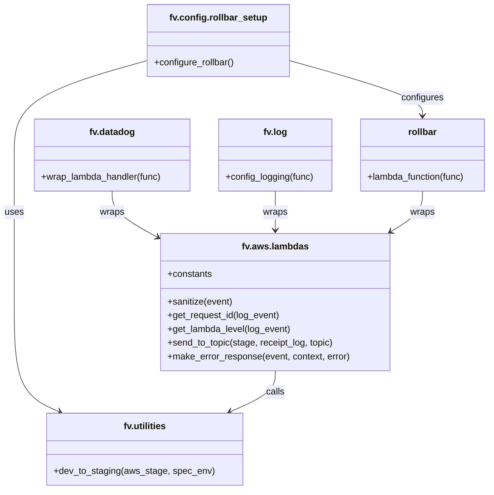

# Diagram: common/monitoring/monitoring/lambdas/audit/sql_audit.py


> Auto-generated by Obscura crawlers

## Diagram 1

```mermaid
flowchart TD
    subgraph Decorators
        A1[fv.log.config_logging]
        A2[fv.datadog.wrap_lambda_handler]
        A3[rollbar.lambda_function]
    end
    Event[Incoming Event] --> LogWarn[logging.warning(event)]
    LogWarn --> Extract[Extract event["body"] -> event_body]
    Extract --> Sanitize[fv.aws.lambdas.sanitize(event_body["event"])\n(log_event)]
    Sanitize --> Build[Build receipt_log (request, requestId, event, lambda_level,\n audit_refs, statusCode, service, result)]
    Build --> Env[Read env: AWS_STAGE, SPECIFIED_ENV]
    Env --> DevToStaging[fv.utilities.dev_to_staging(aws_stage, spec_env)]
    DevToStaging --> Send[fv.aws.lambdas.send_to_topic(aws_stage, receipt_log,\n SNSTopics.SQL_AUDIT)]
    Send -->|ClientError| SendErrorLog[logging.error("Could not log received shipment: ...")]
    Send --> Success[Success]
    SendErrorLog --> Success
    Sanitize -->|exception| MakeError[fv.aws.lambdas.make_error_response(event, context, error=e)]
    MakeError --> End[End]
```

> SVG rendering failed for this diagram.

## Diagram 2



### SVG

<svg id="container" width="864.109375" xmlns="http://www.w3.org/2000/svg" class="classDiagram" height="856" viewBox="0 0 864.109375 856" role="graphics-document document" aria-roledescription="class"><style>#container{font-family:"trebuchet ms",verdana,arial,sans-serif;font-size:16px;fill:#333;}@keyframes edge-animation-frame{from{stroke-dashoffset:0;}}@keyframes dash{to{stroke-dashoffset:0;}}#container .edge-animation-slow{stroke-dasharray:9,5!important;stroke-dashoffset:900;animation:dash 50s linear infinite;stroke-linecap:round;}#container .edge-animation-fast{stroke-dasharray:9,5!important;stroke-dashoffset:900;animation:dash 20s linear infinite;stroke-linecap:round;}#container .error-icon{fill:#552222;}#container .error-text{fill:#552222;stroke:#552222;}#container .edge-thickness-normal{stroke-width:1px;}#container .edge-thickness-thick{stroke-width:3.5px;}#container .edge-pattern-solid{stroke-dasharray:0;}#container .edge-thickness-invisible{stroke-width:0;fill:none;}#container .edge-pattern-dashed{stroke-dasharray:3;}#container .edge-pattern-dotted{stroke-dasharray:2;}#container .marker{fill:#333333;stroke:#333333;}#container .marker.cross{stroke:#333333;}#container svg{font-family:"trebuchet ms",verdana,arial,sans-serif;font-size:16px;}#container p{margin:0;}#container g.classGroup text{fill:#9370DB;stroke:none;font-family:"trebuchet ms",verdana,arial,sans-serif;font-size:10px;}#container g.classGroup text .title{font-weight:bolder;}#container .nodeLabel,#container .edgeLabel{color:#131300;}#container .edgeLabel .label rect{fill:#ECECFF;}#container .label text{fill:#131300;}#container .labelBkg{background:#ECECFF;}#container .edgeLabel .label span{background:#ECECFF;}#container .classTitle{font-weight:bolder;}#container .node rect,#container .node circle,#container .node ellipse,#container .node polygon,#container .node path{fill:#ECECFF;stroke:#9370DB;stroke-width:1px;}#container .divider{stroke:#9370DB;stroke-width:1;}#container g.clickable{cursor:pointer;}#container g.classGroup rect{fill:#ECECFF;stroke:#9370DB;}#container g.classGroup line{stroke:#9370DB;stroke-width:1;}#container .classLabel .box{stroke:none;stroke-width:0;fill:#ECECFF;opacity:0.5;}#container .classLabel .label{fill:#9370DB;font-size:10px;}#container .relation{stroke:#333333;stroke-width:1;fill:none;}#container .dashed-line{stroke-dasharray:3;}#container .dotted-line{stroke-dasharray:1 2;}#container #compositionStart,#container .composition{fill:#333333!important;stroke:#333333!important;stroke-width:1;}#container #compositionEnd,#container .composition{fill:#333333!important;stroke:#333333!important;stroke-width:1;}#container #dependencyStart,#container .dependency{fill:#333333!important;stroke:#333333!important;stroke-width:1;}#container #dependencyStart,#container .dependency{fill:#333333!important;stroke:#333333!important;stroke-width:1;}#container #extensionStart,#container .extension{fill:transparent!important;stroke:#333333!important;stroke-width:1;}#container #extensionEnd,#container .extension{fill:transparent!important;stroke:#333333!important;stroke-width:1;}#container #aggregationStart,#container .aggregation{fill:transparent!important;stroke:#333333!important;stroke-width:1;}#container #aggregationEnd,#container .aggregation{fill:transparent!important;stroke:#333333!important;stroke-width:1;}#container #lollipopStart,#container .lollipop{fill:#ECECFF!important;stroke:#333333!important;stroke-width:1;}#container #lollipopEnd,#container .lollipop{fill:#ECECFF!important;stroke:#333333!important;stroke-width:1;}#container .edgeTerminals{font-size:11px;line-height:initial;}#container .classTitleText{text-anchor:middle;font-size:18px;fill:#333;}#container .label-icon{display:inline-block;height:1em;overflow:visible;vertical-align:-0.125em;}#container .node .label-icon path{fill:currentColor;stroke:revert;stroke-width:revert;}#container :root{--mermaid-font-family:"trebuchet ms",verdana,arial,sans-serif;}</style><g><defs><marker id="container_class-aggregationStart" class="marker aggregation class" refX="18" refY="7" markerWidth="190" markerHeight="240" orient="auto"><path d="M 18,7 L9,13 L1,7 L9,1 Z"></path></marker></defs><defs><marker id="container_class-aggregationEnd" class="marker aggregation class" refX="1" refY="7" markerWidth="20" markerHeight="28" orient="auto"><path d="M 18,7 L9,13 L1,7 L9,1 Z"></path></marker></defs><defs><marker id="container_class-extensionStart" class="marker extension class" refX="18" refY="7" markerWidth="190" markerHeight="240" orient="auto"><path d="M 1,7 L18,13 V 1 Z"></path></marker></defs><defs><marker id="container_class-extensionEnd" class="marker extension class" refX="1" refY="7" markerWidth="20" markerHeight="28" orient="auto"><path d="M 1,1 V 13 L18,7 Z"></path></marker></defs><defs><marker id="container_class-compositionStart" class="marker composition class" refX="18" refY="7" markerWidth="190" markerHeight="240" orient="auto"><path d="M 18,7 L9,13 L1,7 L9,1 Z"></path></marker></defs><defs><marker id="container_class-compositionEnd" class="marker composition class" refX="1" refY="7" markerWidth="20" markerHeight="28" orient="auto"><path d="M 18,7 L9,13 L1,7 L9,1 Z"></path></marker></defs><defs><marker id="container_class-dependencyStart" class="marker dependency class" refX="6" refY="7" markerWidth="190" markerHeight="240" orient="auto"><path d="M 5,7 L9,13 L1,7 L9,1 Z"></path></marker></defs><defs><marker id="container_class-dependencyEnd" class="marker dependency class" refX="13" refY="7" markerWidth="20" markerHeight="28" orient="auto"><path d="M 18,7 L9,13 L14,7 L9,1 Z"></path></marker></defs><defs><marker id="container_class-lollipopStart" class="marker lollipop class" refX="13" refY="7" markerWidth="190" markerHeight="240" orient="auto"><circle stroke="black" fill="transparent" cx="7" cy="7" r="6"></circle></marker></defs><defs><marker id="container_class-lollipopEnd" class="marker lollipop class" refX="1" refY="7" markerWidth="190" markerHeight="240" orient="auto"><circle stroke="black" fill="transparent" cx="7" cy="7" r="6"></circle></marker></defs><g class="root"><g class="clusters"></g><g class="edgePaths"><path d="M260.93,105.368L221.523,116.306C182.117,127.245,103.305,149.123,63.898,176.728C24.492,204.333,24.492,237.667,24.492,271C24.492,304.333,24.492,337.667,24.492,380.5C24.492,423.333,24.492,475.667,24.492,528C24.492,580.333,24.492,632.667,37.76,664.601C51.029,696.536,77.565,708.072,90.833,713.84L104.101,719.608" id="id_fv.config.rollbar_setup_fv.utilities_1" class="edge-thickness-normal edge-pattern-solid relation" style=";;;" data-edge="true" data-et="edge" data-id="id_fv.config.rollbar_setup_fv.utilities_1" data-points="W3sieCI6MjYwLjkyOTY4NzUsInkiOjEwNS4zNjc3ODI0NDAzODkwNX0seyJ4IjoyNC40OTIxODc1LCJ5IjoxNzF9LHsieCI6MjQuNDkyMTg3NSwieSI6MjcxfSx7IngiOjI0LjQ5MjE4NzUsInkiOjM3MX0seyJ4IjoyNC40OTIxODc1LCJ5Ijo1Mjh9LHsieCI6MjQuNDkyMTg3NSwieSI6Njg1fSx7IngiOjEwOS42MDM3NDk5OTk5OTk5OSwieSI6NzIyfV0=" marker-end="url(#container_class-dependencyEnd)"></path><path d="M484.555,648L484.555,654.167C484.555,660.333,484.555,672.667,471.287,684.601C458.018,696.536,431.482,708.072,418.214,713.84L404.946,719.608" id="id_fv.aws.lambdas_fv.utilities_2" class="edge-thickness-normal edge-pattern-solid relation" style=";;;" data-edge="true" data-et="edge" data-id="id_fv.aws.lambdas_fv.utilities_2" data-points="W3sieCI6NDg0LjU1NDY4NzUsInkiOjY0OH0seyJ4Ijo0ODQuNTU0Njg3NSwieSI6Njg1fSx7IngiOjM5OS40NDMxMjUsInkiOjcyMn1d" marker-end="url(#container_class-dependencyEnd)"></path><path d="M197.371,334L197.371,340.167C197.371,346.333,197.371,358.667,210.94,372.251C224.509,385.836,251.648,400.672,265.217,408.091L278.786,415.509" id="id_fv.datadog_fv.aws.lambdas_3" class="edge-thickness-normal edge-pattern-solid relation" style=";;;" data-edge="true" data-et="edge" data-id="id_fv.datadog_fv.aws.lambdas_3" data-points="W3sieCI6MTk3LjM3MTA5Mzc1LCJ5IjozMzR9LHsieCI6MTk3LjM3MTA5Mzc1LCJ5IjozNzF9LHsieCI6Mjg0LjA1MDc4MTI1LCJ5Ijo0MTguMzg2Nzk3OTcwNTkyNn1d" marker-end="url(#container_class-dependencyEnd)"></path><path d="M484.555,334L484.555,340.167C484.555,346.333,484.555,358.667,484.555,370C484.555,381.333,484.555,391.667,484.555,396.833L484.555,402" id="id_fv.log_fv.aws.lambdas_4" class="edge-thickness-normal edge-pattern-solid relation" style=";;;" data-edge="true" data-et="edge" data-id="id_fv.log_fv.aws.lambdas_4" data-points="W3sieCI6NDg0LjU1NDY4NzUsInkiOjMzNH0seyJ4Ijo0ODQuNTU0Njg3NSwieSI6MzcxfSx7IngiOjQ4NC41NTQ2ODc1LCJ5Ijo0MDh9XQ==" marker-end="url(#container_class-dependencyEnd)"></path><path d="M744.984,334L744.984,340.167C744.984,346.333,744.984,358.667,735.612,370.484C726.239,382.301,707.493,393.602,698.12,399.252L688.748,404.902" id="id_rollbar_fv.aws.lambdas_5" class="edge-thickness-normal edge-pattern-solid relation" style=";;;" data-edge="true" data-et="edge" data-id="id_rollbar_fv.aws.lambdas_5" data-points="W3sieCI6NzQ0Ljk4NDM3NSwieSI6MzM0fSx7IngiOjc0NC45ODQzNzUsInkiOjM3MX0seyJ4Ijo2ODMuNjA5MjI1NzE2NTYwNiwieSI6NDA4fV0=" marker-end="url(#container_class-dependencyEnd)"></path><path d="M508.547,105.368L547.953,116.306C587.359,127.245,666.172,149.123,705.578,165.228C744.984,181.333,744.984,191.667,744.984,196.833L744.984,202" id="id_fv.config.rollbar_setup_rollbar_6" class="edge-thickness-normal edge-pattern-solid relation" style=";;;" data-edge="true" data-et="edge" data-id="id_fv.config.rollbar_setup_rollbar_6" data-points="W3sieCI6NTA4LjU0Njg3NSwieSI6MTA1LjM2Nzc4MjQ0MDM4OTA1fSx7IngiOjc0NC45ODQzNzUsInkiOjE3MX0seyJ4Ijo3NDQuOTg0Mzc1LCJ5IjoyMDh9XQ==" marker-end="url(#container_class-dependencyEnd)"></path></g><g class="edgeLabels"><g class="edgeLabel" transform="translate(24.4921875, 371)"><g class="label" data-id="id_fv.config.rollbar_setup_fv.utilities_1" transform="translate(-16.4921875, -12)"><foreignObject width="32.984375" height="24"><div xmlns="http://www.w3.org/1999/xhtml" class="labelBkg" style="display: table-cell; white-space: nowrap; line-height: 1.5; max-width: 200px; text-align: center;"><span class="edgeLabel"><p>uses</p></span></div></foreignObject></g></g><g class="edgeLabel" transform="translate(484.5546875, 685)"><g class="label" data-id="id_fv.aws.lambdas_fv.utilities_2" transform="translate(-16.4453125, -12)"><foreignObject width="32.890625" height="24"><div xmlns="http://www.w3.org/1999/xhtml" class="labelBkg" style="display: table-cell; white-space: nowrap; line-height: 1.5; max-width: 200px; text-align: center;"><span class="edgeLabel"><p>calls</p></span></div></foreignObject></g></g><g class="edgeLabel" transform="translate(197.37109375, 371)"><g class="label" data-id="id_fv.datadog_fv.aws.lambdas_3" transform="translate(-21.390625, -12)"><foreignObject width="42.78125" height="24"><div xmlns="http://www.w3.org/1999/xhtml" class="labelBkg" style="display: table-cell; white-space: nowrap; line-height: 1.5; max-width: 200px; text-align: center;"><span class="edgeLabel"><p>wraps</p></span></div></foreignObject></g></g><g class="edgeLabel" transform="translate(484.5546875, 371)"><g class="label" data-id="id_fv.log_fv.aws.lambdas_4" transform="translate(-21.390625, -12)"><foreignObject width="42.78125" height="24"><div xmlns="http://www.w3.org/1999/xhtml" class="labelBkg" style="display: table-cell; white-space: nowrap; line-height: 1.5; max-width: 200px; text-align: center;"><span class="edgeLabel"><p>wraps</p></span></div></foreignObject></g></g><g class="edgeLabel" transform="translate(744.984375, 371)"><g class="label" data-id="id_rollbar_fv.aws.lambdas_5" transform="translate(-21.390625, -12)"><foreignObject width="42.78125" height="24"><div xmlns="http://www.w3.org/1999/xhtml" class="labelBkg" style="display: table-cell; white-space: nowrap; line-height: 1.5; max-width: 200px; text-align: center;"><span class="edgeLabel"><p>wraps</p></span></div></foreignObject></g></g><g class="edgeLabel" transform="translate(744.984375, 171)"><g class="label" data-id="id_fv.config.rollbar_setup_rollbar_6" transform="translate(-37.3046875, -12)"><foreignObject width="74.609375" height="24"><div xmlns="http://www.w3.org/1999/xhtml" class="labelBkg" style="display: table-cell; white-space: nowrap; line-height: 1.5; max-width: 200px; text-align: center;"><span class="edgeLabel"><p>configures</p></span></div></foreignObject></g></g></g><g class="nodes"><g class="node default" id="classId-fv.aws.lambdas-0" transform="translate(484.5546875, 528)"><g class="basic label-container"><path d="M-200.50390625 -120 L200.50390625 -120 L200.50390625 120 L-200.50390625 120" stroke="none" stroke-width="0" fill="#ECECFF" style=""></path><path d="M-200.50390625 -120 C-115.00380345159371 -120, -29.503700653187423 -120, 200.50390625 -120 M-200.50390625 -120 C-55.69738677675812 -120, 89.10913269648375 -120, 200.50390625 -120 M200.50390625 -120 C200.50390625 -27.288614076767033, 200.50390625 65.42277184646593, 200.50390625 120 M200.50390625 -120 C200.50390625 -27.569637005349435, 200.50390625 64.86072598930113, 200.50390625 120 M200.50390625 120 C52.79076723805056 120, -94.92237177389887 120, -200.50390625 120 M200.50390625 120 C51.71409592067383 120, -97.07571440865235 120, -200.50390625 120 M-200.50390625 120 C-200.50390625 51.69457726290787, -200.50390625 -16.61084547418426, -200.50390625 -120 M-200.50390625 120 C-200.50390625 44.32967157996157, -200.50390625 -31.34065684007686, -200.50390625 -120" stroke="#9370DB" stroke-width="1.3" fill="none" stroke-dasharray="0 0" style=""></path></g><g class="annotation-group text" transform="translate(0, -96)"></g><g class="label-group text" transform="translate(-55.8984375, -96)"><g class="label" style="font-weight: bolder" transform="translate(0,-12)"><foreignObject width="111.796875" height="24"><div xmlns="http://www.w3.org/1999/xhtml" style="display: table-cell; white-space: nowrap; line-height: 1.5; max-width: 160px; text-align: center;"><span class="nodeLabel markdown-node-label" style=""><p>fv.aws.lambdas</p></span></div></foreignObject></g></g><g class="members-group text" transform="translate(-188.50390625, -48)"><g class="label" style="" transform="translate(0,-12)"><foreignObject width="78.5" height="24"><div xmlns="http://www.w3.org/1999/xhtml" style="display: table-cell; white-space: nowrap; line-height: 1.5; max-width: 136px; text-align: center;"><span class="nodeLabel markdown-node-label" style=""><p>+constants</p></span></div></foreignObject></g></g><g class="methods-group text" transform="translate(-188.50390625, 0)"><g class="label" style="" transform="translate(0,-12)"><foreignObject width="114.484375" height="24"><div xmlns="http://www.w3.org/1999/xhtml" style="display: table-cell; white-space: nowrap; line-height: 1.5; max-width: 172px; text-align: center;"><span class="nodeLabel markdown-node-label" style=""><p>+sanitize(event)</p></span></div></foreignObject></g><g class="label" style="" transform="translate(0,12)"><foreignObject width="197.578125" height="24"><div xmlns="http://www.w3.org/1999/xhtml" style="display: table-cell; white-space: nowrap; line-height: 1.5; max-width: 255px; text-align: center;"><span class="nodeLabel markdown-node-label" style=""><p>+get_request_id(log_event)</p></span></div></foreignObject></g><g class="label" style="" transform="translate(0,36)"><foreignObject width="217.1875" height="24"><div xmlns="http://www.w3.org/1999/xhtml" style="display: table-cell; white-space: nowrap; line-height: 1.5; max-width: 275px; text-align: center;"><span class="nodeLabel markdown-node-label" style=""><p>+get_lambda_level(log_event)</p></span></div></foreignObject></g><g class="label" style="" transform="translate(0,60)"><foreignObject width="292.296875" height="24"><div xmlns="http://www.w3.org/1999/xhtml" style="display: table-cell; white-space: nowrap; line-height: 1.5; max-width: 350px; text-align: center;"><span class="nodeLabel markdown-node-label" style=""><p>+send_to_topic(stage, receipt_log, topic)</p></span></div></foreignObject></g><g class="label" style="" transform="translate(0,84)"><foreignObject width="321.109375" height="24"><div xmlns="http://www.w3.org/1999/xhtml" style="display: table-cell; white-space: nowrap; line-height: 1.5; max-width: 378px; text-align: center;"><span class="nodeLabel markdown-node-label" style=""><p>+make_error_response(event, context, error)</p></span></div></foreignObject></g></g><g class="divider" style=""><path d="M-200.50390625 -72 C-78.76311877604991 -72, 42.977668697900185 -72, 200.50390625 -72 M-200.50390625 -72 C-119.91321627884872 -72, -39.322526307697444 -72, 200.50390625 -72" stroke="#9370DB" stroke-width="1.3" fill="none" stroke-dasharray="0 0" style=""></path></g><g class="divider" style=""><path d="M-200.50390625 -24 C-45.708099058055126 -24, 109.08770813388975 -24, 200.50390625 -24 M-200.50390625 -24 C-54.47920220174959 -24, 91.54550184650083 -24, 200.50390625 -24" stroke="#9370DB" stroke-width="1.3" fill="none" stroke-dasharray="0 0" style=""></path></g></g><g class="node default" id="classId-fv.utilities-1" transform="translate(254.5234375, 785)"><g class="basic label-container"><path d="M-168.43359375 -63 L168.43359375 -63 L168.43359375 63 L-168.43359375 63" stroke="none" stroke-width="0" fill="#ECECFF" style=""></path><path d="M-168.43359375 -63 C-67.18568283449815 -63, 34.062228081003695 -63, 168.43359375 -63 M-168.43359375 -63 C-87.54740916754847 -63, -6.661224585096932 -63, 168.43359375 -63 M168.43359375 -63 C168.43359375 -32.336733670346796, 168.43359375 -1.6734673406935912, 168.43359375 63 M168.43359375 -63 C168.43359375 -34.618684317495365, 168.43359375 -6.23736863499073, 168.43359375 63 M168.43359375 63 C36.74053751896497 63, -94.95251871207006 63, -168.43359375 63 M168.43359375 63 C45.71412171783443 63, -77.00535031433114 63, -168.43359375 63 M-168.43359375 63 C-168.43359375 23.110917422752905, -168.43359375 -16.77816515449419, -168.43359375 -63 M-168.43359375 63 C-168.43359375 34.489905391372815, -168.43359375 5.979810782745631, -168.43359375 -63" stroke="#9370DB" stroke-width="1.3" fill="none" stroke-dasharray="0 0" style=""></path></g><g class="annotation-group text" transform="translate(0, -39)"></g><g class="label-group text" transform="translate(-36.6484375, -39)"><g class="label" style="font-weight: bolder" transform="translate(0,-12)"><foreignObject width="73.296875" height="24"><div xmlns="http://www.w3.org/1999/xhtml" style="display: table-cell; white-space: nowrap; line-height: 1.5; max-width: 122px; text-align: center;"><span class="nodeLabel markdown-node-label" style=""><p>fv.utilities</p></span></div></foreignObject></g></g><g class="members-group text" transform="translate(-156.43359375, 9)"></g><g class="methods-group text" transform="translate(-156.43359375, 39)"><g class="label" style="" transform="translate(0,-12)"><foreignObject width="276.21875" height="24"><div xmlns="http://www.w3.org/1999/xhtml" style="display: table-cell; white-space: nowrap; line-height: 1.5; max-width: 334px; text-align: center;"><span class="nodeLabel markdown-node-label" style=""><p>+dev_to_staging(aws_stage, spec_env)</p></span></div></foreignObject></g></g><g class="divider" style=""><path d="M-168.43359375 -15 C-38.50116222737526 -15, 91.43126929524948 -15, 168.43359375 -15 M-168.43359375 -15 C-91.80732707645205 -15, -15.181060402904109 -15, 168.43359375 -15" stroke="#9370DB" stroke-width="1.3" fill="none" stroke-dasharray="0 0" style=""></path></g><g class="divider" style=""><path d="M-168.43359375 9 C-94.22668945293687 9, -20.019785155873734 9, 168.43359375 9 M-168.43359375 9 C-92.63776479289939 9, -16.84193583579878 9, 168.43359375 9" stroke="#9370DB" stroke-width="1.3" fill="none" stroke-dasharray="0 0" style=""></path></g></g><g class="node default" id="classId-fv.config.rollbar_setup-2" transform="translate(384.73828125, 71)"><g class="basic label-container"><path d="M-123.80859375 -63 L123.80859375 -63 L123.80859375 63 L-123.80859375 63" stroke="none" stroke-width="0" fill="#ECECFF" style=""></path><path d="M-123.80859375 -63 C-55.26870767842226 -63, 13.27117839315548 -63, 123.80859375 -63 M-123.80859375 -63 C-56.88353127628281 -63, 10.04153119743438 -63, 123.80859375 -63 M123.80859375 -63 C123.80859375 -34.13050524134182, 123.80859375 -5.261010482683645, 123.80859375 63 M123.80859375 -63 C123.80859375 -33.64814977578155, 123.80859375 -4.296299551563088, 123.80859375 63 M123.80859375 63 C64.2733110865079 63, 4.738028423015791 63, -123.80859375 63 M123.80859375 63 C46.662536333602674 63, -30.483521082794653 63, -123.80859375 63 M-123.80859375 63 C-123.80859375 36.120693172493816, -123.80859375 9.241386344987625, -123.80859375 -63 M-123.80859375 63 C-123.80859375 29.640602661325623, -123.80859375 -3.718794677348754, -123.80859375 -63" stroke="#9370DB" stroke-width="1.3" fill="none" stroke-dasharray="0 0" style=""></path></g><g class="annotation-group text" transform="translate(0, -39)"></g><g class="label-group text" transform="translate(-81.4765625, -39)"><g class="label" style="font-weight: bolder" transform="translate(0,-12)"><foreignObject width="162.953125" height="24"><div xmlns="http://www.w3.org/1999/xhtml" style="display: table-cell; white-space: nowrap; line-height: 1.5; max-width: 210px; text-align: center;"><span class="nodeLabel markdown-node-label" style=""><p>fv.config.rollbar_setup</p></span></div></foreignObject></g></g><g class="members-group text" transform="translate(-111.80859375, 9)"></g><g class="methods-group text" transform="translate(-111.80859375, 39)"><g class="label" style="" transform="translate(0,-12)"><foreignObject width="142.140625" height="24"><div xmlns="http://www.w3.org/1999/xhtml" style="display: table-cell; white-space: nowrap; line-height: 1.5; max-width: 200px; text-align: center;"><span class="nodeLabel markdown-node-label" style=""><p>+configure_rollbar()</p></span></div></foreignObject></g></g><g class="divider" style=""><path d="M-123.80859375 -15 C-44.295939740129626 -15, 35.21671426974075 -15, 123.80859375 -15 M-123.80859375 -15 C-37.90428518352333 -15, 48.000023382953344 -15, 123.80859375 -15" stroke="#9370DB" stroke-width="1.3" fill="none" stroke-dasharray="0 0" style=""></path></g><g class="divider" style=""><path d="M-123.80859375 9 C-37.15345460500669 9, 49.50168453998663 9, 123.80859375 9 M-123.80859375 9 C-63.31299435159383 9, -2.8173949531876588 9, 123.80859375 9" stroke="#9370DB" stroke-width="1.3" fill="none" stroke-dasharray="0 0" style=""></path></g></g><g class="node default" id="classId-fv.datadog-3" transform="translate(197.37109375, 271)"><g class="basic label-container"><path d="M-137.87890625 -63 L137.87890625 -63 L137.87890625 63 L-137.87890625 63" stroke="none" stroke-width="0" fill="#ECECFF" style=""></path><path d="M-137.87890625 -63 C-36.61069764413304 -63, 64.65751096173392 -63, 137.87890625 -63 M-137.87890625 -63 C-76.33227711720886 -63, -14.785647984417722 -63, 137.87890625 -63 M137.87890625 -63 C137.87890625 -16.625939216095666, 137.87890625 29.748121567808667, 137.87890625 63 M137.87890625 -63 C137.87890625 -20.519769646188593, 137.87890625 21.960460707622815, 137.87890625 63 M137.87890625 63 C28.8794158309949 63, -80.1200745880102 63, -137.87890625 63 M137.87890625 63 C34.14459176531405 63, -69.5897227193719 63, -137.87890625 63 M-137.87890625 63 C-137.87890625 31.64491245221557, -137.87890625 0.2898249044311427, -137.87890625 -63 M-137.87890625 63 C-137.87890625 30.656881392060114, -137.87890625 -1.6862372158797712, -137.87890625 -63" stroke="#9370DB" stroke-width="1.3" fill="none" stroke-dasharray="0 0" style=""></path></g><g class="annotation-group text" transform="translate(0, -39)"></g><g class="label-group text" transform="translate(-38.9140625, -39)"><g class="label" style="font-weight: bolder" transform="translate(0,-12)"><foreignObject width="77.828125" height="24"><div xmlns="http://www.w3.org/1999/xhtml" style="display: table-cell; white-space: nowrap; line-height: 1.5; max-width: 127px; text-align: center;"><span class="nodeLabel markdown-node-label" style=""><p>fv.datadog</p></span></div></foreignObject></g></g><g class="members-group text" transform="translate(-125.87890625, 9)"></g><g class="methods-group text" transform="translate(-125.87890625, 39)"><g class="label" style="" transform="translate(0,-12)"><foreignObject width="212.84375" height="24"><div xmlns="http://www.w3.org/1999/xhtml" style="display: table-cell; white-space: nowrap; line-height: 1.5; max-width: 270px; text-align: center;"><span class="nodeLabel markdown-node-label" style=""><p>+wrap_lambda_handler(func)</p></span></div></foreignObject></g></g><g class="divider" style=""><path d="M-137.87890625 -15 C-75.1739966128963 -15, -12.469086975792592 -15, 137.87890625 -15 M-137.87890625 -15 C-53.79939171932236 -15, 30.280122811355284 -15, 137.87890625 -15" stroke="#9370DB" stroke-width="1.3" fill="none" stroke-dasharray="0 0" style=""></path></g><g class="divider" style=""><path d="M-137.87890625 9 C-58.89060206532251 9, 20.097702119354977 9, 137.87890625 9 M-137.87890625 9 C-29.065179466348084 9, 79.74854731730383 9, 137.87890625 9" stroke="#9370DB" stroke-width="1.3" fill="none" stroke-dasharray="0 0" style=""></path></g></g><g class="node default" id="classId-fv.log-4" transform="translate(484.5546875, 271)"><g class="basic label-container"><path d="M-99.3046875 -63 L99.3046875 -63 L99.3046875 63 L-99.3046875 63" stroke="none" stroke-width="0" fill="#ECECFF" style=""></path><path d="M-99.3046875 -63 C-48.16875759168919 -63, 2.967172316621614 -63, 99.3046875 -63 M-99.3046875 -63 C-56.41519496904571 -63, -13.525702438091415 -63, 99.3046875 -63 M99.3046875 -63 C99.3046875 -15.038611473701806, 99.3046875 32.92277705259639, 99.3046875 63 M99.3046875 -63 C99.3046875 -19.32305632239956, 99.3046875 24.353887355200882, 99.3046875 63 M99.3046875 63 C46.89090964770509 63, -5.522868204589827 63, -99.3046875 63 M99.3046875 63 C35.82908724309115 63, -27.646513013817696 63, -99.3046875 63 M-99.3046875 63 C-99.3046875 31.91634192174729, -99.3046875 0.8326838434945785, -99.3046875 -63 M-99.3046875 63 C-99.3046875 22.574430405978717, -99.3046875 -17.851139188042566, -99.3046875 -63" stroke="#9370DB" stroke-width="1.3" fill="none" stroke-dasharray="0 0" style=""></path></g><g class="annotation-group text" transform="translate(0, -39)"></g><g class="label-group text" transform="translate(-19.96875, -39)"><g class="label" style="font-weight: bolder" transform="translate(0,-12)"><foreignObject width="39.9375" height="24"><div xmlns="http://www.w3.org/1999/xhtml" style="display: table-cell; white-space: nowrap; line-height: 1.5; max-width: 89px; text-align: center;"><span class="nodeLabel markdown-node-label" style=""><p>fv.log</p></span></div></foreignObject></g></g><g class="members-group text" transform="translate(-87.3046875, 9)"></g><g class="methods-group text" transform="translate(-87.3046875, 39)"><g class="label" style="" transform="translate(0,-12)"><foreignObject width="154.640625" height="24"><div xmlns="http://www.w3.org/1999/xhtml" style="display: table-cell; white-space: nowrap; line-height: 1.5; max-width: 212px; text-align: center;"><span class="nodeLabel markdown-node-label" style=""><p>+config_logging(func)</p></span></div></foreignObject></g></g><g class="divider" style=""><path d="M-99.3046875 -15 C-33.18351828978531 -15, 32.93765092042938 -15, 99.3046875 -15 M-99.3046875 -15 C-50.999858613382344 -15, -2.6950297267646874 -15, 99.3046875 -15" stroke="#9370DB" stroke-width="1.3" fill="none" stroke-dasharray="0 0" style=""></path></g><g class="divider" style=""><path d="M-99.3046875 9 C-53.17329957582579 9, -7.041911651651574 9, 99.3046875 9 M-99.3046875 9 C-23.438276256275955 9, 52.42813498744809 9, 99.3046875 9" stroke="#9370DB" stroke-width="1.3" fill="none" stroke-dasharray="0 0" style=""></path></g></g><g class="node default" id="classId-rollbar-5" transform="translate(744.984375, 271)"><g class="basic label-container"><path d="M-111.125 -63 L111.125 -63 L111.125 63 L-111.125 63" stroke="none" stroke-width="0" fill="#ECECFF" style=""></path><path d="M-111.125 -63 C-37.610586539416246 -63, 35.90382692116751 -63, 111.125 -63 M-111.125 -63 C-55.99915656933821 -63, -0.8733131386764228 -63, 111.125 -63 M111.125 -63 C111.125 -22.60431099465515, 111.125 17.791378010689698, 111.125 63 M111.125 -63 C111.125 -32.080737600639914, 111.125 -1.1614752012798277, 111.125 63 M111.125 63 C54.11030015951461 63, -2.9043996809707835 63, -111.125 63 M111.125 63 C26.99051682045382 63, -57.14396635909236 63, -111.125 63 M-111.125 63 C-111.125 36.853937425248965, -111.125 10.70787485049793, -111.125 -63 M-111.125 63 C-111.125 19.980390451346025, -111.125 -23.03921909730795, -111.125 -63" stroke="#9370DB" stroke-width="1.3" fill="none" stroke-dasharray="0 0" style=""></path></g><g class="annotation-group text" transform="translate(0, -39)"></g><g class="label-group text" transform="translate(-24.6875, -39)"><g class="label" style="font-weight: bolder" transform="translate(0,-12)"><foreignObject width="49.375" height="24"><div xmlns="http://www.w3.org/1999/xhtml" style="display: table-cell; white-space: nowrap; line-height: 1.5; max-width: 99px; text-align: center;"><span class="nodeLabel markdown-node-label" style=""><p>rollbar</p></span></div></foreignObject></g></g><g class="members-group text" transform="translate(-99.125, 9)"></g><g class="methods-group text" transform="translate(-99.125, 39)"><g class="label" style="" transform="translate(0,-12)"><foreignObject width="173.5625" height="24"><div xmlns="http://www.w3.org/1999/xhtml" style="display: table-cell; white-space: nowrap; line-height: 1.5; max-width: 231px; text-align: center;"><span class="nodeLabel markdown-node-label" style=""><p>+lambda_function(func)</p></span></div></foreignObject></g></g><g class="divider" style=""><path d="M-111.125 -15 C-62.88139293603205 -15, -14.6377858720641 -15, 111.125 -15 M-111.125 -15 C-62.896914150051295 -15, -14.66882830010259 -15, 111.125 -15" stroke="#9370DB" stroke-width="1.3" fill="none" stroke-dasharray="0 0" style=""></path></g><g class="divider" style=""><path d="M-111.125 9 C-25.656547773166977 9, 59.811904453666045 9, 111.125 9 M-111.125 9 C-25.706338272142432 9, 59.712323455715136 9, 111.125 9" stroke="#9370DB" stroke-width="1.3" fill="none" stroke-dasharray="0 0" style=""></path></g></g></g></g></g></svg>
