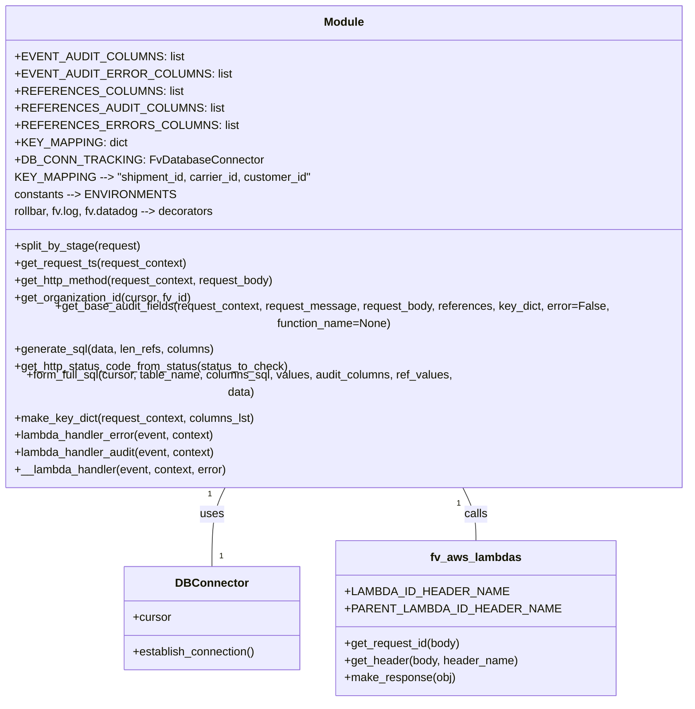

# Diagram: common/monitoring/monitoring/lambdas/consumer/consumer.py


> Auto-generated by Obscura crawlers

## Diagram 1

```mermaid
flowchart TD
    Start([Start / Lambda invoked]) --> CheckStage{stage in ENVIRONMENTS?}
    CheckStage -- No --> Warn[log warning and raise Exception]
    Warn --> ErrorExit([Exception raised])
    CheckStage -- Yes --> DBConnect[DB_CONN_TRACKING.establish_connection()]
    DBConnect --> ForEach[For each record in event.Records]
    ForEach --> ParseBody[parse SQS body -> request_message, request_body, request_context, audit_refs]
    ParseBody --> MakeKeys[make_key_dict(request_context)]
    MakeKeys --> GetBase[get_base_audit_fields(...)]
    GetBase -->|None| SkipRecord[skip (local/test)]
    GetBase -->|record| AppendLists[append record, ref_length, columns_lst]
    AppendLists --> AfterLoop[after loop: cursor = DB_CONN_TRACKING.cursor; table_name = event_audit(_error)?]
    AfterLoop --> ForInsert[for each item in records_to_ins]
    ForInsert --> GenerateSQL[generate_sql(item, len_refs, columns)]
    GenerateSQL --> CheckAge{event_ts older than 364 days?}
    CheckAge -- Yes --> ContinueLoop[continue]
    CheckAge -- No --> FormSQL[form_full_sql(cursor, table_name, columns_sql, values, ...)]
    FormSQL --> TryExec[try cursor.execute(query)]
    TryExec -->|success| NextIter[next iteration]
    TryExec -->|psycopg2.DataError| HandleDataError[modify columns (remove event, add event_text) and re-generate & execute]
    HandleDataError --> NextIter
    NextIter --> EndLoop([completed inserts])
    EndLoop --> MakeResponse[fv.aws.lambdas.make_response({}) -> return]
    ErrorExit --> LogError[log query, event, traceback; fv.log.log_with_stack(...)]
    LogError --> Raise[re-raise exception]
```

> SVG rendering failed for this diagram.

## Diagram 2



### SVG

<svg id="container" width="1005.5625" xmlns="http://www.w3.org/2000/svg" class="classDiagram" height="930" viewBox="0 0 1005.5625 930" role="graphics-document document" aria-roledescription="class"><style>#container{font-family:"trebuchet ms",verdana,arial,sans-serif;font-size:16px;fill:#333;}@keyframes edge-animation-frame{from{stroke-dashoffset:0;}}@keyframes dash{to{stroke-dashoffset:0;}}#container .edge-animation-slow{stroke-dasharray:9,5!important;stroke-dashoffset:900;animation:dash 50s linear infinite;stroke-linecap:round;}#container .edge-animation-fast{stroke-dasharray:9,5!important;stroke-dashoffset:900;animation:dash 20s linear infinite;stroke-linecap:round;}#container .error-icon{fill:#552222;}#container .error-text{fill:#552222;stroke:#552222;}#container .edge-thickness-normal{stroke-width:1px;}#container .edge-thickness-thick{stroke-width:3.5px;}#container .edge-pattern-solid{stroke-dasharray:0;}#container .edge-thickness-invisible{stroke-width:0;fill:none;}#container .edge-pattern-dashed{stroke-dasharray:3;}#container .edge-pattern-dotted{stroke-dasharray:2;}#container .marker{fill:#333333;stroke:#333333;}#container .marker.cross{stroke:#333333;}#container svg{font-family:"trebuchet ms",verdana,arial,sans-serif;font-size:16px;}#container p{margin:0;}#container g.classGroup text{fill:#9370DB;stroke:none;font-family:"trebuchet ms",verdana,arial,sans-serif;font-size:10px;}#container g.classGroup text .title{font-weight:bolder;}#container .nodeLabel,#container .edgeLabel{color:#131300;}#container .edgeLabel .label rect{fill:#ECECFF;}#container .label text{fill:#131300;}#container .labelBkg{background:#ECECFF;}#container .edgeLabel .label span{background:#ECECFF;}#container .classTitle{font-weight:bolder;}#container .node rect,#container .node circle,#container .node ellipse,#container .node polygon,#container .node path{fill:#ECECFF;stroke:#9370DB;stroke-width:1px;}#container .divider{stroke:#9370DB;stroke-width:1;}#container g.clickable{cursor:pointer;}#container g.classGroup rect{fill:#ECECFF;stroke:#9370DB;}#container g.classGroup line{stroke:#9370DB;stroke-width:1;}#container .classLabel .box{stroke:none;stroke-width:0;fill:#ECECFF;opacity:0.5;}#container .classLabel .label{fill:#9370DB;font-size:10px;}#container .relation{stroke:#333333;stroke-width:1;fill:none;}#container .dashed-line{stroke-dasharray:3;}#container .dotted-line{stroke-dasharray:1 2;}#container #compositionStart,#container .composition{fill:#333333!important;stroke:#333333!important;stroke-width:1;}#container #compositionEnd,#container .composition{fill:#333333!important;stroke:#333333!important;stroke-width:1;}#container #dependencyStart,#container .dependency{fill:#333333!important;stroke:#333333!important;stroke-width:1;}#container #dependencyStart,#container .dependency{fill:#333333!important;stroke:#333333!important;stroke-width:1;}#container #extensionStart,#container .extension{fill:transparent!important;stroke:#333333!important;stroke-width:1;}#container #extensionEnd,#container .extension{fill:transparent!important;stroke:#333333!important;stroke-width:1;}#container #aggregationStart,#container .aggregation{fill:transparent!important;stroke:#333333!important;stroke-width:1;}#container #aggregationEnd,#container .aggregation{fill:transparent!important;stroke:#333333!important;stroke-width:1;}#container #lollipopStart,#container .lollipop{fill:#ECECFF!important;stroke:#333333!important;stroke-width:1;}#container #lollipopEnd,#container .lollipop{fill:#ECECFF!important;stroke:#333333!important;stroke-width:1;}#container .edgeTerminals{font-size:11px;line-height:initial;}#container .classTitleText{text-anchor:middle;font-size:18px;fill:#333;}#container .label-icon{display:inline-block;height:1em;overflow:visible;vertical-align:-0.125em;}#container .node .label-icon path{fill:currentColor;stroke:revert;stroke-width:revert;}#container :root{--mermaid-font-family:"trebuchet ms",verdana,arial,sans-serif;}</style><g><defs><marker id="container_class-aggregationStart" class="marker aggregation class" refX="18" refY="7" markerWidth="190" markerHeight="240" orient="auto"><path d="M 18,7 L9,13 L1,7 L9,1 Z"></path></marker></defs><defs><marker id="container_class-aggregationEnd" class="marker aggregation class" refX="1" refY="7" markerWidth="20" markerHeight="28" orient="auto"><path d="M 18,7 L9,13 L1,7 L9,1 Z"></path></marker></defs><defs><marker id="container_class-extensionStart" class="marker extension class" refX="18" refY="7" markerWidth="190" markerHeight="240" orient="auto"><path d="M 1,7 L18,13 V 1 Z"></path></marker></defs><defs><marker id="container_class-extensionEnd" class="marker extension class" refX="1" refY="7" markerWidth="20" markerHeight="28" orient="auto"><path d="M 1,1 V 13 L18,7 Z"></path></marker></defs><defs><marker id="container_class-compositionStart" class="marker composition class" refX="18" refY="7" markerWidth="190" markerHeight="240" orient="auto"><path d="M 18,7 L9,13 L1,7 L9,1 Z"></path></marker></defs><defs><marker id="container_class-compositionEnd" class="marker composition class" refX="1" refY="7" markerWidth="20" markerHeight="28" orient="auto"><path d="M 18,7 L9,13 L1,7 L9,1 Z"></path></marker></defs><defs><marker id="container_class-dependencyStart" class="marker dependency class" refX="6" refY="7" markerWidth="190" markerHeight="240" orient="auto"><path d="M 5,7 L9,13 L1,7 L9,1 Z"></path></marker></defs><defs><marker id="container_class-dependencyEnd" class="marker dependency class" refX="13" refY="7" markerWidth="20" markerHeight="28" orient="auto"><path d="M 18,7 L9,13 L14,7 L9,1 Z"></path></marker></defs><defs><marker id="container_class-lollipopStart" class="marker lollipop class" refX="13" refY="7" markerWidth="190" markerHeight="240" orient="auto"><circle stroke="black" fill="transparent" cx="7" cy="7" r="6"></circle></marker></defs><defs><marker id="container_class-lollipopEnd" class="marker lollipop class" refX="1" refY="7" markerWidth="190" markerHeight="240" orient="auto"><circle stroke="black" fill="transparent" cx="7" cy="7" r="6"></circle></marker></defs><g class="root"><g class="clusters"></g><g class="edgePaths"><path d="M347.323,632L344.25,638.167C341.177,644.333,335.032,656.667,331.959,675C328.887,693.333,328.887,717.667,328.887,729.833L328.887,742" id="id_Module_DBConnector_1" class="edge-thickness-normal edge-pattern-solid relation" style=";;;" data-edge="true" data-et="edge" data-id="id_Module_DBConnector_1" data-points="W3sieCI6MzQ3LjMyMjUyODY1MzI5NTE0LCJ5Ijo2MzJ9LHsieCI6MzI4Ljg4NjcxODc1LCJ5Ijo2Njl9LHsieCI6MzI4Ljg4NjcxODc1LCJ5Ijo3NDJ9XQ=="></path><path d="M658.24,632L661.313,638.167C664.385,644.333,670.531,656.667,673.603,669C676.676,681.333,676.676,693.667,676.676,699.833L676.676,706" id="id_Module_fv_aws_lambdas_2" class="edge-thickness-normal edge-pattern-solid relation" style=";;;" data-edge="true" data-et="edge" data-id="id_Module_fv_aws_lambdas_2" data-points="W3sieCI6NjU4LjIzOTk3MTM0NjcwNDgsInkiOjYzMn0seyJ4Ijo2NzYuNjc1NzgxMjUsInkiOjY2OX0seyJ4Ijo2NzYuNjc1NzgxMjUsInkiOjcwNn1d"></path></g><g class="edgeLabels"><g class="edgeLabel" transform="translate(328.88671875, 669)"><g class="label" data-id="id_Module_DBConnector_1" transform="translate(-16.4921875, -12)"><foreignObject width="32.984375" height="24"><div xmlns="http://www.w3.org/1999/xhtml" class="labelBkg" style="display: table-cell; white-space: nowrap; line-height: 1.5; max-width: 200px; text-align: center;"><span class="edgeLabel"><p>uses</p></span></div></foreignObject></g></g><g class="edgeLabel" transform="translate(676.67578125, 669)"><g class="label" data-id="id_Module_fv_aws_lambdas_2" transform="translate(-16.4453125, -12)"><foreignObject width="32.890625" height="24"><div xmlns="http://www.w3.org/1999/xhtml" class="labelBkg" style="display: table-cell; white-space: nowrap; line-height: 1.5; max-width: 200px; text-align: center;"><span class="edgeLabel"><p>calls</p></span></div></foreignObject></g></g><g class="edgeTerminals" transform="translate(326.0923270287181, 640.9737672868456)"><g class="inner" transform="translate(0, 0)"><foreignObject style="width: 9px; height: 12px;"><div xmlns="http://www.w3.org/1999/xhtml" style="display: inline-block; padding-right: 1px; white-space: nowrap;"><span class="edgeLabel">1</span></div></foreignObject></g></g><g class="edgeTerminals" transform="translate(652.6187483754229, 654.3528927131543)"><g class="inner" transform="translate(0, 0)"><foreignObject style="width: 9px; height: 12px;"><div xmlns="http://www.w3.org/1999/xhtml" style="display: inline-block; padding-right: 1px; white-space: nowrap;"><span class="edgeLabel">1</span></div></foreignObject></g></g><g class="edgeTerminals" transform="translate(338.886719375, 719.5000005357143)"><g class="inner" transform="translate(0, 0)"></g><foreignObject style="width: 9px; height: 12px;"><div xmlns="http://www.w3.org/1999/xhtml" style="display: inline-block; padding-right: 1px; white-space: nowrap;"><span class="edgeLabel">1</span></div></foreignObject></g></g><g class="nodes"><g class="node default" id="classId-Module-0" transform="translate(502.78125, 320)"><g class="basic label-container"><path d="M-494.78125 -312 L494.78125 -312 L494.78125 312 L-494.78125 312" stroke="none" stroke-width="0" fill="#ECECFF" style=""></path><path d="M-494.78125 -312 C-136.59039835788036 -312, 221.60045328423928 -312, 494.78125 -312 M-494.78125 -312 C-236.14920527010395 -312, 22.482839459792103 -312, 494.78125 -312 M494.78125 -312 C494.78125 -172.851995340817, 494.78125 -33.703990681634025, 494.78125 312 M494.78125 -312 C494.78125 -158.02312023031536, 494.78125 -4.046240460630713, 494.78125 312 M494.78125 312 C185.76253912959953 312, -123.25617174080094 312, -494.78125 312 M494.78125 312 C246.9851352219559 312, -0.8109795560882276 312, -494.78125 312 M-494.78125 312 C-494.78125 148.4536649943762, -494.78125 -15.092670011247606, -494.78125 -312 M-494.78125 312 C-494.78125 108.55595630102519, -494.78125 -94.88808739794962, -494.78125 -312" stroke="#9370DB" stroke-width="1.3" fill="none" stroke-dasharray="0 0" style=""></path></g><g class="annotation-group text" transform="translate(0, -288)"></g><g class="label-group text" transform="translate(-27.09375, -288)"><g class="label" style="font-weight: bolder" transform="translate(0,-12)"><foreignObject width="54.1875" height="24"><div xmlns="http://www.w3.org/1999/xhtml" style="display: table-cell; white-space: nowrap; line-height: 1.5; max-width: 104px; text-align: center;"><span class="nodeLabel markdown-node-label" style=""><p>Module</p></span></div></foreignObject></g></g><g class="members-group text" transform="translate(-482.78125, -240)"><g class="label" style="" transform="translate(0,-12)"><foreignObject width="211" height="24"><div xmlns="http://www.w3.org/1999/xhtml" style="display: table-cell; white-space: nowrap; line-height: 1.5; max-width: 269px; text-align: center;"><span class="nodeLabel markdown-node-label" style=""><p>+EVENT_AUDIT_COLUMNS: list</p></span></div></foreignObject></g><g class="label" style="" transform="translate(0,12)"><foreignObject width="267.84375" height="24"><div xmlns="http://www.w3.org/1999/xhtml" style="display: table-cell; white-space: nowrap; line-height: 1.5; max-width: 325px; text-align: center;"><span class="nodeLabel markdown-node-label" style=""><p>+EVENT_AUDIT_ERROR_COLUMNS: list</p></span></div></foreignObject></g><g class="label" style="" transform="translate(0,36)"><foreignObject width="205.59375" height="24"><div xmlns="http://www.w3.org/1999/xhtml" style="display: table-cell; white-space: nowrap; line-height: 1.5; max-width: 263px; text-align: center;"><span class="nodeLabel markdown-node-label" style=""><p>+REFERENCES_COLUMNS: list</p></span></div></foreignObject></g><g class="label" style="" transform="translate(0,60)"><foreignObject width="256.015625" height="24"><div xmlns="http://www.w3.org/1999/xhtml" style="display: table-cell; white-space: nowrap; line-height: 1.5; max-width: 314px; text-align: center;"><span class="nodeLabel markdown-node-label" style=""><p>+REFERENCES_AUDIT_COLUMNS: list</p></span></div></foreignObject></g><g class="label" style="" transform="translate(0,84)"><foreignObject width="270.5625" height="24"><div xmlns="http://www.w3.org/1999/xhtml" style="display: table-cell; white-space: nowrap; line-height: 1.5; max-width: 328px; text-align: center;"><span class="nodeLabel markdown-node-label" style=""><p>+REFERENCES_ERRORS_COLUMNS: list</p></span></div></foreignObject></g><g class="label" style="" transform="translate(0,108)"><foreignObject width="143.265625" height="24"><div xmlns="http://www.w3.org/1999/xhtml" style="display: table-cell; white-space: nowrap; line-height: 1.5; max-width: 201px; text-align: center;"><span class="nodeLabel markdown-node-label" style=""><p>+KEY_MAPPING: dict</p></span></div></foreignObject></g><g class="label" style="" transform="translate(0,132)"><foreignObject width="320.265625" height="24"><div xmlns="http://www.w3.org/1999/xhtml" style="display: table-cell; white-space: nowrap; line-height: 1.5; max-width: 378px; text-align: center;"><span class="nodeLabel markdown-node-label" style=""><p>+DB_CONN_TRACKING: FvDatabaseConnector</p></span></div></foreignObject></g><g class="label" style="" transform="translate(0,156)"><foreignObject width="406.65625" height="24"><div xmlns="http://www.w3.org/1999/xhtml" style="display: table-cell; white-space: nowrap; line-height: 1.5; max-width: 478px; text-align: center;"><span class="nodeLabel markdown-node-label" style=""><p>KEY_MAPPING --&gt; "shipment_id, carrier_id, customer_id"</p></span></div></foreignObject></g><g class="label" style="" transform="translate(0,180)"><foreignObject width="213.140625" height="24"><div xmlns="http://www.w3.org/1999/xhtml" style="display: table-cell; white-space: nowrap; line-height: 1.5; max-width: 285px; text-align: center;"><span class="nodeLabel markdown-node-label" style=""><p>constants --&gt; ENVIRONMENTS</p></span></div></foreignObject></g><g class="label" style="" transform="translate(0,204)"><foreignObject width="285.328125" height="24"><div xmlns="http://www.w3.org/1999/xhtml" style="display: table-cell; white-space: nowrap; line-height: 1.5; max-width: 357px; text-align: center;"><span class="nodeLabel markdown-node-label" style=""><p>rollbar, fv.log, fv.datadog --&gt; decorators</p></span></div></foreignObject></g></g><g class="methods-group text" transform="translate(-482.78125, 24)"><g class="label" style="" transform="translate(0,-12)"><foreignObject width="177.515625" height="24"><div xmlns="http://www.w3.org/1999/xhtml" style="display: table-cell; white-space: nowrap; line-height: 1.5; max-width: 235px; text-align: center;"><span class="nodeLabel markdown-node-label" style=""><p>+split_by_stage(request)</p></span></div></foreignObject></g><g class="label" style="" transform="translate(0,12)"><foreignObject width="242.71875" height="24"><div xmlns="http://www.w3.org/1999/xhtml" style="display: table-cell; white-space: nowrap; line-height: 1.5; max-width: 300px; text-align: center;"><span class="nodeLabel markdown-node-label" style=""><p>+get_request_ts(request_context)</p></span></div></foreignObject></g><g class="label" style="" transform="translate(0,36)"><foreignObject width="369.140625" height="24"><div xmlns="http://www.w3.org/1999/xhtml" style="display: table-cell; white-space: nowrap; line-height: 1.5; max-width: 427px; text-align: center;"><span class="nodeLabel markdown-node-label" style=""><p>+get_http_method(request_context, request_body)</p></span></div></foreignObject></g><g class="label" style="" transform="translate(0,60)"><foreignObject width="249.359375" height="24"><div xmlns="http://www.w3.org/1999/xhtml" style="display: table-cell; white-space: nowrap; line-height: 1.5; max-width: 307px; text-align: center;"><span class="nodeLabel markdown-node-label" style=""><p>+get_organization_id(cursor, fv_id)</p></span></div></foreignObject></g><g class="label" style="" transform="translate(0,84)"><foreignObject width="938.46875" height="24"><div xmlns="http://www.w3.org/1999/xhtml" style="display: table-cell; white-space: nowrap; line-height: 1.5; max-width: 996px; text-align: center;"><span class="nodeLabel markdown-node-label" style=""><p>+get_base_audit_fields(request_context, request_message, request_body, references, key_dict, error=False, function_name=None)</p></span></div></foreignObject></g><g class="label" style="" transform="translate(0,108)"><foreignObject width="279.765625" height="24"><div xmlns="http://www.w3.org/1999/xhtml" style="display: table-cell; white-space: nowrap; line-height: 1.5; max-width: 337px; text-align: center;"><span class="nodeLabel markdown-node-label" style=""><p>+generate_sql(data, len_refs, columns)</p></span></div></foreignObject></g><g class="label" style="" transform="translate(0,132)"><foreignObject width="385.453125" height="24"><div xmlns="http://www.w3.org/1999/xhtml" style="display: table-cell; white-space: nowrap; line-height: 1.5; max-width: 443px; text-align: center;"><span class="nodeLabel markdown-node-label" style=""><p>+get_http_status_code_from_status(status_to_check)</p></span></div></foreignObject></g><g class="label" style="" transform="translate(0,156)"><foreignObject width="643.734375" height="24"><div xmlns="http://www.w3.org/1999/xhtml" style="display: table-cell; white-space: nowrap; line-height: 1.5; max-width: 701px; text-align: center;"><span class="nodeLabel markdown-node-label" style=""><p>+form_full_sql(cursor, table_name, columns_sql, values, audit_columns, ref_values, data)</p></span></div></foreignObject></g><g class="label" style="" transform="translate(0,180)"><foreignObject width="337.25" height="24"><div xmlns="http://www.w3.org/1999/xhtml" style="display: table-cell; white-space: nowrap; line-height: 1.5; max-width: 395px; text-align: center;"><span class="nodeLabel markdown-node-label" style=""><p>+make_key_dict(request_context, columns_lst)</p></span></div></foreignObject></g><g class="label" style="" transform="translate(0,204)"><foreignObject width="283.015625" height="24"><div xmlns="http://www.w3.org/1999/xhtml" style="display: table-cell; white-space: nowrap; line-height: 1.5; max-width: 340px; text-align: center;"><span class="nodeLabel markdown-node-label" style=""><p>+lambda_handler_error(event, context)</p></span></div></foreignObject></g><g class="label" style="" transform="translate(0,228)"><foreignObject width="284.78125" height="24"><div xmlns="http://www.w3.org/1999/xhtml" style="display: table-cell; white-space: nowrap; line-height: 1.5; max-width: 342px; text-align: center;"><span class="nodeLabel markdown-node-label" style=""><p>+lambda_handler_audit(event, context)</p></span></div></foreignObject></g><g class="label" style="" transform="translate(0,252)"><foreignObject width="299.484375" height="24"><div xmlns="http://www.w3.org/1999/xhtml" style="display: table-cell; white-space: nowrap; line-height: 1.5; max-width: 357px; text-align: center;"><span class="nodeLabel markdown-node-label" style=""><p>+__lambda_handler(event, context, error)</p></span></div></foreignObject></g></g><g class="divider" style=""><path d="M-494.78125 -264 C-103.2440996143784 -264, 288.2930507712432 -264, 494.78125 -264 M-494.78125 -264 C-151.41221081303178 -264, 191.95682837393645 -264, 494.78125 -264" stroke="#9370DB" stroke-width="1.3" fill="none" stroke-dasharray="0 0" style=""></path></g><g class="divider" style=""><path d="M-494.78125 0 C-134.0631889508706 0, 226.6548720982588 0, 494.78125 0 M-494.78125 0 C-178.59980922539944 0, 137.58163154920112 0, 494.78125 0" stroke="#9370DB" stroke-width="1.3" fill="none" stroke-dasharray="0 0" style=""></path></g></g><g class="node default" id="classId-DBConnector-1" transform="translate(328.88671875, 814)"><g class="basic label-container"><path d="M-122.4140625 -72 L122.4140625 -72 L122.4140625 72 L-122.4140625 72" stroke="none" stroke-width="0" fill="#ECECFF" style=""></path><path d="M-122.4140625 -72 C-37.97239561657253 -72, 46.469271266854946 -72, 122.4140625 -72 M-122.4140625 -72 C-49.039176116571966 -72, 24.33571026685607 -72, 122.4140625 -72 M122.4140625 -72 C122.4140625 -32.782452693885276, 122.4140625 6.435094612229449, 122.4140625 72 M122.4140625 -72 C122.4140625 -31.82206853797014, 122.4140625 8.355862924059721, 122.4140625 72 M122.4140625 72 C57.12603925277365 72, -8.161983994452697 72, -122.4140625 72 M122.4140625 72 C32.1519028154552 72, -58.110256869089596 72, -122.4140625 72 M-122.4140625 72 C-122.4140625 34.022608944679554, -122.4140625 -3.954782110640892, -122.4140625 -72 M-122.4140625 72 C-122.4140625 19.40977084790724, -122.4140625 -33.18045830418552, -122.4140625 -72" stroke="#9370DB" stroke-width="1.3" fill="none" stroke-dasharray="0 0" style=""></path></g><g class="annotation-group text" transform="translate(0, -48)"></g><g class="label-group text" transform="translate(-47.5625, -48)"><g class="label" style="font-weight: bolder" transform="translate(0,-12)"><foreignObject width="95.125" height="24"><div xmlns="http://www.w3.org/1999/xhtml" style="display: table-cell; white-space: nowrap; line-height: 1.5; max-width: 145px; text-align: center;"><span class="nodeLabel markdown-node-label" style=""><p>DBConnector</p></span></div></foreignObject></g></g><g class="members-group text" transform="translate(-110.4140625, 0)"><g class="label" style="" transform="translate(0,-12)"><foreignObject width="53.71875" height="24"><div xmlns="http://www.w3.org/1999/xhtml" style="display: table-cell; white-space: nowrap; line-height: 1.5; max-width: 112px; text-align: center;"><span class="nodeLabel markdown-node-label" style=""><p>+cursor</p></span></div></foreignObject></g></g><g class="methods-group text" transform="translate(-110.4140625, 48)"><g class="label" style="" transform="translate(0,-12)"><foreignObject width="173.265625" height="24"><div xmlns="http://www.w3.org/1999/xhtml" style="display: table-cell; white-space: nowrap; line-height: 1.5; max-width: 231px; text-align: center;"><span class="nodeLabel markdown-node-label" style=""><p>+establish_connection()</p></span></div></foreignObject></g></g><g class="divider" style=""><path d="M-122.4140625 -24 C-44.22432112641059 -24, 33.96542024717883 -24, 122.4140625 -24 M-122.4140625 -24 C-58.816892749404396 -24, 4.780277001191209 -24, 122.4140625 -24" stroke="#9370DB" stroke-width="1.3" fill="none" stroke-dasharray="0 0" style=""></path></g><g class="divider" style=""><path d="M-122.4140625 24 C-52.88240848311146 24, 16.649245533777076 24, 122.4140625 24 M-122.4140625 24 C-49.42515772960796 24, 23.56374704078408 24, 122.4140625 24" stroke="#9370DB" stroke-width="1.3" fill="none" stroke-dasharray="0 0" style=""></path></g></g><g class="node default" id="classId-fv_aws_lambdas-2" transform="translate(676.67578125, 814)"><g class="basic label-container"><path d="M-175.375 -108 L175.375 -108 L175.375 108 L-175.375 108" stroke="none" stroke-width="0" fill="#ECECFF" style=""></path><path d="M-175.375 -108 C-78.64291106014893 -108, 18.089177879702135 -108, 175.375 -108 M-175.375 -108 C-40.78277423008902 -108, 93.80945153982196 -108, 175.375 -108 M175.375 -108 C175.375 -60.01801595624626, 175.375 -12.036031912492518, 175.375 108 M175.375 -108 C175.375 -52.28543074061288, 175.375 3.429138518774238, 175.375 108 M175.375 108 C87.48793286551252 108, -0.3991342689749615 108, -175.375 108 M175.375 108 C93.8096463425705 108, 12.244292685141005 108, -175.375 108 M-175.375 108 C-175.375 31.50208598976853, -175.375 -44.99582802046294, -175.375 -108 M-175.375 108 C-175.375 43.822525368464795, -175.375 -20.35494926307041, -175.375 -108" stroke="#9370DB" stroke-width="1.3" fill="none" stroke-dasharray="0 0" style=""></path></g><g class="annotation-group text" transform="translate(0, -84)"></g><g class="label-group text" transform="translate(-60.0625, -84)"><g class="label" style="font-weight: bolder" transform="translate(0,-12)"><foreignObject width="120.125" height="24"><div xmlns="http://www.w3.org/1999/xhtml" style="display: table-cell; white-space: nowrap; line-height: 1.5; max-width: 168px; text-align: center;"><span class="nodeLabel markdown-node-label" style=""><p>fv_aws_lambdas</p></span></div></foreignObject></g></g><g class="members-group text" transform="translate(-163.375, -36)"><g class="label" style="" transform="translate(0,-12)"><foreignObject width="204.21875" height="24"><div xmlns="http://www.w3.org/1999/xhtml" style="display: table-cell; white-space: nowrap; line-height: 1.5; max-width: 262px; text-align: center;"><span class="nodeLabel markdown-node-label" style=""><p>+LAMBDA_ID_HEADER_NAME</p></span></div></foreignObject></g><g class="label" style="" transform="translate(0,12)"><foreignObject width="266.6875" height="24"><div xmlns="http://www.w3.org/1999/xhtml" style="display: table-cell; white-space: nowrap; line-height: 1.5; max-width: 324px; text-align: center;"><span class="nodeLabel markdown-node-label" style=""><p>+PARENT_LAMBDA_ID_HEADER_NAME</p></span></div></foreignObject></g></g><g class="methods-group text" transform="translate(-163.375, 36)"><g class="label" style="" transform="translate(0,-12)"><foreignObject width="163.1875" height="24"><div xmlns="http://www.w3.org/1999/xhtml" style="display: table-cell; white-space: nowrap; line-height: 1.5; max-width: 221px; text-align: center;"><span class="nodeLabel markdown-node-label" style=""><p>+get_request_id(body)</p></span></div></foreignObject></g><g class="label" style="" transform="translate(0,12)"><foreignObject width="242.734375" height="24"><div xmlns="http://www.w3.org/1999/xhtml" style="display: table-cell; white-space: nowrap; line-height: 1.5; max-width: 300px; text-align: center;"><span class="nodeLabel markdown-node-label" style=""><p>+get_header(body, header_name)</p></span></div></foreignObject></g><g class="label" style="" transform="translate(0,36)"><foreignObject width="155.171875" height="24"><div xmlns="http://www.w3.org/1999/xhtml" style="display: table-cell; white-space: nowrap; line-height: 1.5; max-width: 213px; text-align: center;"><span class="nodeLabel markdown-node-label" style=""><p>+make_response(obj)</p></span></div></foreignObject></g></g><g class="divider" style=""><path d="M-175.375 -60 C-80.59324659726587 -60, 14.18850680546825 -60, 175.375 -60 M-175.375 -60 C-52.47593666701549 -60, 70.42312666596902 -60, 175.375 -60" stroke="#9370DB" stroke-width="1.3" fill="none" stroke-dasharray="0 0" style=""></path></g><g class="divider" style=""><path d="M-175.375 12 C-75.23058051689678 12, 24.91383896620644 12, 175.375 12 M-175.375 12 C-79.62025019940413 12, 16.13449960119175 12, 175.375 12" stroke="#9370DB" stroke-width="1.3" fill="none" stroke-dasharray="0 0" style=""></path></g></g></g></g></g></svg>
