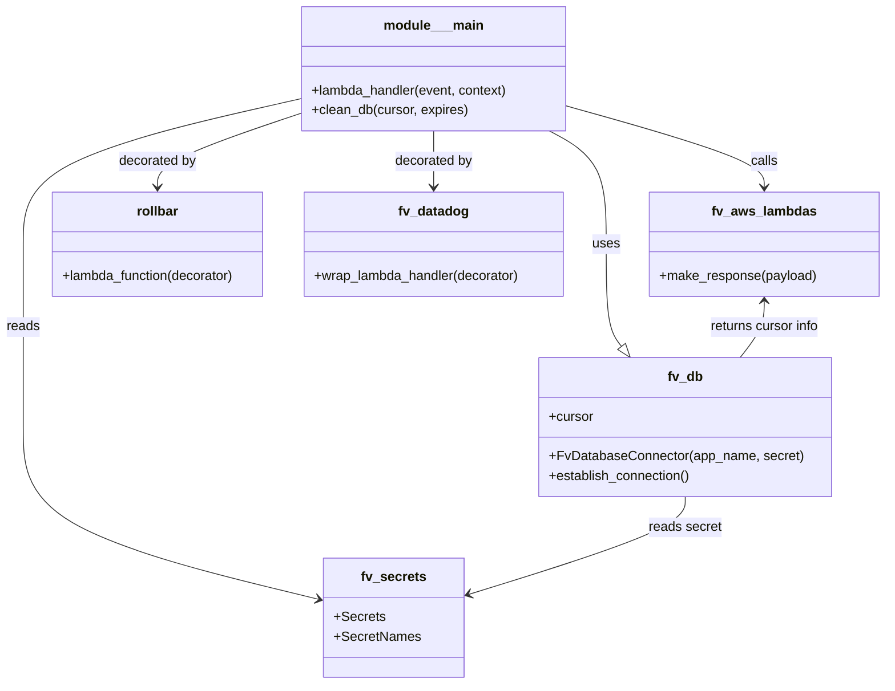

# Diagram: common/monitoring/monitoring/lambdas/logging/clean_logging_db.py


> Auto-generated by Obscura crawlers

## Diagram 1



### SVG

<svg id="container" width="1075.1796875" xmlns="http://www.w3.org/2000/svg" class="classDiagram" height="826" viewBox="0 0 1075.1796875 826" role="graphics-document document" aria-roledescription="class"><style>#container{font-family:"trebuchet ms",verdana,arial,sans-serif;font-size:16px;fill:#333;}@keyframes edge-animation-frame{from{stroke-dashoffset:0;}}@keyframes dash{to{stroke-dashoffset:0;}}#container .edge-animation-slow{stroke-dasharray:9,5!important;stroke-dashoffset:900;animation:dash 50s linear infinite;stroke-linecap:round;}#container .edge-animation-fast{stroke-dasharray:9,5!important;stroke-dashoffset:900;animation:dash 20s linear infinite;stroke-linecap:round;}#container .error-icon{fill:#552222;}#container .error-text{fill:#552222;stroke:#552222;}#container .edge-thickness-normal{stroke-width:1px;}#container .edge-thickness-thick{stroke-width:3.5px;}#container .edge-pattern-solid{stroke-dasharray:0;}#container .edge-thickness-invisible{stroke-width:0;fill:none;}#container .edge-pattern-dashed{stroke-dasharray:3;}#container .edge-pattern-dotted{stroke-dasharray:2;}#container .marker{fill:#333333;stroke:#333333;}#container .marker.cross{stroke:#333333;}#container svg{font-family:"trebuchet ms",verdana,arial,sans-serif;font-size:16px;}#container p{margin:0;}#container g.classGroup text{fill:#9370DB;stroke:none;font-family:"trebuchet ms",verdana,arial,sans-serif;font-size:10px;}#container g.classGroup text .title{font-weight:bolder;}#container .nodeLabel,#container .edgeLabel{color:#131300;}#container .edgeLabel .label rect{fill:#ECECFF;}#container .label text{fill:#131300;}#container .labelBkg{background:#ECECFF;}#container .edgeLabel .label span{background:#ECECFF;}#container .classTitle{font-weight:bolder;}#container .node rect,#container .node circle,#container .node ellipse,#container .node polygon,#container .node path{fill:#ECECFF;stroke:#9370DB;stroke-width:1px;}#container .divider{stroke:#9370DB;stroke-width:1;}#container g.clickable{cursor:pointer;}#container g.classGroup rect{fill:#ECECFF;stroke:#9370DB;}#container g.classGroup line{stroke:#9370DB;stroke-width:1;}#container .classLabel .box{stroke:none;stroke-width:0;fill:#ECECFF;opacity:0.5;}#container .classLabel .label{fill:#9370DB;font-size:10px;}#container .relation{stroke:#333333;stroke-width:1;fill:none;}#container .dashed-line{stroke-dasharray:3;}#container .dotted-line{stroke-dasharray:1 2;}#container #compositionStart,#container .composition{fill:#333333!important;stroke:#333333!important;stroke-width:1;}#container #compositionEnd,#container .composition{fill:#333333!important;stroke:#333333!important;stroke-width:1;}#container #dependencyStart,#container .dependency{fill:#333333!important;stroke:#333333!important;stroke-width:1;}#container #dependencyStart,#container .dependency{fill:#333333!important;stroke:#333333!important;stroke-width:1;}#container #extensionStart,#container .extension{fill:transparent!important;stroke:#333333!important;stroke-width:1;}#container #extensionEnd,#container .extension{fill:transparent!important;stroke:#333333!important;stroke-width:1;}#container #aggregationStart,#container .aggregation{fill:transparent!important;stroke:#333333!important;stroke-width:1;}#container #aggregationEnd,#container .aggregation{fill:transparent!important;stroke:#333333!important;stroke-width:1;}#container #lollipopStart,#container .lollipop{fill:#ECECFF!important;stroke:#333333!important;stroke-width:1;}#container #lollipopEnd,#container .lollipop{fill:#ECECFF!important;stroke:#333333!important;stroke-width:1;}#container .edgeTerminals{font-size:11px;line-height:initial;}#container .classTitleText{text-anchor:middle;font-size:18px;fill:#333;}#container .label-icon{display:inline-block;height:1em;overflow:visible;vertical-align:-0.125em;}#container .node .label-icon path{fill:currentColor;stroke:revert;stroke-width:revert;}#container :root{--mermaid-font-family:"trebuchet ms",verdana,arial,sans-serif;}</style><g><defs><marker id="container_class-aggregationStart" class="marker aggregation class" refX="18" refY="7" markerWidth="190" markerHeight="240" orient="auto"><path d="M 18,7 L9,13 L1,7 L9,1 Z"></path></marker></defs><defs><marker id="container_class-aggregationEnd" class="marker aggregation class" refX="1" refY="7" markerWidth="20" markerHeight="28" orient="auto"><path d="M 18,7 L9,13 L1,7 L9,1 Z"></path></marker></defs><defs><marker id="container_class-extensionStart" class="marker extension class" refX="18" refY="7" markerWidth="190" markerHeight="240" orient="auto"><path d="M 1,7 L18,13 V 1 Z"></path></marker></defs><defs><marker id="container_class-extensionEnd" class="marker extension class" refX="1" refY="7" markerWidth="20" markerHeight="28" orient="auto"><path d="M 1,1 V 13 L18,7 Z"></path></marker></defs><defs><marker id="container_class-compositionStart" class="marker composition class" refX="18" refY="7" markerWidth="190" markerHeight="240" orient="auto"><path d="M 18,7 L9,13 L1,7 L9,1 Z"></path></marker></defs><defs><marker id="container_class-compositionEnd" class="marker composition class" refX="1" refY="7" markerWidth="20" markerHeight="28" orient="auto"><path d="M 18,7 L9,13 L1,7 L9,1 Z"></path></marker></defs><defs><marker id="container_class-dependencyStart" class="marker dependency class" refX="6" refY="7" markerWidth="190" markerHeight="240" orient="auto"><path d="M 5,7 L9,13 L1,7 L9,1 Z"></path></marker></defs><defs><marker id="container_class-dependencyEnd" class="marker dependency class" refX="13" refY="7" markerWidth="20" markerHeight="28" orient="auto"><path d="M 18,7 L9,13 L14,7 L9,1 Z"></path></marker></defs><defs><marker id="container_class-lollipopStart" class="marker lollipop class" refX="13" refY="7" markerWidth="190" markerHeight="240" orient="auto"><circle stroke="black" fill="transparent" cx="7" cy="7" r="6"></circle></marker></defs><defs><marker id="container_class-lollipopEnd" class="marker lollipop class" refX="1" refY="7" markerWidth="190" markerHeight="240" orient="auto"><circle stroke="black" fill="transparent" cx="7" cy="7" r="6"></circle></marker></defs><g class="root"><g class="clusters"></g><g class="edgePaths"><path d="M672.718,158L684.27,164.167C695.823,170.333,718.927,182.667,730.479,205.5C742.031,228.333,742.031,261.667,742.031,295C742.031,328.333,742.031,361.667,745.064,382.231C748.098,402.795,754.164,410.591,757.197,414.489L760.23,418.386" id="id_module___main_fv_db_1" class="edge-thickness-normal edge-pattern-solid relation" style=";;;" data-edge="true" data-et="edge" data-id="id_module___main_fv_db_1" data-points="W3sieCI6NjcyLjcxODE5MTk2NDI4NTgsInkiOjE1OH0seyJ4Ijo3NDIuMDMxMjUsInkiOjE5NX0seyJ4Ijo3NDIuMDMxMjUsInkiOjI5NX0seyJ4Ijo3NDIuMDMxMjUsInkiOjM5NX0seyJ4Ijo3NzAuODI0MDI1MDUxNjUyOSwieSI6NDMyfV0=" marker-end="url(#container_class-extensionEnd)"></path><path d="M693.184,128.282L732.712,139.401C772.24,150.521,851.296,172.761,890.824,189.047C930.352,205.333,930.352,215.667,930.352,220.833L930.352,226" id="id_module___main_fv_aws_lambdas_2" class="edge-thickness-normal edge-pattern-solid relation" style=";;;" data-edge="true" data-et="edge" data-id="id_module___main_fv_aws_lambdas_2" data-points="W3sieCI6NjkzLjE4MzU5Mzc1LCJ5IjoxMjguMjgxNTI5MDEyMzgyfSx7IngiOjkzMC4zNTE1NjI1LCJ5IjoxOTV9LHsieCI6OTMwLjM1MTU2MjUsInkiOjIzMn1d" marker-end="url(#container_class-dependencyEnd)"></path><path d="M371.254,118.755L314.046,131.463C256.839,144.17,142.423,169.585,85.215,198.959C28.008,228.333,28.008,261.667,28.008,295C28.008,328.333,28.008,361.667,28.008,398.5C28.008,435.333,28.008,475.667,28.008,516C28.008,556.333,28.008,596.667,88.607,631.474C149.206,666.281,270.404,695.561,331.002,710.201L391.601,724.842" id="id_module___main_fv_secrets_3" class="edge-thickness-normal edge-pattern-solid relation" style=";;;" data-edge="true" data-et="edge" data-id="id_module___main_fv_secrets_3" data-points="W3sieCI6MzcxLjI1MzkwNjI1LCJ5IjoxMTguNzU1MDAwODUyMTk3OX0seyJ4IjoyOC4wMDc4MTI1LCJ5IjoxOTV9LHsieCI6MjguMDA3ODEyNSwieSI6Mjk1fSx7IngiOjI4LjAwNzgxMjUsInkiOjM5NX0seyJ4IjoyOC4wMDc4MTI1LCJ5Ijo1MTZ9LHsieCI6MjguMDA3ODEyNSwieSI6NjM3fSx7IngiOjM5Ny40MzM1OTM3NSwieSI6NzI2LjI1MDcwOTk1NjcxfV0=" marker-end="url(#container_class-dependencyEnd)"></path><path d="M371.254,136.217L341.62,146.014C311.987,155.811,252.72,175.406,223.087,190.369C193.453,205.333,193.453,215.667,193.453,220.833L193.453,226" id="id_module___main_rollbar_4" class="edge-thickness-normal edge-pattern-solid relation" style=";;;" data-edge="true" data-et="edge" data-id="id_module___main_rollbar_4" data-points="W3sieCI6MzcxLjI1MzkwNjI1LCJ5IjoxMzYuMjE2OTE4MDM4ODM1ODR9LHsieCI6MTkzLjQ1MzEyNSwieSI6MTk1fSx7IngiOjE5My40NTMxMjUsInkiOjIzMn1d" marker-end="url(#container_class-dependencyEnd)"></path><path d="M532.219,158L532.219,164.167C532.219,170.333,532.219,182.667,532.219,194C532.219,205.333,532.219,215.667,532.219,220.833L532.219,226" id="id_module___main_fv_datadog_5" class="edge-thickness-normal edge-pattern-solid relation" style=";;;" data-edge="true" data-et="edge" data-id="id_module___main_fv_datadog_5" data-points="W3sieCI6NTMyLjIxODc1LCJ5IjoxNTh9LHsieCI6NTMyLjIxODc1LCJ5IjoxOTV9LHsieCI6NTMyLjIxODc1LCJ5IjoyMzJ9XQ==" marker-end="url(#container_class-dependencyEnd)"></path><path d="M836.191,600L836.191,606.167C836.191,612.333,836.191,624.667,791.27,644.548C746.349,664.43,656.507,691.86,611.585,705.575L566.664,719.29" id="id_fv_db_fv_secrets_6" class="edge-thickness-normal edge-pattern-solid relation" style=";;;" data-edge="true" data-et="edge" data-id="id_fv_db_fv_secrets_6" data-points="W3sieCI6ODM2LjE5MTQwNjI1LCJ5Ijo2MDB9LHsieCI6ODM2LjE5MTQwNjI1LCJ5Ijo2Mzd9LHsieCI6NTYwLjkyNTc4MTI1LCJ5Ijo3MjEuMDQxOTI3ODk1Mzk5MX1d" marker-end="url(#container_class-dependencyEnd)"></path><path d="M930.352,364L930.352,369.167C930.352,374.333,930.352,384.667,925.553,396C920.754,407.333,911.156,419.667,906.358,425.833L901.559,432" id="id_fv_aws_lambdas_fv_db_7" class="edge-thickness-normal edge-pattern-solid relation" style=";;;" data-edge="true" data-et="edge" data-id="id_fv_aws_lambdas_fv_db_7" data-points="W3sieCI6OTMwLjM1MTU2MjUsInkiOjM1OH0seyJ4Ijo5MzAuMzUxNTYyNSwieSI6Mzk1fSx7IngiOjkwMS41NTg3ODc0NDgzNDcxLCJ5Ijo0MzJ9XQ==" marker-start="url(#container_class-dependencyStart)"></path></g><g class="edgeLabels"><g class="edgeLabel" transform="translate(742.03125, 295)"><g class="label" data-id="id_module___main_fv_db_1" transform="translate(-16.4921875, -12)"><foreignObject width="32.984375" height="24"><div xmlns="http://www.w3.org/1999/xhtml" class="labelBkg" style="display: table-cell; white-space: nowrap; line-height: 1.5; max-width: 200px; text-align: center;"><span class="edgeLabel"><p>uses</p></span></div></foreignObject></g></g><g class="edgeLabel" transform="translate(930.3515625, 195)"><g class="label" data-id="id_module___main_fv_aws_lambdas_2" transform="translate(-16.4453125, -12)"><foreignObject width="32.890625" height="24"><div xmlns="http://www.w3.org/1999/xhtml" class="labelBkg" style="display: table-cell; white-space: nowrap; line-height: 1.5; max-width: 200px; text-align: center;"><span class="edgeLabel"><p>calls</p></span></div></foreignObject></g></g><g class="edgeLabel" transform="translate(28.0078125, 395)"><g class="label" data-id="id_module___main_fv_secrets_3" transform="translate(-20.0078125, -12)"><foreignObject width="40.015625" height="24"><div xmlns="http://www.w3.org/1999/xhtml" class="labelBkg" style="display: table-cell; white-space: nowrap; line-height: 1.5; max-width: 200px; text-align: center;"><span class="edgeLabel"><p>reads</p></span></div></foreignObject></g></g><g class="edgeLabel" transform="translate(193.453125, 195)"><g class="label" data-id="id_module___main_rollbar_4" transform="translate(-47.328125, -12)"><foreignObject width="94.65625" height="24"><div xmlns="http://www.w3.org/1999/xhtml" class="labelBkg" style="display: table-cell; white-space: nowrap; line-height: 1.5; max-width: 200px; text-align: center;"><span class="edgeLabel"><p>decorated by</p></span></div></foreignObject></g></g><g class="edgeLabel" transform="translate(532.21875, 195)"><g class="label" data-id="id_module___main_fv_datadog_5" transform="translate(-47.328125, -12)"><foreignObject width="94.65625" height="24"><div xmlns="http://www.w3.org/1999/xhtml" class="labelBkg" style="display: table-cell; white-space: nowrap; line-height: 1.5; max-width: 200px; text-align: center;"><span class="edgeLabel"><p>decorated by</p></span></div></foreignObject></g></g><g class="edgeLabel" transform="translate(836.19140625, 637)"><g class="label" data-id="id_fv_db_fv_secrets_6" transform="translate(-44.140625, -12)"><foreignObject width="88.28125" height="24"><div xmlns="http://www.w3.org/1999/xhtml" class="labelBkg" style="display: table-cell; white-space: nowrap; line-height: 1.5; max-width: 200px; text-align: center;"><span class="edgeLabel"><p>reads secret</p></span></div></foreignObject></g></g><g class="edgeLabel" transform="translate(930.3515625, 395)"><g class="label" data-id="id_fv_aws_lambdas_fv_db_7" transform="translate(-67.5859375, -12)"><foreignObject width="135.171875" height="24"><div xmlns="http://www.w3.org/1999/xhtml" class="labelBkg" style="display: table-cell; white-space: nowrap; line-height: 1.5; max-width: 200px; text-align: center;"><span class="edgeLabel"><p>returns cursor info</p></span></div></foreignObject></g></g></g><g class="nodes"><g class="node default" id="classId-module___main-0" transform="translate(532.21875, 83)"><g class="basic label-container"><path d="M-160.96484375 -75 L160.96484375 -75 L160.96484375 75 L-160.96484375 75" stroke="none" stroke-width="0" fill="#ECECFF" style=""></path><path d="M-160.96484375 -75 C-62.60561023154932 -75, 35.75362328690136 -75, 160.96484375 -75 M-160.96484375 -75 C-35.067671969023294 -75, 90.82949981195341 -75, 160.96484375 -75 M160.96484375 -75 C160.96484375 -27.589763186051222, 160.96484375 19.820473627897556, 160.96484375 75 M160.96484375 -75 C160.96484375 -28.85731956838577, 160.96484375 17.285360863228462, 160.96484375 75 M160.96484375 75 C50.48405192995094 75, -59.99673989009813 75, -160.96484375 75 M160.96484375 75 C59.18278653127122 75, -42.59927068745756 75, -160.96484375 75 M-160.96484375 75 C-160.96484375 40.173853226736306, -160.96484375 5.347706453472611, -160.96484375 -75 M-160.96484375 75 C-160.96484375 36.91929731526214, -160.96484375 -1.161405369475716, -160.96484375 -75" stroke="#9370DB" stroke-width="1.3" fill="none" stroke-dasharray="0 0" style=""></path></g><g class="annotation-group text" transform="translate(0, -51)"></g><g class="label-group text" transform="translate(-57.7421875, -51)"><g class="label" style="font-weight: bolder" transform="translate(0,-12)"><foreignObject width="115.484375" height="24"><div xmlns="http://www.w3.org/1999/xhtml" style="display: table-cell; white-space: nowrap; line-height: 1.5; max-width: 166px; text-align: center;"><span class="nodeLabel markdown-node-label" style=""><p>module___main</p></span></div></foreignObject></g></g><g class="members-group text" transform="translate(-148.96484375, -3)"></g><g class="methods-group text" transform="translate(-148.96484375, 27)"><g class="label" style="" transform="translate(0,-12)"><foreignObject width="240.1875" height="24"><div xmlns="http://www.w3.org/1999/xhtml" style="display: table-cell; white-space: nowrap; line-height: 1.5; max-width: 298px; text-align: center;"><span class="nodeLabel markdown-node-label" style=""><p>+lambda_handler(event, context)</p></span></div></foreignObject></g><g class="label" style="" transform="translate(0,12)"><foreignObject width="189.09375" height="24"><div xmlns="http://www.w3.org/1999/xhtml" style="display: table-cell; white-space: nowrap; line-height: 1.5; max-width: 246px; text-align: center;"><span class="nodeLabel markdown-node-label" style=""><p>+clean_db(cursor, expires)</p></span></div></foreignObject></g></g><g class="divider" style=""><path d="M-160.96484375 -27 C-74.57845199240151 -27, 11.807939765196977 -27, 160.96484375 -27 M-160.96484375 -27 C-56.10418502994537 -27, 48.75647369010926 -27, 160.96484375 -27" stroke="#9370DB" stroke-width="1.3" fill="none" stroke-dasharray="0 0" style=""></path></g><g class="divider" style=""><path d="M-160.96484375 -3 C-70.30007519187255 -3, 20.364693366254897 -3, 160.96484375 -3 M-160.96484375 -3 C-90.87997225463924 -3, -20.795100759278483 -3, 160.96484375 -3" stroke="#9370DB" stroke-width="1.3" fill="none" stroke-dasharray="0 0" style=""></path></g></g><g class="node default" id="classId-fv_db-1" transform="translate(836.19140625, 516)"><g class="basic label-container"><path d="M-173.72265625 -84 L173.72265625 -84 L173.72265625 84 L-173.72265625 84" stroke="none" stroke-width="0" fill="#ECECFF" style=""></path><path d="M-173.72265625 -84 C-99.27120448286642 -84, -24.819752715732847 -84, 173.72265625 -84 M-173.72265625 -84 C-40.634049291674614 -84, 92.45455766665077 -84, 173.72265625 -84 M173.72265625 -84 C173.72265625 -43.61465847788533, 173.72265625 -3.2293169557706563, 173.72265625 84 M173.72265625 -84 C173.72265625 -33.88468875106903, 173.72265625 16.230622497861944, 173.72265625 84 M173.72265625 84 C46.07272009954211 84, -81.57721605091578 84, -173.72265625 84 M173.72265625 84 C54.76659490052312 84, -64.18946644895377 84, -173.72265625 84 M-173.72265625 84 C-173.72265625 40.60830391256303, -173.72265625 -2.7833921748739385, -173.72265625 -84 M-173.72265625 84 C-173.72265625 47.506330666338364, -173.72265625 11.012661332676728, -173.72265625 -84" stroke="#9370DB" stroke-width="1.3" fill="none" stroke-dasharray="0 0" style=""></path></g><g class="annotation-group text" transform="translate(0, -60)"></g><g class="label-group text" transform="translate(-20.2890625, -60)"><g class="label" style="font-weight: bolder" transform="translate(0,-12)"><foreignObject width="40.578125" height="24"><div xmlns="http://www.w3.org/1999/xhtml" style="display: table-cell; white-space: nowrap; line-height: 1.5; max-width: 90px; text-align: center;"><span class="nodeLabel markdown-node-label" style=""><p>fv_db</p></span></div></foreignObject></g></g><g class="members-group text" transform="translate(-161.72265625, -12)"><g class="label" style="" transform="translate(0,-12)"><foreignObject width="53.71875" height="24"><div xmlns="http://www.w3.org/1999/xhtml" style="display: table-cell; white-space: nowrap; line-height: 1.5; max-width: 112px; text-align: center;"><span class="nodeLabel markdown-node-label" style=""><p>+cursor</p></span></div></foreignObject></g></g><g class="methods-group text" transform="translate(-161.72265625, 36)"><g class="label" style="" transform="translate(0,-12)"><foreignObject width="303.15625" height="24"><div xmlns="http://www.w3.org/1999/xhtml" style="display: table-cell; white-space: nowrap; line-height: 1.5; max-width: 361px; text-align: center;"><span class="nodeLabel markdown-node-label" style=""><p>+FvDatabaseConnector(app_name, secret)</p></span></div></foreignObject></g><g class="label" style="" transform="translate(0,12)"><foreignObject width="173.265625" height="24"><div xmlns="http://www.w3.org/1999/xhtml" style="display: table-cell; white-space: nowrap; line-height: 1.5; max-width: 231px; text-align: center;"><span class="nodeLabel markdown-node-label" style=""><p>+establish_connection()</p></span></div></foreignObject></g></g><g class="divider" style=""><path d="M-173.72265625 -36 C-70.11486095022563 -36, 33.49293434954873 -36, 173.72265625 -36 M-173.72265625 -36 C-42.632095060352356 -36, 88.45846612929529 -36, 173.72265625 -36" stroke="#9370DB" stroke-width="1.3" fill="none" stroke-dasharray="0 0" style=""></path></g><g class="divider" style=""><path d="M-173.72265625 12 C-49.81358343464211 12, 74.09548938071578 12, 173.72265625 12 M-173.72265625 12 C-84.63875113013229 12, 4.445153989735417 12, 173.72265625 12" stroke="#9370DB" stroke-width="1.3" fill="none" stroke-dasharray="0 0" style=""></path></g></g><g class="node default" id="classId-fv_aws_lambdas-2" transform="translate(930.3515625, 295)"><g class="basic label-container"><path d="M-136.828125 -63 L136.828125 -63 L136.828125 63 L-136.828125 63" stroke="none" stroke-width="0" fill="#ECECFF" style=""></path><path d="M-136.828125 -63 C-53.83255663075886 -63, 29.163011738482282 -63, 136.828125 -63 M-136.828125 -63 C-49.35793182922335 -63, 38.11226134155331 -63, 136.828125 -63 M136.828125 -63 C136.828125 -36.17957567329074, 136.828125 -9.359151346581484, 136.828125 63 M136.828125 -63 C136.828125 -33.02101492197265, 136.828125 -3.0420298439453077, 136.828125 63 M136.828125 63 C35.27615869216298 63, -66.27580761567404 63, -136.828125 63 M136.828125 63 C46.7063926396669 63, -43.415339720666196 63, -136.828125 63 M-136.828125 63 C-136.828125 19.941593925349316, -136.828125 -23.116812149301367, -136.828125 -63 M-136.828125 63 C-136.828125 34.02194542290589, -136.828125 5.043890845811767, -136.828125 -63" stroke="#9370DB" stroke-width="1.3" fill="none" stroke-dasharray="0 0" style=""></path></g><g class="annotation-group text" transform="translate(0, -39)"></g><g class="label-group text" transform="translate(-60.0625, -39)"><g class="label" style="font-weight: bolder" transform="translate(0,-12)"><foreignObject width="120.125" height="24"><div xmlns="http://www.w3.org/1999/xhtml" style="display: table-cell; white-space: nowrap; line-height: 1.5; max-width: 168px; text-align: center;"><span class="nodeLabel markdown-node-label" style=""><p>fv_aws_lambdas</p></span></div></foreignObject></g></g><g class="members-group text" transform="translate(-124.828125, 9)"></g><g class="methods-group text" transform="translate(-124.828125, 39)"><g class="label" style="" transform="translate(0,-12)"><foreignObject width="189.59375" height="24"><div xmlns="http://www.w3.org/1999/xhtml" style="display: table-cell; white-space: nowrap; line-height: 1.5; max-width: 247px; text-align: center;"><span class="nodeLabel markdown-node-label" style=""><p>+make_response(payload)</p></span></div></foreignObject></g></g><g class="divider" style=""><path d="M-136.828125 -15 C-72.2990946418251 -15, -7.770064283650214 -15, 136.828125 -15 M-136.828125 -15 C-32.06839576573678 -15, 72.69133346852644 -15, 136.828125 -15" stroke="#9370DB" stroke-width="1.3" fill="none" stroke-dasharray="0 0" style=""></path></g><g class="divider" style=""><path d="M-136.828125 9 C-42.717459418054304 9, 51.39320616389139 9, 136.828125 9 M-136.828125 9 C-36.078329511203606 9, 64.67146597759279 9, 136.828125 9" stroke="#9370DB" stroke-width="1.3" fill="none" stroke-dasharray="0 0" style=""></path></g></g><g class="node default" id="classId-fv_secrets-3" transform="translate(479.1796875, 746)"><g class="basic label-container"><path d="M-81.74609375 -72 L81.74609375 -72 L81.74609375 72 L-81.74609375 72" stroke="none" stroke-width="0" fill="#ECECFF" style=""></path><path d="M-81.74609375 -72 C-28.755133971737152 -72, 24.235825806525696 -72, 81.74609375 -72 M-81.74609375 -72 C-27.570656903300765 -72, 26.60477994339847 -72, 81.74609375 -72 M81.74609375 -72 C81.74609375 -32.78217214750849, 81.74609375 6.43565570498302, 81.74609375 72 M81.74609375 -72 C81.74609375 -32.56806211531792, 81.74609375 6.8638757693641566, 81.74609375 72 M81.74609375 72 C38.93960176004377 72, -3.866890229912457 72, -81.74609375 72 M81.74609375 72 C37.7506852849808 72, -6.244723180038406 72, -81.74609375 72 M-81.74609375 72 C-81.74609375 41.31014510381129, -81.74609375 10.620290207622574, -81.74609375 -72 M-81.74609375 72 C-81.74609375 28.37090706872192, -81.74609375 -15.25818586255616, -81.74609375 -72" stroke="#9370DB" stroke-width="1.3" fill="none" stroke-dasharray="0 0" style=""></path></g><g class="annotation-group text" transform="translate(0, -48)"></g><g class="label-group text" transform="translate(-37.3203125, -48)"><g class="label" style="font-weight: bolder" transform="translate(0,-12)"><foreignObject width="74.640625" height="24"><div xmlns="http://www.w3.org/1999/xhtml" style="display: table-cell; white-space: nowrap; line-height: 1.5; max-width: 123px; text-align: center;"><span class="nodeLabel markdown-node-label" style=""><p>fv_secrets</p></span></div></foreignObject></g></g><g class="members-group text" transform="translate(-69.74609375, 0)"><g class="label" style="" transform="translate(0,-12)"><foreignObject width="60.109375" height="24"><div xmlns="http://www.w3.org/1999/xhtml" style="display: table-cell; white-space: nowrap; line-height: 1.5; max-width: 117px; text-align: center;"><span class="nodeLabel markdown-node-label" style=""><p>+Secrets</p></span></div></foreignObject></g><g class="label" style="" transform="translate(0,12)"><foreignObject width="102.171875" height="24"><div xmlns="http://www.w3.org/1999/xhtml" style="display: table-cell; white-space: nowrap; line-height: 1.5; max-width: 160px; text-align: center;"><span class="nodeLabel markdown-node-label" style=""><p>+SecretNames</p></span></div></foreignObject></g></g><g class="methods-group text" transform="translate(-69.74609375, 72)"></g><g class="divider" style=""><path d="M-81.74609375 -24 C-23.08531104026615 -24, 35.5754716694677 -24, 81.74609375 -24 M-81.74609375 -24 C-46.481790364234676 -24, -11.217486978469353 -24, 81.74609375 -24" stroke="#9370DB" stroke-width="1.3" fill="none" stroke-dasharray="0 0" style=""></path></g><g class="divider" style=""><path d="M-81.74609375 48 C-33.26267706403943 48, 15.22073962192114 48, 81.74609375 48 M-81.74609375 48 C-42.452510375235015 48, -3.1589270004700296 48, 81.74609375 48" stroke="#9370DB" stroke-width="1.3" fill="none" stroke-dasharray="0 0" style=""></path></g></g><g class="node default" id="classId-rollbar-4" transform="translate(193.453125, 295)"><g class="basic label-container"><path d="M-130.4453125 -63 L130.4453125 -63 L130.4453125 63 L-130.4453125 63" stroke="none" stroke-width="0" fill="#ECECFF" style=""></path><path d="M-130.4453125 -63 C-76.89165948636139 -63, -23.338006472722782 -63, 130.4453125 -63 M-130.4453125 -63 C-42.19192733318563 -63, 46.06145783362874 -63, 130.4453125 -63 M130.4453125 -63 C130.4453125 -31.86756051291658, 130.4453125 -0.7351210258331591, 130.4453125 63 M130.4453125 -63 C130.4453125 -28.7097955472655, 130.4453125 5.580408905469, 130.4453125 63 M130.4453125 63 C68.39910529421874 63, 6.352898088437485 63, -130.4453125 63 M130.4453125 63 C74.55838569422782 63, 18.671458888455646 63, -130.4453125 63 M-130.4453125 63 C-130.4453125 33.1072306282629, -130.4453125 3.2144612565258015, -130.4453125 -63 M-130.4453125 63 C-130.4453125 31.292943278900516, -130.4453125 -0.4141134421989676, -130.4453125 -63" stroke="#9370DB" stroke-width="1.3" fill="none" stroke-dasharray="0 0" style=""></path></g><g class="annotation-group text" transform="translate(0, -39)"></g><g class="label-group text" transform="translate(-24.6875, -39)"><g class="label" style="font-weight: bolder" transform="translate(0,-12)"><foreignObject width="49.375" height="24"><div xmlns="http://www.w3.org/1999/xhtml" style="display: table-cell; white-space: nowrap; line-height: 1.5; max-width: 99px; text-align: center;"><span class="nodeLabel markdown-node-label" style=""><p>rollbar</p></span></div></foreignObject></g></g><g class="members-group text" transform="translate(-118.4453125, 9)"></g><g class="methods-group text" transform="translate(-118.4453125, 39)"><g class="label" style="" transform="translate(0,-12)"><foreignObject width="212.203125" height="24"><div xmlns="http://www.w3.org/1999/xhtml" style="display: table-cell; white-space: nowrap; line-height: 1.5; max-width: 270px; text-align: center;"><span class="nodeLabel markdown-node-label" style=""><p>+lambda_function(decorator)</p></span></div></foreignObject></g></g><g class="divider" style=""><path d="M-130.4453125 -15 C-54.30684964909399 -15, 21.83161320181202 -15, 130.4453125 -15 M-130.4453125 -15 C-30.566711436074 -15, 69.311889627852 -15, 130.4453125 -15" stroke="#9370DB" stroke-width="1.3" fill="none" stroke-dasharray="0 0" style=""></path></g><g class="divider" style=""><path d="M-130.4453125 9 C-31.820457417013614 9, 66.80439766597277 9, 130.4453125 9 M-130.4453125 9 C-36.12057006133017 9, 58.20417237733966 9, 130.4453125 9" stroke="#9370DB" stroke-width="1.3" fill="none" stroke-dasharray="0 0" style=""></path></g></g><g class="node default" id="classId-fv_datadog-5" transform="translate(532.21875, 295)"><g class="basic label-container"><path d="M-158.3203125 -63 L158.3203125 -63 L158.3203125 63 L-158.3203125 63" stroke="none" stroke-width="0" fill="#ECECFF" style=""></path><path d="M-158.3203125 -63 C-92.48946327899313 -63, -26.658614057986256 -63, 158.3203125 -63 M-158.3203125 -63 C-64.54936331689892 -63, 29.22158586620216 -63, 158.3203125 -63 M158.3203125 -63 C158.3203125 -23.59119355475098, 158.3203125 15.81761289049804, 158.3203125 63 M158.3203125 -63 C158.3203125 -21.853052951651037, 158.3203125 19.293894096697926, 158.3203125 63 M158.3203125 63 C36.29097939539166 63, -85.73835370921668 63, -158.3203125 63 M158.3203125 63 C86.57109356047386 63, 14.82187462094771 63, -158.3203125 63 M-158.3203125 63 C-158.3203125 21.730961676763414, -158.3203125 -19.538076646473172, -158.3203125 -63 M-158.3203125 63 C-158.3203125 22.21514074577749, -158.3203125 -18.56971850844502, -158.3203125 -63" stroke="#9370DB" stroke-width="1.3" fill="none" stroke-dasharray="0 0" style=""></path></g><g class="annotation-group text" transform="translate(0, -39)"></g><g class="label-group text" transform="translate(-41.15625, -39)"><g class="label" style="font-weight: bolder" transform="translate(0,-12)"><foreignObject width="82.3125" height="24"><div xmlns="http://www.w3.org/1999/xhtml" style="display: table-cell; white-space: nowrap; line-height: 1.5; max-width: 131px; text-align: center;"><span class="nodeLabel markdown-node-label" style=""><p>fv_datadog</p></span></div></foreignObject></g></g><g class="members-group text" transform="translate(-146.3203125, 9)"></g><g class="methods-group text" transform="translate(-146.3203125, 39)"><g class="label" style="" transform="translate(0,-12)"><foreignObject width="251.484375" height="24"><div xmlns="http://www.w3.org/1999/xhtml" style="display: table-cell; white-space: nowrap; line-height: 1.5; max-width: 309px; text-align: center;"><span class="nodeLabel markdown-node-label" style=""><p>+wrap_lambda_handler(decorator)</p></span></div></foreignObject></g></g><g class="divider" style=""><path d="M-158.3203125 -15 C-60.29351896141792 -15, 37.73327457716417 -15, 158.3203125 -15 M-158.3203125 -15 C-86.7743292441204 -15, -15.22834598824079 -15, 158.3203125 -15" stroke="#9370DB" stroke-width="1.3" fill="none" stroke-dasharray="0 0" style=""></path></g><g class="divider" style=""><path d="M-158.3203125 9 C-37.841131978833985 9, 82.63804854233203 9, 158.3203125 9 M-158.3203125 9 C-65.0408028217154 9, 28.238706856569195 9, 158.3203125 9" stroke="#9370DB" stroke-width="1.3" fill="none" stroke-dasharray="0 0" style=""></path></g></g></g></g></g></svg>

## Diagram 2

```mermaid
flowchart TD
    Start[Start: Lambda invoked] --> EstablishDB[Establish DB connection\nDB_CONN_TRACKING.establish_connection()]
    EstablishDB --> GetCursor[Get cursor from DB_CONN_TRACKING]
    GetCursor --> CheckStage{AWS_STAGE value}
    CheckStage -->|staging / staging1 / test| CleanStaging[Call clean_db(cursor, "14 days")]
    CheckStage -->|prod| CleanProd[Call clean_db(cursor, "3 months")]
    CleanStaging --> MakeResponse1{clean_db runs SQL and returns rowsDeleted}
    CleanProd --> MakeResponse2{clean_db runs SQL and returns rowsDeleted}
    MakeResponse1 --> Return[Return make_response({"rowsDeleted": n})]
    MakeResponse2 --> Return
    style Start fill:#f9f,stroke:#333,stroke-width:1px
    style Return fill:#bbf,stroke:#333,stroke-width:1px
```

> SVG rendering failed for this diagram.
