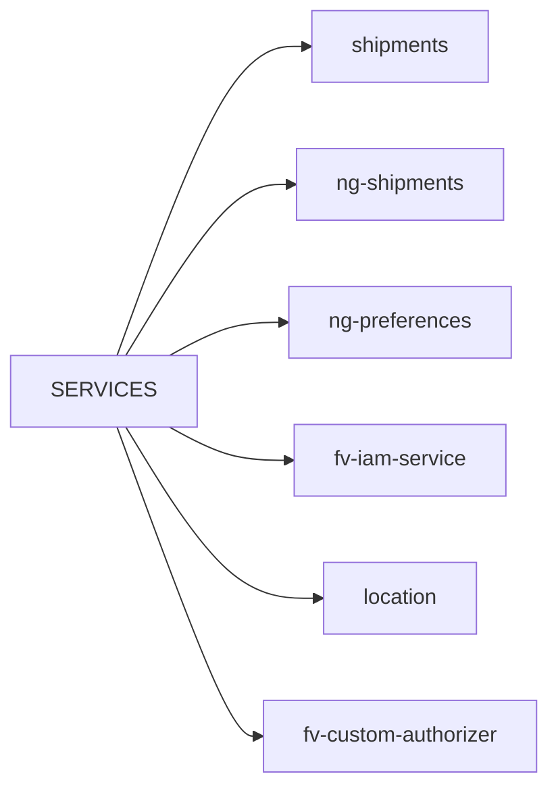

# Diagram: common/monitoring/monitoring/resource_group/constants.py

> Auto-generated by Obscura crawlers

## Mermaid

### SVG

<svg id="container" width="406.125" xmlns="http://www.w3.org/2000/svg" class="flowchart" height="590" viewBox="0 0 406.125 590" role="graphics-document document" aria-roledescription="flowchart-v2"><g><marker id="container_flowchart-v2-pointEnd" class="marker flowchart-v2" viewBox="0 0 10 10" refX="5" refY="5" markerUnits="userSpaceOnUse" markerWidth="8" markerHeight="8" orient="auto"><path d="M 0 0 L 10 5 L 0 10 z" class="arrowMarkerPath" style="stroke-width: 1; stroke-dasharray: 1, 0;"></path></marker><marker id="container_flowchart-v2-pointStart" class="marker flowchart-v2" viewBox="0 0 10 10" refX="4.5" refY="5" markerUnits="userSpaceOnUse" markerWidth="8" markerHeight="8" orient="auto"><path d="M 0 5 L 10 10 L 10 0 z" class="arrowMarkerPath" style="stroke-width: 1; stroke-dasharray: 1, 0;"></path></marker><marker id="container_flowchart-v2-circleEnd" class="marker flowchart-v2" viewBox="0 0 10 10" refX="11" refY="5" markerUnits="userSpaceOnUse" markerWidth="11" markerHeight="11" orient="auto"><circle cx="5" cy="5" r="5" class="arrowMarkerPath" style="stroke-width: 1; stroke-dasharray: 1, 0;"></circle></marker><marker id="container_flowchart-v2-circleStart" class="marker flowchart-v2" viewBox="0 0 10 10" refX="-1" refY="5" markerUnits="userSpaceOnUse" markerWidth="11" markerHeight="11" orient="auto"><circle cx="5" cy="5" r="5" class="arrowMarkerPath" style="stroke-width: 1; stroke-dasharray: 1, 0;"></circle></marker><marker id="container_flowchart-v2-crossEnd" class="marker cross flowchart-v2" viewBox="0 0 11 11" refX="12" refY="5.2" markerUnits="userSpaceOnUse" markerWidth="11" markerHeight="11" orient="auto"><path d="M 1,1 l 9,9 M 10,1 l -9,9" class="arrowMarkerPath" style="stroke-width: 2; stroke-dasharray: 1, 0;"></path></marker><marker id="container_flowchart-v2-crossStart" class="marker cross flowchart-v2" viewBox="0 0 11 11" refX="-1" refY="5.2" markerUnits="userSpaceOnUse" markerWidth="11" markerHeight="11" orient="auto"><path d="M 1,1 l 9,9 M 10,1 l -9,9" class="arrowMarkerPath" style="stroke-width: 2; stroke-dasharray: 1, 0;"></path></marker><g class="root"><g class="clusters"></g><g class="edgePaths"><path d="M80.44,268L93.625,229.167C106.809,190.333,133.178,112.667,156.334,73.833C179.49,35,199.432,35,209.404,35L219.375,35" id="L_S_shipments_0" class="edge-thickness-normal edge-pattern-solid edge-thickness-normal edge-pattern-solid flowchart-link" style=";" data-edge="true" data-et="edge" data-id="L_S_shipments_0" data-points="W3sieCI6ODAuNDQwMjk0NDcxMTUzODUsInkiOjI2OH0seyJ4IjoxNTkuNTQ2ODc1LCJ5IjozNX0seyJ4IjoyMjMuMzc1LCJ5IjozNX1d" marker-end="url(#container_flowchart-v2-pointEnd)"></path><path d="M86.552,268L98.717,246.5C110.883,225,135.215,182,155.354,160.5C175.492,139,191.438,139,199.41,139L207.383,139" id="L_S_ng_shipments_0" class="edge-thickness-normal edge-pattern-solid edge-thickness-normal edge-pattern-solid flowchart-link" style=";" data-edge="true" data-et="edge" data-id="L_S_ng_shipments_0" data-points="W3sieCI6ODYuNTUxNTMyNDUxOTIzMDgsInkiOjI2OH0seyJ4IjoxNTkuNTQ2ODc1LCJ5IjoxMzl9LHsieCI6MjExLjM4MjgxMjUsInkiOjEzOX1d" marker-end="url(#container_flowchart-v2-pointEnd)"></path><path d="M117.108,268L124.181,263.833C131.254,259.667,145.4,251.333,159.677,247.167C173.953,243,188.359,243,195.563,243L202.766,243" id="L_S_ng_preferences_0" class="edge-thickness-normal edge-pattern-solid edge-thickness-normal edge-pattern-solid flowchart-link" style=";" data-edge="true" data-et="edge" data-id="L_S_ng_preferences_0" data-points="W3sieCI6MTE3LjEwNzcyMjM1NTc2OTIzLCJ5IjoyNjh9LHsieCI6MTU5LjU0Njg3NSwieSI6MjQzfSx7IngiOjIwNi43NjU2MjUsInkiOjI0M31d" marker-end="url(#container_flowchart-v2-pointEnd)"></path><path d="M117.108,322L124.181,326.167C131.254,330.333,145.4,338.667,160.13,342.833C174.859,347,190.172,347,197.828,347L205.484,347" id="L_S_fv_iam_0" class="edge-thickness-normal edge-pattern-solid edge-thickness-normal edge-pattern-solid flowchart-link" style=";" data-edge="true" data-et="edge" data-id="L_S_fv_iam_0" data-points="W3sieCI6MTE3LjEwNzcyMjM1NTc2OTIzLCJ5IjozMjJ9LHsieCI6MTU5LjU0Njg3NSwieSI6MzQ3fSx7IngiOjIwOS40ODQzNzUsInkiOjM0N31d" marker-end="url(#container_flowchart-v2-pointEnd)"></path><path d="M86.552,322L98.717,343.5C110.883,365,135.215,408,158.749,429.5C182.284,451,205.021,451,216.389,451L227.758,451" id="L_S_location_0" class="edge-thickness-normal edge-pattern-solid edge-thickness-normal edge-pattern-solid flowchart-link" style=";" data-edge="true" data-et="edge" data-id="L_S_location_0" data-points="W3sieCI6ODYuNTUxNTMyNDUxOTIzMDgsInkiOjMyMn0seyJ4IjoxNTkuNTQ2ODc1LCJ5Ijo0NTF9LHsieCI6MjMxLjc1NzgxMjUsInkiOjQ1MX1d" marker-end="url(#container_flowchart-v2-pointEnd)"></path><path d="M80.44,322L93.625,360.833C106.809,399.667,133.178,477.333,149.862,516.167C166.547,555,173.547,555,177.047,555L180.547,555" id="L_S_fv_custom_0" class="edge-thickness-normal edge-pattern-solid edge-thickness-normal edge-pattern-solid flowchart-link" style=";" data-edge="true" data-et="edge" data-id="L_S_fv_custom_0" data-points="W3sieCI6ODAuNDQwMjk0NDcxMTUzODUsInkiOjMyMn0seyJ4IjoxNTkuNTQ2ODc1LCJ5Ijo1NTV9LHsieCI6MTg0LjU0Njg3NSwieSI6NTU1fV0=" marker-end="url(#container_flowchart-v2-pointEnd)"></path></g><g class="edgeLabels"><g class="edgeLabel"><g class="label" data-id="L_S_shipments_0" transform="translate(0, 0)"><foreignObject width="0" height="0">

</foreignObject></g></g><g class="edgeLabel"><g class="label" data-id="L_S_ng_shipments_0" transform="translate(0, 0)"><foreignObject width="0" height="0">

</foreignObject></g></g><g class="edgeLabel"><g class="label" data-id="L_S_ng_preferences_0" transform="translate(0, 0)"><foreignObject width="0" height="0">

</foreignObject></g></g><g class="edgeLabel"><g class="label" data-id="L_S_fv_iam_0" transform="translate(0, 0)"><foreignObject width="0" height="0">

</foreignObject></g></g><g class="edgeLabel"><g class="label" data-id="L_S_location_0" transform="translate(0, 0)"><foreignObject width="0" height="0">

</foreignObject></g></g><g class="edgeLabel"><g class="label" data-id="L_S_fv_custom_0" transform="translate(0, 0)"><foreignObject width="0" height="0">

</foreignObject></g></g></g><g class="nodes"><g class="node default" id="flowchart-S-0" transform="translate(71.2734375, 295)"><rect class="basic label-container" style="" x="-63.2734375" y="-27" width="126.546875" height="54"></rect><g class="label" style="" transform="translate(-33.2734375, -12)"><rect></rect><foreignObject width="66.546875" height="24">

SERVICES

</foreignObject></g></g><g class="node default" id="flowchart-shipments-1" transform="translate(291.3359375, 35)"><rect class="basic label-container" style="" x="-67.9609375" y="-27" width="135.921875" height="54"></rect><g class="label" style="" transform="translate(-37.9609375, -12)"><rect></rect><foreignObject width="75.921875" height="24">

shipments

</foreignObject></g></g><g class="node default" id="flowchart-ng_shipments-2" transform="translate(291.3359375, 139)"><rect class="basic label-container" style="" x="-79.953125" y="-27" width="159.90625" height="54"></rect><g class="label" style="" transform="translate(-49.953125, -12)"><rect></rect><foreignObject width="99.90625" height="24">

ng-shipments

</foreignObject></g></g><g class="node default" id="flowchart-ng_preferences-3" transform="translate(291.3359375, 243)"><rect class="basic label-container" style="" x="-84.5703125" y="-27" width="169.140625" height="54"></rect><g class="label" style="" transform="translate(-54.5703125, -12)"><rect></rect><foreignObject width="109.140625" height="24">

ng-preferences

</foreignObject></g></g><g class="node default" id="flowchart-fv_iam-4" transform="translate(291.3359375, 347)"><rect class="basic label-container" style="" x="-81.8515625" y="-27" width="163.703125" height="54"></rect><g class="label" style="" transform="translate(-51.8515625, -12)"><rect></rect><foreignObject width="103.703125" height="24">

fv-iam-service

</foreignObject></g></g><g class="node default" id="flowchart-location-5" transform="translate(291.3359375, 451)"><rect class="basic label-container" style="" x="-59.578125" y="-27" width="119.15625" height="54"></rect><g class="label" style="" transform="translate(-29.578125, -12)"><rect></rect><foreignObject width="59.15625" height="24">

location

</foreignObject></g></g><g class="node default" id="flowchart-fv_custom-6" transform="translate(291.3359375, 555)"><rect class="basic label-container" style="" x="-106.7890625" y="-27" width="213.578125" height="54"></rect><g class="label" style="" transform="translate(-76.7890625, -12)"><rect></rect><foreignObject width="153.578125" height="24">

fv-custom-authorizer

</foreignObject></g></g></g></g></g></svg>
