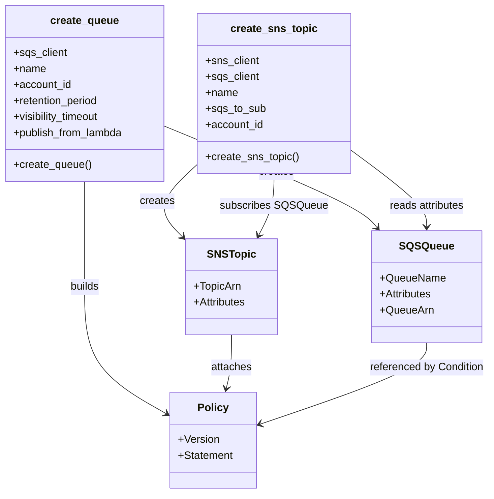

# Diagram: common/monitoring/monitoring/sqs/__init__.py


> Auto-generated by Obscura crawlers

## Diagram 1

```mermaid
flowchart TD
  subgraph CreateQueueFunction
    A[create_queue(name, account_id, retention_period, visibility_timeout, publish_from_lambda)] --> B{publish_from_lambda?}
    B -- true --> C[service = "lambda"\nallow_name = "*"]
    B -- false --> D[service = "sns"\nallow_name = name]
    C --> E[sqs_client.create_queue(QueueName=name, Attributes=Policy, MessageRetentionPeriod, VisibilityTimeout)]
    D --> E
    E --> F[Returns queue]
    E --> G[Policy: {\n  "Version": "2012-10-17",\n  "Statement": [\n    {"Action":"SQS:SendMessage","Condition":{"ArnEquals":"arn:aws:{service}:us-east-1:{account_id}:{allow_name}"}}\n  ]\n}]
  end
```

> SVG rendering failed for this diagram.

## Diagram 2

```mermaid
flowchart TD
  subgraph CreateSNSTopicFunction
    H[create_sns_topic(sns_client, sqs_client, name, sqs_to_sub, account_id)] --> I[sns_client.create_topic(Name=name, Attributes=Policy)]
    I --> J[topic.TopicArn -> topic_arn]
    H --> K[sqs_client.get_queue_attributes(QueueUrl=sqs_to_sub, AttributeNames=["QueueArn"])]
    K --> L[queue_arn]
    J --> M[sns_client.subscribe(TopicArn=topic_arn, Protocol="sqs", Endpoint=queue_arn)]
    M --> N[No explicit return; subscription created]
    I --> O[Policy: {\n  "Version":"2008-10-17",\n  "Statement":[\n    {"Action":["SNS:Publish","SNS:Subscribe",...],"Condition":{"StringEquals":{"AWS:SourceOwner":account_id}}}\n  ]\n}]
  end
```

> SVG rendering failed for this diagram.

## Diagram 3



### SVG

<svg id="container" width="735.6328125" xmlns="http://www.w3.org/2000/svg" class="classDiagram" height="740" viewBox="0 0 735.6328125 740" role="graphics-document document" aria-roledescription="class"><style>#container{font-family:"trebuchet ms",verdana,arial,sans-serif;font-size:16px;fill:#333;}@keyframes edge-animation-frame{from{stroke-dashoffset:0;}}@keyframes dash{to{stroke-dashoffset:0;}}#container .edge-animation-slow{stroke-dasharray:9,5!important;stroke-dashoffset:900;animation:dash 50s linear infinite;stroke-linecap:round;}#container .edge-animation-fast{stroke-dasharray:9,5!important;stroke-dashoffset:900;animation:dash 20s linear infinite;stroke-linecap:round;}#container .error-icon{fill:#552222;}#container .error-text{fill:#552222;stroke:#552222;}#container .edge-thickness-normal{stroke-width:1px;}#container .edge-thickness-thick{stroke-width:3.5px;}#container .edge-pattern-solid{stroke-dasharray:0;}#container .edge-thickness-invisible{stroke-width:0;fill:none;}#container .edge-pattern-dashed{stroke-dasharray:3;}#container .edge-pattern-dotted{stroke-dasharray:2;}#container .marker{fill:#333333;stroke:#333333;}#container .marker.cross{stroke:#333333;}#container svg{font-family:"trebuchet ms",verdana,arial,sans-serif;font-size:16px;}#container p{margin:0;}#container g.classGroup text{fill:#9370DB;stroke:none;font-family:"trebuchet ms",verdana,arial,sans-serif;font-size:10px;}#container g.classGroup text .title{font-weight:bolder;}#container .nodeLabel,#container .edgeLabel{color:#131300;}#container .edgeLabel .label rect{fill:#ECECFF;}#container .label text{fill:#131300;}#container .labelBkg{background:#ECECFF;}#container .edgeLabel .label span{background:#ECECFF;}#container .classTitle{font-weight:bolder;}#container .node rect,#container .node circle,#container .node ellipse,#container .node polygon,#container .node path{fill:#ECECFF;stroke:#9370DB;stroke-width:1px;}#container .divider{stroke:#9370DB;stroke-width:1;}#container g.clickable{cursor:pointer;}#container g.classGroup rect{fill:#ECECFF;stroke:#9370DB;}#container g.classGroup line{stroke:#9370DB;stroke-width:1;}#container .classLabel .box{stroke:none;stroke-width:0;fill:#ECECFF;opacity:0.5;}#container .classLabel .label{fill:#9370DB;font-size:10px;}#container .relation{stroke:#333333;stroke-width:1;fill:none;}#container .dashed-line{stroke-dasharray:3;}#container .dotted-line{stroke-dasharray:1 2;}#container #compositionStart,#container .composition{fill:#333333!important;stroke:#333333!important;stroke-width:1;}#container #compositionEnd,#container .composition{fill:#333333!important;stroke:#333333!important;stroke-width:1;}#container #dependencyStart,#container .dependency{fill:#333333!important;stroke:#333333!important;stroke-width:1;}#container #dependencyStart,#container .dependency{fill:#333333!important;stroke:#333333!important;stroke-width:1;}#container #extensionStart,#container .extension{fill:transparent!important;stroke:#333333!important;stroke-width:1;}#container #extensionEnd,#container .extension{fill:transparent!important;stroke:#333333!important;stroke-width:1;}#container #aggregationStart,#container .aggregation{fill:transparent!important;stroke:#333333!important;stroke-width:1;}#container #aggregationEnd,#container .aggregation{fill:transparent!important;stroke:#333333!important;stroke-width:1;}#container #lollipopStart,#container .lollipop{fill:#ECECFF!important;stroke:#333333!important;stroke-width:1;}#container #lollipopEnd,#container .lollipop{fill:#ECECFF!important;stroke:#333333!important;stroke-width:1;}#container .edgeTerminals{font-size:11px;line-height:initial;}#container .classTitleText{text-anchor:middle;font-size:18px;fill:#333;}#container .label-icon{display:inline-block;height:1em;overflow:visible;vertical-align:-0.125em;}#container .node .label-icon path{fill:currentColor;stroke:revert;stroke-width:revert;}#container :root{--mermaid-font-family:"trebuchet ms",verdana,arial,sans-serif;}</style><g><defs><marker id="container_class-aggregationStart" class="marker aggregation class" refX="18" refY="7" markerWidth="190" markerHeight="240" orient="auto"><path d="M 18,7 L9,13 L1,7 L9,1 Z"></path></marker></defs><defs><marker id="container_class-aggregationEnd" class="marker aggregation class" refX="1" refY="7" markerWidth="20" markerHeight="28" orient="auto"><path d="M 18,7 L9,13 L1,7 L9,1 Z"></path></marker></defs><defs><marker id="container_class-extensionStart" class="marker extension class" refX="18" refY="7" markerWidth="190" markerHeight="240" orient="auto"><path d="M 1,7 L18,13 V 1 Z"></path></marker></defs><defs><marker id="container_class-extensionEnd" class="marker extension class" refX="1" refY="7" markerWidth="20" markerHeight="28" orient="auto"><path d="M 1,1 V 13 L18,7 Z"></path></marker></defs><defs><marker id="container_class-compositionStart" class="marker composition class" refX="18" refY="7" markerWidth="190" markerHeight="240" orient="auto"><path d="M 18,7 L9,13 L1,7 L9,1 Z"></path></marker></defs><defs><marker id="container_class-compositionEnd" class="marker composition class" refX="1" refY="7" markerWidth="20" markerHeight="28" orient="auto"><path d="M 18,7 L9,13 L1,7 L9,1 Z"></path></marker></defs><defs><marker id="container_class-dependencyStart" class="marker dependency class" refX="6" refY="7" markerWidth="190" markerHeight="240" orient="auto"><path d="M 5,7 L9,13 L1,7 L9,1 Z"></path></marker></defs><defs><marker id="container_class-dependencyEnd" class="marker dependency class" refX="13" refY="7" markerWidth="20" markerHeight="28" orient="auto"><path d="M 18,7 L9,13 L14,7 L9,1 Z"></path></marker></defs><defs><marker id="container_class-lollipopStart" class="marker lollipop class" refX="13" refY="7" markerWidth="190" markerHeight="240" orient="auto"><circle stroke="black" fill="transparent" cx="7" cy="7" r="6"></circle></marker></defs><defs><marker id="container_class-lollipopEnd" class="marker lollipop class" refX="1" refY="7" markerWidth="190" markerHeight="240" orient="auto"><circle stroke="black" fill="transparent" cx="7" cy="7" r="6"></circle></marker></defs><g class="root"><g class="clusters"></g><g class="edgePaths"><path d="M248.945,189.886L296.888,209.738C344.831,229.591,440.716,269.295,493.309,294.556C545.902,319.817,555.203,330.634,559.853,336.042L564.503,341.45" id="id_create_queue_SQSQueue_1" class="edge-thickness-normal edge-pattern-solid relation" style=";;;" data-edge="true" data-et="edge" data-id="id_create_queue_SQSQueue_1" data-points="W3sieCI6MjQ4Ljk0NTMxMjUsInkiOjE4OS44ODU5MDI3MDAwMTI0NX0seyJ4Ijo1MzYuNjAxNTYyNSwieSI6MzA5fSx7IngiOjU2OC40MTUxNjAxMjM5NjcsInkiOjM0Nn1d" marker-end="url(#container_class-dependencyEnd)"></path><path d="M128.473,272L128.473,278.167C128.473,284.333,128.473,296.667,128.473,323C128.473,349.333,128.473,389.667,128.473,430C128.473,470.333,128.473,510.667,149.188,542.497C169.904,574.328,211.335,597.657,232.05,609.321L252.766,620.985" id="id_create_queue_Policy_2" class="edge-thickness-normal edge-pattern-solid relation" style=";;;" data-edge="true" data-et="edge" data-id="id_create_queue_Policy_2" data-points="W3sieCI6MTI4LjQ3MjY1NjI1LCJ5IjoyNzJ9LHsieCI6MTI4LjQ3MjY1NjI1LCJ5IjozMDl9LHsieCI6MTI4LjQ3MjY1NjI1LCJ5Ijo0MzB9LHsieCI6MTI4LjQ3MjY1NjI1LCJ5Ijo1NTF9LHsieCI6MjU3Ljk5NDE0MDYyNSwieSI6NjIzLjkyODc2OTYxMTA1Nzl9XQ==" marker-end="url(#container_class-dependencyEnd)"></path><path d="M298.945,245.2L287.558,255.833C276.171,266.467,253.397,287.733,249.599,306.117C245.801,324.501,260.98,340.003,268.569,347.753L276.158,355.504" id="id_create_sns_topic_SNSTopic_3" class="edge-thickness-normal edge-pattern-solid relation" style=";;;" data-edge="true" data-et="edge" data-id="id_create_sns_topic_SNSTopic_3" data-points="W3sieCI6Mjk4Ljk0NTMxMjUsInkiOjI0NS4xOTk4MTQzNzcxMzgxOH0seyJ4IjoyMzAuNjIzMDQ2ODc1LCJ5IjozMDl9LHsieCI6MjgwLjM1NTQ2ODc1LCJ5IjozNTkuNzkwODM3NjA1NzEwNH1d" marker-end="url(#container_class-dependencyEnd)"></path><path d="M524.258,223.125L543.655,237.438C563.052,251.75,601.846,280.375,621.243,299.854C640.641,319.333,640.641,329.667,640.641,334.833L640.641,340" id="id_create_sns_topic_SQSQueue_4" class="edge-thickness-normal edge-pattern-solid relation" style=";;;" data-edge="true" data-et="edge" data-id="id_create_sns_topic_SQSQueue_4" data-points="W3sieCI6NTI0LjI1NzgxMjUsInkiOjIyMy4xMjUxNDkyMzA4MjE3fSx7IngiOjY0MC42NDA2MjUsInkiOjMwOX0seyJ4Ijo2NDAuNjQwNjI1LCJ5IjozNDZ9XQ==" marker-end="url(#container_class-dependencyEnd)"></path><path d="M411.602,260L411.602,268.167C411.602,276.333,411.602,292.667,407.842,308.112C404.083,323.556,396.564,338.113,392.805,345.391L389.045,352.669" id="id_create_sns_topic_SNSTopic_5" class="edge-thickness-normal edge-pattern-solid relation" style=";;;" data-edge="true" data-et="edge" data-id="id_create_sns_topic_SNSTopic_5" data-points="W3sieCI6NDExLjYwMTU2MjUsInkiOjI2MH0seyJ4Ijo0MTEuNjAxNTYyNSwieSI6MzA5fSx7IngiOjM4Ni4yOTE2NDUxNDQ2MjgxLCJ5IjozNTh9XQ==" marker-end="url(#container_class-dependencyEnd)"></path><path d="M349.102,502L349.102,510.167C349.102,518.333,349.102,534.667,347.812,548.029C346.523,561.392,343.945,571.784,342.655,576.98L341.366,582.177" id="id_SNSTopic_Policy_6" class="edge-thickness-normal edge-pattern-solid relation" style=";;;" data-edge="true" data-et="edge" data-id="id_SNSTopic_Policy_6" data-points="W3sieCI6MzQ5LjEwMTU2MjUsInkiOjUwMn0seyJ4IjozNDkuMTAxNTYyNSwieSI6NTUxfSx7IngiOjMzOS45MjExNzYxNzU0NTg3LCJ5Ijo1ODh9XQ==" marker-end="url(#container_class-dependencyEnd)"></path><path d="M640.641,514L640.641,520.167C640.641,526.333,640.641,538.667,599.167,559.023C557.692,579.38,474.744,607.76,433.27,621.95L391.796,636.139" id="id_SQSQueue_Policy_7" class="edge-thickness-normal edge-pattern-solid relation" style=";;;" data-edge="true" data-et="edge" data-id="id_SQSQueue_Policy_7" data-points="W3sieCI6NjQwLjY0MDYyNSwieSI6NTE0fSx7IngiOjY0MC42NDA2MjUsInkiOjU1MX0seyJ4IjozODYuMTE5MTQwNjI1LCJ5Ijo2MzguMDgxNzIxNDg0ODQyfV0=" marker-end="url(#container_class-dependencyEnd)"></path></g><g class="edgeLabels"><g class="edgeLabel" transform="translate(415.31554, 258.77729)"><g class="label" data-id="id_create_queue_SQSQueue_1" transform="translate(-26.171875, -12)"><foreignObject width="52.34375" height="24"><div xmlns="http://www.w3.org/1999/xhtml" class="labelBkg" style="display: table-cell; white-space: nowrap; line-height: 1.5; max-width: 200px; text-align: center;"><span class="edgeLabel"><p>creates</p></span></div></foreignObject></g></g><g class="edgeLabel" transform="translate(128.47265625, 430)"><g class="label" data-id="id_create_queue_Policy_2" transform="translate(-22.4921875, -12)"><foreignObject width="44.984375" height="24"><div xmlns="http://www.w3.org/1999/xhtml" class="labelBkg" style="display: table-cell; white-space: nowrap; line-height: 1.5; max-width: 200px; text-align: center;"><span class="edgeLabel"><p>builds</p></span></div></foreignObject></g></g><g class="edgeLabel" transform="translate(238.807, 301.35773)"><g class="label" data-id="id_create_sns_topic_SNSTopic_3" transform="translate(-26.171875, -12)"><foreignObject width="52.34375" height="24"><div xmlns="http://www.w3.org/1999/xhtml" class="labelBkg" style="display: table-cell; white-space: nowrap; line-height: 1.5; max-width: 200px; text-align: center;"><span class="edgeLabel"><p>creates</p></span></div></foreignObject></g></g><g class="edgeLabel" transform="translate(640.640625, 309)"><g class="label" data-id="id_create_sns_topic_SQSQueue_4" transform="translate(-57.8671875, -12)"><foreignObject width="115.734375" height="24"><div xmlns="http://www.w3.org/1999/xhtml" class="labelBkg" style="display: table-cell; white-space: nowrap; line-height: 1.5; max-width: 200px; text-align: center;"><span class="edgeLabel"><p>reads attributes</p></span></div></foreignObject></g></g><g class="edgeLabel" transform="translate(411.6015625, 309)"><g class="label" data-id="id_create_sns_topic_SNSTopic_5" transform="translate(-78.828125, -12)"><foreignObject width="157.65625" height="24"><div xmlns="http://www.w3.org/1999/xhtml" class="labelBkg" style="display: table-cell; white-space: nowrap; line-height: 1.5; max-width: 200px; text-align: center;"><span class="edgeLabel"><p>subscribes SQSQueue</p></span></div></foreignObject></g></g><g class="edgeLabel" transform="translate(349.1015625, 551)"><g class="label" data-id="id_SNSTopic_Policy_6" transform="translate(-31.0390625, -12)"><foreignObject width="62.078125" height="24"><div xmlns="http://www.w3.org/1999/xhtml" class="labelBkg" style="display: table-cell; white-space: nowrap; line-height: 1.5; max-width: 200px; text-align: center;"><span class="edgeLabel"><p>attaches</p></span></div></foreignObject></g></g><g class="edgeLabel" transform="translate(640.640625, 551)"><g class="label" data-id="id_SQSQueue_Policy_7" transform="translate(-86.9921875, -12)"><foreignObject width="173.984375" height="24"><div xmlns="http://www.w3.org/1999/xhtml" class="labelBkg" style="display: table-cell; white-space: nowrap; line-height: 1.5; max-width: 200px; text-align: center;"><span class="edgeLabel"><p>referenced by Condition</p></span></div></foreignObject></g></g></g><g class="nodes"><g class="node default" id="classId-create_queue-0" transform="translate(128.47265625, 140)"><g class="basic label-container"><path d="M-120.47265625 -132 L120.47265625 -132 L120.47265625 132 L-120.47265625 132" stroke="none" stroke-width="0" fill="#ECECFF" style=""></path><path d="M-120.47265625 -132 C-58.40391360348712 -132, 3.6648290430257617 -132, 120.47265625 -132 M-120.47265625 -132 C-66.48350569214101 -132, -12.494355134282017 -132, 120.47265625 -132 M120.47265625 -132 C120.47265625 -52.33809079937389, 120.47265625 27.323818401252225, 120.47265625 132 M120.47265625 -132 C120.47265625 -61.0758526791122, 120.47265625 9.848294641775595, 120.47265625 132 M120.47265625 132 C51.939897503273755 132, -16.59286124345249 132, -120.47265625 132 M120.47265625 132 C71.51827527819461 132, 22.5638943063892 132, -120.47265625 132 M-120.47265625 132 C-120.47265625 45.270548184049076, -120.47265625 -41.45890363190185, -120.47265625 -132 M-120.47265625 132 C-120.47265625 37.193650234469956, -120.47265625 -57.61269953106009, -120.47265625 -132" stroke="#9370DB" stroke-width="1.3" fill="none" stroke-dasharray="0 0" style=""></path></g><g class="annotation-group text" transform="translate(0, -108)"></g><g class="label-group text" transform="translate(-49.5078125, -108)"><g class="label" style="font-weight: bolder" transform="translate(0,-12)"><foreignObject width="99.015625" height="24"><div xmlns="http://www.w3.org/1999/xhtml" style="display: table-cell; white-space: nowrap; line-height: 1.5; max-width: 148px; text-align: center;"><span class="nodeLabel markdown-node-label" style=""><p>create_queue</p></span></div></foreignObject></g></g><g class="members-group text" transform="translate(-108.47265625, -60)"><g class="label" style="" transform="translate(0,-12)"><foreignObject width="80.90625" height="24"><div xmlns="http://www.w3.org/1999/xhtml" style="display: table-cell; white-space: nowrap; line-height: 1.5; max-width: 138px; text-align: center;"><span class="nodeLabel markdown-node-label" style=""><p>+sqs_client</p></span></div></foreignObject></g><g class="label" style="" transform="translate(0,12)"><foreignObject width="48.5" height="24"><div xmlns="http://www.w3.org/1999/xhtml" style="display: table-cell; white-space: nowrap; line-height: 1.5; max-width: 106px; text-align: center;"><span class="nodeLabel markdown-node-label" style=""><p>+name</p></span></div></foreignObject></g><g class="label" style="" transform="translate(0,36)"><foreignObject width="87.3125" height="24"><div xmlns="http://www.w3.org/1999/xhtml" style="display: table-cell; white-space: nowrap; line-height: 1.5; max-width: 145px; text-align: center;"><span class="nodeLabel markdown-node-label" style=""><p>+account_id</p></span></div></foreignObject></g><g class="label" style="" transform="translate(0,60)"><foreignObject width="131.1875" height="24"><div xmlns="http://www.w3.org/1999/xhtml" style="display: table-cell; white-space: nowrap; line-height: 1.5; max-width: 189px; text-align: center;"><span class="nodeLabel markdown-node-label" style=""><p>+retention_period</p></span></div></foreignObject></g><g class="label" style="" transform="translate(0,84)"><foreignObject width="133.65625" height="24"><div xmlns="http://www.w3.org/1999/xhtml" style="display: table-cell; white-space: nowrap; line-height: 1.5; max-width: 191px; text-align: center;"><span class="nodeLabel markdown-node-label" style=""><p>+visibility_timeout</p></span></div></foreignObject></g><g class="label" style="" transform="translate(0,108)"><foreignObject width="167.4375" height="24"><div xmlns="http://www.w3.org/1999/xhtml" style="display: table-cell; white-space: nowrap; line-height: 1.5; max-width: 225px; text-align: center;"><span class="nodeLabel markdown-node-label" style=""><p>+publish_from_lambda</p></span></div></foreignObject></g></g><g class="methods-group text" transform="translate(-108.47265625, 108)"><g class="label" style="" transform="translate(0,-12)"><foreignObject width="116.53125" height="24"><div xmlns="http://www.w3.org/1999/xhtml" style="display: table-cell; white-space: nowrap; line-height: 1.5; max-width: 174px; text-align: center;"><span class="nodeLabel markdown-node-label" style=""><p>+create_queue()</p></span></div></foreignObject></g></g><g class="divider" style=""><path d="M-120.47265625 -84 C-57.04128969396865 -84, 6.390076862062699 -84, 120.47265625 -84 M-120.47265625 -84 C-61.61676715847615 -84, -2.7608780669523014 -84, 120.47265625 -84" stroke="#9370DB" stroke-width="1.3" fill="none" stroke-dasharray="0 0" style=""></path></g><g class="divider" style=""><path d="M-120.47265625 84 C-63.69312807226448 84, -6.913599894528957 84, 120.47265625 84 M-120.47265625 84 C-33.54652753722118 84, 53.37960117555764 84, 120.47265625 84" stroke="#9370DB" stroke-width="1.3" fill="none" stroke-dasharray="0 0" style=""></path></g></g><g class="node default" id="classId-create_sns_topic-1" transform="translate(411.6015625, 140)"><g class="basic label-container"><path d="M-112.65625 -120 L112.65625 -120 L112.65625 120 L-112.65625 120" stroke="none" stroke-width="0" fill="#ECECFF" style=""></path><path d="M-112.65625 -120 C-39.46945030546311 -120, 33.717349389073775 -120, 112.65625 -120 M-112.65625 -120 C-52.090962480036076 -120, 8.474325039927848 -120, 112.65625 -120 M112.65625 -120 C112.65625 -35.18524966613393, 112.65625 49.629500667732145, 112.65625 120 M112.65625 -120 C112.65625 -35.393046415656386, 112.65625 49.21390716868723, 112.65625 120 M112.65625 120 C45.10448713086829 120, -22.447275738263414 120, -112.65625 120 M112.65625 120 C23.280831599781806 120, -66.09458680043639 120, -112.65625 120 M-112.65625 120 C-112.65625 70.86173552971394, -112.65625 21.72347105942788, -112.65625 -120 M-112.65625 120 C-112.65625 37.852079981778786, -112.65625 -44.29584003644243, -112.65625 -120" stroke="#9370DB" stroke-width="1.3" fill="none" stroke-dasharray="0 0" style=""></path></g><g class="annotation-group text" transform="translate(0, -96)"></g><g class="label-group text" transform="translate(-61.546875, -96)"><g class="label" style="font-weight: bolder" transform="translate(0,-12)"><foreignObject width="123.09375" height="24"><div xmlns="http://www.w3.org/1999/xhtml" style="display: table-cell; white-space: nowrap; line-height: 1.5; max-width: 172px; text-align: center;"><span class="nodeLabel markdown-node-label" style=""><p>create_sns_topic</p></span></div></foreignObject></g></g><g class="members-group text" transform="translate(-100.65625, -48)"><g class="label" style="" transform="translate(0,-12)"><foreignObject width="80.71875" height="24"><div xmlns="http://www.w3.org/1999/xhtml" style="display: table-cell; white-space: nowrap; line-height: 1.5; max-width: 138px; text-align: center;"><span class="nodeLabel markdown-node-label" style=""><p>+sns_client</p></span></div></foreignObject></g><g class="label" style="" transform="translate(0,12)"><foreignObject width="80.90625" height="24"><div xmlns="http://www.w3.org/1999/xhtml" style="display: table-cell; white-space: nowrap; line-height: 1.5; max-width: 138px; text-align: center;"><span class="nodeLabel markdown-node-label" style=""><p>+sqs_client</p></span></div></foreignObject></g><g class="label" style="" transform="translate(0,36)"><foreignObject width="48.5" height="24"><div xmlns="http://www.w3.org/1999/xhtml" style="display: table-cell; white-space: nowrap; line-height: 1.5; max-width: 106px; text-align: center;"><span class="nodeLabel markdown-node-label" style=""><p>+name</p></span></div></foreignObject></g><g class="label" style="" transform="translate(0,60)"><foreignObject width="89.359375" height="24"><div xmlns="http://www.w3.org/1999/xhtml" style="display: table-cell; white-space: nowrap; line-height: 1.5; max-width: 147px; text-align: center;"><span class="nodeLabel markdown-node-label" style=""><p>+sqs_to_sub</p></span></div></foreignObject></g><g class="label" style="" transform="translate(0,84)"><foreignObject width="87.3125" height="24"><div xmlns="http://www.w3.org/1999/xhtml" style="display: table-cell; white-space: nowrap; line-height: 1.5; max-width: 145px; text-align: center;"><span class="nodeLabel markdown-node-label" style=""><p>+account_id</p></span></div></foreignObject></g></g><g class="methods-group text" transform="translate(-100.65625, 96)"><g class="label" style="" transform="translate(0,-12)"><foreignObject width="139.765625" height="24"><div xmlns="http://www.w3.org/1999/xhtml" style="display: table-cell; white-space: nowrap; line-height: 1.5; max-width: 197px; text-align: center;"><span class="nodeLabel markdown-node-label" style=""><p>+create_sns_topic()</p></span></div></foreignObject></g></g><g class="divider" style=""><path d="M-112.65625 -72 C-24.93482560280195 -72, 62.7865987943961 -72, 112.65625 -72 M-112.65625 -72 C-67.23012838500162 -72, -21.804006770003227 -72, 112.65625 -72" stroke="#9370DB" stroke-width="1.3" fill="none" stroke-dasharray="0 0" style=""></path></g><g class="divider" style=""><path d="M-112.65625 72 C-64.70706923899405 72, -16.757888477988118 72, 112.65625 72 M-112.65625 72 C-27.172681680129116 72, 58.31088663974177 72, 112.65625 72" stroke="#9370DB" stroke-width="1.3" fill="none" stroke-dasharray="0 0" style=""></path></g></g><g class="node default" id="classId-SQSQueue-2" transform="translate(640.640625, 430)"><g class="basic label-container"><path d="M-79.67578125 -84 L79.67578125 -84 L79.67578125 84 L-79.67578125 84" stroke="none" stroke-width="0" fill="#ECECFF" style=""></path><path d="M-79.67578125 -84 C-30.36651978517805 -84, 18.942741679643902 -84, 79.67578125 -84 M-79.67578125 -84 C-40.26271958734953 -84, -0.8496579246990592 -84, 79.67578125 -84 M79.67578125 -84 C79.67578125 -35.62072463168884, 79.67578125 12.758550736622325, 79.67578125 84 M79.67578125 -84 C79.67578125 -17.21729686653157, 79.67578125 49.56540626693686, 79.67578125 84 M79.67578125 84 C34.324564124331445 84, -11.02665300133711 84, -79.67578125 84 M79.67578125 84 C37.55326707542561 84, -4.569247099148782 84, -79.67578125 84 M-79.67578125 84 C-79.67578125 17.403741115980935, -79.67578125 -49.19251776803813, -79.67578125 -84 M-79.67578125 84 C-79.67578125 26.038589777548943, -79.67578125 -31.922820444902115, -79.67578125 -84" stroke="#9370DB" stroke-width="1.3" fill="none" stroke-dasharray="0 0" style=""></path></g><g class="annotation-group text" transform="translate(0, -60)"></g><g class="label-group text" transform="translate(-38.1796875, -60)"><g class="label" style="font-weight: bolder" transform="translate(0,-12)"><foreignObject width="76.359375" height="24"><div xmlns="http://www.w3.org/1999/xhtml" style="display: table-cell; white-space: nowrap; line-height: 1.5; max-width: 126px; text-align: center;"><span class="nodeLabel markdown-node-label" style=""><p>SQSQueue</p></span></div></foreignObject></g></g><g class="members-group text" transform="translate(-67.67578125, -12)"><g class="label" style="" transform="translate(0,-12)"><foreignObject width="97.171875" height="24"><div xmlns="http://www.w3.org/1999/xhtml" style="display: table-cell; white-space: nowrap; line-height: 1.5; max-width: 155px; text-align: center;"><span class="nodeLabel markdown-node-label" style=""><p>+QueueName</p></span></div></foreignObject></g><g class="label" style="" transform="translate(0,12)"><foreignObject width="79.78125" height="24"><div xmlns="http://www.w3.org/1999/xhtml" style="display: table-cell; white-space: nowrap; line-height: 1.5; max-width: 137px; text-align: center;"><span class="nodeLabel markdown-node-label" style=""><p>+Attributes</p></span></div></foreignObject></g><g class="label" style="" transform="translate(0,36)"><foreignObject width="79.828125" height="24"><div xmlns="http://www.w3.org/1999/xhtml" style="display: table-cell; white-space: nowrap; line-height: 1.5; max-width: 137px; text-align: center;"><span class="nodeLabel markdown-node-label" style=""><p>+QueueArn</p></span></div></foreignObject></g></g><g class="methods-group text" transform="translate(-67.67578125, 84)"></g><g class="divider" style=""><path d="M-79.67578125 -36 C-34.907622227324325 -36, 9.86053679535135 -36, 79.67578125 -36 M-79.67578125 -36 C-16.18420859930208 -36, 47.30736405139584 -36, 79.67578125 -36" stroke="#9370DB" stroke-width="1.3" fill="none" stroke-dasharray="0 0" style=""></path></g><g class="divider" style=""><path d="M-79.67578125 60 C-30.416344826867466 60, 18.84309159626507 60, 79.67578125 60 M-79.67578125 60 C-29.399585117978212 60, 20.876611014043576 60, 79.67578125 60" stroke="#9370DB" stroke-width="1.3" fill="none" stroke-dasharray="0 0" style=""></path></g></g><g class="node default" id="classId-SNSTopic-3" transform="translate(349.1015625, 430)"><g class="basic label-container"><path d="M-68.74609375 -72 L68.74609375 -72 L68.74609375 72 L-68.74609375 72" stroke="none" stroke-width="0" fill="#ECECFF" style=""></path><path d="M-68.74609375 -72 C-16.826366996324985 -72, 35.09335975735003 -72, 68.74609375 -72 M-68.74609375 -72 C-35.81680020619282 -72, -2.887506662385647 -72, 68.74609375 -72 M68.74609375 -72 C68.74609375 -33.56526685678194, 68.74609375 4.869466286436122, 68.74609375 72 M68.74609375 -72 C68.74609375 -25.714057774837286, 68.74609375 20.571884450325427, 68.74609375 72 M68.74609375 72 C20.824392659661783 72, -27.097308430676435 72, -68.74609375 72 M68.74609375 72 C30.751120427590003 72, -7.2438528948199945 72, -68.74609375 72 M-68.74609375 72 C-68.74609375 35.543839612147735, -68.74609375 -0.9123207757045293, -68.74609375 -72 M-68.74609375 72 C-68.74609375 14.861678503851216, -68.74609375 -42.27664299229757, -68.74609375 -72" stroke="#9370DB" stroke-width="1.3" fill="none" stroke-dasharray="0 0" style=""></path></g><g class="annotation-group text" transform="translate(0, -48)"></g><g class="label-group text" transform="translate(-33.7109375, -48)"><g class="label" style="font-weight: bolder" transform="translate(0,-12)"><foreignObject width="67.421875" height="24"><div xmlns="http://www.w3.org/1999/xhtml" style="display: table-cell; white-space: nowrap; line-height: 1.5; max-width: 117px; text-align: center;"><span class="nodeLabel markdown-node-label" style=""><p>SNSTopic</p></span></div></foreignObject></g></g><g class="members-group text" transform="translate(-56.74609375, 0)"><g class="label" style="" transform="translate(0,-12)"><foreignObject width="70.3125" height="24"><div xmlns="http://www.w3.org/1999/xhtml" style="display: table-cell; white-space: nowrap; line-height: 1.5; max-width: 128px; text-align: center;"><span class="nodeLabel markdown-node-label" style=""><p>+TopicArn</p></span></div></foreignObject></g><g class="label" style="" transform="translate(0,12)"><foreignObject width="79.78125" height="24"><div xmlns="http://www.w3.org/1999/xhtml" style="display: table-cell; white-space: nowrap; line-height: 1.5; max-width: 137px; text-align: center;"><span class="nodeLabel markdown-node-label" style=""><p>+Attributes</p></span></div></foreignObject></g></g><g class="methods-group text" transform="translate(-56.74609375, 72)"></g><g class="divider" style=""><path d="M-68.74609375 -24 C-20.127825767884318 -24, 28.490442214231365 -24, 68.74609375 -24 M-68.74609375 -24 C-40.61469649169452 -24, -12.483299233389026 -24, 68.74609375 -24" stroke="#9370DB" stroke-width="1.3" fill="none" stroke-dasharray="0 0" style=""></path></g><g class="divider" style=""><path d="M-68.74609375 48 C-13.897144537097667 48, 40.95180467580467 48, 68.74609375 48 M-68.74609375 48 C-29.219560931766907 48, 10.306971886466187 48, 68.74609375 48" stroke="#9370DB" stroke-width="1.3" fill="none" stroke-dasharray="0 0" style=""></path></g></g><g class="node default" id="classId-Policy-4" transform="translate(322.056640625, 660)"><g class="basic label-container"><path d="M-64.0625 -72 L64.0625 -72 L64.0625 72 L-64.0625 72" stroke="none" stroke-width="0" fill="#ECECFF" style=""></path><path d="M-64.0625 -72 C-25.169850351632057 -72, 13.722799296735886 -72, 64.0625 -72 M-64.0625 -72 C-17.51060989246772 -72, 29.04128021506456 -72, 64.0625 -72 M64.0625 -72 C64.0625 -32.92479534174538, 64.0625 6.15040931650924, 64.0625 72 M64.0625 -72 C64.0625 -26.264861412070317, 64.0625 19.470277175859366, 64.0625 72 M64.0625 72 C31.070646262581242 72, -1.9212074748375159 72, -64.0625 72 M64.0625 72 C34.24169776316253 72, 4.4208955263250544 72, -64.0625 72 M-64.0625 72 C-64.0625 28.808777881340227, -64.0625 -14.382444237319547, -64.0625 -72 M-64.0625 72 C-64.0625 14.627546212979773, -64.0625 -42.744907574040454, -64.0625 -72" stroke="#9370DB" stroke-width="1.3" fill="none" stroke-dasharray="0 0" style=""></path></g><g class="annotation-group text" transform="translate(0, -48)"></g><g class="label-group text" transform="translate(-21.84375, -48)"><g class="label" style="font-weight: bolder" transform="translate(0,-12)"><foreignObject width="43.6875" height="24"><div xmlns="http://www.w3.org/1999/xhtml" style="display: table-cell; white-space: nowrap; line-height: 1.5; max-width: 93px; text-align: center;"><span class="nodeLabel markdown-node-label" style=""><p>Policy</p></span></div></foreignObject></g></g><g class="members-group text" transform="translate(-52.0625, 0)"><g class="label" style="" transform="translate(0,-12)"><foreignObject width="61.453125" height="24"><div xmlns="http://www.w3.org/1999/xhtml" style="display: table-cell; white-space: nowrap; line-height: 1.5; max-width: 119px; text-align: center;"><span class="nodeLabel markdown-node-label" style=""><p>+Version</p></span></div></foreignObject></g><g class="label" style="" transform="translate(0,12)"><foreignObject width="82.28125" height="24"><div xmlns="http://www.w3.org/1999/xhtml" style="display: table-cell; white-space: nowrap; line-height: 1.5; max-width: 140px; text-align: center;"><span class="nodeLabel markdown-node-label" style=""><p>+Statement</p></span></div></foreignObject></g></g><g class="methods-group text" transform="translate(-52.0625, 72)"></g><g class="divider" style=""><path d="M-64.0625 -24 C-20.077655683868443 -24, 23.907188632263114 -24, 64.0625 -24 M-64.0625 -24 C-26.544530319819387 -24, 10.973439360361226 -24, 64.0625 -24" stroke="#9370DB" stroke-width="1.3" fill="none" stroke-dasharray="0 0" style=""></path></g><g class="divider" style=""><path d="M-64.0625 48 C-13.623581015295485 48, 36.81533796940903 48, 64.0625 48 M-64.0625 48 C-15.347850614134238 48, 33.366798771731524 48, 64.0625 48" stroke="#9370DB" stroke-width="1.3" fill="none" stroke-dasharray="0 0" style=""></path></g></g></g></g></g></svg>
