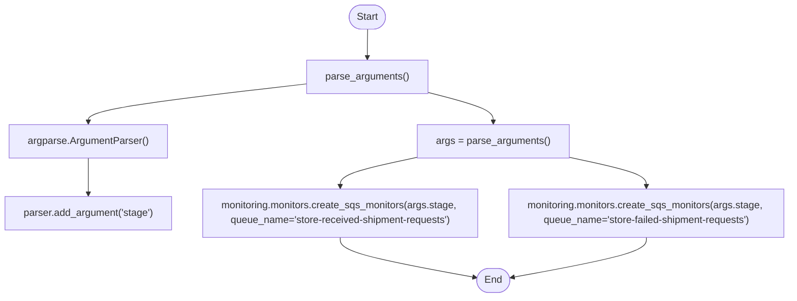

# Diagram: common/monitoring/monitoring/sqs/update_sqs_monitors.py

> Auto-generated by Obscura crawlers

## Mermaid

### SVG

<svg id="container" width="1284.71875" xmlns="http://www.w3.org/2000/svg" class="flowchart" height="480" viewBox="0 0 1284.71875 480" role="graphics-document document" aria-roledescription="flowchart-v2"><g><marker id="container_flowchart-v2-pointEnd" class="marker flowchart-v2" viewBox="0 0 10 10" refX="5" refY="5" markerUnits="userSpaceOnUse" markerWidth="8" markerHeight="8" orient="auto"><path d="M 0 0 L 10 5 L 0 10 z" class="arrowMarkerPath" style="stroke-width: 1; stroke-dasharray: 1, 0;"></path></marker><marker id="container_flowchart-v2-pointStart" class="marker flowchart-v2" viewBox="0 0 10 10" refX="4.5" refY="5" markerUnits="userSpaceOnUse" markerWidth="8" markerHeight="8" orient="auto"><path d="M 0 5 L 10 10 L 10 0 z" class="arrowMarkerPath" style="stroke-width: 1; stroke-dasharray: 1, 0;"></path></marker><marker id="container_flowchart-v2-circleEnd" class="marker flowchart-v2" viewBox="0 0 10 10" refX="11" refY="5" markerUnits="userSpaceOnUse" markerWidth="11" markerHeight="11" orient="auto"><circle cx="5" cy="5" r="5" class="arrowMarkerPath" style="stroke-width: 1; stroke-dasharray: 1, 0;"></circle></marker><marker id="container_flowchart-v2-circleStart" class="marker flowchart-v2" viewBox="0 0 10 10" refX="-1" refY="5" markerUnits="userSpaceOnUse" markerWidth="11" markerHeight="11" orient="auto"><circle cx="5" cy="5" r="5" class="arrowMarkerPath" style="stroke-width: 1; stroke-dasharray: 1, 0;"></circle></marker><marker id="container_flowchart-v2-crossEnd" class="marker cross flowchart-v2" viewBox="0 0 11 11" refX="12" refY="5.2" markerUnits="userSpaceOnUse" markerWidth="11" markerHeight="11" orient="auto"><path d="M 1,1 l 9,9 M 10,1 l -9,9" class="arrowMarkerPath" style="stroke-width: 2; stroke-dasharray: 1, 0;"></path></marker><marker id="container_flowchart-v2-crossStart" class="marker cross flowchart-v2" viewBox="0 0 11 11" refX="-1" refY="5.2" markerUnits="userSpaceOnUse" markerWidth="11" markerHeight="11" orient="auto"><path d="M 1,1 l 9,9 M 10,1 l -9,9" class="arrowMarkerPath" style="stroke-width: 2; stroke-dasharray: 1, 0;"></path></marker><g class="root"><g class="clusters"></g><g class="edgePaths"><path d="M598.008,47.5L597.924,51.583C597.841,55.667,597.674,63.833,597.591,71.417C597.508,79,597.508,86,597.508,89.5L597.508,93" id="L_Start_ParseArgs_0" class="edge-thickness-normal edge-pattern-solid edge-thickness-normal edge-pattern-solid flowchart-link" style=";" data-edge="true" data-et="edge" data-id="L_Start_ParseArgs_0" data-points="W3sieCI6NTk4LjAwNzgxMjUsInkiOjQ3LjV9LHsieCI6NTk3LjUwNzgxMjUsInkiOjcyfSx7IngiOjU5Ny41MDc4MTI1LCJ5Ijo5N31d" marker-end="url(#container_flowchart-v2-pointEnd)"></path><path d="M499.805,135.178L440.335,141.981C380.865,148.785,261.924,162.393,202.454,172.696C142.984,183,142.984,190,142.984,193.5L142.984,197" id="L_ParseArgs_Argparser_0" class="edge-thickness-normal edge-pattern-solid edge-thickness-normal edge-pattern-solid flowchart-link" style=";" data-edge="true" data-et="edge" data-id="L_ParseArgs_Argparser_0" data-points="W3sieCI6NDk5LjgwNDY4NzUsInkiOjEzNS4xNzc3Nzg5MjM2NjY2fSx7IngiOjE0Mi45ODQzNzUsInkiOjE3Nn0seyJ4IjoxNDIuOTg0Mzc1LCJ5IjoyMDF9XQ==" marker-end="url(#container_flowchart-v2-pointEnd)"></path><path d="M142.984,255L142.984,259.167C142.984,263.333,142.984,271.667,142.984,281.333C142.984,291,142.984,302,142.984,307.5L142.984,313" id="L_Argparser_AddArg_0" class="edge-thickness-normal edge-pattern-solid edge-thickness-normal edge-pattern-solid flowchart-link" style=";" data-edge="true" data-et="edge" data-id="L_Argparser_AddArg_0" data-points="W3sieCI6MTQyLjk4NDM3NSwieSI6MjU1fSx7IngiOjE0Mi45ODQzNzUsInkiOjI4MH0seyJ4IjoxNDIuOTg0Mzc1LCJ5IjozMTd9XQ==" marker-end="url(#container_flowchart-v2-pointEnd)"></path><path d="M695.211,148.803L713.066,153.336C730.922,157.869,766.633,166.934,784.488,174.967C802.344,183,802.344,190,802.344,193.5L802.344,197" id="L_ParseArgs_Args_0" class="edge-thickness-normal edge-pattern-solid edge-thickness-normal edge-pattern-solid flowchart-link" style=";" data-edge="true" data-et="edge" data-id="L_ParseArgs_Args_0" data-points="W3sieCI6Njk1LjIxMDkzNzUsInkiOjE0OC44MDMwODE3MzQ2MTk5Mn0seyJ4Ijo4MDIuMzQzNzUsInkiOjE3Nn0seyJ4Ijo4MDIuMzQzNzUsInkiOjIwMX1d" marker-end="url(#container_flowchart-v2-pointEnd)"></path><path d="M681.242,253.221L659.811,257.684C638.38,262.147,595.518,271.074,574.087,279.037C552.656,287,552.656,294,552.656,297.5L552.656,301" id="L_Args_Call1_0" class="edge-thickness-normal edge-pattern-solid edge-thickness-normal edge-pattern-solid flowchart-link" style=";" data-edge="true" data-et="edge" data-id="L_Args_Call1_0" data-points="W3sieCI6NjgxLjI0MjE4NzUsInkiOjI1My4yMjA2NTA4MTM1MTY5fSx7IngiOjU1Mi42NTYyNSwieSI6MjgwfSx7IngiOjU1Mi42NTYyNSwieSI6MzA1fV0=" marker-end="url(#container_flowchart-v2-pointEnd)"></path><path d="M923.445,253.221L944.876,257.684C966.307,262.147,1009.169,271.074,1030.6,279.037C1052.031,287,1052.031,294,1052.031,297.5L1052.031,301" id="L_Args_Call2_0" class="edge-thickness-normal edge-pattern-solid edge-thickness-normal edge-pattern-solid flowchart-link" style=";" data-edge="true" data-et="edge" data-id="L_Args_Call2_0" data-points="W3sieCI6OTIzLjQ0NTMxMjUsInkiOjI1My4yMjA2NTA4MTM1MTY5fSx7IngiOjEwNTIuMDMxMjUsInkiOjI4MH0seyJ4IjoxMDUyLjAzMTI1LCJ5IjozMDV9XQ==" marker-end="url(#container_flowchart-v2-pointEnd)"></path><path d="M552.656,383L552.656,387.167C552.656,391.333,552.656,399.667,589.446,410.457C626.236,421.248,699.816,434.496,736.606,441.12L773.396,447.744" id="L_Call1_End_0" class="edge-thickness-normal edge-pattern-solid edge-thickness-normal edge-pattern-solid flowchart-link" style=";" data-edge="true" data-et="edge" data-id="L_Call1_End_0" data-points="W3sieCI6NTUyLjY1NjI1LCJ5IjozODN9LHsieCI6NTUyLjY1NjI1LCJ5Ijo0MDh9LHsieCI6Nzc3LjMzMjM5Mzg0ODkxNjgsInkiOjQ0OC40NTMyOTUyMjQxMzc0M31d" marker-end="url(#container_flowchart-v2-pointEnd)"></path><path d="M1052.031,383L1052.031,387.167C1052.031,391.333,1052.031,399.667,1015.408,410.457C978.785,421.247,905.538,434.494,868.915,441.118L832.291,447.741" id="L_Call2_End_0" class="edge-thickness-normal edge-pattern-solid edge-thickness-normal edge-pattern-solid flowchart-link" style=";" data-edge="true" data-et="edge" data-id="L_Call2_End_0" data-points="W3sieCI6MTA1Mi4wMzEyNSwieSI6MzgzfSx7IngiOjEwNTIuMDMxMjUsInkiOjQwOH0seyJ4Ijo4MjguMzU1MTA3MTQxMzMxOCwieSI6NDQ4LjQ1MzI5NTA0NzY1MjV9XQ==" marker-end="url(#container_flowchart-v2-pointEnd)"></path></g><g class="edgeLabels"><g class="edgeLabel"><g class="label" data-id="L_Start_ParseArgs_0" transform="translate(0, 0)"><foreignObject width="0" height="0">

</foreignObject></g></g><g class="edgeLabel"><g class="label" data-id="L_ParseArgs_Argparser_0" transform="translate(0, 0)"><foreignObject width="0" height="0">

</foreignObject></g></g><g class="edgeLabel"><g class="label" data-id="L_Argparser_AddArg_0" transform="translate(0, 0)"><foreignObject width="0" height="0">

</foreignObject></g></g><g class="edgeLabel"><g class="label" data-id="L_ParseArgs_Args_0" transform="translate(0, 0)"><foreignObject width="0" height="0">

</foreignObject></g></g><g class="edgeLabel"><g class="label" data-id="L_Args_Call1_0" transform="translate(0, 0)"><foreignObject width="0" height="0">

</foreignObject></g></g><g class="edgeLabel"><g class="label" data-id="L_Args_Call2_0" transform="translate(0, 0)"><foreignObject width="0" height="0">

</foreignObject></g></g><g class="edgeLabel"><g class="label" data-id="L_Call1_End_0" transform="translate(0, 0)"><foreignObject width="0" height="0">

</foreignObject></g></g><g class="edgeLabel"><g class="label" data-id="L_Call2_End_0" transform="translate(0, 0)"><foreignObject width="0" height="0">

</foreignObject></g></g></g><g class="nodes"><g class="node default" id="flowchart-Start-0" transform="translate(597.5078125, 27.5)"><g class="basic label-container outer-path"><path d="M-10.3984375 -19.5 C-4.053452924434326 -19.5, 2.291531651131349 -19.5, 10.3984375 -19.5 C10.3984375 -19.5, 10.3984375 -19.5, 10.398437499999998 -19.5 C10.830505783387968 -19.486144411121643, 11.26257406677594 -19.472288822243286, 11.6478067896239 -19.45993515863156 C11.946099303405633 -19.43115923857627, 12.244391817187367 -19.40238331852098, 12.892042152847864 -19.3399052695533 C13.330741985884123 -19.268979682716015, 13.769441818920379 -19.198054095878728, 14.126030759676757 -19.140403561325776 C14.387484622092543 -19.080728423375273, 14.64893848450833 -19.02105328542477, 15.34470188623539 -18.862249829261074 C15.601244460092563 -18.786109339959715, 15.857787033949737 -18.709968850658356, 16.543047751460602 -18.50658706670804 C16.926924597329904 -18.36531683890947, 17.310801443199203 -18.224046611110907, 17.716144095147794 -18.074876768247425 C18.16802701504806 -17.874841604238128, 18.619909934948325 -17.67480644022883, 18.85917041279238 -17.568892924097174 C19.08992376873626 -17.448509046105833, 19.320677124680138 -17.32812516811449, 19.967429764076783 -16.990714730406097 C20.376300833660395 -16.7428546852314, 20.785171903244006 -16.494994640056703, 21.036368073605697 -16.342718045390892 C21.417478565565123 -16.07687186420729, 21.798589057524552 -15.811025683023693, 22.061592844578712 -15.627565626425154 C22.416075926683202 -15.344874801637804, 22.770559008787696 -15.062183976850456, 23.03889120850187 -14.848196188198123 C23.367446354486447 -14.549811097707728, 23.696001500471024 -14.251426007217331, 23.964247236767985 -14.007812326905688 C24.29286818660936 -13.66848421591272, 24.621489136450737 -13.329156104919752, 24.833858442968648 -13.10986736009568 C25.090996335140986 -12.807818560389498, 25.34813422731332 -12.505769760683313, 25.644151408126582 -12.158051136245305 C25.824265873208645 -11.916714161800666, 26.004380338290712 -11.675377187356029, 26.391796464640635 -11.156274872382312 C26.661037092526882 -10.74264896671732, 26.930277720413134 -10.329023061052327, 27.073721378604247 -10.108655082055241 C27.25146281777653 -9.79305715853247, 27.429204256948815 -9.4774592350097, 27.6871239742735 -9.019496659696287 C27.847867815144685 -8.685708634760058, 28.008611656015866 -8.351920609823827, 28.22948364880834 -7.893275190886684 C28.374192152415127 -7.535842389229337, 28.518900656021913 -7.178409587571991, 28.698571729970325 -6.734618561215508 C28.843378154972402 -6.298484680879871, 28.988184579974476 -5.862350800544233, 29.09246063421488 -5.548287939305138 C29.183635722403615 -5.200597812508314, 29.27481081059235 -4.852907685711491, 29.40953178754556 -4.339158212148133 C29.45812513148397 -4.089641661231274, 29.50671847542238 -3.840125110314413, 29.648482276581777 -3.1121979531509023 C29.70444803532145 -2.678138580055079, 29.760413794061126 -2.244079206959256, 29.808330202509367 -1.872449005199798 C29.828616620107447 -1.5564716762081319, 29.84890303770553 -1.240494347216466, 29.888418715913414 -0.6250057626472757 C29.888418715913414 -0.21466698014574004, 29.888418715913414 0.19567180235579562, 29.888418715913414 0.625005762647271 C29.87094373866252 0.8971926388777339, 29.853468761411623 1.1693795151081967, 29.808330202509367 1.8724490051997846 C29.768732810263817 2.1795585600667295, 29.72913541801827 2.486668114933674, 29.648482276581777 3.1121979531508885 C29.57830241596386 3.4725567049050867, 29.50812255534595 3.832915456659285, 29.40953178754556 4.339158212148129 C29.288068227556263 4.8023514090272155, 29.16660466756697 5.265544605906303, 29.092460634214884 5.548287939305125 C28.951356185681902 5.9732720563456985, 28.81025173714892 6.398256173386271, 28.69857172997033 6.734618561215495 C28.570441449197407 7.051102831955065, 28.442311168424485 7.367587102694636, 28.229483648808344 7.893275190886679 C28.07491686996584 8.214236414352404, 27.920350091123336 8.535197637818131, 27.687123974273504 9.019496659696284 C27.472752720515725 9.400134528186536, 27.258381466757946 9.780772396676788, 27.07372137860425 10.108655082055236 C26.83029552393859 10.48262256381619, 26.586869669272932 10.856590045577143, 26.39179646464064 11.156274872382301 C26.185289776401817 11.432975021476006, 25.97878308816299 11.70967517056971, 25.644151408126582 12.158051136245302 C25.33683956797881 12.51903711022195, 25.02952772783104 12.880023084198598, 24.83385844296866 13.10986736009567 C24.543057862456887 13.410142834645752, 24.252257281945116 13.710418309195834, 23.96424723676799 14.007812326905684 C23.60572963684235 14.333408525302263, 23.247212036916714 14.659004723698843, 23.038891208501887 14.848196188198111 C22.70538215885039 15.114160780246639, 22.371873109198894 15.380125372295169, 22.061592844578715 15.627565626425152 C21.776635901765047 15.826339254144727, 21.49167895895138 16.025112881864302, 21.036368073605708 16.34271804539089 C20.74036288344474 16.52215813118605, 20.444357693283774 16.701598216981207, 19.967429764076787 16.990714730406093 C19.729840844051726 17.114664717800203, 19.492251924026665 17.23861470519431, 18.859170412792388 17.56889292409717 C18.548058732616408 17.706612836110985, 18.236947052440424 17.8443327481248, 17.716144095147804 18.07487676824742 C17.355517990736477 18.207590508261955, 16.994891886325153 18.34030424827649, 16.543047751460616 18.506587066708033 C16.23985946120695 18.596571759787512, 15.936671170953284 18.686556452866988, 15.344701886235413 18.86224982926107 C14.937687049896324 18.955148309635444, 14.530672213557233 19.048046790009813, 14.126030759676766 19.140403561325773 C13.829786066377826 19.18829810592644, 13.533541373078886 19.2361926505271, 12.892042152847878 19.3399052695533 C12.426375693864959 19.384827552805525, 11.960709234882039 19.429749836057756, 11.6478067896239 19.45993515863156 C11.225110552067283 19.473490204241685, 10.802414314510669 19.48704524985181, 10.398437500000004 19.5 C10.398437500000004 19.5, 10.398437500000002 19.5, 10.3984375 19.5 C6.079185976797052 19.5, 1.759934453594104 19.5, -10.398437499999996 19.5 C-10.830902121566844 19.486131701327672, -11.26336674313369 19.472263402655344, -11.647806789623893 19.45993515863156 C-12.096695367345177 19.416631417406286, -12.545583945066461 19.373327676181013, -12.892042152847871 19.3399052695533 C-13.171874629710588 19.294664124827403, -13.451707106573304 19.249422980101507, -14.126030759676759 19.140403561325773 C-14.414764652544752 19.07450193444339, -14.703498545412748 19.008600307561004, -15.344701886235388 18.862249829261074 C-15.787754627624274 18.730754101248152, -16.23080736901316 18.599258373235227, -16.54304775146059 18.506587066708043 C-16.90269480886423 18.37423362504255, -17.262341866267864 18.24188018337706, -17.716144095147797 18.074876768247425 C-18.17274307210933 17.872753945673967, -18.629342049070864 17.67063112310051, -18.85917041279238 17.568892924097174 C-19.198189220842412 17.392027029089384, -19.537208028892447 17.21516113408159, -19.96742976407678 16.990714730406097 C-20.206768049271744 16.845626455413026, -20.446106334466705 16.700538180419954, -21.036368073605686 16.3427180453909 C-21.280070290551677 16.172721928548317, -21.523772507497668 16.002725811705737, -22.061592844578712 15.627565626425156 C-22.27667641842317 15.45604219989848, -22.49175999226762 15.284518773371802, -23.03889120850187 14.848196188198125 C-23.317645374801092 14.59503902979625, -23.596399541100315 14.341881871394374, -23.964247236767974 14.007812326905697 C-24.155630894083995 13.81019298783642, -24.34701455140002 13.612573648767142, -24.833858442968655 13.109867360095677 C-25.14047526195748 12.74969779752015, -25.447092080946305 12.389528234944624, -25.64415140812658 12.158051136245307 C-25.858720464969995 11.870548147718342, -26.07328952181341 11.583045159191379, -26.391796464640635 11.156274872382316 C-26.557784745013834 10.901272299634842, -26.723773025387032 10.646269726887367, -27.073721378604244 10.108655082055249 C-27.292335694828843 9.72048322649849, -27.510950011053442 9.332311370941735, -27.6871239742735 9.019496659696289 C-27.86749792140854 8.644946299086174, -28.047871868543577 8.27039593847606, -28.22948364880834 7.893275190886686 C-28.367124058608532 7.55330071758392, -28.504764468408727 7.213326244281155, -28.698571729970325 6.73461856121551 C-28.811994534166697 6.393007146445731, -28.92541733836307 6.051395731675953, -29.09246063421488 5.5482879393051325 C-29.199816010956543 5.138895359674578, -29.3071713876982 4.729502780044024, -29.409531787545557 4.339158212148136 C-29.49873012863569 3.881143582726385, -29.58792846972582 3.4231289533046345, -29.648482276581777 3.112197953150904 C-29.69074257219949 2.7844354455792106, -29.733002867817202 2.456672938007517, -29.808330202509364 1.872449005199809 C-29.829273648506888 1.5462379285430559, -29.85021709450441 1.2200268518863027, -29.888418715913414 0.6250057626472781 C-29.888418715913414 0.31782397184916045, -29.888418715913414 0.010642181051042754, -29.888418715913414 -0.6250057626472687 C-29.871642335530066 -0.8863114287684346, -29.854865955146717 -1.1476170948896005, -29.808330202509367 -1.8724490051997822 C-29.775779889012778 -2.1249028088929007, -29.74322957551619 -2.377356612586019, -29.648482276581777 -3.112197953150895 C-29.576520124058664 -3.48170839715076, -29.50455797153555 -3.851218841150625, -29.40953178754556 -4.339158212148126 C-29.331692897098005 -4.63599163701317, -29.253854006650453 -4.932825061878214, -29.092460634214884 -5.548287939305123 C-29.00247637882852 -5.819306179484776, -28.91249212344215 -6.0903244196644275, -28.698571729970332 -6.734618561215485 C-28.604736325547492 -6.966393824324025, -28.510900921124655 -7.198169087432565, -28.229483648808344 -7.893275190886676 C-28.069039496990335 -8.226440905091671, -27.90859534517233 -8.559606619296664, -27.687123974273504 -9.019496659696282 C-27.44678611910717 -9.446240858390942, -27.206448263940835 -9.8729850570856, -27.073721378604247 -10.108655082055243 C-26.924326790899862 -10.338165286833036, -26.77493220319548 -10.567675491610826, -26.39179646464064 -11.156274872382308 C-26.23933304653816 -11.360561962936508, -26.08686962843568 -11.564849053490706, -25.644151408126586 -12.158051136245302 C-25.407393091913836 -12.436160926398633, -25.170634775701085 -12.714270716551967, -24.833858442968662 -13.10986736009567 C-24.604438776716847 -13.346762001205562, -24.375019110465036 -13.583656642315455, -23.964247236767996 -14.007812326905677 C-23.759799396994044 -14.193486445594965, -23.55535155722009 -14.379160564284255, -23.038891208501887 -14.848196188198107 C-22.74912341458254 -15.079278292803947, -22.459355620663196 -15.310360397409788, -22.06159284457872 -15.627565626425149 C-21.78461495212724 -15.820773414019586, -21.50763705967576 -16.013981201614023, -21.03636807360571 -16.342718045390885 C-20.77297566358961 -16.50238807220826, -20.509583253573503 -16.662058099025632, -19.96742976407679 -16.99071473040609 C-19.709462618081442 -17.125296025236022, -19.451495472086094 -17.25987732006595, -18.859170412792388 -17.56889292409717 C-18.461586625757892 -17.744891472713338, -18.064002838723397 -17.920890021329505, -17.716144095147804 -18.07487676824742 C-17.253662177925456 -18.245074388921225, -16.791180260703108 -18.415272009595025, -16.54304775146062 -18.506587066708033 C-16.16361067733899 -18.619201998601486, -15.784173603217361 -18.73181693049494, -15.344701886235413 -18.862249829261067 C-15.00048354629767 -18.940815419117268, -14.656265206359926 -19.01938100897347, -14.126030759676768 -19.140403561325773 C-13.859165229129463 -19.183548310731563, -13.592299698582158 -19.226693060137354, -12.89204215284788 -19.3399052695533 C-12.565295599447484 -19.37142611658961, -12.238549046047087 -19.402946963625922, -11.647806789623903 -19.45993515863156 C-11.378172794506465 -19.46858179604424, -11.108538799389027 -19.477228433456926, -10.398437500000005 -19.5 C-10.398437500000004 -19.5, -10.398437500000004 -19.5, -10.3984375 -19.5" stroke="none" stroke-width="0" fill="#ECECFF" style=""></path><path d="M-10.3984375 -19.5 C-6.031106222897129 -19.5, -1.6637749457942572 -19.5, 10.3984375 -19.5 M-10.3984375 -19.5 C-4.947817681032589 -19.5, 0.5028021379348218 -19.5, 10.3984375 -19.5 M10.3984375 -19.5 C10.3984375 -19.5, 10.398437499999998 -19.5, 10.398437499999998 -19.5 M10.3984375 -19.5 C10.3984375 -19.5, 10.3984375 -19.5, 10.398437499999998 -19.5 M10.398437499999998 -19.5 C10.68693837534713 -19.490748338460506, 10.975439250694263 -19.48149667692101, 11.6478067896239 -19.45993515863156 M10.398437499999998 -19.5 C10.6847475165839 -19.490818595036796, 10.971057533167803 -19.481637190073588, 11.6478067896239 -19.45993515863156 M11.6478067896239 -19.45993515863156 C11.944687156302715 -19.43129546670893, 12.24156752298153 -19.402655774786307, 12.892042152847864 -19.3399052695533 M11.6478067896239 -19.45993515863156 C12.031481915894105 -19.422922480637123, 12.41515704216431 -19.385909802642686, 12.892042152847864 -19.3399052695533 M12.892042152847864 -19.3399052695533 C13.250468049909143 -19.281957750150777, 13.60889394697042 -19.224010230748256, 14.126030759676757 -19.140403561325776 M12.892042152847864 -19.3399052695533 C13.292257138797146 -19.27520161433859, 13.692472124746427 -19.21049795912388, 14.126030759676757 -19.140403561325776 M14.126030759676757 -19.140403561325776 C14.43160770003021 -19.070657618765992, 14.737184640383662 -19.000911676206208, 15.34470188623539 -18.862249829261074 M14.126030759676757 -19.140403561325776 C14.516328633278729 -19.051320618607775, 14.906626506880698 -18.96223767588977, 15.34470188623539 -18.862249829261074 M15.34470188623539 -18.862249829261074 C15.621708087896355 -18.780035842643326, 15.898714289557319 -18.697821856025573, 16.543047751460602 -18.50658706670804 M15.34470188623539 -18.862249829261074 C15.728811116655624 -18.74824822590284, 16.11292034707586 -18.634246622544612, 16.543047751460602 -18.50658706670804 M16.543047751460602 -18.50658706670804 C16.812322816801753 -18.40749135351108, 17.0815978821429 -18.308395640314117, 17.716144095147794 -18.074876768247425 M16.543047751460602 -18.50658706670804 C16.938753202695345 -18.36096380279256, 17.33445865393009 -18.215340538877083, 17.716144095147794 -18.074876768247425 M17.716144095147794 -18.074876768247425 C18.045313173090246 -17.929163381896068, 18.3744822510327 -17.78344999554471, 18.85917041279238 -17.568892924097174 M17.716144095147794 -18.074876768247425 C17.997691339516923 -17.950244154967475, 18.279238583886052 -17.825611541687525, 18.85917041279238 -17.568892924097174 M18.85917041279238 -17.568892924097174 C19.23435223853499 -17.373160805922684, 19.609534064277597 -17.177428687748193, 19.967429764076783 -16.990714730406097 M18.85917041279238 -17.568892924097174 C19.177347164272554 -17.402900316651902, 19.495523915752727 -17.236907709206633, 19.967429764076783 -16.990714730406097 M19.967429764076783 -16.990714730406097 C20.219101046457567 -16.838150120042247, 20.470772328838347 -16.685585509678393, 21.036368073605697 -16.342718045390892 M19.967429764076783 -16.990714730406097 C20.321108366118107 -16.776312683402477, 20.674786968159435 -16.561910636398853, 21.036368073605697 -16.342718045390892 M21.036368073605697 -16.342718045390892 C21.312901350242548 -16.149820402541636, 21.589434626879395 -15.956922759692377, 22.061592844578712 -15.627565626425154 M21.036368073605697 -16.342718045390892 C21.348671417114062 -16.124868752353304, 21.66097476062243 -15.907019459315713, 22.061592844578712 -15.627565626425154 M22.061592844578712 -15.627565626425154 C22.321983012291895 -15.419911396947265, 22.582373180005074 -15.212257167469376, 23.03889120850187 -14.848196188198123 M22.061592844578712 -15.627565626425154 C22.442354920309178 -15.32391800353448, 22.823116996039644 -15.020270380643806, 23.03889120850187 -14.848196188198123 M23.03889120850187 -14.848196188198123 C23.31869587596292 -14.594084992435816, 23.598500543423967 -14.339973796673508, 23.964247236767985 -14.007812326905688 M23.03889120850187 -14.848196188198123 C23.260418015150986 -14.647011403677514, 23.4819448218001 -14.445826619156902, 23.964247236767985 -14.007812326905688 M23.964247236767985 -14.007812326905688 C24.177946143867167 -13.787150660319217, 24.391645050966346 -13.566488993732747, 24.833858442968648 -13.10986736009568 M23.964247236767985 -14.007812326905688 C24.20551956122818 -13.758678843074303, 24.446791885688377 -13.509545359242919, 24.833858442968648 -13.10986736009568 M24.833858442968648 -13.10986736009568 C25.11738185522769 -12.776824627117026, 25.400905267486735 -12.443781894138374, 25.644151408126582 -12.158051136245305 M24.833858442968648 -13.10986736009568 C25.02058646406631 -12.890526001388972, 25.20731448516397 -12.671184642682263, 25.644151408126582 -12.158051136245305 M25.644151408126582 -12.158051136245305 C25.869195020127034 -11.856513198059517, 26.094238632127485 -11.554975259873729, 26.391796464640635 -11.156274872382312 M25.644151408126582 -12.158051136245305 C25.816596106687665 -11.926990950208678, 25.98904080524875 -11.69593076417205, 26.391796464640635 -11.156274872382312 M26.391796464640635 -11.156274872382312 C26.591894104434715 -10.848871163918885, 26.7919917442288 -10.541467455455459, 27.073721378604247 -10.108655082055241 M26.391796464640635 -11.156274872382312 C26.595922763159887 -10.842682062270681, 26.800049061679143 -10.52908925215905, 27.073721378604247 -10.108655082055241 M27.073721378604247 -10.108655082055241 C27.254678295052624 -9.787347753026388, 27.435635211500998 -9.466040423997534, 27.6871239742735 -9.019496659696287 M27.073721378604247 -10.108655082055241 C27.272390436331087 -9.755898052637686, 27.471059494057922 -9.403141023220133, 27.6871239742735 -9.019496659696287 M27.6871239742735 -9.019496659696287 C27.87927477059204 -8.620491419772428, 28.07142556691058 -8.221486179848569, 28.22948364880834 -7.893275190886684 M27.6871239742735 -9.019496659696287 C27.799174897588596 -8.786820519926806, 27.91122582090369 -8.554144380157325, 28.22948364880834 -7.893275190886684 M28.22948364880834 -7.893275190886684 C28.335195242454613 -7.632165510785763, 28.44090683610089 -7.37105583068484, 28.698571729970325 -6.734618561215508 M28.22948364880834 -7.893275190886684 C28.40432007527094 -7.461425837291713, 28.57915650173354 -7.029576483696741, 28.698571729970325 -6.734618561215508 M28.698571729970325 -6.734618561215508 C28.806552798369705 -6.409396787643415, 28.914533866769084 -6.084175014071322, 29.09246063421488 -5.548287939305138 M28.698571729970325 -6.734618561215508 C28.810939613636624 -6.3961843990035545, 28.92330749730292 -6.0577502367916, 29.09246063421488 -5.548287939305138 M29.09246063421488 -5.548287939305138 C29.213626257932464 -5.086230902556484, 29.33479188165005 -4.624173865807831, 29.40953178754556 -4.339158212148133 M29.09246063421488 -5.548287939305138 C29.189991319382486 -5.176361166694718, 29.287522004550095 -4.804434394084296, 29.40953178754556 -4.339158212148133 M29.40953178754556 -4.339158212148133 C29.504822861934656 -3.849858684935841, 29.600113936323748 -3.360559157723549, 29.648482276581777 -3.1121979531509023 M29.40953178754556 -4.339158212148133 C29.458020310076353 -4.090179897005371, 29.50650883260715 -3.8412015818626095, 29.648482276581777 -3.1121979531509023 M29.648482276581777 -3.1121979531509023 C29.684145320337787 -2.8356024282438352, 29.719808364093797 -2.559006903336768, 29.808330202509367 -1.872449005199798 M29.648482276581777 -3.1121979531509023 C29.681625147931406 -2.85514838776341, 29.71476801928103 -2.598098822375918, 29.808330202509367 -1.872449005199798 M29.808330202509367 -1.872449005199798 C29.831173399392522 -1.516647775047989, 29.854016596275677 -1.16084654489618, 29.888418715913414 -0.6250057626472757 M29.808330202509367 -1.872449005199798 C29.827805471977708 -1.5691059630757942, 29.847280741446053 -1.2657629209517904, 29.888418715913414 -0.6250057626472757 M29.888418715913414 -0.6250057626472757 C29.888418715913414 -0.15012830690539297, 29.888418715913414 0.32474914883648975, 29.888418715913414 0.625005762647271 M29.888418715913414 -0.6250057626472757 C29.888418715913414 -0.12568452612001496, 29.888418715913414 0.3736367104072458, 29.888418715913414 0.625005762647271 M29.888418715913414 0.625005762647271 C29.867367817682506 0.952890494572856, 29.846316919451603 1.280775226498441, 29.808330202509367 1.8724490051997846 M29.888418715913414 0.625005762647271 C29.867226301685964 0.9550947204487048, 29.84603388745851 1.2851836782501387, 29.808330202509367 1.8724490051997846 M29.808330202509367 1.8724490051997846 C29.774709995190847 2.1332006941013573, 29.74108978787233 2.39395238300293, 29.648482276581777 3.1121979531508885 M29.808330202509367 1.8724490051997846 C29.74587945403303 2.3568046780870797, 29.683428705556697 2.841160350974375, 29.648482276581777 3.1121979531508885 M29.648482276581777 3.1121979531508885 C29.56841658157369 3.5233183751267902, 29.488350886565602 3.934438797102692, 29.40953178754556 4.339158212148129 M29.648482276581777 3.1121979531508885 C29.55484640658543 3.5929983556339966, 29.461210536589086 4.073798758117105, 29.40953178754556 4.339158212148129 M29.40953178754556 4.339158212148129 C29.336326980729275 4.618319867702592, 29.26312217391299 4.897481523257055, 29.092460634214884 5.548287939305125 M29.40953178754556 4.339158212148129 C29.310561255686487 4.716575744226616, 29.211590723827417 5.093993276305103, 29.092460634214884 5.548287939305125 M29.092460634214884 5.548287939305125 C28.98833281943931 5.861904326894901, 28.88420500466374 6.175520714484676, 28.69857172997033 6.734618561215495 M29.092460634214884 5.548287939305125 C28.991637052987475 5.851952501905956, 28.890813471760065 6.155617064506785, 28.69857172997033 6.734618561215495 M28.69857172997033 6.734618561215495 C28.57375427513971 7.042920087828446, 28.448936820309093 7.351221614441397, 28.229483648808344 7.893275190886679 M28.69857172997033 6.734618561215495 C28.534622920103505 7.139575291321156, 28.37067411023668 7.544532021426819, 28.229483648808344 7.893275190886679 M28.229483648808344 7.893275190886679 C28.05206657579909 8.261685539107631, 27.874649502789836 8.630095887328585, 27.687123974273504 9.019496659696284 M28.229483648808344 7.893275190886679 C28.041794192640605 8.283016362530011, 27.85410473647287 8.672757534173344, 27.687123974273504 9.019496659696284 M27.687123974273504 9.019496659696284 C27.502406609171725 9.347481046095973, 27.317689244069946 9.675465432495663, 27.07372137860425 10.108655082055236 M27.687123974273504 9.019496659696284 C27.456105923989064 9.429692601090562, 27.22508787370462 9.83988854248484, 27.07372137860425 10.108655082055236 M27.07372137860425 10.108655082055236 C26.86108034345396 10.435328814159067, 26.648439308303672 10.7620025462629, 26.39179646464064 11.156274872382301 M27.07372137860425 10.108655082055236 C26.850935706839977 10.450913700214503, 26.628150035075706 10.79317231837377, 26.39179646464064 11.156274872382301 M26.39179646464064 11.156274872382301 C26.140879939638037 11.492480156920111, 25.88996341463543 11.828685441457923, 25.644151408126582 12.158051136245302 M26.39179646464064 11.156274872382301 C26.21466989152854 11.393608343789746, 26.03754331841644 11.63094181519719, 25.644151408126582 12.158051136245302 M25.644151408126582 12.158051136245302 C25.39539921215768 12.4502496200313, 25.14664701618878 12.742448103817297, 24.83385844296866 13.10986736009567 M25.644151408126582 12.158051136245302 C25.35760820108378 12.49464109200815, 25.07106499404098 12.831231047770999, 24.83385844296866 13.10986736009567 M24.83385844296866 13.10986736009567 C24.54159485709944 13.41165350779229, 24.249331271230222 13.71343965548891, 23.96424723676799 14.007812326905684 M24.83385844296866 13.10986736009567 C24.536862882747112 13.416539659813388, 24.239867322525566 13.723211959531108, 23.96424723676799 14.007812326905684 M23.96424723676799 14.007812326905684 C23.64585873820304 14.296964337204328, 23.327470239638085 14.586116347502973, 23.038891208501887 14.848196188198111 M23.96424723676799 14.007812326905684 C23.632000279275754 14.309550222927356, 23.29975332178352 14.611288118949028, 23.038891208501887 14.848196188198111 M23.038891208501887 14.848196188198111 C22.673524900978173 15.139566095642499, 22.308158593454454 15.430936003086888, 22.061592844578715 15.627565626425152 M23.038891208501887 14.848196188198111 C22.709322909680427 15.11101813632747, 22.379754610858967 15.373840084456829, 22.061592844578715 15.627565626425152 M22.061592844578715 15.627565626425152 C21.802449876156118 15.808332543078459, 21.54330690773352 15.989099459731763, 21.036368073605708 16.34271804539089 M22.061592844578715 15.627565626425152 C21.757749718354468 15.839513438122246, 21.453906592130217 16.05146124981934, 21.036368073605708 16.34271804539089 M21.036368073605708 16.34271804539089 C20.64009695196279 16.582939928078424, 20.243825830319867 16.82316181076596, 19.967429764076787 16.990714730406093 M21.036368073605708 16.34271804539089 C20.670149021994156 16.564722186619843, 20.303929970382605 16.786726327848797, 19.967429764076787 16.990714730406093 M19.967429764076787 16.990714730406093 C19.694247957790182 17.133233503764515, 19.421066151503577 17.27575227712294, 18.859170412792388 17.56889292409717 M19.967429764076787 16.990714730406093 C19.52683134170653 17.220574645139898, 19.086232919336275 17.450434559873703, 18.859170412792388 17.56889292409717 M18.859170412792388 17.56889292409717 C18.53854032507537 17.710826352775875, 18.217910237358353 17.852759781454576, 17.716144095147804 18.07487676824742 M18.859170412792388 17.56889292409717 C18.52566950869346 17.71652388138894, 18.19216860459454 17.86415483868071, 17.716144095147804 18.07487676824742 M17.716144095147804 18.07487676824742 C17.338251892719775 18.213944591938162, 16.96035969029175 18.3530124156289, 16.543047751460616 18.506587066708033 M17.716144095147804 18.07487676824742 C17.3726792727398 18.20127499784758, 17.029214450331793 18.32767322744774, 16.543047751460616 18.506587066708033 M16.543047751460616 18.506587066708033 C16.255942561993194 18.591798379896073, 15.968837372525769 18.677009693084113, 15.344701886235413 18.86224982926107 M16.543047751460616 18.506587066708033 C16.0879789795573 18.64164908950421, 15.632910207653985 18.776711112300386, 15.344701886235413 18.86224982926107 M15.344701886235413 18.86224982926107 C15.054494916083286 18.92848767642083, 14.764287945931159 18.99472552358059, 14.126030759676766 19.140403561325773 M15.344701886235413 18.86224982926107 C15.011807571149479 18.938230784341012, 14.678913256063543 19.014211739420954, 14.126030759676766 19.140403561325773 M14.126030759676766 19.140403561325773 C13.731591535984933 19.204173436090404, 13.3371523122931 19.267943310855035, 12.892042152847878 19.3399052695533 M14.126030759676766 19.140403561325773 C13.717440920456363 19.2064611978694, 13.308851081235959 19.272518834413027, 12.892042152847878 19.3399052695533 M12.892042152847878 19.3399052695533 C12.585249549417695 19.36950118303412, 12.278456945987513 19.399097096514943, 11.6478067896239 19.45993515863156 M12.892042152847878 19.3399052695533 C12.482444928490667 19.379418621174306, 12.072847704133455 19.41893197279531, 11.6478067896239 19.45993515863156 M11.6478067896239 19.45993515863156 C11.255562703250169 19.472513663024767, 10.863318616876436 19.485092167417974, 10.398437500000004 19.5 M11.6478067896239 19.45993515863156 C11.155284284357801 19.475729396738544, 10.662761779091705 19.491523634845528, 10.398437500000004 19.5 M10.398437500000004 19.5 C10.398437500000002 19.5, 10.398437500000002 19.5, 10.3984375 19.5 M10.398437500000004 19.5 C10.398437500000002 19.5, 10.398437500000002 19.5, 10.3984375 19.5 M10.3984375 19.5 C5.508516768590046 19.5, 0.618596037180092 19.5, -10.398437499999996 19.5 M10.3984375 19.5 C5.187371369628395 19.5, -0.023694760743209642 19.5, -10.398437499999996 19.5 M-10.398437499999996 19.5 C-10.77020395111072 19.488078173512378, -11.141970402221444 19.476156347024755, -11.647806789623893 19.45993515863156 M-10.398437499999996 19.5 C-10.874864008052318 19.484721929194706, -11.351290516104639 19.469443858389408, -11.647806789623893 19.45993515863156 M-11.647806789623893 19.45993515863156 C-12.054334941935274 19.420717876699715, -12.460863094246653 19.38150059476787, -12.892042152847871 19.3399052695533 M-11.647806789623893 19.45993515863156 C-11.908677231607735 19.434769300835985, -12.169547673591577 19.409603443040414, -12.892042152847871 19.3399052695533 M-12.892042152847871 19.3399052695533 C-13.265444904561772 19.27953640843778, -13.638847656275672 19.219167547322268, -14.126030759676759 19.140403561325773 M-12.892042152847871 19.3399052695533 C-13.144452639558779 19.299097499534437, -13.396863126269686 19.258289729515578, -14.126030759676759 19.140403561325773 M-14.126030759676759 19.140403561325773 C-14.387870833461355 19.080640273150603, -14.649710907245952 19.020876984975434, -15.344701886235388 18.862249829261074 M-14.126030759676759 19.140403561325773 C-14.52439914180811 19.04947857770093, -14.922767523939463 18.95855359407609, -15.344701886235388 18.862249829261074 M-15.344701886235388 18.862249829261074 C-15.765824531191411 18.737262838756, -16.186947176147434 18.612275848250924, -16.54304775146059 18.506587066708043 M-15.344701886235388 18.862249829261074 C-15.802867805846926 18.72626858928236, -16.261033725458464 18.590287349303644, -16.54304775146059 18.506587066708043 M-16.54304775146059 18.506587066708043 C-16.80418838543852 18.410484899446608, -17.065329019416446 18.314382732185173, -17.716144095147797 18.074876768247425 M-16.54304775146059 18.506587066708043 C-16.961356378298298 18.35264562522921, -17.379665005136 18.198704183750376, -17.716144095147797 18.074876768247425 M-17.716144095147797 18.074876768247425 C-18.122061917287603 17.895188989510505, -18.52797973942741 17.715501210773585, -18.85917041279238 17.568892924097174 M-17.716144095147797 18.074876768247425 C-18.136359877052783 17.888859706856366, -18.556575658957765 17.70284264546531, -18.85917041279238 17.568892924097174 M-18.85917041279238 17.568892924097174 C-19.264542668414677 17.357410477992346, -19.66991492403697 17.145928031887514, -19.96742976407678 16.990714730406097 M-18.85917041279238 17.568892924097174 C-19.174031363738468 17.404630167666664, -19.488892314684556 17.240367411236157, -19.96742976407678 16.990714730406097 M-19.96742976407678 16.990714730406097 C-20.21149478501516 16.842761080427984, -20.455559805953538 16.694807430449874, -21.036368073605686 16.3427180453909 M-19.96742976407678 16.990714730406097 C-20.372474884463685 16.74517399811822, -20.77752000485059 16.499633265830337, -21.036368073605686 16.3427180453909 M-21.036368073605686 16.3427180453909 C-21.25583271774548 16.189629010110302, -21.475297361885275 16.036539974829708, -22.061592844578712 15.627565626425156 M-21.036368073605686 16.3427180453909 C-21.285582415265445 16.168876908964027, -21.5347967569252 15.995035772537156, -22.061592844578712 15.627565626425156 M-22.061592844578712 15.627565626425156 C-22.421487503529104 15.340559213111309, -22.781382162479495 15.053552799797462, -23.03889120850187 14.848196188198125 M-22.061592844578712 15.627565626425156 C-22.44307257751919 15.323345691007157, -22.82455231045967 15.01912575558916, -23.03889120850187 14.848196188198125 M-23.03889120850187 14.848196188198125 C-23.385295779457767 14.533600722218678, -23.731700350413668 14.219005256239232, -23.964247236767974 14.007812326905697 M-23.03889120850187 14.848196188198125 C-23.391106459346027 14.528323616486325, -23.743321710190187 14.208451044774527, -23.964247236767974 14.007812326905697 M-23.964247236767974 14.007812326905697 C-24.25149461136993 13.711205829181132, -24.538741985971885 13.414599331456568, -24.833858442968655 13.109867360095677 M-23.964247236767974 14.007812326905697 C-24.141262232173254 13.825029810948342, -24.318277227578534 13.64224729499099, -24.833858442968655 13.109867360095677 M-24.833858442968655 13.109867360095677 C-25.06423810643512 12.839250298413754, -25.294617769901585 12.568633236731833, -25.64415140812658 12.158051136245307 M-24.833858442968655 13.109867360095677 C-25.041206844280616 12.866304129456378, -25.248555245592577 12.622740898817076, -25.64415140812658 12.158051136245307 M-25.64415140812658 12.158051136245307 C-25.805296463321266 11.942131442900964, -25.966441518515953 11.72621174955662, -26.391796464640635 11.156274872382316 M-25.64415140812658 12.158051136245307 C-25.828808776470346 11.910627085296989, -26.013466144814114 11.663203034348673, -26.391796464640635 11.156274872382316 M-26.391796464640635 11.156274872382316 C-26.55360539007078 10.907692911141313, -26.715414315500922 10.65911094990031, -27.073721378604244 10.108655082055249 M-26.391796464640635 11.156274872382316 C-26.59129184667124 10.849796393572444, -26.79078722870184 10.543317914762573, -27.073721378604244 10.108655082055249 M-27.073721378604244 10.108655082055249 C-27.31332418947509 9.683216028938535, -27.552927000345935 9.257776975821821, -27.6871239742735 9.019496659696289 M-27.073721378604244 10.108655082055249 C-27.270132460276102 9.759907317768178, -27.466543541947964 9.411159553481108, -27.6871239742735 9.019496659696289 M-27.6871239742735 9.019496659696289 C-27.845983977162344 8.689620464638065, -28.004843980051184 8.359744269579842, -28.22948364880834 7.893275190886686 M-27.6871239742735 9.019496659696289 C-27.804904899541413 8.774922048269383, -27.922685824809324 8.530347436842478, -28.22948364880834 7.893275190886686 M-28.22948364880834 7.893275190886686 C-28.405368127770725 7.458837127354528, -28.581252606733113 7.0243990638223694, -28.698571729970325 6.73461856121551 M-28.22948364880834 7.893275190886686 C-28.337071083392154 7.6275321474031275, -28.444658517975967 7.361789103919568, -28.698571729970325 6.73461856121551 M-28.698571729970325 6.73461856121551 C-28.84075351142655 6.3063896890598246, -28.982935292882768 5.878160816904138, -29.09246063421488 5.5482879393051325 M-28.698571729970325 6.73461856121551 C-28.84010024016369 6.3083572380189095, -28.981628750357054 5.882095914822308, -29.09246063421488 5.5482879393051325 M-29.09246063421488 5.5482879393051325 C-29.178177516871788 5.221412315802406, -29.26389439952869 4.894536692299681, -29.409531787545557 4.339158212148136 M-29.09246063421488 5.5482879393051325 C-29.175848614217838 5.230293430974714, -29.25923659422079 4.912298922644296, -29.409531787545557 4.339158212148136 M-29.409531787545557 4.339158212148136 C-29.504253999134654 3.852779675184628, -29.598976210723755 3.3664011382211205, -29.648482276581777 3.112197953150904 M-29.409531787545557 4.339158212148136 C-29.490128440297347 3.925311434376293, -29.570725093049138 3.5114646566044505, -29.648482276581777 3.112197953150904 M-29.648482276581777 3.112197953150904 C-29.68082342117567 2.861366422162023, -29.713164565769564 2.610534891173142, -29.808330202509364 1.872449005199809 M-29.648482276581777 3.112197953150904 C-29.698752326254926 2.722313374830092, -29.74902237592807 2.33242879650928, -29.808330202509364 1.872449005199809 M-29.808330202509364 1.872449005199809 C-29.82866049812834 1.555788240614985, -29.84899079374732 1.2391274760301607, -29.888418715913414 0.6250057626472781 M-29.808330202509364 1.872449005199809 C-29.82576938071283 1.60081972802952, -29.8432085589163 1.329190450859231, -29.888418715913414 0.6250057626472781 M-29.888418715913414 0.6250057626472781 C-29.888418715913414 0.30362683538089713, -29.888418715913414 -0.01775209188548388, -29.888418715913414 -0.6250057626472687 M-29.888418715913414 0.6250057626472781 C-29.888418715913414 0.14211045613753082, -29.888418715913414 -0.3407848503722165, -29.888418715913414 -0.6250057626472687 M-29.888418715913414 -0.6250057626472687 C-29.865908327287606 -0.9756232355528687, -29.843397938661802 -1.3262407084584686, -29.808330202509367 -1.8724490051997822 M-29.888418715913414 -0.6250057626472687 C-29.85744362732017 -1.1074677701285394, -29.826468538726928 -1.5899297776098098, -29.808330202509367 -1.8724490051997822 M-29.808330202509367 -1.8724490051997822 C-29.755024247582973 -2.2858794651574588, -29.701718292656583 -2.6993099251151356, -29.648482276581777 -3.112197953150895 M-29.808330202509367 -1.8724490051997822 C-29.7454736308464 -2.3599521625837356, -29.682617059183436 -2.847455319967689, -29.648482276581777 -3.112197953150895 M-29.648482276581777 -3.112197953150895 C-29.574568196063076 -3.491731134867968, -29.50065411554438 -3.871264316585041, -29.40953178754556 -4.339158212148126 M-29.648482276581777 -3.112197953150895 C-29.574623743242714 -3.4914459118404313, -29.50076520990365 -3.8706938705299674, -29.40953178754556 -4.339158212148126 M-29.40953178754556 -4.339158212148126 C-29.34427686937444 -4.5880034967950465, -29.27902195120332 -4.836848781441966, -29.092460634214884 -5.548287939305123 M-29.40953178754556 -4.339158212148126 C-29.299051083778764 -4.760469018250829, -29.188570380011964 -5.181779824353532, -29.092460634214884 -5.548287939305123 M-29.092460634214884 -5.548287939305123 C-28.966328575113582 -5.928177604903774, -28.84019651601228 -6.308067270502424, -28.698571729970332 -6.734618561215485 M-29.092460634214884 -5.548287939305123 C-28.947642941430036 -5.984455756407193, -28.80282524864519 -6.420623573509265, -28.698571729970332 -6.734618561215485 M-28.698571729970332 -6.734618561215485 C-28.53707861448806 -7.1335096787136845, -28.375585499005787 -7.532400796211884, -28.229483648808344 -7.893275190886676 M-28.698571729970332 -6.734618561215485 C-28.554760760764513 -7.089834435549806, -28.41094979155869 -7.4450503098841265, -28.229483648808344 -7.893275190886676 M-28.229483648808344 -7.893275190886676 C-28.07673667781784 -8.210457544410069, -27.92398970682734 -8.52763989793346, -27.687123974273504 -9.019496659696282 M-28.229483648808344 -7.893275190886676 C-28.063332749136578 -8.238291089114844, -27.89718184946481 -8.583306987343011, -27.687123974273504 -9.019496659696282 M-27.687123974273504 -9.019496659696282 C-27.45797497030133 -9.426373920101671, -27.228825966329154 -9.83325118050706, -27.073721378604247 -10.108655082055243 M-27.687123974273504 -9.019496659696282 C-27.482409897947512 -9.382987231761145, -27.277695821621517 -9.746477803826009, -27.073721378604247 -10.108655082055243 M-27.073721378604247 -10.108655082055243 C-26.913731006548687 -10.354443256962927, -26.753740634493127 -10.600231431870611, -26.39179646464064 -11.156274872382308 M-27.073721378604247 -10.108655082055243 C-26.893311769376016 -10.385812688593074, -26.712902160147785 -10.662970295130902, -26.39179646464064 -11.156274872382308 M-26.39179646464064 -11.156274872382308 C-26.17550056032338 -11.44609167920519, -25.95920465600611 -11.735908486028073, -25.644151408126586 -12.158051136245302 M-26.39179646464064 -11.156274872382308 C-26.11664968095371 -11.524946496135136, -25.841502897266782 -11.893618119887966, -25.644151408126586 -12.158051136245302 M-25.644151408126586 -12.158051136245302 C-25.449726266424033 -12.386433970793087, -25.25530112472148 -12.614816805340874, -24.833858442968662 -13.10986736009567 M-25.644151408126586 -12.158051136245302 C-25.429516281487746 -12.410173769079968, -25.21488115484891 -12.662296401914634, -24.833858442968662 -13.10986736009567 M-24.833858442968662 -13.10986736009567 C-24.492800729570334 -13.46203745053847, -24.151743016172002 -13.814207540981268, -23.964247236767996 -14.007812326905677 M-24.833858442968662 -13.10986736009567 C-24.499059924081465 -13.4555743183163, -24.164261405194264 -13.80128127653693, -23.964247236767996 -14.007812326905677 M-23.964247236767996 -14.007812326905677 C-23.617988273542053 -14.322275555797347, -23.27172931031611 -14.636738784689015, -23.038891208501887 -14.848196188198107 M-23.964247236767996 -14.007812326905677 C-23.67936284208762 -14.26653679652636, -23.394478447407245 -14.525261266147043, -23.038891208501887 -14.848196188198107 M-23.038891208501887 -14.848196188198107 C-22.695033809273774 -15.122413313652842, -22.351176410045657 -15.396630439107579, -22.06159284457872 -15.627565626425149 M-23.038891208501887 -14.848196188198107 C-22.72865736261325 -15.09559942462494, -22.41842351672462 -15.343002661051772, -22.06159284457872 -15.627565626425149 M-22.06159284457872 -15.627565626425149 C-21.851638526354975 -15.774020670042082, -21.64168420813123 -15.920475713659016, -21.03636807360571 -16.342718045390885 M-22.06159284457872 -15.627565626425149 C-21.70917547345836 -15.8733967286166, -21.356758102338 -16.11922783080805, -21.03636807360571 -16.342718045390885 M-21.03636807360571 -16.342718045390885 C-20.746432099201343 -16.518478936927725, -20.456496124796974 -16.69423982846456, -19.96742976407679 -16.99071473040609 M-21.03636807360571 -16.342718045390885 C-20.612162198732253 -16.599874139649604, -20.187956323858796 -16.857030233908326, -19.96742976407679 -16.99071473040609 M-19.96742976407679 -16.99071473040609 C-19.67179224633051 -17.144948634049456, -19.376154728584236 -17.299182537692822, -18.859170412792388 -17.56889292409717 M-19.96742976407679 -16.99071473040609 C-19.546597307966383 -17.210262753202837, -19.12576485185598 -17.42981077599958, -18.859170412792388 -17.56889292409717 M-18.859170412792388 -17.56889292409717 C-18.48459222675881 -17.734707575587137, -18.110014040725236 -17.900522227077104, -17.716144095147804 -18.07487676824742 M-18.859170412792388 -17.56889292409717 C-18.457641049573333 -17.74663806224888, -18.05611168635428 -17.924383200400595, -17.716144095147804 -18.07487676824742 M-17.716144095147804 -18.07487676824742 C-17.268731669545584 -18.239528676704165, -16.82131924394336 -18.404180585160905, -16.54304775146062 -18.506587066708033 M-17.716144095147804 -18.07487676824742 C-17.449433407676437 -18.17302876668345, -17.182722720205067 -18.271180765119485, -16.54304775146062 -18.506587066708033 M-16.54304775146062 -18.506587066708033 C-16.267252743593033 -18.588441577365593, -15.991457735725447 -18.670296088023157, -15.344701886235413 -18.862249829261067 M-16.54304775146062 -18.506587066708033 C-16.09990127825098 -18.638110613833348, -15.65675480504134 -18.769634160958663, -15.344701886235413 -18.862249829261067 M-15.344701886235413 -18.862249829261067 C-14.942689690019947 -18.9540064896725, -14.540677493804479 -19.045763150083935, -14.126030759676768 -19.140403561325773 M-15.344701886235413 -18.862249829261067 C-14.991651946551764 -18.942831174127697, -14.638602006868114 -19.023412518994327, -14.126030759676768 -19.140403561325773 M-14.126030759676768 -19.140403561325773 C-13.849119113382677 -19.18517248881671, -13.572207467088585 -19.22994141630765, -12.89204215284788 -19.3399052695533 M-14.126030759676768 -19.140403561325773 C-13.793097317838082 -19.19422965826485, -13.460163875999395 -19.248055755203925, -12.89204215284788 -19.3399052695533 M-12.89204215284788 -19.3399052695533 C-12.561955393531624 -19.37174834223713, -12.231868634215369 -19.40359141492096, -11.647806789623903 -19.45993515863156 M-12.89204215284788 -19.3399052695533 C-12.508218824441974 -19.37693224442953, -12.124395496036065 -19.413959219305756, -11.647806789623903 -19.45993515863156 M-11.647806789623903 -19.45993515863156 C-11.176993136022292 -19.47503323611938, -10.70617948242068 -19.4901313136072, -10.398437500000005 -19.5 M-11.647806789623903 -19.45993515863156 C-11.250893498234174 -19.472663395341574, -10.853980206844444 -19.485391632051588, -10.398437500000005 -19.5 M-10.398437500000005 -19.5 C-10.398437500000004 -19.5, -10.398437500000002 -19.5, -10.3984375 -19.5 M-10.398437500000005 -19.5 C-10.398437500000004 -19.5, -10.398437500000002 -19.5, -10.3984375 -19.5" stroke="#9370DB" stroke-width="1.3" fill="none" stroke-dasharray="0 0" style=""></path></g><g class="label" style="" transform="translate(-17.5234375, -12)"><rect></rect><foreignObject width="35.046875" height="24">

Start

</foreignObject></g></g><g class="node default" id="flowchart-ParseArgs-1" transform="translate(597.5078125, 124)"><rect class="basic label-container" style="" x="-97.703125" y="-27" width="195.40625" height="54"></rect><g class="label" style="" transform="translate(-67.703125, -12)"><rect></rect><foreignObject width="135.40625" height="24">

parse_arguments()

</foreignObject></g></g><g class="node default" id="flowchart-Argparser-3" transform="translate(142.984375, 228)"><rect class="basic label-container" style="" x="-126.421875" y="-27" width="252.84375" height="54"></rect><g class="label" style="" transform="translate(-96.421875, -12)"><rect></rect><foreignObject width="192.84375" height="24">

argparse.ArgumentParser()

</foreignObject></g></g><g class="node default" id="flowchart-AddArg-5" transform="translate(142.984375, 344)"><rect class="basic label-container" style="" x="-134.984375" y="-27" width="269.96875" height="54"></rect><g class="label" style="" transform="translate(-104.984375, -12)"><rect></rect><foreignObject width="209.96875" height="24">

parser.add_argument('stage')

</foreignObject></g></g><g class="node default" id="flowchart-Args-7" transform="translate(802.34375, 228)"><rect class="basic label-container" style="" x="-121.1015625" y="-27" width="242.203125" height="54"></rect><g class="label" style="" transform="translate(-91.1015625, -12)"><rect></rect><foreignObject width="182.203125" height="24">

args = parse_arguments()

</foreignObject></g></g><g class="node default" id="flowchart-Call1-9" transform="translate(552.65625, 344)"><rect class="basic label-container" style="" x="-224.6875" y="-39" width="449.375" height="78"></rect><g class="label" style="" transform="translate(-194.6875, -24)"><rect></rect><foreignObject width="389.375" height="48">

monitoring.monitors.create_sqs_monitors(args.stage, queue_name='store-received-shipment-requests')

</foreignObject></g></g><g class="node default" id="flowchart-Call2-11" transform="translate(1052.03125, 344)"><rect class="basic label-container" style="" x="-224.6875" y="-39" width="449.375" height="78"></rect><g class="label" style="" transform="translate(-194.6875, -24)"><rect></rect><foreignObject width="389.375" height="48">

monitoring.monitors.create_sqs_monitors(args.stage, queue_name='store-failed-shipment-requests')

</foreignObject></g></g><g class="node default" id="flowchart-End-13" transform="translate(802.34375, 452.5)"><g class="basic label-container outer-path"><path d="M-6.5546875 -19.5 C-3.584162127565446 -19.5, -0.6136367551308917 -19.5, 6.5546875 -19.5 C6.5546875 -19.5, 6.554687499999999 -19.5, 6.554687499999999 -19.5 C6.912061549526805 -19.488539709818063, 7.269435599053611 -19.47707941963613, 7.8040567896239 -19.45993515863156 C8.077772288869198 -19.433530153610416, 8.351487788114497 -19.40712514858927, 9.048292152847864 -19.3399052695533 C9.31725676061419 -19.296421157621324, 9.586221368380516 -19.25293704568935, 10.282280759676757 -19.140403561325776 C10.715525765672364 -19.041518215895156, 11.148770771667971 -18.94263287046454, 11.50095188623539 -18.862249829261074 C11.887765536821435 -18.74744556819342, 12.27457918740748 -18.63264130712577, 12.699297751460602 -18.50658706670804 C13.003595429516272 -18.39460270828665, 13.307893107571944 -18.282618349865263, 13.872394095147794 -18.074876768247425 C14.211052940197042 -17.924962543501827, 14.549711785246293 -17.77504831875623, 15.015420412792382 -17.568892924097174 C15.265225860416141 -17.438569582079886, 15.5150313080399 -17.308246240062598, 16.123679764076783 -16.990714730406097 C16.391065032436696 -16.828624209396065, 16.65845030079661 -16.666533688386032, 17.192618073605697 -16.342718045390892 C17.586780095213943 -16.06776768211589, 17.98094211682219 -15.792817318840884, 18.217842844578712 -15.627565626425154 C18.5083877004501 -15.395863835591047, 18.79893255632149 -15.16416204475694, 19.19514120850187 -14.848196188198123 C19.483119710127937 -14.586661732514946, 19.77109821175401 -14.325127276831768, 20.120497236767985 -14.007812326905688 C20.445206696250878 -13.672523150847185, 20.769916155733767 -13.337233974788685, 20.990108442968648 -13.10986736009568 C21.179209299211223 -12.88773873420961, 21.368310155453802 -12.665610108323538, 21.800401408126582 -12.158051136245305 C21.9836766515675 -11.912479006752635, 22.16695189500842 -11.666906877259963, 22.548046464640635 -11.156274872382312 C22.732727745775424 -10.872554830691493, 22.917409026910214 -10.588834789000675, 23.229971378604247 -10.108655082055241 C23.44794779042164 -9.721615890368303, 23.665924202239033 -9.334576698681365, 23.8433739742735 -9.019496659696287 C23.97789301421114 -8.740164995019411, 24.11241205414878 -8.460833330342535, 24.38573364880834 -7.893275190886684 C24.534896548207858 -7.524839945501405, 24.684059447607375 -7.156404700116127, 24.854821729970325 -6.734618561215508 C24.950784962840398 -6.445592593475628, 25.04674819571047 -6.156566625735748, 25.24871063421488 -5.548287939305138 C25.342154808116973 -5.191944805255306, 25.435598982019066 -4.835601671205474, 25.56578178754556 -4.339158212148133 C25.622364729272924 -4.048616765187084, 25.67894767100029 -3.758075318226035, 25.804732276581777 -3.1121979531509023 C25.858363653275912 -2.6962435862244027, 25.91199502997005 -2.280289219297903, 25.964580202509367 -1.872449005199798 C25.9934874311615 -1.4221955854477892, 26.02239465981364 -0.9719421656957804, 26.044668715913414 -0.6250057626472757 C26.044668715913414 -0.2096936224745206, 26.044668715913414 0.20561851769823447, 26.044668715913414 0.625005762647271 C26.018320451116843 1.0354012547904206, 25.99197218632027 1.44579674693357, 25.964580202509367 1.8724490051997846 C25.908760663787866 2.305374324709052, 25.852941125066366 2.73829964421832, 25.804732276581777 3.1121979531508885 C25.720311760644773 3.54567946020505, 25.635891244707768 3.979160967259211, 25.56578178754556 4.339158212148129 C25.472262505484498 4.695787766160201, 25.37874322342343 5.052417320172273, 25.248710634214884 5.548287939305125 C25.15833975315216 5.820470634421529, 25.067968872089434 6.092653329537932, 24.85482172997033 6.734618561215495 C24.71232997069318 7.086575961520809, 24.56983821141603 7.4385333618261225, 24.385733648808344 7.893275190886679 C24.24785483316084 8.179583501712774, 24.109976017513336 8.46589181253887, 23.843373974273504 9.019496659696284 C23.705209488312928 9.264821695190587, 23.56704500235235 9.510146730684891, 23.22997137860425 10.108655082055236 C22.95723371962634 10.52765336656135, 22.684496060648435 10.946651651067462, 22.54804646464064 11.156274872382301 C22.391766326312343 11.365676020328731, 22.23548618798404 11.575077168275161, 21.800401408126582 12.158051136245302 C21.561251027048087 12.438970781902283, 21.322100645969595 12.719890427559266, 20.99010844296866 13.10986736009567 C20.696343719962517 13.413203555131814, 20.402578996956375 13.716539750167957, 20.12049723676799 14.007812326905684 C19.803043961182734 14.296114992438811, 19.48559068559748 14.584417657971938, 19.195141208501887 14.848196188198111 C18.93179258149427 15.058209710235403, 18.66844395448666 15.268223232272693, 18.217842844578715 15.627565626425152 C17.94365317145085 15.818828472919503, 17.66946349832299 16.010091319413853, 17.192618073605708 16.34271804539089 C16.778753496164775 16.5936051843738, 16.364888918723846 16.844492323356715, 16.123679764076787 16.990714730406093 C15.872602306212915 17.12170167935089, 15.621524848349043 17.252688628295683, 15.015420412792386 17.56889292409717 C14.678388493468626 17.71808695708513, 14.341356574144868 17.86728099007309, 13.872394095147804 18.07487676824742 C13.46056173840436 18.226434882465583, 13.048729381660914 18.377992996683744, 12.699297751460616 18.506587066708033 C12.395585662050951 18.596727220627532, 12.091873572641289 18.68686737454703, 11.500951886235413 18.86224982926107 C11.218127090821424 18.926802743210043, 10.935302295407437 18.991355657159012, 10.282280759676766 19.140403561325773 C9.92925413702382 19.197478167913953, 9.576227514370874 19.254552774502134, 9.048292152847878 19.3399052695533 C8.565377523812923 19.386491463026488, 8.08246289477797 19.433077656499677, 7.804056789623901 19.45993515863156 C7.439513910582476 19.471625339222747, 7.074971031541052 19.48331551981394, 6.5546875000000036 19.5 C6.554687500000003 19.5, 6.554687500000001 19.5, 6.5546875 19.5 C1.4294140488411946 19.5, -3.695859402317611 19.5, -6.5546874999999964 19.5 C-6.984786514694627 19.48620756173569, -7.414885529389258 19.47241512347138, -7.8040567896238935 19.45993515863156 C-8.278515547603112 19.414164692869445, -8.75297430558233 19.36839422710733, -9.048292152847871 19.3399052695533 C-9.319321353068075 19.296087370324535, -9.590350553288276 19.252269471095772, -10.282280759676759 19.140403561325773 C-10.659929601136609 19.05420767765156, -11.037578442596457 18.96801179397735, -11.500951886235388 18.862249829261074 C-11.884707528043261 18.748353169146966, -12.268463169851135 18.634456509032862, -12.699297751460593 18.506587066708043 C-13.006716922268135 18.393453970099205, -13.314136093075676 18.280320873490368, -13.872394095147797 18.074876768247425 C-14.277417543566461 17.8955849022262, -14.682440991985123 17.716293036204977, -15.01542041279238 17.568892924097174 C-15.39301443352692 17.37190236534048, -15.770608454261462 17.174911806583783, -16.12367976407678 16.990714730406097 C-16.35155071910364 16.852578018350446, -16.579421674130494 16.71444130629479, -17.192618073605686 16.3427180453909 C-17.42410870999438 16.181240198514285, -17.655599346383074 16.019762351637674, -18.217842844578712 15.627565626425156 C-18.509340499599812 15.395104003624205, -18.800838154620912 15.162642380823254, -19.19514120850187 14.848196188198125 C-19.474774754005026 14.594240400870335, -19.754408299508185 14.340284613542545, -20.120497236767974 14.007812326905697 C-20.39912160679424 13.720109789367376, -20.6777459768205 13.432407251829055, -20.990108442968655 13.109867360095677 C-21.194705908619788 12.869535535016258, -21.39930337427092 12.629203709936839, -21.80040140812658 12.158051136245307 C-21.95516965214556 11.950675788936962, -22.10993789616454 11.743300441628616, -22.548046464640635 11.156274872382316 C-22.801458145782274 10.766966479584394, -23.054869826923913 10.377658086786472, -23.229971378604244 10.108655082055249 C-23.404421997165077 9.798900343759831, -23.57887261572591 9.489145605464413, -23.8433739742735 9.019496659696289 C-24.032434011808448 8.626909446518201, -24.221494049343395 8.234322233340116, -24.38573364880834 7.893275190886686 C-24.55676067333471 7.470835133723975, -24.727787697861082 7.048395076561264, -24.854821729970325 6.73461856121551 C-24.994394427229093 6.314247834961444, -25.13396712448786 5.893877108707379, -25.24871063421488 5.5482879393051325 C-25.326107983949587 5.253138300543131, -25.403505333684294 4.957988661781129, -25.565781787545557 4.339158212148136 C-25.62787628165908 4.020316108551182, -25.6899707757726 3.701474004954228, -25.804732276581777 3.112197953150904 C-25.83899021378682 2.846500157183483, -25.87324815099186 2.5808023612160618, -25.964580202509364 1.872449005199809 C-25.994990843165798 1.3987787299485506, -26.02540148382223 0.9251084546972923, -26.044668715913414 0.6250057626472781 C-26.044668715913414 0.12830779419011462, -26.044668715913414 -0.3683901742670489, -26.044668715913414 -0.6250057626472687 C-26.012800680410198 -1.1213761390251509, -25.98093264490698 -1.617746515403033, -25.964580202509367 -1.8724490051997822 C-25.916695452356823 -2.2438336714694507, -25.868810702204282 -2.615218337739119, -25.804732276581777 -3.112197953150895 C-25.745895140606464 -3.41431421115103, -25.687058004631155 -3.7164304691511654, -25.56578178754556 -4.339158212148126 C-25.452956213446807 -4.769411025099805, -25.340130639348054 -5.199663838051483, -25.248710634214884 -5.548287939305123 C-25.16079041101637 -5.81308964339383, -25.072870187817855 -6.077891347482537, -24.854821729970332 -6.734618561215485 C-24.752391364016 -6.987623545479093, -24.649960998061665 -7.240628529742702, -24.385733648808344 -7.893275190886676 C-24.173477982666398 -8.334028623174142, -23.961222316524452 -8.774782055461607, -23.843373974273504 -9.019496659696282 C-23.6639044196078 -9.33816302726829, -23.4844348649421 -9.656829394840297, -23.229971378604247 -10.108655082055243 C-23.020411530946756 -10.430595282755448, -22.810851683289265 -10.752535483455654, -22.54804646464064 -11.156274872382308 C-22.295132182507405 -11.495156969475744, -22.042217900374173 -11.83403906656918, -21.800401408126586 -12.158051136245302 C-21.505416570058937 -12.504557112152348, -21.210431731991292 -12.851063088059394, -20.990108442968662 -13.10986736009567 C-20.79732197663496 -13.308935214648464, -20.60453551030126 -13.508003069201257, -20.120497236767996 -14.007812326905677 C-19.78224824096574 -14.31500111531528, -19.443999245163482 -14.622189903724882, -19.195141208501887 -14.848196188198107 C-18.921361113790663 -15.066528528136015, -18.64758101907944 -15.28486086807392, -18.21784284457872 -15.627565626425149 C-17.919245632018843 -15.835854115841919, -17.62064841945897 -16.04414260525869, -17.19261807360571 -16.342718045390885 C-16.844411613782388 -16.553802847624077, -16.496205153959064 -16.76488764985727, -16.12367976407679 -16.99071473040609 C-15.859946103409976 -17.128304412246496, -15.596212442743163 -17.2658940940869, -15.01542041279239 -17.56889292409717 C-14.620597093015668 -17.743669495744673, -14.225773773238945 -17.918446067392175, -13.872394095147806 -18.07487676824742 C-13.61099729891509 -18.171073205586556, -13.349600502682373 -18.267269642925694, -12.699297751460618 -18.506587066708033 C-12.283312440103424 -18.63004932356739, -11.867327128746231 -18.75351158042675, -11.500951886235413 -18.862249829261067 C-11.226160374155295 -18.924969198711157, -10.951368862075178 -18.987688568161246, -10.282280759676768 -19.140403561325773 C-9.878415253664924 -19.20569740431399, -9.474549747653079 -19.270991247302213, -9.04829215284788 -19.3399052695533 C-8.70448483226424 -19.373071948281204, -8.3606775116806 -19.40623862700911, -7.804056789623903 -19.45993515863156 C-7.429123946553656 -19.471958525146317, -7.054191103483408 -19.48398189166107, -6.554687500000006 -19.5 C-6.554687500000004 -19.5, -6.554687500000003 -19.5, -6.5546875 -19.5" stroke="none" stroke-width="0" fill="#ECECFF" style=""></path><path d="M-6.5546875 -19.5 C-2.09314860435856 -19.5, 2.3683902912828803 -19.5, 6.5546875 -19.5 M-6.5546875 -19.5 C-1.5320447981827563 -19.5, 3.4905979036344874 -19.5, 6.5546875 -19.5 M6.5546875 -19.5 C6.5546875 -19.5, 6.554687499999999 -19.5, 6.554687499999999 -19.5 M6.5546875 -19.5 C6.5546875 -19.5, 6.554687499999999 -19.5, 6.554687499999999 -19.5 M6.554687499999999 -19.5 C6.828097600988451 -19.49123227022178, 7.101507701976902 -19.482464540443555, 7.8040567896239 -19.45993515863156 M6.554687499999999 -19.5 C6.832311243562223 -19.491097146905794, 7.109934987124447 -19.482194293811588, 7.8040567896239 -19.45993515863156 M7.8040567896239 -19.45993515863156 C8.236803378554681 -19.418188615651324, 8.66954996748546 -19.37644207267109, 9.048292152847864 -19.3399052695533 M7.8040567896239 -19.45993515863156 C8.173117494196322 -19.424332316321895, 8.542178198768747 -19.388729474012226, 9.048292152847864 -19.3399052695533 M9.048292152847864 -19.3399052695533 C9.340685550877694 -19.292633372504504, 9.633078948907524 -19.24536147545571, 10.282280759676757 -19.140403561325776 M9.048292152847864 -19.3399052695533 C9.454771730500553 -19.274188803734617, 9.861251308153243 -19.208472337915936, 10.282280759676757 -19.140403561325776 M10.282280759676757 -19.140403561325776 C10.734806545485117 -19.037117503721742, 11.187332331293478 -18.933831446117708, 11.50095188623539 -18.862249829261074 M10.282280759676757 -19.140403561325776 C10.652563350281927 -19.055888976339865, 11.022845940887095 -18.971374391353958, 11.50095188623539 -18.862249829261074 M11.50095188623539 -18.862249829261074 C11.885225962764467 -18.748199300443034, 12.269500039293543 -18.634148771624993, 12.699297751460602 -18.50658706670804 M11.50095188623539 -18.862249829261074 C11.764553014280121 -18.784014398127955, 12.028154142324853 -18.705778966994835, 12.699297751460602 -18.50658706670804 M12.699297751460602 -18.50658706670804 C13.010853592313651 -18.391931637283495, 13.3224094331667 -18.27727620785895, 13.872394095147794 -18.074876768247425 M12.699297751460602 -18.50658706670804 C12.98803861153984 -18.40032776110763, 13.276779471619081 -18.294068455507215, 13.872394095147794 -18.074876768247425 M13.872394095147794 -18.074876768247425 C14.181546225651582 -17.938024290745513, 14.49069835615537 -17.801171813243606, 15.015420412792382 -17.568892924097174 M13.872394095147794 -18.074876768247425 C14.316646858153351 -17.878219248354853, 14.760899621158908 -17.681561728462285, 15.015420412792382 -17.568892924097174 M15.015420412792382 -17.568892924097174 C15.344363001389551 -17.397283786323815, 15.673305589986722 -17.225674648550456, 16.123679764076783 -16.990714730406097 M15.015420412792382 -17.568892924097174 C15.399114482434928 -17.36871997373244, 15.782808552077475 -17.168547023367704, 16.123679764076783 -16.990714730406097 M16.123679764076783 -16.990714730406097 C16.34895726948731 -16.854150182748665, 16.57423477489784 -16.717585635091233, 17.192618073605697 -16.342718045390892 M16.123679764076783 -16.990714730406097 C16.53871377561373 -16.739118673601823, 16.95374778715067 -16.48752261679755, 17.192618073605697 -16.342718045390892 M17.192618073605697 -16.342718045390892 C17.517555966661632 -16.116055437529756, 17.842493859717564 -15.889392829668617, 18.217842844578712 -15.627565626425154 M17.192618073605697 -16.342718045390892 C17.48947928747643 -16.135640513509497, 17.786340501347166 -15.928562981628101, 18.217842844578712 -15.627565626425154 M18.217842844578712 -15.627565626425154 C18.48563040656332 -15.41401217186873, 18.753417968547932 -15.200458717312305, 19.19514120850187 -14.848196188198123 M18.217842844578712 -15.627565626425154 C18.437436786582616 -15.452445301317253, 18.657030728586523 -15.277324976209352, 19.19514120850187 -14.848196188198123 M19.19514120850187 -14.848196188198123 C19.55056547012149 -14.525409277805823, 19.90598973174111 -14.202622367413523, 20.120497236767985 -14.007812326905688 M19.19514120850187 -14.848196188198123 C19.471752217238095 -14.59698538879012, 19.74836322597432 -14.345774589382119, 20.120497236767985 -14.007812326905688 M20.120497236767985 -14.007812326905688 C20.43766096584786 -13.680314737004288, 20.754824694927734 -13.352817147102888, 20.990108442968648 -13.10986736009568 M20.120497236767985 -14.007812326905688 C20.357541588082505 -13.763044572470266, 20.59458593939702 -13.518276818034845, 20.990108442968648 -13.10986736009568 M20.990108442968648 -13.10986736009568 C21.279019185572423 -12.770496362346321, 21.567929928176202 -12.431125364596962, 21.800401408126582 -12.158051136245305 M20.990108442968648 -13.10986736009568 C21.28864867126405 -12.75918502051968, 21.587188899559454 -12.408502680943679, 21.800401408126582 -12.158051136245305 M21.800401408126582 -12.158051136245305 C22.02770093958712 -11.853490471501491, 22.25500047104766 -11.548929806757677, 22.548046464640635 -11.156274872382312 M21.800401408126582 -12.158051136245305 C22.025251997445245 -11.856771830868382, 22.250102586763912 -11.55549252549146, 22.548046464640635 -11.156274872382312 M22.548046464640635 -11.156274872382312 C22.749732285624315 -10.846431291125299, 22.951418106607996 -10.536587709868284, 23.229971378604247 -10.108655082055241 M22.548046464640635 -11.156274872382312 C22.746771407325966 -10.85097999529871, 22.9454963500113 -10.545685118215108, 23.229971378604247 -10.108655082055241 M23.229971378604247 -10.108655082055241 C23.41558865309112 -9.779072815416614, 23.60120592757799 -9.449490548777987, 23.8433739742735 -9.019496659696287 M23.229971378604247 -10.108655082055241 C23.38555708092593 -9.832396912822343, 23.541142783247615 -9.556138743589443, 23.8433739742735 -9.019496659696287 M23.8433739742735 -9.019496659696287 C23.95970472708665 -8.777933362400415, 24.0760354798998 -8.536370065104542, 24.38573364880834 -7.893275190886684 M23.8433739742735 -9.019496659696287 C23.994864311345786 -8.704923733391734, 24.146354648418068 -8.39035080708718, 24.38573364880834 -7.893275190886684 M24.38573364880834 -7.893275190886684 C24.5203355501476 -7.560805892227992, 24.654937451486855 -7.228336593569299, 24.854821729970325 -6.734618561215508 M24.38573364880834 -7.893275190886684 C24.505112918427177 -7.5984060868869925, 24.624492188046016 -7.303536982887301, 24.854821729970325 -6.734618561215508 M24.854821729970325 -6.734618561215508 C24.946545647009128 -6.458360737316167, 25.03826956404793 -6.182102913416827, 25.24871063421488 -5.548287939305138 M24.854821729970325 -6.734618561215508 C24.95512994580367 -6.432506197069283, 25.05543816163701 -6.1303938329230565, 25.24871063421488 -5.548287939305138 M25.24871063421488 -5.548287939305138 C25.35552727449096 -5.140949795307705, 25.46234391476704 -4.733611651310272, 25.56578178754556 -4.339158212148133 M25.24871063421488 -5.548287939305138 C25.368089233888956 -5.093045599735506, 25.48746783356303 -4.637803260165873, 25.56578178754556 -4.339158212148133 M25.56578178754556 -4.339158212148133 C25.66007062256386 -3.855004972281495, 25.75435945758216 -3.370851732414857, 25.804732276581777 -3.1121979531509023 M25.56578178754556 -4.339158212148133 C25.632711217740642 -3.995489733636476, 25.699640647935723 -3.651821255124819, 25.804732276581777 -3.1121979531509023 M25.804732276581777 -3.1121979531509023 C25.84623836623765 -2.7902849180844367, 25.887744455893518 -2.468371883017971, 25.964580202509367 -1.872449005199798 M25.804732276581777 -3.1121979531509023 C25.846396944769722 -2.7890550143045534, 25.888061612957664 -2.465912075458204, 25.964580202509367 -1.872449005199798 M25.964580202509367 -1.872449005199798 C25.985002990721075 -1.5543475938245312, 26.00542577893278 -1.2362461824492645, 26.044668715913414 -0.6250057626472757 M25.964580202509367 -1.872449005199798 C25.99195946428071 -1.4459949029687977, 26.01933872605205 -1.0195408007377977, 26.044668715913414 -0.6250057626472757 M26.044668715913414 -0.6250057626472757 C26.044668715913414 -0.25836142231541875, 26.044668715913414 0.10828291801643819, 26.044668715913414 0.625005762647271 M26.044668715913414 -0.6250057626472757 C26.044668715913414 -0.2918627016583841, 26.044668715913414 0.04128035933050744, 26.044668715913414 0.625005762647271 M26.044668715913414 0.625005762647271 C26.023062542508228 0.9615393536222938, 26.001456369103046 1.2980729445973167, 25.964580202509367 1.8724490051997846 M26.044668715913414 0.625005762647271 C26.013442174608365 1.1113843490838664, 25.98221563330332 1.597762935520462, 25.964580202509367 1.8724490051997846 M25.964580202509367 1.8724490051997846 C25.901674033861024 2.3603368270082945, 25.838767865212677 2.8482246488168044, 25.804732276581777 3.1121979531508885 M25.964580202509367 1.8724490051997846 C25.916021896774613 2.249057635556488, 25.867463591039858 2.625666265913191, 25.804732276581777 3.1121979531508885 M25.804732276581777 3.1121979531508885 C25.726682107623926 3.5129690748404134, 25.64863193866607 3.9137401965299383, 25.56578178754556 4.339158212148129 M25.804732276581777 3.1121979531508885 C25.713553472230917 3.58038184284544, 25.622374667880056 4.048565732539992, 25.56578178754556 4.339158212148129 M25.56578178754556 4.339158212148129 C25.498228414642377 4.596768500844982, 25.430675041739196 4.854378789541836, 25.248710634214884 5.548287939305125 M25.56578178754556 4.339158212148129 C25.4780519303184 4.673710180115932, 25.39032207309124 5.008262148083734, 25.248710634214884 5.548287939305125 M25.248710634214884 5.548287939305125 C25.16509958631091 5.800111093980523, 25.081488538406937 6.051934248655921, 24.85482172997033 6.734618561215495 M25.248710634214884 5.548287939305125 C25.144238443582378 5.862941532107146, 25.03976625294987 6.177595124909167, 24.85482172997033 6.734618561215495 M24.85482172997033 6.734618561215495 C24.743420719730874 7.009781210298964, 24.632019709491416 7.284943859382434, 24.385733648808344 7.893275190886679 M24.85482172997033 6.734618561215495 C24.760640307313828 6.967248496050983, 24.66645888465733 7.199878430886471, 24.385733648808344 7.893275190886679 M24.385733648808344 7.893275190886679 C24.21356881606508 8.250779149815363, 24.041403983321818 8.608283108744047, 23.843373974273504 9.019496659696284 M24.385733648808344 7.893275190886679 C24.244173256978545 8.187228373428422, 24.102612865148746 8.481181555970164, 23.843373974273504 9.019496659696284 M23.843373974273504 9.019496659696284 C23.636193376198527 9.387366790888878, 23.42901277812355 9.75523692208147, 23.22997137860425 10.108655082055236 M23.843373974273504 9.019496659696284 C23.609058506235417 9.435547500211912, 23.374743038197334 9.85159834072754, 23.22997137860425 10.108655082055236 M23.22997137860425 10.108655082055236 C23.08993160097783 10.323793786435036, 22.949891823351415 10.538932490814835, 22.54804646464064 11.156274872382301 M23.22997137860425 10.108655082055236 C22.996828950196015 10.46682445959819, 22.76368652178778 10.824993837141143, 22.54804646464064 11.156274872382301 M22.54804646464064 11.156274872382301 C22.355410756257857 11.414389172141174, 22.16277504787507 11.672503471900047, 21.800401408126582 12.158051136245302 M22.54804646464064 11.156274872382301 C22.256254283627808 11.54724981212495, 21.964462102614974 11.938224751867597, 21.800401408126582 12.158051136245302 M21.800401408126582 12.158051136245302 C21.535322441086024 12.469427974351664, 21.27024347404546 12.780804812458024, 20.99010844296866 13.10986736009567 M21.800401408126582 12.158051136245302 C21.523998367330236 12.482729875743262, 21.247595326533887 12.807408615241222, 20.99010844296866 13.10986736009567 M20.99010844296866 13.10986736009567 C20.717274719485882 13.39159057965692, 20.444440996003106 13.67331379921817, 20.12049723676799 14.007812326905684 M20.99010844296866 13.10986736009567 C20.729204150212887 13.37927246300681, 20.468299857457115 13.64867756591795, 20.12049723676799 14.007812326905684 M20.12049723676799 14.007812326905684 C19.924331928969476 14.185964469198668, 19.728166621170963 14.36411661149165, 19.195141208501887 14.848196188198111 M20.12049723676799 14.007812326905684 C19.8103004685042 14.289524824486119, 19.500103700240413 14.571237322066553, 19.195141208501887 14.848196188198111 M19.195141208501887 14.848196188198111 C18.955472058342288 15.03932595758645, 18.71580290818269 15.230455726974792, 18.217842844578715 15.627565626425152 M19.195141208501887 14.848196188198111 C18.962265898432573 15.033908050906128, 18.72939058836326 15.219619913614144, 18.217842844578715 15.627565626425152 M18.217842844578715 15.627565626425152 C17.845271108611982 15.887455541065039, 17.472699372645252 16.147345455704926, 17.192618073605708 16.34271804539089 M18.217842844578715 15.627565626425152 C17.867491788102022 15.8719553569705, 17.517140731625332 16.116345087515846, 17.192618073605708 16.34271804539089 M17.192618073605708 16.34271804539089 C16.823615998539342 16.566409271793013, 16.454613923472976 16.790100498195134, 16.123679764076787 16.990714730406093 M17.192618073605708 16.34271804539089 C16.926885250830725 16.503806844176488, 16.66115242805574 16.664895642962087, 16.123679764076787 16.990714730406093 M16.123679764076787 16.990714730406093 C15.833095141557337 17.142312541846156, 15.542510519037885 17.29391035328622, 15.015420412792386 17.56889292409717 M16.123679764076787 16.990714730406093 C15.783099866083486 17.16839504503736, 15.442519968090183 17.34607535966863, 15.015420412792386 17.56889292409717 M15.015420412792386 17.56889292409717 C14.57857879669945 17.762269749095385, 14.141737180606514 17.955646574093603, 13.872394095147804 18.07487676824742 M15.015420412792386 17.56889292409717 C14.685618907219096 17.714886267400402, 14.355817401645806 17.860879610703634, 13.872394095147804 18.07487676824742 M13.872394095147804 18.07487676824742 C13.615630345983705 18.169368201437887, 13.358866596819606 18.263859634628353, 12.699297751460616 18.506587066708033 M13.872394095147804 18.07487676824742 C13.409205537475627 18.245334439138873, 12.946016979803451 18.415792110030324, 12.699297751460616 18.506587066708033 M12.699297751460616 18.506587066708033 C12.241761465566478 18.64238143470444, 11.78422517967234 18.77817580270085, 11.500951886235413 18.86224982926107 M12.699297751460616 18.506587066708033 C12.22954526444137 18.646007139074225, 11.759792777422124 18.785427211440417, 11.500951886235413 18.86224982926107 M11.500951886235413 18.86224982926107 C11.232981015765318 18.92341243177252, 10.965010145295224 18.984575034283964, 10.282280759676766 19.140403561325773 M11.500951886235413 18.86224982926107 C11.047102699055616 18.96583794459213, 10.59325351187582 19.069426059923195, 10.282280759676766 19.140403561325773 M10.282280759676766 19.140403561325773 C9.926633983473714 19.19790177402034, 9.57098720727066 19.25539998671491, 9.048292152847878 19.3399052695533 M10.282280759676766 19.140403561325773 C9.865719753834956 19.207749914271428, 9.449158747993144 19.275096267217087, 9.048292152847878 19.3399052695533 M9.048292152847878 19.3399052695533 C8.556755678131502 19.38732320211009, 8.065219203415124 19.434741134666876, 7.804056789623901 19.45993515863156 M9.048292152847878 19.3399052695533 C8.58979960918909 19.384135493822104, 8.131307065530303 19.42836571809091, 7.804056789623901 19.45993515863156 M7.804056789623901 19.45993515863156 C7.342183391255016 19.474746539535218, 6.880309992886131 19.489557920438877, 6.5546875000000036 19.5 M7.804056789623901 19.45993515863156 C7.542445674059062 19.468324517912578, 7.280834558494224 19.476713877193596, 6.5546875000000036 19.5 M6.5546875000000036 19.5 C6.554687500000003 19.5, 6.554687500000002 19.5, 6.5546875 19.5 M6.5546875000000036 19.5 C6.554687500000003 19.5, 6.554687500000002 19.5, 6.5546875 19.5 M6.5546875 19.5 C1.403787640428491 19.5, -3.747112219143018 19.5, -6.5546874999999964 19.5 M6.5546875 19.5 C2.6556165771829594 19.5, -1.2434543456340812 19.5, -6.5546874999999964 19.5 M-6.5546874999999964 19.5 C-6.904575593016774 19.48877976987281, -7.25446368603355 19.47755953974562, -7.8040567896238935 19.45993515863156 M-6.5546874999999964 19.5 C-6.825203271280233 19.491325085742048, -7.09571904256047 19.4826501714841, -7.8040567896238935 19.45993515863156 M-7.8040567896238935 19.45993515863156 C-8.05395247088943 19.4358280228034, -8.303848152154965 19.411720886975242, -9.048292152847871 19.3399052695533 M-7.8040567896238935 19.45993515863156 C-8.16458632687432 19.425155307773217, -8.525115864124745 19.390375456914875, -9.048292152847871 19.3399052695533 M-9.048292152847871 19.3399052695533 C-9.323838994482733 19.295356993095446, -9.599385836117596 19.250808716637593, -10.282280759676759 19.140403561325773 M-9.048292152847871 19.3399052695533 C-9.539910595799718 19.260424212254808, -10.031529038751565 19.18094315495632, -10.282280759676759 19.140403561325773 M-10.282280759676759 19.140403561325773 C-10.636114372570134 19.059643348162968, -10.989947985463507 18.978883135000167, -11.500951886235388 18.862249829261074 M-10.282280759676759 19.140403561325773 C-10.724884319558058 19.039382187041017, -11.167487879439358 18.93836081275626, -11.500951886235388 18.862249829261074 M-11.500951886235388 18.862249829261074 C-11.824735625295332 18.76615251508361, -12.148519364355275 18.67005520090615, -12.699297751460593 18.506587066708043 M-11.500951886235388 18.862249829261074 C-11.839801074517666 18.76168116883458, -12.178650262799945 18.661112508408085, -12.699297751460593 18.506587066708043 M-12.699297751460593 18.506587066708043 C-13.054484659415676 18.37587500126879, -13.40967156737076 18.245162935829534, -13.872394095147797 18.074876768247425 M-12.699297751460593 18.506587066708043 C-13.158421615154033 18.337625240774386, -13.617545478847473 18.16866341484073, -13.872394095147797 18.074876768247425 M-13.872394095147797 18.074876768247425 C-14.139133401274814 17.956799189965377, -14.40587270740183 17.83872161168333, -15.01542041279238 17.568892924097174 M-13.872394095147797 18.074876768247425 C-14.285593298823201 17.891965737899206, -14.698792502498604 17.709054707550983, -15.01542041279238 17.568892924097174 M-15.01542041279238 17.568892924097174 C-15.34789216341397 17.39544262475621, -15.68036391403556 17.221992325415247, -16.12367976407678 16.990714730406097 M-15.01542041279238 17.568892924097174 C-15.40668020648474 17.36477294034173, -15.7979400001771 17.160652956586283, -16.12367976407678 16.990714730406097 M-16.12367976407678 16.990714730406097 C-16.348239287453545 16.854585427676863, -16.57279881083031 16.71845612494763, -17.192618073605686 16.3427180453909 M-16.12367976407678 16.990714730406097 C-16.446323444754412 16.795126235114587, -16.768967125432045 16.599537739823077, -17.192618073605686 16.3427180453909 M-17.192618073605686 16.3427180453909 C-17.57974367520216 16.072675984114394, -17.966869276798636 15.802633922837892, -18.217842844578712 15.627565626425156 M-17.192618073605686 16.3427180453909 C-17.397878997914372 16.199536910195363, -17.603139922223058 16.05635577499983, -18.217842844578712 15.627565626425156 M-18.217842844578712 15.627565626425156 C-18.426186817821296 15.461416852030167, -18.63453079106388 15.295268077635178, -19.19514120850187 14.848196188198125 M-18.217842844578712 15.627565626425156 C-18.456047758362956 15.437603546581196, -18.694252672147197 15.247641466737234, -19.19514120850187 14.848196188198125 M-19.19514120850187 14.848196188198125 C-19.529994128973804 14.544091625548292, -19.864847049445736 14.239987062898459, -20.120497236767974 14.007812326905697 M-19.19514120850187 14.848196188198125 C-19.550781483675745 14.525213100011253, -19.906421758849625 14.202230011824382, -20.120497236767974 14.007812326905697 M-20.120497236767974 14.007812326905697 C-20.446662935067064 13.671019464710042, -20.772828633366153 13.334226602514388, -20.990108442968655 13.109867360095677 M-20.120497236767974 14.007812326905697 C-20.362941770300502 13.757468440966978, -20.60538630383303 13.507124555028257, -20.990108442968655 13.109867360095677 M-20.990108442968655 13.109867360095677 C-21.241988397595165 12.813994833015942, -21.49386835222167 12.518122305936208, -21.80040140812658 12.158051136245307 M-20.990108442968655 13.109867360095677 C-21.275081072665262 12.775122293852048, -21.560053702361873 12.440377227608419, -21.80040140812658 12.158051136245307 M-21.80040140812658 12.158051136245307 C-21.99658436491504 11.895183846783805, -22.192767321703503 11.632316557322305, -22.548046464640635 11.156274872382316 M-21.80040140812658 12.158051136245307 C-21.95111589984795 11.956107447711327, -22.101830391569322 11.754163759177345, -22.548046464640635 11.156274872382316 M-22.548046464640635 11.156274872382316 C-22.785903274506705 10.790862938931452, -23.02376008437277 10.425451005480587, -23.229971378604244 10.108655082055249 M-22.548046464640635 11.156274872382316 C-22.798816225670663 10.77102517833071, -23.04958598670069 10.385775484279105, -23.229971378604244 10.108655082055249 M-23.229971378604244 10.108655082055249 C-23.43476537185804 9.745022609392603, -23.639559365111836 9.381390136729957, -23.8433739742735 9.019496659696289 M-23.229971378604244 10.108655082055249 C-23.3940997902156 9.817228467435422, -23.558228201826957 9.525801852815594, -23.8433739742735 9.019496659696289 M-23.8433739742735 9.019496659696289 C-24.042370401823465 8.606276320047332, -24.24136682937343 8.193055980398375, -24.38573364880834 7.893275190886686 M-23.8433739742735 9.019496659696289 C-23.980639864787683 8.734461101024031, -24.11790575530187 8.449425542351772, -24.38573364880834 7.893275190886686 M-24.38573364880834 7.893275190886686 C-24.502796947803883 7.604126579102775, -24.61986024679943 7.314977967318864, -24.854821729970325 6.73461856121551 M-24.38573364880834 7.893275190886686 C-24.511820680994326 7.581837783660376, -24.637907713180308 7.270400376434066, -24.854821729970325 6.73461856121551 M-24.854821729970325 6.73461856121551 C-24.99417343040366 6.314913442188588, -25.133525130836993 5.895208323161666, -25.24871063421488 5.5482879393051325 M-24.854821729970325 6.73461856121551 C-24.93388633233408 6.496488576129535, -25.01295093469783 6.258358591043558, -25.24871063421488 5.5482879393051325 M-25.24871063421488 5.5482879393051325 C-25.355397024193064 5.141446496144422, -25.462083414171243 4.734605052983711, -25.565781787545557 4.339158212148136 M-25.24871063421488 5.5482879393051325 C-25.369989086201596 5.08580063946621, -25.491267538188307 4.623313339627286, -25.565781787545557 4.339158212148136 M-25.565781787545557 4.339158212148136 C-25.642008216393556 3.9477516104751067, -25.718234645241555 3.5563450088020776, -25.804732276581777 3.112197953150904 M-25.565781787545557 4.339158212148136 C-25.634467067777386 3.9864738147968137, -25.703152348009215 3.6337894174454917, -25.804732276581777 3.112197953150904 M-25.804732276581777 3.112197953150904 C-25.837127813915544 2.8609445628126307, -25.86952335124931 2.6096911724743577, -25.964580202509364 1.872449005199809 M-25.804732276581777 3.112197953150904 C-25.85981046362731 2.6850224108440077, -25.914888650672836 2.2578468685371114, -25.964580202509364 1.872449005199809 M-25.964580202509364 1.872449005199809 C-25.98911801520369 1.4902527659197908, -26.013655827898013 1.1080565266397726, -26.044668715913414 0.6250057626472781 M-25.964580202509364 1.872449005199809 C-25.989540587177874 1.483670866327893, -26.014500971846385 1.094892727455977, -26.044668715913414 0.6250057626472781 M-26.044668715913414 0.6250057626472781 C-26.044668715913414 0.3164242875184495, -26.044668715913414 0.007842812389620812, -26.044668715913414 -0.6250057626472687 M-26.044668715913414 0.6250057626472781 C-26.044668715913414 0.3512070982109915, -26.044668715913414 0.07740843377470485, -26.044668715913414 -0.6250057626472687 M-26.044668715913414 -0.6250057626472687 C-26.014233193070382 -1.0990635980393448, -25.983797670227354 -1.573121433431421, -25.964580202509367 -1.8724490051997822 M-26.044668715913414 -0.6250057626472687 C-26.02752404171278 -0.8920479022540462, -26.01037936751215 -1.1590900418608236, -25.964580202509367 -1.8724490051997822 M-25.964580202509367 -1.8724490051997822 C-25.912899898097358 -2.273271240788912, -25.861219593685348 -2.674093476378042, -25.804732276581777 -3.112197953150895 M-25.964580202509367 -1.8724490051997822 C-25.91672771612778 -2.2435834400331216, -25.868875229746195 -2.614717874866461, -25.804732276581777 -3.112197953150895 M-25.804732276581777 -3.112197953150895 C-25.74033591194394 -3.442859675389699, -25.675939547306104 -3.773521397628503, -25.56578178754556 -4.339158212148126 M-25.804732276581777 -3.112197953150895 C-25.715303699115612 -3.571394797703113, -25.625875121649447 -4.030591642255331, -25.56578178754556 -4.339158212148126 M-25.56578178754556 -4.339158212148126 C-25.45232646308383 -4.771812536169379, -25.338871138622096 -5.2044668601906325, -25.248710634214884 -5.548287939305123 M-25.56578178754556 -4.339158212148126 C-25.489206618764467 -4.631172518598517, -25.412631449983376 -4.9231868250489095, -25.248710634214884 -5.548287939305123 M-25.248710634214884 -5.548287939305123 C-25.097760573414114 -6.0029254718109915, -24.946810512613347 -6.457563004316859, -24.854821729970332 -6.734618561215485 M-25.248710634214884 -5.548287939305123 C-25.116092835192127 -5.94771162018487, -24.983475036169374 -6.3471353010646165, -24.854821729970332 -6.734618561215485 M-24.854821729970332 -6.734618561215485 C-24.6861564899873 -7.151224964894146, -24.517491250004273 -7.567831368572808, -24.385733648808344 -7.893275190886676 M-24.854821729970332 -6.734618561215485 C-24.723699470267526 -7.058493077757845, -24.592577210564723 -7.382367594300205, -24.385733648808344 -7.893275190886676 M-24.385733648808344 -7.893275190886676 C-24.190940697859293 -8.297766921433846, -23.996147746910243 -8.702258651981017, -23.843373974273504 -9.019496659696282 M-24.385733648808344 -7.893275190886676 C-24.19044412374682 -8.298798068203386, -23.99515459868529 -8.704320945520097, -23.843373974273504 -9.019496659696282 M-23.843373974273504 -9.019496659696282 C-23.644873036175273 -9.371955175689289, -23.44637209807704 -9.724413691682296, -23.229971378604247 -10.108655082055243 M-23.843373974273504 -9.019496659696282 C-23.628631916300925 -9.400792928617912, -23.413889858328346 -9.782089197539545, -23.229971378604247 -10.108655082055243 M-23.229971378604247 -10.108655082055243 C-23.01428063514356 -10.440013985085193, -22.798589891682877 -10.771372888115142, -22.54804646464064 -11.156274872382308 M-23.229971378604247 -10.108655082055243 C-23.018912238716933 -10.432898598236793, -22.807853098829618 -10.757142114418341, -22.54804646464064 -11.156274872382308 M-22.54804646464064 -11.156274872382308 C-22.252492271628597 -11.552290565477556, -21.95693807861655 -11.948306258572803, -21.800401408126586 -12.158051136245302 M-22.54804646464064 -11.156274872382308 C-22.365937089363126 -11.400284844748796, -22.183827714085606 -11.644294817115282, -21.800401408126586 -12.158051136245302 M-21.800401408126586 -12.158051136245302 C-21.590396474988985 -12.40473488032794, -21.380391541851385 -12.65141862441058, -20.990108442968662 -13.10986736009567 M-21.800401408126586 -12.158051136245302 C-21.520604439081346 -12.486716576984401, -21.240807470036103 -12.815382017723499, -20.990108442968662 -13.10986736009567 M-20.990108442968662 -13.10986736009567 C-20.720611155581445 -13.388145435461757, -20.451113868194223 -13.666423510827846, -20.120497236767996 -14.007812326905677 M-20.990108442968662 -13.10986736009567 C-20.76191741562528 -13.345493330659476, -20.5337263882819 -13.581119301223282, -20.120497236767996 -14.007812326905677 M-20.120497236767996 -14.007812326905677 C-19.884847155977795 -14.221823495319866, -19.649197075187594 -14.435834663734054, -19.195141208501887 -14.848196188198107 M-20.120497236767996 -14.007812326905677 C-19.933011596661853 -14.178081824651873, -19.745525956555706 -14.348351322398067, -19.195141208501887 -14.848196188198107 M-19.195141208501887 -14.848196188198107 C-18.964571285953586 -15.032069565707056, -18.734001363405284 -15.215942943216005, -18.21784284457872 -15.627565626425149 M-19.195141208501887 -14.848196188198107 C-18.99126056622246 -15.010785574924205, -18.787379923943032 -15.173374961650302, -18.21784284457872 -15.627565626425149 M-18.21784284457872 -15.627565626425149 C-17.920287696137525 -15.835127217022956, -17.62273254769633 -16.042688807620763, -17.19261807360571 -16.342718045390885 M-18.21784284457872 -15.627565626425149 C-17.86293813972216 -15.875131784956029, -17.508033434865602 -16.12269794348691, -17.19261807360571 -16.342718045390885 M-17.19261807360571 -16.342718045390885 C-16.940940680396594 -16.495286360174784, -16.68926328718748 -16.64785467495868, -16.12367976407679 -16.99071473040609 M-17.19261807360571 -16.342718045390885 C-16.881447265497375 -16.531351617908804, -16.570276457389042 -16.71998519042672, -16.12367976407679 -16.99071473040609 M-16.12367976407679 -16.99071473040609 C-15.760154119499514 -17.180365826332768, -15.39662847492224 -17.370016922259445, -15.01542041279239 -17.56889292409717 M-16.12367976407679 -16.99071473040609 C-15.70578129940993 -17.20873209174605, -15.287882834743069 -17.42674945308601, -15.01542041279239 -17.56889292409717 M-15.01542041279239 -17.56889292409717 C-14.720765131830003 -17.699328076340866, -14.426109850867617 -17.829763228584557, -13.872394095147806 -18.07487676824742 M-15.01542041279239 -17.56889292409717 C-14.583450781351688 -17.76011306601213, -14.151481149910985 -17.951333207927092, -13.872394095147806 -18.07487676824742 M-13.872394095147806 -18.07487676824742 C-13.55871374785045 -18.190314035682192, -13.245033400553092 -18.305751303116963, -12.699297751460618 -18.506587066708033 M-13.872394095147806 -18.07487676824742 C-13.592139017814045 -18.17801322735578, -13.311883940480286 -18.28114968646414, -12.699297751460618 -18.506587066708033 M-12.699297751460618 -18.506587066708033 C-12.291531199209299 -18.627610039005912, -11.88376464695798 -18.748633011303795, -11.500951886235413 -18.862249829261067 M-12.699297751460618 -18.506587066708033 C-12.229343326088578 -18.646067073317337, -11.75938890071654 -18.78554707992664, -11.500951886235413 -18.862249829261067 M-11.500951886235413 -18.862249829261067 C-11.054317689253443 -18.964191170161687, -10.607683492271475 -19.066132511062307, -10.282280759676768 -19.140403561325773 M-11.500951886235413 -18.862249829261067 C-11.189884111447348 -18.933249018949507, -10.878816336659284 -19.00424820863795, -10.282280759676768 -19.140403561325773 M-10.282280759676768 -19.140403561325773 C-9.818561509655362 -19.21537409347274, -9.354842259633957 -19.29034462561971, -9.04829215284788 -19.3399052695533 M-10.282280759676768 -19.140403561325773 C-10.016422214025859 -19.1833855092228, -9.75056366837495 -19.226367457119824, -9.04829215284788 -19.3399052695533 M-9.04829215284788 -19.3399052695533 C-8.73972299802666 -19.369672564810198, -8.431153843205442 -19.399439860067098, -7.804056789623903 -19.45993515863156 M-9.04829215284788 -19.3399052695533 C-8.784278216483292 -19.365374376471177, -8.520264280118703 -19.390843483389055, -7.804056789623903 -19.45993515863156 M-7.804056789623903 -19.45993515863156 C-7.498211919112739 -19.469743008337925, -7.192367048601575 -19.47955085804429, -6.554687500000006 -19.5 M-7.804056789623903 -19.45993515863156 C-7.526797932816857 -19.468826310517734, -7.24953907600981 -19.47771746240391, -6.554687500000006 -19.5 M-6.554687500000006 -19.5 C-6.5546875000000036 -19.5, -6.554687500000001 -19.5, -6.5546875 -19.5 M-6.554687500000006 -19.5 C-6.554687500000004 -19.5, -6.5546875000000036 -19.5, -6.5546875 -19.5" stroke="#9370DB" stroke-width="1.3" fill="none" stroke-dasharray="0 0" style=""></path></g><g class="label" style="" transform="translate(-13.6796875, -12)"><rect></rect><foreignObject width="27.359375" height="24">

End

</foreignObject></g></g></g></g></g></svg>
