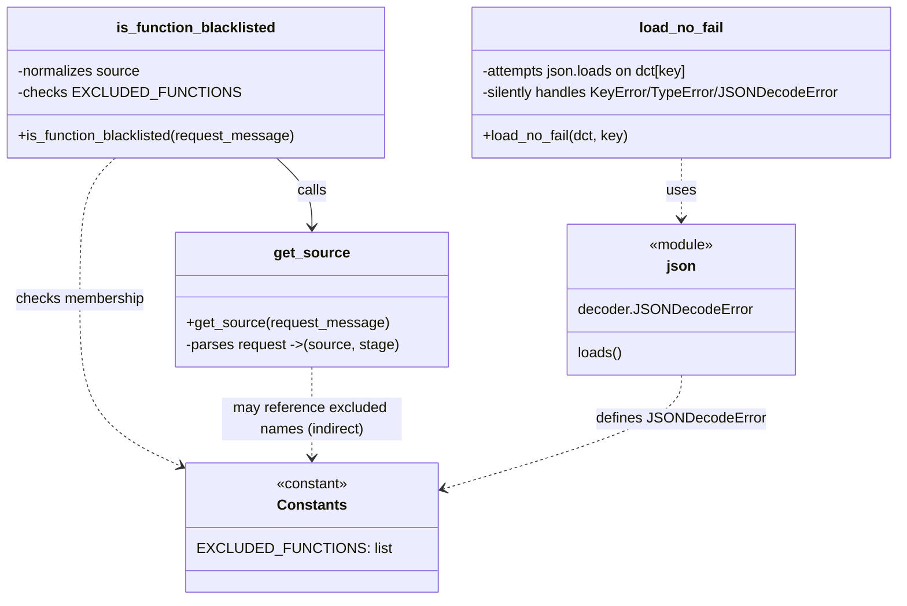

# Diagram: common/monitoring/monitoring/utilities/consumer.py

> Auto-generated by Obscura crawlers

## Mermaid

### SVG

<svg id="container" width="997.244140625" xmlns="http://www.w3.org/2000/svg" class="classDiagram" height="668" viewBox="0 0 997.244140625 668" role="graphics-document document" aria-roledescription="class"><g><defs><marker id="container_class-aggregationStart" class="marker aggregation class" refX="18" refY="7" markerWidth="190" markerHeight="240" orient="auto"><path d="M 18,7 L9,13 L1,7 L9,1 Z"></path></marker></defs><defs><marker id="container_class-aggregationEnd" class="marker aggregation class" refX="1" refY="7" markerWidth="20" markerHeight="28" orient="auto"><path d="M 18,7 L9,13 L1,7 L9,1 Z"></path></marker></defs><defs><marker id="container_class-extensionStart" class="marker extension class" refX="18" refY="7" markerWidth="190" markerHeight="240" orient="auto"><path d="M 1,7 L18,13 V 1 Z"></path></marker></defs><defs><marker id="container_class-extensionEnd" class="marker extension class" refX="1" refY="7" markerWidth="20" markerHeight="28" orient="auto"><path d="M 1,1 V 13 L18,7 Z"></path></marker></defs><defs><marker id="container_class-compositionStart" class="marker composition class" refX="18" refY="7" markerWidth="190" markerHeight="240" orient="auto"><path d="M 18,7 L9,13 L1,7 L9,1 Z"></path></marker></defs><defs><marker id="container_class-compositionEnd" class="marker composition class" refX="1" refY="7" markerWidth="20" markerHeight="28" orient="auto"><path d="M 18,7 L9,13 L1,7 L9,1 Z"></path></marker></defs><defs><marker id="container_class-dependencyStart" class="marker dependency class" refX="6" refY="7" markerWidth="190" markerHeight="240" orient="auto"><path d="M 5,7 L9,13 L1,7 L9,1 Z"></path></marker></defs><defs><marker id="container_class-dependencyEnd" class="marker dependency class" refX="13" refY="7" markerWidth="20" markerHeight="28" orient="auto"><path d="M 18,7 L9,13 L14,7 L9,1 Z"></path></marker></defs><defs><marker id="container_class-lollipopStart" class="marker lollipop class" refX="13" refY="7" markerWidth="190" markerHeight="240" orient="auto"><circle stroke="black" fill="transparent" cx="7" cy="7" r="6"></circle></marker></defs><defs><marker id="container_class-lollipopEnd" class="marker lollipop class" refX="1" refY="7" markerWidth="190" markerHeight="240" orient="auto"><circle stroke="black" fill="transparent" cx="7" cy="7" r="6"></circle></marker></defs><g class="root"><g class="clusters"></g><g class="edgePaths"><path d="M308.048,176L314.615,182.167C321.181,188.333,334.314,200.667,340.881,213.5C347.447,226.333,347.447,239.667,347.447,246.333L347.447,253" id="id_is_function_blacklisted_get_source_1" class="edge-thickness-normal edge-pattern-solid relation" style=";;;" data-edge="true" data-et="edge" data-id="id_is_function_blacklisted_get_source_1" data-points="W3sieCI6MzA4LjA0ODE2NjMyMjMxNDA1LCJ5IjoxNzZ9LHsieCI6MzQ3LjQ0NzI2NTYyNSwieSI6MjEzfSx7IngiOjM0Ny40NDcyNjU2MjUsInkiOjI1OX1d" marker-end="url(#container_class-dependencyEnd)"></path><path d="M129.155,176L122.588,182.167C116.022,188.333,102.889,200.667,96.322,227C89.756,253.333,89.756,293.667,89.756,336C89.756,378.333,89.756,422.667,110.31,454.485C130.865,486.303,171.974,505.606,192.528,515.257L213.083,524.909" id="id_is_function_blacklisted_Constants_2" class="edge-thickness-normal edge-pattern-dashed relation" style=";;;" data-edge="true" data-et="edge" data-id="id_is_function_blacklisted_Constants_2" data-points="W3sieCI6MTI5LjE1NDk1ODY3NzY4NTk1LCJ5IjoxNzZ9LHsieCI6ODkuNzU1ODU5Mzc1LCJ5IjoyMTN9LHsieCI6ODkuNzU1ODU5Mzc1LCJ5IjozMzR9LHsieCI6ODkuNzU1ODU5Mzc1LCJ5Ijo0Njd9LHsieCI6MjE4LjUxMzY3MTg3NSwieSI6NTI3LjQ1ODczMDYxNTg5NTN9XQ==" marker-end="url(#container_class-dependencyEnd)"></path><path d="M756.408,176L756.408,182.167C756.408,188.333,756.408,200.667,756.408,212C756.408,223.333,756.408,233.667,756.408,238.833L756.408,244" id="id_load_no_fail_json_3" class="edge-thickness-normal edge-pattern-dashed relation" style=";;;" data-edge="true" data-et="edge" data-id="id_load_no_fail_json_3" data-points="W3sieCI6NzU2LjQwODIwMzEyNSwieSI6MTc2fSx7IngiOjc1Ni40MDgyMDMxMjUsInkiOjIxM30seyJ4Ijo3NTYuNDA4MjAzMTI1LCJ5IjoyNTB9XQ==" marker-end="url(#container_class-dependencyEnd)"></path><path d="M347.447,409L347.447,418.667C347.447,428.333,347.447,447.667,347.447,464.5C347.447,481.333,347.447,495.667,347.447,502.833L347.447,510" id="id_get_source_Constants_4" class="edge-thickness-normal edge-pattern-dashed relation" style=";;;" data-edge="true" data-et="edge" data-id="id_get_source_Constants_4" data-points="W3sieCI6MzQ3LjQ0NzI2NTYyNSwieSI6NDA5fSx7IngiOjM0Ny40NDcyNjU2MjUsInkiOjQ2N30seyJ4IjozNDcuNDQ3MjY1NjI1LCJ5Ijo1MTZ9XQ==" marker-end="url(#container_class-dependencyEnd)"></path><path d="M756.408,418L756.408,426.167C756.408,434.333,756.408,450.667,710.696,472.358C664.984,494.05,573.559,521.1,527.847,534.625L482.134,548.15" id="id_json_Constants_5" class="edge-thickness-normal edge-pattern-dashed relation" style=";;;" data-edge="true" data-et="edge" data-id="id_json_Constants_5" data-points="W3sieCI6NzU2LjQwODIwMzEyNSwieSI6NDE4fSx7IngiOjc1Ni40MDgyMDMxMjUsInkiOjQ2N30seyJ4Ijo0NzYuMzgwODU5Mzc1LCJ5Ijo1NDkuODUyMTg4MjgyMDQxfV0=" marker-end="url(#container_class-dependencyEnd)"></path></g><g class="edgeLabels"><g class="edgeLabel" transform="translate(347.447265625, 213)"><g class="label" data-id="id_is_function_blacklisted_get_source_1" transform="translate(-16.4453125, -12)"><foreignObject width="32.890625" height="24">

calls

</foreignObject></g></g><g class="edgeLabel" transform="translate(89.755859375, 334)"><g class="label" data-id="id_is_function_blacklisted_Constants_2" transform="translate(-72.1953125, -12)"><foreignObject width="144.390625" height="24">

checks membership

</foreignObject></g></g><g class="edgeLabel" transform="translate(756.408203125, 213)"><g class="label" data-id="id_load_no_fail_json_3" transform="translate(-16.4921875, -12)"><foreignObject width="32.984375" height="24">

uses

</foreignObject></g></g><g class="edgeLabel" transform="translate(347.447265625, 467)"><g class="label" data-id="id_get_source_Constants_4" transform="translate(-100, -24)"><foreignObject width="200" height="48">

may reference excluded names (indirect)

</foreignObject></g></g><g class="edgeLabel" transform="translate(756.408203125, 467)"><g class="label" data-id="id_json_Constants_5" transform="translate(-91.34375, -12)"><foreignObject width="182.6875" height="24">

defines JSONDecodeError

</foreignObject></g></g></g><g class="nodes"><g class="node default" id="classId-Constants-0" transform="translate(347.447265625, 588)"><g class="basic label-container"><path d="M-128.93359375 -72 L128.93359375 -72 L128.93359375 72 L-128.93359375 72" stroke="none" stroke-width="0" fill="#ECECFF" style=""></path><path d="M-128.93359375 -72 C-48.663847399384665 -72, 31.60589895123067 -72, 128.93359375 -72 M-128.93359375 -72 C-50.126137445652105 -72, 28.68131885869579 -72, 128.93359375 -72 M128.93359375 -72 C128.93359375 -28.360982776605958, 128.93359375 15.278034446788084, 128.93359375 72 M128.93359375 -72 C128.93359375 -15.117922596557513, 128.93359375 41.764154806884974, 128.93359375 72 M128.93359375 72 C35.925504467683155 72, -57.08258481463369 72, -128.93359375 72 M128.93359375 72 C51.351273254176206 72, -26.231047241647587 72, -128.93359375 72 M-128.93359375 72 C-128.93359375 21.82461592866892, -128.93359375 -28.35076814266216, -128.93359375 -72 M-128.93359375 72 C-128.93359375 42.30028483440753, -128.93359375 12.600569668815055, -128.93359375 -72" stroke="#9370DB" stroke-width="1.3" fill="none" stroke-dasharray="0 0" style=""></path></g><g class="annotation-group text" transform="translate(-40.4921875, -48)"><g class="label" style="" transform="translate(0,-12)"><foreignObject width="80.984375" height="24">

«constant»

</foreignObject></g></g><g class="label-group text" transform="translate(-36.5390625, -24)"><g class="label" style="font-weight: bolder" transform="translate(0,-12)"><foreignObject width="73.078125" height="24">

Constants

</foreignObject></g></g><g class="members-group text" transform="translate(-116.93359375, 24)"><g class="label" style="" transform="translate(0,-12)"><foreignObject width="193.375" height="24">

EXCLUDED_FUNCTIONS: list

</foreignObject></g></g><g class="methods-group text" transform="translate(-116.93359375, 72)"></g><g class="divider" style=""><path d="M-128.93359375 0 C-74.26873553300945 0, -19.603877316018895 0, 128.93359375 0 M-128.93359375 0 C-60.23705569460964 0, 8.459482360780726 0, 128.93359375 0" stroke="#9370DB" stroke-width="1.3" fill="none" stroke-dasharray="0 0" style=""></path></g><g class="divider" style=""><path d="M-128.93359375 48 C-27.682593563689352 48, 73.5684066226213 48, 128.93359375 48 M-128.93359375 48 C-48.21331660715431 48, 32.50696053569138 48, 128.93359375 48" stroke="#9370DB" stroke-width="1.3" fill="none" stroke-dasharray="0 0" style=""></path></g></g><g class="node default" id="classId-json-1" transform="translate(756.408203125, 334)"><g class="basic label-container"><path d="M-123.98828125 -84 L123.98828125 -84 L123.98828125 84 L-123.98828125 84" stroke="none" stroke-width="0" fill="#ECECFF" style=""></path><path d="M-123.98828125 -84 C-64.86326619062704 -84, -5.7382511312540885 -84, 123.98828125 -84 M-123.98828125 -84 C-53.992954754218616 -84, 16.00237174156277 -84, 123.98828125 -84 M123.98828125 -84 C123.98828125 -42.363950841934255, 123.98828125 -0.7279016838685095, 123.98828125 84 M123.98828125 -84 C123.98828125 -22.894137265338856, 123.98828125 38.21172546932229, 123.98828125 84 M123.98828125 84 C32.0479889647838 84, -59.892303320432404 84, -123.98828125 84 M123.98828125 84 C51.921912210049115 84, -20.14445682990177 84, -123.98828125 84 M-123.98828125 84 C-123.98828125 38.0960345956677, -123.98828125 -7.807930808664594, -123.98828125 -84 M-123.98828125 84 C-123.98828125 46.66141766571606, -123.98828125 9.322835331432117, -123.98828125 -84" stroke="#9370DB" stroke-width="1.3" fill="none" stroke-dasharray="0 0" style=""></path></g><g class="annotation-group text" transform="translate(-36.6015625, -60)"><g class="label" style="" transform="translate(0,-12)"><foreignObject width="73.203125" height="24">

«module»

</foreignObject></g></g><g class="label-group text" transform="translate(-15.40625, -36)"><g class="label" style="font-weight: bolder" transform="translate(0,-12)"><foreignObject width="30.8125" height="24">

json

</foreignObject></g></g><g class="members-group text" transform="translate(-111.98828125, 12)"><g class="label" style="" transform="translate(0,-12)"><foreignObject width="187.375" height="24">

decoder.JSONDecodeError

</foreignObject></g></g><g class="methods-group text" transform="translate(-111.98828125, 60)"><g class="label" style="" transform="translate(0,-12)"><foreignObject width="49.90625" height="24">

loads()

</foreignObject></g></g><g class="divider" style=""><path d="M-123.98828125 -12 C-32.479437489296146 -12, 59.02940627140771 -12, 123.98828125 -12 M-123.98828125 -12 C-33.409248726706764 -12, 57.16978379658647 -12, 123.98828125 -12" stroke="#9370DB" stroke-width="1.3" fill="none" stroke-dasharray="0 0" style=""></path></g><g class="divider" style=""><path d="M-123.98828125 36 C-40.732314761812646 36, 42.52365172637471 36, 123.98828125 36 M-123.98828125 36 C-60.71852683235278 36, 2.5512275852944413 36, 123.98828125 36" stroke="#9370DB" stroke-width="1.3" fill="none" stroke-dasharray="0 0" style=""></path></g></g><g class="node default" id="classId-get_source-2" transform="translate(347.447265625, 334)"><g class="basic label-container"><path d="M-150.49609375 -75 L150.49609375 -75 L150.49609375 75 L-150.49609375 75" stroke="none" stroke-width="0" fill="#ECECFF" style=""></path><path d="M-150.49609375 -75 C-38.73404469633171 -75, 73.02800435733658 -75, 150.49609375 -75 M-150.49609375 -75 C-80.27149607215985 -75, -10.046898394319697 -75, 150.49609375 -75 M150.49609375 -75 C150.49609375 -39.20643305924328, 150.49609375 -3.412866118486562, 150.49609375 75 M150.49609375 -75 C150.49609375 -34.84885574567083, 150.49609375 5.302288508658336, 150.49609375 75 M150.49609375 75 C70.94336346078616 75, -8.609366828427682 75, -150.49609375 75 M150.49609375 75 C48.69415917193486 75, -53.10777540613029 75, -150.49609375 75 M-150.49609375 75 C-150.49609375 26.615600950008833, -150.49609375 -21.768798099982334, -150.49609375 -75 M-150.49609375 75 C-150.49609375 41.451094366545, -150.49609375 7.90218873309, -150.49609375 -75" stroke="#9370DB" stroke-width="1.3" fill="none" stroke-dasharray="0 0" style=""></path></g><g class="annotation-group text" transform="translate(0, -51)"></g><g class="label-group text" transform="translate(-40.0703125, -51)"><g class="label" style="font-weight: bolder" transform="translate(0,-12)"><foreignObject width="80.140625" height="24">

get_source

</foreignObject></g></g><g class="members-group text" transform="translate(-138.49609375, -3)"></g><g class="methods-group text" transform="translate(-138.49609375, 27)"><g class="label" style="" transform="translate(0,-12)"><foreignObject width="223.078125" height="24">

+get_source(request_message)

</foreignObject></g><g class="label" style="" transform="translate(0,12)"><foreignObject width="236.921875" height="24">

-parses request -&gt;(source, stage)

</foreignObject></g></g><g class="divider" style=""><path d="M-150.49609375 -27 C-69.83428183864129 -27, 10.827530072717423 -27, 150.49609375 -27 M-150.49609375 -27 C-39.34230954178801 -27, 71.81147466642398 -27, 150.49609375 -27" stroke="#9370DB" stroke-width="1.3" fill="none" stroke-dasharray="0 0" style=""></path></g><g class="divider" style=""><path d="M-150.49609375 -3 C-51.868307653330746 -3, 46.75947844333851 -3, 150.49609375 -3 M-150.49609375 -3 C-54.04063839132229 -3, 42.41481696735542 -3, 150.49609375 -3" stroke="#9370DB" stroke-width="1.3" fill="none" stroke-dasharray="0 0" style=""></path></g></g><g class="node default" id="classId-load_no_fail-3" transform="translate(756.408203125, 92)"><g class="basic label-container"><path d="M-232.8359375 -84 L232.8359375 -84 L232.8359375 84 L-232.8359375 84" stroke="none" stroke-width="0" fill="#ECECFF" style=""></path><path d="M-232.8359375 -84 C-111.98334728914234 -84, 8.869242921715312 -84, 232.8359375 -84 M-232.8359375 -84 C-68.60023002620767 -84, 95.63547744758466 -84, 232.8359375 -84 M232.8359375 -84 C232.8359375 -25.749945966375677, 232.8359375 32.50010806724865, 232.8359375 84 M232.8359375 -84 C232.8359375 -44.66975842506339, 232.8359375 -5.339516850126785, 232.8359375 84 M232.8359375 84 C98.04665083966646 84, -36.74263582066709 84, -232.8359375 84 M232.8359375 84 C121.64599667855038 84, 10.45605585710075 84, -232.8359375 84 M-232.8359375 84 C-232.8359375 41.59097924213592, -232.8359375 -0.8180415157281544, -232.8359375 -84 M-232.8359375 84 C-232.8359375 39.47310797905486, -232.8359375 -5.053784041890282, -232.8359375 -84" stroke="#9370DB" stroke-width="1.3" fill="none" stroke-dasharray="0 0" style=""></path></g><g class="annotation-group text" transform="translate(0, -60)"></g><g class="label-group text" transform="translate(-45.078125, -60)"><g class="label" style="font-weight: bolder" transform="translate(0,-12)"><foreignObject width="90.15625" height="24">

load_no_fail

</foreignObject></g></g><g class="members-group text" transform="translate(-220.8359375, -12)"><g class="label" style="" transform="translate(0,-12)"><foreignObject width="234.78125" height="24">

-attempts json.loads on dct[key]

</foreignObject></g><g class="label" style="" transform="translate(0,12)"><foreignObject width="396.59375" height="24">

-silently handles KeyError/TypeError/JSONDecodeError

</foreignObject></g></g><g class="methods-group text" transform="translate(-220.8359375, 60)"><g class="label" style="" transform="translate(0,-12)"><foreignObject width="163.765625" height="24">

+load_no_fail(dct, key)

</foreignObject></g></g><g class="divider" style=""><path d="M-232.8359375 -36 C-131.66382794537628 -36, -30.491718390752567 -36, 232.8359375 -36 M-232.8359375 -36 C-67.83968732996439 -36, 97.15656284007122 -36, 232.8359375 -36" stroke="#9370DB" stroke-width="1.3" fill="none" stroke-dasharray="0 0" style=""></path></g><g class="divider" style=""><path d="M-232.8359375 36 C-127.22487948686174 36, -21.613821473723476 36, 232.8359375 36 M-232.8359375 36 C-89.67654490103024 36, 53.48284769793952 36, 232.8359375 36" stroke="#9370DB" stroke-width="1.3" fill="none" stroke-dasharray="0 0" style=""></path></g></g><g class="node default" id="classId-is_function_blacklisted-4" transform="translate(218.6015625, 92)"><g class="basic label-container"><path d="M-210.6015625 -84 L210.6015625 -84 L210.6015625 84 L-210.6015625 84" stroke="none" stroke-width="0" fill="#ECECFF" style=""></path><path d="M-210.6015625 -84 C-81.84299940455497 -84, 46.91556369089005 -84, 210.6015625 -84 M-210.6015625 -84 C-45.08462093650917 -84, 120.43232062698166 -84, 210.6015625 -84 M210.6015625 -84 C210.6015625 -34.67469262884779, 210.6015625 14.650614742304427, 210.6015625 84 M210.6015625 -84 C210.6015625 -26.485328330649878, 210.6015625 31.029343338700244, 210.6015625 84 M210.6015625 84 C87.16580006943263 84, -36.26996236113473 84, -210.6015625 84 M210.6015625 84 C66.28335309678107 84, -78.03485630643786 84, -210.6015625 84 M-210.6015625 84 C-210.6015625 18.332706873648732, -210.6015625 -47.334586252702536, -210.6015625 -84 M-210.6015625 84 C-210.6015625 26.28337694007044, -210.6015625 -31.43324611985912, -210.6015625 -84" stroke="#9370DB" stroke-width="1.3" fill="none" stroke-dasharray="0 0" style=""></path></g><g class="annotation-group text" transform="translate(0, -60)"></g><g class="label-group text" transform="translate(-85.03125, -60)"><g class="label" style="font-weight: bolder" transform="translate(0,-12)"><foreignObject width="170.0625" height="24">

is_function_blacklisted

</foreignObject></g></g><g class="members-group text" transform="translate(-198.6015625, -12)"><g class="label" style="" transform="translate(0,-12)"><foreignObject width="137.984375" height="24">

-normalizes source

</foreignObject></g><g class="label" style="" transform="translate(0,12)"><foreignObject width="222.5" height="24">

-checks EXCLUDED_FUNCTIONS

</foreignObject></g></g><g class="methods-group text" transform="translate(-198.6015625, 60)"><g class="label" style="" transform="translate(0,-12)"><foreignObject width="312.171875" height="24">

+is_function_blacklisted(request_message)

</foreignObject></g></g><g class="divider" style=""><path d="M-210.6015625 -36 C-76.82053836091075 -36, 56.96048577817851 -36, 210.6015625 -36 M-210.6015625 -36 C-47.44293376914894 -36, 115.71569496170213 -36, 210.6015625 -36" stroke="#9370DB" stroke-width="1.3" fill="none" stroke-dasharray="0 0" style=""></path></g><g class="divider" style=""><path d="M-210.6015625 36 C-109.2336716563102 36, -7.865780812620386 36, 210.6015625 36 M-210.6015625 36 C-85.75954619839352 36, 39.082470103212955 36, 210.6015625 36" stroke="#9370DB" stroke-width="1.3" fill="none" stroke-dasharray="0 0" style=""></path></g></g></g></g></g></svg>
