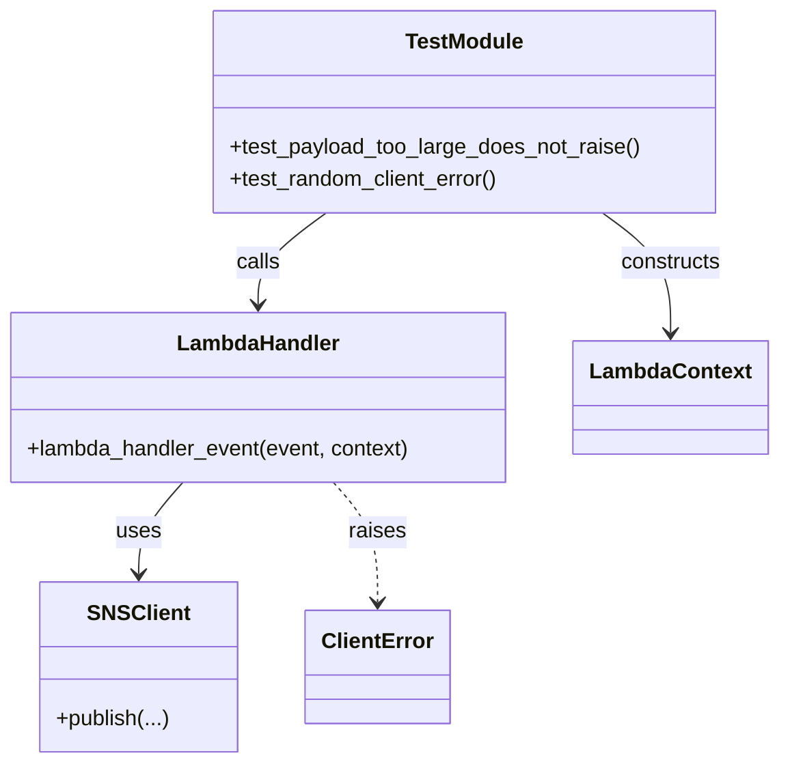
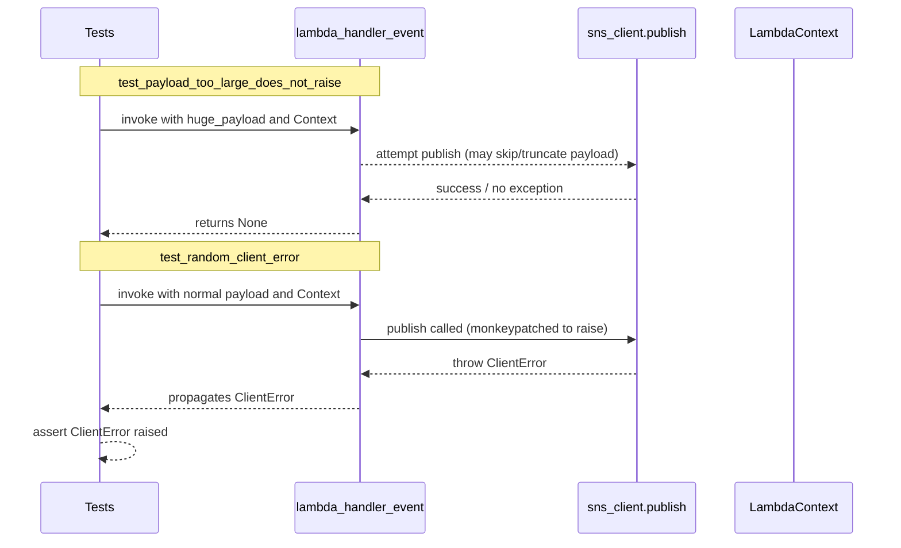

# Diagram: common/monitoring/monitoring_tests/test_audit.py

> Auto-generated by Obscura crawlers

## Diagram 1

### SVG

<svg id="container" width="574.046875" xmlns="http://www.w3.org/2000/svg" class="classDiagram" height="566" viewBox="0 0 574.046875 566" role="graphics-document document" aria-roledescription="class"><g><defs><marker id="container_class-aggregationStart" class="marker aggregation class" refX="18" refY="7" markerWidth="190" markerHeight="240" orient="auto"><path d="M 18,7 L9,13 L1,7 L9,1 Z"></path></marker></defs><defs><marker id="container_class-aggregationEnd" class="marker aggregation class" refX="1" refY="7" markerWidth="20" markerHeight="28" orient="auto"><path d="M 18,7 L9,13 L1,7 L9,1 Z"></path></marker></defs><defs><marker id="container_class-extensionStart" class="marker extension class" refX="18" refY="7" markerWidth="190" markerHeight="240" orient="auto"><path d="M 1,7 L18,13 V 1 Z"></path></marker></defs><defs><marker id="container_class-extensionEnd" class="marker extension class" refX="1" refY="7" markerWidth="20" markerHeight="28" orient="auto"><path d="M 1,1 V 13 L18,7 Z"></path></marker></defs><defs><marker id="container_class-compositionStart" class="marker composition class" refX="18" refY="7" markerWidth="190" markerHeight="240" orient="auto"><path d="M 18,7 L9,13 L1,7 L9,1 Z"></path></marker></defs><defs><marker id="container_class-compositionEnd" class="marker composition class" refX="1" refY="7" markerWidth="20" markerHeight="28" orient="auto"><path d="M 18,7 L9,13 L1,7 L9,1 Z"></path></marker></defs><defs><marker id="container_class-dependencyStart" class="marker dependency class" refX="6" refY="7" markerWidth="190" markerHeight="240" orient="auto"><path d="M 5,7 L9,13 L1,7 L9,1 Z"></path></marker></defs><defs><marker id="container_class-dependencyEnd" class="marker dependency class" refX="13" refY="7" markerWidth="20" markerHeight="28" orient="auto"><path d="M 18,7 L9,13 L14,7 L9,1 Z"></path></marker></defs><defs><marker id="container_class-lollipopStart" class="marker lollipop class" refX="13" refY="7" markerWidth="190" markerHeight="240" orient="auto"><circle stroke="black" fill="transparent" cx="7" cy="7" r="6"></circle></marker></defs><defs><marker id="container_class-lollipopEnd" class="marker lollipop class" refX="1" refY="7" markerWidth="190" markerHeight="240" orient="auto"><circle stroke="black" fill="transparent" cx="7" cy="7" r="6"></circle></marker></defs><g class="root"><g class="clusters"></g><g class="edgePaths"><path d="M242.945,158L234.575,164.167C226.205,170.333,209.466,182.667,201.096,194C192.727,205.333,192.727,215.667,192.727,220.833L192.727,226" id="id_TestModule_LambdaHandler_1" class="edge-thickness-normal edge-pattern-solid relation" style=";;;" data-edge="true" data-et="edge" data-id="id_TestModule_LambdaHandler_1" data-points="W3sieCI6MjQyLjk0NDcxOTU4NzA1MzU2LCJ5IjoxNTh9LHsieCI6MTkyLjcyNjU2MjUsInkiOjE5NX0seyJ4IjoxOTIuNzI2NTYyNSwieSI6MjMyfV0=" marker-end="url(#container_class-dependencyEnd)"></path><path d="M138.089,358L132.741,364.167C127.393,370.333,116.696,382.667,111.348,394C106,405.333,106,415.667,106,420.833L106,426" id="id_LambdaHandler_SNSClient_2" class="edge-thickness-normal edge-pattern-solid relation" style=";;;" data-edge="true" data-et="edge" data-id="id_LambdaHandler_SNSClient_2" data-points="W3sieCI6MTM4LjA4ODgyODEyNSwieSI6MzU4fSx7IngiOjEwNiwieSI6Mzk1fSx7IngiOjEwNiwieSI6NDMyfV0=" marker-end="url(#container_class-dependencyEnd)"></path><path d="M247.364,358L252.712,364.167C258.061,370.333,268.757,382.667,274.105,397.5C279.453,412.333,279.453,429.667,279.453,438.333L279.453,447" id="id_LambdaHandler_ClientError_3" class="edge-thickness-normal edge-pattern-dashed relation" style=";;;" data-edge="true" data-et="edge" data-id="id_LambdaHandler_ClientError_3" data-points="W3sieCI6MjQ3LjM2NDI5Njg3NSwieSI6MzU4fSx7IngiOjI3OS40NTMxMjUsInkiOjM5NX0seyJ4IjoyNzkuNDUzMTI1LCJ5Ijo0NTN9XQ==" marker-end="url(#container_class-dependencyEnd)"></path><path d="M446.532,158L454.902,164.167C463.271,170.333,480.011,182.667,488.38,197.5C496.75,212.333,496.75,229.667,496.75,238.333L496.75,247" id="id_TestModule_LambdaContext_4" class="edge-thickness-normal edge-pattern-solid relation" style=";;;" data-edge="true" data-et="edge" data-id="id_TestModule_LambdaContext_4" data-points="W3sieCI6NDQ2LjUzMTg0MjkxMjk0NjQ0LCJ5IjoxNTh9LHsieCI6NDk2Ljc1LCJ5IjoxOTV9LHsieCI6NDk2Ljc1LCJ5IjoyNTN9XQ==" marker-end="url(#container_class-dependencyEnd)"></path></g><g class="edgeLabels"><g class="edgeLabel" transform="translate(192.7265625, 195)"><g class="label" data-id="id_TestModule_LambdaHandler_1" transform="translate(-16.4453125, -12)"><foreignObject width="32.890625" height="24">

calls

</foreignObject></g></g><g class="edgeLabel" transform="translate(106, 395)"><g class="label" data-id="id_LambdaHandler_SNSClient_2" transform="translate(-16.4921875, -12)"><foreignObject width="32.984375" height="24">

uses

</foreignObject></g></g><g class="edgeLabel" transform="translate(279.453125, 395)"><g class="label" data-id="id_LambdaHandler_ClientError_3" transform="translate(-21.25, -12)"><foreignObject width="42.5" height="24">

raises

</foreignObject></g></g><g class="edgeLabel" transform="translate(496.75, 195)"><g class="label" data-id="id_TestModule_LambdaContext_4" transform="translate(-37.84375, -12)"><foreignObject width="75.6875" height="24">

constructs

</foreignObject></g></g></g><g class="nodes"><g class="node default" id="classId-TestModule-0" transform="translate(344.73828125, 83)"><g class="basic label-container"><path d="M-186.453125 -75 L186.453125 -75 L186.453125 75 L-186.453125 75" stroke="none" stroke-width="0" fill="#ECECFF" style=""></path><path d="M-186.453125 -75 C-95.1352125896203 -75, -3.81730017924059 -75, 186.453125 -75 M-186.453125 -75 C-102.36245688941136 -75, -18.271788778822724 -75, 186.453125 -75 M186.453125 -75 C186.453125 -44.106409399361645, 186.453125 -13.21281879872329, 186.453125 75 M186.453125 -75 C186.453125 -24.503733339220965, 186.453125 25.99253332155807, 186.453125 75 M186.453125 75 C85.66523419196386 75, -15.122656616072277 75, -186.453125 75 M186.453125 75 C86.41157451489394 75, -13.629975970212115 75, -186.453125 75 M-186.453125 75 C-186.453125 19.70541826559841, -186.453125 -35.58916346880318, -186.453125 -75 M-186.453125 75 C-186.453125 41.05312332810802, -186.453125 7.106246656216044, -186.453125 -75" stroke="#9370DB" stroke-width="1.3" fill="none" stroke-dasharray="0 0" style=""></path></g><g class="annotation-group text" transform="translate(0, -51)"></g><g class="label-group text" transform="translate(-42.34375, -51)"><g class="label" style="font-weight: bolder" transform="translate(0,-12)"><foreignObject width="84.6875" height="24">

TestModule

</foreignObject></g></g><g class="members-group text" transform="translate(-174.453125, -3)"></g><g class="methods-group text" transform="translate(-174.453125, 27)"><g class="label" style="" transform="translate(0,-12)"><foreignObject width="306.5625" height="24">

+test_payload_too_large_does_not_raise()

</foreignObject></g><g class="label" style="" transform="translate(0,12)"><foreignObject width="203.25" height="24">

+test_random_client_error()

</foreignObject></g></g><g class="divider" style=""><path d="M-186.453125 -27 C-49.70067253307508 -27, 87.05177993384984 -27, 186.453125 -27 M-186.453125 -27 C-105.84657467878453 -27, -25.24002435756907 -27, 186.453125 -27" stroke="#9370DB" stroke-width="1.3" fill="none" stroke-dasharray="0 0" style=""></path></g><g class="divider" style=""><path d="M-186.453125 -3 C-74.70674878405869 -3, 37.03962743188262 -3, 186.453125 -3 M-186.453125 -3 C-101.2585767801525 -3, -16.06402856030499 -3, 186.453125 -3" stroke="#9370DB" stroke-width="1.3" fill="none" stroke-dasharray="0 0" style=""></path></g></g><g class="node default" id="classId-LambdaHandler-1" transform="translate(192.7265625, 295)"><g class="basic label-container"><path d="M-184.7265625 -63 L184.7265625 -63 L184.7265625 63 L-184.7265625 63" stroke="none" stroke-width="0" fill="#ECECFF" style=""></path><path d="M-184.7265625 -63 C-55.73286242515832 -63, 73.26083764968337 -63, 184.7265625 -63 M-184.7265625 -63 C-79.6717197524432 -63, 25.38312299511361 -63, 184.7265625 -63 M184.7265625 -63 C184.7265625 -34.659606736782365, 184.7265625 -6.319213473564737, 184.7265625 63 M184.7265625 -63 C184.7265625 -15.013877723767713, 184.7265625 32.97224455246457, 184.7265625 63 M184.7265625 63 C49.19563879330184 63, -86.33528491339632 63, -184.7265625 63 M184.7265625 63 C78.82173087971887 63, -27.08310074056226 63, -184.7265625 63 M-184.7265625 63 C-184.7265625 20.30700691308091, -184.7265625 -22.385986173838177, -184.7265625 -63 M-184.7265625 63 C-184.7265625 20.491867156077305, -184.7265625 -22.01626568784539, -184.7265625 -63" stroke="#9370DB" stroke-width="1.3" fill="none" stroke-dasharray="0 0" style=""></path></g><g class="annotation-group text" transform="translate(0, -39)"></g><g class="label-group text" transform="translate(-58.21875, -39)"><g class="label" style="font-weight: bolder" transform="translate(0,-12)"><foreignObject width="116.4375" height="24">

LambdaHandler

</foreignObject></g></g><g class="members-group text" transform="translate(-172.7265625, 9)"></g><g class="methods-group text" transform="translate(-172.7265625, 39)"><g class="label" style="" transform="translate(0,-12)"><foreignObject width="287.234375" height="24">

+lambda_handler_event(event, context)

</foreignObject></g></g><g class="divider" style=""><path d="M-184.7265625 -15 C-109.95716854415362 -15, -35.187774588307235 -15, 184.7265625 -15 M-184.7265625 -15 C-83.7564429573506 -15, 17.2136765852988 -15, 184.7265625 -15" stroke="#9370DB" stroke-width="1.3" fill="none" stroke-dasharray="0 0" style=""></path></g><g class="divider" style=""><path d="M-184.7265625 9 C-89.7245104229086 9, 5.277541654182812 9, 184.7265625 9 M-184.7265625 9 C-108.62400470079446 9, -32.52144690158892 9, 184.7265625 9" stroke="#9370DB" stroke-width="1.3" fill="none" stroke-dasharray="0 0" style=""></path></g></g><g class="node default" id="classId-LambdaContext-2" transform="translate(496.75, 295)"><g class="basic label-container"><path d="M-69.296875 -42 L69.296875 -42 L69.296875 42 L-69.296875 42" stroke="none" stroke-width="0" fill="#ECECFF" style=""></path><path d="M-69.296875 -42 C-18.12534571869314 -42, 33.04618356261372 -42, 69.296875 -42 M-69.296875 -42 C-40.90435036091364 -42, -12.511825721827279 -42, 69.296875 -42 M69.296875 -42 C69.296875 -12.692240427666608, 69.296875 16.615519144666784, 69.296875 42 M69.296875 -42 C69.296875 -8.719874192260306, 69.296875 24.560251615479388, 69.296875 42 M69.296875 42 C24.45009669199745 42, -20.396681616005097 42, -69.296875 42 M69.296875 42 C31.716860871600808 42, -5.863153256798384 42, -69.296875 42 M-69.296875 42 C-69.296875 12.025884502448474, -69.296875 -17.948230995103053, -69.296875 -42 M-69.296875 42 C-69.296875 24.754648167933627, -69.296875 7.509296335867255, -69.296875 -42" stroke="#9370DB" stroke-width="1.3" fill="none" stroke-dasharray="0 0" style=""></path></g><g class="annotation-group text" transform="translate(0, -18)"></g><g class="label-group text" transform="translate(-57.296875, -18)"><g class="label" style="font-weight: bolder" transform="translate(0,-12)"><foreignObject width="114.59375" height="24">

LambdaContext

</foreignObject></g></g><g class="members-group text" transform="translate(-57.296875, 30)"></g><g class="methods-group text" transform="translate(-57.296875, 60)"></g><g class="divider" style=""><path d="M-69.296875 6 C-17.357638620306666 6, 34.58159775938667 6, 69.296875 6 M-69.296875 6 C-19.468656390652107 6, 30.359562218695785 6, 69.296875 6" stroke="#9370DB" stroke-width="1.3" fill="none" stroke-dasharray="0 0" style=""></path></g><g class="divider" style=""><path d="M-69.296875 24 C-28.27016828637175 24, 12.756538427256501 24, 69.296875 24 M-69.296875 24 C-17.22489829312859 24, 34.84707841374282 24, 69.296875 24" stroke="#9370DB" stroke-width="1.3" fill="none" stroke-dasharray="0 0" style=""></path></g></g><g class="node default" id="classId-SNSClient-3" transform="translate(106, 495)"><g class="basic label-container"><path d="M-71.9921875 -63 L71.9921875 -63 L71.9921875 63 L-71.9921875 63" stroke="none" stroke-width="0" fill="#ECECFF" style=""></path><path d="M-71.9921875 -63 C-33.505782136747094 -63, 4.980623226505813 -63, 71.9921875 -63 M-71.9921875 -63 C-35.11416982983141 -63, 1.7638478403371778 -63, 71.9921875 -63 M71.9921875 -63 C71.9921875 -25.870593912182706, 71.9921875 11.258812175634588, 71.9921875 63 M71.9921875 -63 C71.9921875 -21.636404336500206, 71.9921875 19.727191326999588, 71.9921875 63 M71.9921875 63 C38.00115730886498 63, 4.010127117729965 63, -71.9921875 63 M71.9921875 63 C32.984240733368864 63, -6.023706033262272 63, -71.9921875 63 M-71.9921875 63 C-71.9921875 32.00993060649827, -71.9921875 1.0198612129965383, -71.9921875 -63 M-71.9921875 63 C-71.9921875 26.82302384207884, -71.9921875 -9.35395231584232, -71.9921875 -63" stroke="#9370DB" stroke-width="1.3" fill="none" stroke-dasharray="0 0" style=""></path></g><g class="annotation-group text" transform="translate(0, -39)"></g><g class="label-group text" transform="translate(-35.734375, -39)"><g class="label" style="font-weight: bolder" transform="translate(0,-12)"><foreignObject width="71.46875" height="24">

SNSClient

</foreignObject></g></g><g class="members-group text" transform="translate(-59.9921875, 9)"></g><g class="methods-group text" transform="translate(-59.9921875, 39)"><g class="label" style="" transform="translate(0,-12)"><foreignObject width="84.25" height="24">

+publish(...)

</foreignObject></g></g><g class="divider" style=""><path d="M-71.9921875 -15 C-36.413953784279954 -15, -0.8357200685599082 -15, 71.9921875 -15 M-71.9921875 -15 C-40.49804246375534 -15, -9.003897427510672 -15, 71.9921875 -15" stroke="#9370DB" stroke-width="1.3" fill="none" stroke-dasharray="0 0" style=""></path></g><g class="divider" style=""><path d="M-71.9921875 9 C-22.746668538678975 9, 26.49885042264205 9, 71.9921875 9 M-71.9921875 9 C-20.226318745122214 9, 31.539550009755573 9, 71.9921875 9" stroke="#9370DB" stroke-width="1.3" fill="none" stroke-dasharray="0 0" style=""></path></g></g><g class="node default" id="classId-ClientError-4" transform="translate(279.453125, 495)"><g class="basic label-container"><path d="M-51.4609375 -42 L51.4609375 -42 L51.4609375 42 L-51.4609375 42" stroke="none" stroke-width="0" fill="#ECECFF" style=""></path><path d="M-51.4609375 -42 C-15.897700989314067 -42, 19.665535521371865 -42, 51.4609375 -42 M-51.4609375 -42 C-30.62028004712998 -42, -9.779622594259962 -42, 51.4609375 -42 M51.4609375 -42 C51.4609375 -18.68792712173049, 51.4609375 4.624145756539022, 51.4609375 42 M51.4609375 -42 C51.4609375 -23.4597887541166, 51.4609375 -4.919577508233203, 51.4609375 42 M51.4609375 42 C20.300677730836874 42, -10.859582038326252 42, -51.4609375 42 M51.4609375 42 C12.17657746574254 42, -27.10778256851492 42, -51.4609375 42 M-51.4609375 42 C-51.4609375 16.297413410747218, -51.4609375 -9.405173178505564, -51.4609375 -42 M-51.4609375 42 C-51.4609375 14.211851626446755, -51.4609375 -13.57629674710649, -51.4609375 -42" stroke="#9370DB" stroke-width="1.3" fill="none" stroke-dasharray="0 0" style=""></path></g><g class="annotation-group text" transform="translate(0, -18)"></g><g class="label-group text" transform="translate(-39.4609375, -18)"><g class="label" style="font-weight: bolder" transform="translate(0,-12)"><foreignObject width="78.921875" height="24">

ClientError

</foreignObject></g></g><g class="members-group text" transform="translate(-39.4609375, 30)"></g><g class="methods-group text" transform="translate(-39.4609375, 60)"></g><g class="divider" style=""><path d="M-51.4609375 6 C-19.10297055336072 6, 13.25499639327856 6, 51.4609375 6 M-51.4609375 6 C-18.85747998532605 6, 13.745977529347897 6, 51.4609375 6" stroke="#9370DB" stroke-width="1.3" fill="none" stroke-dasharray="0 0" style=""></path></g><g class="divider" style=""><path d="M-51.4609375 24 C-18.90964110023335 24, 13.641655299533298 24, 51.4609375 24 M-51.4609375 24 C-23.960347806615076 24, 3.5402418867698486 24, 51.4609375 24" stroke="#9370DB" stroke-width="1.3" fill="none" stroke-dasharray="0 0" style=""></path></g></g></g></g></g></svg>

## Diagram 2

### SVG

<svg id="container" width="1220" xmlns="http://www.w3.org/2000/svg" height="731" viewBox="-61.5 -10 1220 731" role="graphics-document document" aria-roledescription="sequence"><g><rect x="958.5" y="645" fill="#eaeaea" stroke="#666" width="150" height="65" name="Context" rx="3" ry="3" class="actor actor-bottom"></rect><text x="1033.5" y="677.5" dominant-baseline="central" alignment-baseline="central" class="actor actor-box" style="text-anchor: middle; font-size: 16px; font-weight: 400;"><tspan x="1033.5" dy="0">LambdaContext</tspan></text></g><g><rect x="757.5" y="645" fill="#eaeaea" stroke="#666" width="151" height="65" name="SNS" rx="3" ry="3" class="actor actor-bottom"></rect><text x="833" y="677.5" dominant-baseline="central" alignment-baseline="central" class="actor actor-box" style="text-anchor: middle; font-size: 16px; font-weight: 400;"><tspan x="833" dy="0">sns_client.publish</tspan></text></g><g><rect x="343.5" y="645" fill="#eaeaea" stroke="#666" width="187" height="65" name="Handler" rx="3" ry="3" class="actor actor-bottom"></rect><text x="437" y="677.5" dominant-baseline="central" alignment-baseline="central" class="actor actor-box" style="text-anchor: middle; font-size: 16px; font-weight: 400;"><tspan x="437" dy="0">lambda_handler_event</tspan></text></g><g><rect x="0" y="645" fill="#eaeaea" stroke="#666" width="150" height="65" name="Test" rx="3" ry="3" class="actor actor-bottom"></rect><text x="75" y="677.5" dominant-baseline="central" alignment-baseline="central" class="actor actor-box" style="text-anchor: middle; font-size: 16px; font-weight: 400;"><tspan x="75" dy="0">Tests</tspan></text></g><g><line id="actor3" x1="1033.5" y1="65" x2="1033.5" y2="645" class="actor-line 200" stroke-width="0.5px" stroke="#999" name="Context"></line><g id="root-3"><rect x="958.5" y="0" fill="#eaeaea" stroke="#666" width="150" height="65" name="Context" rx="3" ry="3" class="actor actor-top"></rect><text x="1033.5" y="32.5" dominant-baseline="central" alignment-baseline="central" class="actor actor-box" style="text-anchor: middle; font-size: 16px; font-weight: 400;"><tspan x="1033.5" dy="0">LambdaContext</tspan></text></g></g><g><line id="actor2" x1="833" y1="65" x2="833" y2="645" class="actor-line 200" stroke-width="0.5px" stroke="#999" name="SNS"></line><g id="root-2"><rect x="757.5" y="0" fill="#eaeaea" stroke="#666" width="151" height="65" name="SNS" rx="3" ry="3" class="actor actor-top"></rect><text x="833" y="32.5" dominant-baseline="central" alignment-baseline="central" class="actor actor-box" style="text-anchor: middle; font-size: 16px; font-weight: 400;"><tspan x="833" dy="0">sns_client.publish</tspan></text></g></g><g><line id="actor1" x1="437" y1="65" x2="437" y2="645" class="actor-line 200" stroke-width="0.5px" stroke="#999" name="Handler"></line><g id="root-1"><rect x="343.5" y="0" fill="#eaeaea" stroke="#666" width="187" height="65" name="Handler" rx="3" ry="3" class="actor actor-top"></rect><text x="437" y="32.5" dominant-baseline="central" alignment-baseline="central" class="actor actor-box" style="text-anchor: middle; font-size: 16px; font-weight: 400;"><tspan x="437" dy="0">lambda_handler_event</tspan></text></g></g><g><line id="actor0" x1="75" y1="65" x2="75" y2="645" class="actor-line 200" stroke-width="0.5px" stroke="#999" name="Test"></line><g id="root-0"><rect x="0" y="0" fill="#eaeaea" stroke="#666" width="150" height="65" name="Test" rx="3" ry="3" class="actor actor-top"></rect><text x="75" y="32.5" dominant-baseline="central" alignment-baseline="central" class="actor actor-box" style="text-anchor: middle; font-size: 16px; font-weight: 400;"><tspan x="75" dy="0">Tests</tspan></text></g></g><g></g><defs><symbol id="computer" width="24" height="24"><path transform="scale(.5)" d="M2 2v13h20v-13h-20zm18 11h-16v-9h16v9zm-10.228 6l.466-1h3.524l.467 1h-4.457zm14.228 3h-24l2-6h2.104l-1.33 4h18.45l-1.297-4h2.073l2 6zm-5-10h-14v-7h14v7z"></path></symbol></defs><defs><symbol id="database" fill-rule="evenodd" clip-rule="evenodd"><path transform="scale(.5)" d="M12.258.001l.256.004.255.005.253.008.251.01.249.012.247.015.246.016.242.019.241.02.239.023.236.024.233.027.231.028.229.031.225.032.223.034.22.036.217.038.214.04.211.041.208.043.205.045.201.046.198.048.194.05.191.051.187.053.183.054.18.056.175.057.172.059.168.06.163.061.16.063.155.064.15.066.074.033.073.033.071.034.07.034.069.035.068.035.067.035.066.035.064.036.064.036.062.036.06.036.06.037.058.037.058.037.055.038.055.038.053.038.052.038.051.039.05.039.048.039.047.039.045.04.044.04.043.04.041.04.04.041.039.041.037.041.036.041.034.041.033.042.032.042.03.042.029.042.027.042.026.043.024.043.023.043.021.043.02.043.018.044.017.043.015.044.013.044.012.044.011.045.009.044.007.045.006.045.004.045.002.045.001.045v17l-.001.045-.002.045-.004.045-.006.045-.007.045-.009.044-.011.045-.012.044-.013.044-.015.044-.017.043-.018.044-.02.043-.021.043-.023.043-.024.043-.026.043-.027.042-.029.042-.03.042-.032.042-.033.042-.034.041-.036.041-.037.041-.039.041-.04.041-.041.04-.043.04-.044.04-.045.04-.047.039-.048.039-.05.039-.051.039-.052.038-.053.038-.055.038-.055.038-.058.037-.058.037-.06.037-.06.036-.062.036-.064.036-.064.036-.066.035-.067.035-.068.035-.069.035-.07.034-.071.034-.073.033-.074.033-.15.066-.155.064-.16.063-.163.061-.168.06-.172.059-.175.057-.18.056-.183.054-.187.053-.191.051-.194.05-.198.048-.201.046-.205.045-.208.043-.211.041-.214.04-.217.038-.22.036-.223.034-.225.032-.229.031-.231.028-.233.027-.236.024-.239.023-.241.02-.242.019-.246.016-.247.015-.249.012-.251.01-.253.008-.255.005-.256.004-.258.001-.258-.001-.256-.004-.255-.005-.253-.008-.251-.01-.249-.012-.247-.015-.245-.016-.243-.019-.241-.02-.238-.023-.236-.024-.234-.027-.231-.028-.228-.031-.226-.032-.223-.034-.22-.036-.217-.038-.214-.04-.211-.041-.208-.043-.204-.045-.201-.046-.198-.048-.195-.05-.19-.051-.187-.053-.184-.054-.179-.056-.176-.057-.172-.059-.167-.06-.164-.061-.159-.063-.155-.064-.151-.066-.074-.033-.072-.033-.072-.034-.07-.034-.069-.035-.068-.035-.067-.035-.066-.035-.064-.036-.063-.036-.062-.036-.061-.036-.06-.037-.058-.037-.057-.037-.056-.038-.055-.038-.053-.038-.052-.038-.051-.039-.049-.039-.049-.039-.046-.039-.046-.04-.044-.04-.043-.04-.041-.04-.04-.041-.039-.041-.037-.041-.036-.041-.034-.041-.033-.042-.032-.042-.03-.042-.029-.042-.027-.042-.026-.043-.024-.043-.023-.043-.021-.043-.02-.043-.018-.044-.017-.043-.015-.044-.013-.044-.012-.044-.011-.045-.009-.044-.007-.045-.006-.045-.004-.045-.002-.045-.001-.045v-17l.001-.045.002-.045.004-.045.006-.045.007-.045.009-.044.011-.045.012-.044.013-.044.015-.044.017-.043.018-.044.02-.043.021-.043.023-.043.024-.043.026-.043.027-.042.029-.042.03-.042.032-.042.033-.042.034-.041.036-.041.037-.041.039-.041.04-.041.041-.04.043-.04.044-.04.046-.04.046-.039.049-.039.049-.039.051-.039.052-.038.053-.038.055-.038.056-.038.057-.037.058-.037.06-.037.061-.036.062-.036.063-.036.064-.036.066-.035.067-.035.068-.035.069-.035.07-.034.072-.034.072-.033.074-.033.151-.066.155-.064.159-.063.164-.061.167-.06.172-.059.176-.057.179-.056.184-.054.187-.053.19-.051.195-.05.198-.048.201-.046.204-.045.208-.043.211-.041.214-.04.217-.038.22-.036.223-.034.226-.032.228-.031.231-.028.234-.027.236-.024.238-.023.241-.02.243-.019.245-.016.247-.015.249-.012.251-.01.253-.008.255-.005.256-.004.258-.001.258.001zm-9.258 20.499v.01l.001.021.003.021.004.022.005.021.006.022.007.022.009.023.01.022.011.023.012.023.013.023.015.023.016.024.017.023.018.024.019.024.021.024.022.025.023.024.024.025.052.049.056.05.061.051.066.051.07.051.075.051.079.052.084.052.088.052.092.052.097.052.102.051.105.052.11.052.114.051.119.051.123.051.127.05.131.05.135.05.139.048.144.049.147.047.152.047.155.047.16.045.163.045.167.043.171.043.176.041.178.041.183.039.187.039.19.037.194.035.197.035.202.033.204.031.209.03.212.029.216.027.219.025.222.024.226.021.23.02.233.018.236.016.24.015.243.012.246.01.249.008.253.005.256.004.259.001.26-.001.257-.004.254-.005.25-.008.247-.011.244-.012.241-.014.237-.016.233-.018.231-.021.226-.021.224-.024.22-.026.216-.027.212-.028.21-.031.205-.031.202-.034.198-.034.194-.036.191-.037.187-.039.183-.04.179-.04.175-.042.172-.043.168-.044.163-.045.16-.046.155-.046.152-.047.148-.048.143-.049.139-.049.136-.05.131-.05.126-.05.123-.051.118-.052.114-.051.11-.052.106-.052.101-.052.096-.052.092-.052.088-.053.083-.051.079-.052.074-.052.07-.051.065-.051.06-.051.056-.05.051-.05.023-.024.023-.025.021-.024.02-.024.019-.024.018-.024.017-.024.015-.023.014-.024.013-.023.012-.023.01-.023.01-.022.008-.022.006-.022.006-.022.004-.022.004-.021.001-.021.001-.021v-4.127l-.077.055-.08.053-.083.054-.085.053-.087.052-.09.052-.093.051-.095.05-.097.05-.1.049-.102.049-.105.048-.106.047-.109.047-.111.046-.114.045-.115.045-.118.044-.12.043-.122.042-.124.042-.126.041-.128.04-.13.04-.132.038-.134.038-.135.037-.138.037-.139.035-.142.035-.143.034-.144.033-.147.032-.148.031-.15.03-.151.03-.153.029-.154.027-.156.027-.158.026-.159.025-.161.024-.162.023-.163.022-.165.021-.166.02-.167.019-.169.018-.169.017-.171.016-.173.015-.173.014-.175.013-.175.012-.177.011-.178.01-.179.008-.179.008-.181.006-.182.005-.182.004-.184.003-.184.002h-.37l-.184-.002-.184-.003-.182-.004-.182-.005-.181-.006-.179-.008-.179-.008-.178-.01-.176-.011-.176-.012-.175-.013-.173-.014-.172-.015-.171-.016-.17-.017-.169-.018-.167-.019-.166-.02-.165-.021-.163-.022-.162-.023-.161-.024-.159-.025-.157-.026-.156-.027-.155-.027-.153-.029-.151-.03-.15-.03-.148-.031-.146-.032-.145-.033-.143-.034-.141-.035-.14-.035-.137-.037-.136-.037-.134-.038-.132-.038-.13-.04-.128-.04-.126-.041-.124-.042-.122-.042-.12-.044-.117-.043-.116-.045-.113-.045-.112-.046-.109-.047-.106-.047-.105-.048-.102-.049-.1-.049-.097-.05-.095-.05-.093-.052-.09-.051-.087-.052-.085-.053-.083-.054-.08-.054-.077-.054v4.127zm0-5.654v.011l.001.021.003.021.004.021.005.022.006.022.007.022.009.022.01.022.011.023.012.023.013.023.015.024.016.023.017.024.018.024.019.024.021.024.022.024.023.025.024.024.052.05.056.05.061.05.066.051.07.051.075.052.079.051.084.052.088.052.092.052.097.052.102.052.105.052.11.051.114.051.119.052.123.05.127.051.131.05.135.049.139.049.144.048.147.048.152.047.155.046.16.045.163.045.167.044.171.042.176.042.178.04.183.04.187.038.19.037.194.036.197.034.202.033.204.032.209.03.212.028.216.027.219.025.222.024.226.022.23.02.233.018.236.016.24.014.243.012.246.01.249.008.253.006.256.003.259.001.26-.001.257-.003.254-.006.25-.008.247-.01.244-.012.241-.015.237-.016.233-.018.231-.02.226-.022.224-.024.22-.025.216-.027.212-.029.21-.03.205-.032.202-.033.198-.035.194-.036.191-.037.187-.039.183-.039.179-.041.175-.042.172-.043.168-.044.163-.045.16-.045.155-.047.152-.047.148-.048.143-.048.139-.05.136-.049.131-.05.126-.051.123-.051.118-.051.114-.052.11-.052.106-.052.101-.052.096-.052.092-.052.088-.052.083-.052.079-.052.074-.051.07-.052.065-.051.06-.05.056-.051.051-.049.023-.025.023-.024.021-.025.02-.024.019-.024.018-.024.017-.024.015-.023.014-.023.013-.024.012-.022.01-.023.01-.023.008-.022.006-.022.006-.022.004-.021.004-.022.001-.021.001-.021v-4.139l-.077.054-.08.054-.083.054-.085.052-.087.053-.09.051-.093.051-.095.051-.097.05-.1.049-.102.049-.105.048-.106.047-.109.047-.111.046-.114.045-.115.044-.118.044-.12.044-.122.042-.124.042-.126.041-.128.04-.13.039-.132.039-.134.038-.135.037-.138.036-.139.036-.142.035-.143.033-.144.033-.147.033-.148.031-.15.03-.151.03-.153.028-.154.028-.156.027-.158.026-.159.025-.161.024-.162.023-.163.022-.165.021-.166.02-.167.019-.169.018-.169.017-.171.016-.173.015-.173.014-.175.013-.175.012-.177.011-.178.009-.179.009-.179.007-.181.007-.182.005-.182.004-.184.003-.184.002h-.37l-.184-.002-.184-.003-.182-.004-.182-.005-.181-.007-.179-.007-.179-.009-.178-.009-.176-.011-.176-.012-.175-.013-.173-.014-.172-.015-.171-.016-.17-.017-.169-.018-.167-.019-.166-.02-.165-.021-.163-.022-.162-.023-.161-.024-.159-.025-.157-.026-.156-.027-.155-.028-.153-.028-.151-.03-.15-.03-.148-.031-.146-.033-.145-.033-.143-.033-.141-.035-.14-.036-.137-.036-.136-.037-.134-.038-.132-.039-.13-.039-.128-.04-.126-.041-.124-.042-.122-.043-.12-.043-.117-.044-.116-.044-.113-.046-.112-.046-.109-.046-.106-.047-.105-.048-.102-.049-.1-.049-.097-.05-.095-.051-.093-.051-.09-.051-.087-.053-.085-.052-.083-.054-.08-.054-.077-.054v4.139zm0-5.666v.011l.001.02.003.022.004.021.005.022.006.021.007.022.009.023.01.022.011.023.012.023.013.023.015.023.016.024.017.024.018.023.019.024.021.025.022.024.023.024.024.025.052.05.056.05.061.05.066.051.07.051.075.052.079.051.084.052.088.052.092.052.097.052.102.052.105.051.11.052.114.051.119.051.123.051.127.05.131.05.135.05.139.049.144.048.147.048.152.047.155.046.16.045.163.045.167.043.171.043.176.042.178.04.183.04.187.038.19.037.194.036.197.034.202.033.204.032.209.03.212.028.216.027.219.025.222.024.226.021.23.02.233.018.236.017.24.014.243.012.246.01.249.008.253.006.256.003.259.001.26-.001.257-.003.254-.006.25-.008.247-.01.244-.013.241-.014.237-.016.233-.018.231-.02.226-.022.224-.024.22-.025.216-.027.212-.029.21-.03.205-.032.202-.033.198-.035.194-.036.191-.037.187-.039.183-.039.179-.041.175-.042.172-.043.168-.044.163-.045.16-.045.155-.047.152-.047.148-.048.143-.049.139-.049.136-.049.131-.051.126-.05.123-.051.118-.052.114-.051.11-.052.106-.052.101-.052.096-.052.092-.052.088-.052.083-.052.079-.052.074-.052.07-.051.065-.051.06-.051.056-.05.051-.049.023-.025.023-.025.021-.024.02-.024.019-.024.018-.024.017-.024.015-.023.014-.024.013-.023.012-.023.01-.022.01-.023.008-.022.006-.022.006-.022.004-.022.004-.021.001-.021.001-.021v-4.153l-.077.054-.08.054-.083.053-.085.053-.087.053-.09.051-.093.051-.095.051-.097.05-.1.049-.102.048-.105.048-.106.048-.109.046-.111.046-.114.046-.115.044-.118.044-.12.043-.122.043-.124.042-.126.041-.128.04-.13.039-.132.039-.134.038-.135.037-.138.036-.139.036-.142.034-.143.034-.144.033-.147.032-.148.032-.15.03-.151.03-.153.028-.154.028-.156.027-.158.026-.159.024-.161.024-.162.023-.163.023-.165.021-.166.02-.167.019-.169.018-.169.017-.171.016-.173.015-.173.014-.175.013-.175.012-.177.01-.178.01-.179.009-.179.007-.181.006-.182.006-.182.004-.184.003-.184.001-.185.001-.185-.001-.184-.001-.184-.003-.182-.004-.182-.006-.181-.006-.179-.007-.179-.009-.178-.01-.176-.01-.176-.012-.175-.013-.173-.014-.172-.015-.171-.016-.17-.017-.169-.018-.167-.019-.166-.02-.165-.021-.163-.023-.162-.023-.161-.024-.159-.024-.157-.026-.156-.027-.155-.028-.153-.028-.151-.03-.15-.03-.148-.032-.146-.032-.145-.033-.143-.034-.141-.034-.14-.036-.137-.036-.136-.037-.134-.038-.132-.039-.13-.039-.128-.041-.126-.041-.124-.041-.122-.043-.12-.043-.117-.044-.116-.044-.113-.046-.112-.046-.109-.046-.106-.048-.105-.048-.102-.048-.1-.05-.097-.049-.095-.051-.093-.051-.09-.052-.087-.052-.085-.053-.083-.053-.08-.054-.077-.054v4.153zm8.74-8.179l-.257.004-.254.005-.25.008-.247.011-.244.012-.241.014-.237.016-.233.018-.231.021-.226.022-.224.023-.22.026-.216.027-.212.028-.21.031-.205.032-.202.033-.198.034-.194.036-.191.038-.187.038-.183.04-.179.041-.175.042-.172.043-.168.043-.163.045-.16.046-.155.046-.152.048-.148.048-.143.048-.139.049-.136.05-.131.05-.126.051-.123.051-.118.051-.114.052-.11.052-.106.052-.101.052-.096.052-.092.052-.088.052-.083.052-.079.052-.074.051-.07.052-.065.051-.06.05-.056.05-.051.05-.023.025-.023.024-.021.024-.02.025-.019.024-.018.024-.017.023-.015.024-.014.023-.013.023-.012.023-.01.023-.01.022-.008.022-.006.023-.006.021-.004.022-.004.021-.001.021-.001.021.001.021.001.021.004.021.004.022.006.021.006.023.008.022.01.022.01.023.012.023.013.023.014.023.015.024.017.023.018.024.019.024.02.025.021.024.023.024.023.025.051.05.056.05.06.05.065.051.07.052.074.051.079.052.083.052.088.052.092.052.096.052.101.052.106.052.11.052.114.052.118.051.123.051.126.051.131.05.136.05.139.049.143.048.148.048.152.048.155.046.16.046.163.045.168.043.172.043.175.042.179.041.183.04.187.038.191.038.194.036.198.034.202.033.205.032.21.031.212.028.216.027.22.026.224.023.226.022.231.021.233.018.237.016.241.014.244.012.247.011.25.008.254.005.257.004.26.001.26-.001.257-.004.254-.005.25-.008.247-.011.244-.012.241-.014.237-.016.233-.018.231-.021.226-.022.224-.023.22-.026.216-.027.212-.028.21-.031.205-.032.202-.033.198-.034.194-.036.191-.038.187-.038.183-.04.179-.041.175-.042.172-.043.168-.043.163-.045.16-.046.155-.046.152-.048.148-.048.143-.048.139-.049.136-.05.131-.05.126-.051.123-.051.118-.051.114-.052.11-.052.106-.052.101-.052.096-.052.092-.052.088-.052.083-.052.079-.052.074-.051.07-.052.065-.051.06-.05.056-.05.051-.05.023-.025.023-.024.021-.024.02-.025.019-.024.018-.024.017-.023.015-.024.014-.023.013-.023.012-.023.01-.023.01-.022.008-.022.006-.023.006-.021.004-.022.004-.021.001-.021.001-.021-.001-.021-.001-.021-.004-.021-.004-.022-.006-.021-.006-.023-.008-.022-.01-.022-.01-.023-.012-.023-.013-.023-.014-.023-.015-.024-.017-.023-.018-.024-.019-.024-.02-.025-.021-.024-.023-.024-.023-.025-.051-.05-.056-.05-.06-.05-.065-.051-.07-.052-.074-.051-.079-.052-.083-.052-.088-.052-.092-.052-.096-.052-.101-.052-.106-.052-.11-.052-.114-.052-.118-.051-.123-.051-.126-.051-.131-.05-.136-.05-.139-.049-.143-.048-.148-.048-.152-.048-.155-.046-.16-.046-.163-.045-.168-.043-.172-.043-.175-.042-.179-.041-.183-.04-.187-.038-.191-.038-.194-.036-.198-.034-.202-.033-.205-.032-.21-.031-.212-.028-.216-.027-.22-.026-.224-.023-.226-.022-.231-.021-.233-.018-.237-.016-.241-.014-.244-.012-.247-.011-.25-.008-.254-.005-.257-.004-.26-.001-.26.001z"></path></symbol></defs><defs><symbol id="clock" width="24" height="24"><path transform="scale(.5)" d="M12 2c5.514 0 10 4.486 10 10s-4.486 10-10 10-10-4.486-10-10 4.486-10 10-10zm0-2c-6.627 0-12 5.373-12 12s5.373 12 12 12 12-5.373 12-12-5.373-12-12-12zm5.848 12.459c.202.038.202.333.001.372-1.907.361-6.045 1.111-6.547 1.111-.719 0-1.301-.582-1.301-1.301 0-.512.77-5.447 1.125-7.445.034-.192.312-.181.343.014l.985 6.238 5.394 1.011z"></path></symbol></defs><defs><marker id="arrowhead" refX="7.9" refY="5" markerUnits="userSpaceOnUse" markerWidth="12" markerHeight="12" orient="auto-start-reverse"><path d="M -1 0 L 10 5 L 0 10 z"></path></marker></defs><defs><marker id="crosshead" markerWidth="15" markerHeight="8" orient="auto" refX="4" refY="4.5"><path fill="none" stroke="#000000" stroke-width="1pt" d="M 1,2 L 6,7 M 6,2 L 1,7" style="stroke-dasharray: 0, 0;"></path></marker></defs><defs><marker id="filled-head" refX="15.5" refY="7" markerWidth="20" markerHeight="28" orient="auto"><path d="M 18,7 L9,13 L14,7 L9,1 Z"></path></marker></defs><defs><marker id="sequencenumber" refX="15" refY="15" markerWidth="60" markerHeight="40" orient="auto"><circle cx="15" cy="15" r="6"></circle></marker></defs><g><rect x="50" y="75" fill="#EDF2AE" stroke="#666" width="412" height="39" class="note"></rect><text x="256" y="80" text-anchor="middle" dominant-baseline="middle" alignment-baseline="middle" class="noteText" dy="1em" style="font-size: 16px; font-weight: 400;"><tspan x="256">test_payload_too_large_does_not_raise</tspan></text></g><g><rect x="50" y="316" fill="#EDF2AE" stroke="#666" width="412" height="39" class="note"></rect><text x="256" y="321" text-anchor="middle" dominant-baseline="middle" alignment-baseline="middle" class="noteText" dy="1em" style="font-size: 16px; font-weight: 400;"><tspan x="256">test_random_client_error</tspan></text></g><text x="255" y="129" text-anchor="middle" dominant-baseline="middle" alignment-baseline="middle" class="messageText" dy="1em" style="font-size: 16px; font-weight: 400;">invoke with huge_payload and Context</text><line x1="76" y1="162" x2="433" y2="162" class="messageLine0" stroke-width="2" stroke="none" marker-end="url(#arrowhead)" style="fill: none;"></line><text x="634" y="177" text-anchor="middle" dominant-baseline="middle" alignment-baseline="middle" class="messageText" dy="1em" style="font-size: 16px; font-weight: 400;">attempt publish (may skip/truncate payload)</text><line x1="438" y1="210" x2="829" y2="210" class="messageLine1" stroke-width="2" stroke="none" marker-end="url(#arrowhead)" style="stroke-dasharray: 3, 3; fill: none;"></line><text x="637" y="225" text-anchor="middle" dominant-baseline="middle" alignment-baseline="middle" class="messageText" dy="1em" style="font-size: 16px; font-weight: 400;">success / no exception</text><line x1="832" y1="258" x2="441" y2="258" class="messageLine1" stroke-width="2" stroke="none" marker-end="url(#arrowhead)" style="stroke-dasharray: 3, 3; fill: none;"></line><text x="258" y="273" text-anchor="middle" dominant-baseline="middle" alignment-baseline="middle" class="messageText" dy="1em" style="font-size: 16px; font-weight: 400;">returns None</text><line x1="436" y1="306" x2="79" y2="306" class="messageLine1" stroke-width="2" stroke="none" marker-end="url(#arrowhead)" style="stroke-dasharray: 3, 3; fill: none;"></line><text x="255" y="370" text-anchor="middle" dominant-baseline="middle" alignment-baseline="middle" class="messageText" dy="1em" style="font-size: 16px; font-weight: 400;">invoke with normal payload and Context</text><line x1="76" y1="403" x2="433" y2="403" class="messageLine0" stroke-width="2" stroke="none" marker-end="url(#arrowhead)" style="fill: none;"></line><text x="634" y="418" text-anchor="middle" dominant-baseline="middle" alignment-baseline="middle" class="messageText" dy="1em" style="font-size: 16px; font-weight: 400;">publish called (monkeypatched to raise)</text><line x1="438" y1="451" x2="829" y2="451" class="messageLine0" stroke-width="2" stroke="none" marker-end="url(#arrowhead)" style="fill: none;"></line><text x="637" y="466" text-anchor="middle" dominant-baseline="middle" alignment-baseline="middle" class="messageText" dy="1em" style="font-size: 16px; font-weight: 400;">throw ClientError</text><line x1="832" y1="499" x2="441" y2="499" class="messageLine1" stroke-width="2" stroke="none" marker-end="url(#arrowhead)" style="stroke-dasharray: 3, 3; fill: none;"></line><text x="258" y="514" text-anchor="middle" dominant-baseline="middle" alignment-baseline="middle" class="messageText" dy="1em" style="font-size: 16px; font-weight: 400;">propagates ClientError</text><line x1="436" y1="547" x2="79" y2="547" class="messageLine1" stroke-width="2" stroke="none" marker-end="url(#arrowhead)" style="stroke-dasharray: 3, 3; fill: none;"></line><text x="76" y="562" text-anchor="middle" dominant-baseline="middle" alignment-baseline="middle" class="messageText" dy="1em" style="font-size: 16px; font-weight: 400;">assert ClientError raised</text><path d="M 76,595 C 136,585 136,625 76,615" class="messageLine1" stroke-width="2" stroke="none" marker-end="url(#arrowhead)" style="stroke-dasharray: 3, 3; fill: none;"></path></svg>
