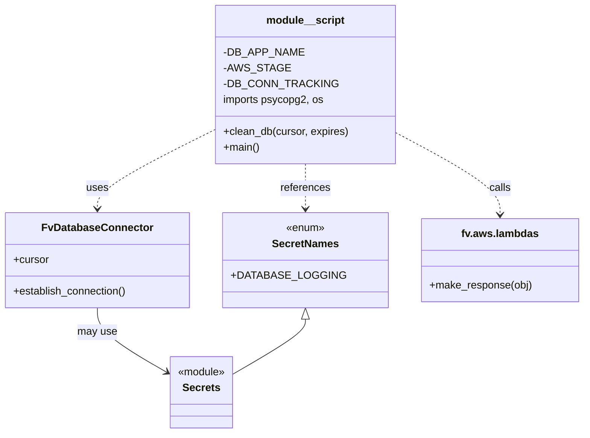

# Diagram: common/monitoring/scripts/delete_old_audit_rows.py


> Auto-generated by Obscura crawlers

## Diagram 1

```mermaid
flowchart TD
    Start([Start]) --> InitEnv[/"Load AWS_STAGE from env"/]
    InitEnv --> CreateConnector[/"DB_CONN_TRACKING = fv.db.FvDatabaseConnector(DB_APP_NAME, SecretNames.DATABASE_LOGGING)"/]
    CreateConnector --> EstablishConn[Establish connection\nDB_CONN_TRACKING.establish_connection()]
    EstablishConn --> GetCursor[Get cursor\ncursor = DB_CONN_TRACKING.cursor]
    GetCursor --> ForLoop[Loop i = 0..9999]
    ForLoop --> CleanDBCall[call clean_db(cursor, "3 months")]
    CleanDBCall --> ExecuteSQL[SQL DELETE via cursor.mogrify and cursor.execute]
    ExecuteSQL --> RowsDeleted[rowsDeleted = cursor.rowcount]
    RowsDeleted --> MakeResponse[make_response({"rowsDeleted": rowsDeleted})]
    MakeResponse --> LoopContinue{More iterations?}
    LoopContinue -->|yes| ForLoop
    LoopContinue -->|no| End([End])
```

> SVG rendering failed for this diagram.

## Diagram 2



### SVG

<svg id="container" width="851.484375" xmlns="http://www.w3.org/2000/svg" class="classDiagram" height="656" viewBox="0 0 851.484375 656" role="graphics-document document" aria-roledescription="class"><style>#container{font-family:"trebuchet ms",verdana,arial,sans-serif;font-size:16px;fill:#333;}@keyframes edge-animation-frame{from{stroke-dashoffset:0;}}@keyframes dash{to{stroke-dashoffset:0;}}#container .edge-animation-slow{stroke-dasharray:9,5!important;stroke-dashoffset:900;animation:dash 50s linear infinite;stroke-linecap:round;}#container .edge-animation-fast{stroke-dasharray:9,5!important;stroke-dashoffset:900;animation:dash 20s linear infinite;stroke-linecap:round;}#container .error-icon{fill:#552222;}#container .error-text{fill:#552222;stroke:#552222;}#container .edge-thickness-normal{stroke-width:1px;}#container .edge-thickness-thick{stroke-width:3.5px;}#container .edge-pattern-solid{stroke-dasharray:0;}#container .edge-thickness-invisible{stroke-width:0;fill:none;}#container .edge-pattern-dashed{stroke-dasharray:3;}#container .edge-pattern-dotted{stroke-dasharray:2;}#container .marker{fill:#333333;stroke:#333333;}#container .marker.cross{stroke:#333333;}#container svg{font-family:"trebuchet ms",verdana,arial,sans-serif;font-size:16px;}#container p{margin:0;}#container g.classGroup text{fill:#9370DB;stroke:none;font-family:"trebuchet ms",verdana,arial,sans-serif;font-size:10px;}#container g.classGroup text .title{font-weight:bolder;}#container .nodeLabel,#container .edgeLabel{color:#131300;}#container .edgeLabel .label rect{fill:#ECECFF;}#container .label text{fill:#131300;}#container .labelBkg{background:#ECECFF;}#container .edgeLabel .label span{background:#ECECFF;}#container .classTitle{font-weight:bolder;}#container .node rect,#container .node circle,#container .node ellipse,#container .node polygon,#container .node path{fill:#ECECFF;stroke:#9370DB;stroke-width:1px;}#container .divider{stroke:#9370DB;stroke-width:1;}#container g.clickable{cursor:pointer;}#container g.classGroup rect{fill:#ECECFF;stroke:#9370DB;}#container g.classGroup line{stroke:#9370DB;stroke-width:1;}#container .classLabel .box{stroke:none;stroke-width:0;fill:#ECECFF;opacity:0.5;}#container .classLabel .label{fill:#9370DB;font-size:10px;}#container .relation{stroke:#333333;stroke-width:1;fill:none;}#container .dashed-line{stroke-dasharray:3;}#container .dotted-line{stroke-dasharray:1 2;}#container #compositionStart,#container .composition{fill:#333333!important;stroke:#333333!important;stroke-width:1;}#container #compositionEnd,#container .composition{fill:#333333!important;stroke:#333333!important;stroke-width:1;}#container #dependencyStart,#container .dependency{fill:#333333!important;stroke:#333333!important;stroke-width:1;}#container #dependencyStart,#container .dependency{fill:#333333!important;stroke:#333333!important;stroke-width:1;}#container #extensionStart,#container .extension{fill:transparent!important;stroke:#333333!important;stroke-width:1;}#container #extensionEnd,#container .extension{fill:transparent!important;stroke:#333333!important;stroke-width:1;}#container #aggregationStart,#container .aggregation{fill:transparent!important;stroke:#333333!important;stroke-width:1;}#container #aggregationEnd,#container .aggregation{fill:transparent!important;stroke:#333333!important;stroke-width:1;}#container #lollipopStart,#container .lollipop{fill:#ECECFF!important;stroke:#333333!important;stroke-width:1;}#container #lollipopEnd,#container .lollipop{fill:#ECECFF!important;stroke:#333333!important;stroke-width:1;}#container .edgeTerminals{font-size:11px;line-height:initial;}#container .classTitleText{text-anchor:middle;font-size:18px;fill:#333;}#container .label-icon{display:inline-block;height:1em;overflow:visible;vertical-align:-0.125em;}#container .node .label-icon path{fill:currentColor;stroke:revert;stroke-width:revert;}#container :root{--mermaid-font-family:"trebuchet ms",verdana,arial,sans-serif;}</style><g><defs><marker id="container_class-aggregationStart" class="marker aggregation class" refX="18" refY="7" markerWidth="190" markerHeight="240" orient="auto"><path d="M 18,7 L9,13 L1,7 L9,1 Z"></path></marker></defs><defs><marker id="container_class-aggregationEnd" class="marker aggregation class" refX="1" refY="7" markerWidth="20" markerHeight="28" orient="auto"><path d="M 18,7 L9,13 L1,7 L9,1 Z"></path></marker></defs><defs><marker id="container_class-extensionStart" class="marker extension class" refX="18" refY="7" markerWidth="190" markerHeight="240" orient="auto"><path d="M 1,7 L18,13 V 1 Z"></path></marker></defs><defs><marker id="container_class-extensionEnd" class="marker extension class" refX="1" refY="7" markerWidth="20" markerHeight="28" orient="auto"><path d="M 1,1 V 13 L18,7 Z"></path></marker></defs><defs><marker id="container_class-compositionStart" class="marker composition class" refX="18" refY="7" markerWidth="190" markerHeight="240" orient="auto"><path d="M 18,7 L9,13 L1,7 L9,1 Z"></path></marker></defs><defs><marker id="container_class-compositionEnd" class="marker composition class" refX="1" refY="7" markerWidth="20" markerHeight="28" orient="auto"><path d="M 18,7 L9,13 L1,7 L9,1 Z"></path></marker></defs><defs><marker id="container_class-dependencyStart" class="marker dependency class" refX="6" refY="7" markerWidth="190" markerHeight="240" orient="auto"><path d="M 5,7 L9,13 L1,7 L9,1 Z"></path></marker></defs><defs><marker id="container_class-dependencyEnd" class="marker dependency class" refX="13" refY="7" markerWidth="20" markerHeight="28" orient="auto"><path d="M 18,7 L9,13 L14,7 L9,1 Z"></path></marker></defs><defs><marker id="container_class-lollipopStart" class="marker lollipop class" refX="13" refY="7" markerWidth="190" markerHeight="240" orient="auto"><circle stroke="black" fill="transparent" cx="7" cy="7" r="6"></circle></marker></defs><defs><marker id="container_class-lollipopEnd" class="marker lollipop class" refX="1" refY="7" markerWidth="190" markerHeight="240" orient="auto"><circle stroke="black" fill="transparent" cx="7" cy="7" r="6"></circle></marker></defs><g class="root"><g class="clusters"></g><g class="edgePaths"><path d="M311.609,198.54L284.055,212.95C256.501,227.36,201.393,256.18,173.839,275.757C146.285,295.333,146.285,305.667,146.285,310.833L146.285,316" id="id_module__script_FvDatabaseConnector_1" class="edge-thickness-normal edge-pattern-dashed relation" style=";;;" data-edge="true" data-et="edge" data-id="id_module__script_FvDatabaseConnector_1" data-points="W3sieCI6MzExLjYwOTM3NSwieSI6MTk4LjUzOTk5MTkzMjY1MDY1fSx7IngiOjE0Ni4yODUxNTYyNSwieSI6Mjg1fSx7IngiOjE0Ni4yODUxNTYyNSwieSI6MzIyfV0=" marker-end="url(#container_class-dependencyEnd)"></path><path d="M446.492,248L446.492,254.167C446.492,260.333,446.492,272.667,446.492,284C446.492,295.333,446.492,305.667,446.492,310.833L446.492,316" id="id_module__script_SecretNames_2" class="edge-thickness-normal edge-pattern-dashed relation" style=";;;" data-edge="true" data-et="edge" data-id="id_module__script_SecretNames_2" data-points="W3sieCI6NDQ2LjQ5MjE4NzUsInkiOjI0OH0seyJ4Ijo0NDYuNDkyMTg3NSwieSI6Mjg1fSx7IngiOjQ0Ni40OTIxODc1LCJ5IjozMjJ9XQ==" marker-end="url(#container_class-dependencyEnd)"></path><path d="M581.375,203.778L605.471,217.315C629.566,230.852,677.758,257.926,701.854,278.13C725.949,298.333,725.949,311.667,725.949,318.333L725.949,325" id="id_module__script_fv.aws.lambdas_3" class="edge-thickness-normal edge-pattern-dashed relation" style=";;;" data-edge="true" data-et="edge" data-id="id_module__script_fv.aws.lambdas_3" data-points="W3sieCI6NTgxLjM3NSwieSI6MjAzLjc3NzY2NTk1Mzc4ODc2fSx7IngiOjcyNS45NDkyMTg3NSwieSI6Mjg1fSx7IngiOjcyNS45NDkyMTg3NSwieSI6MzMxfV0=" marker-end="url(#container_class-dependencyEnd)"></path><path d="M146.285,466L146.285,472.167C146.285,478.333,146.285,490.667,162.347,506.571C178.409,522.475,210.533,541.95,226.594,551.687L242.656,561.425" id="id_FvDatabaseConnector_Secrets_4" class="edge-thickness-normal edge-pattern-solid relation" style=";;;" data-edge="true" data-et="edge" data-id="id_FvDatabaseConnector_Secrets_4" data-points="W3sieCI6MTQ2LjI4NTE1NjI1LCJ5Ijo0NjZ9LHsieCI6MTQ2LjI4NTE1NjI1LCJ5Ijo1MDN9LHsieCI6MjQ3Ljc4NzEwOTM3NSwieSI6NTY0LjUzNTM4NTczNjQwNTh9XQ==" marker-end="url(#container_class-dependencyEnd)"></path><path d="M446.492,483.25L446.492,486.542C446.492,489.833,446.492,496.417,429.575,509.964C412.658,523.512,378.824,544.024,361.907,554.279L344.99,564.535" id="id_SecretNames_Secrets_5" class="edge-thickness-normal edge-pattern-solid relation" style=";;;" data-edge="true" data-et="edge" data-id="id_SecretNames_Secrets_5" data-points="W3sieCI6NDQ2LjQ5MjE4NzUsInkiOjQ2Nn0seyJ4Ijo0NDYuNDkyMTg3NSwieSI6NTAzfSx7IngiOjM0NC45OTAyMzQzNzUsInkiOjU2NC41MzUzODU3MzY0MDU4fV0=" marker-start="url(#container_class-extensionStart)"></path></g><g class="edgeLabels"><g class="edgeLabel" transform="translate(146.28515625, 285)"><g class="label" data-id="id_module__script_FvDatabaseConnector_1" transform="translate(-16.4921875, -12)"><foreignObject width="32.984375" height="24"><div xmlns="http://www.w3.org/1999/xhtml" class="labelBkg" style="display: table-cell; white-space: nowrap; line-height: 1.5; max-width: 200px; text-align: center;"><span class="edgeLabel"><p>uses</p></span></div></foreignObject></g></g><g class="edgeLabel" transform="translate(446.4921875, 285)"><g class="label" data-id="id_module__script_SecretNames_2" transform="translate(-37.828125, -12)"><foreignObject width="75.65625" height="24"><div xmlns="http://www.w3.org/1999/xhtml" class="labelBkg" style="display: table-cell; white-space: nowrap; line-height: 1.5; max-width: 200px; text-align: center;"><span class="edgeLabel"><p>references</p></span></div></foreignObject></g></g><g class="edgeLabel" transform="translate(725.94921875, 285)"><g class="label" data-id="id_module__script_fv.aws.lambdas_3" transform="translate(-16.4453125, -12)"><foreignObject width="32.890625" height="24"><div xmlns="http://www.w3.org/1999/xhtml" class="labelBkg" style="display: table-cell; white-space: nowrap; line-height: 1.5; max-width: 200px; text-align: center;"><span class="edgeLabel"><p>calls</p></span></div></foreignObject></g></g><g class="edgeLabel" transform="translate(146.28515625, 503)"><g class="label" data-id="id_FvDatabaseConnector_Secrets_4" transform="translate(-29.8984375, -12)"><foreignObject width="59.796875" height="24"><div xmlns="http://www.w3.org/1999/xhtml" class="labelBkg" style="display: table-cell; white-space: nowrap; line-height: 1.5; max-width: 200px; text-align: center;"><span class="edgeLabel"><p>may use</p></span></div></foreignObject></g></g><g class="edgeLabel"><g class="label" data-id="id_SecretNames_Secrets_5" transform="translate(0, 0)"><foreignObject width="0" height="0"><div xmlns="http://www.w3.org/1999/xhtml" class="labelBkg" style="display: table-cell; white-space: nowrap; line-height: 1.5; max-width: 200px; text-align: center;"><span class="edgeLabel"></span></div></foreignObject></g></g></g><g class="nodes"><g class="node default" id="classId-FvDatabaseConnector-0" transform="translate(146.28515625, 394)"><g class="basic label-container"><path d="M-138.28515625 -72 L138.28515625 -72 L138.28515625 72 L-138.28515625 72" stroke="none" stroke-width="0" fill="#ECECFF" style=""></path><path d="M-138.28515625 -72 C-41.16072284514199 -72, 55.96371055971602 -72, 138.28515625 -72 M-138.28515625 -72 C-60.80936095249295 -72, 16.666434345014096 -72, 138.28515625 -72 M138.28515625 -72 C138.28515625 -23.747743531930425, 138.28515625 24.50451293613915, 138.28515625 72 M138.28515625 -72 C138.28515625 -25.901916130771816, 138.28515625 20.196167738456367, 138.28515625 72 M138.28515625 72 C59.61733882036323 72, -19.05047860927354 72, -138.28515625 72 M138.28515625 72 C81.34272264993493 72, 24.400289049869855 72, -138.28515625 72 M-138.28515625 72 C-138.28515625 20.612083616071978, -138.28515625 -30.775832767856045, -138.28515625 -72 M-138.28515625 72 C-138.28515625 17.759487040520824, -138.28515625 -36.48102591895835, -138.28515625 -72" stroke="#9370DB" stroke-width="1.3" fill="none" stroke-dasharray="0 0" style=""></path></g><g class="annotation-group text" transform="translate(0, -48)"></g><g class="label-group text" transform="translate(-79.3046875, -48)"><g class="label" style="font-weight: bolder" transform="translate(0,-12)"><foreignObject width="158.609375" height="24"><div xmlns="http://www.w3.org/1999/xhtml" style="display: table-cell; white-space: nowrap; line-height: 1.5; max-width: 207px; text-align: center;"><span class="nodeLabel markdown-node-label" style=""><p>FvDatabaseConnector</p></span></div></foreignObject></g></g><g class="members-group text" transform="translate(-126.28515625, 0)"><g class="label" style="" transform="translate(0,-12)"><foreignObject width="53.71875" height="24"><div xmlns="http://www.w3.org/1999/xhtml" style="display: table-cell; white-space: nowrap; line-height: 1.5; max-width: 112px; text-align: center;"><span class="nodeLabel markdown-node-label" style=""><p>+cursor</p></span></div></foreignObject></g></g><g class="methods-group text" transform="translate(-126.28515625, 48)"><g class="label" style="" transform="translate(0,-12)"><foreignObject width="173.265625" height="24"><div xmlns="http://www.w3.org/1999/xhtml" style="display: table-cell; white-space: nowrap; line-height: 1.5; max-width: 231px; text-align: center;"><span class="nodeLabel markdown-node-label" style=""><p>+establish_connection()</p></span></div></foreignObject></g></g><g class="divider" style=""><path d="M-138.28515625 -24 C-45.20694326726027 -24, 47.87126971547946 -24, 138.28515625 -24 M-138.28515625 -24 C-70.61517948116898 -24, -2.9452027123379594 -24, 138.28515625 -24" stroke="#9370DB" stroke-width="1.3" fill="none" stroke-dasharray="0 0" style=""></path></g><g class="divider" style=""><path d="M-138.28515625 24 C-58.68134505602468 24, 20.922466137950636 24, 138.28515625 24 M-138.28515625 24 C-38.38033343389081 24, 61.52448938221838 24, 138.28515625 24" stroke="#9370DB" stroke-width="1.3" fill="none" stroke-dasharray="0 0" style=""></path></g></g><g class="node default" id="classId-Secrets-1" transform="translate(296.388671875, 594)"><g class="basic label-container"><path d="M-48.6015625 -54 L48.6015625 -54 L48.6015625 54 L-48.6015625 54" stroke="none" stroke-width="0" fill="#ECECFF" style=""></path><path d="M-48.6015625 -54 C-24.898836286869752 -54, -1.1961100737395043 -54, 48.6015625 -54 M-48.6015625 -54 C-16.080035187256613 -54, 16.441492125486775 -54, 48.6015625 -54 M48.6015625 -54 C48.6015625 -30.69686189054779, 48.6015625 -7.393723781095581, 48.6015625 54 M48.6015625 -54 C48.6015625 -20.226468071998823, 48.6015625 13.547063856002353, 48.6015625 54 M48.6015625 54 C27.920100926830685 54, 7.23863935366137 54, -48.6015625 54 M48.6015625 54 C23.056257130117693 54, -2.489048239764614 54, -48.6015625 54 M-48.6015625 54 C-48.6015625 12.997728575264865, -48.6015625 -28.00454284947027, -48.6015625 -54 M-48.6015625 54 C-48.6015625 15.631271663959467, -48.6015625 -22.737456672081066, -48.6015625 -54" stroke="#9370DB" stroke-width="1.3" fill="none" stroke-dasharray="0 0" style=""></path></g><g class="annotation-group text" transform="translate(-36.6015625, -30)"><g class="label" style="" transform="translate(0,-12)"><foreignObject width="73.203125" height="24"><div xmlns="http://www.w3.org/1999/xhtml" style="display: table-cell; white-space: nowrap; line-height: 1.5; max-width: 123px; text-align: center;"><span class="nodeLabel markdown-node-label" style=""><p>«module»</p></span></div></foreignObject></g></g><g class="label-group text" transform="translate(-27.1640625, -6)"><g class="label" style="font-weight: bolder" transform="translate(0,-12)"><foreignObject width="54.328125" height="24"><div xmlns="http://www.w3.org/1999/xhtml" style="display: table-cell; white-space: nowrap; line-height: 1.5; max-width: 103px; text-align: center;"><span class="nodeLabel markdown-node-label" style=""><p>Secrets</p></span></div></foreignObject></g></g><g class="members-group text" transform="translate(-36.6015625, 42)"></g><g class="methods-group text" transform="translate(-36.6015625, 72)"></g><g class="divider" style=""><path d="M-48.6015625 18 C-24.178031743574948 18, 0.24549901285010378 18, 48.6015625 18 M-48.6015625 18 C-18.274267370134588 18, 12.053027759730824 18, 48.6015625 18" stroke="#9370DB" stroke-width="1.3" fill="none" stroke-dasharray="0 0" style=""></path></g><g class="divider" style=""><path d="M-48.6015625 36 C-16.96752683898573 36, 14.66650882202854 36, 48.6015625 36 M-48.6015625 36 C-27.51169993756081 36, -6.421837375121619 36, 48.6015625 36" stroke="#9370DB" stroke-width="1.3" fill="none" stroke-dasharray="0 0" style=""></path></g></g><g class="node default" id="classId-SecretNames-2" transform="translate(446.4921875, 394)"><g class="basic label-container"><path d="M-111.921875 -72 L111.921875 -72 L111.921875 72 L-111.921875 72" stroke="none" stroke-width="0" fill="#ECECFF" style=""></path><path d="M-111.921875 -72 C-63.819291555225476 -72, -15.716708110450952 -72, 111.921875 -72 M-111.921875 -72 C-24.708865926193468 -72, 62.504143147613064 -72, 111.921875 -72 M111.921875 -72 C111.921875 -24.526988005168405, 111.921875 22.94602398966319, 111.921875 72 M111.921875 -72 C111.921875 -21.72616762800338, 111.921875 28.547664743993238, 111.921875 72 M111.921875 72 C52.34195110656535 72, -7.237972786869307 72, -111.921875 72 M111.921875 72 C45.4104038087487 72, -21.101067382502606 72, -111.921875 72 M-111.921875 72 C-111.921875 23.767997988750828, -111.921875 -24.464004022498344, -111.921875 -72 M-111.921875 72 C-111.921875 34.14388283287714, -111.921875 -3.7122343342457214, -111.921875 -72" stroke="#9370DB" stroke-width="1.3" fill="none" stroke-dasharray="0 0" style=""></path></g><g class="annotation-group text" transform="translate(-29.53125, -48)"><g class="label" style="" transform="translate(0,-12)"><foreignObject width="59.0625" height="24"><div xmlns="http://www.w3.org/1999/xhtml" style="display: table-cell; white-space: nowrap; line-height: 1.5; max-width: 109px; text-align: center;"><span class="nodeLabel markdown-node-label" style=""><p>«enum»</p></span></div></foreignObject></g></g><g class="label-group text" transform="translate(-48.03125, -24)"><g class="label" style="font-weight: bolder" transform="translate(0,-12)"><foreignObject width="96.0625" height="24"><div xmlns="http://www.w3.org/1999/xhtml" style="display: table-cell; white-space: nowrap; line-height: 1.5; max-width: 145px; text-align: center;"><span class="nodeLabel markdown-node-label" style=""><p>SecretNames</p></span></div></foreignObject></g></g><g class="members-group text" transform="translate(-99.921875, 24)"><g class="label" style="" transform="translate(0,-12)"><foreignObject width="151.8125" height="24"><div xmlns="http://www.w3.org/1999/xhtml" style="display: table-cell; white-space: nowrap; line-height: 1.5; max-width: 209px; text-align: center;"><span class="nodeLabel markdown-node-label" style=""><p>+DATABASE_LOGGING</p></span></div></foreignObject></g></g><g class="methods-group text" transform="translate(-99.921875, 72)"></g><g class="divider" style=""><path d="M-111.921875 0 C-44.93430765963582 0, 22.05325968072836 0, 111.921875 0 M-111.921875 0 C-28.574613684169705 0, 54.77264763166059 0, 111.921875 0" stroke="#9370DB" stroke-width="1.3" fill="none" stroke-dasharray="0 0" style=""></path></g><g class="divider" style=""><path d="M-111.921875 48 C-31.18192181175938 48, 49.55803137648124 48, 111.921875 48 M-111.921875 48 C-60.94617071447523 48, -9.97046642895046 48, 111.921875 48" stroke="#9370DB" stroke-width="1.3" fill="none" stroke-dasharray="0 0" style=""></path></g></g><g class="node default" id="classId-fv.aws.lambdas-3" transform="translate(725.94921875, 394)"><g class="basic label-container"><path d="M-117.53515625 -63 L117.53515625 -63 L117.53515625 63 L-117.53515625 63" stroke="none" stroke-width="0" fill="#ECECFF" style=""></path><path d="M-117.53515625 -63 C-47.01857298591038 -63, 23.498010278179237 -63, 117.53515625 -63 M-117.53515625 -63 C-35.00813834093381 -63, 47.51887956813238 -63, 117.53515625 -63 M117.53515625 -63 C117.53515625 -36.669305994743475, 117.53515625 -10.33861198948695, 117.53515625 63 M117.53515625 -63 C117.53515625 -32.836123621990424, 117.53515625 -2.6722472439808556, 117.53515625 63 M117.53515625 63 C64.14122136094127 63, 10.747286471882532 63, -117.53515625 63 M117.53515625 63 C46.50712091697865 63, -24.5209144160427 63, -117.53515625 63 M-117.53515625 63 C-117.53515625 19.468400174113974, -117.53515625 -24.063199651772052, -117.53515625 -63 M-117.53515625 63 C-117.53515625 35.72598442059012, -117.53515625 8.451968841180246, -117.53515625 -63" stroke="#9370DB" stroke-width="1.3" fill="none" stroke-dasharray="0 0" style=""></path></g><g class="annotation-group text" transform="translate(0, -39)"></g><g class="label-group text" transform="translate(-55.8984375, -39)"><g class="label" style="font-weight: bolder" transform="translate(0,-12)"><foreignObject width="111.796875" height="24"><div xmlns="http://www.w3.org/1999/xhtml" style="display: table-cell; white-space: nowrap; line-height: 1.5; max-width: 160px; text-align: center;"><span class="nodeLabel markdown-node-label" style=""><p>fv.aws.lambdas</p></span></div></foreignObject></g></g><g class="members-group text" transform="translate(-105.53515625, 9)"></g><g class="methods-group text" transform="translate(-105.53515625, 39)"><g class="label" style="" transform="translate(0,-12)"><foreignObject width="155.171875" height="24"><div xmlns="http://www.w3.org/1999/xhtml" style="display: table-cell; white-space: nowrap; line-height: 1.5; max-width: 213px; text-align: center;"><span class="nodeLabel markdown-node-label" style=""><p>+make_response(obj)</p></span></div></foreignObject></g></g><g class="divider" style=""><path d="M-117.53515625 -15 C-43.70599439909557 -15, 30.123167451808854 -15, 117.53515625 -15 M-117.53515625 -15 C-49.415964703307665 -15, 18.70322684338467 -15, 117.53515625 -15" stroke="#9370DB" stroke-width="1.3" fill="none" stroke-dasharray="0 0" style=""></path></g><g class="divider" style=""><path d="M-117.53515625 9 C-23.61851661425024 9, 70.29812302149952 9, 117.53515625 9 M-117.53515625 9 C-65.43815649395674 9, -13.34115673791348 9, 117.53515625 9" stroke="#9370DB" stroke-width="1.3" fill="none" stroke-dasharray="0 0" style=""></path></g></g><g class="node default" id="classId-module__script-4" transform="translate(446.4921875, 128)"><g class="basic label-container"><path d="M-134.8828125 -120 L134.8828125 -120 L134.8828125 120 L-134.8828125 120" stroke="none" stroke-width="0" fill="#ECECFF" style=""></path><path d="M-134.8828125 -120 C-60.57706702626673 -120, 13.728678447466535 -120, 134.8828125 -120 M-134.8828125 -120 C-50.94846047496381 -120, 32.98589155007238 -120, 134.8828125 -120 M134.8828125 -120 C134.8828125 -67.99676142303665, 134.8828125 -15.99352284607329, 134.8828125 120 M134.8828125 -120 C134.8828125 -68.51811806103088, 134.8828125 -17.03623612206175, 134.8828125 120 M134.8828125 120 C47.41314156468775 120, -40.0565293706245 120, -134.8828125 120 M134.8828125 120 C28.98426176575269 120, -76.91428896849462 120, -134.8828125 120 M-134.8828125 120 C-134.8828125 67.00191528383631, -134.8828125 14.003830567672622, -134.8828125 -120 M-134.8828125 120 C-134.8828125 62.76448249697683, -134.8828125 5.5289649939536645, -134.8828125 -120" stroke="#9370DB" stroke-width="1.3" fill="none" stroke-dasharray="0 0" style=""></path></g><g class="annotation-group text" transform="translate(0, -96)"></g><g class="label-group text" transform="translate(-56.671875, -96)"><g class="label" style="font-weight: bolder" transform="translate(0,-12)"><foreignObject width="113.34375" height="24"><div xmlns="http://www.w3.org/1999/xhtml" style="display: table-cell; white-space: nowrap; line-height: 1.5; max-width: 163px; text-align: center;"><span class="nodeLabel markdown-node-label" style=""><p>module__script</p></span></div></foreignObject></g></g><g class="members-group text" transform="translate(-122.8828125, -48)"><g class="label" style="" transform="translate(0,-12)"><foreignObject width="110.078125" height="24"><div xmlns="http://www.w3.org/1999/xhtml" style="display: table-cell; white-space: nowrap; line-height: 1.5; max-width: 167px; text-align: center;"><span class="nodeLabel markdown-node-label" style=""><p>-DB_APP_NAME</p></span></div></foreignObject></g><g class="label" style="" transform="translate(0,12)"><foreignObject width="88.265625" height="24"><div xmlns="http://www.w3.org/1999/xhtml" style="display: table-cell; white-space: nowrap; line-height: 1.5; max-width: 146px; text-align: center;"><span class="nodeLabel markdown-node-label" style=""><p>-AWS_STAGE</p></span></div></foreignObject></g><g class="label" style="" transform="translate(0,36)"><foreignObject width="154.03125" height="24"><div xmlns="http://www.w3.org/1999/xhtml" style="display: table-cell; white-space: nowrap; line-height: 1.5; max-width: 211px; text-align: center;"><span class="nodeLabel markdown-node-label" style=""><p>-DB_CONN_TRACKING</p></span></div></foreignObject></g><g class="label" style="" transform="translate(0,60)"><foreignObject width="152.5625" height="24"><div xmlns="http://www.w3.org/1999/xhtml" style="display: table-cell; white-space: nowrap; line-height: 1.5; max-width: 203px; text-align: center;"><span class="nodeLabel markdown-node-label" style=""><p>imports psycopg2, os</p></span></div></foreignObject></g></g><g class="methods-group text" transform="translate(-122.8828125, 72)"><g class="label" style="" transform="translate(0,-12)"><foreignObject width="189.09375" height="24"><div xmlns="http://www.w3.org/1999/xhtml" style="display: table-cell; white-space: nowrap; line-height: 1.5; max-width: 246px; text-align: center;"><span class="nodeLabel markdown-node-label" style=""><p>+clean_db(cursor, expires)</p></span></div></foreignObject></g><g class="label" style="" transform="translate(0,12)"><foreignObject width="54.65625" height="24"><div xmlns="http://www.w3.org/1999/xhtml" style="display: table-cell; white-space: nowrap; line-height: 1.5; max-width: 112px; text-align: center;"><span class="nodeLabel markdown-node-label" style=""><p>+main()</p></span></div></foreignObject></g></g><g class="divider" style=""><path d="M-134.8828125 -72 C-58.09786199689542 -72, 18.687088506209165 -72, 134.8828125 -72 M-134.8828125 -72 C-53.753859457522054 -72, 27.37509358495589 -72, 134.8828125 -72" stroke="#9370DB" stroke-width="1.3" fill="none" stroke-dasharray="0 0" style=""></path></g><g class="divider" style=""><path d="M-134.8828125 48 C-33.32200672011463 48, 68.23879905977074 48, 134.8828125 48 M-134.8828125 48 C-27.73195269108632 48, 79.41890711782736 48, 134.8828125 48" stroke="#9370DB" stroke-width="1.3" fill="none" stroke-dasharray="0 0" style=""></path></g></g></g></g></g></svg>
