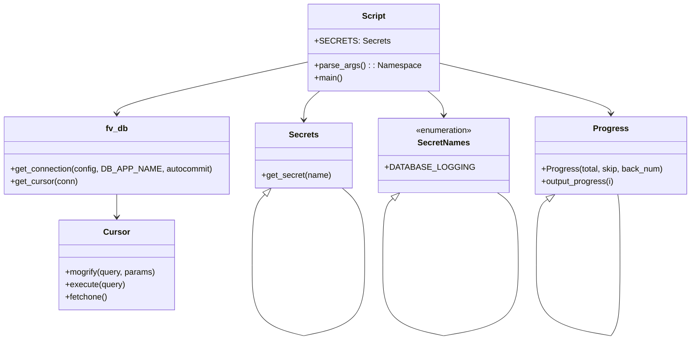

# Diagram: common/monitoring/scripts/populate_keys.py


> Auto-generated by Obscura crawlers

## Diagram 1

```mermaid
flowchart TD
  Start([Start]) --> ParseArgs["parse_args()"]
  ParseArgs --> Args["args"]
  Args --> GetSecret["SECRETS.get_secret(SecretNames.DATABASE_LOGGING)"]
  GetSecret --> GetConn["fv.db.get_connection(config, DB_APP_NAME=\"populate_keys\", autocommit=True)"]
  GetConn --> WithConn["with conn as conn"]
  WithConn --> GetCursor["fv.db.get_cursor(conn)"]
  GetCursor --> WithCursor["with cursor as cursor"]
  WithCursor --> CheckStage["Check AWS_STAGE"]
  CheckStage -->|staging or test| StagingCalc["total = ceil(14 days / interval)"]
  CheckStage -->|prod-b| ProdCalc["total = ceil(3 months / interval)"]
  CheckStage -->|other| Exit["exit(stage invalid)"]
  StagingCalc --> ProgInit["prog = Progress.Progress(total, skip=3, back_num=100)"]
  ProdCalc --> ProgInit
  ProgInit --> LoopStart["for i in range(total)"]
  LoopStart --> OutputProg["prog.output_progress(i)"]
  OutputProg --> ComputeBegin["begin = end - timedelta(seconds=args.interval)"]
  ComputeBegin --> BuildQuery["cursor.mogrify(...) -> query"]
  BuildQuery --> Execute["cursor.execute(query)"]
  Execute --> Fetch["res = cursor.fetchone()"]
  Fetch --> UpdateEnd["end = begin"]
  UpdateEnd --> LoopEnd{"i < total-1?"}
  LoopEnd -->|yes| LoopStart
  LoopEnd -->|no| Commit["context exit -> commit/close"]
  Commit --> End([End])
```

> SVG rendering failed for this diagram.

## Diagram 2



### SVG

<svg id="container" width="1296.7265625" xmlns="http://www.w3.org/2000/svg" class="classDiagram" height="658.1499633789062" viewBox="0 0 1296.7265625 658.1499633789062" role="graphics-document document" aria-roledescription="class"><style>#container{font-family:"trebuchet ms",verdana,arial,sans-serif;font-size:16px;fill:#333;}@keyframes edge-animation-frame{from{stroke-dashoffset:0;}}@keyframes dash{to{stroke-dashoffset:0;}}#container .edge-animation-slow{stroke-dasharray:9,5!important;stroke-dashoffset:900;animation:dash 50s linear infinite;stroke-linecap:round;}#container .edge-animation-fast{stroke-dasharray:9,5!important;stroke-dashoffset:900;animation:dash 20s linear infinite;stroke-linecap:round;}#container .error-icon{fill:#552222;}#container .error-text{fill:#552222;stroke:#552222;}#container .edge-thickness-normal{stroke-width:1px;}#container .edge-thickness-thick{stroke-width:3.5px;}#container .edge-pattern-solid{stroke-dasharray:0;}#container .edge-thickness-invisible{stroke-width:0;fill:none;}#container .edge-pattern-dashed{stroke-dasharray:3;}#container .edge-pattern-dotted{stroke-dasharray:2;}#container .marker{fill:#333333;stroke:#333333;}#container .marker.cross{stroke:#333333;}#container svg{font-family:"trebuchet ms",verdana,arial,sans-serif;font-size:16px;}#container p{margin:0;}#container g.classGroup text{fill:#9370DB;stroke:none;font-family:"trebuchet ms",verdana,arial,sans-serif;font-size:10px;}#container g.classGroup text .title{font-weight:bolder;}#container .nodeLabel,#container .edgeLabel{color:#131300;}#container .edgeLabel .label rect{fill:#ECECFF;}#container .label text{fill:#131300;}#container .labelBkg{background:#ECECFF;}#container .edgeLabel .label span{background:#ECECFF;}#container .classTitle{font-weight:bolder;}#container .node rect,#container .node circle,#container .node ellipse,#container .node polygon,#container .node path{fill:#ECECFF;stroke:#9370DB;stroke-width:1px;}#container .divider{stroke:#9370DB;stroke-width:1;}#container g.clickable{cursor:pointer;}#container g.classGroup rect{fill:#ECECFF;stroke:#9370DB;}#container g.classGroup line{stroke:#9370DB;stroke-width:1;}#container .classLabel .box{stroke:none;stroke-width:0;fill:#ECECFF;opacity:0.5;}#container .classLabel .label{fill:#9370DB;font-size:10px;}#container .relation{stroke:#333333;stroke-width:1;fill:none;}#container .dashed-line{stroke-dasharray:3;}#container .dotted-line{stroke-dasharray:1 2;}#container #compositionStart,#container .composition{fill:#333333!important;stroke:#333333!important;stroke-width:1;}#container #compositionEnd,#container .composition{fill:#333333!important;stroke:#333333!important;stroke-width:1;}#container #dependencyStart,#container .dependency{fill:#333333!important;stroke:#333333!important;stroke-width:1;}#container #dependencyStart,#container .dependency{fill:#333333!important;stroke:#333333!important;stroke-width:1;}#container #extensionStart,#container .extension{fill:transparent!important;stroke:#333333!important;stroke-width:1;}#container #extensionEnd,#container .extension{fill:transparent!important;stroke:#333333!important;stroke-width:1;}#container #aggregationStart,#container .aggregation{fill:transparent!important;stroke:#333333!important;stroke-width:1;}#container #aggregationEnd,#container .aggregation{fill:transparent!important;stroke:#333333!important;stroke-width:1;}#container #lollipopStart,#container .lollipop{fill:#ECECFF!important;stroke:#333333!important;stroke-width:1;}#container #lollipopEnd,#container .lollipop{fill:#ECECFF!important;stroke:#333333!important;stroke-width:1;}#container .edgeTerminals{font-size:11px;line-height:initial;}#container .classTitleText{text-anchor:middle;font-size:18px;fill:#333;}#container .label-icon{display:inline-block;height:1em;overflow:visible;vertical-align:-0.125em;}#container .node .label-icon path{fill:currentColor;stroke:revert;stroke-width:revert;}#container :root{--mermaid-font-family:"trebuchet ms",verdana,arial,sans-serif;}</style><g><defs><marker id="container_class-aggregationStart" class="marker aggregation class" refX="18" refY="7" markerWidth="190" markerHeight="240" orient="auto"><path d="M 18,7 L9,13 L1,7 L9,1 Z"></path></marker></defs><defs><marker id="container_class-aggregationEnd" class="marker aggregation class" refX="1" refY="7" markerWidth="20" markerHeight="28" orient="auto"><path d="M 18,7 L9,13 L1,7 L9,1 Z"></path></marker></defs><defs><marker id="container_class-extensionStart" class="marker extension class" refX="18" refY="7" markerWidth="190" markerHeight="240" orient="auto"><path d="M 1,7 L18,13 V 1 Z"></path></marker></defs><defs><marker id="container_class-extensionEnd" class="marker extension class" refX="1" refY="7" markerWidth="20" markerHeight="28" orient="auto"><path d="M 1,1 V 13 L18,7 Z"></path></marker></defs><defs><marker id="container_class-compositionStart" class="marker composition class" refX="18" refY="7" markerWidth="190" markerHeight="240" orient="auto"><path d="M 18,7 L9,13 L1,7 L9,1 Z"></path></marker></defs><defs><marker id="container_class-compositionEnd" class="marker composition class" refX="1" refY="7" markerWidth="20" markerHeight="28" orient="auto"><path d="M 18,7 L9,13 L1,7 L9,1 Z"></path></marker></defs><defs><marker id="container_class-dependencyStart" class="marker dependency class" refX="6" refY="7" markerWidth="190" markerHeight="240" orient="auto"><path d="M 5,7 L9,13 L1,7 L9,1 Z"></path></marker></defs><defs><marker id="container_class-dependencyEnd" class="marker dependency class" refX="13" refY="7" markerWidth="20" markerHeight="28" orient="auto"><path d="M 18,7 L9,13 L14,7 L9,1 Z"></path></marker></defs><defs><marker id="container_class-lollipopStart" class="marker lollipop class" refX="13" refY="7" markerWidth="190" markerHeight="240" orient="auto"><circle stroke="black" fill="transparent" cx="7" cy="7" r="6"></circle></marker></defs><defs><marker id="container_class-lollipopEnd" class="marker lollipop class" refX="1" refY="7" markerWidth="190" markerHeight="240" orient="auto"><circle stroke="black" fill="transparent" cx="7" cy="7" r="6"></circle></marker></defs><g class="root"><g class="clusters"></g><g class="edgePaths"><path d="M604.711,176L599.776,180.167C594.842,184.333,584.974,192.667,580.04,202C575.105,211.333,575.105,221.667,575.105,226.833L575.105,232" id="id_Script_Secrets_1" class="edge-thickness-normal edge-pattern-solid relation" style=";;;" data-edge="true" data-et="edge" data-id="id_Script_Secrets_1" data-points="W3sieCI6NjA0LjcxMDU0MzI5MTI4NDUsInkiOjE3Nn0seyJ4Ijo1NzUuMTA1NDY4NzUsInkiOjIwMX0seyJ4Ijo1NzUuMTA1NDY4NzUsInkiOjIzOH1d" marker-end="url(#container_class-dependencyEnd)"></path><path d="M803.657,176L808.591,180.167C813.525,184.333,823.393,192.667,828.328,200.5C833.262,208.333,833.262,215.667,833.262,219.333L833.262,223" id="id_Script_SecretNames_2" class="edge-thickness-normal edge-pattern-solid relation" style=";;;" data-edge="true" data-et="edge" data-id="id_Script_SecretNames_2" data-points="W3sieCI6ODAzLjY1NjY0NDIwODcxNTUsInkiOjE3Nn0seyJ4Ijo4MzMuMjYxNzE4NzUsInkiOjIwMX0seyJ4Ijo4MzMuMjYxNzE4NzUsInkiOjIyOX1d" marker-end="url(#container_class-dependencyEnd)"></path><path d="M581.031,119.742L520.912,133.285C460.793,146.828,340.555,173.914,280.436,190.624C220.316,207.333,220.316,213.667,220.316,216.833L220.316,220" id="id_Script_fv_db_3" class="edge-thickness-normal edge-pattern-solid relation" style=";;;" data-edge="true" data-et="edge" data-id="id_Script_fv_db_3" data-points="W3sieCI6NTgxLjAzMTI1LCJ5IjoxMTkuNzQyMzM0NzA1NzM5ODl9LHsieCI6MjIwLjMxNjQwNjI1LCJ5IjoyMDF9LHsieCI6MjIwLjMxNjQwNjI1LCJ5IjoyMjZ9XQ==" marker-end="url(#container_class-dependencyEnd)"></path><path d="M827.336,122.532L880.086,135.61C932.836,148.688,1038.336,174.844,1091.086,191.089C1143.836,207.333,1143.836,213.667,1143.836,216.833L1143.836,220" id="id_Script_Progress_4" class="edge-thickness-normal edge-pattern-solid relation" style=";;;" data-edge="true" data-et="edge" data-id="id_Script_Progress_4" data-points="W3sieCI6ODI3LjMzNTkzNzUsInkiOjEyMi41MzIzMTg2ODIxOTc0fSx7IngiOjExNDMuODM1OTM3NSwieSI6MjAxfSx7IngiOjExNDMuODM1OTM3NSwieSI6MjI2fV0=" marker-end="url(#container_class-dependencyEnd)"></path><path d="M220.316,376L220.316,380.167C220.316,384.333,220.316,392.667,220.316,400C220.316,407.333,220.316,413.667,220.316,416.833L220.316,420" id="id_fv_db_Cursor_5" class="edge-thickness-normal edge-pattern-solid relation" style=";;;" data-edge="true" data-et="edge" data-id="id_fv_db_Cursor_5" data-points="W3sieCI6MjIwLjMxNjQwNjI1LCJ5IjozNzZ9LHsieCI6MjIwLjMxNjQwNjI1LCJ5Ijo0MDF9LHsieCI6MjIwLjMxNjQwNjI1LCJ5Ijo0MjZ9XQ==" marker-end="url(#container_class-dependencyEnd)"></path><path d="M1026.554,386.133L1023.141,388.611C1019.728,391.089,1012.901,396.044,1009.487,417.181C1006.074,438.317,1006.074,475.633,1006.074,494.292L1006.074,512.95" id="Progress-cyclic-special-1" class="edge-thickness-normal edge-pattern-solid relation" style=";;;" data-edge="true" data-et="edge" data-id="Progress-cyclic-special-1" data-points="W3sieCI6MTA0MC41MTQzNTU0NjkwMjk0LCJ5IjozNzZ9LHsieCI6MTAwNi4wNzM4MjgxMjUzNzI1LCJ5Ijo0MDF9LHsieCI6MTAwNi4wNzM4MjgxMjUzNzI1LCJ5Ijo1MTIuOTQ5OTk5OTk5MjU0OX1d" marker-start="url(#container_class-extensionStart)"></path><path d="M1006.074,513.05L1006.074,531.708C1006.074,550.367,1006.074,587.683,1029.026,610.515C1051.978,633.347,1097.882,641.694,1120.834,645.867L1143.786,650.041" id="Progress-cyclic-special-mid" class="edge-thickness-normal edge-pattern-solid relation" style=";;;" data-edge="true" data-et="edge" data-id="Progress-cyclic-special-mid" data-points="W3sieCI6MTAwNi4wNzM4MjgxMjUzNzI1LCJ5Ijo1MTMuMDUwMDAwMDAwNzQ1MX0seyJ4IjoxMDA2LjA3MzgyODEyNTM3MjUsInkiOjYyNX0seyJ4IjoxMTQzLjc4NTkzNzQ5OTI1NSwieSI6NjUwLjA0MDkwODI0MDg2NzJ9XQ=="></path><path d="M1143.871,650L1146.786,645.833C1149.701,641.667,1155.531,633.333,1158.446,610.5C1161.361,587.667,1161.361,550.333,1161.361,513C1161.361,475.667,1161.361,438.333,1160.631,415.5C1159.901,392.667,1158.44,384.333,1157.71,380.167L1156.98,376" id="Progress-cyclic-special-2" class="edge-thickness-normal edge-pattern-solid relation" style=";;;" data-edge="true" data-et="edge" data-id="Progress-cyclic-special-2" data-points="W3sieCI6MTE0My44NzA5MTc1NDA0NDEsInkiOjY1MH0seyJ4IjoxMTYxLjM2MDkzNzUwMDM3MjUsInkiOjYyNX0seyJ4IjoxMTYxLjM2MDkzNzUwMDM3MjUsInkiOjUxM30seyJ4IjoxMTYxLjM2MDkzNzUwMDM3MjUsInkiOjQwMX0seyJ4IjoxMTU2Ljk3OTY4NzUwMDI3OTQsInkiOjM3Nn1d"></path><path d="M502.458,376.424L498.513,380.52C494.567,384.616,486.677,392.808,482.732,415.562C478.787,438.317,478.787,475.633,478.787,494.292L478.787,512.95" id="Secrets-cyclic-special-1" class="edge-thickness-normal edge-pattern-solid relation" style=";;;" data-edge="true" data-et="edge" data-id="Secrets-cyclic-special-1" data-points="W3sieCI6NTE0LjQyNDY1NjI1MDIzNDYsInkiOjM2NH0seyJ4Ijo0NzguNzg2NzE4NzUwMzcyNTMsInkiOjQwMX0seyJ4Ijo0NzguNzg2NzE4NzUwMzcyNTMsInkiOjUxMi45NDk5OTk5OTkyNTQ5fV0=" marker-start="url(#container_class-extensionStart)"></path><path d="M478.787,513.05L478.787,531.708C478.787,550.367,478.787,587.683,494.832,610.514C510.876,633.346,542.966,641.691,559.011,645.864L575.055,650.037" id="Secrets-cyclic-special-mid" class="edge-thickness-normal edge-pattern-solid relation" style=";;;" data-edge="true" data-et="edge" data-id="Secrets-cyclic-special-mid" data-points="W3sieCI6NDc4Ljc4NjcxODc1MDM3MjUzLCJ5Ijo1MTMuMDUwMDAwMDAwNzQ1MX0seyJ4Ijo0NzguNzg2NzE4NzUwMzcyNTMsInkiOjYyNX0seyJ4Ijo1NzUuMDU1NDY4NzQ5MjU0OSwieSI6NjUwLjAzNjk5NjMwMTg5NDF9XQ=="></path><path d="M575.155,650.039L593.739,645.866C612.323,641.693,649.491,633.346,668.075,610.506C686.659,587.667,686.659,550.333,686.659,513C686.659,475.667,686.659,438.333,679.779,413.5C672.9,388.667,659.142,376.333,652.263,370.167L645.384,364" id="Secrets-cyclic-special-2" class="edge-thickness-normal edge-pattern-solid relation" style=";;;" data-edge="true" data-et="edge" data-id="Secrets-cyclic-special-2" data-points="W3sieCI6NTc1LjE1NTQ2ODc1MDc0NTEsInkiOjY1MC4wMzg3NzIxNjYzMDU1fSx7IngiOjY4Ni42NTg1OTM3NDk2Mjc1LCJ5Ijo2MjV9LHsieCI6Njg2LjY1ODU5Mzc0OTYyNzUsInkiOjUxM30seyJ4Ijo2ODYuNjU4NTkzNzQ5NjI3NSwieSI6NDAxfSx7IngiOjY0NS4zODM5Mzc0OTk3NjU0LCJ5IjozNjR9XQ=="></path><path d="M740.099,384.514L737.034,387.262C733.969,390.01,727.839,395.505,724.774,416.911C721.709,438.317,721.709,475.633,721.709,494.292L721.709,512.95" id="SecretNames-cyclic-special-1" class="edge-thickness-normal edge-pattern-solid relation" style=";;;" data-edge="true" data-et="edge" data-id="SecretNames-cyclic-special-1" data-points="W3sieCI6NzUyLjk0MzQ2ODc1MDI2ODMsInkiOjM3M30seyJ4Ijo3MjEuNzA4NTkzNzUwMzcyNSwieSI6NDAxfSx7IngiOjcyMS43MDg1OTM3NTAzNzI1LCJ5Ijo1MTIuOTQ5OTk5OTk5MjU0OX1d" marker-start="url(#container_class-extensionStart)"></path><path d="M721.709,513.05L721.709,531.708C721.709,550.367,721.709,587.683,740.292,610.515C758.876,633.346,796.044,641.693,814.628,645.866L833.212,650.039" id="SecretNames-cyclic-special-mid" class="edge-thickness-normal edge-pattern-solid relation" style=";;;" data-edge="true" data-et="edge" data-id="SecretNames-cyclic-special-mid" data-points="W3sieCI6NzIxLjcwODU5Mzc1MDM3MjUsInkiOjUxMy4wNTAwMDAwMDA3NDUxfSx7IngiOjcyMS43MDg1OTM3NTAzNzI1LCJ5Ijo2MjV9LHsieCI6ODMzLjIxMTcxODc0OTI1NDksInkiOjY1MC4wMzg3NzIxNjYzMDU1fV0="></path><path d="M833.312,650.041L856.264,645.867C879.216,641.694,925.12,633.347,948.072,610.507C971.024,587.667,971.024,550.333,971.024,513C971.024,475.667,971.024,438.333,964.595,415C958.166,391.667,945.308,382.333,938.879,377.667L932.45,373" id="SecretNames-cyclic-special-2" class="edge-thickness-normal edge-pattern-solid relation" style=";;;" data-edge="true" data-et="edge" data-id="SecretNames-cyclic-special-2" data-points="W3sieCI6ODMzLjMxMTcxODc1MDc0NTEsInkiOjY1MC4wNDA5MDgyNDA4NjcyfSx7IngiOjk3MS4wMjM4MjgxMjQ2Mjc1LCJ5Ijo2MjV9LHsieCI6OTcxLjAyMzgyODEyNDYyNzUsInkiOjUxM30seyJ4Ijo5NzEuMDIzODI4MTI0NjI3NSwieSI6NDAxfSx7IngiOjkzMi40NTA0Mzc0OTk3MzE4LCJ5IjozNzN9XQ=="></path></g><g class="edgeLabels"><g class="edgeLabel"><g class="label" data-id="id_Script_Secrets_1" transform="translate(0, 0)"><foreignObject width="0" height="0"><div xmlns="http://www.w3.org/1999/xhtml" class="labelBkg" style="display: table-cell; white-space: nowrap; line-height: 1.5; max-width: 200px; text-align: center;"><span class="edgeLabel"></span></div></foreignObject></g></g><g class="edgeLabel"><g class="label" data-id="id_Script_SecretNames_2" transform="translate(0, 0)"><foreignObject width="0" height="0"><div xmlns="http://www.w3.org/1999/xhtml" class="labelBkg" style="display: table-cell; white-space: nowrap; line-height: 1.5; max-width: 200px; text-align: center;"><span class="edgeLabel"></span></div></foreignObject></g></g><g class="edgeLabel"><g class="label" data-id="id_Script_fv_db_3" transform="translate(0, 0)"><foreignObject width="0" height="0"><div xmlns="http://www.w3.org/1999/xhtml" class="labelBkg" style="display: table-cell; white-space: nowrap; line-height: 1.5; max-width: 200px; text-align: center;"><span class="edgeLabel"></span></div></foreignObject></g></g><g class="edgeLabel"><g class="label" data-id="id_Script_Progress_4" transform="translate(0, 0)"><foreignObject width="0" height="0"><div xmlns="http://www.w3.org/1999/xhtml" class="labelBkg" style="display: table-cell; white-space: nowrap; line-height: 1.5; max-width: 200px; text-align: center;"><span class="edgeLabel"></span></div></foreignObject></g></g><g class="edgeLabel"><g class="label" data-id="id_fv_db_Cursor_5" transform="translate(0, 0)"><foreignObject width="0" height="0"><div xmlns="http://www.w3.org/1999/xhtml" class="labelBkg" style="display: table-cell; white-space: nowrap; line-height: 1.5; max-width: 200px; text-align: center;"><span class="edgeLabel"></span></div></foreignObject></g></g><g class="edgeLabel"><g class="label" data-id="Progress-cyclic-special-1" transform="translate(0, 0)"><foreignObject width="0" height="0"><div xmlns="http://www.w3.org/1999/xhtml" class="labelBkg" style="display: table-cell; white-space: nowrap; line-height: 1.5; max-width: 200px; text-align: center;"><span class="edgeLabel"></span></div></foreignObject></g></g><g class="edgeLabel"><g class="label" data-id="Progress-cyclic-special-mid" transform="translate(0, 0)"><foreignObject width="0" height="0"><div xmlns="http://www.w3.org/1999/xhtml" class="labelBkg" style="display: table-cell; white-space: nowrap; line-height: 1.5; max-width: 200px; text-align: center;"><span class="edgeLabel"></span></div></foreignObject></g></g><g class="edgeLabel"><g class="label" data-id="Progress-cyclic-special-2" transform="translate(0, 0)"><foreignObject width="0" height="0"><div xmlns="http://www.w3.org/1999/xhtml" class="labelBkg" style="display: table-cell; white-space: nowrap; line-height: 1.5; max-width: 200px; text-align: center;"><span class="edgeLabel"></span></div></foreignObject></g></g><g class="edgeLabel"><g class="label" data-id="Secrets-cyclic-special-1" transform="translate(0, 0)"><foreignObject width="0" height="0"><div xmlns="http://www.w3.org/1999/xhtml" class="labelBkg" style="display: table-cell; white-space: nowrap; line-height: 1.5; max-width: 200px; text-align: center;"><span class="edgeLabel"></span></div></foreignObject></g></g><g class="edgeLabel"><g class="label" data-id="Secrets-cyclic-special-mid" transform="translate(0, 0)"><foreignObject width="0" height="0"><div xmlns="http://www.w3.org/1999/xhtml" class="labelBkg" style="display: table-cell; white-space: nowrap; line-height: 1.5; max-width: 200px; text-align: center;"><span class="edgeLabel"></span></div></foreignObject></g></g><g class="edgeLabel"><g class="label" data-id="Secrets-cyclic-special-2" transform="translate(0, 0)"><foreignObject width="0" height="0"><div xmlns="http://www.w3.org/1999/xhtml" class="labelBkg" style="display: table-cell; white-space: nowrap; line-height: 1.5; max-width: 200px; text-align: center;"><span class="edgeLabel"></span></div></foreignObject></g></g><g class="edgeLabel"><g class="label" data-id="SecretNames-cyclic-special-1" transform="translate(0, 0)"><foreignObject width="0" height="0"><div xmlns="http://www.w3.org/1999/xhtml" class="labelBkg" style="display: table-cell; white-space: nowrap; line-height: 1.5; max-width: 200px; text-align: center;"><span class="edgeLabel"></span></div></foreignObject></g></g><g class="edgeLabel"><g class="label" data-id="SecretNames-cyclic-special-mid" transform="translate(0, 0)"><foreignObject width="0" height="0"><div xmlns="http://www.w3.org/1999/xhtml" class="labelBkg" style="display: table-cell; white-space: nowrap; line-height: 1.5; max-width: 200px; text-align: center;"><span class="edgeLabel"></span></div></foreignObject></g></g><g class="edgeLabel"><g class="label" data-id="SecretNames-cyclic-special-2" transform="translate(0, 0)"><foreignObject width="0" height="0"><div xmlns="http://www.w3.org/1999/xhtml" class="labelBkg" style="display: table-cell; white-space: nowrap; line-height: 1.5; max-width: 200px; text-align: center;"><span class="edgeLabel"></span></div></foreignObject></g></g></g><g class="nodes"><g class="node default" id="classId-Script-0" transform="translate(704.18359375, 92)"><g class="basic label-container"><path d="M-123.15234375 -84 L123.15234375 -84 L123.15234375 84 L-123.15234375 84" stroke="none" stroke-width="0" fill="#ECECFF" style=""></path><path d="M-123.15234375 -84 C-68.27842016449696 -84, -13.404496578993928 -84, 123.15234375 -84 M-123.15234375 -84 C-70.55970260878959 -84, -17.967061467579185 -84, 123.15234375 -84 M123.15234375 -84 C123.15234375 -18.20842759519354, 123.15234375 47.58314480961292, 123.15234375 84 M123.15234375 -84 C123.15234375 -39.78582937427261, 123.15234375 4.428341251454782, 123.15234375 84 M123.15234375 84 C45.03744212733133 84, -33.07745949533734 84, -123.15234375 84 M123.15234375 84 C58.66857473799766 84, -5.815194274004682 84, -123.15234375 84 M-123.15234375 84 C-123.15234375 26.41995282992921, -123.15234375 -31.160094340141583, -123.15234375 -84 M-123.15234375 84 C-123.15234375 30.035086624656508, -123.15234375 -23.929826750686985, -123.15234375 -84" stroke="#9370DB" stroke-width="1.3" fill="none" stroke-dasharray="0 0" style=""></path></g><g class="annotation-group text" transform="translate(0, -60)"></g><g class="label-group text" transform="translate(-21.7421875, -60)"><g class="label" style="font-weight: bolder" transform="translate(0,-12)"><foreignObject width="43.484375" height="24"><div xmlns="http://www.w3.org/1999/xhtml" style="display: table-cell; white-space: nowrap; line-height: 1.5; max-width: 93px; text-align: center;"><span class="nodeLabel markdown-node-label" style=""><p>Script</p></span></div></foreignObject></g></g><g class="members-group text" transform="translate(-111.15234375, -12)"><g class="label" style="" transform="translate(0,-12)"><foreignObject width="129.140625" height="24"><div xmlns="http://www.w3.org/1999/xhtml" style="display: table-cell; white-space: nowrap; line-height: 1.5; max-width: 187px; text-align: center;"><span class="nodeLabel markdown-node-label" style=""><p>+SECRETS: Secrets</p></span></div></foreignObject></g></g><g class="methods-group text" transform="translate(-111.15234375, 36)"><g class="label" style="" transform="translate(0,-12)"><foreignObject width="200.5625" height="24"><div xmlns="http://www.w3.org/1999/xhtml" style="display: table-cell; white-space: nowrap; line-height: 1.5; max-width: 258px; text-align: center;"><span class="nodeLabel markdown-node-label" style=""><p>+parse_args() : : Namespace</p></span></div></foreignObject></g><g class="label" style="" transform="translate(0,12)"><foreignObject width="54.65625" height="24"><div xmlns="http://www.w3.org/1999/xhtml" style="display: table-cell; white-space: nowrap; line-height: 1.5; max-width: 112px; text-align: center;"><span class="nodeLabel markdown-node-label" style=""><p>+main()</p></span></div></foreignObject></g></g><g class="divider" style=""><path d="M-123.15234375 -36 C-59.39441010510682 -36, 4.363523539786357 -36, 123.15234375 -36 M-123.15234375 -36 C-36.83635126150989 -36, 49.47964122698022 -36, 123.15234375 -36" stroke="#9370DB" stroke-width="1.3" fill="none" stroke-dasharray="0 0" style=""></path></g><g class="divider" style=""><path d="M-123.15234375 12 C-54.881541926447994 12, 13.389259897104012 12, 123.15234375 12 M-123.15234375 12 C-56.52620658484187 12, 10.099930580316254 12, 123.15234375 12" stroke="#9370DB" stroke-width="1.3" fill="none" stroke-dasharray="0 0" style=""></path></g></g><g class="node default" id="classId-Secrets-1" transform="translate(575.10546875, 301)"><g class="basic label-container"><path d="M-92.47265625 -63 L92.47265625 -63 L92.47265625 63 L-92.47265625 63" stroke="none" stroke-width="0" fill="#ECECFF" style=""></path><path d="M-92.47265625 -63 C-20.952862278624195 -63, 50.56693169275161 -63, 92.47265625 -63 M-92.47265625 -63 C-51.1996412573897 -63, -9.9266262647794 -63, 92.47265625 -63 M92.47265625 -63 C92.47265625 -24.44844458651948, 92.47265625 14.103110826961043, 92.47265625 63 M92.47265625 -63 C92.47265625 -14.561527079388014, 92.47265625 33.87694584122397, 92.47265625 63 M92.47265625 63 C52.38140961173639 63, 12.290162973472775 63, -92.47265625 63 M92.47265625 63 C42.35157026906442 63, -7.769515711871165 63, -92.47265625 63 M-92.47265625 63 C-92.47265625 26.49402271774384, -92.47265625 -10.011954564512322, -92.47265625 -63 M-92.47265625 63 C-92.47265625 25.175336458650484, -92.47265625 -12.649327082699031, -92.47265625 -63" stroke="#9370DB" stroke-width="1.3" fill="none" stroke-dasharray="0 0" style=""></path></g><g class="annotation-group text" transform="translate(0, -39)"></g><g class="label-group text" transform="translate(-27.1640625, -39)"><g class="label" style="font-weight: bolder" transform="translate(0,-12)"><foreignObject width="54.328125" height="24"><div xmlns="http://www.w3.org/1999/xhtml" style="display: table-cell; white-space: nowrap; line-height: 1.5; max-width: 103px; text-align: center;"><span class="nodeLabel markdown-node-label" style=""><p>Secrets</p></span></div></foreignObject></g></g><g class="members-group text" transform="translate(-80.47265625, 9)"></g><g class="methods-group text" transform="translate(-80.47265625, 39)"><g class="label" style="" transform="translate(0,-12)"><foreignObject width="133.78125" height="24"><div xmlns="http://www.w3.org/1999/xhtml" style="display: table-cell; white-space: nowrap; line-height: 1.5; max-width: 191px; text-align: center;"><span class="nodeLabel markdown-node-label" style=""><p>+get_secret(name)</p></span></div></foreignObject></g></g><g class="divider" style=""><path d="M-92.47265625 -15 C-20.0025070870347 -15, 52.4676420759306 -15, 92.47265625 -15 M-92.47265625 -15 C-21.393868240227647 -15, 49.684919769544706 -15, 92.47265625 -15" stroke="#9370DB" stroke-width="1.3" fill="none" stroke-dasharray="0 0" style=""></path></g><g class="divider" style=""><path d="M-92.47265625 9 C-19.79010528481726 9, 52.89244568036548 9, 92.47265625 9 M-92.47265625 9 C-38.8475951368929 9, 14.777465976214202 9, 92.47265625 9" stroke="#9370DB" stroke-width="1.3" fill="none" stroke-dasharray="0 0" style=""></path></g></g><g class="node default" id="classId-SecretNames-2" transform="translate(833.26171875, 301)"><g class="basic label-container"><path d="M-115.68359375 -72 L115.68359375 -72 L115.68359375 72 L-115.68359375 72" stroke="none" stroke-width="0" fill="#ECECFF" style=""></path><path d="M-115.68359375 -72 C-39.48942048098766 -72, 36.70475278802468 -72, 115.68359375 -72 M-115.68359375 -72 C-26.20972981442077 -72, 63.26413412115846 -72, 115.68359375 -72 M115.68359375 -72 C115.68359375 -28.63119137439631, 115.68359375 14.737617251207382, 115.68359375 72 M115.68359375 -72 C115.68359375 -15.591624303606842, 115.68359375 40.816751392786315, 115.68359375 72 M115.68359375 72 C65.51133650426465 72, 15.339079258529296 72, -115.68359375 72 M115.68359375 72 C45.53923271748248 72, -24.605128315035046 72, -115.68359375 72 M-115.68359375 72 C-115.68359375 24.148432489121113, -115.68359375 -23.703135021757774, -115.68359375 -72 M-115.68359375 72 C-115.68359375 35.393666944000906, -115.68359375 -1.212666111998189, -115.68359375 -72" stroke="#9370DB" stroke-width="1.3" fill="none" stroke-dasharray="0 0" style=""></path></g><g class="annotation-group text" transform="translate(-55.5546875, -48)"><g class="label" style="" transform="translate(0,-12)"><foreignObject width="111.109375" height="24"><div xmlns="http://www.w3.org/1999/xhtml" style="display: table-cell; white-space: nowrap; line-height: 1.5; max-width: 161px; text-align: center;"><span class="nodeLabel markdown-node-label" style=""><p>«enumeration»</p></span></div></foreignObject></g></g><g class="label-group text" transform="translate(-48.03125, -24)"><g class="label" style="font-weight: bolder" transform="translate(0,-12)"><foreignObject width="96.0625" height="24"><div xmlns="http://www.w3.org/1999/xhtml" style="display: table-cell; white-space: nowrap; line-height: 1.5; max-width: 145px; text-align: center;"><span class="nodeLabel markdown-node-label" style=""><p>SecretNames</p></span></div></foreignObject></g></g><g class="members-group text" transform="translate(-103.68359375, 24)"><g class="label" style="" transform="translate(0,-12)"><foreignObject width="151.8125" height="24"><div xmlns="http://www.w3.org/1999/xhtml" style="display: table-cell; white-space: nowrap; line-height: 1.5; max-width: 209px; text-align: center;"><span class="nodeLabel markdown-node-label" style=""><p>+DATABASE_LOGGING</p></span></div></foreignObject></g></g><g class="methods-group text" transform="translate(-103.68359375, 72)"></g><g class="divider" style=""><path d="M-115.68359375 0 C-43.28065969233599 0, 29.122274365328025 0, 115.68359375 0 M-115.68359375 0 C-49.16897055594623 0, 17.345652638107538 0, 115.68359375 0" stroke="#9370DB" stroke-width="1.3" fill="none" stroke-dasharray="0 0" style=""></path></g><g class="divider" style=""><path d="M-115.68359375 48 C-39.61343528602444 48, 36.45672317795112 48, 115.68359375 48 M-115.68359375 48 C-65.98106641525024 48, -16.27853908050048 48, 115.68359375 48" stroke="#9370DB" stroke-width="1.3" fill="none" stroke-dasharray="0 0" style=""></path></g></g><g class="node default" id="classId-fv_db-3" transform="translate(220.31640625, 301)"><g class="basic label-container"><path d="M-212.31640625 -75 L212.31640625 -75 L212.31640625 75 L-212.31640625 75" stroke="none" stroke-width="0" fill="#ECECFF" style=""></path><path d="M-212.31640625 -75 C-51.757342702651044 -75, 108.80172084469791 -75, 212.31640625 -75 M-212.31640625 -75 C-84.2039853644298 -75, 43.908435521140404 -75, 212.31640625 -75 M212.31640625 -75 C212.31640625 -16.02002135616211, 212.31640625 42.95995728767578, 212.31640625 75 M212.31640625 -75 C212.31640625 -34.14167799245827, 212.31640625 6.71664401508346, 212.31640625 75 M212.31640625 75 C42.65592041698255 75, -127.0045654160349 75, -212.31640625 75 M212.31640625 75 C81.6553130272049 75, -49.005780195590205 75, -212.31640625 75 M-212.31640625 75 C-212.31640625 27.38979528061958, -212.31640625 -20.22040943876084, -212.31640625 -75 M-212.31640625 75 C-212.31640625 37.44809610064714, -212.31640625 -0.10380779870571644, -212.31640625 -75" stroke="#9370DB" stroke-width="1.3" fill="none" stroke-dasharray="0 0" style=""></path></g><g class="annotation-group text" transform="translate(0, -51)"></g><g class="label-group text" transform="translate(-20.2890625, -51)"><g class="label" style="font-weight: bolder" transform="translate(0,-12)"><foreignObject width="40.578125" height="24"><div xmlns="http://www.w3.org/1999/xhtml" style="display: table-cell; white-space: nowrap; line-height: 1.5; max-width: 90px; text-align: center;"><span class="nodeLabel markdown-node-label" style=""><p>fv_db</p></span></div></foreignObject></g></g><g class="members-group text" transform="translate(-200.31640625, -3)"></g><g class="methods-group text" transform="translate(-200.31640625, 27)"><g class="label" style="" transform="translate(0,-12)"><foreignObject width="380.34375" height="24"><div xmlns="http://www.w3.org/1999/xhtml" style="display: table-cell; white-space: nowrap; line-height: 1.5; max-width: 438px; text-align: center;"><span class="nodeLabel markdown-node-label" style=""><p>+get_connection(config, DB_APP_NAME, autocommit)</p></span></div></foreignObject></g><g class="label" style="" transform="translate(0,12)"><foreignObject width="130.078125" height="24"><div xmlns="http://www.w3.org/1999/xhtml" style="display: table-cell; white-space: nowrap; line-height: 1.5; max-width: 187px; text-align: center;"><span class="nodeLabel markdown-node-label" style=""><p>+get_cursor(conn)</p></span></div></foreignObject></g></g><g class="divider" style=""><path d="M-212.31640625 -27 C-101.93348735384869 -27, 8.44943154230262 -27, 212.31640625 -27 M-212.31640625 -27 C-74.1928742910242 -27, 63.93065766795161 -27, 212.31640625 -27" stroke="#9370DB" stroke-width="1.3" fill="none" stroke-dasharray="0 0" style=""></path></g><g class="divider" style=""><path d="M-212.31640625 -3 C-86.96342165856247 -3, 38.389562932875066 -3, 212.31640625 -3 M-212.31640625 -3 C-81.45331192456729 -3, 49.409782400865424 -3, 212.31640625 -3" stroke="#9370DB" stroke-width="1.3" fill="none" stroke-dasharray="0 0" style=""></path></g></g><g class="node default" id="classId-Progress-4" transform="translate(1143.8359375, 301)"><g class="basic label-container"><path d="M-144.890625 -75 L144.890625 -75 L144.890625 75 L-144.890625 75" stroke="none" stroke-width="0" fill="#ECECFF" style=""></path><path d="M-144.890625 -75 C-54.267033932531035 -75, 36.35655713493793 -75, 144.890625 -75 M-144.890625 -75 C-74.33292667630005 -75, -3.775228352600095 -75, 144.890625 -75 M144.890625 -75 C144.890625 -36.8185840088558, 144.890625 1.362831982288398, 144.890625 75 M144.890625 -75 C144.890625 -26.862234546979224, 144.890625 21.275530906041553, 144.890625 75 M144.890625 75 C82.91258312140931 75, 20.93454124281861 75, -144.890625 75 M144.890625 75 C83.37380617077757 75, 21.85698734155514 75, -144.890625 75 M-144.890625 75 C-144.890625 39.25345524359904, -144.890625 3.506910487198084, -144.890625 -75 M-144.890625 75 C-144.890625 44.12389723481786, -144.890625 13.247794469635714, -144.890625 -75" stroke="#9370DB" stroke-width="1.3" fill="none" stroke-dasharray="0 0" style=""></path></g><g class="annotation-group text" transform="translate(0, -51)"></g><g class="label-group text" transform="translate(-31.75, -51)"><g class="label" style="font-weight: bolder" transform="translate(0,-12)"><foreignObject width="63.5" height="24"><div xmlns="http://www.w3.org/1999/xhtml" style="display: table-cell; white-space: nowrap; line-height: 1.5; max-width: 112px; text-align: center;"><span class="nodeLabel markdown-node-label" style=""><p>Progress</p></span></div></foreignObject></g></g><g class="members-group text" transform="translate(-132.890625, -3)"></g><g class="methods-group text" transform="translate(-132.890625, 27)"><g class="label" style="" transform="translate(0,-12)"><foreignObject width="234.03125" height="24"><div xmlns="http://www.w3.org/1999/xhtml" style="display: table-cell; white-space: nowrap; line-height: 1.5; max-width: 291px; text-align: center;"><span class="nodeLabel markdown-node-label" style=""><p>+Progress(total, skip, back_num)</p></span></div></foreignObject></g><g class="label" style="" transform="translate(0,12)"><foreignObject width="142.28125" height="24"><div xmlns="http://www.w3.org/1999/xhtml" style="display: table-cell; white-space: nowrap; line-height: 1.5; max-width: 200px; text-align: center;"><span class="nodeLabel markdown-node-label" style=""><p>+output_progress(i)</p></span></div></foreignObject></g></g><g class="divider" style=""><path d="M-144.890625 -27 C-50.36371897471027 -27, 44.16318705057947 -27, 144.890625 -27 M-144.890625 -27 C-79.63844158391366 -27, -14.386258167827322 -27, 144.890625 -27" stroke="#9370DB" stroke-width="1.3" fill="none" stroke-dasharray="0 0" style=""></path></g><g class="divider" style=""><path d="M-144.890625 -3 C-63.47343244353215 -3, 17.943760112935706 -3, 144.890625 -3 M-144.890625 -3 C-49.45659447848742 -3, 45.977436043025165 -3, 144.890625 -3" stroke="#9370DB" stroke-width="1.3" fill="none" stroke-dasharray="0 0" style=""></path></g></g><g class="node default" id="classId-Cursor-5" transform="translate(220.31640625, 513)"><g class="basic label-container"><path d="M-112.1015625 -87 L112.1015625 -87 L112.1015625 87 L-112.1015625 87" stroke="none" stroke-width="0" fill="#ECECFF" style=""></path><path d="M-112.1015625 -87 C-65.33800766975749 -87, -18.574452839514976 -87, 112.1015625 -87 M-112.1015625 -87 C-52.842422332656696 -87, 6.416717834686608 -87, 112.1015625 -87 M112.1015625 -87 C112.1015625 -48.31783772746928, 112.1015625 -9.635675454938564, 112.1015625 87 M112.1015625 -87 C112.1015625 -32.321903629521714, 112.1015625 22.356192740956573, 112.1015625 87 M112.1015625 87 C27.93949580855076 87, -56.22257088289848 87, -112.1015625 87 M112.1015625 87 C65.83966424160613 87, 19.577765983212245 87, -112.1015625 87 M-112.1015625 87 C-112.1015625 34.96761907072374, -112.1015625 -17.064761858552515, -112.1015625 -87 M-112.1015625 87 C-112.1015625 24.991686666809493, -112.1015625 -37.016626666381015, -112.1015625 -87" stroke="#9370DB" stroke-width="1.3" fill="none" stroke-dasharray="0 0" style=""></path></g><g class="annotation-group text" transform="translate(0, -63)"></g><g class="label-group text" transform="translate(-23.90625, -63)"><g class="label" style="font-weight: bolder" transform="translate(0,-12)"><foreignObject width="47.8125" height="24"><div xmlns="http://www.w3.org/1999/xhtml" style="display: table-cell; white-space: nowrap; line-height: 1.5; max-width: 98px; text-align: center;"><span class="nodeLabel markdown-node-label" style=""><p>Cursor</p></span></div></foreignObject></g></g><g class="members-group text" transform="translate(-100.1015625, -15)"></g><g class="methods-group text" transform="translate(-100.1015625, 15)"><g class="label" style="" transform="translate(0,-12)"><foreignObject width="176.296875" height="24"><div xmlns="http://www.w3.org/1999/xhtml" style="display: table-cell; white-space: nowrap; line-height: 1.5; max-width: 234px; text-align: center;"><span class="nodeLabel markdown-node-label" style=""><p>+mogrify(query, params)</p></span></div></foreignObject></g><g class="label" style="" transform="translate(0,12)"><foreignObject width="115.96875" height="24"><div xmlns="http://www.w3.org/1999/xhtml" style="display: table-cell; white-space: nowrap; line-height: 1.5; max-width: 173px; text-align: center;"><span class="nodeLabel markdown-node-label" style=""><p>+execute(query)</p></span></div></foreignObject></g><g class="label" style="" transform="translate(0,36)"><foreignObject width="82.046875" height="24"><div xmlns="http://www.w3.org/1999/xhtml" style="display: table-cell; white-space: nowrap; line-height: 1.5; max-width: 139px; text-align: center;"><span class="nodeLabel markdown-node-label" style=""><p>+fetchone()</p></span></div></foreignObject></g></g><g class="divider" style=""><path d="M-112.1015625 -39 C-39.880279890937615 -39, 32.34100271812477 -39, 112.1015625 -39 M-112.1015625 -39 C-29.209324375826967 -39, 53.68291374834607 -39, 112.1015625 -39" stroke="#9370DB" stroke-width="1.3" fill="none" stroke-dasharray="0 0" style=""></path></g><g class="divider" style=""><path d="M-112.1015625 -15 C-64.61531805917843 -15, -17.129073618356855 -15, 112.1015625 -15 M-112.1015625 -15 C-46.16315839083995 -15, 19.775245718320093 -15, 112.1015625 -15" stroke="#9370DB" stroke-width="1.3" fill="none" stroke-dasharray="0 0" style=""></path></g></g><g class="label edgeLabel" id="Progress---Progress---1" transform="translate(1006.0738281253725, 513)"><rect width="0.1" height="0.1"></rect><g class="label" style="" transform="translate(0, 0)"><rect></rect><foreignObject width="0" height="0"><div xmlns="http://www.w3.org/1999/xhtml" style="display: table-cell; white-space: nowrap; line-height: 1.5; max-width: 10px; text-align: center;"><span class="nodeLabel"></span></div></foreignObject></g></g><g class="label edgeLabel" id="Progress---Progress---2" transform="translate(1143.8359375, 650.0500000007451)"><rect width="0.1" height="0.1"></rect><g class="label" style="" transform="translate(0, 0)"><rect></rect><foreignObject width="0" height="0"><div xmlns="http://www.w3.org/1999/xhtml" style="display: table-cell; white-space: nowrap; line-height: 1.5; max-width: 10px; text-align: center;"><span class="nodeLabel"></span></div></foreignObject></g></g><g class="label edgeLabel" id="Secrets---Secrets---1" transform="translate(478.78671875037253, 513)"><rect width="0.1" height="0.1"></rect><g class="label" style="" transform="translate(0, 0)"><rect></rect><foreignObject width="0" height="0"><div xmlns="http://www.w3.org/1999/xhtml" style="display: table-cell; white-space: nowrap; line-height: 1.5; max-width: 10px; text-align: center;"><span class="nodeLabel"></span></div></foreignObject></g></g><g class="label edgeLabel" id="Secrets---Secrets---2" transform="translate(575.10546875, 650.0500000007451)"><rect width="0.1" height="0.1"></rect><g class="label" style="" transform="translate(0, 0)"><rect></rect><foreignObject width="0" height="0"><div xmlns="http://www.w3.org/1999/xhtml" style="display: table-cell; white-space: nowrap; line-height: 1.5; max-width: 10px; text-align: center;"><span class="nodeLabel"></span></div></foreignObject></g></g><g class="label edgeLabel" id="SecretNames---SecretNames---1" transform="translate(721.7085937503725, 513)"><rect width="0.1" height="0.1"></rect><g class="label" style="" transform="translate(0, 0)"><rect></rect><foreignObject width="0" height="0"><div xmlns="http://www.w3.org/1999/xhtml" style="display: table-cell; white-space: nowrap; line-height: 1.5; max-width: 10px; text-align: center;"><span class="nodeLabel"></span></div></foreignObject></g></g><g class="label edgeLabel" id="SecretNames---SecretNames---2" transform="translate(833.26171875, 650.0500000007451)"><rect width="0.1" height="0.1"></rect><g class="label" style="" transform="translate(0, 0)"><rect></rect><foreignObject width="0" height="0"><div xmlns="http://www.w3.org/1999/xhtml" style="display: table-cell; white-space: nowrap; line-height: 1.5; max-width: 10px; text-align: center;"><span class="nodeLabel"></span></div></foreignObject></g></g></g></g></g></svg>
